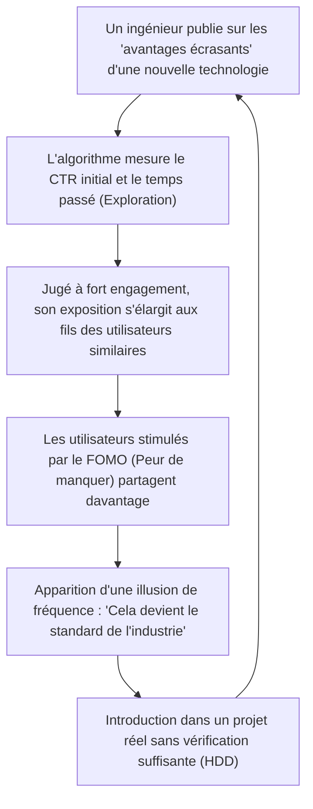

## 1. Introduction : La démocratisation de l'information technologique et la montée des algorithmes

Dans l'ingénierie logicielle moderne, la plupart des informations technologiques que nous consommons quotidiennement passent par les réseaux sociaux (SNS) ou les agrégateurs de nouvelles tels que X (anciennement Twitter), Hacker News, Reddit et LinkedIn. Il fut un temps où nous collections l'information de manière autonome et chronologique via des listes de diffusion, des blogs gérés par des experts spécifiques ou des lecteurs RSS. Cependant, avec l'augmentation explosive des frameworks et des outils créés chaque jour, il est devenu courant de s'en remettre aux "algorithmes de recommandation" (Recommendation Algorithms) fournis par les plateformes pour trier l'information, afin d'optimiser nos ressources cognitives limitées (temps disponible et capacité d'attention).

Ce changement de paradigme a apporté d'immenses avantages, comme la possibilité de découvrir efficacement des articles techniques utiles et des projets open-source révolutionnaires. Cependant, d'un autre côté, il a également provoqué des effets secondaires très graves. C'est le fait que **"les tendances technologiques et les meilleures pratiques que nous voyons sont faussées par la 'fonction d'optimisation de l'engagement' de l'algorithme, plutôt que par une supériorité technique pure ou une évaluation objective"**.

Dans cet article, nous décortiquerons mathématiquement et structurellement comment les algorithmes d'apprentissage automatique avancés fonctionnant en arrière-plan des réseaux sociaux façonnent notre perception et influencent notre prise de décision dans les choix technologiques. De plus, nous examinerons en profondeur les dangers du "Hype Driven Development (HDD : Développement piloté par la hype)", qui nous laisse emporter par l'enthousiasme généré par les algorithmes, ainsi que des approches concrètes pour s'en affranchir et faire des choix technologiques objectifs et solides.

---

## 2. Évolution et mécanismes des algorithmes de recommandation

Lorsque nous ouvrons un réseau social, le contenu qui apparaît dans notre fil d'actualité (feed) n'est pas aléatoire. Il y a des modèles d'apprentissage automatique hautement optimisés pour maximiser le temps passé par les utilisateurs et améliorer les revenus publicitaires. Commençons par examiner les technologies fondamentales qui sous-tendent ces modèles.

### 2.1 Filtrage collaboratif (Collaborative Filtering) et factorisation de matrices

Le "filtrage collaboratif" agit comme une ligne de base solide depuis les débuts des systèmes de recommandation jusqu'à aujourd'hui. En particulier, la "factorisation de matrices" (Matrix Factorization), qui représente les interactions entre les utilisateurs et les éléments (publications ou articles) sous forme de matrice et les mappe vers un espace de caractéristiques latentes, est largement utilisée.

Soit $R \in \mathbb{R}^{M \times N}$ la matrice d'évaluation pour $M$ utilisateurs et $N$ éléments, la factorisation de matrices approxime cette immense matrice creuse par le produit d'une matrice de caractéristiques latentes de faible dimension $U \in \mathbb{R}^{M \times K}$ (caractéristiques utilisateur) et $V \in \mathbb{R}^{N \times K}$ (caractéristiques élément) ($K \ll M, N$).

$$
R \approx U \times V^T
$$

Le score prédit (probabilité d'engagement) $\hat{r}_{ij}$ de l'élément $j$ pour un utilisateur spécifique $i$ est calculé comme le produit scalaire de leurs vecteurs de caractéristiques latentes respectifs.

$$
\hat{r}_{ij} = \mathbf{u}_i \cdot \mathbf{v}_j
$$

Ce modèle est entraîné pour minimiser la fonction de perte suivante ($\lambda$ est un terme de régularisation pour éviter le surapprentissage).

$$
\mathcal{L} = \sum_{(i,j) \in \Omega} (r_{ij} - \mathbf{u}_i \cdot \mathbf{v}_j)^2 + \lambda (\|\mathbf{u}_i\|^2 + \|\mathbf{v}_j\|^2)
$$

**Impact sur la sélection technologique :**
Cet algorithme rapproche "l'utilisateur A intéressé par [Rust](https://kenji.blog/fr/p/webassembly-wasm-current-future/)" et "l'utilisateur B intéressé par [Rust](https://kenji.blog/fr/p/programming-languages-history-paradigm-evolution/)" dans l'espace latent. Si A "aime" une publication sur un nouveau framework Web, il est très probable que cette publication apparaisse également dans le fil d'actualité de B. Cela provoque un phénomène de mode locale autour d'une technologie spécifique au sein d'un groupe d'ingénieurs préférant une stack technologique particulière.

### 2.2 Modèles de recommandation utilisant l'apprentissage profond (DLRM)

Ces dernières années, sous l'impulsion d'entreprises comme Meta ([anciennement Facebook](/fr/p/history-of-meta-facebook/)), les architectures basées sur l'apprentissage profond, représentées par le Deep Learning Recommendation Model (DLRM), se sont répandues. Le DLRM prend en entrée une grande variété de caractéristiques (Features), telles que l'historique de comportement de l'utilisateur et les métadonnées des éléments, pour prédire le taux de clics (CTR : Click-Through Rate) et d'autres indicateurs.

La particularité du DLRM réside dans sa capacité à convertir des caractéristiques catégorielles creuses (ex: ID utilisateur, hashtags suivis) en vecteurs denses (Dense Vectors) via des "tables de plongement (Embedding Tables)", et à les combiner avec des caractéristiques denses à valeurs continues (ex: nombre de jours depuis la création du compte, temps moyen passé par le passé).

$$
\mathbf{e}_{\text{sparse}} = \text{EmbeddingLookup}(\mathbf{x}_{\text{sparse}})
$$
$$
\mathbf{h}_{\text{dense}} = \text{BottomMLP}(\mathbf{x}_{\text{dense}})
$$

Après avoir été combinées (Concatenate) ou avoir interagi par produit scalaire (Feature Interaction), elles sont introduites dans un perceptron multicouche supérieur (Top MLP), qui produit finalement la probabilité du CTR, etc., via la fonction sigmoïde $\sigma$.

$$
\hat{y} = \sigma(\text{TopMLP}(\text{Interact}(\mathbf{e}_{\text{sparse}}, \mathbf{h}_{\text{dense}})))
$$

**Impact sur la sélection technologique :**
Les modèles massifs tels que le DLRM capturent même les signaux les plus subtils (par exemple, une légère augmentation du temps passé sur une "publication avec vidéo" ou une "publication contenant un buzzword spécifique") et les reflètent dans le score prédit. En conséquence, les informations techniques contenant des "titres provocateurs (ex: 'React est mort', 'La fin des microservices')" ou des "démonstrations visuellement spectaculaires" sont facilement favorisées par l'algorithme.

### 2.3 Apprentissage par renforcement et problème des bandits manchots (Multi-Armed Bandits)

Les systèmes de recommandation doivent constamment explorer les dernières préférences des utilisateurs. C'est ici qu'intervient le problème des "bandits manchots". Il optimise le compromis entre "l'exploitation (Exploitation)" (présenter du contenu de manière sûre sur la base des préférences existantes) et "l'exploration (Exploration)" (découvrir de nouvelles tendances).

Dans l'algorithme représentatif UCB (Upper Confidence Bound), le score pour la sélection du bras (groupe de contenu) $a$ au moment $t$ est calculé comme suit :

$$
a_t = \arg\max_{a} \left( \hat{\mu}_a + c \sqrt{\frac{\ln t}{N_a(t)}} \right)
$$

Où $\hat{\mu}_a$ est la récompense moyenne (taux d'engagement) du bras $a$ jusqu'à présent, $N_a(t)$ est le nombre de fois qu'il a été sélectionné, et $c$ est un paramètre ajustant le degré d'exploration.

**Impact sur la sélection technologique :**
L'algorithme accorde temporairement un bonus d'exploration aux publications concernant des frameworks ou bibliothèques nouvellement apparus (ceux dont le nombre d'essais $N_a(t)$ est faible), les exposant à un groupe d'utilisateurs aléatoires. Si les réactions des influenceurs sont bonnes lors de cette "phase d'exploration" initiale, $\hat{\mu}_a$ augmente rapidement, se transformant instantanément en buzz (viralité). C'est le mécanisme par lequel "soudain, tout le monde se met à parler de cette technologie".

---

## 3. Les mathématiques de la chambre d'écho et de la bulle de filtres

À mesure que l'algorithme s'optimise, l'utilisateur se retrouve entouré uniquement par "des informations qu'il trouve agréables ou qui renforcent ses croyances existantes". C'est le phénomène de la **chambre d'écho (Echo Chamber)** et de la **bulle de filtres (Filter Bubble)**.

En théorie des réseaux, la tendance des personnes similaires à se lier est appelée "homophilie (Homophily)". Dans un graphe $G=(V, E)$, les arêtes (relations de suivi ou propagation de l'information) entre les nœuds (utilisateurs) sont d'autant plus susceptibles de se former que la similarité des attributs est élevée.

Les algorithmes de recommandation des réseaux sociaux accélèrent artificiellement cette homophilie. Par exemple, supposons qu'il existe une communauté d'ingénieurs promouvant "l'architecture [Serverless](https://kenji.blog/fr/p/serverless-architecture-aws-lambda-cold-start/)" et une autre soutenant "le Bare Metal On-Premise". L'algorithme apprend à réduire le poids des liens entre ces différentes communautés (Cross-cutting ties) et à renforcer les liens au sein de la même communauté (car les opinions divergentes provoquent souvent des abandons et risquent de réduire l'engagement. Ou inversement, cela peut susciter un engagement lié à une colère extrême, mais dans le domaine technique, c'est la première option qui a tendance à primer).

En conséquence, il se crée une réalité technique complètement fracturée : sur votre fil d'actualité, il semble que "toutes les entreprises du monde passent au Serverless", tandis que sur le fil de quelqu'un d'autre, il apparaît que "le rapatriement depuis le cloud (Cloud Repatriation) est la tendance mondiale".

---

## 4. Le Hype Driven Development (HDD) engendré par les algorithmes

La combinaison des chambres d'écho et de modèles de recommandation puissants déclenche l'un des plus grands anti-patterns de l'industrie de l'ingénierie : le **Hype Driven Development (Développement piloté par la hype)**. Le HDD est le phénomène par lequel on adopte une nouvelle technologie simplement parce qu'elle "fait le buzz sur les réseaux sociaux" ou qu'elle "est la dernière tendance", sans examiner en profondeur ses véritables avantages, ses compromis et son adéquation avec les exigences commerciales de l'entreprise.

Le diagramme Mermaid suivant montre comment les algorithmes des réseaux sociaux alimentent la boucle de rétroaction du HDD.



Ce qui est effrayant dans cette boucle, c'est que l'**illusion de fréquence (Phénomène Baader-Meinhof)** est intentionnellement provoquée par l'algorithme. Une fois que vous voyez le nom d'une nouvelle bibliothèque de [gestion d'état](/fr/p/state-management-history-redux-context-recoil-zustand/), l'algorithme le capte comme un signal et remplit votre fil de discussions sur cette bibliothèque dès le lendemain. Le cerveau humain perçoit cela à tort comme une "pandémie mondiale".

Le graphique suivant illustre la différence de cycle de vie entre une technologie surmédiatisée (Hype) sur les réseaux sociaux et une technologie sobre et ennuyeuse mais robuste (Boring Technology).

```mermaid
xychart-beta
    title Cycle de vie des technologies et évolution des évaluations
    x-axis ["0 mois, 6 mois, 12 mois, 18 mois, 24 mois, 30 mois, 36 mois"]
    y-axis "Nombre de mentions et niveau d'enthousiasme sur les réseaux sociaux" 0 --> 100
    line [10, 85, 95, 45, 20, 10, 5]
    line [15, 20, 25, 35, 50, 65, 80]
```
*(Note : Dans le graphique ci-dessus, la ligne qui monte et descend rapidement représente la technologie "Hype", tandis que la ligne qui monte lentement et régulièrement représente la "Boring Technology")*

Les technologies "Hypées" font face à des problèmes concrets tels que "manque de documentation", "bugs graves dans les cas extrêmes" ou "épuisement des mainteneurs" 6 à 12 mois après leur introduction, et disparaissent rapidement des réseaux sociaux. Cependant, une fois intégrée dans le système, éliminer la dette technique encourue coûte énormément.

---

## 5. Stratégies de "détachement de l'algorithme" dans la sélection technologique

Alors, sous l'emprise de ces algorithmes, comment pouvons-nous faire des choix technologiques de manière objective et lucide ? Voici quelques stratégies concrètes non pas pour pirater l'algorithme, mais pour en "descendre".

### 5.1 Retour aux sources primaires : Code source et RFC

La défense la plus sûre est de déplacer la source de nos informations de l'agrégation des réseaux sociaux vers les **sources primaires (Primary Sources)**.

1. **Lire le code source :** Au lieu de croire une publication sur un réseau social affirmant que "cette bibliothèque est ultra-rapide", ouvrez plutôt GitHub et vérifiez la complexité de calcul de la logique centrale et le mécanisme d'allocation de la mémoire.
2. **Suivre les RFC (Request for Comments) :** De nombreux projets open-source matures (React, [Rust](https://kenji.blog/fr/p/webassembly-wasm-current-future/), Python, etc.) adoptent le processus RFC lors de l'introduction de nouvelles fonctionnalités. Dans les RFC, "pourquoi cette fonctionnalité est nécessaire", "quels sont les compromis de conception" et "quelles sont les alternatives" sont consignés de manière logique et dépassionnée, sans se soucier de l'engagement algorithmique. C'est là que réside la véritable valeur technique.

### 5.2 Lecture attentive des articles académiques (Academic Papers) et des livres blancs

Pour les choix technologiques fondamentaux tels que les [systèmes distribués](/fr/p/cap-theorem-distributed-systems-tradeoff/), les bases de données ou les architectures de modèles d'apprentissage automatique, vous devriez lire directement les articles publiés dans l'ACM, l'IEEE ou arXiv, ou les livres blancs détaillés publiés par les entreprises (ex : le document Spanner de Google, le document Dynamo d'Amazon), plutôt que des résumés de quelques lignes sur les réseaux sociaux.

Les publications sur les réseaux sociaux sont optimisées pour "capter l'attention des lecteurs", tandis que les articles évalués par des pairs sont optimisés pour "l'exactitude des faits et la reproductibilité". Leurs fonctions d'évaluation sont complètement différentes.

### 5.3 Mise en place de cadres de prise de décision au sein de l'organisation

Pour prévenir le HDD au niveau de l'équipe ou de l'organisation, il est nécessaire de disposer d'un processus qui élimine les intuitions subjectives ou les raisons telles que "Je l'ai vu sur Twitter". L'un des meilleurs exemples est l'adoption de l'**ADR (Architecture Decision Records)**.

Lors de l'introduction d'une nouvelle technologie, les éléments suivants doivent être documentés et soumis à un examen :
* **Context (Contexte) :** Pourquoi une nouvelle technologie est-elle nécessaire ? Quels sont les problèmes actuels ?
* **Decision (Décision) :** Que va-t-on adopter ?
* **Consequences (Conséquences) :** Quels sont les compromis ? (Que sacrifie-t-on pour obtenir quoi ?)

En rendant ce processus obligatoire, nous pouvons transformer la "Hype (l'enthousiasme)" en "Engineering (Ingénierie)".

### 5.4 La philosophie du Boring Technology Club

Dans le monde de la technologie, il existe un mantra célèbre : **"Choose Boring Technology" (Choisissez une technologie ennuyeuse)**. Cela nous enseigne que les jetons d'innovation (les ressources limitées qu'une organisation peut consacrer à de nouvelles technologies inconnues) ne doivent pas être gaspillés dans le choix d'infrastructures ou de frameworks qui ne sont pas directement liés à la valeur fondamentale de l'entreprise.

Les algorithmes des réseaux sociaux aiment la "nouveauté". Cependant, ce qui est nécessaire pour construire un système robuste capable de résister à une utilisation en production, ce sont des technologies "ennuyeuses" (PostgreSQL, [Redis](https://kenji.blog/fr/p/nosql-database-selection-kvs-document-graph-wide-column/), des API REST standards, etc.) qui ont plus de 10 ans de recul et dont les procédures de récupération en cas de panne génèrent des millions de résultats sur Google.

---

## 6. Conclusion : Comment devrions-nous interagir avec la technologie ?

Les algorithmes de recommandation des réseaux sociaux sont des outils puissants qui élargissent nos horizons technologiques et nous font découvrir des communautés fantastiques. Cependant, tant que leur structure interne (factorisation de matrices, DLRM, bandits manchots) aura pour impératif "la maximisation de l'engagement", l'information générée sera inévitablement biaisée.

Nous devons développer une littératie pour traiter les informations qui défilent sur notre fil non pas comme des "faits" ou des "tendances absolues", mais simplement comme un "signal" parmi d'autres.

Sortir de sa chambre d'écho, lire le code source de ses propres mains, suivre les discussions des RFC, décrypter les formules des articles de recherche, et affronter les véritables défis de son propre domaine métier. C'est le seul moyen de pratiquer la véritable ingénierie logicielle sans se laisser engloutir par la vague des algorithmes.


