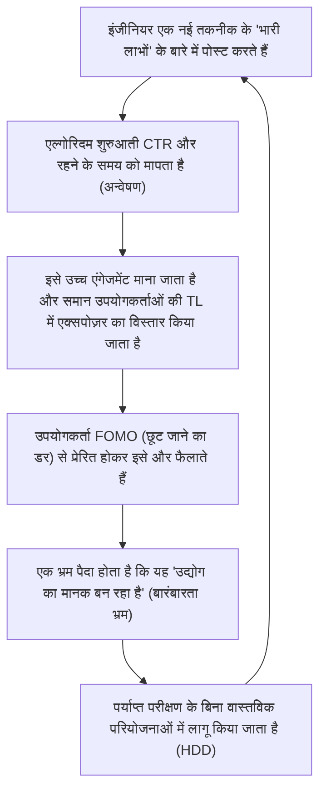

## 1. प्रस्तावना: तकनीकी सूचना का लोकतंत्रीकरण और एल्गोरिदम का उदय

आधुनिक सॉफ्टवेयर इंजीनियरिंग में, हम प्रतिदिन जो तकनीकी जानकारी प्राप्त करते हैं उसका अधिकांश हिस्सा एक्स (पूर्व में ट्विटर), हैकर न्यूज़ (Hacker News), रेडिट (Reddit) और लिंक्डइन (LinkedIn) जैसी सोशल नेटवर्किंग सेवाओं (SNS) और न्यूज़ एग्रीगेटर्स के माध्यम से आता है। एक समय था जब हम मेलिंग लिस्ट, विशेषज्ञ ब्लॉग्स या RSS रीडर्स के माध्यम से स्वतंत्र रूप से और कालानुक्रमिक क्रम में जानकारी एकत्र करते थे। हालांकि, हर दिन बनाए जा रहे फ्रेमवर्क और टूल्स की भारी वृद्धि के साथ, हमारे सीमित संज्ञानात्मक संसाधनों (उपलब्ध समय और ध्यान) को अनुकूलित करने के लिए सूचना को छांटने का काम प्लेटफॉर्म द्वारा प्रदान किए गए "सिफारिश एल्गोरिदम (Recommendation Algorithms)" पर छोड़ना आम हो गया है।

यह प्रतिमान बदलाव (paradigm shift) उपयोगी तकनीकी लेखों और क्रांतिकारी ओपन सोर्स परियोजनाओं को कुशलतापूर्वक खोजने का एक बड़ा लाभ लाया है। लेकिन दूसरी ओर, इसने बेहद गंभीर दुष्प्रभाव भी पैदा किए हैं। वह यह है कि, **"जो तकनीकी रुझान और सर्वोत्तम प्रथाएं हम देखते हैं, वे शुद्ध तकनीकी श्रेष्ठता या वस्तुनिष्ठ मूल्यांकन द्वारा नहीं, बल्कि एल्गोरिदम के 'एंगेजमेंट ऑप्टिमाइज़ेशन फ़ंक्शन' द्वारा विकृत किए गए हैं।"**

इस लेख में, हम गणितीय और संरचनात्मक रूप से यह स्पष्ट करेंगे कि SNS के पीछे चल रहे उन्नत मशीन लर्निंग एल्गोरिदम कैसे हमारी समझ को आकार देते हैं और तकनीक के चयन में हमारे निर्णय लेने को प्रभावित करते हैं। इसके अलावा, हम एल्गोरिदम द्वारा उत्पन्न उत्साह में बहकर होने वाले "हाइप ड्रिवेन डेवलपमेंट (HDD: Hype Driven Development)" के खतरों, और उससे बाहर निकलकर वस्तुनिष्ठ और मजबूत तकनीकी चयन करने के लिए विशिष्ट दृष्टिकोणों पर गहराई से विचार करेंगे।

---

## 2. सिफारिश एल्गोरिदम का विकास और तंत्र

जब हम SNS खोलते हैं, तो टाइमलाइन (फ़ीड) पर प्रदर्शित होने वाली सामग्री यादृच्छिक (random) नहीं होती है। उपयोगकर्ताओं के ठहरने के समय को अधिकतम करने और विज्ञापन राजस्व में सुधार करने के लिए अत्यधिक ट्यून किए गए मशीन लर्निंग मॉडल वहां मौजूद हैं। सबसे पहले, आइए उन तकनीकों को देखें जो इसका आधार बनाती हैं।

### 2.1 कोलैबोरेटिव फ़िल्टरिंग (Collaborative Filtering) और मैट्रिक्स फैक्टराइज़ेशन (Matrix Factorization)

सिफारिश प्रणालियों की शुरुआत से लेकर आज तक जो एक मजबूत आधार के रूप में काम कर रहा है, वह है "कोलैबोरेटिव फ़िल्टरिंग"। विशेष रूप से, उपयोगकर्ताओं और आइटम (पोस्ट या लेख) की अंतःक्रियाओं को एक मैट्रिक्स के रूप में व्यक्त करना और उन्हें एक अव्यक्त (latent) फीचर स्पेस में मैप करना जिसे "मैट्रिक्स फैक्टराइज़ेशन" कहा जाता है, व्यापक रूप से उपयोग किया जाता है।

जब $M$ उपयोगकर्ताओं और $N$ आइटमों का मूल्यांकन मैट्रिक्स $R \in \mathbb{R}^{M \times N}$ होता है, तो मैट्रिक्स फैक्टराइज़ेशन इस विशाल और विरल (sparse) मैट्रिक्स को निम्न-आयामी (low-dimensional) अव्यक्त फीचर मैट्रिक्स $U \in \mathbb{R}^{M \times K}$ (उपयोगकर्ता विशेषताएँ) और $V \in \mathbb{R}^{N \times K}$ (आइटम विशेषताएँ) के गुणनफल में अनुमानित करता है ($K \ll M, N$)।

$$
R \approx U \times V^T
$$

किसी विशिष्ट उपयोगकर्ता $i$ के लिए आइटम $j$ का पूर्वानुमानित स्कोर (एंगेजमेंट की संभावना) $\hat{r}_{ij}$, उनके संबंधित अव्यक्त फीचर वैक्टर के डॉट उत्पाद (dot product) के रूप में गणना की जाती है।

$$
\hat{r}_{ij} = \mathbf{u}_i \cdot \mathbf{v}_j
$$

इस मॉडल को निम्नलिखित हानि फ़ंक्शन (loss function) को कम करने के लिए प्रशिक्षित किया जाता है ($\lambda$ ओवरफिटिंग को रोकने के लिए एक नियमितीकरण टर्म (regularization term) है)।

$$
\mathcal{L} = \sum_{(i,j) \in \Omega} (r_{ij} - \mathbf{u}_i \cdot \mathbf{v}_j)^2 + \lambda (\|\mathbf{u}_i\|^2 + \|\mathbf{v}_j\|^2)
$$

**तकनीक के चयन पर प्रभाव:**
यह एल्गोरिदम अव्यक्त स्थान (latent space) में "रस्ट (Rust) में रुचि रखने वाले व्यक्ति A" और "रस्ट में रुचि रखने वाले व्यक्ति B" को एक साथ लाता है। यदि व्यक्ति A किसी उभरते हुए वेब फ्रेमवर्क की पोस्ट को "लाइक" करता है, तो इस बात की बहुत अधिक संभावना है कि उस फ्रेमवर्क की पोस्ट व्यक्ति B की टाइमलाइन पर भी दिखाई देगी। इसके परिणामस्वरूप, एक विशिष्ट तकनीक के स्थानीय रूप से उन इंजीनियरों के समूह के बीच बहुत लोकप्रिय होने की घटना होती है जो एक विशिष्ट तकनीक स्टैक को पसंद करते हैं।

### 2.2 डीप लर्निंग आधारित सिफारिश मॉडल (DLRM)

हाल के वर्षों में, मेटा (पूर्व में फेसबुक) और अन्य कंपनियों के नेतृत्व में डीप लर्निंग-आधारित आर्किटेक्चर जैसे कि डीप लर्निंग रिकमेंडेशन मॉडल (DLRM) लोकप्रिय हो गए हैं। DLRM इनपुट के रूप में विभिन्न प्रकार की विशेषताओं (Features) को लेता है, जैसे कि उपयोगकर्ता का पिछला व्यवहार इतिहास और आइटम मेटाडेटा, और क्लिक-थ्रू दर (CTR) जैसी चीज़ों की भविष्यवाणी करता है।

DLRM की विशेषता यह है कि यह "एम्बेडिंग टेबल" के माध्यम से विरल स्पष्ट विशेषताओं (sparse categorical features) (उदा: उपयोगकर्ता ID, फ़ॉलो किए गए हैशटैग) को घने वैक्टर (Dense Vector) में परिवर्तित करता है, और उन्हें निरंतर मान वाली घनी विशेषताओं (उदा: खाता खोलने के बाद से दिनों की संख्या, पिछला औसत रहने का समय) के साथ जोड़ता है।

$$
\mathbf{e}_{\text{sparse}} = \text{EmbeddingLookup}(\mathbf{x}_{\text{sparse}})
$$
$$
\mathbf{h}_{\text{dense}} = \text{BottomMLP}(\mathbf{x}_{\text{dense}})
$$

इन्हें संयोजित (Concatenate) करने या डॉट उत्पाद आदि के माध्यम से इंटरैक्ट (Feature Interaction) कराने के बाद, उन्हें ऊपरी मल्टी-लेयर परसेप्ट्रॉन (Top MLP) में इनपुट किया जाता है, और अंततः सिग्मॉइड फ़ंक्शन $\sigma$ के माध्यम से CTR जैसी अंतिम संभावनाओं को आउटपुट किया जाता है।

$$
\hat{y} = \sigma(\text{TopMLP}(\text{Interact}(\mathbf{e}_{\text{sparse}}, \mathbf{h}_{\text{dense}})))
$$

**तकनीक के चयन पर प्रभाव:**
DLRM जैसे विशाल मॉडल अत्यंत सूक्ष्म संकेतों (उदाहरण के लिए, "वीडियो वाली पोस्ट" या "विशिष्ट बज़वर्ड वाली पोस्ट" पर ठहरने के समय में मामूली वृद्धि) को भी कैप्चर करते हैं और उन्हें पूर्वानुमान स्कोर में दर्शाते हैं। नतीजतन, तकनीकी जानकारी जिसमें "कट्टरपंथी शीर्षक (जैसे: 'React अब पुराना हो गया है', 'Microservices का अंत')" या "दिखने में आकर्षक डेमो" शामिल हैं, एल्गोरिथम रूप से अधिक महत्व प्राप्त करने की संभावना है।

### 2.3 रीइन्फोर्समेंट लर्निंग और मल्टी-आर्म्ड बैंडिट्स समस्या (Multi-Armed Bandits)

सिफारिश प्रणालियों को हमेशा उपयोगकर्ता की नवीनतम प्राथमिकताओं का पता लगाना चाहिए। यहीं पर "मल्टी-आर्म्ड बैंडिट्स समस्या" आती है। यह मौजूदा प्राथमिकताओं के आधार पर निश्चित सामग्री प्रस्तुत करने (दोहन - Exploitation) और नए रुझानों की खोज करने (अन्वेषण - Exploration) के बीच ट्रेड-ऑफ़ को अनुकूलित करता है।

एक विशिष्ट एल्गोरिदम, UCB (Upper Confidence Bound) में, समय $t$ पर एक आर्म (सामग्री समूह) $a$ का चयन करने के लिए स्कोर की गणना निम्नानुसार की जाती है:

$$
a_t = \arg\max_{a} \left( \hat{\mu}_a + c \sqrt{\frac{\ln t}{N_a(t)}} \right)
$$

यहाँ, $\hat{\mu}_a$ आर्म $a$ का अब तक का औसत इनाम (एंगेजमेंट दर) है, $N_a(t)$ इसे चुने जाने की संख्या है, और $c$ अन्वेषण की डिग्री को समायोजित करने वाला एक पैरामीटर है।

**तकनीक के चयन पर प्रभाव:**
एल्गोरिदम नए आए फ्रेमवर्क या लाइब्रेरी (कम परीक्षण गणना $N_a(t)$ वाले) से संबंधित पोस्ट को अस्थायी रूप से अन्वेषण बोनस देता है और उन्हें यादृच्छिक उपयोगकर्ता समूहों के सामने लाता है। यदि इस प्रारंभिक "अन्वेषण चरण" के दौरान इन्फ्लुएंसर्स आदि की प्रतिक्रिया अच्छी होती है, तो $\hat{\mu}_a$ तेजी से बढ़ता है और तुरंत बज़ (वायरल) में बदल जाता है। यह वह तंत्र है जिससे "अचानक हर कोई उस तकनीक के बारे में बात करने लगता है।"

---

## 3. इको चैंबर (Echo Chamber) और फ़िल्टर बबल (Filter Bubble) का गणित

जैसे-जैसे एल्गोरिदम का अनुकूलन आगे बढ़ता है, उपयोगकर्ता "केवल उसी जानकारी से घिरे होने लगते हैं जिसे वे आरामदायक पाते हैं, या जो उनके मौजूदा विश्वासों को मजबूत करती है।" यही **इको चैंबर घटना (Echo Chamber)** और **फ़िल्टर बबल (Filter Bubble)** है।

नेटवर्क सिद्धांत में, समान विचारधारा वाले लोगों के आसानी से जुड़ने की प्रवृत्ति को "होमोफिली (Homophily)" कहा जाता है। एक ग्राफ $G=(V, E)$ में, नोड्स (उपयोगकर्ताओं) के बीच एज (फ़ॉलो रिश्ते और सूचना का प्रसार) बनने की संभावना उतनी ही अधिक होती है जितनी उनकी विशेषताओं में समानता होती है।

SNS सिफारिश एल्गोरिदम कृत्रिम रूप से इस होमोफिली को तेज करते हैं। उदाहरण के लिए, मान लीजिए कि "सर्वरलेस आर्किटेक्चर" को बढ़ावा देने वाले इंजीनियरों का एक समुदाय है और "ऑन-प्रिमाइसेस बेयर मेटल" का समर्थन करने वाला दूसरा समुदाय है। एल्गोरिदम अलग-अलग समुदायों (Cross-cutting ties) के बीच किनारों के वजन को कम करने और एक ही समुदाय के भीतर किनारों को मजबूत करने के लिए सीखता है (क्योंकि विरोधी राय अक्सर लोगों को दूर ले जाती है और एंगेजमेंट कम होने का जोखिम पैदा करती है। या इसके विपरीत, चरम क्रोध से एंगेजमेंट बढ़ सकता है, लेकिन तकनीकी जगत में पहले वाली स्थिति अधिक आम है)।

नतीजतन, एक पूरी तरह से विभाजित तकनीकी वास्तविकता बनती है, जहाँ आपकी टाइमलाइन पर ऐसा लगता है कि "दुनिया भर की कंपनियाँ सर्वरलेस की ओर बढ़ रही हैं", जबकि किसी और की टाइमलाइन पर ऐसा लग सकता है कि "क्लाउड से वापसी (Cloud Repatriation) एक वैश्विक रुझान है।"

---

## 4. एल्गोरिदम द्वारा उत्पन्न हाइप ड्रिवेन डेवलपमेंट (HDD)

इको चैंबर और शक्तिशाली सिफारिश मॉडल के संयोजन से, इंजीनियरिंग उद्योग में सबसे बड़े एंटी-पैटर्न (anti-patterns) में से array एक, **हाइप ड्रिवेन डेवलपमेंट (Hype Driven Development)** उत्पन्न होता है। HDD वह घटना है जिसमें बिना तकनीक के वास्तविक लाभों, ट्रेड-ऑफ़, या अपनी कंपनी की व्यावसायिक आवश्यकताओं के साथ अनुकूलता पर गहराई से विचार किए केवल इसलिए नई तकनीकों को अपनाया जाता है क्योंकि "वे SNS पर चर्चा में हैं" या "वे नवीनतम रुझान हैं।"

नीचे दिया गया मरमेड (Mermaid) आरेख दिखाता है कि कैसे SNS एल्गोरिदम HDD फीडबैक लूप को चलाते हैं।



इस लूप के बारे में डरावनी बात यह है कि **"बारंबारता भ्रम (Baader-Meinhof phenomenon)"** जानबूझकर एल्गोरिदम द्वारा ट्रिगर किया जाता है। यदि आप एक नई स्टेट मैनेजमेंट लाइब्रेरी का नाम एक बार देखते हैं, तो एल्गोरिदम इसे एक संकेत के रूप में लेता है और अगले दिन से आपकी फ़ीड को उस लाइब्रेरी के विषयों से भर देता है। मानव मस्तिष्क गलती से इसे "वैश्विक महामारी" मान लेता है।

नीचे दिया गया चार्ट SNS पर अत्यधिक हाइप की गई (बढ़ा-चढ़ाकर बताई गई) तकनीक और साधारण, उबाऊ लेकिन मजबूत तकनीक (Boring Technology) के जीवनचक्र के बीच का अंतर दिखाता है।

```mermaid
xychart-beta
    title तकनीक का जीवनचक्र और मूल्यांकन प्रवृत्तियाँ
    x-axis ["0 महीने", "6 महीने", "12 महीने", "18 महीने", "24 महीने", "30 महीने", "36 महीने"]
    y-axis "SNS पर उल्लेखों और उत्साह की संख्या" 0 --> 100
    line [10, 85, 95, 45, 20, 10, 5]
    line [15, 20, 25, 35, 50, 65, 80]
```
*(नोट: उपरोक्त ग्राफ में, वह रेखा जो तेजी से ऊपर जाती है और तेजी से नीचे आती है वह "हाइप की गई तकनीक" है, और वह रेखा जो धीरे-धीरे और लगातार बढ़ती है वह "बोरिंग टेक्नोलॉजी (Boring Technology)" को दर्शाती है)*

हाइप की गई प्रौद्योगिकियां अक्सर लागू होने के 6 से 12 महीने बाद "दस्तावेज़ों की कमी", "एज मामलों (edge cases) में गंभीर बग" और "अनुरक्षकों (maintainers) के बर्नआउट" जैसी वास्तविक दुनिया की समस्याओं का सामना करती हैं, और तेजी से SNS से गायब हो जाती हैं। हालांकि, एक बार सिस्टम में निर्मित हो जाने के बाद, तकनीकी ऋण (technical debt) को हटाने में भारी लागत आती है।

---

## 5. तकनीक चयन में "एल्गोरिदम से बाहर निकलने" की रणनीति

तो, एल्गोरिदम के इस नियंत्रण में हम कैसे वस्तुनिष्ठ और शांत तकनीकी चयन कर सकते हैं? हम एल्गोरिदम को हैक करने के बजाय उससे "बाहर निकलने" की कुछ विशिष्ट रणनीतियाँ प्रस्तुत करेंगे।

### 5.1 प्राथमिक जानकारी की ओर लौटना: स्रोत कोड और RFC

सबसे सुरक्षित बचाव यह জ্ঞहै कि जानकारी के स्रोत को SNS एकत्रीकरण (aggregation) से हटाकर **प्राथमिक स्रोतों (Primary Sources)** की ओर स्थानांतरित किया जाए।

1. **स्रोत कोड पढ़ें:** इस तरह की SNS पोस्ट पर विश्वास करने के बजाय कि "यह लाइब्रेरी बेहद तेज़ है," वास्तव में गिटहब (GitHub) खोलें और कोर लॉजिक की कम्प्यूटेशनल जटिलता और मेमोरी आवंटन तंत्र की जांच करें।
2. **RFC (Request for Comments) का पालन करें:** कई परिपक्व ओपन-सोर्स प्रोजेक्ट (React, Rust, Python, आदि) नई सुविधाएँ पेश करते समय RFC प्रक्रिया का उपयोग करते हैं। RFC में, एल्गोरिदम के एंगेजमेंट की चिंता किए बिना, तार्किक और निष्पक्ष रूप से यह लिखा होता है कि "इस सुविधा की आवश्यकता क्यों है," "डिज़ाइन के ट्रेड-ऑफ़ क्या हैं," और "विकल्प क्या हैं।" यहीं पर सही तकनीकी मूल्य निहित है।

### 5.2 शोध पत्रों (Academic Papers) और व्हाइट पेपर का गहन अध्ययन

जब वितरित प्रणालियों, डेटाबेस और मशीन लर्निंग मॉडल आर्किटेक्चर जैसी मूलभूत तकनीकों का चयन करने की बात आती है, तो आपको SNS के कुछ पंक्तियों के सारांश के बजाय ACM, IEEE, या arXiv पर प्रकाशित शोध पत्रों, या कंपनियों द्वारा प्रकाशित विस्तृत व्हाइट पेपर (जैसे, Google का Spanner पेपर, Amazon का Dynamo पेपर) को सीधे पढ़ना चाहिए।

SNS पोस्ट "पाठकों का ध्यान खींचने" के लिए अनुकूलित होते हैं, जबकि पीयर-रिव्यू (peer-reviewed) किए गए शोध पत्र "तथ्यात्मक सटीकता और पुनरुत्पादन क्षमता" के लिए अनुकूलित होते हैं। उनका मूल्यांकन फ़ंक्शन पूरी तरह से अलग होता है।

### 5.3 संगठन के भीतर निर्णय लेने का ढांचा बनाना

टीम और संगठनात्मक स्तर पर HDD को रोकने के लिए, व्यक्तिगत अंतर्ज्ञान (intuition) और "क्योंकि मैंने इसे ट्विटर पर देखा" जैसे कारणों को खत्म करने की एक प्रक्रिया की आवश्यकता होती है। इसका एक प्रमुख उदाहरण **ADR (Architecture Decision Records)** की शुरूआत है।

नई तकनीक पेश करते समय, निम्नलिखित आइटमों का दस्तावेजीकरण करें और उन्हें समीक्षा के लिए प्रस्तुत करें:
* **Context (संदर्भ):** नई तकनीक की आवश्यकता क्यों है? वर्तमान चुनौतियाँ क्या हैं?
* **Decision (निर्णय):** हम क्या अपना रहे हैं?
* **Consequences (परिणाम):** ट्रेड-ऑफ़ क्या हैं? (हम क्या त्याग कर क्या हासिल करते हैं?)

इस प्रक्रिया को अनिवार्य बनाकर, आप "हाइप (उत्साह)" को "इंजीनियरिंग" में बदल सकते हैं।

### 5.4 बोरिंग टेक्नोलॉजी क्लब (Boring Technology Club) का दर्शन

तकनीकी समुदाय में एक प्रसिद्ध मंत्र है, **"बोरिंग टेक्नोलॉजी चुनें (Choose Boring Technology)"**। यह इस बात की शिक्षा है कि इनोवेशन टोकन (संगठन के पास नई और अज्ञात तकनीकों पर खर्च करने के लिए सीमित संसाधन) को ऐसे बुनियादी ढांचे या फ्रेमवर्क को चुनने में बर्बाद नहीं किया जाना चाहिए जो व्यवसाय के मूल मूल्य (core value) से सीधे जुड़े नहीं हैं।

SNS एल्गोरिदम "नवीनता" को पसंद करते हैं। हालाँकि, उत्पादन के माहौल का सामना करने में सक्षम एक मजबूत सिस्टम बनाने के लिए 10 से अधिक वर्षों के ट्रैक रिकॉर्ड वाली "उबाऊ" तकनीकों (जैसे PostgreSQL, Redis, और मानक REST API) की आवश्यकता होती है, जहाँ Google खोज पर विफलता पुनर्प्राप्ति प्रक्रियाओं के लिए लाखों परिणाम मिलते हैं।

---

## 6. निष्कर्ष: हमें प्रौद्योगिकी के साथ कैसा व्यवहार करना चाहिए

SNS सिफारिश एल्गोरिदम हमारे तकनीकी क्षितिज का विस्तार करने और हमें महान समुदायों से मिलवाने के लिए शक्तिशाली उपकरण हैं। हालाँकि, चूंकि उनकी आंतरिक संरचनाएँ (मैट्रिक्स फैक्टराइज़ेशन, DLRM, मल्टी-आर्म्ड बैंडिट्स) "एंगेजमेंट को अधिकतम करने" को अपना सर्वोच्च मिशन मानती हैं, इसलिए आउटपुट की गई जानकारी अनिवार्य रूप से पक्षपाती होती है।

हमें टाइमलाइन पर आने वाली जानकारी को "तथ्य" या "पूर्ण रुझान" के रूप में मानने के बजाय उसे केवल एक "संकेत" के रूप में मानने की साक्षरता विकसित करने की आवश्यकता है।

इको चैंबर से बाहर निकलें, अपने हाथों से स्रोत कोड पढ़ें, RFC चर्चाओं का पालन करें, शोध पत्रों में गणितीय सूत्रों को समझें, और अपनी कंपनी के व्यावसायिक डोमेन की वास्तविक चुनौतियों का सामना करें। एल्गोरिदम की लहर में बहे बिना वास्तविक सॉफ्टवेयर इंजीनियरिंग का अभ्यास करने का यही एकमात्र तरीका है।


