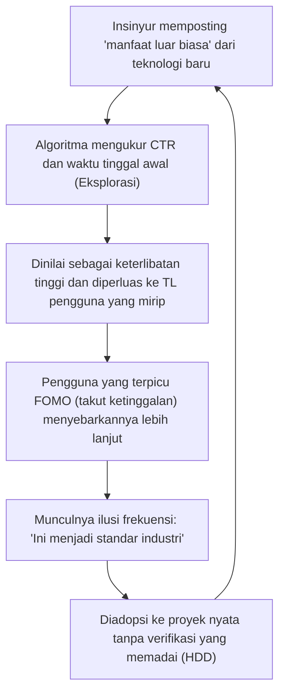
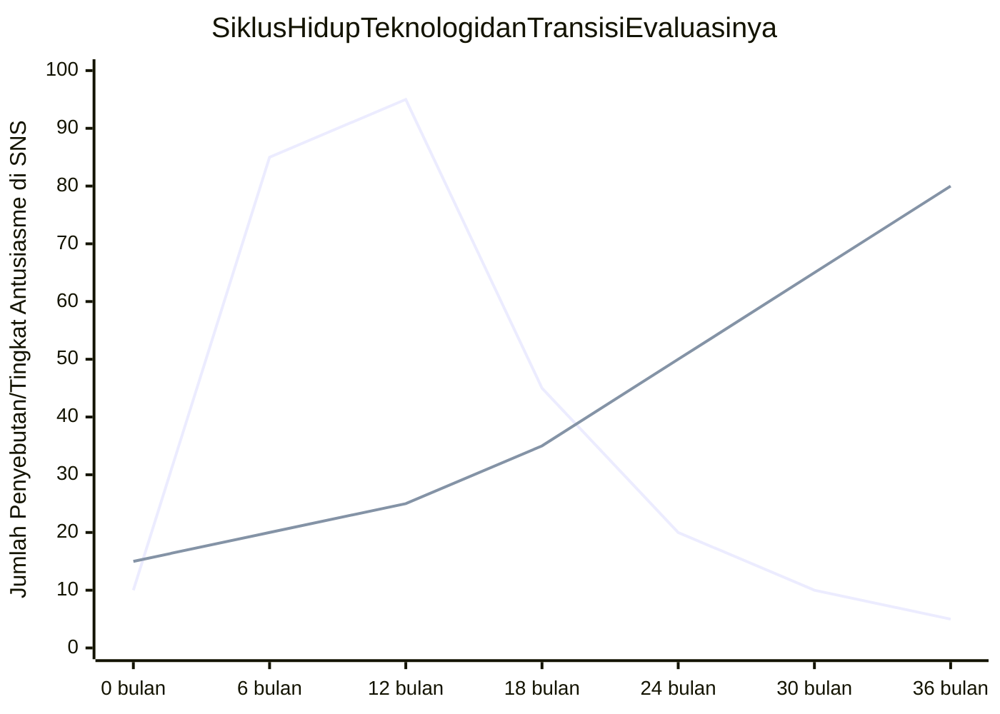

## 1. Pendahuluan: Demokratisasi Informasi Teknologi dan Kebangkitan Algoritma

Dalam rekayasa perangkat lunak modern, sebagian besar informasi teknologi yang kita konsumsi setiap hari melewati layanan jejaring sosial (SNS) dan agregator berita seperti X (sebelumnya Twitter), Hacker News, Reddit, dan LinkedIn. Dahulu ada masa ketika kita mengumpulkan informasi secara otonom dan kronologis melalui milis, blog yang dikelola oleh pakar tertentu, atau pembaca RSS. Namun, dengan peningkatan eksplosif dalam kerangka kerja dan alat yang diproduksi setiap hari, menjadi hal yang umum bagi kita untuk memercayakan penyaringan informasi kepada "algoritma rekomendasi (Recommendation Algorithms)" yang disediakan oleh platform untuk mengoptimalkan sumber daya kognitif kita yang terbatas (waktu luang dan perhatian).

Pergeseran paradigma ini membawa manfaat besar dalam menemukan artikel teknologi yang berguna dan proyek open-source terobosan secara efisien. Namun di sisi lain, hal ini juga menyebabkan efek samping yang sangat serius. Fakta bahwa **"tren teknologi dan praktik terbaik yang kita lihat tidak didasarkan pada keunggulan teknis murni atau evaluasi objektif, melainkan terdistorsi oleh 'fungsi optimisasi keterlibatan' dari algoritma"**.

Dalam artikel ini, kami akan mengungkapkan secara matematis dan struktural bagaimana algoritma pembelajaran mesin tingkat lanjut yang berjalan di balik layar SNS membentuk kognisi kita dan memengaruhi pengambilan keputusan dalam pemilihan teknologi. Selain itu, kami juga akan membahas secara mendalam tentang bahaya "Hype Driven Development (HDD)" di mana kita terbawa oleh antusiasme yang diciptakan oleh algoritma, dan pendekatan spesifik untuk melepaskan diri dari hal tersebut demi membuat pilihan teknologi yang objektif dan kuat.

---

## 2. Evolusi dan Mekanisme Algoritma Rekomendasi

Saat kita membuka SNS, konten yang ditampilkan di linimasa (feed) bukanlah sesuatu yang acak. Terdapat model pembelajaran mesin yang sangat disetel untuk memaksimalkan waktu tinggal pengguna dan meningkatkan pendapatan iklan. Mari kita lihat terlebih dahulu teknologi yang mendasari hal ini.

### 2.1 Pemfilteran Kolaboratif (Collaborative Filtering) dan Dekomposisi Matriks

"Pemfilteran kolaboratif" telah berfungsi sebagai dasar yang kuat dari masa awal sistem rekomendasi hingga saat ini. Secara khusus, "dekomposisi matriks (Matrix Factorization)", yang merepresentasikan interaksi antara pengguna dan item (postingan dan artikel) sebagai matriks dan memetakannya ke ruang fitur laten, banyak digunakan.

Misalkan $R \in \mathbb{R}^{M \times N}$ adalah matriks peringkat dengan $M$ pengguna dan $N$ item. Dalam dekomposisi matriks, matriks yang besar dan jarang (sparse) ini didekati oleh produk dari matriks fitur laten berdimensi rendah $U \in \mathbb{R}^{M \times K}$ (fitur pengguna) dan $V \in \mathbb{R}^{N \times K}$ (fitur item) ($K \ll M, N$).

$$
R \approx U \times V^T
$$

Skor prediksi (kemungkinan keterlibatan) $\hat{r}_{ij}$ dari item $j$ untuk pengguna spesifik $i$ dihitung sebagai hasil kali titik dari masing-masing vektor fitur laten.

$$
\hat{r}_{ij} = \mathbf{u}_i \cdot \mathbf{v}_j
$$

Model ini dilatih untuk meminimalkan fungsi kerugian berikut ($\lambda$ adalah istilah regularisasi untuk mencegah overfitting).

$$
\mathcal{L} = \sum_{(i,j) \in \Omega} (r_{ij} - \mathbf{u}_i \cdot \mathbf{v}_j)^2 + \lambda (\|\mathbf{u}_i\|^2 + \|\mathbf{v}_j\|^2)
$$

**Dampak pada Pemilihan Teknologi:**
Algoritma ini membawa "Si A yang tertarik dengan [Rust](https://kenji.blog/id/p/webassembly-wasm-current-future/)" dan "Si B yang tertarik dengan Rust" lebih dekat di ruang laten. Jika Si A "menyukai" postingan tentang kerangka kerja Web yang sedang berkembang, postingan tentang kerangka kerja tersebut akan memiliki probabilitas tinggi untuk ditampilkan di linimasa Si B juga. Akibatnya, terjadi fenomena di mana sebuah teknologi spesifik menjadi sangat populer secara lokal di dalam kelompok insinyur yang menyukai tumpukan teknologi tertentu.

### 2.2 Model Rekomendasi Berbasis Pembelajaran Mendalam (DLRM)

Dalam beberapa tahun terakhir, arsitektur berbasis pembelajaran mendalam, yang diwakili oleh Deep Learning Recommendation Model (DLRM), telah dipopulerkan secara luas, terutama oleh Meta (sebelumnya Facebook). DLRM menerima berbagai macam fitur sebagai input, seperti riwayat perilaku pengguna di masa lalu dan metadata item, lalu memprediksi rasio klik-tayang (CTR: Click-Through Rate) dan sejenisnya.

Ciri khas DLRM adalah kemampuannya untuk mengubah fitur kategorikal yang jarang (sparse) (misal: ID pengguna, tagar yang diikuti) menjadi vektor padat (Dense Vector) melalui "tabel penyematan (Embedding Table)", dan menggabungkannya dengan fitur padat bernilai kontinu (misal: jumlah hari sejak akun dibuat, waktu tinggal rata-rata di masa lalu).

$$
\mathbf{e}_{\text{sparse}} = \text{EmbeddingLookup}(\mathbf{x}_{\text{sparse}})
$$
$$
\mathbf{h}_{\text{dense}} = \text{BottomMLP}(\mathbf{x}_{\text{dense}})
$$

Setelah fitur-fitur ini digabungkan (Concatenate) atau diinteraksikan melalui hasil kali titik dan sejenisnya (Feature Interaction), fitur tersebut dimasukkan ke dalam perceptron multi-lapisan atas (Top MLP), dan probabilitas akhir seperti CTR dikeluarkan menggunakan fungsi sigmoid $\sigma$.

$$
\hat{y} = \sigma(\text{TopMLP}(\text{Interact}(\mathbf{e}_{\text{sparse}}, \mathbf{h}_{\text{dense}})))
$$

**Dampak pada Pemilihan Teknologi:**
Model raksasa seperti DLRM menangkap bahkan sinyal yang sangat halus (misalnya, sedikit peningkatan pada waktu tinggal untuk "postingan dengan video" atau "postingan yang berisi buzzword tertentu") dan merefleksikannya dalam skor prediksi. Akibatnya, informasi teknis yang mengandung "judul ekstrem (misalnya, 'React sudah usang', 'Akhir dari [[Microservice](https://kenji.blog/id/p/microservices-architecture-bff-api-gateway/)s](https://kenji.blog/id/p/microservices-architecture-bff-api-gateway/)')" atau "demo visual yang mencolok" lebih cenderung diunggulkan secara algoritmik.

### 2.3 Pembelajaran Penguatan dan Masalah Bandit Berlengan Banyak (Multi-Armed Bandits)

Sistem rekomendasi harus selalu mengeksplorasi preferensi terbaru pengguna. Di sinilah "masalah bandit berlengan banyak" muncul. Masalah ini mengoptimalkan tarik-ulur (trade-off) antara "pemanfaatan (Exploitation)" untuk menyajikan konten tertentu berdasarkan preferensi yang sudah ada, dan "eksplorasi (Exploration)" untuk menemukan tren baru.

Dalam algoritma representatif UCB (Upper Confidence Bound), pada waktu $t$, skor ketika memilih lengan (grup konten) $a$ dihitung sebagai berikut.

$$
a_t = \arg\max_{a} \left( \hat{\mu}_a + c \sqrt{\frac{\ln t}{N_a(t)}} \right)
$$

Di sini, $\hat{\mu}_a$ adalah imbalan rata-rata (tingkat keterlibatan) dari lengan $a$ sejauh ini, $N_a(t)$ adalah berapa kali ia telah dipilih, dan $c$ adalah parameter yang menyesuaikan tingkat eksplorasi.

**Dampak pada Pemilihan Teknologi:**
Algoritma memberikan bonus eksplorasi sementara ke postingan mengenai kerangka kerja dan pustaka yang baru muncul (yang mana jumlah percobaannya $N_a(t)$ rendah) dan mengeksposnya ke sekelompok pengguna acak. Selama "fase eksplorasi" awal ini, jika reaksi dari influencer dan sejenisnya positif, $\hat{\mu}_a$ meningkat secara dramatis, dan dengan cepat berkembang menjadi sensasi (viral). Inilah mekanisme di mana "tiba-tiba semua orang mulai membicarakan tentang teknologi tersebut".

---

## 3. Matematika dari Ruang Gema (Echo Chamber) dan Gelembung Filter (Filter Bubble)

Ketika optimalisasi algoritma berkembang, pengguna akan dikelilingi hanya oleh "informasi yang membuat mereka merasa nyaman, atau informasi yang memperkuat keyakinan mereka yang sudah ada". Inilah yang disebut dengan **fenomena ruang gema (Echo Chamber)** dan **gelembung filter (Filter Bubble)**.

Dalam teori jaringan, kecenderungan orang-orang yang berpikiran sama untuk terhubung satu sama lain disebut "homofili (Homophily)". Dalam graf $G=(V, E)$, tepi (hubungan mengikuti dan penyebaran informasi) antara simpul (pengguna) lebih mudah terbentuk jika kemiripan atributnya tinggi.

Algoritma rekomendasi SNS secara artifisial mempercepat homofili ini. Sebagai contoh, katakanlah terdapat sebuah komunitas insinyur yang mempromosikan "arsitektur tanpa server" dan komunitas lain yang mendukung "bare metal di lokasi (on-premises)". Algoritma belajar untuk menurunkan bobot tepi antara komunitas yang berbeda (ikatan lintas sektoral/Cross-cutting ties) dan memperkuat tepi di dalam komunitas yang sama (karena opini yang bertentangan sering kali memicu kepergian pengguna dan berisiko menurunkan keterlibatan. Atau sebaliknya, kemarahan yang ekstrem terkadang dapat mendorong keterlibatan, tetapi di komunitas teknologi, kecenderungannya adalah yang pertama).

Akibatnya, hal ini menciptakan realitas teknologi yang benar-benar terpecah, di mana di linimasa Anda tampaknya "perusahaan-perusahaan di seluruh dunia sedang bermigrasi ke serverless", sementara di linimasa orang lain tampaknya "beralih dari cloud (Cloud Repatriation) adalah tren global".

---

## 4. Hype Driven Development (HDD) yang Diciptakan oleh Algoritma

Kombinasi antara ruang gema dan model rekomendasi yang kuat memicu salah satu anti-pola terbesar dalam industri rekayasa, yaitu **Hype Driven Development (HDD)**. HDD adalah fenomena di mana seseorang mengadopsi teknologi baru semata-mata karena "itu sedang dibicarakan di SNS" atau "itu adalah tren terbaru", tanpa mempertimbangkan secara mendalam manfaat sebenarnya dari teknologi tersebut, tarik-ulurnya, dan kesesuaiannya dengan kebutuhan bisnis mereka sendiri.

Diagram Mermaid di bawah ini menunjukkan bagaimana algoritma SNS memutar loop umpan balik dari HDD.

Hal yang menakutkan tentang loop ini adalah bahwa **"Ilusi frekuensi (Fenomena Baader-Meinhof)"** sengaja dipicu oleh algoritma. Sekali Anda melihat nama pustaka manajemen status yang baru, algoritma akan menangkapnya sebagai sinyal, dan mulai hari berikutnya, linimasa Anda akan dibanjiri dengan topik mengenai pustaka tersebut. Otak manusia secara keliru menganggap ini sebagai "pandemi global".

Bagan di bawah ini menggambarkan perbedaan siklus hidup antara teknologi yang terlalu di-hype (dilebih-lebihkan) di SNS dan teknologi yang sederhana dan membosankan tetapi kuat (Boring Technology).

*(Catatan: Dalam grafik di atas, garis yang naik dan turun secara tajam menunjukkan "Teknologi yang di-hype", dan garis yang terus meningkat secara perlahan menunjukkan "Boring Technology")*

Teknologi yang di-hype akan menghadapi masalah realistis seperti "kurangnya dokumentasi", "bug serius pada edge case", dan "burnout pengelola (maintainer)" 6 hingga 12 bulan setelah diadopsi, lalu dengan cepat menghilang dari SNS. Namun, dibutuhkan biaya yang sangat besar untuk menghilangkan utang teknis setelah dimasukkan ke dalam sistem.

---

## 5. Strategi "Melepaskan Diri dari Algoritma" dalam Pemilihan Teknologi

Lalu, bagaimana kita bisa membuat pilihan teknologi yang objektif dan tenang di bawah kendali algoritma ini? Alih-alih meretas algoritmanya, di sini ada beberapa strategi khusus untuk "turun" dari algoritma tersebut.

### 5.1 Kembali ke Informasi Primer: Kode Sumber dan RFC

Garis pertahanan yang paling pasti adalah memindahkan sumber informasi kita dari agregasi SNS ke **informasi primer (Primary Sources)**.

1. **Membaca Kode Sumber:** Daripada memercayai postingan SNS yang mengatakan "pustaka ini secepat kilat", bukalah GitHub yang sebenarnya dan periksa kompleksitas komputasi dari logika inti serta mekanisme alokasi memorinya.
2. **Mengikuti RFC (Request for Comments):** Banyak proyek open-source yang matang (React, [Rust](https://kenji.blog/id/p/webassembly-wasm-current-future/), Python, dll.) mengadopsi proses RFC saat memperkenalkan fitur baru. Dalam RFC, alasan "mengapa fitur ini diperlukan", "apa pertukaran desainnya", dan "apa alternatifnya" ditulis secara lugas dan logis tanpa mengkhawatirkan keterlibatan algoritma. Di sinilah nilai teknis yang sebenarnya berada.

### 5.2 Membaca Cermat Makalah (Academic Papers) dan Buku Putih (White Papers)

Ketika memilih teknologi inti seperti sistem terdistribusi, basis data, dan arsitektur model pembelajaran mesin, alih-alih membaca rangkuman beberapa baris di SNS, Anda harus langsung membaca makalah yang diterbitkan di ACM, IEEE, atau arXiv, atau buku putih terperinci yang diterbitkan oleh perusahaan (misal: makalah Spanner dari Google, makalah Dynamo dari Amazon).

Postingan SNS dioptimalkan untuk "menarik perhatian pembaca", sementara makalah yang ditinjau oleh sejawat dioptimalkan untuk "akurasi faktual dan reproduktifitas". Fungsi evaluasinya benar-benar berbeda.

### 5.3 Membangun Kerangka Pengambilan Keputusan dalam Organisasi

Untuk mencegah HDD di tingkat tim dan organisasi, Anda memerlukan proses yang mengeliminasi intuisi pribadi dan pembenaran seperti "karena saya melihatnya di Twitter". Contoh representatif dari hal ini adalah pengenalan **ADR (Architecture Decision Records)**.

Ketika mengadopsi teknologi baru, pastikan untuk mendokumentasikan poin-poin berikut ini dan meninjaunya.
* **Konteks (Context):** Mengapa teknologi baru dibutuhkan? Apa saja masalahnya saat ini?
* **Keputusan (Decision):** Apa yang akan diadopsi?
* **Konsekuensi (Consequences):** Apa saja pertukarannya? (Apa yang dikorbankan untuk mendapatkan apa?)

Dengan menerapkan proses ini secara paksa, kita bisa mengubah "Hype (Antusiasme berlebih)" menjadi "Rekayasa (Engineering)".

### 5.4 Filosofi Boring Technology Club

Di dunia teknologi, ada sebuah mantra terkenal yang berbunyi **"Choose Boring Technology" (Pilihlah Teknologi yang Membosankan)**. Ini adalah ajaran bahwa inovasi token (sumber daya terbatas yang dapat digunakan organisasi pada teknologi baru yang tidak diketahui) tidak boleh disia-siakan dalam memilih infrastruktur dan kerangka kerja yang tidak terkait langsung dengan nilai inti dari bisnis.

Algoritma SNS menyukai "kebaruan". Namun, yang dibutuhkan untuk membangun sistem yang kuat dan mampu bertahan dalam operasi nyata adalah teknologi "membosankan" (seperti PostgreSQL, [Redis](https://kenji.blog/id/p/nosql-database-selection-kvs-document-graph-wide-column/), dan [REST API](https://kenji.blog/id/p/graphql-vs-rest-api-[overfetching](https://kenji.blog/id/p/graphql-vs-rest-api-overfetching-type-safety/)-type-safety/) standar) yang memiliki rekam jejak operasional selama lebih dari 10 tahun, dan prosedur pemulihannya ketika terjadi kegagalan dapat mencapai jutaan klik dalam pencarian Google.

---

## 6. Kesimpulan: Bagaimana Seharusnya Kita Menghadapi Teknologi

Algoritma rekomendasi SNS adalah alat yang ampuh yang memperluas wawasan teknis kita dan memberi kita perjumpaan dengan komunitas yang luar biasa. Namun, selama struktur internalnya (dekomposisi matriks, DLRM, bandit berlengan banyak) berupaya untuk "memaksimalkan keterlibatan" sebagai tujuan tertingginya, informasi yang dihasilkan pasti akan bias.

Kita perlu mengembangkan literasi untuk tidak menerima informasi yang mengalir di linimasa kita sebagai "fakta" atau "tren absolut", melainkan memperlakukannya hanya sebagai sebuah "sinyal".

Keluarlah dari ruang gema, baca kode sumber dengan tangan Anda sendiri, ikuti diskusi pada RFC, uraikan formula pada makalah, dan hadapi masalah yang sebenarnya pada domain bisnis perusahaan Anda. Itulah satu-satunya jalan untuk mempraktikkan rekayasa perangkat lunak sejati tanpa tertelan oleh gelombang algoritma.

