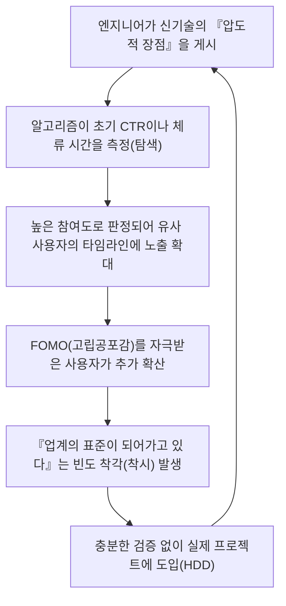

## 1. 서론: 기술 정보의 민주화와 알고리즘의 대두

현대 소프트웨어 엔지니어링에서 우리가 매일 소비하는 기술 정보의 대부분은 X(구 트위터), 해커뉴스(Hacker News), 레딧(Reddit), 링크드인(LinkedIn)과 같은 소셜 네트워킹 서비스(SNS)나 뉴스 어그리게이터를 거치고 있습니다. 과거에는 메일링 리스트나 특정 전문가가 운영하는 블로그, 혹은 RSS 리더를 통해 자율적이고 시계열 순으로 정보를 수집하던 시대가 있었습니다. 하지만 매일 쏟아져 나오는 프레임워크와 도구의 폭발적인 증가에 따라, 우리의 제한된 인지 자원(가용 시간과 주의력)을 최적화하기 위해 플랫폼 측에서 제공하는 '추천 알고리즘(Recommendation Algorithms)'에 정보 선별을 맡기는 것이 일반적이 되었습니다.

이러한 패러다임의 전환은 유용한 기술 기사나 획기적인 오픈소스 프로젝트를 효율적으로 발견할 수 있다는 막대한 이점을 가져다주었습니다. 하지만 다른 한편으로는 극히 중대한 부작용도 일으키고 있습니다. 그것은 바로 **"우리가 접하는 기술 트렌드나 베스트 프랙티스가 순수한 기술적 우위나 객관적인 평가에 의해서가 아니라, 알고리즘의 '참여 최적화 함수(Engagement Optimization Function)'에 의해 왜곡되고 있다"** 는 사실입니다.

본 기사에서는 SNS 이면에서 가동되고 있는 고도화된 머신러닝 알고리즘이 어떻게 우리의 인지를 형성하고 기술 선정의 의사결정에 영향을 미치고 있는지를 수리적, 구조적으로 밝혀냅니다. 나아가 알고리즘이 만들어내는 열광에 휩쓸리는 '하이프 주도 개발(HDD: Hype Driven Development)'의 위험성과, 그로부터 벗어나 객관적이고 견고한 기술 선정을 하기 위한 구체적인 접근법에 대해 깊이 고찰해 봅니다.

---

## 2. 추천 알고리즘의 진화와 메커니즘

우리가 SNS를 열었을 때, 타임라인(피드)에 표시되는 콘텐츠는 무작위가 아닙니다. 거기에는 사용자의 체류 시간을 극대화하고 광고 수익을 향상시키기 위해 고도로 튜닝된 머신러닝 모델이 존재합니다. 먼저 이들의 근간을 이루는 기술에 대해 살펴보겠습니다.

### 2.1 협업 필터링(Collaborative Filtering)과 행렬 분해

추천 시스템의 여명기부터 현재에 이르기까지 강력한 베이스라인으로 기능하고 있는 것이 '협업 필터링'입니다. 특히 사용자와 아이템(게시물이나 기사)의 상호작용을 행렬로 표현하고, 잠재적인 특징 공간으로 매핑하는 '행렬 분해(Matrix Factorization)'는 널리 사용되고 있습니다.

사용자 수 $M$, 아이템 수 $N$인 평가 행렬을 $R \in \mathbb{R}^{M \times N}$이라고 할 때, 행렬 분해에서는 이 거대하고 희소(sparse)한 행렬을 저차원의 잠재 특징 행렬 $U \in \mathbb{R}^{M \times K}$(사용자 특징)과 $V \in \mathbb{R}^{N \times K}$(아이템 특징)의 곱으로 근사합니다($K \ll M, N$).

$$
R \approx U \times V^T
$$

특정 사용자 $i$에 대한 아이템 $j$의 예측 점수(참여 가능성) $\hat{r}_{ij}$는 각각의 잠재 특징 벡터의 내적으로 계산됩니다.

$$
\hat{r}_{ij} = \mathbf{u}_i \cdot \mathbf{v}_j
$$

이 모델은 다음의 손실 함수를 최소화하도록 학습됩니다($\lambda$는 과적합을 방지하기 위한 정규화 항).

$$
\mathcal{L} = \sum_{(i,j) \in \Omega} (r_{ij} - \mathbf{u}_i \cdot \mathbf{v}_j)^2 + \lambda (\|\mathbf{u}_i\|^2 + \|\mathbf{v}_j\|^2)
$$

**기술 선정에 미치는 영향:**
이 알고리즘은 '[Rust](https://kenji.blog/ko/p/webassembly-wasm-current-future/)에 관심이 있는 A씨'와 'Rust에 관심이 있는 B씨'를 잠재 공간 상에서 가깝게 만듭니다. 만약 A씨가 신흥 웹 프레임워크의 게시물에 '좋아요'를 누른 경우, B씨의 타임라인에도 해당 프레임워크의 게시물이 높은 확률로 표시됩니다. 이로 인해 특정 기술 스택을 선호하는 엔지니어 집단 내에서 특정 기술이 국지적으로 대유행하는 현상이 일어납니다.

### 2.2 딥러닝을 이용한 추천 모델 (DLRM)

최근 Meta(구 Facebook) 등을 중심으로 보급되고 있는 것이 Deep Learning Recommendation Model(DLRM)로 대표되는 딥러닝 기반 아키텍처입니다. DLRM은 사용자의 과거 행동 이력이나 아이템의 메타데이터 등 다양하고 많은 특징(Feature)을 입력으로 받아 클릭률(CTR: Click-Through Rate) 등을 예측합니다.

DLRM의 특징은 희소한 범주형 특징(예: 사용자 ID, 팔로우하는 해시태그)을 '임베딩 테이블(Embedding Table)'을 통해 밀집 벡터(Dense Vector)로 변환하고, 연속값인 밀집 특징(예: 계정 개설 후 경과일, 과거 평균 체류 시간)과 결합한다는 점에 있습니다.

$$
\mathbf{e}_{\text{sparse}} = \text{EmbeddingLookup}(\mathbf{x}_{\text{sparse}})
$$
$$
\mathbf{h}_{\text{dense}} = \text{BottomMLP}(\mathbf{x}_{\text{dense}})
$$

이들을 결합(Concatenate)하거나 내적 등으로 상호작용(Feature Interaction)시킨 후, 상단의 다층 퍼셉트론(Top MLP)에 입력하고 최종적인 CTR 등의 확률을 시그모이드 함수 $\sigma$로 출력합니다.

$$
\hat{y} = \sigma(\text{TopMLP}(\text{Interact}(\mathbf{e}_{\text{sparse}}, \mathbf{h}_{\text{dense}})))
$$

**기술 선정에 미치는 영향:**
DLRM과 같은 거대 모델은 극히 미세한 신호(예를 들어 '동영상이 포함된 게시물'이나 '특정 버즈워드가 포함된 게시물'에 대한 약간의 체류 시간 증가)까지 포착하여 예측 점수에 반영합니다. 결과적으로 '과격한 제목(예: "React는 이제 구식이다", "[[Microservice](https://kenji.blog/ko/p/microservices-architecture-bff-api-gateway/)s](https://kenji.blog/ko/p/microservices-architecture-bff-api-gateway/)의 종언")'이나 '시각적으로 화려한 데모'를 포함한 기술 정보가 알고리즘적으로 우대받기 쉬워집니다.

### 2.3 강화학습과 다중 선택 밴딧 문제 (Multi-Armed Bandits)

추천 시스템은 항상 사용자의 최신 취향을 탐색해야 합니다. 여기서 등장하는 것이 '다중 선택 밴딧 문제'입니다. 기존 취향에 기반해 확실한 콘텐츠를 제시하는 '활용(Exploitation)'과 새로운 트렌드를 발견하기 위한 '탐색(Exploration)'의 트레이드오프를 최적화합니다.

대표적인 알고리즘인 UCB(Upper Confidence Bound)에서는 시간 $t$에서 팔(콘텐츠 군) $a$를 선택할 때의 점수를 다음과 같이 계산합니다.

$$
a_t = \arg\max_{a} \left( \hat{\mu}_a + c \sqrt{\frac{\ln t}{N_a(t)}} \right)
$$

여기서 $\hat{\mu}_a$는 팔 $a$의 지금까지의 평균 보상(참여율), $N_a(t)$는 선택된 횟수, $c$는 탐색 정도를 조정하는 파라미터입니다.

**기술 선정에 미치는 영향:**
알고리즘은 새로 등장한 프레임워크나 라이브러리에 관한 게시물(시도 횟수 $N_a(t)$가 적은 것)에 대해 일시적으로 탐색 보너스를 부여하여 무작위 사용자 집단에 노출시킵니다. 이 초기 '탐색 단계'에서 인플루언서 등의 반응이 좋았던 경우 $\hat{\mu}_a$가 급격히 상승하여 단숨에 버즈(바이럴)로 발전합니다. 이것이 '갑자기 누구나 그 기술에 대해 이야기하기 시작하는' 메커니즘입니다.

---

## 3. 에코 체임버와 필터 버블의 수리(数理)

알고리즘의 최적화가 진행되면 사용자는 '자신이 편안하게 느끼는 정보, 또는 자신의 기존 신념을 강화하는 정보'에만 둘러싸이게 됩니다. 이것이 **에코 체임버 현상(Echo Chamber)** 및 ** 필터 버블(Filter Bubble)**입니다.

네트워크 이론에서 비슷한 사람끼리 연결되기 쉬운 성질을 '동질성(Homophily)'이라고 부릅니다. 그래프 $G=(V, E)$에서 노드(사용자) 간의 엣지(팔로우 관계나 정보 전파)는 속성의 유사도가 높을수록 형성되기 쉬워집니다.

SNS 추천 알고리즘은 이 동질성을 인위적으로 가속화합니다. 예를 들어, '서버리스 아키텍처'를 추진하는 엔지니어 커뮤니티와 '온프레미스 베어메탈'을 지지하는 커뮤니티가 있다고 가정해 봅시다. 알고리즘은 다른 커뮤니티 간 엣지(Cross-cutting ties)의 가중치를 낮추고, 동일 커뮤니티 내의 엣지를 강화하도록 학습합니다(왜냐하면 대립하는 의견은 종종 이탈을 유발하여 참여를 떨어뜨릴 위험이 있기 때문입니다. 혹은 반대로 극단적인 분노를 통한 참여를 유발하기도 하지만, 기술 업계에서는 전자가 많은 경향이 있습니다).

결과적으로 당신의 타임라인에서는 '전 세계 기업들이 서버리스로 전환하고 있다'고 보이고, 다른 누군가의 타임라인에서는 '클라우드에서의 탈피(Cloud Repatriation)가 세계적인 트렌드다'라고 보이는, 완전히 분단된 기술적 현실이 창출됩니다.

---

## 4. 알고리즘이 만들어내는 하이프 주도 개발 (HDD)

에코 체임버와 강력한 추천 모델이 결합됨으로써, 엔지니어링 업계 최대의 안티패턴 중 하나인 **하이프 주도 개발(Hype Driven Development)** 이 발생합니다. HDD란 기술의 실제 장점이나 트레이드오프, 자사의 비즈니스 요구사항과의 적합성을 깊이 검토하지 않고 'SNS에서 화제가 되고 있으니까', '최신 트렌드니까'라는 이유만으로 새로운 기술을 도입해버리는 현상을 말합니다.

다음의 Mermaid 다이어그램은 SNS의 알고리즘이 어떻게 HDD의 피드백 루프를 돌리고 있는지를 보여줍니다.



이 루프 안에서 무서운 점은 **'빈도 착각(Baader-Meinhof phenomenon)'** 이 알고리즘에 의해 의도적으로 야기된다는 점입니다. 어떤 새로운 상태 관리 라이브러리의 이름을 한 번 눈에 담으면, 알고리즘은 그것을 신호로 파악하고 다음 날부터 당신의 피드를 그 라이브러리에 관한 화제로 가득 채웁니다. 인간의 뇌는 이를 '세계적인 대유행'으로 오인하게 됩니다.

다음 차트는 SNS 상에서 과도하게 하이프(과대광고)된 기술과 수수하고 지루하지만 견고한 기술(Boring Technology)의 수명 주기 차이를 나타냅니다.

```mermaid
xychart-beta
    title 기술의 수명 주기와 평가 추이
    x-axis ["0개월", "6개월", "12개월", "18개월", "24개월", "30개월", "36개월"]
    y-axis "SNS에서의 언급 수 및 열광도" 0 --> 100
    line [10, 85, 95, 45, 20, 10, 5]
    line [15, 20, 25, 35, 50, 65, 80]
```
*(참고: 위 그래프에서 급상승하다가 급강하하는 선이 'Hype된 기술', 천천히 꾸준히 상승하는 선이 'Boring Technology'를 나타냅니다)*

Hype된 기술은 도입 후 6~12개월 만에 '문서 부족', '엣지 케이스에서의 심각한 버그', '메인테이너의 번아웃' 등 현실적인 문제에 직면하며 SNS 상에서 급속히 자취를 감춥니다. 그러나 한 번 시스템에 내장된 기술 부채를 제거하는 데에는 막대한 비용이 듭니다.

---

## 5. 기술 선정에서의 '알고리즘으로부터의 탈피' 전략

그렇다면 우리는 이 알고리즘의 지배하에서 어떻게 객관적이고 냉철한 기술 선정을 해야 할까요? 알고리즘을 해킹하는 것이 아니라, 알고리즘에서 '내려오기' 위한 구체적인 전략 몇 가지를 소개합니다.

### 5.1 1차 정보로의 회귀: 소스 코드와 RFC

가장 확실한 방어책은 정보원을 SNS의 어그리게이션에서 **1차 정보(Primary Sources)** 로 전환하는 것입니다.

1. **소스 코드 읽기:** '이 라이브러리는 엄청나게 빠르다'라는 SNS 게시물을 믿는 대신, 실제로 GitHub를 열어 코어 로직의 시간 복잡도나 메모리 할당 방식을 확인합니다.
2. **RFC (Request for Comments) 추적하기:** 성숙한 많은 오픈소스 프로젝트(React, [Rust](https://kenji.blog/ko/p/webassembly-wasm-current-future/), Python 등)는 새로운 기능 도입 시 RFC 프로세스를 채택하고 있습니다. RFC에는 '왜 이 기능이 필요한가', '어떤 설계상의 트레이드오프가 있는가', '대안은 무엇인가'가 알고리즘의 참여도를 신경 쓰지 않고 담담하고 논리적으로 기록되어 있습니다. 바로 여기에 진정한 기술적 가치가 잠들어 있습니다.

### 5.2 논문(Academic Papers)과 백서 정독

분산 시스템, 데이터베이스, 머신러닝 모델의 아키텍처 등 근간이 되는 기술 선정에 있어서는 SNS의 몇 줄짜리 요약이 아니라, ACM이나 IEEE 혹은 arXiv에 공개된 논문이나 기업이 공개한 상세한 백서(예: Google의 Spanner 논문, Amazon의 Dynamo 논문)를 직접 읽어야 합니다.

SNS 게시물은 '독자의 어텐션(주의력)을 빼앗기' 위해 최적화되어 있지만, 피어 리뷰(Peer Review)를 거친 논문은 '사실의 정확성과 재현성'에 최적화되어 있습니다. 평가 함수가 전혀 다른 것입니다.

### 5.3 조직 내 의사결정 프레임워크 구축

팀이나 조직 수준에서 HDD를 방지하기 위해서는 개인적인 직감이나 '트위터에서 봤으니까'라는 이유를 배제하는 프로세스가 필요합니다. 그 대표적인 예가 **ADR (Architecture Decision Records)** 의 도입입니다.

새로운 기술을 도입할 때는 반드시 다음 항목을 문서화하고 리뷰를 받습니다.
* **Context (배경):** 왜 새로운 기술이 필요한가? 현재의 과제는 무엇인가?
* **Decision (결정):** 무엇을 채택할 것인가?
* **Consequences (결과):** 트레이드오프는 무엇인가? (무엇을 희생하고 무엇을 얻는가)

이 프로세스를 강제함으로써 'Hype(열광)'을 'Engineering(공학)'으로 변환할 수 있습니다.

### 5.4 Boring Technology Club의 철학

기술 업계에는 **"Choose Boring Technology"(지루한 기술을 선택하라)** 라는 유명한 만트라가 있습니다. 이는 혁신 토큰(Innovation Token: 조직이 새롭고 미지의 기술에 사용할 수 있는 제한된 자원)을 비즈니스의 핵심 가치와 직결되지 않는 인프라나 프레임워크 선정에 낭비해서는 안 된다는 가르침입니다.

SNS 알고리즘은 '참신함'을 좋아합니다. 하지만 실제 운영에 견딜 수 있는 견고한 시스템을 구축하는 데 필요한 것은, 10년 이상의 운영 실적이 있고 장애 발생 시 복구 절차가 구글 검색에서 수백만 건 히트하는 '지루한' 기술(PostgreSQL, [Redis](https://kenji.blog/ko/p/nosql-database-selection-kvs-document-graph-wide-column/), 표준적인 [REST API](https://kenji.blog/ko/p/graphql-vs-rest-api-[overfetching](https://kenji.blog/ko/p/graphql-vs-rest-api-overfetching-type-safety/)-type-safety/) 등)인 것입니다.

---

## 6. 결론: 우리는 기술과 어떻게 마주해야 하는가

SNS의 추천 알고리즘은 우리의 기술적 시야를 넓히고 훌륭한 커뮤니티와의 만남을 제공해주는 강력한 도구입니다. 하지만 그 내부 구조(행렬 분해, DLRM, 다중 선택 밴딧)가 '참여 극대화'를 지상 명제로 삼고 있는 이상, 출력되는 정보에는 필연적으로 편향이 생깁니다.

우리는 타임라인에 흘러들어오는 정보를 '사실'이나 '절대적인 트렌드'로 받아들이는 것이 아니라, 어디까지나 하나의 '신호'로서 다루는 리터러시를 갖출 필요가 있습니다.

에코 체임버 밖으로 나와 스스로 소스 코드를 읽고, RFC 논의를 쫓고, 논문의 수식을 해독하며, 자사 비즈니스 도메인의 진정한 과제와 마주하는 것. 그것이야말로 알고리즘의 파도에 휩쓸리지 않고 진정한 소프트웨어 엔지니어링을 실천하기 위한 유일한 길입니다.


