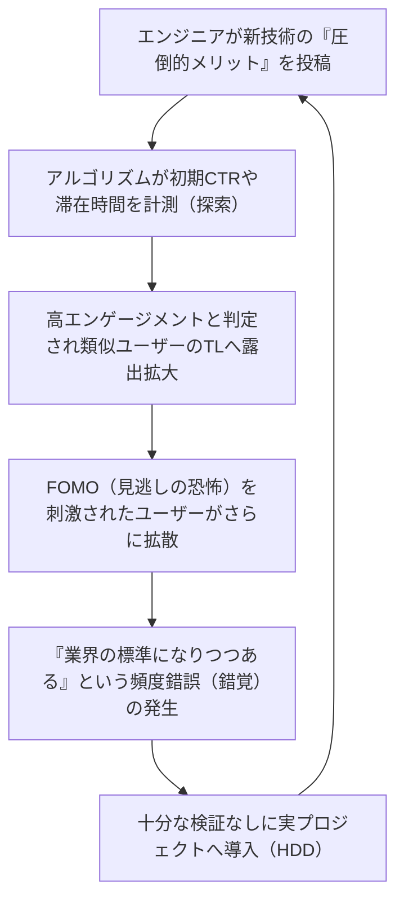

## 1. はじめに：技術情報の民主化とアルゴリズムの台頭

現代のソフトウェアエンジニアリングにおいて、私たちが日々消費する技術情報の多くは、X（旧Twitter）、Hacker News、Reddit、LinkedInといったソーシャルネットワーキングサービス（SNS）やニュースアグリゲーターを経由しています。かつてはメーリングリストや特定のエキスパートが運営するブログ、あるいはRSSリーダーを通じて、自律的かつ時系列順に情報を収集していた時代がありました。しかし、日々生み出されるフレームワークやツールの爆発的な増加に伴い、私たちの限られた認知リソース（可処分時間と注意力）を最適化するため、プラットフォーム側が提供する「推薦アルゴリズム（Recommendation Algorithms）」に情報選別を委ねるのが一般的となりました。

このパラダイムシフトは、有益な技術記事や画期的なオープンソースプロジェクトを効率的に発見できるという多大なメリットをもたらしました。しかしその一方で、極めて重大な副作用も引き起こしています。それは、 **「私たちが目にする技術トレンドやベストプラクティスが、純粋な技術的優位性や客観的な評価によってではなく、アルゴリズムの『エンゲージメント最適化関数』によって歪められている」** という事実です。

本記事では、SNSの裏側で稼働している高度な機械学習アルゴリズムが、いかにして私たちの認知を形作り、技術選定における意思決定に影響を与えているのかを数理的・構造的に解き明かします。さらに、アルゴリズムが生み出す熱狂に流される「Hype Driven Development（HDD：ハイプ駆動開発）」の危険性と、そこから脱却して客観的で堅牢な技術選定を行うための具体的なアプローチについて深く考察します。

---

## 2. 推薦アルゴリズムの進化とメカニズム

私たちがSNSを開いたとき、タイムライン（フィード）に表示されるコンテンツはランダムではありません。そこには、ユーザーの滞在時間を最大化し、広告収益を向上させるために高度にチューニングされた機械学習モデルが存在します。まずは、これらの根幹をなす技術について見ていきましょう。

### 2.1 協調フィルタリング（Collaborative Filtering）と行列分解

推薦システムの黎明期から現在に至るまで強力なベースラインとして機能しているのが「協調フィルタリング」です。特に、ユーザーとアイテム（投稿や記事）のインタラクションを行列として表現し、潜在的な特徴空間にマッピングする「行列分解（Matrix Factorization）」は広く用いられています。

ユーザー数 $M$、アイテム数 $N$ の評価行列を $R \in \mathbb{R}^{M \times N}$ としたとき、行列分解ではこの巨大で疎（スパース）な行列を、低次元の潜在特徴行列 $U \in \mathbb{R}^{M \times K}$（ユーザー特徴）と $V \in \mathbb{R}^{N \times K}$（アイテム特徴）の積に近似します（$K \ll M, N$）。

$$
R \approx U \times V^T
$$

特定のユーザー $i$ に対するアイテム $j$ の予測スコア（エンゲージメントの可能性）$\hat{r}_{ij}$ は、それぞれの潜在特徴ベクトルの内積として計算されます。

$$
\hat{r}_{ij} = \mathbf{u}_i \cdot \mathbf{v}_j
$$

このモデルは、以下の損失関数を最小化するように学習されます（$\lambda$ は過学習を防ぐための正則化項）。

$$
\mathcal{L} = \sum_{(i,j) \in \Omega} (r_{ij} - \mathbf{u}_i \cdot \mathbf{v}_j)^2 + \lambda (\|\mathbf{u}_i\|^2 + \|\mathbf{v}_j\|^2)
$$

**技術選定への影響：**
このアルゴリズムは、「Rustに興味があるAさん」と「Rustに興味があるBさん」を潜在空間上で近付けます。もしAさんが新興のWebフレームワークの投稿に「いいね」をした場合、Bさんのタイムラインにもそのフレームワークの投稿が高い確率で表示されます。これにより、特定の技術スタックを好むエンジニア集団の中で、特定の技術が局所的に大流行する現象が起きます。

### 2.2 深層学習を用いた推薦モデル (DLRM)

近年、Meta（旧Facebook）などを中心に普及しているのが、Deep Learning Recommendation Model (DLRM)に代表される深層学習ベースのアーキテクチャです。DLRMは、ユーザーの過去の行動履歴やアイテムのメタデータなど、多種多様な特徴量（Feature）を入力として受け取り、クリック率（CTR：Click-Through Rate）などを予測します。

DLRMの特徴は、スパースなカテゴリカル特徴量（例：ユーザーID、フォローしているハッシュタグ）を「埋め込みテーブル（Embedding Table）」を通じて密なベクトル（Dense Vector）に変換し、連続値の密な特徴量（例：アカウント開設からの日数、過去の平均滞在時間）と組み合わせる点にあります。

$$
\mathbf{e}_{\text{sparse}} = \text{EmbeddingLookup}(\mathbf{x}_{\text{sparse}})
$$
$$
\mathbf{h}_{\text{dense}} = \text{BottomMLP}(\mathbf{x}_{\text{dense}})
$$

これらを結合（Concatenate）あるいは内積などで相互作用（Feature Interaction）させた後、上部の多層パーセプトロン（Top MLP）に入力し、最終的なCTRなどの確率をシグモイド関数 $\sigma$ で出力します。

$$
\hat{y} = \sigma(\text{TopMLP}(\text{Interact}(\mathbf{e}_{\text{sparse}}, \mathbf{h}_{\text{dense}})))
$$

**技術選定への影響：**
DLRMのような巨大モデルは、極めて微細なシグナル（例えば、「動画付きの投稿」や「特定のバズワードが含まれる投稿」に対するわずかな滞在時間の増加）をも捉え、予測スコアに反映します。結果として、「過激なタイトル（例："Reactはもう古い"、"Microservicesの終焉"）」や「視覚的に派手なデモ」を含む技術情報が、アルゴリズム的に優遇されやすくなります。

### 2.3 強化学習と多腕バンディット問題 (Multi-Armed Bandits)

推薦システムは、常にユーザーの最新の嗜好を探索する必要があります。ここで登場するのが「多腕バンディット問題」です。既存の好みに基づいて確実なコンテンツを提示する「活用（Exploitation）」と、新しいトレンドを発見するための「探索（Exploration）」のトレードオフを最適化します。

代表的なアルゴリズムである UCB (Upper Confidence Bound) では、時刻 $t$ において、アーム（コンテンツ群）$a$ を選択する際のスコアを以下のように計算します。

$$
a_t = \arg\max_{a} \left( \hat{\mu}_a + c \sqrt{\frac{\ln t}{N_a(t)}} \right)
$$

ここで、$\hat{\mu}_a$ はアーム $a$ のこれまでの平均報酬（エンゲージメント率）、$N_a(t)$ は選択された回数、$c$ は探索度合いを調整するパラメータです。

**技術選定への影響：**
アルゴリズムは、新しく登場したフレームワークやライブラリに関する投稿（試行回数 $N_a(t)$ が少ないもの）に対して、一時的に探索ボーナスを与え、ランダムなユーザー群に露出させます。この初期の「探索フェーズ」で、インフルエンサーなどの反応が良かった場合、$\hat{\mu}_a$ が急激に上昇し、一気にバズ（バイラル）へと発展します。これが「突然誰もがその技術について話し始める」メカニズムです。

---

## 3. エコーチェンバーとフィルターバブルの数理

アルゴリズムの最適化が進むと、ユーザーは「自分が心地よいと感じる情報、または自分の既存の信念を補強する情報」ばかりに囲まれるようになります。これが **エコーチェンバー現象（Echo Chamber）** および **フィルターバブル（Filter Bubble）** です。

ネットワーク理論において、似た者同士が繋がりやすい性質を「ホモフィリー（Homophily）」と呼びます。グラフ $G=(V, E)$ において、ノード（ユーザー）間のエッジ（フォロー関係や情報伝播）は、属性の類似度が高いほど形成されやすくなります。

SNSの推薦アルゴリズムは、このホモフィリーを人工的に加速させます。例えば、「サーバレスアーキテクチャ」を推進するエンジニアのコミュニティと、「オンプレミスのベアメタル」を支持するコミュニティがあったとします。アルゴリズムは、異なるコミュニティ間のエッジ（Cross-cutting ties）の重みを下げ、同一コミュニティ内のエッジを強化するよう学習します（なぜなら、対立する意見はしばしば離脱を引き起こし、エンゲージメントを下げるリスクがあるからです。あるいは逆に、極端な怒りによるエンゲージメントを引き起こすこともありますが、技術界隈では前者が多い傾向にあります）。

結果として、あなたのタイムライン上では「世界中の企業がサーバレスに移行している」ように見え、別の誰かのタイムライン上では「クラウドからの脱却（Cloud Repatriation）が世界のトレンドである」ように見えるという、完全に分断された技術的現実が創出されます。

---

## 4. アルゴリズムが生み出す Hype Driven Development (HDD)

エコーチェンバーと強力な推薦モデルが組み合わさることで、エンジニアリング業界における最大のアンチパターンのひとつ、 **Hype Driven Development（ハイプ駆動開発）** が引き起こされます。HDDとは、技術の実際のメリットやトレードオフ、自社のビジネス要件との適合性を深く検討することなく、「SNSで話題になっているから」「最新のトレンドだから」という理由だけで新しい技術を採用してしまう現象です。

以下のMermaid図は、SNSのアルゴリズムがいかにしてHDDのフィードバックループを回しているかを示しています。



このループの中で恐ろしいのは、 **「頻度錯誤（Baader-Meinhof phenomenon）」** がアルゴリズムによって意図的に引き起こされる点です。ある新しい状態管理ライブラリの名前を一度目にすると、アルゴリズムはそれをシグナルとして捉え、翌日からあなたのフィードをそのライブラリに関する話題で埋め尽くします。人間の脳はこれを「世界的な大流行」と誤認します。

以下のチャートは、SNS上で過度にハイプ（誇大広告）された技術と、地味で退屈だが堅牢な技術（Boring Technology）のライフサイクルの違いを表しています。

```mermaid
xychart-beta
    title 技術のライフサイクルと評価の推移
    x-axis ["0ヶ月", "6ヶ月", "12ヶ月", "18ヶ月", "24ヶ月", "30ヶ月", "36ヶ月"]
    y-axis "SNSでの言及数・熱狂度" 0 --> 100
    line [10, 85, 95, 45, 20, 10, 5]
    line [15, 20, 25, 35, 50, 65, 80]
```
*(注: 上のグラフにおいて、急上昇して急降下するラインが「Hypeされた技術」、ゆっくりと着実に上昇するラインが「Boring Technology」を示しています)*

Hypeされた技術は、導入後6〜12ヶ月で「ドキュメントの不足」「エッジケースでの深刻なバグ」「メンテナーのバーンアウト」などの現実的な問題に直面し、SNS上から急速に姿を消します。しかし、一度システムに組み込まれた技術的負債を取り除くには莫大なコストがかかります。

---

## 5. 技術選定における「アルゴリズムからの脱却」戦略

では、私たちはこのアルゴリズムの支配下で、いかにして客観的で冷静な技術選定を行えばよいのでしょうか。アルゴリズムをハックするのではなく、アルゴリズムから「降りる」ための具体的な戦略をいくつか紹介します。

### 5.1 一次情報への回帰：ソースコードとRFC

最も確実な防衛策は、情報源をSNSのアグリゲーションから、 **一次情報（Primary Sources）** へとシフトすることです。

1. **ソースコードを読む:** 「このライブラリは爆速だ」というSNSの投稿を信じるのではなく、実際にGitHubを開き、コアロジックの計算量やメモリ確保の仕組みを確認します。
2. **RFC (Request for Comments) を追う:** 多くの成熟したオープンソースプロジェクト（React, Rust, Python, etc.）は、新機能の導入に際してRFCプロセスを採用しています。RFCには、「なぜこの機能が必要か」「どのような設計上のトレードオフがあるか」「代替案は何か」が、アルゴリズムのエンゲージメントを気にすることなく、淡々と論理的に記されています。ここにこそ真の技術的価値が眠っています。

### 5.2 論文（Academic Papers）とホワイトペーパーの精読

分散システム、データベース、機械学習モデルのアーキテクチャなど、根幹となる技術選定においては、SNSの数行のまとめではなく、ACMやIEEE、あるいはarXivで公開されている論文や、企業が公開している詳細なホワイトペーパー（例：GoogleのSpanner論文、AmazonのDynamo論文）を直接読むべきです。

SNSの投稿は「読者のアテンション（注意力）を奪う」ために最適化されていますが、査読付き論文は「事実の正確性と再現性」に最適化されています。評価関数が全く異なるのです。

### 5.3 組織内での意思決定フレームワークの構築

チームや組織レベルでHDDを防ぐためには、属人的な直感や「Twitterで見たから」という理由を排除するプロセスが必要です。その代表例が **ADR (Architecture Decision Records)** の導入です。

新しい技術を導入する際は、必ず以下の項目をドキュメント化し、レビューを受けます。
* **Context (背景):** なぜ新しい技術が必要なのか？現在の課題は何か？
* **Decision (決定):** 何を採用するのか？
* **Consequences (結果):** トレードオフは何か？（何を犠牲にして何を得るのか）

このプロセスを強制することで、「Hype（熱狂）」を「Engineering（工学）」へと変換することができます。

### 5.4 Boring Technology Club の哲学

技術界隈には **"Choose Boring Technology"（退屈な技術を選べ）** という有名なマントラがあります。これは、イノベーション・トークン（組織が新しい未知の技術に費やせる限られたリソース）を、ビジネスのコアバリューに直結しないインフラやフレームワークの選定で浪費してはならないという教えです。

SNSのアルゴリズムは「新奇性」を好みます。しかし、実運用に耐えうる堅牢なシステムを構築する上で必要なのは、10年以上の運用実績があり、障害時の復旧手順がGoogle検索で数百万件ヒットするような「退屈な」技術（PostgreSQL、Redis、標準的なREST APIなど）なのです。

---

## 6. 結論：私たちはどう技術と向き合うべきか

SNSの推薦アルゴリズムは、私たちの技術的な視野を広げ、素晴らしいコミュニティとの出会いを提供してくれる強力なツールです。しかし、その内部構造（行列分解、DLRM、多腕バンディット）が「エンゲージメントの最大化」を至上命題としている以上、出力される情報には必然的にバイアスがかかります。

私たちは、タイムラインに流れてくる情報を「事実」や「絶対的なトレンド」として受け取るのではなく、あくまでひとつの「シグナル」として扱うリテラシーを身につける必要があります。

エコーチェンバーの外に出て、自らの手でソースコードを読み、RFCの議論を追い、論文の数式を解読し、自社のビジネスドメインの真の課題と向き合うこと。それこそが、アルゴリズムの波に呑まれることなく、真のソフトウェアエンジニアリングを実践するための唯一の道筋なのです。


