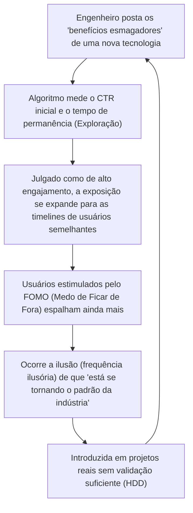

## 1. Introdução: A democratização da informação tecnológica e a ascensão dos algoritmos

Na engenharia de software moderna, grande parte da informação tecnológica que consumimos diariamente passa por serviços de redes sociais (SNS) e agregadores de notícias como X (antigo Twitter), Hacker News, Reddit e LinkedIn. Houve um tempo em que coletávamos informações de forma autônoma e em ordem cronológica por meio de listas de e-mail, blogs mantidos por especialistas específicos ou leitores de RSS. No entanto, com o aumento explosivo de frameworks e ferramentas criados todos os dias, tornou-se comum delegar a triagem de informações aos "Algoritmos de Recomendação (Recommendation Algorithms)" fornecidos pelas plataformas, a fim de otimizar nossos limitados recursos cognitivos (tempo disponível e atenção).

Essa mudança de paradigma trouxe o enorme benefício de permitir a descoberta eficiente de artigos técnicos úteis e projetos de código aberto inovadores. Por outro lado, também causou efeitos colaterais extremamente graves. Trata-se do fato de que **"as tendências tecnológicas e as melhores práticas que vemos são distorcidas não por uma superioridade técnica pura ou avaliação objetiva, mas pela 'função de otimização de engajamento' do algoritmo"**.

Neste artigo, desvendaremos de forma matemática e estrutural como os algoritmos avançados de aprendizado de máquina, que operam nos bastidores das redes sociais, moldam nossa cognição e influenciam nossa tomada de decisão nas escolhas tecnológicas. Além disso, analisaremos profundamente o perigo do "Hype Driven Development (HDD: Desenvolvimento Orientado pelo Hype)", no qual somos levados pelo entusiasmo gerado pelos algoritmos, e discutiremos abordagens práticas para nos libertarmos disso e fazermos escolhas tecnológicas objetivas e robustas.

---

## 2. A evolução e o mecanismo dos algoritmos de recomendação

Quando abrimos uma rede social, o conteúdo exibido na nossa linha do tempo (feed) não é aleatório. Existem modelos de aprendizado de máquina altamente ajustados para maximizar o tempo de permanência do usuário e aumentar a receita publicitária. Primeiro, vamos dar uma olhada nas tecnologias fundamentais por trás disso.

### 2.1 Filtragem Colaborativa (Collaborative Filtering) e Fatoração de Matrizes

Desde os primórdios dos sistemas de recomendação até o presente, a "filtragem colaborativa" tem funcionado como uma poderosa linha de base. Em particular, a "Fatoração de Matrizes (Matrix Factorization)", que representa as interações entre usuários e itens (postagens e artigos) como uma matriz e os mapeia em um espaço de características latentes, é amplamente utilizada.

Dado o número de usuários $M$ e o número de itens $N$, com uma matriz de avaliação $R \in \mathbb{R}^{M \times N}$, a fatoração de matrizes aproxima essa matriz gigante e esparsa ao produto de uma matriz de características latentes de baixa dimensão $U \in \mathbb{R}^{M \times K}$ (características do usuário) e $V \in \mathbb{R}^{N \times K}$ (características do item) ($K \ll M, N$).

$$
R \approx U \times V^T
$$

A pontuação prevista $\hat{r}_{ij}$ (probabilidade de engajamento) do item $j$ para um usuário específico $i$ é calculada como o produto escalar de seus respectivos vetores de características latentes.

$$
\hat{r}_{ij} = \mathbf{u}_i \cdot \mathbf{v}_j
$$

Esse modelo é treinado para minimizar a seguinte função de perda ($\lambda$ é um termo de regularização para evitar o *overfitting* ou sobreajuste).

$$
\mathcal{L} = \sum_{(i,j) \in \Omega} (r_{ij} - \mathbf{u}_i \cdot \mathbf{v}_j)^2 + \lambda (\|\mathbf{u}_i\|^2 + \|\mathbf{v}_j\|^2)
$$

**Impacto na escolha tecnológica:**
Esse algoritmo aproxima o "Usuário A, interessado em [Rust](https://kenji.blog/pt/p/webassembly-wasm-current-future/)" e o "Usuário B, interessado em [Rust](https://kenji.blog/pt/p/programming-languages-history-paradigm-evolution/)" no espaço latente. Se o Usuário A curtir uma postagem sobre um novo framework web, há uma alta probabilidade de que a postagem desse framework também apareça na linha do tempo do Usuário B. Com isso, ocorre um fenômeno onde uma tecnologia específica se torna um grande sucesso localmente dentro de um grupo de engenheiros que preferem uma determinada *stack* tecnológica.

### 2.2 Modelos de recomendação baseados em Deep Learning (DLRM)

Nos últimos anos, a arquitetura baseada em aprendizado profundo, representada pelo Deep Learning Recommendation Model (DLRM), tem se popularizado, liderada principalmente pela Meta ([antigo Facebook](/pt/p/history-of-meta-facebook/)). O DLRM recebe uma ampla variedade de características (Features) como entrada, como o histórico de comportamento do usuário e os metadados dos itens, e prevê a taxa de cliques (CTR: Click-Through Rate) e afins.

A característica do DLRM é que ele converte características categóricas esparsas (ex: ID do usuário, hashtags seguidas) em vetores densos (Dense Vectors) através de "Tabelas de Incorporação (Embedding Tables)" e os combina com características densas de valores contínuos (ex: dias desde a abertura da conta, tempo médio de permanência passado).

$$
\mathbf{e}_{\text{sparse}} = \text{EmbeddingLookup}(\mathbf{x}_{\text{sparse}})
$$
$$
\mathbf{h}_{\text{dense}} = \text{BottomMLP}(\mathbf{x}_{\text{dense}})
$$

Após concatenar (Concatenate) ou interagir (Feature Interaction) essas características por meio do produto escalar, elas são alimentadas em um perceptron multicamadas superior (Top MLP), e as probabilidades finais, como a CTR, são produzidas usando uma função sigmoide $\sigma$.

$$
\hat{y} = \sigma(\text{TopMLP}(\text{Interact}(\mathbf{e}_{\text{sparse}}, \mathbf{h}_{\text{dense}})))
$$

**Impacto na escolha tecnológica:**
Modelos gigantes como o DLRM capturam sinais extremamente sutis (por exemplo, um ligeiro aumento no tempo de permanência em "postagens com vídeos" ou "postagens contendo *buzzwords* específicas") e os refletem na pontuação prevista. Como resultado, informações tecnológicas contendo "títulos radicais (ex: 'O React está ultrapassado', 'O fim dos Microsserviços')" ou "demonstrações visualmente chamativas" tendem a ser favorecidas de forma algorítmica.

### 2.3 Aprendizado por Reforço e o Problema dos Multi-Armed Bandits

Os sistemas de recomendação precisam explorar constantemente as preferências mais recentes dos usuários. É aqui que entra o "Problema dos Multi-Armed Bandits". Ele otimiza o *trade-off* entre a "Exploração (Exploitation)" (apresentar conteúdos certos com base em preferências existentes) e a "Exploração/Descoberta (Exploration)" (descobrir novas tendências).

No algoritmo representativo UCB (Upper Confidence Bound), a pontuação ao selecionar um braço (grupo de conteúdo) $a$ no tempo $t$ é calculada da seguinte forma:

$$
a_t = \arg\max_{a} \left( \hat{\mu}_a + c \sqrt{\frac{\ln t}{N_a(t)}} \right)
$$

Aqui, $\hat{\mu}_a$ é a recompensa média histórica (taxa de engajamento) do braço $a$, $N_a(t)$ é o número de vezes que foi selecionado e $c$ é um parâmetro que ajusta o grau de exploração.

**Impacto na escolha tecnológica:**
O algoritmo dá temporariamente um bônus de exploração para postagens sobre novos frameworks ou bibliotecas (aquelas com baixo número de tentativas $N_a(t)$) e as expõe a grupos aleatórios de usuários. Se as reações de influenciadores, etc., forem boas durante essa "fase de exploração" inicial, o $\hat{\mu}_a$ aumentará acentuadamente e se transformará rapidamente em um *buzz* (viral). Esse é o mecanismo de "de repente, todos começam a falar sobre aquela tecnologia".

---

## 3. A matemática da Câmara de Eco (Echo Chamber) e da Bolha de Filtro

À medida que a otimização do algoritmo avança, os usuários passam a ser cercados apenas por "informações que acham agradáveis ou que reforçam suas crenças existentes". Isso é o **fenômeno da Câmara de Eco (Echo Chamber)** e da **Bolha de Filtro (Filter Bubble)**.

Na teoria das redes, a tendência de pessoas semelhantes se conectarem é chamada de "Homofilia (Homophily)". Em um grafo $G=(V, E)$, as arestas (relações de seguimento e propagação de informação) entre os nós (usuários) têm maior probabilidade de se formarem quanto maior for a similaridade dos atributos.

Os algoritmos de recomendação de redes sociais aceleram artificialmente essa homofilia. Por exemplo, suponha que haja uma comunidade de engenheiros que promovem a "Arquitetura [Serverless](https://kenji.blog/pt/p/serverless-architecture-aws-lambda-cold-start/)" e uma comunidade que apoia "Bare Metal On-Premise". O algoritmo aprenderá a reduzir o peso das arestas (Cross-cutting ties) entre diferentes comunidades e a fortalecer as arestas dentro da mesma comunidade (porque opiniões divergentes frequentemente causam aversão, correndo o risco de diminuir o engajamento. Ou inversamente, às vezes, podem causar engajamento através de raiva extrema, mas a primeira tendência é mais comum no mundo da tecnologia).

Como resultado, uma realidade técnica completamente dividida é criada, onde, na sua linha do tempo, parece que "empresas ao redor do mundo estão migrando para o serverless", enquanto na linha do tempo de outra pessoa parece que "abandonar a nuvem (Cloud Repatriation) é a tendência mundial".

---

## 4. Hype Driven Development (HDD) criado por algoritmos

A combinação de câmaras de eco e poderosos modelos de recomendação leva a um dos maiores antipadrões na indústria da engenharia: o **Hype Driven Development (Desenvolvimento Orientado pelo Hype)**. HDD é o fenômeno de adotar uma nova tecnologia simplesmente porque "está sendo falada nas redes sociais" ou "é a última tendência", sem considerar profundamente seus reais benefícios, *trade-offs* e a adequação aos requisitos de negócios da empresa.

O diagrama Mermaid abaixo ilustra como o algoritmo da rede social impulsiona o ciclo de *feedback* do HDD.



O que é assustador neste ciclo é que a **"Ilusão de Frequência (Fenômeno Baader-Meinhof)"** é induzida intencionalmente pelo algoritmo. Uma vez que você vê o nome de uma nova biblioteca de [gerenciamento de estado](/pt/p/state-management-history-redux-context-recoil-zustand/), o algoritmo o percebe como um sinal e, a partir do dia seguinte, preenche seu feed com tópicos sobre essa biblioteca. O cérebro humano interpreta isso equivocadamente como um "grande sucesso mundial".

O gráfico a seguir ilustra a diferença nos ciclos de vida de tecnologias excessivamente badaladas (hype) nas redes sociais em comparação com tecnologias mais modestas, monótonas, mas robustas (Boring Technology).

```mermaid
xychart-beta
    title Ciclo de vida e evolução da avaliação de tecnologias
    x-axis ["0 meses, 6 meses, 12 meses, 18 meses, 24 meses, 30 meses, 36 meses"]
    y-axis "Nº de menções e nível de entusiasmo no SNS" 0 --> 100
    line [10, 85, 95, 45, 20, 10, 5]
    line [15, 20, 25, 35, 50, 65, 80]
```
*(Nota: No gráfico acima, a linha que sobe e desce vertiginosamente representa a "Tecnologia com Hype", enquanto a linha que sobe de forma lenta e constante representa a "Boring Technology")*

Tecnologias que sofrem *hype* geralmente enfrentam problemas práticos como "falta de documentação", "bugs graves em *edge cases*" e "burnout dos mantenedores" 6 a 12 meses após a adoção, e desaparecem rapidamente das redes sociais. No entanto, uma vez que a tecnologia é integrada ao sistema, o custo de remover essa dívida técnica é enorme.

---

## 5. Estratégias para "se libertar do algoritmo" na escolha de tecnologias

Então, sob o domínio desses algoritmos, como podemos fazer escolhas tecnológicas objetivas e ponderadas? Aqui estão algumas estratégias práticas não para hackear o algoritmo, mas para "sair" dele.

### 5.1 Retorno às fontes primárias: Código-fonte e RFCs

A defesa mais segura é mudar suas fontes de informação das agregações de redes sociais para as **fontes primárias (Primary Sources)**.

1. **Leia o código-fonte:** Em vez de confiar em postagens nas redes sociais que afirmam "esta biblioteca é super rápida", abra o GitHub e verifique a complexidade computacional da lógica central e os mecanismos de alocação de memória.
2. **Acompanhe os RFCs (Request for Comments):** Muitos projetos maduros de código aberto (React, [Rust](https://kenji.blog/pt/p/webassembly-wasm-current-future/), Python, etc.) adotam o processo de RFC ao introduzir novas funcionalidades. Os RFCs detalham logicamente "por que essa funcionalidade é necessária", "quais são os *trade-offs* de design" e "quais são as alternativas", sem se preocupar com o engajamento de algoritmos. É aqui que reside o verdadeiro valor tecnológico.

### 5.2 Leitura atenta de Artigos Acadêmicos (Academic Papers) e White Papers

Para seleções tecnológicas fundamentais, como [sistemas distribuídos](/pt/p/cap-theorem-distributed-systems-tradeoff/), bancos de dados e arquiteturas de modelos de aprendizado de máquina, você não deve ler resumos de poucas linhas em redes sociais, mas sim os artigos acadêmicos publicados na ACM, IEEE ou arXiv, bem como os detalhados *white papers* publicados por empresas (por exemplo, o artigo do Google Spanner, o artigo do Amazon Dynamo).

As postagens em redes sociais são otimizadas para "capturar a atenção dos leitores", enquanto os artigos revisados por pares são otimizadas para "precisão dos fatos e reprodutibilidade". As funções de avaliação são completamente diferentes.

### 5.3 Estabelecimento de um framework de tomada de decisão dentro da organização

Para evitar o HDD no nível de equipe ou organização, é necessário um processo que elimine intuições subjetivas ou justificativas como "porque eu vi no Twitter". Um exemplo representativo disso é a adoção de **ADR (Architecture Decision Records)**.

Ao introduzir uma nova tecnologia, certifique-se de documentar os seguintes itens e submetê-los a revisão:
* **Context (Contexto):** Por que a nova tecnologia é necessária? Quais são os problemas atuais?
* **Decision (Decisão):** O que será adotado?
* **Consequences (Consequências):** Quais são os *trade-offs*? (O que será sacrificado e o que será ganho)

Forçar esse processo permite transformar o "Hype (Entusiasmo)" em "Engineering (Engenharia)".

### 5.4 A filosofia do Boring Technology Club

Há um mantra famoso no mundo da tecnologia: **"Choose Boring Technology" (Escolha uma tecnologia entediante/chata)**. Este é um ensinamento de que os *tokens de inovação* (os recursos limitados que uma organização pode gastar em novas tecnologias desconhecidas) não devem ser desperdiçados na escolha de infraestruturas ou frameworks que não estão diretamente ligados ao valor central do negócio.

Os algoritmos de redes sociais preferem a "novidade". No entanto, o que é necessário para construir um sistema robusto que suporte a operação no mundo real são as tecnologias "entediantes" (como PostgreSQL, [Redis](https://kenji.blog/pt/p/nosql-database-selection-kvs-document-graph-wide-column/), APIs REST padrão) que possuem mais de 10 anos de histórico operacional e cujos procedimentos de recuperação de falhas resultam em milhões de acertos em uma pesquisa no Google.

---

## 6. Conclusão: Como devemos lidar com a tecnologia

Os algoritmos de recomendação das redes sociais são ferramentas poderosas que ampliam nossos horizontes técnicos e nos conectam a grandes comunidades. Contudo, enquanto suas estruturas internas (fatoração de matrizes, DLRM, multi-armed bandits) tiverem como objetivo supremo a "maximização do engajamento", as informações produzidas serão inevitavelmente enviesadas.

Precisamos desenvolver a alfabetização para tratar as informações que fluem em nossas *timelines* não como "fatos" ou "tendências absolutas", mas simplesmente como "sinais".

Sair da câmara de eco, ler o código-fonte com suas próprias mãos, acompanhar as discussões nos RFCs, decifrar as fórmulas matemáticas em artigos acadêmicos e enfrentar os verdadeiros desafios do domínio de negócios de sua empresa. Esse é o único caminho para praticar a verdadeira engenharia de software sem ser engolido pela onda dos algoritmos.


