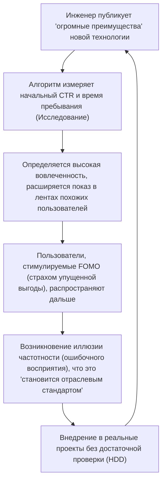

## 1. Введение: Демократизация технической информации и господство алгоритмов

В современной программной инженерии большая часть технической информации, которую мы потребляем ежедневно, проходит через социальные сети (SNS), такие как X (бывший Twitter), Hacker News, Reddit и LinkedIn, а также новостные агрегаторы. Когда-то мы собирали информацию автономно и в хронологическом порядке через списки рассылки, блоги, управляемые конкретными экспертами, или RSS-ридеры. Однако со взрывным ростом числа новых фреймворков и инструментов, появляющихся каждый день, стало обычной практикой полагаться на «алгоритмы рекомендаций (Recommendation Algorithms)», предоставляемые платформами, чтобы оптимизировать наши ограниченные когнитивные ресурсы (свободное время и внимание).

Этот сдвиг парадигмы принес огромные преимущества, позволив нам эффективно находить полезные технические статьи и новаторские проекты с открытым исходным кодом. Однако это также вызвало очень серьезный побочный эффект. Факт заключается в том, что **«технологические тренды и передовые методы, которые мы видим, искажаются не объективной оценкой или чисто техническим превосходством, а алгоритмической «функцией оптимизации вовлеченности»»**.

В этой статье мы с математической и структурной точек зрения разберем, как продвинутые алгоритмы машинного обучения, работающие за кулисами социальных сетей, формируют наше восприятие и влияют на процесс принятия решений при выборе технологий. Кроме того, мы глубоко рассмотрим опасности «Hype Driven Development (HDD: разработки, управляемой хайпом)», когда люди поддаются энтузиазму, порожденному алгоритмами, и конкретные подходы к отходу от этого в сторону объективного и надежного выбора технологий.

---

## 2. Эволюция и механизмы алгоритмов рекомендаций

Когда мы открываем социальную сеть, контент, отображаемый на нашей временной шкале (в ленте), не случаен. За этим стоят модели машинного обучения, тщательно настроенные для максимизации времени пребывания пользователя и увеличения доходов от рекламы. Давайте сначала посмотрим на технологии, лежащие в их основе.

### 2.1 Коллаборативная фильтрация (Collaborative Filtering) и матричное разложение

«Коллаборативная фильтрация» служила мощным базовым подходом с первых дней существования рекомендательных систем до настоящего времени. В частности, широко используется «матричное разложение (Matrix Factorization)», которое представляет взаимодействие между пользователями и элементами (постами или статьями) в виде матрицы и отображает их в скрытом пространстве признаков.

Если мы обозначим матрицу оценок для $M$ пользователей и $N$ элементов как $R \in \mathbb{R}^{M \times N}$, матричное разложение аппроксимирует эту огромную и разреженную (sparse) матрицу произведением матриц скрытых признаков низкой размерности $U \in \mathbb{R}^{M \times K}$ (признаки пользователей) и $V \in \mathbb{R}^{N \times K}$ (признаки элементов) ($K \ll M, N$).

$$
R \approx U \times V^T
$$

Прогнозируемая оценка (вероятность вовлеченности) $\hat{r}_{ij}$ элемента $j$ для конкретного пользователя $i$ вычисляется как скалярное произведение их соответствующих векторов скрытых признаков.

$$
\hat{r}_{ij} = \mathbf{u}_i \cdot \mathbf{v}_j
$$

Эта модель обучается так, чтобы минимизировать следующую функцию потерь ($\lambda$ — член регуляризации для предотвращения переобучения).

$$
\mathcal{L} = \sum_{(i,j) \in \Omega} (r_{ij} - \mathbf{u}_i \cdot \mathbf{v}_j)^2 + \lambda (\|\mathbf{u}_i\|^2 + \|\mathbf{v}_j\|^2)
$$

**Влияние на выбор технологий:**
Этот алгоритм сближает в скрытом пространстве «Человека А, интересующегося [Rust](https://kenji.blog/ru/p/webassembly-wasm-current-future/)» и «Человека Б, интересующегося Rust». Если А поставит лайк посту о новом веб-фреймворке, существует высокая вероятность того, что этот пост появится и в ленте Б. В результате возникает феномен, когда определенные технологии локально становятся очень популярными среди групп инженеров, предпочитающих конкретные технологические стеки.

### 2.2 Рекомендательные модели на основе глубокого обучения (DLRM)

В последние годы получили распространение архитектуры на основе глубокого обучения, такие как Deep Learning Recommendation Model (DLRM), в первую очередь популяризированные Meta (бывший Facebook). DLRM принимает на вход широкий спектр признаков (Features), таких как история прошлых действий пользователя и метаданные элементов, и прогнозирует рейтинг кликов (CTR: Click-Through Rate) и другие показатели.

Особенностью DLRM является то, что он преобразует разреженные категориальные признаки (например, идентификаторы пользователей, хештеги, на которые они подписаны) в плотные векторы (Dense Vector) через «таблицы встраивания (Embedding Table)» и комбинирует их с непрерывными плотными признаками (например, количество дней с момента создания учетной записи, среднее время пребывания в прошлом).

$$
\mathbf{e}_{\text{sparse}} = \text{EmbeddingLookup}(\mathbf{x}_{\text{sparse}})
$$
$$
\mathbf{h}_{\text{dense}} = \text{BottomMLP}(\mathbf{x}_{\text{dense}})
$$

После того как они объединяются (Concatenate) или взаимодействуют (Feature Interaction) посредством скалярного произведения, они подаются в верхний многослойный перцептрон (Top MLP), и окончательная вероятность (например, CTR) выводится с помощью сигмоидной функции $\sigma$.

$$
\hat{y} = \sigma(\text{TopMLP}(\text{Interact}(\mathbf{e}_{\text{sparse}}, \mathbf{h}_{\text{dense}})))
$$

**Влияние на выбор технологий:**
Огромные модели вроде DLRM способны улавливать даже самые незначительные сигналы (например, небольшое увеличение времени пребывания на «посте с видео» или «посте, содержащем определенное модное слово») и отражать их в прогнозируемом балле. В результате техническая информация, содержащая «провокационные заголовки (например, "React уже устарел", "Конец микросервисов")» или «визуально яркие демонстрации», с большей вероятностью будет алгоритмически предпочтительной.

### 2.3 Обучение с подкреплением и задача о многоруком бандите (Multi-Armed Bandits)

Рекомендательные системы всегда должны исследовать последние предпочтения пользователей. Здесь вступает в игру «задача о многоруком бандите». Она оптимизирует компромисс между «использованием (Exploitation)», то есть показом надежного контента на основе существующих предпочтений, и «исследованием (Exploration)» для обнаружения новых тенденций.

В типичном алгоритме UCB (Upper Confidence Bound) оценка для выбора ручки (группы контента) $a$ в момент времени $t$ вычисляется следующим образом:

$$
a_t = \arg\max_{a} \left( \hat{\mu}_a + c \sqrt{\frac{\ln t}{N_a(t)}} \right)
$$

Здесь $\hat{\mu}_a$ — среднее вознаграждение (уровень вовлеченности) ручки $a$ к настоящему времени, $N_a(t)$ — количество раз, когда она была выбрана, а $c$ — параметр, регулирующий степень исследования.

**Влияние на выбор технологий:**
Алгоритм временно предоставляет бонус к исследованию для постов о недавно появившихся фреймворках или библиотеках (с малым количеством попыток $N_a(t)$) и показывает их случайной группе пользователей. Если в течение этой начальной «фазы исследования» реакция влиятельных лиц (инфлюенсеров) положительна, $\hat{\mu}_a$ резко возрастает и быстро превращается в вирусный шум (базз). Это и есть механизм, из-за которого «внезапно все начинают говорить об этой технологии».

---

## 3. Математика эхо-камер и пузырей фильтров

По мере продвижения алгоритмической оптимизации пользователи начинают окружать себя «информацией, которая им приятна или которая подкрепляет их существующие убеждения». Это и есть **феномен эхо-камеры (Echo Chamber)** и ** пузырь фильтров (Filter Bubble)**.

В теории сетей тенденция схожих людей объединяться называется «гомофилией (Homophily)». В графе $G=(V, E)$ ребра (отношения подписки или распространение информации) между узлами (пользователями) с большей вероятностью образуются при высокой степени сходства атрибутов.

Алгоритмы рекомендаций в социальных сетях искусственно ускоряют эту гомофилию. Например, представьте, что есть сообщество инженеров, продвигающих «бессерверную архитектуру ([Serverless](https://kenji.blog/ru/p/serverless-architecture-aws-lambda-cold-start/))», и сообщество, поддерживающее «локальное размещение на голом железе (Bare Metal)». Алгоритм учится снижать вес ребер между различными сообществами (Cross-cutting ties) и усиливать ребра внутри одного сообщества (поскольку конфликтующие мнения часто вызывают уход с платформы и рискуют снизить вовлеченность. С другой стороны, иногда крайний гнев может повышать вовлеченность, но в технологической среде преобладает первая тенденция).

В результате на вашей временной шкале может показаться, что «компании по всему миру переходят на бессерверные технологии», в то время как на временной шкале кого-то другого будет казаться, что «уход из облака (Cloud Repatriation) — это глобальный тренд». Так создаются совершенно изолированные технологические реальности.

---

## 4. Разработка, управляемая хайпом (HDD), порожденная алгоритмами

Сочетание эхо-камер и мощных рекомендательных моделей приводит к одному из крупнейших антипаттернов в инженерной индустрии — **Hype Driven Development (разработке, управляемой хайпом)**. HDD — это феномен внедрения новых технологий просто потому, что они «обсуждаются в социальных сетях» или «являются последним трендом», без глубокого рассмотрения их реальных преимуществ, компромиссов или соответствия бизнес-требованиям компании.

Следующая диаграмма Mermaid показывает, как алгоритмы социальных сетей запускают цикл обратной связи HDD.



Что пугает в этом цикле, так это то, что алгоритм намеренно вызывает **«Иллюзию частотности (Феномен Баадера — Майнхоф)»**. Если вы однажды увидите название новой библиотеки управления состоянием, алгоритм воспримет это как сигнал и со следующего дня наполнит вашу ленту разговорами об этой библиотеке. Человеческий мозг ошибочно принимает это за «глобальную эпидемию».

На графике ниже показана разница в жизненных циклах технологий, которые чрезмерно расхайплены (преувеличены) в социальных сетях, и простых, скучных, но надежных технологий (Boring Technology).

```mermaid
xychart-beta
    title Жизненный цикл технологий и динамика их оценки
    x-axis ["0 мес.", "6 мес.", "12 мес.", "18 мес.", "24 мес.", "30 мес.", "36 мес."]
    y-axis "Количество упоминаний / Уровень энтузиазма в соцсетях" 0 --> 100
    line [10, 85, 95, 45, 20, 10, 5]
    line [15, 20, 25, 35, 50, 65, 80]
```
*(Примечание: на графике выше линия, которая резко возрастает и резко падает, представляет «Технологию на хайпе», а медленно и неуклонно растущая линия представляет «Скучную технологию»)*

Расхайпленные технологии сталкиваются с такими реальными проблемами, как «нехватка документации», «серьезные ошибки в крайних случаях» и «выгорание мейнтейнеров» через 6–12 месяцев после внедрения, и быстро исчезают из социальных сетей. Однако устранение технического долга, однажды встроенного в систему, требует огромных затрат.

---

## 5. Стратегии «отхода от алгоритмов» при выборе технологий

Итак, как мы можем принимать объективные и взвешенные решения о выборе технологий, находясь под контролем этих алгоритмов? Вот несколько конкретных стратегий не для взлома алгоритмов, а для «выхода» из-под их влияния.

### 5.1 Возврат к первоисточникам: исходный код и RFC

Самая надежная защита — это перенос источников информации с агрегаторов социальных сетей на **первоисточники (Primary Sources)**.

1. **Читайте исходный код:** Вместо того чтобы верить постам в социальных сетях о том, что «эта библиотека работает молниеносно», откройте GitHub и проверьте вычислительную сложность базовой логики и механизм выделения памяти.
2. **Следите за RFC (Request for Comments):** Многие зрелые проекты с открытым исходным кодом (React, [Rust](https://kenji.blog/ru/p/webassembly-wasm-current-future/), Python и т. д.) используют процесс RFC при внедрении новых функций. В RFC логично и беспристрастно описаны вопросы «зачем нужна эта функция», «каковы архитектурные компромиссы» и «каковы альтернативы», без оглядки на алгоритмическую вовлеченность. Именно здесь кроется истинная техническая ценность.

### 5.2 Внимательное чтение научных статей (Academic Papers) и технических документов (Whitepapers)

Когда дело доходит до фундаментального выбора технологий, таких как распределенные системы, базы данных и архитектуры моделей машинного обучения, вам следует читать напрямую научные статьи, опубликованные ACM, IEEE или arXiv, а также подробные технические документы, опубликованные компаниями (например, статья Google о Spanner, статья Amazon о Dynamo), а не резюме в несколько строк в социальных сетях.

Посты в социальных сетях оптимизированы на «захват внимания читателя», тогда как рецензируемые статьи оптимизированы на «фактическую точность и воспроизводимость». Функции оценки совершенно разные.

### 5.3 Построение фреймворка для принятия решений в организации

Чтобы предотвратить HDD на уровне команды или организации, необходим процесс, исключающий субъективную интуицию или причины вроде «потому что я видел это в Twitter». Типичным примером является внедрение **ADR (Architecture Decision Records)**.

При внедрении новой технологии следующие пункты всегда должны быть задокументированы и рецензированы:
* **Context (Контекст):** Зачем нужна новая технология? Какова текущая проблема?
* **Decision (Решение):** Что будет принято?
* **Consequences (Последствия):** Каковы компромиссы? (Чем мы жертвуем и что получаем?)

Сделав этот процесс обязательным, можно превратить «Хайп (Hype)» в «Инженерию (Engineering)».

### 5.4 Философия Boring Technology Club

В технологическом мире есть известная мантра: **"Choose Boring Technology" (Выбирайте скучные технологии)**. Она учит нас не тратить токены инноваций (ограниченные ресурсы, которые организация может потратить на новые неизвестные технологии) на выбор инфраструктуры или фреймворков, не связанных напрямую с основными бизнес-ценностями.

Алгоритмы социальных сетей любят «новизну». Однако для создания надежной системы, способной выдержать реальную эксплуатацию, вам нужны «скучные» технологии с более чем 10-летней историей использования, процедуры восстановления после сбоев для которых дают миллионы результатов в поиске Google (PostgreSQL, Redis, стандартные REST API и т. д.).

---

## 6. Заключение: Как нам следует относиться к технологиям

Алгоритмы рекомендаций социальных сетей — это мощные инструменты, которые расширяют наш технологический кругозор и позволяют знакомиться с замечательными сообществами. Однако, поскольку их внутренняя структура (матричное разложение, DLRM, многорукие бандиты) имеет своей главной целью «максимизацию вовлеченности», выдаваемая информация неизбежно будет предвзятой.

Нам необходимо развить грамотность, чтобы относиться к информации, поступающей в наши ленты, как к одному из «сигналов», а не как к «фактам» или «абсолютным трендам».

Нужно выйти за пределы эхо-камер, читать исходный код своими глазами, следить за обсуждениями в RFC, расшифровывать математические формулы в научных статьях и смотреть в лицо истинным проблемам нашего бизнес-домена. Это единственный способ практиковать настоящую программную инженерию, не будучи поглощенным волной алгоритмов.


