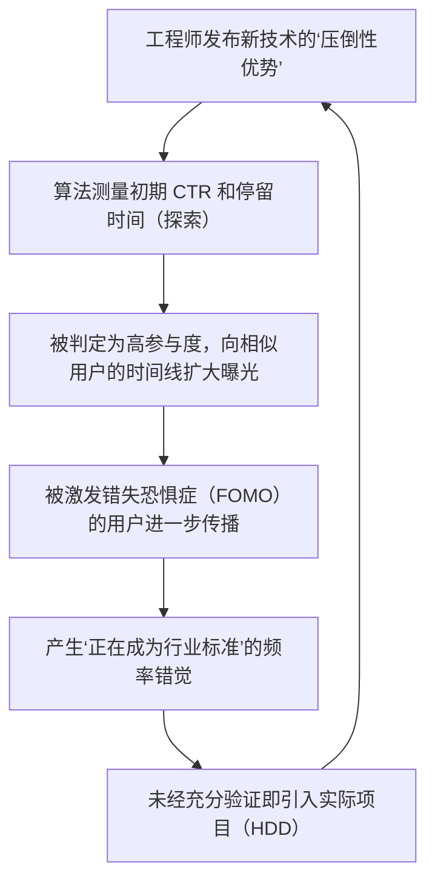

## 1. 引言：技术信息的民主化与算法的崛起

在现代软件工程中，我们每天消费的大量技术信息都是通过 X（原 Twitter）、Hacker News、Reddit、LinkedIn 等社交网络服务（SNS）或新闻聚合器获取的。曾经有过这样一个时代：我们通过邮件列表、特定专家运营的博客，或是 RSS 阅读器，自主且按时间顺序收集信息。然而，随着每天诞生的框架和工具呈现爆炸式增长，为了优化我们有限的认知资源（可支配时间和注意力），将信息筛选交给平台方提供的“推荐算法（Recommendation Algorithms）”已成为常态。

这种范式的转变为我们高效发现有价值的技术文章和突破性的开源项目带来了巨大的便利。但与此同时，它也引发了极其严重的副作用。那就是： **“我们所看到的技术趋势和最佳实践，并非由纯粹的技术优势或客观评价决定，而是被算法的‘参与度优化函数（Engagement Optimization Function）’所扭曲”** 。

本文将从数学和结构的角度，深入剖析在 SNS 背后运行的高级机器学习算法，是如何塑造我们的认知并影响技术选型决策的。此外，我们还将深入探讨被算法制造的狂热所裹挟的“炒作驱动开发（Hype Driven Development，HDD）”的危险性，以及摆脱这种状态、进行客观且稳健的技术选型的具体方法。

---

## 2. 推荐算法的演进与机制

当我们打开 SNS 时，时间线（信息流）上显示的内容并非随机。这里存在着为了最大化用户停留时间并提高广告收益而经过高度调优的机器学习模型。首先，让我们来看看构成这些核心的技术。

### 2.1 协同过滤（Collaborative Filtering）与矩阵分解

从推荐系统的黎明期直到现在，“协同过滤”一直作为强大的基线（Baseline）发挥着作用。特别是将用户与项目（帖子或文章）的交互表示为矩阵，并映射到潜在特征空间的“矩阵分解（Matrix Factorization）”被广泛使用。

假设有 $M$ 个用户和 $N$ 个项目的评分矩阵 $R \in \mathbb{R}^{M \times N}$，矩阵分解将这个庞大且稀疏（Sparse）的矩阵近似为低维潜在特征矩阵 $U \in \mathbb{R}^{M \times K}$（用户特征）和 $V \in \mathbb{R}^{N \times K}$（项目特征）的乘积（$K \ll M, N$）。

$$
R \approx U \times V^T
$$

对于特定用户 $i$ 和项目 $j$ 的预测得分（互动的可能性）$\hat{r}_{ij}$，通过各自潜在特征向量的内积来计算。

$$
\hat{r}_{ij} = \mathbf{u}_i \cdot \mathbf{v}_j
$$

该模型的训练目标是最小化以下损失函数（$\lambda$ 是防止过拟合的正则化项）。

$$
\mathcal{L} = \sum_{(i,j) \in \Omega} (r_{ij} - \mathbf{u}_i \cdot \mathbf{v}_j)^2 + \lambda (\|\mathbf{u}_i\|^2 + \|\mathbf{v}_j\|^2)
$$

**对技术选型的影响：**
这个算法会在潜在空间上将“对 Rust 感兴趣的 A”和“对 Rust 感兴趣的 B”拉近。如果 A 对某个新兴 Web 框架的帖子点了“赞”，那么 B 的时间线上也很大概率会出现该框架的帖子。由此，在偏好特定技术栈的工程师群体中，就会发生特定技术局部大流行的现象。

### 2.2 基于深度学习的推荐模型 (DLRM)

近年来，以 Meta（原 Facebook）等为中心普及的是以深度学习推荐模型（Deep Learning Recommendation Model，DLRM）为代表的架构。DLRM 接收用户的过去行为历史、项目的元数据等多种多样的特征（Feature）作为输入，预测点击率（CTR：Click-Through Rate）等指标。

DLRM 的特点在于，它通过“嵌入表（Embedding Table）”将稀疏的类别特征（如用户 ID、关注的话题标签）转换为稠密向量（Dense Vector），并将其与连续的稠密特征（如账号注册以来的天数、过去平均停留时间）结合起来。

$$
\mathbf{e}_{\text{sparse}} = \text{EmbeddingLookup}(\mathbf{x}_{\text{sparse}})
$$
$$
\mathbf{h}_{\text{dense}} = \text{BottomMLP}(\mathbf{x}_{\text{dense}})
$$

将这些特征拼接（Concatenate）或通过内积等方式进行交互（Feature Interaction）后，输入到上层的多层感知机（Top MLP）中，最后通过 Sigmoid 函数 $\sigma$ 输出 CTR 等最终概率。

$$
\hat{y} = \sigma(\text{TopMLP}(\text{Interact}(\mathbf{e}_{\text{sparse}}, \mathbf{h}_{\text{dense}})))
$$

**对技术选型的影响：**
像 DLRM 这样庞大的模型，能够捕捉到极其微小的信号（例如，对“带有视频的帖子”或“包含特定流行语的帖子”停留时间的微小增加），并将其反映在预测得分中。结果就是，包含“极端标题（如‘React 已经过时’、‘微服务的终结’）”或“视觉上炫酷的演示”的技术信息，在算法上更容易获得优待。

### 2.3 强化学习与多臂老虎机问题 (Multi-Armed Bandits)

推荐系统必须时刻探索用户的最新偏好。这里就出现了“多臂老虎机问题”。它旨在优化“利用（Exploitation）”（基于现有偏好推送确定的内容）与“探索（Exploration）”（发现新趋势）之间的权衡。

作为代表性算法的 UCB (Upper Confidence Bound)，在时刻 $t$ 选择臂（内容群）$a$ 时的得分计算如下：

$$
a_t = \arg\max_{a} \left( \hat{\mu}_a + c \sqrt{\frac{\ln t}{N_a(t)}} \right)
$$

这里，$\hat{\mu}_a$ 是臂 $a$ 迄今为止的平均奖励（参与率），$N_a(t)$ 是被选择的次数，$c$ 是调整探索程度的参数。

**对技术选型的影响：**
算法会对关于新出现的框架或库的帖子（尝试次数 $N_a(t)$ 较少的帖子）暂时给予探索奖励，让它们暴露给随机的用户群。在这个初期的“探索阶段”，如果意见领袖（Influencers）等反应良好，$\hat{\mu}_a$ 就会急剧上升，一举演变成病毒式传播（Viral）。这就是“突然每个人都在谈论那项技术”的机制。

---

## 3. 回声室效应与信息茧房的数学原理

随着算法优化的深入，用户会变得只被“自己觉得舒适的信息，或者强化自己现有信念的信息”所包围。这就是 **回声室效应（Echo Chamber）** 和 **信息茧房（Filter Bubble）** 。

在网络理论中，相似者更容易相互连接的性质被称为“同质性（Homophily）”。在图 $G=(V, E)$ 中，节点（用户）之间的边（关注关系或信息传播），其属性相似度越高越容易形成。

SNS 的推荐算法人为地加速了这种同质性。例如，假设有一个推广“无服务器架构（Serverless Architecture）”的工程师社区，以及一个支持“本地裸金属服务器（On-Premises Bare Metal）”的社区。算法会学习降低不同社区之间边（Cross-cutting ties）的权重，并强化同一社区内的边（因为对立的意见通常会引起用户的流失，存在降低参与度的风险。或者反过来说，有时极端的愤怒也会引发参与度，但在技术圈内前者更为常见）。

结果，在你的时间线上，看起来“全世界的企业都在向无服务器迁移”；而在另一个人的时间线上，看起来“逃离云端（Cloud Repatriation）才是世界趋势”，这就创造了完全割裂的技术现实。

---

## 4. 算法催生的炒作驱动开发 (HDD)

回声室效应与强大的推荐模型相结合，引发了工程界最大的反模式之一： **炒作驱动开发（Hype Driven Development，HDD）** 。HDD 是指在没有深入考虑技术的实际优势、权衡以及与公司业务需求的契合度的情况下，仅仅因为“在 SNS 上引起热议”、“是最新趋势”而采用新技术的现象。

以下的 Mermaid 图展示了 SNS 算法是如何推动 HDD 反馈循环的。



这个循环中最可怕的是， **“频率错觉（Baader-Meinhof phenomenon）”** 是被算法有意引发的。当你看到某个新的状态管理库的名字一次，算法就会将其作为信号捕捉，从第二天起你的信息流就会被关于该库的话题填满。人类的大脑会将其误认为“全球性的大流行”。

以下图表展示了在 SNS 上被过度炒作（Hype）的技术与朴实无华但稳健的技术（Boring Technology）在生命周期上的差异。

```mermaid
xychart-beta
    title 技术生命周期与评价演变
    x-axis ["0个月", "6个月", "12个月", "18个月", "24个月", "30个月", "36个月"]
    y-axis "SNS上的提及数与狂热度" 0 --> 100
    line [10, 85, 95, 45, 20, 10, 5]
    line [15, 20, 25, 35, 50, 65, 80]
```
*(注：在上图中，急剧上升并急剧下降的线表示“被炒作的技术”，而缓慢稳定上升的线表示“Boring Technology”)*

被炒作的技术在引入后的 6 到 12 个月内，就会面临“文档不足”、“边缘情况下的严重 Bug”、“维护者倦怠”等现实问题，并迅速从 SNS 上消失。然而，要移除一旦被整合进系统中的技术债务，需要付出巨大的成本。

---

## 5. 技术选型中“摆脱算法”的策略

那么，在这个被算法统治的时代，我们应该如何进行客观冷静的技术选型呢？以下介绍几种不是为了破解算法，而是为了“跳出”算法的具体策略。

### 5.1 回归一手信息：源代码与 RFC

最稳妥的防御策略是将信息源从 SNS 的聚合，转移到 **一手信息（Primary Sources）** 。

1. **阅读源代码：** 与其相信 SNS 上“这个库速度极快”的帖子，不如实际打开 GitHub，检查核心逻辑的时间复杂度和内存分配机制。
2. **追踪 RFC (Request for Comments)：** 许多成熟的开源项目（React、Rust、Python 等）在引入新功能时都采用了 RFC 流程。在 RFC 中，“为什么需要这个功能”、“有哪些设计上的权衡”、“替代方案是什么”等内容，都会在不顾及算法参与度的情况下被客观、有逻辑地记录下来。这里才沉睡着真正的技术价值。

### 5.2 精读论文（Academic Papers）与白皮书

在分布式系统、数据库、机器学习模型架构等核心技术选型中，不应依赖 SNS 上的几行总结，而应该直接阅读 ACM、IEEE 或 arXiv 上公开的论文，或是企业发布的详细白皮书（例如 Google 的 Spanner 论文，Amazon 的 Dynamo 论文）。

SNS 的帖子是针对“夺取读者的注意力”而优化的，但经过同行评审的论文则是针对“事实的准确性和可重复性”而优化的。它们的评估函数完全不同。

### 5.3 在组织内建立决策框架

为了在团队或组织层面上防止 HDD，我们需要引入排除个人直觉或“因为在 Twitter 上看到”这类理由的流程。其代表性例子就是引入 **ADR (Architecture Decision Records)** 。

在引入新技术时，必须记录以下事项并接受审查：
* **Context (背景):** 为什么需要新技术？当前的痛点是什么？
* **Decision (决定):** 决定采用什么？
* **Consequences (结果):** 权衡是什么？（牺牲了什么，得到了什么）

通过强制执行这一流程，可以将“狂热（Hype）”转化为“工程（Engineering）”。

### 5.4 Boring Technology Club 的哲学

技术圈有一句著名的口头禅： **"Choose Boring Technology"（选择无聊的技术）** 。这告诫我们，不要将创新代币（Innovation Tokens，即组织在采用未知的技术上能花费的有限资源）浪费在与业务核心价值不直接相关的基础设施或框架的选择上。

SNS 的算法偏好“新奇”。但是，在构建能经受实际运行考验的稳健系统时，我们需要的正是那些有 10 年以上运行记录、在发生故障时的恢复步骤能在 Google 上搜出数百万条结果的“无聊”技术（如 PostgreSQL、Redis、标准的 REST API 等）。

---

## 6. 结论：我们该如何面对技术

SNS 的推荐算法是拓宽我们的技术视野、让我们结识优秀社区的强大工具。然而，既然其内部结构（矩阵分解、DLRM、多臂老虎机）以“最大化参与度”为最高使命，那么其输出的信息必然带有偏见。

我们需要培养一种素养，不要把流过时间线的信息当作“事实”或“绝对的趋势”来接受，而是仅仅将其作为一个“信号”。

走出回声室，亲自动手阅读源代码，追踪 RFC 的讨论，解读论文中的数学公式，直面自己公司业务领域的真正挑战。这才是避免被算法浪潮吞噬、践行真正软件工程的唯一途径。


