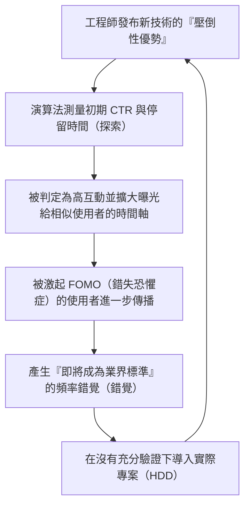
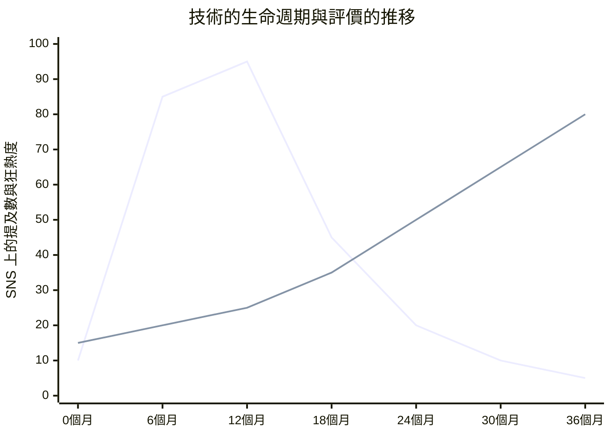

## 1. 簡介：技術資訊的民主化與演算法的崛起

在現代的軟體工程中，我們日常吸收的技術資訊大多是透過 X（原 Twitter）、Hacker News、Reddit、LinkedIn 等社群網路服務（SNS）或新聞聚合器來獲得。過去，我們曾透過郵件論壇、特定專家經營的部落格，或是 RSS 閱讀器，自主且按時間順序地收集資訊。然而，隨著每天不斷湧現的框架和工具呈現爆炸性增長，為了最佳化我們有限的認知資源（可用時間與注意力），將資訊篩選的工作交由平台端提供的「推薦演算法（Recommendation Algorithms）」已成為常態。

這種典範轉移帶來了巨大的好處，讓我們能高效率地發現有用的技術文章和具突破性的開源專案。但另一方面，它也引發了極為嚴重的副作用。那就是：**「我們所看到的技術趨勢和最佳實踐，並非建立在純粹的技術優勢或客觀評價之上，而是被演算法的『互動最佳化函數』所扭曲」**的這個事實。

在本文中，我們將從數學與結構的角度，剖析在 SNS 背後運作的高階機器學習演算法，是如何塑造我們的認知，並影響我們在技術選型上的決策。此外，我們也將深入探討隨波逐流於演算法所製造的狂熱中的「炒作驅動開發（Hype Driven Development，HDD）」之危險性，並思考如何擺脫它，以客觀且穩健的方式進行技術選型的具體方法。

---

## 2. 推薦演算法的演進與機制

當我們打開 SNS 時，時間軸（動態消息）上顯示的內容並非隨機的。在那裡，存在著為了最大化使用者停留時間並提升廣告收益而經過高度微調的機器學習模型。首先，讓我們來看看構成這些基礎的核心技術。

### 2.1 協同過濾（Collaborative Filtering）與矩陣分解

從推薦系統的黎明期到現在，一直作為強大基準發揮作用的就是「協同過濾」。特別是將使用者與項目（貼文或文章）的互動表示為矩陣，並將其映射到潛在特徵空間的「矩陣分解（Matrix Factorization）」，更是被廣泛使用。

假設使用者數量為 $M$、項目數量為 $N$，評分矩陣為 $R \in \mathbb{R}^{M \times N}$。在矩陣分解中，會將這個巨大且稀疏（Sparse）的矩陣，近似為低維度的潛在特徵矩陣 $U \in \mathbb{R}^{M \times K}$（使用者特徵）與 $V \in \mathbb{R}^{N \times K}$（項目特徵）的乘積（$K \ll M, N$）。

$$
R \approx U \times V^T
$$

針對特定使用者 $i$ 對於項目 $j$ 的預測分數（互動的可能性）$\hat{r}_{ij}$，會以各自的潛在特徵向量的內積來計算。

$$
\hat{r}_{ij} = \mathbf{u}_i \cdot \mathbf{v}_j
$$

該模型會透過最小化以下損失函數來進行訓練（$\lambda$ 為防止過度擬合的正規化項）。

$$
\mathcal{L} = \sum_{(i,j) \in \Omega} (r_{ij} - \mathbf{u}_i \cdot \mathbf{v}_j)^2 + \lambda (\|\mathbf{u}_i\|^2 + \|\mathbf{v}_j\|^2)
$$

**對技術選型的影響：**
這個演算法會將「對 Rust 感興趣的 A」和「對 Rust 感興趣的 B」在潛在空間中拉近。如果 A 對某個新興的 Web 框架的貼文按了「讚」，那麼 B 的時間軸上也有很高的機率會顯示該框架的貼文。這就導致了在偏好特定技術堆疊的工程師群體中，特定技術會在局部引發大流行的現象。

### 2.2 使用深度學習的推薦模型 (DLRM)

近年來，以 Meta（原 Facebook）等公司為中心普及的，是以 Deep Learning Recommendation Model (DLRM) 為代表的基於深度學習的架構。DLRM 接收使用者過去的行為歷史、項目的後設資料等各式各樣的特徵量（Feature）作為輸入，並預測點擊率（CTR：Click-Through Rate）等。

DLRM 的特徵在於，它將稀疏的類別特徵量（例如：使用者 ID、追蹤的標籤）透過「嵌入表（Embedding Table）」轉換為稠密向量（Dense Vector），並將其與連續值的稠密特徵量（例如：帳號建立以來的天數、過去的平均停留時間）結合起來。

$$
\mathbf{e}_{\text{sparse}} = \text{EmbeddingLookup}(\mathbf{x}_{\text{sparse}})
$$
$$
\mathbf{h}_{\text{dense}} = \text{BottomMLP}(\mathbf{x}_{\text{dense}})
$$

將這些進行串接（Concatenate）或內積等相互作用（Feature Interaction）後，輸入到頂部的多層感知器（Top MLP）中，並透過 Sigmoid 函數 $\sigma$ 輸出最終的 CTR 等機率。

$$
\hat{y} = \sigma(\text{TopMLP}(\text{Interact}(\mathbf{e}_{\text{sparse}}, \mathbf{h}_{\text{dense}})))
$$

**對技術選型的影響：**
像 DLRM 這樣的巨大模型，能夠捕捉到極其微小的訊號（例如：對「附有影片的貼文」或「包含特定流行語的貼文」停留時間的些微增加），並將其反映在預測分數中。結果導致，包含「過激標題（例如：『React 已經過時了』、『微服務的終結』）」或「視覺上華麗的展示」的技術資訊，更容易在演算法上獲得優待。

### 2.3 強化學習與多臂吃角子老虎機問題 (Multi-Armed Bandits)

推薦系統必須不斷探索使用者的最新偏好。在這裡登場的就是「多臂吃角子老虎機問題」。它會在基於現有偏好提供確定內容的「利用（Exploitation）」與為了發現新趨勢的「探索（Exploration）」之間的權衡進行最佳化。

在具代表性的演算法 UCB (Upper Confidence Bound) 中，於時間 $t$ 選擇手臂（內容群體）$a$ 時的分數計算如下：

$$
a_t = \arg\max_{a} \left( \hat{\mu}_a + c \sqrt{\frac{\ln t}{N_a(t)}} \right)
$$

其中，$\hat{\mu}_a$ 為手臂 $a$ 到目前為止的平均報酬（互動率），$N_a(t)$ 為被選擇的次數，$c$ 是用來調整探索程度的參數。

**對技術選型的影響：**
演算法會對新出現的框架或函式庫相關的貼文（嘗試次數 $N_a(t)$ 較少者），給予暫時的探索獎勵，並將其曝光給隨機的使用者群體。如果在初期的「探索階段」中，網紅等人的反應良好，$\hat{\mu}_a$ 就會急遽上升，並一口氣發展成爆紅（病毒式傳播）。這就是「突然每個人都在談論那項技術」的機制。

---

## 3. 同溫層與過濾氣泡的數學原理

隨著演算法最佳化的推進，使用者會逐漸被「讓自己感到舒適的資訊，或是能強化自己既有信念的資訊」所包圍。這就是**同溫層現象（Echo Chamber）**以及**過濾氣泡（Filter Bubble）**。

在網路理論中，相似者容易互相連結的性質稱為「同質性（Homophily）」。在圖 $G=(V, E)$ 中，節點（使用者）之間的邊緣（追蹤關係或資訊傳播），在屬性相似度越高時越容易形成。

SNS 的推薦演算法會人工地加速這種同質性。例如，假設有一個推廣「無伺服器架構（Serverless Architecture）」的工程師社群，和一個支持「地端裸機（On-premises Bare Metal）」的社群。演算法會降低不同社群間邊緣（Cross-cutting ties）的權重，並學習強化同一社群內的邊緣（因為對立的意見通常會引起使用者的流失，有降低互動的風險。或是相反地，有時也會引發極端憤怒的互動，但在技術圈中往往是前者居多）。

結果就是，在你的時間軸上看起來像是「全世界的企業都在轉向無伺服器」，而在另一個人的時間軸上看起來則是「脫離雲端（Cloud Repatriation）才是世界的趨勢」，從而創造出完全分裂的技術現實。

---

## 4. 演算法所產生的炒作驅動開發 (HDD)

同溫層與強大的推薦模型結合，會引發工程界最大的反模式之一：**炒作驅動開發（Hype Driven Development，HDD）**。HDD 是指在沒有深入探討技術的實際優點、權衡（Trade-offs）以及是否符合自家商業需求的情況下，僅僅因為「在 SNS 上成為話題」、「是最新趨勢」等理由，就採用新技術的現象。

以下的 Mermaid 圖表，展示了 SNS 的演算法是如何驅動 HDD 的反饋迴圈。

在這個迴圈中最可怕的是，**「頻率錯覺（Baader-Meinhof phenomenon）」**是被演算法刻意引發的。當你第一次看到某個新的狀態管理函式庫的名稱時，演算法會將其視為訊號，並從隔天開始用關於該函式庫的話題填滿你的動態消息。人類的大腦會將這誤認為是「世界級的大流行」。

以下的圖表，顯示了在 SNS 上被過度炒作（誇大宣傳）的技術，與不起眼、無聊但穩健的技術（Boring Technology）在生命週期上的差異。

*(註：在上述圖表中，急遽上升又急遽下降的折線代表「被炒作的技術」，緩慢而穩定上升的折線則代表「Boring Technology」)*

被炒作的技術在導入後 6 到 12 個月，會面臨「文件不足」、「邊緣情況下的嚴重錯誤」、「維護者過勞（Burnout）」等現實問題，並迅速從 SNS 上消失。然而，要移除一旦被整合進系統中的技術債，將需要花費龐大的成本。

---

## 5. 技術選型中的「擺脫演算法」策略

那麼，在這種演算法的支配下，我們該如何進行客觀冷靜的技術選型呢？這不是要駭入演算法，而是為大家介紹幾個從演算法中「下車」的具體策略。

### 5.1 回歸第一手資訊：原始碼與 RFC

最可靠的防禦策略，是將資訊來源從 SNS 的聚合器轉移至**第一手資訊（Primary Sources）**。

1. **閱讀原始碼：**與其相信 SNS 上「這個函式庫超快」的貼文，不如實際打開 GitHub，確認核心邏輯的計算複雜度與記憶體配置的機制。
2. **追蹤 RFC (Request for Comments)：**許多成熟的開源專案（如 React, Rust, Python 等），在導入新功能時會採用 RFC 流程。在 RFC 中，會淡淡地、有邏輯地記載「為什麼需要這個功能」、「設計上有什麼權衡」、「替代方案是什麼」，而無須去在意演算法的互動率。這裡面才沉睡著真正的技術價值。

### 5.2 精讀論文（Academic Papers）與白皮書

在涉及分散式系統、資料庫、機器學習模型架構等基礎技術的選型時，與其看 SNS 上的幾行總結，更應該直接閱讀 ACM、IEEE 或 arXiv 上公開的論文，或是企業公開的詳細白皮書（例如：Google 的 Spanner 論文、Amazon 的 Dynamo 論文）。

SNS 的貼文是為了「奪取讀者的注意力（Attention）」而最佳化的，但經過同行審查的論文則是為了「事實的正確性與可重複性」而最佳化的。兩者的評估函數完全不同。

### 5.3 在組織內建立決策框架

為了在團隊或組織層級防範 HDD，我們需要一個能夠排除個人直覺或「因為在 Twitter 上看到」等理由的流程。其代表性的例子就是導入 **ADR (Architecture Decision Records)**。

在導入新技術時，務必將以下項目文件化並接受審查：
* **Context（背景）：**為什麼需要新技術？目前的課題是什麼？
* **Decision（決定）：**要採用什麼？
* **Consequences（結果）：**權衡是什麼？（犧牲了什麼來換取什麼？）

透過強制執行這個流程，可以將「Hype（狂熱）」轉化為「Engineering（工程）」。

### 5.4 Boring Technology Club 的哲學

技術圈有一個很有名的箴言：**「選擇無聊的技術（Choose Boring Technology）」**。這個教誨告訴我們，不應該將創新代幣（Innovation Token，組織能夠花費在未知新技術上的有限資源）浪費在與商業核心價值無直接關聯的基礎設施或框架選型上。

SNS 的演算法偏好「新奇性」。然而，為了建構出能夠經得起實際營運考驗的穩健系統，所需要的正是那些有著 10 年以上運作實績，且在發生故障時的復原步驟能在 Google 上搜尋到數百萬筆結果的「無聊」技術（如 PostgreSQL、Redis、標準的 REST API 等）。

---

## 6. 結論：我們該如何面對技術

SNS 的推薦演算法是一個能擴展我們技術視野、並讓我們與優秀社群相遇的強大工具。然而，既然其內部結構（矩陣分解、DLRM、多臂吃角子老虎機）將「最大化互動」視為最高指導原則，那麼輸出的資訊就必然帶有偏見（Bias）。

我們不能將流經時間軸的資訊視為「事實」或「絕對的趨勢」，而是需要培養將其純粹當作一個「訊號」來處理的素養。

走出同溫層，親自動手閱讀原始碼、追蹤 RFC 的討論、解讀論文中的數學公式，並直面自家商業領域的真正課題。這才是避免被演算法浪潮所吞噬，實踐真正軟體工程的唯一途徑。

