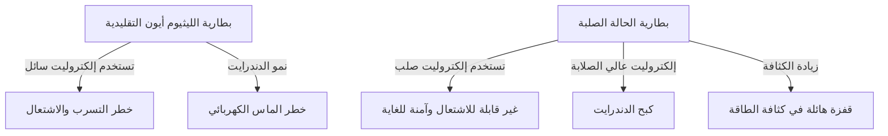

# كيفية عمل بطاريات الحالة الصلبة: ثورة الطاقة في قلب السيارات الكهربائية من الجيل القادم

في العصر الحالي حيث يتقدم انتشار السيارات الكهربائية (EV) بوتيرة سريعة، أصبح تطور تكنولوجيا البطاريات هو التحدي الأهم في ثورة التنقل. في هذا السياق، تتنافس معاهد البحوث وشركات صناعة السيارات حول العالم لتطوير "بطارية الحالة الصلبة (Solid-State Battery)" باعتبارها "الورقة الرابحة لبطاريات الجيل القادم".

في هذا المقال، سنشرح بتعمق الحدود الحالية لبطاريات الليثيوم أيون التقليدية، والآليات الثورية لبطاريات الحالة الصلبة، بالإضافة إلى التحديات التقنية نحو تنفيذها في المجتمع.

## 1. التحديات التي تواجه بطاريات الليثيوم أيون التقليدية

تمتلك بطاريات الليثيوم أيون (LIB)، المستخدمة حالياً على نطاق واسع من الهواتف الذكية إلى السيارات الكهربائية، خصائص ممتازة تتمثل في الكثافة العالية للطاقة والوزن الخفيف. ومع ذلك، نظراً لبنيتها، هناك بعض التحديات التي لا مفر منها.

### المخاطر المرتبطة بالكهل المحلول السائل (الإلكتروليت السائل)
تقوم بطاريات الليثيوم أيون التقليدية بالشحن والتفريغ عن طريق انتقال أيونات الليثيوم بين القطب الموجب والقطب السالب. يعمل "الإلكتروليت السائل" كممر لهذه الأيونات. ومع ذلك، يرتبط الإلكتروليت السائل بالمخاطر الفيزيائية والكيميائية التالية:

- **التسرب والقابلية للتطاير**: هناك خطر يتمثل في تسرب الإلكتروليت السائل القابل للاشتعال بسبب الصدمات الخارجية أو التدهور.
- **الانفلات الحراري (Thermal Runaway)**: عندما ترتفع درجة الحرارة الداخلية بسبب دائرة قصر (ماس كهربائي) أو شحن زائد، يتبخر الإلكتروليت السائل وقد يشتعل، مما يتسبب في تفاعل تسلسلي لارتفاع درجات الحرارة يُعرف بالانفلات الحراري. العديد من حوادث حرائق السيارات الكهربائية تعود إلى هذه الظاهرة.

### تكوين التشعبات (التشعبات الشجرية أو الدندرايت)
مع تكرار الشحن، يحدث ترسيب ونمو لمعدن الليثيوم على سطح القطب السالب على شكل فروع شجرية تُعرف باسم "الدندرايت". عندما تنمو هذه التشعبات وتخترق الفاصل لتصل إلى القطب الموجب، فإنها تسبب ماساً كهربائياً داخلياً، مما يؤدي إلى نشوب حريق أو انفجار.

### حدود كثافة الطاقة
لضمان السلامة، من الضروري توفير غلاف قوي ونظام تبريد وهوامش أمان، مما يؤدي بدوره إلى زيادة حجم ووزن حزمة البطارية بأكملها. بالإضافة إلى ذلك، نظراً لحدود تحمل الجهد الكهربائي للإلكتروليت السائل، كان استخدام المواد ذات الجهد والسعة العالية مقيداً.

## 2. ما هي بطارية الحالة الصلبة؟: التحول الجذري من السائل إلى الصلب

كما يوحي اسمها، فإن بطارية الحالة الصلبة هي بطارية تستبدل "الإلكتروليت السائل" التقليدي بـ "إلكتروليت صلب".

### المزايا الرئيسية لبطاريات الحالة الصلبة

1. **أقصى درجات الأمان**
   نظراً لعدم استخدام مذيبات عضوية قابلة للاشتعال، فإن خطر التسرب أو الاشتعال يكون منخفضاً للغاية. حتى في حالة حدوث تدمير مادي مثل اختراق مسمار (اختبار اختراق المسامير)، فإنها تتمتع بمستوى عالٍ جداً من الأمان حيث من غير المرجح أن تتسبب في انفلات حراري.

2. **قفزة هائلة في كثافة الطاقة**
   نظراً لأن الإلكتروليت الصلب يكون مستقراً عند الجهد العالي، فإنه من الممكن استخدام مواد أكثر قوة للقطب الموجب، واستخدام معدن الليثيوم مباشرة للقطب السالب. ونتيجة لذلك، يُتوقع تخزين طاقة تعادل أكثر من ضعف ما تخزنه البطاريات التقليدية في نفس الحجم والوزن، مما يجعل التمديد الكبير لنطاق سير السيارات الكهربائية (مثلاً أكثر من 1000 كم بشحنة واحدة) أمراً واقعياً.

3. **تحقيق الشحن الفائق السرعة**
   في الإلكتروليتات السائلة، عند القيام بالشحن السريع، لا تستطيع أيونات الليثيوم التحرك بالسرعة الكافية، مما يسهل تكون الدندرايت. من ناحية أخرى، من المعروف أن أيونات الليثيوم يمكن أن تتحرك بشكل أسرع في بعض الإلكتروليتات الصلبة (مثل القائمة على الكبريتيدات) مقارنة بالسوائل. بناءً على ذلك، يُتوقع أن يصبح الشحن الكامل في بضع دقائق أمراً ممكناً.

4. **نطاق واسع لدرجات حرارة التشغيل**
   على عكس الإلكتروليتات السائلة التي تتجمد في درجات الحرارة المنخفضة أو تتطاير في درجات الحرارة المرتفعة، يمكن لبطاريات الحالة الصلبة تقليل تدهور الأداء إلى الحد الأدنى من البيئات شديدة البرودة إلى البيئات شديدة الحرارة. هذا يسمح بتبسيط أنظمة التحكم في درجة الحرارة (التبريد/التسخين) المعقدة والثقيلة.

## 3. آليات وأنواع بطاريات الحالة الصلبة

يعتمد أداء بطارية الحالة الصلبة بشكل كبير على "نوع الإلكتروليت الصلب المستخدم". حالياً، تجري الأبحاث بشكل أساسي على السلالات الثلاث التالية:

### القائمة على الكبريتيدات (Sulfide-based)
- **الخصائص**: تتمتع بموصلية أيونية عالية جداً (سهولة حركة أيونات الليثيوم)، وتقدم أداءً مساوياً أو أفضل من الإلكتروليتات السائلة حتى في درجة حرارة الغرفة. نظراً لسهولة التشكيل بالضغط، فهي مناسبة للبطاريات ذات السعة الكبيرة.
- **التحديات**: عند تفاعلها مع الرطوبة في الغلاف الجوي، يتولد غاز كبريتيد الهيدروجين السام، لذا يلزم التحكم الدقيق في الرطوبة (غرف شديدة الجفاف) في عملية التصنيع. تعتبر شركات مثل تويوتا موتور رائدة في هذا المجال.

### القائمة على الأكاسيد (Oxide-based)
- **الخصائص**: مستقرة كيميائياً للغاية ويسهل التعامل معها في الهواء. تتمتع بأعلى درجات الأمان، ويجري تسويقها للأجهزة الصغيرة، والأجهزة القابلة للارتداء، والمعدات الطبية.
- **التحديات**: الموصلية الأيونية أقل مقارنة بالأنظمة القائمة على الكبريتيدات، وتتطلب التلبيد في درجات حرارة عالية لتقوية الروابط بين الجسيمات، مما يجعل تصنيع بطاريات كبيرة للسيارات الكهربائية يواجه عقبات تقنية عالية.

### القائمة على البوليمرات (Polymer-based)
- **الخصائص**: تتميز بالمرونة، وتوفر ميزة سهولة تطبيق خطوط إنتاج بطاريات الليثيوم أيون الحالية.
- **التحديات**: الموصلية الأيونية في درجة حرارة الغرفة منخفضة للغاية، ومن أجل تشغيلها، يجب تسخين البطارية إلى حوالي 60 إلى 80 درجة مئوية، مما يحد من تطبيقاتها.

## 4. الحواجز التقنية أمام الإنتاج الضخم والمستقبل

تُعتبر بطاريات الحالة الصلبة بمثابة "بطارية الأحلام"، لكن لا تزال هناك عدة عقبات عالية أمام الإنتاج الضخم والانتشار الواسع.

### مشكلة مقاومة الواجهة
من الصعب للغاية جعل المواد الصلبة تلتصق ببعضها البعض بإحكام (الأقطاب الكهربائية والإلكتروليتات الصلبة). مع تكرار الشحن والتفريغ، تتمدد وتتقلص مواد الأقطاب الكهربائية، مما يخلق فجوات مجهرية مع الإلكتروليت الصلب، مما يؤدي إلى زيادة "مقاومة الواجهة" التي تعيق حركة أيونات الليثيوم. لمنع ذلك، يتم تطوير تقنيات تغليف تطبق ضغطاً عالياً مستمراً، بالإضافة إلى تطوير مواد مركبة تحافظ على ليونة الواجهة.

### ابتكار تكلفة التصنيع والعمليات
تم تحسين مصانع الجيجا (Gigafactories) الضخمة لبطاريات الليثيوم أيون الحالية لعملية حقن الإلكتروليت السائل. يتطلب تصنيع بطاريات الحالة الصلبة عمليات جديدة تماماً (مثل معدات الضغط العالي جداً والغرف الجافة)، مما سيزيد من الاستثمار الأولي وتكاليف التصنيع بشكل كبير. قد تكون تكاليف المواد نفسها عالية إذا تم استخدام المعادن النادرة، وسيكون خفض التكاليف هو المفتاح للانتشار.

### إعادة بناء سلسلة التوريد
هناك حاجة إلى بناء شبكة شراء مستقرة وغير مكلفة لمواد الإلكتروليت الصلب الجديدة (مثل الليثيوم، الكبريت، والجرمانيوم) على نطاق عالمي.

## 5. الخلاصة: لقد بدأت ثورة الطاقة بالفعل

لم تعد بطاريات الحالة الصلبة مجرد مفهوم على مستوى المختبر. يقوم كبار مصنعي السيارات والشركات الناشئة المبتكرة حول العالم برسم خرائط طريق بهدف واضح نحو التسويق التجاري والدمج في السيارات الكهربائية من أواخر العشرينيات إلى أوائل الثلاثينيات من هذا القرن.

إن التحول الجذري من السائل إلى الصلب لديه القدرة على القضاء على مخاطر الاشتعال، وتغيير مفهوم الشحن، وإحداث ثورة في طبيعة التنقل من جذورها. عندما يتحقق الاختراق التقني لبطاريات الحالة الصلبة، سنتخذ خطوة كبيرة نحو "مجتمع طاقة نظيفة ومستدامة" بالمعنى الحقيقي للكلمة.
