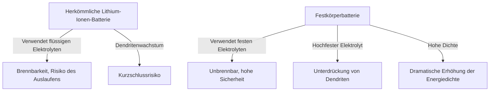

# Die Funktionsweise von Festkörperbatterien: Die Energierevolution im Herzen der Next-Gen-EVs

Mit der rasanten Verbreitung von Elektrofahrzeugen (EVs) ist die Entwicklung der Batterietechnologie zum wichtigsten Thema der Mobilitätsrevolution geworden. Dabei konkurrieren Forschungseinrichtungen und Automobilhersteller weltweit um die Entwicklung der „Festkörperbatterie (Solid-State Battery)“ als „den Trumpf für Batterien der nächsten Generation“.

Dieser Artikel geht tief auf die Grenzen herkömmlicher Lithium-Ionen-Batterien, den bahnbrechenden Mechanismus von Festkörperbatterien und die technischen Herausforderungen für ihre gesellschaftliche Umsetzung ein.

## 1. Die Herausforderungen herkömmlicher Lithium-Ionen-Batterien

Lithium-Ionen-Batterien (LIB), die heute in einem breiten Spektrum von Anwendungen vom Smartphone bis zum Elektroauto zum Einsatz kommen, zeichnen sich durch eine hohe Energiedichte und ein geringes Gewicht aus. Aufgrund ihrer Struktur gibt es jedoch einige unvermeidliche Herausforderungen.

### Risiken durch flüssige Elektrolyte
Herkömmliche Lithium-Ionen-Batterien werden durch die Bewegung von Lithium-Ionen zwischen einer positiven und einer negativen Elektrode geladen und entladen. Der "flüssige Elektrolyt" dient als Weg für diese Ionen. Allerdings sind flüssige Elektrolyte mit den folgenden physikalischen und chemischen Risiken verbunden.

- **Auslaufen und Flüchtigkeit**: Es besteht die Gefahr, dass der brennbare flüssige Elektrolyt durch äußere Stöße oder Verschleiß ausläuft.
- **Thermisches Durchgehen (Thermal Runaway)**: Wenn die Innentemperatur durch einen Kurzschluss oder eine Überladung ansteigt, verdampft und entzündet sich der flüssige Elektrolyt, was zu einem thermischen Durchgehen führen kann – einem Kettenanstieg der Temperatur. Viele Brandunfälle bei Elektroautos sind auf dieses Phänomen zurückzuführen.

### Bildung von Dendriten (Baumkristallen)
Bei wiederholtem Aufladen tritt ein Phänomen auf, das „Dendrit“ genannt wird, bei dem kristallines Lithiummetall wie Raureif auf der Oberfläche der negativen Elektrode wächst. Wenn diese Dendriten wachsen, den Separator durchstoßen und die positive Elektrode erreichen, verursachen sie einen internen Kurzschluss, der zu einem Brand oder einer Explosion führen kann.

### Grenzen der Energiedichte
Um die Sicherheit zu gewährleisten, sind ein robustes Gehäuse, ein Kühlsystem und Sicherheitsmargen erforderlich, was letztendlich das Volumen und das Gewicht des gesamten Batteriepakets erhöht. Zudem hat die begrenzte Spannungsfestigkeit des flüssigen Elektrolyten die Verwendung von Materialien mit höherer Spannung und höherer Kapazität eingeschränkt.

## 2. Was ist eine Festkörperbatterie? Ein Paradigmenwechsel von flüssig zu fest

Die Festkörperbatterie ist, wie der Name schon sagt, eine Batterie, bei der der herkömmliche "flüssige Elektrolyt" durch einen "festen Elektrolyten" ersetzt wird.

### Die wichtigsten Vorteile von Festkörperbatterien

1. **Ultimative Sicherheit**
   Da keine brennbaren organischen Lösungsmittel verwendet werden, ist das Risiko eines Auslaufens oder Brandes extrem gering. Selbst im unwahrscheinlichen Fall einer physischen Zerstörung (Nageldurchdringungstest) bietet sie eine überwältigende Sicherheit, da es unwahrscheinlich ist, dass es zu einem thermischen Durchgehen kommt.

2. **Dramatische Erhöhung der Energiedichte**
   Da feste Elektrolyte auch bei hohen Spannungen stabil sind, können stärkere Kathodenmaterialien und Lithiummetall direkt für die negative Elektrode verwendet werden. Dadurch wird erwartet, dass mehr als doppelt so viel Energie bei gleichem Volumen und Gewicht wie bei herkömmlichen Batterien gespeichert werden kann, was eine deutliche Verlängerung der Reichweite von Elektrofahrzeugen (z. B. über 1000 km mit einer einzigen Ladung) realistisch macht.

3. **Realisierung von ultraschnellem Laden**
   Bei flüssigen Elektrolyten kann die Bewegung der Lithium-Ionen beim Schnellladen nicht mithalten, wodurch sich leichter Dendriten bilden. Andererseits hat sich gezeigt, dass sich Lithium-Ionen in bestimmten festen Elektrolyten (z. B. auf Sulfidbasis) schneller bewegen als in Flüssigkeiten. Es wird prognostiziert, dass dies eine vollständige Aufladung in wenigen Minuten ermöglichen wird.

4. **Großer Betriebstemperaturbereich**
   Da Festkörperbatterien im Gegensatz zu flüssigen Elektrolyten bei niedrigen Temperaturen nicht gefrieren oder bei hohen Temperaturen verdampfen, kann die Leistungsverschlechterung von extrem kalten bis zu glühend heißen Umgebungen minimiert werden. Dadurch können komplexe und schwere Temperaturmanagement-Systeme (Kühlung/Heizung) vereinfacht werden.

## 3. Mechanismen und Arten von Festkörperbatterien

Die Leistung einer Festkörperbatterie hängt stark davon ab, "welcher Festkörperelektrolyt verwendet wird". Derzeit werden hauptsächlich die folgenden drei Systeme erforscht.

### Sulfidbasiert (Sulfide-based)
- **Eigenschaften**: Sehr hohe Ionenleitfähigkeit (leichte Bewegung der Lithium-Ionen) und selbst bei Raumtemperatur die gleiche oder eine bessere Leistung als flüssige Elektrolyte. Leicht durch Pressen formbar, daher gut für große Kapazitäten geeignet.
- **Herausforderungen**: Reagiert mit Feuchtigkeit in der Luft, wobei giftiges Schwefelwasserstoffgas entsteht. Daher ist ein strenges Feuchtigkeitsmanagement (Ultra-Trockenraum) im Herstellungsprozess erforderlich. Toyota Motor Corporation und andere sind auf diesem Gebiet führend.

### Oxidbasiert (Oxide-based)
- **Eigenschaften**: Chemisch sehr stabil und einfach an der Luft zu handhaben. Sie sind am sichersten und werden bereits für kleine Geräte, Wearables und medizinische Geräte eingesetzt.
- **Herausforderungen**: Die Ionenleitfähigkeit ist im Vergleich zu Sulfidsystemen geringer, und es ist ein Sintern bei hohen Temperaturen erforderlich, um die Bindung zwischen den Partikeln zu stärken, was die Herstellung großer EV-Batterien zu einer technischen Hürde macht.

### Polymerbasiert (Polymer-based)
- **Eigenschaften**: Flexibel und bieten den Vorteil, dass sich bestehende Produktionslinien für Lithium-Ionen-Batterien leicht anpassen lassen.
- **Herausforderungen**: Die Ionenleitfähigkeit bei Raumtemperatur ist extrem gering. Um zu funktionieren, muss die Batterie auf etwa 60 °C bis 80 °C erhitzt werden, was ihre Anwendungsbereiche einschränkt.

## 4. Technische Hürden für die Massenproduktion und die Zukunft

Obwohl Festkörperbatterien als "Traumbatterien" gehandelt werden, gibt es noch einige hohe Hürden für ihre Massenproduktion und Verbreitung.

### Das Problem des Grenzflächenwiderstands
Es ist sehr schwierig, Feststoffe (Elektrode und Festkörperelektrolyt) eng miteinander zu verbinden. Wenn das Elektrodenmaterial durch wiederholtes Laden und Entladen expandiert und schrumpft, entstehen mikroskopisch kleine Lücken zwischen ihm und dem Festkörperelektrolyten, wodurch sich der „Grenzflächenwiderstand“ erhöht, der die Bewegung der Lithium-Ionen behindert. Um dies zu verhindern, wird an Verpackungstechnologien, die kontinuierlich hohen Druck ausüben, sowie an Verbundmaterialien geforscht, die die Grenzfläche weich halten.

### Herstellungskosten und Prozessinnovation
Aktuelle Gigafactories für großflächige Lithium-Ionen-Batterien sind auf Prozesse zur Einspritzung flüssiger Elektrolyte optimiert. Die Herstellung von Festkörperbatterien erfordert völlig neue Prozesse (wie Ultrahochdruck-Pressanlagen und Trockenräume), was enorme Anfangsinvestitionen und hohe Herstellungskosten bedeutet. Manchmal werden für die Materialien selbst teure seltene Metalle verwendet, sodass eine Kostensenkung der Schlüssel zur weiten Verbreitung ist.

### Umstrukturierung der Lieferkette
Es ist notwendig, auf globaler Ebene ein stabiles und kostengünstiges Beschaffungsnetzwerk für neue Festkörperelektrolytmaterialien (Lithium, Schwefel, Germanium usw.) aufzubauen.

## 5. Fazit: Die Energierevolution hat bereits begonnen

Festkörperbatterien sind nicht länger nur ein Konzept im Laborstadium. Führende Automobilhersteller und innovative Start-ups weltweit haben einen Fahrplan mit dem klaren Ziel der Kommerzialisierung und des Einbaus in EVs zwischen den späten 2020er und frühen 2030er Jahren entworfen.

Der Paradigmenwechsel von flüssig zu fest birgt das Potenzial, das Brandrisiko zu eliminieren, das Konzept des Ladens zu verändern und die Mobilität grundlegend umzugestalten. Wenn der technische Durchbruch bei Festkörperbatterien gelingt, werden wir einen großen Schritt in Richtung einer wahrhaft "nachhaltigen Gesellschaft für saubere Energie" machen.
