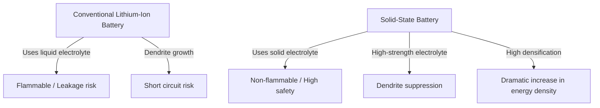

# How Solid-State Batteries Work: The Energy Revolution at the Heart of Next-Generation EVs

In an era where the widespread adoption of electric vehicles (EVs) is rapidly advancing, the evolution of battery technology has become the most critical issue in the mobility revolution. Among these technologies, research institutions and automakers worldwide are fiercely competing to develop the "solid-state battery," seen as the trump card of next-generation batteries.

This article provides an in-depth explanation, from the limitations of conventional lithium-ion batteries to the groundbreaking mechanisms of solid-state batteries and the technical challenges toward their social implementation.

## 1. Challenges Facing Conventional Lithium-Ion Batteries

Currently used in everything from smartphones to EVs, lithium-ion batteries (LIBs) possess excellent characteristics, such as high energy density and light weight. However, due to their structure, there are several unavoidable challenges.

### Risks Associated with Liquid Electrolytes
Conventional lithium-ion batteries charge and discharge by lithium ions moving between the positive and negative electrodes. The "liquid electrolyte" serves as the pathway for these ions. However, liquid electrolytes entail the following physical and chemical risks:

- **Leakage and Volatility**: There is a risk that the flammable liquid electrolyte may leak due to external impact or degradation.
- **Thermal Runaway**: If the internal temperature rises due to a short circuit or overcharging, the liquid electrolyte can vaporize and ignite, causing a dangerous chain reaction of increasing temperatures known as thermal runaway. Many EV fire accidents stem from this phenomenon.

### Formation of Dendrites
As charging is repeated, a phenomenon occurs where lithium metal precipitates and grows on the surface of the negative electrode like frost, forming "dendrites." If these dendrites grow to pierce the separator and reach the positive electrode, they cause an internal short circuit, leading to fires or explosions.

### Limitations in Energy Density
To ensure safety, robust exterior casings, cooling systems, and safety margins must be provided, which consequently increases the overall volume and weight of the battery pack. In addition, the voltage tolerance limits of liquid electrolytes have restricted the adoption of materials with higher voltage and capacity.

## 2. What is a Solid-State Battery? A Paradigm Shift from Liquid to Solid

As the name suggests, a solid-state battery is one in which the conventional "liquid electrolyte" is replaced with a "solid electrolyte."

### Main Advantages of Solid-State Batteries

1. **Ultimate Safety**
   Since no flammable organic solvents are used, the risks of fluid leakage and ignition are extremely low. Even in the event of physical destruction such as a nail piercing (nail penetration test), it boasts overwhelming safety as it is highly unlikely to cause thermal runaway.

2. **Dramatic Increase in Energy Density**
   Because solid electrolytes are stable at high voltages, it becomes possible to use more powerful positive electrode materials or use lithium metal directly for the negative electrode. This is expected to store more than double the energy of conventional batteries within the same volume and weight, making a significant extension of the EV cruising range (e.g., over 1000 km on a single charge) a realistic prospect.

3. **Realization of Ultra-Fast Charging**
   In liquid electrolytes, ultra-fast charging struggles to keep up with the movement of lithium ions, making dendrite formation more likely. On the other hand, in certain solid electrolytes (such as sulfide-based), lithium ions are known to move faster than in liquids. This is predicted to enable a full charge in just a few minutes.

4. **Broad Operating Temperature Range**
   Since it does not freeze at low temperatures or volatilize at high temperatures like liquid electrolytes, performance degradation of the battery can be minimized in environments ranging from extreme cold to scorching heat. This simplifies complex and heavy temperature management (cooling/heating) systems.

## 3. Mechanisms and Types of Solid-State Batteries

The performance of a solid-state battery largely depends on "what kind of solid electrolyte is used." Currently, research is mainly focused on the following three systems:

### Sulfide-based
- **Characteristics**: Possesses extremely high ionic conductivity (ease of movement for lithium ions) and exhibits performance equal to or better than liquid electrolytes even at room temperature. It is well-suited for high-capacity applications due to easy press molding.
- **Challenges**: Because it reacts with moisture in the air to generate toxic hydrogen sulfide gas, strict moisture control (ultra-dry rooms) is required during the manufacturing process. Companies like Toyota Motor Corporation are leading in this field.

### Oxide-based
- **Characteristics**: Chemically highly stable and easy to handle in the air. It has the highest level of safety and is moving toward practical use in small devices, wearables, and medical equipment.
- **Challenges**: Ionic conductivity is lower compared to sulfide-based, and high-temperature sintering is required to strengthen the bonds between particles, presenting high technical hurdles for manufacturing large EV batteries.

### Polymer-based
- **Characteristics**: It is flexible and has the advantage of easily adapting existing lithium-ion battery manufacturing lines.
- **Challenges**: Ionic conductivity at room temperature is extremely low, and the battery needs to be heated to about 60°C to 80°C to operate, limiting its applications.

## 4. Technical Barriers to Mass Production and the Future

While solid-state batteries are anticipated as "dream batteries," several high walls remain for their mass production and widespread use.

### The Problem of Interfacial Resistance
It is highly difficult to firmly bond solids together (the electrode and the solid electrolyte). As charging and discharging are repeated, the electrode materials expand and contract, creating microscopic gaps with the solid electrolyte and increasing "interfacial resistance," which impedes the movement of lithium ions. To prevent this, packaging technologies that apply continuous high pressure and the development of composite materials that keep the interface soft are advancing.

### Manufacturing Costs and Process Innovation
Current large-scale gigafactories for lithium-ion batteries are optimized for the process of injecting liquid electrolytes. Manufacturing solid-state batteries requires entirely new processes (such as ultra-high pressure pressing equipment and dry rooms), leading to massive initial investments and manufacturing costs. The materials themselves may also use expensive rare metals, making cost reduction the key to widespread adoption.

### Restructuring the Supply Chain
A stable and inexpensive global procurement network for new solid electrolyte materials (lithium, sulfur, germanium, etc.) needs to be established.

## 5. Conclusion: The Energy Revolution Has Already Begun

Solid-state batteries are no longer just a concept at the laboratory level. World-class automakers and innovative startups are drawing up roadmaps with clear targets for commercialization and implementation in EVs from the late 2020s to the early 2030s.

The paradigm shift from liquid to solid has the potential to eliminate fire risks, transform the concept of charging, and fundamentally change the nature of mobility. When the technical breakthroughs of solid-state batteries are achieved, we will take a massive step toward a truly "sustainable clean energy society."
