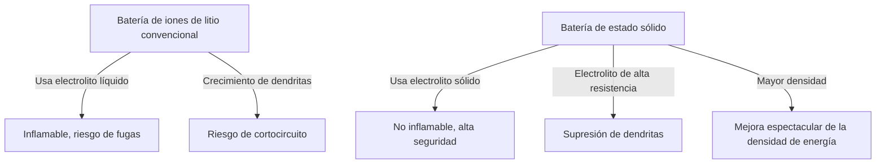

# Cómo funcionan las baterías de estado sólido: La revolución energética que será el corazón de los vehículos eléctricos de próxima generación

En la actualidad, con la rápida adopción de los vehículos eléctricos (EV), la evolución de la tecnología de baterías se ha convertido en el tema más importante de la revolución de la movilidad. En este contexto, las instituciones de investigación y los fabricantes de automóviles de todo el mundo compiten intensamente por desarrollar la "batería de estado sólido" (Solid-State Battery), considerada la "carta de triunfo de las baterías de próxima generación".

En este artículo, explicaremos en profundidad desde las limitaciones de las baterías de iones de litio convencionales hasta el mecanismo revolucionario de las baterías de estado sólido y los desafíos técnicos para su implementación en la sociedad.

## 1. Desafíos de las baterías de iones de litio convencionales

Las baterías de iones de litio (LIB), ampliamente utilizadas en la actualidad en dispositivos desde teléfonos inteligentes hasta EV, tienen excelentes características como una alta densidad de energía y peso ligero. Sin embargo, debido a su estructura, existen algunos desafíos inevitables.

### Riesgos asociados al electrolito líquido
Las baterías de iones de litio convencionales se cargan y descargan mediante el movimiento de iones de litio entre los electrodos positivo y negativo. El camino para estos iones es el "electrolito líquido". Sin embargo, el electrolito líquido conlleva los siguientes riesgos físicos y químicos:

- **Fugas y volatilidad**: Existe el riesgo de que el electrolito líquido inflamable se filtre debido a impactos externos o degradación.
- **Fuga térmica (Thermal Runaway)**: Cuando la temperatura interna aumenta debido a un cortocircuito o una sobrecarga, existe el peligro de que el electrolito líquido se vaporice y se incendie, provocando una fuga térmica en la que la temperatura aumenta en cadena. Muchos de los accidentes de incendio de EV se atribuyen a este fenómeno.

### Formación de dendritas (cristales arborescentes)
A medida que se repite la carga, ocurre un fenómeno llamado "dendritas", en el cual el litio metálico se deposita y crece como escarcha en la superficie del electrodo negativo. Si estas dendritas crecen, perforan el separador y alcanzan el electrodo positivo, causan un cortocircuito interno, siendo la causa de incendios o explosiones.

### Límites de la densidad de energía
Para garantizar la seguridad, es necesario proporcionar carcasas robustas, sistemas de refrigeración y márgenes de seguridad, lo que resulta en un aumento del volumen y el peso de todo el paquete de baterías. Además, debido a los límites de la tolerancia de voltaje del electrolito líquido, el uso de materiales de mayor voltaje y mayor capacidad ha estado limitado.

## 2. ¿Qué es una batería de estado sólido?: Un cambio de paradigma de líquido a sólido

Las baterías de estado sólido, como su nombre indica, son baterías en las que el "electrolito líquido" convencional se ha sustituido por un "electrolito sólido".

### Principales ventajas de las baterías de estado sólido

1. **Seguridad máxima**
   Dado que no utiliza disolventes orgánicos inflamables, el riesgo de fugas o incendios es extremadamente bajo. En el improbable caso de destrucción física, como ser perforada por un clavo (prueba de penetración de clavos), tiene una seguridad abrumadora ya que es difícil que ocurra una fuga térmica.

2. **Mejora espectacular de la densidad de energía**
   Dado que el electrolito sólido es estable frente a altos voltajes, es posible utilizar materiales de electrodo positivo más potentes y usar el litio metálico directamente como electrodo negativo. Con esto, se espera almacenar más del doble de energía en el mismo volumen y peso en comparación con las convencionales, haciendo realista una gran extensión de la autonomía de los EV (por ejemplo, más de 1000 km con una sola carga).

3. **Realización de carga ultra rápida**
   En los electrolitos líquidos, la carga rápida hace que el movimiento de los iones de litio no pueda seguir el ritmo, facilitando la formación de dendritas. Por otro lado, se sabe que en ciertos electrolitos sólidos (por ejemplo, a base de sulfuro), los iones de litio pueden moverse más rápido que en los líquidos. Se prevé que esto permita una carga completa en pocos minutos.

4. **Amplio rango de temperatura de funcionamiento**
   A diferencia del electrolito líquido, que puede congelarse a bajas temperaturas o volatilizarse a altas, la degradación del rendimiento de la batería se puede minimizar en entornos desde el frío extremo hasta el calor abrasador. Esto simplifica los complejos y pesados sistemas de gestión de temperatura (refrigeración/calefacción).

## 3. Mecanismos y tipos de baterías de estado sólido

El rendimiento de las baterías de estado sólido cambia considerablemente dependiendo de "qué electrolito sólido se utilice". Actualmente, se investigan principalmente los tres linajes siguientes.

### A base de sulfuro (Sulfide-based)
- **Características**: Tienen una conductividad iónica muy alta (facilidad de movimiento de los iones de litio) y ofrecen un rendimiento igual o superior al de los electrolitos líquidos incluso a temperatura ambiente. Son fáciles de moldear por prensado, por lo que son adecuados para grandes capacidades.
- **Desafíos**: Al reaccionar con la humedad del aire, generan gas de sulfuro de hidrógeno tóxico, por lo que requieren un estricto control de la humedad (sala ultraseca) en el proceso de fabricación. Empresas como Toyota lideran este campo.

### A base de óxido (Oxide-based)
- **Características**: Son químicamente muy estables y fáciles de manejar en el aire. Tienen la mayor seguridad y se avanza en su aplicación práctica en dispositivos pequeños, dispositivos portátiles y equipos médicos.
- **Desafíos**: La conductividad iónica es menor que la de los basados en sulfuro, y se requiere sinterización a alta temperatura para fortalecer la unión entre partículas, lo que representa un alto obstáculo técnico para la fabricación de baterías de EV a gran escala.

### A base de polímero (Polymer-based)
- **Características**: Tienen flexibilidad y la ventaja de que es fácil aplicar las líneas de producción de baterías de iones de litio existentes.
- **Desafíos**: La conductividad iónica a temperatura ambiente es extremadamente baja, y para funcionar es necesario calentar la batería a alrededor de 60°C - 80°C, lo que limita sus aplicaciones.

## 4. Obstáculos técnicos para la producción en masa y el futuro

Aunque las baterías de estado sólido se esperan como las "baterías de los sueños", todavía existen grandes obstáculos para su producción en masa y popularización.

### El problema de la resistencia de la interfaz
Es muy difícil lograr que los sólidos se adhieran estrechamente (el electrodo y el electrolito sólido). Al repetir cargas y descargas, el material del electrodo se expande y se contrae, creando huecos microscópicos con el electrolito sólido y aumentando la "resistencia de la interfaz" que dificulta el movimiento de los iones de litio. Para evitar esto, se están desarrollando tecnologías de empaquetado que aplican presión constante y materiales compuestos que mantienen la interfaz flexible.

### Innovación en los costes y procesos de fabricación
Las actuales gigafábricas de baterías de iones de litio a gran escala están optimizadas para el proceso de inyección de electrolito líquido. La fabricación de baterías de estado sólido requiere procesos completamente nuevos (como equipos de prensado de ultra alta presión y salas secas), lo que hace que la inversión inicial y los costes de fabricación sean enormes. Los materiales en sí a menudo utilizan metales raros caros, por lo que la reducción de costes es la clave para su popularización.

### Reconstrucción de la cadena de suministro
Es necesario construir a escala mundial una red de adquisición estable y económica para nuevos materiales de electrolitos sólidos (como litio, azufre, germanio, etc.).

## 5. Conclusión: La revolución energética ya ha comenzado

Las baterías de estado sólido ya no son solo un concepto a nivel de laboratorio. Los principales fabricantes de automóviles del mundo y las empresas emergentes innovadoras están trazando una hoja de ruta con el claro objetivo de su comercialización e implementación en EV entre la segunda mitad de la década de 2020 y la primera mitad de la década de 2030.

El cambio de paradigma de líquido a sólido tiene el potencial de erradicar el riesgo de incendio, cambiar el concepto de carga y transformar fundamentalmente la naturaleza de la movilidad. Cuando se logre el gran avance técnico en las baterías de estado sólido, daremos un gran paso hacia una verdadera "sociedad de energía limpia y sostenible".
