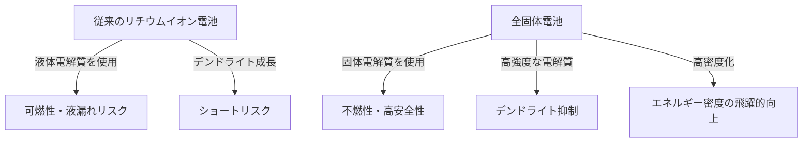

# Fonctionnement des batteries à semi-conducteurs : la révolution énergétique au cœur des VE de nouvelle génération

À l'heure où la popularisation des véhicules électriques (VE) progresse rapidement, l'évolution de la technologie des batteries est devenue l'enjeu le plus important de la révolution de la mobilité. Dans ce contexte, la "batterie à semi-conducteurs" (Solid-State Battery) est considérée comme l'atout maître des batteries de nouvelle génération, pour laquelle les instituts de recherche et les constructeurs automobiles du monde entier se livrent une concurrence acharnée en matière de développement.

Cet article explique en profondeur les limites des batteries lithium-ion conventionnelles, le mécanisme révolutionnaire des batteries à semi-conducteurs et les défis techniques en vue de leur mise en œuvre dans la société.

## 1. Les défis posés par les batteries lithium-ion conventionnelles

Actuellement, les batteries lithium-ion (LIB), largement utilisées des smartphones aux VE, possèdent d'excellentes propriétés telles qu'une haute densité énergétique et un poids léger. Cependant, en raison de leur structure, il existe quelques défis inévitables.

### Les risques liés à l'électrolyte liquide
Les batteries lithium-ion conventionnelles se chargent et se déchargent grâce au mouvement des ions lithium entre l'électrode positive et l'électrode négative. Le chemin pour ces ions est l'"électrolyte liquide". Cependant, l'électrolyte liquide comporte les risques physiques et chimiques suivants :

- **Fuites et volatilité**: Il existe un risque de fuite de l'électrolyte liquide inflammable due à des chocs externes ou à une dégradation.
- **Emballement thermique (Thermal Runaway)**: Si la température interne augmente en raison d'un court-circuit ou d'une surcharge, l'électrolyte liquide peut se vaporiser et s'enflammer, provoquant un emballement thermique où la température augmente en chaîne. De nombreux accidents d'incendie de VE sont causés par ce phénomène.

### Formation de dendrites (cristaux dendritiques)
Au fur et à mesure des recharges, un phénomène appelé "dendrite" se produit, où du lithium métallique précipite et croît comme du givre sur la surface de l'électrode négative. Si ces dendrites croissent jusqu'à percer le séparateur et atteindre l'électrode positive, elles provoquent un court-circuit interne, entraînant un risque d'incendie ou d'explosion.

### Limites de la densité énergétique
Pour assurer la sécurité, il est nécessaire de prévoir un boîtier robuste, un système de refroidissement et une marge de sécurité, ce qui augmente le volume et le poids globaux de la batterie. De plus, la limite de tolérance en tension de l'électrolyte liquide a restreint l'adoption de matériaux à tension et capacité plus élevées.

## 2. Qu'est-ce qu'une batterie à semi-conducteurs ? : Le changement de paradigme du liquide au solide

Comme son nom l'indique, une batterie à semi-conducteurs est une batterie dans laquelle l'"électrolyte liquide" conventionnel a été remplacé par un "électrolyte solide".

### Principaux avantages des batteries à semi-conducteurs

1. **Sécurité ultime**
   Étant donné qu'aucun solvant organique inflammable n'est utilisé, le risque de fuite de liquide ou d'incendie est extrêmement faible. Même en cas de destruction physique, comme l'enfoncement d'un clou (test de pénétration de clou), la batterie possède une sécurité écrasante avec peu de risque d'emballement thermique.

2. **Augmentation spectaculaire de la densité énergétique**
   L'électrolyte solide étant stable face aux hautes tensions, il devient possible d'utiliser des matériaux de cathode plus puissants ou d'utiliser du lithium métallique directement comme anode. Ainsi, on s'attend à ce que les batteries stockent plus du double de l'énergie pour un même volume et poids, rendant réaliste une augmentation significative de l'autonomie des VE (par exemple, plus de 1000 km avec une seule charge).

3. **Réalisation d'une charge ultra-rapide**
   Avec un électrolyte liquide, une charge rapide rend difficile le suivi du mouvement des ions lithium, facilitant la formation de dendrites. En revanche, on a découvert que les ions lithium peuvent se déplacer plus rapidement dans certains électrolytes solides (par exemple, à base de sulfure) que dans un liquide. Ainsi, on prévoit qu'une charge complète en quelques minutes deviendra possible.

4. **Large plage de températures de fonctionnement**
   Comme elle ne gèle pas à basse température et ne s'évapore pas à haute température comme un électrolyte liquide, la dégradation des performances de la batterie peut être minimisée, des environnements extrêmement froids aux chaleurs torrides. Cela permet de simplifier les systèmes de gestion thermique (refroidissement/chauffage) complexes et lourds.

## 3. Mécanismes et types de batteries à semi-conducteurs

Les performances des batteries à semi-conducteurs varient considérablement en fonction du type d'"électrolyte solide" utilisé. Actuellement, trois principales familles sont étudiées.

### À base de sulfure (Sulfide-based)
- **Caractéristiques**: Possède une conductivité ionique très élevée (facilité de déplacement des ions lithium) et offre des performances égales ou supérieures à celles des électrolytes liquides, même à température ambiante. Facile à mouler sous presse, ce qui la rend adaptée aux grandes capacités.
- **Défis**: Une gestion stricte de l'humidité (salle ultra-sèche) est requise lors du processus de fabrication car une réaction avec l'humidité de l'air produit du sulfure d'hydrogène gazeux toxique. Toyota Motor Corporation et d'autres sont à l'avant-garde dans ce domaine.

### À base d'oxyde (Oxide-based)
- **Caractéristiques**: Chimiquement très stable et facile à manipuler dans l'air. Elle offre la sécurité la plus élevée et sa mise en pratique progresse pour les petits appareils, les dispositifs portables et les équipements médicaux.
- **Défis**: La conductivité ionique est inférieure à celle à base de sulfure, et un frittage à haute température est nécessaire pour renforcer la liaison entre les particules, ce qui représente un obstacle technique important pour la fabrication de grandes batteries de VE.

### À base de polymère (Polymer-based)
- **Caractéristiques**: Souple, elle a l'avantage de pouvoir être facilement adaptée aux lignes de production de batteries lithium-ion existantes.
- **Défis**: La conductivité ionique à température ambiante est extrêmement faible et la batterie doit être chauffée à environ 60℃〜80℃ pour fonctionner, ce qui limite ses applications.

## 4. Obstacles techniques à la production de masse et perspectives d'avenir

Bien que les batteries à semi-conducteurs soient attendues comme la "batterie de rêve", de grands obstacles subsistent pour leur production de masse et leur généralisation.

### Le problème de la résistance interfaciale
Il est très difficile d'adhérer étroitement les solides entre eux (les électrodes et l'électrolyte solide). Comme les matériaux des électrodes se dilatent et se contractent lors de charges et décharges répétées, des espaces microscopiques se créent avec l'électrolyte solide, augmentant la "résistance interfaciale" qui entrave le mouvement des ions lithium. Pour éviter cela, des technologies de conditionnement qui appliquent une pression continue et des matériaux composites qui maintiennent l'interface souple sont en cours de développement.

### Innovation des processus et coûts de fabrication
Actuellement, les grandes gigafactories de batteries lithium-ion sont optimisées pour le processus d'injection d'électrolytes liquides. La fabrication de batteries à semi-conducteurs nécessite un processus entièrement nouveau (équipements de presse à ultra-haute pression, salles sèches, etc.), ce qui implique des investissements initiaux et des coûts de fabrication énormes. Les matériaux eux-mêmes peuvent utiliser des métaux rares onéreux, la réduction des coûts est donc la clé de leur popularisation.

### Restructuration de la chaîne d'approvisionnement
Il est nécessaire de construire un réseau d'approvisionnement stable et bon marché pour les nouveaux matériaux d'électrolytes solides (lithium, soufre, germanium, etc.) à l'échelle mondiale.

## 5. Conclusion : La révolution énergétique a déjà commencé

La batterie à semi-conducteurs n'est plus un simple concept de laboratoire. Les principaux constructeurs automobiles et des startups innovantes ont élaboré des feuilles de route avec l'objectif clair d'une commercialisation et d'une intégration dans les VE entre la fin des années 2020 et le début des années 2030.

Le changement de paradigme du liquide au solide a le potentiel d'éradiquer les risques d'incendie, de changer le concept de recharge et de transformer fondamentalement la mobilité. Lorsque les percées techniques des batteries à semi-conducteurs seront réalisées, nous ferons un grand pas vers une société de l'énergie propre véritablement durable.
