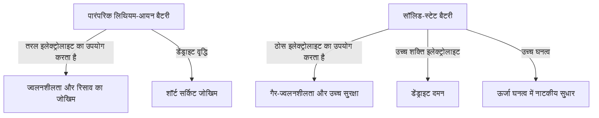

# सॉलिड-स्टेट बैटरी कैसे काम करती है: अगली पीढ़ी के EV के दिल में ऊर्जा क्रांति

ऐसे युग में जहां इलेक्ट्रिक वाहनों (EV) को तेजी से अपनाया जा रहा है, मोबिलिटी क्रांति के लिए बैटरी तकनीक का विकास सबसे महत्वपूर्ण चुनौती बन गया है। इनमें से, "सॉलिड-स्टेट बैटरी (Solid-State Battery)" "अगली पीढ़ी की बैटरी के ट्रम्प कार्ड" के रूप में दुनिया भर के अनुसंधान संस्थानों और कार निर्माताओं के बीच भयंकर विकास प्रतिस्पर्धा का विषय है।

इस लेख में, हम पारंपरिक लिथियम-आयन बैटरी की सीमाओं से लेकर सॉलिड-स्टेट बैटरी के अभूतपूर्व तंत्र, और सामाजिक कार्यान्वयन के लिए तकनीकी चुनौतियों तक, गहराई से चर्चा करेंगे।

## 1. पारंपरिक लिथियम-आयन बैटरी की चुनौतियां

वर्तमान में स्मार्टफोन से लेकर EV तक हर जगह इस्तेमाल होने वाली लिथियम-आयन बैटरी (LIB) में उच्च ऊर्जा घनत्व और हल्के वजन की उत्कृष्ट विशेषताएं हैं। हालांकि, उनकी संरचना के कारण, कुछ अपरिहार्य चुनौतियां हैं।

### तरल इलेक्ट्रोलाइट्स के कारण जोखिम
पारंपरिक लिथियम-आयन बैटरी कैथोड और एनोड के बीच लिथियम आयनों को स्थानांतरित करके चार्ज और डिस्चार्ज करती हैं। इन आयनों का मार्ग "तरल इलेक्ट्रोलाइट" है। हालांकि, तरल इलेक्ट्रोलाइट्स निम्नलिखित भौतिक और रासायनिक जोखिमों से जुड़े हैं:

- **रिसाव और वाष्पशीलता**: बाहरी प्रभाव या गिरावट के कारण ज्वलनशील तरल इलेक्ट्रोलाइट के रिसाव का जोखिम होता है।
- **थर्मल रनअवे (Thermal Runaway)**: यदि शॉर्ट सर्किट या ओवरचार्जिंग के कारण आंतरिक तापमान बढ़ता है, तो तरल इलेक्ट्रोलाइट वाष्पीकृत और प्रज्वलित हो सकता है, जिससे थर्मल रनअवे का खतरा पैदा होता है जो तापमान को श्रृंखला प्रतिक्रिया में बढ़ाता है। कई EV अग्नि दुर्घटनाएं इसी घटना के कारण होती हैं।

### डेंड्राइट (शाखाओं वाले क्रिस्टल) का निर्माण
बार-बार चार्ज करने से "डेंड्राइट" नामक घटना होती है, जिसमें लिथियम धातु एनोड की सतह पर ठंढ की तरह जम जाती है और बढ़ती है। जब ये डेंड्राइट बढ़ते हैं और सेपरेटर को भेदकर कैथोड तक पहुंचते हैं, तो वे आंतरिक शॉर्ट सर्किट का कारण बनते हैं, जिससे आग या विस्फोट हो सकता है।

### ऊर्जा घनत्व की सीमा
सुरक्षा सुनिश्चित करने के लिए, मजबूत आवरण, शीतलन प्रणाली और सुरक्षा मार्जिन स्थापित करना आवश्यक है, जिसके परिणामस्वरूप समग्र बैटरी पैक की मात्रा और वजन में वृद्धि होती है। इसके अलावा, तरल इलेक्ट्रोलाइट्स की वोल्टेज सहिष्णुता सीमा ने उच्च-वोल्टेज, उच्च-क्षमता सामग्री को अपनाने को प्रतिबंधित कर दिया है।

## 2. सॉलिड-स्टेट बैटरी क्या है?: तरल से ठोस में प्रतिमान बदलाव

सॉलिड-स्टेट बैटरी, जैसा कि नाम से पता चलता है, एक ऐसी बैटरी है जो पारंपरिक "तरल इलेक्ट्रोलाइट" को "ठोस इलेक्ट्रोलाइट" से बदल देती है।

### सॉलिड-स्टेट बैटरी के मुख्य लाभ

1. **परम सुरक्षा**
   चूंकि किसी ज्वलनशील कार्बनिक विलायक का उपयोग नहीं किया जाता है, रिसाव या आग लगने का जोखिम बहुत कम है। भले ही कोई भौतिक विनाश हो जैसे कि कील चुभना (नेल पेनिट्रेशन टेस्ट), इसमें अत्यधिक सुरक्षा है कि थर्मल रनअवे होने की संभावना कम है।

2. **ऊर्जा घनत्व में नाटकीय सुधार**
   चूंकि ठोस इलेक्ट्रोलाइट्स उच्च वोल्टेज के खिलाफ स्थिर होते हैं, इसलिए अधिक शक्तिशाली कैथोड सामग्री का उपयोग करना या लिथियम धातु को सीधे एनोड के रूप में उपयोग करना संभव हो जाता है। नतीजतन, समान मात्रा और वजन के साथ पारंपरिक बैटरी की तुलना में दोगुने से अधिक ऊर्जा को स्टोर करने की उम्मीद है, और EV की क्रूज़िंग रेंज (उदाहरण के लिए, एक बार चार्ज करने पर 1000 किमी से अधिक) का एक महत्वपूर्ण विस्तार यथार्थवादी बन जाता है।

3. **अल्ट्रा-फास्ट चार्जिंग की प्राप्ति**
   तरल इलेक्ट्रोलाइट्स के साथ, जब फास्ट चार्जिंग की जाती है, तो लिथियम आयन पर्याप्त तेजी से नहीं जा सकते हैं, और डेंड्राइट्स बनने की अधिक संभावना होती है। दूसरी ओर, यह ज्ञात है कि कुछ ठोस इलेक्ट्रोलाइट्स (जैसे सल्फाइड-आधारित) में, लिथियम आयन तरल की तुलना में अधिक तेज़ी से आगे बढ़ सकते हैं। इसके साथ, यह अनुमान लगाया गया है कि कुछ ही मिनटों में फुल चार्ज संभव हो जाएगा।

4. **व्यापक ऑपरेटिंग तापमान रेंज**
   तरल इलेक्ट्रोलाइट्स के विपरीत, जो कम तापमान पर जम जाते हैं और उच्च तापमान पर वाष्पीकृत हो जाते हैं, अत्यधिक ठंड से लेकर चिलचिलाती गर्मी वाले वातावरण में बैटरी के प्रदर्शन में गिरावट को कम किया जा सकता है। यह जटिल और भारी तापमान प्रबंधन (कूलिंग / हीटिंग) प्रणालियों को सरल बना सकता है।

## 3. सॉलिड-स्टेट बैटरी का तंत्र और प्रकार

सॉलिड-स्टेट बैटरी का प्रदर्शन इस बात पर बहुत अधिक निर्भर करता है कि "किस तरह के ठोस इलेक्ट्रोलाइट का उपयोग किया जाता है"। वर्तमान में, मुख्य रूप से निम्नलिखित तीन प्रकारों पर शोध किया जा रहा है:

### सल्फाइड-आधारित (Sulfide-based)
- **विशेषताएं**: इसमें बहुत उच्च आयनिक चालकता (लिथियम आयनों की गतिशीलता में आसानी) है, और कमरे के तापमान पर भी तरल इलेक्ट्रोलाइट्स के बराबर या उससे बेहतर प्रदर्शन प्रदर्शित करता है। चूंकि इसे प्रेस-मोल्ड करना आसान है, यह बड़ी क्षमता के लिए उपयुक्त है।
- **चुनौतियां**: जब यह हवा में नमी के साथ प्रतिक्रिया करता है, तो यह जहरीली हाइड्रोजन सल्फाइड गैस उत्पन्न करता है, इसलिए निर्माण प्रक्रिया में सख्त नमी प्रबंधन (अल्ट्रा-ड्राई रूम) की आवश्यकता होती है। टोयोटा मोटर कॉर्पोरेशन इस क्षेत्र में अग्रणी है।

### ऑक्साइड-आधारित (Oxide-based)
- **विशेषताएं**: यह रासायनिक रूप से बहुत स्थिर है और हवा में संभालना आसान है। यह सबसे सुरक्षित है, और छोटे उपकरणों, पहनने योग्य उपकरणों (वियरेबल्स) और चिकित्सा उपकरणों के लिए इसका व्यावहारिक उपयोग आगे बढ़ रहा है।
- **चुनौतियां**: सल्फाइड-आधारित प्रणालियों की तुलना में आयनिक चालकता कम है, और कणों के बीच के बंधन को मजबूत करने के लिए उच्च तापमान सिंटरिंग आवश्यक है, जिसके बारे में कहा जाता है कि बड़े EV बैटरी के निर्माण के लिए एक उच्च तकनीकी बाधा है।

### पॉलिमर-आधारित (Polymer-based)
- **विशेषताएं**: यह लचीला है और इसका यह फायदा है कि मौजूदा लिथियम-आयन बैटरी निर्माण लाइनों को लागू करना आसान है।
- **चुनौतियां**: कमरे के तापमान पर आयनिक चालकता बेहद कम है, और बैटरी को संचालित करने के लिए लगभग 60℃〜80℃ तक गर्म किया जाना चाहिए, जो इसके अनुप्रयोगों को सीमित करता है।

## 4. बड़े पैमाने पर उत्पादन और भविष्य के लिए तकनीकी बाधाएं

हालांकि सॉलिड-स्टेट बैटरी को "सपनों की बैटरी" के रूप में उम्मीद है, बड़े पैमाने पर उत्पादन और व्यापक उपयोग के लिए अभी भी कई ऊंची दीवारें हैं।

### इंटरफेसियल प्रतिरोध (Interfacial Resistance) की समस्या
ठोस पदार्थों (इलेक्ट्रोड और ठोस इलेक्ट्रोलाइट्स) को एक-दूसरे के निकट संपर्क में लाना बहुत मुश्किल है। चूंकि चार्जिंग और डिस्चार्जिंग के दौरान इलेक्ट्रोड सामग्री का विस्तार और संकुचन होता है, इसलिए ठोस इलेक्ट्रोलाइट के साथ एक सूक्ष्म अंतर बन जाता है, और "इंटरफेसियल प्रतिरोध" जो लिथियम आयनों की गति में बाधा डालता है, बढ़ जाता है। इसे रोकने के लिए, पैकेजिंग तकनीकें जो उच्च दबाव लागू करना जारी रखती हैं और मिश्रित सामग्री (कंपोजिट मटेरियल्स) जो इंटरफेस को नरम रखती हैं, विकसित की जा रही हैं।

### विनिर्माण लागत और प्रक्रिया नवाचार
वर्तमान बड़े पैमाने पर लिथियम-आयन बैटरी गीगाफैक्ट्रीज़ को तरल इलेक्ट्रोलाइट्स इंजेक्ट करने की प्रक्रिया के लिए अनुकूलित किया गया है। सॉलिड-स्टेट बैटरी के निर्माण के लिए पूरी तरह से नई प्रक्रियाओं (अल्ट्रा-हाई प्रेशर प्रेस उपकरण, ड्राई रूम, आदि) की आवश्यकता होती है, जिससे प्रारंभिक निवेश और निर्माण लागत भारी हो जाती है। सामग्री की लागत भी महंगी दुर्लभ धातुओं का उपयोग कर सकती है, और लागत में कमी लोकप्रियकरण की कुंजी है।

### आपूर्ति श्रृंखला का पुनर्निर्माण (Rebuilding the supply chain)
वैश्विक स्तर पर नई ठोस इलेक्ट्रोलाइट सामग्री (लिथियम, सल्फर, जर्मेनियम, आदि) के लिए एक स्थिर और सस्ता खरीद नेटवर्क स्थापित करना आवश्यक है।

## 5. निष्कर्ष: ऊर्जा क्रांति पहले ही शुरू हो चुकी है

सॉलिड-स्टेट बैटरी अब केवल एक प्रयोगशाला स्तर की अवधारणा नहीं है। विश्व स्तरीय कार निर्माता और अभिनव स्टार्टअप 2020 के दशक के उत्तरार्ध से 2030 के दशक की शुरुआत तक व्यावसायीकरण और EV में एकीकरण के स्पष्ट लक्ष्य के साथ रोडमैप तैयार कर रहे हैं।

तरल से ठोस में प्रतिमान बदलाव में आग के जोखिमों को खत्म करने, चार्जिंग की अवधारणा को बदलने और मौलिक रूप से मोबिलिटी की प्रकृति को बदलने की क्षमता है। जब सॉलिड-स्टेट बैटरी की तकनीकी सफलता हासिल की जाती है, तो हम सच्चे अर्थों में "सतत स्वच्छ ऊर्जा समाज" की दिशा में एक बड़ा कदम उठाएंगे।
