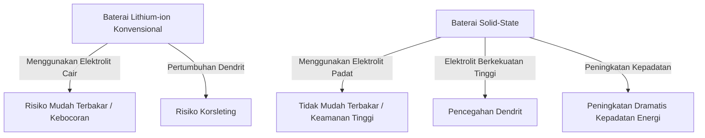

# Cara Kerja Baterai Solid-State: Revolusi Energi yang Menjadi Jantung EV Generasi Berikutnya

Di era di mana popularitas kendaraan listrik (EV) meningkat pesat, evolusi teknologi baterai telah menjadi isu paling penting dalam revolusi mobilitas. Di antara semua itu, "Baterai Solid-State" merupakan "kartu as baterai generasi berikutnya" yang sedang dikembangkan dengan penuh persaingan oleh lembaga penelitian dan produsen mobil di seluruh dunia.

Artikel ini akan membahas secara mendalam, mulai dari keterbatasan baterai lithium-ion konvensional, mekanisme revolusioner baterai solid-state, hingga tantangan teknis untuk implementasi sosialnya.

## 1. Tantangan pada Baterai Lithium-ion Konvensional

Saat ini, baterai lithium-ion (LIB) yang banyak digunakan mulai dari ponsel pintar hingga EV memiliki karakteristik unggul yaitu kepadatan energi yang tinggi dan bobot yang ringan. Namun, karena strukturnya, terdapat beberapa tantangan yang tidak dapat dihindari.

### Risiko akibat Elektrolit Cair
Baterai lithium-ion konvensional melakukan pengisian dan pengosongan daya dengan memindahkan ion lithium antara elektroda positif dan elektroda negatif. Jalur untuk ion ini adalah "elektrolit cair". Namun, elektrolit cair membawa risiko fisik dan kimia berikut:

- **Kebocoran dan Volatilitas**: Terdapat risiko elektrolit cair yang mudah terbakar bocor akibat benturan dari luar atau degradasi.
- **Thermal Runaway (Pelarian Termal)**: Jika suhu internal meningkat karena korsleting (hubungan arus pendek) atau pengisian daya berlebih (overcharge), terdapat bahaya elektrolit cair akan menguap dan menyala, menyebabkan pelarian termal di mana suhu meningkat secara berantai. Sebagian besar kecelakaan kebakaran EV disebabkan oleh fenomena ini.

### Pembentukan Dendrit (Kristal Berbentuk Pohon)
Seiring dengan berulangnya pengisian daya, fenomena yang disebut "dendrit" terjadi, di mana logam lithium mengendap dan tumbuh seperti rime (embun beku) pada permukaan elektroda negatif. Jika dendrit ini tumbuh hingga menembus separator dan mencapai elektroda positif, hal ini akan menyebabkan korsleting internal dan menjadi penyebab kebakaran atau ledakan.

### Keterbatasan Kepadatan Energi
Untuk memastikan keamanan, diperlukan casing yang kokoh, sistem pendingin, dan margin keamanan, yang pada akhirnya meningkatkan volume dan berat keseluruhan paket baterai. Selain itu, karena batas toleransi tegangan dari elektrolit cair, penggunaan bahan dengan tegangan dan kapasitas yang lebih tinggi menjadi terbatas.

## 2. Apa itu Baterai Solid-State?: Pergeseran Paradigma dari Cair ke Padat

Seperti namanya, baterai solid-state adalah baterai yang menggantikan "elektrolit cair" konvensional dengan "elektrolit padat".

### Keuntungan Utama Baterai Solid-State

1. **Keamanan Tertinggi**
   Karena tidak menggunakan pelarut organik yang mudah terbakar, risiko kebocoran dan penyalaan menjadi sangat rendah. Bahkan jika terjadi kerusakan fisik seperti tertusuk paku (uji tusuk paku), baterai ini memiliki tingkat keamanan yang luar biasa karena sulit memicu pelarian termal.

2. **Peningkatan Dramatis Kepadatan Energi**
   Karena elektrolit padat stabil terhadap tegangan tinggi, dimungkinkan untuk menggunakan bahan elektroda positif yang lebih kuat atau menggunakan logam lithium secara langsung pada elektroda negatif. Hal ini diharapkan dapat menyimpan lebih dari dua kali lipat energi dari baterai konvensional dengan volume dan berat yang sama, sehingga perpanjangan jangkauan jelajah EV yang signifikan (misalnya lebih dari 1000 km dalam sekali pengisian daya) menjadi realistis.

3. **Mewujudkan Pengisian Daya Ultra Cepat**
   Pada elektrolit cair, saat melakukan pengisian daya cepat, pergerakan ion lithium tidak dapat mengimbangi, sehingga dendrit lebih mudah terbentuk. Di sisi lain, dalam elektrolit padat tertentu (misalnya berbasis sulfida), diketahui bahwa ion lithium dapat bergerak lebih cepat daripada di dalam cairan. Hal ini diprediksi akan memungkinkan pengisian daya penuh hanya dalam beberapa menit.

4. **Rentang Suhu Operasional yang Luas**
   Karena tidak membeku pada suhu rendah atau menguap pada suhu tinggi seperti elektrolit cair, penurunan kinerja baterai dapat diminimalkan, mulai dari lingkungan yang sangat dingin hingga lingkungan yang sangat panas. Hal ini dapat menyederhanakan sistem manajemen suhu (pendinginan/pemanasan) yang kompleks dan berat.

## 3. Mekanisme dan Jenis Baterai Solid-State

Kinerja baterai solid-state sangat bervariasi tergantung pada "jenis elektrolit padat apa yang digunakan". Saat ini, ada tiga sistem utama yang sedang diteliti:

### Berbasis Sulfida (Sulfide-based)
- **Karakteristik**: Memiliki konduktivitas ion (kemudahan pergerakan ion lithium) yang sangat tinggi, dan menunjukkan kinerja setara atau lebih baik dari elektrolit cair bahkan pada suhu ruangan. Karena mudah dibentuk dengan tekanan (press molding), baterai ini cocok untuk kapasitas besar.
- **Tantangan**: Karena bereaksi dengan kelembapan di atmosfer dan menghasilkan gas hidrogen sulfida yang beracun, pengelolaan kelembapan yang ketat (ruang super kering) diperlukan selama proses pembuatan. Perusahaan seperti Toyota Motor memimpin di bidang ini.

### Berbasis Oksida (Oxide-based)
- **Karakteristik**: Sangat stabil secara kimia dan mudah ditangani di udara. Memiliki keamanan tertinggi dan sedang dipraktikkan untuk perangkat kecil, perangkat yang dapat dikenakan (wearable), dan peralatan medis.
- **Tantangan**: Konduktivitas ionnya lebih rendah dibandingkan sistem sulfida, dan memerlukan sintering (pembakaran) suhu tinggi untuk memperkuat ikatan antar partikel, sehingga terdapat rintangan teknis yang tinggi untuk pembuatan baterai EV berukuran besar.

### Berbasis Polimer (Polymer-based)
- **Karakteristik**: Fleksibel dan memiliki keuntungan mudah diaplikasikan pada lini produksi baterai lithium-ion yang ada.
- **Tantangan**: Konduktivitas ion pada suhu ruangan sangat rendah, dan penggunaannya terbatas karena baterai harus dipanaskan hingga sekitar 60°C - 80°C agar dapat beroperasi.

## 4. Hambatan Teknis menuju Produksi Massal dan Masa Depan

Baterai solid-state diharapkan sebagai "baterai impian", tetapi masih ada beberapa rintangan tinggi untuk produksi massal dan mempopulerkannya.

### Masalah Resistansi Antarmuka
Sangat sulit untuk melekatkan material padat satu sama lain (elektroda dan elektrolit padat). Karena bahan elektroda memuai dan menyusut saat pengisian dan pengosongan daya diulang, celah mikro terbentuk dengan elektrolit padat, yang meningkatkan "resistansi antarmuka" yang menghalangi pergerakan ion lithium. Untuk mencegah hal ini, teknologi pengemasan yang terus memberikan tekanan tinggi dan pengembangan bahan komposit yang menjaga antarmuka tetap lunak sedang dikembangkan.

### Inovasi dalam Biaya Manufaktur dan Proses
Gigafactory baterai lithium-ion skala besar saat ini dioptimalkan untuk proses penyuntikan elektrolit cair. Pembuatan baterai solid-state memerlukan proses yang sama sekali baru (seperti peralatan pengepres tekanan sangat tinggi dan ruang kering), yang mengakibatkan investasi awal dan biaya produksi yang sangat besar. Biaya bahan itu sendiri bisa tinggi jika menggunakan logam langka yang mahal, sehingga pengurangan biaya merupakan kunci kepopulerannya.

### Rekonstruksi Rantai Pasokan
Ada kebutuhan untuk membangun jaringan pengadaan bahan elektrolit padat baru (seperti lithium, belerang, germanium, dll.) yang stabil dan murah dalam skala global.

## 5. Kesimpulan: Revolusi Energi Telah Dimulai

Baterai solid-state tidak lagi sekadar konsep di tingkat laboratorium. Produsen mobil terkemuka dunia dan perusahaan rintisan yang inovatif sedang menyusun peta jalan dengan tujuan yang jelas untuk komersialisasi dan pemasangan di EV antara akhir 2020-an hingga awal 2030-an.

Pergeseran paradigma dari cair ke padat memiliki potensi untuk menghilangkan risiko kebakaran, mengubah konsep pengisian daya, dan secara fundamental mengubah sifat mobilitas. Ketika terobosan teknologi dalam baterai solid-state tercapai, kita akan mengambil langkah besar menuju "masyarakat energi bersih yang berkelanjutan" dalam arti yang sebenarnya.
