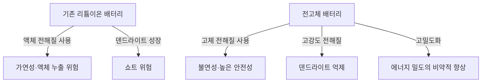

# 전고체 배터리의 원리: 차세대 EV의 심장부가 될 에너지 혁명

전기자동차(EV)의 보급이 급속도로 진행되는 현대에 있어, 배터리 기술의 진화는 모빌리티 혁명의 가장 중요한 과제가 되었습니다. 그 중에서도 '차세대 배터리의 히든카드'로서 전 세계의 연구 기관과 자동차 제조사들이 개발에 각축을 벌이고 있는 것이 바로 '전고체 배터리(Solid-State Battery)'입니다.

본 기사에서는 기존 리튬이온 배터리가 안고 있는 한계부터 전고체 배터리의 획기적인 메커니즘, 그리고 사회 구현을 향한 기술적 과제까지 깊이 있게 해설합니다.

## 1. 기존 리튬이온 배터리가 안고 있는 과제

현재 스마트폰부터 EV까지 폭넓게 사용되고 있는 리튬이온 배터리(LIB)는 에너지 밀도가 높고 가볍다는 우수한 특성을 가지고 있습니다. 하지만 그 구조상 몇 가지 피할 수 없는 과제가 존재합니다.

### 액체 전해질로 인한 위험
기존의 리튬이온 배터리는 양극과 음극 사이를 리튬 이온이 이동하면서 충방전을 수행합니다. 이 이온의 통로가 되는 것이 '액체 전해질'입니다. 그러나 액체 전해질에는 다음과 같은 물리적·화학적 위험이 따릅니다.

- **액체 누출 및 휘발성**: 외부로부터의 충격이나 열화로 인해 가연성 액체 전해질이 누출될 위험이 있습니다.
- **열폭주(Thermal Runaway)**: 단락(쇼트)이나 과충전으로 인해 내부 온도가 상승하면 액체 전해질이 기화·발화하여 연쇄적으로 온도가 상승하는 열폭주를 일으킬 위험이 있습니다. EV의 화재 사고 대부분은 이 현상에 기인합니다.

### 덴드라이트(수지상 결정)의 형성
충전을 반복하는 동안 음극 표면에 리튬 금속이 서리처럼 석출되어 성장하는 '덴드라이트'라는 현상이 발생합니다. 이 덴드라이트가 성장하여 분리막을 뚫고 양극에 도달하면 내부 쇼트를 일으켜 발화나 폭발의 원인이 됩니다.

### 에너지 밀도의 한계
안전성을 확보하기 위해서는 튼튼한 외장이나 냉각 시스템, 안전 마진을 마련해야 하며, 결과적으로 배터리 팩 전체의 부피와 무게가 증가하게 됩니다. 또한 액체 전해질의 전압 내성 한계로 인해 더 높은 전압과 고용량 소재의 채택이 제한되어 왔습니다.

## 2. 전고체 배터리란 무엇인가?: 액체에서 고체로의 패러다임 전환

전고체 배터리는 그 이름대로 기존의 '액체 전해질'을 '고체 전해질'로 대체한 배터리입니다.

### 전고체 배터리의 주요 장점

1. **궁극의 안전성**
   가연성 유기 용매를 사용하지 않기 때문에 액체 누출이나 발화 위험이 극히 낮습니다. 만에 하나 못이 찔리는 등의 물리적 파괴(못 관통 시험)가 일어나도 열폭주를 일으키기 어려운 압도적인 안전성을 가지고 있습니다.

2. **에너지 밀도의 비약적 향상**
   고체 전해질은 고전압에 대해 안정적이기 때문에 더 강력한 양극 소재나 리튬 금속을 그대로 음극에 사용하는 것이 가능해집니다. 이로 인해 동일한 부피·무게라도 기존보다 2배 이상의 에너지를 저장할 수 있을 것으로 기대되며, EV의 주행 거리 대폭 연장(예를 들어 1회 충전으로 1000km 이상)이 현실성을 띠게 됩니다.

3. **초급속 충전의 실현**
   액체 전해질에서는 급속 충전을 하면 리튬 이온의 이동이 따라가지 못해 덴드라이트가 형성되기 쉽습니다. 반면, 특정 고체 전해질(예를 들어 황화물계) 안에서는 리튬 이온이 액체 속보다 빠르게 이동할 수 있다는 것이 밝혀졌습니다. 이로 인해 몇 분 만에 완전 충전이 가능해질 것으로 예측되고 있습니다.

4. **광범위한 동작 온도 영역**
   액체 전해질처럼 저온에서 얼거나 고온에서 휘발되지 않기 때문에 극한의 추위부터 작열하는 환경까지 배터리의 성능 저하를 최소한으로 억제할 수 있습니다. 이를 통해 복잡하고 무거운 온도 관리(냉각/가열) 시스템을 간소화할 수 있습니다.

## 3. 전고체 배터리의 메커니즘과 종류

전고체 배터리의 성능은 '어떤 고체 전해질을 사용하는가'에 따라 크게 달라집니다. 현재 주로 다음과 같은 3가지 계통이 연구되고 있습니다.

### 황화물계(Sulfide-based)
- **특징**: 매우 높은 이온 전도도(리튬 이온의 이동 용이성)를 가지며, 실온에서도 액체 전해질과 동등하거나 그 이상의 성능을 발휘합니다. 프레스 성형이 쉽기 때문에 대용량화에 적합합니다.
- **과제**: 대기 중의 수분과 반응하면 유독한 황화수소 가스를 발생시키기 때문에 제조 공정에서 엄격한 수분 관리(초 드라이 룸)가 필요합니다. 도요타 자동차 등이 이 분야에서 앞서가고 있습니다.

### 산화물계(Oxide-based)
- **특징**: 화학적으로 매우 안정적이며, 공기 중에서의 취급이 용이합니다. 안전성이 가장 높고, 소형 기기나 웨어러블 기기, 의료 기기용으로 실용화가 진행되고 있습니다.
- **과제**: 이온 전도도가 황화물계에 비해 낮고, 입자 간의 결합을 견고하게 하기 위해 고온에서의 소결이 필요하여 대형 EV용 배터리 제조에는 기술적 장벽이 높다고 여겨집니다.

### 폴리머계(Polymer-based)
- **특징**: 유연성이 있어 기존 리튬이온 배터리의 제조 라인을 응용하기 쉽다는 장점이 있습니다.
- **과제**: 실온에서의 이온 전도도가 극히 낮아 작동시키기 위해서는 배터리를 60℃~80℃ 정도로 가열해야 하므로 용도가 제한됩니다.

## 4. 양산화를 향한 기술적 장벽과 미래

전고체 배터리는 '꿈의 배터리'로 기대받고 있지만, 양산화와 보급에는 아직 몇 가지 높은 벽이 존재합니다.

### 계면 저항 문제
고체끼리(전극과 고체 전해질)를 밀착시키는 것은 매우 어렵습니다. 충방전을 반복하면 전극 소재가 팽창·수축하기 때문에 고체 전해질과의 사이에 미세한 틈이 생겨 리튬 이온의 이동을 방해하는 '계면 저항'이 증대하고 맙니다. 이를 방지하기 위해 높은 압력을 계속 가하는 패키징 기술이나 계면을 부드럽게 유지하는 복합 소재의 개발이 진행되고 있습니다.

### 제조 비용과 공정의 혁신
현재의 대규모 리튬이온 배터리 기가팩토리는 액체 전해질을 주입하는 공정에 최적화되어 있습니다. 전고체 배터리 제조에는 완전히 새로운 공정(초고압 프레스 설비나 드라이 룸 등)이 필요하여 초기 투자와 제조 비용이 막대해집니다. 재료비 자체도 값비싼 희소 금속을 사용하는 경우가 있어 비용 절감이 보급의 열쇠를 쥐고 있습니다.

### 공급망의 재구축
새로운 고체 전해질 소재(리튬, 황, 게르마늄 등)의 안정적이고 저렴한 조달망을 세계 규모로 구축할 필요가 있습니다.

## 5. 결론: 에너지 혁명은 이미 시작되었다

전고체 배터리는 더 이상 단순한 연구실 수준의 개념이 아닙니다. 세계 최고 수준의 자동차 제조사와 혁신적인 스타트업 기업들이 2020년대 후반부터 2030년대 전반에 걸친 상용화, EV 탑재를 명확한 목표로 삼고 로드맵을 그리고 있습니다.

액체에서 고체로의 패러다임 전환은 발화 위험을 근절하고 충전의 개념을 바꾸며, 나아가 모빌리티의 모습을 근본부터 변혁할 잠재력을 간직하고 있습니다. 전고체 배터리의 기술적 돌파구가 달성되었을 때, 우리는 진정한 의미의 '지속 가능한 클린 에너지 사회'를 향한 큰 발걸음을 내딛게 될 것입니다.
