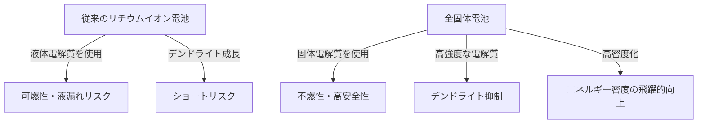

# 全固体電池の仕組み：次世代EVの心臓部となるエネルギー革命

電気自動車（EV）の普及が急速に進む現代において、バッテリー技術の進化はモビリティ革命の最重要課題となっています。その中で、「次世代バッテリーの切り札」として世界中の研究機関や自動車メーカーが開発に凌ぎを削っているのが「全固体電池（Solid-State Battery）」です。

本記事では、従来のリチウムイオン電池が抱える限界から、全固体電池の画期的なメカニズム、そして社会実装に向けた技術的課題まで、深掘りして解説します。

## 1. 従来のリチウムイオン電池が抱える課題

現在、スマートフォンからEVまで幅広く使用されているリチウムイオン電池（LIB）は、エネルギー密度が高く軽量であるという優れた特性を持っています。しかし、その構造上、いくつかの避けられない課題が存在します。

### 液体電解質によるリスク
従来のリチウムイオン電池は、正極と負極の間をリチウムイオンが移動することで充放電を行います。このイオンの通り道となるのが「液体電解質」です。しかし、液体電解質には以下のような物理的・化学的リスクが伴います。

- **液漏れと揮発性**: 外部からの衝撃や劣化により、可燃性の液体電解質が漏れ出すリスクがあります。
- **熱暴走（Thermal Runaway）**: 短絡（ショート）や過充電によって内部温度が上昇すると、液体電解質が気化・発火し、連鎖的に温度が上昇する熱暴走を引き起こす危険性があります。EVの火災事故の多くは、この現象に起因しています。

### デンドライト（樹枝状結晶）の形成
充電を繰り返すうちに、負極表面にリチウム金属が樹氷のように析出して成長する「デンドライト」という現象が発生します。このデンドライトが成長してセパレータを突き破り、正極に達すると内部ショートを引き起こし、発火や爆発の原因となります。

### エネルギー密度の限界
安全性を確保するためには、頑丈な外装や冷却システム、安全マージンを設ける必要があり、結果としてバッテリーパック全体の体積や重量が増加してしまいます。また、液体電解質の電圧耐性の限界により、より高電圧・高容量な材料の採用が制限されてきました。

## 2. 全固体電池とは何か？：液体から固体へのパラダイムシフト

全固体電池は、その名の通り、従来の「液体電解質」を「固体電解質」に置き換えたバッテリーです。

### 全固体電池の主なメリット

1. **究極の安全性**
   可燃性の有機溶媒を使用しないため、液漏れや発火のリスクが極めて低くなります。万が一、釘が刺さるような物理的破壊（釘刺し試験）が起きても、熱暴走を起こしにくいという圧倒的な安全性を持っています。

2. **エネルギー密度の飛躍的向上**
   固体電解質は高電圧に対して安定しているため、より強力な正極材料や、リチウム金属をそのまま負極に用いることが可能になります。これにより、同じ体積・重量でも従来の2倍以上のエネルギーを蓄えることが期待され、EVの航続距離の大幅な延長（例えば1回の充電で1000km以上）が現実味を帯びます。

3. **超急速充電の実現**
   液体の電解質では、急速充電を行うとリチウムイオンの移動が追いつかず、デンドライトが形成されやすくなります。一方、特定の固体電解質（例えば硫化物系）の中では、リチウムイオンが液体中よりも高速に移動できることがわかっています。これにより、数分でのフル充電が可能になると予測されています。

4. **広範な動作温度領域**
   液体電解質のように低温で凍結したり、高温で揮発したりしないため、極寒の環境から灼熱の環境まで、バッテリーの性能低下を最小限に抑えることができます。これによって複雑で重い温度管理（冷却/加熱）システムを簡略化できます。

## 3. 全固体電池のメカニズムと種類

全固体電池の性能は、「どのような固体電解質を用いるか」によって大きく変わります。現在、主に以下の3つの系統が研究されています。

### 硫化物系（Sulfide-based）
- **特徴**: 非常に高いイオン伝導度（リチウムイオンの移動のしやすさ）を持ち、室温でも液体電解質と同等かそれ以上の性能を発揮します。プレス成形がしやすいため、大容量化に向いています。
- **課題**: 大気中の水分と反応すると有毒な硫化水素ガスを発生させるため、製造工程での厳密な水分管理（超ドライルーム）が必要です。トヨタ自動車などがこの分野で先行しています。

### 酸化物系（Oxide-based）
- **特徴**: 化学的に非常に安定しており、空気中での取り扱いが容易です。安全性が最も高く、小型デバイスやウェアラブル機器、医療機器向けとして実用化が進んでいます。
- **課題**: イオン伝導度が硫化物系に比べて低く、粒子間の結合を強固にするために高温での焼結が必要であり、大型のEV用バッテリーの製造には技術的ハードルが高いとされています。

### ポリマー系（Polymer-based）
- **特徴**: 柔軟性があり、既存のリチウムイオン電池の製造ラインを応用しやすいという利点があります。
- **課題**: 室温でのイオン伝導度が極めて低く、動作させるためにはバッテリーを60℃〜80℃程度に加熱する必要があるため、用途が制限されます。

## 4. 量産化への技術的障壁と未来

全固体電池は「夢の電池」として期待されていますが、量産化と普及にはまだいくつかの高い壁が存在します。

### 界面抵抗の問題
固体同士（電極と固体電解質）を密着させることは非常に困難です。充放電を繰り返すと電極材料が膨張・収縮するため、固体電解質との間にミクロな隙間ができ、リチウムイオンの移動を妨げる「界面抵抗」が増大してしまいます。これを防ぐために、高い圧力をかけ続けるパッケージング技術や、界面を柔らかく保つ複合材料の開発が進められています。

### 製造コストとプロセスの革新
現在の大規模なリチウムイオン電池のギガファクトリーは、液体電解質を注入するプロセスに最適化されています。全固体電池の製造には、全く新しいプロセス（超高圧プレス設備やドライルームなど）が必要であり、初期投資と製造コストが膨大になります。材料費自体も高価な希少金属を使用する場合があり、コストダウンが普及の鍵を握ります。

### サプライチェーンの再構築
新たな固体電解質材料（リチウム、硫黄、ゲルマニウムなど）の安定的で安価な調達網を世界規模で構築する必要があります。

## 5. 結論：エネルギー革命はもう始まっている

全固体電池は、もはや単なる研究室レベルの概念ではありません。世界トップクラスの自動車メーカーや革新的なスタートアップ企業が、2020年代後半から2030年代前半にかけての商用化、EVへの搭載を明確な目標としてロードマップを描いています。

液体から固体へのパラダイムシフトは、発火リスクを撲滅し、充電の概念を変え、そしてモビリティの在り方を根本から変革するポテンシャルを秘めています。全固体電池の技術的ブレイクスルーが達成された時、私たちは真の意味での「持続可能なクリーンエネルギー社会」への大きな一歩を踏み出すことになるでしょう。
