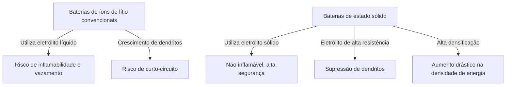

# Como funcionam as baterias de estado sólido: A revolução energética no coração dos VEs da próxima geração

Na era atual, onde a popularização dos veículos elétricos (VEs) avança rapidamente, a evolução da tecnologia das baterias tornou-se a questão mais importante da revolução da mobilidade. Nesse contexto, a "Bateria de Estado Sólido (Solid-State Battery)" é aquela pela qual institutos de pesquisa e fabricantes de automóveis em todo o mundo estão competindo para desenvolver como o "trunfo das baterias da próxima geração".

Neste artigo, aprofundaremos nas limitações das baterias convencionais de íons de lítio, no mecanismo inovador das baterias de estado sólido e nos desafios técnicos para a sua implementação na sociedade.

## 1. Desafios das baterias de íons de lítio convencionais

As baterias de íons de lítio (LIB), atualmente amplamente utilizadas, de smartphones a VEs, possuem excelentes características de alta densidade de energia e leveza. No entanto, devido à sua estrutura, existem alguns desafios inevitáveis.

### Riscos do eletrólito líquido
As baterias de íons de lítio convencionais carregam e descarregam movendo íons de lítio entre os eletrodos positivo e negativo. O "eletrólito líquido" serve como caminho para esses íons. Contudo, os eletrólitos líquidos apresentam os seguintes riscos físicos e químicos:

- **Vazamento e volatilidade**: Existe o risco de que o eletrólito líquido inflamável vaze devido a choques externos ou degradação.
- **Fuga térmica (Thermal Runaway)**: Quando a temperatura interna aumenta devido a um curto-circuito ou sobrecarga, o eletrólito líquido pode vaporizar e entrar em ignição, causando uma fuga térmica que aumenta a temperatura em cadeia. Muitos acidentes de incêndio de VEs são atribuídos a esse fenômeno.

### Formação de dendritos (cristais dendríticos)
Com as cargas repetidas, ocorre um fenômeno chamado "dendrito", onde o lítio metálico precipita e cresce na superfície do eletrodo negativo, assemelhando-se a árvores cobertas de gelo. Quando esses dendritos crescem, perfuram o separador e alcançam o eletrodo positivo, eles causam um curto-circuito interno, resultando em ignição ou explosão.

### Limitações da densidade de energia
Para garantir a segurança, é necessário ter um invólucro robusto, sistemas de resfriamento e margens de segurança, o que consequentemente aumenta o volume e o peso de todo o pacote de baterias. Além disso, as limitações da resistência à tensão dos eletrólitos líquidos têm restringido a adoção de materiais de maior tensão e capacidade.

## 2. O que é uma bateria de estado sólido?: A mudança de paradigma do líquido para o sólido

Como o nome sugere, as baterias de estado sólido são baterias nas quais o "eletrólito líquido" convencional foi substituído por um "eletrólito sólido".

### Principais vantagens das baterias de estado sólido

1. **Segurança extrema**
   Como não utilizam solventes orgânicos inflamáveis, o risco de vazamentos e ignição é extremamente baixo. Mesmo em caso de danos físicos, como a perfuração por um prego (teste de penetração com prego), possuem uma segurança avassaladora, sendo muito resistentes a fugas térmicas.

2. **Aumento drástico na densidade de energia**
   Como o eletrólito sólido é estável em altas tensões, torna-se possível o uso de materiais de eletrodo positivo mais potentes e do próprio metal lítio como eletrodo negativo. Com isso, espera-se armazenar mais que o dobro da energia em comparação com as baterias convencionais de mesmo volume e peso, tornando mais realista a ampliação substancial da autonomia dos VEs (por exemplo, mais de 1000 km com uma única carga).

3. **Realização de carregamento ultrarrápido**
   Com eletrólitos líquidos, o movimento dos íons de lítio não acompanha a velocidade durante um carregamento rápido, facilitando a formação de dendritos. Por outro lado, sabe-se que em certos eletrólitos sólidos (como os baseados em sulfeto), os íons de lítio podem se mover mais rapidamente do que nos líquidos. Isso prevê que a carga completa em poucos minutos será possível.

4. **Ampla faixa de temperaturas de operação**
   Como não congelam em baixas temperaturas nem volatilizam em altas temperaturas como os eletrólitos líquidos, a degradação do desempenho da bateria pode ser minimizada desde ambientes extremamente frios até ambientes abrasadores. Isso permite a simplificação de sistemas complexos e pesados de gerenciamento térmico (resfriamento/aquecimento).

## 3. Mecanismos e tipos de baterias de estado sólido

O desempenho das baterias de estado sólido varia muito dependendo de "qual eletrólito sólido é usado". Atualmente, as três principais linhagens abaixo estão sendo pesquisadas.

### Baseado em sulfeto (Sulfide-based)
- **Características**: Possui condutividade iônica extremamente alta (facilidade de movimento dos íons de lítio) e, mesmo em temperatura ambiente, demonstra um desempenho igual ou superior aos eletrólitos líquidos. Por ser fácil de moldar por prensagem, é adequado para grande capacidade.
- **Desafios**: Ao reagir com a umidade do ar, gera gás sulfeto de hidrogênio, que é tóxico, sendo necessário um controle rigoroso de umidade (sala ultrasseca) no processo de fabricação. A Toyota Motors e outras empresas lideram esse setor.

### Baseado em óxido (Oxide-based)
- **Características**: É quimicamente muito estável e fácil de manusear no ar. Possui a maior segurança e está sendo comercializado para dispositivos compactos, dispositivos portáteis (wearables) e equipamentos médicos.
- **Desafios**: A condutividade iônica é inferior à dos baseados em sulfeto, e para fortalecer a ligação entre as partículas, é necessária a sinterização em alta temperatura, o que apresenta altos obstáculos técnicos para a fabricação de baterias grandes para VEs.

### Baseado em polímero (Polymer-based)
- **Características**: Possui flexibilidade e tem a vantagem de ser facilmente aplicável às linhas de produção de baterias de íons de lítio existentes.
- **Desafios**: A condutividade iônica em temperatura ambiente é extremamente baixa, e para operar, a bateria precisa ser aquecida a cerca de 60°C a 80°C, o que restringe suas aplicações.

## 4. Barreiras técnicas e o futuro para a produção em massa

As baterias de estado sólido são esperadas como "baterias dos sonhos", mas ainda existem obstáculos elevados para a produção em massa e a popularização.

### Problema de resistência interfacial
É extremamente difícil fazer com que os sólidos (eletrodos e eletrólito sólido) adiram firmemente uns aos outros. Como os materiais dos eletrodos expandem e contraem com as cargas e descargas repetidas, criam-se lacunas microscópicas entre eles e o eletrólito sólido, aumentando a "resistência interfacial" que dificulta o movimento dos íons de lítio. Para evitar isso, estão sendo desenvolvidas tecnologias de empacotamento para aplicar pressão contínua e materiais compostos que mantêm a interface flexível.

### Custos de fabricação e inovação de processos
Atualmente, as gigafábricas de baterias de íons de lítio em larga escala são otimizadas para o processo de injeção de eletrólitos líquidos. A fabricação de baterias de estado sólido requer processos completamente novos (como equipamentos de prensagem de altíssima pressão e salas secas), o que inflaciona o investimento inicial e os custos de fabricação. O custo dos próprios materiais também pode ser alto, utilizando metais raros, de forma que a redução de custos é a chave para a popularização.

### Reestruturação da cadeia de suprimentos
É necessário construir uma rede global de aquisição estável e de baixo custo de novos materiais de eletrólitos sólidos (lítio, enxofre, germânio, etc.).

## 5. Conclusão: A revolução energética já começou

As baterias de estado sólido não são mais um conceito restrito aos laboratórios. Fabricantes de automóveis de primeira classe mundial e startups inovadoras têm delineado roteiros com metas claras de comercialização e integração em VEs desde a segunda metade da década de 2020 até a primeira metade da década de 2030.

A mudança de paradigma do líquido para o sólido tem o potencial de erradicar o risco de incêndios, transformar o conceito de carregamento e revolucionar fundamentalmente a natureza da mobilidade. Quando os avanços tecnológicos nas baterias de estado sólido forem alcançados, daremos um grande passo em direção a uma sociedade de energia limpa e sustentável no sentido verdadeiro.
