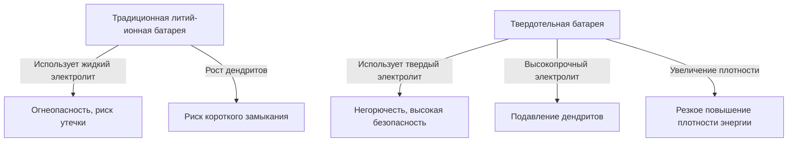

# Принцип работы твердотельных батарей: Энергетическая революция, которая станет сердцем электромобилей следующего поколения

В современную эпоху стремительного распространения электромобилей (EV) эволюция аккумуляторных технологий стала важнейшей задачей мобильной революции. Среди них «твердотельные батареи» (Solid-State Battery), разрабатываемые исследовательскими институтами и автопроизводителями по всему миру, выступают в качестве «козыря аккумуляторов следующего поколения».

В этой статье мы подробно рассмотрим ограничения традиционных литий-ионных батарей, революционный механизм твердотельных батарей и технические проблемы на пути к их внедрению в общество.

## 1. Проблемы традиционных литий-ионных батарей

Литий-ионные батареи (LIB), широко используемые сегодня в различных устройствах, от смартфонов до электромобилей, обладают отличными характеристиками, такими как высокая плотность энергии и малый вес. Однако из-за своей структуры они имеют несколько неизбежных проблем.

### Риски, связанные с жидким электролитом
В традиционных литий-ионных батареях зарядка и разрядка происходят за счет перемещения ионов лития между катодом (положительным электродом) и анодом (отрицательным электродом). Путем для этих ионов служит «жидкий электролит». Однако жидкий электролит сопряжен со следующими физическими и химическими рисками:

- **Утечка и летучесть**: Существует риск вытекания легковоспламеняющегося жидкого электролита из-за внешнего удара или износа.
- **Тепловой разгон (Thermal Runaway)**: Когда внутренняя температура повышается из-за короткого замыкания или перезарядки, жидкий электролит может испариться и воспламениться, вызывая цепную реакцию повышения температуры, известную как тепловой разгон. Многие случаи возгорания электромобилей связаны с этим явлением.

### Образование дендритов (древовидных кристаллов)
При многократной зарядке на поверхности анода кристаллизуется и растет металлический литий, образуя структуры, напоминающие деревья, называемые «дендритами». Когда эти дендриты растут и пробивают сепаратор, достигая катода, они вызывают внутреннее короткое замыкание, что становится причиной возгорания или взрыва.

### Предел плотности энергии
Для обеспечения безопасности необходимо использовать прочные корпуса, системы охлаждения и закладывать запас прочности, что в конечном итоге увеличивает объем и вес аккумуляторного блока в целом. Кроме того, ограничения по напряжению жидкого электролита сдерживают использование материалов с более высоким напряжением и емкостью.

## 2. Что такое твердотельная батарея? Смена парадигмы: от жидкости к твердому телу

Как следует из названия, твердотельная батарея — это аккумулятор, в котором традиционный «жидкий электролит» заменен на «твердый электролит».

### Основные преимущества твердотельных батарей

1. **Абсолютная безопасность**
   Поскольку горючие органические растворители не используются, риск утечки или возгорания чрезвычайно низок. В случае физического разрушения, например, при протыкании гвоздем (тест на пробивание гвоздем), она обладает исключительной безопасностью и вряд ли подвергнется тепловому разгону.

2. **Резкое повышение плотности энергии**
   Поскольку твердый электролит стабилен при высоких напряжениях, становится возможным использовать более мощные катодные материалы или использовать металлический литий непосредственно в качестве анода. Ожидается, что это позволит хранить более чем в два раза больше энергии при тех же объеме и весе, что делает значительное увеличение запаса хода электромобилей (например, более 1000 км на одной зарядке) реальностью.

3. **Реализация сверхбыстрой зарядки**
   В жидком электролите при быстрой зарядке движение ионов лития не успевает, что способствует образованию дендритов. С другой стороны, известно, что в некоторых твердых электролитах (например, на основе сульфидов) ионы лития могут перемещаться быстрее, чем в жидкости. Прогнозируется, что это сделает возможной полную зарядку за несколько минут.

4. **Широкий диапазон рабочих температур**
   В отличие от жидких электролитов, они не замерзают при низких температурах и не испаряются при высоких, сводя к минимуму снижение производительности батареи от экстремально холодных до раскаленных сред. Это позволяет упростить сложные и тяжелые системы терморегулирования (охлаждения/нагрева).

## 3. Механизм и виды твердотельных батарей

Характеристики твердотельных батарей сильно зависят от того, «какой твердый электролит используется». В настоящее время в основном исследуются следующие три типа.

### Сульфидные (Sulfide-based)
- **Особенности**: Обладают очень высокой ионной проводимостью (легкость перемещения ионов лития) и даже при комнатной температуре демонстрируют производительность, равную или превышающую жидкие электролиты. Их легко прессовать, что делает их подходящими для аккумуляторов большой емкости.
- **Проблемы**: При реакции с влагой в воздухе выделяется токсичный газообразный сероводород, поэтому в процессе производства требуется строгий контроль влажности (сверхсухие помещения). В этой области лидируют такие компании, как Toyota Motor Corporation.

### Оксидные (Oxide-based)
- **Особенности**: Химически очень стабильны и просты в обращении на воздухе. Они обладают самой высокой безопасностью и уже внедряются в компактные устройства, носимую электронику и медицинское оборудование.
- **Проблемы**: Ионная проводимость ниже, чем у сульфидных, и для прочного соединения частиц требуется высокотемпературное спекание, что считается высоким техническим барьером для производства крупногабаритных батарей для EV.

### Полимерные (Polymer-based)
- **Особенности**: Гибкость и простота адаптации существующих производственных линий литий-ионных батарей.
- **Проблемы**: Ионная проводимость при комнатной температуре крайне низкая, и для их работы требуется нагрев батареи примерно до 60-80°C, что ограничивает область их применения.

## 4. Технические барьеры для массового производства и будущее

Хотя твердотельные батареи считаются «батареями мечты», до их массового производства и широкого распространения еще предстоит преодолеть ряд высоких барьеров.

### Проблема межфазного сопротивления
Обеспечить плотный контакт между твердыми веществами (электродами и твердым электролитом) очень сложно. Из-за расширения и сжатия электродных материалов при многократных циклах зарядки-разрядки между ними и твердым электролитом образуются микроскопические зазоры, что увеличивает «межфазное сопротивление», препятствующее перемещению ионов лития. Для предотвращения этого разрабатываются технологии упаковки с постоянным высоким давлением и композитные материалы, сохраняющие эластичность на границе раздела.

### Инновации в производственных затратах и процессах
Современные гигафабрики по производству литий-ионных батарей оптимизированы под процесс впрыска жидкого электролита. Производство твердотельных батарей требует совершенно новых процессов (оборудование для прессования под сверхвысоким давлением, сухие помещения и т. д.), что влечет за собой огромные первоначальные инвестиции и производственные затраты. Сами материалы также могут включать дорогие редкие металлы, поэтому снижение стоимости является ключом к их широкому распространению.

### Реструктуризация цепочки поставок
Необходимо создать глобальную стабильную и недорогую сеть поставок новых материалов для твердых электролитов (литий, сера, германий и т. д.).

## 5. Заключение: Энергетическая революция уже началась

Твердотельные батареи больше не являются концепцией исключительно лабораторного уровня. Ведущие мировые автопроизводители и инновационные стартапы разработали дорожные карты с четкой целью коммерциализации и внедрения в EV во второй половине 2020-х – первой половине 2030-х годов.

Смена парадигмы от жидкого к твердому имеет потенциал для устранения риска возгорания, изменения концепции зарядки и фундаментальной трансформации того, какой должна быть мобильность. Когда будет достигнут технологический прорыв в области твердотельных батарей, мы сделаем большой шаг к действительно «устойчивому обществу чистой энергии».
