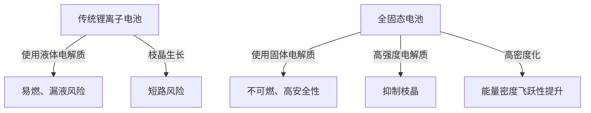

# 全固态电池的原理：成为下一代电动汽车心脏的能源革命

在电动汽车（EV）普及迅速推进的现代，电池技术的进化已成为出行革命的最重要课题。其中，作为“下一代电池的王牌”，世界各地的研究机构和汽车制造商正在竞相开发的正是“全固态电池（Solid-State Battery）”。

本文将从传统锂离子电池面临的局限性，到全固态电池的突破性机制，再到面向社会应用的各类技术课题，进行深入探讨和解说。

## 1. 传统锂离子电池面临的课题

目前，从智能手机到电动汽车广泛使用的锂离子电池（LIB）具有能量密度高、重量轻等优良特性。然而，由于其结构原因，存在一些不可避免的问题。

### 液体电解质带来的风险
传统的锂离子电池通过锂离子在正极和负极之间移动来进行充放电。作为这些离子通道的是“液体电解质”。但是，液体电解质伴随着以下物理和化学风险。

- **漏液与挥发性**：由于外部冲击或老化，存在易燃液体电解质泄漏的风险。
- **热失控（Thermal Runaway）**：如果由于短路或过度充电导致内部温度上升，液体电解质可能会气化、起火，并引发连锁的温度上升，造成热失控的危险。许多电动汽车火灾事故都是由这种现象引起的。

### 枝晶（树枝状结晶）的形成
在反复充电的过程中，负极表面会发生锂金属像树挂一样析出并生长的“枝晶”现象。如果这种枝晶生长并刺穿隔膜，到达正极，就会引起内部短路，从而导致起火或爆炸。

### 能量密度的极限
为了确保安全性，必须设置坚固的外壳、冷却系统和安全余量，结果导致整个电池包的体积和重量增加。此外，由于液体电解质电压耐受性的限制，采用更高电压和更高容量的材料一直受到限制。

## 2. 什么是全固态电池？：从液体到固体的范式转变

全固态电池，顾名思义，就是将传统的“液体电解质”替换为“固体电解质”的电池。

### 全固态电池的主要优势

1. **极致的安全性**
   由于不使用易燃的有机溶剂，漏液和起火的风险极低。即使发生像被钉子刺穿那样的物理破坏（针刺试验），也具有极难引起热失控的压倒性安全性。

2. **能量密度的飞跃性提升**
   由于固体电解质对高电压保持稳定，因此可以使用更强大的正极材料，或者直接将锂金属用作负极。由此，即使在相同的体积和重量下，也有望储存传统电池两倍以上的能量，使得大幅延长电动汽车的续航里程（例如一次充电超过1000公里）变得更具现实意义。

3. **实现超快速充电**
   在液体电解质中，如果进行快速充电，锂离子的移动将跟不上，容易形成枝晶。另一方面，已知在特定的固体电解质（例如硫化物系）中，锂离子的移动速度比在液体中更快。据预测，这将使得在几分钟内完成充满电成为可能。

4. **广泛的工作温度范围**
   它不会像液体电解质那样在低温下冻结或在高温下挥发，因此从严寒到酷暑的环境中，都能将电池性能的下降控制在最低限度。这使得可以简化复杂而沉重的温度管理（冷却/加热）系统。

## 3. 全固态电池的机制和种类

全固态电池的性能因“使用什么样的固体电解质”而有很大差异。目前，主要在研究以下三个体系。

### 硫化物系（Sulfide-based）
- **特点**：具有极高的离子电导率（锂离子移动的容易程度），即使在室温下也能发挥与液体电解质同等或更高的性能。易于压制成型，因此适合大容量化。
- **课题**：由于与空气中的水分反应会产生有毒的硫化氢气体，因此在制造过程中需要严格的水分管理（超干燥室）。丰田汽车等公司在该领域处于领先地位。

### 氧化物系（Oxide-based）
- **特点**：化学上非常稳定，在空气中易于处理。安全性最高，在面向小型设备、可穿戴设备和医疗设备方面的实用化正在推进。
- **课题**：离子电导率低于硫化物系，为了加强颗粒间的结合，需要高温烧结，被认为在制造大型电动汽车用电池方面存在较高的技术门槛。

### 聚合物系（Polymer-based）
- **特点**：具有柔韧性，优势在于容易应用现有的锂离子电池生产线。
- **课题**：室温下的离子电导率极低，为了使其工作，需要将电池加热到60℃至80℃左右，因此用途受到限制。

## 4. 走向规模化生产的技术障碍与未来

全固态电池被期待为“梦幻电池”，但要实现量产和普及，仍存在几个较高的壁垒。

### 界面电阻问题
使固体与固体（电极和固体电解质）紧密贴合是非常困难的。随着反复充放电，电极材料会膨胀和收缩，因此与固体电解质之间会产生微观间隙，导致阻碍锂离子移动的“界面电阻”增大。为了防止这种情况，正在开发持续施加高压的封装技术，以及保持界面柔软的复合材料。

### 制造本钱与工艺的创新
目前大规模的锂离子电池超级工厂针对注入液体电解质的工艺进行了优化。制造全固态电池需要全新的工艺（超高压冲压设备和干燥室等），初期投资和制造成本巨大。材料本身也可能使用昂贵的稀有金属，降低成本是普及的关键。

### 供应链的重构
需要在全球范围内建立新型固体电解质材料（锂、硫、锗等）稳定且廉价的采购网络。

## 5. 结论：能源革命已经开始

全固态电池不再仅仅是实验室层面的概念。世界顶级的汽车制造商和创新的初创企业都明确将2020年代后半期到2030年代前半期实现商业化及搭载于电动汽车作为目标，并绘制了路线图。

从液体到固体的范式转变，蕴含着消除起火风险、改变充电概念、并从根本上改变出行方式的潜力。当全固态电池的技术突破达成之时，我们将朝着真正意义上的“可持续清洁能源社会”迈出巨大的一步。
