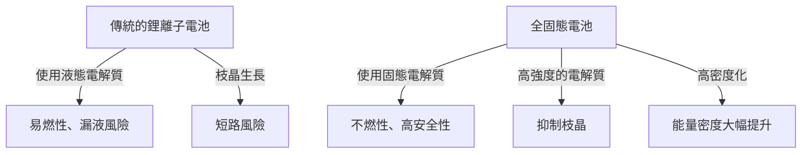

# 全固態電池的運作原理：成為次世代EV心臟的能源革命

在電動車（EV）普及迅速發展的現代，電池技術的進化已成為移動革命的首要課題。其中，作為「次世代電池的王牌」，世界各地的研究機構與汽車製造商正激烈競爭開發的正是「全固態電池（Solid-State Battery）」。

本篇文章將從傳統鋰離子電池所面臨的極限，到全固態電池具劃時代意義的機制，以及朝向社會實踐的技術課題，進行深入探討與解說。

## 1. 傳統鋰離子電池所面臨的課題

目前，從智慧型手機到EV廣泛使用的鋰離子電池（LIB），具有能量密度高且重量輕的優異特性。然而，由於其結構設計，存在著一些無法避免的課題。

### 液態電解質帶來的風險
傳統的鋰離子電池是透過鋰離子在正極與負極之間移動來進行充放電。作為這些離子通道的就是「液態電解質」。然而，液態電解質伴隨著以下物理及化學風險。

- **漏液與揮發性**: 由於外部衝擊或劣化，存在易燃性液態電解質漏出的風險。
- **熱失控（Thermal Runaway）**: 當因短路或過度充電導致內部溫度上升時，液態電解質會氣化、起火，並引發溫度連鎖上升的熱失控危險。許多EV的火災事故都是由此現象引起。

### 枝晶（樹枝狀結晶）的形成
在反覆充電的過程中，負極表面會發生鋰金屬像霧淞一樣析出並生長的「枝晶」現象。當這些枝晶生長刺破隔離膜並到達正極時，就會引發內部短路，成為起火或爆炸的原因。

### 能量密度的極限
為了確保安全性，必須設置堅固的外殼、冷卻系統及安全裕度，結果導致整體電池組的體積與重量增加。此外，由於液態電解質的耐電壓極限，也限制了更高電壓、高容量材料的採用。

## 2. 什麼是全固態電池？：從液態到固態的典範轉移

全固態電池，顧名思義，是將傳統的「液態電解質」替換為「固態電解質」的電池。

### 全固態電池的主要優勢

1. **極致的安全性**
   由於不使用易燃的有機溶劑，漏液或起火的風險極低。即使發生如釘子刺穿般的物理破壞（穿釘測試），也擁有不易引起熱失控的壓倒性安全性。

2. **能量密度大幅提升**
   固態電解質對高電壓非常穩定，因此可以使用更強的正極材料，或直接將鋰金屬用於負極。預期這能在相同體積與重量下，儲存傳統兩倍以上的能量，使大幅延長EV的續航里程（例如單次充電1000公里以上）變得更具現實性。

3. **實現超快速充電**
   在液態電解質中進行快速充電時，鋰離子的移動容易跟不上，從而容易形成枝晶。另一方面，已知在特定的固態電解質（例如硫化物系）中，鋰離子的移動速度比在液體中更快。預計這將使幾分鐘內充滿電成為可能。

4. **廣泛的工作溫度範圍**
   因為不會像液態電解質那樣在低溫下結冰或在高溫下揮發，所以從極寒到酷熱的環境中，都能將電池性能的下降控制在最小限度。這可以簡化複雜且沉重的溫度管理（冷卻/加熱）系統。

## 3. 全固態電池的機制與種類

全固態電池的性能，很大程度上取決於「使用哪種固態電解質」。目前主要有以下三個體系正在被研究。

### 硫化物系（Sulfide-based）
- **特徵**: 具有非常高的離子電導率（鋰離子移動的容易度），即使在室溫下也能發揮與液態電解質同等或更好的性能。因為容易進行壓製成型，所以適合大容量化。
- **課題**: 與大氣中的水分反應會產生有毒的硫化氫氣體，因此在製造過程中需要嚴格的水分管理（超乾燥室）。豐田汽車等公司在此領域處於領先地位。

### 氧化物系（Oxide-based）
- **特徵**: 化學性質非常穩定，在空氣中處理容易。安全性最高，主要針對小型設備、穿戴式裝置及醫療設備的實用化正在推進中。
- **課題**: 離子電導率比硫化物系低，為了強化顆粒間的結合需要高溫燒結，因此在製造大型EV用電池時存在較高的技術門檻。

### 聚合物系（Polymer-based）
- **特徵**: 具有柔韌性，優勢在於容易應用現有的鋰離子電池製造生產線。
- **課題**: 室溫下的離子電導率極低，為了使其運作，需要將電池加熱到60℃〜80℃左右，因此用途受到限制。

## 4. 量產化的技術障礙與未來

儘管全固態電池被寄予厚望成為「夢幻電池」，但距離量產與普及仍存在幾個高牆。

### 界面電阻的問題
要讓固體之間（電極與固態電解質）緊密貼合是非常困難的。反覆充放電會導致電極材料膨脹與收縮，從而與固態電解質之間產生微小空隙，增加阻礙鋰離子移動的「界面電阻」。為防止這種情況，持續施加高壓的封裝技術，以及保持界面柔軟的複合材料開發正在進行中。

### 製造成本與製程創新
目前大規模的鋰離子電池超級工廠，都是針對注入液態電解質的製程進行最佳化。製造全固態電池需要全新的製程（如超高壓壓製設備和乾燥室等），初期投資與製造成本將非常龐大。材料本身也可能使用昂貴的稀有金屬，因此降低成本將是普及的關鍵。

### 供應鏈的重構
需要建立全球規模的穩定且廉價的新型固態電解質材料（如鋰、硫、鍺等）採購網。

## 5. 結論：能源革命已經開始

全固態電池已不再只是實驗室等級的概念。世界頂尖的汽車製造商與創新的新創企業，已將2020年代後半到2030年代前半實現商業化並搭載於EV上，作為明確的目標繪製出路線圖。

從液態到固態的典範轉移，蘊藏著消除起火風險、改變充電概念，並從根本上變革移動方式的潛力。當全固態電池的技術突破達成時，我們將邁向真正意義上的「永續綠能社會」的一大步。
