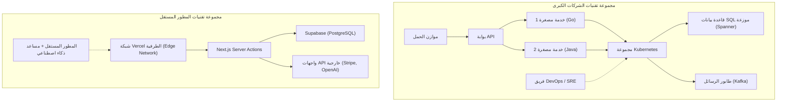

# مقدمة: كيف يقاتل "من لا يملكون شيئًا" لتحدي العمالقة

في تاريخ تطوير البرمجيات، لم يأتِ قط عصر يحمل أفضلية للمطور المستقل (Indie Developer) كما هو الحال اليوم. إن إضفاء الطابع الديمقراطي على البنية التحتية السحابية مثل AWS و GCP، وظهور BaaS (الواجهة الخلفية كخدمة) مثل Vercel و Supabase، وقبل كل شيء أتمتة البرمجة من خلال تطور [LLM](https://kenji.blog/ar/p/large-language-models-llm-transformer-prompt-engineering/) (النماذج اللغوية الكبيرة)، كل هذا هيأ أرضية تتيح للفرد التنافس وجهًا لوجه مع "العمالقة" من شركات التكنولوجيا الكبرى.

ومع ذلك، لمجرد أن الموارد التقنية أصبحت متساوية، فهذا لا يعني أنه يمكنك الفوز باتباع نفس استراتيجيات الشركات الكبرى. فمن حيث القوة الرأسمالية والتسويقية والعلامة التجارية، يقع الفرد في موقف ضعيف للغاية. لكي يتمكن المطور المستقل من البقاء والفوز، من الضروري أن يمتلك "استراتيجية بقاء" فريدة خاصة به.

في هذا المقال، سنشرح بالتفصيل المقاربة التقنية والاستراتيجية للمطور المستقل لإطلاق مشاريع SaaS مصغرة (Micro-SaaS) وتطوير أعمال تجارية تستهدف العالم، متضمنةً تصميم البنية التحتية، والاقتصاد، والنماذج الرياضية.

---

# 1. نظرية الذيل الطويل ورياضيات الأسواق المتخصصة (Niche Markets)

تستهدف الشركات الكبرى الأسواق الشاملة (Mass Markets) حيث يكون TAM (إجمالي السوق المتاح) ضخمًا. فهم يحتاجون إلى ملايين المستخدمين ومبيعات بعشرات الملايين من الدولارات لاسترداد تكاليفهم الثابتة العالية (تكاليف العمالة، إيجار المكاتب، نفقات الإعلان).

في المقابل، تكمن نقطة قوة المطور المستقل في **"نقطة التعادل المنخفضة للغاية"**. فإذا حقق ربحًا ببضعة آلاف من الدولارات شهريًا، فإن ذلك يكفي تمامًا لتأسيس عمل تجاري ناجح كفرد. وهنا تكمن النقطة المثالية لـ "نظرية الذيل الطويل".

## [قانون زيف (Zipf's Law)](https://kenji.blog/p/zipfs-law/) وتوزيع السوق

غالبًا ما تتبع العلاقة بين حجم الأسواق وعددها قانون زيف أو قانون باريتو. إذا كان ترتيب السوق هو $k$، وحجم ذلك السوق (إمكانات المبيعات) هو $P(k)$، فيمكن التعبير عنه باستخدام نموذج قانون القوة (Power Law) التالي:

$$ P(k) \propto \frac{1}{k^\alpha} $$

حيث $\alpha$ هو متغير يحدد شكل التوزيع (بشكل عام $\alpha \approx 1$).

تخوض الشركات الكبرى معارك دموية في المحيطات الحمراء للتنافس على الأسواق الضخمة (الرأس) حيث يكون $k=1, 2, 3$. ومن ناحية أخرى، فإن الأسواق المتخصصة (الذيل) مثل $k \ge 100$ تعد "أسواقاً تجلب الخسائر بمجرد دخولها" بالنسبة للشركات الكبرى، مما يجعلها محيطات زرقاء خالية فعليًا من المنافسة.

```mermaid
xychart-beta
    title توزيع حجم السوق وهدف المطور المستقل
  x-axis ["سوق شامل أ, سوق شامل ب, متخصص ج, متخصص د, متخصص هـ, متخصص و, متخصص ز"]
  y-axis "قيمة السوق" 0 --> 100
  bar [95, 60, 20, 10, 5, 3, 2]
  line [95, 60, 20, 10, 5, 3, 2]
```

يجب على المطورين المستقلين استهداف المشاكل المتخصصة والفريدة عن قصد (مثل أدوات أتمتة سير العمل لصناعة معينة، أو أدوات تحليل متعمقة تجمع بين واجهات برمجة تطبيقات (APIs) محددة). فكلما كان السوق متخصصًا، أصبح الوصول إلى المستخدمين المستهدفين أسهل، وتنخفض تكلفة اكتساب العملاء (CAC).

---

# 2. تصميم البنية التحتية الذي يولد مرونة هائلة (Agility)

تُصمم أنظمة الشركات الكبرى مع إعطاء الأولوية القصوى لـ "الاستقرار" و "قابلية التوسع"، ولذلك يتم اعتماد تقنيات مثل [Kubernetes](https://kenji.blog/ar/p/kubernetes-k8s-architecture-pod-service-ingress/) وهياكل الخدمات المصغرة ([Microservices](https://kenji.blog/ar/p/microservices-architecture-bff-api-gateway/)). ولكن، إذا قام المطور المستقل بنفس الشيء، فستستنفد موارده بمجرد الحفاظ على البنية التحتية وإدارتها (Ops).

الكلمة السرية في مجموعة التقنيات (Tech [Stack](https://kenji.blog/ar/p/c-language-pointers-memory-management-stack-heap/)) للمطور المستقل هي **"No-Ops" (صفر عمليات التشغيل)**. حيث يتم الاستفادة من البنية التحتية الخالية من الخوادم ([Serverless](https://kenji.blog/ar/p/serverless-architecture-aws-lambda-cold-start/)) إلى أقصى حد، والتركيز فقط على كتابة منطق العمل (Business Logic).

## مقارنة البنية التحتية بين الشركات الكبرى والمطور المستقل



في مجموعة تقنيات الشركات الكبرى، تتطلب إضافة ميزة جديدة التنسيق بين فرق متعددة وتجهيز مسار النشر لـ DevOps. من ناحية أخرى، في مجموعة تقنيات المطور المستقل (على سبيل المثال: Next.js + Supabase + Vercel)، يتم النشر على الشبكة الطرفية العالمية بمجرد تنفيذ أمر `git push` واحد، دون الحاجة حتى إلى إعداد قواعد البيانات.

## الاستفادة من المعالجة الخالية من الخوادم ([Serverless](https://kenji.blog/ar/p/serverless-architecture-aws-lambda-cold-start/)) والحوسبة الطرفية (Edge Computing)

باستخدام بيئات التشغيل الطرفية (Edge Runtimes) مثل Vercel أو Cloudflare Workers، يمكنك التخلص من تأخير البدء البارد ([Cold Start](https://kenji.blog/ar/p/serverless-architecture-aws-lambda-cold-start/)) وتقديم واجهات API للمستخدمين في جميع أنحاء العالم بزمن انتقال (Latency) منخفض.

```typescript
// app/api/hello/route.ts (Next.js Edge API Route)
import { NextResponse } from 'next/server';

export const runtime = 'edge';

export async function GET(request: Request) {
  const { searchParams } = new URL(request.url);
  const name = searchParams.get('name') || 'World';
  
  // Edge runtime executes in milliseconds globally
  return NextResponse.json({
    message: `Hello, ${name}!`,
    timestamp: Date.now()
  });
}
```

---

# 3. "الإنتاجية القصوى" باستخدام واجهات الذكاء الاصطناعي (AI APIs)

الميزات التي كانت تتطلب سابقًا فريقًا من مهندسي التعلم الآلي وعلماء البيانات مثل "معالجة اللغات الطبيعية" و "توليد الصور" و "التوصيات"، يمكن الآن تنفيذها باستدعاء واحد فقط لواجهة برمجة التطبيقات (API).

من خلال دمج واجهات برمجة تطبيقات مثل OpenAI (GPT-4o) أو Anthropic (Claude 3.5 Sonnet) في منتج Micro-SaaS الخاص بك، يمكن حتى للفرد الواحد إطلاق منتج "أصلي بالذكاء الاصطناعي" (AI-Native) على الفور.

## تنفيذ البث (Streaming) باستخدام Vercel AI SDK

في المنتجات التي تعتمد على الذكاء الاصطناعي، يكمن مفتاح تجربة المستخدم (UX) في "الاستجابة عبر البث" (Streaming Response). باستخدام Vercel AI SDK، يمكنك تحقيق ذلك بأسطر قليلة من الكود.

```typescript
// app/api/chat/route.ts
import { openai } from '@ai-sdk/openai';
import { streamText } from 'ai';

// تعيين الحد الأقصى لوقت التنفيذ في البيئة الخالية من الخوادم
export const maxDuration = 30; 

export async function POST(req: Request) {
  const { messages } = await req.json();

  const result = await streamText({
    model: openai('gpt-4o-mini'),
    messages,
    system: "أنت مساعد SaaS ممتاز. يرجى حل مشاكل المستخدم بدقة.",
  });

  return result.toDataStreamResponse();
}
```

من خلال تنفيذ مثل هذا، يمكن للمطورين المستقلين تقديم ميزات ذكاء اصطناعي متقدمة دون القلق بشأن تعقيدات البنية التحتية. علاوة على ذلك، من خلال الاستفادة من محررات الأكواد المدعومة بالذكاء الاصطناعي مثل GitHub Copilot و Cursor، قفزت سرعة التطوير نفسها لتصبح من 5 إلى 10 أضعاف ما كانت عليه في الماضي.

---

# 4. رياضيات العبء الإداري للتواصل (Communication Overhead)

لماذا يمكن للمطور المستقل إطلاق الميزات بشكل أسرع من الشركات الكبرى؟ السبب الأكبر هو أن "العبء الإداري للتواصل يساوي صفرًا".

وفقًا لقانون بروكس (Brooks's Law)، المعروف في كلاسيكيات هندسة البرمجيات "شهر-رجل الأسطوري" (The Mythical Man-Month)، فإن عدد قنوات التواصل $C$ في المشروع يزداد بالنسبة لعدد المطورين $n$ كما يلي:

$$ C = \frac{n(n - 1)}{2} $$

عندما يقوم فريق يتكون من $n=10$ مطورين بتطوير ميزة في شركة كبرى، يصل عدد القنوات إلى $C = 45$، ويتم تخصيص وقت هائل لتنسيق المواصفات، والاجتماعات، ومراجعة الأكواد.
ولكن، في حالة المطور المستقل ($n=1$)، فإن عدد القنوات هو $C = 0$.

نظرًا لأنه **لا يوجد عنق زجاجة في عملية تحويل الأفكار إلى أكواد** ، فمن الممكن أن تنشر فكرة خطرت لك في الصباح إلى بيئة الإنتاج في مساء نفس اليوم. هذا هو أقوى سلاح يمتلكه المطور المستقل والذي لا يمكن للشركات الكبرى تقليده مهما أنفقت من أموال.

---

# 5. التوسع العالمي وتكامل بوابة الدفع

بالنسبة لمشاريع Micro-SaaS التي تتنافس عالميًا، يُعد بناء بوابة الدفع (Payment Gateway) أمرًا أساسيًا. من خلال استخدام Stripe، يمكنك أتمتة المدفوعات بالعملات من جميع أنحاء العالم، وإدارة الاشتراكات، وحتى معالجة الضرائب (Stripe Tax) بشكل كامل.

## إدارة اشتراكات متينة باستخدام Stripe Webhook

دعونا نلقي نظرة على نموذج آمن لمزامنة حالة الدفع يجمع بين Next.js App Router و Stripe Webhook.

```typescript
// app/api/webhooks/stripe/route.ts
import { headers } from 'next/headers';
import { NextResponse } from 'next/server';
import Stripe from 'stripe';
import { db } from '@/db';
import { users } from '@/db/schema';
import { eq } from 'drizzle-orm';

const stripe = new Stripe(process.env.STRIPE_SECRET_KEY!, {
  apiVersion: '2023-10-16',
});

export async function POST(req: Request) {
  const body = await req.text();
  const signature = headers().get('Stripe-Signature') as string;

  let event: Stripe.Event;

  try {
    event = stripe.webhooks.constructEvent(
      body,
      signature,
      process.env.STRIPE_WEBHOOK_SECRET!
    );
  } catch (error: any) {
    return new NextResponse(`Webhook Error: ${error.message}`, { status: 400 });
  }

  // معالجة عند تحديث الاشتراك
  if (event.type === 'customer.subscription.updated') {
    const subscription = event.data.object as Stripe.Subscription;
    const customerId = subscription.customer as string;
    
    // تحديث الحالة في قاعدة البيانات
    await db.update(users)
      .set({ subscriptionStatus: subscription.status })
      .where(eq(users.stripeCustomerId, customerId));
  }

  return new NextResponse('OK', { status: 200 });
}
```

من خلال هذه الأسطر القليلة من الكود، يمكنك معالجة مدفوعات بطاقات الائتمان من المستخدمين في الجانب الآخر من العالم على الفور، وأتمتة تقديم الخدمات.

---

# 6. تجنب تقييد البنية التحتية (Vendor [Lock](https://kenji.blog/ar/p/rdbms-transaction-acid-isolation-level-lock/)-in) وقابلية النقل

في استراتيجية الاعتماد المكثف على BaaS والخدمات المدارة، دائمًا ما يكون خطر "تقييد المورد" (Vendor Lock-in) موضع نقاش. على سبيل المثال، إذا كنت تعتمد بشكل كبير جدًا على Firebase Firestore، فسيصبح من الصعب للغاية الانتقال لاحقًا إلى قواعد البيانات العلائقية (RDB).

الحل الأمثل كاستراتيجية بقاء هو اتباع مقاربة **"التقيد بالبنية التحتية، ولكن مع الحفاظ على قابلية نقل البيانات ومنطق العمل"**.

## تجريد طبقة البيانات (Data Layer Abstraction) باستخدام ORM

النهج القياسي هو استخدام خدمات مدارة لقواعد البيانات مثل Supabase (PostgreSQL) أو PlanetScale (MySQL)، مع وضع طبقة تجريد مثل Prisma أو Drizzle ORM بينها وبين كود التطبيق بدلاً من تنفيذ استعلامات SQL المباشرة أو استخدام SDK خاص بـ BaaS معين.

```typescript
// db/schema.ts (Drizzle ORM)
import { pgTable, serial, text, timestamp, varchar } from 'drizzle-orm/pg-core';

export const users = pgTable('users', {
  id: serial('id').primaryKey(),
  email: varchar('email', { length: 255 }).notNull().unique(),
  stripeCustomerId: varchar('stripe_customer_id', { length: 255 }),
  subscriptionStatus: varchar('subscription_status', { length: 50 }),
  createdAt: timestamp('created_at').defaultNow(),
});

// app/actions/user.ts
import { db } from '@/db';
import { users } from '@/db/schema';
import { eq } from 'drizzle-orm';

export async function getUserByEmail(email: string) {
  const result = await db.select().from(users).where(eq(users.email, email));
  return result[0];
}
```

بهذه الطريقة، بالاعتماد على النظام البيئي القياسي لـ PostgreSQL، حتى لو ارتفعت أسعار Supabase فجأة، يمكنك الانتقال إلى AWS RDS أو Render أو خادم PostgreSQL الخاص بك دون الحاجة تقريبًا إلى إعادة كتابة الكود.

---

# 7. التحسين المبرمج لمحركات البحث (Programmatic SEO) والمحتوى المولد بالذكاء الاصطناعي

بالنسبة للمطورين المستقلين الذين لا يمتلكون ميزانية تسويقية، فإن أقوى سلاح لديهم للقتال هو "SEO (تحسين محركات البحث)". في السنوات الأخيرة، اجتذب ما يسمى بـ "SEO المبرمج" الاهتمام، حيث يجمع بين قاعدة البيانات الخاصة بك والنماذج اللغوية الكبيرة ([LLM](https://kenji.blog/ar/p/large-language-models-llm-transformer-prompt-engineering/)) لإنشاء الآلاف أو عشرات الآلاف من الصفحات المقصودة (Landing Pages) ديناميكيًا.

توزيع حركة المرور (Traffic) يتبع أيضًا قانون القوة. بدلاً من استهداف كلمات مفتاحية ضخمة ومحددة، يمكنك تغطية كمية كبيرة من "الكلمات المفتاحية طويلة الذيل" التي تتميز بحجم بحث صغير ولكن بمعدل تحويل عالٍ، مما يرفع من إجمالي الزيارات.

$$ Traffic_{Total} = \int_{x_{min}}^{x_{max}} T(x) dx $$

حتى لو كان حجم الزيارات $T(x)$ للكلمة المفتاحية المتخصصة $x$ صغيرًا، فإن تكامله سيولد حركة مرور ضخمة ككل. باستخدام التوجيه الديناميكي (Dynamic Routing) وميزات SSG/ISR في Next.js، يمكنك تقديم هذه الصفحات بسرعة فائقة.

---

# 8. اقتصاديات الوحدة (Unit Economics) ومعادلة الربح

أخيرًا، دعونا نراجع النموذج الرياضي لجعل Micro-SaaS عملاً تجاريًا قابلاً للحياة. المعادلة الأساسية لأعمال SaaS هي كما يلي:

$$ Profit = \sum_{i=1}^{U} (LTV_i - CAC_i) - Fixed Costs $$

- **$U$**: عدد المستخدمين المكتسبين
- **$LTV$ (القيمة الدائمة للعميل)**: $LTV = \frac{ARPU}{Churn Rate}$ (حيث يمثل ARPU متوسط الإيراد الشهري لكل مستخدم، و Churn Rate معدل الإلغاء أو التخلي)
- **$CAC$ (تكلفة اكتساب العميل)**
- **$Fixed Costs$**: التكاليف الثابتة (تكاليف الخوادم، والأدوات، إلخ)

بالنسبة للمطور المستقل، فإن هناك ميزة تكمن في أن **التكاليف الثابتة ($Fixed Costs$) تقترب من الصفر**. فحتى لو جمعنا خطة Vercel Pro (20 دولارًا في الشهر)، وخطة Supabase Pro (25 دولارًا في الشهر)، ورسوم استخدام واجهات برمجة تطبيقات الذكاء الاصطناعي الأخرى، فإن التكلفة الشهرية ستتراوح بين عشرات إلى مئات الدولارات فقط. الميزة الأكبر هي أنه يمكنك استبعاد تكاليف عمالتك الشخصية من التكاليف الثابتة (أو استردادها من الأرباح).

### أعمال بهامش تكلفة إضافية (Marginal Cost) يساوي صفرًا

في البرمجيات، وخاصة SaaS، تكون التكلفة الحدية أو الإضافية (Marginal Cost) الناتجة عن زيادة مستخدم واحد شبه معدومة. إذا تمكنت من تقليل $CAC$ من خلال أتمتة اكتساب المستخدمين (SEO، والنشر على وسائل التواصل الاجتماعي، والحلقات الفيروسية، إلخ)، فإن معظم المبيعات ستصبح إجمالي أرباح بشكل مباشر.

إذا قمت ببناء أداة B2B متخصصة باشتراك شهري 15 دولارًا، وكان معدل الإلغاء (Churn Rate) 5%، فإن:
$$ LTV = \frac{\$15}{0.05} = \$300 $$

إذا أمكن الإبقاء على CAC عند 10 دولارات بفضل تحسين محركات البحث وتسويق المحتوى، فسيتم توليد 290 دولارًا من الأرباح (إجمالي الربح) مقابل كل مستخدم مكتسب. وببساطة، عبر الوصول بهذا المنتج إلى مستخدمين يواجهون هذه المشكلة المتخصصة في جميع أنحاء العالم، لنقل 1000 شخص مثلاً، فإنك ستنشئ Micro-SaaS يولد دخلاً متكررًا قدره 15,000 دولار شهريًا (حوالي 2 مليون ين أو أكثر).

---

# الخلاصة: السرعة والتخصص الدقيق هما أقوى درع ورمح

تتلخص استراتيجية بقاء المطور المستقل للقتال ضد الشركات الكبرى والمنافسين حول العالم في النقاط الثلاث التالية:

1. **اختيار مكان المعركة (نظرية الذيل الطويل)**
   - استهدف أسواقًا متخصصة لا تستطيع الشركات الكبرى دخولها، والتي تمتلك مشاكل عميقة حتى لو كانت صغيرة.
2. **استخدام النفوذ التقني (الخوادم الخالية / BaaS / الذكاء الاصطناعي)**
   - الاستعانة بمصادر خارجية تمامًا للعمليات (Ops)، وكتابة الكود (منطق العمل) فقط لحل مشاكل العملاء، وليس لإدارة البنية التحتية.
3. **تعظيم المرونة (تكلفة التواصل صفر)**
   - الاستفادة من "السرعة" التي تعد السلاح الأقوى للمطور المستقل، حيث تنشر الفكرة فورًا بمجرد التفكير فيها، وتستفيد من ملاحظات السوق بأسرع وقت ممكن.

نحن نعيش الآن في العصر الأكثر نفوذًا وتأثيرًا في التاريخ. بمجرد توفر لوحة مفاتيح وإنترنت وشغف لحل المشكلات، يمكنك من غرفتك الصغيرة ابتكار منتجات تسعد المستخدمين في جميع أنحاء العالم، والتنافس حتى مع الشركات الضخمة.

الآن، افتح محرر الأكواد الخاص بك، وقم بتهيئة مشروعك الجديد.

```bash
npx create-next-app@latest my-micro-saas
```

فالمعركة قد بدأت بالفعل.


