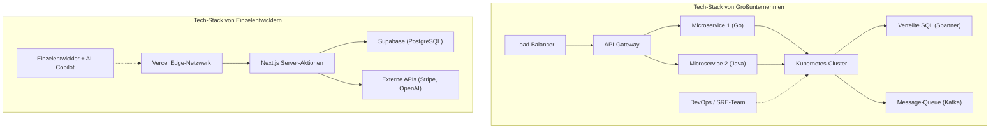

# Einführung: Wie "die Habenichtse" gegen die Giganten kämpfen

In der Geschichte der Softwareentwicklung gab es noch nie eine so vorteilhafte Zeit für Einzelentwickler (Indie-Entwickler). Die Demokratisierung der Cloud-Infrastruktur wie AWS und GCP, der Aufstieg von BaaS (Backend as a [Service](https://kenji.blog/de/p/kubernetes-k8s-architecture-pod-service-ingress/)) wie Vercel und Supabase und vor allem die Automatisierung der Programmierung durch die Entwicklung von LLMs (Large Language Models). All dies hat einen Boden geschaffen, auf dem Einzelpersonen direkt mit den "Giganten", den großen Technologieunternehmen, konkurrieren können.

Allerdings bedeutet die Einebnung der technischen Ressourcen nicht, dass man gewinnen kann, indem man dieselbe Strategie wie große Unternehmen verfolgt. Bei Kapital, Marketing und Markenmacht sind Einzelpersonen im absoluten Nachteil. Damit Einzelentwickler überleben und gewinnen können, ist eine einzigartige "Überlebensstrategie" unerlässlich.

In diesem Artikel werden wir die technischen und strategischen Ansätze für Einzelentwickler zur Einführung von Micro-SaaS und zum weltweiten Ausbau ihres Geschäfts unter Einbeziehung von Architekturdesign, Ökonomie und mathematischen Modellen ausführlich erläutern.

---

# 1. Die Long-Tail-Theorie und die Mathematik von Nischenmärkten

Große Unternehmen zielen auf den Massenmarkt ab, bei dem der TAM (Total Addressable Market) riesig ist. Sie benötigen Millionen von Nutzern und Milliarden von Umsatz, um ihre hohen Fixkosten (Personalkosten, Büromieten, Werbekosten) zu decken.

Im Gegensatz dazu liegt die Stärke von Einzelentwicklern in ihrem **"extrem niedrigen Break-Even-Punkt"**. Ein monatlicher Gewinn von einigen tausend Euro reicht oft aus, um als Einzelperson ein rentables Geschäft aufzubauen. Hier liegt der Sweet Spot der "Long-Tail-Theorie".

## [Das Zipfsche Gesetz](https://kenji.blog/de/p/zipfs-law/) ([Zipf's Law](https://kenji.blog/de/p/zipfs-law/)) und die Marktverteilung

Das Verhältnis zwischen Marktgröße und Anzahl der Märkte folgt oft dem Zipfschen Gesetz oder dem Pareto-Prinzip. Wenn der Rang eines Marktes $k$ ist und seine Marktgröße (Umsatzpotenzial) $P(k)$, kann es durch das folgende Potenzgesetzmodell dargestellt werden:

$$ P(k) \propto \frac{1}{k^\alpha} $$

Hier ist $\alpha$ ein Parameter, der die Form der Verteilung bestimmt (im Allgemeinen $\alpha \approx 1$).

Große Unternehmen kämpfen in riesigen Märkten (Kopf) wie $k=1, 2, 3$ in einem blutigen Red Ocean. Andererseits sind Nischenmärkte (Schwanz) wie $k \ge 100$ für große Unternehmen "Märkte, die nur Verluste bringen würden", was sie für Einzelentwickler zu de facto konkurrenzlosen Blue Oceans macht.

```mermaid
xychart-beta
    title Marktgrößenverteilung und Ziel des Einzelentwicklers
  x-axis ["Masse A", "Masse B", "Nische C", "Nische D", "Nische E", "Nische F", "Nische G"]
  y-axis "Marktwert" 0 --> 100
  bar [95, 60, 20, 10, 5, 3, 2]
  line [95, 60, 20, 10, 5, 3, 2]
```

Einzelentwickler sollten gezielt auf nischenspezifische und spezialisierte Probleme abzielen (z. B. [Workflow](https://kenji.blog/de/p/cicd-pipeline-github-actions-best-practices/)-Automatisierungstools für bestimmte Branchen oder Nischen-Analysetools, die bestimmte APIs kombinieren). Je nischenhafter der Markt, desto einfacher ist es, die Zielnutzer zu erreichen, und die CAC (Customer Acquisition Cost) sinken.

---

# 2. Architekturdesign für überwältigende Agilität

Unternehmenssysteme werden mit "Stabilität" und "Skalierbarkeit" als oberste Priorität entwickelt, weshalb [Kubernetes](https://kenji.blog/de/p/kubernetes-k8s-architecture-pod-service-ingress/) und Microservices-Architekturen verwendet werden. Wenn jedoch ein Einzelentwickler dasselbe tut, werden seine Ressourcen allein durch die Wartung und Verwaltung der Infrastruktur (Ops) aufgebraucht.

Das Motto für den Tech-Stack des Einzelentwicklers lautet **"No-Ops" (Null Betrieb)**. Nutzen Sie serverlose Architekturen bis an die Grenzen aus und konzentrieren Sie sich ausschließlich auf das Schreiben der Geschäftslogik.

## Architekturvergleich: Großunternehmen vs. Einzelentwickler



Im Stack großer Unternehmen sind Koordinationen zwischen mehreren Teams und die Einrichtung von DevOps-Deployment-[Pipeline](https://kenji.blog/de/p/cicd-pipeline-github-actions-best-practices/)s erforderlich, um neue Funktionen hinzuzufügen. Im Gegensatz dazu wird der Stack eines Einzelnen (z. B. Next.js + Supabase + Vercel) mit einem einzigen `git push` im globalen Edge-Netzwerk bereitgestellt, und auch die DB-Bereitstellung ist nicht erforderlich.

## Nutzung von [Serverless](https://kenji.blog/de/p/serverless-architecture-aws-lambda-cold-start/) und Edge-Computing

Durch die Verwendung von Edge-Runtimes wie Vercel oder Cloudflare Workers können Kaltstartverzögerungen eliminiert und Benutzern weltweit APIs mit geringer Latenz bereitgestellt werden.

```typescript
// app/api/hello/route.ts (Next.js Edge API Route)
import { NextResponse } from 'next/server';

export const runtime = 'edge';

export async function GET(request: Request) {
  const { searchParams } = new URL(request.url);
  const name = searchParams.get('name') || 'World';
  
  // Edge-Runtime wird weltweit in Millisekunden ausgeführt
  return NextResponse.json({
    message: `Hello, ${name}!`,
    timestamp: Date.now()
  });
}
```

---

# 3. "Extreme Produktivität" durch Nutzung von AI-APIs

Funktionen wie "Natural Language Processing", "Bildgenerierung" und "Empfehlungen", die früher Teams von Machine-Learning-Ingenieuren und Data Scientists erforderten, können heute mit einem einzigen API-Aufruf implementiert werden.

Durch die Integration der APIs von OpenAI (GPT-4o) oder Anthropic (Claude 3.5 Sonnet) in ein eigenes Micro-SaaS kann auch eine Einzelperson sofort ein "AI-natives" Produkt einführen.

## Streaming-Implementierung mit dem Vercel AI SDK

Der Schlüssel zur User Experience (UX) bei KI-gestützten Produkten ist die "Streaming-Antwort". Mit dem Vercel AI SDK kann dies in nur wenigen Codezeilen realisiert werden.

```typescript
// app/api/chat/route.ts
import { openai } from '@ai-sdk/openai';
import { streamText } from 'ai';

// Legt die maximale Ausführungszeit in der serverlosen Umgebung fest
export const maxDuration = 30; 

export async function POST(req: Request) {
  const { messages } = await req.json();

  const result = await streamText({
    model: openai('gpt-4o-mini'),
    messages,
    system: "Du bist ein exzellenter SaaS-Assistent. Löse die Probleme der Benutzer präzise.",
  });

  return result.toDataStreamResponse();
}
```

Mit dieser Implementierung können Einzelentwickler fortschrittliche KI-Funktionen anbieten, ohne sich um die Komplexität der Infrastruktur kümmern zu müssen. Darüber hinaus hat sich durch den Einsatz von AI-Coding-Editoren wie GitHub Copilot und Cursor die Entwicklungsgeschwindigkeit selbst auf das 5- bis 10-fache der bisherigen Geschwindigkeit erhöht.

---

# 4. Die Mathematik des Kommunikations-Overheads

Warum können Einzelentwickler Funktionen schneller veröffentlichen als große Unternehmen? Der Hauptgrund dafür ist, dass der "Kommunikations-Overhead bei null liegt".

Nach dem Brooks'schen Gesetz (Brooks's Law), das aus dem Software-Engineering-Klassiker "Vom Mythos des Mann-Monats" (The Mythical Man-Month) bekannt ist, steigt die Anzahl der Kommunikationskanäle $C$ in einem Projekt im Verhältnis zur Anzahl der Entwickler $n$ wie folgt:

$$ C = \frac{n(n - 1)}{2} $$

Wenn ein Team von $n=10$ Entwicklern in einem großen Unternehmen ein Feature entwickelt, erreicht die Anzahl der Kanäle $C = 45$, und es wird enorm viel Zeit für Spezifikationsanpassungen, Meetings und Code-Reviews aufgewendet.
Bei einem Einzelentwickler ($n=1$) beträgt die Anzahl der Kanäle jedoch $C = 0$.

**Da es keinen Engpass im Prozess der Umwandlung von Gedanken in Code gibt**, ist es möglich, eine Idee, die man morgens hat, noch am selben Abend in die Produktionsumgebung zu überführen (Deploy). Dies ist die größte Waffe der Einzelentwickler, die große Unternehmen unabhängig von der Menge des investierten Geldes nicht nachahmen können.

---

# 5. Globale Expansion und Integration der Zahlungsinfrastruktur

Für ein Micro-SaaS, das mit der Welt konkurrieren will, ist der Aufbau einer Zahlungsinfrastruktur (Payment Gateway) unerlässlich. Durch die Nutzung von Stripe können Zahlungen in Währungen weltweit, das Abonnement-Management und sogar die Steuerabwicklung (Stripe Tax) vollständig automatisiert werden.

## Robustes Abonnement-Management mit Stripe Webhooks

Sehen wir uns ein sicheres Synchronisationsmodell für den Zahlungsstatus an, das Next.js App Router und Stripe Webhooks kombiniert.

```typescript
// app/api/webhooks/stripe/route.ts
import { headers } from 'next/headers';
import { NextResponse } from 'next/server';
import Stripe from 'stripe';
import { db } from '@/db';
import { users } from '@/db/schema';
import { eq } from 'drizzle-orm';

const stripe = new Stripe(process.env.STRIPE_SECRET_KEY!, {
  apiVersion: '2023-10-16',
});

export async function POST(req: Request) {
  const body = await req.text();
  const signature = headers().get('Stripe-Signature') as string;

  let event: Stripe.Event;

  try {
    event = stripe.webhooks.constructEvent(
      body,
      signature,
      process.env.STRIPE_WEBHOOK_SECRET!
    );
  } catch (error: any) {
    return new NextResponse(`Webhook Error: ${error.message}`, { status: 400 });
  }

  // Verarbeitung bei der Aktualisierung eines Abonnements
  if (event.type === 'customer.subscription.updated') {
    const subscription = event.data.object as Stripe.Subscription;
    const customerId = subscription.customer as string;
    
    // Aktualisierung des Status in der Datenbank
    await db.update(users)
      .set({ subscriptionStatus: subscription.status })
      .where(eq(users.stripeCustomerId, customerId));
  }

  return new NextResponse('OK', { status: 200 });
}
```

Mit diesen wenigen Codezeilen können Sie sofort Kreditkartenzahlungen von Benutzern auf der anderen Seite der Welt verarbeiten und die Bereitstellung von Diensten automatisieren.

---

# 6. Vermeidung von Infrastruktur-Lock-ins und Portabilität

In einer Strategie, die stark auf BaaS und Managed [Service](https://kenji.blog/de/p/kubernetes-k8s-architecture-pod-service-ingress/)s setzt, ist das Risiko eines "Vendor-Lock-in" ein ständiges Diskussionsthema. Wenn man sich beispielsweise zu sehr auf Firebase Firestore verlässt, wird es extrem schwierig, später auf eine RDB (relationale Datenbank) umzusteigen.

Die optimale Überlebensstrategie ist der Ansatz: **"Infrastruktur ist gebunden, aber Daten und Geschäftslogik behalten ihre Portabilität"**.

## Abstraktion der Datenschicht durch ORM

Während man für die Datenbank Managed Services wie Supabase (PostgreSQL) oder PlanetScale (MySQL) nutzt, ist es die gängige Praxis, nicht direkt SQL oder bestimmte BaaS-SDKs aus dem Anwendungscode aufzurufen, sondern eine Abstraktionsschicht wie Prisma oder Drizzle ORM dazwischenzuschalten.

```typescript
// db/schema.ts (Drizzle ORM)
import { pgTable, serial, text, timestamp, varchar } from 'drizzle-orm/pg-core';

export const users = pgTable('users', {
  id: serial('id').primaryKey(),
  email: varchar('email', { length: 255 }).notNull().unique(),
  stripeCustomerId: varchar('stripe_customer_id', { length: 255 }),
  subscriptionStatus: varchar('subscription_status', { length: 50 }),
  createdAt: timestamp('created_at').defaultNow(),
});

// app/actions/user.ts
import { db } from '@/db';
import { users } from '@/db/schema';
import { eq } from 'drizzle-orm';

export async function getUserByEmail(email: string) {
  const result = await db.select().from(users).where(eq(users.email, email));
  return result[0];
}
```

Wenn man auf diese Weise im standardmäßigen PostgreSQL-Ökosystem bleibt, kann man selbst dann, wenn die Gebühren für Supabase in die Höhe schnellen sollten, fast ohne Umschreiben des Codes zu AWS RDS, Render oder zu PostgreSQL auf einem eigenen Server migrieren.

---

# 7. Programmatisches SEO und KI-generierte Inhalte

Die stärkste Waffe für Einzelentwickler ohne Marketingbudget ist "SEO (Suchmaschinenoptimierung)". In den letzten Jahren hat das "programmatische SEO", bei dem Tausende bis Zehntausende von Landingpages durch die Kombination einer eigenen Datenbank mit LLMs dynamisch generiert werden, an Aufmerksamkeit gewonnen.

Auch die Traffic-Verteilung folgt dem Potenzgesetz. Anstatt auf bestimmte große Keywords abzuzielen, kann der gesamte Traffic gesteigert werden, indem eine große Anzahl von "Long-Tail-Keywords" abgedeckt wird, die zwar ein geringes Suchvolumen, aber eine hohe Konversionsrate (Conversion Rate) aufweisen.

$$ Traffic_{Total} = \int_{x_{min}}^{x_{max}} T(x) dx $$

Auch wenn der Traffic $T(x)$ für ein Nischenkeyword $x$ klein ist, wird durch die Integration insgesamt ein enormer Traffic erzeugt. Mit Next.js Dynamic Routing und SSG/ISR können diese Seiten sehr schnell bereitgestellt werden.

---

# 8. Unit Economics (Einheitsökonomie) und die Gewinnformel

Abschließend überprüfen wir das mathematische Modell, um ein Micro-SaaS als Geschäft zu etablieren. Die Grundgleichung eines SaaS-Geschäfts lautet wie folgt:

$$ Profit = \sum_{i=1}^{U} (LTV_i - CAC_i) - Fixed Costs $$

- **$U$**: Anzahl der gewonnenen Kunden (Benutzer)
- **$LTV$ (Life Time Value)**: Kundenlebenszeitwert. $LTV = \frac{ARPU}{Churn Rate}$ (ARPU ist der durchschnittliche monatliche Umsatz pro Benutzer, Churn Rate ist die Abwanderungsquote)
- **$CAC$ (Customer Acquisition Cost)**: Kundenakquisitionskosten
- **$Fixed Costs$**: Fixkosten (Serverkosten, Toolkosten usw.)

Bei Einzelentwicklern besteht der Vorteil darin, dass **die Fixkosten ($Fixed Costs$) fast bei null liegen**. Selbst wenn man den Pro-Plan von Vercel ($20/Monat), den Pro-Plan von Supabase ($25/Monat) und andere API-Nutzungsgebühren für KI zusammenzählt, belaufen sich die Kosten auf nur wenig pro Monat. Der größte Vorteil ist, dass man die eigenen Personalkosten aus den Fixkosten ausschließen (oder aus dem Gewinn wieder hereinholen) kann.

### Ein Geschäft mit Grenzkosten von null

Bei Software, insbesondere bei SaaS, liegen die Grenzkosten (Marginal Cost) für einen zusätzlichen Benutzer bei fast null. Wenn durch Automatisierung der Kundengewinnung (SEO, Social Media, virale Schleifen usw.) die CAC minimiert werden kann, wird der Großteil des Umsatzes zum direkten Bruttogewinn.

Wenn Sie ein Nischen-B2B-Tool für $15 pro Monat entwickeln und die Churn Rate 5% beträgt:
$$ LTV = \frac{\$15}{0.05} = \$300 $$

Wenn die CAC durch SEO und Content-Marketing auf $10 begrenzt werden können, entsteht bei jedem neu gewonnenen Benutzer ein Gewinn (Bruttogewinn) von $290. Wenn man dies an Benutzer auf der ganzen Welt mit diesem speziellen Nischenproblem, beispielsweise an 1.000 Personen, liefert, entsteht ein Micro-SaaS, das monatlich $15.000 (ca. 14.000 Euro) an wiederkehrenden Einnahmen (Stock-Einkommen) generiert.

---

# Fazit: Geschwindigkeit und Nischenfokus sind das stärkste Schild und Schwert

Die Überlebensstrategie für Einzelentwickler, um mit großen Unternehmen und Rivalen auf der ganzen Welt zu konkurrieren, lässt sich in drei Punkten zusammenfassen:

1. **Wählen Sie, wo Sie kämpfen (Long-Tail-Theorie)**
   - Zielen Sie auf Nischenmärkte mit tiefen "Pain Points", auch wenn sie klein sind, in die große Unternehmen nicht eintreten können.
2. **Nutzen Sie den Hebel der Technologie ([Serverless](https://kenji.blog/de/p/serverless-architecture-aws-lambda-cold-start/), BaaS, AI)**
   - Lagern Sie den Betrieb (Ops) komplett aus und schreiben Sie nur Code (Geschäftslogik) zur Lösung der Kundenprobleme anstelle von Infrastrukturcode.
3. **Maximieren Sie die Agilität (Null Kommunikationskosten)**
   - Nutzen Sie die größte Waffe des Einzelentwicklers, die "Geschwindigkeit", um Ideen sofort nach der Konzeption zu deployen und das Marktfeedback so schnell wie möglich zu iterieren.

Wir leben heute in der Zeit der Geschichte, in der Hebelwirkung am stärksten ist. Mit einer Tastatur, dem Internet und der Leidenschaft, Probleme zu lösen, können Sie von einem kleinen Zimmer aus Produkte erschaffen, die Benutzer auf der ganzen Welt begeistern, und sogar mit riesigen Unternehmen konkurrieren.

Nun, öffnen Sie Ihren Editor und initialisieren Sie ein neues Projekt.

```bash
npx create-next-app@latest my-micro-saas
```

Der Kampf hat bereits begonnen.


