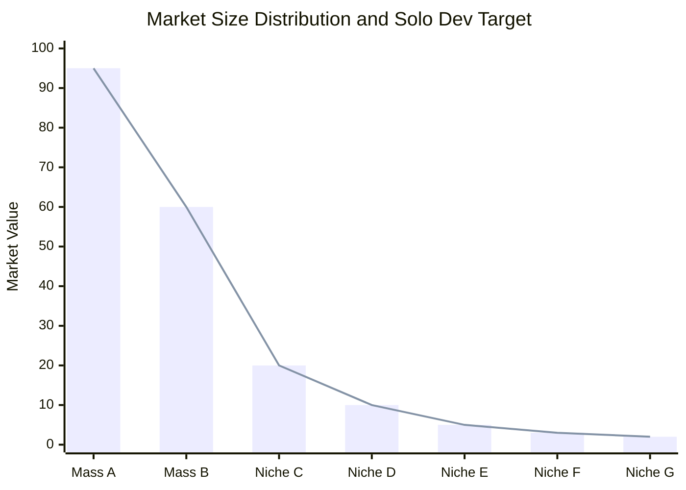
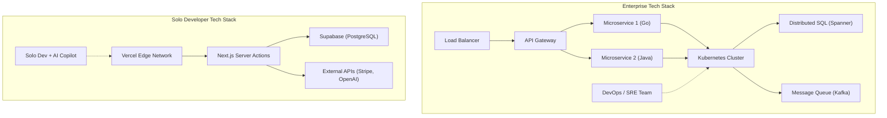

# Introduction: The Battle of the "Have-nots" Challenging the Giants

In the history of software development, there has never been a time more advantageous for solo developers (indie developers) than now. The democratization of cloud infrastructure like AWS and GCP, the rise of BaaS (Backend as a Service) like Vercel and Supabase, and above all, the automation of coding through the evolution of LLMs (Large Language Models). All of these have created an environment where individuals can compete head-on with the "giants," the major tech companies.

However, just because technical resources have flattened does not mean you can win by adopting the same strategies as major companies. Individuals are overwhelmingly disadvantaged in terms of capital, marketing power, and brand power. For solo developers to survive and win, a unique "survival strategy" is essential.

In this article, we will thoroughly explain the technical and strategic approaches for solo developers to launch a Micro-SaaS and expand their business globally, incorporating architecture design, economics, and mathematical models.

---

# 1. Long Tail Theory and the Mathematics of Niche Markets

Major companies target mass markets with a huge TAM (Total Addressable Market). They need millions of users and billions of yen in revenue to recover their high fixed costs (labor, office space, advertising).

In contrast, the strength of solo developers lies in having an **"extremely low break-even point."** If you can generate a few hundred thousand yen in profit per month, it is perfectly viable as a business for an individual. This is where the sweet spot of the "Long Tail Theory" exists.

## Zipf's Law and Market Distribution

The relationship between the rank of a market and its size often follows Zipf's Law or the Pareto principle. If we let the rank of the market be $k$ and its market size (revenue potential) be $P(k)$, it can be expressed by the following power-law model:

$$ P(k) \propto \frac{1}{k^\alpha} $$

Here, $\alpha$ is a parameter that determines the shape of the distribution (generally $\alpha \approx 1$).

Major companies fight bloody red oceans over huge markets (the head) like $k=1, 2, 3$. On the other hand, niche markets (the tail) like $k \ge 100$ are "markets that would only incur a deficit to enter" for major companies, making them essentially blue oceans with no actual competitors.



Solo developers should intentionally target specific niche problems (such as workflow automation tools for a particular industry, or hardcore analytics tools combining specific APIs). The more niche it is, the easier it is to reach target users, and the lower the CAC (Customer Acquisition Cost) becomes.

---

# 2. Architecture Design for Overwhelming Agility

Enterprise systems are designed with "stability" and "scalability" as top priorities, which is why Kubernetes and microservice architectures are adopted. However, if a solo developer does the same thing, their resources will be depleted just by maintaining the infrastructure (Ops).

The watchword for a solo developer's tech stack is **"No-Ops" (Zero Operations)**. You must leverage serverless architectures to the absolute limit and focus solely on writing business logic.

## Enterprise vs Solo Developer Architecture Comparison



In an enterprise stack, adding new features requires coordination between multiple teams and setting up DevOps deployment pipelines. On the other hand, in an individual's stack (e.g., Next.js + Supabase + Vercel), a single `git push` deploys to a global edge network, and there is no need for DB provisioning.

## Leveraging Serverless and Edge Computing

By using edge runtimes like Vercel or Cloudflare Workers, you can eliminate cold start delays and provide low-latency APIs to users around the world.

```typescript
// app/api/hello/route.ts (Next.js Edge API Route)
import { NextResponse } from 'next/server';

export const runtime = 'edge';

export async function GET(request: Request) {
  const { searchParams } = new URL(request.url);
  const name = searchParams.get('name') || 'World';
  
  // Edge runtime executes in milliseconds globally
  return NextResponse.json({
    message: `Hello, ${name}!`,
    timestamp: Date.now()
  });
}
```

---

# 3. "Extreme Productivity" Utilizing AI APIs

Features such as "Natural Language Processing," "Image Generation," and "Recommendation," which used to require teams of machine learning engineers and data scientists, can now be implemented with a single API call.

By integrating APIs from OpenAI (GPT-4o) or Anthropic (Claude 3.5 Sonnet) into your own Micro-SaaS, even an individual can instantly launch an "AI-native" product.

## Streaming Implementation Using Vercel AI SDK

In AI-powered products, the key to user experience (UX) is the "streaming response." With the Vercel AI SDK, you can achieve this with just a few lines of code.

```typescript
// app/api/chat/route.ts
import { openai } from '@ai-sdk/openai';
import { streamText } from 'ai';

// Set the maximum execution time in a serverless environment
export const maxDuration = 30; 

export async function POST(req: Request) {
  const { messages } = await req.json();

  const result = await streamText({
    model: openai('gpt-4o-mini'),
    messages,
    system: "You are an excellent SaaS assistant. Please accurately solve the user's problems.",
  });

  return result.toDataStreamResponse();
}
```

With this kind of implementation, solo developers can provide advanced AI features without worrying about infrastructure complexity. Furthermore, by utilizing AI coding editors like GitHub Copilot and Cursor, the development speed itself has jumped to 5 to 10 times that of traditional methods.

---

# 4. The Mathematics of Communication Overhead

Why can solo developers release features faster than major enterprises? The biggest reason is that there is "zero communication overhead."

According to Brooks's Law, famously from the software engineering classic "The Mythical Man-Month", the number of communication channels $C$ within a project increases relative to the number of developers $n$ as follows:

$$ C = \frac{n(n - 1)}{2} $$

When a team of $n=10$ at an enterprise develops a feature, the number of channels reaches $C = 45$, and a massive amount of time is spent on specification adjustments, meetings, and code reviews.
However, for a solo developer ($n=1$), the number of channels is $C = 0$.

**Because there are no bottlenecks in the process of translating thoughts into code**, it is possible to deploy an idea conceived in the morning to the production environment by that evening. This is the greatest weapon of a solo developer, which major enterprises cannot imitate no matter how much money they pile up.

---

# 5. Global Expansion and Payment Infrastructure Integration

For a Micro-SaaS competing globally, building a payment gateway is essential. By utilizing Stripe, you can fully automate payments in currencies around the world, subscription management, and even tax processing (Stripe Tax).

## Robust Subscription Management Using Stripe Webhooks

Let's look at a secure payment status synchronization model combining the Next.js App Router and Stripe Webhooks.

```typescript
// app/api/webhooks/stripe/route.ts
import { headers } from 'next/headers';
import { NextResponse } from 'next/server';
import Stripe from 'stripe';
import { db } from '@/db';
import { users } from '@/db/schema';
import { eq } from 'drizzle-orm';

const stripe = new Stripe(process.env.STRIPE_SECRET_KEY!, {
  apiVersion: '2023-10-16',
});

export async function POST(req: Request) {
  const body = await req.text();
  const signature = headers().get('Stripe-Signature') as string;

  let event: Stripe.Event;

  try {
    event = stripe.webhooks.constructEvent(
      body,
      signature,
      process.env.STRIPE_WEBHOOK_SECRET!
    );
  } catch (error: any) {
    return new NextResponse(`Webhook Error: ${error.message}`, { status: 400 });
  }

  // Processing when a subscription is updated
  if (event.type === 'customer.subscription.updated') {
    const subscription = event.data.object as Stripe.Subscription;
    const customerId = subscription.customer as string;
    
    // Update the status in the DB
    await db.update(users)
      .set({ subscriptionStatus: subscription.status })
      .where(eq(users.stripeCustomerId, customerId));
  }

  return new NextResponse('OK', { status: 200 });
}
```

With these few lines of code, you can instantly process credit card payments from users on the other side of the world and automate the provision of your service.

---

# 6. Avoiding Infrastructure Lock-in and Ensuring Portability

In a strategy that heavily relies on BaaS and managed services, the risk of "vendor lock-in" is always a subject of debate. For example, if you rely too deeply on Firebase's Firestore, migrating to an RDB (Relational Database) later becomes extremely difficult.

The optimal solution as a survival strategy is an approach where **"you are locked into the infrastructure, but your data and business logic maintain portability."**

## Abstracting the Data Layer with ORM

While utilizing managed services like Supabase (PostgreSQL) or PlanetScale (MySQL) for your database, it is standard practice to insert an abstraction layer like Prisma or Drizzle ORM, rather than writing raw SQL or hitting specific BaaS SDKs directly from your application code.

```typescript
// db/schema.ts (Drizzle ORM)
import { pgTable, serial, text, timestamp, varchar } from 'drizzle-orm/pg-core';

export const users = pgTable('users', {
  id: serial('id').primaryKey(),
  email: varchar('email', { length: 255 }).notNull().unique(),
  stripeCustomerId: varchar('stripe_customer_id', { length: 255 }),
  subscriptionStatus: varchar('subscription_status', { length: 50 }),
  createdAt: timestamp('created_at').defaultNow(),
});

// app/actions/user.ts
import { db } from '@/db';
import { users } from '@/db/schema';
import { eq } from 'drizzle-orm';

export async function getUserByEmail(email: string) {
  const result = await db.select().from(users).where(eq(users.email, email));
  return result[0];
}
```

By riding on the standard PostgreSQL ecosystem in this way, even if Supabase's pricing were to skyrocket, you could migrate to AWS RDS, Render, or your own self-hosted PostgreSQL server with almost no code rewrites.

---

# 7. Programmatic SEO and AI-Generated Content

For solo developers without a marketing budget, the ultimate weapon is "SEO" (Search Engine Optimization). In recent years, "Programmatic SEO," which dynamically generates thousands to tens of thousands of landing pages by combining proprietary databases with LLMs, has been gaining attention.

Traffic distribution also follows a power law. Instead of targeting specific high-volume keywords, you can raise your overall traffic by covering a massive amount of "long-tail keywords" that have low search volume but high conversion rates.

$$ Traffic_{Total} = \int_{x_{min}}^{x_{max}} T(x) dx $$

Even if the traffic $T(x)$ for a niche keyword $x$ is small, integrating them generates massive overall traffic. By using Next.js's dynamic routing and SSG/ISR, you can deliver these pages rapidly.

---

# 8. Unit Economics and the Profit Formula

Finally, let's look at the mathematical model required to make a Micro-SaaS viable as a business. The basic equation for a SaaS business is as follows:

$$ Profit = \sum_{i=1}^{U} (LTV_i - CAC_i) - Fixed Costs $$

- **$U$**: Number of acquired users
- **$LTV$ (Life Time Value)**: $LTV = \frac{ARPU}{Churn Rate}$ (ARPU is Average Revenue Per User, Churn Rate is the cancellation rate)
- **$CAC$ (Customer Acquisition Cost)**
- **$Fixed Costs$**: Fixed costs (server costs, tool costs, etc.)

For solo developers, the advantage is that **$Fixed Costs$ are nearly zero**. Even combining Vercel's Pro plan ($20/month), Supabase's Pro plan ($25/month), and other AI API usage fees, it stays around 10,000 to tens of thousands of yen per month. The biggest benefit is being able to exclude your own labor costs from fixed costs (or recovering them from profits).

### Zero Marginal Cost Business

For software, especially SaaS, the marginal cost of adding one more user is almost zero. If you can minimize $CAC$ by automating user acquisition (SEO, social media broadcasting, viral loops, etc.), the vast majority of your revenue becomes gross profit outright.

If you build a niche B2B tool for $15/month with a Churn Rate of 5%:
$$ LTV = \frac{\$15}{0.05} = \$300 $$

If you can keep CAC down to $10 using SEO and content marketing, you generate $290 in profit (gross margin) per user acquired. By delivering this to users around the world with niche problems—say, just 1,000 users—you complete a Micro-SaaS that generates $15,000 (over 2 million yen) in recurring monthly revenue.

---

# Conclusion: Speed and Niche Specialization Are the Ultimate Shield and Spear

The survival strategy for solo developers to fight against tech giants and global rivals boils down to the following three points:

1. **Choose Where to Fight (Long Tail Theory)**
   - Target niche markets with deep pain points, even if they are small, where large enterprises cannot enter.
2. **Leverage Technological Leverage (Serverless, BaaS, AI)**
   - Completely externalize operations (Ops) and write only the code (business logic) that solves customer problems, not infrastructure.
3. **Maximize Agility (Zero Communication Cost)**
   - Capitalize on the solo developer's greatest weapon, "speed," by deploying ideas immediately and iterating on market feedback as fast as possible.

We are living in an era with the highest leverage in history. With just a keyboard, the internet, and a passion for solving problems, you can create products that delight users worldwide and compete with giant corporations, all from your own small room.

Now, let's open the editor and initialize a new project.

```bash
npx create-next-app@latest my-micro-saas
```

The battle has already begun.

