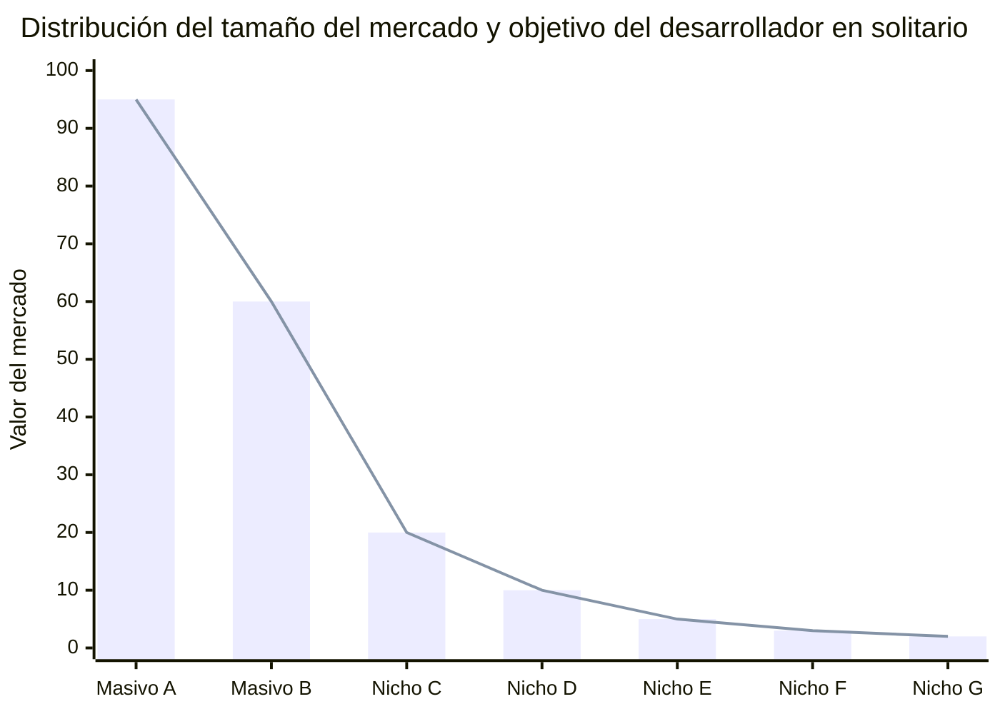
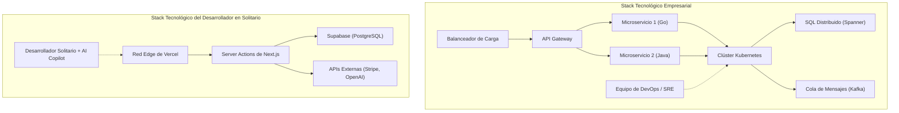

# Introducción: Cómo luchan los "desposeídos" para desafiar a los gigantes

En la historia del desarrollo de software, ha llegado una era sin precedentes y favorable para los desarrolladores individuales (desarrolladores independientes). La democratización de la infraestructura en la nube como AWS y GCP, el surgimiento de BaaS (Backend as a Service) como Vercel y Supabase, y sobre todo, la automatización de la codificación gracias a la evolución de los LLM (Modelos de Lenguaje Grande). Todo esto ha creado un terreno donde los individuos pueden competir directamente con las grandes empresas tecnológicas, los verdaderos "gigantes".

Sin embargo, el hecho de que los recursos técnicos se hayan nivelado no significa que puedas ganar adoptando la misma estrategia que una gran empresa. En términos de capital, capacidad de marketing y poder de marca, los individuos se encuentran en una desventaja abrumadora. Para que un desarrollador en solitario sobreviva y gane, es esencial una "estrategia de supervivencia" única.

En este artículo, explicaremos exhaustivamente los enfoques técnicos y estratégicos para que un desarrollador individual lance un Micro-SaaS y haga negocios a nivel mundial, integrando diseño de arquitectura, economía y modelos matemáticos.

---

# 1. La teoría del Long Tail y las matemáticas de los mercados nicho

A lo que apuntan las grandes corporaciones es al mercado masivo donde el TAM (Total Addressable Market, o Mercado Total Direccionable) es gigantesco. Necesitan millones de usuarios y decenas de millones en ingresos para recuperar sus altos costos fijos (costos laborales, espacio de oficina, publicidad).

En contraste, la fortaleza del desarrollador individual radica en que **"el punto de equilibrio es extremadamente bajo"**. Un beneficio de un par de miles de dólares al mes es más que suficiente para que un individuo lo considere un negocio viable. Aquí es donde existe el punto dulce de la "Teoría del Long Tail".

## Ley de Zipf y distribución del mercado

La relación entre el tamaño y el número de mercados a menudo sigue la Ley de Zipf o la Ley de Pareto. Si denotamos el rango del mercado como $k$ y el tamaño del mercado (potencial de ventas) como $P(k)$, se puede expresar con un modelo de ley de potencias (power law) como el siguiente:

$$ P(k) \propto \frac{1}{k^\alpha} $$

Aquí, $\alpha$ es un parámetro que determina la forma de la distribución (generalmente $\alpha \approx 1$).

Las grandes empresas luchan en el sangriento océano rojo sobre mercados gigantescos (la cabeza) como $k=1, 2, 3$. Por otro lado, los mercados nicho (la cola) como $k \ge 100$ son "mercados donde la sola entrada causará pérdidas" para las grandes empresas, lo que los convierte efectivamente en océanos azules sin competidores.



Los desarrolladores en solitario deben apuntar deliberadamente a problemas de nicho y especializados (como herramientas de automatización de flujos de trabajo para una industria específica o herramientas de análisis de nicho que combinen APIs específicas). Cuanto más de nicho sea, más fácil será llegar al usuario objetivo y el CAC (Costo de Adquisición de Clientes) disminuirá.

---

# 2. Diseño de arquitectura que genera una agilidad abrumadora

Los sistemas corporativos están diseñados con la "estabilidad" y la "escalabilidad" como máximas prioridades, por lo que a menudo se adoptan arquitecturas de Kubernetes y microservicios. Sin embargo, si un desarrollador independiente hace lo mismo, sus recursos se agotarán solo con el mantenimiento de la infraestructura (Ops).

La consigna del stack tecnológico de un desarrollador en solitario es **"No-Ops" (Cero Operaciones)**. Utiliza la arquitectura serverless (sin servidor) al máximo y concéntrate únicamente en escribir la lógica de negocio.

## Comparación de arquitectura: Grandes Empresas vs. Desarrollador en Solitario



En el stack de las grandes empresas, añadir una nueva funcionalidad requiere coordinación entre múltiples equipos y la configuración de pipelines de despliegue DevOps. Por otro lado, en el stack de un individuo (ej: Next.js + Supabase + Vercel), un solo `git push` lo despliega en una red global en el edge (borde), y tampoco es necesario el aprovisionamiento de bases de datos.

## Uso de Serverless y Edge Computing

Al utilizar runtimes en el edge como Vercel o Cloudflare Workers, puedes eliminar la latencia del inicio en frío (cold start) y proporcionar APIs de baja latencia a usuarios de todo el mundo.

```typescript
// app/api/hello/route.ts (Next.js Edge API Route)
import { NextResponse } from 'next/server';

export const runtime = 'edge';

export async function GET(request: Request) {
  const { searchParams } = new URL(request.url);
  const name = searchParams.get('name') || 'World';
  
  // Edge runtime executes in milliseconds globally
  return NextResponse.json({
    message: `Hello, ${name}!`,
    timestamp: Date.now()
  });
}
```

---

# 3. "Productividad Extrema" utilizando APIs de IA

Funcionalidades como "Procesamiento de Lenguaje Natural", "Generación de Imágenes" y "Recomendaciones", que antes requerían un equipo de ingenieros de aprendizaje automático y científicos de datos, ahora se pueden implementar con una sola llamada a una API.

Al integrar APIs de OpenAI (GPT-4o) o Anthropic (Claude 3.5 Sonnet) en tu propio Micro-SaaS, incluso un individuo puede lanzar instantáneamente un producto "nativo de IA".

## Implementación de Streaming usando Vercel AI SDK

En los productos que utilizan IA, la clave para la experiencia del usuario (UX) es la "respuesta en streaming". Utilizando Vercel AI SDK, esto se puede lograr con unas pocas líneas de código.

```typescript
// app/api/chat/route.ts
import { openai } from '@ai-sdk/openai';
import { streamText } from 'ai';

// Establece el tiempo máximo de ejecución en un entorno serverless
export const maxDuration = 30; 

export async function POST(req: Request) {
  const { messages } = await req.json();

  const result = await streamText({
    model: openai('gpt-4o-mini'),
    messages,
    system: "Eres un excelente asistente SaaS. Por favor, resuelve los problemas del usuario de manera precisa.",
  });

  return result.toDataStreamResponse();
}
```

Con una implementación como esta, los desarrolladores en solitario pueden proporcionar funcionalidades avanzadas de IA sin preocuparse por la complejidad de la infraestructura. Además, al utilizar editores de código con IA como GitHub Copilot o Cursor, la velocidad de desarrollo en sí misma ha saltado a ser de 5 a 10 veces mayor que en el pasado.

---

# 4. Las matemáticas de la sobrecarga de comunicación

¿Por qué un desarrollador en solitario puede lanzar funcionalidades más rápido que una gran empresa? La razón principal es que "la sobrecarga de comunicación es cero".

Según la Ley de Brooks, conocida por el clásico de la ingeniería de software "El mítico hombre-mes" (The Mythical Man-Month), el número de canales de comunicación $C$ en un proyecto aumenta con respecto al número de desarrolladores $n$ de la siguiente manera:

$$ C = \frac{n(n - 1)}{2} $$

Cuando un equipo de $n=10$ personas en una gran empresa desarrolla una funcionalidad, el número de canales llega a $C = 45$, y se dedica una enorme cantidad de tiempo a coordinar especificaciones, reuniones y revisiones de código.
Sin embargo, en el caso de un desarrollador en solitario ($n=1$), el número de canales es $C = 0$.

Debido a que **no existen cuellos de botella en el proceso de transformar los pensamientos en código**, es posible desplegar una idea concebida en la mañana al entorno de producción esa misma tarde. Esta es la mayor arma de los desarrolladores independientes, algo que las grandes empresas no pueden imitar, no importa cuánto dinero inviertan.

---

# 5. Expansión global e integración de la infraestructura de pagos

Para un Micro-SaaS que compite a nivel mundial, la construcción de una infraestructura de pagos (Payment Gateway) es esencial. Al utilizar Stripe, se puede automatizar completamente el procesamiento de pagos en monedas de todo el mundo, la gestión de suscripciones y el procesamiento de impuestos (Stripe Tax).

## Gestión robusta de suscripciones usando Webhooks de Stripe

Veamos un modelo seguro de sincronización del estado de pagos combinando el App Router de Next.js y los Webhooks de Stripe.

```typescript
// app/api/webhooks/stripe/route.ts
import { headers } from 'next/headers';
import { NextResponse } from 'next/server';
import Stripe from 'stripe';
import { db } from '@/db';
import { users } from '@/db/schema';
import { eq } from 'drizzle-orm';

const stripe = new Stripe(process.env.STRIPE_SECRET_KEY!, {
  apiVersion: '2023-10-16',
});

export async function POST(req: Request) {
  const body = await req.text();
  const signature = headers().get('Stripe-Signature') as string;

  let event: Stripe.Event;

  try {
    event = stripe.webhooks.constructEvent(
      body,
      signature,
      process.env.STRIPE_WEBHOOK_SECRET!
    );
  } catch (error: any) {
    return new NextResponse(`Webhook Error: ${error.message}`, { status: 400 });
  }

  // Procesamiento cuando se actualiza la suscripción
  if (event.type === 'customer.subscription.updated') {
    const subscription = event.data.object as Stripe.Subscription;
    const customerId = subscription.customer as string;
    
    // Actualiza el estado en la base de datos
    await db.update(users)
      .set({ subscriptionStatus: subscription.status })
      .where(eq(users.stripeCustomerId, customerId));
  }

  return new NextResponse('OK', { status: 200 });
}
```

Con estas pocas líneas de código, es posible procesar pagos con tarjeta de crédito de usuarios en el otro lado del mundo de manera instantánea y automatizar la provisión del servicio.

---

# 6. Evitar el vendor lock-in de infraestructura y portabilidad

En estrategias que utilizan intensamente BaaS y servicios gestionados, un tema de debate constante es el riesgo de "vendor lock-in" (dependencia del proveedor). Por ejemplo, si dependes demasiado de Firestore de Firebase, más adelante será extremadamente difícil migrar a una RDB (Base de Datos Relacional).

La solución óptima como estrategia de supervivencia es el enfoque de **"estar limitado en la infraestructura, pero mantener la portabilidad de los datos y la lógica de negocio"**.

## Abstracción de la capa de datos mediante ORMs

La práctica estándar es utilizar servicios gestionados como Supabase (PostgreSQL) o PlanetScale (MySQL) para la base de datos, pero en lugar de ejecutar SQL o SDKs de BaaS específicos directamente desde el código de la aplicación, se inserta una capa de abstracción como Prisma o Drizzle ORM.

```typescript
// db/schema.ts (Drizzle ORM)
import { pgTable, serial, text, timestamp, varchar } from 'drizzle-orm/pg-core';

export const users = pgTable('users', {
  id: serial('id').primaryKey(),
  email: varchar('email', { length: 255 }).notNull().unique(),
  stripeCustomerId: varchar('stripe_customer_id', { length: 255 }),
  subscriptionStatus: varchar('subscription_status', { length: 50 }),
  createdAt: timestamp('created_at').defaultNow(),
});

// app/actions/user.ts
import { db } from '@/db';
import { users } from '@/db/schema';
import { eq } from 'drizzle-orm';

export async function getUserByEmail(email: string) {
  const result = await db.select().from(users).where(eq(users.email, email));
  return result[0];
}
```

Al adherirse al ecosistema estándar de PostgreSQL de esta manera, en el improbable caso de que los precios de Supabase se disparen, puedes migrar a AWS RDS, Render o un servidor PostgreSQL autohospedado casi sin necesidad de reescribir código.

---

# 7. SEO Programático y Contenido Generado por IA

El "SEO (Optimización de Motores de Búsqueda)" es el arma más fuerte para los desarrolladores independientes que luchan sin un presupuesto de marketing. En los últimos años, el "SEO programático" ha atraído la atención, el cual combina la base de datos propia con LLMs para generar dinámicamente de miles a decenas de miles de páginas de destino (landing pages).

La distribución del tráfico también sigue una ley de potencias. En lugar de apuntar a palabras clave masivas específicas, puedes aumentar el número total de accesos cubriendo de manera extensa "palabras clave de cola larga (long-tail keywords)", que aunque tengan un bajo volumen de búsqueda, poseen altas tasas de conversión.

$$ Traffic_{Total} = \int_{x_{min}}^{x_{max}} T(x) dx $$

Aunque el tráfico $T(x)$ para una palabra clave de nicho $x$ sea pequeño, al integrarlo genera una cantidad enorme de tráfico en su conjunto. Utilizando el enrutamiento dinámico y SSG/ISR de Next.js, puedes entregar estas páginas a alta velocidad.

---

# 8. Unit Economics (Economía Unitaria) y la fórmula del beneficio

Finalmente, revisemos el modelo matemático para establecer un Micro-SaaS como negocio. La ecuación básica de un negocio SaaS es la siguiente:

$$ Profit = \sum_{i=1}^{U} (LTV_i - CAC_i) - Fixed Costs $$

- **$U$**: Número de usuarios adquiridos
- **$LTV$ (Life Time Value)**: Valor del Ciclo de Vida del Cliente. $LTV = \frac{ARPU}{Churn Rate}$ (ARPU es el ingreso promedio mensual por usuario, Churn Rate es la tasa de cancelación)
- **$CAC$ (Customer Acquisition Cost)**: Costo de Adquisición de Clientes
- **$Fixed Costs$**: Costos Fijos (costos de servidor, herramientas, etc.)

Para un desarrollador en solitario, existe la ventaja de que **los $Fixed Costs$ son casi nulos**. Incluso combinando el plan Pro de Vercel ($20/mes), el plan Pro de Supabase ($25/mes) y otras tarifas de uso de API de IA, el total ronda unos pocos miles a decenas de miles de yenes al mes (o equivalente en dólares). La mayor ventaja es que puedes excluir tus propios costos laborales de los costos fijos (o recuperarlos a partir de los beneficios).

### Un negocio con costo marginal cero

Para el software, y especialmente para los SaaS, el costo marginal (Marginal Cost) al agregar un usuario es casi nulo. Si se puede minimizar el $CAC$ mediante la automatización en la adquisición de usuarios (SEO, difusión en redes sociales, bucles virales, etc.), la mayor parte de las ventas se convierte directamente en beneficio bruto.

Si creas una herramienta B2B de nicho por $15 al mes, y el Churn Rate es del 5%:
$$ LTV = \frac{\$15}{0.05} = \$300 $$

Si logras mantener el CAC en $10 a través del SEO y el marketing de contenidos, se generarán $290 de beneficio (beneficio bruto) por cada usuario adquirido. Simplemente llegando a usuarios con problemas de nicho alrededor del mundo, por ejemplo 1,000 personas, se completa un Micro-SaaS que produce unos ingresos recurrentes de $15,000 al mes.

---

# Conclusión: La velocidad y la especialización en nichos son el escudo y la espada más fuertes

La estrategia de supervivencia para que los desarrolladores independientes compitan contra grandes empresas y rivales a nivel mundial se resume en los siguientes 3 puntos:

1. **Elegir dónde luchar (Teoría del Long Tail)**
   - Apuntar a mercados nicho pequeños pero con dolores (pain points) profundos, en los que las grandes empresas no pueden entrar.
2. **Aprovechar las palancas tecnológicas (Serverless, BaaS, IA)**
   - Externalizar completamente las operaciones (Ops) y escribir únicamente código (lógica de negocio) para resolver los problemas del cliente, y no para la infraestructura.
3. **Maximizar la agilidad (Costo de comunicación cero)**
   - Aprovechar la mayor arma del desarrollo en solitario, que es la "velocidad", desplegando instantáneamente cuando surge una idea e iterando con los comentarios del mercado lo más rápido posible.

Actualmente estamos viviendo en la era con el mayor apalancamiento en la historia. Con solo un teclado, internet y el entusiasmo por resolver un problema, puedes crear desde una pequeña habitación un producto que deleite a usuarios de todo el mundo y competir cara a cara con empresas gigantes.

Vamos, abre tu editor e inicializa un nuevo proyecto.

```bash
npx create-next-app@latest my-micro-saas
```

La batalla ya ha comenzado.
