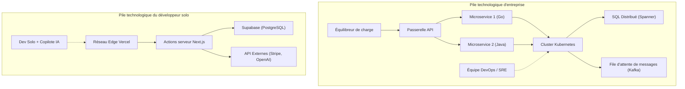

# Introduction : La bataille de "ceux qui n'ont rien" défiant les géants

Dans l'histoire du développement logiciel, il n'y a jamais eu d'époque aussi favorable aux développeurs solos (développeurs indépendants). La démocratisation des infrastructures cloud comme AWS et GCP, l'essor des BaaS (Backend as a Service) tels que Vercel et Supabase, et surtout, l'automatisation du codage grâce à l'évolution des LLM (Grands Modèles de Langage). Tout cela a créé un terrain où un individu peut rivaliser de front avec les "géants" que sont les grandes entreprises technologiques.

Cependant, le fait que les ressources technologiques se soient aplanies ne signifie pas que vous pouvez gagner en adoptant la même stratégie que les grandes entreprises. En termes de capital, de puissance marketing et de force de marque, l'individu est massivement désavantagé. Pour qu'un développeur solo survive et gagne, une "stratégie de survie" unique est indispensable.

Dans cet article, nous expliquerons en profondeur, en croisant la conception architecturale, l'économie et les modèles mathématiques, les approches techniques et stratégiques pour qu'un développeur solo lance un Micro-SaaS et déploie une entreprise face au monde.

---

# 1. La théorie de la longue traîne et les mathématiques des marchés de niche

Ce que visent les grandes entreprises, ce sont les marchés de masse où le TAM (Total Addressable Market : taille maximale du marché accessible) est énorme. Pour rentabiliser leurs coûts fixes élevés (frais de personnel, loyers de bureaux, dépenses publicitaires), elles ont besoin de millions d'utilisateurs et de dizaines de millions de dollars de chiffre d'affaires.

En revanche, la force des développeurs solos réside dans leur **"seuil de rentabilité extrêmement bas"**. Si un bénéfice de quelques milliers de dollars par mois est généré, c'est suffisant pour être considéré comme une entreprise viable pour un individu. C'est là que se trouve le point idéal de la "théorie de la longue traîne".

## [Loi de Zipf](https://kenji.blog/fr/p/zipfs-law/) et distribution du marché

La relation entre la taille d'un marché et son nombre suit souvent la loi de Zipf ou la loi de Pareto. Si le rang du marché est $k$, et sa taille (potentiel de vente) est $P(k)$, elle peut être exprimée par le modèle de loi de puissance suivant :

$$ P(k) \propto \frac{1}{k^\alpha} $$

Où $\alpha$ est un paramètre déterminant la forme de la distribution (généralement $\alpha \approx 1$).

Les grandes entreprises se livrent à une lutte sanglante dans des océans rouges pour des marchés géants (la tête) comme $k=1, 2, 3$. D'un autre côté, les marchés de niche (la traîne) tels que $k \ge 100$ sont des marchés où "entrer signifie seulement perdre de l'argent" pour les grandes entreprises, devenant ainsi des océans bleus pratiquement sans concurrence.

```mermaid
xychart-beta
    title Distribution de la taille du marché et cible des développeurs solos
  x-axis ["Masse A", "Masse B", "Niche C", "Niche D", "Niche E", "Niche F", "Niche G"]
  y-axis "Valeur du marché" 0 --> 100
  bar [95, 60, 20, 10, 5, 3, 2]
  line [95, 60, 20, 10, 5, 3, 2]
```

Les développeurs solos devraient délibérément cibler des problèmes spécialisés et de niche (comme des outils d'automatisation de flux de travail pour un secteur spécifique, ou des outils d'analyse de pointe combinant des API spécifiques). Plus le marché est spécialisé, plus il est facile d'atteindre le public cible, et le CAC (Coût d'Acquisition Client) diminue.

---

# 2. Une conception architecturale produisant une agilité écrasante

Les systèmes des grandes entreprises sont conçus en donnant la priorité absolue à la "stabilité" et à l'"évolutivité", d'où l'adoption de Kubernetes ou d'architectures de microservices. Cependant, si un développeur solo fait de même, ses ressources seront épuisées rien que par la maintenance de l'infrastructure (Ops).

Le mot d'ordre pour la pile technologique du développeur solo est **"No-Ops" (Zéro Opération)**. Il faut exploiter au maximum l'architecture serverless et se concentrer uniquement sur l'écriture de la logique métier.

## Comparaison architecturale : Grandes entreprises vs Développeurs solos



Dans la pile d'une grande entreprise, l'ajout d'une nouvelle fonctionnalité nécessite une coordination entre plusieurs équipes et la mise en place d'un pipeline de déploiement DevOps. D'autre part, avec la pile d'un individu (par exemple : Next.js + Supabase + Vercel), un simple `git push` déploie sur le réseau périphérique mondial, et le provisionnement de la base de données n'est pas nécessaire.

## Exploitation du serverless et de l'Edge Computing

En utilisant des environnements d'exécution Edge comme Vercel ou Cloudflare Workers, on élimine la latence des démarrages à froid et on peut fournir des API à faible latence aux utilisateurs du monde entier.

```typescript
// app/api/hello/route.ts (Next.js Edge API Route)
import { NextResponse } from 'next/server';

export const runtime = 'edge';

export async function GET(request: Request) {
  const { searchParams } = new URL(request.url);
  const name = searchParams.get('name') || 'World';
  
  // Le runtime Edge s'exécute en quelques millisecondes à l'échelle mondiale
  return NextResponse.json({
    message: `Hello, ${name}!`,
    timestamp: Date.now()
  });
}
```

---

# 3. "Productivité extrême" grâce à l'utilisation des API d'IA

Les fonctionnalités telles que le "traitement du langage naturel", la "génération d'images" ou les "recommandations", qui nécessitaient autrefois des équipes d'ingénieurs en apprentissage automatique et de data scientists, peuvent désormais être implémentées en un seul appel API.

En intégrant les API d'OpenAI (GPT-4o) ou d'Anthropic (Claude 3.5 Sonnet) dans son propre Micro-SaaS, même un individu peut lancer instantanément un produit "IA-natif".

## Implémentation du streaming avec Vercel AI SDK

Dans les produits utilisant l'IA, la clé de l'expérience utilisateur (UX) est la "réponse en streaming". Avec Vercel AI SDK, cela peut être réalisé en quelques lignes de code.

```typescript
// app/api/chat/route.ts
import { openai } from '@ai-sdk/openai';
import { streamText } from 'ai';

// Définir la durée d'exécution maximale dans l'environnement serverless
export const maxDuration = 30; 

export async function POST(req: Request) {
  const { messages } = await req.json();

  const result = await streamText({
    model: openai('gpt-4o-mini'),
    messages,
    system: "Vous êtes un excellent assistant SaaS. Veuillez résoudre précisément les problèmes de l'utilisateur.",
  });

  return result.toDataStreamResponse();
}
```

Grâce à ce type d'implémentation, les développeurs solos peuvent offrir des fonctionnalités d'IA avancées sans avoir conscience de la complexité de l'infrastructure. De plus, en utilisant des éditeurs de code IA comme GitHub Copilot ou Cursor, la vitesse de développement elle-même a été multipliée par 5 à 10 par rapport au passé.

---

# 4. Les mathématiques de la surcharge de communication

Pourquoi les développeurs solos peuvent-ils publier des fonctionnalités plus rapidement que les grandes entreprises ? La principale raison est que la "surcharge de communication est nulle".

Selon la loi de Brooks, connue à travers le classique de l'ingénierie logicielle "Le Mythe du mois-homme" (The Mythical Man-Month), le nombre de canaux de communication $C$ dans un projet augmente de la façon suivante par rapport au nombre de développeurs $n$ :

$$ C = \frac{n(n - 1)}{2} $$

Lorsqu'une équipe de $n=10$ dans une grande entreprise développe une fonctionnalité, le nombre de canaux atteint $C = 45$, et un temps énorme est consacré aux ajustements de spécifications, aux réunions et aux revues de code.
Cependant, dans le cas d'un développeur solo ($n=1$), le nombre de canaux est $C = 0$.

**Étant donné qu'il n'y a pas de goulot d'étranglement dans le processus de conversion de la pensée en code**, il est possible de déployer en production le soir même une idée conçue le matin. C'est l'arme suprême du développeur solo, que les grandes entreprises ne peuvent imiter, quel que soit le budget qu'elles y consacrent.

---

# 5. Expansion mondiale et intégration de l'infrastructure de paiement

Pour un Micro-SaaS en concurrence avec le monde entier, la mise en place d'une infrastructure de paiement (Payment Gateway) est indispensable. En utilisant Stripe, vous pouvez entièrement automatiser les paiements dans les devises du monde entier, la gestion des abonnements et même le traitement fiscal (Stripe Tax).

## Gestion robuste des abonnements à l'aide de Stripe Webhook

Examinons un modèle de synchronisation sécurisée du statut de paiement combinant Next.js App Router et Stripe Webhook.

```typescript
// app/api/webhooks/stripe/route.ts
import { headers } from 'next/headers';
import { NextResponse } from 'next/server';
import Stripe from 'stripe';
import { db } from '@/db';
import { users } from '@/db/schema';
import { eq } from 'drizzle-orm';

const stripe = new Stripe(process.env.STRIPE_SECRET_KEY!, {
  apiVersion: '2023-10-16',
});

export async function POST(req: Request) {
  const body = await req.text();
  const signature = headers().get('Stripe-Signature') as string;

  let event: Stripe.Event;

  try {
    event = stripe.webhooks.constructEvent(
      body,
      signature,
      process.env.STRIPE_WEBHOOK_SECRET!
    );
  } catch (error: any) {
    return new NextResponse(`Erreur Webhook : ${error.message}`, { status: 400 });
  }

  // Traitement lors de la mise à jour de l'abonnement
  if (event.type === 'customer.subscription.updated') {
    const subscription = event.data.object as Stripe.Subscription;
    const customerId = subscription.customer as string;
    
    // Mettre à jour le statut dans la base de données
    await db.update(users)
      .set({ subscriptionStatus: subscription.status })
      .where(eq(users.stripeCustomerId, customerId));
  }

  return new NextResponse('OK', { status: 200 });
}
```

Avec ces quelques lignes de code, vous pouvez traiter instantanément les paiements par carte de crédit d'utilisateurs se trouvant à l'autre bout du monde et automatiser la fourniture du service.

---

# 6. Éviter le verrouillage de l'infrastructure et portabilité

Dans les stratégies qui utilisent intensivement les BaaS et les services gérés, le risque de "verrouillage par un fournisseur" (vendor lock-in) est toujours un sujet de débat. Par exemple, si vous dépendez trop profondément de Firestore de Firebase, il deviendra extrêmement difficile de migrer ultérieurement vers un SGBDR (système de gestion de base de données relationnelle).

La solution optimale en tant que stratégie de survie est une approche où **"l'infrastructure est verrouillée, mais les données et la logique métier conservent leur portabilité"**.

## Abstraction de la couche de données par un ORM

Il est de pratique courante d'utiliser des services gérés tels que Supabase (PostgreSQL) ou PlanetScale (MySQL) pour la base de données, tout en insérant une couche d'abstraction comme Prisma ou Drizzle ORM à partir du code de l'application, plutôt que de frapper directement le SQL ou le SDK d'un BaaS spécifique.

```typescript
// db/schema.ts (Drizzle ORM)
import { pgTable, serial, text, timestamp, varchar } from 'drizzle-orm/pg-core';

export const users = pgTable('users', {
  id: serial('id').primaryKey(),
  email: varchar('email', { length: 255 }).notNull().unique(),
  stripeCustomerId: varchar('stripe_customer_id', { length: 255 }),
  subscriptionStatus: varchar('subscription_status', { length: 50 }),
  createdAt: timestamp('created_at').defaultNow(),
});

// app/actions/user.ts
import { db } from '@/db';
import { users } from '@/db/schema';
import { eq } from 'drizzle-orm';

export async function getUserByEmail(email: string) {
  const result = await db.select().from(users).where(eq(users.email, email));
  return result[0];
}
```

De cette manière, en s'appuyant sur l'écosystème PostgreSQL standard, même si les tarifs de Supabase s'envolaient, il serait possible de migrer vers AWS RDS, Render, ou votre propre serveur PostgreSQL avec très peu de modifications de code.

---

# 7. SEO programmatique et contenu généré par l'IA

L'arme la plus puissante pour les développeurs solos sans budget marketing est le "SEO (optimisation pour les moteurs de recherche)". Récemment, le "SEO programmatique", qui combine sa propre base de données avec des LLM pour générer dynamiquement des milliers à des dizaines de milliers de pages de destination, a attiré l'attention.

La distribution du trafic suit également une loi de puissance. Plutôt que de cibler des mots-clés spécifiques de gros volume, en couvrant un grand nombre de "mots-clés de longue traîne" qui ont un faible volume de recherche mais un taux de conversion élevé, on augmente le trafic global.

$$ Traffic_{Total} = \int_{x_{min}}^{x_{max}} T(x) dx $$

Même si le trafic $T(x)$ pour un mot-clé de niche $x$ est faible, en l'intégrant, il génère un trafic énorme dans son ensemble. En utilisant le routage dynamique de Next.js et SSG/ISR, vous pouvez diffuser ces pages rapidement.

---

# 8. Économie unitaire (Unit Economics) et formule de profit

Enfin, examinons le modèle mathématique pour faire du Micro-SaaS une entreprise viable. L'équation de base du modèle d'affaires SaaS est la suivante :

$$ Profit = \sum_{i=1}^{U} (LTV_i - CAC_i) - Fixed Costs $$

- **$U$** : Nombre d'utilisateurs acquis
- **$LTV$ (Life Time Value)** : Valeur à vie du client. $LTV = \frac{ARPU}{Churn Rate}$ (ARPU est le revenu moyen par utilisateur, Churn Rate est le taux de désabonnement)
- **$CAC$ (Customer Acquisition Cost)** : Coût d'acquisition client
- **$Fixed Costs$** : Coûts fixes (frais de serveur, frais d'outils, etc.)

Dans le cas d'un développeur solo, le grand avantage est que **les coûts fixes ($Fixed Costs$) sont presque nuls**. Même en combinant le plan Pro de Vercel (20 $/mois), le plan Pro de Supabase (25 $/mois) et d'autres frais d'utilisation de l'API d'IA, cela reste dans une fourchette d'environ quelques dizaines de dollars par mois. Le plus grand avantage est que vos propres frais de subsistance peuvent être exclus des coûts fixes (ou récupérés sur les bénéfices).

### Le commerce à coût marginal zéro

Dans les logiciels, et particulièrement dans le SaaS, le coût marginal (Marginal Cost) pour chaque nouvel utilisateur est presque nul. Si vous pouvez minimiser le $CAC$ en automatisant l'acquisition d'utilisateurs (SEO, réseaux sociaux, boucles virales, etc.), la majorité des ventes devient directement du bénéfice brut.

Si vous créez un outil B2B de niche à 15 $ par mois et que le taux de désabonnement (Churn Rate) est de 5 %, alors :
$$ LTV = \frac{\$15}{0.05} = \$300 $$

Si vous pouvez maintenir le CAC à 10 $ grâce au SEO et au marketing de contenu, vous générerez un bénéfice (bénéfice brut) de 290 $ pour chaque utilisateur acquis. En ciblant simplement des utilisateurs du monde entier ayant ce problème de niche, disons 1 000 personnes, vous aurez créé un Micro-SaaS générant un revenu récurrent (stock revenue) de 15 000 $ (environ 2 millions de yens ou plus) chaque mois.

---

# Conclusion : La vitesse et la spécialisation de niche sont à la fois le bouclier et la lance ultimes

La stratégie de survie pour qu'un développeur solo rivalise avec les grandes entreprises et ses concurrents du monde entier se résume aux trois points suivants :

1. **Choisir son champ de bataille (Théorie de la longue traîne)**
   - Cibler des marchés de niche, même petits, avec des problèmes profonds, où les grandes entreprises ne peuvent pas entrer.
2. **Faire levier sur la technologie (Serverless, BaaS, IA)**
   - Externaliser complètement les opérations (Ops) et écrire uniquement du code pour résoudre les problèmes des clients (logique métier) plutôt que de gérer l'infrastructure.
3. **Maximiser l'agilité (Coût de communication nul)**
   - Utiliser la plus grande arme du développement solo, la "vitesse" : déployer une idée immédiatement et itérer avec les retours du marché le plus rapidement possible.

Nous vivons aujourd'hui à l'époque où l'effet de levier est le plus puissant de l'histoire. Avec un clavier, Internet et la passion de résoudre un problème, vous pouvez, depuis une petite chambre, créer un produit qui ravira les utilisateurs du monde entier et rivaliser avec des entreprises géantes.

Maintenant, ouvrez votre éditeur et initialisez un nouveau projet.

```bash
npx create-next-app@latest my-micro-saas
```

La bataille a déjà commencé.


