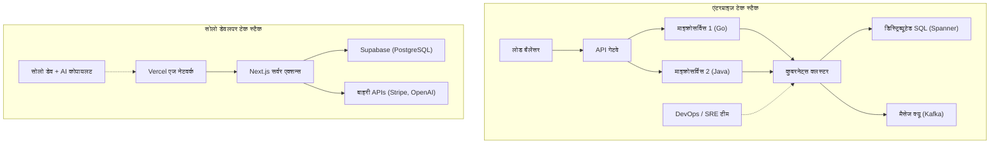

# प्रस्तावना: दिग्गजों को चुनौती देने वाले "बिना संसाधनों वाले लोगों" की रणनीति

सॉफ्टवेयर विकास के इतिहास में, व्यक्तिगत डेवलपर्स (इंडी डेवलपर्स) के लिए इससे पहले कभी भी इतना अनुकूल समय नहीं रहा है। AWS और GCP जैसे क्लाउड इंफ्रास्ट्रक्चर का लोकतंत्रीकरण, Vercel और Supabase जैसे BaaS (Backend as a [Service](https://kenji.blog/hi/p/kubernetes-k8s-architecture-pod-service-ingress/)) का उदय, और सबसे बढ़कर, LLM (लार्ज लैंग्वेज मॉडल) के विकास द्वारा कोडिंग का स्वचालन। इन सबने एक ऐसा आधार तैयार किया है जहाँ एक व्यक्ति सीधे तौर पर दिग्गज टेक कंपनियों का मुकाबला कर सकता है।

हालांकि, तकनीकी संसाधनों के समान हो जाने का यह मतलब नहीं है कि आप बड़ी कंपनियों जैसी रणनीति अपनाकर जीत सकते हैं। पूंजी, मार्केटिंग क्षमता और ब्रांड पावर के मामले में, व्यक्ति बहुत अधिक नुकसान में होते हैं। व्यक्तिगत डेवलपर्स को जीवित रहने और जीतने के लिए, अपनी खुद की एक अनोखी "सर्वाइवल रणनीति" (survival strategy) का होना बहुत ज़रूरी है।

इस लेख में, हम एक माइक्रो-SaaS (Micro-SaaS) लॉन्च करने वाले और वैश्विक स्तर पर अपना व्यवसाय चलाने वाले व्यक्तिगत डेवलपर्स के लिए तकनीकी और रणनीतिक दृष्टिकोणों के बारे में पूरी तरह से चर्चा करेंगे, जिसमें आर्किटेक्चर डिज़ाइन, अर्थशास्त्र और गणितीय मॉडल शामिल होंगे।

---

# 1. लॉन्ग टेल थ्योरी और नीश (Niche) बाज़ार का गणित

बड़ी कंपनियाँ ऐसे मास मार्केट (mass market) को निशाना बनाती हैं, जिनका TAM (Total Addressable Market: कुल संबोधित किया जा सकने वाला बाज़ार) बहुत बड़ा होता है। उन्हें अपनी उच्च निश्चित लागत (कर्मचारियों का वेतन, ऑफिस का किराया, विज्ञापन खर्च) को वसूलने के लिए लाखों उपयोगकर्ताओं और अरबों रुपये की बिक्री की आवश्यकता होती है।

इसके विपरीत, व्यक्तिगत डेवलपर्स की ताकत इस बात में है कि उनका **"ब्रेक-ईवन पॉइंट (break-even point) बहुत कम होता है"** । अगर वे हर महीने कुछ लाख रुपये का मुनाफा भी कमा लें, तो एक व्यक्ति के लिए व्यवसाय के रूप में यह काफी है। यहीं पर "लॉन्ग टेल थ्योरी" (Long Tail Theory) का स्वीट स्पॉट मौजूद है।

## जिफ़ का नियम ([Zipf's Law](https://kenji.blog/hi/p/zipfs-law/)) और बाज़ार का वितरण

बाज़ारों के आकार और संख्या के बीच का संबंध अक्सर जिफ़ के नियम या पारेटो के नियम का पालन करता है। यदि बाज़ार की रैंक को $k$ और उसके बाज़ार आकार (बिक्री क्षमता) को $P(k)$ मान लें, तो इसे निम्नलिखित पावर लॉ (power law) मॉडल द्वारा दर्शाया जा सकता है:

$$ P(k) \propto \frac{1}{k^\alpha} $$

यहाँ, $\alpha$ एक पैरामीटर है जो वितरण का आकार निर्धारित करता है (आमतौर पर $\alpha \approx 1$)।

बड़ी कंपनियाँ $k=1, 2, 3$ जैसे विशाल बाज़ारों (हेड) के लिए एक खूनी 'रेड ओशन' (Red Ocean) में लड़ती हैं। दूसरी ओर, $k \ge 100$ जैसे नीश (niche) बाज़ार (टेल) बड़ी कंपनियों के लिए ऐसे बाज़ार होते हैं "जहाँ प्रवेश करना ही घाटे का सौदा है", इसलिए व्यावहारिक रूप से यहाँ कोई प्रतिस्पर्धा नहीं होती और यह एक 'ब्लू ओशन' (Blue Ocean) बन जाता है।

```mermaid
xychart-beta
    title बाज़ार के आकार का वितरण और सोलो डेवलपर का लक्ष्य
  x-axis ["मास A", "मास B", "नीश C", "नीश D", "नीश E", "नीश F", "नीश G"]
  y-axis "बाज़ार मूल्य" 0 --> 100
  bar [95, 60, 20, 10, 5, 3, 2]
  line [95, 60, 20, 10, 5, 3, 2]
```

व्यक्तिगत डेवलपर्स को जानबूझकर ऐसे नीश (niche) और विशिष्ट मुद्दों (जैसे विशिष्ट उद्योगों के लिए वर्कफ़्लो ऑटोमेशन टूल, या विशिष्ट API को जोड़ने वाले विशेष विश्लेषण टूल) को लक्षित करना चाहिए। बाज़ार जितना अधिक नीश होगा, लक्षित उपयोगकर्ताओं तक पहुंचना उतना ही आसान होगा और आपका CAC (Customer Acquisition Cost: ग्राहक अधिग्रहण लागत) उतना ही कम हो जाएगा।

---

# 2. अत्यधिक चपलता (Agility) पैदा करने वाला आर्किटेक्चर डिज़ाइन

चूंकि बड़ी कंपनियों के सिस्टम "स्थिरता" और "स्केलेबिलिटी" को सर्वोच्च प्राथमिकता मानकर डिज़ाइन किए जाते हैं, इसलिए वे कुबरनेट्स ([Kubernetes](https://kenji.blog/hi/p/kubernetes-k8s-architecture-pod-service-ingress/)) या माइक्रोसर्विस आर्किटेक्चर (Microservices Architecture) अपनाते हैं। लेकिन, अगर एक सोलो डेवलपर भी ऐसा ही करे, तो उसके सारे संसाधन केवल इंफ्रास्ट्रक्चर के रखरखाव (Ops) में ही खत्म हो जाएंगे।

व्यक्तिगत डेवलपर्स के टेक स्टैक (tech stack) का मूल मंत्र है **"No-Ops" (जीरो ऑपरेशन्स)** । सर्वरलेस आर्किटेक्चर ([Serverless](https://kenji.blog/hi/p/serverless-architecture-aws-lambda-cold-start/) Architecture) का अधिकतम उपयोग करें और केवल बिज़नेस लॉजिक लिखने पर ध्यान केंद्रित करें।

## बड़ी कंपनी बनाम व्यक्तिगत डेवलपर का आर्किटेक्चर तुलना



बड़ी कंपनियों के स्टैक में, एक नया फीचर जोड़ने के लिए कई टीमों के बीच समन्वय और DevOps डिप्लॉयमेंट पाइपलाइन के रखरखाव की आवश्यकता होती है। दूसरी ओर, एक व्यक्तिगत डेवलपर के स्टैक (उदाहरण: Next.js + Supabase + Vercel) में, मात्र एक `git push` से कोड ग्लोबल एज नेटवर्क पर डिप्लॉय हो जाता है, और डेटाबेस की कोई प्रोविज़निंग (provisioning) भी नहीं करनी पड़ती है।

## सर्वरलेस और एज कंप्यूटिंग (Edge Computing) का उपयोग

Vercel या Cloudflare Workers जैसे एज रनटाइम (Edge Runtime) का उपयोग करके, आप कोल्ड-स्टार्ट में होने वाली देरी को खत्म कर सकते हैं और दुनिया भर के उपयोगकर्ताओं को कम लेटेंसी (low latency) के साथ API प्रदान कर सकते हैं।

```typescript
// app/api/hello/route.ts (Next.js एज API रूट)
import { NextResponse } from 'next/server';

export const runtime = 'edge';

export async function GET(request: Request) {
  const { searchParams } = new URL(request.url);
  const name = searchParams.get('name') || 'World';
  
  // एज रनटाइम वैश्विक स्तर पर मिलीसेकंड में निष्पादित होता है
  return NextResponse.json({
    message: `Hello, ${name}!`,
    timestamp: Date.now()
  });
}
```

---

# 3. AI API का उपयोग कर "अत्यधिक उत्पादकता"

"नेचुरल लैंग्वेज प्रोसेसिंग" (NLP), "इमेज जनरेशन", और "रिकमेंडेशन" जैसी विशेषताएं, जिनके लिए पहले मशीन लर्निंग इंजीनियरों और डेटा वैज्ञानिकों की एक टीम की आवश्यकता होती थी, उन्हें अब केवल एक API कॉल से लागू किया जा सकता है।

OpenAI (GPT-4o) या Anthropic (Claude 3.5 Sonnet) के API को अपने Micro-SaaS में एकीकृत करके, एक व्यक्ति भी तुरंत "AI-नेटिव" (AI-native) प्रोडक्ट लॉन्च कर सकता है।

## Vercel AI SDK का उपयोग करके स्ट्रीमिंग लागू करना

AI का उपयोग करने वाले प्रोडक्ट्स में, यूज़र एक्सपीरियंस (UX) की कुंजी "स्ट्रीमिंग रिस्पॉन्स" (streaming response) है। Vercel AI SDK के साथ, आप इसे केवल कुछ ही लाइनों के कोड से हासिल कर सकते हैं।

```typescript
// app/api/chat/route.ts
import { openai } from '@ai-sdk/openai';
import { streamText } from 'ai';

// सर्वरलेस वातावरण में अधिकतम निष्पादन समय सेट करें
export const maxDuration = 30; 

export async function POST(req: Request) {
  const { messages } = await req.json();

  const result = await streamText({
    model: openai('gpt-4o-mini'),
    messages,
    system: "आप एक बेहतरीन SaaS असिस्टेंट हैं। कृपया यूज़र की समस्याओं का सटीक समाधान करें।",
  });

  return result.toDataStreamResponse();
}
```

इस तरह के कार्यान्वयन के साथ, एक व्यक्तिगत डेवलपर इंफ्रास्ट्रक्चर की जटिलताओं की चिंता किए बिना उन्नत AI सुविधाएँ प्रदान कर सकता है। इसके अतिरिक्त, GitHub Copilot और Cursor जैसे AI कोडिंग एडिटर्स का उपयोग करने से, विकास की गति भी पहले की तुलना में 5 से 10 गुना तक बढ़ गई है।

---

# 4. संचार ओवरहेड (Communication Overhead) का गणित

ऐसा क्यों है कि एक व्यक्तिगत डेवलपर बड़ी कंपनियों की तुलना में ज़्यादा तेज़ी से नए फीचर्स रिलीज़ कर सकता है? इसका सबसे बड़ा कारण यह है कि उनके पास "कम्युनिकेशन ओवरहेड शून्य" होता है।

सॉफ्टवेयर इंजीनियरिंग की क्लासिक किताब "द मिथिकल मैन-मंथ" (The Mythical Man-Month) में बताए गए ब्रूक्स के नियम (Brooks's Law) के अनुसार, किसी प्रोजेक्ट में संचार चैनलों की संख्या $C$, डेवलपर्स की संख्या $n$ के अनुपात में इस तरह बढ़ती है:

$$ C = \frac{n(n - 1)}{2} $$

अगर किसी बड़ी कंपनी में $n=10$ लोगों की टीम कोई फीचर विकसित कर रही है, तो संचार चैनलों की संख्या $C = 45$ तक पहुँच जाती है, और स्पेसिफिकेशन्स को अलाइन करने, मीटिंग्स, और कोड रिव्यू करने में बहुत अधिक समय बर्बाद होता है।
हालाँकि, एक सोलो डेवलपर ($n=1$) के मामले में, चैनलों की संख्या $C = 0$ होती है।

**विचार से कोड में रूपांतरण की प्रक्रिया में कोई अड़चन (bottleneck) नहीं होती**, इसलिए सुबह जो आइडिया दिमाग में आया, उसे उसी दिन शाम तक प्रोडक्शन वातावरण में डिप्लॉय किया जा सकता है। यह एक व्यक्तिगत डेवलपर का सबसे बड़ा हथियार है, जिसकी नकल बड़ी कंपनियाँ चाहे कितना भी पैसा खर्च कर लें, नहीं कर सकतीं।

---

# 5. वैश्विक विस्तार और पेमेंट इंफ्रास्ट्रक्चर का एकीकरण

दुनिया भर से मुकाबला करने वाले माइक्रो-SaaS के लिए, पेमेंट गेटवे (Payment Gateway) का निर्माण करना बहुत आवश्यक है। Stripe का उपयोग करके, आप पूरी दुनिया की मुद्राओं में भुगतान, सब्सक्रिप्शन प्रबंधन, और यहाँ तक कि टैक्स प्रोसेसिंग (Stripe Tax) को भी पूरी तरह से स्वचालित कर सकते हैं।

## Stripe Webhook का उपयोग करके मज़बूत सब्सक्रिप्शन प्रबंधन

आइए Next.js App Router और Stripe Webhook को मिलाकर एक सुरक्षित पेमेंट स्टेटस सिंक्रोनाइज़ेशन मॉडल देखें।

```typescript
// app/api/webhooks/stripe/route.ts
import { headers } from 'next/headers';
import { NextResponse } from 'next/server';
import Stripe from 'stripe';
import { db } from '@/db';
import { users } from '@/db/schema';
import { eq } from 'drizzle-orm';

const stripe = new Stripe(process.env.STRIPE_SECRET_KEY!, {
  apiVersion: '2023-10-16',
});

export async function POST(req: Request) {
  const body = await req.text();
  const signature = headers().get('Stripe-Signature') as string;

  let event: Stripe.Event;

  try {
    event = stripe.webhooks.constructEvent(
      body,
      signature,
      process.env.STRIPE_WEBHOOK_SECRET!
    );
  } catch (error: any) {
    return new NextResponse(`Webhook Error: ${error.message}`, { status: 400 });
  }

  // सब्सक्रिप्शन अपडेट होने पर प्रोसेसिंग
  if (event.type === 'customer.subscription.updated') {
    const subscription = event.data.object as Stripe.Subscription;
    const customerId = subscription.customer as string;
    
    // DB का स्टेटस अपडेट करें
    await db.update(users)
      .set({ subscriptionStatus: subscription.status })
      .where(eq(users.stripeCustomerId, customerId));
  }

  return new NextResponse('OK', { status: 200 });
}
```

कोड की इन कुछ पंक्तियों के साथ, आप दुनिया के दूसरे छोर पर बैठे उपयोगकर्ताओं से भी क्रेडिट कार्ड भुगतान को तुरंत प्रोसेस कर सकते हैं, और सेवा के वितरण को स्वचालित कर सकते हैं।

---

# 6. इंफ्रास्ट्रक्चर लॉक-इन से बचना और पोर्टेबिलिटी (Portability)

BaaS और मैनेज्ड सर्विसेज़ (managed services) का अधिक उपयोग करने वाली रणनीतियों में, हमेशा "वेंडर लॉक-इन" (vendor lock-in) के जोखिम पर बहस होती है। उदाहरण के लिए, यदि आप Firebase के Firestore पर बहुत अधिक निर्भर हो जाते हैं, तो बाद में RDB (रिलेशनल डेटाबेस) पर माइग्रेट करना बहुत मुश्किल हो जाएगा।

सर्वाइवल रणनीति के रूप में सबसे अच्छा समाधान यह दृष्टिकोण है: **"इंफ्रास्ट्रक्चर पर लॉक-इन हों, लेकिन डेटा और बिज़नेस लॉजिक में पोर्टेबिलिटी बनाए रखें।"**

## ORM द्वारा डेटा लेयर का एब्स्ट्रैक्शन (Abstraction)

Supabase (PostgreSQL) या PlanetScale (MySQL) जैसे मैनेज्ड सर्विसेज़ का डेटाबेस के रूप में उपयोग करते हुए, एप्लिकेशन कोड से सीधे SQL या किसी विशिष्ट BaaS SDK को कॉल करने के बजाय, Prisma या Drizzle ORM जैसी एब्स्ट्रैक्शन लेयर (abstraction layer) को बीच में रखना सबसे सही तरीका है।

```typescript
// db/schema.ts (Drizzle ORM)
import { pgTable, serial, text, timestamp, varchar } from 'drizzle-orm/pg-core';

export const users = pgTable('users', {
  id: serial('id').primaryKey(),
  email: varchar('email', { length: 255 }).notNull().unique(),
  stripeCustomerId: varchar('stripe_customer_id', { length: 255 }),
  subscriptionStatus: varchar('subscription_status', { length: 50 }),
  createdAt: timestamp('created_at').defaultNow(),
});

// app/actions/user.ts
import { db } from '@/db';
import { users } from '@/db/schema';
import { eq } from 'drizzle-orm';

export async function getUserByEmail(email: string) {
  const result = await db.select().from(users).where(eq(users.email, email));
  return result[0];
}
```

इस तरह, एक मानक PostgreSQL ईकोसिस्टम का पालन करके, यदि कभी Supabase की कीमतें अचानक बढ़ भी जाती हैं, तो आप बिना अपना कोड ज़्यादा बदले आसानी से AWS RDS, Render या अपने खुद के सर्वर के PostgreSQL पर माइग्रेट कर सकते हैं।

---

# 7. प्रोग्रामेटिक SEO और AI द्वारा जनरेटेड कंटेंट

बिना किसी मार्केटिंग बजट वाले सोलो डेवलपर के लिए लड़ने का सबसे मजबूत हथियार "SEO" (सर्च इंजन ऑप्टिमाइज़ेशन) है। हाल के वर्षों में, अपने स्वयं के डेटाबेस और LLM को मिलाकर, हजारों-लाखों लैंडिंग पेजों को डायनामिक रूप से जनरेट करने वाले "प्रोग्रामेटिक SEO" ने बहुत ध्यान आकर्षित किया है।

ट्रैफ़िक का वितरण भी पावर लॉ (power law) का पालन करता है। किसी विशिष्ट बड़े कीवर्ड को लक्षित करने के बजाय, यदि आप ऐसे बहुत सारे "लॉन्ग-टेल कीवर्ड्स" (long-tail keywords) को कवर करते हैं, जिनका सर्च वॉल्यूम तो कम है लेकिन कन्वर्जन रेट (conversion rate) अधिक है, तो आप अपने कुल ट्रैफ़िक को बढ़ा सकते हैं।

$$ Traffic_{Total} = \int_{x_{min}}^{x_{max}} T(x) dx $$

नीश कीवर्ड $x$ का ट्रैफ़िक $T(x)$ भले ही छोटा हो, लेकिन इन्हें इंटीग्रेट (integrate) करने से कुल मिलाकर बहुत बड़ा ट्रैफ़िक उत्पन्न होता है। Next.js की डायनामिक रूटिंग और SSG/ISR का उपयोग करके, आप इन पेजों को बहुत तेज़ी से डिलीवर कर सकते हैं।

---

# 8. यूनिट इकोनॉमिक्स (Unit Economics) और मुनाफ़े का फॉर्मूला

अंत में, हम माइक्रो-SaaS को एक व्यवसाय के रूप में सफल बनाने के लिए गणितीय मॉडल पर नज़र डालेंगे। एक SaaS बिज़नेस का मूल समीकरण इस प्रकार है:

$$ Profit = \sum_{i=1}^{U} (LTV_i - CAC_i) - Fixed Costs $$

- **$U$**: अधिग्रहित उपयोगकर्ताओं की संख्या
- **$LTV$ (Life Time Value - ग्राहक जीवनकाल मूल्य)**: एक ग्राहक से होने वाली कुल कमाई। $LTV = \frac{ARPU}{Churn Rate}$ (ARPU = प्रति उपयोगकर्ता औसत मासिक राजस्व, Churn Rate = ग्राहकों के छोड़ने की दर)
- **$CAC$ (Customer Acquisition Cost - ग्राहक अधिग्रहण लागत)**: प्रति ग्राहक प्राप्त करने की लागत
- **$Fixed Costs$**: निश्चित लागत (सर्वर शुल्क, टूल्स का शुल्क आदि)

एक सोलो डेवलपर के मामले में, सबसे बड़ी ताकत यह है कि **$Fixed Costs$ लगभग शून्य के करीब** होती है। Vercel का Pro प्लान ($20/महीना), Supabase का Pro प्लान ($25/महीना), और अन्य AI API उपयोग शुल्क सब मिलाकर भी खर्च हर महीने मात्र 5,000 से 15,000 रुपये के बीच रहता है। इसका सबसे बड़ा फायदा यह है कि आप अपनी खुद की लेबर कॉस्ट (labor cost) को निश्चित लागत से बाहर रख सकते हैं (या मुनाफे से वसूल कर सकते हैं)।

### ज़ीरो मार्जिनल कॉस्ट (Zero Marginal Cost) का बिज़नेस

सॉफ्टवेयर, खासकर SaaS में, जब कोई একটী नया उपयोगकर्ता जुड़ता है, तो उसकी मार्जिनल कॉस्ट (अतिरिक्त लागत) लगभग शून्य होती है। यदि आप उपयोगकर्ता अधिग्रहण (SEO, सोशल मीडिया, वायरल लूप आदि) को स्वचालित करके $CAC$ को कम कर सकते हैं, तो आपकी अधिकांश बिक्री सीधे ग्रॉस प्रॉफिट (gross profit) बन जाती है।

मान लीजिए, आपने $15 प्रति माह का कोई नीश B2B टूल बनाया है और उसकी Churn Rate (छोड़ने की दर) 5% है, तो:
$$ LTV = \frac{\$15}{0.05} = \$300 $$

यदि आप SEO और कंटेंट मार्केटिंग के माध्यम से अपने CAC को $10 तक सीमित कर लेते हैं, तो आपको प्रत्येक नए उपयोगकर्ता पर $290 का मुनाफा (ग्रॉस प्रॉफिट) मिलेगा। अगर आप इसे दुनिया भर में नीश समस्याओं वाले उपयोगकर्ताओं (उदाहरण के लिए 1,000 लोगों) तक पहुँचा देते हैं, तो आप एक ऐसा माइक्रो-SaaS बना लेंगे जो हर महीने $15,000 (लगभग 12 लाख रुपये से अधिक) की आवर्ती (recurring) आय पैदा करेगा।

---

# निष्कर्ष: गति (Speed) और नीश (Niche) पर ध्यान केंद्रित करना ही आपकी सबसे मजबूत ढाल और तलवार है

बड़े कॉर्पोरेशन्स और दुनिया भर के प्रतिस्पर्धियों का मुकाबला करने के लिए एक सोलो डेवलपर की सर्वाइवल रणनीति को इन 3 बिंदुओं में संक्षेपित किया जा सकता है:

1. **लड़ने की जगह चुनें (लॉन्ग टेल थ्योरी)**
   - ऐसे नीश बाज़ारों को लक्षित करें जहाँ बड़ी कंपनियाँ प्रवेश नहीं कर सकतीं, भले ही वे छोटे हों लेकिन लोगों की समस्याएं (pain points) गहरी हों।
2. **तकनीक का लिवरेज (Leverage) लें (सर्वरलेस, BaaS, AI)**
   - ऑपरेशन्स (Ops) को पूरी तरह से आउटसोर्स करें, और इंफ्रास्ट्रक्चर के बजाय केवल ग्राहकों की समस्याओं को हल करने वाला कोड (बिज़नेस लॉजिक) लिखें।
3. **अपनी चपलता (Agility) को अधिकतम करें (ज़ीरो कम्युनिकेशन कॉस्ट)**
   - एक सोलो डेवलपर के सबसे बड़े हथियार, "गति" (speed) का लाभ उठाएं। कोई विचार आते ही उसे तुरंत डिप्लॉय करें, और बाज़ार से सबसे तेज़ गति से फीडबैक प्राप्त करें।

हम आज इतिहास के उस युग में जी रहे हैं जहाँ हम सबसे अधिक लिवरेज (leverage) का उपयोग कर सकते हैं। सिर्फ एक कीबोर्ड, इंटरनेट और किसी समस्या को हल करने के जुनून के साथ, आप अपने छोटे से कमरे से ही एक ऐसा प्रोडक्ट बना सकते हैं जो दुनिया भर के उपयोगकर्ताओं को खुश कर सके, और विशाल कंपनियों के साथ भी मुकाबला कर सके।

तो आइए, अपना कोड एडिटर खोलें और एक नया प्रोजेक्ट शुरू करें।

```bash
npx create-next-app@latest my-micro-saas
```

लड़ाई पहले ही शुरू हो चुकी है।


