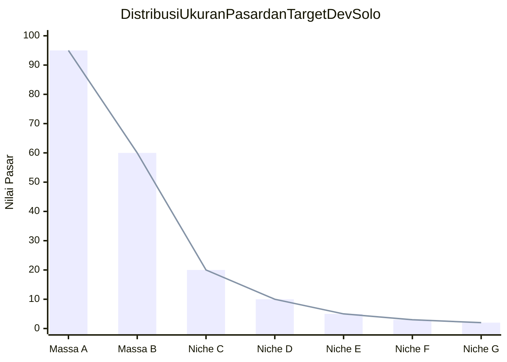
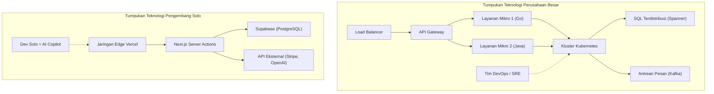

# Pengantar: Cara Bertarung "Si Tak Berpunya" Menantang Para Raksasa

Dalam sejarah pengembangan perangkat lunak, belum pernah ada era yang begitu menguntungkan bagi pengembang individu (indie developer) seperti saat ini. Demokratisasi infrastruktur cloud seperti AWS dan GCP, munculnya BaaS (Backend as a Service) seperti Vercel dan Supabase, serta yang terpenting, otomatisasi pengkodean berkat evolusi LLM (Large Language Models). Semua ini telah menciptakan fondasi di mana individu dapat bersaing langsung dengan perusahaan teknologi besar yang bertindak sebagai "raksasa".

Namun, hanya karena sumber daya teknis telah menjadi merata, bukan berarti Anda bisa menang dengan mengambil strategi yang sama dengan perusahaan besar. Dalam hal kekuatan modal, kekuatan pemasaran, dan kekuatan merek, individu berada pada kerugian yang sangat besar. Agar pengembang solo dapat bertahan dan menang, strategi bertahan hidup yang unik sangatlah penting.

Artikel ini akan secara menyeluruh membahas pendekatan teknis dan strategis bagi pengembang solo untuk meluncurkan mikro-SaaS (Micro-SaaS) dan membangun bisnis untuk bersaing secara global, menggabungkan desain arsitektur, ilmu ekonomi, dan model matematika.

---

# 1. Teori Long Tail dan Matematika Pasar Niche

Perusahaan besar menargetkan pasar massal yang memiliki TAM (Total Addressable Market: total pasar yang dapat dilayani) yang sangat besar. Mereka membutuhkan jutaan pengguna dan miliaran yen pendapatan untuk menutup biaya tetap yang tinggi (biaya personel, biaya sewa kantor, biaya iklan).

Sebaliknya, kekuatan pengembang solo terletak pada **"titik impas yang sangat rendah"**. Jika bisa menghasilkan keuntungan ratusan ribu yen sebulan, itu sudah cukup menjadikannya sebagai bisnis bagi individu. Di sinilah letak titik manis dari "Teori Long Tail".

## Hukum Zipf (Zipf's Law) dan Distribusi Pasar

Hubungan antara ukuran dan jumlah pasar sering kali mengikuti Hukum Zipf atau Hukum Pareto. Jika peringkat pasar adalah $k$ dan ukuran pasarnya (potensi penjualan) adalah $P(k)$, itu dapat dinyatakan dengan model hukum pangkat (power law) berikut.

$$ P(k) \propto \frac{1}{k^\alpha} $$

Di mana $\alpha$ adalah parameter yang menentukan bentuk distribusi (umumnya $\alpha \approx 1$).

Perusahaan besar bertarung dalam "Samudra Berdarah" (Red Ocean) memperebutkan pasar raksasa (kepala) di $k=1, 2, 3$. Di sisi lain, pasar niche (ekor) seperti $k \ge 100$ secara efektif adalah "Samudra Biru" (Blue Ocean) tanpa persaingan, karena bagi perusahaan besar pasar tersebut adalah "pasar yang jika dimasuki hanya akan merugi".



Pengembang solo harus dengan sengaja menargetkan masalah niche yang spesifik (seperti alat otomatisasi alur kerja untuk industri tertentu, atau alat analisis khusus yang menggabungkan API tertentu). Semakin niche, semakin mudah untuk menjangkau pengguna target, dan CAC (Biaya Akuisisi Pelanggan) akan menurun.

---

# 2. Desain Arsitektur yang Menghasilkan Agilitas Luar Biasa

Sistem perusahaan besar dirancang dengan memprioritaskan "stabilitas" dan "skalabilitas", sehingga arsitektur layanan mikro atau Kubernetes diadopsi. Namun, jika pengembang solo melakukan hal yang sama, sumber daya akan habis hanya untuk pemeliharaan infrastruktur (Ops).

Slogan tumpukan teknologi (tech stack) dari pengembang solo adalah **"No-Ops" (Tanpa Operasi)**. Maksimalkan penggunaan arsitektur tanpa server (serverless) dan fokuslah hanya pada penulisan logika bisnis.

## Perbandingan Arsitektur: Perusahaan Besar vs Pengembang Solo



Pada tumpukan teknologi perusahaan besar, koordinasi antara beberapa tim dan penyiapan alur (pipeline) penerapan DevOps diperlukan untuk menambahkan fitur baru. Di sisi lain, dengan tumpukan teknologi individu (contoh: Next.js + Supabase + Vercel), penyebaran ke jaringan edge global dapat dilakukan hanya dengan satu `git push`, dan provisi database tidak diperlukan.

## Pemanfaatan Serverless dan Edge Computing

Dengan menggunakan runtime edge seperti Vercel atau Cloudflare Workers, latensi cold start dapat dihilangkan, dan API dapat disediakan dengan latensi rendah kepada pengguna di seluruh dunia.

```typescript
// app/api/hello/route.ts (Rute API Edge Next.js)
import { NextResponse } from 'next/server';

export const runtime = 'edge';

export async function GET(request: Request) {
  const { searchParams } = new URL(request.url);
  const name = searchParams.get('name') || 'World';
  
  // Runtime Edge dieksekusi secara global dalam hitungan milidetik
  return NextResponse.json({
    message: `Hello, ${name}!`,
    timestamp: Date.now()
  });
}
```

---

# 3. "Produktivitas Ekstrem" dengan Memanfaatkan API AI

Fungsionalitas seperti "pemrosesan bahasa alami", "pembuatan gambar", dan "rekomendasi", yang dulunya memerlukan tim insinyur machine learning dan data scientist, sekarang dapat diimplementasikan hanya dengan satu panggilan API.

Dengan mengintegrasikan API dari OpenAI (GPT-4o) atau Anthropic (Claude 3.5 Sonnet) ke dalam Micro-SaaS Anda sendiri, individu pun dapat segera meluncurkan produk "AI-native".

## Implementasi Streaming Menggunakan Vercel AI SDK

Dalam produk yang menggunakan AI, kunci dari pengalaman pengguna (UX) adalah "respons streaming". Dengan Vercel AI SDK, hal ini dapat dicapai hanya dengan beberapa baris kode.

```typescript
// app/api/chat/route.ts
import { openai } from '@ai-sdk/openai';
import { streamText } from 'ai';

// Mengatur waktu eksekusi maksimum di lingkungan serverless
export const maxDuration = 30; 

export async function POST(req: Request) {
  const { messages } = await req.json();

  const result = await streamText({
    model: openai('gpt-4o-mini'),
    messages,
    system: "Anda adalah asisten SaaS yang cerdas. Selesaikan masalah pengguna secara akurat.",
  });

  return result.toDataStreamResponse();
}
```

Melalui implementasi ini, pengembang solo dapat menyediakan fungsionalitas AI tingkat lanjut tanpa menyadari kerumitan infrastruktur. Terlebih lagi, dengan memanfaatkan editor pengodean AI seperti GitHub Copilot atau Cursor, kecepatan pengembangan itu sendiri melonjak 5 hingga 10 kali lipat.

---

# 4. Matematika Overhead Komunikasi

Mengapa pengembang solo dapat merilis fitur lebih cepat daripada perusahaan besar? Alasan utamanya adalah "overhead komunikasi adalah nol".

Menurut Hukum Brooks (Brooks's Law), yang terkenal dari buku klasik rekayasa perangkat lunak "The Mythical Man-Month", jumlah saluran komunikasi $C$ dalam sebuah proyek meningkat terhadap jumlah pengembang $n$ sebagai berikut:

$$ C = \frac{n(n - 1)}{2} $$

Jika tim dengan $n=10$ orang di perusahaan besar melakukan pengembangan fitur, jumlah saluran mencapai $C = 45$, dan sejumlah besar waktu tersita untuk penyesuaian spesifikasi, rapat, dan peninjauan kode (code review).
Namun, untuk pengembang solo ($n=1$), jumlah saluran $C = 0$.

Karena **tidak ada hambatan (bottleneck) dalam proses mengubah pikiran menjadi kode**, sebuah ide yang dipikirkan di pagi hari dapat disebarkan ke lingkungan produksi pada sore harinya. Ini adalah senjata terbesar dari pengembang solo, yang tidak dapat ditiru oleh perusahaan besar sebanyak apa pun uang yang mereka miliki.

---

# 5. Ekspansi Global dan Integrasi Infrastruktur Pembayaran

Bagi Micro-SaaS yang bersaing secara global, membangun infrastruktur pembayaran (Payment Gateway) sangatlah penting. Dengan memanfaatkan Stripe, pembayaran dalam berbagai mata uang dari seluruh dunia, manajemen langganan, hingga pemrosesan pajak (Stripe Tax) dapat sepenuhnya diotomatisasi.

## Manajemen Langganan yang Kuat dengan Stripe Webhook

Mari kita lihat model sinkronisasi status pembayaran yang aman, yang menggabungkan Next.js App Router dan Stripe Webhook.

```typescript
// app/api/webhooks/stripe/route.ts
import { headers } from 'next/headers';
import { NextResponse } from 'next/server';
import Stripe from 'stripe';
import { db } from '@/db';
import { users } from '@/db/schema';
import { eq } from 'drizzle-orm';

const stripe = new Stripe(process.env.STRIPE_SECRET_KEY!, {
  apiVersion: '2023-10-16',
});

export async function POST(req: Request) {
  const body = await req.text();
  const signature = headers().get('Stripe-Signature') as string;

  let event: Stripe.Event;

  try {
    event = stripe.webhooks.constructEvent(
      body,
      signature,
      process.env.STRIPE_WEBHOOK_SECRET!
    );
  } catch (error: any) {
    return new NextResponse(`Kesalahan Webhook: ${error.message}`, { status: 400 });
  }

  // Pemrosesan saat memperbarui langganan
  if (event.type === 'customer.subscription.updated') {
    const subscription = event.data.object as Stripe.Subscription;
    const customerId = subscription.customer as string;
    
    // Perbarui status di DB
    await db.update(users)
      .set({ subscriptionStatus: subscription.status })
      .where(eq(users.stripeCustomerId, customerId));
  }

  return new NextResponse('OK', { status: 200 });
}
```

Dengan beberapa baris kode ini, Anda dapat langsung memproses pembayaran kartu kredit dari pengguna yang berada di belahan dunia lain dan mengotomatiskan penyediaan layanan Anda.

---

# 6. Menghindari Penguncian Infrastruktur (Vendor Lock-in) dan Portabilitas

Dalam strategi yang sangat bergantung pada BaaS atau layanan terkelola (managed services), yang selalu menjadi perdebatan adalah risiko "vendor lock-in". Misalnya, jika Anda terlalu bergantung pada Firestore milik Firebase, akan sangat sulit untuk bermigrasi ke RDB (Relational Database) di kemudian hari.

Solusi optimal sebagai strategi bertahan hidup adalah pendekatan **"Infrastruktur boleh terkunci, namun data dan logika bisnis tetap mempertahankan portabilitas"**.

## Abstraksi Lapisan Data dengan ORM

Praktik standar adalah menggunakan layanan terkelola seperti Supabase (PostgreSQL) atau PlanetScale (MySQL) untuk database, sementara tidak memanggil SQL secara langsung atau SDK BaaS tertentu dari kode aplikasi, melainkan menyisipkan lapisan abstraksi seperti Prisma atau Drizzle ORM.

```typescript
// db/schema.ts (Drizzle ORM)
import { pgTable, serial, text, timestamp, varchar } from 'drizzle-orm/pg-core';

export const users = pgTable('users', {
  id: serial('id').primaryKey(),
  email: varchar('email', { length: 255 }).notNull().unique(),
  stripeCustomerId: varchar('stripe_customer_id', { length: 255 }),
  subscriptionStatus: varchar('subscription_status', { length: 50 }),
  createdAt: timestamp('created_at').defaultNow(),
});

// app/actions/user.ts
import { db } from '@/db';
import { users } from '@/db/schema';
import { eq } from 'drizzle-orm';

export async function getUserByEmail(email: string) {
  const result = await db.select().from(users).where(eq(users.email, email));
  return result[0];
}
```

Dengan mengadopsi ekosistem PostgreSQL standar dengan cara ini, jika sewaktu-waktu biaya Supabase melonjak secara tak terduga, Anda dapat bermigrasi ke AWS RDS, Render, atau PostgreSQL di server Anda sendiri tanpa perlu banyak menulis ulang kode.

---

# 7. SEO Terprogram dan Konten Buatan AI

Senjata terkuat bagi pengembang solo tanpa anggaran pemasaran adalah "SEO (Search Engine Optimization)". Dalam beberapa tahun terakhir, "SEO Terprogram (Programmatic SEO)", yang secara dinamis menghasilkan ribuan hingga puluhan ribu halaman arahan (landing page) dengan menggabungkan database perusahaan sendiri dengan LLM, tengah menarik perhatian.

Distribusi lalu lintas juga mengikuti hukum pangkat (power law). Alih-alih menargetkan kata kunci besar tertentu, tujuan utama adalah meningkatkan jumlah total akses dengan mencakup banyak "kata kunci ekor panjang" (long-tail keywords) yang volume pencariannya kecil namun tingkat konversinya tinggi.

$$ Traffic_{Total} = \int_{x_{min}}^{x_{max}} T(x) dx $$

Meskipun lalu lintas $T(x)$ pada kata kunci niche $x$ kecil, dengan mengintegrasikannya, hal ini akan menghasilkan lalu lintas yang sangat besar secara keseluruhan. Dengan menggunakan rute dinamis Next.js dan SSG/ISR, halaman-halaman ini dapat didistribusikan dengan kecepatan tinggi.

---

# 8. Ekonomi Unit (Unit Economics) dan Formula Keuntungan

Terakhir, mari kita periksa model matematika agar Micro-SaaS berhasil sebagai bisnis. Persamaan dasar dari bisnis SaaS adalah sebagai berikut:

$$ Profit = \sum_{i=1}^{U} (LTV_i - CAC_i) - Fixed Costs $$

- **$U$**: Jumlah pengguna yang diakuisisi
- **$LTV$ (Life Time Value)**: Nilai seumur hidup pelanggan. $LTV = \frac{ARPU}{Churn Rate}$ (ARPU adalah rata-rata pendapatan per pengguna, Churn Rate adalah tingkat pembatalan/berhenti berlangganan)
- **$CAC$ (Customer Acquisition Cost)**: Biaya akuisisi pelanggan
- **$Fixed Costs$**: Biaya tetap (biaya server, biaya alat bantu, dll.)

Dalam kasus pengembang solo, kekuatan utamanya adalah **$Fixed Costs$ yang sangat mendekati nol**. Paket Pro Vercel ($20/bulan), Paket Pro Supabase ($25/bulan), dan penggunaan API AI lainnya secara total hanya membutuhkan biaya sekitar puluhan ribu yen per bulan. Keuntungan terbesarnya adalah Anda dapat mengecualikan biaya tenaga kerja Anda sendiri dari biaya tetap (atau menutupinya dari keuntungan).

### Bisnis dengan Biaya Marjinal Nol

Perangkat lunak, khususnya SaaS, memiliki biaya marjinal (Marginal Cost) yang hampir mencapai nol ketika jumlah pengguna bertambah satu. Jika $CAC$ dapat diminimalkan melalui otomatisasi akuisisi pengguna (SEO, penyebaran di SNS/media sosial, siklus viral, dll.), sebagian besar penjualan akan langsung menjadi laba kotor.

Misalnya, jika Anda membuat alat B2B niche seharga $15 per bulan dan Churn Rate adalah 5%, maka:
$$ LTV = \frac{\$15}{0.05} = \$300 $$

Jika CAC dapat ditekan hingga $10 melalui SEO dan pemasaran konten, laba (laba kotor) sebesar $290 akan dihasilkan untuk setiap satu pengguna yang diakuisisi. Hanya dengan menjangkau pengguna di seluruh dunia yang memiliki masalah niche tersebut, katakanlah 1.000 orang, Anda sudah memiliki Micro-SaaS yang menghasilkan pendapatan berulang sebesar $15.000 (lebih dari 2 juta yen) setiap bulannya.

---

# Kesimpulan: Kecepatan dan Fokus pada Niche Adalah Perisai dan Tombak Terkuat

Strategi bertahan hidup bagi pengembang solo untuk melawan perusahaan besar dan pesaing di seluruh dunia dapat dirangkum dalam 3 poin berikut:

1. **Pilih Tempat Bertarung (Teori Long Tail)**
   - Targetkan pasar niche dengan titik nyeri (pain points) yang dalam meskipun skalanya kecil, yang tidak bisa dimasuki oleh perusahaan besar.
2. **Manfaatkan Daya Ungkit Teknologi (Serverless, BaaS, AI)**
   - Eksternalkan operasi (Ops) sepenuhnya, dan tuliskan saja kode (logika bisnis) untuk menyelesaikan masalah pelanggan, alih-alih mengelola infrastruktur.
3. **Maksimalkan Agilitas (Biaya Komunikasi Nol)**
   - Manfaatkan "kecepatan", yang merupakan senjata terkuat dari pengembang solo, lakukan penerapan (deploy) segera setelah mendapatkan ide, dan jalankan putaran umpan balik pasar secepat mungkin.

Kita hidup di era yang memiliki leverage terbesar dalam sejarah. Selama Anda memiliki keyboard, koneksi internet, dan hasrat untuk menyelesaikan masalah, Anda dapat menciptakan produk dari kamar kecil Anda yang akan menyenangkan pengguna di seluruh dunia dan bahkan dapat bersaing dengan perusahaan raksasa sekalipun.

Sekarang, buka editor Anda dan mulai inisialisasi proyek baru.

```bash
npx create-next-app@latest my-micro-saas
```

Pertarungan sudah dimulai.


