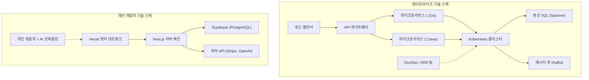

# 서론: 거인들에게 도전하는 '가지지 못한 자'의 싸움 방식

소프트웨어 개발 역사상 그 어느 때보다 개인 개발자(인디 디벨로퍼)에게 유리한 시대가 도래했습니다. AWS나 GCP 같은 클라우드 인프라의 민주화, Vercel이나 Supabase를 비롯한 BaaS(Backend as a [Service](https://kenji.blog/ko/p/kubernetes-k8s-architecture-pod-service-ingress/))의 대두, 그리고 무엇보다 [LLM](https://kenji.blog/ko/p/large-language-models-llm-transformer-prompt-engineering/)(대규모 언어 모델)의 진화에 따른 코딩의 자동화. 이 모든 것이 개인이 '거인'인 대형 테크 기업과 정면으로 승부할 수 있는 토양을 만들어 냈습니다.

하지만 기술적 리소스가 평등해졌다고 해서 대기업과 같은 전략을 취한다고 이길 수 있는 것은 아닙니다. 자본력, 마케팅력, 그리고 브랜드력에서 개인은 압도적으로 불리합니다. 개인 개발자가 살아남고, 그리고 승리하기 위해서는 독자적인 '생존 전략'이 필수적입니다.

본 기사에서는 개인 개발자가 마이크로 SaaS(Micro-SaaS)를 런칭하고 세계를 상대로 비즈니스를 전개하기 위한 기술적·전략적 접근법을 아키텍처 설계, 경제학, 그리고 수리 모델을 섞어 철저하게 해설합니다.

---

# 1. 롱테일 이론과 틈새 시장의 수리

대기업이 노리는 것은 TAM(Total Addressable Market: 획득 가능한 최대 시장 규모)이 거대한 대중(매스) 시장입니다. 그들은 높은 고정비(인건비, 사무실 임대료, 광고비)를 회수하기 위해 수백만 명의 사용자, 수십억 엔의 매출을 필요로 합니다.

반면 개인 개발자의 강점은 **"손익분기점이 극단적으로 낮다"** 는 것에 있습니다. 월 수십만 엔의 이익이 발생하면 개인으로서는 충분히 사업으로서 성립합니다. 여기에 '롱테일 이론'의 스위트 스팟이 존재합니다.

## [지프의 법칙(Zipf's Law)](https://kenji.blog/p/zipfs-law/)과 시장 분포

시장 규모와 수의 관계는 종종 지프의 법칙이나 파레토의 법칙을 따릅니다. 시장의 순위를 $k$, 그 시장 규모(매출 잠재력)를 $P(k)$ 라고 하면 다음과 같은 멱법칙 모델로 표현할 수 있습니다.

$$ P(k) \propto \frac{1}{k^\alpha} $$

여기서, $\alpha$ 는 분포의 형태를 결정하는 매개변수입니다 (일반적으로 $\alpha \approx 1$).

대기업은 $k=1, 2, 3$ 과 같은 거대 시장(헤드)을 둘러싸고 피투성이의 레드 오션을 싸웁니다. 한편, $k \ge 100$ 과 같은 틈새 시장(테일)은 대기업에게 "진입하는 것만으로 적자가 되는 시장"이기 때문에 실질적인 경쟁이 없는 블루 오션이 됩니다.

```mermaid
xychart-beta
    title 시장 규모 분포와 개인 개발자 타겟
  x-axis ["대중 A, 대중 B, 니치 C, 니치 D, 니치 E, 니치 F, 니치 G"]
  y-axis "시장 가치" 0 --> 100
  bar [95, 60, 20, 10, 5, 3, 2]
  line [95, 60, 20, 10, 5, 3, 2]
```

개인 개발자는 굳이 니치하고 특화된 과제(특정 업계를 위한 워크플로우 자동화 툴이나, 특정 API를 조합한 매니악한 분석 툴 등)를 타겟으로 삼아야 합니다. 니치할수록 타겟 사용자에게 도달하기 쉬워지고, CAC(고객 획득 단가)는 낮아집니다.

---

# 2. 압도적 민첩성을 낳는 아키텍처 설계

대기업의 시스템은 '안정성'과 '확장성'을 최우선으로 설계되기 때문에 [Kubernetes](https://kenji.blog/ko/p/kubernetes-k8s-architecture-pod-service-ingress/)나 마이크로서비스 아키텍처가 채택됩니다. 하지만 개인 개발자가 똑같이 한다면 인프라의 유지 관리(Ops)만으로 리소스가 고갈됩니다.

개인 개발자 기술 스택의 표어는 **"No-Ops"(운영 제로)** 입니다. 서버리스 아키텍처를 극한까지 활용하여 비즈니스 로직 작성에만 집중합니다.

## 대기업 vs 개인 개발자의 아키텍처 비교



대기업의 스택에서는 새로운 기능을 추가하기 위해 여러 팀 간의 조정과 DevOps 배포 파이프라인 정비가 필요합니다. 반면, 개인의 스택(예: Next.js + Supabase + Vercel)에서는 `git push` 한 번으로 글로벌 엣지 네트워크에 배포되며, DB 프로비저닝도 필요 없습니다.

## 서버리스와 엣지 컴퓨팅의 활용

Vercel이나 Cloudflare Workers 같은 엣지 런타임을 사용함으로써 콜드 스타트 지연을 없애고 전 세계 사용자에게 낮은 지연 시간으로 API를 제공할 수 있습니다.

```typescript
// app/api/hello/route.ts (Next.js Edge API Route)
import { NextResponse } from 'next/server';

export const runtime = 'edge';

export async function GET(request: Request) {
  const { searchParams } = new URL(request.url);
  const name = searchParams.get('name') || 'World';
  
  // Edge runtime executes in milliseconds globally
  return NextResponse.json({
    message: `Hello, ${name}!`,
    timestamp: Date.now()
  });
}
```

---

# 3. AI API를 활용한 '극한의 생산성'

과거에는 머신러닝 엔지니어나 데이터 과학자 팀이 필요했던 '자연어 처리', '이미지 생성', '추천(Recommendation)'과 같은 기능들은 현재 API 호출 한 번으로 구현 가능합니다.

OpenAI(GPT-4o)나 Anthropic(Claude 3.5 Sonnet)의 API를 자신의 Micro-SaaS에 내장함으로써, 개인도 "AI 네이티브"한 프로덕트를 즉각적으로 런칭할 수 있습니다.

## Vercel AI SDK를 이용한 스트리밍 구현

AI를 활용한 프로덕트에서 사용자 경험(UX)의 핵심이 되는 것은 '스트리밍 응답'입니다. Vercel AI SDK를 사용하면 몇 줄의 코드만으로 이를 구현할 수 있습니다.

```typescript
// app/api/chat/route.ts
import { openai } from '@ai-sdk/openai';
import { streamText } from 'ai';

// 서버리스 환경에서의 최대 실행 시간 설정
export const maxDuration = 30; 

export async function POST(req: Request) {
  const { messages } = await req.json();

  const result = await streamText({
    model: openai('gpt-4o-mini'),
    messages,
    system: "당신은 우수한 SaaS 어시스턴트입니다. 사용자의 과제를 정확하게 해결해 주세요.",
  });

  return result.toDataStreamResponse();
}
```

이러한 구현을 통해 개인 개발자는 인프라의 복잡성을 의식하지 않고 고급 AI 기능을 제공할 수 있습니다. 게다가 GitHub Copilot이나 Cursor 같은 AI 코딩 에디터를 활용함으로써 개발 속도 그 자체도 기존의 5배에서 10배로 뛰어올랐습니다.

---

# 4. 커뮤니케이션 오버헤드의 수리

왜 개인 개발자는 대기업보다 더 빨리 기능을 런칭할 수 있을까요? 그 가장 큰 이유는 "커뮤니케이션 오버헤드가 제로"이기 때문입니다.

소프트웨어 공학의 고전 '맨먼스 미신(The Mythical Man-Month)'으로 알려진 브룩스의 법칙(Brooks's Law)에 따르면, 프로젝트 내의 커뮤니케이션 채널 수 $C$ 는 개발자의 수 $n$ 에 대해 다음과 같이 증가합니다.

$$ C = \frac{n(n - 1)}{2} $$

대기업에서 $n=10$ 인 팀이 기능 개발을 수행할 경우, 채널 수는 $C = 45$ 에 달하여 사양 조정, 미팅, 코드 리뷰에 막대한 시간이 할애됩니다.
하지만 개인 개발자($n=1$)의 경우, 채널 수 $C = 0$ 입니다.

**생각에서 코드로 변환하는 프로세스에 병목 현상이 존재하지 않기** 때문에, 아침에 떠오른 아이디어를 그날 저녁에 프로덕션 환경에 배포하는 것이 가능한 것입니다. 이것은 대기업이 아무리 자금을 쌓아도 흉내낼 수 없는, 개인 개발자의 가장 큰 무기입니다.

---

# 5. 글로벌 전개와 결제 기반 통합

세계를 상대로 싸우는 마이크로 SaaS에게 결제 기반(Payment Gateway) 구축은 필수입니다. Stripe를 활용함으로써 전 세계 통화 결제, 구독 관리, 그리고 세무 처리(Stripe Tax)까지 완벽하게 자동화할 수 있습니다.

## Stripe Webhook을 활용한 견고한 구독 관리

Next.js App Router와 Stripe Webhook을 조합한 안전한 결제 상태 동기화 모델을 살펴봅시다.

```typescript
// app/api/webhooks/stripe/route.ts
import { headers } from 'next/headers';
import { NextResponse } from 'next/server';
import Stripe from 'stripe';
import { db } from '@/db';
import { users } from '@/db/schema';
import { eq } from 'drizzle-orm';

const stripe = new Stripe(process.env.STRIPE_SECRET_KEY!, {
  apiVersion: '2023-10-16',
});

export async function POST(req: Request) {
  const body = await req.text();
  const signature = headers().get('Stripe-Signature') as string;

  let event: Stripe.Event;

  try {
    event = stripe.webhooks.constructEvent(
      body,
      signature,
      process.env.STRIPE_WEBHOOK_SECRET!
    );
  } catch (error: any) {
    return new NextResponse(`Webhook Error: ${error.message}`, { status: 400 });
  }

  // 구독 업데이트 시의 처리
  if (event.type === 'customer.subscription.updated') {
    const subscription = event.data.object as Stripe.Subscription;
    const customerId = subscription.customer as string;
    
    // DB의 상태를 업데이트
    await db.update(users)
      .set({ subscriptionStatus: subscription.status })
      .where(eq(users.stripeCustomerId, customerId));
  }

  return new NextResponse('OK', { status: 200 });
}
```

이 몇 줄의 코드를 통해 지구 반대편에 있는 사용자의 신용카드 결제를 즉시 처리하고 서비스 제공을 자동화할 수 있습니다.

---

# 6. 인프라 락인 회피와 이식성(Portability)

BaaS나 매니지드 서비스를 다용하는 전략에서 항상 논의되는 것이 '벤더 락인'의 위험성입니다. 예를 들어 Firebase의 Firestore에 너무 깊이 의존하면 나중에 RDB(관계형 데이터베이스)로 마이그레이션하는 것이 극히 어려워집니다.

생존 전략으로서의 최적 해답은 **"인프라에는 락인되지만, 데이터와 비즈니스 로직은 이식성을 유지한다"** 는 접근 방식입니다.

## ORM을 통한 데이터 계층의 추상화

데이터베이스에는 Supabase(PostgreSQL)나 PlanetScale(MySQL) 등의 매니지드 서비스를 이용하면서, 애플리케이션 코드에서는 직접 SQL이나 특정 BaaS SDK를 호출하는 것이 아니라 Prisma나 Drizzle ORM 같은 추상화 계층을 끼워 넣는 것이 정석입니다.

```typescript
// db/schema.ts (Drizzle ORM)
import { pgTable, serial, text, timestamp, varchar } from 'drizzle-orm/pg-core';

export const users = pgTable('users', {
  id: serial('id').primaryKey(),
  email: varchar('email', { length: 255 }).notNull().unique(),
  stripeCustomerId: varchar('stripe_customer_id', { length: 255 }),
  subscriptionStatus: varchar('subscription_status', { length: 50 }),
  createdAt: timestamp('created_at').defaultNow(),
});

// app/actions/user.ts
import { db } from '@/db';
import { users } from '@/db/schema';
import { eq } from 'drizzle-orm';

export async function getUserByEmail(email: string) {
  const result = await db.select().from(users).where(eq(users.email, email));
  return result[0];
}
```

이처럼 표준적인 PostgreSQL 생태계에 올라타 두면 만에 하나 Supabase의 요금이 치솟더라도 AWS RDS나 Render, 자체 서버의 PostgreSQL로 코드를 거의 수정하지 않고 마이그레이션할 수 있습니다.

---

# 7. 프로그래매틱 SEO와 AI 생성 콘텐츠

마케팅 예산이 없는 개인 개발자가 싸우기 위한 최강의 무기가 'SEO(검색 엔진 최적화)'입니다. 최근에는 자사의 데이터베이스와 [LLM](https://kenji.blog/ko/p/large-language-models-llm-transformer-prompt-engineering/)을 결합하여 수천에서 수만 개의 랜딩 페이지를 동적으로 생성하는 '프로그래매틱 SEO'가 주목받고 있습니다.

트래픽의 분포 또한 멱법칙을 따릅니다. 특정 빅 키워드를 노리는 것이 아니라 검색 볼륨은 작더라도 전환율이 높은 '롱테일 키워드'를 대량으로 커버함으로써 전체의 액세스 수를 끌어올립니다.

$$ Traffic_{Total} = \int_{x_{min}}^{x_{max}} T(x) dx $$

니치 키워드 $x$ 에서의 트래픽 $T(x)$ 는 작더라도 적분함으로써 전체적으로 거대한 트래픽을 창출합니다. Next.js의 다이내믹 라우팅과 SSG/ISR을 사용하면 이러한 페이지를 고속으로 배포할 수 있습니다.

---

# 8. 유닛 이코노믹스(단위 경제성)와 이익 공식

마지막으로 Micro-SaaS를 비즈니스로 성립시키기 위한 수리 모델을 확인합니다. SaaS 비즈니스의 기본 방정식은 다음과 같습니다.

$$ Profit = \sum_{i=1}^{U} (LTV_i - CAC_i) - Fixed Costs $$

- **$U$**: 획득 사용자 수
- **$LTV$ (Life Time Value)**: 고객 생애 가치. $LTV = \frac{ARPU}{Churn Rate}$ (ARPU는 사용자당 평균 월 단가, Churn Rate는 이탈률)
- **$CAC$ (Customer Acquisition Cost)**: 고객 획득 단가
- **$Fixed Costs$**: 고정비 (서버 비용, 툴 비용 등)

개인 개발자의 경우, **$Fixed Costs$ 가 한없이 0에 가깝다** 는 강점이 있습니다. Vercel Pro 플랜(월 $20), Supabase Pro 플랜(월 $25), 기타 AI API 이용료 등을 합쳐도 월 1만 엔~수만 엔(약 10~30만 원) 정도에 수렴합니다. 자신의 인건비를 고정비에서 제외(또는 이익에서 회수)할 수 있는 가장 큰 장점이 있습니다.

### 한계 비용 제로의 비즈니스

소프트웨어, 특히 SaaS는 사용자가 1명 늘어났을 때의 한계 비용(Marginal Cost)이 거의 제로입니다. 사용자 획득의 자동화(SEO, SNS 발신, 바이럴 루프 등)를 통해 $CAC$ 를 극소화할 수 있다면 매출의 대부분이 그대로 매출 총이익이 됩니다.

만약 월 $15의 니치한 B2B 툴을 만들고 Churn Rate가 5%라고 한다면,
$$ LTV = \frac{\$15}{0.05} = \$300 $$

CAC를 SEO와 콘텐츠 마케팅으로 $10로 억제할 수 있다면, 1명의 사용자 획득 시 $290의 이익(매출 총이익)이 발생합니다. 이것을 전 세계의 니치한 과제를 가진 사용자, 예를 들어 1,000명에게 전달하기만 해도 매월 $15,000(약 200만 엔 이상)의 스톡 수입을 창출하는 마이크로 SaaS가 완성됩니다.

---

# 결론: 속도와 니치에 대한 특화야말로 최강의 방패이자 창

개인 개발자가 대기업이나 전 세계의 라이벌과 싸우기 위한 생존 전략은 다음의 3가지로 요약됩니다.

1. **싸울 장소를 선택한다 (롱테일 이론)**
   - 대기업이 진입할 수 없는, 작지만 깊은 고통(pain)을 가진 니치 시장을 노린다.
2. **기술의 지렛대(레버리지)를 활용한다 (서버리스·BaaS·AI)**
   - 운영(Ops)을 완전히 외부화하고, 인프라가 아닌 고객의 과제 해결을 위한 코드(비즈니스 로직)만 작성한다.
3. **민첩성을 극대화한다 (커뮤니케이션 비용 제로)**
   - 개인 개발의 가장 큰 무기인 '속도'를 살려, 아이디어가 떠오르면 즉시 배포하고 시장의 피드백을 최단 시간 내에 반영한다.

우리는 지금 역사상 가장 레버리지가 통하는 시대를 살고 있습니다. 키보드와 인터넷, 그리고 과제를 해결하겠다는 열정만 있다면, 개인의 작은 방에서 전 세계 사용자를 기쁘게 하는 프로덕트를 만들어내어 거대 기업과도 맞붙을 수 있는 것입니다.

자, 에디터를 열고 새로운 프로젝트를 초기화합시다.

```bash
npx create-next-app@latest my-micro-saas
```

싸움은 이미 시작되었습니다.


