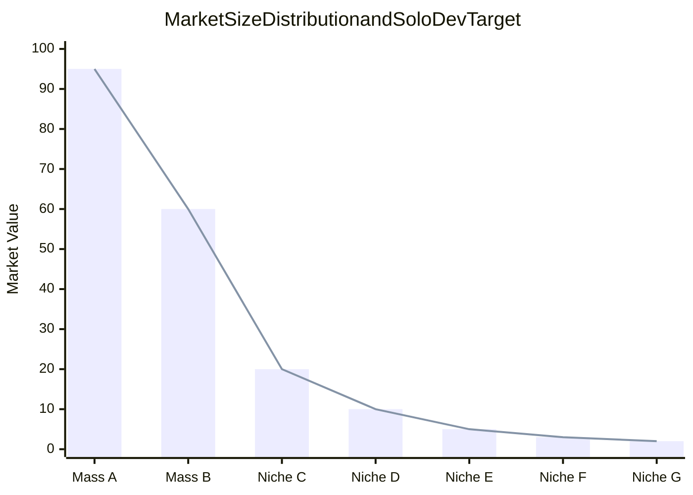
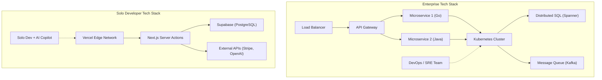

# 序論：巨人たちに挑む「持たざる者」の戦い方

ソフトウェア開発の歴史において、かつてないほど個人開発者（インディーデベロッパー）にとって有利な時代が到来しています。AWSやGCPといったクラウドインフラの民主化、VercelやSupabaseをはじめとするBaaS（Backend as a Service）の台頭、そして何よりLLM（大規模言語モデル）の進化によるコーディングの自動化。これら全てが、個人が「巨人」たる大手テック企業と真っ向から勝負できる土壌を作り上げました。

しかし、技術的リソースがフラットになったからといって、大手企業と同じ戦略をとって勝てるわけではありません。資本力、マーケティング力、そしてブランド力において、個人は圧倒的に不利です。個人開発者が生き残り、そして勝つためには、独自の「サバイバル戦略」が不可欠です。

本記事では、個人開発者がマイクロSaaS（Micro-SaaS）を立ち上げ、世界を相手にビジネスを展開するための技術的・戦略的アプローチを、アーキテクチャ設計、経済学、そして数理モデルを交えて徹底的に解説します。

---

# 1. ロングテール理論とニッチ市場の数理

大手企業が狙うのは、TAM（Total Addressable Market：獲得可能な最大市場規模）が巨大なマス市場です。彼らは高い固定費（人件費、オフィス代、広告費）を回収するために、数百万ユーザー、数十億円の売上を必要とします。

対して個人開発者の強みは、 **「損益分岐点が極端に低いこと」** にあります。月額数十万円の利益が出れば、個人としては十分に事業として成立します。ここに「ロングテール理論」のスイートスポットが存在します。

## ジップの法則（Zipf's Law）と市場分布

市場の規模と数の関係は、しばしばジップの法則やパレートの法則に従います。市場のランクを $k$、その市場規模（売上ポテンシャル）を $P(k)$ とすると、次のような冪乗則（べきじょうそく）モデルで表現できます。

$$ P(k) \propto \frac{1}{k^\alpha} $$

ここで、$\alpha$ は分布の形状を決めるパラメータです（一般に $\alpha \approx 1$）。

大手企業は $k=1, 2, 3$ のような巨大市場（ヘッド）を巡って血みどろのレッドオーシャンを戦います。一方で、$k \ge 100$ のようなニッチ市場（テール）は、大手企業にとって「参入するだけ赤字になる市場」であるため、実質的な競合不在のブルーオーシャンとなります。



個人開発者は、あえてニッチで特化した課題（特定の業界向けのワークフロー自動化ツールや、特定のAPIを組み合わせたマニアックな分析ツールなど）をターゲットにすべきです。ニッチであればあるほど、ターゲットユーザーへのリーチは容易になり、CAC（顧客獲得単価）は低下します。

---

# 2. 圧倒的アジリティを生むアーキテクチャ設計

大企業のシステムは「安定性」と「スケーラビリティ」を最優先に設計されるため、Kubernetesやマイクロサービスアーキテクチャが採用されます。しかし、個人開発者が同じことをすれば、インフラの維持管理（Ops）だけでリソースが枯渇します。

個人開発者の技術スタックの合言葉は **"No-Ops"（運用ゼロ）** です。サーバーレスアーキテクチャを極限まで活用し、ビジネスロジックの記述のみに集中します。

## 大企業 vs 個人開発者のアーキテクチャ比較



大企業のスタックでは、新しい機能を追加するために複数チーム間の調整とDevOpsのデプロイパイプライン整備が必要です。一方、個人のスタック（例：Next.js + Supabase + Vercel）では、`git push` ひとつでグローバルエッジネットワークにデプロイされ、DBのプロビジョニングも不要です。

## サーバーレスとエッジコンピューティングの活用

VercelやCloudflare Workersのようなエッジランタイムを使用することで、コールドスタートの遅延をなくし、世界中のユーザーに低レイテンシでAPIを提供できます。

```typescript
// app/api/hello/route.ts (Next.js Edge API Route)
import { NextResponse } from 'next/server';

export const runtime = 'edge';

export async function GET(request: Request) {
  const { searchParams } = new URL(request.url);
  const name = searchParams.get('name') || 'World';
  
  // Edge runtime executes in milliseconds globally
  return NextResponse.json({
    message: `Hello, ${name}!`,
    timestamp: Date.now()
  });
}
```

---

# 3. AI APIを活用した「極限の生産性」

かつては機械学習エンジニアやデータサイエンティストのチームが必要だった「自然言語処理」「画像生成」「レコメンデーション」といった機能は、現在ではAPI呼び出し一発で実装可能です。

OpenAI (GPT-4o) や Anthropic (Claude 3.5 Sonnet) のAPIを自社のMicro-SaaSに組み込むことで、個人でも「AIネイティブ」なプロダクトを即座に立ち上げることができます。

## Vercel AI SDKを用いたストリーミング実装

AIを用いたプロダクトにおいて、ユーザー体験（UX）の鍵となるのは「ストリーミング応答」です。Vercel AI SDKを使えば、数行のコードでこれを実現できます。

```typescript
// app/api/chat/route.ts
import { openai } from '@ai-sdk/openai';
import { streamText } from 'ai';

// サーバーレス環境での最大実行時間を設定
export const maxDuration = 30; 

export async function POST(req: Request) {
  const { messages } = await req.json();

  const result = await streamText({
    model: openai('gpt-4o-mini'),
    messages,
    system: "あなたは優秀なSaaSアシスタントです。ユーザーの課題を的確に解決してください。",
  });

  return result.toDataStreamResponse();
}
```

このような実装により、個人開発者はインフラの複雑さを意識することなく、高度なAI機能を提供できます。さらに、GitHub CopilotやCursorといったAIコーディングエディタを活用することで、開発スピードそのものも従来の5倍から10倍へと跳ね上がっています。

---

# 4. コミュニケーション・オーバーヘッドの数理

なぜ個人開発者は、大企業よりも早く機能をリリースできるのでしょうか？その最大の理由は「コミュニケーション・オーバーヘッドがゼロ」だからです。

ソフトウェア工学の古典「人月の神話（The Mythical Man-Month）」で知られるブルックスの法則（Brooks's Law）によれば、プロジェクト内のコミュニケーションチャネル数 $C$ は、開発者の数 $n$ に対して次のように増加します。

$$ C = \frac{n(n - 1)}{2} $$

大企業で $n=10$ のチームが機能開発を行う場合、チャネル数は $C = 45$ に達し、仕様調整、ミーティング、コードレビューに膨大な時間が割かれます。
しかし、個人開発者（$n=1$）の場合、チャネル数 $C = 0$ です。

**思考からコードへの変換プロセスにボトルネックが存在しない** ため、朝思いついたアイデアをその日の夕方に本番環境へデプロイすることが可能なのです。これは大企業がどれだけ資金を積んでも真似できない、個人開発者の最大の武器です。

---

# 5. グローバル展開と決済基盤の統合

世界を相手に戦うマイクロSaaSにとって、決済基盤（Payment Gateway）の構築は必須です。Stripeを活用することで、世界中の通貨での決済、サブスクリプション管理、そして税務処理（Stripe Tax）までを完全に自動化できます。

## Stripe Webhookを用いた堅牢なサブスクリプション管理

Next.js App RouterとStripe Webhookを組み合わせた安全な決済ステータスの同期モデルを見てみましょう。

```typescript
// app/api/webhooks/stripe/route.ts
import { headers } from 'next/headers';
import { NextResponse } from 'next/server';
import Stripe from 'stripe';
import { db } from '@/db';
import { users } from '@/db/schema';
import { eq } from 'drizzle-orm';

const stripe = new Stripe(process.env.STRIPE_SECRET_KEY!, {
  apiVersion: '2023-10-16',
});

export async function POST(req: Request) {
  const body = await req.text();
  const signature = headers().get('Stripe-Signature') as string;

  let event: Stripe.Event;

  try {
    event = stripe.webhooks.constructEvent(
      body,
      signature,
      process.env.STRIPE_WEBHOOK_SECRET!
    );
  } catch (error: any) {
    return new NextResponse(`Webhook Error: ${error.message}`, { status: 400 });
  }

  // サブスクリプション更新時の処理
  if (event.type === 'customer.subscription.updated') {
    const subscription = event.data.object as Stripe.Subscription;
    const customerId = subscription.customer as string;
    
    // DBのステータスを更新
    await db.update(users)
      .set({ subscriptionStatus: subscription.status })
      .where(eq(users.stripeCustomerId, customerId));
  }

  return new NextResponse('OK', { status: 200 });
}
```

この数行のコードにより、世界の裏側にいるユーザーからのクレジットカード決済を即座に処理し、サービスの提供を自動化することができます。

---

# 6. インフラのロックイン回避とポータビリティ

BaaSやマネージドサービスを多用する戦略において、常に議論となるのが「ベンダーロックイン」のリスクです。例えば、FirebaseのFirestoreに深く依存しすぎると、後からRDB（リレーショナルデータベース）に移行するのが極めて困難になります。

サバイバル戦略としての最適解は、 **「インフラにはロックインされるが、データとビジネスロジックはポータビリティを保つ」** というアプローチです。

## ORMによるデータ層の抽象化

データベースにはSupabase（PostgreSQL）やPlanetScale（MySQL）などのマネージドサービスを利用しつつ、アプリケーションコードからは直接SQLや特定のBaaS SDKを叩くのではなく、PrismaやDrizzle ORMのような抽象化レイヤーを挟むのが定石です。

```typescript
// db/schema.ts (Drizzle ORM)
import { pgTable, serial, text, timestamp, varchar } from 'drizzle-orm/pg-core';

export const users = pgTable('users', {
  id: serial('id').primaryKey(),
  email: varchar('email', { length: 255 }).notNull().unique(),
  stripeCustomerId: varchar('stripe_customer_id', { length: 255 }),
  subscriptionStatus: varchar('subscription_status', { length: 50 }),
  createdAt: timestamp('created_at').defaultNow(),
});

// app/actions/user.ts
import { db } from '@/db';
import { users } from '@/db/schema';
import { eq } from 'drizzle-orm';

export async function getUserByEmail(email: string) {
  const result = await db.select().from(users).where(eq(users.email, email));
  return result[0];
}
```

このように標準的なPostgreSQLのエコシステムに乗っておけば、万が一Supabaseの料金が跳ね上がったとしても、AWS RDSやRender、自前サーバーのPostgreSQLへ、コードをほとんど書き換えることなく移行できます。

---

# 7. プログラマティックSEOとAI生成コンテンツ

マーケティング予算がない個人開発者が戦うための最強の武器が「SEO（検索エンジン最適化）」です。近年では、自社のデータベースとLLMを組み合わせて、数千から数万のランディングページを動的に生成する「プログラマティックSEO」が注目されています。

トラフィックの分布もまた冪乗則に従います。特定のビッグキーワードを狙うのではなく、検索ボリュームは小さくてもコンバージョン率が高い「ロングテールキーワード」を大量にカバーすることで、全体のアクセス数を底上げします。

$$ Traffic_{Total} = \int_{x_{min}}^{x_{max}} T(x) dx $$

ニッチキーワード $x$ におけるトラフィック $T(x)$ は小さくとも、積分することで全体として巨大なトラフィックを生み出します。Next.jsのダイナミックルーティングとSSG/ISRを使えば、これらのページを高速に配信できます。

---

# 8. ユニットエコノミクス（単位経済性）と利益の公式

最後に、Micro-SaaSをビジネスとして成立させるための数理モデルを確認します。SaaSビジネスの基本方程式は以下の通りです。

$$ Profit = \sum_{i=1}^{U} (LTV_i - CAC_i) - Fixed Costs $$

- **$U$**: 獲得ユーザー数
- **$LTV$ (Life Time Value)**: 顧客生涯価値。 $LTV = \frac{ARPU}{Churn Rate}$ (ARPUはユーザーあたりの平均月単価、Churn Rateは解約率)
- **$CAC$ (Customer Acquisition Cost)**: 顧客獲得単価
- **$Fixed Costs$**: 固定費（サーバー代、ツール代など）

個人開発者の場合、 **$Fixed Costs$ が限りなくゼロに近い** という強みがあります。VercelのProプラン（$20/月）、SupabaseのProプラン（$25/月）、その他AIのAPI利用料などを合わせても、月額1万円〜数万円程度に収まります。自分自身の人件費を固定費から除外（または利益から回収）できるのが最大のメリットです。

### 限界費用ゼロのビジネス

ソフトウェア、特にSaaSは、ユーザーが1人増えたときの限界費用（Marginal Cost）がほぼゼロです。ユーザー獲得の自動化（SEO、SNS発信、バイラルループなど）により $CAC$ を極小化できれば、売上の大部分がそのまま粗利となります。

もし、月額 $15 のニッチなB2Bツールを作り、Churn Rate が 5% だとすると、
$$ LTV = \frac{\$15}{0.05} = \$300 $$

CACをSEOとコンテンツマーケティングで $10 に抑えられれば、1ユーザー獲得につき $290 の利益（粗利）が生まれます。これを世界中のニッチな課題を持つユーザー、例えば 1,000 人に届けるだけで、毎月 $15,000 （約200万円以上）のストック収入を生み出すマイクロSaaSが完成します。

---

# 結論：スピードとニッチへの特化こそが最強の盾であり矛

個人開発者が大手企業や世界中のライバルと戦うためのサバイバル戦略は、以下の3点に集約されます。

1. **戦う場所を選ぶ（ロングテール理論）**
   - 大企業が参入できない、小さくとも深いペインを持つニッチ市場を狙う。
2. **技術のテコを効かせる（サーバーレス・BaaS・AI）**
   - 運用（Ops）を完全に外部化し、インフラではなく顧客の課題解決のためのコード（ビジネスロジック）だけを書く。
3. **アジリティを最大化する（コミュニケーションコスト・ゼロ）**
   - 個人開発最大の武器である「スピード」を活かし、思いついたら即座にデプロイし、市場のフィードバックを最速で回す。

私たちは今、歴史上最もレバレッジが効く時代を生きています。キーボードとインターネット、そして課題を解決するという熱意さえあれば、個人の小さな部屋から、世界中のユーザーを喜ばせるプロダクトを生み出し、巨大企業とも渡り合えるのです。

さあ、エディタを開き、新しいプロジェクトを初期化しましょう。

```bash
npx create-next-app@latest my-micro-saas
```

戦いは、すでに始まっています。


