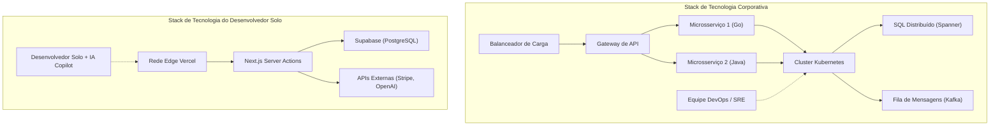

# Introdução: A Batalha dos "Despossuídos" Desafiando os Gigantes

Na história do desenvolvimento de software, nunca houve uma era tão favorável para os desenvolvedores solo (indie developers) como agora. A democratização da infraestrutura em nuvem, como AWS e GCP, a ascensão do BaaS (Backend as a [Service](https://kenji.blog/pt/p/kubernetes-k8s-architecture-pod-service-ingress/)), como Vercel e Supabase, e, acima de tudo, a automação da codificação impulsionada pela evolução dos LLMs ([Large Language Models](https://kenji.blog/pt/p/large-language-models-llm-transformer-prompt-engineering/)). Tudo isso criou um terreno onde os indivíduos podem competir de frente com as gigantes empresas de tecnologia.

No entanto, o fato de os recursos tecnológicos terem se nivelado não significa que você possa vencer adotando as mesmas estratégias que as grandes empresas. Em termos de capital, poder de marketing e força da marca, os indivíduos estão em esmagadora desvantagem. Para que os desenvolvedores solo sobrevivam e, em última análise, vençam, uma "estratégia de sobrevivência" única é essencial.

Neste artigo, explicaremos de forma abrangente as abordagens técnicas e estratégicas para desenvolvedores solo lançarem um Micro-SaaS e expandirem seus negócios globalmente, incorporando design de arquitetura, economia e modelos matemáticos.

---

# 1. Teoria da Cauda Longa e a Matemática do Mercado de Nicho

O que as grandes empresas visam é o mercado de massa, onde o TAM (Total Addressable Market - Mercado Total Endereçável) é gigantesco. Elas precisam de milhões de usuários e bilhões em receita para recuperar seus altos custos fixos (custos trabalhistas, aluguel de escritórios, despesas com publicidade).

Em contraste, a força dos desenvolvedores solo reside no fato de que o **"ponto de equilíbrio é extremamente baixo"**. Se houver um lucro de centenas de milhares por mês, o negócio já se sustenta plenamente para um indivíduo. É aqui que reside o ponto ideal da "Teoria da Cauda Longa".

## [A Lei de Zipf](https://kenji.blog/pt/p/zipfs-law/) ([Zipf's Law](https://kenji.blog/pt/p/zipfs-law/)) e a Distribuição de Mercado

A relação entre o tamanho e o número de mercados frequentemente segue a Lei de Zipf ou o Princípio de Pareto. Seja $k$ a classificação do mercado e $P(k)$ o seu tamanho (potencial de vendas), ela pode ser expressa pelo seguinte modelo de lei de potência:

$$ P(k) \propto \frac{1}{k^\alpha} $$

Aqui, $\alpha$ é um parâmetro que determina a forma da distribuição (geralmente $\alpha \approx 1$).

As grandes empresas travam uma batalha sangrenta no oceano vermelho por mercados gigantescos (a cabeça) como $k=1, 2, 3$. Por outro lado, mercados de nicho (a cauda) como $k \ge 100$ são "mercados que dariam prejuízo só de entrar" para as grandes empresas, tornando-se oceanos azuis sem concorrência substancial.

```mermaid
xychart-beta
    title Distribuição do Tamanho do Mercado e Alvo do Desenvolvedor Solo
  x-axis ["Massa A, Massa B, Nicho C, Nicho D, Nicho E, Nicho F, Nicho G"]
  y-axis "Valor do Mercado" 0 --> 100
  bar [95, 60, 20, 10, 5, 3, 2]
  line [95, 60, 20, 10, 5, 3, 2]
```

Os desenvolvedores solo devem focar deliberadamente em problemas altamente específicos e de nicho (como ferramentas de automação de fluxo de trabalho para setores específicos ou ferramentas de análise especializadas combinando APIs específicas). Quanto mais nichado for o produto, mais fácil será alcançar os usuários-alvo, e o CAC (Custo de Aquisição de Clientes) diminuirá.

---

# 2. Design de Arquitetura que Gera uma Agilidade Esmagadora

Os sistemas das grandes empresas são projetados com "estabilidade" e "escalabilidade" como prioridade máxima, razão pela qual adotam [Kubernetes](https://kenji.blog/pt/p/kubernetes-k8s-architecture-pod-service-ingress/) e arquiteturas de microsserviços. No entanto, se um desenvolvedor solo fizesse o mesmo, os recursos seriam esgotados apenas na manutenção da infraestrutura (Ops).

A palavra de ordem para a stack de tecnologia de um desenvolvedor solo é **"No-Ops" (Zero Operações)**. Utilize a arquitetura serverless ao limite e concentre-se exclusivamente em escrever a lógica de negócios.

## Comparação de Arquitetura: Grandes Empresas vs Desenvolvedores Solo



Na stack das grandes empresas, a adição de um novo recurso requer coordenação entre várias equipes e o desenvolvimento de pipelines de implantação DevOps. Por outro lado, na stack de um indivíduo (por exemplo, Next.js + Supabase + Vercel), um único `git push` implanta o código em uma rede global edge, e não há necessidade de provisionamento de banco de dados.

## Aproveitando [Serverless](https://kenji.blog/pt/p/serverless-architecture-aws-lambda-cold-start/) e Edge Computing

Ao utilizar runtimes edge como Vercel ou Cloudflare Workers, você pode eliminar o atraso do cold start e fornecer APIs com baixa latência para usuários em todo o mundo.

```typescript
// app/api/hello/route.ts (Next.js Edge API Route)
import { NextResponse } from 'next/server';

export const runtime = 'edge';

export async function GET(request: Request) {
  const { searchParams } = new URL(request.url);
  const name = searchParams.get('name') || 'World';
  
  // O runtime Edge executa em milissegundos globalmente
  return NextResponse.json({
    message: `Hello, ${name}!`,
    timestamp: Date.now()
  });
}
```

---

# 3. "Produtividade Extrema" Aproveitando APIs de IA

Recursos como "Processamento de Linguagem Natural", "Geração de Imagens" e "Recomendações", que antes exigiam equipes de engenheiros de machine learning e cientistas de dados, agora podem ser implementados com uma única chamada de API.

Ao integrar APIs da OpenAI (GPT-4o) ou Anthropic (Claude 3.5 Sonnet) em seu próprio Micro-SaaS, até mesmo um indivíduo pode lançar instantaneamente um produto "Nativo de IA".

## Implementação de Streaming com o Vercel AI SDK

Em produtos que utilizam IA, a chave para a experiência do usuário (UX) é a "resposta em streaming". Usando o Vercel AI SDK, isso pode ser alcançado com poucas linhas de código.

```typescript
// app/api/chat/route.ts
import { openai } from '@ai-sdk/openai';
import { streamText } from 'ai';

// Define a duração máxima no ambiente serverless
export const maxDuration = 30; 

export async function POST(req: Request) {
  const { messages } = await req.json();

  const result = await streamText({
    model: openai('gpt-4o-mini'),
    messages,
    system: "Você é um excelente assistente de SaaS. Resolva os problemas do usuário com precisão.",
  });

  return result.toDataStreamResponse();
}
```

Com implementações como essa, os desenvolvedores solo podem fornecer recursos avançados de IA sem precisar se preocupar com a complexidade da infraestrutura. Além disso, ao utilizar editores de código com IA como o GitHub Copilot e o Cursor, a própria velocidade de desenvolvimento saltou de 5 a 10 vezes em relação ao que era antes.

---

# 4. A Matemática do Sobrecusto de Comunicação

Por que os desenvolvedores solo conseguem lançar recursos mais rápido do que as grandes empresas? A principal razão é que o "sobrecusto de comunicação (overhead) é zero".

De acordo com a Lei de Brooks (Brooks's Law), conhecida pelo clássico da engenharia de software "O Mítico Homem-Mês" (The Mythical Man-Month), o número de canais de comunicação $C$ em um projeto aumenta com o número de desenvolvedores $n$ da seguinte forma:

$$ C = \frac{n(n - 1)}{2} $$

Em uma grande empresa, quando uma equipe de $n=10$ pessoas desenvolve um recurso, o número de canais chega a $C = 45$, consumindo uma enorme quantidade de tempo em alinhamentos de especificações, reuniões e revisões de código.
Porém, no caso de um desenvolvedor solo ($n=1$), o número de canais é $C = 0$.

**Como não há gargalo no processo de conversão do pensamento para o código**, é possível implantar em produção, no final da tarde, uma ideia concebida pela manhã. Essa é a maior arma do desenvolvedor solo, algo que as grandes empresas não conseguem imitar, por mais dinheiro que invistam.

---

# 5. Expansão Global e Integração de Infraestrutura de Pagamentos

Para um Micro-SaaS competindo globalmente, construir uma infraestrutura de pagamentos (Payment Gateway) é essencial. Ao aproveitar o Stripe, você pode automatizar totalmente o processamento de pagamentos em moedas de todo o mundo, o gerenciamento de assinaturas e até mesmo o tratamento de impostos (Stripe Tax).

## Gerenciamento Robusto de Assinaturas usando Stripe Webhook

Vejamos um modelo seguro de sincronização do status de pagamento que combina o Next.js App Router e o Stripe Webhook.

```typescript
// app/api/webhooks/stripe/route.ts
import { headers } from 'next/headers';
import { NextResponse } from 'next/server';
import Stripe from 'stripe';
import { db } from '@/db';
import { users } from '@/db/schema';
import { eq } from 'drizzle-orm';

const stripe = new Stripe(process.env.STRIPE_SECRET_KEY!, {
  apiVersion: '2023-10-16',
});

export async function POST(req: Request) {
  const body = await req.text();
  const signature = headers().get('Stripe-Signature') as string;

  let event: Stripe.Event;

  try {
    event = stripe.webhooks.constructEvent(
      body,
      signature,
      process.env.STRIPE_WEBHOOK_SECRET!
    );
  } catch (error: any) {
    return new NextResponse(`Webhook Error: ${error.message}`, { status: 400 });
  }

  // Processamento ao atualizar a assinatura
  if (event.type === 'customer.subscription.updated') {
    const subscription = event.data.object as Stripe.Subscription;
    const customerId = subscription.customer as string;
    
    // Atualizar o status no BD
    await db.update(users)
      .set({ subscriptionStatus: subscription.status })
      .where(eq(users.stripeCustomerId, customerId));
  }

  return new NextResponse('OK', { status: 200 });
}
```

Com essas poucas linhas de código, você pode processar instantaneamente pagamentos com cartão de crédito de usuários do outro lado do mundo e automatizar a prestação dos seus serviços.

---

# 6. Evitando o [Lock](https://kenji.blog/pt/p/rdbms-transaction-acid-isolation-level-lock/)-in de Infraestrutura e Portabilidade

Em uma estratégia que faz uso intensivo de BaaS e serviços gerenciados, o risco de "vendor lock-in" (ficar preso a um fornecedor) é sempre motivo de debate. Por exemplo, se você se tornar muito dependente do Firestore do Firebase, será extremamente difícil migrar para um RDB (Banco de Dados Relacional) mais tarde.

A solução ideal como estratégia de sobrevivência é a abordagem de **"ficar preso na infraestrutura, mas manter a portabilidade para os dados e a lógica de negócios"**.

## Abstração da Camada de Dados com ORM

Enquanto usa serviços gerenciados como Supabase (PostgreSQL) ou PlanetScale (MySQL) para o banco de dados, é uma prática padrão inserir uma camada de abstração como Prisma ou Drizzle ORM a partir do código do aplicativo, em vez de executar SQL diretamente ou SDKs específicos de BaaS.

```typescript
// db/schema.ts (Drizzle ORM)
import { pgTable, serial, text, timestamp, varchar } from 'drizzle-orm/pg-core';

export const users = pgTable('users', {
  id: serial('id').primaryKey(),
  email: varchar('email', { length: 255 }).notNull().unique(),
  stripeCustomerId: varchar('stripe_customer_id', { length: 255 }),
  subscriptionStatus: varchar('subscription_status', { length: 50 }),
  createdAt: timestamp('created_at').defaultNow(),
});

// app/actions/user.ts
import { db } from '@/db';
import { users } from '@/db/schema';
import { eq } from 'drizzle-orm';

export async function getUserByEmail(email: string) {
  const result = await db.select().from(users).where(eq(users.email, email));
  return result[0];
}
```

Ao se manter no ecossistema padrão do PostgreSQL dessa forma, mesmo que os preços do Supabase disparem, você pode migrar para o AWS RDS, Render ou um PostgreSQL auto-hospedado com quase nenhuma reescrita de código.

---

# 7. SEO Programático e Conteúdo Gerado por IA

A arma mais forte para desenvolvedores solo sem orçamento de marketing competirem é o "SEO" (Otimização para Mecanismos de Busca). Nos últimos anos, o "SEO programático", que gera dinamicamente de milhares a dezenas de milhares de páginas de destino (landing pages) combinando seu próprio banco de dados com LLMs, tem atraído a atenção.

A distribuição de tráfego também segue uma lei de potência. Em vez de focar em palavras-chave amplas específicas, você aumenta o acesso geral cobrindo um grande número de "palavras-chave de cauda longa", que têm um volume de pesquisa baixo, mas uma alta taxa de conversão.

$$ Traffic_{Total} = \int_{x_{min}}^{x_{max}} T(x) dx $$

Mesmo que o tráfego $T(x)$ para uma palavra-chave de nicho $x$ seja pequeno, integrá-las todas cria um tráfego enorme no total. O roteamento dinâmico do Next.js e o SSG/ISR permitem que você entregue essas páginas em alta velocidade.

---

# 8. Unit Economics e a Fórmula do Lucro

Por fim, confirmaremos o modelo matemático para estabelecer um Micro-SaaS como um negócio. A equação básica para um negócio SaaS é a seguinte:

$$ Profit = \sum_{i=1}^{U} (LTV_i - CAC_i) - Fixed Costs $$

- **$U$**: Número de usuários adquiridos
- **$LTV$ (Life Time Value)**: Valor do tempo de vida do cliente. $LTV = \frac{ARPU}{Churn Rate}$ (ARPU é a receita média mensal por usuário, Churn Rate é a taxa de cancelamento)
- **$CAC$ (Customer Acquisition Cost)**: Custo de aquisição do cliente
- **$Fixed Costs$**: Custos Fixos (custos de servidores, ferramentas, etc.)

No caso de um desenvolvedor solo, a vantagem é que **os $Fixed Costs$ estão muito próximos de zero**. Mesmo combinando o plano Pro do Vercel ($20/mês), o plano Pro do Supabase ($25/mês) e outros custos de uso da API de IA, fica em torno de dez mil a algumas dezenas de milhares por mês. O maior benefício é que seus próprios custos trabalhistas podem ser excluídos dos custos fixos (ou recuperados dos lucros).

### Negócio com Custo Marginal Zero

Em software, especialmente SaaS, o Custo Marginal (Marginal Cost) de adicionar um único usuário é quase zero. Se o $CAC$ puder ser minimizado por meio da automação da aquisição de usuários (SEO, postagens em redes sociais, loops virais, etc.), a maior parte da receita se torna lucro bruto diretamente.

Se você criar uma ferramenta B2B de nicho por $15/mês e a Taxa de Cancelamento (Churn Rate) for de 5%,

$$ LTV = \frac{\$15}{0.05} = \$300 $$

Se o CAC puder ser mantido em $10 usando SEO e marketing de conteúdo, cada aquisição de usuário gerará $290 em lucro (lucro bruto). Ao alcançar apenas 1.000 usuários com problemas de nicho ao redor do mundo, por exemplo, um Micro-SaaS será construído, gerando uma receita recorrente de $15.000 por mês.

---

# Conclusão: Velocidade e Especialização de Nicho são a Armadura e Espada Definitivas

A estratégia de sobrevivência para os desenvolvedores solo competirem com grandes empresas e rivais em todo o mundo pode ser resumida em três pontos:

1. **Escolha onde lutar (Teoria da Cauda Longa)**
   - Busque mercados de nicho com dores pequenas, mas profundas, nas quais as grandes empresas não podem entrar.
2. **Use a tecnologia como alavanca ([Serverless](https://kenji.blog/pt/p/serverless-architecture-aws-lambda-cold-start/), BaaS, IA)**
   - Terceirize completamente as operações (Ops) e escreva apenas código (lógica de negócios) para resolver os problemas do cliente, não a infraestrutura.
3. **Maximize a agilidade (Custo de Comunicação Zero)**
   - Aproveite a "velocidade", a maior arma do desenvolvedor solo; implante instantaneamente as ideias à medida que elas surgem e obtenha feedback do mercado o mais rápido possível.

Estamos vivendo agora na época de maior alavancagem da história. Com um teclado, a internet e uma paixão por resolver problemas, você pode criar produtos que encantam usuários em todo o mundo desde seu pequeno quarto, podendo até mesmo competir de igual para igual com empresas gigantes.

Agora, abra seu editor e inicie um novo projeto.

```bash
npx create-next-app@latest my-micro-saas
```

A batalha já começou.


