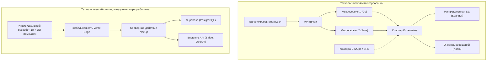

# Введение: Стратегия борьбы "неимущего", бросающего вызов гигантам

В истории разработки программного обеспечения наступила эпоха, беспрецедентно благоприятная для индивидуальных разработчиков (инди-разработчиков). Демократизация облачной инфраструктуры, такой как AWS и GCP, рост популярности BaaS (Backend as a Service), включая Vercel и Supabase, и, прежде всего, автоматизация написания кода благодаря эволюции LLM (больших языковых моделей) — все это создало почву, на которой отдельный человек может на равных конкурировать с "гигантами", крупными технологическими корпорациями.

Однако то, что технические ресурсы стали общедоступными, не означает, что можно победить, используя стратегии крупных корпораций. В капитале, маркетинговых возможностях и силе бренда одиночки находятся в крайне невыгодном положении. Чтобы выжить и победить, индивидуальному разработчику необходима собственная «стратегия выживания».

В этой статье будет подробно рассмотрен технический и стратегический подход, позволяющий индивидуальному разработчику запустить микро-SaaS (Micro-SaaS) и вести бизнес на мировом рынке, с привлечением проектирования архитектуры, экономики и математических моделей.

---

# 1. Теория длинного хвоста и математика нишевых рынков

Крупные компании нацеливаются на массовые рынки с огромным TAM (Total Addressable Market: общий объем целевого рынка). Чтобы окупить высокие постоянные издержки (зарплаты, аренда офисов, расходы на рекламу), им нужны миллионы пользователей и миллиарды иен дохода.

Сильная сторона индивидуальных разработчиков, напротив, заключается в **«экстремально низкой точке безубыточности»**. Если прибыль составляет несколько сотен тысяч иен в месяц, для одного человека это вполне состоявшийся бизнес. Именно здесь находится "золотая середина" теории длинного хвоста.

## [Закон Ципфа](https://kenji.blog/ru/p/zipfs-law/) ([Zipf's Law](https://kenji.blog/ru/p/zipfs-law/)) и распределение рынка

Отношение между размером рынка и их количеством часто подчиняется закону Ципфа или закону Парето. Если ранг рынка равен $k$, а его размер (потенциал продаж) — $P(k)$, это можно выразить с помощью следующей степенной модели:

$$ P(k) \propto \frac{1}{k^\alpha} $$

Где $\alpha$ — параметр, определяющий форму распределения (обычно $\alpha \approx 1$).

Крупные компании ведут кровавые битвы в алом океане за гигантские рынки (голова распределения), где $k=1, 2, 3$. С другой стороны, нишевые рынки (хвост), где $k \ge 100$, являются для них «рынками, вход на которые принесет только убытки», и поэтому фактически становятся голубыми океанами, где нет конкурентов.

```mermaid
xychart-beta
    title Распределение размера рынка и цель индивидуального разработчика
  x-axis ["Масс-маркет A", "Масс-маркет B", "Ниша C", "Ниша D", "Ниша E", "Ниша F", "Ниша G"]
  y-axis "Стоимость рынка" 0 --> 100
  bar [95, 60, 20, 10, 5, 3, 2]
  line [95, 60, 20, 10, 5, 3, 2]
```

Индивидуальные разработчики должны целенаправленно ориентироваться на узкоспециализированные проблемы (например, инструменты автоматизации рабочих процессов для конкретной отрасли или гиковские аналитические инструменты, объединяющие определенные API). Чем более нишевым является продукт, тем легче достичь целевой аудитории, и тем ниже становится CAC (стоимость привлечения клиента).

---

# 2. Проектирование архитектуры для создания невероятной гибкости

Системы крупных компаний проектируются с приоритетом на «стабильность» и «масштабируемость», поэтому в них используются Kubernetes и микросервисная архитектура. Однако, если индивидуальный разработчик попытается сделать то же самое, его ресурсы иссякнут только на поддержке инфраструктуры (Ops).

Девиз технологического стека индивидуального разработчика — **«No-Ops» (Ноль операций)**. Нужно максимально использовать бессерверную архитектуру (Serverless) и сосредоточиться исключительно на написании бизнес-логики.

## Сравнение архитектуры: Крупные компании против Индивидуальных разработчиков



В стеке крупных компаний добавление новой функции требует координации между несколькими командами и настройки конвейера развертывания DevOps. С другой стороны, в стеке одиночки (например, Next.js + Supabase + Vercel) один `git push` развертывает приложение в глобальной Edge-сети, а подготовка базы данных вообще не требуется.

## Использование бессерверных технологий и Edge Computing

Используя Edge-среды выполнения, такие как Vercel или Cloudflare Workers, можно устранить задержки при холодном старте и предоставлять API с низкой задержкой пользователям по всему миру.

```typescript
// app/api/hello/route.ts (Next.js Edge API Route)
import { NextResponse } from 'next/server';

export const runtime = 'edge';

export async function GET(request: Request) {
  const { searchParams } = new URL(request.url);
  const name = searchParams.get('name') || 'World';
  
  // Edge runtime executes in milliseconds globally
  return NextResponse.json({
    message: `Hello, ${name}!`,
    timestamp: Date.now()
  });
}
```

---

# 3. «Предельная продуктивность» за счет использования AI API

Такие функции, как «обработка естественного языка», «генерация изображений» и «рекомендации», для которых раньше требовалась команда инженеров по машинному обучению и дата-саентистов, теперь можно реализовать одним вызовом API.

Интегрировав API от OpenAI (GPT-4o) или Anthropic (Claude 3.5 Sonnet) в свой Micro-SaaS, даже один человек может мгновенно запустить «AI-нативный» продукт.

## Реализация потоковой передачи с помощью Vercel AI SDK

В продуктах, использующих ИИ, ключом к пользовательскому опыту (UX) является «потоковый ответ». Используя Vercel AI SDK, этого можно достичь с помощью нескольких строк кода.

```typescript
// app/api/chat/route.ts
import { openai } from '@ai-sdk/openai';
import { streamText } from 'ai';

// Установка максимального времени выполнения в бессерверной среде
export const maxDuration = 30; 

export async function POST(req: Request) {
  const { messages } = await req.json();

  const result = await streamText({
    model: openai('gpt-4o-mini'),
    messages,
    system: "Вы — отличный SaaS-ассистент. Пожалуйста, точно решайте проблемы пользователей.",
  });

  return result.toDataStreamResponse();
}
```

Благодаря такой реализации индивидуальные разработчики могут предоставлять продвинутые функции ИИ, не задумываясь о сложности инфраструктуры. Более того, использование редакторов кода с ИИ, таких как GitHub Copilot и Cursor, увеличивает саму скорость разработки в 5–10 раз по сравнению с традиционными методами.

---

# 4. Математика коммуникационных издержек

Почему индивидуальный разработчик может выпускать новые функции быстрее, чем крупная компания? Главная причина в том, что «коммуникационные издержки равны нулю».

Согласно закону Брукса (Brooks's Law), известному по классической книге по программной инженерии «Мифический человеко-месяц», количество каналов связи $C$ в проекте растет по отношению к количеству разработчиков $n$ следующим образом:

$$ C = \frac{n(n - 1)}{2} $$

В крупной компании, когда команда из $n=10$ человек разрабатывает функцию, количество каналов связи достигает $C = 45$, и огромное количество времени тратится на согласование спецификаций, встречи и ревью кода.
Однако в случае индивидуального разработчика ($n=1$) количество каналов $C = 0$.

**Поскольку в процессе перевода мыслей в код нет узких мест**, идею, пришедшую в голову утром, можно развернуть в рабочей среде уже к вечеру того же дня. Это величайшее оружие индивидуального разработчика, которое крупная компания не сможет повторить, сколько бы денег она ни вложила.

---

# 5. Глобальное расширение и интеграция платежной инфраструктуры

Для микро-SaaS, конкурирующего на мировом рынке, создание платежной инфраструктуры (Payment Gateway) является обязательным. Используя Stripe, можно полностью автоматизировать платежи в валютах всего мира, управление подписками и даже обработку налогов (Stripe Tax).

## Надежное управление подписками с помощью Stripe Webhook

Давайте рассмотрим модель безопасной синхронизации статуса платежа, объединяющую Next.js App Router и Stripe Webhook.

```typescript
// app/api/webhooks/stripe/route.ts
import { headers } from 'next/headers';
import { NextResponse } from 'next/server';
import Stripe from 'stripe';
import { db } from '@/db';
import { users } from '@/db/schema';
import { eq } from 'drizzle-orm';

const stripe = new Stripe(process.env.STRIPE_SECRET_KEY!, {
  apiVersion: '2023-10-16',
});

export async function POST(req: Request) {
  const body = await req.text();
  const signature = headers().get('Stripe-Signature') as string;

  let event: Stripe.Event;

  try {
    event = stripe.webhooks.constructEvent(
      body,
      signature,
      process.env.STRIPE_WEBHOOK_SECRET!
    );
  } catch (error: any) {
    return new NextResponse(`Webhook Error: ${error.message}`, { status: 400 });
  }

  // Обработка при обновлении подписки
  if (event.type === 'customer.subscription.updated') {
    const subscription = event.data.object as Stripe.Subscription;
    const customerId = subscription.customer as string;
    
    // Обновление статуса в БД
    await db.update(users)
      .set({ subscriptionStatus: subscription.status })
      .where(eq(users.stripeCustomerId, customerId));
  }

  return new NextResponse('OK', { status: 200 });
}
```

С помощью этих нескольких строк кода можно мгновенно обрабатывать платежи по кредитным картам от пользователей на другом конце света и автоматизировать предоставление услуг.

---

# 6. Избежание привязки к инфраструктуре и переносимость

В стратегии интенсивного использования BaaS и управляемых сервисов всегда обсуждается риск "привязки к поставщику" (Vendor Lock-in). Например, если слишком сильно зависеть от Firebase Firestore, то позже будет крайне сложно перейти на RDB (реляционную базу данных).

Оптимальным решением в качестве стратегии выживания является подход: **«Привязаться к инфраструктуре, но сохранить переносимость данных и бизнес-логики»**.

## Абстрагирование уровня данных с помощью ORM

Стандартная практика заключается в использовании управляемых сервисов баз данных, таких как Supabase (PostgreSQL) или PlanetScale (MySQL), при этом вместо прямого выполнения SQL-запросов или использования специфичных BaaS SDK в коде приложения применяется слой абстракции, например Prisma или Drizzle ORM.

```typescript
// db/schema.ts (Drizzle ORM)
import { pgTable, serial, text, timestamp, varchar } from 'drizzle-orm/pg-core';

export const users = pgTable('users', {
  id: serial('id').primaryKey(),
  email: varchar('email', { length: 255 }).notNull().unique(),
  stripeCustomerId: varchar('stripe_customer_id', { length: 255 }),
  subscriptionStatus: varchar('subscription_status', { length: 50 }),
  createdAt: timestamp('created_at').defaultNow(),
});

// app/actions/user.ts
import { db } from '@/db';
import { users } from '@/db/schema';
import { eq } from 'drizzle-orm';

export async function getUserByEmail(email: string) {
  const result = await db.select().from(users).where(eq(users.email, email));
  return result[0];
}
```

Оставаясь в рамках стандартной экосистемы PostgreSQL, даже если цены Supabase внезапно взлетят, вы сможете мигрировать на AWS RDS, Render или собственный сервер PostgreSQL практически без переписывания кода.

---

# 7. Программное SEO и контент, сгенерированный ИИ

Самым сильным оружием для индивидуальных разработчиков, не имеющих маркетингового бюджета, является «SEO (поисковая оптимизация)». В последние годы большое внимание привлекает «программное SEO» (Programmatic SEO), при котором база данных компании комбинируется с LLM для динамической генерации тысяч и десятков тысяч посадочных страниц.

Распределение трафика также подчиняется степенному закону. Вместо того чтобы ориентироваться на конкретные высокочастотные ключевые слова, следует массово охватывать «ключевые слова длинного хвоста» с небольшим объемом поиска, но высокой конверсией, тем самым повышая общую посещаемость.

$$ Traffic_{Total} = \int_{x_{min}}^{x_{max}} T(x) dx $$

Даже если трафик $T(x)$ по нишевому ключевому слову $x$ невелик, интегрирование создает огромный общий трафик. Используя динамическую маршрутизацию Next.js и SSG/ISR, можно доставлять эти страницы с высокой скоростью.

---

# 8. Юнит-экономика и формула прибыли

Наконец, давайте рассмотрим математическую модель, необходимую для того, чтобы Micro-SaaS стал успешным бизнесом. Базовое уравнение SaaS-бизнеса выглядит следующим образом:

$$ Profit = \sum_{i=1}^{U} (LTV_i - CAC_i) - Fixed Costs $$

- **$U$**: Количество привлеченных пользователей
- **$LTV$ (Life Time Value)**: Пожизненная ценность клиента. $LTV = \frac{ARPU}{Churn Rate}$ (где ARPU — средний ежемесячный доход с пользователя, а Churn Rate — показатель оттока)
- **$CAC$ (Customer Acquisition Cost)**: Стоимость привлечения клиента
- **$Fixed Costs$**: Постоянные издержки (стоимость серверов, инструментов и т. д.)

Для индивидуальных разработчиков сильной стороной является то, что **$Fixed Costs$ (Постоянные издержки) близки к нулю**. Даже с учетом тарифного плана Pro от Vercel ($20/мес.), плана Pro от Supabase ($25/мес.) и расходов на API ИИ, общая сумма составит всего от 10 000 до нескольких десятков тысяч иен в месяц. Самое большое преимущество — это возможность исключить собственные затраты на оплату труда из постоянных издержек (или покрыть их за счет прибыли).

### Бизнес с нулевыми предельными издержками

Для программного обеспечения, особенно SaaS, предельные издержки (Marginal Cost) при добавлении одного нового пользователя практически равны нулю. Если $CAC$ можно минимизировать за счет автоматизации привлечения пользователей (SEO, публикации в соцсетях, виральные циклы и т. д.), большая часть выручки становится чистой валовой прибылью.

Если вы создадите нишевый B2B-инструмент стоимостью $15 в месяц, а Churn Rate составит 5%, то:
$$ LTV = \frac{\$15}{0.05} = \$300 $$

Если с помощью SEO и контент-маркетинга вы сможете удерживать CAC на уровне $10, вы будете получать $290 прибыли (валовой прибыли) за каждого привлеченного пользователя. Если вы сможете охватить пользователей с нишевыми проблемами по всему миру, например, 1000 человек, вы создадите Micro-SaaS, генерирующий регулярный доход в размере $15 000 (около 2 миллионов иен и более) в месяц.

---

# Заключение: Скорость и специализация на нишах — это сильнейший щит и меч

Стратегия выживания индивидуального разработчика для борьбы с крупными компаниями и конкурентами по всему миру сводится к следующим трем пунктам:

1. **Выбирать поле битвы (Теория длинного хвоста)**
   - Ориентироваться на нишевые рынки, куда не могут войти крупные компании, с небольшими, но глубокими болями (потребностями) клиентов.
2. **Использовать технологические рычаги (Serverless, BaaS, AI)**
   - Полностью передать операции (Ops) на аутсорс и писать только код (бизнес-логику) для решения проблем клиентов, а не для поддержки инфраструктуры.
3. **Максимизировать гибкость (Ноль коммуникационных издержек)**
   - Использовать главное оружие индивидуальной разработки — «скорость»: немедленно развертывать идеи, как только они приходят в голову, и максимально быстро получать обратную связь от рынка.

Сейчас мы живем в эпоху с самым большим рычагом влияния в истории. Имея только клавиатуру, интернет и энтузиазм решать проблемы, вы можете создавать продукты, которые радуют пользователей по всему миру, и на равных конкурировать с огромными корпорациями прямо из своей маленькой комнаты.

Итак, открывайте редактор и инициализируйте новый проект.

```bash
npx create-next-app@latest my-micro-saas
```

Битва уже началась.


