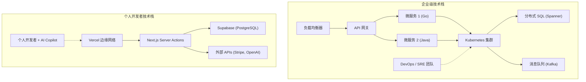

# 导言：向巨人们挑战的“无产者”战斗方式

在软件开发的历史上，个人开发者（独立开发者）从未迎来过如此有利的时代。AWS和GCP等云基础设施的民主化、以Vercel和Supabase为首的BaaS（后端即服务）的崛起，以及最重要的——大语言模型（LLM）进化带来的编码自动化。这一切，为个人与被称为“巨人”的大型科技企业正面对决创造了土壤。

然而，即使技术资源变得扁平化，也不意味着采用与大企业相同的战略就能获胜。在资本、营销和品牌力方面，个人处于绝对的劣势。个人开发者要想生存并获胜，独特的“生存战略”是不可或缺的。

本文将结合架构设计、经济学以及数学模型，全面彻底地解析个人开发者如何建立微型SaaS（Micro-SaaS），并向全球开展业务的技术与战略方法。

---

# 1. 长尾理论与利基市场的数学模型

大企业瞄准的是TAM（Total Addressable Market：潜在总目标市场规模）巨大的大众市场。为了收回高昂的固定成本（人力成本、办公场地费、广告费），他们需要数百万的用户和数十亿日元的营收。

相比之下，个人开发者的优势在于 **“盈亏平衡点极低”** 。即使每月只有几十万日元的利润，对个人来说也足以成为一项可行的事业。这里正是“长尾理论”的最佳击球点。

## 齐夫定律（Zipf's Law）与市场分布

市场规模与数量之间的关系通常遵循齐夫定律或帕累托法则。如果将市场的排名设为 $k$，其市场规模（营收潜力）设为 $P(k)$，则可以用如下的幂律（Power Law）模型来表示。

$$ P(k) \propto \frac{1}{k^\alpha} $$

在这里，$\alpha$ 是决定分布形状的参数（通常 $\alpha \approx 1$）。

大企业为了争夺 $k=1, 2, 3$ 这样的巨大市场（头部），而在血流成河的红海中厮杀。另一方面，像 $k \ge 100$ 这样的利基市场（尾部），对大企业来说是“一旦进入就会亏损的市场”，因此实质上成为了没有竞争对手的蓝海。

```mermaid
xychart-beta
    title 市场规模分布与个人开发者目标
  x-axis ["大众 A", "大众 B", "利基 C", "利基 D", "利基 E", "利基 F", "利基 G"]
  y-axis "市场价值" 0 --> 100
  bar [95, 60, 20, 10, 5, 3, 2]
  line [95, 60, 20, 10, 5, 3, 2]
```

个人开发者应当特意去瞄准那些极其细分、垂直的痛点（例如针对特定行业的自动化工作流工具，或结合了特定API的硬核分析工具等）。市场越是利基，接触目标用户就越容易，CAC（获客成本）也会随之降低。

---

# 2. 创造压倒性敏捷度的架构设计

大企业的系统设计将“稳定性”和“可扩展性”放在首位，因此会采用Kubernetes和微服务架构。但如果个人开发者效仿这种做法，光是基础设施的维护管理（Ops）就会耗尽资源。

个人开发者的技术栈口号是 **"No-Ops"（零运维）** 。将无服务器（Serverless）架构利用到极致，从而能够专注于编写业务逻辑。

## 大企业 vs 个人开发者的架构对比



在大企业的技术栈中，新增一项功能需要多个团队之间的协调以及DevOps部署流水线的配置。而在个人的技术栈（例如：Next.js + Supabase + Vercel）中，只需一个 `git push` 就能部署到全球边缘网络，数据库也不需要手动预配。

## 活用无服务器与边缘计算

通过使用像Vercel或Cloudflare Workers这样的边缘运行时，可以消除冷启动的延迟，并向全球用户提供低延迟的API。

```typescript
// app/api/hello/route.ts (Next.js Edge API Route)
import { NextResponse } from 'next/server';

export const runtime = 'edge';

export async function GET(request: Request) {
  const { searchParams } = new URL(request.url);
  const name = searchParams.get('name') || 'World';
  
  // Edge runtime executes in milliseconds globally
  return NextResponse.json({
    message: `Hello, ${name}!`,
    timestamp: Date.now()
  });
}
```

---

# 3. 运用AI API实现“极致生产力”

曾经需要机器学习工程师和数据科学家团队才能实现的“自然语言处理”、“图像生成”、“推荐系统”等功能，现在只需调用一次API即可实现。

通过将OpenAI (GPT-4o) 或 Anthropic (Claude 3.5 Sonnet) 的API整合到自己的Micro-SaaS中，个人也能立刻推出“AI原生”的产品。

## 使用Vercel AI SDK实现流式响应

在使用AI的产品中，决定用户体验（UX）的关键是“流式响应”。如果使用Vercel AI SDK，只需几行代码即可实现这一点。

```typescript
// app/api/chat/route.ts
import { openai } from '@ai-sdk/openai';
import { streamText } from 'ai';

// 设置无服务器环境下的最大执行时间
export const maxDuration = 30; 

export async function POST(req: Request) {
  const { messages } = await req.json();

  const result = await streamText({
    model: openai('gpt-4o-mini'),
    messages,
    system: "你是优秀的SaaS助手。请准确解决用户的问题。",
  });

  return result.toDataStreamResponse();
}
```

凭借这样的实现方式，个人开发者可以无需在意基础设施的复杂性，提供高级的AI功能。此外，通过利用GitHub Copilot或Cursor等AI编码编辑器，开发速度本身也比以往跃升了5到10倍。

---

# 4. 沟通开销的数学原理

为什么个人开发者能比大企业更快地发布功能呢？其最大原因在于“沟通开销为零”。

根据以软件工程经典著作《人月神话》（The Mythical Man-Month）而闻名的布鲁克斯法则（Brooks's Law），项目内的沟通渠道数 $C$ 相对于开发者人数 $n$ 会按以下公式增加：

$$ C = \frac{n(n - 1)}{2} $$

在大企业中，当一个 $n=10$ 的团队进行功能开发时，沟通渠道数将达到 $C = 45$，在需求规格对齐、开会以及代码审查上会耗费大量的时间。
然而，在个人开发者（$n=1$）的情况下，渠道数 $C = 0$。

**因为从思考到代码的转换过程中不存在瓶颈** ，所以早上想到的点子，当天傍晚就有可能部署到生产环境中。这是大企业投入再多资金也无法模仿的、个人开发者的最强武器。

---

# 5. 全球化扩张与支付基础设施的集成

对于放眼全球竞争的微型SaaS来说，构建支付基础设施（Payment Gateway）是必不可少的。通过活用Stripe，可以完全自动化地处理全球各种货币的结算、订阅管理甚至是税务处理（Stripe Tax）。

## 使用Stripe Webhook实现稳健的订阅管理

让我们来看一个结合Next.js App Router和Stripe Webhook的安全同步支付状态的模型。

```typescript
// app/api/webhooks/stripe/route.ts
import { headers } from 'next/headers';
import { NextResponse } from 'next/server';
import Stripe from 'stripe';
import { db } from '@/db';
import { users } from '@/db/schema';
import { eq } from 'drizzle-orm';

const stripe = new Stripe(process.env.STRIPE_SECRET_KEY!, {
  apiVersion: '2023-10-16',
});

export async function POST(req: Request) {
  const body = await req.text();
  const signature = headers().get('Stripe-Signature') as string;

  let event: Stripe.Event;

  try {
    event = stripe.webhooks.constructEvent(
      body,
      signature,
      process.env.STRIPE_WEBHOOK_SECRET!
    );
  } catch (error: any) {
    return new NextResponse(`Webhook Error: ${error.message}`, { status: 400 });
  }

  // 订阅更新时的处理
  if (event.type === 'customer.subscription.updated') {
    const subscription = event.data.object as Stripe.Subscription;
    const customerId = subscription.customer as string;
    
    // 更新DB的状态
    await db.update(users)
      .set({ subscriptionStatus: subscription.status })
      .where(eq(users.stripeCustomerId, customerId));
  }

  return new NextResponse('OK', { status: 200 });
}
```

仅用这几十行代码，就能即时处理来自地球另一端用户的信用卡支付，并实现服务的自动交付。

---

# 6. 避免基础设施锁定与保持可移植性

在大量使用BaaS和托管服务的战略中，“供应商锁定”的风险总是备受争议。例如，如果过度依赖Firebase的Firestore，日后要想迁移到RDB（关系型数据库）就会变得极其困难。

作为生存战略的最优解，是 **“接受基础设施的锁定，但保持数据与业务逻辑的可移植性”** 这一方法。

## 使用ORM抽象数据层

在数据库方面可以利用Supabase（PostgreSQL）或PlanetScale（MySQL）等托管服务，但切忌在应用代码中直接编写SQL或调用特定的BaaS SDK，标准的做法是引入一层像Prisma或Drizzle ORM这样的抽象层。

```typescript
// db/schema.ts (Drizzle ORM)
import { pgTable, serial, text, timestamp, varchar } from 'drizzle-orm/pg-core';

export const users = pgTable('users', {
  id: serial('id').primaryKey(),
  email: varchar('email', { length: 255 }).notNull().unique(),
  stripeCustomerId: varchar('stripe_customer_id', { length: 255 }),
  subscriptionStatus: varchar('subscription_status', { length: 50 }),
  createdAt: timestamp('created_at').defaultNow(),
});

// app/actions/user.ts
import { db } from '@/db';
import { users } from '@/db/schema';
import { eq } from 'drizzle-orm';

export async function getUserByEmail(email: string) {
  const result = await db.select().from(users).where(eq(users.email, email));
  return result[0];
}
```

只要像这样搭乘标准的PostgreSQL生态系统，万一Supabase的资费暴涨，也能几乎不改写任何代码，顺利迁移到AWS RDS、Render或自建服务器的PostgreSQL上。

---

# 7. 编程化SEO与AI生成内容

对于没有营销预算的个人开发者而言，最强有力的武器就是“SEO（搜索引擎优化）”。近年来，结合自家数据库和LLM、动态生成数以千计乃至万计的着陆页（Landing Page）的“编程化SEO（Programmatic SEO）”正备受瞩目。

流量的分布同样遵循幂律。不再一味死磕某些大词（Big Keywords），而是大量覆盖搜索量虽小但转化率极高的“长尾关键词”，从而拉高整体的访问量。

$$ Traffic_{Total} = \int_{x_{min}}^{x_{max}} T(x) dx $$

虽然针对利基关键词 $x$ 的流量 $T(x)$ 很小，但通过积分累加起来，就能创造出巨大的总流量。如果使用Next.js的动态路由以及SSG/ISR，就能高速地分发这些页面。

---

# 8. 单位经济学（Unit Economics）与利润公式

最后，我们来确认一下能让Micro-SaaS作为一门生意立足的数学模型。SaaS业务的基本方程式如下：

$$ Profit = \sum_{i=1}^{U} (LTV_i - CAC_i) - Fixed Costs $$

- **$U$**: 获客数
- **$LTV$ (Life Time Value)**: 客户终身价值。 $LTV = \frac{ARPU}{Churn Rate}$ (ARPU为每个用户的平均月客单价，Churn Rate为流失率)
- **$CAC$ (Customer Acquisition Cost)**: 获客成本
- **$Fixed Costs$**: 固定成本（服务器费用、工具费用等）

对于个人开发者来说，其优势就在于 **$Fixed Costs$ 无限接近于零** 。即使把Vercel的Pro计划（$20/月）、Supabase的Pro计划（$25/月），以及其他AI的API使用费全部加起来，每月也只在1万到几万日元之间。能够将自己的人力成本从固定成本中剔除（或从利润中收回），这是最大的优势。

### 边际成本为零的生意

软件，尤其是SaaS，每增加1名用户时的边际成本（Marginal Cost）几乎为零。如果能通过用户获取的自动化（SEO、社交媒体分发、病毒式循环等）将 $CAC$ 极小化，那么营收的绝大部分就会直接转化为毛利。

假设你开发了一款月费 $15 的利基B2B工具，流失率（Churn Rate）为 5%，那么
$$ LTV = \frac{\$15}{0.05} = \$300 $$

如果通过SEO和内容营销能将CAC控制在 $10，那么每获得一个用户就会产生 $290 的利润（毛利）。只要将这个工具带给全世界面临这一小众痛点的用户，比方说 1,000 人，就能打造出一个每月产生 $15,000 （约200万日元以上）被动收入的微型SaaS。

---

# 结论：速度与专注利基才是最强的盾与矛

个人开发者抗衡大企业及全球竞争对手的生存战略，可以归结为以下3点：

1. **选择战场（长尾理论）**
   - 瞄准大企业无法涉足、规模虽小但痛点极深的利基市场。
2. **利用技术杠杆（无服务器・BaaS・AI）**
   - 将运维（Ops）完全外包，不写基础设施相关的代码，只编写解决客户痛点的代码（业务逻辑）。
3. **敏捷度最大化（沟通成本・零）**
   - 充分发挥个人开发者的最强武器——“速度”，一想到点子就立刻部署，以最快速度完成市场反馈的迭代。

我们正生活在历史上杠杆效应最强的时代。只要拥有键盘、互联网，以及解决问题的热情，即便是身处个人的小房间，也能创造出让全世界用户喜悦的产品，并与科技巨头们一较高下。

那么，打开编辑器，初始化你的新项目吧。

```bash
npx create-next-app@latest my-micro-saas
```

战斗，已经打响了。


