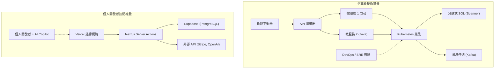

# 緒論：挑戰巨人的「無產者」戰鬥方式

在軟體開發的歷史上，個人開發者（獨立開發者）迎來了前所未有的有利時代。AWS和GCP等雲端基礎設施的民主化，Vercel和Supabase等BaaS（Backend as a [Service](https://kenji.blog/zh-tw/p/kubernetes-k8s-architecture-pod-service-ingress/)）的崛起，最重要的是LLM（大型語言模型）的進化帶來的程式碼自動化。這一切為個人創造了能夠與作為「巨人」的大型科技企業正面對決的土壤。

然而，即使技術資源變得扁平化，採用與大企業相同的戰略也未必能獲勝。在資本、行銷和品牌影響力方面，個人處於絕對的劣勢。個人開發者若要生存並取得勝利，獨特的「生存戰略」是不可或缺的。

本文將結合架構設計、經濟學以及數學模型，深入探討個人開發者如何創立微型SaaS（Micro-SaaS），並向全球拓展業務的技術與戰略方法。

---

# 1. 長尾理論與利基市場的數學模型

大企業瞄準的是TAM（Total Addressable Market：總潛在市場規模）巨大的大眾市場。為了回收高昂的固定成本（人事費、辦公室租金、廣告費），他們需要數百萬用戶和數十億日圓的營收。

相比之下，個人開發者的優勢在於 **「損益兩平點極低」** 。只要每月能產生數十萬日圓的利潤，對個人而言就足以成為一項事業。這裡正是「長尾理論」的絕佳機會所在。

## 齊夫定律（[Zipf's Law](https://kenji.blog/zh-tw/p/zipfs-law/)）與市場分佈

市場規模與數量的關係，通常遵循齊夫定律或帕雷托法則。假設市場排名為 $k$，該市場規模（營收潛力）為 $P(k)$，則可以用以下的冪律（Power Law）模型來表示。

$$ P(k) \propto \frac{1}{k^\alpha} $$

這裡的 $\alpha$ 是決定分佈形狀的參數（一般來說 $\alpha \approx 1$）。

大企業為了爭奪 $k=1, 2, 3$ 這樣的巨大市場（頭部），而在血流成河的紅海中廝殺。另一方面，像是 $k \ge 100$ 這樣的利基市場（長尾），對大企業來說是「只要進入就會虧損的市場」，因此實際上成為了沒有競爭對手的藍海。

```mermaid
xychart-beta
    title 市場規模分佈與個人開發者目標
  x-axis ["大眾市場 A", "大眾市場 B", "利基市場 C", "利基市場 D", "利基市場 E", "利基市場 F", "利基市場 G"]
  y-axis "Market Value" 0 --> 100
  bar [95, 60, 20, 10, 5, 3, 2]
  line [95, 60, 20, 10, 5, 3, 2]
```

個人開發者應該刻意瞄準利基且特定的問題（例如針對特定行業的工作流程自動化工具，或是結合特定API的專業分析工具等）。市場越利基，觸及目標用戶就越容易，CAC（客戶獲取成本）也會隨之降低。

---

# 2. 創造壓倒性敏捷力的架構設計

由於大企業的系統將「穩定性」與「可擴展性」放在首位，因此通常會採用[Kubernetes](https://kenji.blog/zh-tw/p/kubernetes-k8s-architecture-pod-service-ingress/)和微服務架構。然而，如果個人開發者也做同樣的事，光是基礎設施的維護管理（Ops）就會耗盡所有資源。

個人開發者技術堆疊的口號是 **"No-Ops"（零運營）** 。將無伺服器架構發揮到極致，專注於撰寫業務邏輯即可。

## 大企業 vs 個人開發者的架構比較



在大企業的技術堆疊中，為了增加新功能，需要跨團隊協調以及建置DevOps部署管線。另一方面，在個人的技術堆疊（例如：Next.js + Supabase + Vercel）中，只需執行 `git push` 就能部署到全球邊緣網路，連資料庫的配置也不需要。

## 善用無伺服器與邊緣運算

透過使用Vercel或Cloudflare Workers等邊緣執行環境，可以消除冷啟動的延遲，並為全球用戶提供低延遲的API。

```typescript
// app/api/hello/route.ts (Next.js Edge API Route)
import { NextResponse } from 'next/server';

export const runtime = 'edge';

export async function GET(request: Request) {
  const { searchParams } = new URL(request.url);
  const name = searchParams.get('name') || 'World';
  
  // 邊緣執行環境在全球範圍內於毫秒級執行
  return NextResponse.json({
    message: `Hello, ${name}!`,
    timestamp: Date.now()
  });
}
```

---

# 3. 運用 AI API 實現的「極限生產力」

過去需要機器學習工程師和資料科學家團隊才能實現的「自然語言處理」、「圖像生成」、「推薦系統」等功能，現在只需呼叫一次API即可實現。

透過將 OpenAI (GPT-4o) 或 Anthropic (Claude 3.5 Sonnet) 的API整合到自己的Micro-SaaS中，即使是個人也能立刻推出「AI 原生（AI-native）」的產品。

## 使用 Vercel AI SDK 實作串流回應

在應用AI的產品中，用戶體驗（UX）的關鍵在於「串流回應」。只要使用 Vercel AI SDK，只需幾行程式碼就能實現這個功能。

```typescript
// app/api/chat/route.ts
import { openai } from '@ai-sdk/openai';
import { streamText } from 'ai';

// 設定在無伺服器環境中的最大執行時間
export const maxDuration = 30; 

export async function POST(req: Request) {
  const { messages } = await req.json();

  const result = await streamText({
    model: openai('gpt-4o-mini'),
    messages,
    system: "你是優秀的SaaS助理。請準確解決用戶的問題。",
  });

  return result.toDataStreamResponse();
}
```

透過這樣的實作，個人開發者無需在意基礎設施的複雜性，即可提供進階的AI功能。此外，藉助 GitHub Copilot 或 Cursor 等AI程式碼編輯器，開發速度本身也比以往飆升了 5 到 10 倍。

---

# 4. 溝通成本的數學模型

為什麼個人開發者能夠比大企業更快地發布功能？最大的原因在於「溝通成本為零」。

根據軟體工程經典著作《人月神話（The Mythical Man-Month）》中著名的布魯克斯法則（Brooks's Law），專案內的溝通管道數量 $C$，相對於開發者數量 $n$，會呈現以下增長：

$$ C = \frac{n(n - 1)}{2} $$

在大企業中，如果一個 $n=10$ 的團隊進行功能開發，溝通管道數量將達到 $C = 45$，團隊將花費大量時間在規格協調、會議和程式碼審查上。
然而，在個人開發者（$n=1$）的情況下，溝通管道數量 $C = 0$。

**從思考轉化為程式碼的過程中不存在瓶頸** ，所以早上想到的點子，在當天傍晚就能部署到正式環境。這是大企業投入再多資金也無法模仿的，個人開發者最大的武器。

---

# 5. 全球化佈局與支付基礎設施整合

對於要與全球競爭的微型SaaS來說，建構支付基礎設施（Payment Gateway）是不可或缺的。透過活用 Stripe，您可以完全自動化處理全球貨幣的支付、訂閱管理，甚至稅務處理（Stripe Tax）。

## 使用 Stripe Webhook 實現強健的訂閱管理

讓我們來看看結合 Next.js App Router 與 Stripe Webhook 的安全支付狀態同步模型。

```typescript
// app/api/webhooks/stripe/route.ts
import { headers } from 'next/headers';
import { NextResponse } from 'next/server';
import Stripe from 'stripe';
import { db } from '@/db';
import { users } from '@/db/schema';
import { eq } from 'drizzle-orm';

const stripe = new Stripe(process.env.STRIPE_SECRET_KEY!, {
  apiVersion: '2023-10-16',
});

export async function POST(req: Request) {
  const body = await req.text();
  const signature = headers().get('Stripe-Signature') as string;

  let event: Stripe.Event;

  try {
    event = stripe.webhooks.constructEvent(
      body,
      signature,
      process.env.STRIPE_WEBHOOK_SECRET!
    );
  } catch (error: any) {
    return new NextResponse(`Webhook Error: ${error.message}`, { status: 400 });
  }

  // 更新訂閱時的處理
  if (event.type === 'customer.subscription.updated') {
    const subscription = event.data.object as Stripe.Subscription;
    const customerId = subscription.customer as string;
    
    // 更新資料庫中的狀態
    await db.update(users)
      .set({ subscriptionStatus: subscription.status })
      .where(eq(users.stripeCustomerId, customerId));
  }

  return new NextResponse('OK', { status: 200 });
}
```

透過這幾行程式碼，您就能即時處理來自地球另一端用戶的信用卡支付，並自動化提供服務。

---

# 6. 避免基礎設施綁定與保持可攜性

在大量依賴BaaS和託管服務的戰略中，經常被討論的風險就是「供應商綁定（Vendor [Lock](https://kenji.blog/zh-tw/p/rdbms-transaction-acid-isolation-level-lock/)-in）」。例如，如果過度依賴 Firebase 的 Firestore，日後想要轉移到 RDB（關聯式資料庫）將會非常困難。

作為生存戰略的最佳解答是， **「雖然會被基礎設施綁定，但確保資料和業務邏輯保持可攜性」** 的做法。

## 透過 ORM 實現資料層抽象化

在資料庫方面，可以利用 Supabase（PostgreSQL）或 PlanetScale（MySQL）等託管服務，但在應用程式碼中不應直接撰寫 SQL 或呼叫特定的 BaaS SDK，而是加入如 Prisma 或 Drizzle ORM 等抽象層，這是標準做法。

```typescript
// db/schema.ts (Drizzle ORM)
import { pgTable, serial, text, timestamp, varchar } from 'drizzle-orm/pg-core';

export const users = pgTable('users', {
  id: serial('id').primaryKey(),
  email: varchar('email', { length: 255 }).notNull().unique(),
  stripeCustomerId: varchar('stripe_customer_id', { length: 255 }),
  subscriptionStatus: varchar('subscription_status', { length: 50 }),
  createdAt: timestamp('created_at').defaultNow(),
});

// app/actions/user.ts
import { db } from '@/db';
import { users } from '@/db/schema';
import { eq } from 'drizzle-orm';

export async function getUserByEmail(email: string) {
  const result = await db.select().from(users).where(eq(users.email, email));
  return result[0];
}
```

只要這樣採用標準的 PostgreSQL 生態系統，萬一 Supabase 的費用暴漲，也能在幾乎不修改程式碼的情況下，無縫轉移到 AWS RDS、Render，甚至是自建伺服器的 PostgreSQL 上。

---

# 7. 程式化 SEO 與 AI 生成內容

對於沒有行銷預算的個人開發者來說，戰鬥的最強武器就是「SEO（搜尋引擎最佳化）」。近年來，結合自家資料庫與 LLM 來動態生成數千至數萬個落地頁的「程式化 SEO（Programmatic SEO）」備受矚目。

流量的分佈同樣遵循冪律。與其瞄準特定的熱門關鍵字，不如大量涵蓋搜尋量雖小但轉換率較高的「長尾關鍵字」，藉此提升整體的存取量。

$$ Traffic_{Total} = \int_{x_{min}}^{x_{max}} T(x) dx $$

即使利基關鍵字 $x$ 的流量 $T(x)$ 很小，透過積分加總也能產生龐大的總流量。只要使用 Next.js 的動態路由與 SSG/ISR，就能高速傳遞這些頁面。

---

# 8. 單位經濟學（Unit Economics）與利潤公式

最後，我們來確認讓 Micro-SaaS 成為一門可行生意的數學模型。SaaS 業務的基本方程式如下：

$$ Profit = \sum_{i=1}^{U} (LTV_i - CAC_i) - Fixed Costs $$

- **$U$**: 獲取的用戶數
- **$LTV$ (Life Time Value)**: 客戶終身價值。 $LTV = \frac{ARPU}{Churn Rate}$（ARPU為每位用戶的平均月營收，Churn Rate為流失率）
- **$CAC$ (Customer Acquisition Cost)**: 客戶獲取成本
- **$Fixed Costs$**: 固定成本（伺服器費用、工具費用等）

對於個人開發者來說，優勢在於 **$Fixed Costs$ 幾乎趨近於零** 。即使加上 Vercel Pro 方案（每月 20 美元）、Supabase Pro 方案（每月 25 美元），以及其他的 AI API 使用費，每月大約也能控制在 1 萬至數萬日圓以內。能夠將自己的人事成本從固定成本中剔除（或者從利潤中回收），是最大的優勢。

### 邊際成本為零的商業模式

軟體，特別是 SaaS，每增加 1 位用戶時的邊際成本（Marginal Cost）幾乎為零。如果能透過用戶獲取自動化（SEO、社群媒體發布、病毒式循環等）將 $CAC$ 極小化，那麼大部分的營收將直接成為毛利。

假設你製作了一個每月 15 美元的利基 B2B 工具，流失率（Churn Rate）為 5%，那麼：
$$ LTV = \frac{\$15}{0.05} = \$300 $$

如果透過 SEO 和內容行銷將 CAC 控制在 10 美元，那麼每獲取一位用戶就能產生 290 美元的利潤（毛利）。只要將這項服務推廣給全球擁有特定利基問題的用戶，例如 1,000 人，就能打造出每月產生 15,000 美元（約 200 萬日圓以上）被動收入的微型 SaaS。

---

# 結論：速度與專注於利基市場才是最強的盾與矛

個人開發者為了與大企業以及全球競爭對手抗衡的生存戰略，可歸納為以下 3 點：

1. **選擇戰場（長尾理論）**
   - 瞄準大企業無法進入，規模雖小但痛點極深的利基市場。
2. **發揮技術槓桿效應（無伺服器、BaaS、AI）**
   - 將運營（Ops）完全外部化，只撰寫為了幫助客戶解決問題的程式碼（業務邏輯），而不是管理基礎設施。
3. **將敏捷力最大化（溝通成本為零）**
   - 善用個人開發最大的武器——「速度」，一旦想到點子就立刻部署，以最快速度獲取市場的回饋。

我們現在正生活在歷史上最能發揮槓桿效應的時代。只要有鍵盤、網路，以及解決問題的熱忱，即使身處個人的小房間裡，也能創造出讓全球用戶滿意的產品，甚至能與大型企業相抗衡。

現在，打開你的編輯器，初始化一個新的專案吧。

```bash
npx create-next-app@latest my-micro-saas
```

戰鬥，已經開始了。


