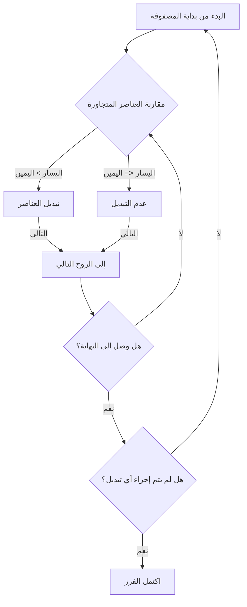
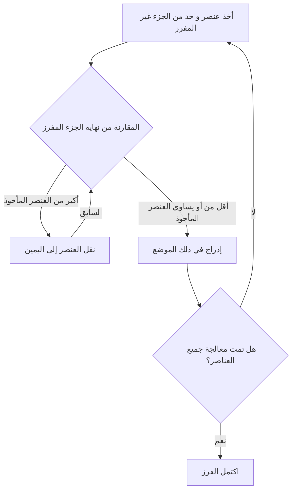
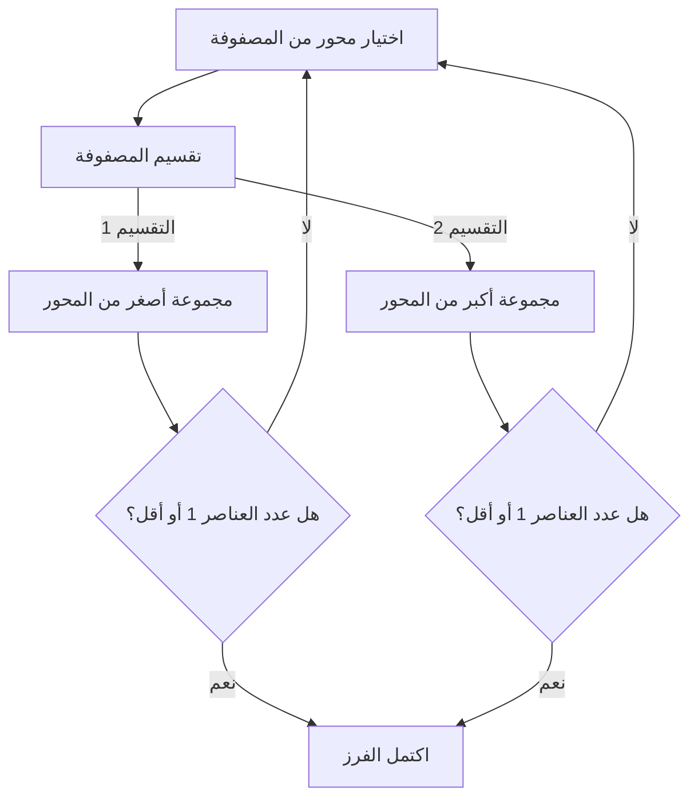
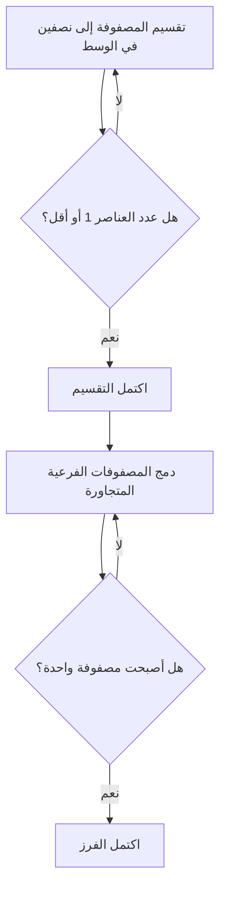

# 1. مقدمة: العالم العميق لخوارزميات الفرز

في علوم الكمبيوتر، يعد "الفرز" الذي يعيد ترتيب البيانات بترتيب معين (تصاعدي أو تنازلي) أحد أهم العمليات الأساسية. تلعب خوارزميات الفرز دورًا نشطًا كمرحلة أولية لأي معالجة بيانات، مثل تسريع البحث، وتجميع البيانات، واكتشاف التكرارات.

في هذه المقالة، نشرح بشكل شامل خوارزميات الفرز التمثيلية، بدءًا من الخوارزميات البسيطة التي يسهل على المبتدئين فهمها إلى الخوارزميات عالية السرعة المستخدمة في الممارسة العملية. سنفهم بشكل مرئي آلية كل خوارزمية باستخدام مخططات **Mermaid**، ونتحقق من التنفيذ الفعلي باستخدام كود Python، ونقارن الأداء مثل التعقيد الزمني. بالإضافة إلى ذلك، لفهم سلوك الخوارزمية تمامًا، قمنا بتضمين تتبع تنفيذ كامل باستخدام مصفوفة من 50 عنصرًا. سيسمح لك هذا بفهم السلوك الدقيق للخوارزمية كما لو كنت تحملها في يدك.

## مقاييس تقييم الخوارزمية

عند تقييم كل خوارزمية، تكون المقاييس التالية مهمة.

- **التعقيد الزمني (Time Complexity)** : يمثل كيف يزداد وقت المعالجة بالنسبة لعدد عناصر البيانات $n$. يتم استخدام ترميز Big-O مثل $\text{O}(n^2)$ أو $\text{O}(n \log n)$. عند التعامل مع النص داخل الصيغ الرياضية، يتم كتابته كـ $\text{الأفضل}$.
- **التعقيد المكاني (Space Complexity)** : يمثل مقدار الذاكرة الإضافية المطلوبة أثناء التنفيذ. الخوارزميات الموضعية (In-place) لا تتطلب تقريبًا أي ذاكرة إضافية.
- **الاستقرار (Stability)** : يشير إلى ما إذا كان الترتيب النسبي للعناصر التي لها نفس القيمة يتم الاحتفاظ به قبل وبعد الفرز. في الفرز المستقر، يتم الحفاظ على الترتيب الأصلي.

---

## 2. الفرز الفقاعي (Bubble Sort)

هي خوارزمية تكرر عملية مقارنة العناصر المتجاورة وتبديلها إذا كانت بترتيب عكسي. مثل الفقاعات التي تطفو على سطح الماء، تتحرك العناصر الكبيرة تدريجياً نحو نهاية المصفوفة.

### التعقيد والخصائص

- **التعقيد الزمني (الأفضل)**: $\text{O}(n)$
- **التعقيد الزمني (المتوسط)**: $\text{O}(n^2)$
- **التعقيد الزمني (الأسوأ)**: $\text{O}(n^2)$
- **التعقيد المكاني**: $\text{O}(1)$
- **الاستقرار**: مستقر

### رسم توضيحي (Mermaid)



### تنفيذ Python

```python
def bubble_sort(arr):
    n = len(arr)
    for i in range(n):
        swapped = False
        for j in range(0, n-i-1):
            if arr[j] > arr[j+1]:
                arr[j], arr[j+1] = arr[j+1], arr[j]
                swapped = True
        if not swapped:
            break
    return arr
```

### تتبع تفصيلي للفرز الفقاعي

يوضح حالة المصفوفة بعد اكتمال كل تمريرة عند تنفيذ الفرز الفقاعي على مصفوفة عشوائية مكونة من 50 عنصرًا. لاحظ كيف يقوم الفرز الفقاعي بدفع العناصر إلى اليمين.

**الحالة الأولية**: `[83, 14, 64, 71, 83, 11, 36, 69, 72, 45, 93, 30, 14, 76, 72, 51, 19, 41, 56, 15, 63, 27, 87, 55, 58, 63, 46, 96, 43, 68, 32, 97, 48, 94, 56, 27, 68, 40, 66, 88, 58, 15, 84, 10, 40, 27, 34, 48, 78, 56]`

**بعد اكتمال التمريرة 1**: `[14, 64, 71, 83, 11, 36, 69, 72, 45, 83, 30, 14, 76, 72, 51, 19, 41, 56, 15, 63, 27, 87, 55, 58, 63, 46, 93, 43, 68, 32, 96, 48, 94, 56, 27, 68, 40, 66, 88, 58, 15, 84, 10, 40, 27, 34, 48, 78, 56, 97]`

في هذه التمريرة، يطفو العنصر الأكبر في الجزء غير المفرز إلى الحافة اليمنى مثل الفقاعة. نظرًا لخصائص الفرز الفقاعي، يتم ضمان وضع عنصر واحد على الأقل في موضعه الصحيح النهائي لكل تمريرة. لذلك، يمكن تضييق نطاق البحث بمقدار واحد مع كل تمريرة، مما يقلل من عمليات المقارنة غير الضرورية. ومع ذلك، في أسوأ الحالات حيث يتم ترتيب البيانات بترتيب عكسي تمامًا، تحدث عمليات التبديل لكل أزواج العناصر، مما يؤدي إلى تعقيد يصل إلى $\text{O}(n^2)$، ويكون الأداء منخفضًا للغاية.

في هذه التمريرة، يطفو العنصر الأكبر في الجزء غير المفرز إلى الحافة اليمنى مثل الفقاعة. نظرًا لخصائص الفرز الفقاعي، يتم ضمان وضع عنصر واحد على الأقل في موضعه الصحيح النهائي لكل تمريرة. لذلك، يمكن تضييق نطاق البحث بمقدار واحد مع كل تمريرة، مما يقلل من عمليات المقارنة غير الضرورية. ومع ذلك، في أسوأ الحالات حيث يتم ترتيب البيانات بترتيب عكسي تمامًا، تحدث عمليات التبديل لكل أزواج العناصر، مما يؤدي إلى تعقيد يصل إلى $\text{O}(n^2)$، ويكون الأداء منخفضًا للغاية.

**بعد اكتمال التمريرة 2**: `[14, 64, 71, 11, 36, 69, 72, 45, 83, 30, 14, 76, 72, 51, 19, 41, 56, 15, 63, 27, 83, 55, 58, 63, 46, 87, 43, 68, 32, 93, 48, 94, 56, 27, 68, 40, 66, 88, 58, 15, 84, 10, 40, 27, 34, 48, 78, 56, 96, 97]`

في هذه التمريرة، يطفو العنصر الأكبر في الجزء غير المفرز إلى الحافة اليمنى مثل الفقاعة. نظرًا لخصائص الفرز الفقاعي، يتم ضمان وضع عنصر واحد على الأقل في موضعه الصحيح النهائي لكل تمريرة. لذلك، يمكن تضييق نطاق البحث بمقدار واحد مع كل تمريرة، مما يقلل من عمليات المقارنة غير الضرورية. ومع ذلك، في أسوأ الحالات حيث يتم ترتيب البيانات بترتيب عكسي تمامًا، تحدث عمليات التبديل لكل أزواج العناصر، مما يؤدي إلى تعقيد يصل إلى $\text{O}(n^2)$، ويكون الأداء منخفضًا للغاية.

في هذه التمريرة، يطفو العنصر الأكبر في الجزء غير المفرز إلى الحافة اليمنى مثل الفقاعة. نظرًا لخصائص الفرز الفقاعي، يتم ضمان وضع عنصر واحد على الأقل في موضعه الصحيح النهائي لكل تمريرة. لذلك، يمكن تضييق نطاق البحث بمقدار واحد مع كل تمريرة، مما يقلل من عمليات المقارنة غير الضرورية. ومع ذلك، في أسوأ الحالات حيث يتم ترتيب البيانات بترتيب عكسي تمامًا، تحدث عمليات التبديل لكل أزواج العناصر، مما يؤدي إلى تعقيد يصل إلى $\text{O}(n^2)$، ويكون الأداء منخفضًا للغاية.

**بعد اكتمال التمريرة 3**: `[14, 64, 11, 36, 69, 71, 45, 72, 30, 14, 76, 72, 51, 19, 41, 56, 15, 63, 27, 83, 55, 58, 63, 46, 83, 43, 68, 32, 87, 48, 93, 56, 27, 68, 40, 66, 88, 58, 15, 84, 10, 40, 27, 34, 48, 78, 56, 94, 96, 97]`

في هذه التمريرة، يطفو العنصر الأكبر في الجزء غير المفرز إلى الحافة اليمنى مثل الفقاعة. نظرًا لخصائص الفرز الفقاعي، يتم ضمان وضع عنصر واحد على الأقل في موضعه الصحيح النهائي لكل تمريرة. لذلك، يمكن تضييق نطاق البحث بمقدار واحد مع كل تمريرة، مما يقلل من عمليات المقارنة غير الضرورية. ومع ذلك، في أسوأ الحالات حيث يتم ترتيب البيانات بترتيب عكسي تمامًا، تحدث عمليات التبديل لكل أزواج العناصر، مما يؤدي إلى تعقيد يصل إلى $\text{O}(n^2)$، ويكون الأداء منخفضًا للغاية.

في هذه التمريرة، يطفو العنصر الأكبر في الجزء غير المفرز إلى الحافة اليمنى مثل الفقاعة. نظرًا لخصائص الفرز الفقاعي، يتم ضمان وضع عنصر واحد على الأقل في موضعه الصحيح النهائي لكل تمريرة. لذلك، يمكن تضييق نطاق البحث بمقدار واحد مع كل تمريرة، مما يقلل من عمليات المقارنة غير الضرورية. ومع ذلك، في أسوأ الحالات حيث يتم ترتيب البيانات بترتيب عكسي تمامًا، تحدث عمليات التبديل لكل أزواج العناصر، مما يؤدي إلى تعقيد يصل إلى $\text{O}(n^2)$، ويكون الأداء منخفضًا للغاية.

**بعد اكتمال التمريرة 4**: `[14, 11, 36, 64, 69, 45, 71, 30, 14, 72, 72, 51, 19, 41, 56, 15, 63, 27, 76, 55, 58, 63, 46, 83, 43, 68, 32, 83, 48, 87, 56, 27, 68, 40, 66, 88, 58, 15, 84, 10, 40, 27, 34, 48, 78, 56, 93, 94, 96, 97]`

في هذه التمريرة، يطفو العنصر الأكبر في الجزء غير المفرز إلى الحافة اليمنى مثل الفقاعة. نظرًا لخصائص الفرز الفقاعي، يتم ضمان وضع عنصر واحد على الأقل في موضعه الصحيح النهائي لكل تمريرة. لذلك، يمكن تضييق نطاق البحث بمقدار واحد مع كل تمريرة، مما يقلل من عمليات المقارنة غير الضرورية. ومع ذلك، في أسوأ الحالات حيث يتم ترتيب البيانات بترتيب عكسي تمامًا، تحدث عمليات التبديل لكل أزواج العناصر، مما يؤدي إلى تعقيد يصل إلى $\text{O}(n^2)$، ويكون الأداء منخفضًا للغاية.

في هذه التمريرة، يطفو العنصر الأكبر في الجزء غير المفرز إلى الحافة اليمنى مثل الفقاعة. نظرًا لخصائص الفرز الفقاعي، يتم ضمان وضع عنصر واحد على الأقل في موضعه الصحيح النهائي لكل تمريرة. لذلك، يمكن تضييق نطاق البحث بمقدار واحد مع كل تمريرة، مما يقلل من عمليات المقارنة غير الضرورية. ومع ذلك، في أسوأ الحالات حيث يتم ترتيب البيانات بترتيب عكسي تمامًا، تحدث عمليات التبديل لكل أزواج العناصر، مما يؤدي إلى تعقيد يصل إلى $\text{O}(n^2)$، ويكون الأداء منخفضًا للغاية.

**بعد اكتمال التمريرة 5**: `[11, 14, 36, 64, 45, 69, 30, 14, 71, 72, 51, 19, 41, 56, 15, 63, 27, 72, 55, 58, 63, 46, 76, 43, 68, 32, 83, 48, 83, 56, 27, 68, 40, 66, 87, 58, 15, 84, 10, 40, 27, 34, 48, 78, 56, 88, 93, 94, 96, 97]`

في هذه التمريرة، يطفو العنصر الأكبر في الجزء غير المفرز إلى الحافة اليمنى مثل الفقاعة. نظرًا لخصائص الفرز الفقاعي، يتم ضمان وضع عنصر واحد على الأقل في موضعه الصحيح النهائي لكل تمريرة. لذلك، يمكن تضييق نطاق البحث بمقدار واحد مع كل تمريرة، مما يقلل من عمليات المقارنة غير الضرورية. ومع ذلك، في أسوأ الحالات حيث يتم ترتيب البيانات بترتيب عكسي تمامًا، تحدث عمليات التبديل لكل أزواج العناصر، مما يؤدي إلى تعقيد يصل إلى $\text{O}(n^2)$، ويكون الأداء منخفضًا للغاية.

في هذه التمريرة، يطفو العنصر الأكبر في الجزء غير المفرز إلى الحافة اليمنى مثل الفقاعة. نظرًا لخصائص الفرز الفقاعي، يتم ضمان وضع عنصر واحد على الأقل في موضعه الصحيح النهائي لكل تمريرة. لذلك، يمكن تضييق نطاق البحث بمقدار واحد مع كل تمريرة، مما يقلل من عمليات المقارنة غير الضرورية. ومع ذلك، في أسوأ الحالات حيث يتم ترتيب البيانات بترتيب عكسي تمامًا، تحدث عمليات التبديل لكل أزواج العناصر، مما يؤدي إلى تعقيد يصل إلى $\text{O}(n^2)$، ويكون الأداء منخفضًا للغاية.

**بعد اكتمال التمريرة 6**: `[11, 14, 36, 45, 64, 30, 14, 69, 71, 51, 19, 41, 56, 15, 63, 27, 72, 55, 58, 63, 46, 72, 43, 68, 32, 76, 48, 83, 56, 27, 68, 40, 66, 83, 58, 15, 84, 10, 40, 27, 34, 48, 78, 56, 87, 88, 93, 94, 96, 97]`

في هذه التمريرة، يطفو العنصر الأكبر في الجزء غير المفرز إلى الحافة اليمنى مثل الفقاعة. نظرًا لخصائص الفرز الفقاعي، يتم ضمان وضع عنصر واحد على الأقل في موضعه الصحيح النهائي لكل تمريرة. لذلك، يمكن تضييق نطاق البحث بمقدار واحد مع كل تمريرة، مما يقلل من عمليات المقارنة غير الضرورية. ومع ذلك، في أسوأ الحالات حيث يتم ترتيب البيانات بترتيب عكسي تمامًا، تحدث عمليات التبديل لكل أزواج العناصر، مما يؤدي إلى تعقيد يصل إلى $\text{O}(n^2)$، ويكون الأداء منخفضًا للغاية.

في هذه التمريرة، يطفو العنصر الأكبر في الجزء غير المفرز إلى الحافة اليمنى مثل الفقاعة. نظرًا لخصائص الفرز الفقاعي، يتم ضمان وضع عنصر واحد على الأقل في موضعه الصحيح النهائي لكل تمريرة. لذلك، يمكن تضييق نطاق البحث بمقدار واحد مع كل تمريرة، مما يقلل من عمليات المقارنة غير الضرورية. ومع ذلك، في أسوأ الحالات حيث يتم ترتيب البيانات بترتيب عكسي تمامًا، تحدث عمليات التبديل لكل أزواج العناصر، مما يؤدي إلى تعقيد يصل إلى $\text{O}(n^2)$، ويكون الأداء منخفضًا للغاية.

**بعد اكتمال التمريرة 7**: `[11, 14, 36, 45, 30, 14, 64, 69, 51, 19, 41, 56, 15, 63, 27, 71, 55, 58, 63, 46, 72, 43, 68, 32, 72, 48, 76, 56, 27, 68, 40, 66, 83, 58, 15, 83, 10, 40, 27, 34, 48, 78, 56, 84, 87, 88, 93, 94, 96, 97]`

في هذه التمريرة، يطفو العنصر الأكبر في الجزء غير المفرز إلى الحافة اليمنى مثل الفقاعة. نظرًا لخصائص الفرز الفقاعي، يتم ضمان وضع عنصر واحد على الأقل في موضعه الصحيح النهائي لكل تمريرة. لذلك، يمكن تضييق نطاق البحث بمقدار واحد مع كل تمريرة، مما يقلل من عمليات المقارنة غير الضرورية. ومع ذلك، في أسوأ الحالات حيث يتم ترتيب البيانات بترتيب عكسي تمامًا، تحدث عمليات التبديل لكل أزواج العناصر، مما يؤدي إلى تعقيد يصل إلى $\text{O}(n^2)$، ويكون الأداء منخفضًا للغاية.

في هذه التمريرة، يطفو العنصر الأكبر في الجزء غير المفرز إلى الحافة اليمنى مثل الفقاعة. نظرًا لخصائص الفرز الفقاعي، يتم ضمان وضع عنصر واحد على الأقل في موضعه الصحيح النهائي لكل تمريرة. لذلك، يمكن تضييق نطاق البحث بمقدار واحد مع كل تمريرة، مما يقلل من عمليات المقارنة غير الضرورية. ومع ذلك، في أسوأ الحالات حيث يتم ترتيب البيانات بترتيب عكسي تمامًا، تحدث عمليات التبديل لكل أزواج العناصر، مما يؤدي إلى تعقيد يصل إلى $\text{O}(n^2)$، ويكون الأداء منخفضًا للغاية.

**بعد اكتمال التمريرة 8**: `[11, 14, 36, 30, 14, 45, 64, 51, 19, 41, 56, 15, 63, 27, 69, 55, 58, 63, 46, 71, 43, 68, 32, 72, 48, 72, 56, 27, 68, 40, 66, 76, 58, 15, 83, 10, 40, 27, 34, 48, 78, 56, 83, 84, 87, 88, 93, 94, 96, 97]`

في هذه التمريرة، يطفو العنصر الأكبر في الجزء غير المفرز إلى الحافة اليمنى مثل الفقاعة. نظرًا لخصائص الفرز الفقاعي، يتم ضمان وضع عنصر واحد على الأقل في موضعه الصحيح النهائي لكل تمريرة. لذلك، يمكن تضييق نطاق البحث بمقدار واحد مع كل تمريرة، مما يقلل من عمليات المقارنة غير الضرورية. ومع ذلك، في أسوأ الحالات حيث يتم ترتيب البيانات بترتيب عكسي تمامًا، تحدث عمليات التبديل لكل أزواج العناصر، مما يؤدي إلى تعقيد يصل إلى $\text{O}(n^2)$، ويكون الأداء منخفضًا للغاية.

في هذه التمريرة، يطفو العنصر الأكبر في الجزء غير المفرز إلى الحافة اليمنى مثل الفقاعة. نظرًا لخصائص الفرز الفقاعي، يتم ضمان وضع عنصر واحد على الأقل في موضعه الصحيح النهائي لكل تمريرة. لذلك، يمكن تضييق نطاق البحث بمقدار واحد مع كل تمريرة، مما يقلل من عمليات المقارنة غير الضرورية. ومع ذلك، في أسوأ الحالات حيث يتم ترتيب البيانات بترتيب عكسي تمامًا، تحدث عمليات التبديل لكل أزواج العناصر، مما يؤدي إلى تعقيد يصل إلى $\text{O}(n^2)$، ويكون الأداء منخفضًا للغاية.

**بعد اكتمال التمريرة 9**: `[11, 14, 30, 14, 36, 45, 51, 19, 41, 56, 15, 63, 27, 64, 55, 58, 63, 46, 69, 43, 68, 32, 71, 48, 72, 56, 27, 68, 40, 66, 72, 58, 15, 76, 10, 40, 27, 34, 48, 78, 56, 83, 83, 84, 87, 88, 93, 94, 96, 97]`

في هذه التمريرة، يطفو العنصر الأكبر في الجزء غير المفرز إلى الحافة اليمنى مثل الفقاعة. نظرًا لخصائص الفرز الفقاعي، يتم ضمان وضع عنصر واحد على الأقل في موضعه الصحيح النهائي لكل تمريرة. لذلك، يمكن تضييق نطاق البحث بمقدار واحد مع كل تمريرة، مما يقلل من عمليات المقارنة غير الضرورية. ومع ذلك، في أسوأ الحالات حيث يتم ترتيب البيانات بترتيب عكسي تمامًا، تحدث عمليات التبديل لكل أزواج العناصر، مما يؤدي إلى تعقيد يصل إلى $\text{O}(n^2)$، ويكون الأداء منخفضًا للغاية.

في هذه التمريرة، يطفو العنصر الأكبر في الجزء غير المفرز إلى الحافة اليمنى مثل الفقاعة. نظرًا لخصائص الفرز الفقاعي، يتم ضمان وضع عنصر واحد على الأقل في موضعه الصحيح النهائي لكل تمريرة. لذلك، يمكن تضييق نطاق البحث بمقدار واحد مع كل تمريرة، مما يقلل من عمليات المقارنة غير الضرورية. ومع ذلك، في أسوأ الحالات حيث يتم ترتيب البيانات بترتيب عكسي تمامًا، تحدث عمليات التبديل لكل أزواج العناصر، مما يؤدي إلى تعقيد يصل إلى $\text{O}(n^2)$، ويكون الأداء منخفضًا للغاية.

**بعد اكتمال التمريرة 10**: `[11, 14, 14, 30, 36, 45, 19, 41, 51, 15, 56, 27, 63, 55, 58, 63, 46, 64, 43, 68, 32, 69, 48, 71, 56, 27, 68, 40, 66, 72, 58, 15, 72, 10, 40, 27, 34, 48, 76, 56, 78, 83, 83, 84, 87, 88, 93, 94, 96, 97]`

في هذه التمريرة، يطفو العنصر الأكبر في الجزء غير المفرز إلى الحافة اليمنى مثل الفقاعة. نظرًا لخصائص الفرز الفقاعي، يتم ضمان وضع عنصر واحد على الأقل في موضعه الصحيح النهائي لكل تمريرة. لذلك، يمكن تضييق نطاق البحث بمقدار واحد مع كل تمريرة، مما يقلل من عمليات المقارنة غير الضرورية. ومع ذلك، في أسوأ الحالات حيث يتم ترتيب البيانات بترتيب عكسي تمامًا، تحدث عمليات التبديل لكل أزواج العناصر، مما يؤدي إلى تعقيد يصل إلى $\text{O}(n^2)$، ويكون الأداء منخفضًا للغاية.

في هذه التمريرة، يطفو العنصر الأكبر في الجزء غير المفرز إلى الحافة اليمنى مثل الفقاعة. نظرًا لخصائص الفرز الفقاعي، يتم ضمان وضع عنصر واحد على الأقل في موضعه الصحيح النهائي لكل تمريرة. لذلك، يمكن تضييق نطاق البحث بمقدار واحد مع كل تمريرة، مما يقلل من عمليات المقارنة غير الضرورية. ومع ذلك، في أسوأ الحالات حيث يتم ترتيب البيانات بترتيب عكسي تمامًا، تحدث عمليات التبديل لكل أزواج العناصر، مما يؤدي إلى تعقيد يصل إلى $\text{O}(n^2)$، ويكون الأداء منخفضًا للغاية.

**بعد اكتمال التمريرة 11**: `[11, 14, 14, 30, 36, 19, 41, 45, 15, 51, 27, 56, 55, 58, 63, 46, 63, 43, 64, 32, 68, 48, 69, 56, 27, 68, 40, 66, 71, 58, 15, 72, 10, 40, 27, 34, 48, 72, 56, 76, 78, 83, 83, 84, 87, 88, 93, 94, 96, 97]`

في هذه التمريرة، يطفو العنصر الأكبر في الجزء غير المفرز إلى الحافة اليمنى مثل الفقاعة. نظرًا لخصائص الفرز الفقاعي، يتم ضمان وضع عنصر واحد على الأقل في موضعه الصحيح النهائي لكل تمريرة. لذلك، يمكن تضييق نطاق البحث بمقدار واحد مع كل تمريرة، مما يقلل من عمليات المقارنة غير الضرورية. ومع ذلك، في أسوأ الحالات حيث يتم ترتيب البيانات بترتيب عكسي تمامًا، تحدث عمليات التبديل لكل أزواج العناصر، مما يؤدي إلى تعقيد يصل إلى $\text{O}(n^2)$، ويكون الأداء منخفضًا للغاية.

في هذه التمريرة، يطفو العنصر الأكبر في الجزء غير المفرز إلى الحافة اليمنى مثل الفقاعة. نظرًا لخصائص الفرز الفقاعي، يتم ضمان وضع عنصر واحد على الأقل في موضعه الصحيح النهائي لكل تمريرة. لذلك، يمكن تضييق نطاق البحث بمقدار واحد مع كل تمريرة، مما يقلل من عمليات المقارنة غير الضرورية. ومع ذلك، في أسوأ الحالات حيث يتم ترتيب البيانات بترتيب عكسي تمامًا، تحدث عمليات التبديل لكل أزواج العناصر، مما يؤدي إلى تعقيد يصل إلى $\text{O}(n^2)$، ويكون الأداء منخفضًا للغاية.

**بعد اكتمال التمريرة 12**: `[11, 14, 14, 30, 19, 36, 41, 15, 45, 27, 51, 55, 56, 58, 46, 63, 43, 63, 32, 64, 48, 68, 56, 27, 68, 40, 66, 69, 58, 15, 71, 10, 40, 27, 34, 48, 72, 56, 72, 76, 78, 83, 83, 84, 87, 88, 93, 94, 96, 97]`

في هذه التمريرة، يطفو العنصر الأكبر في الجزء غير المفرز إلى الحافة اليمنى مثل الفقاعة. نظرًا لخصائص الفرز الفقاعي، يتم ضمان وضع عنصر واحد على الأقل في موضعه الصحيح النهائي لكل تمريرة. لذلك، يمكن تضييق نطاق البحث بمقدار واحد مع كل تمريرة، مما يقلل من عمليات المقارنة غير الضرورية. ومع ذلك، في أسوأ الحالات حيث يتم ترتيب البيانات بترتيب عكسي تمامًا، تحدث عمليات التبديل لكل أزواج العناصر، مما يؤدي إلى تعقيد يصل إلى $\text{O}(n^2)$، ويكون الأداء منخفضًا للغاية.

في هذه التمريرة، يطفو العنصر الأكبر في الجزء غير المفرز إلى الحافة اليمنى مثل الفقاعة. نظرًا لخصائص الفرز الفقاعي، يتم ضمان وضع عنصر واحد على الأقل في موضعه الصحيح النهائي لكل تمريرة. لذلك، يمكن تضييق نطاق البحث بمقدار واحد مع كل تمريرة، مما يقلل من عمليات المقارنة غير الضرورية. ومع ذلك، في أسوأ الحالات حيث يتم ترتيب البيانات بترتيب عكسي تمامًا، تحدث عمليات التبديل لكل أزواج العناصر، مما يؤدي إلى تعقيد يصل إلى $\text{O}(n^2)$، ويكون الأداء منخفضًا للغاية.

**بعد اكتمال التمريرة 13**: `[11, 14, 14, 19, 30, 36, 15, 41, 27, 45, 51, 55, 56, 46, 58, 43, 63, 32, 63, 48, 64, 56, 27, 68, 40, 66, 68, 58, 15, 69, 10, 40, 27, 34, 48, 71, 56, 72, 72, 76, 78, 83, 83, 84, 87, 88, 93, 94, 96, 97]`

في هذه التمريرة، يطفو العنصر الأكبر في الجزء غير المفرز إلى الحافة اليمنى مثل الفقاعة. نظرًا لخصائص الفرز الفقاعي، يتم ضمان وضع عنصر واحد على الأقل في موضعه الصحيح النهائي لكل تمريرة. لذلك، يمكن تضييق نطاق البحث بمقدار واحد مع كل تمريرة، مما يقلل من عمليات المقارنة غير الضرورية. ومع ذلك، في أسوأ الحالات حيث يتم ترتيب البيانات بترتيب عكسي تمامًا، تحدث عمليات التبديل لكل أزواج العناصر، مما يؤدي إلى تعقيد يصل إلى $\text{O}(n^2)$، ويكون الأداء منخفضًا للغاية.

في هذه التمريرة، يطفو العنصر الأكبر في الجزء غير المفرز إلى الحافة اليمنى مثل الفقاعة. نظرًا لخصائص الفرز الفقاعي، يتم ضمان وضع عنصر واحد على الأقل في موضعه الصحيح النهائي لكل تمريرة. لذلك، يمكن تضييق نطاق البحث بمقدار واحد مع كل تمريرة، مما يقلل من عمليات المقارنة غير الضرورية. ومع ذلك، في أسوأ الحالات حيث يتم ترتيب البيانات بترتيب عكسي تمامًا، تحدث عمليات التبديل لكل أزواج العناصر، مما يؤدي إلى تعقيد يصل إلى $\text{O}(n^2)$، ويكون الأداء منخفضًا للغاية.

**بعد اكتمال التمريرة 14**: `[11, 14, 14, 19, 30, 15, 36, 27, 41, 45, 51, 55, 46, 56, 43, 58, 32, 63, 48, 63, 56, 27, 64, 40, 66, 68, 58, 15, 68, 10, 40, 27, 34, 48, 69, 56, 71, 72, 72, 76, 78, 83, 83, 84, 87, 88, 93, 94, 96, 97]`

في هذه التمريرة، يطفو العنصر الأكبر في الجزء غير المفرز إلى الحافة اليمنى مثل الفقاعة. نظرًا لخصائص الفرز الفقاعي، يتم ضمان وضع عنصر واحد على الأقل في موضعه الصحيح النهائي لكل تمريرة. لذلك، يمكن تضييق نطاق البحث بمقدار واحد مع كل تمريرة، مما يقلل من عمليات المقارنة غير الضرورية. ومع ذلك، في أسوأ الحالات حيث يتم ترتيب البيانات بترتيب عكسي تمامًا، تحدث عمليات التبديل لكل أزواج العناصر، مما يؤدي إلى تعقيد يصل إلى $\text{O}(n^2)$، ويكون الأداء منخفضًا للغاية.

في هذه التمريرة، يطفو العنصر الأكبر في الجزء غير المفرز إلى الحافة اليمنى مثل الفقاعة. نظرًا لخصائص الفرز الفقاعي، يتم ضمان وضع عنصر واحد على الأقل في موضعه الصحيح النهائي لكل تمريرة. لذلك، يمكن تضييق نطاق البحث بمقدار واحد مع كل تمريرة، مما يقلل من عمليات المقارنة غير الضرورية. ومع ذلك، في أسوأ الحالات حيث يتم ترتيب البيانات بترتيب عكسي تمامًا، تحدث عمليات التبديل لكل أزواج العناصر، مما يؤدي إلى تعقيد يصل إلى $\text{O}(n^2)$، ويكون الأداء منخفضًا للغاية.

**بعد اكتمال التمريرة 15**: `[11, 14, 14, 19, 15, 30, 27, 36, 41, 45, 51, 46, 55, 43, 56, 32, 58, 48, 63, 56, 27, 63, 40, 64, 66, 58, 15, 68, 10, 40, 27, 34, 48, 68, 56, 69, 71, 72, 72, 76, 78, 83, 83, 84, 87, 88, 93, 94, 96, 97]`

في هذه التمريرة، يطفو العنصر الأكبر في الجزء غير المفرز إلى الحافة اليمنى مثل الفقاعة. نظرًا لخصائص الفرز الفقاعي، يتم ضمان وضع عنصر واحد على الأقل في موضعه الصحيح النهائي لكل تمريرة. لذلك، يمكن تضييق نطاق البحث بمقدار واحد مع كل تمريرة، مما يقلل من عمليات المقارنة غير الضرورية. ومع ذلك، في أسوأ الحالات حيث يتم ترتيب البيانات بترتيب عكسي تمامًا، تحدث عمليات التبديل لكل أزواج العناصر، مما يؤدي إلى تعقيد يصل إلى $\text{O}(n^2)$، ويكون الأداء منخفضًا للغاية.

في هذه التمريرة، يطفو العنصر الأكبر في الجزء غير المفرز إلى الحافة اليمنى مثل الفقاعة. نظرًا لخصائص الفرز الفقاعي، يتم ضمان وضع عنصر واحد على الأقل في موضعه الصحيح النهائي لكل تمريرة. لذلك، يمكن تضييق نطاق البحث بمقدار واحد مع كل تمريرة، مما يقلل من عمليات المقارنة غير الضرورية. ومع ذلك، في أسوأ الحالات حيث يتم ترتيب البيانات بترتيب عكسي تمامًا، تحدث عمليات التبديل لكل أزواج العناصر، مما يؤدي إلى تعقيد يصل إلى $\text{O}(n^2)$، ويكون الأداء منخفضًا للغاية.

**بعد اكتمال التمريرة 16**: `[11, 14, 14, 15, 19, 27, 30, 36, 41, 45, 46, 51, 43, 55, 32, 56, 48, 58, 56, 27, 63, 40, 63, 64, 58, 15, 66, 10, 40, 27, 34, 48, 68, 56, 68, 69, 71, 72, 72, 76, 78, 83, 83, 84, 87, 88, 93, 94, 96, 97]`

في هذه التمريرة، يطفو العنصر الأكبر في الجزء غير المفرز إلى الحافة اليمنى مثل الفقاعة. نظرًا لخصائص الفرز الفقاعي، يتم ضمان وضع عنصر واحد على الأقل في موضعه الصحيح النهائي لكل تمريرة. لذلك، يمكن تضييق نطاق البحث بمقدار واحد مع كل تمريرة، مما يقلل من عمليات المقارنة غير الضرورية. ومع ذلك، في أسوأ الحالات حيث يتم ترتيب البيانات بترتيب عكسي تمامًا، تحدث عمليات التبديل لكل أزواج العناصر، مما يؤدي إلى تعقيد يصل إلى $\text{O}(n^2)$، ويكون الأداء منخفضًا للغاية.

في هذه التمريرة، يطفو العنصر الأكبر في الجزء غير المفرز إلى الحافة اليمنى مثل الفقاعة. نظرًا لخصائص الفرز الفقاعي، يتم ضمان وضع عنصر واحد على الأقل في موضعه الصحيح النهائي لكل تمريرة. لذلك، يمكن تضييق نطاق البحث بمقدار واحد مع كل تمريرة، مما يقلل من عمليات المقارنة غير الضرورية. ومع ذلك، في أسوأ الحالات حيث يتم ترتيب البيانات بترتيب عكسي تمامًا، تحدث عمليات التبديل لكل أزواج العناصر، مما يؤدي إلى تعقيد يصل إلى $\text{O}(n^2)$، ويكون الأداء منخفضًا للغاية.

**بعد اكتمال التمريرة 17**: `[11, 14, 14, 15, 19, 27, 30, 36, 41, 45, 46, 43, 51, 32, 55, 48, 56, 56, 27, 58, 40, 63, 63, 58, 15, 64, 10, 40, 27, 34, 48, 66, 56, 68, 68, 69, 71, 72, 72, 76, 78, 83, 83, 84, 87, 88, 93, 94, 96, 97]`

في هذه التمريرة، يطفو العنصر الأكبر في الجزء غير المفرز إلى الحافة اليمنى مثل الفقاعة. نظرًا لخصائص الفرز الفقاعي، يتم ضمان وضع عنصر واحد على الأقل في موضعه الصحيح النهائي لكل تمريرة. لذلك، يمكن تضييق نطاق البحث بمقدار واحد مع كل تمريرة، مما يقلل من عمليات المقارنة غير الضرورية. ومع ذلك، في أسوأ الحالات حيث يتم ترتيب البيانات بترتيب عكسي تمامًا، تحدث عمليات التبديل لكل أزواج العناصر، مما يؤدي إلى تعقيد يصل إلى $\text{O}(n^2)$، ويكون الأداء منخفضًا للغاية.

في هذه التمريرة، يطفو العنصر الأكبر في الجزء غير المفرز إلى الحافة اليمنى مثل الفقاعة. نظرًا لخصائص الفرز الفقاعي، يتم ضمان وضع عنصر واحد على الأقل في موضعه الصحيح النهائي لكل تمريرة. لذلك، يمكن تضييق نطاق البحث بمقدار واحد مع كل تمريرة، مما يقلل من عمليات المقارنة غير الضرورية. ومع ذلك، في أسوأ الحالات حيث يتم ترتيب البيانات بترتيب عكسي تمامًا، تحدث عمليات التبديل لكل أزواج العناصر، مما يؤدي إلى تعقيد يصل إلى $\text{O}(n^2)$، ويكون الأداء منخفضًا للغاية.

**بعد اكتمال التمريرة 18**: `[11, 14, 14, 15, 19, 27, 30, 36, 41, 45, 43, 46, 32, 51, 48, 55, 56, 27, 56, 40, 58, 63, 58, 15, 63, 10, 40, 27, 34, 48, 64, 56, 66, 68, 68, 69, 71, 72, 72, 76, 78, 83, 83, 84, 87, 88, 93, 94, 96, 97]`

في هذه التمريرة، يطفو العنصر الأكبر في الجزء غير المفرز إلى الحافة اليمنى مثل الفقاعة. نظرًا لخصائص الفرز الفقاعي، يتم ضمان وضع عنصر واحد على الأقل في موضعه الصحيح النهائي لكل تمريرة. لذلك، يمكن تضييق نطاق البحث بمقدار واحد مع كل تمريرة، مما يقلل من عمليات المقارنة غير الضرورية. ومع ذلك، في أسوأ الحالات حيث يتم ترتيب البيانات بترتيب عكسي تمامًا، تحدث عمليات التبديل لكل أزواج العناصر، مما يؤدي إلى تعقيد يصل إلى $\text{O}(n^2)$، ويكون الأداء منخفضًا للغاية.

في هذه التمريرة، يطفو العنصر الأكبر في الجزء غير المفرز إلى الحافة اليمنى مثل الفقاعة. نظرًا لخصائص الفرز الفقاعي، يتم ضمان وضع عنصر واحد على الأقل في موضعه الصحيح النهائي لكل تمريرة. لذلك، يمكن تضييق نطاق البحث بمقدار واحد مع كل تمريرة، مما يقلل من عمليات المقارنة غير الضرورية. ومع ذلك، في أسوأ الحالات حيث يتم ترتيب البيانات بترتيب عكسي تمامًا، تحدث عمليات التبديل لكل أزواج العناصر، مما يؤدي إلى تعقيد يصل إلى $\text{O}(n^2)$، ويكون الأداء منخفضًا للغاية.

**بعد اكتمال التمريرة 19**: `[11, 14, 14, 15, 19, 27, 30, 36, 41, 43, 45, 32, 46, 48, 51, 55, 27, 56, 40, 56, 58, 58, 15, 63, 10, 40, 27, 34, 48, 63, 56, 64, 66, 68, 68, 69, 71, 72, 72, 76, 78, 83, 83, 84, 87, 88, 93, 94, 96, 97]`

في هذه التمريرة، يطفو العنصر الأكبر في الجزء غير المفرز إلى الحافة اليمنى مثل الفقاعة. نظرًا لخصائص الفرز الفقاعي، يتم ضمان وضع عنصر واحد على الأقل في موضعه الصحيح النهائي لكل تمريرة. لذلك، يمكن تضييق نطاق البحث بمقدار واحد مع كل تمريرة، مما يقلل من عمليات المقارنة غير الضرورية. ومع ذلك، في أسوأ الحالات حيث يتم ترتيب البيانات بترتيب عكسي تمامًا، تحدث عمليات التبديل لكل أزواج العناصر، مما يؤدي إلى تعقيد يصل إلى $\text{O}(n^2)$، ويكون الأداء منخفضًا للغاية.

في هذه التمريرة، يطفو العنصر الأكبر في الجزء غير المفرز إلى الحافة اليمنى مثل الفقاعة. نظرًا لخصائص الفرز الفقاعي، يتم ضمان وضع عنصر واحد على الأقل في موضعه الصحيح النهائي لكل تمريرة. لذلك، يمكن تضييق نطاق البحث بمقدار واحد مع كل تمريرة، مما يقلل من عمليات المقارنة غير الضرورية. ومع ذلك، في أسوأ الحالات حيث يتم ترتيب البيانات بترتيب عكسي تمامًا، تحدث عمليات التبديل لكل أزواج العناصر، مما يؤدي إلى تعقيد يصل إلى $\text{O}(n^2)$، ويكون الأداء منخفضًا للغاية.

**بعد اكتمال التمريرة 20**: `[11, 14, 14, 15, 19, 27, 30, 36, 41, 43, 32, 45, 46, 48, 51, 27, 55, 40, 56, 56, 58, 15, 58, 10, 40, 27, 34, 48, 63, 56, 63, 64, 66, 68, 68, 69, 71, 72, 72, 76, 78, 83, 83, 84, 87, 88, 93, 94, 96, 97]`

في هذه التمريرة، يطفو العنصر الأكبر في الجزء غير المفرز إلى الحافة اليمنى مثل الفقاعة. نظرًا لخصائص الفرز الفقاعي، يتم ضمان وضع عنصر واحد على الأقل في موضعه الصحيح النهائي لكل تمريرة. لذلك، يمكن تضييق نطاق البحث بمقدار واحد مع كل تمريرة، مما يقلل من عمليات المقارنة غير الضرورية. ومع ذلك، في أسوأ الحالات حيث يتم ترتيب البيانات بترتيب عكسي تمامًا، تحدث عمليات التبديل لكل أزواج العناصر، مما يؤدي إلى تعقيد يصل إلى $\text{O}(n^2)$، ويكون الأداء منخفضًا للغاية.

في هذه التمريرة، يطفو العنصر الأكبر في الجزء غير المفرز إلى الحافة اليمنى مثل الفقاعة. نظرًا لخصائص الفرز الفقاعي، يتم ضمان وضع عنصر واحد على الأقل في موضعه الصحيح النهائي لكل تمريرة. لذلك، يمكن تضييق نطاق البحث بمقدار واحد مع كل تمريرة، مما يقلل من عمليات المقارنة غير الضرورية. ومع ذلك، في أسوأ الحالات حيث يتم ترتيب البيانات بترتيب عكسي تمامًا، تحدث عمليات التبديل لكل أزواج العناصر، مما يؤدي إلى تعقيد يصل إلى $\text{O}(n^2)$، ويكون الأداء منخفضًا للغاية.

**بعد اكتمال التمريرة 21**: `[11, 14, 14, 15, 19, 27, 30, 36, 41, 32, 43, 45, 46, 48, 27, 51, 40, 55, 56, 56, 15, 58, 10, 40, 27, 34, 48, 58, 56, 63, 63, 64, 66, 68, 68, 69, 71, 72, 72, 76, 78, 83, 83, 84, 87, 88, 93, 94, 96, 97]`

في هذه التمريرة، يطفو العنصر الأكبر في الجزء غير المفرز إلى الحافة اليمنى مثل الفقاعة. نظرًا لخصائص الفرز الفقاعي، يتم ضمان وضع عنصر واحد على الأقل في موضعه الصحيح النهائي لكل تمريرة. لذلك، يمكن تضييق نطاق البحث بمقدار واحد مع كل تمريرة، مما يقلل من عمليات المقارنة غير الضرورية. ومع ذلك، في أسوأ الحالات حيث يتم ترتيب البيانات بترتيب عكسي تمامًا، تحدث عمليات التبديل لكل أزواج العناصر، مما يؤدي إلى تعقيد يصل إلى $\text{O}(n^2)$، ويكون الأداء منخفضًا للغاية.

في هذه التمريرة، يطفو العنصر الأكبر في الجزء غير المفرز إلى الحافة اليمنى مثل الفقاعة. نظرًا لخصائص الفرز الفقاعي، يتم ضمان وضع عنصر واحد على الأقل في موضعه الصحيح النهائي لكل تمريرة. لذلك، يمكن تضييق نطاق البحث بمقدار واحد مع كل تمريرة، مما يقلل من عمليات المقارنة غير الضرورية. ومع ذلك، في أسوأ الحالات حيث يتم ترتيب البيانات بترتيب عكسي تمامًا، تحدث عمليات التبديل لكل أزواج العناصر، مما يؤدي إلى تعقيد يصل إلى $\text{O}(n^2)$، ويكون الأداء منخفضًا للغاية.

**بعد اكتمال التمريرة 22**: `[11, 14, 14, 15, 19, 27, 30, 36, 32, 41, 43, 45, 46, 27, 48, 40, 51, 55, 56, 15, 56, 10, 40, 27, 34, 48, 58, 56, 58, 63, 63, 64, 66, 68, 68, 69, 71, 72, 72, 76, 78, 83, 83, 84, 87, 88, 93, 94, 96, 97]`

في هذه التمريرة، يطفو العنصر الأكبر في الجزء غير المفرز إلى الحافة اليمنى مثل الفقاعة. نظرًا لخصائص الفرز الفقاعي، يتم ضمان وضع عنصر واحد على الأقل في موضعه الصحيح النهائي لكل تمريرة. لذلك، يمكن تضييق نطاق البحث بمقدار واحد مع كل تمريرة، مما يقلل من عمليات المقارنة غير الضرورية. ومع ذلك، في أسوأ الحالات حيث يتم ترتيب البيانات بترتيب عكسي تمامًا، تحدث عمليات التبديل لكل أزواج العناصر، مما يؤدي إلى تعقيد يصل إلى $\text{O}(n^2)$، ويكون الأداء منخفضًا للغاية.

في هذه التمريرة، يطفو العنصر الأكبر في الجزء غير المفرز إلى الحافة اليمنى مثل الفقاعة. نظرًا لخصائص الفرز الفقاعي، يتم ضمان وضع عنصر واحد على الأقل في موضعه الصحيح النهائي لكل تمريرة. لذلك، يمكن تضييق نطاق البحث بمقدار واحد مع كل تمريرة، مما يقلل من عمليات المقارنة غير الضرورية. ومع ذلك، في أسوأ الحالات حيث يتم ترتيب البيانات بترتيب عكسي تمامًا، تحدث عمليات التبديل لكل أزواج العناصر، مما يؤدي إلى تعقيد يصل إلى $\text{O}(n^2)$، ويكون الأداء منخفضًا للغاية.

**بعد اكتمال التمريرة 23**: `[11, 14, 14, 15, 19, 27, 30, 32, 36, 41, 43, 45, 27, 46, 40, 48, 51, 55, 15, 56, 10, 40, 27, 34, 48, 56, 56, 58, 58, 63, 63, 64, 66, 68, 68, 69, 71, 72, 72, 76, 78, 83, 83, 84, 87, 88, 93, 94, 96, 97]`

في هذه التمريرة، يطفو العنصر الأكبر في الجزء غير المفرز إلى الحافة اليمنى مثل الفقاعة. نظرًا لخصائص الفرز الفقاعي، يتم ضمان وضع عنصر واحد على الأقل في موضعه الصحيح النهائي لكل تمريرة. لذلك، يمكن تضييق نطاق البحث بمقدار واحد مع كل تمريرة، مما يقلل من عمليات المقارنة غير الضرورية. ومع ذلك، في أسوأ الحالات حيث يتم ترتيب البيانات بترتيب عكسي تمامًا، تحدث عمليات التبديل لكل أزواج العناصر، مما يؤدي إلى تعقيد يصل إلى $\text{O}(n^2)$، ويكون الأداء منخفضًا للغاية.

في هذه التمريرة، يطفو العنصر الأكبر في الجزء غير المفرز إلى الحافة اليمنى مثل الفقاعة. نظرًا لخصائص الفرز الفقاعي، يتم ضمان وضع عنصر واحد على الأقل في موضعه الصحيح النهائي لكل تمريرة. لذلك، يمكن تضييق نطاق البحث بمقدار واحد مع كل تمريرة، مما يقلل من عمليات المقارنة غير الضرورية. ومع ذلك، في أسوأ الحالات حيث يتم ترتيب البيانات بترتيب عكسي تمامًا، تحدث عمليات التبديل لكل أزواج العناصر، مما يؤدي إلى تعقيد يصل إلى $\text{O}(n^2)$، ويكون الأداء منخفضًا للغاية.

**بعد اكتمال التمريرة 24**: `[11, 14, 14, 15, 19, 27, 30, 32, 36, 41, 43, 27, 45, 40, 46, 48, 51, 15, 55, 10, 40, 27, 34, 48, 56, 56, 56, 58, 58, 63, 63, 64, 66, 68, 68, 69, 71, 72, 72, 76, 78, 83, 83, 84, 87, 88, 93, 94, 96, 97]`

في هذه التمريرة، يطفو العنصر الأكبر في الجزء غير المفرز إلى الحافة اليمنى مثل الفقاعة. نظرًا لخصائص الفرز الفقاعي، يتم ضمان وضع عنصر واحد على الأقل في موضعه الصحيح النهائي لكل تمريرة. لذلك، يمكن تضييق نطاق البحث بمقدار واحد مع كل تمريرة، مما يقلل من عمليات المقارنة غير الضرورية. ومع ذلك، في أسوأ الحالات حيث يتم ترتيب البيانات بترتيب عكسي تمامًا، تحدث عمليات التبديل لكل أزواج العناصر، مما يؤدي إلى تعقيد يصل إلى $\text{O}(n^2)$، ويكون الأداء منخفضًا للغاية.

في هذه التمريرة، يطفو العنصر الأكبر في الجزء غير المفرز إلى الحافة اليمنى مثل الفقاعة. نظرًا لخصائص الفرز الفقاعي، يتم ضمان وضع عنصر واحد على الأقل في موضعه الصحيح النهائي لكل تمريرة. لذلك، يمكن تضييق نطاق البحث بمقدار واحد مع كل تمريرة، مما يقلل من عمليات المقارنة غير الضرورية. ومع ذلك، في أسوأ الحالات حيث يتم ترتيب البيانات بترتيب عكسي تمامًا، تحدث عمليات التبديل لكل أزواج العناصر، مما يؤدي إلى تعقيد يصل إلى $\text{O}(n^2)$، ويكون الأداء منخفضًا للغاية.

**بعد اكتمال التمريرة 25**: `[11, 14, 14, 15, 19, 27, 30, 32, 36, 41, 27, 43, 40, 45, 46, 48, 15, 51, 10, 40, 27, 34, 48, 55, 56, 56, 56, 58, 58, 63, 63, 64, 66, 68, 68, 69, 71, 72, 72, 76, 78, 83, 83, 84, 87, 88, 93, 94, 96, 97]`

في هذه التمريرة، يطفو العنصر الأكبر في الجزء غير المفرز إلى الحافة اليمنى مثل الفقاعة. نظرًا لخصائص الفرز الفقاعي، يتم ضمان وضع عنصر واحد على الأقل في موضعه الصحيح النهائي لكل تمريرة. لذلك، يمكن تضييق نطاق البحث بمقدار واحد مع كل تمريرة، مما يقلل من عمليات المقارنة غير الضرورية. ومع ذلك، في أسوأ الحالات حيث يتم ترتيب البيانات بترتيب عكسي تمامًا، تحدث عمليات التبديل لكل أزواج العناصر، مما يؤدي إلى تعقيد يصل إلى $\text{O}(n^2)$، ويكون الأداء منخفضًا للغاية.

في هذه التمريرة، يطفو العنصر الأكبر في الجزء غير المفرز إلى الحافة اليمنى مثل الفقاعة. نظرًا لخصائص الفرز الفقاعي، يتم ضمان وضع عنصر واحد على الأقل في موضعه الصحيح النهائي لكل تمريرة. لذلك، يمكن تضييق نطاق البحث بمقدار واحد مع كل تمريرة، مما يقلل من عمليات المقارنة غير الضرورية. ومع ذلك، في أسوأ الحالات حيث يتم ترتيب البيانات بترتيب عكسي تمامًا، تحدث عمليات التبديل لكل أزواج العناصر، مما يؤدي إلى تعقيد يصل إلى $\text{O}(n^2)$، ويكون الأداء منخفضًا للغاية.

**بعد اكتمال التمريرة 26**: `[11, 14, 14, 15, 19, 27, 30, 32, 36, 27, 41, 40, 43, 45, 46, 15, 48, 10, 40, 27, 34, 48, 51, 55, 56, 56, 56, 58, 58, 63, 63, 64, 66, 68, 68, 69, 71, 72, 72, 76, 78, 83, 83, 84, 87, 88, 93, 94, 96, 97]`

في هذه التمريرة، يطفو العنصر الأكبر في الجزء غير المفرز إلى الحافة اليمنى مثل الفقاعة. نظرًا لخصائص الفرز الفقاعي، يتم ضمان وضع عنصر واحد على الأقل في موضعه الصحيح النهائي لكل تمريرة. لذلك، يمكن تضييق نطاق البحث بمقدار واحد مع كل تمريرة، مما يقلل من عمليات المقارنة غير الضرورية. ومع ذلك، في أسوأ الحالات حيث يتم ترتيب البيانات بترتيب عكسي تمامًا، تحدث عمليات التبديل لكل أزواج العناصر، مما يؤدي إلى تعقيد يصل إلى $\text{O}(n^2)$، ويكون الأداء منخفضًا للغاية.

في هذه التمريرة، يطفو العنصر الأكبر في الجزء غير المفرز إلى الحافة اليمنى مثل الفقاعة. نظرًا لخصائص الفرز الفقاعي، يتم ضمان وضع عنصر واحد على الأقل في موضعه الصحيح النهائي لكل تمريرة. لذلك، يمكن تضييق نطاق البحث بمقدار واحد مع كل تمريرة، مما يقلل من عمليات المقارنة غير الضرورية. ومع ذلك، في أسوأ الحالات حيث يتم ترتيب البيانات بترتيب عكسي تمامًا، تحدث عمليات التبديل لكل أزواج العناصر، مما يؤدي إلى تعقيد يصل إلى $\text{O}(n^2)$، ويكون الأداء منخفضًا للغاية.

**بعد اكتمال التمريرة 27**: `[11, 14, 14, 15, 19, 27, 30, 32, 27, 36, 40, 41, 43, 45, 15, 46, 10, 40, 27, 34, 48, 48, 51, 55, 56, 56, 56, 58, 58, 63, 63, 64, 66, 68, 68, 69, 71, 72, 72, 76, 78, 83, 83, 84, 87, 88, 93, 94, 96, 97]`

في هذه التمريرة، يطفو العنصر الأكبر في الجزء غير المفرز إلى الحافة اليمنى مثل الفقاعة. نظرًا لخصائص الفرز الفقاعي، يتم ضمان وضع عنصر واحد على الأقل في موضعه الصحيح النهائي لكل تمريرة. لذلك، يمكن تضييق نطاق البحث بمقدار واحد مع كل تمريرة، مما يقلل من عمليات المقارنة غير الضرورية. ومع ذلك، في أسوأ الحالات حيث يتم ترتيب البيانات بترتيب عكسي تمامًا، تحدث عمليات التبديل لكل أزواج العناصر، مما يؤدي إلى تعقيد يصل إلى $\text{O}(n^2)$، ويكون الأداء منخفضًا للغاية.

في هذه التمريرة، يطفو العنصر الأكبر في الجزء غير المفرز إلى الحافة اليمنى مثل الفقاعة. نظرًا لخصائص الفرز الفقاعي، يتم ضمان وضع عنصر واحد على الأقل في موضعه الصحيح النهائي لكل تمريرة. لذلك، يمكن تضييق نطاق البحث بمقدار واحد مع كل تمريرة، مما يقلل من عمليات المقارنة غير الضرورية. ومع ذلك، في أسوأ الحالات حيث يتم ترتيب البيانات بترتيب عكسي تمامًا، تحدث عمليات التبديل لكل أزواج العناصر، مما يؤدي إلى تعقيد يصل إلى $\text{O}(n^2)$، ويكون الأداء منخفضًا للغاية.

**بعد اكتمال التمريرة 28**: `[11, 14, 14, 15, 19, 27, 30, 27, 32, 36, 40, 41, 43, 15, 45, 10, 40, 27, 34, 46, 48, 48, 51, 55, 56, 56, 56, 58, 58, 63, 63, 64, 66, 68, 68, 69, 71, 72, 72, 76, 78, 83, 83, 84, 87, 88, 93, 94, 96, 97]`

في هذه التمريرة، يطفو العنصر الأكبر في الجزء غير المفرز إلى الحافة اليمنى مثل الفقاعة. نظرًا لخصائص الفرز الفقاعي، يتم ضمان وضع عنصر واحد على الأقل في موضعه الصحيح النهائي لكل تمريرة. لذلك، يمكن تضييق نطاق البحث بمقدار واحد مع كل تمريرة، مما يقلل من عمليات المقارنة غير الضرورية. ومع ذلك، في أسوأ الحالات حيث يتم ترتيب البيانات بترتيب عكسي تمامًا، تحدث عمليات التبديل لكل أزواج العناصر، مما يؤدي إلى تعقيد يصل إلى $\text{O}(n^2)$، ويكون الأداء منخفضًا للغاية.

في هذه التمريرة، يطفو العنصر الأكبر في الجزء غير المفرز إلى الحافة اليمنى مثل الفقاعة. نظرًا لخصائص الفرز الفقاعي، يتم ضمان وضع عنصر واحد على الأقل في موضعه الصحيح النهائي لكل تمريرة. لذلك، يمكن تضييق نطاق البحث بمقدار واحد مع كل تمريرة، مما يقلل من عمليات المقارنة غير الضرورية. ومع ذلك، في أسوأ الحالات حيث يتم ترتيب البيانات بترتيب عكسي تمامًا، تحدث عمليات التبديل لكل أزواج العناصر، مما يؤدي إلى تعقيد يصل إلى $\text{O}(n^2)$، ويكون الأداء منخفضًا للغاية.

**بعد اكتمال التمريرة 29**: `[11, 14, 14, 15, 19, 27, 27, 30, 32, 36, 40, 41, 15, 43, 10, 40, 27, 34, 45, 46, 48, 48, 51, 55, 56, 56, 56, 58, 58, 63, 63, 64, 66, 68, 68, 69, 71, 72, 72, 76, 78, 83, 83, 84, 87, 88, 93, 94, 96, 97]`

في هذه التمريرة، يطفو العنصر الأكبر في الجزء غير المفرز إلى الحافة اليمنى مثل الفقاعة. نظرًا لخصائص الفرز الفقاعي، يتم ضمان وضع عنصر واحد على الأقل في موضعه الصحيح النهائي لكل تمريرة. لذلك، يمكن تضييق نطاق البحث بمقدار واحد مع كل تمريرة، مما يقلل من عمليات المقارنة غير الضرورية. ومع ذلك، في أسوأ الحالات حيث يتم ترتيب البيانات بترتيب عكسي تمامًا، تحدث عمليات التبديل لكل أزواج العناصر، مما يؤدي إلى تعقيد يصل إلى $\text{O}(n^2)$، ويكون الأداء منخفضًا للغاية.

في هذه التمريرة، يطفو العنصر الأكبر في الجزء غير المفرز إلى الحافة اليمنى مثل الفقاعة. نظرًا لخصائص الفرز الفقاعي، يتم ضمان وضع عنصر واحد على الأقل في موضعه الصحيح النهائي لكل تمريرة. لذلك، يمكن تضييق نطاق البحث بمقدار واحد مع كل تمريرة، مما يقلل من عمليات المقارنة غير الضرورية. ومع ذلك، في أسوأ الحالات حيث يتم ترتيب البيانات بترتيب عكسي تمامًا، تحدث عمليات التبديل لكل أزواج العناصر، مما يؤدي إلى تعقيد يصل إلى $\text{O}(n^2)$، ويكون الأداء منخفضًا للغاية.

**بعد اكتمال التمريرة 30**: `[11, 14, 14, 15, 19, 27, 27, 30, 32, 36, 40, 15, 41, 10, 40, 27, 34, 43, 45, 46, 48, 48, 51, 55, 56, 56, 56, 58, 58, 63, 63, 64, 66, 68, 68, 69, 71, 72, 72, 76, 78, 83, 83, 84, 87, 88, 93, 94, 96, 97]`

في هذه التمريرة، يطفو العنصر الأكبر في الجزء غير المفرز إلى الحافة اليمنى مثل الفقاعة. نظرًا لخصائص الفرز الفقاعي، يتم ضمان وضع عنصر واحد على الأقل في موضعه الصحيح النهائي لكل تمريرة. لذلك، يمكن تضييق نطاق البحث بمقدار واحد مع كل تمريرة، مما يقلل من عمليات المقارنة غير الضرورية. ومع ذلك، في أسوأ الحالات حيث يتم ترتيب البيانات بترتيب عكسي تمامًا، تحدث عمليات التبديل لكل أزواج العناصر، مما يؤدي إلى تعقيد يصل إلى $\text{O}(n^2)$، ويكون الأداء منخفضًا للغاية.

في هذه التمريرة، يطفو العنصر الأكبر في الجزء غير المفرز إلى الحافة اليمنى مثل الفقاعة. نظرًا لخصائص الفرز الفقاعي، يتم ضمان وضع عنصر واحد على الأقل في موضعه الصحيح النهائي لكل تمريرة. لذلك، يمكن تضييق نطاق البحث بمقدار واحد مع كل تمريرة، مما يقلل من عمليات المقارنة غير الضرورية. ومع ذلك، في أسوأ الحالات حيث يتم ترتيب البيانات بترتيب عكسي تمامًا، تحدث عمليات التبديل لكل أزواج العناصر، مما يؤدي إلى تعقيد يصل إلى $\text{O}(n^2)$، ويكون الأداء منخفضًا للغاية.

**بعد اكتمال التمريرة 31**: `[11, 14, 14, 15, 19, 27, 27, 30, 32, 36, 15, 40, 10, 40, 27, 34, 41, 43, 45, 46, 48, 48, 51, 55, 56, 56, 56, 58, 58, 63, 63, 64, 66, 68, 68, 69, 71, 72, 72, 76, 78, 83, 83, 84, 87, 88, 93, 94, 96, 97]`

في هذه التمريرة، يطفو العنصر الأكبر في الجزء غير المفرز إلى الحافة اليمنى مثل الفقاعة. نظرًا لخصائص الفرز الفقاعي، يتم ضمان وضع عنصر واحد على الأقل في موضعه الصحيح النهائي لكل تمريرة. لذلك، يمكن تضييق نطاق البحث بمقدار واحد مع كل تمريرة، مما يقلل من عمليات المقارنة غير الضرورية. ومع ذلك، في أسوأ الحالات حيث يتم ترتيب البيانات بترتيب عكسي تمامًا، تحدث عمليات التبديل لكل أزواج العناصر، مما يؤدي إلى تعقيد يصل إلى $\text{O}(n^2)$، ويكون الأداء منخفضًا للغاية.

في هذه التمريرة، يطفو العنصر الأكبر في الجزء غير المفرز إلى الحافة اليمنى مثل الفقاعة. نظرًا لخصائص الفرز الفقاعي، يتم ضمان وضع عنصر واحد على الأقل في موضعه الصحيح النهائي لكل تمريرة. لذلك، يمكن تضييق نطاق البحث بمقدار واحد مع كل تمريرة، مما يقلل من عمليات المقارنة غير الضرورية. ومع ذلك، في أسوأ الحالات حيث يتم ترتيب البيانات بترتيب عكسي تمامًا، تحدث عمليات التبديل لكل أزواج العناصر، مما يؤدي إلى تعقيد يصل إلى $\text{O}(n^2)$، ويكون الأداء منخفضًا للغاية.

**بعد اكتمال التمريرة 32**: `[11, 14, 14, 15, 19, 27, 27, 30, 32, 15, 36, 10, 40, 27, 34, 40, 41, 43, 45, 46, 48, 48, 51, 55, 56, 56, 56, 58, 58, 63, 63, 64, 66, 68, 68, 69, 71, 72, 72, 76, 78, 83, 83, 84, 87, 88, 93, 94, 96, 97]`

في هذه التمريرة، يطفو العنصر الأكبر في الجزء غير المفرز إلى الحافة اليمنى مثل الفقاعة. نظرًا لخصائص الفرز الفقاعي، يتم ضمان وضع عنصر واحد على الأقل في موضعه الصحيح النهائي لكل تمريرة. لذلك، يمكن تضييق نطاق البحث بمقدار واحد مع كل تمريرة، مما يقلل من عمليات المقارنة غير الضرورية. ومع ذلك، في أسوأ الحالات حيث يتم ترتيب البيانات بترتيب عكسي تمامًا، تحدث عمليات التبديل لكل أزواج العناصر، مما يؤدي إلى تعقيد يصل إلى $\text{O}(n^2)$، ويكون الأداء منخفضًا للغاية.

في هذه التمريرة، يطفو العنصر الأكبر في الجزء غير المفرز إلى الحافة اليمنى مثل الفقاعة. نظرًا لخصائص الفرز الفقاعي، يتم ضمان وضع عنصر واحد على الأقل في موضعه الصحيح النهائي لكل تمريرة. لذلك، يمكن تضييق نطاق البحث بمقدار واحد مع كل تمريرة، مما يقلل من عمليات المقارنة غير الضرورية. ومع ذلك، في أسوأ الحالات حيث يتم ترتيب البيانات بترتيب عكسي تمامًا، تحدث عمليات التبديل لكل أزواج العناصر، مما يؤدي إلى تعقيد يصل إلى $\text{O}(n^2)$، ويكون الأداء منخفضًا للغاية.

**بعد اكتمال التمريرة 33**: `[11, 14, 14, 15, 19, 27, 27, 30, 15, 32, 10, 36, 27, 34, 40, 40, 41, 43, 45, 46, 48, 48, 51, 55, 56, 56, 56, 58, 58, 63, 63, 64, 66, 68, 68, 69, 71, 72, 72, 76, 78, 83, 83, 84, 87, 88, 93, 94, 96, 97]`

في هذه التمريرة، يطفو العنصر الأكبر في الجزء غير المفرز إلى الحافة اليمنى مثل الفقاعة. نظرًا لخصائص الفرز الفقاعي، يتم ضمان وضع عنصر واحد على الأقل في موضعه الصحيح النهائي لكل تمريرة. لذلك، يمكن تضييق نطاق البحث بمقدار واحد مع كل تمريرة، مما يقلل من عمليات المقارنة غير الضرورية. ومع ذلك، في أسوأ الحالات حيث يتم ترتيب البيانات بترتيب عكسي تمامًا، تحدث عمليات التبديل لكل أزواج العناصر، مما يؤدي إلى تعقيد يصل إلى $\text{O}(n^2)$، ويكون الأداء منخفضًا للغاية.

في هذه التمريرة، يطفو العنصر الأكبر في الجزء غير المفرز إلى الحافة اليمنى مثل الفقاعة. نظرًا لخصائص الفرز الفقاعي، يتم ضمان وضع عنصر واحد على الأقل في موضعه الصحيح النهائي لكل تمريرة. لذلك، يمكن تضييق نطاق البحث بمقدار واحد مع كل تمريرة، مما يقلل من عمليات المقارنة غير الضرورية. ومع ذلك، في أسوأ الحالات حيث يتم ترتيب البيانات بترتيب عكسي تمامًا، تحدث عمليات التبديل لكل أزواج العناصر، مما يؤدي إلى تعقيد يصل إلى $\text{O}(n^2)$، ويكون الأداء منخفضًا للغاية.

**بعد اكتمال التمريرة 34**: `[11, 14, 14, 15, 19, 27, 27, 15, 30, 10, 32, 27, 34, 36, 40, 40, 41, 43, 45, 46, 48, 48, 51, 55, 56, 56, 56, 58, 58, 63, 63, 64, 66, 68, 68, 69, 71, 72, 72, 76, 78, 83, 83, 84, 87, 88, 93, 94, 96, 97]`

في هذه التمريرة، يطفو العنصر الأكبر في الجزء غير المفرز إلى الحافة اليمنى مثل الفقاعة. نظرًا لخصائص الفرز الفقاعي، يتم ضمان وضع عنصر واحد على الأقل في موضعه الصحيح النهائي لكل تمريرة. لذلك، يمكن تضييق نطاق البحث بمقدار واحد مع كل تمريرة، مما يقلل من عمليات المقارنة غير الضرورية. ومع ذلك، في أسوأ الحالات حيث يتم ترتيب البيانات بترتيب عكسي تمامًا، تحدث عمليات التبديل لكل أزواج العناصر، مما يؤدي إلى تعقيد يصل إلى $\text{O}(n^2)$، ويكون الأداء منخفضًا للغاية.

في هذه التمريرة، يطفو العنصر الأكبر في الجزء غير المفرز إلى الحافة اليمنى مثل الفقاعة. نظرًا لخصائص الفرز الفقاعي، يتم ضمان وضع عنصر واحد على الأقل في موضعه الصحيح النهائي لكل تمريرة. لذلك، يمكن تضييق نطاق البحث بمقدار واحد مع كل تمريرة، مما يقلل من عمليات المقارنة غير الضرورية. ومع ذلك، في أسوأ الحالات حيث يتم ترتيب البيانات بترتيب عكسي تمامًا، تحدث عمليات التبديل لكل أزواج العناصر، مما يؤدي إلى تعقيد يصل إلى $\text{O}(n^2)$، ويكون الأداء منخفضًا للغاية.

**بعد اكتمال التمريرة 35**: `[11, 14, 14, 15, 19, 27, 15, 27, 10, 30, 27, 32, 34, 36, 40, 40, 41, 43, 45, 46, 48, 48, 51, 55, 56, 56, 56, 58, 58, 63, 63, 64, 66, 68, 68, 69, 71, 72, 72, 76, 78, 83, 83, 84, 87, 88, 93, 94, 96, 97]`

في هذه التمريرة، يطفو العنصر الأكبر في الجزء غير المفرز إلى الحافة اليمنى مثل الفقاعة. نظرًا لخصائص الفرز الفقاعي، يتم ضمان وضع عنصر واحد على الأقل في موضعه الصحيح النهائي لكل تمريرة. لذلك، يمكن تضييق نطاق البحث بمقدار واحد مع كل تمريرة، مما يقلل من عمليات المقارنة غير الضرورية. ومع ذلك، في أسوأ الحالات حيث يتم ترتيب البيانات بترتيب عكسي تمامًا، تحدث عمليات التبديل لكل أزواج العناصر، مما يؤدي إلى تعقيد يصل إلى $\text{O}(n^2)$، ويكون الأداء منخفضًا للغاية.

في هذه التمريرة، يطفو العنصر الأكبر في الجزء غير المفرز إلى الحافة اليمنى مثل الفقاعة. نظرًا لخصائص الفرز الفقاعي، يتم ضمان وضع عنصر واحد على الأقل في موضعه الصحيح النهائي لكل تمريرة. لذلك، يمكن تضييق نطاق البحث بمقدار واحد مع كل تمريرة، مما يقلل من عمليات المقارنة غير الضرورية. ومع ذلك، في أسوأ الحالات حيث يتم ترتيب البيانات بترتيب عكسي تمامًا، تحدث عمليات التبديل لكل أزواج العناصر، مما يؤدي إلى تعقيد يصل إلى $\text{O}(n^2)$، ويكون الأداء منخفضًا للغاية.

**بعد اكتمال التمريرة 36**: `[11, 14, 14, 15, 19, 15, 27, 10, 27, 27, 30, 32, 34, 36, 40, 40, 41, 43, 45, 46, 48, 48, 51, 55, 56, 56, 56, 58, 58, 63, 63, 64, 66, 68, 68, 69, 71, 72, 72, 76, 78, 83, 83, 84, 87, 88, 93, 94, 96, 97]`

في هذه التمريرة، يطفو العنصر الأكبر في الجزء غير المفرز إلى الحافة اليمنى مثل الفقاعة. نظرًا لخصائص الفرز الفقاعي، يتم ضمان وضع عنصر واحد على الأقل في موضعه الصحيح النهائي لكل تمريرة. لذلك، يمكن تضييق نطاق البحث بمقدار واحد مع كل تمريرة، مما يقلل من عمليات المقارنة غير الضرورية. ومع ذلك، في أسوأ الحالات حيث يتم ترتيب البيانات بترتيب عكسي تمامًا، تحدث عمليات التبديل لكل أزواج العناصر، مما يؤدي إلى تعقيد يصل إلى $\text{O}(n^2)$، ويكون الأداء منخفضًا للغاية.

في هذه التمريرة، يطفو العنصر الأكبر في الجزء غير المفرز إلى الحافة اليمنى مثل الفقاعة. نظرًا لخصائص الفرز الفقاعي، يتم ضمان وضع عنصر واحد على الأقل في موضعه الصحيح النهائي لكل تمريرة. لذلك، يمكن تضييق نطاق البحث بمقدار واحد مع كل تمريرة، مما يقلل من عمليات المقارنة غير الضرورية. ومع ذلك، في أسوأ الحالات حيث يتم ترتيب البيانات بترتيب عكسي تمامًا، تحدث عمليات التبديل لكل أزواج العناصر، مما يؤدي إلى تعقيد يصل إلى $\text{O}(n^2)$، ويكون الأداء منخفضًا للغاية.

**بعد اكتمال التمريرة 37**: `[11, 14, 14, 15, 15, 19, 10, 27, 27, 27, 30, 32, 34, 36, 40, 40, 41, 43, 45, 46, 48, 48, 51, 55, 56, 56, 56, 58, 58, 63, 63, 64, 66, 68, 68, 69, 71, 72, 72, 76, 78, 83, 83, 84, 87, 88, 93, 94, 96, 97]`

في هذه التمريرة، يطفو العنصر الأكبر في الجزء غير المفرز إلى الحافة اليمنى مثل الفقاعة. نظرًا لخصائص الفرز الفقاعي، يتم ضمان وضع عنصر واحد على الأقل في موضعه الصحيح النهائي لكل تمريرة. لذلك، يمكن تضييق نطاق البحث بمقدار واحد مع كل تمريرة، مما يقلل من عمليات المقارنة غير الضرورية. ومع ذلك، في أسوأ الحالات حيث يتم ترتيب البيانات بترتيب عكسي تمامًا، تحدث عمليات التبديل لكل أزواج العناصر، مما يؤدي إلى تعقيد يصل إلى $\text{O}(n^2)$، ويكون الأداء منخفضًا للغاية.

في هذه التمريرة، يطفو العنصر الأكبر في الجزء غير المفرز إلى الحافة اليمنى مثل الفقاعة. نظرًا لخصائص الفرز الفقاعي، يتم ضمان وضع عنصر واحد على الأقل في موضعه الصحيح النهائي لكل تمريرة. لذلك، يمكن تضييق نطاق البحث بمقدار واحد مع كل تمريرة، مما يقلل من عمليات المقارنة غير الضرورية. ومع ذلك، في أسوأ الحالات حيث يتم ترتيب البيانات بترتيب عكسي تمامًا، تحدث عمليات التبديل لكل أزواج العناصر، مما يؤدي إلى تعقيد يصل إلى $\text{O}(n^2)$، ويكون الأداء منخفضًا للغاية.

**بعد اكتمال التمريرة 38**: `[11, 14, 14, 15, 15, 10, 19, 27, 27, 27, 30, 32, 34, 36, 40, 40, 41, 43, 45, 46, 48, 48, 51, 55, 56, 56, 56, 58, 58, 63, 63, 64, 66, 68, 68, 69, 71, 72, 72, 76, 78, 83, 83, 84, 87, 88, 93, 94, 96, 97]`

في هذه التمريرة، يطفو العنصر الأكبر في الجزء غير المفرز إلى الحافة اليمنى مثل الفقاعة. نظرًا لخصائص الفرز الفقاعي، يتم ضمان وضع عنصر واحد على الأقل في موضعه الصحيح النهائي لكل تمريرة. لذلك، يمكن تضييق نطاق البحث بمقدار واحد مع كل تمريرة، مما يقلل من عمليات المقارنة غير الضرورية. ومع ذلك، في أسوأ الحالات حيث يتم ترتيب البيانات بترتيب عكسي تمامًا، تحدث عمليات التبديل لكل أزواج العناصر، مما يؤدي إلى تعقيد يصل إلى $\text{O}(n^2)$، ويكون الأداء منخفضًا للغاية.

في هذه التمريرة، يطفو العنصر الأكبر في الجزء غير المفرز إلى الحافة اليمنى مثل الفقاعة. نظرًا لخصائص الفرز الفقاعي، يتم ضمان وضع عنصر واحد على الأقل في موضعه الصحيح النهائي لكل تمريرة. لذلك، يمكن تضييق نطاق البحث بمقدار واحد مع كل تمريرة، مما يقلل من عمليات المقارنة غير الضرورية. ومع ذلك، في أسوأ الحالات حيث يتم ترتيب البيانات بترتيب عكسي تمامًا، تحدث عمليات التبديل لكل أزواج العناصر، مما يؤدي إلى تعقيد يصل إلى $\text{O}(n^2)$، ويكون الأداء منخفضًا للغاية.

**بعد اكتمال التمريرة 39**: `[11, 14, 14, 15, 10, 15, 19, 27, 27, 27, 30, 32, 34, 36, 40, 40, 41, 43, 45, 46, 48, 48, 51, 55, 56, 56, 56, 58, 58, 63, 63, 64, 66, 68, 68, 69, 71, 72, 72, 76, 78, 83, 83, 84, 87, 88, 93, 94, 96, 97]`

في هذه التمريرة، يطفو العنصر الأكبر في الجزء غير المفرز إلى الحافة اليمنى مثل الفقاعة. نظرًا لخصائص الفرز الفقاعي، يتم ضمان وضع عنصر واحد على الأقل في موضعه الصحيح النهائي لكل تمريرة. لذلك، يمكن تضييق نطاق البحث بمقدار واحد مع كل تمريرة، مما يقلل من عمليات المقارنة غير الضرورية. ومع ذلك، في أسوأ الحالات حيث يتم ترتيب البيانات بترتيب عكسي تمامًا، تحدث عمليات التبديل لكل أزواج العناصر، مما يؤدي إلى تعقيد يصل إلى $\text{O}(n^2)$، ويكون الأداء منخفضًا للغاية.

في هذه التمريرة، يطفو العنصر الأكبر في الجزء غير المفرز إلى الحافة اليمنى مثل الفقاعة. نظرًا لخصائص الفرز الفقاعي، يتم ضمان وضع عنصر واحد على الأقل في موضعه الصحيح النهائي لكل تمريرة. لذلك، يمكن تضييق نطاق البحث بمقدار واحد مع كل تمريرة، مما يقلل من عمليات المقارنة غير الضرورية. ومع ذلك، في أسوأ الحالات حيث يتم ترتيب البيانات بترتيب عكسي تمامًا، تحدث عمليات التبديل لكل أزواج العناصر، مما يؤدي إلى تعقيد يصل إلى $\text{O}(n^2)$، ويكون الأداء منخفضًا للغاية.

**بعد اكتمال التمريرة 40**: `[11, 14, 14, 10, 15, 15, 19, 27, 27, 27, 30, 32, 34, 36, 40, 40, 41, 43, 45, 46, 48, 48, 51, 55, 56, 56, 56, 58, 58, 63, 63, 64, 66, 68, 68, 69, 71, 72, 72, 76, 78, 83, 83, 84, 87, 88, 93, 94, 96, 97]`

في هذه التمريرة، يطفو العنصر الأكبر في الجزء غير المفرز إلى الحافة اليمنى مثل الفقاعة. نظرًا لخصائص الفرز الفقاعي، يتم ضمان وضع عنصر واحد على الأقل في موضعه الصحيح النهائي لكل تمريرة. لذلك، يمكن تضييق نطاق البحث بمقدار واحد مع كل تمريرة، مما يقلل من عمليات المقارنة غير الضرورية. ومع ذلك، في أسوأ الحالات حيث يتم ترتيب البيانات بترتيب عكسي تمامًا، تحدث عمليات التبديل لكل أزواج العناصر، مما يؤدي إلى تعقيد يصل إلى $\text{O}(n^2)$، ويكون الأداء منخفضًا للغاية.

في هذه التمريرة، يطفو العنصر الأكبر في الجزء غير المفرز إلى الحافة اليمنى مثل الفقاعة. نظرًا لخصائص الفرز الفقاعي، يتم ضمان وضع عنصر واحد على الأقل في موضعه الصحيح النهائي لكل تمريرة. لذلك، يمكن تضييق نطاق البحث بمقدار واحد مع كل تمريرة، مما يقلل من عمليات المقارنة غير الضرورية. ومع ذلك، في أسوأ الحالات حيث يتم ترتيب البيانات بترتيب عكسي تمامًا، تحدث عمليات التبديل لكل أزواج العناصر، مما يؤدي إلى تعقيد يصل إلى $\text{O}(n^2)$، ويكون الأداء منخفضًا للغاية.

**بعد اكتمال التمريرة 41**: `[11, 14, 10, 14, 15, 15, 19, 27, 27, 27, 30, 32, 34, 36, 40, 40, 41, 43, 45, 46, 48, 48, 51, 55, 56, 56, 56, 58, 58, 63, 63, 64, 66, 68, 68, 69, 71, 72, 72, 76, 78, 83, 83, 84, 87, 88, 93, 94, 96, 97]`

في هذه التمريرة، يطفو العنصر الأكبر في الجزء غير المفرز إلى الحافة اليمنى مثل الفقاعة. نظرًا لخصائص الفرز الفقاعي، يتم ضمان وضع عنصر واحد على الأقل في موضعه الصحيح النهائي لكل تمريرة. لذلك، يمكن تضييق نطاق البحث بمقدار واحد مع كل تمريرة، مما يقلل من عمليات المقارنة غير الضرورية. ومع ذلك، في أسوأ الحالات حيث يتم ترتيب البيانات بترتيب عكسي تمامًا، تحدث عمليات التبديل لكل أزواج العناصر، مما يؤدي إلى تعقيد يصل إلى $\text{O}(n^2)$، ويكون الأداء منخفضًا للغاية.

في هذه التمريرة، يطفو العنصر الأكبر في الجزء غير المفرز إلى الحافة اليمنى مثل الفقاعة. نظرًا لخصائص الفرز الفقاعي، يتم ضمان وضع عنصر واحد على الأقل في موضعه الصحيح النهائي لكل تمريرة. لذلك، يمكن تضييق نطاق البحث بمقدار واحد مع كل تمريرة، مما يقلل من عمليات المقارنة غير الضرورية. ومع ذلك، في أسوأ الحالات حيث يتم ترتيب البيانات بترتيب عكسي تمامًا، تحدث عمليات التبديل لكل أزواج العناصر، مما يؤدي إلى تعقيد يصل إلى $\text{O}(n^2)$، ويكون الأداء منخفضًا للغاية.

**بعد اكتمال التمريرة 42**: `[11, 10, 14, 14, 15, 15, 19, 27, 27, 27, 30, 32, 34, 36, 40, 40, 41, 43, 45, 46, 48, 48, 51, 55, 56, 56, 56, 58, 58, 63, 63, 64, 66, 68, 68, 69, 71, 72, 72, 76, 78, 83, 83, 84, 87, 88, 93, 94, 96, 97]`

في هذه التمريرة، يطفو العنصر الأكبر في الجزء غير المفرز إلى الحافة اليمنى مثل الفقاعة. نظرًا لخصائص الفرز الفقاعي، يتم ضمان وضع عنصر واحد على الأقل في موضعه الصحيح النهائي لكل تمريرة. لذلك، يمكن تضييق نطاق البحث بمقدار واحد مع كل تمريرة، مما يقلل من عمليات المقارنة غير الضرورية. ومع ذلك، في أسوأ الحالات حيث يتم ترتيب البيانات بترتيب عكسي تمامًا، تحدث عمليات التبديل لكل أزواج العناصر، مما يؤدي إلى تعقيد يصل إلى $\text{O}(n^2)$، ويكون الأداء منخفضًا للغاية.

في هذه التمريرة، يطفو العنصر الأكبر في الجزء غير المفرز إلى الحافة اليمنى مثل الفقاعة. نظرًا لخصائص الفرز الفقاعي، يتم ضمان وضع عنصر واحد على الأقل في موضعه الصحيح النهائي لكل تمريرة. لذلك، يمكن تضييق نطاق البحث بمقدار واحد مع كل تمريرة، مما يقلل من عمليات المقارنة غير الضرورية. ومع ذلك، في أسوأ الحالات حيث يتم ترتيب البيانات بترتيب عكسي تمامًا، تحدث عمليات التبديل لكل أزواج العناصر، مما يؤدي إلى تعقيد يصل إلى $\text{O}(n^2)$، ويكون الأداء منخفضًا للغاية.

**بعد اكتمال التمريرة 43**: `[10, 11, 14, 14, 15, 15, 19, 27, 27, 27, 30, 32, 34, 36, 40, 40, 41, 43, 45, 46, 48, 48, 51, 55, 56, 56, 56, 58, 58, 63, 63, 64, 66, 68, 68, 69, 71, 72, 72, 76, 78, 83, 83, 84, 87, 88, 93, 94, 96, 97]`

في هذه التمريرة، يطفو العنصر الأكبر في الجزء غير المفرز إلى الحافة اليمنى مثل الفقاعة. نظرًا لخصائص الفرز الفقاعي، يتم ضمان وضع عنصر واحد على الأقل في موضعه الصحيح النهائي لكل تمريرة. لذلك، يمكن تضييق نطاق البحث بمقدار واحد مع كل تمريرة، مما يقلل من عمليات المقارنة غير الضرورية. ومع ذلك، في أسوأ الحالات حيث يتم ترتيب البيانات بترتيب عكسي تمامًا، تحدث عمليات التبديل لكل أزواج العناصر، مما يؤدي إلى تعقيد يصل إلى $\text{O}(n^2)$، ويكون الأداء منخفضًا للغاية.

في هذه التمريرة، يطفو العنصر الأكبر في الجزء غير المفرز إلى الحافة اليمنى مثل الفقاعة. نظرًا لخصائص الفرز الفقاعي، يتم ضمان وضع عنصر واحد على الأقل في موضعه الصحيح النهائي لكل تمريرة. لذلك، يمكن تضييق نطاق البحث بمقدار واحد مع كل تمريرة، مما يقلل من عمليات المقارنة غير الضرورية. ومع ذلك، في أسوأ الحالات حيث يتم ترتيب البيانات بترتيب عكسي تمامًا، تحدث عمليات التبديل لكل أزواج العناصر، مما يؤدي إلى تعقيد يصل إلى $\text{O}(n^2)$، ويكون الأداء منخفضًا للغاية.

**بعد اكتمال التمريرة 44**: `[10, 11, 14, 14, 15, 15, 19, 27, 27, 27, 30, 32, 34, 36, 40, 40, 41, 43, 45, 46, 48, 48, 51, 55, 56, 56, 56, 58, 58, 63, 63, 64, 66, 68, 68, 69, 71, 72, 72, 76, 78, 83, 83, 84, 87, 88, 93, 94, 96, 97]`

في هذه التمريرة، يطفو العنصر الأكبر في الجزء غير المفرز إلى الحافة اليمنى مثل الفقاعة. نظرًا لخصائص الفرز الفقاعي، يتم ضمان وضع عنصر واحد على الأقل في موضعه الصحيح النهائي لكل تمريرة. لذلك، يمكن تضييق نطاق البحث بمقدار واحد مع كل تمريرة، مما يقلل من عمليات المقارنة غير الضرورية. ومع ذلك، في أسوأ الحالات حيث يتم ترتيب البيانات بترتيب عكسي تمامًا، تحدث عمليات التبديل لكل أزواج العناصر، مما يؤدي إلى تعقيد يصل إلى $\text{O}(n^2)$، ويكون الأداء منخفضًا للغاية.

في هذه التمريرة، يطفو العنصر الأكبر في الجزء غير المفرز إلى الحافة اليمنى مثل الفقاعة. نظرًا لخصائص الفرز الفقاعي، يتم ضمان وضع عنصر واحد على الأقل في موضعه الصحيح النهائي لكل تمريرة. لذلك، يمكن تضييق نطاق البحث بمقدار واحد مع كل تمريرة، مما يقلل من عمليات المقارنة غير الضرورية. ومع ذلك، في أسوأ الحالات حيث يتم ترتيب البيانات بترتيب عكسي تمامًا، تحدث عمليات التبديل لكل أزواج العناصر، مما يؤدي إلى تعقيد يصل إلى $\text{O}(n^2)$، ويكون الأداء منخفضًا للغاية.

نظرًا لعدم حدوث أي تبديل في التمريرة 44، يُعتبر الفرز مكتملًا وينتهي.

## 3. فرز الإدراج (Insertion Sort)

مثل إعادة ترتيب أوراق اللعب في يدك، تقوم هذه الخوارزمية بأخذ عناصر واحدة تلو الأخرى من الجزء غير المفرز وإدراجها في الموضع المناسب في الجزء المفرز.

### التعقيد والخصائص

- **التعقيد الزمني (الأفضل)**: $\text{O}(n)$
- **التعقيد الزمني (المتوسط)**: $\text{O}(n^2)$
- **التعقيد الزمني (الأسوأ)**: $\text{O}(n^2)$
- **التعقيد المكاني**: $\text{O}(1)$
- **الاستقرار**: مستقر

### رسم توضيحي (Mermaid)



### تنفيذ Python

```python
def insertion_sort(arr):
    for i in range(1, len(arr)):
        key = arr[i]
        j = i - 1
        while j >= 0 and key < arr[j]:
            arr[j + 1] = arr[j]
            j -= 1
        arr[j + 1] = key
    return arr
```

### تتبع تفصيلي لفرز الإدراج

يوضح حالة المصفوفة بعد إدراج كل عنصر عند تنفيذ فرز الإدراج على مصفوفة عشوائية مكونة من 50 عنصرًا. يمكنك ملاحظة كيف يتسع الجزء المفرز على الجانب الأيسر تدريجيًا.

**الحالة الأولية**: `[97, 29, 43, 96, 91, 22, 51, 83, 31, 13, 62, 62, 19, 23, 26, 50, 70, 84, 67, 62, 36, 35, 50, 90, 97, 52, 52, 64, 21, 90, 76, 72, 61, 20, 36, 83, 41, 14, 35, 22, 20, 34, 42, 98, 46, 49, 98, 42, 30, 89]`

**الخطوة 1 (بعد إدراج العنصر 29)**: `[29, 97, 43, 96, 91, 22, 51, 83, 31, 13, 62, 62, 19, 23, 26, 50, 70, 84, 67, 62, 36, 35, 50, 90, 97, 52, 52, 64, 21, 90, 76, 72, 61, 20, 36, 83, 41, 14, 35, 22, 20, 34, 42, 98, 46, 49, 98, 42, 30, 89]`

يتميز فرز الإدراج بخاصية ممتازة تتمثل في إكماله في وقت $\text{O}(n)$ للمصفوفات المفرزة بالفعل. بالنسبة لكميات البيانات الصغيرة أو البيانات المفرزة في الغالب، غالبًا ما يعمل بشكل أسرع من الفرز السريع وفرز الدمج بسبب قلة العبء الإضافي المضاعف الثابت. بالاستفادة من هذه الخاصية، تتبنى العديد من المكتبات القياسية (مثل TimSort في Python) نهجًا هجينًا يتحول إلى فرز الإدراج في الحالات التي يكون فيها حجم البيانات صغيرًا، مثل نهايات العودية.

يتميز فرز الإدراج بخاصية ممتازة تتمثل في إكماله في وقت $\text{O}(n)$ للمصفوفات المفرزة بالفعل. بالنسبة لكميات البيانات الصغيرة أو البيانات المفرزة في الغالب، غالبًا ما يعمل بشكل أسرع من الفرز السريع وفرز الدمج بسبب قلة العبء الإضافي المضاعف الثابت. بالاستفادة من هذه الخاصية، تتبنى العديد من المكتبات القياسية (مثل TimSort في Python) نهجًا هجينًا يتحول إلى فرز الإدراج في الحالات التي يكون فيها حجم البيانات صغيرًا، مثل نهايات العودية.

**الخطوة 2 (بعد إدراج العنصر 43)**: `[29, 43, 97, 96, 91, 22, 51, 83, 31, 13, 62, 62, 19, 23, 26, 50, 70, 84, 67, 62, 36, 35, 50, 90, 97, 52, 52, 64, 21, 90, 76, 72, 61, 20, 36, 83, 41, 14, 35, 22, 20, 34, 42, 98, 46, 49, 98, 42, 30, 89]`

يتميز فرز الإدراج بخاصية ممتازة تتمثل في إكماله في وقت $\text{O}(n)$ للمصفوفات المفرزة بالفعل. بالنسبة لكميات البيانات الصغيرة أو البيانات المفرزة في الغالب، غالبًا ما يعمل بشكل أسرع من الفرز السريع وفرز الدمج بسبب قلة العبء الإضافي المضاعف الثابت. بالاستفادة من هذه الخاصية، تتبنى العديد من المكتبات القياسية (مثل TimSort في Python) نهجًا هجينًا يتحول إلى فرز الإدراج في الحالات التي يكون فيها حجم البيانات صغيرًا، مثل نهايات العودية.

يتميز فرز الإدراج بخاصية ممتازة تتمثل في إكماله في وقت $\text{O}(n)$ للمصفوفات المفرزة بالفعل. بالنسبة لكميات البيانات الصغيرة أو البيانات المفرزة في الغالب، غالبًا ما يعمل بشكل أسرع من الفرز السريع وفرز الدمج بسبب قلة العبء الإضافي المضاعف الثابت. بالاستفادة من هذه الخاصية، تتبنى العديد من المكتبات القياسية (مثل TimSort في Python) نهجًا هجينًا يتحول إلى فرز الإدراج في الحالات التي يكون فيها حجم البيانات صغيرًا، مثل نهايات العودية.

**الخطوة 3 (بعد إدراج العنصر 96)**: `[29, 43, 96, 97, 91, 22, 51, 83, 31, 13, 62, 62, 19, 23, 26, 50, 70, 84, 67, 62, 36, 35, 50, 90, 97, 52, 52, 64, 21, 90, 76, 72, 61, 20, 36, 83, 41, 14, 35, 22, 20, 34, 42, 98, 46, 49, 98, 42, 30, 89]`

يتميز فرز الإدراج بخاصية ممتازة تتمثل في إكماله في وقت $\text{O}(n)$ للمصفوفات المفرزة بالفعل. بالنسبة لكميات البيانات الصغيرة أو البيانات المفرزة في الغالب، غالبًا ما يعمل بشكل أسرع من الفرز السريع وفرز الدمج بسبب قلة العبء الإضافي المضاعف الثابت. بالاستفادة من هذه الخاصية، تتبنى العديد من المكتبات القياسية (مثل TimSort في Python) نهجًا هجينًا يتحول إلى فرز الإدراج في الحالات التي يكون فيها حجم البيانات صغيرًا، مثل نهايات العودية.

يتميز فرز الإدراج بخاصية ممتازة تتمثل في إكماله في وقت $\text{O}(n)$ للمصفوفات المفرزة بالفعل. بالنسبة لكميات البيانات الصغيرة أو البيانات المفرزة في الغالب، غالبًا ما يعمل بشكل أسرع من الفرز السريع وفرز الدمج بسبب قلة العبء الإضافي المضاعف الثابت. بالاستفادة من هذه الخاصية، تتبنى العديد من المكتبات القياسية (مثل TimSort في Python) نهجًا هجينًا يتحول إلى فرز الإدراج في الحالات التي يكون فيها حجم البيانات صغيرًا، مثل نهايات العودية.

**الخطوة 4 (بعد إدراج العنصر 91)**: `[29, 43, 91, 96, 97, 22, 51, 83, 31, 13, 62, 62, 19, 23, 26, 50, 70, 84, 67, 62, 36, 35, 50, 90, 97, 52, 52, 64, 21, 90, 76, 72, 61, 20, 36, 83, 41, 14, 35, 22, 20, 34, 42, 98, 46, 49, 98, 42, 30, 89]`

يتميز فرز الإدراج بخاصية ممتازة تتمثل في إكماله في وقت $\text{O}(n)$ للمصفوفات المفرزة بالفعل. بالنسبة لكميات البيانات الصغيرة أو البيانات المفرزة في الغالب، غالبًا ما يعمل بشكل أسرع من الفرز السريع وفرز الدمج بسبب قلة العبء الإضافي المضاعف الثابت. بالاستفادة من هذه الخاصية، تتبنى العديد من المكتبات القياسية (مثل TimSort في Python) نهجًا هجينًا يتحول إلى فرز الإدراج في الحالات التي يكون فيها حجم البيانات صغيرًا، مثل نهايات العودية.

يتميز فرز الإدراج بخاصية ممتازة تتمثل في إكماله في وقت $\text{O}(n)$ للمصفوفات المفرزة بالفعل. بالنسبة لكميات البيانات الصغيرة أو البيانات المفرزة في الغالب، غالبًا ما يعمل بشكل أسرع من الفرز السريع وفرز الدمج بسبب قلة العبء الإضافي المضاعف الثابت. بالاستفادة من هذه الخاصية، تتبنى العديد من المكتبات القياسية (مثل TimSort في Python) نهجًا هجينًا يتحول إلى فرز الإدراج في الحالات التي يكون فيها حجم البيانات صغيرًا، مثل نهايات العودية.

**الخطوة 5 (بعد إدراج العنصر 22)**: `[22, 29, 43, 91, 96, 97, 51, 83, 31, 13, 62, 62, 19, 23, 26, 50, 70, 84, 67, 62, 36, 35, 50, 90, 97, 52, 52, 64, 21, 90, 76, 72, 61, 20, 36, 83, 41, 14, 35, 22, 20, 34, 42, 98, 46, 49, 98, 42, 30, 89]`

يتميز فرز الإدراج بخاصية ممتازة تتمثل في إكماله في وقت $\text{O}(n)$ للمصفوفات المفرزة بالفعل. بالنسبة لكميات البيانات الصغيرة أو البيانات المفرزة في الغالب، غالبًا ما يعمل بشكل أسرع من الفرز السريع وفرز الدمج بسبب قلة العبء الإضافي المضاعف الثابت. بالاستفادة من هذه الخاصية، تتبنى العديد من المكتبات القياسية (مثل TimSort في Python) نهجًا هجينًا يتحول إلى فرز الإدراج في الحالات التي يكون فيها حجم البيانات صغيرًا، مثل نهايات العودية.

يتميز فرز الإدراج بخاصية ممتازة تتمثل في إكماله في وقت $\text{O}(n)$ للمصفوفات المفرزة بالفعل. بالنسبة لكميات البيانات الصغيرة أو البيانات المفرزة في الغالب، غالبًا ما يعمل بشكل أسرع من الفرز السريع وفرز الدمج بسبب قلة العبء الإضافي المضاعف الثابت. بالاستفادة من هذه الخاصية، تتبنى العديد من المكتبات القياسية (مثل TimSort في Python) نهجًا هجينًا يتحول إلى فرز الإدراج في الحالات التي يكون فيها حجم البيانات صغيرًا، مثل نهايات العودية.

**الخطوة 6 (بعد إدراج العنصر 51)**: `[22, 29, 43, 51, 91, 96, 97, 83, 31, 13, 62, 62, 19, 23, 26, 50, 70, 84, 67, 62, 36, 35, 50, 90, 97, 52, 52, 64, 21, 90, 76, 72, 61, 20, 36, 83, 41, 14, 35, 22, 20, 34, 42, 98, 46, 49, 98, 42, 30, 89]`

يتميز فرز الإدراج بخاصية ممتازة تتمثل في إكماله في وقت $\text{O}(n)$ للمصفوفات المفرزة بالفعل. بالنسبة لكميات البيانات الصغيرة أو البيانات المفرزة في الغالب، غالبًا ما يعمل بشكل أسرع من الفرز السريع وفرز الدمج بسبب قلة العبء الإضافي المضاعف الثابت. بالاستفادة من هذه الخاصية، تتبنى العديد من المكتبات القياسية (مثل TimSort في Python) نهجًا هجينًا يتحول إلى فرز الإدراج في الحالات التي يكون فيها حجم البيانات صغيرًا، مثل نهايات العودية.

يتميز فرز الإدراج بخاصية ممتازة تتمثل في إكماله في وقت $\text{O}(n)$ للمصفوفات المفرزة بالفعل. بالنسبة لكميات البيانات الصغيرة أو البيانات المفرزة في الغالب، غالبًا ما يعمل بشكل أسرع من الفرز السريع وفرز الدمج بسبب قلة العبء الإضافي المضاعف الثابت. بالاستفادة من هذه الخاصية، تتبنى العديد من المكتبات القياسية (مثل TimSort في Python) نهجًا هجينًا يتحول إلى فرز الإدراج في الحالات التي يكون فيها حجم البيانات صغيرًا، مثل نهايات العودية.

**الخطوة 7 (بعد إدراج العنصر 83)**: `[22, 29, 43, 51, 83, 91, 96, 97, 31, 13, 62, 62, 19, 23, 26, 50, 70, 84, 67, 62, 36, 35, 50, 90, 97, 52, 52, 64, 21, 90, 76, 72, 61, 20, 36, 83, 41, 14, 35, 22, 20, 34, 42, 98, 46, 49, 98, 42, 30, 89]`

يتميز فرز الإدراج بخاصية ممتازة تتمثل في إكماله في وقت $\text{O}(n)$ للمصفوفات المفرزة بالفعل. بالنسبة لكميات البيانات الصغيرة أو البيانات المفرزة في الغالب، غالبًا ما يعمل بشكل أسرع من الفرز السريع وفرز الدمج بسبب قلة العبء الإضافي المضاعف الثابت. بالاستفادة من هذه الخاصية، تتبنى العديد من المكتبات القياسية (مثل TimSort في Python) نهجًا هجينًا يتحول إلى فرز الإدراج في الحالات التي يكون فيها حجم البيانات صغيرًا، مثل نهايات العودية.

يتميز فرز الإدراج بخاصية ممتازة تتمثل في إكماله في وقت $\text{O}(n)$ للمصفوفات المفرزة بالفعل. بالنسبة لكميات البيانات الصغيرة أو البيانات المفرزة في الغالب، غالبًا ما يعمل بشكل أسرع من الفرز السريع وفرز الدمج بسبب قلة العبء الإضافي المضاعف الثابت. بالاستفادة من هذه الخاصية، تتبنى العديد من المكتبات القياسية (مثل TimSort في Python) نهجًا هجينًا يتحول إلى فرز الإدراج في الحالات التي يكون فيها حجم البيانات صغيرًا، مثل نهايات العودية.

**الخطوة 8 (بعد إدراج العنصر 31)**: `[22, 29, 31, 43, 51, 83, 91, 96, 97, 13, 62, 62, 19, 23, 26, 50, 70, 84, 67, 62, 36, 35, 50, 90, 97, 52, 52, 64, 21, 90, 76, 72, 61, 20, 36, 83, 41, 14, 35, 22, 20, 34, 42, 98, 46, 49, 98, 42, 30, 89]`

يتميز فرز الإدراج بخاصية ممتازة تتمثل في إكماله في وقت $\text{O}(n)$ للمصفوفات المفرزة بالفعل. بالنسبة لكميات البيانات الصغيرة أو البيانات المفرزة في الغالب، غالبًا ما يعمل بشكل أسرع من الفرز السريع وفرز الدمج بسبب قلة العبء الإضافي المضاعف الثابت. بالاستفادة من هذه الخاصية، تتبنى العديد من المكتبات القياسية (مثل TimSort في Python) نهجًا هجينًا يتحول إلى فرز الإدراج في الحالات التي يكون فيها حجم البيانات صغيرًا، مثل نهايات العودية.

يتميز فرز الإدراج بخاصية ممتازة تتمثل في إكماله في وقت $\text{O}(n)$ للمصفوفات المفرزة بالفعل. بالنسبة لكميات البيانات الصغيرة أو البيانات المفرزة في الغالب، غالبًا ما يعمل بشكل أسرع من الفرز السريع وفرز الدمج بسبب قلة العبء الإضافي المضاعف الثابت. بالاستفادة من هذه الخاصية، تتبنى العديد من المكتبات القياسية (مثل TimSort في Python) نهجًا هجينًا يتحول إلى فرز الإدراج في الحالات التي يكون فيها حجم البيانات صغيرًا، مثل نهايات العودية.

**الخطوة 9 (بعد إدراج العنصر 13)**: `[13, 22, 29, 31, 43, 51, 83, 91, 96, 97, 62, 62, 19, 23, 26, 50, 70, 84, 67, 62, 36, 35, 50, 90, 97, 52, 52, 64, 21, 90, 76, 72, 61, 20, 36, 83, 41, 14, 35, 22, 20, 34, 42, 98, 46, 49, 98, 42, 30, 89]`

يتميز فرز الإدراج بخاصية ممتازة تتمثل في إكماله في وقت $\text{O}(n)$ للمصفوفات المفرزة بالفعل. بالنسبة لكميات البيانات الصغيرة أو البيانات المفرزة في الغالب، غالبًا ما يعمل بشكل أسرع من الفرز السريع وفرز الدمج بسبب قلة العبء الإضافي المضاعف الثابت. بالاستفادة من هذه الخاصية، تتبنى العديد من المكتبات القياسية (مثل TimSort في Python) نهجًا هجينًا يتحول إلى فرز الإدراج في الحالات التي يكون فيها حجم البيانات صغيرًا، مثل نهايات العودية.

يتميز فرز الإدراج بخاصية ممتازة تتمثل في إكماله في وقت $\text{O}(n)$ للمصفوفات المفرزة بالفعل. بالنسبة لكميات البيانات الصغيرة أو البيانات المفرزة في الغالب، غالبًا ما يعمل بشكل أسرع من الفرز السريع وفرز الدمج بسبب قلة العبء الإضافي المضاعف الثابت. بالاستفادة من هذه الخاصية، تتبنى العديد من المكتبات القياسية (مثل TimSort في Python) نهجًا هجينًا يتحول إلى فرز الإدراج في الحالات التي يكون فيها حجم البيانات صغيرًا، مثل نهايات العودية.

**الخطوة 10 (بعد إدراج العنصر 62)**: `[13, 22, 29, 31, 43, 51, 62, 83, 91, 96, 97, 62, 19, 23, 26, 50, 70, 84, 67, 62, 36, 35, 50, 90, 97, 52, 52, 64, 21, 90, 76, 72, 61, 20, 36, 83, 41, 14, 35, 22, 20, 34, 42, 98, 46, 49, 98, 42, 30, 89]`

يتميز فرز الإدراج بخاصية ممتازة تتمثل في إكماله في وقت $\text{O}(n)$ للمصفوفات المفرزة بالفعل. بالنسبة لكميات البيانات الصغيرة أو البيانات المفرزة في الغالب، غالبًا ما يعمل بشكل أسرع من الفرز السريع وفرز الدمج بسبب قلة العبء الإضافي المضاعف الثابت. بالاستفادة من هذه الخاصية، تتبنى العديد من المكتبات القياسية (مثل TimSort في Python) نهجًا هجينًا يتحول إلى فرز الإدراج في الحالات التي يكون فيها حجم البيانات صغيرًا، مثل نهايات العودية.

يتميز فرز الإدراج بخاصية ممتازة تتمثل في إكماله في وقت $\text{O}(n)$ للمصفوفات المفرزة بالفعل. بالنسبة لكميات البيانات الصغيرة أو البيانات المفرزة في الغالب، غالبًا ما يعمل بشكل أسرع من الفرز السريع وفرز الدمج بسبب قلة العبء الإضافي المضاعف الثابت. بالاستفادة من هذه الخاصية، تتبنى العديد من المكتبات القياسية (مثل TimSort في Python) نهجًا هجينًا يتحول إلى فرز الإدراج في الحالات التي يكون فيها حجم البيانات صغيرًا، مثل نهايات العودية.

**الخطوة 11 (بعد إدراج العنصر 62)**: `[13, 22, 29, 31, 43, 51, 62, 62, 83, 91, 96, 97, 19, 23, 26, 50, 70, 84, 67, 62, 36, 35, 50, 90, 97, 52, 52, 64, 21, 90, 76, 72, 61, 20, 36, 83, 41, 14, 35, 22, 20, 34, 42, 98, 46, 49, 98, 42, 30, 89]`

يتميز فرز الإدراج بخاصية ممتازة تتمثل في إكماله في وقت $\text{O}(n)$ للمصفوفات المفرزة بالفعل. بالنسبة لكميات البيانات الصغيرة أو البيانات المفرزة في الغالب، غالبًا ما يعمل بشكل أسرع من الفرز السريع وفرز الدمج بسبب قلة العبء الإضافي المضاعف الثابت. بالاستفادة من هذه الخاصية، تتبنى العديد من المكتبات القياسية (مثل TimSort في Python) نهجًا هجينًا يتحول إلى فرز الإدراج في الحالات التي يكون فيها حجم البيانات صغيرًا، مثل نهايات العودية.

يتميز فرز الإدراج بخاصية ممتازة تتمثل في إكماله في وقت $\text{O}(n)$ للمصفوفات المفرزة بالفعل. بالنسبة لكميات البيانات الصغيرة أو البيانات المفرزة في الغالب، غالبًا ما يعمل بشكل أسرع من الفرز السريع وفرز الدمج بسبب قلة العبء الإضافي المضاعف الثابت. بالاستفادة من هذه الخاصية، تتبنى العديد من المكتبات القياسية (مثل TimSort في Python) نهجًا هجينًا يتحول إلى فرز الإدراج في الحالات التي يكون فيها حجم البيانات صغيرًا، مثل نهايات العودية.

**الخطوة 12 (بعد إدراج العنصر 19)**: `[13, 19, 22, 29, 31, 43, 51, 62, 62, 83, 91, 96, 97, 23, 26, 50, 70, 84, 67, 62, 36, 35, 50, 90, 97, 52, 52, 64, 21, 90, 76, 72, 61, 20, 36, 83, 41, 14, 35, 22, 20, 34, 42, 98, 46, 49, 98, 42, 30, 89]`

يتميز فرز الإدراج بخاصية ممتازة تتمثل في إكماله في وقت $\text{O}(n)$ للمصفوفات المفرزة بالفعل. بالنسبة لكميات البيانات الصغيرة أو البيانات المفرزة في الغالب، غالبًا ما يعمل بشكل أسرع من الفرز السريع وفرز الدمج بسبب قلة العبء الإضافي المضاعف الثابت. بالاستفادة من هذه الخاصية، تتبنى العديد من المكتبات القياسية (مثل TimSort في Python) نهجًا هجينًا يتحول إلى فرز الإدراج في الحالات التي يكون فيها حجم البيانات صغيرًا، مثل نهايات العودية.

يتميز فرز الإدراج بخاصية ممتازة تتمثل في إكماله في وقت $\text{O}(n)$ للمصفوفات المفرزة بالفعل. بالنسبة لكميات البيانات الصغيرة أو البيانات المفرزة في الغالب، غالبًا ما يعمل بشكل أسرع من الفرز السريع وفرز الدمج بسبب قلة العبء الإضافي المضاعف الثابت. بالاستفادة من هذه الخاصية، تتبنى العديد من المكتبات القياسية (مثل TimSort في Python) نهجًا هجينًا يتحول إلى فرز الإدراج في الحالات التي يكون فيها حجم البيانات صغيرًا، مثل نهايات العودية.

**الخطوة 13 (بعد إدراج العنصر 23)**: `[13, 19, 22, 23, 29, 31, 43, 51, 62, 62, 83, 91, 96, 97, 26, 50, 70, 84, 67, 62, 36, 35, 50, 90, 97, 52, 52, 64, 21, 90, 76, 72, 61, 20, 36, 83, 41, 14, 35, 22, 20, 34, 42, 98, 46, 49, 98, 42, 30, 89]`

يتميز فرز الإدراج بخاصية ممتازة تتمثل في إكماله في وقت $\text{O}(n)$ للمصفوفات المفرزة بالفعل. بالنسبة لكميات البيانات الصغيرة أو البيانات المفرزة في الغالب، غالبًا ما يعمل بشكل أسرع من الفرز السريع وفرز الدمج بسبب قلة العبء الإضافي المضاعف الثابت. بالاستفادة من هذه الخاصية، تتبنى العديد من المكتبات القياسية (مثل TimSort في Python) نهجًا هجينًا يتحول إلى فرز الإدراج في الحالات التي يكون فيها حجم البيانات صغيرًا، مثل نهايات العودية.

يتميز فرز الإدراج بخاصية ممتازة تتمثل في إكماله في وقت $\text{O}(n)$ للمصفوفات المفرزة بالفعل. بالنسبة لكميات البيانات الصغيرة أو البيانات المفرزة في الغالب، غالبًا ما يعمل بشكل أسرع من الفرز السريع وفرز الدمج بسبب قلة العبء الإضافي المضاعف الثابت. بالاستفادة من هذه الخاصية، تتبنى العديد من المكتبات القياسية (مثل TimSort في Python) نهجًا هجينًا يتحول إلى فرز الإدراج في الحالات التي يكون فيها حجم البيانات صغيرًا، مثل نهايات العودية.

**الخطوة 14 (بعد إدراج العنصر 26)**: `[13, 19, 22, 23, 26, 29, 31, 43, 51, 62, 62, 83, 91, 96, 97, 50, 70, 84, 67, 62, 36, 35, 50, 90, 97, 52, 52, 64, 21, 90, 76, 72, 61, 20, 36, 83, 41, 14, 35, 22, 20, 34, 42, 98, 46, 49, 98, 42, 30, 89]`

يتميز فرز الإدراج بخاصية ممتازة تتمثل في إكماله في وقت $\text{O}(n)$ للمصفوفات المفرزة بالفعل. بالنسبة لكميات البيانات الصغيرة أو البيانات المفرزة في الغالب، غالبًا ما يعمل بشكل أسرع من الفرز السريع وفرز الدمج بسبب قلة العبء الإضافي المضاعف الثابت. بالاستفادة من هذه الخاصية، تتبنى العديد من المكتبات القياسية (مثل TimSort في Python) نهجًا هجينًا يتحول إلى فرز الإدراج في الحالات التي يكون فيها حجم البيانات صغيرًا، مثل نهايات العودية.

يتميز فرز الإدراج بخاصية ممتازة تتمثل في إكماله في وقت $\text{O}(n)$ للمصفوفات المفرزة بالفعل. بالنسبة لكميات البيانات الصغيرة أو البيانات المفرزة في الغالب، غالبًا ما يعمل بشكل أسرع من الفرز السريع وفرز الدمج بسبب قلة العبء الإضافي المضاعف الثابت. بالاستفادة من هذه الخاصية، تتبنى العديد من المكتبات القياسية (مثل TimSort في Python) نهجًا هجينًا يتحول إلى فرز الإدراج في الحالات التي يكون فيها حجم البيانات صغيرًا، مثل نهايات العودية.

**الخطوة 15 (بعد إدراج العنصر 50)**: `[13, 19, 22, 23, 26, 29, 31, 43, 50, 51, 62, 62, 83, 91, 96, 97, 70, 84, 67, 62, 36, 35, 50, 90, 97, 52, 52, 64, 21, 90, 76, 72, 61, 20, 36, 83, 41, 14, 35, 22, 20, 34, 42, 98, 46, 49, 98, 42, 30, 89]`

يتميز فرز الإدراج بخاصية ممتازة تتمثل في إكماله في وقت $\text{O}(n)$ للمصفوفات المفرزة بالفعل. بالنسبة لكميات البيانات الصغيرة أو البيانات المفرزة في الغالب، غالبًا ما يعمل بشكل أسرع من الفرز السريع وفرز الدمج بسبب قلة العبء الإضافي المضاعف الثابت. بالاستفادة من هذه الخاصية، تتبنى العديد من المكتبات القياسية (مثل TimSort في Python) نهجًا هجينًا يتحول إلى فرز الإدراج في الحالات التي يكون فيها حجم البيانات صغيرًا، مثل نهايات العودية.

يتميز فرز الإدراج بخاصية ممتازة تتمثل في إكماله في وقت $\text{O}(n)$ للمصفوفات المفرزة بالفعل. بالنسبة لكميات البيانات الصغيرة أو البيانات المفرزة في الغالب، غالبًا ما يعمل بشكل أسرع من الفرز السريع وفرز الدمج بسبب قلة العبء الإضافي المضاعف الثابت. بالاستفادة من هذه الخاصية، تتبنى العديد من المكتبات القياسية (مثل TimSort في Python) نهجًا هجينًا يتحول إلى فرز الإدراج في الحالات التي يكون فيها حجم البيانات صغيرًا، مثل نهايات العودية.

**الخطوة 16 (بعد إدراج العنصر 70)**: `[13, 19, 22, 23, 26, 29, 31, 43, 50, 51, 62, 62, 70, 83, 91, 96, 97, 84, 67, 62, 36, 35, 50, 90, 97, 52, 52, 64, 21, 90, 76, 72, 61, 20, 36, 83, 41, 14, 35, 22, 20, 34, 42, 98, 46, 49, 98, 42, 30, 89]`

يتميز فرز الإدراج بخاصية ممتازة تتمثل في إكماله في وقت $\text{O}(n)$ للمصفوفات المفرزة بالفعل. بالنسبة لكميات البيانات الصغيرة أو البيانات المفرزة في الغالب، غالبًا ما يعمل بشكل أسرع من الفرز السريع وفرز الدمج بسبب قلة العبء الإضافي المضاعف الثابت. بالاستفادة من هذه الخاصية، تتبنى العديد من المكتبات القياسية (مثل TimSort في Python) نهجًا هجينًا يتحول إلى فرز الإدراج في الحالات التي يكون فيها حجم البيانات صغيرًا، مثل نهايات العودية.

يتميز فرز الإدراج بخاصية ممتازة تتمثل في إكماله في وقت $\text{O}(n)$ للمصفوفات المفرزة بالفعل. بالنسبة لكميات البيانات الصغيرة أو البيانات المفرزة في الغالب، غالبًا ما يعمل بشكل أسرع من الفرز السريع وفرز الدمج بسبب قلة العبء الإضافي المضاعف الثابت. بالاستفادة من هذه الخاصية، تتبنى العديد من المكتبات القياسية (مثل TimSort في Python) نهجًا هجينًا يتحول إلى فرز الإدراج في الحالات التي يكون فيها حجم البيانات صغيرًا، مثل نهايات العودية.

**الخطوة 17 (بعد إدراج العنصر 84)**: `[13, 19, 22, 23, 26, 29, 31, 43, 50, 51, 62, 62, 70, 83, 84, 91, 96, 97, 67, 62, 36, 35, 50, 90, 97, 52, 52, 64, 21, 90, 76, 72, 61, 20, 36, 83, 41, 14, 35, 22, 20, 34, 42, 98, 46, 49, 98, 42, 30, 89]`

يتميز فرز الإدراج بخاصية ممتازة تتمثل في إكماله في وقت $\text{O}(n)$ للمصفوفات المفرزة بالفعل. بالنسبة لكميات البيانات الصغيرة أو البيانات المفرزة في الغالب، غالبًا ما يعمل بشكل أسرع من الفرز السريع وفرز الدمج بسبب قلة العبء الإضافي المضاعف الثابت. بالاستفادة من هذه الخاصية، تتبنى العديد من المكتبات القياسية (مثل TimSort في Python) نهجًا هجينًا يتحول إلى فرز الإدراج في الحالات التي يكون فيها حجم البيانات صغيرًا، مثل نهايات العودية.

يتميز فرز الإدراج بخاصية ممتازة تتمثل في إكماله في وقت $\text{O}(n)$ للمصفوفات المفرزة بالفعل. بالنسبة لكميات البيانات الصغيرة أو البيانات المفرزة في الغالب، غالبًا ما يعمل بشكل أسرع من الفرز السريع وفرز الدمج بسبب قلة العبء الإضافي المضاعف الثابت. بالاستفادة من هذه الخاصية، تتبنى العديد من المكتبات القياسية (مثل TimSort في Python) نهجًا هجينًا يتحول إلى فرز الإدراج في الحالات التي يكون فيها حجم البيانات صغيرًا، مثل نهايات العودية.

**الخطوة 18 (بعد إدراج العنصر 67)**: `[13, 19, 22, 23, 26, 29, 31, 43, 50, 51, 62, 62, 67, 70, 83, 84, 91, 96, 97, 62, 36, 35, 50, 90, 97, 52, 52, 64, 21, 90, 76, 72, 61, 20, 36, 83, 41, 14, 35, 22, 20, 34, 42, 98, 46, 49, 98, 42, 30, 89]`

يتميز فرز الإدراج بخاصية ممتازة تتمثل في إكماله في وقت $\text{O}(n)$ للمصفوفات المفرزة بالفعل. بالنسبة لكميات البيانات الصغيرة أو البيانات المفرزة في الغالب، غالبًا ما يعمل بشكل أسرع من الفرز السريع وفرز الدمج بسبب قلة العبء الإضافي المضاعف الثابت. بالاستفادة من هذه الخاصية، تتبنى العديد من المكتبات القياسية (مثل TimSort في Python) نهجًا هجينًا يتحول إلى فرز الإدراج في الحالات التي يكون فيها حجم البيانات صغيرًا، مثل نهايات العودية.

يتميز فرز الإدراج بخاصية ممتازة تتمثل في إكماله في وقت $\text{O}(n)$ للمصفوفات المفرزة بالفعل. بالنسبة لكميات البيانات الصغيرة أو البيانات المفرزة في الغالب، غالبًا ما يعمل بشكل أسرع من الفرز السريع وفرز الدمج بسبب قلة العبء الإضافي المضاعف الثابت. بالاستفادة من هذه الخاصية، تتبنى العديد من المكتبات القياسية (مثل TimSort في Python) نهجًا هجينًا يتحول إلى فرز الإدراج في الحالات التي يكون فيها حجم البيانات صغيرًا، مثل نهايات العودية.

**الخطوة 19 (بعد إدراج العنصر 62)**: `[13, 19, 22, 23, 26, 29, 31, 43, 50, 51, 62, 62, 62, 67, 70, 83, 84, 91, 96, 97, 36, 35, 50, 90, 97, 52, 52, 64, 21, 90, 76, 72, 61, 20, 36, 83, 41, 14, 35, 22, 20, 34, 42, 98, 46, 49, 98, 42, 30, 89]`

يتميز فرز الإدراج بخاصية ممتازة تتمثل في إكماله في وقت $\text{O}(n)$ للمصفوفات المفرزة بالفعل. بالنسبة لكميات البيانات الصغيرة أو البيانات المفرزة في الغالب، غالبًا ما يعمل بشكل أسرع من الفرز السريع وفرز الدمج بسبب قلة العبء الإضافي المضاعف الثابت. بالاستفادة من هذه الخاصية، تتبنى العديد من المكتبات القياسية (مثل TimSort في Python) نهجًا هجينًا يتحول إلى فرز الإدراج في الحالات التي يكون فيها حجم البيانات صغيرًا، مثل نهايات العودية.

يتميز فرز الإدراج بخاصية ممتازة تتمثل في إكماله في وقت $\text{O}(n)$ للمصفوفات المفرزة بالفعل. بالنسبة لكميات البيانات الصغيرة أو البيانات المفرزة في الغالب، غالبًا ما يعمل بشكل أسرع من الفرز السريع وفرز الدمج بسبب قلة العبء الإضافي المضاعف الثابت. بالاستفادة من هذه الخاصية، تتبنى العديد من المكتبات القياسية (مثل TimSort في Python) نهجًا هجينًا يتحول إلى فرز الإدراج في الحالات التي يكون فيها حجم البيانات صغيرًا، مثل نهايات العودية.

**الخطوة 20 (بعد إدراج العنصر 36)**: `[13, 19, 22, 23, 26, 29, 31, 36, 43, 50, 51, 62, 62, 62, 67, 70, 83, 84, 91, 96, 97, 35, 50, 90, 97, 52, 52, 64, 21, 90, 76, 72, 61, 20, 36, 83, 41, 14, 35, 22, 20, 34, 42, 98, 46, 49, 98, 42, 30, 89]`

يتميز فرز الإدراج بخاصية ممتازة تتمثل في إكماله في وقت $\text{O}(n)$ للمصفوفات المفرزة بالفعل. بالنسبة لكميات البيانات الصغيرة أو البيانات المفرزة في الغالب، غالبًا ما يعمل بشكل أسرع من الفرز السريع وفرز الدمج بسبب قلة العبء الإضافي المضاعف الثابت. بالاستفادة من هذه الخاصية، تتبنى العديد من المكتبات القياسية (مثل TimSort في Python) نهجًا هجينًا يتحول إلى فرز الإدراج في الحالات التي يكون فيها حجم البيانات صغيرًا، مثل نهايات العودية.

يتميز فرز الإدراج بخاصية ممتازة تتمثل في إكماله في وقت $\text{O}(n)$ للمصفوفات المفرزة بالفعل. بالنسبة لكميات البيانات الصغيرة أو البيانات المفرزة في الغالب، غالبًا ما يعمل بشكل أسرع من الفرز السريع وفرز الدمج بسبب قلة العبء الإضافي المضاعف الثابت. بالاستفادة من هذه الخاصية، تتبنى العديد من المكتبات القياسية (مثل TimSort في Python) نهجًا هجينًا يتحول إلى فرز الإدراج في الحالات التي يكون فيها حجم البيانات صغيرًا، مثل نهايات العودية.

**الخطوة 21 (بعد إدراج العنصر 35)**: `[13, 19, 22, 23, 26, 29, 31, 35, 36, 43, 50, 51, 62, 62, 62, 67, 70, 83, 84, 91, 96, 97, 50, 90, 97, 52, 52, 64, 21, 90, 76, 72, 61, 20, 36, 83, 41, 14, 35, 22, 20, 34, 42, 98, 46, 49, 98, 42, 30, 89]`

يتميز فرز الإدراج بخاصية ممتازة تتمثل في إكماله في وقت $\text{O}(n)$ للمصفوفات المفرزة بالفعل. بالنسبة لكميات البيانات الصغيرة أو البيانات المفرزة في الغالب، غالبًا ما يعمل بشكل أسرع من الفرز السريع وفرز الدمج بسبب قلة العبء الإضافي المضاعف الثابت. بالاستفادة من هذه الخاصية، تتبنى العديد من المكتبات القياسية (مثل TimSort في Python) نهجًا هجينًا يتحول إلى فرز الإدراج في الحالات التي يكون فيها حجم البيانات صغيرًا، مثل نهايات العودية.

يتميز فرز الإدراج بخاصية ممتازة تتمثل في إكماله في وقت $\text{O}(n)$ للمصفوفات المفرزة بالفعل. بالنسبة لكميات البيانات الصغيرة أو البيانات المفرزة في الغالب، غالبًا ما يعمل بشكل أسرع من الفرز السريع وفرز الدمج بسبب قلة العبء الإضافي المضاعف الثابت. بالاستفادة من هذه الخاصية، تتبنى العديد من المكتبات القياسية (مثل TimSort في Python) نهجًا هجينًا يتحول إلى فرز الإدراج في الحالات التي يكون فيها حجم البيانات صغيرًا، مثل نهايات العودية.

**الخطوة 22 (بعد إدراج العنصر 50)**: `[13, 19, 22, 23, 26, 29, 31, 35, 36, 43, 50, 50, 51, 62, 62, 62, 67, 70, 83, 84, 91, 96, 97, 90, 97, 52, 52, 64, 21, 90, 76, 72, 61, 20, 36, 83, 41, 14, 35, 22, 20, 34, 42, 98, 46, 49, 98, 42, 30, 89]`

يتميز فرز الإدراج بخاصية ممتازة تتمثل في إكماله في وقت $\text{O}(n)$ للمصفوفات المفرزة بالفعل. بالنسبة لكميات البيانات الصغيرة أو البيانات المفرزة في الغالب، غالبًا ما يعمل بشكل أسرع من الفرز السريع وفرز الدمج بسبب قلة العبء الإضافي المضاعف الثابت. بالاستفادة من هذه الخاصية، تتبنى العديد من المكتبات القياسية (مثل TimSort في Python) نهجًا هجينًا يتحول إلى فرز الإدراج في الحالات التي يكون فيها حجم البيانات صغيرًا، مثل نهايات العودية.

يتميز فرز الإدراج بخاصية ممتازة تتمثل في إكماله في وقت $\text{O}(n)$ للمصفوفات المفرزة بالفعل. بالنسبة لكميات البيانات الصغيرة أو البيانات المفرزة في الغالب، غالبًا ما يعمل بشكل أسرع من الفرز السريع وفرز الدمج بسبب قلة العبء الإضافي المضاعف الثابت. بالاستفادة من هذه الخاصية، تتبنى العديد من المكتبات القياسية (مثل TimSort في Python) نهجًا هجينًا يتحول إلى فرز الإدراج في الحالات التي يكون فيها حجم البيانات صغيرًا، مثل نهايات العودية.

**الخطوة 23 (بعد إدراج العنصر 90)**: `[13, 19, 22, 23, 26, 29, 31, 35, 36, 43, 50, 50, 51, 62, 62, 62, 67, 70, 83, 84, 90, 91, 96, 97, 97, 52, 52, 64, 21, 90, 76, 72, 61, 20, 36, 83, 41, 14, 35, 22, 20, 34, 42, 98, 46, 49, 98, 42, 30, 89]`

يتميز فرز الإدراج بخاصية ممتازة تتمثل في إكماله في وقت $\text{O}(n)$ للمصفوفات المفرزة بالفعل. بالنسبة لكميات البيانات الصغيرة أو البيانات المفرزة في الغالب، غالبًا ما يعمل بشكل أسرع من الفرز السريع وفرز الدمج بسبب قلة العبء الإضافي المضاعف الثابت. بالاستفادة من هذه الخاصية، تتبنى العديد من المكتبات القياسية (مثل TimSort في Python) نهجًا هجينًا يتحول إلى فرز الإدراج في الحالات التي يكون فيها حجم البيانات صغيرًا، مثل نهايات العودية.

يتميز فرز الإدراج بخاصية ممتازة تتمثل في إكماله في وقت $\text{O}(n)$ للمصفوفات المفرزة بالفعل. بالنسبة لكميات البيانات الصغيرة أو البيانات المفرزة في الغالب، غالبًا ما يعمل بشكل أسرع من الفرز السريع وفرز الدمج بسبب قلة العبء الإضافي المضاعف الثابت. بالاستفادة من هذه الخاصية، تتبنى العديد من المكتبات القياسية (مثل TimSort في Python) نهجًا هجينًا يتحول إلى فرز الإدراج في الحالات التي يكون فيها حجم البيانات صغيرًا، مثل نهايات العودية.

**الخطوة 24 (بعد إدراج العنصر 97)**: `[13, 19, 22, 23, 26, 29, 31, 35, 36, 43, 50, 50, 51, 62, 62, 62, 67, 70, 83, 84, 90, 91, 96, 97, 97, 52, 52, 64, 21, 90, 76, 72, 61, 20, 36, 83, 41, 14, 35, 22, 20, 34, 42, 98, 46, 49, 98, 42, 30, 89]`

يتميز فرز الإدراج بخاصية ممتازة تتمثل في إكماله في وقت $\text{O}(n)$ للمصفوفات المفرزة بالفعل. بالنسبة لكميات البيانات الصغيرة أو البيانات المفرزة في الغالب، غالبًا ما يعمل بشكل أسرع من الفرز السريع وفرز الدمج بسبب قلة العبء الإضافي المضاعف الثابت. بالاستفادة من هذه الخاصية، تتبنى العديد من المكتبات القياسية (مثل TimSort في Python) نهجًا هجينًا يتحول إلى فرز الإدراج في الحالات التي يكون فيها حجم البيانات صغيرًا، مثل نهايات العودية.

يتميز فرز الإدراج بخاصية ممتازة تتمثل في إكماله في وقت $\text{O}(n)$ للمصفوفات المفرزة بالفعل. بالنسبة لكميات البيانات الصغيرة أو البيانات المفرزة في الغالب، غالبًا ما يعمل بشكل أسرع من الفرز السريع وفرز الدمج بسبب قلة العبء الإضافي المضاعف الثابت. بالاستفادة من هذه الخاصية، تتبنى العديد من المكتبات القياسية (مثل TimSort في Python) نهجًا هجينًا يتحول إلى فرز الإدراج في الحالات التي يكون فيها حجم البيانات صغيرًا، مثل نهايات العودية.

**الخطوة 25 (بعد إدراج العنصر 52)**: `[13, 19, 22, 23, 26, 29, 31, 35, 36, 43, 50, 50, 51, 52, 62, 62, 62, 67, 70, 83, 84, 90, 91, 96, 97, 97, 52, 64, 21, 90, 76, 72, 61, 20, 36, 83, 41, 14, 35, 22, 20, 34, 42, 98, 46, 49, 98, 42, 30, 89]`

يتميز فرز الإدراج بخاصية ممتازة تتمثل في إكماله في وقت $\text{O}(n)$ للمصفوفات المفرزة بالفعل. بالنسبة لكميات البيانات الصغيرة أو البيانات المفرزة في الغالب، غالبًا ما يعمل بشكل أسرع من الفرز السريع وفرز الدمج بسبب قلة العبء الإضافي المضاعف الثابت. بالاستفادة من هذه الخاصية، تتبنى العديد من المكتبات القياسية (مثل TimSort في Python) نهجًا هجينًا يتحول إلى فرز الإدراج في الحالات التي يكون فيها حجم البيانات صغيرًا، مثل نهايات العودية.

يتميز فرز الإدراج بخاصية ممتازة تتمثل في إكماله في وقت $\text{O}(n)$ للمصفوفات المفرزة بالفعل. بالنسبة لكميات البيانات الصغيرة أو البيانات المفرزة في الغالب، غالبًا ما يعمل بشكل أسرع من الفرز السريع وفرز الدمج بسبب قلة العبء الإضافي المضاعف الثابت. بالاستفادة من هذه الخاصية، تتبنى العديد من المكتبات القياسية (مثل TimSort في Python) نهجًا هجينًا يتحول إلى فرز الإدراج في الحالات التي يكون فيها حجم البيانات صغيرًا، مثل نهايات العودية.

**الخطوة 26 (بعد إدراج العنصر 52)**: `[13, 19, 22, 23, 26, 29, 31, 35, 36, 43, 50, 50, 51, 52, 52, 62, 62, 62, 67, 70, 83, 84, 90, 91, 96, 97, 97, 64, 21, 90, 76, 72, 61, 20, 36, 83, 41, 14, 35, 22, 20, 34, 42, 98, 46, 49, 98, 42, 30, 89]`

يتميز فرز الإدراج بخاصية ممتازة تتمثل في إكماله في وقت $\text{O}(n)$ للمصفوفات المفرزة بالفعل. بالنسبة لكميات البيانات الصغيرة أو البيانات المفرزة في الغالب، غالبًا ما يعمل بشكل أسرع من الفرز السريع وفرز الدمج بسبب قلة العبء الإضافي المضاعف الثابت. بالاستفادة من هذه الخاصية، تتبنى العديد من المكتبات القياسية (مثل TimSort في Python) نهجًا هجينًا يتحول إلى فرز الإدراج في الحالات التي يكون فيها حجم البيانات صغيرًا، مثل نهايات العودية.

يتميز فرز الإدراج بخاصية ممتازة تتمثل في إكماله في وقت $\text{O}(n)$ للمصفوفات المفرزة بالفعل. بالنسبة لكميات البيانات الصغيرة أو البيانات المفرزة في الغالب، غالبًا ما يعمل بشكل أسرع من الفرز السريع وفرز الدمج بسبب قلة العبء الإضافي المضاعف الثابت. بالاستفادة من هذه الخاصية، تتبنى العديد من المكتبات القياسية (مثل TimSort في Python) نهجًا هجينًا يتحول إلى فرز الإدراج في الحالات التي يكون فيها حجم البيانات صغيرًا، مثل نهايات العودية.

**الخطوة 27 (بعد إدراج العنصر 64)**: `[13, 19, 22, 23, 26, 29, 31, 35, 36, 43, 50, 50, 51, 52, 52, 62, 62, 62, 64, 67, 70, 83, 84, 90, 91, 96, 97, 97, 21, 90, 76, 72, 61, 20, 36, 83, 41, 14, 35, 22, 20, 34, 42, 98, 46, 49, 98, 42, 30, 89]`

يتميز فرز الإدراج بخاصية ممتازة تتمثل في إكماله في وقت $\text{O}(n)$ للمصفوفات المفرزة بالفعل. بالنسبة لكميات البيانات الصغيرة أو البيانات المفرزة في الغالب، غالبًا ما يعمل بشكل أسرع من الفرز السريع وفرز الدمج بسبب قلة العبء الإضافي المضاعف الثابت. بالاستفادة من هذه الخاصية، تتبنى العديد من المكتبات القياسية (مثل TimSort في Python) نهجًا هجينًا يتحول إلى فرز الإدراج في الحالات التي يكون فيها حجم البيانات صغيرًا، مثل نهايات العودية.

يتميز فرز الإدراج بخاصية ممتازة تتمثل في إكماله في وقت $\text{O}(n)$ للمصفوفات المفرزة بالفعل. بالنسبة لكميات البيانات الصغيرة أو البيانات المفرزة في الغالب، غالبًا ما يعمل بشكل أسرع من الفرز السريع وفرز الدمج بسبب قلة العبء الإضافي المضاعف الثابت. بالاستفادة من هذه الخاصية، تتبنى العديد من المكتبات القياسية (مثل TimSort في Python) نهجًا هجينًا يتحول إلى فرز الإدراج في الحالات التي يكون فيها حجم البيانات صغيرًا، مثل نهايات العودية.

**الخطوة 28 (بعد إدراج العنصر 21)**: `[13, 19, 21, 22, 23, 26, 29, 31, 35, 36, 43, 50, 50, 51, 52, 52, 62, 62, 62, 64, 67, 70, 83, 84, 90, 91, 96, 97, 97, 90, 76, 72, 61, 20, 36, 83, 41, 14, 35, 22, 20, 34, 42, 98, 46, 49, 98, 42, 30, 89]`

يتميز فرز الإدراج بخاصية ممتازة تتمثل في إكماله في وقت $\text{O}(n)$ للمصفوفات المفرزة بالفعل. بالنسبة لكميات البيانات الصغيرة أو البيانات المفرزة في الغالب، غالبًا ما يعمل بشكل أسرع من الفرز السريع وفرز الدمج بسبب قلة العبء الإضافي المضاعف الثابت. بالاستفادة من هذه الخاصية، تتبنى العديد من المكتبات القياسية (مثل TimSort في Python) نهجًا هجينًا يتحول إلى فرز الإدراج في الحالات التي يكون فيها حجم البيانات صغيرًا، مثل نهايات العودية.

يتميز فرز الإدراج بخاصية ممتازة تتمثل في إكماله في وقت $\text{O}(n)$ للمصفوفات المفرزة بالفعل. بالنسبة لكميات البيانات الصغيرة أو البيانات المفرزة في الغالب، غالبًا ما يعمل بشكل أسرع من الفرز السريع وفرز الدمج بسبب قلة العبء الإضافي المضاعف الثابت. بالاستفادة من هذه الخاصية، تتبنى العديد من المكتبات القياسية (مثل TimSort في Python) نهجًا هجينًا يتحول إلى فرز الإدراج في الحالات التي يكون فيها حجم البيانات صغيرًا، مثل نهايات العودية.

**الخطوة 29 (بعد إدراج العنصر 90)**: `[13, 19, 21, 22, 23, 26, 29, 31, 35, 36, 43, 50, 50, 51, 52, 52, 62, 62, 62, 64, 67, 70, 83, 84, 90, 90, 91, 96, 97, 97, 76, 72, 61, 20, 36, 83, 41, 14, 35, 22, 20, 34, 42, 98, 46, 49, 98, 42, 30, 89]`

يتميز فرز الإدراج بخاصية ممتازة تتمثل في إكماله في وقت $\text{O}(n)$ للمصفوفات المفرزة بالفعل. بالنسبة لكميات البيانات الصغيرة أو البيانات المفرزة في الغالب، غالبًا ما يعمل بشكل أسرع من الفرز السريع وفرز الدمج بسبب قلة العبء الإضافي المضاعف الثابت. بالاستفادة من هذه الخاصية، تتبنى العديد من المكتبات القياسية (مثل TimSort في Python) نهجًا هجينًا يتحول إلى فرز الإدراج في الحالات التي يكون فيها حجم البيانات صغيرًا، مثل نهايات العودية.

يتميز فرز الإدراج بخاصية ممتازة تتمثل في إكماله في وقت $\text{O}(n)$ للمصفوفات المفرزة بالفعل. بالنسبة لكميات البيانات الصغيرة أو البيانات المفرزة في الغالب، غالبًا ما يعمل بشكل أسرع من الفرز السريع وفرز الدمج بسبب قلة العبء الإضافي المضاعف الثابت. بالاستفادة من هذه الخاصية، تتبنى العديد من المكتبات القياسية (مثل TimSort في Python) نهجًا هجينًا يتحول إلى فرز الإدراج في الحالات التي يكون فيها حجم البيانات صغيرًا، مثل نهايات العودية.

**الخطوة 30 (بعد إدراج العنصر 76)**: `[13, 19, 21, 22, 23, 26, 29, 31, 35, 36, 43, 50, 50, 51, 52, 52, 62, 62, 62, 64, 67, 70, 76, 83, 84, 90, 90, 91, 96, 97, 97, 72, 61, 20, 36, 83, 41, 14, 35, 22, 20, 34, 42, 98, 46, 49, 98, 42, 30, 89]`

يتميز فرز الإدراج بخاصية ممتازة تتمثل في إكماله في وقت $\text{O}(n)$ للمصفوفات المفرزة بالفعل. بالنسبة لكميات البيانات الصغيرة أو البيانات المفرزة في الغالب، غالبًا ما يعمل بشكل أسرع من الفرز السريع وفرز الدمج بسبب قلة العبء الإضافي المضاعف الثابت. بالاستفادة من هذه الخاصية، تتبنى العديد من المكتبات القياسية (مثل TimSort في Python) نهجًا هجينًا يتحول إلى فرز الإدراج في الحالات التي يكون فيها حجم البيانات صغيرًا، مثل نهايات العودية.

يتميز فرز الإدراج بخاصية ممتازة تتمثل في إكماله في وقت $\text{O}(n)$ للمصفوفات المفرزة بالفعل. بالنسبة لكميات البيانات الصغيرة أو البيانات المفرزة في الغالب، غالبًا ما يعمل بشكل أسرع من الفرز السريع وفرز الدمج بسبب قلة العبء الإضافي المضاعف الثابت. بالاستفادة من هذه الخاصية، تتبنى العديد من المكتبات القياسية (مثل TimSort في Python) نهجًا هجينًا يتحول إلى فرز الإدراج في الحالات التي يكون فيها حجم البيانات صغيرًا، مثل نهايات العودية.

**الخطوة 31 (بعد إدراج العنصر 72)**: `[13, 19, 21, 22, 23, 26, 29, 31, 35, 36, 43, 50, 50, 51, 52, 52, 62, 62, 62, 64, 67, 70, 72, 76, 83, 84, 90, 90, 91, 96, 97, 97, 61, 20, 36, 83, 41, 14, 35, 22, 20, 34, 42, 98, 46, 49, 98, 42, 30, 89]`

يتميز فرز الإدراج بخاصية ممتازة تتمثل في إكماله في وقت $\text{O}(n)$ للمصفوفات المفرزة بالفعل. بالنسبة لكميات البيانات الصغيرة أو البيانات المفرزة في الغالب، غالبًا ما يعمل بشكل أسرع من الفرز السريع وفرز الدمج بسبب قلة العبء الإضافي المضاعف الثابت. بالاستفادة من هذه الخاصية، تتبنى العديد من المكتبات القياسية (مثل TimSort في Python) نهجًا هجينًا يتحول إلى فرز الإدراج في الحالات التي يكون فيها حجم البيانات صغيرًا، مثل نهايات العودية.

يتميز فرز الإدراج بخاصية ممتازة تتمثل في إكماله في وقت $\text{O}(n)$ للمصفوفات المفرزة بالفعل. بالنسبة لكميات البيانات الصغيرة أو البيانات المفرزة في الغالب، غالبًا ما يعمل بشكل أسرع من الفرز السريع وفرز الدمج بسبب قلة العبء الإضافي المضاعف الثابت. بالاستفادة من هذه الخاصية، تتبنى العديد من المكتبات القياسية (مثل TimSort في Python) نهجًا هجينًا يتحول إلى فرز الإدراج في الحالات التي يكون فيها حجم البيانات صغيرًا، مثل نهايات العودية.

**الخطوة 32 (بعد إدراج العنصر 61)**: `[13, 19, 21, 22, 23, 26, 29, 31, 35, 36, 43, 50, 50, 51, 52, 52, 61, 62, 62, 62, 64, 67, 70, 72, 76, 83, 84, 90, 90, 91, 96, 97, 97, 20, 36, 83, 41, 14, 35, 22, 20, 34, 42, 98, 46, 49, 98, 42, 30, 89]`

يتميز فرز الإدراج بخاصية ممتازة تتمثل في إكماله في وقت $\text{O}(n)$ للمصفوفات المفرزة بالفعل. بالنسبة لكميات البيانات الصغيرة أو البيانات المفرزة في الغالب، غالبًا ما يعمل بشكل أسرع من الفرز السريع وفرز الدمج بسبب قلة العبء الإضافي المضاعف الثابت. بالاستفادة من هذه الخاصية، تتبنى العديد من المكتبات القياسية (مثل TimSort في Python) نهجًا هجينًا يتحول إلى فرز الإدراج في الحالات التي يكون فيها حجم البيانات صغيرًا، مثل نهايات العودية.

يتميز فرز الإدراج بخاصية ممتازة تتمثل في إكماله في وقت $\text{O}(n)$ للمصفوفات المفرزة بالفعل. بالنسبة لكميات البيانات الصغيرة أو البيانات المفرزة في الغالب، غالبًا ما يعمل بشكل أسرع من الفرز السريع وفرز الدمج بسبب قلة العبء الإضافي المضاعف الثابت. بالاستفادة من هذه الخاصية، تتبنى العديد من المكتبات القياسية (مثل TimSort في Python) نهجًا هجينًا يتحول إلى فرز الإدراج في الحالات التي يكون فيها حجم البيانات صغيرًا، مثل نهايات العودية.

**الخطوة 33 (بعد إدراج العنصر 20)**: `[13, 19, 20, 21, 22, 23, 26, 29, 31, 35, 36, 43, 50, 50, 51, 52, 52, 61, 62, 62, 62, 64, 67, 70, 72, 76, 83, 84, 90, 90, 91, 96, 97, 97, 36, 83, 41, 14, 35, 22, 20, 34, 42, 98, 46, 49, 98, 42, 30, 89]`

يتميز فرز الإدراج بخاصية ممتازة تتمثل في إكماله في وقت $\text{O}(n)$ للمصفوفات المفرزة بالفعل. بالنسبة لكميات البيانات الصغيرة أو البيانات المفرزة في الغالب، غالبًا ما يعمل بشكل أسرع من الفرز السريع وفرز الدمج بسبب قلة العبء الإضافي المضاعف الثابت. بالاستفادة من هذه الخاصية، تتبنى العديد من المكتبات القياسية (مثل TimSort في Python) نهجًا هجينًا يتحول إلى فرز الإدراج في الحالات التي يكون فيها حجم البيانات صغيرًا، مثل نهايات العودية.

يتميز فرز الإدراج بخاصية ممتازة تتمثل في إكماله في وقت $\text{O}(n)$ للمصفوفات المفرزة بالفعل. بالنسبة لكميات البيانات الصغيرة أو البيانات المفرزة في الغالب، غالبًا ما يعمل بشكل أسرع من الفرز السريع وفرز الدمج بسبب قلة العبء الإضافي المضاعف الثابت. بالاستفادة من هذه الخاصية، تتبنى العديد من المكتبات القياسية (مثل TimSort في Python) نهجًا هجينًا يتحول إلى فرز الإدراج في الحالات التي يكون فيها حجم البيانات صغيرًا، مثل نهايات العودية.

**الخطوة 34 (بعد إدراج العنصر 36)**: `[13, 19, 20, 21, 22, 23, 26, 29, 31, 35, 36, 36, 43, 50, 50, 51, 52, 52, 61, 62, 62, 62, 64, 67, 70, 72, 76, 83, 84, 90, 90, 91, 96, 97, 97, 83, 41, 14, 35, 22, 20, 34, 42, 98, 46, 49, 98, 42, 30, 89]`

يتميز فرز الإدراج بخاصية ممتازة تتمثل في إكماله في وقت $\text{O}(n)$ للمصفوفات المفرزة بالفعل. بالنسبة لكميات البيانات الصغيرة أو البيانات المفرزة في الغالب، غالبًا ما يعمل بشكل أسرع من الفرز السريع وفرز الدمج بسبب قلة العبء الإضافي المضاعف الثابت. بالاستفادة من هذه الخاصية، تتبنى العديد من المكتبات القياسية (مثل TimSort في Python) نهجًا هجينًا يتحول إلى فرز الإدراج في الحالات التي يكون فيها حجم البيانات صغيرًا، مثل نهايات العودية.

يتميز فرز الإدراج بخاصية ممتازة تتمثل في إكماله في وقت $\text{O}(n)$ للمصفوفات المفرزة بالفعل. بالنسبة لكميات البيانات الصغيرة أو البيانات المفرزة في الغالب، غالبًا ما يعمل بشكل أسرع من الفرز السريع وفرز الدمج بسبب قلة العبء الإضافي المضاعف الثابت. بالاستفادة من هذه الخاصية، تتبنى العديد من المكتبات القياسية (مثل TimSort في Python) نهجًا هجينًا يتحول إلى فرز الإدراج في الحالات التي يكون فيها حجم البيانات صغيرًا، مثل نهايات العودية.

**الخطوة 35 (بعد إدراج العنصر 83)**: `[13, 19, 20, 21, 22, 23, 26, 29, 31, 35, 36, 36, 43, 50, 50, 51, 52, 52, 61, 62, 62, 62, 64, 67, 70, 72, 76, 83, 83, 84, 90, 90, 91, 96, 97, 97, 41, 14, 35, 22, 20, 34, 42, 98, 46, 49, 98, 42, 30, 89]`

يتميز فرز الإدراج بخاصية ممتازة تتمثل في إكماله في وقت $\text{O}(n)$ للمصفوفات المفرزة بالفعل. بالنسبة لكميات البيانات الصغيرة أو البيانات المفرزة في الغالب، غالبًا ما يعمل بشكل أسرع من الفرز السريع وفرز الدمج بسبب قلة العبء الإضافي المضاعف الثابت. بالاستفادة من هذه الخاصية، تتبنى العديد من المكتبات القياسية (مثل TimSort في Python) نهجًا هجينًا يتحول إلى فرز الإدراج في الحالات التي يكون فيها حجم البيانات صغيرًا، مثل نهايات العودية.

يتميز فرز الإدراج بخاصية ممتازة تتمثل في إكماله في وقت $\text{O}(n)$ للمصفوفات المفرزة بالفعل. بالنسبة لكميات البيانات الصغيرة أو البيانات المفرزة في الغالب، غالبًا ما يعمل بشكل أسرع من الفرز السريع وفرز الدمج بسبب قلة العبء الإضافي المضاعف الثابت. بالاستفادة من هذه الخاصية، تتبنى العديد من المكتبات القياسية (مثل TimSort في Python) نهجًا هجينًا يتحول إلى فرز الإدراج في الحالات التي يكون فيها حجم البيانات صغيرًا، مثل نهايات العودية.

**الخطوة 36 (بعد إدراج العنصر 41)**: `[13, 19, 20, 21, 22, 23, 26, 29, 31, 35, 36, 36, 41, 43, 50, 50, 51, 52, 52, 61, 62, 62, 62, 64, 67, 70, 72, 76, 83, 83, 84, 90, 90, 91, 96, 97, 97, 14, 35, 22, 20, 34, 42, 98, 46, 49, 98, 42, 30, 89]`

يتميز فرز الإدراج بخاصية ممتازة تتمثل في إكماله في وقت $\text{O}(n)$ للمصفوفات المفرزة بالفعل. بالنسبة لكميات البيانات الصغيرة أو البيانات المفرزة في الغالب، غالبًا ما يعمل بشكل أسرع من الفرز السريع وفرز الدمج بسبب قلة العبء الإضافي المضاعف الثابت. بالاستفادة من هذه الخاصية، تتبنى العديد من المكتبات القياسية (مثل TimSort في Python) نهجًا هجينًا يتحول إلى فرز الإدراج في الحالات التي يكون فيها حجم البيانات صغيرًا، مثل نهايات العودية.

يتميز فرز الإدراج بخاصية ممتازة تتمثل في إكماله في وقت $\text{O}(n)$ للمصفوفات المفرزة بالفعل. بالنسبة لكميات البيانات الصغيرة أو البيانات المفرزة في الغالب، غالبًا ما يعمل بشكل أسرع من الفرز السريع وفرز الدمج بسبب قلة العبء الإضافي المضاعف الثابت. بالاستفادة من هذه الخاصية، تتبنى العديد من المكتبات القياسية (مثل TimSort في Python) نهجًا هجينًا يتحول إلى فرز الإدراج في الحالات التي يكون فيها حجم البيانات صغيرًا، مثل نهايات العودية.

**الخطوة 37 (بعد إدراج العنصر 14)**: `[13, 14, 19, 20, 21, 22, 23, 26, 29, 31, 35, 36, 36, 41, 43, 50, 50, 51, 52, 52, 61, 62, 62, 62, 64, 67, 70, 72, 76, 83, 83, 84, 90, 90, 91, 96, 97, 97, 35, 22, 20, 34, 42, 98, 46, 49, 98, 42, 30, 89]`

يتميز فرز الإدراج بخاصية ممتازة تتمثل في إكماله في وقت $\text{O}(n)$ للمصفوفات المفرزة بالفعل. بالنسبة لكميات البيانات الصغيرة أو البيانات المفرزة في الغالب، غالبًا ما يعمل بشكل أسرع من الفرز السريع وفرز الدمج بسبب قلة العبء الإضافي المضاعف الثابت. بالاستفادة من هذه الخاصية، تتبنى العديد من المكتبات القياسية (مثل TimSort في Python) نهجًا هجينًا يتحول إلى فرز الإدراج في الحالات التي يكون فيها حجم البيانات صغيرًا، مثل نهايات العودية.

يتميز فرز الإدراج بخاصية ممتازة تتمثل في إكماله في وقت $\text{O}(n)$ للمصفوفات المفرزة بالفعل. بالنسبة لكميات البيانات الصغيرة أو البيانات المفرزة في الغالب، غالبًا ما يعمل بشكل أسرع من الفرز السريع وفرز الدمج بسبب قلة العبء الإضافي المضاعف الثابت. بالاستفادة من هذه الخاصية، تتبنى العديد من المكتبات القياسية (مثل TimSort في Python) نهجًا هجينًا يتحول إلى فرز الإدراج في الحالات التي يكون فيها حجم البيانات صغيرًا، مثل نهايات العودية.

**الخطوة 38 (بعد إدراج العنصر 35)**: `[13, 14, 19, 20, 21, 22, 23, 26, 29, 31, 35, 35, 36, 36, 41, 43, 50, 50, 51, 52, 52, 61, 62, 62, 62, 64, 67, 70, 72, 76, 83, 83, 84, 90, 90, 91, 96, 97, 97, 22, 20, 34, 42, 98, 46, 49, 98, 42, 30, 89]`

يتميز فرز الإدراج بخاصية ممتازة تتمثل في إكماله في وقت $\text{O}(n)$ للمصفوفات المفرزة بالفعل. بالنسبة لكميات البيانات الصغيرة أو البيانات المفرزة في الغالب، غالبًا ما يعمل بشكل أسرع من الفرز السريع وفرز الدمج بسبب قلة العبء الإضافي المضاعف الثابت. بالاستفادة من هذه الخاصية، تتبنى العديد من المكتبات القياسية (مثل TimSort في Python) نهجًا هجينًا يتحول إلى فرز الإدراج في الحالات التي يكون فيها حجم البيانات صغيرًا، مثل نهايات العودية.

يتميز فرز الإدراج بخاصية ممتازة تتمثل في إكماله في وقت $\text{O}(n)$ للمصفوفات المفرزة بالفعل. بالنسبة لكميات البيانات الصغيرة أو البيانات المفرزة في الغالب، غالبًا ما يعمل بشكل أسرع من الفرز السريع وفرز الدمج بسبب قلة العبء الإضافي المضاعف الثابت. بالاستفادة من هذه الخاصية، تتبنى العديد من المكتبات القياسية (مثل TimSort في Python) نهجًا هجينًا يتحول إلى فرز الإدراج في الحالات التي يكون فيها حجم البيانات صغيرًا، مثل نهايات العودية.

**الخطوة 39 (بعد إدراج العنصر 22)**: `[13, 14, 19, 20, 21, 22, 22, 23, 26, 29, 31, 35, 35, 36, 36, 41, 43, 50, 50, 51, 52, 52, 61, 62, 62, 62, 64, 67, 70, 72, 76, 83, 83, 84, 90, 90, 91, 96, 97, 97, 20, 34, 42, 98, 46, 49, 98, 42, 30, 89]`

يتميز فرز الإدراج بخاصية ممتازة تتمثل في إكماله في وقت $\text{O}(n)$ للمصفوفات المفرزة بالفعل. بالنسبة لكميات البيانات الصغيرة أو البيانات المفرزة في الغالب، غالبًا ما يعمل بشكل أسرع من الفرز السريع وفرز الدمج بسبب قلة العبء الإضافي المضاعف الثابت. بالاستفادة من هذه الخاصية، تتبنى العديد من المكتبات القياسية (مثل TimSort في Python) نهجًا هجينًا يتحول إلى فرز الإدراج في الحالات التي يكون فيها حجم البيانات صغيرًا، مثل نهايات العودية.

يتميز فرز الإدراج بخاصية ممتازة تتمثل في إكماله في وقت $\text{O}(n)$ للمصفوفات المفرزة بالفعل. بالنسبة لكميات البيانات الصغيرة أو البيانات المفرزة في الغالب، غالبًا ما يعمل بشكل أسرع من الفرز السريع وفرز الدمج بسبب قلة العبء الإضافي المضاعف الثابت. بالاستفادة من هذه الخاصية، تتبنى العديد من المكتبات القياسية (مثل TimSort في Python) نهجًا هجينًا يتحول إلى فرز الإدراج في الحالات التي يكون فيها حجم البيانات صغيرًا، مثل نهايات العودية.

**الخطوة 40 (بعد إدراج العنصر 20)**: `[13, 14, 19, 20, 20, 21, 22, 22, 23, 26, 29, 31, 35, 35, 36, 36, 41, 43, 50, 50, 51, 52, 52, 61, 62, 62, 62, 64, 67, 70, 72, 76, 83, 83, 84, 90, 90, 91, 96, 97, 97, 34, 42, 98, 46, 49, 98, 42, 30, 89]`

يتميز فرز الإدراج بخاصية ممتازة تتمثل في إكماله في وقت $\text{O}(n)$ للمصفوفات المفرزة بالفعل. بالنسبة لكميات البيانات الصغيرة أو البيانات المفرزة في الغالب، غالبًا ما يعمل بشكل أسرع من الفرز السريع وفرز الدمج بسبب قلة العبء الإضافي المضاعف الثابت. بالاستفادة من هذه الخاصية، تتبنى العديد من المكتبات القياسية (مثل TimSort في Python) نهجًا هجينًا يتحول إلى فرز الإدراج في الحالات التي يكون فيها حجم البيانات صغيرًا، مثل نهايات العودية.

يتميز فرز الإدراج بخاصية ممتازة تتمثل في إكماله في وقت $\text{O}(n)$ للمصفوفات المفرزة بالفعل. بالنسبة لكميات البيانات الصغيرة أو البيانات المفرزة في الغالب، غالبًا ما يعمل بشكل أسرع من الفرز السريع وفرز الدمج بسبب قلة العبء الإضافي المضاعف الثابت. بالاستفادة من هذه الخاصية، تتبنى العديد من المكتبات القياسية (مثل TimSort في Python) نهجًا هجينًا يتحول إلى فرز الإدراج في الحالات التي يكون فيها حجم البيانات صغيرًا، مثل نهايات العودية.

**الخطوة 41 (بعد إدراج العنصر 34)**: `[13, 14, 19, 20, 20, 21, 22, 22, 23, 26, 29, 31, 34, 35, 35, 36, 36, 41, 43, 50, 50, 51, 52, 52, 61, 62, 62, 62, 64, 67, 70, 72, 76, 83, 83, 84, 90, 90, 91, 96, 97, 97, 42, 98, 46, 49, 98, 42, 30, 89]`

يتميز فرز الإدراج بخاصية ممتازة تتمثل في إكماله في وقت $\text{O}(n)$ للمصفوفات المفرزة بالفعل. بالنسبة لكميات البيانات الصغيرة أو البيانات المفرزة في الغالب، غالبًا ما يعمل بشكل أسرع من الفرز السريع وفرز الدمج بسبب قلة العبء الإضافي المضاعف الثابت. بالاستفادة من هذه الخاصية، تتبنى العديد من المكتبات القياسية (مثل TimSort في Python) نهجًا هجينًا يتحول إلى فرز الإدراج في الحالات التي يكون فيها حجم البيانات صغيرًا، مثل نهايات العودية.

يتميز فرز الإدراج بخاصية ممتازة تتمثل في إكماله في وقت $\text{O}(n)$ للمصفوفات المفرزة بالفعل. بالنسبة لكميات البيانات الصغيرة أو البيانات المفرزة في الغالب، غالبًا ما يعمل بشكل أسرع من الفرز السريع وفرز الدمج بسبب قلة العبء الإضافي المضاعف الثابت. بالاستفادة من هذه الخاصية، تتبنى العديد من المكتبات القياسية (مثل TimSort في Python) نهجًا هجينًا يتحول إلى فرز الإدراج في الحالات التي يكون فيها حجم البيانات صغيرًا، مثل نهايات العودية.

**الخطوة 42 (بعد إدراج العنصر 42)**: `[13, 14, 19, 20, 20, 21, 22, 22, 23, 26, 29, 31, 34, 35, 35, 36, 36, 41, 42, 43, 50, 50, 51, 52, 52, 61, 62, 62, 62, 64, 67, 70, 72, 76, 83, 83, 84, 90, 90, 91, 96, 97, 97, 98, 46, 49, 98, 42, 30, 89]`

يتميز فرز الإدراج بخاصية ممتازة تتمثل في إكماله في وقت $\text{O}(n)$ للمصفوفات المفرزة بالفعل. بالنسبة لكميات البيانات الصغيرة أو البيانات المفرزة في الغالب، غالبًا ما يعمل بشكل أسرع من الفرز السريع وفرز الدمج بسبب قلة العبء الإضافي المضاعف الثابت. بالاستفادة من هذه الخاصية، تتبنى العديد من المكتبات القياسية (مثل TimSort في Python) نهجًا هجينًا يتحول إلى فرز الإدراج في الحالات التي يكون فيها حجم البيانات صغيرًا، مثل نهايات العودية.

يتميز فرز الإدراج بخاصية ممتازة تتمثل في إكماله في وقت $\text{O}(n)$ للمصفوفات المفرزة بالفعل. بالنسبة لكميات البيانات الصغيرة أو البيانات المفرزة في الغالب، غالبًا ما يعمل بشكل أسرع من الفرز السريع وفرز الدمج بسبب قلة العبء الإضافي المضاعف الثابت. بالاستفادة من هذه الخاصية، تتبنى العديد من المكتبات القياسية (مثل TimSort في Python) نهجًا هجينًا يتحول إلى فرز الإدراج في الحالات التي يكون فيها حجم البيانات صغيرًا، مثل نهايات العودية.

**الخطوة 43 (بعد إدراج العنصر 98)**: `[13, 14, 19, 20, 20, 21, 22, 22, 23, 26, 29, 31, 34, 35, 35, 36, 36, 41, 42, 43, 50, 50, 51, 52, 52, 61, 62, 62, 62, 64, 67, 70, 72, 76, 83, 83, 84, 90, 90, 91, 96, 97, 97, 98, 46, 49, 98, 42, 30, 89]`

يتميز فرز الإدراج بخاصية ممتازة تتمثل في إكماله في وقت $\text{O}(n)$ للمصفوفات المفرزة بالفعل. بالنسبة لكميات البيانات الصغيرة أو البيانات المفرزة في الغالب، غالبًا ما يعمل بشكل أسرع من الفرز السريع وفرز الدمج بسبب قلة العبء الإضافي المضاعف الثابت. بالاستفادة من هذه الخاصية، تتبنى العديد من المكتبات القياسية (مثل TimSort في Python) نهجًا هجينًا يتحول إلى فرز الإدراج في الحالات التي يكون فيها حجم البيانات صغيرًا، مثل نهايات العودية.

يتميز فرز الإدراج بخاصية ممتازة تتمثل في إكماله في وقت $\text{O}(n)$ للمصفوفات المفرزة بالفعل. بالنسبة لكميات البيانات الصغيرة أو البيانات المفرزة في الغالب، غالبًا ما يعمل بشكل أسرع من الفرز السريع وفرز الدمج بسبب قلة العبء الإضافي المضاعف الثابت. بالاستفادة من هذه الخاصية، تتبنى العديد من المكتبات القياسية (مثل TimSort في Python) نهجًا هجينًا يتحول إلى فرز الإدراج في الحالات التي يكون فيها حجم البيانات صغيرًا، مثل نهايات العودية.

**الخطوة 44 (بعد إدراج العنصر 46)**: `[13, 14, 19, 20, 20, 21, 22, 22, 23, 26, 29, 31, 34, 35, 35, 36, 36, 41, 42, 43, 46, 50, 50, 51, 52, 52, 61, 62, 62, 62, 64, 67, 70, 72, 76, 83, 83, 84, 90, 90, 91, 96, 97, 97, 98, 49, 98, 42, 30, 89]`

يتميز فرز الإدراج بخاصية ممتازة تتمثل في إكماله في وقت $\text{O}(n)$ للمصفوفات المفرزة بالفعل. بالنسبة لكميات البيانات الصغيرة أو البيانات المفرزة في الغالب، غالبًا ما يعمل بشكل أسرع من الفرز السريع وفرز الدمج بسبب قلة العبء الإضافي المضاعف الثابت. بالاستفادة من هذه الخاصية، تتبنى العديد من المكتبات القياسية (مثل TimSort في Python) نهجًا هجينًا يتحول إلى فرز الإدراج في الحالات التي يكون فيها حجم البيانات صغيرًا، مثل نهايات العودية.

يتميز فرز الإدراج بخاصية ممتازة تتمثل في إكماله في وقت $\text{O}(n)$ للمصفوفات المفرزة بالفعل. بالنسبة لكميات البيانات الصغيرة أو البيانات المفرزة في الغالب، غالبًا ما يعمل بشكل أسرع من الفرز السريع وفرز الدمج بسبب قلة العبء الإضافي المضاعف الثابت. بالاستفادة من هذه الخاصية، تتبنى العديد من المكتبات القياسية (مثل TimSort في Python) نهجًا هجينًا يتحول إلى فرز الإدراج في الحالات التي يكون فيها حجم البيانات صغيرًا، مثل نهايات العودية.

**الخطوة 45 (بعد إدراج العنصر 49)**: `[13, 14, 19, 20, 20, 21, 22, 22, 23, 26, 29, 31, 34, 35, 35, 36, 36, 41, 42, 43, 46, 49, 50, 50, 51, 52, 52, 61, 62, 62, 62, 64, 67, 70, 72, 76, 83, 83, 84, 90, 90, 91, 96, 97, 97, 98, 98, 42, 30, 89]`

يتميز فرز الإدراج بخاصية ممتازة تتمثل في إكماله في وقت $\text{O}(n)$ للمصفوفات المفرزة بالفعل. بالنسبة لكميات البيانات الصغيرة أو البيانات المفرزة في الغالب، غالبًا ما يعمل بشكل أسرع من الفرز السريع وفرز الدمج بسبب قلة العبء الإضافي المضاعف الثابت. بالاستفادة من هذه الخاصية، تتبنى العديد من المكتبات القياسية (مثل TimSort في Python) نهجًا هجينًا يتحول إلى فرز الإدراج في الحالات التي يكون فيها حجم البيانات صغيرًا، مثل نهايات العودية.

يتميز فرز الإدراج بخاصية ممتازة تتمثل في إكماله في وقت $\text{O}(n)$ للمصفوفات المفرزة بالفعل. بالنسبة لكميات البيانات الصغيرة أو البيانات المفرزة في الغالب، غالبًا ما يعمل بشكل أسرع من الفرز السريع وفرز الدمج بسبب قلة العبء الإضافي المضاعف الثابت. بالاستفادة من هذه الخاصية، تتبنى العديد من المكتبات القياسية (مثل TimSort في Python) نهجًا هجينًا يتحول إلى فرز الإدراج في الحالات التي يكون فيها حجم البيانات صغيرًا، مثل نهايات العودية.

**الخطوة 46 (بعد إدراج العنصر 98)**: `[13, 14, 19, 20, 20, 21, 22, 22, 23, 26, 29, 31, 34, 35, 35, 36, 36, 41, 42, 43, 46, 49, 50, 50, 51, 52, 52, 61, 62, 62, 62, 64, 67, 70, 72, 76, 83, 83, 84, 90, 90, 91, 96, 97, 97, 98, 98, 42, 30, 89]`

يتميز فرز الإدراج بخاصية ممتازة تتمثل في إكماله في وقت $\text{O}(n)$ للمصفوفات المفرزة بالفعل. بالنسبة لكميات البيانات الصغيرة أو البيانات المفرزة في الغالب، غالبًا ما يعمل بشكل أسرع من الفرز السريع وفرز الدمج بسبب قلة العبء الإضافي المضاعف الثابت. بالاستفادة من هذه الخاصية، تتبنى العديد من المكتبات القياسية (مثل TimSort في Python) نهجًا هجينًا يتحول إلى فرز الإدراج في الحالات التي يكون فيها حجم البيانات صغيرًا، مثل نهايات العودية.

يتميز فرز الإدراج بخاصية ممتازة تتمثل في إكماله في وقت $\text{O}(n)$ للمصفوفات المفرزة بالفعل. بالنسبة لكميات البيانات الصغيرة أو البيانات المفرزة في الغالب، غالبًا ما يعمل بشكل أسرع من الفرز السريع وفرز الدمج بسبب قلة العبء الإضافي المضاعف الثابت. بالاستفادة من هذه الخاصية، تتبنى العديد من المكتبات القياسية (مثل TimSort في Python) نهجًا هجينًا يتحول إلى فرز الإدراج في الحالات التي يكون فيها حجم البيانات صغيرًا، مثل نهايات العودية.

**الخطوة 47 (بعد إدراج العنصر 42)**: `[13, 14, 19, 20, 20, 21, 22, 22, 23, 26, 29, 31, 34, 35, 35, 36, 36, 41, 42, 42, 43, 46, 49, 50, 50, 51, 52, 52, 61, 62, 62, 62, 64, 67, 70, 72, 76, 83, 83, 84, 90, 90, 91, 96, 97, 97, 98, 98, 30, 89]`

يتميز فرز الإدراج بخاصية ممتازة تتمثل في إكماله في وقت $\text{O}(n)$ للمصفوفات المفرزة بالفعل. بالنسبة لكميات البيانات الصغيرة أو البيانات المفرزة في الغالب، غالبًا ما يعمل بشكل أسرع من الفرز السريع وفرز الدمج بسبب قلة العبء الإضافي المضاعف الثابت. بالاستفادة من هذه الخاصية، تتبنى العديد من المكتبات القياسية (مثل TimSort في Python) نهجًا هجينًا يتحول إلى فرز الإدراج في الحالات التي يكون فيها حجم البيانات صغيرًا، مثل نهايات العودية.

يتميز فرز الإدراج بخاصية ممتازة تتمثل في إكماله في وقت $\text{O}(n)$ للمصفوفات المفرزة بالفعل. بالنسبة لكميات البيانات الصغيرة أو البيانات المفرزة في الغالب، غالبًا ما يعمل بشكل أسرع من الفرز السريع وفرز الدمج بسبب قلة العبء الإضافي المضاعف الثابت. بالاستفادة من هذه الخاصية، تتبنى العديد من المكتبات القياسية (مثل TimSort في Python) نهجًا هجينًا يتحول إلى فرز الإدراج في الحالات التي يكون فيها حجم البيانات صغيرًا، مثل نهايات العودية.

**الخطوة 48 (بعد إدراج العنصر 30)**: `[13, 14, 19, 20, 20, 21, 22, 22, 23, 26, 29, 30, 31, 34, 35, 35, 36, 36, 41, 42, 42, 43, 46, 49, 50, 50, 51, 52, 52, 61, 62, 62, 62, 64, 67, 70, 72, 76, 83, 83, 84, 90, 90, 91, 96, 97, 97, 98, 98, 89]`

يتميز فرز الإدراج بخاصية ممتازة تتمثل في إكماله في وقت $\text{O}(n)$ للمصفوفات المفرزة بالفعل. بالنسبة لكميات البيانات الصغيرة أو البيانات المفرزة في الغالب، غالبًا ما يعمل بشكل أسرع من الفرز السريع وفرز الدمج بسبب قلة العبء الإضافي المضاعف الثابت. بالاستفادة من هذه الخاصية، تتبنى العديد من المكتبات القياسية (مثل TimSort في Python) نهجًا هجينًا يتحول إلى فرز الإدراج في الحالات التي يكون فيها حجم البيانات صغيرًا، مثل نهايات العودية.

يتميز فرز الإدراج بخاصية ممتازة تتمثل في إكماله في وقت $\text{O}(n)$ للمصفوفات المفرزة بالفعل. بالنسبة لكميات البيانات الصغيرة أو البيانات المفرزة في الغالب، غالبًا ما يعمل بشكل أسرع من الفرز السريع وفرز الدمج بسبب قلة العبء الإضافي المضاعف الثابت. بالاستفادة من هذه الخاصية، تتبنى العديد من المكتبات القياسية (مثل TimSort في Python) نهجًا هجينًا يتحول إلى فرز الإدراج في الحالات التي يكون فيها حجم البيانات صغيرًا، مثل نهايات العودية.

**الخطوة 49 (بعد إدراج العنصر 89)**: `[13, 14, 19, 20, 20, 21, 22, 22, 23, 26, 29, 30, 31, 34, 35, 35, 36, 36, 41, 42, 42, 43, 46, 49, 50, 50, 51, 52, 52, 61, 62, 62, 62, 64, 67, 70, 72, 76, 83, 83, 84, 89, 90, 90, 91, 96, 97, 97, 98, 98]`

يتميز فرز الإدراج بخاصية ممتازة تتمثل في إكماله في وقت $\text{O}(n)$ للمصفوفات المفرزة بالفعل. بالنسبة لكميات البيانات الصغيرة أو البيانات المفرزة في الغالب، غالبًا ما يعمل بشكل أسرع من الفرز السريع وفرز الدمج بسبب قلة العبء الإضافي المضاعف الثابت. بالاستفادة من هذه الخاصية، تتبنى العديد من المكتبات القياسية (مثل TimSort في Python) نهجًا هجينًا يتحول إلى فرز الإدراج في الحالات التي يكون فيها حجم البيانات صغيرًا، مثل نهايات العودية.

يتميز فرز الإدراج بخاصية ممتازة تتمثل في إكماله في وقت $\text{O}(n)$ للمصفوفات المفرزة بالفعل. بالنسبة لكميات البيانات الصغيرة أو البيانات المفرزة في الغالب، غالبًا ما يعمل بشكل أسرع من الفرز السريع وفرز الدمج بسبب قلة العبء الإضافي المضاعف الثابت. بالاستفادة من هذه الخاصية، تتبنى العديد من المكتبات القياسية (مثل TimSort في Python) نهجًا هجينًا يتحول إلى فرز الإدراج في الحالات التي يكون فيها حجم البيانات صغيرًا، مثل نهايات العودية.

## 4. الفرز السريع (Quick Sort)

هي خوارزمية سريعة للغاية تستخدم استراتيجية فرق تسد. تختار قيمة مرجعية (محور) من المصفوفة، وتقسمها إلى عناصر أصغر من المحور وعناصر أكبر منه. من خلال تكرار هذه العملية بشكل عودي، يتم فرز المصفوفة بأكملها.

### التعقيد والخصائص

- **التعقيد الزمني (الأفضل)**: $\text{O}(n \log n)$
- **التعقيد الزمني (المتوسط)**: $\text{O}(n \log n)$
- **التعقيد الزمني (الأسوأ)**: $\text{O}(n^2)$
- **التعقيد المكاني**: $\text{O}(\log n)$
- **الاستقرار**: غير مستقر

### رسم توضيحي (Mermaid)



### تنفيذ Python

```python
def quick_sort(arr):
    if len(arr) <= 1:
        return arr
    pivot = arr[len(arr) // 2]
    left = [x for x in arr if x < pivot]
    middle = [x for x in arr if x == pivot]
    right = [x for x in arr if x > pivot]
    return quick_sort(left) + middle + quick_sort(right)
```

يعد الفرز السريع أحد أكثر الخوارزميات استخدامًا في الممارسة العملية. على الرغم من أن التعقيد في أسوأ الحالات هو $\text{O}(n^2)$، إلا أنه من خلال استخدام استراتيجية مناسبة لاختيار المحور (مثل Median-of-Three)، فإنه يعمل فعليًا دائمًا في $\text{O}(n \log n)$. تعتمد وظيفة الفرز المضمنة في Python `list.sort()` خوارزمية تسمى **TimSort**، والتي تجمع بين فرز الدمج وفرز الإدراج بدلاً من الفرز السريع.

### حول أهمية اختيار المحور

يعتمد أداء الفرز السريع بشكل كبير على كيفية اختيار المحور. من الناحية المثالية، إذا كان من الممكن دائمًا اختيار القيمة المتوسطة للمصفوفة كمحور، فسيتم تقسيم المصفوفة إلى نصفين متساويين في كل مرة، وسيكون عمق العودية $\text{O}(\log n)$، مما يضمن تعقيدًا مثاليًا قدره $\text{O}(n \log n)$. ومع ذلك، نظرًا لأن العثور على القيمة المتوسطة الحقيقية بدقة يتطلب تكلفة حسابية إضافية، يتم عمليًا اعتماد طرق تقريبية يمكن اختيارها في وقت ثابت.

يعتمد أداء الفرز السريع بشكل كبير على كيفية اختيار المحور. من الناحية المثالية، إذا كان من الممكن دائمًا اختيار القيمة المتوسطة للمصفوفة كمحور، فسيتم تقسيم المصفوفة إلى نصفين متساويين في كل مرة، وسيكون عمق العودية $\text{O}(\log n)$، مما يضمن تعقيدًا مثاليًا قدره $\text{O}(n \log n)$. ومع ذلك، نظرًا لأن العثور على القيمة المتوسطة الحقيقية بدقة يتطلب تكلفة حسابية إضافية، يتم عمليًا اعتماد طرق تقريبية يمكن اختيارها في وقت ثابت.

يعتمد أداء الفرز السريع بشكل كبير على كيفية اختيار المحور. من الناحية المثالية، إذا كان من الممكن دائمًا اختيار القيمة المتوسطة للمصفوفة كمحور، فسيتم تقسيم المصفوفة إلى نصفين متساويين في كل مرة، وسيكون عمق العودية $\text{O}(\log n)$، مما يضمن تعقيدًا مثاليًا قدره $\text{O}(n \log n)$. ومع ذلك، نظرًا لأن العثور على القيمة المتوسطة الحقيقية بدقة يتطلب تكلفة حسابية إضافية، يتم عمليًا اعتماد طرق تقريبية يمكن اختيارها في وقت ثابت.

يعتمد أداء الفرز السريع بشكل كبير على كيفية اختيار المحور. من الناحية المثالية، إذا كان من الممكن دائمًا اختيار القيمة المتوسطة للمصفوفة كمحور، فسيتم تقسيم المصفوفة إلى نصفين متساويين في كل مرة، وسيكون عمق العودية $\text{O}(\log n)$، مما يضمن تعقيدًا مثاليًا قدره $\text{O}(n \log n)$. ومع ذلك، نظرًا لأن العثور على القيمة المتوسطة الحقيقية بدقة يتطلب تكلفة حسابية إضافية، يتم عمليًا اعتماد طرق تقريبية يمكن اختيارها في وقت ثابت.

يعتمد أداء الفرز السريع بشكل كبير على كيفية اختيار المحور. من الناحية المثالية، إذا كان من الممكن دائمًا اختيار القيمة المتوسطة للمصفوفة كمحور، فسيتم تقسيم المصفوفة إلى نصفين متساويين في كل مرة، وسيكون عمق العودية $\text{O}(\log n)$، مما يضمن تعقيدًا مثاليًا قدره $\text{O}(n \log n)$. ومع ذلك، نظرًا لأن العثور على القيمة المتوسطة الحقيقية بدقة يتطلب تكلفة حسابية إضافية، يتم عمليًا اعتماد طرق تقريبية يمكن اختيارها في وقت ثابت.

يعتمد أداء الفرز السريع بشكل كبير على كيفية اختيار المحور. من الناحية المثالية، إذا كان من الممكن دائمًا اختيار القيمة المتوسطة للمصفوفة كمحور، فسيتم تقسيم المصفوفة إلى نصفين متساويين في كل مرة، وسيكون عمق العودية $\text{O}(\log n)$، مما يضمن تعقيدًا مثاليًا قدره $\text{O}(n \log n)$. ومع ذلك، نظرًا لأن العثور على القيمة المتوسطة الحقيقية بدقة يتطلب تكلفة حسابية إضافية، يتم عمليًا اعتماد طرق تقريبية يمكن اختيارها في وقت ثابت.

يعتمد أداء الفرز السريع بشكل كبير على كيفية اختيار المحور. من الناحية المثالية، إذا كان من الممكن دائمًا اختيار القيمة المتوسطة للمصفوفة كمحور، فسيتم تقسيم المصفوفة إلى نصفين متساويين في كل مرة، وسيكون عمق العودية $\text{O}(\log n)$، مما يضمن تعقيدًا مثاليًا قدره $\text{O}(n \log n)$. ومع ذلك، نظرًا لأن العثور على القيمة المتوسطة الحقيقية بدقة يتطلب تكلفة حسابية إضافية، يتم عمليًا اعتماد طرق تقريبية يمكن اختيارها في وقت ثابت.

يعتمد أداء الفرز السريع بشكل كبير على كيفية اختيار المحور. من الناحية المثالية، إذا كان من الممكن دائمًا اختيار القيمة المتوسطة للمصفوفة كمحور، فسيتم تقسيم المصفوفة إلى نصفين متساويين في كل مرة، وسيكون عمق العودية $\text{O}(\log n)$، مما يضمن تعقيدًا مثاليًا قدره $\text{O}(n \log n)$. ومع ذلك، نظرًا لأن العثور على القيمة المتوسطة الحقيقية بدقة يتطلب تكلفة حسابية إضافية، يتم عمليًا اعتماد طرق تقريبية يمكن اختيارها في وقت ثابت.

يعتمد أداء الفرز السريع بشكل كبير على كيفية اختيار المحور. من الناحية المثالية، إذا كان من الممكن دائمًا اختيار القيمة المتوسطة للمصفوفة كمحور، فسيتم تقسيم المصفوفة إلى نصفين متساويين في كل مرة، وسيكون عمق العودية $\text{O}(\log n)$، مما يضمن تعقيدًا مثاليًا قدره $\text{O}(n \log n)$. ومع ذلك، نظرًا لأن العثور على القيمة المتوسطة الحقيقية بدقة يتطلب تكلفة حسابية إضافية، يتم عمليًا اعتماد طرق تقريبية يمكن اختيارها في وقت ثابت.

يعتمد أداء الفرز السريع بشكل كبير على كيفية اختيار المحور. من الناحية المثالية، إذا كان من الممكن دائمًا اختيار القيمة المتوسطة للمصفوفة كمحور، فسيتم تقسيم المصفوفة إلى نصفين متساويين في كل مرة، وسيكون عمق العودية $\text{O}(\log n)$، مما يضمن تعقيدًا مثاليًا قدره $\text{O}(n \log n)$. ومع ذلك، نظرًا لأن العثور على القيمة المتوسطة الحقيقية بدقة يتطلب تكلفة حسابية إضافية، يتم عمليًا اعتماد طرق تقريبية يمكن اختيارها في وقت ثابت.

يعتمد أداء الفرز السريع بشكل كبير على كيفية اختيار المحور. من الناحية المثالية، إذا كان من الممكن دائمًا اختيار القيمة المتوسطة للمصفوفة كمحور، فسيتم تقسيم المصفوفة إلى نصفين متساويين في كل مرة، وسيكون عمق العودية $\text{O}(\log n)$، مما يضمن تعقيدًا مثاليًا قدره $\text{O}(n \log n)$. ومع ذلك، نظرًا لأن العثور على القيمة المتوسطة الحقيقية بدقة يتطلب تكلفة حسابية إضافية، يتم عمليًا اعتماد طرق تقريبية يمكن اختيارها في وقت ثابت.

يعتمد أداء الفرز السريع بشكل كبير على كيفية اختيار المحور. من الناحية المثالية، إذا كان من الممكن دائمًا اختيار القيمة المتوسطة للمصفوفة كمحور، فسيتم تقسيم المصفوفة إلى نصفين متساويين في كل مرة، وسيكون عمق العودية $\text{O}(\log n)$، مما يضمن تعقيدًا مثاليًا قدره $\text{O}(n \log n)$. ومع ذلك، نظرًا لأن العثور على القيمة المتوسطة الحقيقية بدقة يتطلب تكلفة حسابية إضافية، يتم عمليًا اعتماد طرق تقريبية يمكن اختيارها في وقت ثابت.

يعتمد أداء الفرز السريع بشكل كبير على كيفية اختيار المحور. من الناحية المثالية، إذا كان من الممكن دائمًا اختيار القيمة المتوسطة للمصفوفة كمحور، فسيتم تقسيم المصفوفة إلى نصفين متساويين في كل مرة، وسيكون عمق العودية $\text{O}(\log n)$، مما يضمن تعقيدًا مثاليًا قدره $\text{O}(n \log n)$. ومع ذلك، نظرًا لأن العثور على القيمة المتوسطة الحقيقية بدقة يتطلب تكلفة حسابية إضافية، يتم عمليًا اعتماد طرق تقريبية يمكن اختيارها في وقت ثابت.

يعتمد أداء الفرز السريع بشكل كبير على كيفية اختيار المحور. من الناحية المثالية، إذا كان من الممكن دائمًا اختيار القيمة المتوسطة للمصفوفة كمحور، فسيتم تقسيم المصفوفة إلى نصفين متساويين في كل مرة، وسيكون عمق العودية $\text{O}(\log n)$، مما يضمن تعقيدًا مثاليًا قدره $\text{O}(n \log n)$. ومع ذلك، نظرًا لأن العثور على القيمة المتوسطة الحقيقية بدقة يتطلب تكلفة حسابية إضافية، يتم عمليًا اعتماد طرق تقريبية يمكن اختيارها في وقت ثابت.

يعتمد أداء الفرز السريع بشكل كبير على كيفية اختيار المحور. من الناحية المثالية، إذا كان من الممكن دائمًا اختيار القيمة المتوسطة للمصفوفة كمحور، فسيتم تقسيم المصفوفة إلى نصفين متساويين في كل مرة، وسيكون عمق العودية $\text{O}(\log n)$، مما يضمن تعقيدًا مثاليًا قدره $\text{O}(n \log n)$. ومع ذلك، نظرًا لأن العثور على القيمة المتوسطة الحقيقية بدقة يتطلب تكلفة حسابية إضافية، يتم عمليًا اعتماد طرق تقريبية يمكن اختيارها في وقت ثابت.

إذا كانت المصفوفة مفرزة بالفعل وتم اختيار العنصر الأول دائمًا كمحور، فإن أحد جزأي المصفوفة المقسمة سيحتوي على 0 عنصر، والآخر سيحتوي على $n-1$ عنصرًا، وسيصل عمق العودية إلى $n$. نتيجة لذلك، يصبح التعقيد الزمني هو الأسوأ $\text{O}(n^2)$، وفي بعض الحالات، قد يكون هناك خطر التسبب في تجاوز سعة المكدس.

إذا كانت المصفوفة مفرزة بالفعل وتم اختيار العنصر الأول دائمًا كمحور، فإن أحد جزأي المصفوفة المقسمة سيحتوي على 0 عنصر، والآخر سيحتوي على $n-1$ عنصرًا، وسيصل عمق العودية إلى $n$. نتيجة لذلك، يصبح التعقيد الزمني هو الأسوأ $\text{O}(n^2)$، وفي بعض الحالات، قد يكون هناك خطر التسبب في تجاوز سعة المكدس.

إذا كانت المصفوفة مفرزة بالفعل وتم اختيار العنصر الأول دائمًا كمحور، فإن أحد جزأي المصفوفة المقسمة سيحتوي على 0 عنصر، والآخر سيحتوي على $n-1$ عنصرًا، وسيصل عمق العودية إلى $n$. نتيجة لذلك، يصبح التعقيد الزمني هو الأسوأ $\text{O}(n^2)$، وفي بعض الحالات، قد يكون هناك خطر التسبب في تجاوز سعة المكدس.

إذا كانت المصفوفة مفرزة بالفعل وتم اختيار العنصر الأول دائمًا كمحور، فإن أحد جزأي المصفوفة المقسمة سيحتوي على 0 عنصر، والآخر سيحتوي على $n-1$ عنصرًا، وسيصل عمق العودية إلى $n$. نتيجة لذلك، يصبح التعقيد الزمني هو الأسوأ $\text{O}(n^2)$، وفي بعض الحالات، قد يكون هناك خطر التسبب في تجاوز سعة المكدس.

إذا كانت المصفوفة مفرزة بالفعل وتم اختيار العنصر الأول دائمًا كمحور، فإن أحد جزأي المصفوفة المقسمة سيحتوي على 0 عنصر، والآخر سيحتوي على $n-1$ عنصرًا، وسيصل عمق العودية إلى $n$. نتيجة لذلك، يصبح التعقيد الزمني هو الأسوأ $\text{O}(n^2)$، وفي بعض الحالات، قد يكون هناك خطر التسبب في تجاوز سعة المكدس.

لمنع مثل هذا الموقف، يتم استخدام طرق مثل الفرز السريع العشوائي، الذي يختار المحور بشكل عشوائي، أو اعتماد القيمة المتوسطة لثلاثة عناصر (البداية، الوسط، والنهاية) للمصفوفة كمحور بشكل شائع. يتيح هذا معالجة فرز سريعة ومستقرة لأي بيانات إدخال.

لمنع مثل هذا الموقف، يتم استخدام طرق مثل الفرز السريع العشوائي، الذي يختار المحور بشكل عشوائي، أو اعتماد القيمة المتوسطة لثلاثة عناصر (البداية، الوسط، والنهاية) للمصفوفة كمحور بشكل شائع. يتيح هذا معالجة فرز سريعة ومستقرة لأي بيانات إدخال.

لمنع مثل هذا الموقف، يتم استخدام طرق مثل الفرز السريع العشوائي، الذي يختار المحور بشكل عشوائي، أو اعتماد القيمة المتوسطة لثلاثة عناصر (البداية، الوسط، والنهاية) للمصفوفة كمحور بشكل شائع. يتيح هذا معالجة فرز سريعة ومستقرة لأي بيانات إدخال.

لمنع مثل هذا الموقف، يتم استخدام طرق مثل الفرز السريع العشوائي، الذي يختار المحور بشكل عشوائي، أو اعتماد القيمة المتوسطة لثلاثة عناصر (البداية، الوسط، والنهاية) للمصفوفة كمحور بشكل شائع. يتيح هذا معالجة فرز سريعة ومستقرة لأي بيانات إدخال.

لمنع مثل هذا الموقف، يتم استخدام طرق مثل الفرز السريع العشوائي، الذي يختار المحور بشكل عشوائي، أو اعتماد القيمة المتوسطة لثلاثة عناصر (البداية، الوسط، والنهاية) للمصفوفة كمحور بشكل شائع. يتيح هذا معالجة فرز سريعة ومستقرة لأي بيانات إدخال.

## 5. فرز الدمج (Merge Sort)

هو ممثل لعمليات الفرز الخارجية المستقرة، ابتكره جون فون نيومان. بناءً على استراتيجية فرق تسد، يتم تقسيم المصفوفة إلى أجزاء صغيرة ثم يتم دمجها مع الحفاظ على ترتيب الفرز.

### التعقيد والخصائص

- **التعقيد الزمني (الأفضل)**: $\text{O}(n \log n)$
- **التعقيد الزمني (المتوسط)**: $\text{O}(n \log n)$
- **التعقيد الزمني (الأسوأ)**: $\text{O}(n \log n)$
- **التعقيد المكاني**: $\text{O}(n)$
- **الاستقرار**: مستقر

### رسم توضيحي (Mermaid)



### تنفيذ Python

```python
def merge_sort(arr):
    if len(arr) <= 1:
        return arr
    mid = len(arr) // 2
    left = merge_sort(arr[:mid])
    right = merge_sort(arr[mid:])
    
    result = []
    i = j = 0
    while i < len(left) and j < len(right):
        if left[i] < right[j]:
            result.append(left[i])
            i += 1
        else:
            result.append(right[j])
            j += 1
    result.extend(left[i:])
    result.extend(right[j:])
    return result
```

### أهمية الفرز المستقر

أكبر ميزة لفرز الدمج هي **الاستقرار**. الفرز المستقر يعني أن الترتيب النسبي للعناصر ذات نفس القيمة لا يتغير قبل وبعد الفرز. هذه الخاصية مهمة للغاية عند فرز البيانات بشكل مستمر بناءً على معايير مختلفة متعددة.

أكبر ميزة لفرز الدمج هي **الاستقرار**. الفرز المستقر يعني أن الترتيب النسبي للعناصر ذات نفس القيمة لا يتغير قبل وبعد الفرز. هذه الخاصية مهمة للغاية عند فرز البيانات بشكل مستمر بناءً على معايير مختلفة متعددة.

أكبر ميزة لفرز الدمج هي **الاستقرار**. الفرز المستقر يعني أن الترتيب النسبي للعناصر ذات نفس القيمة لا يتغير قبل وبعد الفرز. هذه الخاصية مهمة للغاية عند فرز البيانات بشكل مستمر بناءً على معايير مختلفة متعددة.

أكبر ميزة لفرز الدمج هي **الاستقرار**. الفرز المستقر يعني أن الترتيب النسبي للعناصر ذات نفس القيمة لا يتغير قبل وبعد الفرز. هذه الخاصية مهمة للغاية عند فرز البيانات بشكل مستمر بناءً على معايير مختلفة متعددة.

أكبر ميزة لفرز الدمج هي **الاستقرار**. الفرز المستقر يعني أن الترتيب النسبي للعناصر ذات نفس القيمة لا يتغير قبل وبعد الفرز. هذه الخاصية مهمة للغاية عند فرز البيانات بشكل مستمر بناءً على معايير مختلفة متعددة.

أكبر ميزة لفرز الدمج هي **الاستقرار**. الفرز المستقر يعني أن الترتيب النسبي للعناصر ذات نفس القيمة لا يتغير قبل وبعد الفرز. هذه الخاصية مهمة للغاية عند فرز البيانات بشكل مستمر بناءً على معايير مختلفة متعددة.

أكبر ميزة لفرز الدمج هي **الاستقرار**. الفرز المستقر يعني أن الترتيب النسبي للعناصر ذات نفس القيمة لا يتغير قبل وبعد الفرز. هذه الخاصية مهمة للغاية عند فرز البيانات بشكل مستمر بناءً على معايير مختلفة متعددة.

أكبر ميزة لفرز الدمج هي **الاستقرار**. الفرز المستقر يعني أن الترتيب النسبي للعناصر ذات نفس القيمة لا يتغير قبل وبعد الفرز. هذه الخاصية مهمة للغاية عند فرز البيانات بشكل مستمر بناءً على معايير مختلفة متعددة.

أكبر ميزة لفرز الدمج هي **الاستقرار**. الفرز المستقر يعني أن الترتيب النسبي للعناصر ذات نفس القيمة لا يتغير قبل وبعد الفرز. هذه الخاصية مهمة للغاية عند فرز البيانات بشكل مستمر بناءً على معايير مختلفة متعددة.

أكبر ميزة لفرز الدمج هي **الاستقرار**. الفرز المستقر يعني أن الترتيب النسبي للعناصر ذات نفس القيمة لا يتغير قبل وبعد الفرز. هذه الخاصية مهمة للغاية عند فرز البيانات بشكل مستمر بناءً على معايير مختلفة متعددة.

أكبر ميزة لفرز الدمج هي **الاستقرار**. الفرز المستقر يعني أن الترتيب النسبي للعناصر ذات نفس القيمة لا يتغير قبل وبعد الفرز. هذه الخاصية مهمة للغاية عند فرز البيانات بشكل مستمر بناءً على معايير مختلفة متعددة.

أكبر ميزة لفرز الدمج هي **الاستقرار**. الفرز المستقر يعني أن الترتيب النسبي للعناصر ذات نفس القيمة لا يتغير قبل وبعد الفرز. هذه الخاصية مهمة للغاية عند فرز البيانات بشكل مستمر بناءً على معايير مختلفة متعددة.

أكبر ميزة لفرز الدمج هي **الاستقرار**. الفرز المستقر يعني أن الترتيب النسبي للعناصر ذات نفس القيمة لا يتغير قبل وبعد الفرز. هذه الخاصية مهمة للغاية عند فرز البيانات بشكل مستمر بناءً على معايير مختلفة متعددة.

أكبر ميزة لفرز الدمج هي **الاستقرار**. الفرز المستقر يعني أن الترتيب النسبي للعناصر ذات نفس القيمة لا يتغير قبل وبعد الفرز. هذه الخاصية مهمة للغاية عند فرز البيانات بشكل مستمر بناءً على معايير مختلفة متعددة.

أكبر ميزة لفرز الدمج هي **الاستقرار**. الفرز المستقر يعني أن الترتيب النسبي للعناصر ذات نفس القيمة لا يتغير قبل وبعد الفرز. هذه الخاصية مهمة للغاية عند فرز البيانات بشكل مستمر بناءً على معايير مختلفة متعددة.

على سبيل المثال، فكر في حالة تقوم فيها بفرز بيانات الطلاب حسب "درجات الاختبار" ثم إعادة فرزها حسب "اسم الفصل". إذا كنت تستخدم خوارزمية فرز مستقرة، فسيحافظ الطلاب في نفس الفصل على ترتيبهم حسب "درجات الاختبار". يضمن فرز الدمج هذا الاستقرار تمامًا لأنه يدير بدقة ترتيب العناصر المتساوية أثناء عملية الدمج.

على سبيل المثال، فكر في حالة تقوم فيها بفرز بيانات الطلاب حسب "درجات الاختبار" ثم إعادة فرزها حسب "اسم الفصل". إذا كنت تستخدم خوارزمية فرز مستقرة، فسيحافظ الطلاب في نفس الفصل على ترتيبهم حسب "درجات الاختبار". يضمن فرز الدمج هذا الاستقرار تمامًا لأنه يدير بدقة ترتيب العناصر المتساوية أثناء عملية الدمج.

على سبيل المثال، فكر في حالة تقوم فيها بفرز بيانات الطلاب حسب "درجات الاختبار" ثم إعادة فرزها حسب "اسم الفصل". إذا كنت تستخدم خوارزمية فرز مستقرة، فسيحافظ الطلاب في نفس الفصل على ترتيبهم حسب "درجات الاختبار". يضمن فرز الدمج هذا الاستقرار تمامًا لأنه يدير بدقة ترتيب العناصر المتساوية أثناء عملية الدمج.

على سبيل المثال، فكر في حالة تقوم فيها بفرز بيانات الطلاب حسب "درجات الاختبار" ثم إعادة فرزها حسب "اسم الفصل". إذا كنت تستخدم خوارزمية فرز مستقرة، فسيحافظ الطلاب في نفس الفصل على ترتيبهم حسب "درجات الاختبار". يضمن فرز الدمج هذا الاستقرار تمامًا لأنه يدير بدقة ترتيب العناصر المتساوية أثناء عملية الدمج.

على سبيل المثال، فكر في حالة تقوم فيها بفرز بيانات الطلاب حسب "درجات الاختبار" ثم إعادة فرزها حسب "اسم الفصل". إذا كنت تستخدم خوارزمية فرز مستقرة، فسيحافظ الطلاب في نفس الفصل على ترتيبهم حسب "درجات الاختبار". يضمن فرز الدمج هذا الاستقرار تمامًا لأنه يدير بدقة ترتيب العناصر المتساوية أثناء عملية الدمج.

بالإضافة إلى ذلك، نظرًا لأن فرز الدمج يصل إلى البيانات بشكل تسلسلي، فهو فعال للغاية عند فرز مجموعات بيانات ضخمة (ذاكرة خارجية) حيث لا يمكن توسيع المصفوفة بالكامل في الذاكرة. يمكنه متابعة المعالجة بكفاءة مع تقليل عدد عمليات الإدخال / الإخراج للقرص إلى الحد الأدنى. نتيجة لذلك، لا يزال فرز الدمج مستخدمًا بنشاط في خط المواجهة في أنظمة قواعد البيانات ومعالجة فرز الملفات الضخمة.

بالإضافة إلى ذلك، نظرًا لأن فرز الدمج يصل إلى البيانات بشكل تسلسلي، فهو فعال للغاية عند فرز مجموعات بيانات ضخمة (ذاكرة خارجية) حيث لا يمكن توسيع المصفوفة بالكامل في الذاكرة. يمكنه متابعة المعالجة بكفاءة مع تقليل عدد عمليات الإدخال / الإخراج للقرص إلى الحد الأدنى. نتيجة لذلك، لا يزال فرز الدمج مستخدمًا بنشاط في خط المواجهة في أنظمة قواعد البيانات ومعالجة فرز الملفات الضخمة.

بالإضافة إلى ذلك، نظرًا لأن فرز الدمج يصل إلى البيانات بشكل تسلسلي، فهو فعال للغاية عند فرز مجموعات بيانات ضخمة (ذاكرة خارجية) حيث لا يمكن توسيع المصفوفة بالكامل في الذاكرة. يمكنه متابعة المعالجة بكفاءة مع تقليل عدد عمليات الإدخال / الإخراج للقرص إلى الحد الأدنى. نتيجة لذلك، لا يزال فرز الدمج مستخدمًا بنشاط في خط المواجهة في أنظمة قواعد البيانات ومعالجة فرز الملفات الضخمة.

بالإضافة إلى ذلك، نظرًا لأن فرز الدمج يصل إلى البيانات بشكل تسلسلي، فهو فعال للغاية عند فرز مجموعات بيانات ضخمة (ذاكرة خارجية) حيث لا يمكن توسيع المصفوفة بالكامل في الذاكرة. يمكنه متابعة المعالجة بكفاءة مع تقليل عدد عمليات الإدخال / الإخراج للقرص إلى الحد الأدنى. نتيجة لذلك، لا يزال فرز الدمج مستخدمًا بنشاط في خط المواجهة في أنظمة قواعد البيانات ومعالجة فرز الملفات الضخمة.

بالإضافة إلى ذلك، نظرًا لأن فرز الدمج يصل إلى البيانات بشكل تسلسلي، فهو فعال للغاية عند فرز مجموعات بيانات ضخمة (ذاكرة خارجية) حيث لا يمكن توسيع المصفوفة بالكامل في الذاكرة. يمكنه متابعة المعالجة بكفاءة مع تقليل عدد عمليات الإدخال / الإخراج للقرص إلى الحد الأدنى. نتيجة لذلك، لا يزال فرز الدمج مستخدمًا بنشاط في خط المواجهة في أنظمة قواعد البيانات ومعالجة فرز الملفات الضخمة.


## 6. الخلاصة: أي خوارزمية يجب أن تختار؟

لقد قدمنا خوارزميات فرز متنوعة، ولكن لا توجد خوارزمية تمثل "الإجابة الصحيحة الوحيدة" في الممارسة العملية. من الضروري اختيار الخوارزمية المناسبة وفقًا لطبيعة البيانات والقيود.

- بالنسبة لكميات البيانات الصغيرة جدًا أو البيانات المفرزة تقريبًا، يكون **فرز الإدراج** فعالاً.
- إذا كنت تبحث عن أعلى سرعة للأغراض العامة، فإن **الفرز السريع** هو الأفضل.
- إذا كان الاستقرار مطلوبًا أو إذا كنت تريد ضمان التعقيد في أسوأ الحالات، يتم اختيار **فرز الدمج**.
- إذا كانت قيود الذاكرة صارمة وتريد أداءً مستقرًا موضعيًا (In-place)، فإن **فرز الكومة** مناسب.

تعتمد المكتبات القياسية للغات البرمجة الحديثة (مثل Python و [Java](https://kenji.blog/ar/p/programming-languages-history-paradigm-evolution/) و [Rust](https://kenji.blog/ar/p/programming-languages-history-paradigm-evolution/)) تقنيات هجينة (مثل TimSort و IntroSort) تجمع بين مزايا هذه الخوارزميات، مما يقلل من الفرص التي يتعين فيها على المطورين تنفيذ خوارزميات الفرز بأنفسهم من الصفر. ومع ذلك، فإن فهم المفاضلات التي يتم أخذها في الاعتبار داخليًا يعد أساسًا مهمًا لتصميم برامج قوية وعالية الأداء.

نأمل أن تساعدك هذه المقالة في تعلم الخوارزميات والتطوير العملي.
