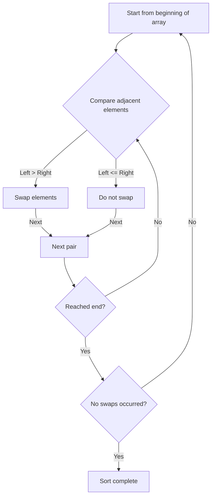
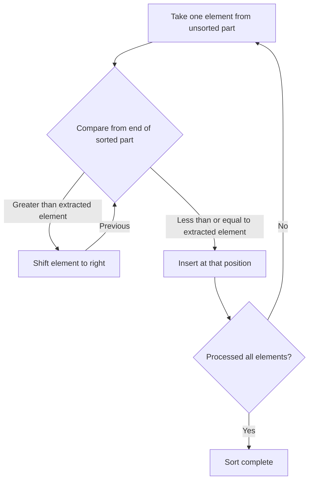
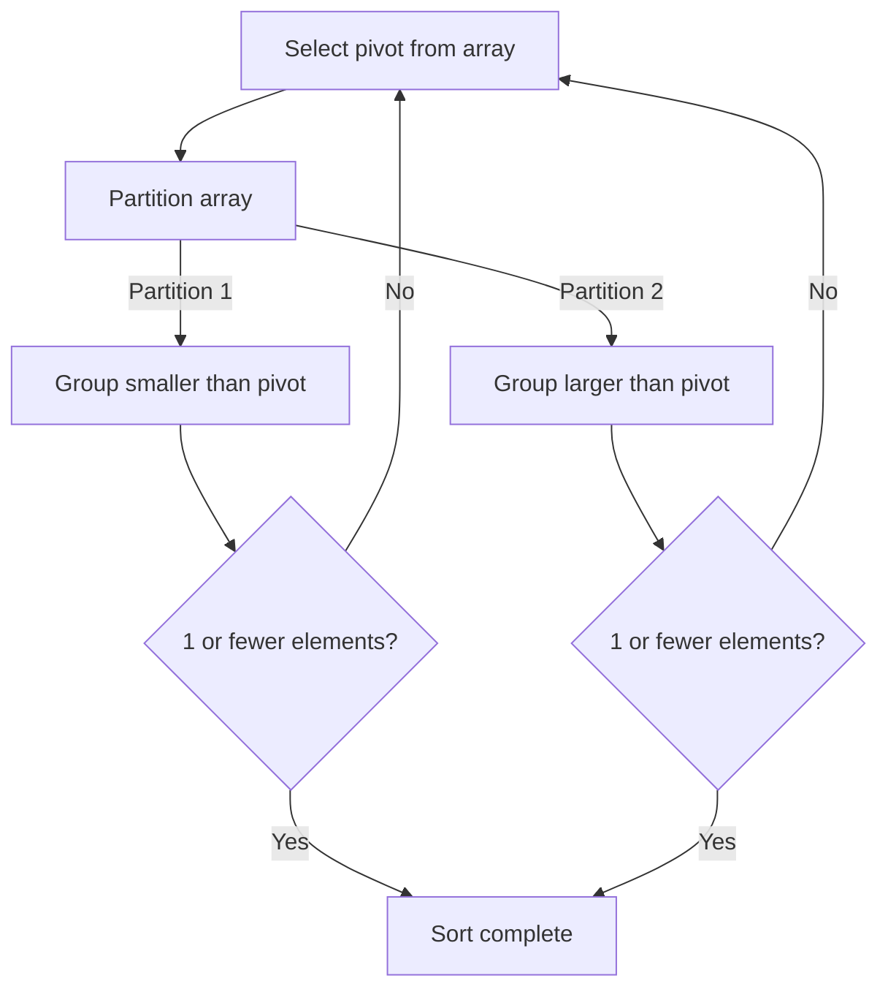
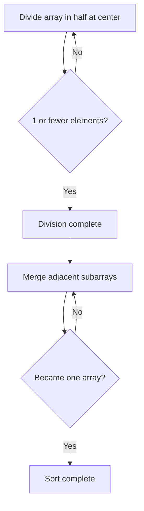

# 1. Introduction: The Deep World of Sorting Algorithms

In computer science, sorting data into a specific order (ascending or descending) is one of the most fundamental and important operations. Sorting algorithms play a vital role as a preliminary step in all kinds of data processing, such as speeding up searches, grouping data, and detecting duplicates.

In this article, we comprehensively explain representative sorting algorithms, ranging from simple algorithms easy for beginners to understand, to high-speed algorithms active in practical use. You will visually understand how each algorithm works with **Mermaid** diagrams, check actual implementations in Python code, and compare performance such as time complexity. Furthermore, to fully grasp the behavior of the algorithms, a complete execution trace using an array of 50 elements is included. This will allow you to understand the detailed behavior of the algorithms as if holding them in your hands.

## Algorithm Evaluation Metrics

When evaluating each algorithm, the following metrics are important.

- **Time Complexity**: Indicates how processing time increases with respect to the number of data elements $n$. Big-O notation, such as $\text{O}(n^2)$ or $\text{O}(n \log n)$, is used. When handling text within formulas, it is written like $\text{best}$.
- **Space Complexity**: Indicates how much additional memory is required during execution. In-place algorithms require almost no additional memory.
- **Stability**: Indicates whether the relative order of elements with the same value is preserved before and after sorting. In stable sorting, the original order is maintained.

---

## 2. Bubble Sort

An algorithm that repeats the operation of comparing adjacent elements and swapping them if they are in the wrong order. Like bubbles rising to the water surface, large elements gradually move to the end of the array.

### Time Complexity and Characteristics

- **Time Complexity (Best)**: $\text{O}(n)$
- **Time Complexity (Average)**: $\text{O}(n^2)$
- **Time Complexity (Worst)**: $\text{O}(n^2)$
- **Space Complexity**: $\text{O}(1)$
- **Stability**: Stable

### Visualization (Mermaid)



### Python Implementation

```python
def bubble_sort(arr):
    n = len(arr)
    for i in range(n):
        swapped = False
        for j in range(0, n-i-1):
            if arr[j] > arr[j+1]:
                arr[j], arr[j+1] = arr[j+1], arr[j]
                swapped = True
        if not swapped:
            break
    return arr
```

### Detailed Trace of Bubble Sort

Shows the state of the array after completing each pass when bubble sort is executed on a random array of 50 elements. Observe how bubble sort pushes elements to the right side.

**Initial state**: `[83, 14, 64, 71, 83, 11, 36, 69, 72, 45, 93, 30, 14, 76, 72, 51, 19, 41, 56, 15, 63, 27, 87, 55, 58, 63, 46, 96, 43, 68, 32, 97, 48, 94, 56, 27, 68, 40, 66, 88, 58, 15, 84, 10, 40, 27, 34, 48, 78, 56]`

**After pass 1**: `[14, 64, 71, 83, 11, 36, 69, 72, 45, 83, 30, 14, 76, 72, 51, 19, 41, 56, 15, 63, 27, 87, 55, 58, 63, 46, 93, 43, 68, 32, 96, 48, 94, 56, 27, 68, 40, 66, 88, 58, 15, 84, 10, 40, 27, 34, 48, 78, 56, 97]`

In this pass, the largest element in the unsorted part floated up to the right end like a bubble. Due to the characteristics of bubble sort, it is guaranteed that at least one element settles into its final correct position per pass. Therefore, as passes accumulate, the search range can be narrowed down one by one, reducing unnecessary comparison operations. However, in the worst-case scenario where the data is in completely reverse order, swap operations occur for all element pairs, so the time complexity reaches $\text{O}(n^2)$, and performance becomes extremely low.

In this pass, the largest element in the unsorted part floated up to the right end like a bubble. Due to the characteristics of bubble sort, it is guaranteed that at least one element settles into its final correct position per pass. Therefore, as passes accumulate, the search range can be narrowed down one by one, reducing unnecessary comparison operations. However, in the worst-case scenario where the data is in completely reverse order, swap operations occur for all element pairs, so the time complexity reaches $\text{O}(n^2)$, and performance becomes extremely low.

**After pass 2**: `[14, 64, 71, 11, 36, 69, 72, 45, 83, 30, 14, 76, 72, 51, 19, 41, 56, 15, 63, 27, 83, 55, 58, 63, 46, 87, 43, 68, 32, 93, 48, 94, 56, 27, 68, 40, 66, 88, 58, 15, 84, 10, 40, 27, 34, 48, 78, 56, 96, 97]`

In this pass, the largest element in the unsorted part floated up to the right end like a bubble. Due to the characteristics of bubble sort, it is guaranteed that at least one element settles into its final correct position per pass. Therefore, as passes accumulate, the search range can be narrowed down one by one, reducing unnecessary comparison operations. However, in the worst-case scenario where the data is in completely reverse order, swap operations occur for all element pairs, so the time complexity reaches $\text{O}(n^2)$, and performance becomes extremely low.

In this pass, the largest element in the unsorted part floated up to the right end like a bubble. Due to the characteristics of bubble sort, it is guaranteed that at least one element settles into its final correct position per pass. Therefore, as passes accumulate, the search range can be narrowed down one by one, reducing unnecessary comparison operations. However, in the worst-case scenario where the data is in completely reverse order, swap operations occur for all element pairs, so the time complexity reaches $\text{O}(n^2)$, and performance becomes extremely low.

**After pass 3**: `[14, 64, 11, 36, 69, 71, 45, 72, 30, 14, 76, 72, 51, 19, 41, 56, 15, 63, 27, 83, 55, 58, 63, 46, 83, 43, 68, 32, 87, 48, 93, 56, 27, 68, 40, 66, 88, 58, 15, 84, 10, 40, 27, 34, 48, 78, 56, 94, 96, 97]`

In this pass, the largest element in the unsorted part floated up to the right end like a bubble. Due to the characteristics of bubble sort, it is guaranteed that at least one element settles into its final correct position per pass. Therefore, as passes accumulate, the search range can be narrowed down one by one, reducing unnecessary comparison operations. However, in the worst-case scenario where the data is in completely reverse order, swap operations occur for all element pairs, so the time complexity reaches $\text{O}(n^2)$, and performance becomes extremely low.

In this pass, the largest element in the unsorted part floated up to the right end like a bubble. Due to the characteristics of bubble sort, it is guaranteed that at least one element settles into its final correct position per pass. Therefore, as passes accumulate, the search range can be narrowed down one by one, reducing unnecessary comparison operations. However, in the worst-case scenario where the data is in completely reverse order, swap operations occur for all element pairs, so the time complexity reaches $\text{O}(n^2)$, and performance becomes extremely low.

**After pass 4**: `[14, 11, 36, 64, 69, 45, 71, 30, 14, 72, 72, 51, 19, 41, 56, 15, 63, 27, 76, 55, 58, 63, 46, 83, 43, 68, 32, 83, 48, 87, 56, 27, 68, 40, 66, 88, 58, 15, 84, 10, 40, 27, 34, 48, 78, 56, 93, 94, 96, 97]`

In this pass, the largest element in the unsorted part floated up to the right end like a bubble. Due to the characteristics of bubble sort, it is guaranteed that at least one element settles into its final correct position per pass. Therefore, as passes accumulate, the search range can be narrowed down one by one, reducing unnecessary comparison operations. However, in the worst-case scenario where the data is in completely reverse order, swap operations occur for all element pairs, so the time complexity reaches $\text{O}(n^2)$, and performance becomes extremely low.

In this pass, the largest element in the unsorted part floated up to the right end like a bubble. Due to the characteristics of bubble sort, it is guaranteed that at least one element settles into its final correct position per pass. Therefore, as passes accumulate, the search range can be narrowed down one by one, reducing unnecessary comparison operations. However, in the worst-case scenario where the data is in completely reverse order, swap operations occur for all element pairs, so the time complexity reaches $\text{O}(n^2)$, and performance becomes extremely low.

**After pass 5**: `[11, 14, 36, 64, 45, 69, 30, 14, 71, 72, 51, 19, 41, 56, 15, 63, 27, 72, 55, 58, 63, 46, 76, 43, 68, 32, 83, 48, 83, 56, 27, 68, 40, 66, 87, 58, 15, 84, 10, 40, 27, 34, 48, 78, 56, 88, 93, 94, 96, 97]`

In this pass, the largest element in the unsorted part floated up to the right end like a bubble. Due to the characteristics of bubble sort, it is guaranteed that at least one element settles into its final correct position per pass. Therefore, as passes accumulate, the search range can be narrowed down one by one, reducing unnecessary comparison operations. However, in the worst-case scenario where the data is in completely reverse order, swap operations occur for all element pairs, so the time complexity reaches $\text{O}(n^2)$, and performance becomes extremely low.

In this pass, the largest element in the unsorted part floated up to the right end like a bubble. Due to the characteristics of bubble sort, it is guaranteed that at least one element settles into its final correct position per pass. Therefore, as passes accumulate, the search range can be narrowed down one by one, reducing unnecessary comparison operations. However, in the worst-case scenario where the data is in completely reverse order, swap operations occur for all element pairs, so the time complexity reaches $\text{O}(n^2)$, and performance becomes extremely low.

**After pass 6**: `[11, 14, 36, 45, 64, 30, 14, 69, 71, 51, 19, 41, 56, 15, 63, 27, 72, 55, 58, 63, 46, 72, 43, 68, 32, 76, 48, 83, 56, 27, 68, 40, 66, 83, 58, 15, 84, 10, 40, 27, 34, 48, 78, 56, 87, 88, 93, 94, 96, 97]`

In this pass, the largest element in the unsorted part floated up to the right end like a bubble. Due to the characteristics of bubble sort, it is guaranteed that at least one element settles into its final correct position per pass. Therefore, as passes accumulate, the search range can be narrowed down one by one, reducing unnecessary comparison operations. However, in the worst-case scenario where the data is in completely reverse order, swap operations occur for all element pairs, so the time complexity reaches $\text{O}(n^2)$, and performance becomes extremely low.

In this pass, the largest element in the unsorted part floated up to the right end like a bubble. Due to the characteristics of bubble sort, it is guaranteed that at least one element settles into its final correct position per pass. Therefore, as passes accumulate, the search range can be narrowed down one by one, reducing unnecessary comparison operations. However, in the worst-case scenario where the data is in completely reverse order, swap operations occur for all element pairs, so the time complexity reaches $\text{O}(n^2)$, and performance becomes extremely low.

**After pass 7**: `[11, 14, 36, 45, 30, 14, 64, 69, 51, 19, 41, 56, 15, 63, 27, 71, 55, 58, 63, 46, 72, 43, 68, 32, 72, 48, 76, 56, 27, 68, 40, 66, 83, 58, 15, 83, 10, 40, 27, 34, 48, 78, 56, 84, 87, 88, 93, 94, 96, 97]`

In this pass, the largest element in the unsorted part floated up to the right end like a bubble. Due to the characteristics of bubble sort, it is guaranteed that at least one element settles into its final correct position per pass. Therefore, as passes accumulate, the search range can be narrowed down one by one, reducing unnecessary comparison operations. However, in the worst-case scenario where the data is in completely reverse order, swap operations occur for all element pairs, so the time complexity reaches $\text{O}(n^2)$, and performance becomes extremely low.

In this pass, the largest element in the unsorted part floated up to the right end like a bubble. Due to the characteristics of bubble sort, it is guaranteed that at least one element settles into its final correct position per pass. Therefore, as passes accumulate, the search range can be narrowed down one by one, reducing unnecessary comparison operations. However, in the worst-case scenario where the data is in completely reverse order, swap operations occur for all element pairs, so the time complexity reaches $\text{O}(n^2)$, and performance becomes extremely low.

**After pass 8**: `[11, 14, 36, 30, 14, 45, 64, 51, 19, 41, 56, 15, 63, 27, 69, 55, 58, 63, 46, 71, 43, 68, 32, 72, 48, 72, 56, 27, 68, 40, 66, 76, 58, 15, 83, 10, 40, 27, 34, 48, 78, 56, 83, 84, 87, 88, 93, 94, 96, 97]`

In this pass, the largest element in the unsorted part floated up to the right end like a bubble. Due to the characteristics of bubble sort, it is guaranteed that at least one element settles into its final correct position per pass. Therefore, as passes accumulate, the search range can be narrowed down one by one, reducing unnecessary comparison operations. However, in the worst-case scenario where the data is in completely reverse order, swap operations occur for all element pairs, so the time complexity reaches $\text{O}(n^2)$, and performance becomes extremely low.

In this pass, the largest element in the unsorted part floated up to the right end like a bubble. Due to the characteristics of bubble sort, it is guaranteed that at least one element settles into its final correct position per pass. Therefore, as passes accumulate, the search range can be narrowed down one by one, reducing unnecessary comparison operations. However, in the worst-case scenario where the data is in completely reverse order, swap operations occur for all element pairs, so the time complexity reaches $\text{O}(n^2)$, and performance becomes extremely low.

**After pass 9**: `[11, 14, 30, 14, 36, 45, 51, 19, 41, 56, 15, 63, 27, 64, 55, 58, 63, 46, 69, 43, 68, 32, 71, 48, 72, 56, 27, 68, 40, 66, 72, 58, 15, 76, 10, 40, 27, 34, 48, 78, 56, 83, 83, 84, 87, 88, 93, 94, 96, 97]`

In this pass, the largest element in the unsorted part floated up to the right end like a bubble. Due to the characteristics of bubble sort, it is guaranteed that at least one element settles into its final correct position per pass. Therefore, as passes accumulate, the search range can be narrowed down one by one, reducing unnecessary comparison operations. However, in the worst-case scenario where the data is in completely reverse order, swap operations occur for all element pairs, so the time complexity reaches $\text{O}(n^2)$, and performance becomes extremely low.

In this pass, the largest element in the unsorted part floated up to the right end like a bubble. Due to the characteristics of bubble sort, it is guaranteed that at least one element settles into its final correct position per pass. Therefore, as passes accumulate, the search range can be narrowed down one by one, reducing unnecessary comparison operations. However, in the worst-case scenario where the data is in completely reverse order, swap operations occur for all element pairs, so the time complexity reaches $\text{O}(n^2)$, and performance becomes extremely low.

**After pass 10**: `[11, 14, 14, 30, 36, 45, 19, 41, 51, 15, 56, 27, 63, 55, 58, 63, 46, 64, 43, 68, 32, 69, 48, 71, 56, 27, 68, 40, 66, 72, 58, 15, 72, 10, 40, 27, 34, 48, 76, 56, 78, 83, 83, 84, 87, 88, 93, 94, 96, 97]`

In this pass, the largest element in the unsorted part floated up to the right end like a bubble. Due to the characteristics of bubble sort, it is guaranteed that at least one element settles into its final correct position per pass. Therefore, as passes accumulate, the search range can be narrowed down one by one, reducing unnecessary comparison operations. However, in the worst-case scenario where the data is in completely reverse order, swap operations occur for all element pairs, so the time complexity reaches $\text{O}(n^2)$, and performance becomes extremely low.

In this pass, the largest element in the unsorted part floated up to the right end like a bubble. Due to the characteristics of bubble sort, it is guaranteed that at least one element settles into its final correct position per pass. Therefore, as passes accumulate, the search range can be narrowed down one by one, reducing unnecessary comparison operations. However, in the worst-case scenario where the data is in completely reverse order, swap operations occur for all element pairs, so the time complexity reaches $\text{O}(n^2)$, and performance becomes extremely low.

**After pass 11**: `[11, 14, 14, 30, 36, 19, 41, 45, 15, 51, 27, 56, 55, 58, 63, 46, 63, 43, 64, 32, 68, 48, 69, 56, 27, 68, 40, 66, 71, 58, 15, 72, 10, 40, 27, 34, 48, 72, 56, 76, 78, 83, 83, 84, 87, 88, 93, 94, 96, 97]`

In this pass, the largest element in the unsorted part floated up to the right end like a bubble. Due to the characteristics of bubble sort, it is guaranteed that at least one element settles into its final correct position per pass. Therefore, as passes accumulate, the search range can be narrowed down one by one, reducing unnecessary comparison operations. However, in the worst-case scenario where the data is in completely reverse order, swap operations occur for all element pairs, so the time complexity reaches $\text{O}(n^2)$, and performance becomes extremely low.

In this pass, the largest element in the unsorted part floated up to the right end like a bubble. Due to the characteristics of bubble sort, it is guaranteed that at least one element settles into its final correct position per pass. Therefore, as passes accumulate, the search range can be narrowed down one by one, reducing unnecessary comparison operations. However, in the worst-case scenario where the data is in completely reverse order, swap operations occur for all element pairs, so the time complexity reaches $\text{O}(n^2)$, and performance becomes extremely low.

**After pass 12**: `[11, 14, 14, 30, 19, 36, 41, 15, 45, 27, 51, 55, 56, 58, 46, 63, 43, 63, 32, 64, 48, 68, 56, 27, 68, 40, 66, 69, 58, 15, 71, 10, 40, 27, 34, 48, 72, 56, 72, 76, 78, 83, 83, 84, 87, 88, 93, 94, 96, 97]`

In this pass, the largest element in the unsorted part floated up to the right end like a bubble. Due to the characteristics of bubble sort, it is guaranteed that at least one element settles into its final correct position per pass. Therefore, as passes accumulate, the search range can be narrowed down one by one, reducing unnecessary comparison operations. However, in the worst-case scenario where the data is in completely reverse order, swap operations occur for all element pairs, so the time complexity reaches $\text{O}(n^2)$, and performance becomes extremely low.

In this pass, the largest element in the unsorted part floated up to the right end like a bubble. Due to the characteristics of bubble sort, it is guaranteed that at least one element settles into its final correct position per pass. Therefore, as passes accumulate, the search range can be narrowed down one by one, reducing unnecessary comparison operations. However, in the worst-case scenario where the data is in completely reverse order, swap operations occur for all element pairs, so the time complexity reaches $\text{O}(n^2)$, and performance becomes extremely low.

**After pass 13**: `[11, 14, 14, 19, 30, 36, 15, 41, 27, 45, 51, 55, 56, 46, 58, 43, 63, 32, 63, 48, 64, 56, 27, 68, 40, 66, 68, 58, 15, 69, 10, 40, 27, 34, 48, 71, 56, 72, 72, 76, 78, 83, 83, 84, 87, 88, 93, 94, 96, 97]`

In this pass, the largest element in the unsorted part floated up to the right end like a bubble. Due to the characteristics of bubble sort, it is guaranteed that at least one element settles into its final correct position per pass. Therefore, as passes accumulate, the search range can be narrowed down one by one, reducing unnecessary comparison operations. However, in the worst-case scenario where the data is in completely reverse order, swap operations occur for all element pairs, so the time complexity reaches $\text{O}(n^2)$, and performance becomes extremely low.

In this pass, the largest element in the unsorted part floated up to the right end like a bubble. Due to the characteristics of bubble sort, it is guaranteed that at least one element settles into its final correct position per pass. Therefore, as passes accumulate, the search range can be narrowed down one by one, reducing unnecessary comparison operations. However, in the worst-case scenario where the data is in completely reverse order, swap operations occur for all element pairs, so the time complexity reaches $\text{O}(n^2)$, and performance becomes extremely low.

**After pass 14**: `[11, 14, 14, 19, 30, 15, 36, 27, 41, 45, 51, 55, 46, 56, 43, 58, 32, 63, 48, 63, 56, 27, 64, 40, 66, 68, 58, 15, 68, 10, 40, 27, 34, 48, 69, 56, 71, 72, 72, 76, 78, 83, 83, 84, 87, 88, 93, 94, 96, 97]`

In this pass, the largest element in the unsorted part floated up to the right end like a bubble. Due to the characteristics of bubble sort, it is guaranteed that at least one element settles into its final correct position per pass. Therefore, as passes accumulate, the search range can be narrowed down one by one, reducing unnecessary comparison operations. However, in the worst-case scenario where the data is in completely reverse order, swap operations occur for all element pairs, so the time complexity reaches $\text{O}(n^2)$, and performance becomes extremely low.

In this pass, the largest element in the unsorted part floated up to the right end like a bubble. Due to the characteristics of bubble sort, it is guaranteed that at least one element settles into its final correct position per pass. Therefore, as passes accumulate, the search range can be narrowed down one by one, reducing unnecessary comparison operations. However, in the worst-case scenario where the data is in completely reverse order, swap operations occur for all element pairs, so the time complexity reaches $\text{O}(n^2)$, and performance becomes extremely low.

**After pass 15**: `[11, 14, 14, 19, 15, 30, 27, 36, 41, 45, 51, 46, 55, 43, 56, 32, 58, 48, 63, 56, 27, 63, 40, 64, 66, 58, 15, 68, 10, 40, 27, 34, 48, 68, 56, 69, 71, 72, 72, 76, 78, 83, 83, 84, 87, 88, 93, 94, 96, 97]`

In this pass, the largest element in the unsorted part floated up to the right end like a bubble. Due to the characteristics of bubble sort, it is guaranteed that at least one element settles into its final correct position per pass. Therefore, as passes accumulate, the search range can be narrowed down one by one, reducing unnecessary comparison operations. However, in the worst-case scenario where the data is in completely reverse order, swap operations occur for all element pairs, so the time complexity reaches $\text{O}(n^2)$, and performance becomes extremely low.

In this pass, the largest element in the unsorted part floated up to the right end like a bubble. Due to the characteristics of bubble sort, it is guaranteed that at least one element settles into its final correct position per pass. Therefore, as passes accumulate, the search range can be narrowed down one by one, reducing unnecessary comparison operations. However, in the worst-case scenario where the data is in completely reverse order, swap operations occur for all element pairs, so the time complexity reaches $\text{O}(n^2)$, and performance becomes extremely low.

**After pass 16**: `[11, 14, 14, 15, 19, 27, 30, 36, 41, 45, 46, 51, 43, 55, 32, 56, 48, 58, 56, 27, 63, 40, 63, 64, 58, 15, 66, 10, 40, 27, 34, 48, 68, 56, 68, 69, 71, 72, 72, 76, 78, 83, 83, 84, 87, 88, 93, 94, 96, 97]`

In this pass, the largest element in the unsorted part floated up to the right end like a bubble. Due to the characteristics of bubble sort, it is guaranteed that at least one element settles into its final correct position per pass. Therefore, as passes accumulate, the search range can be narrowed down one by one, reducing unnecessary comparison operations. However, in the worst-case scenario where the data is in completely reverse order, swap operations occur for all element pairs, so the time complexity reaches $\text{O}(n^2)$, and performance becomes extremely low.

In this pass, the largest element in the unsorted part floated up to the right end like a bubble. Due to the characteristics of bubble sort, it is guaranteed that at least one element settles into its final correct position per pass. Therefore, as passes accumulate, the search range can be narrowed down one by one, reducing unnecessary comparison operations. However, in the worst-case scenario where the data is in completely reverse order, swap operations occur for all element pairs, so the time complexity reaches $\text{O}(n^2)$, and performance becomes extremely low.

**After pass 17**: `[11, 14, 14, 15, 19, 27, 30, 36, 41, 45, 46, 43, 51, 32, 55, 48, 56, 56, 27, 58, 40, 63, 63, 58, 15, 64, 10, 40, 27, 34, 48, 66, 56, 68, 68, 69, 71, 72, 72, 76, 78, 83, 83, 84, 87, 88, 93, 94, 96, 97]`

In this pass, the largest element in the unsorted part floated up to the right end like a bubble. Due to the characteristics of bubble sort, it is guaranteed that at least one element settles into its final correct position per pass. Therefore, as passes accumulate, the search range can be narrowed down one by one, reducing unnecessary comparison operations. However, in the worst-case scenario where the data is in completely reverse order, swap operations occur for all element pairs, so the time complexity reaches $\text{O}(n^2)$, and performance becomes extremely low.

In this pass, the largest element in the unsorted part floated up to the right end like a bubble. Due to the characteristics of bubble sort, it is guaranteed that at least one element settles into its final correct position per pass. Therefore, as passes accumulate, the search range can be narrowed down one by one, reducing unnecessary comparison operations. However, in the worst-case scenario where the data is in completely reverse order, swap operations occur for all element pairs, so the time complexity reaches $\text{O}(n^2)$, and performance becomes extremely low.

**After pass 18**: `[11, 14, 14, 15, 19, 27, 30, 36, 41, 45, 43, 46, 32, 51, 48, 55, 56, 27, 56, 40, 58, 63, 58, 15, 63, 10, 40, 27, 34, 48, 64, 56, 66, 68, 68, 69, 71, 72, 72, 76, 78, 83, 83, 84, 87, 88, 93, 94, 96, 97]`

In this pass, the largest element in the unsorted part floated up to the right end like a bubble. Due to the characteristics of bubble sort, it is guaranteed that at least one element settles into its final correct position per pass. Therefore, as passes accumulate, the search range can be narrowed down one by one, reducing unnecessary comparison operations. However, in the worst-case scenario where the data is in completely reverse order, swap operations occur for all element pairs, so the time complexity reaches $\text{O}(n^2)$, and performance becomes extremely low.

In this pass, the largest element in the unsorted part floated up to the right end like a bubble. Due to the characteristics of bubble sort, it is guaranteed that at least one element settles into its final correct position per pass. Therefore, as passes accumulate, the search range can be narrowed down one by one, reducing unnecessary comparison operations. However, in the worst-case scenario where the data is in completely reverse order, swap operations occur for all element pairs, so the time complexity reaches $\text{O}(n^2)$, and performance becomes extremely low.

**After pass 19**: `[11, 14, 14, 15, 19, 27, 30, 36, 41, 43, 45, 32, 46, 48, 51, 55, 27, 56, 40, 56, 58, 58, 15, 63, 10, 40, 27, 34, 48, 63, 56, 64, 66, 68, 68, 69, 71, 72, 72, 76, 78, 83, 83, 84, 87, 88, 93, 94, 96, 97]`

In this pass, the largest element in the unsorted part floated up to the right end like a bubble. Due to the characteristics of bubble sort, it is guaranteed that at least one element settles into its final correct position per pass. Therefore, as passes accumulate, the search range can be narrowed down one by one, reducing unnecessary comparison operations. However, in the worst-case scenario where the data is in completely reverse order, swap operations occur for all element pairs, so the time complexity reaches $\text{O}(n^2)$, and performance becomes extremely low.

In this pass, the largest element in the unsorted part floated up to the right end like a bubble. Due to the characteristics of bubble sort, it is guaranteed that at least one element settles into its final correct position per pass. Therefore, as passes accumulate, the search range can be narrowed down one by one, reducing unnecessary comparison operations. However, in the worst-case scenario where the data is in completely reverse order, swap operations occur for all element pairs, so the time complexity reaches $\text{O}(n^2)$, and performance becomes extremely low.

**After pass 20**: `[11, 14, 14, 15, 19, 27, 30, 36, 41, 43, 32, 45, 46, 48, 51, 27, 55, 40, 56, 56, 58, 15, 58, 10, 40, 27, 34, 48, 63, 56, 63, 64, 66, 68, 68, 69, 71, 72, 72, 76, 78, 83, 83, 84, 87, 88, 93, 94, 96, 97]`

In this pass, the largest element in the unsorted part floated up to the right end like a bubble. Due to the characteristics of bubble sort, it is guaranteed that at least one element settles into its final correct position per pass. Therefore, as passes accumulate, the search range can be narrowed down one by one, reducing unnecessary comparison operations. However, in the worst-case scenario where the data is in completely reverse order, swap operations occur for all element pairs, so the time complexity reaches $\text{O}(n^2)$, and performance becomes extremely low.

In this pass, the largest element in the unsorted part floated up to the right end like a bubble. Due to the characteristics of bubble sort, it is guaranteed that at least one element settles into its final correct position per pass. Therefore, as passes accumulate, the search range can be narrowed down one by one, reducing unnecessary comparison operations. However, in the worst-case scenario where the data is in completely reverse order, swap operations occur for all element pairs, so the time complexity reaches $\text{O}(n^2)$, and performance becomes extremely low.

**After pass 21**: `[11, 14, 14, 15, 19, 27, 30, 36, 41, 32, 43, 45, 46, 48, 27, 51, 40, 55, 56, 56, 15, 58, 10, 40, 27, 34, 48, 58, 56, 63, 63, 64, 66, 68, 68, 69, 71, 72, 72, 76, 78, 83, 83, 84, 87, 88, 93, 94, 96, 97]`

In this pass, the largest element in the unsorted part floated up to the right end like a bubble. Due to the characteristics of bubble sort, it is guaranteed that at least one element settles into its final correct position per pass. Therefore, as passes accumulate, the search range can be narrowed down one by one, reducing unnecessary comparison operations. However, in the worst-case scenario where the data is in completely reverse order, swap operations occur for all element pairs, so the time complexity reaches $\text{O}(n^2)$, and performance becomes extremely low.

In this pass, the largest element in the unsorted part floated up to the right end like a bubble. Due to the characteristics of bubble sort, it is guaranteed that at least one element settles into its final correct position per pass. Therefore, as passes accumulate, the search range can be narrowed down one by one, reducing unnecessary comparison operations. However, in the worst-case scenario where the data is in completely reverse order, swap operations occur for all element pairs, so the time complexity reaches $\text{O}(n^2)$, and performance becomes extremely low.

**After pass 22**: `[11, 14, 14, 15, 19, 27, 30, 36, 32, 41, 43, 45, 46, 27, 48, 40, 51, 55, 56, 15, 56, 10, 40, 27, 34, 48, 58, 56, 58, 63, 63, 64, 66, 68, 68, 69, 71, 72, 72, 76, 78, 83, 83, 84, 87, 88, 93, 94, 96, 97]`

In this pass, the largest element in the unsorted part floated up to the right end like a bubble. Due to the characteristics of bubble sort, it is guaranteed that at least one element settles into its final correct position per pass. Therefore, as passes accumulate, the search range can be narrowed down one by one, reducing unnecessary comparison operations. However, in the worst-case scenario where the data is in completely reverse order, swap operations occur for all element pairs, so the time complexity reaches $\text{O}(n^2)$, and performance becomes extremely low.

In this pass, the largest element in the unsorted part floated up to the right end like a bubble. Due to the characteristics of bubble sort, it is guaranteed that at least one element settles into its final correct position per pass. Therefore, as passes accumulate, the search range can be narrowed down one by one, reducing unnecessary comparison operations. However, in the worst-case scenario where the data is in completely reverse order, swap operations occur for all element pairs, so the time complexity reaches $\text{O}(n^2)$, and performance becomes extremely low.

**After pass 23**: `[11, 14, 14, 15, 19, 27, 30, 32, 36, 41, 43, 45, 27, 46, 40, 48, 51, 55, 15, 56, 10, 40, 27, 34, 48, 56, 56, 58, 58, 63, 63, 64, 66, 68, 68, 69, 71, 72, 72, 76, 78, 83, 83, 84, 87, 88, 93, 94, 96, 97]`

In this pass, the largest element in the unsorted part floated up to the right end like a bubble. Due to the characteristics of bubble sort, it is guaranteed that at least one element settles into its final correct position per pass. Therefore, as passes accumulate, the search range can be narrowed down one by one, reducing unnecessary comparison operations. However, in the worst-case scenario where the data is in completely reverse order, swap operations occur for all element pairs, so the time complexity reaches $\text{O}(n^2)$, and performance becomes extremely low.

In this pass, the largest element in the unsorted part floated up to the right end like a bubble. Due to the characteristics of bubble sort, it is guaranteed that at least one element settles into its final correct position per pass. Therefore, as passes accumulate, the search range can be narrowed down one by one, reducing unnecessary comparison operations. However, in the worst-case scenario where the data is in completely reverse order, swap operations occur for all element pairs, so the time complexity reaches $\text{O}(n^2)$, and performance becomes extremely low.

**After pass 24**: `[11, 14, 14, 15, 19, 27, 30, 32, 36, 41, 43, 27, 45, 40, 46, 48, 51, 15, 55, 10, 40, 27, 34, 48, 56, 56, 56, 58, 58, 63, 63, 64, 66, 68, 68, 69, 71, 72, 72, 76, 78, 83, 83, 84, 87, 88, 93, 94, 96, 97]`

In this pass, the largest element in the unsorted part floated up to the right end like a bubble. Due to the characteristics of bubble sort, it is guaranteed that at least one element settles into its final correct position per pass. Therefore, as passes accumulate, the search range can be narrowed down one by one, reducing unnecessary comparison operations. However, in the worst-case scenario where the data is in completely reverse order, swap operations occur for all element pairs, so the time complexity reaches $\text{O}(n^2)$, and performance becomes extremely low.

In this pass, the largest element in the unsorted part floated up to the right end like a bubble. Due to the characteristics of bubble sort, it is guaranteed that at least one element settles into its final correct position per pass. Therefore, as passes accumulate, the search range can be narrowed down one by one, reducing unnecessary comparison operations. However, in the worst-case scenario where the data is in completely reverse order, swap operations occur for all element pairs, so the time complexity reaches $\text{O}(n^2)$, and performance becomes extremely low.

**After pass 25**: `[11, 14, 14, 15, 19, 27, 30, 32, 36, 41, 27, 43, 40, 45, 46, 48, 15, 51, 10, 40, 27, 34, 48, 55, 56, 56, 56, 58, 58, 63, 63, 64, 66, 68, 68, 69, 71, 72, 72, 76, 78, 83, 83, 84, 87, 88, 93, 94, 96, 97]`

In this pass, the largest element in the unsorted part floated up to the right end like a bubble. Due to the characteristics of bubble sort, it is guaranteed that at least one element settles into its final correct position per pass. Therefore, as passes accumulate, the search range can be narrowed down one by one, reducing unnecessary comparison operations. However, in the worst-case scenario where the data is in completely reverse order, swap operations occur for all element pairs, so the time complexity reaches $\text{O}(n^2)$, and performance becomes extremely low.

In this pass, the largest element in the unsorted part floated up to the right end like a bubble. Due to the characteristics of bubble sort, it is guaranteed that at least one element settles into its final correct position per pass. Therefore, as passes accumulate, the search range can be narrowed down one by one, reducing unnecessary comparison operations. However, in the worst-case scenario where the data is in completely reverse order, swap operations occur for all element pairs, so the time complexity reaches $\text{O}(n^2)$, and performance becomes extremely low.

**After pass 26**: `[11, 14, 14, 15, 19, 27, 30, 32, 36, 27, 41, 40, 43, 45, 46, 15, 48, 10, 40, 27, 34, 48, 51, 55, 56, 56, 56, 58, 58, 63, 63, 64, 66, 68, 68, 69, 71, 72, 72, 76, 78, 83, 83, 84, 87, 88, 93, 94, 96, 97]`

In this pass, the largest element in the unsorted part floated up to the right end like a bubble. Due to the characteristics of bubble sort, it is guaranteed that at least one element settles into its final correct position per pass. Therefore, as passes accumulate, the search range can be narrowed down one by one, reducing unnecessary comparison operations. However, in the worst-case scenario where the data is in completely reverse order, swap operations occur for all element pairs, so the time complexity reaches $\text{O}(n^2)$, and performance becomes extremely low.

In this pass, the largest element in the unsorted part floated up to the right end like a bubble. Due to the characteristics of bubble sort, it is guaranteed that at least one element settles into its final correct position per pass. Therefore, as passes accumulate, the search range can be narrowed down one by one, reducing unnecessary comparison operations. However, in the worst-case scenario where the data is in completely reverse order, swap operations occur for all element pairs, so the time complexity reaches $\text{O}(n^2)$, and performance becomes extremely low.

**After pass 27**: `[11, 14, 14, 15, 19, 27, 30, 32, 27, 36, 40, 41, 43, 45, 15, 46, 10, 40, 27, 34, 48, 48, 51, 55, 56, 56, 56, 58, 58, 63, 63, 64, 66, 68, 68, 69, 71, 72, 72, 76, 78, 83, 83, 84, 87, 88, 93, 94, 96, 97]`

In this pass, the largest element in the unsorted part floated up to the right end like a bubble. Due to the characteristics of bubble sort, it is guaranteed that at least one element settles into its final correct position per pass. Therefore, as passes accumulate, the search range can be narrowed down one by one, reducing unnecessary comparison operations. However, in the worst-case scenario where the data is in completely reverse order, swap operations occur for all element pairs, so the time complexity reaches $\text{O}(n^2)$, and performance becomes extremely low.

In this pass, the largest element in the unsorted part floated up to the right end like a bubble. Due to the characteristics of bubble sort, it is guaranteed that at least one element settles into its final correct position per pass. Therefore, as passes accumulate, the search range can be narrowed down one by one, reducing unnecessary comparison operations. However, in the worst-case scenario where the data is in completely reverse order, swap operations occur for all element pairs, so the time complexity reaches $\text{O}(n^2)$, and performance becomes extremely low.

**After pass 28**: `[11, 14, 14, 15, 19, 27, 30, 27, 32, 36, 40, 41, 43, 15, 45, 10, 40, 27, 34, 46, 48, 48, 51, 55, 56, 56, 56, 58, 58, 63, 63, 64, 66, 68, 68, 69, 71, 72, 72, 76, 78, 83, 83, 84, 87, 88, 93, 94, 96, 97]`

In this pass, the largest element in the unsorted part floated up to the right end like a bubble. Due to the characteristics of bubble sort, it is guaranteed that at least one element settles into its final correct position per pass. Therefore, as passes accumulate, the search range can be narrowed down one by one, reducing unnecessary comparison operations. However, in the worst-case scenario where the data is in completely reverse order, swap operations occur for all element pairs, so the time complexity reaches $\text{O}(n^2)$, and performance becomes extremely low.

In this pass, the largest element in the unsorted part floated up to the right end like a bubble. Due to the characteristics of bubble sort, it is guaranteed that at least one element settles into its final correct position per pass. Therefore, as passes accumulate, the search range can be narrowed down one by one, reducing unnecessary comparison operations. However, in the worst-case scenario where the data is in completely reverse order, swap operations occur for all element pairs, so the time complexity reaches $\text{O}(n^2)$, and performance becomes extremely low.

**After pass 29**: `[11, 14, 14, 15, 19, 27, 27, 30, 32, 36, 40, 41, 15, 43, 10, 40, 27, 34, 45, 46, 48, 48, 51, 55, 56, 56, 56, 58, 58, 63, 63, 64, 66, 68, 68, 69, 71, 72, 72, 76, 78, 83, 83, 84, 87, 88, 93, 94, 96, 97]`

In this pass, the largest element in the unsorted part floated up to the right end like a bubble. Due to the characteristics of bubble sort, it is guaranteed that at least one element settles into its final correct position per pass. Therefore, as passes accumulate, the search range can be narrowed down one by one, reducing unnecessary comparison operations. However, in the worst-case scenario where the data is in completely reverse order, swap operations occur for all element pairs, so the time complexity reaches $\text{O}(n^2)$, and performance becomes extremely low.

In this pass, the largest element in the unsorted part floated up to the right end like a bubble. Due to the characteristics of bubble sort, it is guaranteed that at least one element settles into its final correct position per pass. Therefore, as passes accumulate, the search range can be narrowed down one by one, reducing unnecessary comparison operations. However, in the worst-case scenario where the data is in completely reverse order, swap operations occur for all element pairs, so the time complexity reaches $\text{O}(n^2)$, and performance becomes extremely low.

**After pass 30**: `[11, 14, 14, 15, 19, 27, 27, 30, 32, 36, 40, 15, 41, 10, 40, 27, 34, 43, 45, 46, 48, 48, 51, 55, 56, 56, 56, 58, 58, 63, 63, 64, 66, 68, 68, 69, 71, 72, 72, 76, 78, 83, 83, 84, 87, 88, 93, 94, 96, 97]`

In this pass, the largest element in the unsorted part floated up to the right end like a bubble. Due to the characteristics of bubble sort, it is guaranteed that at least one element settles into its final correct position per pass. Therefore, as passes accumulate, the search range can be narrowed down one by one, reducing unnecessary comparison operations. However, in the worst-case scenario where the data is in completely reverse order, swap operations occur for all element pairs, so the time complexity reaches $\text{O}(n^2)$, and performance becomes extremely low.

In this pass, the largest element in the unsorted part floated up to the right end like a bubble. Due to the characteristics of bubble sort, it is guaranteed that at least one element settles into its final correct position per pass. Therefore, as passes accumulate, the search range can be narrowed down one by one, reducing unnecessary comparison operations. However, in the worst-case scenario where the data is in completely reverse order, swap operations occur for all element pairs, so the time complexity reaches $\text{O}(n^2)$, and performance becomes extremely low.

**After pass 31**: `[11, 14, 14, 15, 19, 27, 27, 30, 32, 36, 15, 40, 10, 40, 27, 34, 41, 43, 45, 46, 48, 48, 51, 55, 56, 56, 56, 58, 58, 63, 63, 64, 66, 68, 68, 69, 71, 72, 72, 76, 78, 83, 83, 84, 87, 88, 93, 94, 96, 97]`

In this pass, the largest element in the unsorted part floated up to the right end like a bubble. Due to the characteristics of bubble sort, it is guaranteed that at least one element settles into its final correct position per pass. Therefore, as passes accumulate, the search range can be narrowed down one by one, reducing unnecessary comparison operations. However, in the worst-case scenario where the data is in completely reverse order, swap operations occur for all element pairs, so the time complexity reaches $\text{O}(n^2)$, and performance becomes extremely low.

In this pass, the largest element in the unsorted part floated up to the right end like a bubble. Due to the characteristics of bubble sort, it is guaranteed that at least one element settles into its final correct position per pass. Therefore, as passes accumulate, the search range can be narrowed down one by one, reducing unnecessary comparison operations. However, in the worst-case scenario where the data is in completely reverse order, swap operations occur for all element pairs, so the time complexity reaches $\text{O}(n^2)$, and performance becomes extremely low.

**After pass 32**: `[11, 14, 14, 15, 19, 27, 27, 30, 32, 15, 36, 10, 40, 27, 34, 40, 41, 43, 45, 46, 48, 48, 51, 55, 56, 56, 56, 58, 58, 63, 63, 64, 66, 68, 68, 69, 71, 72, 72, 76, 78, 83, 83, 84, 87, 88, 93, 94, 96, 97]`

In this pass, the largest element in the unsorted part floated up to the right end like a bubble. Due to the characteristics of bubble sort, it is guaranteed that at least one element settles into its final correct position per pass. Therefore, as passes accumulate, the search range can be narrowed down one by one, reducing unnecessary comparison operations. However, in the worst-case scenario where the data is in completely reverse order, swap operations occur for all element pairs, so the time complexity reaches $\text{O}(n^2)$, and performance becomes extremely low.

In this pass, the largest element in the unsorted part floated up to the right end like a bubble. Due to the characteristics of bubble sort, it is guaranteed that at least one element settles into its final correct position per pass. Therefore, as passes accumulate, the search range can be narrowed down one by one, reducing unnecessary comparison operations. However, in the worst-case scenario where the data is in completely reverse order, swap operations occur for all element pairs, so the time complexity reaches $\text{O}(n^2)$, and performance becomes extremely low.

**After pass 33**: `[11, 14, 14, 15, 19, 27, 27, 30, 15, 32, 10, 36, 27, 34, 40, 40, 41, 43, 45, 46, 48, 48, 51, 55, 56, 56, 56, 58, 58, 63, 63, 64, 66, 68, 68, 69, 71, 72, 72, 76, 78, 83, 83, 84, 87, 88, 93, 94, 96, 97]`

In this pass, the largest element in the unsorted part floated up to the right end like a bubble. Due to the characteristics of bubble sort, it is guaranteed that at least one element settles into its final correct position per pass. Therefore, as passes accumulate, the search range can be narrowed down one by one, reducing unnecessary comparison operations. However, in the worst-case scenario where the data is in completely reverse order, swap operations occur for all element pairs, so the time complexity reaches $\text{O}(n^2)$, and performance becomes extremely low.

In this pass, the largest element in the unsorted part floated up to the right end like a bubble. Due to the characteristics of bubble sort, it is guaranteed that at least one element settles into its final correct position per pass. Therefore, as passes accumulate, the search range can be narrowed down one by one, reducing unnecessary comparison operations. However, in the worst-case scenario where the data is in completely reverse order, swap operations occur for all element pairs, so the time complexity reaches $\text{O}(n^2)$, and performance becomes extremely low.

**After pass 34**: `[11, 14, 14, 15, 19, 27, 27, 15, 30, 10, 32, 27, 34, 36, 40, 40, 41, 43, 45, 46, 48, 48, 51, 55, 56, 56, 56, 58, 58, 63, 63, 64, 66, 68, 68, 69, 71, 72, 72, 76, 78, 83, 83, 84, 87, 88, 93, 94, 96, 97]`

In this pass, the largest element in the unsorted part floated up to the right end like a bubble. Due to the characteristics of bubble sort, it is guaranteed that at least one element settles into its final correct position per pass. Therefore, as passes accumulate, the search range can be narrowed down one by one, reducing unnecessary comparison operations. However, in the worst-case scenario where the data is in completely reverse order, swap operations occur for all element pairs, so the time complexity reaches $\text{O}(n^2)$, and performance becomes extremely low.

In this pass, the largest element in the unsorted part floated up to the right end like a bubble. Due to the characteristics of bubble sort, it is guaranteed that at least one element settles into its final correct position per pass. Therefore, as passes accumulate, the search range can be narrowed down one by one, reducing unnecessary comparison operations. However, in the worst-case scenario where the data is in completely reverse order, swap operations occur for all element pairs, so the time complexity reaches $\text{O}(n^2)$, and performance becomes extremely low.

**After pass 35**: `[11, 14, 14, 15, 19, 27, 15, 27, 10, 30, 27, 32, 34, 36, 40, 40, 41, 43, 45, 46, 48, 48, 51, 55, 56, 56, 56, 58, 58, 63, 63, 64, 66, 68, 68, 69, 71, 72, 72, 76, 78, 83, 83, 84, 87, 88, 93, 94, 96, 97]`

In this pass, the largest element in the unsorted part floated up to the right end like a bubble. Due to the characteristics of bubble sort, it is guaranteed that at least one element settles into its final correct position per pass. Therefore, as passes accumulate, the search range can be narrowed down one by one, reducing unnecessary comparison operations. However, in the worst-case scenario where the data is in completely reverse order, swap operations occur for all element pairs, so the time complexity reaches $\text{O}(n^2)$, and performance becomes extremely low.

In this pass, the largest element in the unsorted part floated up to the right end like a bubble. Due to the characteristics of bubble sort, it is guaranteed that at least one element settles into its final correct position per pass. Therefore, as passes accumulate, the search range can be narrowed down one by one, reducing unnecessary comparison operations. However, in the worst-case scenario where the data is in completely reverse order, swap operations occur for all element pairs, so the time complexity reaches $\text{O}(n^2)$, and performance becomes extremely low.

**After pass 36**: `[11, 14, 14, 15, 19, 15, 27, 10, 27, 27, 30, 32, 34, 36, 40, 40, 41, 43, 45, 46, 48, 48, 51, 55, 56, 56, 56, 58, 58, 63, 63, 64, 66, 68, 68, 69, 71, 72, 72, 76, 78, 83, 83, 84, 87, 88, 93, 94, 96, 97]`

In this pass, the largest element in the unsorted part floated up to the right end like a bubble. Due to the characteristics of bubble sort, it is guaranteed that at least one element settles into its final correct position per pass. Therefore, as passes accumulate, the search range can be narrowed down one by one, reducing unnecessary comparison operations. However, in the worst-case scenario where the data is in completely reverse order, swap operations occur for all element pairs, so the time complexity reaches $\text{O}(n^2)$, and performance becomes extremely low.

In this pass, the largest element in the unsorted part floated up to the right end like a bubble. Due to the characteristics of bubble sort, it is guaranteed that at least one element settles into its final correct position per pass. Therefore, as passes accumulate, the search range can be narrowed down one by one, reducing unnecessary comparison operations. However, in the worst-case scenario where the data is in completely reverse order, swap operations occur for all element pairs, so the time complexity reaches $\text{O}(n^2)$, and performance becomes extremely low.

**After pass 37**: `[11, 14, 14, 15, 15, 19, 10, 27, 27, 27, 30, 32, 34, 36, 40, 40, 41, 43, 45, 46, 48, 48, 51, 55, 56, 56, 56, 58, 58, 63, 63, 64, 66, 68, 68, 69, 71, 72, 72, 76, 78, 83, 83, 84, 87, 88, 93, 94, 96, 97]`

In this pass, the largest element in the unsorted part floated up to the right end like a bubble. Due to the characteristics of bubble sort, it is guaranteed that at least one element settles into its final correct position per pass. Therefore, as passes accumulate, the search range can be narrowed down one by one, reducing unnecessary comparison operations. However, in the worst-case scenario where the data is in completely reverse order, swap operations occur for all element pairs, so the time complexity reaches $\text{O}(n^2)$, and performance becomes extremely low.

In this pass, the largest element in the unsorted part floated up to the right end like a bubble. Due to the characteristics of bubble sort, it is guaranteed that at least one element settles into its final correct position per pass. Therefore, as passes accumulate, the search range can be narrowed down one by one, reducing unnecessary comparison operations. However, in the worst-case scenario where the data is in completely reverse order, swap operations occur for all element pairs, so the time complexity reaches $\text{O}(n^2)$, and performance becomes extremely low.

**After pass 38**: `[11, 14, 14, 15, 15, 10, 19, 27, 27, 27, 30, 32, 34, 36, 40, 40, 41, 43, 45, 46, 48, 48, 51, 55, 56, 56, 56, 58, 58, 63, 63, 64, 66, 68, 68, 69, 71, 72, 72, 76, 78, 83, 83, 84, 87, 88, 93, 94, 96, 97]`

In this pass, the largest element in the unsorted part floated up to the right end like a bubble. Due to the characteristics of bubble sort, it is guaranteed that at least one element settles into its final correct position per pass. Therefore, as passes accumulate, the search range can be narrowed down one by one, reducing unnecessary comparison operations. However, in the worst-case scenario where the data is in completely reverse order, swap operations occur for all element pairs, so the time complexity reaches $\text{O}(n^2)$, and performance becomes extremely low.

In this pass, the largest element in the unsorted part floated up to the right end like a bubble. Due to the characteristics of bubble sort, it is guaranteed that at least one element settles into its final correct position per pass. Therefore, as passes accumulate, the search range can be narrowed down one by one, reducing unnecessary comparison operations. However, in the worst-case scenario where the data is in completely reverse order, swap operations occur for all element pairs, so the time complexity reaches $\text{O}(n^2)$, and performance becomes extremely low.

**After pass 39**: `[11, 14, 14, 15, 10, 15, 19, 27, 27, 27, 30, 32, 34, 36, 40, 40, 41, 43, 45, 46, 48, 48, 51, 55, 56, 56, 56, 58, 58, 63, 63, 64, 66, 68, 68, 69, 71, 72, 72, 76, 78, 83, 83, 84, 87, 88, 93, 94, 96, 97]`

In this pass, the largest element in the unsorted part floated up to the right end like a bubble. Due to the characteristics of bubble sort, it is guaranteed that at least one element settles into its final correct position per pass. Therefore, as passes accumulate, the search range can be narrowed down one by one, reducing unnecessary comparison operations. However, in the worst-case scenario where the data is in completely reverse order, swap operations occur for all element pairs, so the time complexity reaches $\text{O}(n^2)$, and performance becomes extremely low.

In this pass, the largest element in the unsorted part floated up to the right end like a bubble. Due to the characteristics of bubble sort, it is guaranteed that at least one element settles into its final correct position per pass. Therefore, as passes accumulate, the search range can be narrowed down one by one, reducing unnecessary comparison operations. However, in the worst-case scenario where the data is in completely reverse order, swap operations occur for all element pairs, so the time complexity reaches $\text{O}(n^2)$, and performance becomes extremely low.

**After pass 40**: `[11, 14, 14, 10, 15, 15, 19, 27, 27, 27, 30, 32, 34, 36, 40, 40, 41, 43, 45, 46, 48, 48, 51, 55, 56, 56, 56, 58, 58, 63, 63, 64, 66, 68, 68, 69, 71, 72, 72, 76, 78, 83, 83, 84, 87, 88, 93, 94, 96, 97]`

In this pass, the largest element in the unsorted part floated up to the right end like a bubble. Due to the characteristics of bubble sort, it is guaranteed that at least one element settles into its final correct position per pass. Therefore, as passes accumulate, the search range can be narrowed down one by one, reducing unnecessary comparison operations. However, in the worst-case scenario where the data is in completely reverse order, swap operations occur for all element pairs, so the time complexity reaches $\text{O}(n^2)$, and performance becomes extremely low.

In this pass, the largest element in the unsorted part floated up to the right end like a bubble. Due to the characteristics of bubble sort, it is guaranteed that at least one element settles into its final correct position per pass. Therefore, as passes accumulate, the search range can be narrowed down one by one, reducing unnecessary comparison operations. However, in the worst-case scenario where the data is in completely reverse order, swap operations occur for all element pairs, so the time complexity reaches $\text{O}(n^2)$, and performance becomes extremely low.

**After pass 41**: `[11, 14, 10, 14, 15, 15, 19, 27, 27, 27, 30, 32, 34, 36, 40, 40, 41, 43, 45, 46, 48, 48, 51, 55, 56, 56, 56, 58, 58, 63, 63, 64, 66, 68, 68, 69, 71, 72, 72, 76, 78, 83, 83, 84, 87, 88, 93, 94, 96, 97]`

In this pass, the largest element in the unsorted part floated up to the right end like a bubble. Due to the characteristics of bubble sort, it is guaranteed that at least one element settles into its final correct position per pass. Therefore, as passes accumulate, the search range can be narrowed down one by one, reducing unnecessary comparison operations. However, in the worst-case scenario where the data is in completely reverse order, swap operations occur for all element pairs, so the time complexity reaches $\text{O}(n^2)$, and performance becomes extremely low.

In this pass, the largest element in the unsorted part floated up to the right end like a bubble. Due to the characteristics of bubble sort, it is guaranteed that at least one element settles into its final correct position per pass. Therefore, as passes accumulate, the search range can be narrowed down one by one, reducing unnecessary comparison operations. However, in the worst-case scenario where the data is in completely reverse order, swap operations occur for all element pairs, so the time complexity reaches $\text{O}(n^2)$, and performance becomes extremely low.

**After pass 42**: `[11, 10, 14, 14, 15, 15, 19, 27, 27, 27, 30, 32, 34, 36, 40, 40, 41, 43, 45, 46, 48, 48, 51, 55, 56, 56, 56, 58, 58, 63, 63, 64, 66, 68, 68, 69, 71, 72, 72, 76, 78, 83, 83, 84, 87, 88, 93, 94, 96, 97]`

In this pass, the largest element in the unsorted part floated up to the right end like a bubble. Due to the characteristics of bubble sort, it is guaranteed that at least one element settles into its final correct position per pass. Therefore, as passes accumulate, the search range can be narrowed down one by one, reducing unnecessary comparison operations. However, in the worst-case scenario where the data is in completely reverse order, swap operations occur for all element pairs, so the time complexity reaches $\text{O}(n^2)$, and performance becomes extremely low.

In this pass, the largest element in the unsorted part floated up to the right end like a bubble. Due to the characteristics of bubble sort, it is guaranteed that at least one element settles into its final correct position per pass. Therefore, as passes accumulate, the search range can be narrowed down one by one, reducing unnecessary comparison operations. However, in the worst-case scenario where the data is in completely reverse order, swap operations occur for all element pairs, so the time complexity reaches $\text{O}(n^2)$, and performance becomes extremely low.

**After pass 43**: `[10, 11, 14, 14, 15, 15, 19, 27, 27, 27, 30, 32, 34, 36, 40, 40, 41, 43, 45, 46, 48, 48, 51, 55, 56, 56, 56, 58, 58, 63, 63, 64, 66, 68, 68, 69, 71, 72, 72, 76, 78, 83, 83, 84, 87, 88, 93, 94, 96, 97]`

In this pass, the largest element in the unsorted part floated up to the right end like a bubble. Due to the characteristics of bubble sort, it is guaranteed that at least one element settles into its final correct position per pass. Therefore, as passes accumulate, the search range can be narrowed down one by one, reducing unnecessary comparison operations. However, in the worst-case scenario where the data is in completely reverse order, swap operations occur for all element pairs, so the time complexity reaches $\text{O}(n^2)$, and performance becomes extremely low.

In this pass, the largest element in the unsorted part floated up to the right end like a bubble. Due to the characteristics of bubble sort, it is guaranteed that at least one element settles into its final correct position per pass. Therefore, as passes accumulate, the search range can be narrowed down one by one, reducing unnecessary comparison operations. However, in the worst-case scenario where the data is in completely reverse order, swap operations occur for all element pairs, so the time complexity reaches $\text{O}(n^2)$, and performance becomes extremely low.

**After pass 44**: `[10, 11, 14, 14, 15, 15, 19, 27, 27, 27, 30, 32, 34, 36, 40, 40, 41, 43, 45, 46, 48, 48, 51, 55, 56, 56, 56, 58, 58, 63, 63, 64, 66, 68, 68, 69, 71, 72, 72, 76, 78, 83, 83, 84, 87, 88, 93, 94, 96, 97]`

In this pass, the largest element in the unsorted part floated up to the right end like a bubble. Due to the characteristics of bubble sort, it is guaranteed that at least one element settles into its final correct position per pass. Therefore, as passes accumulate, the search range can be narrowed down one by one, reducing unnecessary comparison operations. However, in the worst-case scenario where the data is in completely reverse order, swap operations occur for all element pairs, so the time complexity reaches $\text{O}(n^2)$, and performance becomes extremely low.

In this pass, the largest element in the unsorted part floated up to the right end like a bubble. Due to the characteristics of bubble sort, it is guaranteed that at least one element settles into its final correct position per pass. Therefore, as passes accumulate, the search range can be narrowed down one by one, reducing unnecessary comparison operations. However, in the worst-case scenario where the data is in completely reverse order, swap operations occur for all element pairs, so the time complexity reaches $\text{O}(n^2)$, and performance becomes extremely low.

Since no swaps occurred in pass 44, it determines that sorting is complete and terminates.

## 3. Insertion Sort

Like sorting playing cards in your hand, this algorithm takes elements one by one from the unsorted part and inserts them into the appropriate position in the sorted part.

### Time Complexity and Characteristics

- **Time Complexity (Best)**: $\text{O}(n)$
- **Time Complexity (Average)**: $\text{O}(n^2)$
- **Time Complexity (Worst)**: $\text{O}(n^2)$
- **Space Complexity**: $\text{O}(1)$
- **Stability**: Stable

### Visualization (Mermaid)



### Python Implementation

```python
def insertion_sort(arr):
    for i in range(1, len(arr)):
        key = arr[i]
        j = i - 1
        while j >= 0 and key < arr[j]:
            arr[j + 1] = arr[j]
            j -= 1
        arr[j + 1] = key
    return arr
```

### Detailed Trace of Insertion Sort

Shows the state of the array after inserting each element when insertion sort is executed on a random array of 50 elements. You can confirm how the sorted part on the left gradually expands.

**Initial state**: `[97, 29, 43, 96, 91, 22, 51, 83, 31, 13, 62, 62, 19, 23, 26, 50, 70, 84, 67, 62, 36, 35, 50, 90, 97, 52, 52, 64, 21, 90, 76, 72, 61, 20, 36, 83, 41, 14, 35, 22, 20, 34, 42, 98, 46, 49, 98, 42, 30, 89]`

**Step 1 (After inserting element 29)**: `[29, 97, 43, 96, 91, 22, 51, 83, 31, 13, 62, 62, 19, 23, 26, 50, 70, 84, 67, 62, 36, 35, 50, 90, 97, 52, 52, 64, 21, 90, 76, 72, 61, 20, 36, 83, 41, 14, 35, 22, 20, 34, 42, 98, 46, 49, 98, 42, 30, 89]`

Insertion sort has the excellent characteristic of completing in $\text{O}(n)$ time for arrays that are already sorted. For small amounts of data or mostly sorted data, it often runs faster than quick sort or merge sort due to small constant factor overhead. Leveraging this trait, many standard libraries (like Python's TimSort) adopt a hybrid approach that switches to insertion sort when the data size is small, such as at the tail end of recursion.

Insertion sort has the excellent characteristic of completing in $\text{O}(n)$ time for arrays that are already sorted. For small amounts of data or mostly sorted data, it often runs faster than quick sort or merge sort due to small constant factor overhead. Leveraging this trait, many standard libraries (like Python's TimSort) adopt a hybrid approach that switches to insertion sort when the data size is small, such as at the tail end of recursion.

**Step 2 (After inserting element 43)**: `[29, 43, 97, 96, 91, 22, 51, 83, 31, 13, 62, 62, 19, 23, 26, 50, 70, 84, 67, 62, 36, 35, 50, 90, 97, 52, 52, 64, 21, 90, 76, 72, 61, 20, 36, 83, 41, 14, 35, 22, 20, 34, 42, 98, 46, 49, 98, 42, 30, 89]`

Insertion sort has the excellent characteristic of completing in $\text{O}(n)$ time for arrays that are already sorted. For small amounts of data or mostly sorted data, it often runs faster than quick sort or merge sort due to small constant factor overhead. Leveraging this trait, many standard libraries (like Python's TimSort) adopt a hybrid approach that switches to insertion sort when the data size is small, such as at the tail end of recursion.

Insertion sort has the excellent characteristic of completing in $\text{O}(n)$ time for arrays that are already sorted. For small amounts of data or mostly sorted data, it often runs faster than quick sort or merge sort due to small constant factor overhead. Leveraging this trait, many standard libraries (like Python's TimSort) adopt a hybrid approach that switches to insertion sort when the data size is small, such as at the tail end of recursion.

**Step 3 (After inserting element 96)**: `[29, 43, 96, 97, 91, 22, 51, 83, 31, 13, 62, 62, 19, 23, 26, 50, 70, 84, 67, 62, 36, 35, 50, 90, 97, 52, 52, 64, 21, 90, 76, 72, 61, 20, 36, 83, 41, 14, 35, 22, 20, 34, 42, 98, 46, 49, 98, 42, 30, 89]`

Insertion sort has the excellent characteristic of completing in $\text{O}(n)$ time for arrays that are already sorted. For small amounts of data or mostly sorted data, it often runs faster than quick sort or merge sort due to small constant factor overhead. Leveraging this trait, many standard libraries (like Python's TimSort) adopt a hybrid approach that switches to insertion sort when the data size is small, such as at the tail end of recursion.

Insertion sort has the excellent characteristic of completing in $\text{O}(n)$ time for arrays that are already sorted. For small amounts of data or mostly sorted data, it often runs faster than quick sort or merge sort due to small constant factor overhead. Leveraging this trait, many standard libraries (like Python's TimSort) adopt a hybrid approach that switches to insertion sort when the data size is small, such as at the tail end of recursion.

**Step 4 (After inserting element 91)**: `[29, 43, 91, 96, 97, 22, 51, 83, 31, 13, 62, 62, 19, 23, 26, 50, 70, 84, 67, 62, 36, 35, 50, 90, 97, 52, 52, 64, 21, 90, 76, 72, 61, 20, 36, 83, 41, 14, 35, 22, 20, 34, 42, 98, 46, 49, 98, 42, 30, 89]`

Insertion sort has the excellent characteristic of completing in $\text{O}(n)$ time for arrays that are already sorted. For small amounts of data or mostly sorted data, it often runs faster than quick sort or merge sort due to small constant factor overhead. Leveraging this trait, many standard libraries (like Python's TimSort) adopt a hybrid approach that switches to insertion sort when the data size is small, such as at the tail end of recursion.

Insertion sort has the excellent characteristic of completing in $\text{O}(n)$ time for arrays that are already sorted. For small amounts of data or mostly sorted data, it often runs faster than quick sort or merge sort due to small constant factor overhead. Leveraging this trait, many standard libraries (like Python's TimSort) adopt a hybrid approach that switches to insertion sort when the data size is small, such as at the tail end of recursion.

**Step 5 (After inserting element 22)**: `[22, 29, 43, 91, 96, 97, 51, 83, 31, 13, 62, 62, 19, 23, 26, 50, 70, 84, 67, 62, 36, 35, 50, 90, 97, 52, 52, 64, 21, 90, 76, 72, 61, 20, 36, 83, 41, 14, 35, 22, 20, 34, 42, 98, 46, 49, 98, 42, 30, 89]`

Insertion sort has the excellent characteristic of completing in $\text{O}(n)$ time for arrays that are already sorted. For small amounts of data or mostly sorted data, it often runs faster than quick sort or merge sort due to small constant factor overhead. Leveraging this trait, many standard libraries (like Python's TimSort) adopt a hybrid approach that switches to insertion sort when the data size is small, such as at the tail end of recursion.

Insertion sort has the excellent characteristic of completing in $\text{O}(n)$ time for arrays that are already sorted. For small amounts of data or mostly sorted data, it often runs faster than quick sort or merge sort due to small constant factor overhead. Leveraging this trait, many standard libraries (like Python's TimSort) adopt a hybrid approach that switches to insertion sort when the data size is small, such as at the tail end of recursion.

**Step 6 (After inserting element 51)**: `[22, 29, 43, 51, 91, 96, 97, 83, 31, 13, 62, 62, 19, 23, 26, 50, 70, 84, 67, 62, 36, 35, 50, 90, 97, 52, 52, 64, 21, 90, 76, 72, 61, 20, 36, 83, 41, 14, 35, 22, 20, 34, 42, 98, 46, 49, 98, 42, 30, 89]`

Insertion sort has the excellent characteristic of completing in $\text{O}(n)$ time for arrays that are already sorted. For small amounts of data or mostly sorted data, it often runs faster than quick sort or merge sort due to small constant factor overhead. Leveraging this trait, many standard libraries (like Python's TimSort) adopt a hybrid approach that switches to insertion sort when the data size is small, such as at the tail end of recursion.

Insertion sort has the excellent characteristic of completing in $\text{O}(n)$ time for arrays that are already sorted. For small amounts of data or mostly sorted data, it often runs faster than quick sort or merge sort due to small constant factor overhead. Leveraging this trait, many standard libraries (like Python's TimSort) adopt a hybrid approach that switches to insertion sort when the data size is small, such as at the tail end of recursion.

**Step 7 (After inserting element 83)**: `[22, 29, 43, 51, 83, 91, 96, 97, 31, 13, 62, 62, 19, 23, 26, 50, 70, 84, 67, 62, 36, 35, 50, 90, 97, 52, 52, 64, 21, 90, 76, 72, 61, 20, 36, 83, 41, 14, 35, 22, 20, 34, 42, 98, 46, 49, 98, 42, 30, 89]`

Insertion sort has the excellent characteristic of completing in $\text{O}(n)$ time for arrays that are already sorted. For small amounts of data or mostly sorted data, it often runs faster than quick sort or merge sort due to small constant factor overhead. Leveraging this trait, many standard libraries (like Python's TimSort) adopt a hybrid approach that switches to insertion sort when the data size is small, such as at the tail end of recursion.

Insertion sort has the excellent characteristic of completing in $\text{O}(n)$ time for arrays that are already sorted. For small amounts of data or mostly sorted data, it often runs faster than quick sort or merge sort due to small constant factor overhead. Leveraging this trait, many standard libraries (like Python's TimSort) adopt a hybrid approach that switches to insertion sort when the data size is small, such as at the tail end of recursion.

**Step 8 (After inserting element 31)**: `[22, 29, 31, 43, 51, 83, 91, 96, 97, 13, 62, 62, 19, 23, 26, 50, 70, 84, 67, 62, 36, 35, 50, 90, 97, 52, 52, 64, 21, 90, 76, 72, 61, 20, 36, 83, 41, 14, 35, 22, 20, 34, 42, 98, 46, 49, 98, 42, 30, 89]`

Insertion sort has the excellent characteristic of completing in $\text{O}(n)$ time for arrays that are already sorted. For small amounts of data or mostly sorted data, it often runs faster than quick sort or merge sort due to small constant factor overhead. Leveraging this trait, many standard libraries (like Python's TimSort) adopt a hybrid approach that switches to insertion sort when the data size is small, such as at the tail end of recursion.

Insertion sort has the excellent characteristic of completing in $\text{O}(n)$ time for arrays that are already sorted. For small amounts of data or mostly sorted data, it often runs faster than quick sort or merge sort due to small constant factor overhead. Leveraging this trait, many standard libraries (like Python's TimSort) adopt a hybrid approach that switches to insertion sort when the data size is small, such as at the tail end of recursion.

**Step 9 (After inserting element 13)**: `[13, 22, 29, 31, 43, 51, 83, 91, 96, 97, 62, 62, 19, 23, 26, 50, 70, 84, 67, 62, 36, 35, 50, 90, 97, 52, 52, 64, 21, 90, 76, 72, 61, 20, 36, 83, 41, 14, 35, 22, 20, 34, 42, 98, 46, 49, 98, 42, 30, 89]`

Insertion sort has the excellent characteristic of completing in $\text{O}(n)$ time for arrays that are already sorted. For small amounts of data or mostly sorted data, it often runs faster than quick sort or merge sort due to small constant factor overhead. Leveraging this trait, many standard libraries (like Python's TimSort) adopt a hybrid approach that switches to insertion sort when the data size is small, such as at the tail end of recursion.

Insertion sort has the excellent characteristic of completing in $\text{O}(n)$ time for arrays that are already sorted. For small amounts of data or mostly sorted data, it often runs faster than quick sort or merge sort due to small constant factor overhead. Leveraging this trait, many standard libraries (like Python's TimSort) adopt a hybrid approach that switches to insertion sort when the data size is small, such as at the tail end of recursion.

**Step 10 (After inserting element 62)**: `[13, 22, 29, 31, 43, 51, 62, 83, 91, 96, 97, 62, 19, 23, 26, 50, 70, 84, 67, 62, 36, 35, 50, 90, 97, 52, 52, 64, 21, 90, 76, 72, 61, 20, 36, 83, 41, 14, 35, 22, 20, 34, 42, 98, 46, 49, 98, 42, 30, 89]`

Insertion sort has the excellent characteristic of completing in $\text{O}(n)$ time for arrays that are already sorted. For small amounts of data or mostly sorted data, it often runs faster than quick sort or merge sort due to small constant factor overhead. Leveraging this trait, many standard libraries (like Python's TimSort) adopt a hybrid approach that switches to insertion sort when the data size is small, such as at the tail end of recursion.

Insertion sort has the excellent characteristic of completing in $\text{O}(n)$ time for arrays that are already sorted. For small amounts of data or mostly sorted data, it often runs faster than quick sort or merge sort due to small constant factor overhead. Leveraging this trait, many standard libraries (like Python's TimSort) adopt a hybrid approach that switches to insertion sort when the data size is small, such as at the tail end of recursion.

**Step 11 (After inserting element 62)**: `[13, 22, 29, 31, 43, 51, 62, 62, 83, 91, 96, 97, 19, 23, 26, 50, 70, 84, 67, 62, 36, 35, 50, 90, 97, 52, 52, 64, 21, 90, 76, 72, 61, 20, 36, 83, 41, 14, 35, 22, 20, 34, 42, 98, 46, 49, 98, 42, 30, 89]`

Insertion sort has the excellent characteristic of completing in $\text{O}(n)$ time for arrays that are already sorted. For small amounts of data or mostly sorted data, it often runs faster than quick sort or merge sort due to small constant factor overhead. Leveraging this trait, many standard libraries (like Python's TimSort) adopt a hybrid approach that switches to insertion sort when the data size is small, such as at the tail end of recursion.

Insertion sort has the excellent characteristic of completing in $\text{O}(n)$ time for arrays that are already sorted. For small amounts of data or mostly sorted data, it often runs faster than quick sort or merge sort due to small constant factor overhead. Leveraging this trait, many standard libraries (like Python's TimSort) adopt a hybrid approach that switches to insertion sort when the data size is small, such as at the tail end of recursion.

**Step 12 (After inserting element 19)**: `[13, 19, 22, 29, 31, 43, 51, 62, 62, 83, 91, 96, 97, 23, 26, 50, 70, 84, 67, 62, 36, 35, 50, 90, 97, 52, 52, 64, 21, 90, 76, 72, 61, 20, 36, 83, 41, 14, 35, 22, 20, 34, 42, 98, 46, 49, 98, 42, 30, 89]`

Insertion sort has the excellent characteristic of completing in $\text{O}(n)$ time for arrays that are already sorted. For small amounts of data or mostly sorted data, it often runs faster than quick sort or merge sort due to small constant factor overhead. Leveraging this trait, many standard libraries (like Python's TimSort) adopt a hybrid approach that switches to insertion sort when the data size is small, such as at the tail end of recursion.

Insertion sort has the excellent characteristic of completing in $\text{O}(n)$ time for arrays that are already sorted. For small amounts of data or mostly sorted data, it often runs faster than quick sort or merge sort due to small constant factor overhead. Leveraging this trait, many standard libraries (like Python's TimSort) adopt a hybrid approach that switches to insertion sort when the data size is small, such as at the tail end of recursion.

**Step 13 (After inserting element 23)**: `[13, 19, 22, 23, 29, 31, 43, 51, 62, 62, 83, 91, 96, 97, 26, 50, 70, 84, 67, 62, 36, 35, 50, 90, 97, 52, 52, 64, 21, 90, 76, 72, 61, 20, 36, 83, 41, 14, 35, 22, 20, 34, 42, 98, 46, 49, 98, 42, 30, 89]`

Insertion sort has the excellent characteristic of completing in $\text{O}(n)$ time for arrays that are already sorted. For small amounts of data or mostly sorted data, it often runs faster than quick sort or merge sort due to small constant factor overhead. Leveraging this trait, many standard libraries (like Python's TimSort) adopt a hybrid approach that switches to insertion sort when the data size is small, such as at the tail end of recursion.

Insertion sort has the excellent characteristic of completing in $\text{O}(n)$ time for arrays that are already sorted. For small amounts of data or mostly sorted data, it often runs faster than quick sort or merge sort due to small constant factor overhead. Leveraging this trait, many standard libraries (like Python's TimSort) adopt a hybrid approach that switches to insertion sort when the data size is small, such as at the tail end of recursion.

**Step 14 (After inserting element 26)**: `[13, 19, 22, 23, 26, 29, 31, 43, 51, 62, 62, 83, 91, 96, 97, 50, 70, 84, 67, 62, 36, 35, 50, 90, 97, 52, 52, 64, 21, 90, 76, 72, 61, 20, 36, 83, 41, 14, 35, 22, 20, 34, 42, 98, 46, 49, 98, 42, 30, 89]`

Insertion sort has the excellent characteristic of completing in $\text{O}(n)$ time for arrays that are already sorted. For small amounts of data or mostly sorted data, it often runs faster than quick sort or merge sort due to small constant factor overhead. Leveraging this trait, many standard libraries (like Python's TimSort) adopt a hybrid approach that switches to insertion sort when the data size is small, such as at the tail end of recursion.

Insertion sort has the excellent characteristic of completing in $\text{O}(n)$ time for arrays that are already sorted. For small amounts of data or mostly sorted data, it often runs faster than quick sort or merge sort due to small constant factor overhead. Leveraging this trait, many standard libraries (like Python's TimSort) adopt a hybrid approach that switches to insertion sort when the data size is small, such as at the tail end of recursion.

**Step 15 (After inserting element 50)**: `[13, 19, 22, 23, 26, 29, 31, 43, 50, 51, 62, 62, 83, 91, 96, 97, 70, 84, 67, 62, 36, 35, 50, 90, 97, 52, 52, 64, 21, 90, 76, 72, 61, 20, 36, 83, 41, 14, 35, 22, 20, 34, 42, 98, 46, 49, 98, 42, 30, 89]`

Insertion sort has the excellent characteristic of completing in $\text{O}(n)$ time for arrays that are already sorted. For small amounts of data or mostly sorted data, it often runs faster than quick sort or merge sort due to small constant factor overhead. Leveraging this trait, many standard libraries (like Python's TimSort) adopt a hybrid approach that switches to insertion sort when the data size is small, such as at the tail end of recursion.

Insertion sort has the excellent characteristic of completing in $\text{O}(n)$ time for arrays that are already sorted. For small amounts of data or mostly sorted data, it often runs faster than quick sort or merge sort due to small constant factor overhead. Leveraging this trait, many standard libraries (like Python's TimSort) adopt a hybrid approach that switches to insertion sort when the data size is small, such as at the tail end of recursion.

**Step 16 (After inserting element 70)**: `[13, 19, 22, 23, 26, 29, 31, 43, 50, 51, 62, 62, 70, 83, 91, 96, 97, 84, 67, 62, 36, 35, 50, 90, 97, 52, 52, 64, 21, 90, 76, 72, 61, 20, 36, 83, 41, 14, 35, 22, 20, 34, 42, 98, 46, 49, 98, 42, 30, 89]`

Insertion sort has the excellent characteristic of completing in $\text{O}(n)$ time for arrays that are already sorted. For small amounts of data or mostly sorted data, it often runs faster than quick sort or merge sort due to small constant factor overhead. Leveraging this trait, many standard libraries (like Python's TimSort) adopt a hybrid approach that switches to insertion sort when the data size is small, such as at the tail end of recursion.

Insertion sort has the excellent characteristic of completing in $\text{O}(n)$ time for arrays that are already sorted. For small amounts of data or mostly sorted data, it often runs faster than quick sort or merge sort due to small constant factor overhead. Leveraging this trait, many standard libraries (like Python's TimSort) adopt a hybrid approach that switches to insertion sort when the data size is small, such as at the tail end of recursion.

**Step 17 (After inserting element 84)**: `[13, 19, 22, 23, 26, 29, 31, 43, 50, 51, 62, 62, 70, 83, 84, 91, 96, 97, 67, 62, 36, 35, 50, 90, 97, 52, 52, 64, 21, 90, 76, 72, 61, 20, 36, 83, 41, 14, 35, 22, 20, 34, 42, 98, 46, 49, 98, 42, 30, 89]`

Insertion sort has the excellent characteristic of completing in $\text{O}(n)$ time for arrays that are already sorted. For small amounts of data or mostly sorted data, it often runs faster than quick sort or merge sort due to small constant factor overhead. Leveraging this trait, many standard libraries (like Python's TimSort) adopt a hybrid approach that switches to insertion sort when the data size is small, such as at the tail end of recursion.

Insertion sort has the excellent characteristic of completing in $\text{O}(n)$ time for arrays that are already sorted. For small amounts of data or mostly sorted data, it often runs faster than quick sort or merge sort due to small constant factor overhead. Leveraging this trait, many standard libraries (like Python's TimSort) adopt a hybrid approach that switches to insertion sort when the data size is small, such as at the tail end of recursion.

**Step 18 (After inserting element 67)**: `[13, 19, 22, 23, 26, 29, 31, 43, 50, 51, 62, 62, 67, 70, 83, 84, 91, 96, 97, 62, 36, 35, 50, 90, 97, 52, 52, 64, 21, 90, 76, 72, 61, 20, 36, 83, 41, 14, 35, 22, 20, 34, 42, 98, 46, 49, 98, 42, 30, 89]`

Insertion sort has the excellent characteristic of completing in $\text{O}(n)$ time for arrays that are already sorted. For small amounts of data or mostly sorted data, it often runs faster than quick sort or merge sort due to small constant factor overhead. Leveraging this trait, many standard libraries (like Python's TimSort) adopt a hybrid approach that switches to insertion sort when the data size is small, such as at the tail end of recursion.

Insertion sort has the excellent characteristic of completing in $\text{O}(n)$ time for arrays that are already sorted. For small amounts of data or mostly sorted data, it often runs faster than quick sort or merge sort due to small constant factor overhead. Leveraging this trait, many standard libraries (like Python's TimSort) adopt a hybrid approach that switches to insertion sort when the data size is small, such as at the tail end of recursion.

**Step 19 (After inserting element 62)**: `[13, 19, 22, 23, 26, 29, 31, 43, 50, 51, 62, 62, 62, 67, 70, 83, 84, 91, 96, 97, 36, 35, 50, 90, 97, 52, 52, 64, 21, 90, 76, 72, 61, 20, 36, 83, 41, 14, 35, 22, 20, 34, 42, 98, 46, 49, 98, 42, 30, 89]`

Insertion sort has the excellent characteristic of completing in $\text{O}(n)$ time for arrays that are already sorted. For small amounts of data or mostly sorted data, it often runs faster than quick sort or merge sort due to small constant factor overhead. Leveraging this trait, many standard libraries (like Python's TimSort) adopt a hybrid approach that switches to insertion sort when the data size is small, such as at the tail end of recursion.

Insertion sort has the excellent characteristic of completing in $\text{O}(n)$ time for arrays that are already sorted. For small amounts of data or mostly sorted data, it often runs faster than quick sort or merge sort due to small constant factor overhead. Leveraging this trait, many standard libraries (like Python's TimSort) adopt a hybrid approach that switches to insertion sort when the data size is small, such as at the tail end of recursion.

**Step 20 (After inserting element 36)**: `[13, 19, 22, 23, 26, 29, 31, 36, 43, 50, 51, 62, 62, 62, 67, 70, 83, 84, 91, 96, 97, 35, 50, 90, 97, 52, 52, 64, 21, 90, 76, 72, 61, 20, 36, 83, 41, 14, 35, 22, 20, 34, 42, 98, 46, 49, 98, 42, 30, 89]`

Insertion sort has the excellent characteristic of completing in $\text{O}(n)$ time for arrays that are already sorted. For small amounts of data or mostly sorted data, it often runs faster than quick sort or merge sort due to small constant factor overhead. Leveraging this trait, many standard libraries (like Python's TimSort) adopt a hybrid approach that switches to insertion sort when the data size is small, such as at the tail end of recursion.

Insertion sort has the excellent characteristic of completing in $\text{O}(n)$ time for arrays that are already sorted. For small amounts of data or mostly sorted data, it often runs faster than quick sort or merge sort due to small constant factor overhead. Leveraging this trait, many standard libraries (like Python's TimSort) adopt a hybrid approach that switches to insertion sort when the data size is small, such as at the tail end of recursion.

**Step 21 (After inserting element 35)**: `[13, 19, 22, 23, 26, 29, 31, 35, 36, 43, 50, 51, 62, 62, 62, 67, 70, 83, 84, 91, 96, 97, 50, 90, 97, 52, 52, 64, 21, 90, 76, 72, 61, 20, 36, 83, 41, 14, 35, 22, 20, 34, 42, 98, 46, 49, 98, 42, 30, 89]`

Insertion sort has the excellent characteristic of completing in $\text{O}(n)$ time for arrays that are already sorted. For small amounts of data or mostly sorted data, it often runs faster than quick sort or merge sort due to small constant factor overhead. Leveraging this trait, many standard libraries (like Python's TimSort) adopt a hybrid approach that switches to insertion sort when the data size is small, such as at the tail end of recursion.

Insertion sort has the excellent characteristic of completing in $\text{O}(n)$ time for arrays that are already sorted. For small amounts of data or mostly sorted data, it often runs faster than quick sort or merge sort due to small constant factor overhead. Leveraging this trait, many standard libraries (like Python's TimSort) adopt a hybrid approach that switches to insertion sort when the data size is small, such as at the tail end of recursion.

**Step 22 (After inserting element 50)**: `[13, 19, 22, 23, 26, 29, 31, 35, 36, 43, 50, 50, 51, 62, 62, 62, 67, 70, 83, 84, 91, 96, 97, 90, 97, 52, 52, 64, 21, 90, 76, 72, 61, 20, 36, 83, 41, 14, 35, 22, 20, 34, 42, 98, 46, 49, 98, 42, 30, 89]`

Insertion sort has the excellent characteristic of completing in $\text{O}(n)$ time for arrays that are already sorted. For small amounts of data or mostly sorted data, it often runs faster than quick sort or merge sort due to small constant factor overhead. Leveraging this trait, many standard libraries (like Python's TimSort) adopt a hybrid approach that switches to insertion sort when the data size is small, such as at the tail end of recursion.

Insertion sort has the excellent characteristic of completing in $\text{O}(n)$ time for arrays that are already sorted. For small amounts of data or mostly sorted data, it often runs faster than quick sort or merge sort due to small constant factor overhead. Leveraging this trait, many standard libraries (like Python's TimSort) adopt a hybrid approach that switches to insertion sort when the data size is small, such as at the tail end of recursion.

**Step 23 (After inserting element 90)**: `[13, 19, 22, 23, 26, 29, 31, 35, 36, 43, 50, 50, 51, 62, 62, 62, 67, 70, 83, 84, 90, 91, 96, 97, 97, 52, 52, 64, 21, 90, 76, 72, 61, 20, 36, 83, 41, 14, 35, 22, 20, 34, 42, 98, 46, 49, 98, 42, 30, 89]`

Insertion sort has the excellent characteristic of completing in $\text{O}(n)$ time for arrays that are already sorted. For small amounts of data or mostly sorted data, it often runs faster than quick sort or merge sort due to small constant factor overhead. Leveraging this trait, many standard libraries (like Python's TimSort) adopt a hybrid approach that switches to insertion sort when the data size is small, such as at the tail end of recursion.

Insertion sort has the excellent characteristic of completing in $\text{O}(n)$ time for arrays that are already sorted. For small amounts of data or mostly sorted data, it often runs faster than quick sort or merge sort due to small constant factor overhead. Leveraging this trait, many standard libraries (like Python's TimSort) adopt a hybrid approach that switches to insertion sort when the data size is small, such as at the tail end of recursion.

**Step 24 (After inserting element 97)**: `[13, 19, 22, 23, 26, 29, 31, 35, 36, 43, 50, 50, 51, 62, 62, 62, 67, 70, 83, 84, 90, 91, 96, 97, 97, 52, 52, 64, 21, 90, 76, 72, 61, 20, 36, 83, 41, 14, 35, 22, 20, 34, 42, 98, 46, 49, 98, 42, 30, 89]`

Insertion sort has the excellent characteristic of completing in $\text{O}(n)$ time for arrays that are already sorted. For small amounts of data or mostly sorted data, it often runs faster than quick sort or merge sort due to small constant factor overhead. Leveraging this trait, many standard libraries (like Python's TimSort) adopt a hybrid approach that switches to insertion sort when the data size is small, such as at the tail end of recursion.

Insertion sort has the excellent characteristic of completing in $\text{O}(n)$ time for arrays that are already sorted. For small amounts of data or mostly sorted data, it often runs faster than quick sort or merge sort due to small constant factor overhead. Leveraging this trait, many standard libraries (like Python's TimSort) adopt a hybrid approach that switches to insertion sort when the data size is small, such as at the tail end of recursion.

**Step 25 (After inserting element 52)**: `[13, 19, 22, 23, 26, 29, 31, 35, 36, 43, 50, 50, 51, 52, 62, 62, 62, 67, 70, 83, 84, 90, 91, 96, 97, 97, 52, 64, 21, 90, 76, 72, 61, 20, 36, 83, 41, 14, 35, 22, 20, 34, 42, 98, 46, 49, 98, 42, 30, 89]`

Insertion sort has the excellent characteristic of completing in $\text{O}(n)$ time for arrays that are already sorted. For small amounts of data or mostly sorted data, it often runs faster than quick sort or merge sort due to small constant factor overhead. Leveraging this trait, many standard libraries (like Python's TimSort) adopt a hybrid approach that switches to insertion sort when the data size is small, such as at the tail end of recursion.

Insertion sort has the excellent characteristic of completing in $\text{O}(n)$ time for arrays that are already sorted. For small amounts of data or mostly sorted data, it often runs faster than quick sort or merge sort due to small constant factor overhead. Leveraging this trait, many standard libraries (like Python's TimSort) adopt a hybrid approach that switches to insertion sort when the data size is small, such as at the tail end of recursion.

**Step 26 (After inserting element 52)**: `[13, 19, 22, 23, 26, 29, 31, 35, 36, 43, 50, 50, 51, 52, 52, 62, 62, 62, 67, 70, 83, 84, 90, 91, 96, 97, 97, 64, 21, 90, 76, 72, 61, 20, 36, 83, 41, 14, 35, 22, 20, 34, 42, 98, 46, 49, 98, 42, 30, 89]`

Insertion sort has the excellent characteristic of completing in $\text{O}(n)$ time for arrays that are already sorted. For small amounts of data or mostly sorted data, it often runs faster than quick sort or merge sort due to small constant factor overhead. Leveraging this trait, many standard libraries (like Python's TimSort) adopt a hybrid approach that switches to insertion sort when the data size is small, such as at the tail end of recursion.

Insertion sort has the excellent characteristic of completing in $\text{O}(n)$ time for arrays that are already sorted. For small amounts of data or mostly sorted data, it often runs faster than quick sort or merge sort due to small constant factor overhead. Leveraging this trait, many standard libraries (like Python's TimSort) adopt a hybrid approach that switches to insertion sort when the data size is small, such as at the tail end of recursion.

**Step 27 (After inserting element 64)**: `[13, 19, 22, 23, 26, 29, 31, 35, 36, 43, 50, 50, 51, 52, 52, 62, 62, 62, 64, 67, 70, 83, 84, 90, 91, 96, 97, 97, 21, 90, 76, 72, 61, 20, 36, 83, 41, 14, 35, 22, 20, 34, 42, 98, 46, 49, 98, 42, 30, 89]`

Insertion sort has the excellent characteristic of completing in $\text{O}(n)$ time for arrays that are already sorted. For small amounts of data or mostly sorted data, it often runs faster than quick sort or merge sort due to small constant factor overhead. Leveraging this trait, many standard libraries (like Python's TimSort) adopt a hybrid approach that switches to insertion sort when the data size is small, such as at the tail end of recursion.

Insertion sort has the excellent characteristic of completing in $\text{O}(n)$ time for arrays that are already sorted. For small amounts of data or mostly sorted data, it often runs faster than quick sort or merge sort due to small constant factor overhead. Leveraging this trait, many standard libraries (like Python's TimSort) adopt a hybrid approach that switches to insertion sort when the data size is small, such as at the tail end of recursion.

**Step 28 (After inserting element 21)**: `[13, 19, 21, 22, 23, 26, 29, 31, 35, 36, 43, 50, 50, 51, 52, 52, 62, 62, 62, 64, 67, 70, 83, 84, 90, 91, 96, 97, 97, 90, 76, 72, 61, 20, 36, 83, 41, 14, 35, 22, 20, 34, 42, 98, 46, 49, 98, 42, 30, 89]`

Insertion sort has the excellent characteristic of completing in $\text{O}(n)$ time for arrays that are already sorted. For small amounts of data or mostly sorted data, it often runs faster than quick sort or merge sort due to small constant factor overhead. Leveraging this trait, many standard libraries (like Python's TimSort) adopt a hybrid approach that switches to insertion sort when the data size is small, such as at the tail end of recursion.

Insertion sort has the excellent characteristic of completing in $\text{O}(n)$ time for arrays that are already sorted. For small amounts of data or mostly sorted data, it often runs faster than quick sort or merge sort due to small constant factor overhead. Leveraging this trait, many standard libraries (like Python's TimSort) adopt a hybrid approach that switches to insertion sort when the data size is small, such as at the tail end of recursion.

**Step 29 (After inserting element 90)**: `[13, 19, 21, 22, 23, 26, 29, 31, 35, 36, 43, 50, 50, 51, 52, 52, 62, 62, 62, 64, 67, 70, 83, 84, 90, 90, 91, 96, 97, 97, 76, 72, 61, 20, 36, 83, 41, 14, 35, 22, 20, 34, 42, 98, 46, 49, 98, 42, 30, 89]`

Insertion sort has the excellent characteristic of completing in $\text{O}(n)$ time for arrays that are already sorted. For small amounts of data or mostly sorted data, it often runs faster than quick sort or merge sort due to small constant factor overhead. Leveraging this trait, many standard libraries (like Python's TimSort) adopt a hybrid approach that switches to insertion sort when the data size is small, such as at the tail end of recursion.

Insertion sort has the excellent characteristic of completing in $\text{O}(n)$ time for arrays that are already sorted. For small amounts of data or mostly sorted data, it often runs faster than quick sort or merge sort due to small constant factor overhead. Leveraging this trait, many standard libraries (like Python's TimSort) adopt a hybrid approach that switches to insertion sort when the data size is small, such as at the tail end of recursion.

**Step 30 (After inserting element 76)**: `[13, 19, 21, 22, 23, 26, 29, 31, 35, 36, 43, 50, 50, 51, 52, 52, 62, 62, 62, 64, 67, 70, 76, 83, 84, 90, 90, 91, 96, 97, 97, 72, 61, 20, 36, 83, 41, 14, 35, 22, 20, 34, 42, 98, 46, 49, 98, 42, 30, 89]`

Insertion sort has the excellent characteristic of completing in $\text{O}(n)$ time for arrays that are already sorted. For small amounts of data or mostly sorted data, it often runs faster than quick sort or merge sort due to small constant factor overhead. Leveraging this trait, many standard libraries (like Python's TimSort) adopt a hybrid approach that switches to insertion sort when the data size is small, such as at the tail end of recursion.

Insertion sort has the excellent characteristic of completing in $\text{O}(n)$ time for arrays that are already sorted. For small amounts of data or mostly sorted data, it often runs faster than quick sort or merge sort due to small constant factor overhead. Leveraging this trait, many standard libraries (like Python's TimSort) adopt a hybrid approach that switches to insertion sort when the data size is small, such as at the tail end of recursion.

**Step 31 (After inserting element 72)**: `[13, 19, 21, 22, 23, 26, 29, 31, 35, 36, 43, 50, 50, 51, 52, 52, 62, 62, 62, 64, 67, 70, 72, 76, 83, 84, 90, 90, 91, 96, 97, 97, 61, 20, 36, 83, 41, 14, 35, 22, 20, 34, 42, 98, 46, 49, 98, 42, 30, 89]`

Insertion sort has the excellent characteristic of completing in $\text{O}(n)$ time for arrays that are already sorted. For small amounts of data or mostly sorted data, it often runs faster than quick sort or merge sort due to small constant factor overhead. Leveraging this trait, many standard libraries (like Python's TimSort) adopt a hybrid approach that switches to insertion sort when the data size is small, such as at the tail end of recursion.

Insertion sort has the excellent characteristic of completing in $\text{O}(n)$ time for arrays that are already sorted. For small amounts of data or mostly sorted data, it often runs faster than quick sort or merge sort due to small constant factor overhead. Leveraging this trait, many standard libraries (like Python's TimSort) adopt a hybrid approach that switches to insertion sort when the data size is small, such as at the tail end of recursion.

**Step 32 (After inserting element 61)**: `[13, 19, 21, 22, 23, 26, 29, 31, 35, 36, 43, 50, 50, 51, 52, 52, 61, 62, 62, 62, 64, 67, 70, 72, 76, 83, 84, 90, 90, 91, 96, 97, 97, 20, 36, 83, 41, 14, 35, 22, 20, 34, 42, 98, 46, 49, 98, 42, 30, 89]`

Insertion sort has the excellent characteristic of completing in $\text{O}(n)$ time for arrays that are already sorted. For small amounts of data or mostly sorted data, it often runs faster than quick sort or merge sort due to small constant factor overhead. Leveraging this trait, many standard libraries (like Python's TimSort) adopt a hybrid approach that switches to insertion sort when the data size is small, such as at the tail end of recursion.

Insertion sort has the excellent characteristic of completing in $\text{O}(n)$ time for arrays that are already sorted. For small amounts of data or mostly sorted data, it often runs faster than quick sort or merge sort due to small constant factor overhead. Leveraging this trait, many standard libraries (like Python's TimSort) adopt a hybrid approach that switches to insertion sort when the data size is small, such as at the tail end of recursion.

**Step 33 (After inserting element 20)**: `[13, 19, 20, 21, 22, 23, 26, 29, 31, 35, 36, 43, 50, 50, 51, 52, 52, 61, 62, 62, 62, 64, 67, 70, 72, 76, 83, 84, 90, 90, 91, 96, 97, 97, 36, 83, 41, 14, 35, 22, 20, 34, 42, 98, 46, 49, 98, 42, 30, 89]`

Insertion sort has the excellent characteristic of completing in $\text{O}(n)$ time for arrays that are already sorted. For small amounts of data or mostly sorted data, it often runs faster than quick sort or merge sort due to small constant factor overhead. Leveraging this trait, many standard libraries (like Python's TimSort) adopt a hybrid approach that switches to insertion sort when the data size is small, such as at the tail end of recursion.

Insertion sort has the excellent characteristic of completing in $\text{O}(n)$ time for arrays that are already sorted. For small amounts of data or mostly sorted data, it often runs faster than quick sort or merge sort due to small constant factor overhead. Leveraging this trait, many standard libraries (like Python's TimSort) adopt a hybrid approach that switches to insertion sort when the data size is small, such as at the tail end of recursion.

**Step 34 (After inserting element 36)**: `[13, 19, 20, 21, 22, 23, 26, 29, 31, 35, 36, 36, 43, 50, 50, 51, 52, 52, 61, 62, 62, 62, 64, 67, 70, 72, 76, 83, 84, 90, 90, 91, 96, 97, 97, 83, 41, 14, 35, 22, 20, 34, 42, 98, 46, 49, 98, 42, 30, 89]`

Insertion sort has the excellent characteristic of completing in $\text{O}(n)$ time for arrays that are already sorted. For small amounts of data or mostly sorted data, it often runs faster than quick sort or merge sort due to small constant factor overhead. Leveraging this trait, many standard libraries (like Python's TimSort) adopt a hybrid approach that switches to insertion sort when the data size is small, such as at the tail end of recursion.

Insertion sort has the excellent characteristic of completing in $\text{O}(n)$ time for arrays that are already sorted. For small amounts of data or mostly sorted data, it often runs faster than quick sort or merge sort due to small constant factor overhead. Leveraging this trait, many standard libraries (like Python's TimSort) adopt a hybrid approach that switches to insertion sort when the data size is small, such as at the tail end of recursion.

**Step 35 (After inserting element 83)**: `[13, 19, 20, 21, 22, 23, 26, 29, 31, 35, 36, 36, 43, 50, 50, 51, 52, 52, 61, 62, 62, 62, 64, 67, 70, 72, 76, 83, 83, 84, 90, 90, 91, 96, 97, 97, 41, 14, 35, 22, 20, 34, 42, 98, 46, 49, 98, 42, 30, 89]`

Insertion sort has the excellent characteristic of completing in $\text{O}(n)$ time for arrays that are already sorted. For small amounts of data or mostly sorted data, it often runs faster than quick sort or merge sort due to small constant factor overhead. Leveraging this trait, many standard libraries (like Python's TimSort) adopt a hybrid approach that switches to insertion sort when the data size is small, such as at the tail end of recursion.

Insertion sort has the excellent characteristic of completing in $\text{O}(n)$ time for arrays that are already sorted. For small amounts of data or mostly sorted data, it often runs faster than quick sort or merge sort due to small constant factor overhead. Leveraging this trait, many standard libraries (like Python's TimSort) adopt a hybrid approach that switches to insertion sort when the data size is small, such as at the tail end of recursion.

**Step 36 (After inserting element 41)**: `[13, 19, 20, 21, 22, 23, 26, 29, 31, 35, 36, 36, 41, 43, 50, 50, 51, 52, 52, 61, 62, 62, 62, 64, 67, 70, 72, 76, 83, 83, 84, 90, 90, 91, 96, 97, 97, 14, 35, 22, 20, 34, 42, 98, 46, 49, 98, 42, 30, 89]`

Insertion sort has the excellent characteristic of completing in $\text{O}(n)$ time for arrays that are already sorted. For small amounts of data or mostly sorted data, it often runs faster than quick sort or merge sort due to small constant factor overhead. Leveraging this trait, many standard libraries (like Python's TimSort) adopt a hybrid approach that switches to insertion sort when the data size is small, such as at the tail end of recursion.

Insertion sort has the excellent characteristic of completing in $\text{O}(n)$ time for arrays that are already sorted. For small amounts of data or mostly sorted data, it often runs faster than quick sort or merge sort due to small constant factor overhead. Leveraging this trait, many standard libraries (like Python's TimSort) adopt a hybrid approach that switches to insertion sort when the data size is small, such as at the tail end of recursion.

**Step 37 (After inserting element 14)**: `[13, 14, 19, 20, 21, 22, 23, 26, 29, 31, 35, 36, 36, 41, 43, 50, 50, 51, 52, 52, 61, 62, 62, 62, 64, 67, 70, 72, 76, 83, 83, 84, 90, 90, 91, 96, 97, 97, 35, 22, 20, 34, 42, 98, 46, 49, 98, 42, 30, 89]`

Insertion sort has the excellent characteristic of completing in $\text{O}(n)$ time for arrays that are already sorted. For small amounts of data or mostly sorted data, it often runs faster than quick sort or merge sort due to small constant factor overhead. Leveraging this trait, many standard libraries (like Python's TimSort) adopt a hybrid approach that switches to insertion sort when the data size is small, such as at the tail end of recursion.

Insertion sort has the excellent characteristic of completing in $\text{O}(n)$ time for arrays that are already sorted. For small amounts of data or mostly sorted data, it often runs faster than quick sort or merge sort due to small constant factor overhead. Leveraging this trait, many standard libraries (like Python's TimSort) adopt a hybrid approach that switches to insertion sort when the data size is small, such as at the tail end of recursion.

**Step 38 (After inserting element 35)**: `[13, 14, 19, 20, 21, 22, 23, 26, 29, 31, 35, 35, 36, 36, 41, 43, 50, 50, 51, 52, 52, 61, 62, 62, 62, 64, 67, 70, 72, 76, 83, 83, 84, 90, 90, 91, 96, 97, 97, 22, 20, 34, 42, 98, 46, 49, 98, 42, 30, 89]`

Insertion sort has the excellent characteristic of completing in $\text{O}(n)$ time for arrays that are already sorted. For small amounts of data or mostly sorted data, it often runs faster than quick sort or merge sort due to small constant factor overhead. Leveraging this trait, many standard libraries (like Python's TimSort) adopt a hybrid approach that switches to insertion sort when the data size is small, such as at the tail end of recursion.

Insertion sort has the excellent characteristic of completing in $\text{O}(n)$ time for arrays that are already sorted. For small amounts of data or mostly sorted data, it often runs faster than quick sort or merge sort due to small constant factor overhead. Leveraging this trait, many standard libraries (like Python's TimSort) adopt a hybrid approach that switches to insertion sort when the data size is small, such as at the tail end of recursion.

**Step 39 (After inserting element 22)**: `[13, 14, 19, 20, 21, 22, 22, 23, 26, 29, 31, 35, 35, 36, 36, 41, 43, 50, 50, 51, 52, 52, 61, 62, 62, 62, 64, 67, 70, 72, 76, 83, 83, 84, 90, 90, 91, 96, 97, 97, 20, 34, 42, 98, 46, 49, 98, 42, 30, 89]`

Insertion sort has the excellent characteristic of completing in $\text{O}(n)$ time for arrays that are already sorted. For small amounts of data or mostly sorted data, it often runs faster than quick sort or merge sort due to small constant factor overhead. Leveraging this trait, many standard libraries (like Python's TimSort) adopt a hybrid approach that switches to insertion sort when the data size is small, such as at the tail end of recursion.

Insertion sort has the excellent characteristic of completing in $\text{O}(n)$ time for arrays that are already sorted. For small amounts of data or mostly sorted data, it often runs faster than quick sort or merge sort due to small constant factor overhead. Leveraging this trait, many standard libraries (like Python's TimSort) adopt a hybrid approach that switches to insertion sort when the data size is small, such as at the tail end of recursion.

**Step 40 (After inserting element 20)**: `[13, 14, 19, 20, 20, 21, 22, 22, 23, 26, 29, 31, 35, 35, 36, 36, 41, 43, 50, 50, 51, 52, 52, 61, 62, 62, 62, 64, 67, 70, 72, 76, 83, 83, 84, 90, 90, 91, 96, 97, 97, 34, 42, 98, 46, 49, 98, 42, 30, 89]`

Insertion sort has the excellent characteristic of completing in $\text{O}(n)$ time for arrays that are already sorted. For small amounts of data or mostly sorted data, it often runs faster than quick sort or merge sort due to small constant factor overhead. Leveraging this trait, many standard libraries (like Python's TimSort) adopt a hybrid approach that switches to insertion sort when the data size is small, such as at the tail end of recursion.

Insertion sort has the excellent characteristic of completing in $\text{O}(n)$ time for arrays that are already sorted. For small amounts of data or mostly sorted data, it often runs faster than quick sort or merge sort due to small constant factor overhead. Leveraging this trait, many standard libraries (like Python's TimSort) adopt a hybrid approach that switches to insertion sort when the data size is small, such as at the tail end of recursion.

**Step 41 (After inserting element 34)**: `[13, 14, 19, 20, 20, 21, 22, 22, 23, 26, 29, 31, 34, 35, 35, 36, 36, 41, 43, 50, 50, 51, 52, 52, 61, 62, 62, 62, 64, 67, 70, 72, 76, 83, 83, 84, 90, 90, 91, 96, 97, 97, 42, 98, 46, 49, 98, 42, 30, 89]`

Insertion sort has the excellent characteristic of completing in $\text{O}(n)$ time for arrays that are already sorted. For small amounts of data or mostly sorted data, it often runs faster than quick sort or merge sort due to small constant factor overhead. Leveraging this trait, many standard libraries (like Python's TimSort) adopt a hybrid approach that switches to insertion sort when the data size is small, such as at the tail end of recursion.

Insertion sort has the excellent characteristic of completing in $\text{O}(n)$ time for arrays that are already sorted. For small amounts of data or mostly sorted data, it often runs faster than quick sort or merge sort due to small constant factor overhead. Leveraging this trait, many standard libraries (like Python's TimSort) adopt a hybrid approach that switches to insertion sort when the data size is small, such as at the tail end of recursion.

**Step 42 (After inserting element 42)**: `[13, 14, 19, 20, 20, 21, 22, 22, 23, 26, 29, 31, 34, 35, 35, 36, 36, 41, 42, 43, 50, 50, 51, 52, 52, 61, 62, 62, 62, 64, 67, 70, 72, 76, 83, 83, 84, 90, 90, 91, 96, 97, 97, 98, 46, 49, 98, 42, 30, 89]`

Insertion sort has the excellent characteristic of completing in $\text{O}(n)$ time for arrays that are already sorted. For small amounts of data or mostly sorted data, it often runs faster than quick sort or merge sort due to small constant factor overhead. Leveraging this trait, many standard libraries (like Python's TimSort) adopt a hybrid approach that switches to insertion sort when the data size is small, such as at the tail end of recursion.

Insertion sort has the excellent characteristic of completing in $\text{O}(n)$ time for arrays that are already sorted. For small amounts of data or mostly sorted data, it often runs faster than quick sort or merge sort due to small constant factor overhead. Leveraging this trait, many standard libraries (like Python's TimSort) adopt a hybrid approach that switches to insertion sort when the data size is small, such as at the tail end of recursion.

**Step 43 (After inserting element 98)**: `[13, 14, 19, 20, 20, 21, 22, 22, 23, 26, 29, 31, 34, 35, 35, 36, 36, 41, 42, 43, 50, 50, 51, 52, 52, 61, 62, 62, 62, 64, 67, 70, 72, 76, 83, 83, 84, 90, 90, 91, 96, 97, 97, 98, 46, 49, 98, 42, 30, 89]`

Insertion sort has the excellent characteristic of completing in $\text{O}(n)$ time for arrays that are already sorted. For small amounts of data or mostly sorted data, it often runs faster than quick sort or merge sort due to small constant factor overhead. Leveraging this trait, many standard libraries (like Python's TimSort) adopt a hybrid approach that switches to insertion sort when the data size is small, such as at the tail end of recursion.

Insertion sort has the excellent characteristic of completing in $\text{O}(n)$ time for arrays that are already sorted. For small amounts of data or mostly sorted data, it often runs faster than quick sort or merge sort due to small constant factor overhead. Leveraging this trait, many standard libraries (like Python's TimSort) adopt a hybrid approach that switches to insertion sort when the data size is small, such as at the tail end of recursion.

**Step 44 (After inserting element 46)**: `[13, 14, 19, 20, 20, 21, 22, 22, 23, 26, 29, 31, 34, 35, 35, 36, 36, 41, 42, 43, 46, 50, 50, 51, 52, 52, 61, 62, 62, 62, 64, 67, 70, 72, 76, 83, 83, 84, 90, 90, 91, 96, 97, 97, 98, 49, 98, 42, 30, 89]`

Insertion sort has the excellent characteristic of completing in $\text{O}(n)$ time for arrays that are already sorted. For small amounts of data or mostly sorted data, it often runs faster than quick sort or merge sort due to small constant factor overhead. Leveraging this trait, many standard libraries (like Python's TimSort) adopt a hybrid approach that switches to insertion sort when the data size is small, such as at the tail end of recursion.

Insertion sort has the excellent characteristic of completing in $\text{O}(n)$ time for arrays that are already sorted. For small amounts of data or mostly sorted data, it often runs faster than quick sort or merge sort due to small constant factor overhead. Leveraging this trait, many standard libraries (like Python's TimSort) adopt a hybrid approach that switches to insertion sort when the data size is small, such as at the tail end of recursion.

**Step 45 (After inserting element 49)**: `[13, 14, 19, 20, 20, 21, 22, 22, 23, 26, 29, 31, 34, 35, 35, 36, 36, 41, 42, 43, 46, 49, 50, 50, 51, 52, 52, 61, 62, 62, 62, 64, 67, 70, 72, 76, 83, 83, 84, 90, 90, 91, 96, 97, 97, 98, 98, 42, 30, 89]`

Insertion sort has the excellent characteristic of completing in $\text{O}(n)$ time for arrays that are already sorted. For small amounts of data or mostly sorted data, it often runs faster than quick sort or merge sort due to small constant factor overhead. Leveraging this trait, many standard libraries (like Python's TimSort) adopt a hybrid approach that switches to insertion sort when the data size is small, such as at the tail end of recursion.

Insertion sort has the excellent characteristic of completing in $\text{O}(n)$ time for arrays that are already sorted. For small amounts of data or mostly sorted data, it often runs faster than quick sort or merge sort due to small constant factor overhead. Leveraging this trait, many standard libraries (like Python's TimSort) adopt a hybrid approach that switches to insertion sort when the data size is small, such as at the tail end of recursion.

**Step 46 (After inserting element 98)**: `[13, 14, 19, 20, 20, 21, 22, 22, 23, 26, 29, 31, 34, 35, 35, 36, 36, 41, 42, 43, 46, 49, 50, 50, 51, 52, 52, 61, 62, 62, 62, 64, 67, 70, 72, 76, 83, 83, 84, 90, 90, 91, 96, 97, 97, 98, 98, 42, 30, 89]`

Insertion sort has the excellent characteristic of completing in $\text{O}(n)$ time for arrays that are already sorted. For small amounts of data or mostly sorted data, it often runs faster than quick sort or merge sort due to small constant factor overhead. Leveraging this trait, many standard libraries (like Python's TimSort) adopt a hybrid approach that switches to insertion sort when the data size is small, such as at the tail end of recursion.

Insertion sort has the excellent characteristic of completing in $\text{O}(n)$ time for arrays that are already sorted. For small amounts of data or mostly sorted data, it often runs faster than quick sort or merge sort due to small constant factor overhead. Leveraging this trait, many standard libraries (like Python's TimSort) adopt a hybrid approach that switches to insertion sort when the data size is small, such as at the tail end of recursion.

**Step 47 (After inserting element 42)**: `[13, 14, 19, 20, 20, 21, 22, 22, 23, 26, 29, 31, 34, 35, 35, 36, 36, 41, 42, 42, 43, 46, 49, 50, 50, 51, 52, 52, 61, 62, 62, 62, 64, 67, 70, 72, 76, 83, 83, 84, 90, 90, 91, 96, 97, 97, 98, 98, 30, 89]`

Insertion sort has the excellent characteristic of completing in $\text{O}(n)$ time for arrays that are already sorted. For small amounts of data or mostly sorted data, it often runs faster than quick sort or merge sort due to small constant factor overhead. Leveraging this trait, many standard libraries (like Python's TimSort) adopt a hybrid approach that switches to insertion sort when the data size is small, such as at the tail end of recursion.

Insertion sort has the excellent characteristic of completing in $\text{O}(n)$ time for arrays that are already sorted. For small amounts of data or mostly sorted data, it often runs faster than quick sort or merge sort due to small constant factor overhead. Leveraging this trait, many standard libraries (like Python's TimSort) adopt a hybrid approach that switches to insertion sort when the data size is small, such as at the tail end of recursion.

**Step 48 (After inserting element 30)**: `[13, 14, 19, 20, 20, 21, 22, 22, 23, 26, 29, 30, 31, 34, 35, 35, 36, 36, 41, 42, 42, 43, 46, 49, 50, 50, 51, 52, 52, 61, 62, 62, 62, 64, 67, 70, 72, 76, 83, 83, 84, 90, 90, 91, 96, 97, 97, 98, 98, 89]`

Insertion sort has the excellent characteristic of completing in $\text{O}(n)$ time for arrays that are already sorted. For small amounts of data or mostly sorted data, it often runs faster than quick sort or merge sort due to small constant factor overhead. Leveraging this trait, many standard libraries (like Python's TimSort) adopt a hybrid approach that switches to insertion sort when the data size is small, such as at the tail end of recursion.

Insertion sort has the excellent characteristic of completing in $\text{O}(n)$ time for arrays that are already sorted. For small amounts of data or mostly sorted data, it often runs faster than quick sort or merge sort due to small constant factor overhead. Leveraging this trait, many standard libraries (like Python's TimSort) adopt a hybrid approach that switches to insertion sort when the data size is small, such as at the tail end of recursion.

**Step 49 (After inserting element 89)**: `[13, 14, 19, 20, 20, 21, 22, 22, 23, 26, 29, 30, 31, 34, 35, 35, 36, 36, 41, 42, 42, 43, 46, 49, 50, 50, 51, 52, 52, 61, 62, 62, 62, 64, 67, 70, 72, 76, 83, 83, 84, 89, 90, 90, 91, 96, 97, 97, 98, 98]`

Insertion sort has the excellent characteristic of completing in $\text{O}(n)$ time for arrays that are already sorted. For small amounts of data or mostly sorted data, it often runs faster than quick sort or merge sort due to small constant factor overhead. Leveraging this trait, many standard libraries (like Python's TimSort) adopt a hybrid approach that switches to insertion sort when the data size is small, such as at the tail end of recursion.

Insertion sort has the excellent characteristic of completing in $\text{O}(n)$ time for arrays that are already sorted. For small amounts of data or mostly sorted data, it often runs faster than quick sort or merge sort due to small constant factor overhead. Leveraging this trait, many standard libraries (like Python's TimSort) adopt a hybrid approach that switches to insertion sort when the data size is small, such as at the tail end of recursion.

## 4. Quick Sort

A very fast algorithm using the divide-and-conquer method. It selects a reference value (pivot) from the array and divides it into elements smaller than the pivot and larger elements. The entire array is sorted by recursively repeating this operation.

### Time Complexity and Characteristics

- **Time Complexity (Best)**: $\text{O}(n \log n)$
- **Time Complexity (Average)**: $\text{O}(n \log n)$
- **Time Complexity (Worst)**: $\text{O}(n^2)$
- **Space Complexity**: $\text{O}(\log n)$
- **Stability**: Unstable

### Visualization (Mermaid)



### Python Implementation

```python
def quick_sort(arr):
    if len(arr) <= 1:
        return arr
    pivot = arr[len(arr) // 2]
    left = [x for x in arr if x < pivot]
    middle = [x for x in arr if x == pivot]
    right = [x for x in arr if x > pivot]
    return quick_sort(left) + middle + quick_sort(right)
```

Quick sort is one of the most frequently used algorithms in practice. Although its worst-case time complexity is $\text{O}(n^2)$, by using appropriate pivot selection strategies (such as Median-of-Three), it essentially always operates in $\text{O}(n \log n)$. Python's built-in sort function `list.sort()` does not use quick sort, but instead adopts an algorithm called **TimSort**, which combines merge sort and insertion sort.

### Importance of Pivot Selection

The performance of quick sort heavily depends on how the pivot is selected. Ideally, if the median of the array is always selected as the pivot, the array is accurately divided in half every time, the recursion depth becomes $\text{O}(\log n)$, and a perfect $\text{O}(n \log n)$ time complexity is guaranteed. However, since strictly finding the true median incurs additional computational costs, approximation methods that can be selected in constant time are practically adopted.

The performance of quick sort heavily depends on how the pivot is selected. Ideally, if the median of the array is always selected as the pivot, the array is accurately divided in half every time, the recursion depth becomes $\text{O}(\log n)$, and a perfect $\text{O}(n \log n)$ time complexity is guaranteed. However, since strictly finding the true median incurs additional computational costs, approximation methods that can be selected in constant time are practically adopted.

The performance of quick sort heavily depends on how the pivot is selected. Ideally, if the median of the array is always selected as the pivot, the array is accurately divided in half every time, the recursion depth becomes $\text{O}(\log n)$, and a perfect $\text{O}(n \log n)$ time complexity is guaranteed. However, since strictly finding the true median incurs additional computational costs, approximation methods that can be selected in constant time are practically adopted.

The performance of quick sort heavily depends on how the pivot is selected. Ideally, if the median of the array is always selected as the pivot, the array is accurately divided in half every time, the recursion depth becomes $\text{O}(\log n)$, and a perfect $\text{O}(n \log n)$ time complexity is guaranteed. However, since strictly finding the true median incurs additional computational costs, approximation methods that can be selected in constant time are practically adopted.

The performance of quick sort heavily depends on how the pivot is selected. Ideally, if the median of the array is always selected as the pivot, the array is accurately divided in half every time, the recursion depth becomes $\text{O}(\log n)$, and a perfect $\text{O}(n \log n)$ time complexity is guaranteed. However, since strictly finding the true median incurs additional computational costs, approximation methods that can be selected in constant time are practically adopted.

The performance of quick sort heavily depends on how the pivot is selected. Ideally, if the median of the array is always selected as the pivot, the array is accurately divided in half every time, the recursion depth becomes $\text{O}(\log n)$, and a perfect $\text{O}(n \log n)$ time complexity is guaranteed. However, since strictly finding the true median incurs additional computational costs, approximation methods that can be selected in constant time are practically adopted.

The performance of quick sort heavily depends on how the pivot is selected. Ideally, if the median of the array is always selected as the pivot, the array is accurately divided in half every time, the recursion depth becomes $\text{O}(\log n)$, and a perfect $\text{O}(n \log n)$ time complexity is guaranteed. However, since strictly finding the true median incurs additional computational costs, approximation methods that can be selected in constant time are practically adopted.

The performance of quick sort heavily depends on how the pivot is selected. Ideally, if the median of the array is always selected as the pivot, the array is accurately divided in half every time, the recursion depth becomes $\text{O}(\log n)$, and a perfect $\text{O}(n \log n)$ time complexity is guaranteed. However, since strictly finding the true median incurs additional computational costs, approximation methods that can be selected in constant time are practically adopted.

The performance of quick sort heavily depends on how the pivot is selected. Ideally, if the median of the array is always selected as the pivot, the array is accurately divided in half every time, the recursion depth becomes $\text{O}(\log n)$, and a perfect $\text{O}(n \log n)$ time complexity is guaranteed. However, since strictly finding the true median incurs additional computational costs, approximation methods that can be selected in constant time are practically adopted.

The performance of quick sort heavily depends on how the pivot is selected. Ideally, if the median of the array is always selected as the pivot, the array is accurately divided in half every time, the recursion depth becomes $\text{O}(\log n)$, and a perfect $\text{O}(n \log n)$ time complexity is guaranteed. However, since strictly finding the true median incurs additional computational costs, approximation methods that can be selected in constant time are practically adopted.

The performance of quick sort heavily depends on how the pivot is selected. Ideally, if the median of the array is always selected as the pivot, the array is accurately divided in half every time, the recursion depth becomes $\text{O}(\log n)$, and a perfect $\text{O}(n \log n)$ time complexity is guaranteed. However, since strictly finding the true median incurs additional computational costs, approximation methods that can be selected in constant time are practically adopted.

The performance of quick sort heavily depends on how the pivot is selected. Ideally, if the median of the array is always selected as the pivot, the array is accurately divided in half every time, the recursion depth becomes $\text{O}(\log n)$, and a perfect $\text{O}(n \log n)$ time complexity is guaranteed. However, since strictly finding the true median incurs additional computational costs, approximation methods that can be selected in constant time are practically adopted.

The performance of quick sort heavily depends on how the pivot is selected. Ideally, if the median of the array is always selected as the pivot, the array is accurately divided in half every time, the recursion depth becomes $\text{O}(\log n)$, and a perfect $\text{O}(n \log n)$ time complexity is guaranteed. However, since strictly finding the true median incurs additional computational costs, approximation methods that can be selected in constant time are practically adopted.

The performance of quick sort heavily depends on how the pivot is selected. Ideally, if the median of the array is always selected as the pivot, the array is accurately divided in half every time, the recursion depth becomes $\text{O}(\log n)$, and a perfect $\text{O}(n \log n)$ time complexity is guaranteed. However, since strictly finding the true median incurs additional computational costs, approximation methods that can be selected in constant time are practically adopted.

The performance of quick sort heavily depends on how the pivot is selected. Ideally, if the median of the array is always selected as the pivot, the array is accurately divided in half every time, the recursion depth becomes $\text{O}(\log n)$, and a perfect $\text{O}(n \log n)$ time complexity is guaranteed. However, since strictly finding the true median incurs additional computational costs, approximation methods that can be selected in constant time are practically adopted.

If the array is already sorted and the first element is always selected as the pivot, one of the divided arrays will have 0 elements and the other $n-1$, and the recursion depth will reach $n$. As a result, the time complexity becomes the worst-case $\text{O}(n^2)$, and in some cases, there is a risk of causing a stack overflow.

If the array is already sorted and the first element is always selected as the pivot, one of the divided arrays will have 0 elements and the other $n-1$, and the recursion depth will reach $n$. As a result, the time complexity becomes the worst-case $\text{O}(n^2)$, and in some cases, there is a risk of causing a stack overflow.

If the array is already sorted and the first element is always selected as the pivot, one of the divided arrays will have 0 elements and the other $n-1$, and the recursion depth will reach $n$. As a result, the time complexity becomes the worst-case $\text{O}(n^2)$, and in some cases, there is a risk of causing a stack overflow.

If the array is already sorted and the first element is always selected as the pivot, one of the divided arrays will have 0 elements and the other $n-1$, and the recursion depth will reach $n$. As a result, the time complexity becomes the worst-case $\text{O}(n^2)$, and in some cases, there is a risk of causing a stack overflow.

If the array is already sorted and the first element is always selected as the pivot, one of the divided arrays will have 0 elements and the other $n-1$, and the recursion depth will reach $n$. As a result, the time complexity becomes the worst-case $\text{O}(n^2)$, and in some cases, there is a risk of causing a stack overflow.

To prevent such situations, randomized quick sort, which randomly selects a pivot, or the method of adopting the median of three elements (first, middle, last) as the pivot is generally used. This makes it possible to achieve stable, high-speed sorting processing for any input data.

To prevent such situations, randomized quick sort, which randomly selects a pivot, or the method of adopting the median of three elements (first, middle, last) as the pivot is generally used. This makes it possible to achieve stable, high-speed sorting processing for any input data.

To prevent such situations, randomized quick sort, which randomly selects a pivot, or the method of adopting the median of three elements (first, middle, last) as the pivot is generally used. This makes it possible to achieve stable, high-speed sorting processing for any input data.

To prevent such situations, randomized quick sort, which randomly selects a pivot, or the method of adopting the median of three elements (first, middle, last) as the pivot is generally used. This makes it possible to achieve stable, high-speed sorting processing for any input data.

To prevent such situations, randomized quick sort, which randomly selects a pivot, or the method of adopting the median of three elements (first, middle, last) as the pivot is generally used. This makes it possible to achieve stable, high-speed sorting processing for any input data.

## 5. Merge Sort

Invented by John von Neumann, it is a representative stable external sort. Based on the divide-and-conquer method, it finely divides the array and then combines (merges) them while preserving the sorted order.

### Time Complexity and Characteristics

- **Time Complexity (Best)**: $\text{O}(n \log n)$
- **Time Complexity (Average)**: $\text{O}(n \log n)$
- **Time Complexity (Worst)**: $\text{O}(n \log n)$
- **Space Complexity**: $\text{O}(n)$
- **Stability**: Stable

### Visualization (Mermaid)



### Python Implementation

```python
def merge_sort(arr):
    if len(arr) <= 1:
        return arr
    mid = len(arr) // 2
    left = merge_sort(arr[:mid])
    right = merge_sort(arr[mid:])
    
    result = []
    i = j = 0
    while i < len(left) and j < len(right):
        if left[i] < right[j]:
            result.append(left[i])
            i += 1
        else:
            result.append(right[j])
            j += 1
    result.extend(left[i:])
    result.extend(right[j:])
    return result
```

### Importance of Stable Sorting

The biggest feature of merge sort is its **stability**. A stable sort means that the relative order of elements with the same value does not change before and after sorting. This property becomes extremely important when continuously sorting data based on multiple different criteria.

The biggest feature of merge sort is its **stability**. A stable sort means that the relative order of elements with the same value does not change before and after sorting. This property becomes extremely important when continuously sorting data based on multiple different criteria.

The biggest feature of merge sort is its **stability**. A stable sort means that the relative order of elements with the same value does not change before and after sorting. This property becomes extremely important when continuously sorting data based on multiple different criteria.

The biggest feature of merge sort is its **stability**. A stable sort means that the relative order of elements with the same value does not change before and after sorting. This property becomes extremely important when continuously sorting data based on multiple different criteria.

The biggest feature of merge sort is its **stability**. A stable sort means that the relative order of elements with the same value does not change before and after sorting. This property becomes extremely important when continuously sorting data based on multiple different criteria.

The biggest feature of merge sort is its **stability**. A stable sort means that the relative order of elements with the same value does not change before and after sorting. This property becomes extremely important when continuously sorting data based on multiple different criteria.

The biggest feature of merge sort is its **stability**. A stable sort means that the relative order of elements with the same value does not change before and after sorting. This property becomes extremely important when continuously sorting data based on multiple different criteria.

The biggest feature of merge sort is its **stability**. A stable sort means that the relative order of elements with the same value does not change before and after sorting. This property becomes extremely important when continuously sorting data based on multiple different criteria.

The biggest feature of merge sort is its **stability**. A stable sort means that the relative order of elements with the same value does not change before and after sorting. This property becomes extremely important when continuously sorting data based on multiple different criteria.

The biggest feature of merge sort is its **stability**. A stable sort means that the relative order of elements with the same value does not change before and after sorting. This property becomes extremely important when continuously sorting data based on multiple different criteria.

The biggest feature of merge sort is its **stability**. A stable sort means that the relative order of elements with the same value does not change before and after sorting. This property becomes extremely important when continuously sorting data based on multiple different criteria.

The biggest feature of merge sort is its **stability**. A stable sort means that the relative order of elements with the same value does not change before and after sorting. This property becomes extremely important when continuously sorting data based on multiple different criteria.

The biggest feature of merge sort is its **stability**. A stable sort means that the relative order of elements with the same value does not change before and after sorting. This property becomes extremely important when continuously sorting data based on multiple different criteria.

The biggest feature of merge sort is its **stability**. A stable sort means that the relative order of elements with the same value does not change before and after sorting. This property becomes extremely important when continuously sorting data based on multiple different criteria.

The biggest feature of merge sort is its **stability**. A stable sort means that the relative order of elements with the same value does not change before and after sorting. This property becomes extremely important when continuously sorting data based on multiple different criteria.

For example, consider the case of sorting student data by "test score" and then resorting by "class name". If a stable sorting algorithm is used, students in the same class will maintain the order of their "test scores". Merge sort completely guarantees this stability because it strictly manages the order of equal elements during the merge process.

For example, consider the case of sorting student data by "test score" and then resorting by "class name". If a stable sorting algorithm is used, students in the same class will maintain the order of their "test scores". Merge sort completely guarantees this stability because it strictly manages the order of equal elements during the merge process.

For example, consider the case of sorting student data by "test score" and then resorting by "class name". If a stable sorting algorithm is used, students in the same class will maintain the order of their "test scores". Merge sort completely guarantees this stability because it strictly manages the order of equal elements during the merge process.

For example, consider the case of sorting student data by "test score" and then resorting by "class name". If a stable sorting algorithm is used, students in the same class will maintain the order of their "test scores". Merge sort completely guarantees this stability because it strictly manages the order of equal elements during the merge process.

For example, consider the case of sorting student data by "test score" and then resorting by "class name". If a stable sorting algorithm is used, students in the same class will maintain the order of their "test scores". Merge sort completely guarantees this stability because it strictly manages the order of equal elements during the merge process.

Also, because merge sort accesses data sequentially, it is extremely effective when sorting huge datasets (external memory) where the entire array cannot be expanded in memory. Sorting can proceed efficiently while minimizing the number of disk I/O operations. Because of this, merge sort continues to be used on the front lines in database systems and large file sorting processes.

Also, because merge sort accesses data sequentially, it is extremely effective when sorting huge datasets (external memory) where the entire array cannot be expanded in memory. Sorting can proceed efficiently while minimizing the number of disk I/O operations. Because of this, merge sort continues to be used on the front lines in database systems and large file sorting processes.

Also, because merge sort accesses data sequentially, it is extremely effective when sorting huge datasets (external memory) where the entire array cannot be expanded in memory. Sorting can proceed efficiently while minimizing the number of disk I/O operations. Because of this, merge sort continues to be used on the front lines in database systems and large file sorting processes.

Also, because merge sort accesses data sequentially, it is extremely effective when sorting huge datasets (external memory) where the entire array cannot be expanded in memory. Sorting can proceed efficiently while minimizing the number of disk I/O operations. Because of this, merge sort continues to be used on the front lines in database systems and large file sorting processes.

Also, because merge sort accesses data sequentially, it is extremely effective when sorting huge datasets (external memory) where the entire array cannot be expanded in memory. Sorting can proceed efficiently while minimizing the number of disk I/O operations. Because of this, merge sort continues to be used on the front lines in database systems and large file sorting processes.


## 6. Conclusion: Which Algorithm Should You Choose?

We have introduced various sorting algorithms, but there is no "only correct answer" algorithm in practice. It is required to choose the appropriate algorithm according to the characteristics and constraints of the data.

- **Insertion sort** is effective when the data volume is very small or for nearly sorted data.
- **Quick sort** is optimal when the highest speed is required for general purposes.
- **Merge sort** is selected when stability is needed or when the worst-case time complexity needs to be guaranteed.
- **[Heap](https://kenji.blog/en/p/c-language-pointers-memory-management-stack-heap/) sort** is suitable when memory constraints are tight and in-place stable performance is desired.

In standard libraries of modern programming languages (Python, [Java](https://kenji.blog/en/p/programming-languages-history-paradigm-evolution/), [Rust](https://kenji.blog/en/p/programming-languages-history-paradigm-evolution/), etc.), hybrid methods (such as TimSort and IntroSort) that combine the strengths of these algorithms are adopted, reducing the opportunities for developers to implement sorting algorithms from scratch themselves. However, understanding what trade-offs are considered internally is an important foundation for designing more performant and robust software.

We hope this article helps with your algorithm learning and practical development.
