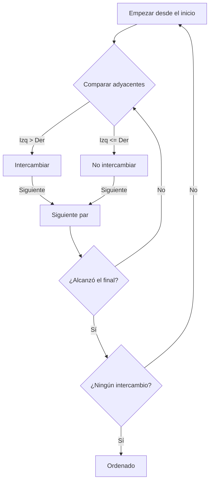
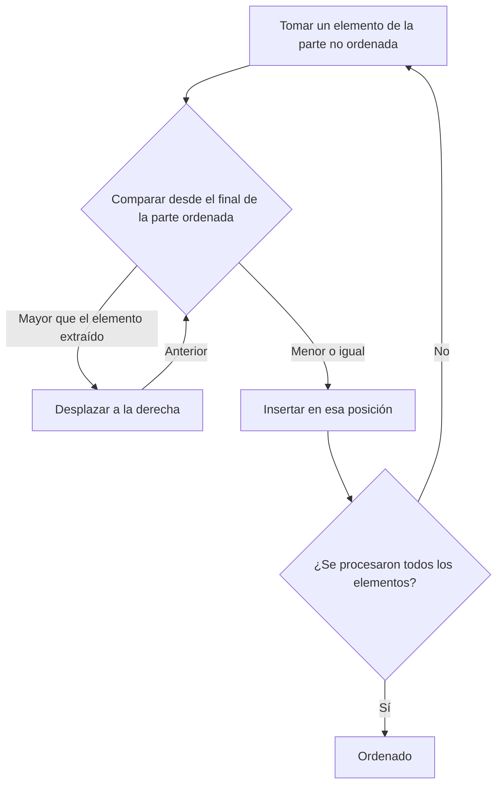
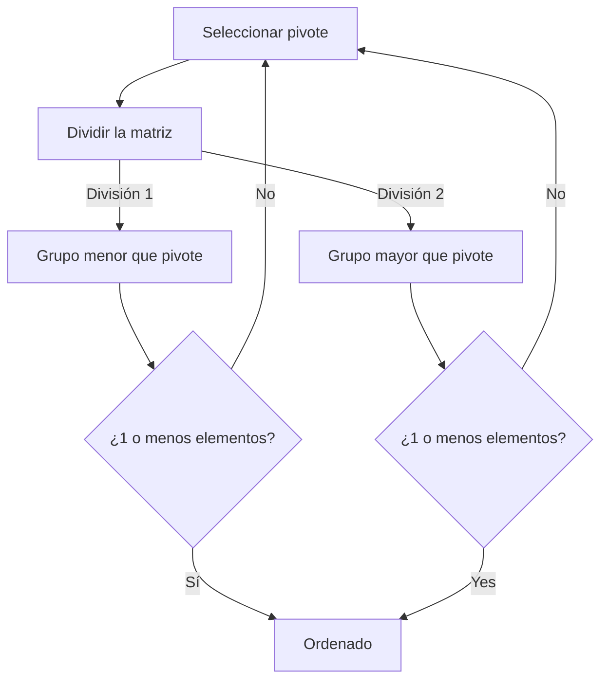
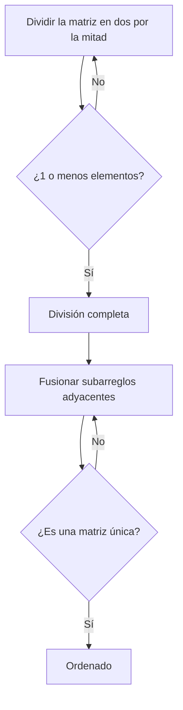

# 1. Introducción: El profundo mundo de los algoritmos de clasificación

En informática, ordenar datos en un orden específico (ascendente o descendente) es una de las operaciones más fundamentales e importantes. Los algoritmos de clasificación desempeñan un papel clave como paso previo para todo tipo de procesamiento de datos, como acelerar búsquedas, agrupar datos y detectar duplicados.

Este artículo explica de manera integral algoritmos de clasificación representativos, desde algoritmos simples y fáciles de entender [para principiantes](/es/p/productos-de-cuero%E3%81%AE%E3%83%A1%E3%83%B3%E3%83%86%E3%83%8A%E3%83%B3%E3%82%B9/) hasta algoritmos rápidos que se usan en la práctica. Entenderemos visualmente el mecanismo de cada algoritmo mediante diagramas de **Mermaid**, comprobaremos la implementación real con código Python y compararemos el rendimiento, como la complejidad temporal. Además, para comprender completamente el comportamiento de los algoritmos, también se incluye un rastro de ejecución completo usando una matriz de 50 elementos. Esto te permitirá comprender el comportamiento detallado del algoritmo como si lo tuvieras en tus manos.

## Métricas de evaluación de algoritmos

Al evaluar cada algoritmo, son importantes las siguientes métricas.

- **Complejidad temporal (Time Complexity)** : Expresa cómo aumenta el tiempo de procesamiento con respecto al número de elementos $n$ en los datos. Se utiliza notación Big-O como $\text{O}(n^2)$ o $\text{O}(n \log n)$. Cuando manejes texto en fórmulas, descríbelo como $\text{mejor}$.
- **Complejidad espacial (Space Complexity)** : Expresa cuánta memoria adicional se requiere en el momento de la ejecución. Los algoritmos In-place casi no requieren memoria adicional.
- **Estabilidad (Stability)** : Indica si el orden relativo de los elementos con el mismo valor se mantiene antes y después de ordenar. En una clasificación estable, se mantiene el orden original.

---

## 2. Ordenamiento de burbuja (Bubble Sort)

Es un algoritmo que repite la operación de comparar elementos adyacentes e intercambiarlos si están en orden inverso. Al igual que las burbujas suben a la superficie, los elementos grandes se mueven gradualmente al final de la matriz.

### Complejidad y características

- **Complejidad temporal (mejor)**: $\text{O}(n)$
- **Complejidad temporal (promedio)**: $\text{O}(n^2)$
- **Complejidad temporal (peor)**: $\text{O}(n^2)$
- **[空間計算量](https://kenji.blog/es/p/time-space-complexity-big-o-notation-examples/)**: $\text{O}(1)$
- **Estabilidad**: Estable

### Diagrama (Mermaid)



### Implementación en Python

```python
def bubble_sort(arr):
    n = len(arr)
    for i in range(n):
        swapped = False
        for j in range(0, n-i-1):
            if arr[j] > arr[j+1]:
                arr[j], arr[j+1] = arr[j+1], arr[j]
                swapped = True
        if not swapped:
            break
    return arr
```

### Rastro detallado de Bubble Sort

Muestra el estado del arreglo después de completar cada pase al ejecutar el ordenamiento de burbuja en un arreglo aleatorio de 50 elementos. Observe cómo empuja los elementos hacia la derecha.

**Estado inicial**: `[83, 14, 64, 71, 83, 11, 36, 69, 72, 45, 93, 30, 14, 76, 72, 51, 19, 41, 56, 15, 63, 27, 87, 55, 58, 63, 46, 96, 43, 68, 32, 97, 48, 94, 56, 27, 68, 40, 66, 88, 58, 15, 84, 10, 40, 27, 34, 48, 78, 56]`

**Pase 1 completado**: `[14, 64, 71, 83, 11, 36, 69, 72, 45, 83, 30, 14, 76, 72, 51, 19, 41, 56, 15, 63, 27, 87, 55, 58, 63, 46, 93, 43, 68, 32, 96, 48, 94, 56, 27, 68, 40, 66, 88, 58, 15, 84, 10, 40, 27, 34, 48, 78, 56, 97]`

En este pase, el elemento más grande en la parte no ordenada flotó hacia el extremo derecho como una burbuja. Debido a la naturaleza del ordenamiento de burbuja, se garantiza que al menos un elemento terminará en su posición final correcta por cada pase. Por lo tanto, el rango de búsqueda se puede reducir en uno con cada pase, reduciendo operaciones de comparación innecesarias. Sin embargo, en el peor de los casos, donde los datos están en orden completamente inverso, se producen intercambios para todos los pares de elementos, por lo que la complejidad alcanza $\text{O}(n^2)$ y el rendimiento es extremadamente bajo.

En este pase, el elemento más grande en la parte no ordenada flotó hacia el extremo derecho como una burbuja. Debido a la naturaleza del ordenamiento de burbuja, se garantiza que al menos un elemento terminará en su posición final correcta por cada pase. Por lo tanto, el rango de búsqueda se puede reducir en uno con cada pase, reduciendo operaciones de comparación innecesarias. Sin embargo, en el peor de los casos, donde los datos están en orden completamente inverso, se producen intercambios para todos los pares de elementos, por lo que la complejidad alcanza $\text{O}(n^2)$ y el rendimiento es extremadamente bajo.

**Pase 2 completado**: `[14, 64, 71, 11, 36, 69, 72, 45, 83, 30, 14, 76, 72, 51, 19, 41, 56, 15, 63, 27, 83, 55, 58, 63, 46, 87, 43, 68, 32, 93, 48, 94, 56, 27, 68, 40, 66, 88, 58, 15, 84, 10, 40, 27, 34, 48, 78, 56, 96, 97]`

En este pase, el elemento más grande en la parte no ordenada flotó hacia el extremo derecho como una burbuja. Debido a la naturaleza del ordenamiento de burbuja, se garantiza que al menos un elemento terminará en su posición final correcta por cada pase. Por lo tanto, el rango de búsqueda se puede reducir en uno con cada pase, reduciendo operaciones de comparación innecesarias. Sin embargo, en el peor de los casos, donde los datos están en orden completamente inverso, se producen intercambios para todos los pares de elementos, por lo que la complejidad alcanza $\text{O}(n^2)$ y el rendimiento es extremadamente bajo.

En este pase, el elemento más grande en la parte no ordenada flotó hacia el extremo derecho como una burbuja. Debido a la naturaleza del ordenamiento de burbuja, se garantiza que al menos un elemento terminará en su posición final correcta por cada pase. Por lo tanto, el rango de búsqueda se puede reducir en uno con cada pase, reduciendo operaciones de comparación innecesarias. Sin embargo, en el peor de los casos, donde los datos están en orden completamente inverso, se producen intercambios para todos los pares de elementos, por lo que la complejidad alcanza $\text{O}(n^2)$ y el rendimiento es extremadamente bajo.

**Pase 3 completado**: `[14, 64, 11, 36, 69, 71, 45, 72, 30, 14, 76, 72, 51, 19, 41, 56, 15, 63, 27, 83, 55, 58, 63, 46, 83, 43, 68, 32, 87, 48, 93, 56, 27, 68, 40, 66, 88, 58, 15, 84, 10, 40, 27, 34, 48, 78, 56, 94, 96, 97]`

En este pase, el elemento más grande en la parte no ordenada flotó hacia el extremo derecho como una burbuja. Debido a la naturaleza del ordenamiento de burbuja, se garantiza que al menos un elemento terminará en su posición final correcta por cada pase. Por lo tanto, el rango de búsqueda se puede reducir en uno con cada pase, reduciendo operaciones de comparación innecesarias. Sin embargo, en el peor de los casos, donde los datos están en orden completamente inverso, se producen intercambios para todos los pares de elementos, por lo que la complejidad alcanza $\text{O}(n^2)$ y el rendimiento es extremadamente bajo.

En este pase, el elemento más grande en la parte no ordenada flotó hacia el extremo derecho como una burbuja. Debido a la naturaleza del ordenamiento de burbuja, se garantiza que al menos un elemento terminará en su posición final correcta por cada pase. Por lo tanto, el rango de búsqueda se puede reducir en uno con cada pase, reduciendo operaciones de comparación innecesarias. Sin embargo, en el peor de los casos, donde los datos están en orden completamente inverso, se producen intercambios para todos los pares de elementos, por lo que la complejidad alcanza $\text{O}(n^2)$ y el rendimiento es extremadamente bajo.

**Pase 4 completado**: `[14, 11, 36, 64, 69, 45, 71, 30, 14, 72, 72, 51, 19, 41, 56, 15, 63, 27, 76, 55, 58, 63, 46, 83, 43, 68, 32, 83, 48, 87, 56, 27, 68, 40, 66, 88, 58, 15, 84, 10, 40, 27, 34, 48, 78, 56, 93, 94, 96, 97]`

En este pase, el elemento más grande en la parte no ordenada flotó hacia el extremo derecho como una burbuja. Debido a la naturaleza del ordenamiento de burbuja, se garantiza que al menos un elemento terminará en su posición final correcta por cada pase. Por lo tanto, el rango de búsqueda se puede reducir en uno con cada pase, reduciendo operaciones de comparación innecesarias. Sin embargo, en el peor de los casos, donde los datos están en orden completamente inverso, se producen intercambios para todos los pares de elementos, por lo que la complejidad alcanza $\text{O}(n^2)$ y el rendimiento es extremadamente bajo.

En este pase, el elemento más grande en la parte no ordenada flotó hacia el extremo derecho como una burbuja. Debido a la naturaleza del ordenamiento de burbuja, se garantiza que al menos un elemento terminará en su posición final correcta por cada pase. Por lo tanto, el rango de búsqueda se puede reducir en uno con cada pase, reduciendo operaciones de comparación innecesarias. Sin embargo, en el peor de los casos, donde los datos están en orden completamente inverso, se producen intercambios para todos los pares de elementos, por lo que la complejidad alcanza $\text{O}(n^2)$ y el rendimiento es extremadamente bajo.

**Pase 5 completado**: `[11, 14, 36, 64, 45, 69, 30, 14, 71, 72, 51, 19, 41, 56, 15, 63, 27, 72, 55, 58, 63, 46, 76, 43, 68, 32, 83, 48, 83, 56, 27, 68, 40, 66, 87, 58, 15, 84, 10, 40, 27, 34, 48, 78, 56, 88, 93, 94, 96, 97]`

En este pase, el elemento más grande en la parte no ordenada flotó hacia el extremo derecho como una burbuja. Debido a la naturaleza del ordenamiento de burbuja, se garantiza que al menos un elemento terminará en su posición final correcta por cada pase. Por lo tanto, el rango de búsqueda se puede reducir en uno con cada pase, reduciendo operaciones de comparación innecesarias. Sin embargo, en el peor de los casos, donde los datos están en orden completamente inverso, se producen intercambios para todos los pares de elementos, por lo que la complejidad alcanza $\text{O}(n^2)$ y el rendimiento es extremadamente bajo.

En este pase, el elemento más grande en la parte no ordenada flotó hacia el extremo derecho como una burbuja. Debido a la naturaleza del ordenamiento de burbuja, se garantiza que al menos un elemento terminará en su posición final correcta por cada pase. Por lo tanto, el rango de búsqueda se puede reducir en uno con cada pase, reduciendo operaciones de comparación innecesarias. Sin embargo, en el peor de los casos, donde los datos están en orden completamente inverso, se producen intercambios para todos los pares de elementos, por lo que la complejidad alcanza $\text{O}(n^2)$ y el rendimiento es extremadamente bajo.

**Pase 6 completado**: `[11, 14, 36, 45, 64, 30, 14, 69, 71, 51, 19, 41, 56, 15, 63, 27, 72, 55, 58, 63, 46, 72, 43, 68, 32, 76, 48, 83, 56, 27, 68, 40, 66, 83, 58, 15, 84, 10, 40, 27, 34, 48, 78, 56, 87, 88, 93, 94, 96, 97]`

En este pase, el elemento más grande en la parte no ordenada flotó hacia el extremo derecho como una burbuja. Debido a la naturaleza del ordenamiento de burbuja, se garantiza que al menos un elemento terminará en su posición final correcta por cada pase. Por lo tanto, el rango de búsqueda se puede reducir en uno con cada pase, reduciendo operaciones de comparación innecesarias. Sin embargo, en el peor de los casos, donde los datos están en orden completamente inverso, se producen intercambios para todos los pares de elementos, por lo que la complejidad alcanza $\text{O}(n^2)$ y el rendimiento es extremadamente bajo.

En este pase, el elemento más grande en la parte no ordenada flotó hacia el extremo derecho como una burbuja. Debido a la naturaleza del ordenamiento de burbuja, se garantiza que al menos un elemento terminará en su posición final correcta por cada pase. Por lo tanto, el rango de búsqueda se puede reducir en uno con cada pase, reduciendo operaciones de comparación innecesarias. Sin embargo, en el peor de los casos, donde los datos están en orden completamente inverso, se producen intercambios para todos los pares de elementos, por lo que la complejidad alcanza $\text{O}(n^2)$ y el rendimiento es extremadamente bajo.

**Pase 7 completado**: `[11, 14, 36, 45, 30, 14, 64, 69, 51, 19, 41, 56, 15, 63, 27, 71, 55, 58, 63, 46, 72, 43, 68, 32, 72, 48, 76, 56, 27, 68, 40, 66, 83, 58, 15, 83, 10, 40, 27, 34, 48, 78, 56, 84, 87, 88, 93, 94, 96, 97]`

En este pase, el elemento más grande en la parte no ordenada flotó hacia el extremo derecho como una burbuja. Debido a la naturaleza del ordenamiento de burbuja, se garantiza que al menos un elemento terminará en su posición final correcta por cada pase. Por lo tanto, el rango de búsqueda se puede reducir en uno con cada pase, reduciendo operaciones de comparación innecesarias. Sin embargo, en el peor de los casos, donde los datos están en orden completamente inverso, se producen intercambios para todos los pares de elementos, por lo que la complejidad alcanza $\text{O}(n^2)$ y el rendimiento es extremadamente bajo.

En este pase, el elemento más grande en la parte no ordenada flotó hacia el extremo derecho como una burbuja. Debido a la naturaleza del ordenamiento de burbuja, se garantiza que al menos un elemento terminará en su posición final correcta por cada pase. Por lo tanto, el rango de búsqueda se puede reducir en uno con cada pase, reduciendo operaciones de comparación innecesarias. Sin embargo, en el peor de los casos, donde los datos están en orden completamente inverso, se producen intercambios para todos los pares de elementos, por lo que la complejidad alcanza $\text{O}(n^2)$ y el rendimiento es extremadamente bajo.

**Pase 8 completado**: `[11, 14, 36, 30, 14, 45, 64, 51, 19, 41, 56, 15, 63, 27, 69, 55, 58, 63, 46, 71, 43, 68, 32, 72, 48, 72, 56, 27, 68, 40, 66, 76, 58, 15, 83, 10, 40, 27, 34, 48, 78, 56, 83, 84, 87, 88, 93, 94, 96, 97]`

En este pase, el elemento más grande en la parte no ordenada flotó hacia el extremo derecho como una burbuja. Debido a la naturaleza del ordenamiento de burbuja, se garantiza que al menos un elemento terminará en su posición final correcta por cada pase. Por lo tanto, el rango de búsqueda se puede reducir en uno con cada pase, reduciendo operaciones de comparación innecesarias. Sin embargo, en el peor de los casos, donde los datos están en orden completamente inverso, se producen intercambios para todos los pares de elementos, por lo que la complejidad alcanza $\text{O}(n^2)$ y el rendimiento es extremadamente bajo.

En este pase, el elemento más grande en la parte no ordenada flotó hacia el extremo derecho como una burbuja. Debido a la naturaleza del ordenamiento de burbuja, se garantiza que al menos un elemento terminará en su posición final correcta por cada pase. Por lo tanto, el rango de búsqueda se puede reducir en uno con cada pase, reduciendo operaciones de comparación innecesarias. Sin embargo, en el peor de los casos, donde los datos están en orden completamente inverso, se producen intercambios para todos los pares de elementos, por lo que la complejidad alcanza $\text{O}(n^2)$ y el rendimiento es extremadamente bajo.

**Pase 9 completado**: `[11, 14, 30, 14, 36, 45, 51, 19, 41, 56, 15, 63, 27, 64, 55, 58, 63, 46, 69, 43, 68, 32, 71, 48, 72, 56, 27, 68, 40, 66, 72, 58, 15, 76, 10, 40, 27, 34, 48, 78, 56, 83, 83, 84, 87, 88, 93, 94, 96, 97]`

En este pase, el elemento más grande en la parte no ordenada flotó hacia el extremo derecho como una burbuja. Debido a la naturaleza del ordenamiento de burbuja, se garantiza que al menos un elemento terminará en su posición final correcta por cada pase. Por lo tanto, el rango de búsqueda se puede reducir en uno con cada pase, reduciendo operaciones de comparación innecesarias. Sin embargo, en el peor de los casos, donde los datos están en orden completamente inverso, se producen intercambios para todos los pares de elementos, por lo que la complejidad alcanza $\text{O}(n^2)$ y el rendimiento es extremadamente bajo.

En este pase, el elemento más grande en la parte no ordenada flotó hacia el extremo derecho como una burbuja. Debido a la naturaleza del ordenamiento de burbuja, se garantiza que al menos un elemento terminará en su posición final correcta por cada pase. Por lo tanto, el rango de búsqueda se puede reducir en uno con cada pase, reduciendo operaciones de comparación innecesarias. Sin embargo, en el peor de los casos, donde los datos están en orden completamente inverso, se producen intercambios para todos los pares de elementos, por lo que la complejidad alcanza $\text{O}(n^2)$ y el rendimiento es extremadamente bajo.

**Pase 10 completado**: `[11, 14, 14, 30, 36, 45, 19, 41, 51, 15, 56, 27, 63, 55, 58, 63, 46, 64, 43, 68, 32, 69, 48, 71, 56, 27, 68, 40, 66, 72, 58, 15, 72, 10, 40, 27, 34, 48, 76, 56, 78, 83, 83, 84, 87, 88, 93, 94, 96, 97]`

En este pase, el elemento más grande en la parte no ordenada flotó hacia el extremo derecho como una burbuja. Debido a la naturaleza del ordenamiento de burbuja, se garantiza que al menos un elemento terminará en su posición final correcta por cada pase. Por lo tanto, el rango de búsqueda se puede reducir en uno con cada pase, reduciendo operaciones de comparación innecesarias. Sin embargo, en el peor de los casos, donde los datos están en orden completamente inverso, se producen intercambios para todos los pares de elementos, por lo que la complejidad alcanza $\text{O}(n^2)$ y el rendimiento es extremadamente bajo.

En este pase, el elemento más grande en la parte no ordenada flotó hacia el extremo derecho como una burbuja. Debido a la naturaleza del ordenamiento de burbuja, se garantiza que al menos un elemento terminará en su posición final correcta por cada pase. Por lo tanto, el rango de búsqueda se puede reducir en uno con cada pase, reduciendo operaciones de comparación innecesarias. Sin embargo, en el peor de los casos, donde los datos están en orden completamente inverso, se producen intercambios para todos los pares de elementos, por lo que la complejidad alcanza $\text{O}(n^2)$ y el rendimiento es extremadamente bajo.

**Pase 11 completado**: `[11, 14, 14, 30, 36, 19, 41, 45, 15, 51, 27, 56, 55, 58, 63, 46, 63, 43, 64, 32, 68, 48, 69, 56, 27, 68, 40, 66, 71, 58, 15, 72, 10, 40, 27, 34, 48, 72, 56, 76, 78, 83, 83, 84, 87, 88, 93, 94, 96, 97]`

En este pase, el elemento más grande en la parte no ordenada flotó hacia el extremo derecho como una burbuja. Debido a la naturaleza del ordenamiento de burbuja, se garantiza que al menos un elemento terminará en su posición final correcta por cada pase. Por lo tanto, el rango de búsqueda se puede reducir en uno con cada pase, reduciendo operaciones de comparación innecesarias. Sin embargo, en el peor de los casos, donde los datos están en orden completamente inverso, se producen intercambios para todos los pares de elementos, por lo que la complejidad alcanza $\text{O}(n^2)$ y el rendimiento es extremadamente bajo.

En este pase, el elemento más grande en la parte no ordenada flotó hacia el extremo derecho como una burbuja. Debido a la naturaleza del ordenamiento de burbuja, se garantiza que al menos un elemento terminará en su posición final correcta por cada pase. Por lo tanto, el rango de búsqueda se puede reducir en uno con cada pase, reduciendo operaciones de comparación innecesarias. Sin embargo, en el peor de los casos, donde los datos están en orden completamente inverso, se producen intercambios para todos los pares de elementos, por lo que la complejidad alcanza $\text{O}(n^2)$ y el rendimiento es extremadamente bajo.

**Pase 12 completado**: `[11, 14, 14, 30, 19, 36, 41, 15, 45, 27, 51, 55, 56, 58, 46, 63, 43, 63, 32, 64, 48, 68, 56, 27, 68, 40, 66, 69, 58, 15, 71, 10, 40, 27, 34, 48, 72, 56, 72, 76, 78, 83, 83, 84, 87, 88, 93, 94, 96, 97]`

En este pase, el elemento más grande en la parte no ordenada flotó hacia el extremo derecho como una burbuja. Debido a la naturaleza del ordenamiento de burbuja, se garantiza que al menos un elemento terminará en su posición final correcta por cada pase. Por lo tanto, el rango de búsqueda se puede reducir en uno con cada pase, reduciendo operaciones de comparación innecesarias. Sin embargo, en el peor de los casos, donde los datos están en orden completamente inverso, se producen intercambios para todos los pares de elementos, por lo que la complejidad alcanza $\text{O}(n^2)$ y el rendimiento es extremadamente bajo.

En este pase, el elemento más grande en la parte no ordenada flotó hacia el extremo derecho como una burbuja. Debido a la naturaleza del ordenamiento de burbuja, se garantiza que al menos un elemento terminará en su posición final correcta por cada pase. Por lo tanto, el rango de búsqueda se puede reducir en uno con cada pase, reduciendo operaciones de comparación innecesarias. Sin embargo, en el peor de los casos, donde los datos están en orden completamente inverso, se producen intercambios para todos los pares de elementos, por lo que la complejidad alcanza $\text{O}(n^2)$ y el rendimiento es extremadamente bajo.

**Pase 13 completado**: `[11, 14, 14, 19, 30, 36, 15, 41, 27, 45, 51, 55, 56, 46, 58, 43, 63, 32, 63, 48, 64, 56, 27, 68, 40, 66, 68, 58, 15, 69, 10, 40, 27, 34, 48, 71, 56, 72, 72, 76, 78, 83, 83, 84, 87, 88, 93, 94, 96, 97]`

En este pase, el elemento más grande en la parte no ordenada flotó hacia el extremo derecho como una burbuja. Debido a la naturaleza del ordenamiento de burbuja, se garantiza que al menos un elemento terminará en su posición final correcta por cada pase. Por lo tanto, el rango de búsqueda se puede reducir en uno con cada pase, reduciendo operaciones de comparación innecesarias. Sin embargo, en el peor de los casos, donde los datos están en orden completamente inverso, se producen intercambios para todos los pares de elementos, por lo que la complejidad alcanza $\text{O}(n^2)$ y el rendimiento es extremadamente bajo.

En este pase, el elemento más grande en la parte no ordenada flotó hacia el extremo derecho como una burbuja. Debido a la naturaleza del ordenamiento de burbuja, se garantiza que al menos un elemento terminará en su posición final correcta por cada pase. Por lo tanto, el rango de búsqueda se puede reducir en uno con cada pase, reduciendo operaciones de comparación innecesarias. Sin embargo, en el peor de los casos, donde los datos están en orden completamente inverso, se producen intercambios para todos los pares de elementos, por lo que la complejidad alcanza $\text{O}(n^2)$ y el rendimiento es extremadamente bajo.

**Pase 14 completado**: `[11, 14, 14, 19, 30, 15, 36, 27, 41, 45, 51, 55, 46, 56, 43, 58, 32, 63, 48, 63, 56, 27, 64, 40, 66, 68, 58, 15, 68, 10, 40, 27, 34, 48, 69, 56, 71, 72, 72, 76, 78, 83, 83, 84, 87, 88, 93, 94, 96, 97]`

En este pase, el elemento más grande en la parte no ordenada flotó hacia el extremo derecho como una burbuja. Debido a la naturaleza del ordenamiento de burbuja, se garantiza que al menos un elemento terminará en su posición final correcta por cada pase. Por lo tanto, el rango de búsqueda se puede reducir en uno con cada pase, reduciendo operaciones de comparación innecesarias. Sin embargo, en el peor de los casos, donde los datos están en orden completamente inverso, se producen intercambios para todos los pares de elementos, por lo que la complejidad alcanza $\text{O}(n^2)$ y el rendimiento es extremadamente bajo.

En este pase, el elemento más grande en la parte no ordenada flotó hacia el extremo derecho como una burbuja. Debido a la naturaleza del ordenamiento de burbuja, se garantiza que al menos un elemento terminará en su posición final correcta por cada pase. Por lo tanto, el rango de búsqueda se puede reducir en uno con cada pase, reduciendo operaciones de comparación innecesarias. Sin embargo, en el peor de los casos, donde los datos están en orden completamente inverso, se producen intercambios para todos los pares de elementos, por lo que la complejidad alcanza $\text{O}(n^2)$ y el rendimiento es extremadamente bajo.

**Pase 15 completado**: `[11, 14, 14, 19, 15, 30, 27, 36, 41, 45, 51, 46, 55, 43, 56, 32, 58, 48, 63, 56, 27, 63, 40, 64, 66, 58, 15, 68, 10, 40, 27, 34, 48, 68, 56, 69, 71, 72, 72, 76, 78, 83, 83, 84, 87, 88, 93, 94, 96, 97]`

En este pase, el elemento más grande en la parte no ordenada flotó hacia el extremo derecho como una burbuja. Debido a la naturaleza del ordenamiento de burbuja, se garantiza que al menos un elemento terminará en su posición final correcta por cada pase. Por lo tanto, el rango de búsqueda se puede reducir en uno con cada pase, reduciendo operaciones de comparación innecesarias. Sin embargo, en el peor de los casos, donde los datos están en orden completamente inverso, se producen intercambios para todos los pares de elementos, por lo que la complejidad alcanza $\text{O}(n^2)$ y el rendimiento es extremadamente bajo.

En este pase, el elemento más grande en la parte no ordenada flotó hacia el extremo derecho como una burbuja. Debido a la naturaleza del ordenamiento de burbuja, se garantiza que al menos un elemento terminará en su posición final correcta por cada pase. Por lo tanto, el rango de búsqueda se puede reducir en uno con cada pase, reduciendo operaciones de comparación innecesarias. Sin embargo, en el peor de los casos, donde los datos están en orden completamente inverso, se producen intercambios para todos los pares de elementos, por lo que la complejidad alcanza $\text{O}(n^2)$ y el rendimiento es extremadamente bajo.

**Pase 16 completado**: `[11, 14, 14, 15, 19, 27, 30, 36, 41, 45, 46, 51, 43, 55, 32, 56, 48, 58, 56, 27, 63, 40, 63, 64, 58, 15, 66, 10, 40, 27, 34, 48, 68, 56, 68, 69, 71, 72, 72, 76, 78, 83, 83, 84, 87, 88, 93, 94, 96, 97]`

En este pase, el elemento más grande en la parte no ordenada flotó hacia el extremo derecho como una burbuja. Debido a la naturaleza del ordenamiento de burbuja, se garantiza que al menos un elemento terminará en su posición final correcta por cada pase. Por lo tanto, el rango de búsqueda se puede reducir en uno con cada pase, reduciendo operaciones de comparación innecesarias. Sin embargo, en el peor de los casos, donde los datos están en orden completamente inverso, se producen intercambios para todos los pares de elementos, por lo que la complejidad alcanza $\text{O}(n^2)$ y el rendimiento es extremadamente bajo.

En este pase, el elemento más grande en la parte no ordenada flotó hacia el extremo derecho como una burbuja. Debido a la naturaleza del ordenamiento de burbuja, se garantiza que al menos un elemento terminará en su posición final correcta por cada pase. Por lo tanto, el rango de búsqueda se puede reducir en uno con cada pase, reduciendo operaciones de comparación innecesarias. Sin embargo, en el peor de los casos, donde los datos están en orden completamente inverso, se producen intercambios para todos los pares de elementos, por lo que la complejidad alcanza $\text{O}(n^2)$ y el rendimiento es extremadamente bajo.

**Pase 17 completado**: `[11, 14, 14, 15, 19, 27, 30, 36, 41, 45, 46, 43, 51, 32, 55, 48, 56, 56, 27, 58, 40, 63, 63, 58, 15, 64, 10, 40, 27, 34, 48, 66, 56, 68, 68, 69, 71, 72, 72, 76, 78, 83, 83, 84, 87, 88, 93, 94, 96, 97]`

En este pase, el elemento más grande en la parte no ordenada flotó hacia el extremo derecho como una burbuja. Debido a la naturaleza del ordenamiento de burbuja, se garantiza que al menos un elemento terminará en su posición final correcta por cada pase. Por lo tanto, el rango de búsqueda se puede reducir en uno con cada pase, reduciendo operaciones de comparación innecesarias. Sin embargo, en el peor de los casos, donde los datos están en orden completamente inverso, se producen intercambios para todos los pares de elementos, por lo que la complejidad alcanza $\text{O}(n^2)$ y el rendimiento es extremadamente bajo.

En este pase, el elemento más grande en la parte no ordenada flotó hacia el extremo derecho como una burbuja. Debido a la naturaleza del ordenamiento de burbuja, se garantiza que al menos un elemento terminará en su posición final correcta por cada pase. Por lo tanto, el rango de búsqueda se puede reducir en uno con cada pase, reduciendo operaciones de comparación innecesarias. Sin embargo, en el peor de los casos, donde los datos están en orden completamente inverso, se producen intercambios para todos los pares de elementos, por lo que la complejidad alcanza $\text{O}(n^2)$ y el rendimiento es extremadamente bajo.

**Pase 18 completado**: `[11, 14, 14, 15, 19, 27, 30, 36, 41, 45, 43, 46, 32, 51, 48, 55, 56, 27, 56, 40, 58, 63, 58, 15, 63, 10, 40, 27, 34, 48, 64, 56, 66, 68, 68, 69, 71, 72, 72, 76, 78, 83, 83, 84, 87, 88, 93, 94, 96, 97]`

En este pase, el elemento más grande en la parte no ordenada flotó hacia el extremo derecho como una burbuja. Debido a la naturaleza del ordenamiento de burbuja, se garantiza que al menos un elemento terminará en su posición final correcta por cada pase. Por lo tanto, el rango de búsqueda se puede reducir en uno con cada pase, reduciendo operaciones de comparación innecesarias. Sin embargo, en el peor de los casos, donde los datos están en orden completamente inverso, se producen intercambios para todos los pares de elementos, por lo que la complejidad alcanza $\text{O}(n^2)$ y el rendimiento es extremadamente bajo.

En este pase, el elemento más grande en la parte no ordenada flotó hacia el extremo derecho como una burbuja. Debido a la naturaleza del ordenamiento de burbuja, se garantiza que al menos un elemento terminará en su posición final correcta por cada pase. Por lo tanto, el rango de búsqueda se puede reducir en uno con cada pase, reduciendo operaciones de comparación innecesarias. Sin embargo, en el peor de los casos, donde los datos están en orden completamente inverso, se producen intercambios para todos los pares de elementos, por lo que la complejidad alcanza $\text{O}(n^2)$ y el rendimiento es extremadamente bajo.

**Pase 19 completado**: `[11, 14, 14, 15, 19, 27, 30, 36, 41, 43, 45, 32, 46, 48, 51, 55, 27, 56, 40, 56, 58, 58, 15, 63, 10, 40, 27, 34, 48, 63, 56, 64, 66, 68, 68, 69, 71, 72, 72, 76, 78, 83, 83, 84, 87, 88, 93, 94, 96, 97]`

En este pase, el elemento más grande en la parte no ordenada flotó hacia el extremo derecho como una burbuja. Debido a la naturaleza del ordenamiento de burbuja, se garantiza que al menos un elemento terminará en su posición final correcta por cada pase. Por lo tanto, el rango de búsqueda se puede reducir en uno con cada pase, reduciendo operaciones de comparación innecesarias. Sin embargo, en el peor de los casos, donde los datos están en orden completamente inverso, se producen intercambios para todos los pares de elementos, por lo que la complejidad alcanza $\text{O}(n^2)$ y el rendimiento es extremadamente bajo.

En este pase, el elemento más grande en la parte no ordenada flotó hacia el extremo derecho como una burbuja. Debido a la naturaleza del ordenamiento de burbuja, se garantiza que al menos un elemento terminará en su posición final correcta por cada pase. Por lo tanto, el rango de búsqueda se puede reducir en uno con cada pase, reduciendo operaciones de comparación innecesarias. Sin embargo, en el peor de los casos, donde los datos están en orden completamente inverso, se producen intercambios para todos los pares de elementos, por lo que la complejidad alcanza $\text{O}(n^2)$ y el rendimiento es extremadamente bajo.

**Pase 20 completado**: `[11, 14, 14, 15, 19, 27, 30, 36, 41, 43, 32, 45, 46, 48, 51, 27, 55, 40, 56, 56, 58, 15, 58, 10, 40, 27, 34, 48, 63, 56, 63, 64, 66, 68, 68, 69, 71, 72, 72, 76, 78, 83, 83, 84, 87, 88, 93, 94, 96, 97]`

En este pase, el elemento más grande en la parte no ordenada flotó hacia el extremo derecho como una burbuja. Debido a la naturaleza del ordenamiento de burbuja, se garantiza que al menos un elemento terminará en su posición final correcta por cada pase. Por lo tanto, el rango de búsqueda se puede reducir en uno con cada pase, reduciendo operaciones de comparación innecesarias. Sin embargo, en el peor de los casos, donde los datos están en orden completamente inverso, se producen intercambios para todos los pares de elementos, por lo que la complejidad alcanza $\text{O}(n^2)$ y el rendimiento es extremadamente bajo.

En este pase, el elemento más grande en la parte no ordenada flotó hacia el extremo derecho como una burbuja. Debido a la naturaleza del ordenamiento de burbuja, se garantiza que al menos un elemento terminará en su posición final correcta por cada pase. Por lo tanto, el rango de búsqueda se puede reducir en uno con cada pase, reduciendo operaciones de comparación innecesarias. Sin embargo, en el peor de los casos, donde los datos están en orden completamente inverso, se producen intercambios para todos los pares de elementos, por lo que la complejidad alcanza $\text{O}(n^2)$ y el rendimiento es extremadamente bajo.

**Pase 21 completado**: `[11, 14, 14, 15, 19, 27, 30, 36, 41, 32, 43, 45, 46, 48, 27, 51, 40, 55, 56, 56, 15, 58, 10, 40, 27, 34, 48, 58, 56, 63, 63, 64, 66, 68, 68, 69, 71, 72, 72, 76, 78, 83, 83, 84, 87, 88, 93, 94, 96, 97]`

En este pase, el elemento más grande en la parte no ordenada flotó hacia el extremo derecho como una burbuja. Debido a la naturaleza del ordenamiento de burbuja, se garantiza que al menos un elemento terminará en su posición final correcta por cada pase. Por lo tanto, el rango de búsqueda se puede reducir en uno con cada pase, reduciendo operaciones de comparación innecesarias. Sin embargo, en el peor de los casos, donde los datos están en orden completamente inverso, se producen intercambios para todos los pares de elementos, por lo que la complejidad alcanza $\text{O}(n^2)$ y el rendimiento es extremadamente bajo.

En este pase, el elemento más grande en la parte no ordenada flotó hacia el extremo derecho como una burbuja. Debido a la naturaleza del ordenamiento de burbuja, se garantiza que al menos un elemento terminará en su posición final correcta por cada pase. Por lo tanto, el rango de búsqueda se puede reducir en uno con cada pase, reduciendo operaciones de comparación innecesarias. Sin embargo, en el peor de los casos, donde los datos están en orden completamente inverso, se producen intercambios para todos los pares de elementos, por lo que la complejidad alcanza $\text{O}(n^2)$ y el rendimiento es extremadamente bajo.

**Pase 22 completado**: `[11, 14, 14, 15, 19, 27, 30, 36, 32, 41, 43, 45, 46, 27, 48, 40, 51, 55, 56, 15, 56, 10, 40, 27, 34, 48, 58, 56, 58, 63, 63, 64, 66, 68, 68, 69, 71, 72, 72, 76, 78, 83, 83, 84, 87, 88, 93, 94, 96, 97]`

En este pase, el elemento más grande en la parte no ordenada flotó hacia el extremo derecho como una burbuja. Debido a la naturaleza del ordenamiento de burbuja, se garantiza que al menos un elemento terminará en su posición final correcta por cada pase. Por lo tanto, el rango de búsqueda se puede reducir en uno con cada pase, reduciendo operaciones de comparación innecesarias. Sin embargo, en el peor de los casos, donde los datos están en orden completamente inverso, se producen intercambios para todos los pares de elementos, por lo que la complejidad alcanza $\text{O}(n^2)$ y el rendimiento es extremadamente bajo.

En este pase, el elemento más grande en la parte no ordenada flotó hacia el extremo derecho como una burbuja. Debido a la naturaleza del ordenamiento de burbuja, se garantiza que al menos un elemento terminará en su posición final correcta por cada pase. Por lo tanto, el rango de búsqueda se puede reducir en uno con cada pase, reduciendo operaciones de comparación innecesarias. Sin embargo, en el peor de los casos, donde los datos están en orden completamente inverso, se producen intercambios para todos los pares de elementos, por lo que la complejidad alcanza $\text{O}(n^2)$ y el rendimiento es extremadamente bajo.

**Pase 23 completado**: `[11, 14, 14, 15, 19, 27, 30, 32, 36, 41, 43, 45, 27, 46, 40, 48, 51, 55, 15, 56, 10, 40, 27, 34, 48, 56, 56, 58, 58, 63, 63, 64, 66, 68, 68, 69, 71, 72, 72, 76, 78, 83, 83, 84, 87, 88, 93, 94, 96, 97]`

En este pase, el elemento más grande en la parte no ordenada flotó hacia el extremo derecho como una burbuja. Debido a la naturaleza del ordenamiento de burbuja, se garantiza que al menos un elemento terminará en su posición final correcta por cada pase. Por lo tanto, el rango de búsqueda se puede reducir en uno con cada pase, reduciendo operaciones de comparación innecesarias. Sin embargo, en el peor de los casos, donde los datos están en orden completamente inverso, se producen intercambios para todos los pares de elementos, por lo que la complejidad alcanza $\text{O}(n^2)$ y el rendimiento es extremadamente bajo.

En este pase, el elemento más grande en la parte no ordenada flotó hacia el extremo derecho como una burbuja. Debido a la naturaleza del ordenamiento de burbuja, se garantiza que al menos un elemento terminará en su posición final correcta por cada pase. Por lo tanto, el rango de búsqueda se puede reducir en uno con cada pase, reduciendo operaciones de comparación innecesarias. Sin embargo, en el peor de los casos, donde los datos están en orden completamente inverso, se producen intercambios para todos los pares de elementos, por lo que la complejidad alcanza $\text{O}(n^2)$ y el rendimiento es extremadamente bajo.

**Pase 24 completado**: `[11, 14, 14, 15, 19, 27, 30, 32, 36, 41, 43, 27, 45, 40, 46, 48, 51, 15, 55, 10, 40, 27, 34, 48, 56, 56, 56, 58, 58, 63, 63, 64, 66, 68, 68, 69, 71, 72, 72, 76, 78, 83, 83, 84, 87, 88, 93, 94, 96, 97]`

En este pase, el elemento más grande en la parte no ordenada flotó hacia el extremo derecho como una burbuja. Debido a la naturaleza del ordenamiento de burbuja, se garantiza que al menos un elemento terminará en su posición final correcta por cada pase. Por lo tanto, el rango de búsqueda se puede reducir en uno con cada pase, reduciendo operaciones de comparación innecesarias. Sin embargo, en el peor de los casos, donde los datos están en orden completamente inverso, se producen intercambios para todos los pares de elementos, por lo que la complejidad alcanza $\text{O}(n^2)$ y el rendimiento es extremadamente bajo.

En este pase, el elemento más grande en la parte no ordenada flotó hacia el extremo derecho como una burbuja. Debido a la naturaleza del ordenamiento de burbuja, se garantiza que al menos un elemento terminará en su posición final correcta por cada pase. Por lo tanto, el rango de búsqueda se puede reducir en uno con cada pase, reduciendo operaciones de comparación innecesarias. Sin embargo, en el peor de los casos, donde los datos están en orden completamente inverso, se producen intercambios para todos los pares de elementos, por lo que la complejidad alcanza $\text{O}(n^2)$ y el rendimiento es extremadamente bajo.

**Pase 25 completado**: `[11, 14, 14, 15, 19, 27, 30, 32, 36, 41, 27, 43, 40, 45, 46, 48, 15, 51, 10, 40, 27, 34, 48, 55, 56, 56, 56, 58, 58, 63, 63, 64, 66, 68, 68, 69, 71, 72, 72, 76, 78, 83, 83, 84, 87, 88, 93, 94, 96, 97]`

En este pase, el elemento más grande en la parte no ordenada flotó hacia el extremo derecho como una burbuja. Debido a la naturaleza del ordenamiento de burbuja, se garantiza que al menos un elemento terminará en su posición final correcta por cada pase. Por lo tanto, el rango de búsqueda se puede reducir en uno con cada pase, reduciendo operaciones de comparación innecesarias. Sin embargo, en el peor de los casos, donde los datos están en orden completamente inverso, se producen intercambios para todos los pares de elementos, por lo que la complejidad alcanza $\text{O}(n^2)$ y el rendimiento es extremadamente bajo.

En este pase, el elemento más grande en la parte no ordenada flotó hacia el extremo derecho como una burbuja. Debido a la naturaleza del ordenamiento de burbuja, se garantiza que al menos un elemento terminará en su posición final correcta por cada pase. Por lo tanto, el rango de búsqueda se puede reducir en uno con cada pase, reduciendo operaciones de comparación innecesarias. Sin embargo, en el peor de los casos, donde los datos están en orden completamente inverso, se producen intercambios para todos los pares de elementos, por lo que la complejidad alcanza $\text{O}(n^2)$ y el rendimiento es extremadamente bajo.

**Pase 26 completado**: `[11, 14, 14, 15, 19, 27, 30, 32, 36, 27, 41, 40, 43, 45, 46, 15, 48, 10, 40, 27, 34, 48, 51, 55, 56, 56, 56, 58, 58, 63, 63, 64, 66, 68, 68, 69, 71, 72, 72, 76, 78, 83, 83, 84, 87, 88, 93, 94, 96, 97]`

En este pase, el elemento más grande en la parte no ordenada flotó hacia el extremo derecho como una burbuja. Debido a la naturaleza del ordenamiento de burbuja, se garantiza que al menos un elemento terminará en su posición final correcta por cada pase. Por lo tanto, el rango de búsqueda se puede reducir en uno con cada pase, reduciendo operaciones de comparación innecesarias. Sin embargo, en el peor de los casos, donde los datos están en orden completamente inverso, se producen intercambios para todos los pares de elementos, por lo que la complejidad alcanza $\text{O}(n^2)$ y el rendimiento es extremadamente bajo.

En este pase, el elemento más grande en la parte no ordenada flotó hacia el extremo derecho como una burbuja. Debido a la naturaleza del ordenamiento de burbuja, se garantiza que al menos un elemento terminará en su posición final correcta por cada pase. Por lo tanto, el rango de búsqueda se puede reducir en uno con cada pase, reduciendo operaciones de comparación innecesarias. Sin embargo, en el peor de los casos, donde los datos están en orden completamente inverso, se producen intercambios para todos los pares de elementos, por lo que la complejidad alcanza $\text{O}(n^2)$ y el rendimiento es extremadamente bajo.

**Pase 27 completado**: `[11, 14, 14, 15, 19, 27, 30, 32, 27, 36, 40, 41, 43, 45, 15, 46, 10, 40, 27, 34, 48, 48, 51, 55, 56, 56, 56, 58, 58, 63, 63, 64, 66, 68, 68, 69, 71, 72, 72, 76, 78, 83, 83, 84, 87, 88, 93, 94, 96, 97]`

En este pase, el elemento más grande en la parte no ordenada flotó hacia el extremo derecho como una burbuja. Debido a la naturaleza del ordenamiento de burbuja, se garantiza que al menos un elemento terminará en su posición final correcta por cada pase. Por lo tanto, el rango de búsqueda se puede reducir en uno con cada pase, reduciendo operaciones de comparación innecesarias. Sin embargo, en el peor de los casos, donde los datos están en orden completamente inverso, se producen intercambios para todos los pares de elementos, por lo que la complejidad alcanza $\text{O}(n^2)$ y el rendimiento es extremadamente bajo.

En este pase, el elemento más grande en la parte no ordenada flotó hacia el extremo derecho como una burbuja. Debido a la naturaleza del ordenamiento de burbuja, se garantiza que al menos un elemento terminará en su posición final correcta por cada pase. Por lo tanto, el rango de búsqueda se puede reducir en uno con cada pase, reduciendo operaciones de comparación innecesarias. Sin embargo, en el peor de los casos, donde los datos están en orden completamente inverso, se producen intercambios para todos los pares de elementos, por lo que la complejidad alcanza $\text{O}(n^2)$ y el rendimiento es extremadamente bajo.

**Pase 28 completado**: `[11, 14, 14, 15, 19, 27, 30, 27, 32, 36, 40, 41, 43, 15, 45, 10, 40, 27, 34, 46, 48, 48, 51, 55, 56, 56, 56, 58, 58, 63, 63, 64, 66, 68, 68, 69, 71, 72, 72, 76, 78, 83, 83, 84, 87, 88, 93, 94, 96, 97]`

En este pase, el elemento más grande en la parte no ordenada flotó hacia el extremo derecho como una burbuja. Debido a la naturaleza del ordenamiento de burbuja, se garantiza que al menos un elemento terminará en su posición final correcta por cada pase. Por lo tanto, el rango de búsqueda se puede reducir en uno con cada pase, reduciendo operaciones de comparación innecesarias. Sin embargo, en el peor de los casos, donde los datos están en orden completamente inverso, se producen intercambios para todos los pares de elementos, por lo que la complejidad alcanza $\text{O}(n^2)$ y el rendimiento es extremadamente bajo.

En este pase, el elemento más grande en la parte no ordenada flotó hacia el extremo derecho como una burbuja. Debido a la naturaleza del ordenamiento de burbuja, se garantiza que al menos un elemento terminará en su posición final correcta por cada pase. Por lo tanto, el rango de búsqueda se puede reducir en uno con cada pase, reduciendo operaciones de comparación innecesarias. Sin embargo, en el peor de los casos, donde los datos están en orden completamente inverso, se producen intercambios para todos los pares de elementos, por lo que la complejidad alcanza $\text{O}(n^2)$ y el rendimiento es extremadamente bajo.

**Pase 29 completado**: `[11, 14, 14, 15, 19, 27, 27, 30, 32, 36, 40, 41, 15, 43, 10, 40, 27, 34, 45, 46, 48, 48, 51, 55, 56, 56, 56, 58, 58, 63, 63, 64, 66, 68, 68, 69, 71, 72, 72, 76, 78, 83, 83, 84, 87, 88, 93, 94, 96, 97]`

En este pase, el elemento más grande en la parte no ordenada flotó hacia el extremo derecho como una burbuja. Debido a la naturaleza del ordenamiento de burbuja, se garantiza que al menos un elemento terminará en su posición final correcta por cada pase. Por lo tanto, el rango de búsqueda se puede reducir en uno con cada pase, reduciendo operaciones de comparación innecesarias. Sin embargo, en el peor de los casos, donde los datos están en orden completamente inverso, se producen intercambios para todos los pares de elementos, por lo que la complejidad alcanza $\text{O}(n^2)$ y el rendimiento es extremadamente bajo.

En este pase, el elemento más grande en la parte no ordenada flotó hacia el extremo derecho como una burbuja. Debido a la naturaleza del ordenamiento de burbuja, se garantiza que al menos un elemento terminará en su posición final correcta por cada pase. Por lo tanto, el rango de búsqueda se puede reducir en uno con cada pase, reduciendo operaciones de comparación innecesarias. Sin embargo, en el peor de los casos, donde los datos están en orden completamente inverso, se producen intercambios para todos los pares de elementos, por lo que la complejidad alcanza $\text{O}(n^2)$ y el rendimiento es extremadamente bajo.

**Pase 30 completado**: `[11, 14, 14, 15, 19, 27, 27, 30, 32, 36, 40, 15, 41, 10, 40, 27, 34, 43, 45, 46, 48, 48, 51, 55, 56, 56, 56, 58, 58, 63, 63, 64, 66, 68, 68, 69, 71, 72, 72, 76, 78, 83, 83, 84, 87, 88, 93, 94, 96, 97]`

En este pase, el elemento más grande en la parte no ordenada flotó hacia el extremo derecho como una burbuja. Debido a la naturaleza del ordenamiento de burbuja, se garantiza que al menos un elemento terminará en su posición final correcta por cada pase. Por lo tanto, el rango de búsqueda se puede reducir en uno con cada pase, reduciendo operaciones de comparación innecesarias. Sin embargo, en el peor de los casos, donde los datos están en orden completamente inverso, se producen intercambios para todos los pares de elementos, por lo que la complejidad alcanza $\text{O}(n^2)$ y el rendimiento es extremadamente bajo.

En este pase, el elemento más grande en la parte no ordenada flotó hacia el extremo derecho como una burbuja. Debido a la naturaleza del ordenamiento de burbuja, se garantiza que al menos un elemento terminará en su posición final correcta por cada pase. Por lo tanto, el rango de búsqueda se puede reducir en uno con cada pase, reduciendo operaciones de comparación innecesarias. Sin embargo, en el peor de los casos, donde los datos están en orden completamente inverso, se producen intercambios para todos los pares de elementos, por lo que la complejidad alcanza $\text{O}(n^2)$ y el rendimiento es extremadamente bajo.

**Pase 31 completado**: `[11, 14, 14, 15, 19, 27, 27, 30, 32, 36, 15, 40, 10, 40, 27, 34, 41, 43, 45, 46, 48, 48, 51, 55, 56, 56, 56, 58, 58, 63, 63, 64, 66, 68, 68, 69, 71, 72, 72, 76, 78, 83, 83, 84, 87, 88, 93, 94, 96, 97]`

En este pase, el elemento más grande en la parte no ordenada flotó hacia el extremo derecho como una burbuja. Debido a la naturaleza del ordenamiento de burbuja, se garantiza que al menos un elemento terminará en su posición final correcta por cada pase. Por lo tanto, el rango de búsqueda se puede reducir en uno con cada pase, reduciendo operaciones de comparación innecesarias. Sin embargo, en el peor de los casos, donde los datos están en orden completamente inverso, se producen intercambios para todos los pares de elementos, por lo que la complejidad alcanza $\text{O}(n^2)$ y el rendimiento es extremadamente bajo.

En este pase, el elemento más grande en la parte no ordenada flotó hacia el extremo derecho como una burbuja. Debido a la naturaleza del ordenamiento de burbuja, se garantiza que al menos un elemento terminará en su posición final correcta por cada pase. Por lo tanto, el rango de búsqueda se puede reducir en uno con cada pase, reduciendo operaciones de comparación innecesarias. Sin embargo, en el peor de los casos, donde los datos están en orden completamente inverso, se producen intercambios para todos los pares de elementos, por lo que la complejidad alcanza $\text{O}(n^2)$ y el rendimiento es extremadamente bajo.

**Pase 32 completado**: `[11, 14, 14, 15, 19, 27, 27, 30, 32, 15, 36, 10, 40, 27, 34, 40, 41, 43, 45, 46, 48, 48, 51, 55, 56, 56, 56, 58, 58, 63, 63, 64, 66, 68, 68, 69, 71, 72, 72, 76, 78, 83, 83, 84, 87, 88, 93, 94, 96, 97]`

En este pase, el elemento más grande en la parte no ordenada flotó hacia el extremo derecho como una burbuja. Debido a la naturaleza del ordenamiento de burbuja, se garantiza que al menos un elemento terminará en su posición final correcta por cada pase. Por lo tanto, el rango de búsqueda se puede reducir en uno con cada pase, reduciendo operaciones de comparación innecesarias. Sin embargo, en el peor de los casos, donde los datos están en orden completamente inverso, se producen intercambios para todos los pares de elementos, por lo que la complejidad alcanza $\text{O}(n^2)$ y el rendimiento es extremadamente bajo.

En este pase, el elemento más grande en la parte no ordenada flotó hacia el extremo derecho como una burbuja. Debido a la naturaleza del ordenamiento de burbuja, se garantiza que al menos un elemento terminará en su posición final correcta por cada pase. Por lo tanto, el rango de búsqueda se puede reducir en uno con cada pase, reduciendo operaciones de comparación innecesarias. Sin embargo, en el peor de los casos, donde los datos están en orden completamente inverso, se producen intercambios para todos los pares de elementos, por lo que la complejidad alcanza $\text{O}(n^2)$ y el rendimiento es extremadamente bajo.

**Pase 33 completado**: `[11, 14, 14, 15, 19, 27, 27, 30, 15, 32, 10, 36, 27, 34, 40, 40, 41, 43, 45, 46, 48, 48, 51, 55, 56, 56, 56, 58, 58, 63, 63, 64, 66, 68, 68, 69, 71, 72, 72, 76, 78, 83, 83, 84, 87, 88, 93, 94, 96, 97]`

En este pase, el elemento más grande en la parte no ordenada flotó hacia el extremo derecho como una burbuja. Debido a la naturaleza del ordenamiento de burbuja, se garantiza que al menos un elemento terminará en su posición final correcta por cada pase. Por lo tanto, el rango de búsqueda se puede reducir en uno con cada pase, reduciendo operaciones de comparación innecesarias. Sin embargo, en el peor de los casos, donde los datos están en orden completamente inverso, se producen intercambios para todos los pares de elementos, por lo que la complejidad alcanza $\text{O}(n^2)$ y el rendimiento es extremadamente bajo.

En este pase, el elemento más grande en la parte no ordenada flotó hacia el extremo derecho como una burbuja. Debido a la naturaleza del ordenamiento de burbuja, se garantiza que al menos un elemento terminará en su posición final correcta por cada pase. Por lo tanto, el rango de búsqueda se puede reducir en uno con cada pase, reduciendo operaciones de comparación innecesarias. Sin embargo, en el peor de los casos, donde los datos están en orden completamente inverso, se producen intercambios para todos los pares de elementos, por lo que la complejidad alcanza $\text{O}(n^2)$ y el rendimiento es extremadamente bajo.

**Pase 34 completado**: `[11, 14, 14, 15, 19, 27, 27, 15, 30, 10, 32, 27, 34, 36, 40, 40, 41, 43, 45, 46, 48, 48, 51, 55, 56, 56, 56, 58, 58, 63, 63, 64, 66, 68, 68, 69, 71, 72, 72, 76, 78, 83, 83, 84, 87, 88, 93, 94, 96, 97]`

En este pase, el elemento más grande en la parte no ordenada flotó hacia el extremo derecho como una burbuja. Debido a la naturaleza del ordenamiento de burbuja, se garantiza que al menos un elemento terminará en su posición final correcta por cada pase. Por lo tanto, el rango de búsqueda se puede reducir en uno con cada pase, reduciendo operaciones de comparación innecesarias. Sin embargo, en el peor de los casos, donde los datos están en orden completamente inverso, se producen intercambios para todos los pares de elementos, por lo que la complejidad alcanza $\text{O}(n^2)$ y el rendimiento es extremadamente bajo.

En este pase, el elemento más grande en la parte no ordenada flotó hacia el extremo derecho como una burbuja. Debido a la naturaleza del ordenamiento de burbuja, se garantiza que al menos un elemento terminará en su posición final correcta por cada pase. Por lo tanto, el rango de búsqueda se puede reducir en uno con cada pase, reduciendo operaciones de comparación innecesarias. Sin embargo, en el peor de los casos, donde los datos están en orden completamente inverso, se producen intercambios para todos los pares de elementos, por lo que la complejidad alcanza $\text{O}(n^2)$ y el rendimiento es extremadamente bajo.

**Pase 35 completado**: `[11, 14, 14, 15, 19, 27, 15, 27, 10, 30, 27, 32, 34, 36, 40, 40, 41, 43, 45, 46, 48, 48, 51, 55, 56, 56, 56, 58, 58, 63, 63, 64, 66, 68, 68, 69, 71, 72, 72, 76, 78, 83, 83, 84, 87, 88, 93, 94, 96, 97]`

En este pase, el elemento más grande en la parte no ordenada flotó hacia el extremo derecho como una burbuja. Debido a la naturaleza del ordenamiento de burbuja, se garantiza que al menos un elemento terminará en su posición final correcta por cada pase. Por lo tanto, el rango de búsqueda se puede reducir en uno con cada pase, reduciendo operaciones de comparación innecesarias. Sin embargo, en el peor de los casos, donde los datos están en orden completamente inverso, se producen intercambios para todos los pares de elementos, por lo que la complejidad alcanza $\text{O}(n^2)$ y el rendimiento es extremadamente bajo.

En este pase, el elemento más grande en la parte no ordenada flotó hacia el extremo derecho como una burbuja. Debido a la naturaleza del ordenamiento de burbuja, se garantiza que al menos un elemento terminará en su posición final correcta por cada pase. Por lo tanto, el rango de búsqueda se puede reducir en uno con cada pase, reduciendo operaciones de comparación innecesarias. Sin embargo, en el peor de los casos, donde los datos están en orden completamente inverso, se producen intercambios para todos los pares de elementos, por lo que la complejidad alcanza $\text{O}(n^2)$ y el rendimiento es extremadamente bajo.

**Pase 36 completado**: `[11, 14, 14, 15, 19, 15, 27, 10, 27, 27, 30, 32, 34, 36, 40, 40, 41, 43, 45, 46, 48, 48, 51, 55, 56, 56, 56, 58, 58, 63, 63, 64, 66, 68, 68, 69, 71, 72, 72, 76, 78, 83, 83, 84, 87, 88, 93, 94, 96, 97]`

En este pase, el elemento más grande en la parte no ordenada flotó hacia el extremo derecho como una burbuja. Debido a la naturaleza del ordenamiento de burbuja, se garantiza que al menos un elemento terminará en su posición final correcta por cada pase. Por lo tanto, el rango de búsqueda se puede reducir en uno con cada pase, reduciendo operaciones de comparación innecesarias. Sin embargo, en el peor de los casos, donde los datos están en orden completamente inverso, se producen intercambios para todos los pares de elementos, por lo que la complejidad alcanza $\text{O}(n^2)$ y el rendimiento es extremadamente bajo.

En este pase, el elemento más grande en la parte no ordenada flotó hacia el extremo derecho como una burbuja. Debido a la naturaleza del ordenamiento de burbuja, se garantiza que al menos un elemento terminará en su posición final correcta por cada pase. Por lo tanto, el rango de búsqueda se puede reducir en uno con cada pase, reduciendo operaciones de comparación innecesarias. Sin embargo, en el peor de los casos, donde los datos están en orden completamente inverso, se producen intercambios para todos los pares de elementos, por lo que la complejidad alcanza $\text{O}(n^2)$ y el rendimiento es extremadamente bajo.

**Pase 37 completado**: `[11, 14, 14, 15, 15, 19, 10, 27, 27, 27, 30, 32, 34, 36, 40, 40, 41, 43, 45, 46, 48, 48, 51, 55, 56, 56, 56, 58, 58, 63, 63, 64, 66, 68, 68, 69, 71, 72, 72, 76, 78, 83, 83, 84, 87, 88, 93, 94, 96, 97]`

En este pase, el elemento más grande en la parte no ordenada flotó hacia el extremo derecho como una burbuja. Debido a la naturaleza del ordenamiento de burbuja, se garantiza que al menos un elemento terminará en su posición final correcta por cada pase. Por lo tanto, el rango de búsqueda se puede reducir en uno con cada pase, reduciendo operaciones de comparación innecesarias. Sin embargo, en el peor de los casos, donde los datos están en orden completamente inverso, se producen intercambios para todos los pares de elementos, por lo que la complejidad alcanza $\text{O}(n^2)$ y el rendimiento es extremadamente bajo.

En este pase, el elemento más grande en la parte no ordenada flotó hacia el extremo derecho como una burbuja. Debido a la naturaleza del ordenamiento de burbuja, se garantiza que al menos un elemento terminará en su posición final correcta por cada pase. Por lo tanto, el rango de búsqueda se puede reducir en uno con cada pase, reduciendo operaciones de comparación innecesarias. Sin embargo, en el peor de los casos, donde los datos están en orden completamente inverso, se producen intercambios para todos los pares de elementos, por lo que la complejidad alcanza $\text{O}(n^2)$ y el rendimiento es extremadamente bajo.

**Pase 38 completado**: `[11, 14, 14, 15, 15, 10, 19, 27, 27, 27, 30, 32, 34, 36, 40, 40, 41, 43, 45, 46, 48, 48, 51, 55, 56, 56, 56, 58, 58, 63, 63, 64, 66, 68, 68, 69, 71, 72, 72, 76, 78, 83, 83, 84, 87, 88, 93, 94, 96, 97]`

En este pase, el elemento más grande en la parte no ordenada flotó hacia el extremo derecho como una burbuja. Debido a la naturaleza del ordenamiento de burbuja, se garantiza que al menos un elemento terminará en su posición final correcta por cada pase. Por lo tanto, el rango de búsqueda se puede reducir en uno con cada pase, reduciendo operaciones de comparación innecesarias. Sin embargo, en el peor de los casos, donde los datos están en orden completamente inverso, se producen intercambios para todos los pares de elementos, por lo que la complejidad alcanza $\text{O}(n^2)$ y el rendimiento es extremadamente bajo.

En este pase, el elemento más grande en la parte no ordenada flotó hacia el extremo derecho como una burbuja. Debido a la naturaleza del ordenamiento de burbuja, se garantiza que al menos un elemento terminará en su posición final correcta por cada pase. Por lo tanto, el rango de búsqueda se puede reducir en uno con cada pase, reduciendo operaciones de comparación innecesarias. Sin embargo, en el peor de los casos, donde los datos están en orden completamente inverso, se producen intercambios para todos los pares de elementos, por lo que la complejidad alcanza $\text{O}(n^2)$ y el rendimiento es extremadamente bajo.

**Pase 39 completado**: `[11, 14, 14, 15, 10, 15, 19, 27, 27, 27, 30, 32, 34, 36, 40, 40, 41, 43, 45, 46, 48, 48, 51, 55, 56, 56, 56, 58, 58, 63, 63, 64, 66, 68, 68, 69, 71, 72, 72, 76, 78, 83, 83, 84, 87, 88, 93, 94, 96, 97]`

En este pase, el elemento más grande en la parte no ordenada flotó hacia el extremo derecho como una burbuja. Debido a la naturaleza del ordenamiento de burbuja, se garantiza que al menos un elemento terminará en su posición final correcta por cada pase. Por lo tanto, el rango de búsqueda se puede reducir en uno con cada pase, reduciendo operaciones de comparación innecesarias. Sin embargo, en el peor de los casos, donde los datos están en orden completamente inverso, se producen intercambios para todos los pares de elementos, por lo que la complejidad alcanza $\text{O}(n^2)$ y el rendimiento es extremadamente bajo.

En este pase, el elemento más grande en la parte no ordenada flotó hacia el extremo derecho como una burbuja. Debido a la naturaleza del ordenamiento de burbuja, se garantiza que al menos un elemento terminará en su posición final correcta por cada pase. Por lo tanto, el rango de búsqueda se puede reducir en uno con cada pase, reduciendo operaciones de comparación innecesarias. Sin embargo, en el peor de los casos, donde los datos están en orden completamente inverso, se producen intercambios para todos los pares de elementos, por lo que la complejidad alcanza $\text{O}(n^2)$ y el rendimiento es extremadamente bajo.

**Pase 40 completado**: `[11, 14, 14, 10, 15, 15, 19, 27, 27, 27, 30, 32, 34, 36, 40, 40, 41, 43, 45, 46, 48, 48, 51, 55, 56, 56, 56, 58, 58, 63, 63, 64, 66, 68, 68, 69, 71, 72, 72, 76, 78, 83, 83, 84, 87, 88, 93, 94, 96, 97]`

En este pase, el elemento más grande en la parte no ordenada flotó hacia el extremo derecho como una burbuja. Debido a la naturaleza del ordenamiento de burbuja, se garantiza que al menos un elemento terminará en su posición final correcta por cada pase. Por lo tanto, el rango de búsqueda se puede reducir en uno con cada pase, reduciendo operaciones de comparación innecesarias. Sin embargo, en el peor de los casos, donde los datos están en orden completamente inverso, se producen intercambios para todos los pares de elementos, por lo que la complejidad alcanza $\text{O}(n^2)$ y el rendimiento es extremadamente bajo.

En este pase, el elemento más grande en la parte no ordenada flotó hacia el extremo derecho como una burbuja. Debido a la naturaleza del ordenamiento de burbuja, se garantiza que al menos un elemento terminará en su posición final correcta por cada pase. Por lo tanto, el rango de búsqueda se puede reducir en uno con cada pase, reduciendo operaciones de comparación innecesarias. Sin embargo, en el peor de los casos, donde los datos están en orden completamente inverso, se producen intercambios para todos los pares de elementos, por lo que la complejidad alcanza $\text{O}(n^2)$ y el rendimiento es extremadamente bajo.

**Pase 41 completado**: `[11, 14, 10, 14, 15, 15, 19, 27, 27, 27, 30, 32, 34, 36, 40, 40, 41, 43, 45, 46, 48, 48, 51, 55, 56, 56, 56, 58, 58, 63, 63, 64, 66, 68, 68, 69, 71, 72, 72, 76, 78, 83, 83, 84, 87, 88, 93, 94, 96, 97]`

En este pase, el elemento más grande en la parte no ordenada flotó hacia el extremo derecho como una burbuja. Debido a la naturaleza del ordenamiento de burbuja, se garantiza que al menos un elemento terminará en su posición final correcta por cada pase. Por lo tanto, el rango de búsqueda se puede reducir en uno con cada pase, reduciendo operaciones de comparación innecesarias. Sin embargo, en el peor de los casos, donde los datos están en orden completamente inverso, se producen intercambios para todos los pares de elementos, por lo que la complejidad alcanza $\text{O}(n^2)$ y el rendimiento es extremadamente bajo.

En este pase, el elemento más grande en la parte no ordenada flotó hacia el extremo derecho como una burbuja. Debido a la naturaleza del ordenamiento de burbuja, se garantiza que al menos un elemento terminará en su posición final correcta por cada pase. Por lo tanto, el rango de búsqueda se puede reducir en uno con cada pase, reduciendo operaciones de comparación innecesarias. Sin embargo, en el peor de los casos, donde los datos están en orden completamente inverso, se producen intercambios para todos los pares de elementos, por lo que la complejidad alcanza $\text{O}(n^2)$ y el rendimiento es extremadamente bajo.

**Pase 42 completado**: `[11, 10, 14, 14, 15, 15, 19, 27, 27, 27, 30, 32, 34, 36, 40, 40, 41, 43, 45, 46, 48, 48, 51, 55, 56, 56, 56, 58, 58, 63, 63, 64, 66, 68, 68, 69, 71, 72, 72, 76, 78, 83, 83, 84, 87, 88, 93, 94, 96, 97]`

En este pase, el elemento más grande en la parte no ordenada flotó hacia el extremo derecho como una burbuja. Debido a la naturaleza del ordenamiento de burbuja, se garantiza que al menos un elemento terminará en su posición final correcta por cada pase. Por lo tanto, el rango de búsqueda se puede reducir en uno con cada pase, reduciendo operaciones de comparación innecesarias. Sin embargo, en el peor de los casos, donde los datos están en orden completamente inverso, se producen intercambios para todos los pares de elementos, por lo que la complejidad alcanza $\text{O}(n^2)$ y el rendimiento es extremadamente bajo.

En este pase, el elemento más grande en la parte no ordenada flotó hacia el extremo derecho como una burbuja. Debido a la naturaleza del ordenamiento de burbuja, se garantiza que al menos un elemento terminará en su posición final correcta por cada pase. Por lo tanto, el rango de búsqueda se puede reducir en uno con cada pase, reduciendo operaciones de comparación innecesarias. Sin embargo, en el peor de los casos, donde los datos están en orden completamente inverso, se producen intercambios para todos los pares de elementos, por lo que la complejidad alcanza $\text{O}(n^2)$ y el rendimiento es extremadamente bajo.

**Pase 43 completado**: `[10, 11, 14, 14, 15, 15, 19, 27, 27, 27, 30, 32, 34, 36, 40, 40, 41, 43, 45, 46, 48, 48, 51, 55, 56, 56, 56, 58, 58, 63, 63, 64, 66, 68, 68, 69, 71, 72, 72, 76, 78, 83, 83, 84, 87, 88, 93, 94, 96, 97]`

En este pase, el elemento más grande en la parte no ordenada flotó hacia el extremo derecho como una burbuja. Debido a la naturaleza del ordenamiento de burbuja, se garantiza que al menos un elemento terminará en su posición final correcta por cada pase. Por lo tanto, el rango de búsqueda se puede reducir en uno con cada pase, reduciendo operaciones de comparación innecesarias. Sin embargo, en el peor de los casos, donde los datos están en orden completamente inverso, se producen intercambios para todos los pares de elementos, por lo que la complejidad alcanza $\text{O}(n^2)$ y el rendimiento es extremadamente bajo.

En este pase, el elemento más grande en la parte no ordenada flotó hacia el extremo derecho como una burbuja. Debido a la naturaleza del ordenamiento de burbuja, se garantiza que al menos un elemento terminará en su posición final correcta por cada pase. Por lo tanto, el rango de búsqueda se puede reducir en uno con cada pase, reduciendo operaciones de comparación innecesarias. Sin embargo, en el peor de los casos, donde los datos están en orden completamente inverso, se producen intercambios para todos los pares de elementos, por lo que la complejidad alcanza $\text{O}(n^2)$ y el rendimiento es extremadamente bajo.

**Pase 44 completado**: `[10, 11, 14, 14, 15, 15, 19, 27, 27, 27, 30, 32, 34, 36, 40, 40, 41, 43, 45, 46, 48, 48, 51, 55, 56, 56, 56, 58, 58, 63, 63, 64, 66, 68, 68, 69, 71, 72, 72, 76, 78, 83, 83, 84, 87, 88, 93, 94, 96, 97]`

En este pase, el elemento más grande en la parte no ordenada flotó hacia el extremo derecho como una burbuja. Debido a la naturaleza del ordenamiento de burbuja, se garantiza que al menos un elemento terminará en su posición final correcta por cada pase. Por lo tanto, el rango de búsqueda se puede reducir en uno con cada pase, reduciendo operaciones de comparación innecesarias. Sin embargo, en el peor de los casos, donde los datos están en orden completamente inverso, se producen intercambios para todos los pares de elementos, por lo que la complejidad alcanza $\text{O}(n^2)$ y el rendimiento es extremadamente bajo.

En este pase, el elemento más grande en la parte no ordenada flotó hacia el extremo derecho como una burbuja. Debido a la naturaleza del ordenamiento de burbuja, se garantiza que al menos un elemento terminará en su posición final correcta por cada pase. Por lo tanto, el rango de búsqueda se puede reducir en uno con cada pase, reduciendo operaciones de comparación innecesarias. Sin embargo, en el peor de los casos, donde los datos están en orden completamente inverso, se producen intercambios para todos los pares de elementos, por lo que la complejidad alcanza $\text{O}(n^2)$ y el rendimiento es extremadamente bajo.

No hubo intercambios en el pase 44, por lo que se considera que el ordenamiento se ha completado y finaliza.

## 3. Ordenamiento por inserción (Insertion Sort)

Es un algoritmo en el que se toma un elemento a la vez de la parte no ordenada y se inserta en la posición adecuada en la parte ordenada, como cuando se ordenan cartas en la mano.

### Complejidad y características

- **Complejidad temporal (mejor)**: $\text{O}(n)$
- **Complejidad temporal (promedio)**: $\text{O}(n^2)$
- **Complejidad temporal (peor)**: $\text{O}(n^2)$
- **[空間計算量](https://kenji.blog/es/p/time-space-complexity-big-o-notation-examples/)**: $\text{O}(1)$
- **Estabilidad**: Estable

### Diagrama (Mermaid)



### Implementación en Python

```python
def insertion_sort(arr):
    for i in range(1, len(arr)):
        key = arr[i]
        j = i - 1
        while j >= 0 and key < arr[j]:
            arr[j + 1] = arr[j]
            j -= 1
        arr[j + 1] = key
    return arr
```

### Rastro detallado de Insertion Sort

Muestra el estado del arreglo después de la inserción de cada elemento al ejecutar el ordenamiento por inserción en un arreglo de 50 elementos. Se puede ver cómo la parte ordenada a la izquierda se expande gradualmente.

**Estado inicial**: `[97, 29, 43, 96, 91, 22, 51, 83, 31, 13, 62, 62, 19, 23, 26, 50, 70, 84, 67, 62, 36, 35, 50, 90, 97, 52, 52, 64, 21, 90, 76, 72, 61, 20, 36, 83, 41, 14, 35, 22, 20, 34, 42, 98, 46, 49, 98, 42, 30, 89]`

**Paso 1 (después de insertar 29)**: `[29, 97, 43, 96, 91, 22, 51, 83, 31, 13, 62, 62, 19, 23, 26, 50, 70, 84, 67, 62, 36, 35, 50, 90, 97, 52, 52, 64, 21, 90, 76, 72, 61, 20, 36, 83, 41, 14, 35, 22, 20, 34, 42, 98, 46, 49, 98, 42, 30, 89]`

El ordenamiento por inserción tiene la excelente propiedad de completarse en tiempo $\text{O}(n)$ para arreglos que ya están ordenados. Para pequeñas cantidades de datos o datos en su mayoría ordenados, la sobrecarga constante es pequeña, por lo que a menudo se ejecuta más rápido que el ordenamiento rápido o de fusión. Aprovechando esta característica, muchas bibliotecas estándar (como TimSort en Python) adoptan un enfoque híbrido en el que cambian al ordenamiento por inserción para escenarios de tamaño de datos pequeño, como en los extremos de la recursividad.

El ordenamiento por inserción tiene la excelente propiedad de completarse en tiempo $\text{O}(n)$ para arreglos que ya están ordenados. Para pequeñas cantidades de datos o datos en su mayoría ordenados, la sobrecarga constante es pequeña, por lo que a menudo se ejecuta más rápido que el ordenamiento rápido o de fusión. Aprovechando esta característica, muchas bibliotecas estándar (como TimSort en Python) adoptan un enfoque híbrido en el que cambian al ordenamiento por inserción para escenarios de tamaño de datos pequeño, como en los extremos de la recursividad.

**Paso 2 (después de insertar 43)**: `[29, 43, 97, 96, 91, 22, 51, 83, 31, 13, 62, 62, 19, 23, 26, 50, 70, 84, 67, 62, 36, 35, 50, 90, 97, 52, 52, 64, 21, 90, 76, 72, 61, 20, 36, 83, 41, 14, 35, 22, 20, 34, 42, 98, 46, 49, 98, 42, 30, 89]`

El ordenamiento por inserción tiene la excelente propiedad de completarse en tiempo $\text{O}(n)$ para arreglos que ya están ordenados. Para pequeñas cantidades de datos o datos en su mayoría ordenados, la sobrecarga constante es pequeña, por lo que a menudo se ejecuta más rápido que el ordenamiento rápido o de fusión. Aprovechando esta característica, muchas bibliotecas estándar (como TimSort en Python) adoptan un enfoque híbrido en el que cambian al ordenamiento por inserción para escenarios de tamaño de datos pequeño, como en los extremos de la recursividad.

El ordenamiento por inserción tiene la excelente propiedad de completarse en tiempo $\text{O}(n)$ para arreglos que ya están ordenados. Para pequeñas cantidades de datos o datos en su mayoría ordenados, la sobrecarga constante es pequeña, por lo que a menudo se ejecuta más rápido que el ordenamiento rápido o de fusión. Aprovechando esta característica, muchas bibliotecas estándar (como TimSort en Python) adoptan un enfoque híbrido en el que cambian al ordenamiento por inserción para escenarios de tamaño de datos pequeño, como en los extremos de la recursividad.

**Paso 3 (después de insertar 96)**: `[29, 43, 96, 97, 91, 22, 51, 83, 31, 13, 62, 62, 19, 23, 26, 50, 70, 84, 67, 62, 36, 35, 50, 90, 97, 52, 52, 64, 21, 90, 76, 72, 61, 20, 36, 83, 41, 14, 35, 22, 20, 34, 42, 98, 46, 49, 98, 42, 30, 89]`

El ordenamiento por inserción tiene la excelente propiedad de completarse en tiempo $\text{O}(n)$ para arreglos que ya están ordenados. Para pequeñas cantidades de datos o datos en su mayoría ordenados, la sobrecarga constante es pequeña, por lo que a menudo se ejecuta más rápido que el ordenamiento rápido o de fusión. Aprovechando esta característica, muchas bibliotecas estándar (como TimSort en Python) adoptan un enfoque híbrido en el que cambian al ordenamiento por inserción para escenarios de tamaño de datos pequeño, como en los extremos de la recursividad.

El ordenamiento por inserción tiene la excelente propiedad de completarse en tiempo $\text{O}(n)$ para arreglos que ya están ordenados. Para pequeñas cantidades de datos o datos en su mayoría ordenados, la sobrecarga constante es pequeña, por lo que a menudo se ejecuta más rápido que el ordenamiento rápido o de fusión. Aprovechando esta característica, muchas bibliotecas estándar (como TimSort en Python) adoptan un enfoque híbrido en el que cambian al ordenamiento por inserción para escenarios de tamaño de datos pequeño, como en los extremos de la recursividad.

**Paso 4 (después de insertar 91)**: `[29, 43, 91, 96, 97, 22, 51, 83, 31, 13, 62, 62, 19, 23, 26, 50, 70, 84, 67, 62, 36, 35, 50, 90, 97, 52, 52, 64, 21, 90, 76, 72, 61, 20, 36, 83, 41, 14, 35, 22, 20, 34, 42, 98, 46, 49, 98, 42, 30, 89]`

El ordenamiento por inserción tiene la excelente propiedad de completarse en tiempo $\text{O}(n)$ para arreglos que ya están ordenados. Para pequeñas cantidades de datos o datos en su mayoría ordenados, la sobrecarga constante es pequeña, por lo que a menudo se ejecuta más rápido que el ordenamiento rápido o de fusión. Aprovechando esta característica, muchas bibliotecas estándar (como TimSort en Python) adoptan un enfoque híbrido en el que cambian al ordenamiento por inserción para escenarios de tamaño de datos pequeño, como en los extremos de la recursividad.

El ordenamiento por inserción tiene la excelente propiedad de completarse en tiempo $\text{O}(n)$ para arreglos que ya están ordenados. Para pequeñas cantidades de datos o datos en su mayoría ordenados, la sobrecarga constante es pequeña, por lo que a menudo se ejecuta más rápido que el ordenamiento rápido o de fusión. Aprovechando esta característica, muchas bibliotecas estándar (como TimSort en Python) adoptan un enfoque híbrido en el que cambian al ordenamiento por inserción para escenarios de tamaño de datos pequeño, como en los extremos de la recursividad.

**Paso 5 (después de insertar 22)**: `[22, 29, 43, 91, 96, 97, 51, 83, 31, 13, 62, 62, 19, 23, 26, 50, 70, 84, 67, 62, 36, 35, 50, 90, 97, 52, 52, 64, 21, 90, 76, 72, 61, 20, 36, 83, 41, 14, 35, 22, 20, 34, 42, 98, 46, 49, 98, 42, 30, 89]`

El ordenamiento por inserción tiene la excelente propiedad de completarse en tiempo $\text{O}(n)$ para arreglos que ya están ordenados. Para pequeñas cantidades de datos o datos en su mayoría ordenados, la sobrecarga constante es pequeña, por lo que a menudo se ejecuta más rápido que el ordenamiento rápido o de fusión. Aprovechando esta característica, muchas bibliotecas estándar (como TimSort en Python) adoptan un enfoque híbrido en el que cambian al ordenamiento por inserción para escenarios de tamaño de datos pequeño, como en los extremos de la recursividad.

El ordenamiento por inserción tiene la excelente propiedad de completarse en tiempo $\text{O}(n)$ para arreglos que ya están ordenados. Para pequeñas cantidades de datos o datos en su mayoría ordenados, la sobrecarga constante es pequeña, por lo que a menudo se ejecuta más rápido que el ordenamiento rápido o de fusión. Aprovechando esta característica, muchas bibliotecas estándar (como TimSort en Python) adoptan un enfoque híbrido en el que cambian al ordenamiento por inserción para escenarios de tamaño de datos pequeño, como en los extremos de la recursividad.

**Paso 6 (después de insertar 51)**: `[22, 29, 43, 51, 91, 96, 97, 83, 31, 13, 62, 62, 19, 23, 26, 50, 70, 84, 67, 62, 36, 35, 50, 90, 97, 52, 52, 64, 21, 90, 76, 72, 61, 20, 36, 83, 41, 14, 35, 22, 20, 34, 42, 98, 46, 49, 98, 42, 30, 89]`

El ordenamiento por inserción tiene la excelente propiedad de completarse en tiempo $\text{O}(n)$ para arreglos que ya están ordenados. Para pequeñas cantidades de datos o datos en su mayoría ordenados, la sobrecarga constante es pequeña, por lo que a menudo se ejecuta más rápido que el ordenamiento rápido o de fusión. Aprovechando esta característica, muchas bibliotecas estándar (como TimSort en Python) adoptan un enfoque híbrido en el que cambian al ordenamiento por inserción para escenarios de tamaño de datos pequeño, como en los extremos de la recursividad.

El ordenamiento por inserción tiene la excelente propiedad de completarse en tiempo $\text{O}(n)$ para arreglos que ya están ordenados. Para pequeñas cantidades de datos o datos en su mayoría ordenados, la sobrecarga constante es pequeña, por lo que a menudo se ejecuta más rápido que el ordenamiento rápido o de fusión. Aprovechando esta característica, muchas bibliotecas estándar (como TimSort en Python) adoptan un enfoque híbrido en el que cambian al ordenamiento por inserción para escenarios de tamaño de datos pequeño, como en los extremos de la recursividad.

**Paso 7 (después de insertar 83)**: `[22, 29, 43, 51, 83, 91, 96, 97, 31, 13, 62, 62, 19, 23, 26, 50, 70, 84, 67, 62, 36, 35, 50, 90, 97, 52, 52, 64, 21, 90, 76, 72, 61, 20, 36, 83, 41, 14, 35, 22, 20, 34, 42, 98, 46, 49, 98, 42, 30, 89]`

El ordenamiento por inserción tiene la excelente propiedad de completarse en tiempo $\text{O}(n)$ para arreglos que ya están ordenados. Para pequeñas cantidades de datos o datos en su mayoría ordenados, la sobrecarga constante es pequeña, por lo que a menudo se ejecuta más rápido que el ordenamiento rápido o de fusión. Aprovechando esta característica, muchas bibliotecas estándar (como TimSort en Python) adoptan un enfoque híbrido en el que cambian al ordenamiento por inserción para escenarios de tamaño de datos pequeño, como en los extremos de la recursividad.

El ordenamiento por inserción tiene la excelente propiedad de completarse en tiempo $\text{O}(n)$ para arreglos que ya están ordenados. Para pequeñas cantidades de datos o datos en su mayoría ordenados, la sobrecarga constante es pequeña, por lo que a menudo se ejecuta más rápido que el ordenamiento rápido o de fusión. Aprovechando esta característica, muchas bibliotecas estándar (como TimSort en Python) adoptan un enfoque híbrido en el que cambian al ordenamiento por inserción para escenarios de tamaño de datos pequeño, como en los extremos de la recursividad.

**Paso 8 (después de insertar 31)**: `[22, 29, 31, 43, 51, 83, 91, 96, 97, 13, 62, 62, 19, 23, 26, 50, 70, 84, 67, 62, 36, 35, 50, 90, 97, 52, 52, 64, 21, 90, 76, 72, 61, 20, 36, 83, 41, 14, 35, 22, 20, 34, 42, 98, 46, 49, 98, 42, 30, 89]`

El ordenamiento por inserción tiene la excelente propiedad de completarse en tiempo $\text{O}(n)$ para arreglos que ya están ordenados. Para pequeñas cantidades de datos o datos en su mayoría ordenados, la sobrecarga constante es pequeña, por lo que a menudo se ejecuta más rápido que el ordenamiento rápido o de fusión. Aprovechando esta característica, muchas bibliotecas estándar (como TimSort en Python) adoptan un enfoque híbrido en el que cambian al ordenamiento por inserción para escenarios de tamaño de datos pequeño, como en los extremos de la recursividad.

El ordenamiento por inserción tiene la excelente propiedad de completarse en tiempo $\text{O}(n)$ para arreglos que ya están ordenados. Para pequeñas cantidades de datos o datos en su mayoría ordenados, la sobrecarga constante es pequeña, por lo que a menudo se ejecuta más rápido que el ordenamiento rápido o de fusión. Aprovechando esta característica, muchas bibliotecas estándar (como TimSort en Python) adoptan un enfoque híbrido en el que cambian al ordenamiento por inserción para escenarios de tamaño de datos pequeño, como en los extremos de la recursividad.

**Paso 9 (después de insertar 13)**: `[13, 22, 29, 31, 43, 51, 83, 91, 96, 97, 62, 62, 19, 23, 26, 50, 70, 84, 67, 62, 36, 35, 50, 90, 97, 52, 52, 64, 21, 90, 76, 72, 61, 20, 36, 83, 41, 14, 35, 22, 20, 34, 42, 98, 46, 49, 98, 42, 30, 89]`

El ordenamiento por inserción tiene la excelente propiedad de completarse en tiempo $\text{O}(n)$ para arreglos que ya están ordenados. Para pequeñas cantidades de datos o datos en su mayoría ordenados, la sobrecarga constante es pequeña, por lo que a menudo se ejecuta más rápido que el ordenamiento rápido o de fusión. Aprovechando esta característica, muchas bibliotecas estándar (como TimSort en Python) adoptan un enfoque híbrido en el que cambian al ordenamiento por inserción para escenarios de tamaño de datos pequeño, como en los extremos de la recursividad.

El ordenamiento por inserción tiene la excelente propiedad de completarse en tiempo $\text{O}(n)$ para arreglos que ya están ordenados. Para pequeñas cantidades de datos o datos en su mayoría ordenados, la sobrecarga constante es pequeña, por lo que a menudo se ejecuta más rápido que el ordenamiento rápido o de fusión. Aprovechando esta característica, muchas bibliotecas estándar (como TimSort en Python) adoptan un enfoque híbrido en el que cambian al ordenamiento por inserción para escenarios de tamaño de datos pequeño, como en los extremos de la recursividad.

**Paso 10 (después de insertar 62)**: `[13, 22, 29, 31, 43, 51, 62, 83, 91, 96, 97, 62, 19, 23, 26, 50, 70, 84, 67, 62, 36, 35, 50, 90, 97, 52, 52, 64, 21, 90, 76, 72, 61, 20, 36, 83, 41, 14, 35, 22, 20, 34, 42, 98, 46, 49, 98, 42, 30, 89]`

El ordenamiento por inserción tiene la excelente propiedad de completarse en tiempo $\text{O}(n)$ para arreglos que ya están ordenados. Para pequeñas cantidades de datos o datos en su mayoría ordenados, la sobrecarga constante es pequeña, por lo que a menudo se ejecuta más rápido que el ordenamiento rápido o de fusión. Aprovechando esta característica, muchas bibliotecas estándar (como TimSort en Python) adoptan un enfoque híbrido en el que cambian al ordenamiento por inserción para escenarios de tamaño de datos pequeño, como en los extremos de la recursividad.

El ordenamiento por inserción tiene la excelente propiedad de completarse en tiempo $\text{O}(n)$ para arreglos que ya están ordenados. Para pequeñas cantidades de datos o datos en su mayoría ordenados, la sobrecarga constante es pequeña, por lo que a menudo se ejecuta más rápido que el ordenamiento rápido o de fusión. Aprovechando esta característica, muchas bibliotecas estándar (como TimSort en Python) adoptan un enfoque híbrido en el que cambian al ordenamiento por inserción para escenarios de tamaño de datos pequeño, como en los extremos de la recursividad.

**Paso 11 (después de insertar 62)**: `[13, 22, 29, 31, 43, 51, 62, 62, 83, 91, 96, 97, 19, 23, 26, 50, 70, 84, 67, 62, 36, 35, 50, 90, 97, 52, 52, 64, 21, 90, 76, 72, 61, 20, 36, 83, 41, 14, 35, 22, 20, 34, 42, 98, 46, 49, 98, 42, 30, 89]`

El ordenamiento por inserción tiene la excelente propiedad de completarse en tiempo $\text{O}(n)$ para arreglos que ya están ordenados. Para pequeñas cantidades de datos o datos en su mayoría ordenados, la sobrecarga constante es pequeña, por lo que a menudo se ejecuta más rápido que el ordenamiento rápido o de fusión. Aprovechando esta característica, muchas bibliotecas estándar (como TimSort en Python) adoptan un enfoque híbrido en el que cambian al ordenamiento por inserción para escenarios de tamaño de datos pequeño, como en los extremos de la recursividad.

El ordenamiento por inserción tiene la excelente propiedad de completarse en tiempo $\text{O}(n)$ para arreglos que ya están ordenados. Para pequeñas cantidades de datos o datos en su mayoría ordenados, la sobrecarga constante es pequeña, por lo que a menudo se ejecuta más rápido que el ordenamiento rápido o de fusión. Aprovechando esta característica, muchas bibliotecas estándar (como TimSort en Python) adoptan un enfoque híbrido en el que cambian al ordenamiento por inserción para escenarios de tamaño de datos pequeño, como en los extremos de la recursividad.

**Paso 12 (después de insertar 19)**: `[13, 19, 22, 29, 31, 43, 51, 62, 62, 83, 91, 96, 97, 23, 26, 50, 70, 84, 67, 62, 36, 35, 50, 90, 97, 52, 52, 64, 21, 90, 76, 72, 61, 20, 36, 83, 41, 14, 35, 22, 20, 34, 42, 98, 46, 49, 98, 42, 30, 89]`

El ordenamiento por inserción tiene la excelente propiedad de completarse en tiempo $\text{O}(n)$ para arreglos que ya están ordenados. Para pequeñas cantidades de datos o datos en su mayoría ordenados, la sobrecarga constante es pequeña, por lo que a menudo se ejecuta más rápido que el ordenamiento rápido o de fusión. Aprovechando esta característica, muchas bibliotecas estándar (como TimSort en Python) adoptan un enfoque híbrido en el que cambian al ordenamiento por inserción para escenarios de tamaño de datos pequeño, como en los extremos de la recursividad.

El ordenamiento por inserción tiene la excelente propiedad de completarse en tiempo $\text{O}(n)$ para arreglos que ya están ordenados. Para pequeñas cantidades de datos o datos en su mayoría ordenados, la sobrecarga constante es pequeña, por lo que a menudo se ejecuta más rápido que el ordenamiento rápido o de fusión. Aprovechando esta característica, muchas bibliotecas estándar (como TimSort en Python) adoptan un enfoque híbrido en el que cambian al ordenamiento por inserción para escenarios de tamaño de datos pequeño, como en los extremos de la recursividad.

**Paso 13 (después de insertar 23)**: `[13, 19, 22, 23, 29, 31, 43, 51, 62, 62, 83, 91, 96, 97, 26, 50, 70, 84, 67, 62, 36, 35, 50, 90, 97, 52, 52, 64, 21, 90, 76, 72, 61, 20, 36, 83, 41, 14, 35, 22, 20, 34, 42, 98, 46, 49, 98, 42, 30, 89]`

El ordenamiento por inserción tiene la excelente propiedad de completarse en tiempo $\text{O}(n)$ para arreglos que ya están ordenados. Para pequeñas cantidades de datos o datos en su mayoría ordenados, la sobrecarga constante es pequeña, por lo que a menudo se ejecuta más rápido que el ordenamiento rápido o de fusión. Aprovechando esta característica, muchas bibliotecas estándar (como TimSort en Python) adoptan un enfoque híbrido en el que cambian al ordenamiento por inserción para escenarios de tamaño de datos pequeño, como en los extremos de la recursividad.

El ordenamiento por inserción tiene la excelente propiedad de completarse en tiempo $\text{O}(n)$ para arreglos que ya están ordenados. Para pequeñas cantidades de datos o datos en su mayoría ordenados, la sobrecarga constante es pequeña, por lo que a menudo se ejecuta más rápido que el ordenamiento rápido o de fusión. Aprovechando esta característica, muchas bibliotecas estándar (como TimSort en Python) adoptan un enfoque híbrido en el que cambian al ordenamiento por inserción para escenarios de tamaño de datos pequeño, como en los extremos de la recursividad.

**Paso 14 (después de insertar 26)**: `[13, 19, 22, 23, 26, 29, 31, 43, 51, 62, 62, 83, 91, 96, 97, 50, 70, 84, 67, 62, 36, 35, 50, 90, 97, 52, 52, 64, 21, 90, 76, 72, 61, 20, 36, 83, 41, 14, 35, 22, 20, 34, 42, 98, 46, 49, 98, 42, 30, 89]`

El ordenamiento por inserción tiene la excelente propiedad de completarse en tiempo $\text{O}(n)$ para arreglos que ya están ordenados. Para pequeñas cantidades de datos o datos en su mayoría ordenados, la sobrecarga constante es pequeña, por lo que a menudo se ejecuta más rápido que el ordenamiento rápido o de fusión. Aprovechando esta característica, muchas bibliotecas estándar (como TimSort en Python) adoptan un enfoque híbrido en el que cambian al ordenamiento por inserción para escenarios de tamaño de datos pequeño, como en los extremos de la recursividad.

El ordenamiento por inserción tiene la excelente propiedad de completarse en tiempo $\text{O}(n)$ para arreglos que ya están ordenados. Para pequeñas cantidades de datos o datos en su mayoría ordenados, la sobrecarga constante es pequeña, por lo que a menudo se ejecuta más rápido que el ordenamiento rápido o de fusión. Aprovechando esta característica, muchas bibliotecas estándar (como TimSort en Python) adoptan un enfoque híbrido en el que cambian al ordenamiento por inserción para escenarios de tamaño de datos pequeño, como en los extremos de la recursividad.

**Paso 15 (después de insertar 50)**: `[13, 19, 22, 23, 26, 29, 31, 43, 50, 51, 62, 62, 83, 91, 96, 97, 70, 84, 67, 62, 36, 35, 50, 90, 97, 52, 52, 64, 21, 90, 76, 72, 61, 20, 36, 83, 41, 14, 35, 22, 20, 34, 42, 98, 46, 49, 98, 42, 30, 89]`

El ordenamiento por inserción tiene la excelente propiedad de completarse en tiempo $\text{O}(n)$ para arreglos que ya están ordenados. Para pequeñas cantidades de datos o datos en su mayoría ordenados, la sobrecarga constante es pequeña, por lo que a menudo se ejecuta más rápido que el ordenamiento rápido o de fusión. Aprovechando esta característica, muchas bibliotecas estándar (como TimSort en Python) adoptan un enfoque híbrido en el que cambian al ordenamiento por inserción para escenarios de tamaño de datos pequeño, como en los extremos de la recursividad.

El ordenamiento por inserción tiene la excelente propiedad de completarse en tiempo $\text{O}(n)$ para arreglos que ya están ordenados. Para pequeñas cantidades de datos o datos en su mayoría ordenados, la sobrecarga constante es pequeña, por lo que a menudo se ejecuta más rápido que el ordenamiento rápido o de fusión. Aprovechando esta característica, muchas bibliotecas estándar (como TimSort en Python) adoptan un enfoque híbrido en el que cambian al ordenamiento por inserción para escenarios de tamaño de datos pequeño, como en los extremos de la recursividad.

**Paso 16 (después de insertar 70)**: `[13, 19, 22, 23, 26, 29, 31, 43, 50, 51, 62, 62, 70, 83, 91, 96, 97, 84, 67, 62, 36, 35, 50, 90, 97, 52, 52, 64, 21, 90, 76, 72, 61, 20, 36, 83, 41, 14, 35, 22, 20, 34, 42, 98, 46, 49, 98, 42, 30, 89]`

El ordenamiento por inserción tiene la excelente propiedad de completarse en tiempo $\text{O}(n)$ para arreglos que ya están ordenados. Para pequeñas cantidades de datos o datos en su mayoría ordenados, la sobrecarga constante es pequeña, por lo que a menudo se ejecuta más rápido que el ordenamiento rápido o de fusión. Aprovechando esta característica, muchas bibliotecas estándar (como TimSort en Python) adoptan un enfoque híbrido en el que cambian al ordenamiento por inserción para escenarios de tamaño de datos pequeño, como en los extremos de la recursividad.

El ordenamiento por inserción tiene la excelente propiedad de completarse en tiempo $\text{O}(n)$ para arreglos que ya están ordenados. Para pequeñas cantidades de datos o datos en su mayoría ordenados, la sobrecarga constante es pequeña, por lo que a menudo se ejecuta más rápido que el ordenamiento rápido o de fusión. Aprovechando esta característica, muchas bibliotecas estándar (como TimSort en Python) adoptan un enfoque híbrido en el que cambian al ordenamiento por inserción para escenarios de tamaño de datos pequeño, como en los extremos de la recursividad.

**Paso 17 (después de insertar 84)**: `[13, 19, 22, 23, 26, 29, 31, 43, 50, 51, 62, 62, 70, 83, 84, 91, 96, 97, 67, 62, 36, 35, 50, 90, 97, 52, 52, 64, 21, 90, 76, 72, 61, 20, 36, 83, 41, 14, 35, 22, 20, 34, 42, 98, 46, 49, 98, 42, 30, 89]`

El ordenamiento por inserción tiene la excelente propiedad de completarse en tiempo $\text{O}(n)$ para arreglos que ya están ordenados. Para pequeñas cantidades de datos o datos en su mayoría ordenados, la sobrecarga constante es pequeña, por lo que a menudo se ejecuta más rápido que el ordenamiento rápido o de fusión. Aprovechando esta característica, muchas bibliotecas estándar (como TimSort en Python) adoptan un enfoque híbrido en el que cambian al ordenamiento por inserción para escenarios de tamaño de datos pequeño, como en los extremos de la recursividad.

El ordenamiento por inserción tiene la excelente propiedad de completarse en tiempo $\text{O}(n)$ para arreglos que ya están ordenados. Para pequeñas cantidades de datos o datos en su mayoría ordenados, la sobrecarga constante es pequeña, por lo que a menudo se ejecuta más rápido que el ordenamiento rápido o de fusión. Aprovechando esta característica, muchas bibliotecas estándar (como TimSort en Python) adoptan un enfoque híbrido en el que cambian al ordenamiento por inserción para escenarios de tamaño de datos pequeño, como en los extremos de la recursividad.

**Paso 18 (después de insertar 67)**: `[13, 19, 22, 23, 26, 29, 31, 43, 50, 51, 62, 62, 67, 70, 83, 84, 91, 96, 97, 62, 36, 35, 50, 90, 97, 52, 52, 64, 21, 90, 76, 72, 61, 20, 36, 83, 41, 14, 35, 22, 20, 34, 42, 98, 46, 49, 98, 42, 30, 89]`

El ordenamiento por inserción tiene la excelente propiedad de completarse en tiempo $\text{O}(n)$ para arreglos que ya están ordenados. Para pequeñas cantidades de datos o datos en su mayoría ordenados, la sobrecarga constante es pequeña, por lo que a menudo se ejecuta más rápido que el ordenamiento rápido o de fusión. Aprovechando esta característica, muchas bibliotecas estándar (como TimSort en Python) adoptan un enfoque híbrido en el que cambian al ordenamiento por inserción para escenarios de tamaño de datos pequeño, como en los extremos de la recursividad.

El ordenamiento por inserción tiene la excelente propiedad de completarse en tiempo $\text{O}(n)$ para arreglos que ya están ordenados. Para pequeñas cantidades de datos o datos en su mayoría ordenados, la sobrecarga constante es pequeña, por lo que a menudo se ejecuta más rápido que el ordenamiento rápido o de fusión. Aprovechando esta característica, muchas bibliotecas estándar (como TimSort en Python) adoptan un enfoque híbrido en el que cambian al ordenamiento por inserción para escenarios de tamaño de datos pequeño, como en los extremos de la recursividad.

**Paso 19 (después de insertar 62)**: `[13, 19, 22, 23, 26, 29, 31, 43, 50, 51, 62, 62, 62, 67, 70, 83, 84, 91, 96, 97, 36, 35, 50, 90, 97, 52, 52, 64, 21, 90, 76, 72, 61, 20, 36, 83, 41, 14, 35, 22, 20, 34, 42, 98, 46, 49, 98, 42, 30, 89]`

El ordenamiento por inserción tiene la excelente propiedad de completarse en tiempo $\text{O}(n)$ para arreglos que ya están ordenados. Para pequeñas cantidades de datos o datos en su mayoría ordenados, la sobrecarga constante es pequeña, por lo que a menudo se ejecuta más rápido que el ordenamiento rápido o de fusión. Aprovechando esta característica, muchas bibliotecas estándar (como TimSort en Python) adoptan un enfoque híbrido en el que cambian al ordenamiento por inserción para escenarios de tamaño de datos pequeño, como en los extremos de la recursividad.

El ordenamiento por inserción tiene la excelente propiedad de completarse en tiempo $\text{O}(n)$ para arreglos que ya están ordenados. Para pequeñas cantidades de datos o datos en su mayoría ordenados, la sobrecarga constante es pequeña, por lo que a menudo se ejecuta más rápido que el ordenamiento rápido o de fusión. Aprovechando esta característica, muchas bibliotecas estándar (como TimSort en Python) adoptan un enfoque híbrido en el que cambian al ordenamiento por inserción para escenarios de tamaño de datos pequeño, como en los extremos de la recursividad.

**Paso 20 (después de insertar 36)**: `[13, 19, 22, 23, 26, 29, 31, 36, 43, 50, 51, 62, 62, 62, 67, 70, 83, 84, 91, 96, 97, 35, 50, 90, 97, 52, 52, 64, 21, 90, 76, 72, 61, 20, 36, 83, 41, 14, 35, 22, 20, 34, 42, 98, 46, 49, 98, 42, 30, 89]`

El ordenamiento por inserción tiene la excelente propiedad de completarse en tiempo $\text{O}(n)$ para arreglos que ya están ordenados. Para pequeñas cantidades de datos o datos en su mayoría ordenados, la sobrecarga constante es pequeña, por lo que a menudo se ejecuta más rápido que el ordenamiento rápido o de fusión. Aprovechando esta característica, muchas bibliotecas estándar (como TimSort en Python) adoptan un enfoque híbrido en el que cambian al ordenamiento por inserción para escenarios de tamaño de datos pequeño, como en los extremos de la recursividad.

El ordenamiento por inserción tiene la excelente propiedad de completarse en tiempo $\text{O}(n)$ para arreglos que ya están ordenados. Para pequeñas cantidades de datos o datos en su mayoría ordenados, la sobrecarga constante es pequeña, por lo que a menudo se ejecuta más rápido que el ordenamiento rápido o de fusión. Aprovechando esta característica, muchas bibliotecas estándar (como TimSort en Python) adoptan un enfoque híbrido en el que cambian al ordenamiento por inserción para escenarios de tamaño de datos pequeño, como en los extremos de la recursividad.

**Paso 21 (después de insertar 35)**: `[13, 19, 22, 23, 26, 29, 31, 35, 36, 43, 50, 51, 62, 62, 62, 67, 70, 83, 84, 91, 96, 97, 50, 90, 97, 52, 52, 64, 21, 90, 76, 72, 61, 20, 36, 83, 41, 14, 35, 22, 20, 34, 42, 98, 46, 49, 98, 42, 30, 89]`

El ordenamiento por inserción tiene la excelente propiedad de completarse en tiempo $\text{O}(n)$ para arreglos que ya están ordenados. Para pequeñas cantidades de datos o datos en su mayoría ordenados, la sobrecarga constante es pequeña, por lo que a menudo se ejecuta más rápido que el ordenamiento rápido o de fusión. Aprovechando esta característica, muchas bibliotecas estándar (como TimSort en Python) adoptan un enfoque híbrido en el que cambian al ordenamiento por inserción para escenarios de tamaño de datos pequeño, como en los extremos de la recursividad.

El ordenamiento por inserción tiene la excelente propiedad de completarse en tiempo $\text{O}(n)$ para arreglos que ya están ordenados. Para pequeñas cantidades de datos o datos en su mayoría ordenados, la sobrecarga constante es pequeña, por lo que a menudo se ejecuta más rápido que el ordenamiento rápido o de fusión. Aprovechando esta característica, muchas bibliotecas estándar (como TimSort en Python) adoptan un enfoque híbrido en el que cambian al ordenamiento por inserción para escenarios de tamaño de datos pequeño, como en los extremos de la recursividad.

**Paso 22 (después de insertar 50)**: `[13, 19, 22, 23, 26, 29, 31, 35, 36, 43, 50, 50, 51, 62, 62, 62, 67, 70, 83, 84, 91, 96, 97, 90, 97, 52, 52, 64, 21, 90, 76, 72, 61, 20, 36, 83, 41, 14, 35, 22, 20, 34, 42, 98, 46, 49, 98, 42, 30, 89]`

El ordenamiento por inserción tiene la excelente propiedad de completarse en tiempo $\text{O}(n)$ para arreglos que ya están ordenados. Para pequeñas cantidades de datos o datos en su mayoría ordenados, la sobrecarga constante es pequeña, por lo que a menudo se ejecuta más rápido que el ordenamiento rápido o de fusión. Aprovechando esta característica, muchas bibliotecas estándar (como TimSort en Python) adoptan un enfoque híbrido en el que cambian al ordenamiento por inserción para escenarios de tamaño de datos pequeño, como en los extremos de la recursividad.

El ordenamiento por inserción tiene la excelente propiedad de completarse en tiempo $\text{O}(n)$ para arreglos que ya están ordenados. Para pequeñas cantidades de datos o datos en su mayoría ordenados, la sobrecarga constante es pequeña, por lo que a menudo se ejecuta más rápido que el ordenamiento rápido o de fusión. Aprovechando esta característica, muchas bibliotecas estándar (como TimSort en Python) adoptan un enfoque híbrido en el que cambian al ordenamiento por inserción para escenarios de tamaño de datos pequeño, como en los extremos de la recursividad.

**Paso 23 (después de insertar 90)**: `[13, 19, 22, 23, 26, 29, 31, 35, 36, 43, 50, 50, 51, 62, 62, 62, 67, 70, 83, 84, 90, 91, 96, 97, 97, 52, 52, 64, 21, 90, 76, 72, 61, 20, 36, 83, 41, 14, 35, 22, 20, 34, 42, 98, 46, 49, 98, 42, 30, 89]`

El ordenamiento por inserción tiene la excelente propiedad de completarse en tiempo $\text{O}(n)$ para arreglos que ya están ordenados. Para pequeñas cantidades de datos o datos en su mayoría ordenados, la sobrecarga constante es pequeña, por lo que a menudo se ejecuta más rápido que el ordenamiento rápido o de fusión. Aprovechando esta característica, muchas bibliotecas estándar (como TimSort en Python) adoptan un enfoque híbrido en el que cambian al ordenamiento por inserción para escenarios de tamaño de datos pequeño, como en los extremos de la recursividad.

El ordenamiento por inserción tiene la excelente propiedad de completarse en tiempo $\text{O}(n)$ para arreglos que ya están ordenados. Para pequeñas cantidades de datos o datos en su mayoría ordenados, la sobrecarga constante es pequeña, por lo que a menudo se ejecuta más rápido que el ordenamiento rápido o de fusión. Aprovechando esta característica, muchas bibliotecas estándar (como TimSort en Python) adoptan un enfoque híbrido en el que cambian al ordenamiento por inserción para escenarios de tamaño de datos pequeño, como en los extremos de la recursividad.

**Paso 24 (después de insertar 97)**: `[13, 19, 22, 23, 26, 29, 31, 35, 36, 43, 50, 50, 51, 62, 62, 62, 67, 70, 83, 84, 90, 91, 96, 97, 97, 52, 52, 64, 21, 90, 76, 72, 61, 20, 36, 83, 41, 14, 35, 22, 20, 34, 42, 98, 46, 49, 98, 42, 30, 89]`

El ordenamiento por inserción tiene la excelente propiedad de completarse en tiempo $\text{O}(n)$ para arreglos que ya están ordenados. Para pequeñas cantidades de datos o datos en su mayoría ordenados, la sobrecarga constante es pequeña, por lo que a menudo se ejecuta más rápido que el ordenamiento rápido o de fusión. Aprovechando esta característica, muchas bibliotecas estándar (como TimSort en Python) adoptan un enfoque híbrido en el que cambian al ordenamiento por inserción para escenarios de tamaño de datos pequeño, como en los extremos de la recursividad.

El ordenamiento por inserción tiene la excelente propiedad de completarse en tiempo $\text{O}(n)$ para arreglos que ya están ordenados. Para pequeñas cantidades de datos o datos en su mayoría ordenados, la sobrecarga constante es pequeña, por lo que a menudo se ejecuta más rápido que el ordenamiento rápido o de fusión. Aprovechando esta característica, muchas bibliotecas estándar (como TimSort en Python) adoptan un enfoque híbrido en el que cambian al ordenamiento por inserción para escenarios de tamaño de datos pequeño, como en los extremos de la recursividad.

**Paso 25 (después de insertar 52)**: `[13, 19, 22, 23, 26, 29, 31, 35, 36, 43, 50, 50, 51, 52, 62, 62, 62, 67, 70, 83, 84, 90, 91, 96, 97, 97, 52, 64, 21, 90, 76, 72, 61, 20, 36, 83, 41, 14, 35, 22, 20, 34, 42, 98, 46, 49, 98, 42, 30, 89]`

El ordenamiento por inserción tiene la excelente propiedad de completarse en tiempo $\text{O}(n)$ para arreglos que ya están ordenados. Para pequeñas cantidades de datos o datos en su mayoría ordenados, la sobrecarga constante es pequeña, por lo que a menudo se ejecuta más rápido que el ordenamiento rápido o de fusión. Aprovechando esta característica, muchas bibliotecas estándar (como TimSort en Python) adoptan un enfoque híbrido en el que cambian al ordenamiento por inserción para escenarios de tamaño de datos pequeño, como en los extremos de la recursividad.

El ordenamiento por inserción tiene la excelente propiedad de completarse en tiempo $\text{O}(n)$ para arreglos que ya están ordenados. Para pequeñas cantidades de datos o datos en su mayoría ordenados, la sobrecarga constante es pequeña, por lo que a menudo se ejecuta más rápido que el ordenamiento rápido o de fusión. Aprovechando esta característica, muchas bibliotecas estándar (como TimSort en Python) adoptan un enfoque híbrido en el que cambian al ordenamiento por inserción para escenarios de tamaño de datos pequeño, como en los extremos de la recursividad.

**Paso 26 (después de insertar 52)**: `[13, 19, 22, 23, 26, 29, 31, 35, 36, 43, 50, 50, 51, 52, 52, 62, 62, 62, 67, 70, 83, 84, 90, 91, 96, 97, 97, 64, 21, 90, 76, 72, 61, 20, 36, 83, 41, 14, 35, 22, 20, 34, 42, 98, 46, 49, 98, 42, 30, 89]`

El ordenamiento por inserción tiene la excelente propiedad de completarse en tiempo $\text{O}(n)$ para arreglos que ya están ordenados. Para pequeñas cantidades de datos o datos en su mayoría ordenados, la sobrecarga constante es pequeña, por lo que a menudo se ejecuta más rápido que el ordenamiento rápido o de fusión. Aprovechando esta característica, muchas bibliotecas estándar (como TimSort en Python) adoptan un enfoque híbrido en el que cambian al ordenamiento por inserción para escenarios de tamaño de datos pequeño, como en los extremos de la recursividad.

El ordenamiento por inserción tiene la excelente propiedad de completarse en tiempo $\text{O}(n)$ para arreglos que ya están ordenados. Para pequeñas cantidades de datos o datos en su mayoría ordenados, la sobrecarga constante es pequeña, por lo que a menudo se ejecuta más rápido que el ordenamiento rápido o de fusión. Aprovechando esta característica, muchas bibliotecas estándar (como TimSort en Python) adoptan un enfoque híbrido en el que cambian al ordenamiento por inserción para escenarios de tamaño de datos pequeño, como en los extremos de la recursividad.

**Paso 27 (después de insertar 64)**: `[13, 19, 22, 23, 26, 29, 31, 35, 36, 43, 50, 50, 51, 52, 52, 62, 62, 62, 64, 67, 70, 83, 84, 90, 91, 96, 97, 97, 21, 90, 76, 72, 61, 20, 36, 83, 41, 14, 35, 22, 20, 34, 42, 98, 46, 49, 98, 42, 30, 89]`

El ordenamiento por inserción tiene la excelente propiedad de completarse en tiempo $\text{O}(n)$ para arreglos que ya están ordenados. Para pequeñas cantidades de datos o datos en su mayoría ordenados, la sobrecarga constante es pequeña, por lo que a menudo se ejecuta más rápido que el ordenamiento rápido o de fusión. Aprovechando esta característica, muchas bibliotecas estándar (como TimSort en Python) adoptan un enfoque híbrido en el que cambian al ordenamiento por inserción para escenarios de tamaño de datos pequeño, como en los extremos de la recursividad.

El ordenamiento por inserción tiene la excelente propiedad de completarse en tiempo $\text{O}(n)$ para arreglos que ya están ordenados. Para pequeñas cantidades de datos o datos en su mayoría ordenados, la sobrecarga constante es pequeña, por lo que a menudo se ejecuta más rápido que el ordenamiento rápido o de fusión. Aprovechando esta característica, muchas bibliotecas estándar (como TimSort en Python) adoptan un enfoque híbrido en el que cambian al ordenamiento por inserción para escenarios de tamaño de datos pequeño, como en los extremos de la recursividad.

**Paso 28 (después de insertar 21)**: `[13, 19, 21, 22, 23, 26, 29, 31, 35, 36, 43, 50, 50, 51, 52, 52, 62, 62, 62, 64, 67, 70, 83, 84, 90, 91, 96, 97, 97, 90, 76, 72, 61, 20, 36, 83, 41, 14, 35, 22, 20, 34, 42, 98, 46, 49, 98, 42, 30, 89]`

El ordenamiento por inserción tiene la excelente propiedad de completarse en tiempo $\text{O}(n)$ para arreglos que ya están ordenados. Para pequeñas cantidades de datos o datos en su mayoría ordenados, la sobrecarga constante es pequeña, por lo que a menudo se ejecuta más rápido que el ordenamiento rápido o de fusión. Aprovechando esta característica, muchas bibliotecas estándar (como TimSort en Python) adoptan un enfoque híbrido en el que cambian al ordenamiento por inserción para escenarios de tamaño de datos pequeño, como en los extremos de la recursividad.

El ordenamiento por inserción tiene la excelente propiedad de completarse en tiempo $\text{O}(n)$ para arreglos que ya están ordenados. Para pequeñas cantidades de datos o datos en su mayoría ordenados, la sobrecarga constante es pequeña, por lo que a menudo se ejecuta más rápido que el ordenamiento rápido o de fusión. Aprovechando esta característica, muchas bibliotecas estándar (como TimSort en Python) adoptan un enfoque híbrido en el que cambian al ordenamiento por inserción para escenarios de tamaño de datos pequeño, como en los extremos de la recursividad.

**Paso 29 (después de insertar 90)**: `[13, 19, 21, 22, 23, 26, 29, 31, 35, 36, 43, 50, 50, 51, 52, 52, 62, 62, 62, 64, 67, 70, 83, 84, 90, 90, 91, 96, 97, 97, 76, 72, 61, 20, 36, 83, 41, 14, 35, 22, 20, 34, 42, 98, 46, 49, 98, 42, 30, 89]`

El ordenamiento por inserción tiene la excelente propiedad de completarse en tiempo $\text{O}(n)$ para arreglos que ya están ordenados. Para pequeñas cantidades de datos o datos en su mayoría ordenados, la sobrecarga constante es pequeña, por lo que a menudo se ejecuta más rápido que el ordenamiento rápido o de fusión. Aprovechando esta característica, muchas bibliotecas estándar (como TimSort en Python) adoptan un enfoque híbrido en el que cambian al ordenamiento por inserción para escenarios de tamaño de datos pequeño, como en los extremos de la recursividad.

El ordenamiento por inserción tiene la excelente propiedad de completarse en tiempo $\text{O}(n)$ para arreglos que ya están ordenados. Para pequeñas cantidades de datos o datos en su mayoría ordenados, la sobrecarga constante es pequeña, por lo que a menudo se ejecuta más rápido que el ordenamiento rápido o de fusión. Aprovechando esta característica, muchas bibliotecas estándar (como TimSort en Python) adoptan un enfoque híbrido en el que cambian al ordenamiento por inserción para escenarios de tamaño de datos pequeño, como en los extremos de la recursividad.

**Paso 30 (después de insertar 76)**: `[13, 19, 21, 22, 23, 26, 29, 31, 35, 36, 43, 50, 50, 51, 52, 52, 62, 62, 62, 64, 67, 70, 76, 83, 84, 90, 90, 91, 96, 97, 97, 72, 61, 20, 36, 83, 41, 14, 35, 22, 20, 34, 42, 98, 46, 49, 98, 42, 30, 89]`

El ordenamiento por inserción tiene la excelente propiedad de completarse en tiempo $\text{O}(n)$ para arreglos que ya están ordenados. Para pequeñas cantidades de datos o datos en su mayoría ordenados, la sobrecarga constante es pequeña, por lo que a menudo se ejecuta más rápido que el ordenamiento rápido o de fusión. Aprovechando esta característica, muchas bibliotecas estándar (como TimSort en Python) adoptan un enfoque híbrido en el que cambian al ordenamiento por inserción para escenarios de tamaño de datos pequeño, como en los extremos de la recursividad.

El ordenamiento por inserción tiene la excelente propiedad de completarse en tiempo $\text{O}(n)$ para arreglos que ya están ordenados. Para pequeñas cantidades de datos o datos en su mayoría ordenados, la sobrecarga constante es pequeña, por lo que a menudo se ejecuta más rápido que el ordenamiento rápido o de fusión. Aprovechando esta característica, muchas bibliotecas estándar (como TimSort en Python) adoptan un enfoque híbrido en el que cambian al ordenamiento por inserción para escenarios de tamaño de datos pequeño, como en los extremos de la recursividad.

**Paso 31 (después de insertar 72)**: `[13, 19, 21, 22, 23, 26, 29, 31, 35, 36, 43, 50, 50, 51, 52, 52, 62, 62, 62, 64, 67, 70, 72, 76, 83, 84, 90, 90, 91, 96, 97, 97, 61, 20, 36, 83, 41, 14, 35, 22, 20, 34, 42, 98, 46, 49, 98, 42, 30, 89]`

El ordenamiento por inserción tiene la excelente propiedad de completarse en tiempo $\text{O}(n)$ para arreglos que ya están ordenados. Para pequeñas cantidades de datos o datos en su mayoría ordenados, la sobrecarga constante es pequeña, por lo que a menudo se ejecuta más rápido que el ordenamiento rápido o de fusión. Aprovechando esta característica, muchas bibliotecas estándar (como TimSort en Python) adoptan un enfoque híbrido en el que cambian al ordenamiento por inserción para escenarios de tamaño de datos pequeño, como en los extremos de la recursividad.

El ordenamiento por inserción tiene la excelente propiedad de completarse en tiempo $\text{O}(n)$ para arreglos que ya están ordenados. Para pequeñas cantidades de datos o datos en su mayoría ordenados, la sobrecarga constante es pequeña, por lo que a menudo se ejecuta más rápido que el ordenamiento rápido o de fusión. Aprovechando esta característica, muchas bibliotecas estándar (como TimSort en Python) adoptan un enfoque híbrido en el que cambian al ordenamiento por inserción para escenarios de tamaño de datos pequeño, como en los extremos de la recursividad.

**Paso 32 (después de insertar 61)**: `[13, 19, 21, 22, 23, 26, 29, 31, 35, 36, 43, 50, 50, 51, 52, 52, 61, 62, 62, 62, 64, 67, 70, 72, 76, 83, 84, 90, 90, 91, 96, 97, 97, 20, 36, 83, 41, 14, 35, 22, 20, 34, 42, 98, 46, 49, 98, 42, 30, 89]`

El ordenamiento por inserción tiene la excelente propiedad de completarse en tiempo $\text{O}(n)$ para arreglos que ya están ordenados. Para pequeñas cantidades de datos o datos en su mayoría ordenados, la sobrecarga constante es pequeña, por lo que a menudo se ejecuta más rápido que el ordenamiento rápido o de fusión. Aprovechando esta característica, muchas bibliotecas estándar (como TimSort en Python) adoptan un enfoque híbrido en el que cambian al ordenamiento por inserción para escenarios de tamaño de datos pequeño, como en los extremos de la recursividad.

El ordenamiento por inserción tiene la excelente propiedad de completarse en tiempo $\text{O}(n)$ para arreglos que ya están ordenados. Para pequeñas cantidades de datos o datos en su mayoría ordenados, la sobrecarga constante es pequeña, por lo que a menudo se ejecuta más rápido que el ordenamiento rápido o de fusión. Aprovechando esta característica, muchas bibliotecas estándar (como TimSort en Python) adoptan un enfoque híbrido en el que cambian al ordenamiento por inserción para escenarios de tamaño de datos pequeño, como en los extremos de la recursividad.

**Paso 33 (después de insertar 20)**: `[13, 19, 20, 21, 22, 23, 26, 29, 31, 35, 36, 43, 50, 50, 51, 52, 52, 61, 62, 62, 62, 64, 67, 70, 72, 76, 83, 84, 90, 90, 91, 96, 97, 97, 36, 83, 41, 14, 35, 22, 20, 34, 42, 98, 46, 49, 98, 42, 30, 89]`

El ordenamiento por inserción tiene la excelente propiedad de completarse en tiempo $\text{O}(n)$ para arreglos que ya están ordenados. Para pequeñas cantidades de datos o datos en su mayoría ordenados, la sobrecarga constante es pequeña, por lo que a menudo se ejecuta más rápido que el ordenamiento rápido o de fusión. Aprovechando esta característica, muchas bibliotecas estándar (como TimSort en Python) adoptan un enfoque híbrido en el que cambian al ordenamiento por inserción para escenarios de tamaño de datos pequeño, como en los extremos de la recursividad.

El ordenamiento por inserción tiene la excelente propiedad de completarse en tiempo $\text{O}(n)$ para arreglos que ya están ordenados. Para pequeñas cantidades de datos o datos en su mayoría ordenados, la sobrecarga constante es pequeña, por lo que a menudo se ejecuta más rápido que el ordenamiento rápido o de fusión. Aprovechando esta característica, muchas bibliotecas estándar (como TimSort en Python) adoptan un enfoque híbrido en el que cambian al ordenamiento por inserción para escenarios de tamaño de datos pequeño, como en los extremos de la recursividad.

**Paso 34 (después de insertar 36)**: `[13, 19, 20, 21, 22, 23, 26, 29, 31, 35, 36, 36, 43, 50, 50, 51, 52, 52, 61, 62, 62, 62, 64, 67, 70, 72, 76, 83, 84, 90, 90, 91, 96, 97, 97, 83, 41, 14, 35, 22, 20, 34, 42, 98, 46, 49, 98, 42, 30, 89]`

El ordenamiento por inserción tiene la excelente propiedad de completarse en tiempo $\text{O}(n)$ para arreglos que ya están ordenados. Para pequeñas cantidades de datos o datos en su mayoría ordenados, la sobrecarga constante es pequeña, por lo que a menudo se ejecuta más rápido que el ordenamiento rápido o de fusión. Aprovechando esta característica, muchas bibliotecas estándar (como TimSort en Python) adoptan un enfoque híbrido en el que cambian al ordenamiento por inserción para escenarios de tamaño de datos pequeño, como en los extremos de la recursividad.

El ordenamiento por inserción tiene la excelente propiedad de completarse en tiempo $\text{O}(n)$ para arreglos que ya están ordenados. Para pequeñas cantidades de datos o datos en su mayoría ordenados, la sobrecarga constante es pequeña, por lo que a menudo se ejecuta más rápido que el ordenamiento rápido o de fusión. Aprovechando esta característica, muchas bibliotecas estándar (como TimSort en Python) adoptan un enfoque híbrido en el que cambian al ordenamiento por inserción para escenarios de tamaño de datos pequeño, como en los extremos de la recursividad.

**Paso 35 (después de insertar 83)**: `[13, 19, 20, 21, 22, 23, 26, 29, 31, 35, 36, 36, 43, 50, 50, 51, 52, 52, 61, 62, 62, 62, 64, 67, 70, 72, 76, 83, 83, 84, 90, 90, 91, 96, 97, 97, 41, 14, 35, 22, 20, 34, 42, 98, 46, 49, 98, 42, 30, 89]`

El ordenamiento por inserción tiene la excelente propiedad de completarse en tiempo $\text{O}(n)$ para arreglos que ya están ordenados. Para pequeñas cantidades de datos o datos en su mayoría ordenados, la sobrecarga constante es pequeña, por lo que a menudo se ejecuta más rápido que el ordenamiento rápido o de fusión. Aprovechando esta característica, muchas bibliotecas estándar (como TimSort en Python) adoptan un enfoque híbrido en el que cambian al ordenamiento por inserción para escenarios de tamaño de datos pequeño, como en los extremos de la recursividad.

El ordenamiento por inserción tiene la excelente propiedad de completarse en tiempo $\text{O}(n)$ para arreglos que ya están ordenados. Para pequeñas cantidades de datos o datos en su mayoría ordenados, la sobrecarga constante es pequeña, por lo que a menudo se ejecuta más rápido que el ordenamiento rápido o de fusión. Aprovechando esta característica, muchas bibliotecas estándar (como TimSort en Python) adoptan un enfoque híbrido en el que cambian al ordenamiento por inserción para escenarios de tamaño de datos pequeño, como en los extremos de la recursividad.

**Paso 36 (después de insertar 41)**: `[13, 19, 20, 21, 22, 23, 26, 29, 31, 35, 36, 36, 41, 43, 50, 50, 51, 52, 52, 61, 62, 62, 62, 64, 67, 70, 72, 76, 83, 83, 84, 90, 90, 91, 96, 97, 97, 14, 35, 22, 20, 34, 42, 98, 46, 49, 98, 42, 30, 89]`

El ordenamiento por inserción tiene la excelente propiedad de completarse en tiempo $\text{O}(n)$ para arreglos que ya están ordenados. Para pequeñas cantidades de datos o datos en su mayoría ordenados, la sobrecarga constante es pequeña, por lo que a menudo se ejecuta más rápido que el ordenamiento rápido o de fusión. Aprovechando esta característica, muchas bibliotecas estándar (como TimSort en Python) adoptan un enfoque híbrido en el que cambian al ordenamiento por inserción para escenarios de tamaño de datos pequeño, como en los extremos de la recursividad.

El ordenamiento por inserción tiene la excelente propiedad de completarse en tiempo $\text{O}(n)$ para arreglos que ya están ordenados. Para pequeñas cantidades de datos o datos en su mayoría ordenados, la sobrecarga constante es pequeña, por lo que a menudo se ejecuta más rápido que el ordenamiento rápido o de fusión. Aprovechando esta característica, muchas bibliotecas estándar (como TimSort en Python) adoptan un enfoque híbrido en el que cambian al ordenamiento por inserción para escenarios de tamaño de datos pequeño, como en los extremos de la recursividad.

**Paso 37 (después de insertar 14)**: `[13, 14, 19, 20, 21, 22, 23, 26, 29, 31, 35, 36, 36, 41, 43, 50, 50, 51, 52, 52, 61, 62, 62, 62, 64, 67, 70, 72, 76, 83, 83, 84, 90, 90, 91, 96, 97, 97, 35, 22, 20, 34, 42, 98, 46, 49, 98, 42, 30, 89]`

El ordenamiento por inserción tiene la excelente propiedad de completarse en tiempo $\text{O}(n)$ para arreglos que ya están ordenados. Para pequeñas cantidades de datos o datos en su mayoría ordenados, la sobrecarga constante es pequeña, por lo que a menudo se ejecuta más rápido que el ordenamiento rápido o de fusión. Aprovechando esta característica, muchas bibliotecas estándar (como TimSort en Python) adoptan un enfoque híbrido en el que cambian al ordenamiento por inserción para escenarios de tamaño de datos pequeño, como en los extremos de la recursividad.

El ordenamiento por inserción tiene la excelente propiedad de completarse en tiempo $\text{O}(n)$ para arreglos que ya están ordenados. Para pequeñas cantidades de datos o datos en su mayoría ordenados, la sobrecarga constante es pequeña, por lo que a menudo se ejecuta más rápido que el ordenamiento rápido o de fusión. Aprovechando esta característica, muchas bibliotecas estándar (como TimSort en Python) adoptan un enfoque híbrido en el que cambian al ordenamiento por inserción para escenarios de tamaño de datos pequeño, como en los extremos de la recursividad.

**Paso 38 (después de insertar 35)**: `[13, 14, 19, 20, 21, 22, 23, 26, 29, 31, 35, 35, 36, 36, 41, 43, 50, 50, 51, 52, 52, 61, 62, 62, 62, 64, 67, 70, 72, 76, 83, 83, 84, 90, 90, 91, 96, 97, 97, 22, 20, 34, 42, 98, 46, 49, 98, 42, 30, 89]`

El ordenamiento por inserción tiene la excelente propiedad de completarse en tiempo $\text{O}(n)$ para arreglos que ya están ordenados. Para pequeñas cantidades de datos o datos en su mayoría ordenados, la sobrecarga constante es pequeña, por lo que a menudo se ejecuta más rápido que el ordenamiento rápido o de fusión. Aprovechando esta característica, muchas bibliotecas estándar (como TimSort en Python) adoptan un enfoque híbrido en el que cambian al ordenamiento por inserción para escenarios de tamaño de datos pequeño, como en los extremos de la recursividad.

El ordenamiento por inserción tiene la excelente propiedad de completarse en tiempo $\text{O}(n)$ para arreglos que ya están ordenados. Para pequeñas cantidades de datos o datos en su mayoría ordenados, la sobrecarga constante es pequeña, por lo que a menudo se ejecuta más rápido que el ordenamiento rápido o de fusión. Aprovechando esta característica, muchas bibliotecas estándar (como TimSort en Python) adoptan un enfoque híbrido en el que cambian al ordenamiento por inserción para escenarios de tamaño de datos pequeño, como en los extremos de la recursividad.

**Paso 39 (después de insertar 22)**: `[13, 14, 19, 20, 21, 22, 22, 23, 26, 29, 31, 35, 35, 36, 36, 41, 43, 50, 50, 51, 52, 52, 61, 62, 62, 62, 64, 67, 70, 72, 76, 83, 83, 84, 90, 90, 91, 96, 97, 97, 20, 34, 42, 98, 46, 49, 98, 42, 30, 89]`

El ordenamiento por inserción tiene la excelente propiedad de completarse en tiempo $\text{O}(n)$ para arreglos que ya están ordenados. Para pequeñas cantidades de datos o datos en su mayoría ordenados, la sobrecarga constante es pequeña, por lo que a menudo se ejecuta más rápido que el ordenamiento rápido o de fusión. Aprovechando esta característica, muchas bibliotecas estándar (como TimSort en Python) adoptan un enfoque híbrido en el que cambian al ordenamiento por inserción para escenarios de tamaño de datos pequeño, como en los extremos de la recursividad.

El ordenamiento por inserción tiene la excelente propiedad de completarse en tiempo $\text{O}(n)$ para arreglos que ya están ordenados. Para pequeñas cantidades de datos o datos en su mayoría ordenados, la sobrecarga constante es pequeña, por lo que a menudo se ejecuta más rápido que el ordenamiento rápido o de fusión. Aprovechando esta característica, muchas bibliotecas estándar (como TimSort en Python) adoptan un enfoque híbrido en el que cambian al ordenamiento por inserción para escenarios de tamaño de datos pequeño, como en los extremos de la recursividad.

**Paso 40 (después de insertar 20)**: `[13, 14, 19, 20, 20, 21, 22, 22, 23, 26, 29, 31, 35, 35, 36, 36, 41, 43, 50, 50, 51, 52, 52, 61, 62, 62, 62, 64, 67, 70, 72, 76, 83, 83, 84, 90, 90, 91, 96, 97, 97, 34, 42, 98, 46, 49, 98, 42, 30, 89]`

El ordenamiento por inserción tiene la excelente propiedad de completarse en tiempo $\text{O}(n)$ para arreglos que ya están ordenados. Para pequeñas cantidades de datos o datos en su mayoría ordenados, la sobrecarga constante es pequeña, por lo que a menudo se ejecuta más rápido que el ordenamiento rápido o de fusión. Aprovechando esta característica, muchas bibliotecas estándar (como TimSort en Python) adoptan un enfoque híbrido en el que cambian al ordenamiento por inserción para escenarios de tamaño de datos pequeño, como en los extremos de la recursividad.

El ordenamiento por inserción tiene la excelente propiedad de completarse en tiempo $\text{O}(n)$ para arreglos que ya están ordenados. Para pequeñas cantidades de datos o datos en su mayoría ordenados, la sobrecarga constante es pequeña, por lo que a menudo se ejecuta más rápido que el ordenamiento rápido o de fusión. Aprovechando esta característica, muchas bibliotecas estándar (como TimSort en Python) adoptan un enfoque híbrido en el que cambian al ordenamiento por inserción para escenarios de tamaño de datos pequeño, como en los extremos de la recursividad.

**Paso 41 (después de insertar 34)**: `[13, 14, 19, 20, 20, 21, 22, 22, 23, 26, 29, 31, 34, 35, 35, 36, 36, 41, 43, 50, 50, 51, 52, 52, 61, 62, 62, 62, 64, 67, 70, 72, 76, 83, 83, 84, 90, 90, 91, 96, 97, 97, 42, 98, 46, 49, 98, 42, 30, 89]`

El ordenamiento por inserción tiene la excelente propiedad de completarse en tiempo $\text{O}(n)$ para arreglos que ya están ordenados. Para pequeñas cantidades de datos o datos en su mayoría ordenados, la sobrecarga constante es pequeña, por lo que a menudo se ejecuta más rápido que el ordenamiento rápido o de fusión. Aprovechando esta característica, muchas bibliotecas estándar (como TimSort en Python) adoptan un enfoque híbrido en el que cambian al ordenamiento por inserción para escenarios de tamaño de datos pequeño, como en los extremos de la recursividad.

El ordenamiento por inserción tiene la excelente propiedad de completarse en tiempo $\text{O}(n)$ para arreglos que ya están ordenados. Para pequeñas cantidades de datos o datos en su mayoría ordenados, la sobrecarga constante es pequeña, por lo que a menudo se ejecuta más rápido que el ordenamiento rápido o de fusión. Aprovechando esta característica, muchas bibliotecas estándar (como TimSort en Python) adoptan un enfoque híbrido en el que cambian al ordenamiento por inserción para escenarios de tamaño de datos pequeño, como en los extremos de la recursividad.

**Paso 42 (después de insertar 42)**: `[13, 14, 19, 20, 20, 21, 22, 22, 23, 26, 29, 31, 34, 35, 35, 36, 36, 41, 42, 43, 50, 50, 51, 52, 52, 61, 62, 62, 62, 64, 67, 70, 72, 76, 83, 83, 84, 90, 90, 91, 96, 97, 97, 98, 46, 49, 98, 42, 30, 89]`

El ordenamiento por inserción tiene la excelente propiedad de completarse en tiempo $\text{O}(n)$ para arreglos que ya están ordenados. Para pequeñas cantidades de datos o datos en su mayoría ordenados, la sobrecarga constante es pequeña, por lo que a menudo se ejecuta más rápido que el ordenamiento rápido o de fusión. Aprovechando esta característica, muchas bibliotecas estándar (como TimSort en Python) adoptan un enfoque híbrido en el que cambian al ordenamiento por inserción para escenarios de tamaño de datos pequeño, como en los extremos de la recursividad.

El ordenamiento por inserción tiene la excelente propiedad de completarse en tiempo $\text{O}(n)$ para arreglos que ya están ordenados. Para pequeñas cantidades de datos o datos en su mayoría ordenados, la sobrecarga constante es pequeña, por lo que a menudo se ejecuta más rápido que el ordenamiento rápido o de fusión. Aprovechando esta característica, muchas bibliotecas estándar (como TimSort en Python) adoptan un enfoque híbrido en el que cambian al ordenamiento por inserción para escenarios de tamaño de datos pequeño, como en los extremos de la recursividad.

**Paso 43 (después de insertar 98)**: `[13, 14, 19, 20, 20, 21, 22, 22, 23, 26, 29, 31, 34, 35, 35, 36, 36, 41, 42, 43, 50, 50, 51, 52, 52, 61, 62, 62, 62, 64, 67, 70, 72, 76, 83, 83, 84, 90, 90, 91, 96, 97, 97, 98, 46, 49, 98, 42, 30, 89]`

El ordenamiento por inserción tiene la excelente propiedad de completarse en tiempo $\text{O}(n)$ para arreglos que ya están ordenados. Para pequeñas cantidades de datos o datos en su mayoría ordenados, la sobrecarga constante es pequeña, por lo que a menudo se ejecuta más rápido que el ordenamiento rápido o de fusión. Aprovechando esta característica, muchas bibliotecas estándar (como TimSort en Python) adoptan un enfoque híbrido en el que cambian al ordenamiento por inserción para escenarios de tamaño de datos pequeño, como en los extremos de la recursividad.

El ordenamiento por inserción tiene la excelente propiedad de completarse en tiempo $\text{O}(n)$ para arreglos que ya están ordenados. Para pequeñas cantidades de datos o datos en su mayoría ordenados, la sobrecarga constante es pequeña, por lo que a menudo se ejecuta más rápido que el ordenamiento rápido o de fusión. Aprovechando esta característica, muchas bibliotecas estándar (como TimSort en Python) adoptan un enfoque híbrido en el que cambian al ordenamiento por inserción para escenarios de tamaño de datos pequeño, como en los extremos de la recursividad.

**Paso 44 (después de insertar 46)**: `[13, 14, 19, 20, 20, 21, 22, 22, 23, 26, 29, 31, 34, 35, 35, 36, 36, 41, 42, 43, 46, 50, 50, 51, 52, 52, 61, 62, 62, 62, 64, 67, 70, 72, 76, 83, 83, 84, 90, 90, 91, 96, 97, 97, 98, 49, 98, 42, 30, 89]`

El ordenamiento por inserción tiene la excelente propiedad de completarse en tiempo $\text{O}(n)$ para arreglos que ya están ordenados. Para pequeñas cantidades de datos o datos en su mayoría ordenados, la sobrecarga constante es pequeña, por lo que a menudo se ejecuta más rápido que el ordenamiento rápido o de fusión. Aprovechando esta característica, muchas bibliotecas estándar (como TimSort en Python) adoptan un enfoque híbrido en el que cambian al ordenamiento por inserción para escenarios de tamaño de datos pequeño, como en los extremos de la recursividad.

El ordenamiento por inserción tiene la excelente propiedad de completarse en tiempo $\text{O}(n)$ para arreglos que ya están ordenados. Para pequeñas cantidades de datos o datos en su mayoría ordenados, la sobrecarga constante es pequeña, por lo que a menudo se ejecuta más rápido que el ordenamiento rápido o de fusión. Aprovechando esta característica, muchas bibliotecas estándar (como TimSort en Python) adoptan un enfoque híbrido en el que cambian al ordenamiento por inserción para escenarios de tamaño de datos pequeño, como en los extremos de la recursividad.

**Paso 45 (después de insertar 49)**: `[13, 14, 19, 20, 20, 21, 22, 22, 23, 26, 29, 31, 34, 35, 35, 36, 36, 41, 42, 43, 46, 49, 50, 50, 51, 52, 52, 61, 62, 62, 62, 64, 67, 70, 72, 76, 83, 83, 84, 90, 90, 91, 96, 97, 97, 98, 98, 42, 30, 89]`

El ordenamiento por inserción tiene la excelente propiedad de completarse en tiempo $\text{O}(n)$ para arreglos que ya están ordenados. Para pequeñas cantidades de datos o datos en su mayoría ordenados, la sobrecarga constante es pequeña, por lo que a menudo se ejecuta más rápido que el ordenamiento rápido o de fusión. Aprovechando esta característica, muchas bibliotecas estándar (como TimSort en Python) adoptan un enfoque híbrido en el que cambian al ordenamiento por inserción para escenarios de tamaño de datos pequeño, como en los extremos de la recursividad.

El ordenamiento por inserción tiene la excelente propiedad de completarse en tiempo $\text{O}(n)$ para arreglos que ya están ordenados. Para pequeñas cantidades de datos o datos en su mayoría ordenados, la sobrecarga constante es pequeña, por lo que a menudo se ejecuta más rápido que el ordenamiento rápido o de fusión. Aprovechando esta característica, muchas bibliotecas estándar (como TimSort en Python) adoptan un enfoque híbrido en el que cambian al ordenamiento por inserción para escenarios de tamaño de datos pequeño, como en los extremos de la recursividad.

**Paso 46 (después de insertar 98)**: `[13, 14, 19, 20, 20, 21, 22, 22, 23, 26, 29, 31, 34, 35, 35, 36, 36, 41, 42, 43, 46, 49, 50, 50, 51, 52, 52, 61, 62, 62, 62, 64, 67, 70, 72, 76, 83, 83, 84, 90, 90, 91, 96, 97, 97, 98, 98, 42, 30, 89]`

El ordenamiento por inserción tiene la excelente propiedad de completarse en tiempo $\text{O}(n)$ para arreglos que ya están ordenados. Para pequeñas cantidades de datos o datos en su mayoría ordenados, la sobrecarga constante es pequeña, por lo que a menudo se ejecuta más rápido que el ordenamiento rápido o de fusión. Aprovechando esta característica, muchas bibliotecas estándar (como TimSort en Python) adoptan un enfoque híbrido en el que cambian al ordenamiento por inserción para escenarios de tamaño de datos pequeño, como en los extremos de la recursividad.

El ordenamiento por inserción tiene la excelente propiedad de completarse en tiempo $\text{O}(n)$ para arreglos que ya están ordenados. Para pequeñas cantidades de datos o datos en su mayoría ordenados, la sobrecarga constante es pequeña, por lo que a menudo se ejecuta más rápido que el ordenamiento rápido o de fusión. Aprovechando esta característica, muchas bibliotecas estándar (como TimSort en Python) adoptan un enfoque híbrido en el que cambian al ordenamiento por inserción para escenarios de tamaño de datos pequeño, como en los extremos de la recursividad.

**Paso 47 (después de insertar 42)**: `[13, 14, 19, 20, 20, 21, 22, 22, 23, 26, 29, 31, 34, 35, 35, 36, 36, 41, 42, 42, 43, 46, 49, 50, 50, 51, 52, 52, 61, 62, 62, 62, 64, 67, 70, 72, 76, 83, 83, 84, 90, 90, 91, 96, 97, 97, 98, 98, 30, 89]`

El ordenamiento por inserción tiene la excelente propiedad de completarse en tiempo $\text{O}(n)$ para arreglos que ya están ordenados. Para pequeñas cantidades de datos o datos en su mayoría ordenados, la sobrecarga constante es pequeña, por lo que a menudo se ejecuta más rápido que el ordenamiento rápido o de fusión. Aprovechando esta característica, muchas bibliotecas estándar (como TimSort en Python) adoptan un enfoque híbrido en el que cambian al ordenamiento por inserción para escenarios de tamaño de datos pequeño, como en los extremos de la recursividad.

El ordenamiento por inserción tiene la excelente propiedad de completarse en tiempo $\text{O}(n)$ para arreglos que ya están ordenados. Para pequeñas cantidades de datos o datos en su mayoría ordenados, la sobrecarga constante es pequeña, por lo que a menudo se ejecuta más rápido que el ordenamiento rápido o de fusión. Aprovechando esta característica, muchas bibliotecas estándar (como TimSort en Python) adoptan un enfoque híbrido en el que cambian al ordenamiento por inserción para escenarios de tamaño de datos pequeño, como en los extremos de la recursividad.

**Paso 48 (después de insertar 30)**: `[13, 14, 19, 20, 20, 21, 22, 22, 23, 26, 29, 30, 31, 34, 35, 35, 36, 36, 41, 42, 42, 43, 46, 49, 50, 50, 51, 52, 52, 61, 62, 62, 62, 64, 67, 70, 72, 76, 83, 83, 84, 90, 90, 91, 96, 97, 97, 98, 98, 89]`

El ordenamiento por inserción tiene la excelente propiedad de completarse en tiempo $\text{O}(n)$ para arreglos que ya están ordenados. Para pequeñas cantidades de datos o datos en su mayoría ordenados, la sobrecarga constante es pequeña, por lo que a menudo se ejecuta más rápido que el ordenamiento rápido o de fusión. Aprovechando esta característica, muchas bibliotecas estándar (como TimSort en Python) adoptan un enfoque híbrido en el que cambian al ordenamiento por inserción para escenarios de tamaño de datos pequeño, como en los extremos de la recursividad.

El ordenamiento por inserción tiene la excelente propiedad de completarse en tiempo $\text{O}(n)$ para arreglos que ya están ordenados. Para pequeñas cantidades de datos o datos en su mayoría ordenados, la sobrecarga constante es pequeña, por lo que a menudo se ejecuta más rápido que el ordenamiento rápido o de fusión. Aprovechando esta característica, muchas bibliotecas estándar (como TimSort en Python) adoptan un enfoque híbrido en el que cambian al ordenamiento por inserción para escenarios de tamaño de datos pequeño, como en los extremos de la recursividad.

**Paso 49 (después de insertar 89)**: `[13, 14, 19, 20, 20, 21, 22, 22, 23, 26, 29, 30, 31, 34, 35, 35, 36, 36, 41, 42, 42, 43, 46, 49, 50, 50, 51, 52, 52, 61, 62, 62, 62, 64, 67, 70, 72, 76, 83, 83, 84, 89, 90, 90, 91, 96, 97, 97, 98, 98]`

El ordenamiento por inserción tiene la excelente propiedad de completarse en tiempo $\text{O}(n)$ para arreglos que ya están ordenados. Para pequeñas cantidades de datos o datos en su mayoría ordenados, la sobrecarga constante es pequeña, por lo que a menudo se ejecuta más rápido que el ordenamiento rápido o de fusión. Aprovechando esta característica, muchas bibliotecas estándar (como TimSort en Python) adoptan un enfoque híbrido en el que cambian al ordenamiento por inserción para escenarios de tamaño de datos pequeño, como en los extremos de la recursividad.

El ordenamiento por inserción tiene la excelente propiedad de completarse en tiempo $\text{O}(n)$ para arreglos que ya están ordenados. Para pequeñas cantidades de datos o datos en su mayoría ordenados, la sobrecarga constante es pequeña, por lo que a menudo se ejecuta más rápido que el ordenamiento rápido o de fusión. Aprovechando esta característica, muchas bibliotecas estándar (como TimSort en Python) adoptan un enfoque híbrido en el que cambian al ordenamiento por inserción para escenarios de tamaño de datos pequeño, como en los extremos de la recursividad.

## 4. Ordenamiento rápido (Quick Sort)

Es un algoritmo muy rápido que utiliza la estrategia divide y vencerás. Elige un valor de referencia (pivote) de la matriz y la divide en elementos más pequeños y más grandes que el pivote. Toda la matriz se ordena repitiendo esta operación de forma recursiva.

### Complejidad y características

- **Complejidad temporal (mejor)**: $\text{O}(n \log n)$
- **Complejidad temporal (promedio)**: $\text{O}(n \log n)$
- **Complejidad temporal (peor)**: $\text{O}(n^2)$
- **[空間計算量](https://kenji.blog/es/p/time-space-complexity-big-o-notation-examples/)**: $\text{O}(\log n)$
- **Estabilidad**: Inestable

### Diagrama (Mermaid)



### Implementación en Python

```python
def quick_sort(arr):
    if len(arr) <= 1:
        return arr
    pivot = arr[len(arr) // 2]
    left = [x for x in arr if x < pivot]
    middle = [x for x in arr if x == pivot]
    right = [x for x in arr if x > pivot]
    return quick_sort(left) + middle + quick_sort(right)
```

El ordenamiento rápido es uno de los algoritmos utilizados con mayor frecuencia en la práctica. Aunque su peor complejidad temporal es $\text{O}(n^2)$, utilizando una estrategia adecuada de selección de pivote (por ejemplo, Mediana de tres), prácticamente siempre opera en $\text{O}(n \log n)$. La función de clasificación incorporada de Python, `list.sort()`, no utiliza Quick Sort, sino un algoritmo llamado **TimSort**, que combina Merge Sort e Insertion Sort.

### Importancia de la selección del pivote

El rendimiento del ordenamiento rápido depende en gran medida de cómo se elija el pivote. Idealmente, si el valor medio (mediana) de la matriz siempre se puede seleccionar como pivote, la matriz se dividirá exactamente por la mitad cada vez, la profundidad de recursión será $\text{O}(\log n)$, garantizando una complejidad perfecta de $\text{O}(n \log n)$. Sin embargo, debido a que encontrar estrictamente la verdadera mediana conlleva costos computacionales adicionales, en la práctica se emplean métodos aproximados que se pueden seleccionar en tiempo constante.

El rendimiento del ordenamiento rápido depende en gran medida de cómo se elija el pivote. Idealmente, si el valor medio (mediana) de la matriz siempre se puede seleccionar como pivote, la matriz se dividirá exactamente por la mitad cada vez, la profundidad de recursión será $\text{O}(\log n)$, garantizando una complejidad perfecta de $\text{O}(n \log n)$. Sin embargo, debido a que encontrar estrictamente la verdadera mediana conlleva costos computacionales adicionales, en la práctica se emplean métodos aproximados que se pueden seleccionar en tiempo constante.

El rendimiento del ordenamiento rápido depende en gran medida de cómo se elija el pivote. Idealmente, si el valor medio (mediana) de la matriz siempre se puede seleccionar como pivote, la matriz se dividirá exactamente por la mitad cada vez, la profundidad de recursión será $\text{O}(\log n)$, garantizando una complejidad perfecta de $\text{O}(n \log n)$. Sin embargo, debido a que encontrar estrictamente la verdadera mediana conlleva costos computacionales adicionales, en la práctica se emplean métodos aproximados que se pueden seleccionar en tiempo constante.

El rendimiento del ordenamiento rápido depende en gran medida de cómo se elija el pivote. Idealmente, si el valor medio (mediana) de la matriz siempre se puede seleccionar como pivote, la matriz se dividirá exactamente por la mitad cada vez, la profundidad de recursión será $\text{O}(\log n)$, garantizando una complejidad perfecta de $\text{O}(n \log n)$. Sin embargo, debido a que encontrar estrictamente la verdadera mediana conlleva costos computacionales adicionales, en la práctica se emplean métodos aproximados que se pueden seleccionar en tiempo constante.

El rendimiento del ordenamiento rápido depende en gran medida de cómo se elija el pivote. Idealmente, si el valor medio (mediana) de la matriz siempre se puede seleccionar como pivote, la matriz se dividirá exactamente por la mitad cada vez, la profundidad de recursión será $\text{O}(\log n)$, garantizando una complejidad perfecta de $\text{O}(n \log n)$. Sin embargo, debido a que encontrar estrictamente la verdadera mediana conlleva costos computacionales adicionales, en la práctica se emplean métodos aproximados que se pueden seleccionar en tiempo constante.

El rendimiento del ordenamiento rápido depende en gran medida de cómo se elija el pivote. Idealmente, si el valor medio (mediana) de la matriz siempre se puede seleccionar como pivote, la matriz se dividirá exactamente por la mitad cada vez, la profundidad de recursión será $\text{O}(\log n)$, garantizando una complejidad perfecta de $\text{O}(n \log n)$. Sin embargo, debido a que encontrar estrictamente la verdadera mediana conlleva costos computacionales adicionales, en la práctica se emplean métodos aproximados que se pueden seleccionar en tiempo constante.

El rendimiento del ordenamiento rápido depende en gran medida de cómo se elija el pivote. Idealmente, si el valor medio (mediana) de la matriz siempre se puede seleccionar como pivote, la matriz se dividirá exactamente por la mitad cada vez, la profundidad de recursión será $\text{O}(\log n)$, garantizando una complejidad perfecta de $\text{O}(n \log n)$. Sin embargo, debido a que encontrar estrictamente la verdadera mediana conlleva costos computacionales adicionales, en la práctica se emplean métodos aproximados que se pueden seleccionar en tiempo constante.

El rendimiento del ordenamiento rápido depende en gran medida de cómo se elija el pivote. Idealmente, si el valor medio (mediana) de la matriz siempre se puede seleccionar como pivote, la matriz se dividirá exactamente por la mitad cada vez, la profundidad de recursión será $\text{O}(\log n)$, garantizando una complejidad perfecta de $\text{O}(n \log n)$. Sin embargo, debido a que encontrar estrictamente la verdadera mediana conlleva costos computacionales adicionales, en la práctica se emplean métodos aproximados que se pueden seleccionar en tiempo constante.

El rendimiento del ordenamiento rápido depende en gran medida de cómo se elija el pivote. Idealmente, si el valor medio (mediana) de la matriz siempre se puede seleccionar como pivote, la matriz se dividirá exactamente por la mitad cada vez, la profundidad de recursión será $\text{O}(\log n)$, garantizando una complejidad perfecta de $\text{O}(n \log n)$. Sin embargo, debido a que encontrar estrictamente la verdadera mediana conlleva costos computacionales adicionales, en la práctica se emplean métodos aproximados que se pueden seleccionar en tiempo constante.

El rendimiento del ordenamiento rápido depende en gran medida de cómo se elija el pivote. Idealmente, si el valor medio (mediana) de la matriz siempre se puede seleccionar como pivote, la matriz se dividirá exactamente por la mitad cada vez, la profundidad de recursión será $\text{O}(\log n)$, garantizando una complejidad perfecta de $\text{O}(n \log n)$. Sin embargo, debido a que encontrar estrictamente la verdadera mediana conlleva costos computacionales adicionales, en la práctica se emplean métodos aproximados que se pueden seleccionar en tiempo constante.

El rendimiento del ordenamiento rápido depende en gran medida de cómo se elija el pivote. Idealmente, si el valor medio (mediana) de la matriz siempre se puede seleccionar como pivote, la matriz se dividirá exactamente por la mitad cada vez, la profundidad de recursión será $\text{O}(\log n)$, garantizando una complejidad perfecta de $\text{O}(n \log n)$. Sin embargo, debido a que encontrar estrictamente la verdadera mediana conlleva costos computacionales adicionales, en la práctica se emplean métodos aproximados que se pueden seleccionar en tiempo constante.

El rendimiento del ordenamiento rápido depende en gran medida de cómo se elija el pivote. Idealmente, si el valor medio (mediana) de la matriz siempre se puede seleccionar como pivote, la matriz se dividirá exactamente por la mitad cada vez, la profundidad de recursión será $\text{O}(\log n)$, garantizando una complejidad perfecta de $\text{O}(n \log n)$. Sin embargo, debido a que encontrar estrictamente la verdadera mediana conlleva costos computacionales adicionales, en la práctica se emplean métodos aproximados que se pueden seleccionar en tiempo constante.

El rendimiento del ordenamiento rápido depende en gran medida de cómo se elija el pivote. Idealmente, si el valor medio (mediana) de la matriz siempre se puede seleccionar como pivote, la matriz se dividirá exactamente por la mitad cada vez, la profundidad de recursión será $\text{O}(\log n)$, garantizando una complejidad perfecta de $\text{O}(n \log n)$. Sin embargo, debido a que encontrar estrictamente la verdadera mediana conlleva costos computacionales adicionales, en la práctica se emplean métodos aproximados que se pueden seleccionar en tiempo constante.

El rendimiento del ordenamiento rápido depende en gran medida de cómo se elija el pivote. Idealmente, si el valor medio (mediana) de la matriz siempre se puede seleccionar como pivote, la matriz se dividirá exactamente por la mitad cada vez, la profundidad de recursión será $\text{O}(\log n)$, garantizando una complejidad perfecta de $\text{O}(n \log n)$. Sin embargo, debido a que encontrar estrictamente la verdadera mediana conlleva costos computacionales adicionales, en la práctica se emplean métodos aproximados que se pueden seleccionar en tiempo constante.

El rendimiento del ordenamiento rápido depende en gran medida de cómo se elija el pivote. Idealmente, si el valor medio (mediana) de la matriz siempre se puede seleccionar como pivote, la matriz se dividirá exactamente por la mitad cada vez, la profundidad de recursión será $\text{O}(\log n)$, garantizando una complejidad perfecta de $\text{O}(n \log n)$. Sin embargo, debido a que encontrar estrictamente la verdadera mediana conlleva costos computacionales adicionales, en la práctica se emplean métodos aproximados que se pueden seleccionar en tiempo constante.

Si la matriz ya está ordenada y siempre se selecciona el primer elemento como pivote, una de las matrices divididas tendrá 0 elementos y la otra tendrá $n-1$, lo que hará que la profundidad de recursión alcance $n$. Como resultado, la complejidad temporal será en el peor de los casos $\text{O}(n^2)$, y puede haber riesgo de desbordamiento de pila.

Si la matriz ya está ordenada y siempre se selecciona el primer elemento como pivote, una de las matrices divididas tendrá 0 elementos y la otra tendrá $n-1$, lo que hará que la profundidad de recursión alcance $n$. Como resultado, la complejidad temporal será en el peor de los casos $\text{O}(n^2)$, y puede haber riesgo de desbordamiento de pila.

Si la matriz ya está ordenada y siempre se selecciona el primer elemento como pivote, una de las matrices divididas tendrá 0 elementos y la otra tendrá $n-1$, lo que hará que la profundidad de recursión alcance $n$. Como resultado, la complejidad temporal será en el peor de los casos $\text{O}(n^2)$, y puede haber riesgo de desbordamiento de pila.

Si la matriz ya está ordenada y siempre se selecciona el primer elemento como pivote, una de las matrices divididas tendrá 0 elementos y la otra tendrá $n-1$, lo que hará que la profundidad de recursión alcance $n$. Como resultado, la complejidad temporal será en el peor de los casos $\text{O}(n^2)$, y puede haber riesgo de desbordamiento de pila.

Si la matriz ya está ordenada y siempre se selecciona el primer elemento como pivote, una de las matrices divididas tendrá 0 elementos y la otra tendrá $n-1$, lo que hará que la profundidad de recursión alcance $n$. Como resultado, la complejidad temporal será en el peor de los casos $\text{O}(n^2)$, y puede haber riesgo de desbordamiento de pila.

Para prevenir esta situación, generalmente se utilizan técnicas como Quick Sort aleatorizado, que selecciona pivotes de manera aleatoria, o elegir la mediana de tres elementos (el primero, el del medio y el último). Esto permite un procesamiento rápido y estable sin importar los datos de entrada.

Para prevenir esta situación, generalmente se utilizan técnicas como Quick Sort aleatorizado, que selecciona pivotes de manera aleatoria, o elegir la mediana de tres elementos (el primero, el del medio y el último). Esto permite un procesamiento rápido y estable sin importar los datos de entrada.

Para prevenir esta situación, generalmente se utilizan técnicas como Quick Sort aleatorizado, que selecciona pivotes de manera aleatoria, o elegir la mediana de tres elementos (el primero, el del medio y el último). Esto permite un procesamiento rápido y estable sin importar los datos de entrada.

Para prevenir esta situación, generalmente se utilizan técnicas como Quick Sort aleatorizado, que selecciona pivotes de manera aleatoria, o elegir la mediana de tres elementos (el primero, el del medio y el último). Esto permite un procesamiento rápido y estable sin importar los datos de entrada.

Para prevenir esta situación, generalmente se utilizan técnicas como Quick Sort aleatorizado, que selecciona pivotes de manera aleatoria, o elegir la mediana de tres elementos (el primero, el del medio y el último). Esto permite un procesamiento rápido y estable sin importar los datos de entrada.

## 5. Ordenamiento por mezcla (Merge Sort)

Es un método de ordenamiento estable y externo típico, inventado por [John von Neumann](/es/p/von-neumann/). Basado en el método de divide y vencerás, divide la matriz en partes pequeñas y luego las fusiona manteniendo su orden.

### Complejidad y características

- **Complejidad temporal (mejor)**: $\text{O}(n \log n)$
- **Complejidad temporal (promedio)**: $\text{O}(n \log n)$
- **Complejidad temporal (peor)**: $\text{O}(n \log n)$
- **[空間計算量](https://kenji.blog/es/p/time-space-complexity-big-o-notation-examples/)**: $\text{O}(n)$
- **Estabilidad**: Estable

### Diagrama (Mermaid)



### Implementación en Python

```python
def merge_sort(arr):
    if len(arr) <= 1:
        return arr
    mid = len(arr) // 2
    left = merge_sort(arr[:mid])
    right = merge_sort(arr[mid:])
    
    result = []
    i = j = 0
    while i < len(left) and j < len(right):
        if left[i] < right[j]:
            result.append(left[i])
            i += 1
        else:
            result.append(right[j])
            j += 1
    result.extend(left[i:])
    result.extend(right[j:])
    return result
```

### Importancia del ordenamiento estable

La mayor característica del Merge Sort es su **estabilidad**. El ordenamiento estable significa que el orden relativo de los elementos con el mismo valor no cambia antes y después de ordenar. Esta propiedad es extremadamente importante al ordenar datos de forma consecutiva según múltiples criterios diferentes.

La mayor característica del Merge Sort es su **estabilidad**. El ordenamiento estable significa que el orden relativo de los elementos con el mismo valor no cambia antes y después de ordenar. Esta propiedad es extremadamente importante al ordenar datos de forma consecutiva según múltiples criterios diferentes.

La mayor característica del Merge Sort es su **estabilidad**. El ordenamiento estable significa que el orden relativo de los elementos con el mismo valor no cambia antes y después de ordenar. Esta propiedad es extremadamente importante al ordenar datos de forma consecutiva según múltiples criterios diferentes.

La mayor característica del Merge Sort es su **estabilidad**. El ordenamiento estable significa que el orden relativo de los elementos con el mismo valor no cambia antes y después de ordenar. Esta propiedad es extremadamente importante al ordenar datos de forma consecutiva según múltiples criterios diferentes.

La mayor característica del Merge Sort es su **estabilidad**. El ordenamiento estable significa que el orden relativo de los elementos con el mismo valor no cambia antes y después de ordenar. Esta propiedad es extremadamente importante al ordenar datos de forma consecutiva según múltiples criterios diferentes.

La mayor característica del Merge Sort es su **estabilidad**. El ordenamiento estable significa que el orden relativo de los elementos con el mismo valor no cambia antes y después de ordenar. Esta propiedad es extremadamente importante al ordenar datos de forma consecutiva según múltiples criterios diferentes.

La mayor característica del Merge Sort es su **estabilidad**. El ordenamiento estable significa que el orden relativo de los elementos con el mismo valor no cambia antes y después de ordenar. Esta propiedad es extremadamente importante al ordenar datos de forma consecutiva según múltiples criterios diferentes.

La mayor característica del Merge Sort es su **estabilidad**. El ordenamiento estable significa que el orden relativo de los elementos con el mismo valor no cambia antes y después de ordenar. Esta propiedad es extremadamente importante al ordenar datos de forma consecutiva según múltiples criterios diferentes.

La mayor característica del Merge Sort es su **estabilidad**. El ordenamiento estable significa que el orden relativo de los elementos con el mismo valor no cambia antes y después de ordenar. Esta propiedad es extremadamente importante al ordenar datos de forma consecutiva según múltiples criterios diferentes.

La mayor característica del Merge Sort es su **estabilidad**. El ordenamiento estable significa que el orden relativo de los elementos con el mismo valor no cambia antes y después de ordenar. Esta propiedad es extremadamente importante al ordenar datos de forma consecutiva según múltiples criterios diferentes.

La mayor característica del Merge Sort es su **estabilidad**. El ordenamiento estable significa que el orden relativo de los elementos con el mismo valor no cambia antes y después de ordenar. Esta propiedad es extremadamente importante al ordenar datos de forma consecutiva según múltiples criterios diferentes.

La mayor característica del Merge Sort es su **estabilidad**. El ordenamiento estable significa que el orden relativo de los elementos con el mismo valor no cambia antes y después de ordenar. Esta propiedad es extremadamente importante al ordenar datos de forma consecutiva según múltiples criterios diferentes.

La mayor característica del Merge Sort es su **estabilidad**. El ordenamiento estable significa que el orden relativo de los elementos con el mismo valor no cambia antes y después de ordenar. Esta propiedad es extremadamente importante al ordenar datos de forma consecutiva según múltiples criterios diferentes.

La mayor característica del Merge Sort es su **estabilidad**. El ordenamiento estable significa que el orden relativo de los elementos con el mismo valor no cambia antes y después de ordenar. Esta propiedad es extremadamente importante al ordenar datos de forma consecutiva según múltiples criterios diferentes.

La mayor característica del Merge Sort es su **estabilidad**. El ordenamiento estable significa que el orden relativo de los elementos con el mismo valor no cambia antes y después de ordenar. Esta propiedad es extremadamente importante al ordenar datos de forma consecutiva según múltiples criterios diferentes.

Por ejemplo, considera ordenar datos de estudiantes por 'puntaje de examen' y luego por 'nombre de clase'. Al usar un algoritmo estable, los estudiantes en la misma clase mantendrán el orden de sus 'puntajes de examen'. Merge Sort garantiza completamente esta estabilidad administrando estrictamente el orden de los elementos iguales durante el proceso de fusión.

Por ejemplo, considera ordenar datos de estudiantes por 'puntaje de examen' y luego por 'nombre de clase'. Al usar un algoritmo estable, los estudiantes en la misma clase mantendrán el orden de sus 'puntajes de examen'. Merge Sort garantiza completamente esta estabilidad administrando estrictamente el orden de los elementos iguales durante el proceso de fusión.

Por ejemplo, considera ordenar datos de estudiantes por 'puntaje de examen' y luego por 'nombre de clase'. Al usar un algoritmo estable, los estudiantes en la misma clase mantendrán el orden de sus 'puntajes de examen'. Merge Sort garantiza completamente esta estabilidad administrando estrictamente el orden de los elementos iguales durante el proceso de fusión.

Por ejemplo, considera ordenar datos de estudiantes por 'puntaje de examen' y luego por 'nombre de clase'. Al usar un algoritmo estable, los estudiantes en la misma clase mantendrán el orden de sus 'puntajes de examen'. Merge Sort garantiza completamente esta estabilidad administrando estrictamente el orden de los elementos iguales durante el proceso de fusión.

Por ejemplo, considera ordenar datos de estudiantes por 'puntaje de examen' y luego por 'nombre de clase'. Al usar un algoritmo estable, los estudiantes en la misma clase mantendrán el orden de sus 'puntajes de examen'. Merge Sort garantiza completamente esta estabilidad administrando estrictamente el orden de los elementos iguales durante el proceso de fusión.

Además, dado que el acceso a datos en Merge Sort es secuencial, también es sumamente efectivo cuando se ordenan conjuntos de datos masivos (memoria externa) donde no toda la matriz puede expandirse en memoria. Permite un ordenamiento eficiente mientras se minimiza el número de E/S de disco. Como resultado, Merge Sort sigue siendo ampliamente utilizado en el procesamiento de bases de datos y la ordenación de archivos gigantes.

Además, dado que el acceso a datos en Merge Sort es secuencial, también es sumamente efectivo cuando se ordenan conjuntos de datos masivos (memoria externa) donde no toda la matriz puede expandirse en memoria. Permite un ordenamiento eficiente mientras se minimiza el número de E/S de disco. Como resultado, Merge Sort sigue siendo ampliamente utilizado en el procesamiento de bases de datos y la ordenación de archivos gigantes.

Además, dado que el acceso a datos en Merge Sort es secuencial, también es sumamente efectivo cuando se ordenan conjuntos de datos masivos (memoria externa) donde no toda la matriz puede expandirse en memoria. Permite un ordenamiento eficiente mientras se minimiza el número de E/S de disco. Como resultado, Merge Sort sigue siendo ampliamente utilizado en el procesamiento de bases de datos y la ordenación de archivos gigantes.

Además, dado que el acceso a datos en Merge Sort es secuencial, también es sumamente efectivo cuando se ordenan conjuntos de datos masivos (memoria externa) donde no toda la matriz puede expandirse en memoria. Permite un ordenamiento eficiente mientras se minimiza el número de E/S de disco. Como resultado, Merge Sort sigue siendo ampliamente utilizado en el procesamiento de bases de datos y la ordenación de archivos gigantes.

Además, dado que el acceso a datos en Merge Sort es secuencial, también es sumamente efectivo cuando se ordenan conjuntos de datos masivos (memoria externa) donde no toda la matriz puede expandirse en memoria. Permite un ordenamiento eficiente mientras se minimiza el número de E/S de disco. Como resultado, Merge Sort sigue siendo ampliamente utilizado en el procesamiento de bases de datos y la ordenación de archivos gigantes.


## 6. Conclusión: ¿Qué algoritmo deberías elegir?

Aunque hemos introducido varios algoritmos de ordenamiento, no existe una 'única respuesta correcta' en la práctica. Debes seleccionar el algoritmo adecuado según la naturaleza de los datos y las limitaciones.

- **Insertion Sort** es efectivo para cantidades muy pequeñas de datos o datos casi ordenados.
- **Quick Sort** es ideal si deseas la mayor velocidad para fines generales.
- **Merge Sort** es la opción elegida si necesitas estabilidad o si deseas garantizar la complejidad del peor caso.
- **[Heap](https://kenji.blog/es/p/c-language-pointers-memory-management-stack-heap/) Sort** es adecuado si hay restricciones estrictas de memoria y deseas un rendimiento estable in situ.

Las bibliotecas estándar de los lenguajes de programación modernos (Python, [Java](https://kenji.blog/es/p/programming-languages-history-paradigm-evolution/), [Rust](https://kenji.blog/es/p/programming-languages-history-paradigm-evolution/), etc.) adoptan métodos híbridos (como TimSort o IntroSort) que combinan las fortalezas de estos algoritmos, reduciendo la necesidad de que los desarrolladores implementen sus propios algoritmos de clasificación desde cero. Sin embargo, comprender las compensaciones involucradas internamente es una base importante para diseñar software robusto y de mayor rendimiento.

Espero que este artículo sea útil para tu aprendizaje de algoritmos y desarrollo práctico.
