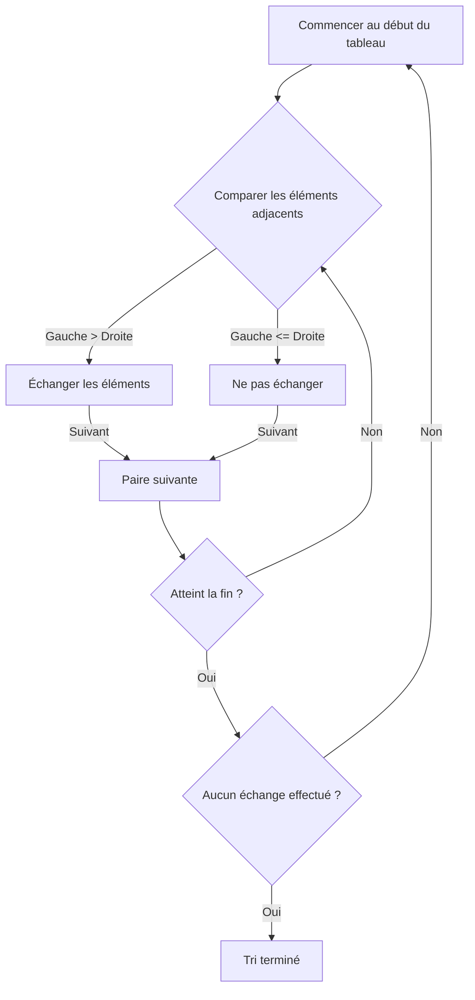
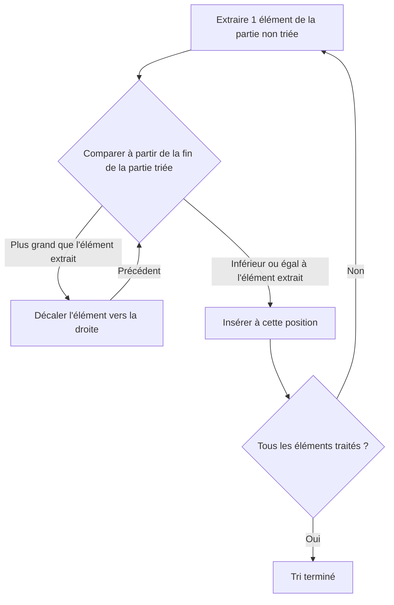
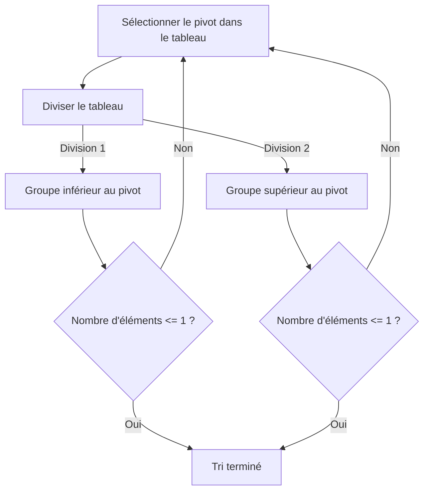
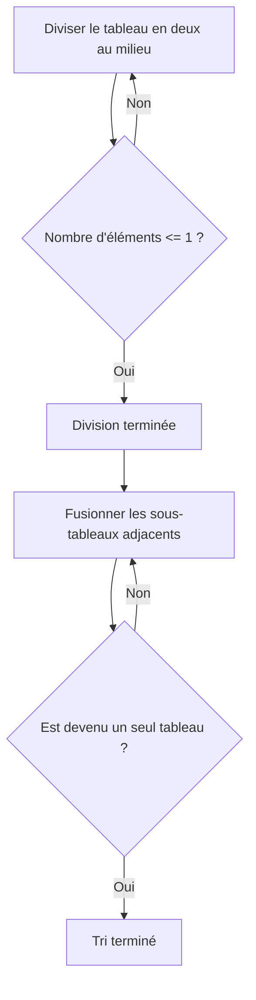

# 1. Introduction : Le monde profond des algorithmes de tri

En informatique, le « tri », qui consiste à réorganiser des données dans un ordre spécifique (croissant ou décroissant), est l'une des opérations les plus fondamentales et importantes. Les algorithmes de tri sont utilisés comme étape préliminaire dans tout traitement de données, comme l'accélération des recherches, le regroupement de données et la détection de doublons.

Dans cet article, nous expliquons en détail les algorithmes de tri représentatifs, allant des algorithmes simples faciles à comprendre pour les débutants aux algorithmes rapides utilisés dans la pratique. Nous comprendrons visuellement le fonctionnement de chaque algorithme avec des schémas **Mermaid**, vérifierons l'implémentation réelle avec du code Python et comparerons les performances telles que la complexité temporelle. De plus, afin de saisir pleinement le comportement de l'algorithme, nous incluons une trace d'exécution complète utilisant un tableau de 50 éléments. Cela vous permettra de comprendre le comportement détaillé de l'algorithme comme si vous l'aviez entre les mains.

## Critères d'évaluation des algorithmes

Lors de l'évaluation de chaque algorithme, les critères suivants sont importants.

- **Complexité temporelle (Time Complexity)** : Indique comment le temps de traitement augmente par rapport au nombre d'éléments $n$ des données. La notation Grand-O (Big-O notation) telle que $\text{O}(n^2)$ ou $\text{O}(n \log n)$ est utilisée. Lors de la manipulation de texte dans des formules mathématiques, nous l'écrivons comme $\text{best}$.
- **Complexité spatiale (Space Complexity)** : Indique la quantité de mémoire supplémentaire requise lors de l'exécution. Les algorithmes en place (In-place) nécessitent peu ou pas de mémoire supplémentaire.
- **Stabilité (Stability)** : Indique si l'ordre relatif des éléments ayant la même valeur est conservé avant et après le tri. Dans un tri stable, l'ordre d'origine est maintenu.

---

## 2. Tri à bulles (Bubble Sort)

Il s'agit d'un algorithme qui répète l'opération consistant à comparer des éléments adjacents et à les échanger si leur ordre est inversé. Tout comme les bulles remontent à la surface de l'eau, les éléments plus grands se déplacent progressivement vers la fin du tableau.

### Complexité et caractéristiques

- **Complexité temporelle (Meilleur cas)** : $\text{O}(n)$
- **Complexité temporelle (Cas moyen)** : $\text{O}(n^2)$
- **Complexité temporelle (Pire cas)** : $\text{O}(n^2)$
- **Complexité spatiale** : $\text{O}(1)$
- **Stabilité** : Stable

### Schéma (Mermaid)



### Implémentation en Python

```python
def bubble_sort(arr):
    n = len(arr)
    for i in range(n):
        swapped = False
        for j in range(0, n-i-1):
            if arr[j] > arr[j+1]:
                arr[j], arr[j+1] = arr[j+1], arr[j]
                swapped = True
        if not swapped:
            break
    return arr
```

### Trace détaillée du tri à bulles

Voici l'état du tableau après l'achèvement de chaque passe lors de l'exécution du tri à bulles sur un tableau aléatoire de 50 éléments. Observez comment le tri à bulles pousse les éléments vers la droite.

**État initial** : `[83, 14, 64, 71, 83, 11, 36, 69, 72, 45, 93, 30, 14, 76, 72, 51, 19, 41, 56, 15, 63, 27, 87, 55, 58, 63, 46, 96, 43, 68, 32, 97, 48, 94, 56, 27, 68, 40, 66, 88, 58, 15, 84, 10, 40, 27, 34, 48, 78, 56]`

**Après l'étape 1**: `[14, 64, 71, 83, 11, 36, 69, 72, 45, 83, 30, 14, 76, 72, 51, 19, 41, 56, 15, 63, 27, 87, 55, 58, 63, 46, 93, 43, 68, 32, 96, 48, 94, 56, 27, 68, 40, 66, 88, 58, 15, 84, 10, 40, 27, 34, 48, 78, 56, 97]`

Dans cette passe, le plus grand élément de la partie non triée a flotté jusqu'à l'extrémité droite comme une bulle. En raison de la nature du tri à bulles, il est garanti qu'au moins un élément se retrouvera dans sa position correcte finale à chaque passe. Par conséquent, il est possible de réduire la zone de recherche d'une unité à chaque passe, ce qui réduit les opérations de comparaison inutiles. Cependant, dans le pire des cas où les données sont disposées dans un ordre complètement inverse, des opérations d'échange se produisent pour toutes les paires d'éléments, de sorte que la complexité atteint $\text{O}(n^2)$ et les performances sont extrêmement faibles.

Dans cette passe, le plus grand élément de la partie non triée a flotté jusqu'à l'extrémité droite comme une bulle. En raison de la nature du tri à bulles, il est garanti qu'au moins un élément se retrouvera dans sa position correcte finale à chaque passe. Par conséquent, il est possible de réduire la zone de recherche d'une unité à chaque passe, ce qui réduit les opérations de comparaison inutiles. Cependant, dans le pire des cas où les données sont disposées dans un ordre complètement inverse, des opérations d'échange se produisent pour toutes les paires d'éléments, de sorte que la complexité atteint $\text{O}(n^2)$ et les performances sont extrêmement faibles.

**Après l'étape 2**: `[14, 64, 71, 11, 36, 69, 72, 45, 83, 30, 14, 76, 72, 51, 19, 41, 56, 15, 63, 27, 83, 55, 58, 63, 46, 87, 43, 68, 32, 93, 48, 94, 56, 27, 68, 40, 66, 88, 58, 15, 84, 10, 40, 27, 34, 48, 78, 56, 96, 97]`

Dans cette passe, le plus grand élément de la partie non triée a flotté jusqu'à l'extrémité droite comme une bulle. En raison de la nature du tri à bulles, il est garanti qu'au moins un élément se retrouvera dans sa position correcte finale à chaque passe. Par conséquent, il est possible de réduire la zone de recherche d'une unité à chaque passe, ce qui réduit les opérations de comparaison inutiles. Cependant, dans le pire des cas où les données sont disposées dans un ordre complètement inverse, des opérations d'échange se produisent pour toutes les paires d'éléments, de sorte que la complexité atteint $\text{O}(n^2)$ et les performances sont extrêmement faibles.

Dans cette passe, le plus grand élément de la partie non triée a flotté jusqu'à l'extrémité droite comme une bulle. En raison de la nature du tri à bulles, il est garanti qu'au moins un élément se retrouvera dans sa position correcte finale à chaque passe. Par conséquent, il est possible de réduire la zone de recherche d'une unité à chaque passe, ce qui réduit les opérations de comparaison inutiles. Cependant, dans le pire des cas où les données sont disposées dans un ordre complètement inverse, des opérations d'échange se produisent pour toutes les paires d'éléments, de sorte que la complexité atteint $\text{O}(n^2)$ et les performances sont extrêmement faibles.

**Après l'étape 3**: `[14, 64, 11, 36, 69, 71, 45, 72, 30, 14, 76, 72, 51, 19, 41, 56, 15, 63, 27, 83, 55, 58, 63, 46, 83, 43, 68, 32, 87, 48, 93, 56, 27, 68, 40, 66, 88, 58, 15, 84, 10, 40, 27, 34, 48, 78, 56, 94, 96, 97]`

Dans cette passe, le plus grand élément de la partie non triée a flotté jusqu'à l'extrémité droite comme une bulle. En raison de la nature du tri à bulles, il est garanti qu'au moins un élément se retrouvera dans sa position correcte finale à chaque passe. Par conséquent, il est possible de réduire la zone de recherche d'une unité à chaque passe, ce qui réduit les opérations de comparaison inutiles. Cependant, dans le pire des cas où les données sont disposées dans un ordre complètement inverse, des opérations d'échange se produisent pour toutes les paires d'éléments, de sorte que la complexité atteint $\text{O}(n^2)$ et les performances sont extrêmement faibles.

Dans cette passe, le plus grand élément de la partie non triée a flotté jusqu'à l'extrémité droite comme une bulle. En raison de la nature du tri à bulles, il est garanti qu'au moins un élément se retrouvera dans sa position correcte finale à chaque passe. Par conséquent, il est possible de réduire la zone de recherche d'une unité à chaque passe, ce qui réduit les opérations de comparaison inutiles. Cependant, dans le pire des cas où les données sont disposées dans un ordre complètement inverse, des opérations d'échange se produisent pour toutes les paires d'éléments, de sorte que la complexité atteint $\text{O}(n^2)$ et les performances sont extrêmement faibles.

**Après l'étape 4**: `[14, 11, 36, 64, 69, 45, 71, 30, 14, 72, 72, 51, 19, 41, 56, 15, 63, 27, 76, 55, 58, 63, 46, 83, 43, 68, 32, 83, 48, 87, 56, 27, 68, 40, 66, 88, 58, 15, 84, 10, 40, 27, 34, 48, 78, 56, 93, 94, 96, 97]`

Dans cette passe, le plus grand élément de la partie non triée a flotté jusqu'à l'extrémité droite comme une bulle. En raison de la nature du tri à bulles, il est garanti qu'au moins un élément se retrouvera dans sa position correcte finale à chaque passe. Par conséquent, il est possible de réduire la zone de recherche d'une unité à chaque passe, ce qui réduit les opérations de comparaison inutiles. Cependant, dans le pire des cas où les données sont disposées dans un ordre complètement inverse, des opérations d'échange se produisent pour toutes les paires d'éléments, de sorte que la complexité atteint $\text{O}(n^2)$ et les performances sont extrêmement faibles.

Dans cette passe, le plus grand élément de la partie non triée a flotté jusqu'à l'extrémité droite comme une bulle. En raison de la nature du tri à bulles, il est garanti qu'au moins un élément se retrouvera dans sa position correcte finale à chaque passe. Par conséquent, il est possible de réduire la zone de recherche d'une unité à chaque passe, ce qui réduit les opérations de comparaison inutiles. Cependant, dans le pire des cas où les données sont disposées dans un ordre complètement inverse, des opérations d'échange se produisent pour toutes les paires d'éléments, de sorte que la complexité atteint $\text{O}(n^2)$ et les performances sont extrêmement faibles.

**Après l'étape 5**: `[11, 14, 36, 64, 45, 69, 30, 14, 71, 72, 51, 19, 41, 56, 15, 63, 27, 72, 55, 58, 63, 46, 76, 43, 68, 32, 83, 48, 83, 56, 27, 68, 40, 66, 87, 58, 15, 84, 10, 40, 27, 34, 48, 78, 56, 88, 93, 94, 96, 97]`

Dans cette passe, le plus grand élément de la partie non triée a flotté jusqu'à l'extrémité droite comme une bulle. En raison de la nature du tri à bulles, il est garanti qu'au moins un élément se retrouvera dans sa position correcte finale à chaque passe. Par conséquent, il est possible de réduire la zone de recherche d'une unité à chaque passe, ce qui réduit les opérations de comparaison inutiles. Cependant, dans le pire des cas où les données sont disposées dans un ordre complètement inverse, des opérations d'échange se produisent pour toutes les paires d'éléments, de sorte que la complexité atteint $\text{O}(n^2)$ et les performances sont extrêmement faibles.

Dans cette passe, le plus grand élément de la partie non triée a flotté jusqu'à l'extrémité droite comme une bulle. En raison de la nature du tri à bulles, il est garanti qu'au moins un élément se retrouvera dans sa position correcte finale à chaque passe. Par conséquent, il est possible de réduire la zone de recherche d'une unité à chaque passe, ce qui réduit les opérations de comparaison inutiles. Cependant, dans le pire des cas où les données sont disposées dans un ordre complètement inverse, des opérations d'échange se produisent pour toutes les paires d'éléments, de sorte que la complexité atteint $\text{O}(n^2)$ et les performances sont extrêmement faibles.

**Après l'étape 6**: `[11, 14, 36, 45, 64, 30, 14, 69, 71, 51, 19, 41, 56, 15, 63, 27, 72, 55, 58, 63, 46, 72, 43, 68, 32, 76, 48, 83, 56, 27, 68, 40, 66, 83, 58, 15, 84, 10, 40, 27, 34, 48, 78, 56, 87, 88, 93, 94, 96, 97]`

Dans cette passe, le plus grand élément de la partie non triée a flotté jusqu'à l'extrémité droite comme une bulle. En raison de la nature du tri à bulles, il est garanti qu'au moins un élément se retrouvera dans sa position correcte finale à chaque passe. Par conséquent, il est possible de réduire la zone de recherche d'une unité à chaque passe, ce qui réduit les opérations de comparaison inutiles. Cependant, dans le pire des cas où les données sont disposées dans un ordre complètement inverse, des opérations d'échange se produisent pour toutes les paires d'éléments, de sorte que la complexité atteint $\text{O}(n^2)$ et les performances sont extrêmement faibles.

Dans cette passe, le plus grand élément de la partie non triée a flotté jusqu'à l'extrémité droite comme une bulle. En raison de la nature du tri à bulles, il est garanti qu'au moins un élément se retrouvera dans sa position correcte finale à chaque passe. Par conséquent, il est possible de réduire la zone de recherche d'une unité à chaque passe, ce qui réduit les opérations de comparaison inutiles. Cependant, dans le pire des cas où les données sont disposées dans un ordre complètement inverse, des opérations d'échange se produisent pour toutes les paires d'éléments, de sorte que la complexité atteint $\text{O}(n^2)$ et les performances sont extrêmement faibles.

**Après l'étape 7**: `[11, 14, 36, 45, 30, 14, 64, 69, 51, 19, 41, 56, 15, 63, 27, 71, 55, 58, 63, 46, 72, 43, 68, 32, 72, 48, 76, 56, 27, 68, 40, 66, 83, 58, 15, 83, 10, 40, 27, 34, 48, 78, 56, 84, 87, 88, 93, 94, 96, 97]`

Dans cette passe, le plus grand élément de la partie non triée a flotté jusqu'à l'extrémité droite comme une bulle. En raison de la nature du tri à bulles, il est garanti qu'au moins un élément se retrouvera dans sa position correcte finale à chaque passe. Par conséquent, il est possible de réduire la zone de recherche d'une unité à chaque passe, ce qui réduit les opérations de comparaison inutiles. Cependant, dans le pire des cas où les données sont disposées dans un ordre complètement inverse, des opérations d'échange se produisent pour toutes les paires d'éléments, de sorte que la complexité atteint $\text{O}(n^2)$ et les performances sont extrêmement faibles.

Dans cette passe, le plus grand élément de la partie non triée a flotté jusqu'à l'extrémité droite comme une bulle. En raison de la nature du tri à bulles, il est garanti qu'au moins un élément se retrouvera dans sa position correcte finale à chaque passe. Par conséquent, il est possible de réduire la zone de recherche d'une unité à chaque passe, ce qui réduit les opérations de comparaison inutiles. Cependant, dans le pire des cas où les données sont disposées dans un ordre complètement inverse, des opérations d'échange se produisent pour toutes les paires d'éléments, de sorte que la complexité atteint $\text{O}(n^2)$ et les performances sont extrêmement faibles.

**Après l'étape 8**: `[11, 14, 36, 30, 14, 45, 64, 51, 19, 41, 56, 15, 63, 27, 69, 55, 58, 63, 46, 71, 43, 68, 32, 72, 48, 72, 56, 27, 68, 40, 66, 76, 58, 15, 83, 10, 40, 27, 34, 48, 78, 56, 83, 84, 87, 88, 93, 94, 96, 97]`

Dans cette passe, le plus grand élément de la partie non triée a flotté jusqu'à l'extrémité droite comme une bulle. En raison de la nature du tri à bulles, il est garanti qu'au moins un élément se retrouvera dans sa position correcte finale à chaque passe. Par conséquent, il est possible de réduire la zone de recherche d'une unité à chaque passe, ce qui réduit les opérations de comparaison inutiles. Cependant, dans le pire des cas où les données sont disposées dans un ordre complètement inverse, des opérations d'échange se produisent pour toutes les paires d'éléments, de sorte que la complexité atteint $\text{O}(n^2)$ et les performances sont extrêmement faibles.

Dans cette passe, le plus grand élément de la partie non triée a flotté jusqu'à l'extrémité droite comme une bulle. En raison de la nature du tri à bulles, il est garanti qu'au moins un élément se retrouvera dans sa position correcte finale à chaque passe. Par conséquent, il est possible de réduire la zone de recherche d'une unité à chaque passe, ce qui réduit les opérations de comparaison inutiles. Cependant, dans le pire des cas où les données sont disposées dans un ordre complètement inverse, des opérations d'échange se produisent pour toutes les paires d'éléments, de sorte que la complexité atteint $\text{O}(n^2)$ et les performances sont extrêmement faibles.

**Après l'étape 9**: `[11, 14, 30, 14, 36, 45, 51, 19, 41, 56, 15, 63, 27, 64, 55, 58, 63, 46, 69, 43, 68, 32, 71, 48, 72, 56, 27, 68, 40, 66, 72, 58, 15, 76, 10, 40, 27, 34, 48, 78, 56, 83, 83, 84, 87, 88, 93, 94, 96, 97]`

Dans cette passe, le plus grand élément de la partie non triée a flotté jusqu'à l'extrémité droite comme une bulle. En raison de la nature du tri à bulles, il est garanti qu'au moins un élément se retrouvera dans sa position correcte finale à chaque passe. Par conséquent, il est possible de réduire la zone de recherche d'une unité à chaque passe, ce qui réduit les opérations de comparaison inutiles. Cependant, dans le pire des cas où les données sont disposées dans un ordre complètement inverse, des opérations d'échange se produisent pour toutes les paires d'éléments, de sorte que la complexité atteint $\text{O}(n^2)$ et les performances sont extrêmement faibles.

Dans cette passe, le plus grand élément de la partie non triée a flotté jusqu'à l'extrémité droite comme une bulle. En raison de la nature du tri à bulles, il est garanti qu'au moins un élément se retrouvera dans sa position correcte finale à chaque passe. Par conséquent, il est possible de réduire la zone de recherche d'une unité à chaque passe, ce qui réduit les opérations de comparaison inutiles. Cependant, dans le pire des cas où les données sont disposées dans un ordre complètement inverse, des opérations d'échange se produisent pour toutes les paires d'éléments, de sorte que la complexité atteint $\text{O}(n^2)$ et les performances sont extrêmement faibles.

**Après l'étape 10**: `[11, 14, 14, 30, 36, 45, 19, 41, 51, 15, 56, 27, 63, 55, 58, 63, 46, 64, 43, 68, 32, 69, 48, 71, 56, 27, 68, 40, 66, 72, 58, 15, 72, 10, 40, 27, 34, 48, 76, 56, 78, 83, 83, 84, 87, 88, 93, 94, 96, 97]`

Dans cette passe, le plus grand élément de la partie non triée a flotté jusqu'à l'extrémité droite comme une bulle. En raison de la nature du tri à bulles, il est garanti qu'au moins un élément se retrouvera dans sa position correcte finale à chaque passe. Par conséquent, il est possible de réduire la zone de recherche d'une unité à chaque passe, ce qui réduit les opérations de comparaison inutiles. Cependant, dans le pire des cas où les données sont disposées dans un ordre complètement inverse, des opérations d'échange se produisent pour toutes les paires d'éléments, de sorte que la complexité atteint $\text{O}(n^2)$ et les performances sont extrêmement faibles.

Dans cette passe, le plus grand élément de la partie non triée a flotté jusqu'à l'extrémité droite comme une bulle. En raison de la nature du tri à bulles, il est garanti qu'au moins un élément se retrouvera dans sa position correcte finale à chaque passe. Par conséquent, il est possible de réduire la zone de recherche d'une unité à chaque passe, ce qui réduit les opérations de comparaison inutiles. Cependant, dans le pire des cas où les données sont disposées dans un ordre complètement inverse, des opérations d'échange se produisent pour toutes les paires d'éléments, de sorte que la complexité atteint $\text{O}(n^2)$ et les performances sont extrêmement faibles.

**Après l'étape 11**: `[11, 14, 14, 30, 36, 19, 41, 45, 15, 51, 27, 56, 55, 58, 63, 46, 63, 43, 64, 32, 68, 48, 69, 56, 27, 68, 40, 66, 71, 58, 15, 72, 10, 40, 27, 34, 48, 72, 56, 76, 78, 83, 83, 84, 87, 88, 93, 94, 96, 97]`

Dans cette passe, le plus grand élément de la partie non triée a flotté jusqu'à l'extrémité droite comme une bulle. En raison de la nature du tri à bulles, il est garanti qu'au moins un élément se retrouvera dans sa position correcte finale à chaque passe. Par conséquent, il est possible de réduire la zone de recherche d'une unité à chaque passe, ce qui réduit les opérations de comparaison inutiles. Cependant, dans le pire des cas où les données sont disposées dans un ordre complètement inverse, des opérations d'échange se produisent pour toutes les paires d'éléments, de sorte que la complexité atteint $\text{O}(n^2)$ et les performances sont extrêmement faibles.

Dans cette passe, le plus grand élément de la partie non triée a flotté jusqu'à l'extrémité droite comme une bulle. En raison de la nature du tri à bulles, il est garanti qu'au moins un élément se retrouvera dans sa position correcte finale à chaque passe. Par conséquent, il est possible de réduire la zone de recherche d'une unité à chaque passe, ce qui réduit les opérations de comparaison inutiles. Cependant, dans le pire des cas où les données sont disposées dans un ordre complètement inverse, des opérations d'échange se produisent pour toutes les paires d'éléments, de sorte que la complexité atteint $\text{O}(n^2)$ et les performances sont extrêmement faibles.

**Après l'étape 12**: `[11, 14, 14, 30, 19, 36, 41, 15, 45, 27, 51, 55, 56, 58, 46, 63, 43, 63, 32, 64, 48, 68, 56, 27, 68, 40, 66, 69, 58, 15, 71, 10, 40, 27, 34, 48, 72, 56, 72, 76, 78, 83, 83, 84, 87, 88, 93, 94, 96, 97]`

Dans cette passe, le plus grand élément de la partie non triée a flotté jusqu'à l'extrémité droite comme une bulle. En raison de la nature du tri à bulles, il est garanti qu'au moins un élément se retrouvera dans sa position correcte finale à chaque passe. Par conséquent, il est possible de réduire la zone de recherche d'une unité à chaque passe, ce qui réduit les opérations de comparaison inutiles. Cependant, dans le pire des cas où les données sont disposées dans un ordre complètement inverse, des opérations d'échange se produisent pour toutes les paires d'éléments, de sorte que la complexité atteint $\text{O}(n^2)$ et les performances sont extrêmement faibles.

Dans cette passe, le plus grand élément de la partie non triée a flotté jusqu'à l'extrémité droite comme une bulle. En raison de la nature du tri à bulles, il est garanti qu'au moins un élément se retrouvera dans sa position correcte finale à chaque passe. Par conséquent, il est possible de réduire la zone de recherche d'une unité à chaque passe, ce qui réduit les opérations de comparaison inutiles. Cependant, dans le pire des cas où les données sont disposées dans un ordre complètement inverse, des opérations d'échange se produisent pour toutes les paires d'éléments, de sorte que la complexité atteint $\text{O}(n^2)$ et les performances sont extrêmement faibles.

**Après l'étape 13**: `[11, 14, 14, 19, 30, 36, 15, 41, 27, 45, 51, 55, 56, 46, 58, 43, 63, 32, 63, 48, 64, 56, 27, 68, 40, 66, 68, 58, 15, 69, 10, 40, 27, 34, 48, 71, 56, 72, 72, 76, 78, 83, 83, 84, 87, 88, 93, 94, 96, 97]`

Dans cette passe, le plus grand élément de la partie non triée a flotté jusqu'à l'extrémité droite comme une bulle. En raison de la nature du tri à bulles, il est garanti qu'au moins un élément se retrouvera dans sa position correcte finale à chaque passe. Par conséquent, il est possible de réduire la zone de recherche d'une unité à chaque passe, ce qui réduit les opérations de comparaison inutiles. Cependant, dans le pire des cas où les données sont disposées dans un ordre complètement inverse, des opérations d'échange se produisent pour toutes les paires d'éléments, de sorte que la complexité atteint $\text{O}(n^2)$ et les performances sont extrêmement faibles.

Dans cette passe, le plus grand élément de la partie non triée a flotté jusqu'à l'extrémité droite comme une bulle. En raison de la nature du tri à bulles, il est garanti qu'au moins un élément se retrouvera dans sa position correcte finale à chaque passe. Par conséquent, il est possible de réduire la zone de recherche d'une unité à chaque passe, ce qui réduit les opérations de comparaison inutiles. Cependant, dans le pire des cas où les données sont disposées dans un ordre complètement inverse, des opérations d'échange se produisent pour toutes les paires d'éléments, de sorte que la complexité atteint $\text{O}(n^2)$ et les performances sont extrêmement faibles.

**Après l'étape 14**: `[11, 14, 14, 19, 30, 15, 36, 27, 41, 45, 51, 55, 46, 56, 43, 58, 32, 63, 48, 63, 56, 27, 64, 40, 66, 68, 58, 15, 68, 10, 40, 27, 34, 48, 69, 56, 71, 72, 72, 76, 78, 83, 83, 84, 87, 88, 93, 94, 96, 97]`

Dans cette passe, le plus grand élément de la partie non triée a flotté jusqu'à l'extrémité droite comme une bulle. En raison de la nature du tri à bulles, il est garanti qu'au moins un élément se retrouvera dans sa position correcte finale à chaque passe. Par conséquent, il est possible de réduire la zone de recherche d'une unité à chaque passe, ce qui réduit les opérations de comparaison inutiles. Cependant, dans le pire des cas où les données sont disposées dans un ordre complètement inverse, des opérations d'échange se produisent pour toutes les paires d'éléments, de sorte que la complexité atteint $\text{O}(n^2)$ et les performances sont extrêmement faibles.

Dans cette passe, le plus grand élément de la partie non triée a flotté jusqu'à l'extrémité droite comme une bulle. En raison de la nature du tri à bulles, il est garanti qu'au moins un élément se retrouvera dans sa position correcte finale à chaque passe. Par conséquent, il est possible de réduire la zone de recherche d'une unité à chaque passe, ce qui réduit les opérations de comparaison inutiles. Cependant, dans le pire des cas où les données sont disposées dans un ordre complètement inverse, des opérations d'échange se produisent pour toutes les paires d'éléments, de sorte que la complexité atteint $\text{O}(n^2)$ et les performances sont extrêmement faibles.

**Après l'étape 15**: `[11, 14, 14, 19, 15, 30, 27, 36, 41, 45, 51, 46, 55, 43, 56, 32, 58, 48, 63, 56, 27, 63, 40, 64, 66, 58, 15, 68, 10, 40, 27, 34, 48, 68, 56, 69, 71, 72, 72, 76, 78, 83, 83, 84, 87, 88, 93, 94, 96, 97]`

Dans cette passe, le plus grand élément de la partie non triée a flotté jusqu'à l'extrémité droite comme une bulle. En raison de la nature du tri à bulles, il est garanti qu'au moins un élément se retrouvera dans sa position correcte finale à chaque passe. Par conséquent, il est possible de réduire la zone de recherche d'une unité à chaque passe, ce qui réduit les opérations de comparaison inutiles. Cependant, dans le pire des cas où les données sont disposées dans un ordre complètement inverse, des opérations d'échange se produisent pour toutes les paires d'éléments, de sorte que la complexité atteint $\text{O}(n^2)$ et les performances sont extrêmement faibles.

Dans cette passe, le plus grand élément de la partie non triée a flotté jusqu'à l'extrémité droite comme une bulle. En raison de la nature du tri à bulles, il est garanti qu'au moins un élément se retrouvera dans sa position correcte finale à chaque passe. Par conséquent, il est possible de réduire la zone de recherche d'une unité à chaque passe, ce qui réduit les opérations de comparaison inutiles. Cependant, dans le pire des cas où les données sont disposées dans un ordre complètement inverse, des opérations d'échange se produisent pour toutes les paires d'éléments, de sorte que la complexité atteint $\text{O}(n^2)$ et les performances sont extrêmement faibles.

**Après l'étape 16**: `[11, 14, 14, 15, 19, 27, 30, 36, 41, 45, 46, 51, 43, 55, 32, 56, 48, 58, 56, 27, 63, 40, 63, 64, 58, 15, 66, 10, 40, 27, 34, 48, 68, 56, 68, 69, 71, 72, 72, 76, 78, 83, 83, 84, 87, 88, 93, 94, 96, 97]`

Dans cette passe, le plus grand élément de la partie non triée a flotté jusqu'à l'extrémité droite comme une bulle. En raison de la nature du tri à bulles, il est garanti qu'au moins un élément se retrouvera dans sa position correcte finale à chaque passe. Par conséquent, il est possible de réduire la zone de recherche d'une unité à chaque passe, ce qui réduit les opérations de comparaison inutiles. Cependant, dans le pire des cas où les données sont disposées dans un ordre complètement inverse, des opérations d'échange se produisent pour toutes les paires d'éléments, de sorte que la complexité atteint $\text{O}(n^2)$ et les performances sont extrêmement faibles.

Dans cette passe, le plus grand élément de la partie non triée a flotté jusqu'à l'extrémité droite comme une bulle. En raison de la nature du tri à bulles, il est garanti qu'au moins un élément se retrouvera dans sa position correcte finale à chaque passe. Par conséquent, il est possible de réduire la zone de recherche d'une unité à chaque passe, ce qui réduit les opérations de comparaison inutiles. Cependant, dans le pire des cas où les données sont disposées dans un ordre complètement inverse, des opérations d'échange se produisent pour toutes les paires d'éléments, de sorte que la complexité atteint $\text{O}(n^2)$ et les performances sont extrêmement faibles.

**Après l'étape 17**: `[11, 14, 14, 15, 19, 27, 30, 36, 41, 45, 46, 43, 51, 32, 55, 48, 56, 56, 27, 58, 40, 63, 63, 58, 15, 64, 10, 40, 27, 34, 48, 66, 56, 68, 68, 69, 71, 72, 72, 76, 78, 83, 83, 84, 87, 88, 93, 94, 96, 97]`

Dans cette passe, le plus grand élément de la partie non triée a flotté jusqu'à l'extrémité droite comme une bulle. En raison de la nature du tri à bulles, il est garanti qu'au moins un élément se retrouvera dans sa position correcte finale à chaque passe. Par conséquent, il est possible de réduire la zone de recherche d'une unité à chaque passe, ce qui réduit les opérations de comparaison inutiles. Cependant, dans le pire des cas où les données sont disposées dans un ordre complètement inverse, des opérations d'échange se produisent pour toutes les paires d'éléments, de sorte que la complexité atteint $\text{O}(n^2)$ et les performances sont extrêmement faibles.

Dans cette passe, le plus grand élément de la partie non triée a flotté jusqu'à l'extrémité droite comme une bulle. En raison de la nature du tri à bulles, il est garanti qu'au moins un élément se retrouvera dans sa position correcte finale à chaque passe. Par conséquent, il est possible de réduire la zone de recherche d'une unité à chaque passe, ce qui réduit les opérations de comparaison inutiles. Cependant, dans le pire des cas où les données sont disposées dans un ordre complètement inverse, des opérations d'échange se produisent pour toutes les paires d'éléments, de sorte que la complexité atteint $\text{O}(n^2)$ et les performances sont extrêmement faibles.

**Après l'étape 18**: `[11, 14, 14, 15, 19, 27, 30, 36, 41, 45, 43, 46, 32, 51, 48, 55, 56, 27, 56, 40, 58, 63, 58, 15, 63, 10, 40, 27, 34, 48, 64, 56, 66, 68, 68, 69, 71, 72, 72, 76, 78, 83, 83, 84, 87, 88, 93, 94, 96, 97]`

Dans cette passe, le plus grand élément de la partie non triée a flotté jusqu'à l'extrémité droite comme une bulle. En raison de la nature du tri à bulles, il est garanti qu'au moins un élément se retrouvera dans sa position correcte finale à chaque passe. Par conséquent, il est possible de réduire la zone de recherche d'une unité à chaque passe, ce qui réduit les opérations de comparaison inutiles. Cependant, dans le pire des cas où les données sont disposées dans un ordre complètement inverse, des opérations d'échange se produisent pour toutes les paires d'éléments, de sorte que la complexité atteint $\text{O}(n^2)$ et les performances sont extrêmement faibles.

Dans cette passe, le plus grand élément de la partie non triée a flotté jusqu'à l'extrémité droite comme une bulle. En raison de la nature du tri à bulles, il est garanti qu'au moins un élément se retrouvera dans sa position correcte finale à chaque passe. Par conséquent, il est possible de réduire la zone de recherche d'une unité à chaque passe, ce qui réduit les opérations de comparaison inutiles. Cependant, dans le pire des cas où les données sont disposées dans un ordre complètement inverse, des opérations d'échange se produisent pour toutes les paires d'éléments, de sorte que la complexité atteint $\text{O}(n^2)$ et les performances sont extrêmement faibles.

**Après l'étape 19**: `[11, 14, 14, 15, 19, 27, 30, 36, 41, 43, 45, 32, 46, 48, 51, 55, 27, 56, 40, 56, 58, 58, 15, 63, 10, 40, 27, 34, 48, 63, 56, 64, 66, 68, 68, 69, 71, 72, 72, 76, 78, 83, 83, 84, 87, 88, 93, 94, 96, 97]`

Dans cette passe, le plus grand élément de la partie non triée a flotté jusqu'à l'extrémité droite comme une bulle. En raison de la nature du tri à bulles, il est garanti qu'au moins un élément se retrouvera dans sa position correcte finale à chaque passe. Par conséquent, il est possible de réduire la zone de recherche d'une unité à chaque passe, ce qui réduit les opérations de comparaison inutiles. Cependant, dans le pire des cas où les données sont disposées dans un ordre complètement inverse, des opérations d'échange se produisent pour toutes les paires d'éléments, de sorte que la complexité atteint $\text{O}(n^2)$ et les performances sont extrêmement faibles.

Dans cette passe, le plus grand élément de la partie non triée a flotté jusqu'à l'extrémité droite comme une bulle. En raison de la nature du tri à bulles, il est garanti qu'au moins un élément se retrouvera dans sa position correcte finale à chaque passe. Par conséquent, il est possible de réduire la zone de recherche d'une unité à chaque passe, ce qui réduit les opérations de comparaison inutiles. Cependant, dans le pire des cas où les données sont disposées dans un ordre complètement inverse, des opérations d'échange se produisent pour toutes les paires d'éléments, de sorte que la complexité atteint $\text{O}(n^2)$ et les performances sont extrêmement faibles.

**Après l'étape 20**: `[11, 14, 14, 15, 19, 27, 30, 36, 41, 43, 32, 45, 46, 48, 51, 27, 55, 40, 56, 56, 58, 15, 58, 10, 40, 27, 34, 48, 63, 56, 63, 64, 66, 68, 68, 69, 71, 72, 72, 76, 78, 83, 83, 84, 87, 88, 93, 94, 96, 97]`

Dans cette passe, le plus grand élément de la partie non triée a flotté jusqu'à l'extrémité droite comme une bulle. En raison de la nature du tri à bulles, il est garanti qu'au moins un élément se retrouvera dans sa position correcte finale à chaque passe. Par conséquent, il est possible de réduire la zone de recherche d'une unité à chaque passe, ce qui réduit les opérations de comparaison inutiles. Cependant, dans le pire des cas où les données sont disposées dans un ordre complètement inverse, des opérations d'échange se produisent pour toutes les paires d'éléments, de sorte que la complexité atteint $\text{O}(n^2)$ et les performances sont extrêmement faibles.

Dans cette passe, le plus grand élément de la partie non triée a flotté jusqu'à l'extrémité droite comme une bulle. En raison de la nature du tri à bulles, il est garanti qu'au moins un élément se retrouvera dans sa position correcte finale à chaque passe. Par conséquent, il est possible de réduire la zone de recherche d'une unité à chaque passe, ce qui réduit les opérations de comparaison inutiles. Cependant, dans le pire des cas où les données sont disposées dans un ordre complètement inverse, des opérations d'échange se produisent pour toutes les paires d'éléments, de sorte que la complexité atteint $\text{O}(n^2)$ et les performances sont extrêmement faibles.

**Après l'étape 21**: `[11, 14, 14, 15, 19, 27, 30, 36, 41, 32, 43, 45, 46, 48, 27, 51, 40, 55, 56, 56, 15, 58, 10, 40, 27, 34, 48, 58, 56, 63, 63, 64, 66, 68, 68, 69, 71, 72, 72, 76, 78, 83, 83, 84, 87, 88, 93, 94, 96, 97]`

Dans cette passe, le plus grand élément de la partie non triée a flotté jusqu'à l'extrémité droite comme une bulle. En raison de la nature du tri à bulles, il est garanti qu'au moins un élément se retrouvera dans sa position correcte finale à chaque passe. Par conséquent, il est possible de réduire la zone de recherche d'une unité à chaque passe, ce qui réduit les opérations de comparaison inutiles. Cependant, dans le pire des cas où les données sont disposées dans un ordre complètement inverse, des opérations d'échange se produisent pour toutes les paires d'éléments, de sorte que la complexité atteint $\text{O}(n^2)$ et les performances sont extrêmement faibles.

Dans cette passe, le plus grand élément de la partie non triée a flotté jusqu'à l'extrémité droite comme une bulle. En raison de la nature du tri à bulles, il est garanti qu'au moins un élément se retrouvera dans sa position correcte finale à chaque passe. Par conséquent, il est possible de réduire la zone de recherche d'une unité à chaque passe, ce qui réduit les opérations de comparaison inutiles. Cependant, dans le pire des cas où les données sont disposées dans un ordre complètement inverse, des opérations d'échange se produisent pour toutes les paires d'éléments, de sorte que la complexité atteint $\text{O}(n^2)$ et les performances sont extrêmement faibles.

**Après l'étape 22**: `[11, 14, 14, 15, 19, 27, 30, 36, 32, 41, 43, 45, 46, 27, 48, 40, 51, 55, 56, 15, 56, 10, 40, 27, 34, 48, 58, 56, 58, 63, 63, 64, 66, 68, 68, 69, 71, 72, 72, 76, 78, 83, 83, 84, 87, 88, 93, 94, 96, 97]`

Dans cette passe, le plus grand élément de la partie non triée a flotté jusqu'à l'extrémité droite comme une bulle. En raison de la nature du tri à bulles, il est garanti qu'au moins un élément se retrouvera dans sa position correcte finale à chaque passe. Par conséquent, il est possible de réduire la zone de recherche d'une unité à chaque passe, ce qui réduit les opérations de comparaison inutiles. Cependant, dans le pire des cas où les données sont disposées dans un ordre complètement inverse, des opérations d'échange se produisent pour toutes les paires d'éléments, de sorte que la complexité atteint $\text{O}(n^2)$ et les performances sont extrêmement faibles.

Dans cette passe, le plus grand élément de la partie non triée a flotté jusqu'à l'extrémité droite comme une bulle. En raison de la nature du tri à bulles, il est garanti qu'au moins un élément se retrouvera dans sa position correcte finale à chaque passe. Par conséquent, il est possible de réduire la zone de recherche d'une unité à chaque passe, ce qui réduit les opérations de comparaison inutiles. Cependant, dans le pire des cas où les données sont disposées dans un ordre complètement inverse, des opérations d'échange se produisent pour toutes les paires d'éléments, de sorte que la complexité atteint $\text{O}(n^2)$ et les performances sont extrêmement faibles.

**Après l'étape 23**: `[11, 14, 14, 15, 19, 27, 30, 32, 36, 41, 43, 45, 27, 46, 40, 48, 51, 55, 15, 56, 10, 40, 27, 34, 48, 56, 56, 58, 58, 63, 63, 64, 66, 68, 68, 69, 71, 72, 72, 76, 78, 83, 83, 84, 87, 88, 93, 94, 96, 97]`

Dans cette passe, le plus grand élément de la partie non triée a flotté jusqu'à l'extrémité droite comme une bulle. En raison de la nature du tri à bulles, il est garanti qu'au moins un élément se retrouvera dans sa position correcte finale à chaque passe. Par conséquent, il est possible de réduire la zone de recherche d'une unité à chaque passe, ce qui réduit les opérations de comparaison inutiles. Cependant, dans le pire des cas où les données sont disposées dans un ordre complètement inverse, des opérations d'échange se produisent pour toutes les paires d'éléments, de sorte que la complexité atteint $\text{O}(n^2)$ et les performances sont extrêmement faibles.

Dans cette passe, le plus grand élément de la partie non triée a flotté jusqu'à l'extrémité droite comme une bulle. En raison de la nature du tri à bulles, il est garanti qu'au moins un élément se retrouvera dans sa position correcte finale à chaque passe. Par conséquent, il est possible de réduire la zone de recherche d'une unité à chaque passe, ce qui réduit les opérations de comparaison inutiles. Cependant, dans le pire des cas où les données sont disposées dans un ordre complètement inverse, des opérations d'échange se produisent pour toutes les paires d'éléments, de sorte que la complexité atteint $\text{O}(n^2)$ et les performances sont extrêmement faibles.

**Après l'étape 24**: `[11, 14, 14, 15, 19, 27, 30, 32, 36, 41, 43, 27, 45, 40, 46, 48, 51, 15, 55, 10, 40, 27, 34, 48, 56, 56, 56, 58, 58, 63, 63, 64, 66, 68, 68, 69, 71, 72, 72, 76, 78, 83, 83, 84, 87, 88, 93, 94, 96, 97]`

Dans cette passe, le plus grand élément de la partie non triée a flotté jusqu'à l'extrémité droite comme une bulle. En raison de la nature du tri à bulles, il est garanti qu'au moins un élément se retrouvera dans sa position correcte finale à chaque passe. Par conséquent, il est possible de réduire la zone de recherche d'une unité à chaque passe, ce qui réduit les opérations de comparaison inutiles. Cependant, dans le pire des cas où les données sont disposées dans un ordre complètement inverse, des opérations d'échange se produisent pour toutes les paires d'éléments, de sorte que la complexité atteint $\text{O}(n^2)$ et les performances sont extrêmement faibles.

Dans cette passe, le plus grand élément de la partie non triée a flotté jusqu'à l'extrémité droite comme une bulle. En raison de la nature du tri à bulles, il est garanti qu'au moins un élément se retrouvera dans sa position correcte finale à chaque passe. Par conséquent, il est possible de réduire la zone de recherche d'une unité à chaque passe, ce qui réduit les opérations de comparaison inutiles. Cependant, dans le pire des cas où les données sont disposées dans un ordre complètement inverse, des opérations d'échange se produisent pour toutes les paires d'éléments, de sorte que la complexité atteint $\text{O}(n^2)$ et les performances sont extrêmement faibles.

**Après l'étape 25**: `[11, 14, 14, 15, 19, 27, 30, 32, 36, 41, 27, 43, 40, 45, 46, 48, 15, 51, 10, 40, 27, 34, 48, 55, 56, 56, 56, 58, 58, 63, 63, 64, 66, 68, 68, 69, 71, 72, 72, 76, 78, 83, 83, 84, 87, 88, 93, 94, 96, 97]`

Dans cette passe, le plus grand élément de la partie non triée a flotté jusqu'à l'extrémité droite comme une bulle. En raison de la nature du tri à bulles, il est garanti qu'au moins un élément se retrouvera dans sa position correcte finale à chaque passe. Par conséquent, il est possible de réduire la zone de recherche d'une unité à chaque passe, ce qui réduit les opérations de comparaison inutiles. Cependant, dans le pire des cas où les données sont disposées dans un ordre complètement inverse, des opérations d'échange se produisent pour toutes les paires d'éléments, de sorte que la complexité atteint $\text{O}(n^2)$ et les performances sont extrêmement faibles.

Dans cette passe, le plus grand élément de la partie non triée a flotté jusqu'à l'extrémité droite comme une bulle. En raison de la nature du tri à bulles, il est garanti qu'au moins un élément se retrouvera dans sa position correcte finale à chaque passe. Par conséquent, il est possible de réduire la zone de recherche d'une unité à chaque passe, ce qui réduit les opérations de comparaison inutiles. Cependant, dans le pire des cas où les données sont disposées dans un ordre complètement inverse, des opérations d'échange se produisent pour toutes les paires d'éléments, de sorte que la complexité atteint $\text{O}(n^2)$ et les performances sont extrêmement faibles.

**Après l'étape 26**: `[11, 14, 14, 15, 19, 27, 30, 32, 36, 27, 41, 40, 43, 45, 46, 15, 48, 10, 40, 27, 34, 48, 51, 55, 56, 56, 56, 58, 58, 63, 63, 64, 66, 68, 68, 69, 71, 72, 72, 76, 78, 83, 83, 84, 87, 88, 93, 94, 96, 97]`

Dans cette passe, le plus grand élément de la partie non triée a flotté jusqu'à l'extrémité droite comme une bulle. En raison de la nature du tri à bulles, il est garanti qu'au moins un élément se retrouvera dans sa position correcte finale à chaque passe. Par conséquent, il est possible de réduire la zone de recherche d'une unité à chaque passe, ce qui réduit les opérations de comparaison inutiles. Cependant, dans le pire des cas où les données sont disposées dans un ordre complètement inverse, des opérations d'échange se produisent pour toutes les paires d'éléments, de sorte que la complexité atteint $\text{O}(n^2)$ et les performances sont extrêmement faibles.

Dans cette passe, le plus grand élément de la partie non triée a flotté jusqu'à l'extrémité droite comme une bulle. En raison de la nature du tri à bulles, il est garanti qu'au moins un élément se retrouvera dans sa position correcte finale à chaque passe. Par conséquent, il est possible de réduire la zone de recherche d'une unité à chaque passe, ce qui réduit les opérations de comparaison inutiles. Cependant, dans le pire des cas où les données sont disposées dans un ordre complètement inverse, des opérations d'échange se produisent pour toutes les paires d'éléments, de sorte que la complexité atteint $\text{O}(n^2)$ et les performances sont extrêmement faibles.

**Après l'étape 27**: `[11, 14, 14, 15, 19, 27, 30, 32, 27, 36, 40, 41, 43, 45, 15, 46, 10, 40, 27, 34, 48, 48, 51, 55, 56, 56, 56, 58, 58, 63, 63, 64, 66, 68, 68, 69, 71, 72, 72, 76, 78, 83, 83, 84, 87, 88, 93, 94, 96, 97]`

Dans cette passe, le plus grand élément de la partie non triée a flotté jusqu'à l'extrémité droite comme une bulle. En raison de la nature du tri à bulles, il est garanti qu'au moins un élément se retrouvera dans sa position correcte finale à chaque passe. Par conséquent, il est possible de réduire la zone de recherche d'une unité à chaque passe, ce qui réduit les opérations de comparaison inutiles. Cependant, dans le pire des cas où les données sont disposées dans un ordre complètement inverse, des opérations d'échange se produisent pour toutes les paires d'éléments, de sorte que la complexité atteint $\text{O}(n^2)$ et les performances sont extrêmement faibles.

Dans cette passe, le plus grand élément de la partie non triée a flotté jusqu'à l'extrémité droite comme une bulle. En raison de la nature du tri à bulles, il est garanti qu'au moins un élément se retrouvera dans sa position correcte finale à chaque passe. Par conséquent, il est possible de réduire la zone de recherche d'une unité à chaque passe, ce qui réduit les opérations de comparaison inutiles. Cependant, dans le pire des cas où les données sont disposées dans un ordre complètement inverse, des opérations d'échange se produisent pour toutes les paires d'éléments, de sorte que la complexité atteint $\text{O}(n^2)$ et les performances sont extrêmement faibles.

**Après l'étape 28**: `[11, 14, 14, 15, 19, 27, 30, 27, 32, 36, 40, 41, 43, 15, 45, 10, 40, 27, 34, 46, 48, 48, 51, 55, 56, 56, 56, 58, 58, 63, 63, 64, 66, 68, 68, 69, 71, 72, 72, 76, 78, 83, 83, 84, 87, 88, 93, 94, 96, 97]`

Dans cette passe, le plus grand élément de la partie non triée a flotté jusqu'à l'extrémité droite comme une bulle. En raison de la nature du tri à bulles, il est garanti qu'au moins un élément se retrouvera dans sa position correcte finale à chaque passe. Par conséquent, il est possible de réduire la zone de recherche d'une unité à chaque passe, ce qui réduit les opérations de comparaison inutiles. Cependant, dans le pire des cas où les données sont disposées dans un ordre complètement inverse, des opérations d'échange se produisent pour toutes les paires d'éléments, de sorte que la complexité atteint $\text{O}(n^2)$ et les performances sont extrêmement faibles.

Dans cette passe, le plus grand élément de la partie non triée a flotté jusqu'à l'extrémité droite comme une bulle. En raison de la nature du tri à bulles, il est garanti qu'au moins un élément se retrouvera dans sa position correcte finale à chaque passe. Par conséquent, il est possible de réduire la zone de recherche d'une unité à chaque passe, ce qui réduit les opérations de comparaison inutiles. Cependant, dans le pire des cas où les données sont disposées dans un ordre complètement inverse, des opérations d'échange se produisent pour toutes les paires d'éléments, de sorte que la complexité atteint $\text{O}(n^2)$ et les performances sont extrêmement faibles.

**Après l'étape 29**: `[11, 14, 14, 15, 19, 27, 27, 30, 32, 36, 40, 41, 15, 43, 10, 40, 27, 34, 45, 46, 48, 48, 51, 55, 56, 56, 56, 58, 58, 63, 63, 64, 66, 68, 68, 69, 71, 72, 72, 76, 78, 83, 83, 84, 87, 88, 93, 94, 96, 97]`

Dans cette passe, le plus grand élément de la partie non triée a flotté jusqu'à l'extrémité droite comme une bulle. En raison de la nature du tri à bulles, il est garanti qu'au moins un élément se retrouvera dans sa position correcte finale à chaque passe. Par conséquent, il est possible de réduire la zone de recherche d'une unité à chaque passe, ce qui réduit les opérations de comparaison inutiles. Cependant, dans le pire des cas où les données sont disposées dans un ordre complètement inverse, des opérations d'échange se produisent pour toutes les paires d'éléments, de sorte que la complexité atteint $\text{O}(n^2)$ et les performances sont extrêmement faibles.

Dans cette passe, le plus grand élément de la partie non triée a flotté jusqu'à l'extrémité droite comme une bulle. En raison de la nature du tri à bulles, il est garanti qu'au moins un élément se retrouvera dans sa position correcte finale à chaque passe. Par conséquent, il est possible de réduire la zone de recherche d'une unité à chaque passe, ce qui réduit les opérations de comparaison inutiles. Cependant, dans le pire des cas où les données sont disposées dans un ordre complètement inverse, des opérations d'échange se produisent pour toutes les paires d'éléments, de sorte que la complexité atteint $\text{O}(n^2)$ et les performances sont extrêmement faibles.

**Après l'étape 30**: `[11, 14, 14, 15, 19, 27, 27, 30, 32, 36, 40, 15, 41, 10, 40, 27, 34, 43, 45, 46, 48, 48, 51, 55, 56, 56, 56, 58, 58, 63, 63, 64, 66, 68, 68, 69, 71, 72, 72, 76, 78, 83, 83, 84, 87, 88, 93, 94, 96, 97]`

Dans cette passe, le plus grand élément de la partie non triée a flotté jusqu'à l'extrémité droite comme une bulle. En raison de la nature du tri à bulles, il est garanti qu'au moins un élément se retrouvera dans sa position correcte finale à chaque passe. Par conséquent, il est possible de réduire la zone de recherche d'une unité à chaque passe, ce qui réduit les opérations de comparaison inutiles. Cependant, dans le pire des cas où les données sont disposées dans un ordre complètement inverse, des opérations d'échange se produisent pour toutes les paires d'éléments, de sorte que la complexité atteint $\text{O}(n^2)$ et les performances sont extrêmement faibles.

Dans cette passe, le plus grand élément de la partie non triée a flotté jusqu'à l'extrémité droite comme une bulle. En raison de la nature du tri à bulles, il est garanti qu'au moins un élément se retrouvera dans sa position correcte finale à chaque passe. Par conséquent, il est possible de réduire la zone de recherche d'une unité à chaque passe, ce qui réduit les opérations de comparaison inutiles. Cependant, dans le pire des cas où les données sont disposées dans un ordre complètement inverse, des opérations d'échange se produisent pour toutes les paires d'éléments, de sorte que la complexité atteint $\text{O}(n^2)$ et les performances sont extrêmement faibles.

**Après l'étape 31**: `[11, 14, 14, 15, 19, 27, 27, 30, 32, 36, 15, 40, 10, 40, 27, 34, 41, 43, 45, 46, 48, 48, 51, 55, 56, 56, 56, 58, 58, 63, 63, 64, 66, 68, 68, 69, 71, 72, 72, 76, 78, 83, 83, 84, 87, 88, 93, 94, 96, 97]`

Dans cette passe, le plus grand élément de la partie non triée a flotté jusqu'à l'extrémité droite comme une bulle. En raison de la nature du tri à bulles, il est garanti qu'au moins un élément se retrouvera dans sa position correcte finale à chaque passe. Par conséquent, il est possible de réduire la zone de recherche d'une unité à chaque passe, ce qui réduit les opérations de comparaison inutiles. Cependant, dans le pire des cas où les données sont disposées dans un ordre complètement inverse, des opérations d'échange se produisent pour toutes les paires d'éléments, de sorte que la complexité atteint $\text{O}(n^2)$ et les performances sont extrêmement faibles.

Dans cette passe, le plus grand élément de la partie non triée a flotté jusqu'à l'extrémité droite comme une bulle. En raison de la nature du tri à bulles, il est garanti qu'au moins un élément se retrouvera dans sa position correcte finale à chaque passe. Par conséquent, il est possible de réduire la zone de recherche d'une unité à chaque passe, ce qui réduit les opérations de comparaison inutiles. Cependant, dans le pire des cas où les données sont disposées dans un ordre complètement inverse, des opérations d'échange se produisent pour toutes les paires d'éléments, de sorte que la complexité atteint $\text{O}(n^2)$ et les performances sont extrêmement faibles.

**Après l'étape 32**: `[11, 14, 14, 15, 19, 27, 27, 30, 32, 15, 36, 10, 40, 27, 34, 40, 41, 43, 45, 46, 48, 48, 51, 55, 56, 56, 56, 58, 58, 63, 63, 64, 66, 68, 68, 69, 71, 72, 72, 76, 78, 83, 83, 84, 87, 88, 93, 94, 96, 97]`

Dans cette passe, le plus grand élément de la partie non triée a flotté jusqu'à l'extrémité droite comme une bulle. En raison de la nature du tri à bulles, il est garanti qu'au moins un élément se retrouvera dans sa position correcte finale à chaque passe. Par conséquent, il est possible de réduire la zone de recherche d'une unité à chaque passe, ce qui réduit les opérations de comparaison inutiles. Cependant, dans le pire des cas où les données sont disposées dans un ordre complètement inverse, des opérations d'échange se produisent pour toutes les paires d'éléments, de sorte que la complexité atteint $\text{O}(n^2)$ et les performances sont extrêmement faibles.

Dans cette passe, le plus grand élément de la partie non triée a flotté jusqu'à l'extrémité droite comme une bulle. En raison de la nature du tri à bulles, il est garanti qu'au moins un élément se retrouvera dans sa position correcte finale à chaque passe. Par conséquent, il est possible de réduire la zone de recherche d'une unité à chaque passe, ce qui réduit les opérations de comparaison inutiles. Cependant, dans le pire des cas où les données sont disposées dans un ordre complètement inverse, des opérations d'échange se produisent pour toutes les paires d'éléments, de sorte que la complexité atteint $\text{O}(n^2)$ et les performances sont extrêmement faibles.

**Après l'étape 33**: `[11, 14, 14, 15, 19, 27, 27, 30, 15, 32, 10, 36, 27, 34, 40, 40, 41, 43, 45, 46, 48, 48, 51, 55, 56, 56, 56, 58, 58, 63, 63, 64, 66, 68, 68, 69, 71, 72, 72, 76, 78, 83, 83, 84, 87, 88, 93, 94, 96, 97]`

Dans cette passe, le plus grand élément de la partie non triée a flotté jusqu'à l'extrémité droite comme une bulle. En raison de la nature du tri à bulles, il est garanti qu'au moins un élément se retrouvera dans sa position correcte finale à chaque passe. Par conséquent, il est possible de réduire la zone de recherche d'une unité à chaque passe, ce qui réduit les opérations de comparaison inutiles. Cependant, dans le pire des cas où les données sont disposées dans un ordre complètement inverse, des opérations d'échange se produisent pour toutes les paires d'éléments, de sorte que la complexité atteint $\text{O}(n^2)$ et les performances sont extrêmement faibles.

Dans cette passe, le plus grand élément de la partie non triée a flotté jusqu'à l'extrémité droite comme une bulle. En raison de la nature du tri à bulles, il est garanti qu'au moins un élément se retrouvera dans sa position correcte finale à chaque passe. Par conséquent, il est possible de réduire la zone de recherche d'une unité à chaque passe, ce qui réduit les opérations de comparaison inutiles. Cependant, dans le pire des cas où les données sont disposées dans un ordre complètement inverse, des opérations d'échange se produisent pour toutes les paires d'éléments, de sorte que la complexité atteint $\text{O}(n^2)$ et les performances sont extrêmement faibles.

**Après l'étape 34**: `[11, 14, 14, 15, 19, 27, 27, 15, 30, 10, 32, 27, 34, 36, 40, 40, 41, 43, 45, 46, 48, 48, 51, 55, 56, 56, 56, 58, 58, 63, 63, 64, 66, 68, 68, 69, 71, 72, 72, 76, 78, 83, 83, 84, 87, 88, 93, 94, 96, 97]`

Dans cette passe, le plus grand élément de la partie non triée a flotté jusqu'à l'extrémité droite comme une bulle. En raison de la nature du tri à bulles, il est garanti qu'au moins un élément se retrouvera dans sa position correcte finale à chaque passe. Par conséquent, il est possible de réduire la zone de recherche d'une unité à chaque passe, ce qui réduit les opérations de comparaison inutiles. Cependant, dans le pire des cas où les données sont disposées dans un ordre complètement inverse, des opérations d'échange se produisent pour toutes les paires d'éléments, de sorte que la complexité atteint $\text{O}(n^2)$ et les performances sont extrêmement faibles.

Dans cette passe, le plus grand élément de la partie non triée a flotté jusqu'à l'extrémité droite comme une bulle. En raison de la nature du tri à bulles, il est garanti qu'au moins un élément se retrouvera dans sa position correcte finale à chaque passe. Par conséquent, il est possible de réduire la zone de recherche d'une unité à chaque passe, ce qui réduit les opérations de comparaison inutiles. Cependant, dans le pire des cas où les données sont disposées dans un ordre complètement inverse, des opérations d'échange se produisent pour toutes les paires d'éléments, de sorte que la complexité atteint $\text{O}(n^2)$ et les performances sont extrêmement faibles.

**Après l'étape 35**: `[11, 14, 14, 15, 19, 27, 15, 27, 10, 30, 27, 32, 34, 36, 40, 40, 41, 43, 45, 46, 48, 48, 51, 55, 56, 56, 56, 58, 58, 63, 63, 64, 66, 68, 68, 69, 71, 72, 72, 76, 78, 83, 83, 84, 87, 88, 93, 94, 96, 97]`

Dans cette passe, le plus grand élément de la partie non triée a flotté jusqu'à l'extrémité droite comme une bulle. En raison de la nature du tri à bulles, il est garanti qu'au moins un élément se retrouvera dans sa position correcte finale à chaque passe. Par conséquent, il est possible de réduire la zone de recherche d'une unité à chaque passe, ce qui réduit les opérations de comparaison inutiles. Cependant, dans le pire des cas où les données sont disposées dans un ordre complètement inverse, des opérations d'échange se produisent pour toutes les paires d'éléments, de sorte que la complexité atteint $\text{O}(n^2)$ et les performances sont extrêmement faibles.

Dans cette passe, le plus grand élément de la partie non triée a flotté jusqu'à l'extrémité droite comme une bulle. En raison de la nature du tri à bulles, il est garanti qu'au moins un élément se retrouvera dans sa position correcte finale à chaque passe. Par conséquent, il est possible de réduire la zone de recherche d'une unité à chaque passe, ce qui réduit les opérations de comparaison inutiles. Cependant, dans le pire des cas où les données sont disposées dans un ordre complètement inverse, des opérations d'échange se produisent pour toutes les paires d'éléments, de sorte que la complexité atteint $\text{O}(n^2)$ et les performances sont extrêmement faibles.

**Après l'étape 36**: `[11, 14, 14, 15, 19, 15, 27, 10, 27, 27, 30, 32, 34, 36, 40, 40, 41, 43, 45, 46, 48, 48, 51, 55, 56, 56, 56, 58, 58, 63, 63, 64, 66, 68, 68, 69, 71, 72, 72, 76, 78, 83, 83, 84, 87, 88, 93, 94, 96, 97]`

Dans cette passe, le plus grand élément de la partie non triée a flotté jusqu'à l'extrémité droite comme une bulle. En raison de la nature du tri à bulles, il est garanti qu'au moins un élément se retrouvera dans sa position correcte finale à chaque passe. Par conséquent, il est possible de réduire la zone de recherche d'une unité à chaque passe, ce qui réduit les opérations de comparaison inutiles. Cependant, dans le pire des cas où les données sont disposées dans un ordre complètement inverse, des opérations d'échange se produisent pour toutes les paires d'éléments, de sorte que la complexité atteint $\text{O}(n^2)$ et les performances sont extrêmement faibles.

Dans cette passe, le plus grand élément de la partie non triée a flotté jusqu'à l'extrémité droite comme une bulle. En raison de la nature du tri à bulles, il est garanti qu'au moins un élément se retrouvera dans sa position correcte finale à chaque passe. Par conséquent, il est possible de réduire la zone de recherche d'une unité à chaque passe, ce qui réduit les opérations de comparaison inutiles. Cependant, dans le pire des cas où les données sont disposées dans un ordre complètement inverse, des opérations d'échange se produisent pour toutes les paires d'éléments, de sorte que la complexité atteint $\text{O}(n^2)$ et les performances sont extrêmement faibles.

**Après l'étape 37**: `[11, 14, 14, 15, 15, 19, 10, 27, 27, 27, 30, 32, 34, 36, 40, 40, 41, 43, 45, 46, 48, 48, 51, 55, 56, 56, 56, 58, 58, 63, 63, 64, 66, 68, 68, 69, 71, 72, 72, 76, 78, 83, 83, 84, 87, 88, 93, 94, 96, 97]`

Dans cette passe, le plus grand élément de la partie non triée a flotté jusqu'à l'extrémité droite comme une bulle. En raison de la nature du tri à bulles, il est garanti qu'au moins un élément se retrouvera dans sa position correcte finale à chaque passe. Par conséquent, il est possible de réduire la zone de recherche d'une unité à chaque passe, ce qui réduit les opérations de comparaison inutiles. Cependant, dans le pire des cas où les données sont disposées dans un ordre complètement inverse, des opérations d'échange se produisent pour toutes les paires d'éléments, de sorte que la complexité atteint $\text{O}(n^2)$ et les performances sont extrêmement faibles.

Dans cette passe, le plus grand élément de la partie non triée a flotté jusqu'à l'extrémité droite comme une bulle. En raison de la nature du tri à bulles, il est garanti qu'au moins un élément se retrouvera dans sa position correcte finale à chaque passe. Par conséquent, il est possible de réduire la zone de recherche d'une unité à chaque passe, ce qui réduit les opérations de comparaison inutiles. Cependant, dans le pire des cas où les données sont disposées dans un ordre complètement inverse, des opérations d'échange se produisent pour toutes les paires d'éléments, de sorte que la complexité atteint $\text{O}(n^2)$ et les performances sont extrêmement faibles.

**Après l'étape 38**: `[11, 14, 14, 15, 15, 10, 19, 27, 27, 27, 30, 32, 34, 36, 40, 40, 41, 43, 45, 46, 48, 48, 51, 55, 56, 56, 56, 58, 58, 63, 63, 64, 66, 68, 68, 69, 71, 72, 72, 76, 78, 83, 83, 84, 87, 88, 93, 94, 96, 97]`

Dans cette passe, le plus grand élément de la partie non triée a flotté jusqu'à l'extrémité droite comme une bulle. En raison de la nature du tri à bulles, il est garanti qu'au moins un élément se retrouvera dans sa position correcte finale à chaque passe. Par conséquent, il est possible de réduire la zone de recherche d'une unité à chaque passe, ce qui réduit les opérations de comparaison inutiles. Cependant, dans le pire des cas où les données sont disposées dans un ordre complètement inverse, des opérations d'échange se produisent pour toutes les paires d'éléments, de sorte que la complexité atteint $\text{O}(n^2)$ et les performances sont extrêmement faibles.

Dans cette passe, le plus grand élément de la partie non triée a flotté jusqu'à l'extrémité droite comme une bulle. En raison de la nature du tri à bulles, il est garanti qu'au moins un élément se retrouvera dans sa position correcte finale à chaque passe. Par conséquent, il est possible de réduire la zone de recherche d'une unité à chaque passe, ce qui réduit les opérations de comparaison inutiles. Cependant, dans le pire des cas où les données sont disposées dans un ordre complètement inverse, des opérations d'échange se produisent pour toutes les paires d'éléments, de sorte que la complexité atteint $\text{O}(n^2)$ et les performances sont extrêmement faibles.

**Après l'étape 39**: `[11, 14, 14, 15, 10, 15, 19, 27, 27, 27, 30, 32, 34, 36, 40, 40, 41, 43, 45, 46, 48, 48, 51, 55, 56, 56, 56, 58, 58, 63, 63, 64, 66, 68, 68, 69, 71, 72, 72, 76, 78, 83, 83, 84, 87, 88, 93, 94, 96, 97]`

Dans cette passe, le plus grand élément de la partie non triée a flotté jusqu'à l'extrémité droite comme une bulle. En raison de la nature du tri à bulles, il est garanti qu'au moins un élément se retrouvera dans sa position correcte finale à chaque passe. Par conséquent, il est possible de réduire la zone de recherche d'une unité à chaque passe, ce qui réduit les opérations de comparaison inutiles. Cependant, dans le pire des cas où les données sont disposées dans un ordre complètement inverse, des opérations d'échange se produisent pour toutes les paires d'éléments, de sorte que la complexité atteint $\text{O}(n^2)$ et les performances sont extrêmement faibles.

Dans cette passe, le plus grand élément de la partie non triée a flotté jusqu'à l'extrémité droite comme une bulle. En raison de la nature du tri à bulles, il est garanti qu'au moins un élément se retrouvera dans sa position correcte finale à chaque passe. Par conséquent, il est possible de réduire la zone de recherche d'une unité à chaque passe, ce qui réduit les opérations de comparaison inutiles. Cependant, dans le pire des cas où les données sont disposées dans un ordre complètement inverse, des opérations d'échange se produisent pour toutes les paires d'éléments, de sorte que la complexité atteint $\text{O}(n^2)$ et les performances sont extrêmement faibles.

**Après l'étape 40**: `[11, 14, 14, 10, 15, 15, 19, 27, 27, 27, 30, 32, 34, 36, 40, 40, 41, 43, 45, 46, 48, 48, 51, 55, 56, 56, 56, 58, 58, 63, 63, 64, 66, 68, 68, 69, 71, 72, 72, 76, 78, 83, 83, 84, 87, 88, 93, 94, 96, 97]`

Dans cette passe, le plus grand élément de la partie non triée a flotté jusqu'à l'extrémité droite comme une bulle. En raison de la nature du tri à bulles, il est garanti qu'au moins un élément se retrouvera dans sa position correcte finale à chaque passe. Par conséquent, il est possible de réduire la zone de recherche d'une unité à chaque passe, ce qui réduit les opérations de comparaison inutiles. Cependant, dans le pire des cas où les données sont disposées dans un ordre complètement inverse, des opérations d'échange se produisent pour toutes les paires d'éléments, de sorte que la complexité atteint $\text{O}(n^2)$ et les performances sont extrêmement faibles.

Dans cette passe, le plus grand élément de la partie non triée a flotté jusqu'à l'extrémité droite comme une bulle. En raison de la nature du tri à bulles, il est garanti qu'au moins un élément se retrouvera dans sa position correcte finale à chaque passe. Par conséquent, il est possible de réduire la zone de recherche d'une unité à chaque passe, ce qui réduit les opérations de comparaison inutiles. Cependant, dans le pire des cas où les données sont disposées dans un ordre complètement inverse, des opérations d'échange se produisent pour toutes les paires d'éléments, de sorte que la complexité atteint $\text{O}(n^2)$ et les performances sont extrêmement faibles.

**Après l'étape 41**: `[11, 14, 10, 14, 15, 15, 19, 27, 27, 27, 30, 32, 34, 36, 40, 40, 41, 43, 45, 46, 48, 48, 51, 55, 56, 56, 56, 58, 58, 63, 63, 64, 66, 68, 68, 69, 71, 72, 72, 76, 78, 83, 83, 84, 87, 88, 93, 94, 96, 97]`

Dans cette passe, le plus grand élément de la partie non triée a flotté jusqu'à l'extrémité droite comme une bulle. En raison de la nature du tri à bulles, il est garanti qu'au moins un élément se retrouvera dans sa position correcte finale à chaque passe. Par conséquent, il est possible de réduire la zone de recherche d'une unité à chaque passe, ce qui réduit les opérations de comparaison inutiles. Cependant, dans le pire des cas où les données sont disposées dans un ordre complètement inverse, des opérations d'échange se produisent pour toutes les paires d'éléments, de sorte que la complexité atteint $\text{O}(n^2)$ et les performances sont extrêmement faibles.

Dans cette passe, le plus grand élément de la partie non triée a flotté jusqu'à l'extrémité droite comme une bulle. En raison de la nature du tri à bulles, il est garanti qu'au moins un élément se retrouvera dans sa position correcte finale à chaque passe. Par conséquent, il est possible de réduire la zone de recherche d'une unité à chaque passe, ce qui réduit les opérations de comparaison inutiles. Cependant, dans le pire des cas où les données sont disposées dans un ordre complètement inverse, des opérations d'échange se produisent pour toutes les paires d'éléments, de sorte que la complexité atteint $\text{O}(n^2)$ et les performances sont extrêmement faibles.

**Après l'étape 42**: `[11, 10, 14, 14, 15, 15, 19, 27, 27, 27, 30, 32, 34, 36, 40, 40, 41, 43, 45, 46, 48, 48, 51, 55, 56, 56, 56, 58, 58, 63, 63, 64, 66, 68, 68, 69, 71, 72, 72, 76, 78, 83, 83, 84, 87, 88, 93, 94, 96, 97]`

Dans cette passe, le plus grand élément de la partie non triée a flotté jusqu'à l'extrémité droite comme une bulle. En raison de la nature du tri à bulles, il est garanti qu'au moins un élément se retrouvera dans sa position correcte finale à chaque passe. Par conséquent, il est possible de réduire la zone de recherche d'une unité à chaque passe, ce qui réduit les opérations de comparaison inutiles. Cependant, dans le pire des cas où les données sont disposées dans un ordre complètement inverse, des opérations d'échange se produisent pour toutes les paires d'éléments, de sorte que la complexité atteint $\text{O}(n^2)$ et les performances sont extrêmement faibles.

Dans cette passe, le plus grand élément de la partie non triée a flotté jusqu'à l'extrémité droite comme une bulle. En raison de la nature du tri à bulles, il est garanti qu'au moins un élément se retrouvera dans sa position correcte finale à chaque passe. Par conséquent, il est possible de réduire la zone de recherche d'une unité à chaque passe, ce qui réduit les opérations de comparaison inutiles. Cependant, dans le pire des cas où les données sont disposées dans un ordre complètement inverse, des opérations d'échange se produisent pour toutes les paires d'éléments, de sorte que la complexité atteint $\text{O}(n^2)$ et les performances sont extrêmement faibles.

**Après l'étape 43**: `[10, 11, 14, 14, 15, 15, 19, 27, 27, 27, 30, 32, 34, 36, 40, 40, 41, 43, 45, 46, 48, 48, 51, 55, 56, 56, 56, 58, 58, 63, 63, 64, 66, 68, 68, 69, 71, 72, 72, 76, 78, 83, 83, 84, 87, 88, 93, 94, 96, 97]`

Dans cette passe, le plus grand élément de la partie non triée a flotté jusqu'à l'extrémité droite comme une bulle. En raison de la nature du tri à bulles, il est garanti qu'au moins un élément se retrouvera dans sa position correcte finale à chaque passe. Par conséquent, il est possible de réduire la zone de recherche d'une unité à chaque passe, ce qui réduit les opérations de comparaison inutiles. Cependant, dans le pire des cas où les données sont disposées dans un ordre complètement inverse, des opérations d'échange se produisent pour toutes les paires d'éléments, de sorte que la complexité atteint $\text{O}(n^2)$ et les performances sont extrêmement faibles.

Dans cette passe, le plus grand élément de la partie non triée a flotté jusqu'à l'extrémité droite comme une bulle. En raison de la nature du tri à bulles, il est garanti qu'au moins un élément se retrouvera dans sa position correcte finale à chaque passe. Par conséquent, il est possible de réduire la zone de recherche d'une unité à chaque passe, ce qui réduit les opérations de comparaison inutiles. Cependant, dans le pire des cas où les données sont disposées dans un ordre complètement inverse, des opérations d'échange se produisent pour toutes les paires d'éléments, de sorte que la complexité atteint $\text{O}(n^2)$ et les performances sont extrêmement faibles.

**Après l'étape 44**: `[10, 11, 14, 14, 15, 15, 19, 27, 27, 27, 30, 32, 34, 36, 40, 40, 41, 43, 45, 46, 48, 48, 51, 55, 56, 56, 56, 58, 58, 63, 63, 64, 66, 68, 68, 69, 71, 72, 72, 76, 78, 83, 83, 84, 87, 88, 93, 94, 96, 97]`

Dans cette passe, le plus grand élément de la partie non triée a flotté jusqu'à l'extrémité droite comme une bulle. En raison de la nature du tri à bulles, il est garanti qu'au moins un élément se retrouvera dans sa position correcte finale à chaque passe. Par conséquent, il est possible de réduire la zone de recherche d'une unité à chaque passe, ce qui réduit les opérations de comparaison inutiles. Cependant, dans le pire des cas où les données sont disposées dans un ordre complètement inverse, des opérations d'échange se produisent pour toutes les paires d'éléments, de sorte que la complexité atteint $\text{O}(n^2)$ et les performances sont extrêmement faibles.

Dans cette passe, le plus grand élément de la partie non triée a flotté jusqu'à l'extrémité droite comme une bulle. En raison de la nature du tri à bulles, il est garanti qu'au moins un élément se retrouvera dans sa position correcte finale à chaque passe. Par conséquent, il est possible de réduire la zone de recherche d'une unité à chaque passe, ce qui réduit les opérations de comparaison inutiles. Cependant, dans le pire des cas où les données sont disposées dans un ordre complètement inverse, des opérations d'échange se produisent pour toutes les paires d'éléments, de sorte que la complexité atteint $\text{O}(n^2)$ et les performances sont extrêmement faibles.

Aucun échange ne s'étant produit lors de la passe 44, on considère que le tri est terminé et on s'arrête.

## 3. Tri par insertion (Insertion Sort)

Comme on trie des cartes en main, c'est un algorithme qui extrait les éléments un par un de la partie non triée et les insère à la position appropriée dans la partie déjà triée.

### Complexité et caractéristiques

- **Complexité temporelle (Meilleur cas)** : $\text{O}(n)$
- **Complexité temporelle (Cas moyen)** : $\text{O}(n^2)$
- **Complexité temporelle (Pire cas)** : $\text{O}(n^2)$
- **Complexité spatiale** : $\text{O}(1)$
- **Stabilité** : Stable

### Schéma (Mermaid)



### Implémentation en Python

```python
def insertion_sort(arr):
    for i in range(1, len(arr)):
        key = arr[i]
        j = i - 1
        while j >= 0 and key < arr[j]:
            arr[j + 1] = arr[j]
            j -= 1
        arr[j + 1] = key
    return arr
```

### Trace détaillée du tri par insertion

Voici l'état du tableau après l'insertion de chaque élément lors de l'exécution du tri par insertion sur un tableau aléatoire de 50 éléments. Vous pouvez voir comment la partie triée à gauche s'étend progressivement.

**État initial** : `[97, 29, 43, 96, 91, 22, 51, 83, 31, 13, 62, 62, 19, 23, 26, 50, 70, 84, 67, 62, 36, 35, 50, 90, 97, 52, 52, 64, 21, 90, 76, 72, 61, 20, 36, 83, 41, 14, 35, 22, 20, 34, 42, 98, 46, 49, 98, 42, 30, 89]`

**Étape 1 (après insertion de l'élément 29)**: `[29, 97, 43, 96, 91, 22, 51, 83, 31, 13, 62, 62, 19, 23, 26, 50, 70, 84, 67, 62, 36, 35, 50, 90, 97, 52, 52, 64, 21, 90, 76, 72, 61, 20, 36, 83, 41, 14, 35, 22, 20, 34, 42, 98, 46, 49, 98, 42, 30, 89]`

Le tri par insertion a l'excellente propriété de se terminer en un temps de $\text{O}(n)$ pour les tableaux déjà triés. Pour de petites quantités de données ou pour des données en grande partie triées, il fonctionne souvent plus rapidement que le tri rapide ou le tri fusion car le surcoût (overhead) constant est faible. Tirant parti de cette caractéristique, de nombreuses bibliothèques standard (telles que le TimSort de Python) utilisent une approche hybride qui bascule sur le tri par insertion lorsque la taille des données est petite, par exemple aux extrémités de la récursivité.

Le tri par insertion a l'excellente propriété de se terminer en un temps de $\text{O}(n)$ pour les tableaux déjà triés. Pour de petites quantités de données ou pour des données en grande partie triées, il fonctionne souvent plus rapidement que le tri rapide ou le tri fusion car le surcoût (overhead) constant est faible. Tirant parti de cette caractéristique, de nombreuses bibliothèques standard (telles que le TimSort de Python) utilisent une approche hybride qui bascule sur le tri par insertion lorsque la taille des données est petite, par exemple aux extrémités de la récursivité.

**Étape 2 (après insertion de l'élément 43)**: `[29, 43, 97, 96, 91, 22, 51, 83, 31, 13, 62, 62, 19, 23, 26, 50, 70, 84, 67, 62, 36, 35, 50, 90, 97, 52, 52, 64, 21, 90, 76, 72, 61, 20, 36, 83, 41, 14, 35, 22, 20, 34, 42, 98, 46, 49, 98, 42, 30, 89]`

Le tri par insertion a l'excellente propriété de se terminer en un temps de $\text{O}(n)$ pour les tableaux déjà triés. Pour de petites quantités de données ou pour des données en grande partie triées, il fonctionne souvent plus rapidement que le tri rapide ou le tri fusion car le surcoût (overhead) constant est faible. Tirant parti de cette caractéristique, de nombreuses bibliothèques standard (telles que le TimSort de Python) utilisent une approche hybride qui bascule sur le tri par insertion lorsque la taille des données est petite, par exemple aux extrémités de la récursivité.

Le tri par insertion a l'excellente propriété de se terminer en un temps de $\text{O}(n)$ pour les tableaux déjà triés. Pour de petites quantités de données ou pour des données en grande partie triées, il fonctionne souvent plus rapidement que le tri rapide ou le tri fusion car le surcoût (overhead) constant est faible. Tirant parti de cette caractéristique, de nombreuses bibliothèques standard (telles que le TimSort de Python) utilisent une approche hybride qui bascule sur le tri par insertion lorsque la taille des données est petite, par exemple aux extrémités de la récursivité.

**Étape 3 (après insertion de l'élément 96)**: `[29, 43, 96, 97, 91, 22, 51, 83, 31, 13, 62, 62, 19, 23, 26, 50, 70, 84, 67, 62, 36, 35, 50, 90, 97, 52, 52, 64, 21, 90, 76, 72, 61, 20, 36, 83, 41, 14, 35, 22, 20, 34, 42, 98, 46, 49, 98, 42, 30, 89]`

Le tri par insertion a l'excellente propriété de se terminer en un temps de $\text{O}(n)$ pour les tableaux déjà triés. Pour de petites quantités de données ou pour des données en grande partie triées, il fonctionne souvent plus rapidement que le tri rapide ou le tri fusion car le surcoût (overhead) constant est faible. Tirant parti de cette caractéristique, de nombreuses bibliothèques standard (telles que le TimSort de Python) utilisent une approche hybride qui bascule sur le tri par insertion lorsque la taille des données est petite, par exemple aux extrémités de la récursivité.

Le tri par insertion a l'excellente propriété de se terminer en un temps de $\text{O}(n)$ pour les tableaux déjà triés. Pour de petites quantités de données ou pour des données en grande partie triées, il fonctionne souvent plus rapidement que le tri rapide ou le tri fusion car le surcoût (overhead) constant est faible. Tirant parti de cette caractéristique, de nombreuses bibliothèques standard (telles que le TimSort de Python) utilisent une approche hybride qui bascule sur le tri par insertion lorsque la taille des données est petite, par exemple aux extrémités de la récursivité.

**Étape 4 (après insertion de l'élément 91)**: `[29, 43, 91, 96, 97, 22, 51, 83, 31, 13, 62, 62, 19, 23, 26, 50, 70, 84, 67, 62, 36, 35, 50, 90, 97, 52, 52, 64, 21, 90, 76, 72, 61, 20, 36, 83, 41, 14, 35, 22, 20, 34, 42, 98, 46, 49, 98, 42, 30, 89]`

Le tri par insertion a l'excellente propriété de se terminer en un temps de $\text{O}(n)$ pour les tableaux déjà triés. Pour de petites quantités de données ou pour des données en grande partie triées, il fonctionne souvent plus rapidement que le tri rapide ou le tri fusion car le surcoût (overhead) constant est faible. Tirant parti de cette caractéristique, de nombreuses bibliothèques standard (telles que le TimSort de Python) utilisent une approche hybride qui bascule sur le tri par insertion lorsque la taille des données est petite, par exemple aux extrémités de la récursivité.

Le tri par insertion a l'excellente propriété de se terminer en un temps de $\text{O}(n)$ pour les tableaux déjà triés. Pour de petites quantités de données ou pour des données en grande partie triées, il fonctionne souvent plus rapidement que le tri rapide ou le tri fusion car le surcoût (overhead) constant est faible. Tirant parti de cette caractéristique, de nombreuses bibliothèques standard (telles que le TimSort de Python) utilisent une approche hybride qui bascule sur le tri par insertion lorsque la taille des données est petite, par exemple aux extrémités de la récursivité.

**Étape 5 (après insertion de l'élément 22)**: `[22, 29, 43, 91, 96, 97, 51, 83, 31, 13, 62, 62, 19, 23, 26, 50, 70, 84, 67, 62, 36, 35, 50, 90, 97, 52, 52, 64, 21, 90, 76, 72, 61, 20, 36, 83, 41, 14, 35, 22, 20, 34, 42, 98, 46, 49, 98, 42, 30, 89]`

Le tri par insertion a l'excellente propriété de se terminer en un temps de $\text{O}(n)$ pour les tableaux déjà triés. Pour de petites quantités de données ou pour des données en grande partie triées, il fonctionne souvent plus rapidement que le tri rapide ou le tri fusion car le surcoût (overhead) constant est faible. Tirant parti de cette caractéristique, de nombreuses bibliothèques standard (telles que le TimSort de Python) utilisent une approche hybride qui bascule sur le tri par insertion lorsque la taille des données est petite, par exemple aux extrémités de la récursivité.

Le tri par insertion a l'excellente propriété de se terminer en un temps de $\text{O}(n)$ pour les tableaux déjà triés. Pour de petites quantités de données ou pour des données en grande partie triées, il fonctionne souvent plus rapidement que le tri rapide ou le tri fusion car le surcoût (overhead) constant est faible. Tirant parti de cette caractéristique, de nombreuses bibliothèques standard (telles que le TimSort de Python) utilisent une approche hybride qui bascule sur le tri par insertion lorsque la taille des données est petite, par exemple aux extrémités de la récursivité.

**Étape 6 (après insertion de l'élément 51)**: `[22, 29, 43, 51, 91, 96, 97, 83, 31, 13, 62, 62, 19, 23, 26, 50, 70, 84, 67, 62, 36, 35, 50, 90, 97, 52, 52, 64, 21, 90, 76, 72, 61, 20, 36, 83, 41, 14, 35, 22, 20, 34, 42, 98, 46, 49, 98, 42, 30, 89]`

Le tri par insertion a l'excellente propriété de se terminer en un temps de $\text{O}(n)$ pour les tableaux déjà triés. Pour de petites quantités de données ou pour des données en grande partie triées, il fonctionne souvent plus rapidement que le tri rapide ou le tri fusion car le surcoût (overhead) constant est faible. Tirant parti de cette caractéristique, de nombreuses bibliothèques standard (telles que le TimSort de Python) utilisent une approche hybride qui bascule sur le tri par insertion lorsque la taille des données est petite, par exemple aux extrémités de la récursivité.

Le tri par insertion a l'excellente propriété de se terminer en un temps de $\text{O}(n)$ pour les tableaux déjà triés. Pour de petites quantités de données ou pour des données en grande partie triées, il fonctionne souvent plus rapidement que le tri rapide ou le tri fusion car le surcoût (overhead) constant est faible. Tirant parti de cette caractéristique, de nombreuses bibliothèques standard (telles que le TimSort de Python) utilisent une approche hybride qui bascule sur le tri par insertion lorsque la taille des données est petite, par exemple aux extrémités de la récursivité.

**Étape 7 (après insertion de l'élément 83)**: `[22, 29, 43, 51, 83, 91, 96, 97, 31, 13, 62, 62, 19, 23, 26, 50, 70, 84, 67, 62, 36, 35, 50, 90, 97, 52, 52, 64, 21, 90, 76, 72, 61, 20, 36, 83, 41, 14, 35, 22, 20, 34, 42, 98, 46, 49, 98, 42, 30, 89]`

Le tri par insertion a l'excellente propriété de se terminer en un temps de $\text{O}(n)$ pour les tableaux déjà triés. Pour de petites quantités de données ou pour des données en grande partie triées, il fonctionne souvent plus rapidement que le tri rapide ou le tri fusion car le surcoût (overhead) constant est faible. Tirant parti de cette caractéristique, de nombreuses bibliothèques standard (telles que le TimSort de Python) utilisent une approche hybride qui bascule sur le tri par insertion lorsque la taille des données est petite, par exemple aux extrémités de la récursivité.

Le tri par insertion a l'excellente propriété de se terminer en un temps de $\text{O}(n)$ pour les tableaux déjà triés. Pour de petites quantités de données ou pour des données en grande partie triées, il fonctionne souvent plus rapidement que le tri rapide ou le tri fusion car le surcoût (overhead) constant est faible. Tirant parti de cette caractéristique, de nombreuses bibliothèques standard (telles que le TimSort de Python) utilisent une approche hybride qui bascule sur le tri par insertion lorsque la taille des données est petite, par exemple aux extrémités de la récursivité.

**Étape 8 (après insertion de l'élément 31)**: `[22, 29, 31, 43, 51, 83, 91, 96, 97, 13, 62, 62, 19, 23, 26, 50, 70, 84, 67, 62, 36, 35, 50, 90, 97, 52, 52, 64, 21, 90, 76, 72, 61, 20, 36, 83, 41, 14, 35, 22, 20, 34, 42, 98, 46, 49, 98, 42, 30, 89]`

Le tri par insertion a l'excellente propriété de se terminer en un temps de $\text{O}(n)$ pour les tableaux déjà triés. Pour de petites quantités de données ou pour des données en grande partie triées, il fonctionne souvent plus rapidement que le tri rapide ou le tri fusion car le surcoût (overhead) constant est faible. Tirant parti de cette caractéristique, de nombreuses bibliothèques standard (telles que le TimSort de Python) utilisent une approche hybride qui bascule sur le tri par insertion lorsque la taille des données est petite, par exemple aux extrémités de la récursivité.

Le tri par insertion a l'excellente propriété de se terminer en un temps de $\text{O}(n)$ pour les tableaux déjà triés. Pour de petites quantités de données ou pour des données en grande partie triées, il fonctionne souvent plus rapidement que le tri rapide ou le tri fusion car le surcoût (overhead) constant est faible. Tirant parti de cette caractéristique, de nombreuses bibliothèques standard (telles que le TimSort de Python) utilisent une approche hybride qui bascule sur le tri par insertion lorsque la taille des données est petite, par exemple aux extrémités de la récursivité.

**Étape 9 (après insertion de l'élément 13)**: `[13, 22, 29, 31, 43, 51, 83, 91, 96, 97, 62, 62, 19, 23, 26, 50, 70, 84, 67, 62, 36, 35, 50, 90, 97, 52, 52, 64, 21, 90, 76, 72, 61, 20, 36, 83, 41, 14, 35, 22, 20, 34, 42, 98, 46, 49, 98, 42, 30, 89]`

Le tri par insertion a l'excellente propriété de se terminer en un temps de $\text{O}(n)$ pour les tableaux déjà triés. Pour de petites quantités de données ou pour des données en grande partie triées, il fonctionne souvent plus rapidement que le tri rapide ou le tri fusion car le surcoût (overhead) constant est faible. Tirant parti de cette caractéristique, de nombreuses bibliothèques standard (telles que le TimSort de Python) utilisent une approche hybride qui bascule sur le tri par insertion lorsque la taille des données est petite, par exemple aux extrémités de la récursivité.

Le tri par insertion a l'excellente propriété de se terminer en un temps de $\text{O}(n)$ pour les tableaux déjà triés. Pour de petites quantités de données ou pour des données en grande partie triées, il fonctionne souvent plus rapidement que le tri rapide ou le tri fusion car le surcoût (overhead) constant est faible. Tirant parti de cette caractéristique, de nombreuses bibliothèques standard (telles que le TimSort de Python) utilisent une approche hybride qui bascule sur le tri par insertion lorsque la taille des données est petite, par exemple aux extrémités de la récursivité.

**Étape 10 (après insertion de l'élément 62)**: `[13, 22, 29, 31, 43, 51, 62, 83, 91, 96, 97, 62, 19, 23, 26, 50, 70, 84, 67, 62, 36, 35, 50, 90, 97, 52, 52, 64, 21, 90, 76, 72, 61, 20, 36, 83, 41, 14, 35, 22, 20, 34, 42, 98, 46, 49, 98, 42, 30, 89]`

Le tri par insertion a l'excellente propriété de se terminer en un temps de $\text{O}(n)$ pour les tableaux déjà triés. Pour de petites quantités de données ou pour des données en grande partie triées, il fonctionne souvent plus rapidement que le tri rapide ou le tri fusion car le surcoût (overhead) constant est faible. Tirant parti de cette caractéristique, de nombreuses bibliothèques standard (telles que le TimSort de Python) utilisent une approche hybride qui bascule sur le tri par insertion lorsque la taille des données est petite, par exemple aux extrémités de la récursivité.

Le tri par insertion a l'excellente propriété de se terminer en un temps de $\text{O}(n)$ pour les tableaux déjà triés. Pour de petites quantités de données ou pour des données en grande partie triées, il fonctionne souvent plus rapidement que le tri rapide ou le tri fusion car le surcoût (overhead) constant est faible. Tirant parti de cette caractéristique, de nombreuses bibliothèques standard (telles que le TimSort de Python) utilisent une approche hybride qui bascule sur le tri par insertion lorsque la taille des données est petite, par exemple aux extrémités de la récursivité.

**Étape 11 (après insertion de l'élément 62)**: `[13, 22, 29, 31, 43, 51, 62, 62, 83, 91, 96, 97, 19, 23, 26, 50, 70, 84, 67, 62, 36, 35, 50, 90, 97, 52, 52, 64, 21, 90, 76, 72, 61, 20, 36, 83, 41, 14, 35, 22, 20, 34, 42, 98, 46, 49, 98, 42, 30, 89]`

Le tri par insertion a l'excellente propriété de se terminer en un temps de $\text{O}(n)$ pour les tableaux déjà triés. Pour de petites quantités de données ou pour des données en grande partie triées, il fonctionne souvent plus rapidement que le tri rapide ou le tri fusion car le surcoût (overhead) constant est faible. Tirant parti de cette caractéristique, de nombreuses bibliothèques standard (telles que le TimSort de Python) utilisent une approche hybride qui bascule sur le tri par insertion lorsque la taille des données est petite, par exemple aux extrémités de la récursivité.

Le tri par insertion a l'excellente propriété de se terminer en un temps de $\text{O}(n)$ pour les tableaux déjà triés. Pour de petites quantités de données ou pour des données en grande partie triées, il fonctionne souvent plus rapidement que le tri rapide ou le tri fusion car le surcoût (overhead) constant est faible. Tirant parti de cette caractéristique, de nombreuses bibliothèques standard (telles que le TimSort de Python) utilisent une approche hybride qui bascule sur le tri par insertion lorsque la taille des données est petite, par exemple aux extrémités de la récursivité.

**Étape 12 (après insertion de l'élément 19)**: `[13, 19, 22, 29, 31, 43, 51, 62, 62, 83, 91, 96, 97, 23, 26, 50, 70, 84, 67, 62, 36, 35, 50, 90, 97, 52, 52, 64, 21, 90, 76, 72, 61, 20, 36, 83, 41, 14, 35, 22, 20, 34, 42, 98, 46, 49, 98, 42, 30, 89]`

Le tri par insertion a l'excellente propriété de se terminer en un temps de $\text{O}(n)$ pour les tableaux déjà triés. Pour de petites quantités de données ou pour des données en grande partie triées, il fonctionne souvent plus rapidement que le tri rapide ou le tri fusion car le surcoût (overhead) constant est faible. Tirant parti de cette caractéristique, de nombreuses bibliothèques standard (telles que le TimSort de Python) utilisent une approche hybride qui bascule sur le tri par insertion lorsque la taille des données est petite, par exemple aux extrémités de la récursivité.

Le tri par insertion a l'excellente propriété de se terminer en un temps de $\text{O}(n)$ pour les tableaux déjà triés. Pour de petites quantités de données ou pour des données en grande partie triées, il fonctionne souvent plus rapidement que le tri rapide ou le tri fusion car le surcoût (overhead) constant est faible. Tirant parti de cette caractéristique, de nombreuses bibliothèques standard (telles que le TimSort de Python) utilisent une approche hybride qui bascule sur le tri par insertion lorsque la taille des données est petite, par exemple aux extrémités de la récursivité.

**Étape 13 (après insertion de l'élément 23)**: `[13, 19, 22, 23, 29, 31, 43, 51, 62, 62, 83, 91, 96, 97, 26, 50, 70, 84, 67, 62, 36, 35, 50, 90, 97, 52, 52, 64, 21, 90, 76, 72, 61, 20, 36, 83, 41, 14, 35, 22, 20, 34, 42, 98, 46, 49, 98, 42, 30, 89]`

Le tri par insertion a l'excellente propriété de se terminer en un temps de $\text{O}(n)$ pour les tableaux déjà triés. Pour de petites quantités de données ou pour des données en grande partie triées, il fonctionne souvent plus rapidement que le tri rapide ou le tri fusion car le surcoût (overhead) constant est faible. Tirant parti de cette caractéristique, de nombreuses bibliothèques standard (telles que le TimSort de Python) utilisent une approche hybride qui bascule sur le tri par insertion lorsque la taille des données est petite, par exemple aux extrémités de la récursivité.

Le tri par insertion a l'excellente propriété de se terminer en un temps de $\text{O}(n)$ pour les tableaux déjà triés. Pour de petites quantités de données ou pour des données en grande partie triées, il fonctionne souvent plus rapidement que le tri rapide ou le tri fusion car le surcoût (overhead) constant est faible. Tirant parti de cette caractéristique, de nombreuses bibliothèques standard (telles que le TimSort de Python) utilisent une approche hybride qui bascule sur le tri par insertion lorsque la taille des données est petite, par exemple aux extrémités de la récursivité.

**Étape 14 (après insertion de l'élément 26)**: `[13, 19, 22, 23, 26, 29, 31, 43, 51, 62, 62, 83, 91, 96, 97, 50, 70, 84, 67, 62, 36, 35, 50, 90, 97, 52, 52, 64, 21, 90, 76, 72, 61, 20, 36, 83, 41, 14, 35, 22, 20, 34, 42, 98, 46, 49, 98, 42, 30, 89]`

Le tri par insertion a l'excellente propriété de se terminer en un temps de $\text{O}(n)$ pour les tableaux déjà triés. Pour de petites quantités de données ou pour des données en grande partie triées, il fonctionne souvent plus rapidement que le tri rapide ou le tri fusion car le surcoût (overhead) constant est faible. Tirant parti de cette caractéristique, de nombreuses bibliothèques standard (telles que le TimSort de Python) utilisent une approche hybride qui bascule sur le tri par insertion lorsque la taille des données est petite, par exemple aux extrémités de la récursivité.

Le tri par insertion a l'excellente propriété de se terminer en un temps de $\text{O}(n)$ pour les tableaux déjà triés. Pour de petites quantités de données ou pour des données en grande partie triées, il fonctionne souvent plus rapidement que le tri rapide ou le tri fusion car le surcoût (overhead) constant est faible. Tirant parti de cette caractéristique, de nombreuses bibliothèques standard (telles que le TimSort de Python) utilisent une approche hybride qui bascule sur le tri par insertion lorsque la taille des données est petite, par exemple aux extrémités de la récursivité.

**Étape 15 (après insertion de l'élément 50)**: `[13, 19, 22, 23, 26, 29, 31, 43, 50, 51, 62, 62, 83, 91, 96, 97, 70, 84, 67, 62, 36, 35, 50, 90, 97, 52, 52, 64, 21, 90, 76, 72, 61, 20, 36, 83, 41, 14, 35, 22, 20, 34, 42, 98, 46, 49, 98, 42, 30, 89]`

Le tri par insertion a l'excellente propriété de se terminer en un temps de $\text{O}(n)$ pour les tableaux déjà triés. Pour de petites quantités de données ou pour des données en grande partie triées, il fonctionne souvent plus rapidement que le tri rapide ou le tri fusion car le surcoût (overhead) constant est faible. Tirant parti de cette caractéristique, de nombreuses bibliothèques standard (telles que le TimSort de Python) utilisent une approche hybride qui bascule sur le tri par insertion lorsque la taille des données est petite, par exemple aux extrémités de la récursivité.

Le tri par insertion a l'excellente propriété de se terminer en un temps de $\text{O}(n)$ pour les tableaux déjà triés. Pour de petites quantités de données ou pour des données en grande partie triées, il fonctionne souvent plus rapidement que le tri rapide ou le tri fusion car le surcoût (overhead) constant est faible. Tirant parti de cette caractéristique, de nombreuses bibliothèques standard (telles que le TimSort de Python) utilisent une approche hybride qui bascule sur le tri par insertion lorsque la taille des données est petite, par exemple aux extrémités de la récursivité.

**Étape 16 (après insertion de l'élément 70)**: `[13, 19, 22, 23, 26, 29, 31, 43, 50, 51, 62, 62, 70, 83, 91, 96, 97, 84, 67, 62, 36, 35, 50, 90, 97, 52, 52, 64, 21, 90, 76, 72, 61, 20, 36, 83, 41, 14, 35, 22, 20, 34, 42, 98, 46, 49, 98, 42, 30, 89]`

Le tri par insertion a l'excellente propriété de se terminer en un temps de $\text{O}(n)$ pour les tableaux déjà triés. Pour de petites quantités de données ou pour des données en grande partie triées, il fonctionne souvent plus rapidement que le tri rapide ou le tri fusion car le surcoût (overhead) constant est faible. Tirant parti de cette caractéristique, de nombreuses bibliothèques standard (telles que le TimSort de Python) utilisent une approche hybride qui bascule sur le tri par insertion lorsque la taille des données est petite, par exemple aux extrémités de la récursivité.

Le tri par insertion a l'excellente propriété de se terminer en un temps de $\text{O}(n)$ pour les tableaux déjà triés. Pour de petites quantités de données ou pour des données en grande partie triées, il fonctionne souvent plus rapidement que le tri rapide ou le tri fusion car le surcoût (overhead) constant est faible. Tirant parti de cette caractéristique, de nombreuses bibliothèques standard (telles que le TimSort de Python) utilisent une approche hybride qui bascule sur le tri par insertion lorsque la taille des données est petite, par exemple aux extrémités de la récursivité.

**Étape 17 (après insertion de l'élément 84)**: `[13, 19, 22, 23, 26, 29, 31, 43, 50, 51, 62, 62, 70, 83, 84, 91, 96, 97, 67, 62, 36, 35, 50, 90, 97, 52, 52, 64, 21, 90, 76, 72, 61, 20, 36, 83, 41, 14, 35, 22, 20, 34, 42, 98, 46, 49, 98, 42, 30, 89]`

Le tri par insertion a l'excellente propriété de se terminer en un temps de $\text{O}(n)$ pour les tableaux déjà triés. Pour de petites quantités de données ou pour des données en grande partie triées, il fonctionne souvent plus rapidement que le tri rapide ou le tri fusion car le surcoût (overhead) constant est faible. Tirant parti de cette caractéristique, de nombreuses bibliothèques standard (telles que le TimSort de Python) utilisent une approche hybride qui bascule sur le tri par insertion lorsque la taille des données est petite, par exemple aux extrémités de la récursivité.

Le tri par insertion a l'excellente propriété de se terminer en un temps de $\text{O}(n)$ pour les tableaux déjà triés. Pour de petites quantités de données ou pour des données en grande partie triées, il fonctionne souvent plus rapidement que le tri rapide ou le tri fusion car le surcoût (overhead) constant est faible. Tirant parti de cette caractéristique, de nombreuses bibliothèques standard (telles que le TimSort de Python) utilisent une approche hybride qui bascule sur le tri par insertion lorsque la taille des données est petite, par exemple aux extrémités de la récursivité.

**Étape 18 (après insertion de l'élément 67)**: `[13, 19, 22, 23, 26, 29, 31, 43, 50, 51, 62, 62, 67, 70, 83, 84, 91, 96, 97, 62, 36, 35, 50, 90, 97, 52, 52, 64, 21, 90, 76, 72, 61, 20, 36, 83, 41, 14, 35, 22, 20, 34, 42, 98, 46, 49, 98, 42, 30, 89]`

Le tri par insertion a l'excellente propriété de se terminer en un temps de $\text{O}(n)$ pour les tableaux déjà triés. Pour de petites quantités de données ou pour des données en grande partie triées, il fonctionne souvent plus rapidement que le tri rapide ou le tri fusion car le surcoût (overhead) constant est faible. Tirant parti de cette caractéristique, de nombreuses bibliothèques standard (telles que le TimSort de Python) utilisent une approche hybride qui bascule sur le tri par insertion lorsque la taille des données est petite, par exemple aux extrémités de la récursivité.

Le tri par insertion a l'excellente propriété de se terminer en un temps de $\text{O}(n)$ pour les tableaux déjà triés. Pour de petites quantités de données ou pour des données en grande partie triées, il fonctionne souvent plus rapidement que le tri rapide ou le tri fusion car le surcoût (overhead) constant est faible. Tirant parti de cette caractéristique, de nombreuses bibliothèques standard (telles que le TimSort de Python) utilisent une approche hybride qui bascule sur le tri par insertion lorsque la taille des données est petite, par exemple aux extrémités de la récursivité.

**Étape 19 (après insertion de l'élément 62)**: `[13, 19, 22, 23, 26, 29, 31, 43, 50, 51, 62, 62, 62, 67, 70, 83, 84, 91, 96, 97, 36, 35, 50, 90, 97, 52, 52, 64, 21, 90, 76, 72, 61, 20, 36, 83, 41, 14, 35, 22, 20, 34, 42, 98, 46, 49, 98, 42, 30, 89]`

Le tri par insertion a l'excellente propriété de se terminer en un temps de $\text{O}(n)$ pour les tableaux déjà triés. Pour de petites quantités de données ou pour des données en grande partie triées, il fonctionne souvent plus rapidement que le tri rapide ou le tri fusion car le surcoût (overhead) constant est faible. Tirant parti de cette caractéristique, de nombreuses bibliothèques standard (telles que le TimSort de Python) utilisent une approche hybride qui bascule sur le tri par insertion lorsque la taille des données est petite, par exemple aux extrémités de la récursivité.

Le tri par insertion a l'excellente propriété de se terminer en un temps de $\text{O}(n)$ pour les tableaux déjà triés. Pour de petites quantités de données ou pour des données en grande partie triées, il fonctionne souvent plus rapidement que le tri rapide ou le tri fusion car le surcoût (overhead) constant est faible. Tirant parti de cette caractéristique, de nombreuses bibliothèques standard (telles que le TimSort de Python) utilisent une approche hybride qui bascule sur le tri par insertion lorsque la taille des données est petite, par exemple aux extrémités de la récursivité.

**Étape 20 (après insertion de l'élément 36)**: `[13, 19, 22, 23, 26, 29, 31, 36, 43, 50, 51, 62, 62, 62, 67, 70, 83, 84, 91, 96, 97, 35, 50, 90, 97, 52, 52, 64, 21, 90, 76, 72, 61, 20, 36, 83, 41, 14, 35, 22, 20, 34, 42, 98, 46, 49, 98, 42, 30, 89]`

Le tri par insertion a l'excellente propriété de se terminer en un temps de $\text{O}(n)$ pour les tableaux déjà triés. Pour de petites quantités de données ou pour des données en grande partie triées, il fonctionne souvent plus rapidement que le tri rapide ou le tri fusion car le surcoût (overhead) constant est faible. Tirant parti de cette caractéristique, de nombreuses bibliothèques standard (telles que le TimSort de Python) utilisent une approche hybride qui bascule sur le tri par insertion lorsque la taille des données est petite, par exemple aux extrémités de la récursivité.

Le tri par insertion a l'excellente propriété de se terminer en un temps de $\text{O}(n)$ pour les tableaux déjà triés. Pour de petites quantités de données ou pour des données en grande partie triées, il fonctionne souvent plus rapidement que le tri rapide ou le tri fusion car le surcoût (overhead) constant est faible. Tirant parti de cette caractéristique, de nombreuses bibliothèques standard (telles que le TimSort de Python) utilisent une approche hybride qui bascule sur le tri par insertion lorsque la taille des données est petite, par exemple aux extrémités de la récursivité.

**Étape 21 (après insertion de l'élément 35)**: `[13, 19, 22, 23, 26, 29, 31, 35, 36, 43, 50, 51, 62, 62, 62, 67, 70, 83, 84, 91, 96, 97, 50, 90, 97, 52, 52, 64, 21, 90, 76, 72, 61, 20, 36, 83, 41, 14, 35, 22, 20, 34, 42, 98, 46, 49, 98, 42, 30, 89]`

Le tri par insertion a l'excellente propriété de se terminer en un temps de $\text{O}(n)$ pour les tableaux déjà triés. Pour de petites quantités de données ou pour des données en grande partie triées, il fonctionne souvent plus rapidement que le tri rapide ou le tri fusion car le surcoût (overhead) constant est faible. Tirant parti de cette caractéristique, de nombreuses bibliothèques standard (telles que le TimSort de Python) utilisent une approche hybride qui bascule sur le tri par insertion lorsque la taille des données est petite, par exemple aux extrémités de la récursivité.

Le tri par insertion a l'excellente propriété de se terminer en un temps de $\text{O}(n)$ pour les tableaux déjà triés. Pour de petites quantités de données ou pour des données en grande partie triées, il fonctionne souvent plus rapidement que le tri rapide ou le tri fusion car le surcoût (overhead) constant est faible. Tirant parti de cette caractéristique, de nombreuses bibliothèques standard (telles que le TimSort de Python) utilisent une approche hybride qui bascule sur le tri par insertion lorsque la taille des données est petite, par exemple aux extrémités de la récursivité.

**Étape 22 (après insertion de l'élément 50)**: `[13, 19, 22, 23, 26, 29, 31, 35, 36, 43, 50, 50, 51, 62, 62, 62, 67, 70, 83, 84, 91, 96, 97, 90, 97, 52, 52, 64, 21, 90, 76, 72, 61, 20, 36, 83, 41, 14, 35, 22, 20, 34, 42, 98, 46, 49, 98, 42, 30, 89]`

Le tri par insertion a l'excellente propriété de se terminer en un temps de $\text{O}(n)$ pour les tableaux déjà triés. Pour de petites quantités de données ou pour des données en grande partie triées, il fonctionne souvent plus rapidement que le tri rapide ou le tri fusion car le surcoût (overhead) constant est faible. Tirant parti de cette caractéristique, de nombreuses bibliothèques standard (telles que le TimSort de Python) utilisent une approche hybride qui bascule sur le tri par insertion lorsque la taille des données est petite, par exemple aux extrémités de la récursivité.

Le tri par insertion a l'excellente propriété de se terminer en un temps de $\text{O}(n)$ pour les tableaux déjà triés. Pour de petites quantités de données ou pour des données en grande partie triées, il fonctionne souvent plus rapidement que le tri rapide ou le tri fusion car le surcoût (overhead) constant est faible. Tirant parti de cette caractéristique, de nombreuses bibliothèques standard (telles que le TimSort de Python) utilisent une approche hybride qui bascule sur le tri par insertion lorsque la taille des données est petite, par exemple aux extrémités de la récursivité.

**Étape 23 (après insertion de l'élément 90)**: `[13, 19, 22, 23, 26, 29, 31, 35, 36, 43, 50, 50, 51, 62, 62, 62, 67, 70, 83, 84, 90, 91, 96, 97, 97, 52, 52, 64, 21, 90, 76, 72, 61, 20, 36, 83, 41, 14, 35, 22, 20, 34, 42, 98, 46, 49, 98, 42, 30, 89]`

Le tri par insertion a l'excellente propriété de se terminer en un temps de $\text{O}(n)$ pour les tableaux déjà triés. Pour de petites quantités de données ou pour des données en grande partie triées, il fonctionne souvent plus rapidement que le tri rapide ou le tri fusion car le surcoût (overhead) constant est faible. Tirant parti de cette caractéristique, de nombreuses bibliothèques standard (telles que le TimSort de Python) utilisent une approche hybride qui bascule sur le tri par insertion lorsque la taille des données est petite, par exemple aux extrémités de la récursivité.

Le tri par insertion a l'excellente propriété de se terminer en un temps de $\text{O}(n)$ pour les tableaux déjà triés. Pour de petites quantités de données ou pour des données en grande partie triées, il fonctionne souvent plus rapidement que le tri rapide ou le tri fusion car le surcoût (overhead) constant est faible. Tirant parti de cette caractéristique, de nombreuses bibliothèques standard (telles que le TimSort de Python) utilisent une approche hybride qui bascule sur le tri par insertion lorsque la taille des données est petite, par exemple aux extrémités de la récursivité.

**Étape 24 (après insertion de l'élément 97)**: `[13, 19, 22, 23, 26, 29, 31, 35, 36, 43, 50, 50, 51, 62, 62, 62, 67, 70, 83, 84, 90, 91, 96, 97, 97, 52, 52, 64, 21, 90, 76, 72, 61, 20, 36, 83, 41, 14, 35, 22, 20, 34, 42, 98, 46, 49, 98, 42, 30, 89]`

Le tri par insertion a l'excellente propriété de se terminer en un temps de $\text{O}(n)$ pour les tableaux déjà triés. Pour de petites quantités de données ou pour des données en grande partie triées, il fonctionne souvent plus rapidement que le tri rapide ou le tri fusion car le surcoût (overhead) constant est faible. Tirant parti de cette caractéristique, de nombreuses bibliothèques standard (telles que le TimSort de Python) utilisent une approche hybride qui bascule sur le tri par insertion lorsque la taille des données est petite, par exemple aux extrémités de la récursivité.

Le tri par insertion a l'excellente propriété de se terminer en un temps de $\text{O}(n)$ pour les tableaux déjà triés. Pour de petites quantités de données ou pour des données en grande partie triées, il fonctionne souvent plus rapidement que le tri rapide ou le tri fusion car le surcoût (overhead) constant est faible. Tirant parti de cette caractéristique, de nombreuses bibliothèques standard (telles que le TimSort de Python) utilisent une approche hybride qui bascule sur le tri par insertion lorsque la taille des données est petite, par exemple aux extrémités de la récursivité.

**Étape 25 (après insertion de l'élément 52)**: `[13, 19, 22, 23, 26, 29, 31, 35, 36, 43, 50, 50, 51, 52, 62, 62, 62, 67, 70, 83, 84, 90, 91, 96, 97, 97, 52, 64, 21, 90, 76, 72, 61, 20, 36, 83, 41, 14, 35, 22, 20, 34, 42, 98, 46, 49, 98, 42, 30, 89]`

Le tri par insertion a l'excellente propriété de se terminer en un temps de $\text{O}(n)$ pour les tableaux déjà triés. Pour de petites quantités de données ou pour des données en grande partie triées, il fonctionne souvent plus rapidement que le tri rapide ou le tri fusion car le surcoût (overhead) constant est faible. Tirant parti de cette caractéristique, de nombreuses bibliothèques standard (telles que le TimSort de Python) utilisent une approche hybride qui bascule sur le tri par insertion lorsque la taille des données est petite, par exemple aux extrémités de la récursivité.

Le tri par insertion a l'excellente propriété de se terminer en un temps de $\text{O}(n)$ pour les tableaux déjà triés. Pour de petites quantités de données ou pour des données en grande partie triées, il fonctionne souvent plus rapidement que le tri rapide ou le tri fusion car le surcoût (overhead) constant est faible. Tirant parti de cette caractéristique, de nombreuses bibliothèques standard (telles que le TimSort de Python) utilisent une approche hybride qui bascule sur le tri par insertion lorsque la taille des données est petite, par exemple aux extrémités de la récursivité.

**Étape 26 (après insertion de l'élément 52)**: `[13, 19, 22, 23, 26, 29, 31, 35, 36, 43, 50, 50, 51, 52, 52, 62, 62, 62, 67, 70, 83, 84, 90, 91, 96, 97, 97, 64, 21, 90, 76, 72, 61, 20, 36, 83, 41, 14, 35, 22, 20, 34, 42, 98, 46, 49, 98, 42, 30, 89]`

Le tri par insertion a l'excellente propriété de se terminer en un temps de $\text{O}(n)$ pour les tableaux déjà triés. Pour de petites quantités de données ou pour des données en grande partie triées, il fonctionne souvent plus rapidement que le tri rapide ou le tri fusion car le surcoût (overhead) constant est faible. Tirant parti de cette caractéristique, de nombreuses bibliothèques standard (telles que le TimSort de Python) utilisent une approche hybride qui bascule sur le tri par insertion lorsque la taille des données est petite, par exemple aux extrémités de la récursivité.

Le tri par insertion a l'excellente propriété de se terminer en un temps de $\text{O}(n)$ pour les tableaux déjà triés. Pour de petites quantités de données ou pour des données en grande partie triées, il fonctionne souvent plus rapidement que le tri rapide ou le tri fusion car le surcoût (overhead) constant est faible. Tirant parti de cette caractéristique, de nombreuses bibliothèques standard (telles que le TimSort de Python) utilisent une approche hybride qui bascule sur le tri par insertion lorsque la taille des données est petite, par exemple aux extrémités de la récursivité.

**Étape 27 (après insertion de l'élément 64)**: `[13, 19, 22, 23, 26, 29, 31, 35, 36, 43, 50, 50, 51, 52, 52, 62, 62, 62, 64, 67, 70, 83, 84, 90, 91, 96, 97, 97, 21, 90, 76, 72, 61, 20, 36, 83, 41, 14, 35, 22, 20, 34, 42, 98, 46, 49, 98, 42, 30, 89]`

Le tri par insertion a l'excellente propriété de se terminer en un temps de $\text{O}(n)$ pour les tableaux déjà triés. Pour de petites quantités de données ou pour des données en grande partie triées, il fonctionne souvent plus rapidement que le tri rapide ou le tri fusion car le surcoût (overhead) constant est faible. Tirant parti de cette caractéristique, de nombreuses bibliothèques standard (telles que le TimSort de Python) utilisent une approche hybride qui bascule sur le tri par insertion lorsque la taille des données est petite, par exemple aux extrémités de la récursivité.

Le tri par insertion a l'excellente propriété de se terminer en un temps de $\text{O}(n)$ pour les tableaux déjà triés. Pour de petites quantités de données ou pour des données en grande partie triées, il fonctionne souvent plus rapidement que le tri rapide ou le tri fusion car le surcoût (overhead) constant est faible. Tirant parti de cette caractéristique, de nombreuses bibliothèques standard (telles que le TimSort de Python) utilisent une approche hybride qui bascule sur le tri par insertion lorsque la taille des données est petite, par exemple aux extrémités de la récursivité.

**Étape 28 (après insertion de l'élément 21)**: `[13, 19, 21, 22, 23, 26, 29, 31, 35, 36, 43, 50, 50, 51, 52, 52, 62, 62, 62, 64, 67, 70, 83, 84, 90, 91, 96, 97, 97, 90, 76, 72, 61, 20, 36, 83, 41, 14, 35, 22, 20, 34, 42, 98, 46, 49, 98, 42, 30, 89]`

Le tri par insertion a l'excellente propriété de se terminer en un temps de $\text{O}(n)$ pour les tableaux déjà triés. Pour de petites quantités de données ou pour des données en grande partie triées, il fonctionne souvent plus rapidement que le tri rapide ou le tri fusion car le surcoût (overhead) constant est faible. Tirant parti de cette caractéristique, de nombreuses bibliothèques standard (telles que le TimSort de Python) utilisent une approche hybride qui bascule sur le tri par insertion lorsque la taille des données est petite, par exemple aux extrémités de la récursivité.

Le tri par insertion a l'excellente propriété de se terminer en un temps de $\text{O}(n)$ pour les tableaux déjà triés. Pour de petites quantités de données ou pour des données en grande partie triées, il fonctionne souvent plus rapidement que le tri rapide ou le tri fusion car le surcoût (overhead) constant est faible. Tirant parti de cette caractéristique, de nombreuses bibliothèques standard (telles que le TimSort de Python) utilisent une approche hybride qui bascule sur le tri par insertion lorsque la taille des données est petite, par exemple aux extrémités de la récursivité.

**Étape 29 (après insertion de l'élément 90)**: `[13, 19, 21, 22, 23, 26, 29, 31, 35, 36, 43, 50, 50, 51, 52, 52, 62, 62, 62, 64, 67, 70, 83, 84, 90, 90, 91, 96, 97, 97, 76, 72, 61, 20, 36, 83, 41, 14, 35, 22, 20, 34, 42, 98, 46, 49, 98, 42, 30, 89]`

Le tri par insertion a l'excellente propriété de se terminer en un temps de $\text{O}(n)$ pour les tableaux déjà triés. Pour de petites quantités de données ou pour des données en grande partie triées, il fonctionne souvent plus rapidement que le tri rapide ou le tri fusion car le surcoût (overhead) constant est faible. Tirant parti de cette caractéristique, de nombreuses bibliothèques standard (telles que le TimSort de Python) utilisent une approche hybride qui bascule sur le tri par insertion lorsque la taille des données est petite, par exemple aux extrémités de la récursivité.

Le tri par insertion a l'excellente propriété de se terminer en un temps de $\text{O}(n)$ pour les tableaux déjà triés. Pour de petites quantités de données ou pour des données en grande partie triées, il fonctionne souvent plus rapidement que le tri rapide ou le tri fusion car le surcoût (overhead) constant est faible. Tirant parti de cette caractéristique, de nombreuses bibliothèques standard (telles que le TimSort de Python) utilisent une approche hybride qui bascule sur le tri par insertion lorsque la taille des données est petite, par exemple aux extrémités de la récursivité.

**Étape 30 (après insertion de l'élément 76)**: `[13, 19, 21, 22, 23, 26, 29, 31, 35, 36, 43, 50, 50, 51, 52, 52, 62, 62, 62, 64, 67, 70, 76, 83, 84, 90, 90, 91, 96, 97, 97, 72, 61, 20, 36, 83, 41, 14, 35, 22, 20, 34, 42, 98, 46, 49, 98, 42, 30, 89]`

Le tri par insertion a l'excellente propriété de se terminer en un temps de $\text{O}(n)$ pour les tableaux déjà triés. Pour de petites quantités de données ou pour des données en grande partie triées, il fonctionne souvent plus rapidement que le tri rapide ou le tri fusion car le surcoût (overhead) constant est faible. Tirant parti de cette caractéristique, de nombreuses bibliothèques standard (telles que le TimSort de Python) utilisent une approche hybride qui bascule sur le tri par insertion lorsque la taille des données est petite, par exemple aux extrémités de la récursivité.

Le tri par insertion a l'excellente propriété de se terminer en un temps de $\text{O}(n)$ pour les tableaux déjà triés. Pour de petites quantités de données ou pour des données en grande partie triées, il fonctionne souvent plus rapidement que le tri rapide ou le tri fusion car le surcoût (overhead) constant est faible. Tirant parti de cette caractéristique, de nombreuses bibliothèques standard (telles que le TimSort de Python) utilisent une approche hybride qui bascule sur le tri par insertion lorsque la taille des données est petite, par exemple aux extrémités de la récursivité.

**Étape 31 (après insertion de l'élément 72)**: `[13, 19, 21, 22, 23, 26, 29, 31, 35, 36, 43, 50, 50, 51, 52, 52, 62, 62, 62, 64, 67, 70, 72, 76, 83, 84, 90, 90, 91, 96, 97, 97, 61, 20, 36, 83, 41, 14, 35, 22, 20, 34, 42, 98, 46, 49, 98, 42, 30, 89]`

Le tri par insertion a l'excellente propriété de se terminer en un temps de $\text{O}(n)$ pour les tableaux déjà triés. Pour de petites quantités de données ou pour des données en grande partie triées, il fonctionne souvent plus rapidement que le tri rapide ou le tri fusion car le surcoût (overhead) constant est faible. Tirant parti de cette caractéristique, de nombreuses bibliothèques standard (telles que le TimSort de Python) utilisent une approche hybride qui bascule sur le tri par insertion lorsque la taille des données est petite, par exemple aux extrémités de la récursivité.

Le tri par insertion a l'excellente propriété de se terminer en un temps de $\text{O}(n)$ pour les tableaux déjà triés. Pour de petites quantités de données ou pour des données en grande partie triées, il fonctionne souvent plus rapidement que le tri rapide ou le tri fusion car le surcoût (overhead) constant est faible. Tirant parti de cette caractéristique, de nombreuses bibliothèques standard (telles que le TimSort de Python) utilisent une approche hybride qui bascule sur le tri par insertion lorsque la taille des données est petite, par exemple aux extrémités de la récursivité.

**Étape 32 (après insertion de l'élément 61)**: `[13, 19, 21, 22, 23, 26, 29, 31, 35, 36, 43, 50, 50, 51, 52, 52, 61, 62, 62, 62, 64, 67, 70, 72, 76, 83, 84, 90, 90, 91, 96, 97, 97, 20, 36, 83, 41, 14, 35, 22, 20, 34, 42, 98, 46, 49, 98, 42, 30, 89]`

Le tri par insertion a l'excellente propriété de se terminer en un temps de $\text{O}(n)$ pour les tableaux déjà triés. Pour de petites quantités de données ou pour des données en grande partie triées, il fonctionne souvent plus rapidement que le tri rapide ou le tri fusion car le surcoût (overhead) constant est faible. Tirant parti de cette caractéristique, de nombreuses bibliothèques standard (telles que le TimSort de Python) utilisent une approche hybride qui bascule sur le tri par insertion lorsque la taille des données est petite, par exemple aux extrémités de la récursivité.

Le tri par insertion a l'excellente propriété de se terminer en un temps de $\text{O}(n)$ pour les tableaux déjà triés. Pour de petites quantités de données ou pour des données en grande partie triées, il fonctionne souvent plus rapidement que le tri rapide ou le tri fusion car le surcoût (overhead) constant est faible. Tirant parti de cette caractéristique, de nombreuses bibliothèques standard (telles que le TimSort de Python) utilisent une approche hybride qui bascule sur le tri par insertion lorsque la taille des données est petite, par exemple aux extrémités de la récursivité.

**Étape 33 (après insertion de l'élément 20)**: `[13, 19, 20, 21, 22, 23, 26, 29, 31, 35, 36, 43, 50, 50, 51, 52, 52, 61, 62, 62, 62, 64, 67, 70, 72, 76, 83, 84, 90, 90, 91, 96, 97, 97, 36, 83, 41, 14, 35, 22, 20, 34, 42, 98, 46, 49, 98, 42, 30, 89]`

Le tri par insertion a l'excellente propriété de se terminer en un temps de $\text{O}(n)$ pour les tableaux déjà triés. Pour de petites quantités de données ou pour des données en grande partie triées, il fonctionne souvent plus rapidement que le tri rapide ou le tri fusion car le surcoût (overhead) constant est faible. Tirant parti de cette caractéristique, de nombreuses bibliothèques standard (telles que le TimSort de Python) utilisent une approche hybride qui bascule sur le tri par insertion lorsque la taille des données est petite, par exemple aux extrémités de la récursivité.

Le tri par insertion a l'excellente propriété de se terminer en un temps de $\text{O}(n)$ pour les tableaux déjà triés. Pour de petites quantités de données ou pour des données en grande partie triées, il fonctionne souvent plus rapidement que le tri rapide ou le tri fusion car le surcoût (overhead) constant est faible. Tirant parti de cette caractéristique, de nombreuses bibliothèques standard (telles que le TimSort de Python) utilisent une approche hybride qui bascule sur le tri par insertion lorsque la taille des données est petite, par exemple aux extrémités de la récursivité.

**Étape 34 (après insertion de l'élément 36)**: `[13, 19, 20, 21, 22, 23, 26, 29, 31, 35, 36, 36, 43, 50, 50, 51, 52, 52, 61, 62, 62, 62, 64, 67, 70, 72, 76, 83, 84, 90, 90, 91, 96, 97, 97, 83, 41, 14, 35, 22, 20, 34, 42, 98, 46, 49, 98, 42, 30, 89]`

Le tri par insertion a l'excellente propriété de se terminer en un temps de $\text{O}(n)$ pour les tableaux déjà triés. Pour de petites quantités de données ou pour des données en grande partie triées, il fonctionne souvent plus rapidement que le tri rapide ou le tri fusion car le surcoût (overhead) constant est faible. Tirant parti de cette caractéristique, de nombreuses bibliothèques standard (telles que le TimSort de Python) utilisent une approche hybride qui bascule sur le tri par insertion lorsque la taille des données est petite, par exemple aux extrémités de la récursivité.

Le tri par insertion a l'excellente propriété de se terminer en un temps de $\text{O}(n)$ pour les tableaux déjà triés. Pour de petites quantités de données ou pour des données en grande partie triées, il fonctionne souvent plus rapidement que le tri rapide ou le tri fusion car le surcoût (overhead) constant est faible. Tirant parti de cette caractéristique, de nombreuses bibliothèques standard (telles que le TimSort de Python) utilisent une approche hybride qui bascule sur le tri par insertion lorsque la taille des données est petite, par exemple aux extrémités de la récursivité.

**Étape 35 (après insertion de l'élément 83)**: `[13, 19, 20, 21, 22, 23, 26, 29, 31, 35, 36, 36, 43, 50, 50, 51, 52, 52, 61, 62, 62, 62, 64, 67, 70, 72, 76, 83, 83, 84, 90, 90, 91, 96, 97, 97, 41, 14, 35, 22, 20, 34, 42, 98, 46, 49, 98, 42, 30, 89]`

Le tri par insertion a l'excellente propriété de se terminer en un temps de $\text{O}(n)$ pour les tableaux déjà triés. Pour de petites quantités de données ou pour des données en grande partie triées, il fonctionne souvent plus rapidement que le tri rapide ou le tri fusion car le surcoût (overhead) constant est faible. Tirant parti de cette caractéristique, de nombreuses bibliothèques standard (telles que le TimSort de Python) utilisent une approche hybride qui bascule sur le tri par insertion lorsque la taille des données est petite, par exemple aux extrémités de la récursivité.

Le tri par insertion a l'excellente propriété de se terminer en un temps de $\text{O}(n)$ pour les tableaux déjà triés. Pour de petites quantités de données ou pour des données en grande partie triées, il fonctionne souvent plus rapidement que le tri rapide ou le tri fusion car le surcoût (overhead) constant est faible. Tirant parti de cette caractéristique, de nombreuses bibliothèques standard (telles que le TimSort de Python) utilisent une approche hybride qui bascule sur le tri par insertion lorsque la taille des données est petite, par exemple aux extrémités de la récursivité.

**Étape 36 (après insertion de l'élément 41)**: `[13, 19, 20, 21, 22, 23, 26, 29, 31, 35, 36, 36, 41, 43, 50, 50, 51, 52, 52, 61, 62, 62, 62, 64, 67, 70, 72, 76, 83, 83, 84, 90, 90, 91, 96, 97, 97, 14, 35, 22, 20, 34, 42, 98, 46, 49, 98, 42, 30, 89]`

Le tri par insertion a l'excellente propriété de se terminer en un temps de $\text{O}(n)$ pour les tableaux déjà triés. Pour de petites quantités de données ou pour des données en grande partie triées, il fonctionne souvent plus rapidement que le tri rapide ou le tri fusion car le surcoût (overhead) constant est faible. Tirant parti de cette caractéristique, de nombreuses bibliothèques standard (telles que le TimSort de Python) utilisent une approche hybride qui bascule sur le tri par insertion lorsque la taille des données est petite, par exemple aux extrémités de la récursivité.

Le tri par insertion a l'excellente propriété de se terminer en un temps de $\text{O}(n)$ pour les tableaux déjà triés. Pour de petites quantités de données ou pour des données en grande partie triées, il fonctionne souvent plus rapidement que le tri rapide ou le tri fusion car le surcoût (overhead) constant est faible. Tirant parti de cette caractéristique, de nombreuses bibliothèques standard (telles que le TimSort de Python) utilisent une approche hybride qui bascule sur le tri par insertion lorsque la taille des données est petite, par exemple aux extrémités de la récursivité.

**Étape 37 (après insertion de l'élément 14)**: `[13, 14, 19, 20, 21, 22, 23, 26, 29, 31, 35, 36, 36, 41, 43, 50, 50, 51, 52, 52, 61, 62, 62, 62, 64, 67, 70, 72, 76, 83, 83, 84, 90, 90, 91, 96, 97, 97, 35, 22, 20, 34, 42, 98, 46, 49, 98, 42, 30, 89]`

Le tri par insertion a l'excellente propriété de se terminer en un temps de $\text{O}(n)$ pour les tableaux déjà triés. Pour de petites quantités de données ou pour des données en grande partie triées, il fonctionne souvent plus rapidement que le tri rapide ou le tri fusion car le surcoût (overhead) constant est faible. Tirant parti de cette caractéristique, de nombreuses bibliothèques standard (telles que le TimSort de Python) utilisent une approche hybride qui bascule sur le tri par insertion lorsque la taille des données est petite, par exemple aux extrémités de la récursivité.

Le tri par insertion a l'excellente propriété de se terminer en un temps de $\text{O}(n)$ pour les tableaux déjà triés. Pour de petites quantités de données ou pour des données en grande partie triées, il fonctionne souvent plus rapidement que le tri rapide ou le tri fusion car le surcoût (overhead) constant est faible. Tirant parti de cette caractéristique, de nombreuses bibliothèques standard (telles que le TimSort de Python) utilisent une approche hybride qui bascule sur le tri par insertion lorsque la taille des données est petite, par exemple aux extrémités de la récursivité.

**Étape 38 (après insertion de l'élément 35)**: `[13, 14, 19, 20, 21, 22, 23, 26, 29, 31, 35, 35, 36, 36, 41, 43, 50, 50, 51, 52, 52, 61, 62, 62, 62, 64, 67, 70, 72, 76, 83, 83, 84, 90, 90, 91, 96, 97, 97, 22, 20, 34, 42, 98, 46, 49, 98, 42, 30, 89]`

Le tri par insertion a l'excellente propriété de se terminer en un temps de $\text{O}(n)$ pour les tableaux déjà triés. Pour de petites quantités de données ou pour des données en grande partie triées, il fonctionne souvent plus rapidement que le tri rapide ou le tri fusion car le surcoût (overhead) constant est faible. Tirant parti de cette caractéristique, de nombreuses bibliothèques standard (telles que le TimSort de Python) utilisent une approche hybride qui bascule sur le tri par insertion lorsque la taille des données est petite, par exemple aux extrémités de la récursivité.

Le tri par insertion a l'excellente propriété de se terminer en un temps de $\text{O}(n)$ pour les tableaux déjà triés. Pour de petites quantités de données ou pour des données en grande partie triées, il fonctionne souvent plus rapidement que le tri rapide ou le tri fusion car le surcoût (overhead) constant est faible. Tirant parti de cette caractéristique, de nombreuses bibliothèques standard (telles que le TimSort de Python) utilisent une approche hybride qui bascule sur le tri par insertion lorsque la taille des données est petite, par exemple aux extrémités de la récursivité.

**Étape 39 (après insertion de l'élément 22)**: `[13, 14, 19, 20, 21, 22, 22, 23, 26, 29, 31, 35, 35, 36, 36, 41, 43, 50, 50, 51, 52, 52, 61, 62, 62, 62, 64, 67, 70, 72, 76, 83, 83, 84, 90, 90, 91, 96, 97, 97, 20, 34, 42, 98, 46, 49, 98, 42, 30, 89]`

Le tri par insertion a l'excellente propriété de se terminer en un temps de $\text{O}(n)$ pour les tableaux déjà triés. Pour de petites quantités de données ou pour des données en grande partie triées, il fonctionne souvent plus rapidement que le tri rapide ou le tri fusion car le surcoût (overhead) constant est faible. Tirant parti de cette caractéristique, de nombreuses bibliothèques standard (telles que le TimSort de Python) utilisent une approche hybride qui bascule sur le tri par insertion lorsque la taille des données est petite, par exemple aux extrémités de la récursivité.

Le tri par insertion a l'excellente propriété de se terminer en un temps de $\text{O}(n)$ pour les tableaux déjà triés. Pour de petites quantités de données ou pour des données en grande partie triées, il fonctionne souvent plus rapidement que le tri rapide ou le tri fusion car le surcoût (overhead) constant est faible. Tirant parti de cette caractéristique, de nombreuses bibliothèques standard (telles que le TimSort de Python) utilisent une approche hybride qui bascule sur le tri par insertion lorsque la taille des données est petite, par exemple aux extrémités de la récursivité.

**Étape 40 (après insertion de l'élément 20)**: `[13, 14, 19, 20, 20, 21, 22, 22, 23, 26, 29, 31, 35, 35, 36, 36, 41, 43, 50, 50, 51, 52, 52, 61, 62, 62, 62, 64, 67, 70, 72, 76, 83, 83, 84, 90, 90, 91, 96, 97, 97, 34, 42, 98, 46, 49, 98, 42, 30, 89]`

Le tri par insertion a l'excellente propriété de se terminer en un temps de $\text{O}(n)$ pour les tableaux déjà triés. Pour de petites quantités de données ou pour des données en grande partie triées, il fonctionne souvent plus rapidement que le tri rapide ou le tri fusion car le surcoût (overhead) constant est faible. Tirant parti de cette caractéristique, de nombreuses bibliothèques standard (telles que le TimSort de Python) utilisent une approche hybride qui bascule sur le tri par insertion lorsque la taille des données est petite, par exemple aux extrémités de la récursivité.

Le tri par insertion a l'excellente propriété de se terminer en un temps de $\text{O}(n)$ pour les tableaux déjà triés. Pour de petites quantités de données ou pour des données en grande partie triées, il fonctionne souvent plus rapidement que le tri rapide ou le tri fusion car le surcoût (overhead) constant est faible. Tirant parti de cette caractéristique, de nombreuses bibliothèques standard (telles que le TimSort de Python) utilisent une approche hybride qui bascule sur le tri par insertion lorsque la taille des données est petite, par exemple aux extrémités de la récursivité.

**Étape 41 (après insertion de l'élément 34)**: `[13, 14, 19, 20, 20, 21, 22, 22, 23, 26, 29, 31, 34, 35, 35, 36, 36, 41, 43, 50, 50, 51, 52, 52, 61, 62, 62, 62, 64, 67, 70, 72, 76, 83, 83, 84, 90, 90, 91, 96, 97, 97, 42, 98, 46, 49, 98, 42, 30, 89]`

Le tri par insertion a l'excellente propriété de se terminer en un temps de $\text{O}(n)$ pour les tableaux déjà triés. Pour de petites quantités de données ou pour des données en grande partie triées, il fonctionne souvent plus rapidement que le tri rapide ou le tri fusion car le surcoût (overhead) constant est faible. Tirant parti de cette caractéristique, de nombreuses bibliothèques standard (telles que le TimSort de Python) utilisent une approche hybride qui bascule sur le tri par insertion lorsque la taille des données est petite, par exemple aux extrémités de la récursivité.

Le tri par insertion a l'excellente propriété de se terminer en un temps de $\text{O}(n)$ pour les tableaux déjà triés. Pour de petites quantités de données ou pour des données en grande partie triées, il fonctionne souvent plus rapidement que le tri rapide ou le tri fusion car le surcoût (overhead) constant est faible. Tirant parti de cette caractéristique, de nombreuses bibliothèques standard (telles que le TimSort de Python) utilisent une approche hybride qui bascule sur le tri par insertion lorsque la taille des données est petite, par exemple aux extrémités de la récursivité.

**Étape 42 (après insertion de l'élément 42)**: `[13, 14, 19, 20, 20, 21, 22, 22, 23, 26, 29, 31, 34, 35, 35, 36, 36, 41, 42, 43, 50, 50, 51, 52, 52, 61, 62, 62, 62, 64, 67, 70, 72, 76, 83, 83, 84, 90, 90, 91, 96, 97, 97, 98, 46, 49, 98, 42, 30, 89]`

Le tri par insertion a l'excellente propriété de se terminer en un temps de $\text{O}(n)$ pour les tableaux déjà triés. Pour de petites quantités de données ou pour des données en grande partie triées, il fonctionne souvent plus rapidement que le tri rapide ou le tri fusion car le surcoût (overhead) constant est faible. Tirant parti de cette caractéristique, de nombreuses bibliothèques standard (telles que le TimSort de Python) utilisent une approche hybride qui bascule sur le tri par insertion lorsque la taille des données est petite, par exemple aux extrémités de la récursivité.

Le tri par insertion a l'excellente propriété de se terminer en un temps de $\text{O}(n)$ pour les tableaux déjà triés. Pour de petites quantités de données ou pour des données en grande partie triées, il fonctionne souvent plus rapidement que le tri rapide ou le tri fusion car le surcoût (overhead) constant est faible. Tirant parti de cette caractéristique, de nombreuses bibliothèques standard (telles que le TimSort de Python) utilisent une approche hybride qui bascule sur le tri par insertion lorsque la taille des données est petite, par exemple aux extrémités de la récursivité.

**Étape 43 (après insertion de l'élément 98)**: `[13, 14, 19, 20, 20, 21, 22, 22, 23, 26, 29, 31, 34, 35, 35, 36, 36, 41, 42, 43, 50, 50, 51, 52, 52, 61, 62, 62, 62, 64, 67, 70, 72, 76, 83, 83, 84, 90, 90, 91, 96, 97, 97, 98, 46, 49, 98, 42, 30, 89]`

Le tri par insertion a l'excellente propriété de se terminer en un temps de $\text{O}(n)$ pour les tableaux déjà triés. Pour de petites quantités de données ou pour des données en grande partie triées, il fonctionne souvent plus rapidement que le tri rapide ou le tri fusion car le surcoût (overhead) constant est faible. Tirant parti de cette caractéristique, de nombreuses bibliothèques standard (telles que le TimSort de Python) utilisent une approche hybride qui bascule sur le tri par insertion lorsque la taille des données est petite, par exemple aux extrémités de la récursivité.

Le tri par insertion a l'excellente propriété de se terminer en un temps de $\text{O}(n)$ pour les tableaux déjà triés. Pour de petites quantités de données ou pour des données en grande partie triées, il fonctionne souvent plus rapidement que le tri rapide ou le tri fusion car le surcoût (overhead) constant est faible. Tirant parti de cette caractéristique, de nombreuses bibliothèques standard (telles que le TimSort de Python) utilisent une approche hybride qui bascule sur le tri par insertion lorsque la taille des données est petite, par exemple aux extrémités de la récursivité.

**Étape 44 (après insertion de l'élément 46)**: `[13, 14, 19, 20, 20, 21, 22, 22, 23, 26, 29, 31, 34, 35, 35, 36, 36, 41, 42, 43, 46, 50, 50, 51, 52, 52, 61, 62, 62, 62, 64, 67, 70, 72, 76, 83, 83, 84, 90, 90, 91, 96, 97, 97, 98, 49, 98, 42, 30, 89]`

Le tri par insertion a l'excellente propriété de se terminer en un temps de $\text{O}(n)$ pour les tableaux déjà triés. Pour de petites quantités de données ou pour des données en grande partie triées, il fonctionne souvent plus rapidement que le tri rapide ou le tri fusion car le surcoût (overhead) constant est faible. Tirant parti de cette caractéristique, de nombreuses bibliothèques standard (telles que le TimSort de Python) utilisent une approche hybride qui bascule sur le tri par insertion lorsque la taille des données est petite, par exemple aux extrémités de la récursivité.

Le tri par insertion a l'excellente propriété de se terminer en un temps de $\text{O}(n)$ pour les tableaux déjà triés. Pour de petites quantités de données ou pour des données en grande partie triées, il fonctionne souvent plus rapidement que le tri rapide ou le tri fusion car le surcoût (overhead) constant est faible. Tirant parti de cette caractéristique, de nombreuses bibliothèques standard (telles que le TimSort de Python) utilisent une approche hybride qui bascule sur le tri par insertion lorsque la taille des données est petite, par exemple aux extrémités de la récursivité.

**Étape 45 (après insertion de l'élément 49)**: `[13, 14, 19, 20, 20, 21, 22, 22, 23, 26, 29, 31, 34, 35, 35, 36, 36, 41, 42, 43, 46, 49, 50, 50, 51, 52, 52, 61, 62, 62, 62, 64, 67, 70, 72, 76, 83, 83, 84, 90, 90, 91, 96, 97, 97, 98, 98, 42, 30, 89]`

Le tri par insertion a l'excellente propriété de se terminer en un temps de $\text{O}(n)$ pour les tableaux déjà triés. Pour de petites quantités de données ou pour des données en grande partie triées, il fonctionne souvent plus rapidement que le tri rapide ou le tri fusion car le surcoût (overhead) constant est faible. Tirant parti de cette caractéristique, de nombreuses bibliothèques standard (telles que le TimSort de Python) utilisent une approche hybride qui bascule sur le tri par insertion lorsque la taille des données est petite, par exemple aux extrémités de la récursivité.

Le tri par insertion a l'excellente propriété de se terminer en un temps de $\text{O}(n)$ pour les tableaux déjà triés. Pour de petites quantités de données ou pour des données en grande partie triées, il fonctionne souvent plus rapidement que le tri rapide ou le tri fusion car le surcoût (overhead) constant est faible. Tirant parti de cette caractéristique, de nombreuses bibliothèques standard (telles que le TimSort de Python) utilisent une approche hybride qui bascule sur le tri par insertion lorsque la taille des données est petite, par exemple aux extrémités de la récursivité.

**Étape 46 (après insertion de l'élément 98)**: `[13, 14, 19, 20, 20, 21, 22, 22, 23, 26, 29, 31, 34, 35, 35, 36, 36, 41, 42, 43, 46, 49, 50, 50, 51, 52, 52, 61, 62, 62, 62, 64, 67, 70, 72, 76, 83, 83, 84, 90, 90, 91, 96, 97, 97, 98, 98, 42, 30, 89]`

Le tri par insertion a l'excellente propriété de se terminer en un temps de $\text{O}(n)$ pour les tableaux déjà triés. Pour de petites quantités de données ou pour des données en grande partie triées, il fonctionne souvent plus rapidement que le tri rapide ou le tri fusion car le surcoût (overhead) constant est faible. Tirant parti de cette caractéristique, de nombreuses bibliothèques standard (telles que le TimSort de Python) utilisent une approche hybride qui bascule sur le tri par insertion lorsque la taille des données est petite, par exemple aux extrémités de la récursivité.

Le tri par insertion a l'excellente propriété de se terminer en un temps de $\text{O}(n)$ pour les tableaux déjà triés. Pour de petites quantités de données ou pour des données en grande partie triées, il fonctionne souvent plus rapidement que le tri rapide ou le tri fusion car le surcoût (overhead) constant est faible. Tirant parti de cette caractéristique, de nombreuses bibliothèques standard (telles que le TimSort de Python) utilisent une approche hybride qui bascule sur le tri par insertion lorsque la taille des données est petite, par exemple aux extrémités de la récursivité.

**Étape 47 (après insertion de l'élément 42)**: `[13, 14, 19, 20, 20, 21, 22, 22, 23, 26, 29, 31, 34, 35, 35, 36, 36, 41, 42, 42, 43, 46, 49, 50, 50, 51, 52, 52, 61, 62, 62, 62, 64, 67, 70, 72, 76, 83, 83, 84, 90, 90, 91, 96, 97, 97, 98, 98, 30, 89]`

Le tri par insertion a l'excellente propriété de se terminer en un temps de $\text{O}(n)$ pour les tableaux déjà triés. Pour de petites quantités de données ou pour des données en grande partie triées, il fonctionne souvent plus rapidement que le tri rapide ou le tri fusion car le surcoût (overhead) constant est faible. Tirant parti de cette caractéristique, de nombreuses bibliothèques standard (telles que le TimSort de Python) utilisent une approche hybride qui bascule sur le tri par insertion lorsque la taille des données est petite, par exemple aux extrémités de la récursivité.

Le tri par insertion a l'excellente propriété de se terminer en un temps de $\text{O}(n)$ pour les tableaux déjà triés. Pour de petites quantités de données ou pour des données en grande partie triées, il fonctionne souvent plus rapidement que le tri rapide ou le tri fusion car le surcoût (overhead) constant est faible. Tirant parti de cette caractéristique, de nombreuses bibliothèques standard (telles que le TimSort de Python) utilisent une approche hybride qui bascule sur le tri par insertion lorsque la taille des données est petite, par exemple aux extrémités de la récursivité.

**Étape 48 (après insertion de l'élément 30)**: `[13, 14, 19, 20, 20, 21, 22, 22, 23, 26, 29, 30, 31, 34, 35, 35, 36, 36, 41, 42, 42, 43, 46, 49, 50, 50, 51, 52, 52, 61, 62, 62, 62, 64, 67, 70, 72, 76, 83, 83, 84, 90, 90, 91, 96, 97, 97, 98, 98, 89]`

Le tri par insertion a l'excellente propriété de se terminer en un temps de $\text{O}(n)$ pour les tableaux déjà triés. Pour de petites quantités de données ou pour des données en grande partie triées, il fonctionne souvent plus rapidement que le tri rapide ou le tri fusion car le surcoût (overhead) constant est faible. Tirant parti de cette caractéristique, de nombreuses bibliothèques standard (telles que le TimSort de Python) utilisent une approche hybride qui bascule sur le tri par insertion lorsque la taille des données est petite, par exemple aux extrémités de la récursivité.

Le tri par insertion a l'excellente propriété de se terminer en un temps de $\text{O}(n)$ pour les tableaux déjà triés. Pour de petites quantités de données ou pour des données en grande partie triées, il fonctionne souvent plus rapidement que le tri rapide ou le tri fusion car le surcoût (overhead) constant est faible. Tirant parti de cette caractéristique, de nombreuses bibliothèques standard (telles que le TimSort de Python) utilisent une approche hybride qui bascule sur le tri par insertion lorsque la taille des données est petite, par exemple aux extrémités de la récursivité.

**Étape 49 (après insertion de l'élément 89)**: `[13, 14, 19, 20, 20, 21, 22, 22, 23, 26, 29, 30, 31, 34, 35, 35, 36, 36, 41, 42, 42, 43, 46, 49, 50, 50, 51, 52, 52, 61, 62, 62, 62, 64, 67, 70, 72, 76, 83, 83, 84, 89, 90, 90, 91, 96, 97, 97, 98, 98]`

Le tri par insertion a l'excellente propriété de se terminer en un temps de $\text{O}(n)$ pour les tableaux déjà triés. Pour de petites quantités de données ou pour des données en grande partie triées, il fonctionne souvent plus rapidement que le tri rapide ou le tri fusion car le surcoût (overhead) constant est faible. Tirant parti de cette caractéristique, de nombreuses bibliothèques standard (telles que le TimSort de Python) utilisent une approche hybride qui bascule sur le tri par insertion lorsque la taille des données est petite, par exemple aux extrémités de la récursivité.

Le tri par insertion a l'excellente propriété de se terminer en un temps de $\text{O}(n)$ pour les tableaux déjà triés. Pour de petites quantités de données ou pour des données en grande partie triées, il fonctionne souvent plus rapidement que le tri rapide ou le tri fusion car le surcoût (overhead) constant est faible. Tirant parti de cette caractéristique, de nombreuses bibliothèques standard (telles que le TimSort de Python) utilisent une approche hybride qui bascule sur le tri par insertion lorsque la taille des données est petite, par exemple aux extrémités de la récursivité.

## 4. Tri rapide (Quick Sort)

Il s'agit d'un algorithme extrêmement rapide utilisant la méthode diviser pour régner (divide and conquer). Il sélectionne une valeur de référence (pivot) dans le tableau et divise le tableau en éléments plus petits et plus grands que le pivot. En répétant cette opération récursivement, l'ensemble est trié.

### Complexité et caractéristiques

- **Complexité temporelle (Meilleur cas)** : $\text{O}(n \log n)$
- **Complexité temporelle (Cas moyen)** : $\text{O}(n \log n)$
- **Complexité temporelle (Pire cas)** : $\text{O}(n^2)$
- **Complexité spatiale** : $\text{O}(\log n)$
- **Stabilité** : Instable

### Schéma (Mermaid)



### Implémentation en Python

```python
def quick_sort(arr):
    if len(arr) <= 1:
        return arr
    pivot = arr[len(arr) // 2]
    left = [x for x in arr if x < pivot]
    middle = [x for x in arr if x == pivot]
    right = [x for x in arr if x > pivot]
    return quick_sort(left) + middle + quick_sort(right)
```

Le tri rapide est l'un des algorithmes les plus fréquemment utilisés en pratique. La complexité dans le pire des cas est de $\text{O}(n^2)$, mais en utilisant une stratégie de sélection de pivot appropriée (par exemple Médiane-de-Trois), il fonctionne pratiquement toujours en $\text{O}(n \log n)$. La fonction de tri intégrée de Python, `list.sort()`, n'utilise pas le tri rapide, mais un algorithme appelé **TimSort** qui combine le tri fusion et le tri par insertion.

### L'importance du choix du pivot

Les performances du tri rapide dépendent fortement de la manière dont le pivot est choisi. Idéalement, si la médiane du tableau peut toujours être choisie comme pivot, le tableau sera divisé exactement en deux à chaque fois, la profondeur de récursion sera de $\text{O}(\log n)$, et une complexité parfaite de $\text{O}(n \log n)$ est garantie. Cependant, trouver la vraie médiane nécessite des coûts de calcul supplémentaires, de sorte qu'en pratique, des méthodes approximatives qui peuvent être sélectionnées en temps constant sont adoptées.

Les performances du tri rapide dépendent fortement de la manière dont le pivot est choisi. Idéalement, si la médiane du tableau peut toujours être choisie comme pivot, le tableau sera divisé exactement en deux à chaque fois, la profondeur de récursion sera de $\text{O}(\log n)$, et une complexité parfaite de $\text{O}(n \log n)$ est garantie. Cependant, trouver la vraie médiane nécessite des coûts de calcul supplémentaires, de sorte qu'en pratique, des méthodes approximatives qui peuvent être sélectionnées en temps constant sont adoptées.

Les performances du tri rapide dépendent fortement de la manière dont le pivot est choisi. Idéalement, si la médiane du tableau peut toujours être choisie comme pivot, le tableau sera divisé exactement en deux à chaque fois, la profondeur de récursion sera de $\text{O}(\log n)$, et une complexité parfaite de $\text{O}(n \log n)$ est garantie. Cependant, trouver la vraie médiane nécessite des coûts de calcul supplémentaires, de sorte qu'en pratique, des méthodes approximatives qui peuvent être sélectionnées en temps constant sont adoptées.

Les performances du tri rapide dépendent fortement de la manière dont le pivot est choisi. Idéalement, si la médiane du tableau peut toujours être choisie comme pivot, le tableau sera divisé exactement en deux à chaque fois, la profondeur de récursion sera de $\text{O}(\log n)$, et une complexité parfaite de $\text{O}(n \log n)$ est garantie. Cependant, trouver la vraie médiane nécessite des coûts de calcul supplémentaires, de sorte qu'en pratique, des méthodes approximatives qui peuvent être sélectionnées en temps constant sont adoptées.

Les performances du tri rapide dépendent fortement de la manière dont le pivot est choisi. Idéalement, si la médiane du tableau peut toujours être choisie comme pivot, le tableau sera divisé exactement en deux à chaque fois, la profondeur de récursion sera de $\text{O}(\log n)$, et une complexité parfaite de $\text{O}(n \log n)$ est garantie. Cependant, trouver la vraie médiane nécessite des coûts de calcul supplémentaires, de sorte qu'en pratique, des méthodes approximatives qui peuvent être sélectionnées en temps constant sont adoptées.

Les performances du tri rapide dépendent fortement de la manière dont le pivot est choisi. Idéalement, si la médiane du tableau peut toujours être choisie comme pivot, le tableau sera divisé exactement en deux à chaque fois, la profondeur de récursion sera de $\text{O}(\log n)$, et une complexité parfaite de $\text{O}(n \log n)$ est garantie. Cependant, trouver la vraie médiane nécessite des coûts de calcul supplémentaires, de sorte qu'en pratique, des méthodes approximatives qui peuvent être sélectionnées en temps constant sont adoptées.

Les performances du tri rapide dépendent fortement de la manière dont le pivot est choisi. Idéalement, si la médiane du tableau peut toujours être choisie comme pivot, le tableau sera divisé exactement en deux à chaque fois, la profondeur de récursion sera de $\text{O}(\log n)$, et une complexité parfaite de $\text{O}(n \log n)$ est garantie. Cependant, trouver la vraie médiane nécessite des coûts de calcul supplémentaires, de sorte qu'en pratique, des méthodes approximatives qui peuvent être sélectionnées en temps constant sont adoptées.

Les performances du tri rapide dépendent fortement de la manière dont le pivot est choisi. Idéalement, si la médiane du tableau peut toujours être choisie comme pivot, le tableau sera divisé exactement en deux à chaque fois, la profondeur de récursion sera de $\text{O}(\log n)$, et une complexité parfaite de $\text{O}(n \log n)$ est garantie. Cependant, trouver la vraie médiane nécessite des coûts de calcul supplémentaires, de sorte qu'en pratique, des méthodes approximatives qui peuvent être sélectionnées en temps constant sont adoptées.

Les performances du tri rapide dépendent fortement de la manière dont le pivot est choisi. Idéalement, si la médiane du tableau peut toujours être choisie comme pivot, le tableau sera divisé exactement en deux à chaque fois, la profondeur de récursion sera de $\text{O}(\log n)$, et une complexité parfaite de $\text{O}(n \log n)$ est garantie. Cependant, trouver la vraie médiane nécessite des coûts de calcul supplémentaires, de sorte qu'en pratique, des méthodes approximatives qui peuvent être sélectionnées en temps constant sont adoptées.

Les performances du tri rapide dépendent fortement de la manière dont le pivot est choisi. Idéalement, si la médiane du tableau peut toujours être choisie comme pivot, le tableau sera divisé exactement en deux à chaque fois, la profondeur de récursion sera de $\text{O}(\log n)$, et une complexité parfaite de $\text{O}(n \log n)$ est garantie. Cependant, trouver la vraie médiane nécessite des coûts de calcul supplémentaires, de sorte qu'en pratique, des méthodes approximatives qui peuvent être sélectionnées en temps constant sont adoptées.

Les performances du tri rapide dépendent fortement de la manière dont le pivot est choisi. Idéalement, si la médiane du tableau peut toujours être choisie comme pivot, le tableau sera divisé exactement en deux à chaque fois, la profondeur de récursion sera de $\text{O}(\log n)$, et une complexité parfaite de $\text{O}(n \log n)$ est garantie. Cependant, trouver la vraie médiane nécessite des coûts de calcul supplémentaires, de sorte qu'en pratique, des méthodes approximatives qui peuvent être sélectionnées en temps constant sont adoptées.

Les performances du tri rapide dépendent fortement de la manière dont le pivot est choisi. Idéalement, si la médiane du tableau peut toujours être choisie comme pivot, le tableau sera divisé exactement en deux à chaque fois, la profondeur de récursion sera de $\text{O}(\log n)$, et une complexité parfaite de $\text{O}(n \log n)$ est garantie. Cependant, trouver la vraie médiane nécessite des coûts de calcul supplémentaires, de sorte qu'en pratique, des méthodes approximatives qui peuvent être sélectionnées en temps constant sont adoptées.

Les performances du tri rapide dépendent fortement de la manière dont le pivot est choisi. Idéalement, si la médiane du tableau peut toujours être choisie comme pivot, le tableau sera divisé exactement en deux à chaque fois, la profondeur de récursion sera de $\text{O}(\log n)$, et une complexité parfaite de $\text{O}(n \log n)$ est garantie. Cependant, trouver la vraie médiane nécessite des coûts de calcul supplémentaires, de sorte qu'en pratique, des méthodes approximatives qui peuvent être sélectionnées en temps constant sont adoptées.

Les performances du tri rapide dépendent fortement de la manière dont le pivot est choisi. Idéalement, si la médiane du tableau peut toujours être choisie comme pivot, le tableau sera divisé exactement en deux à chaque fois, la profondeur de récursion sera de $\text{O}(\log n)$, et une complexité parfaite de $\text{O}(n \log n)$ est garantie. Cependant, trouver la vraie médiane nécessite des coûts de calcul supplémentaires, de sorte qu'en pratique, des méthodes approximatives qui peuvent être sélectionnées en temps constant sont adoptées.

Les performances du tri rapide dépendent fortement de la manière dont le pivot est choisi. Idéalement, si la médiane du tableau peut toujours être choisie comme pivot, le tableau sera divisé exactement en deux à chaque fois, la profondeur de récursion sera de $\text{O}(\log n)$, et une complexité parfaite de $\text{O}(n \log n)$ est garantie. Cependant, trouver la vraie médiane nécessite des coûts de calcul supplémentaires, de sorte qu'en pratique, des méthodes approximatives qui peuvent être sélectionnées en temps constant sont adoptées.

Si le tableau est déjà trié et que le premier élément est toujours sélectionné comme pivot, l'un des tableaux divisés aura 0 élément et l'autre $n-1$ éléments, et la profondeur de récursion atteindra $n$. Par conséquent, la complexité temporelle sera au pire de $\text{O}(n^2)$ et, dans certains cas, il y a un risque de provoquer un débordement de pile (stack overflow).

Si le tableau est déjà trié et que le premier élément est toujours sélectionné comme pivot, l'un des tableaux divisés aura 0 élément et l'autre $n-1$ éléments, et la profondeur de récursion atteindra $n$. Par conséquent, la complexité temporelle sera au pire de $\text{O}(n^2)$ et, dans certains cas, il y a un risque de provoquer un débordement de pile (stack overflow).

Si le tableau est déjà trié et que le premier élément est toujours sélectionné comme pivot, l'un des tableaux divisés aura 0 élément et l'autre $n-1$ éléments, et la profondeur de récursion atteindra $n$. Par conséquent, la complexité temporelle sera au pire de $\text{O}(n^2)$ et, dans certains cas, il y a un risque de provoquer un débordement de pile (stack overflow).

Si le tableau est déjà trié et que le premier élément est toujours sélectionné comme pivot, l'un des tableaux divisés aura 0 élément et l'autre $n-1$ éléments, et la profondeur de récursion atteindra $n$. Par conséquent, la complexité temporelle sera au pire de $\text{O}(n^2)$ et, dans certains cas, il y a un risque de provoquer un débordement de pile (stack overflow).

Si le tableau est déjà trié et que le premier élément est toujours sélectionné comme pivot, l'un des tableaux divisés aura 0 élément et l'autre $n-1$ éléments, et la profondeur de récursion atteindra $n$. Par conséquent, la complexité temporelle sera au pire de $\text{O}(n^2)$ et, dans certains cas, il y a un risque de provoquer un débordement de pile (stack overflow).

Afin d'éviter cette situation, le tri rapide randomisé (qui sélectionne le pivot de manière aléatoire) ou la méthode de la médiane de trois (qui adopte la médiane de trois éléments : le premier, le milieu et le dernier du tableau) sont couramment utilisés. Cela permet de réaliser un tri stable et rapide pour n'importe quelle donnée d'entrée.

Afin d'éviter cette situation, le tri rapide randomisé (qui sélectionne le pivot de manière aléatoire) ou la méthode de la médiane de trois (qui adopte la médiane de trois éléments : le premier, le milieu et le dernier du tableau) sont couramment utilisés. Cela permet de réaliser un tri stable et rapide pour n'importe quelle donnée d'entrée.

Afin d'éviter cette situation, le tri rapide randomisé (qui sélectionne le pivot de manière aléatoire) ou la méthode de la médiane de trois (qui adopte la médiane de trois éléments : le premier, le milieu et le dernier du tableau) sont couramment utilisés. Cela permet de réaliser un tri stable et rapide pour n'importe quelle donnée d'entrée.

Afin d'éviter cette situation, le tri rapide randomisé (qui sélectionne le pivot de manière aléatoire) ou la méthode de la médiane de trois (qui adopte la médiane de trois éléments : le premier, le milieu et le dernier du tableau) sont couramment utilisés. Cela permet de réaliser un tri stable et rapide pour n'importe quelle donnée d'entrée.

Afin d'éviter cette situation, le tri rapide randomisé (qui sélectionne le pivot de manière aléatoire) ou la méthode de la médiane de trois (qui adopte la médiane de trois éléments : le premier, le milieu et le dernier du tableau) sont couramment utilisés. Cela permet de réaliser un tri stable et rapide pour n'importe quelle donnée d'entrée.

## 5. Tri fusion (Merge Sort)

Inventé par John von Neumann, c'est le représentant typique du tri externe stable. Basé sur la méthode diviser pour régner, il divise finement le tableau, puis les combine (fusionne) tout en maintenant l'ordre trié.

### Complexité et caractéristiques

- **Complexité temporelle (Meilleur cas)** : $\text{O}(n \log n)$
- **Complexité temporelle (Cas moyen)** : $\text{O}(n \log n)$
- **Complexité temporelle (Pire cas)** : $\text{O}(n \log n)$
- **Complexité spatiale** : $\text{O}(n)$
- **Stabilité** : Stable

### Schéma (Mermaid)



### Implémentation en Python

```python
def merge_sort(arr):
    if len(arr) <= 1:
        return arr
    mid = len(arr) // 2
    left = merge_sort(arr[:mid])
    right = merge_sort(arr[mid:])
    
    result = []
    i = j = 0
    while i < len(left) and j < len(right):
        if left[i] < right[j]:
            result.append(left[i])
            i += 1
        else:
            result.append(right[j])
            j += 1
    result.extend(left[i:])
    result.extend(right[j:])
    return result
```

### L'importance d'un tri stable

La principale caractéristique du tri fusion réside dans sa **stabilité**. Un tri stable signifie que l'ordre relatif des éléments ayant la même valeur ne change pas avant et après le tri. Cette propriété est extrêmement importante lorsque l'on trie successivement des données selon plusieurs critères différents.

La principale caractéristique du tri fusion réside dans sa **stabilité**. Un tri stable signifie que l'ordre relatif des éléments ayant la même valeur ne change pas avant et après le tri. Cette propriété est extrêmement importante lorsque l'on trie successivement des données selon plusieurs critères différents.

La principale caractéristique du tri fusion réside dans sa **stabilité**. Un tri stable signifie que l'ordre relatif des éléments ayant la même valeur ne change pas avant et après le tri. Cette propriété est extrêmement importante lorsque l'on trie successivement des données selon plusieurs critères différents.

La principale caractéristique du tri fusion réside dans sa **stabilité**. Un tri stable signifie que l'ordre relatif des éléments ayant la même valeur ne change pas avant et après le tri. Cette propriété est extrêmement importante lorsque l'on trie successivement des données selon plusieurs critères différents.

La principale caractéristique du tri fusion réside dans sa **stabilité**. Un tri stable signifie que l'ordre relatif des éléments ayant la même valeur ne change pas avant et après le tri. Cette propriété est extrêmement importante lorsque l'on trie successivement des données selon plusieurs critères différents.

La principale caractéristique du tri fusion réside dans sa **stabilité**. Un tri stable signifie que l'ordre relatif des éléments ayant la même valeur ne change pas avant et après le tri. Cette propriété est extrêmement importante lorsque l'on trie successivement des données selon plusieurs critères différents.

La principale caractéristique du tri fusion réside dans sa **stabilité**. Un tri stable signifie que l'ordre relatif des éléments ayant la même valeur ne change pas avant et après le tri. Cette propriété est extrêmement importante lorsque l'on trie successivement des données selon plusieurs critères différents.

La principale caractéristique du tri fusion réside dans sa **stabilité**. Un tri stable signifie que l'ordre relatif des éléments ayant la même valeur ne change pas avant et après le tri. Cette propriété est extrêmement importante lorsque l'on trie successivement des données selon plusieurs critères différents.

La principale caractéristique du tri fusion réside dans sa **stabilité**. Un tri stable signifie que l'ordre relatif des éléments ayant la même valeur ne change pas avant et après le tri. Cette propriété est extrêmement importante lorsque l'on trie successivement des données selon plusieurs critères différents.

La principale caractéristique du tri fusion réside dans sa **stabilité**. Un tri stable signifie que l'ordre relatif des éléments ayant la même valeur ne change pas avant et après le tri. Cette propriété est extrêmement importante lorsque l'on trie successivement des données selon plusieurs critères différents.

La principale caractéristique du tri fusion réside dans sa **stabilité**. Un tri stable signifie que l'ordre relatif des éléments ayant la même valeur ne change pas avant et après le tri. Cette propriété est extrêmement importante lorsque l'on trie successivement des données selon plusieurs critères différents.

La principale caractéristique du tri fusion réside dans sa **stabilité**. Un tri stable signifie que l'ordre relatif des éléments ayant la même valeur ne change pas avant et après le tri. Cette propriété est extrêmement importante lorsque l'on trie successivement des données selon plusieurs critères différents.

La principale caractéristique du tri fusion réside dans sa **stabilité**. Un tri stable signifie que l'ordre relatif des éléments ayant la même valeur ne change pas avant et après le tri. Cette propriété est extrêmement importante lorsque l'on trie successivement des données selon plusieurs critères différents.

La principale caractéristique du tri fusion réside dans sa **stabilité**. Un tri stable signifie que l'ordre relatif des éléments ayant la même valeur ne change pas avant et après le tri. Cette propriété est extrêmement importante lorsque l'on trie successivement des données selon plusieurs critères différents.

La principale caractéristique du tri fusion réside dans sa **stabilité**. Un tri stable signifie que l'ordre relatif des éléments ayant la même valeur ne change pas avant et après le tri. Cette propriété est extrêmement importante lorsque l'on trie successivement des données selon plusieurs critères différents.

Par exemple, considérez le cas où les données des élèves sont triées par « note au test », puis triées à nouveau par « nom de la classe ». Si un algorithme de tri stable est utilisé, l'ordre des « notes au test » est conservé parmi les élèves de la même classe. Le tri fusion gère de manière stricte l'ordre des éléments égaux lors du processus de combinaison (fusion), ce qui garantit totalement cette stabilité.

Par exemple, considérez le cas où les données des élèves sont triées par « note au test », puis triées à nouveau par « nom de la classe ». Si un algorithme de tri stable est utilisé, l'ordre des « notes au test » est conservé parmi les élèves de la même classe. Le tri fusion gère de manière stricte l'ordre des éléments égaux lors du processus de combinaison (fusion), ce qui garantit totalement cette stabilité.

Par exemple, considérez le cas où les données des élèves sont triées par « note au test », puis triées à nouveau par « nom de la classe ». Si un algorithme de tri stable est utilisé, l'ordre des « notes au test » est conservé parmi les élèves de la même classe. Le tri fusion gère de manière stricte l'ordre des éléments égaux lors du processus de combinaison (fusion), ce qui garantit totalement cette stabilité.

Par exemple, considérez le cas où les données des élèves sont triées par « note au test », puis triées à nouveau par « nom de la classe ». Si un algorithme de tri stable est utilisé, l'ordre des « notes au test » est conservé parmi les élèves de la même classe. Le tri fusion gère de manière stricte l'ordre des éléments égaux lors du processus de combinaison (fusion), ce qui garantit totalement cette stabilité.

Par exemple, considérez le cas où les données des élèves sont triées par « note au test », puis triées à nouveau par « nom de la classe ». Si un algorithme de tri stable est utilisé, l'ordre des « notes au test » est conservé parmi les élèves de la même classe. Le tri fusion gère de manière stricte l'ordre des éléments égaux lors du processus de combinaison (fusion), ce qui garantit totalement cette stabilité.

De plus, comme le tri fusion accède aux données de manière séquentielle, il est extrêmement efficace pour trier de très grands ensembles de données (mémoire externe) qui ne peuvent pas être entièrement déployés en mémoire. Il permet de procéder efficacement au traitement du tri tout en minimisant le nombre d'E/S disque. Par conséquent, le tri fusion continue d'être utilisé en première ligne dans les systèmes de bases de données et le traitement du tri de fichiers volumineux.

De plus, comme le tri fusion accède aux données de manière séquentielle, il est extrêmement efficace pour trier de très grands ensembles de données (mémoire externe) qui ne peuvent pas être entièrement déployés en mémoire. Il permet de procéder efficacement au traitement du tri tout en minimisant le nombre d'E/S disque. Par conséquent, le tri fusion continue d'être utilisé en première ligne dans les systèmes de bases de données et le traitement du tri de fichiers volumineux.

De plus, comme le tri fusion accède aux données de manière séquentielle, il est extrêmement efficace pour trier de très grands ensembles de données (mémoire externe) qui ne peuvent pas être entièrement déployés en mémoire. Il permet de procéder efficacement au traitement du tri tout en minimisant le nombre d'E/S disque. Par conséquent, le tri fusion continue d'être utilisé en première ligne dans les systèmes de bases de données et le traitement du tri de fichiers volumineux.

De plus, comme le tri fusion accède aux données de manière séquentielle, il est extrêmement efficace pour trier de très grands ensembles de données (mémoire externe) qui ne peuvent pas être entièrement déployés en mémoire. Il permet de procéder efficacement au traitement du tri tout en minimisant le nombre d'E/S disque. Par conséquent, le tri fusion continue d'être utilisé en première ligne dans les systèmes de bases de données et le traitement du tri de fichiers volumineux.

De plus, comme le tri fusion accède aux données de manière séquentielle, il est extrêmement efficace pour trier de très grands ensembles de données (mémoire externe) qui ne peuvent pas être entièrement déployés en mémoire. Il permet de procéder efficacement au traitement du tri tout en minimisant le nombre d'E/S disque. Par conséquent, le tri fusion continue d'être utilisé en première ligne dans les systèmes de bases de données et le traitement du tri de fichiers volumineux.


## 6. Conclusion : Quel algorithme choisir ?

Bien que nous ayons présenté divers algorithmes de tri, il n'existe pas d'algorithme qui soit la « seule bonne réponse » en pratique. Il est nécessaire de choisir l'algorithme approprié en fonction de la nature des données et des contraintes.

- Pour de très petites quantités de données ou des données presque triées, le **tri par insertion** est efficace.
- Pour une utilisation générale nécessitant la vitesse maximale, le **tri rapide** est optimal.
- Lorsque la stabilité est requise ou pour garantir la complexité du pire des cas, le **tri fusion** est choisi.
- Lorsque les contraintes de mémoire sont strictes et qu'une performance stable en place est souhaitée, le **tri par tas ([Heap](https://kenji.blog/fr/p/c-language-pointers-memory-management-stack-heap/) Sort)** est approprié.

Dans les bibliothèques standard des langages de programmation modernes (Python, [Java](https://kenji.blog/fr/p/programming-languages-history-paradigm-evolution/), [Rust](https://kenji.blog/fr/p/programming-languages-history-paradigm-evolution/), etc.), des méthodes hybrides combinant les avantages de ces algorithmes (TimSort, IntroSort, etc.) sont adoptées, et les opportunités pour les développeurs d'implémenter eux-mêmes des algorithmes de tri de zéro ont diminué. Cependant, comprendre quels compromis sont pris en compte en interne est une base importante pour concevoir des logiciels plus performants et plus robustes.

Nous espérons que cet article vous aidera dans votre apprentissage des algorithmes et dans votre développement pratique.
