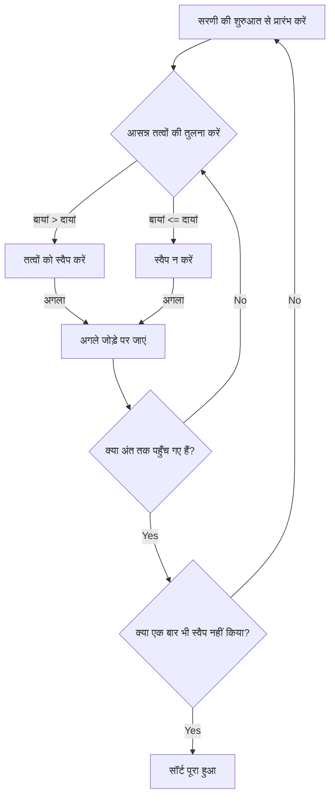
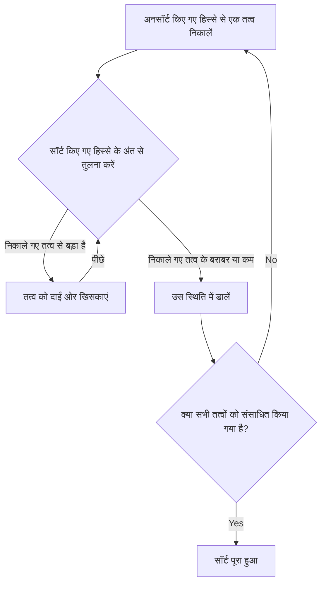
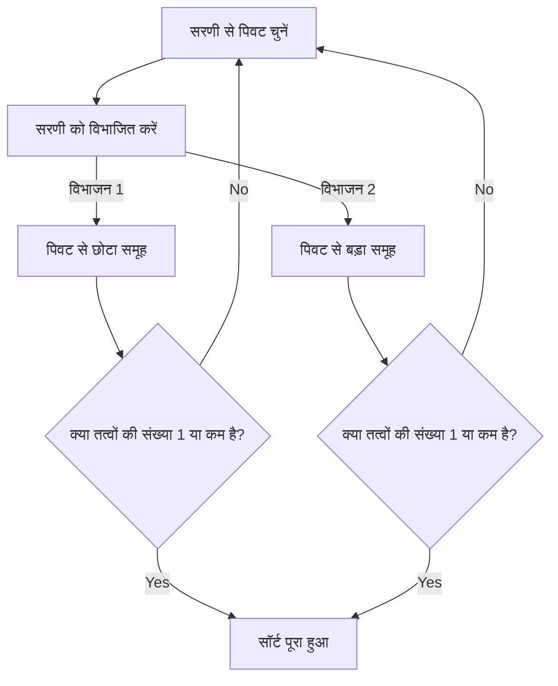
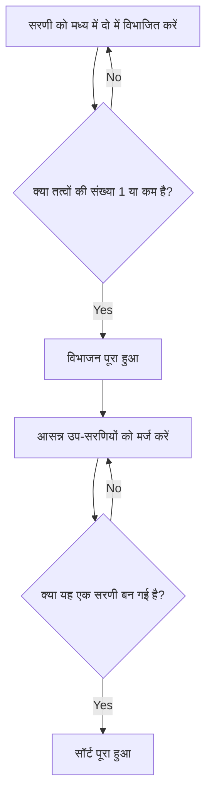

# 1. परिचय: सॉर्टिंग एल्गोरिदम की गहरी दुनिया

कंप्यूटर विज्ञान में, डेटा को एक विशिष्ट क्रम (आरोही या अवरोही) में व्यवस्थित करना "सॉर्टिंग" सबसे बुनियादी और महत्वपूर्ण ऑपरेशनों में से एक है। सॉर्टिंग एल्गोरिदम किसी भी डेटा प्रोसेसिंग, जैसे खोज को तेज करना, डेटा को समूहीकृत करना, और डुप्लिकेट का पता लगाना, के प्रारंभिक चरण के रूप में सक्रिय भूमिका निभाते हैं।

इस लेख में, हम शुरुआती लोगों के लिए समझने में आसान सरल एल्गोरिदम से लेकर अभ्यास में उपयोग किए जाने वाले तेज़ एल्गोरिदम तक, विशिष्ट सॉर्टिंग एल्गोरिदम की व्यापक व्याख्या करेंगे। हम **Mermaid** आरेखों के साथ प्रत्येक एल्गोरिदम के तंत्र को दृष्टिगत रूप से समझेंगे, पायथन कोड के साथ वास्तविक कार्यान्वयन की जांच करेंगे, और समय जटिलता जैसे प्रदर्शन की तुलना करेंगे। इसके अलावा, एल्गोरिदम के व्यवहार को पूरी तरह से समझने के लिए, 50 तत्वों की सरणी का उपयोग करके एक संपूर्ण निष्पादन ट्रेस भी शामिल किया गया है। इससे आप एल्गोरिदम के विस्तृत व्यवहार को स्पष्ट रूप से समझ सकेंगे।

## एल्गोरिदम के मूल्यांकन मेट्रिक्स

प्रत्येक एल्गोरिदम का मूल्यांकन करते समय, निम्नलिखित मेट्रिक्स महत्वपूर्ण होते हैं।

- **समय जटिलता (Time Complexity)** : यह दर्शाता है कि डेटा तत्वों की संख्या $n$ के संबंध में प्रसंस्करण समय कैसे बढ़ता है। $\text{O}(n^2)$ या $\text{O}(n \log n)$ जैसी बिग-ओ नोटेशन (Big-O notation) का उपयोग किया जाता है। सूत्रों के भीतर टेक्स्ट को संभालते समय, इसे $\text{सर्वश्रेष्ठ}$ की तरह लिखा जाता है।
- **स्थान जटिलता (Space Complexity)** : यह दर्शाता है कि निष्पादन के दौरान कितनी अतिरिक्त मेमोरी की आवश्यकता है। इन-प्लेस (In-place) एल्गोरिदम को लगभग किसी अतिरिक्त मेमोरी की आवश्यकता नहीं होती है।
- **स्थिरता (Stability)** : यह दर्शाता है कि समान मान वाले तत्वों का सापेक्ष क्रम सॉर्टिंग से पहले और बाद में संरक्षित रहता है या नहीं। एक स्थिर सॉर्ट में, मूल क्रम बनाए रखा जाता है।

---

## 2. बबल सॉर्ट (Bubble Sort)

यह एक एल्गोरिदम है जो आसन्न तत्वों की तुलना करने और यदि वे उल्टे क्रम में हैं तो उन्हें स्वैप करने के ऑपरेशन को दोहराता है। जैसे बुलबुले पानी की सतह पर उठते हैं, बड़े तत्व धीरे-धीरे सरणी के अंत की ओर बढ़ते हैं।

### जटिलता और विशेषताएँ

- **समय जटिलता (सर्वश्रेष्ठ)**: $\text{O}(n)$
- **समय जटिलता (औसत)**: $\text{O}(n^2)$
- **समय जटिलता (सबसे खराब)**: $\text{O}(n^2)$
- **स्थान जटिलता**: $\text{O}(1)$
- **स्थिरता**: स्थिर

### आरेख (Mermaid)



### पायथन कार्यान्वयन

```python
def bubble_sort(arr):
    n = len(arr)
    for i in range(n):
        swapped = False
        for j in range(0, n-i-1):
            if arr[j] > arr[j+1]:
                arr[j], arr[j+1] = arr[j+1], arr[j]
                swapped = True
        if not swapped:
            break
    return arr
```

### बबल सॉर्ट का विस्तृत ट्रेस

50 तत्वों की एक यादृच्छिक सरणी पर बबल सॉर्ट निष्पादित करते समय, प्रत्येक पास के पूरा होने के बाद सरणी की स्थिति दिखाई जाती है। ध्यान दें कि कैसे बबल सॉर्ट तत्वों को दाईं ओर धकेलता है।

**प्रारंभिक अवस्था**: `[83, 14, 64, 71, 83, 11, 36, 69, 72, 45, 93, 30, 14, 76, 72, 51, 19, 41, 56, 15, 63, 27, 87, 55, 58, 63, 46, 96, 43, 68, 32, 97, 48, 94, 56, 27, 68, 40, 66, 88, 58, 15, 84, 10, 40, 27, 34, 48, 78, 56]`

**पास 1 पूरा होने के बाद**: `[14, 64, 71, 83, 11, 36, 69, 72, 45, 83, 30, 14, 76, 72, 51, 19, 41, 56, 15, 63, 27, 87, 55, 58, 63, 46, 93, 43, 68, 32, 96, 48, 94, 56, 27, 68, 40, 66, 88, 58, 15, 84, 10, 40, 27, 34, 48, 78, 56, 97]`

इस पास में, अनसॉर्ट किए गए हिस्से में सबसे बड़ा तत्व दाईं ओर बुलबुले की तरह उठ गया। बबल सॉर्ट की प्रकृति के कारण, यह गारंटी है कि प्रत्येक पास के लिए कम से कम एक तत्व अपनी अंतिम सही स्थिति में रखा जाएगा। इसलिए, प्रत्येक पास के साथ, खोज सीमा को एक-एक करके संकुचित किया जा सकता है, जिससे अनावश्यक तुलना कार्यों को कम किया जा सकता है। हालाँकि, सबसे खराब स्थिति में जहाँ डेटा पूरी तरह से उल्टे क्रम में व्यवस्थित है, सभी तत्व जोड़े के लिए स्वैप ऑपरेशन होते हैं, इसलिए समय जटिलता $\text{O}(n^2)$ तक पहुँच जाती है और प्रदर्शन अत्यंत कम हो जाता है।

इस पास में, अनसॉर्ट किए गए हिस्से में सबसे बड़ा तत्व दाईं ओर बुलबुले की तरह उठ गया। बबल सॉर्ट की प्रकृति के कारण, यह गारंटी है कि प्रत्येक पास के लिए कम से कम एक तत्व अपनी अंतिम सही स्थिति में रखा जाएगा। इसलिए, प्रत्येक पास के साथ, खोज सीमा को एक-एक करके संकुचित किया जा सकता है, जिससे अनावश्यक तुलना कार्यों को कम किया जा सकता है। हालाँकि, सबसे खराब स्थिति में जहाँ डेटा पूरी तरह से उल्टे क्रम में व्यवस्थित है, सभी तत्व जोड़े के लिए स्वैप ऑपरेशन होते हैं, इसलिए समय जटिलता $\text{O}(n^2)$ तक पहुँच जाती है और प्रदर्शन अत्यंत कम हो जाता है।

**पास 2 पूरा होने के बाद**: `[14, 64, 71, 11, 36, 69, 72, 45, 83, 30, 14, 76, 72, 51, 19, 41, 56, 15, 63, 27, 83, 55, 58, 63, 46, 87, 43, 68, 32, 93, 48, 94, 56, 27, 68, 40, 66, 88, 58, 15, 84, 10, 40, 27, 34, 48, 78, 56, 96, 97]`

इस पास में, अनसॉर्ट किए गए हिस्से में सबसे बड़ा तत्व दाईं ओर बुलबुले की तरह उठ गया। बबल सॉर्ट की प्रकृति के कारण, यह गारंटी है कि प्रत्येक पास के लिए कम से कम एक तत्व अपनी अंतिम सही स्थिति में रखा जाएगा। इसलिए, प्रत्येक पास के साथ, खोज सीमा को एक-एक करके संकुचित किया जा सकता है, जिससे अनावश्यक तुलना कार्यों को कम किया जा सकता है। हालाँकि, सबसे खराब स्थिति में जहाँ डेटा पूरी तरह से उल्टे क्रम में व्यवस्थित है, सभी तत्व जोड़े के लिए स्वैप ऑपरेशन होते हैं, इसलिए समय जटिलता $\text{O}(n^2)$ तक पहुँच जाती है और प्रदर्शन अत्यंत कम हो जाता है।

इस पास में, अनसॉर्ट किए गए हिस्से में सबसे बड़ा तत्व दाईं ओर बुलबुले की तरह उठ गया। बबल सॉर्ट की प्रकृति के कारण, यह गारंटी है कि प्रत्येक पास के लिए कम से कम एक तत्व अपनी अंतिम सही स्थिति में रखा जाएगा। इसलिए, प्रत्येक पास के साथ, खोज सीमा को एक-एक करके संकुचित किया जा सकता है, जिससे अनावश्यक तुलना कार्यों को कम किया जा सकता है। हालाँकि, सबसे खराब स्थिति में जहाँ डेटा पूरी तरह से उल्टे क्रम में व्यवस्थित है, सभी तत्व जोड़े के लिए स्वैप ऑपरेशन होते हैं, इसलिए समय जटिलता $\text{O}(n^2)$ तक पहुँच जाती है और प्रदर्शन अत्यंत कम हो जाता है।

**पास 3 पूरा होने के बाद**: `[14, 64, 11, 36, 69, 71, 45, 72, 30, 14, 76, 72, 51, 19, 41, 56, 15, 63, 27, 83, 55, 58, 63, 46, 83, 43, 68, 32, 87, 48, 93, 56, 27, 68, 40, 66, 88, 58, 15, 84, 10, 40, 27, 34, 48, 78, 56, 94, 96, 97]`

इस पास में, अनसॉर्ट किए गए हिस्से में सबसे बड़ा तत्व दाईं ओर बुलबुले की तरह उठ गया। बबल सॉर्ट की प्रकृति के कारण, यह गारंटी है कि प्रत्येक पास के लिए कम से कम एक तत्व अपनी अंतिम सही स्थिति में रखा जाएगा। इसलिए, प्रत्येक पास के साथ, खोज सीमा को एक-एक करके संकुचित किया जा सकता है, जिससे अनावश्यक तुलना कार्यों को कम किया जा सकता है। हालाँकि, सबसे खराब स्थिति में जहाँ डेटा पूरी तरह से उल्टे क्रम में व्यवस्थित है, सभी तत्व जोड़े के लिए स्वैप ऑपरेशन होते हैं, इसलिए समय जटिलता $\text{O}(n^2)$ तक पहुँच जाती है और प्रदर्शन अत्यंत कम हो जाता है।

इस पास में, अनसॉर्ट किए गए हिस्से में सबसे बड़ा तत्व दाईं ओर बुलबुले की तरह उठ गया। बबल सॉर्ट की प्रकृति के कारण, यह गारंटी है कि प्रत्येक पास के लिए कम से कम एक तत्व अपनी अंतिम सही स्थिति में रखा जाएगा। इसलिए, प्रत्येक पास के साथ, खोज सीमा को एक-एक करके संकुचित किया जा सकता है, जिससे अनावश्यक तुलना कार्यों को कम किया जा सकता है। हालाँकि, सबसे खराब स्थिति में जहाँ डेटा पूरी तरह से उल्टे क्रम में व्यवस्थित है, सभी तत्व जोड़े के लिए स्वैप ऑपरेशन होते हैं, इसलिए समय जटिलता $\text{O}(n^2)$ तक पहुँच जाती है और प्रदर्शन अत्यंत कम हो जाता है।

**पास 4 पूरा होने के बाद**: `[14, 11, 36, 64, 69, 45, 71, 30, 14, 72, 72, 51, 19, 41, 56, 15, 63, 27, 76, 55, 58, 63, 46, 83, 43, 68, 32, 83, 48, 87, 56, 27, 68, 40, 66, 88, 58, 15, 84, 10, 40, 27, 34, 48, 78, 56, 93, 94, 96, 97]`

इस पास में, अनसॉर्ट किए गए हिस्से में सबसे बड़ा तत्व दाईं ओर बुलबुले की तरह उठ गया। बबल सॉर्ट की प्रकृति के कारण, यह गारंटी है कि प्रत्येक पास के लिए कम से कम एक तत्व अपनी अंतिम सही स्थिति में रखा जाएगा। इसलिए, प्रत्येक पास के साथ, खोज सीमा को एक-एक करके संकुचित किया जा सकता है, जिससे अनावश्यक तुलना कार्यों को कम किया जा सकता है। हालाँकि, सबसे खराब स्थिति में जहाँ डेटा पूरी तरह से उल्टे क्रम में व्यवस्थित है, सभी तत्व जोड़े के लिए स्वैप ऑपरेशन होते हैं, इसलिए समय जटिलता $\text{O}(n^2)$ तक पहुँच जाती है और प्रदर्शन अत्यंत कम हो जाता है।

इस पास में, अनसॉर्ट किए गए हिस्से में सबसे बड़ा तत्व दाईं ओर बुलबुले की तरह उठ गया। बबल सॉर्ट की प्रकृति के कारण, यह गारंटी है कि प्रत्येक पास के लिए कम से कम एक तत्व अपनी अंतिम सही स्थिति में रखा जाएगा। इसलिए, प्रत्येक पास के साथ, खोज सीमा को एक-एक करके संकुचित किया जा सकता है, जिससे अनावश्यक तुलना कार्यों को कम किया जा सकता है। हालाँकि, सबसे खराब स्थिति में जहाँ डेटा पूरी तरह से उल्टे क्रम में व्यवस्थित है, सभी तत्व जोड़े के लिए स्वैप ऑपरेशन होते हैं, इसलिए समय जटिलता $\text{O}(n^2)$ तक पहुँच जाती है और प्रदर्शन अत्यंत कम हो जाता है।

**पास 5 पूरा होने के बाद**: `[11, 14, 36, 64, 45, 69, 30, 14, 71, 72, 51, 19, 41, 56, 15, 63, 27, 72, 55, 58, 63, 46, 76, 43, 68, 32, 83, 48, 83, 56, 27, 68, 40, 66, 87, 58, 15, 84, 10, 40, 27, 34, 48, 78, 56, 88, 93, 94, 96, 97]`

इस पास में, अनसॉर्ट किए गए हिस्से में सबसे बड़ा तत्व दाईं ओर बुलबुले की तरह उठ गया। बबल सॉर्ट की प्रकृति के कारण, यह गारंटी है कि प्रत्येक पास के लिए कम से कम एक तत्व अपनी अंतिम सही स्थिति में रखा जाएगा। इसलिए, प्रत्येक पास के साथ, खोज सीमा को एक-एक करके संकुचित किया जा सकता है, जिससे अनावश्यक तुलना कार्यों को कम किया जा सकता है। हालाँकि, सबसे खराब स्थिति में जहाँ डेटा पूरी तरह से उल्टे क्रम में व्यवस्थित है, सभी तत्व जोड़े के लिए स्वैप ऑपरेशन होते हैं, इसलिए समय जटिलता $\text{O}(n^2)$ तक पहुँच जाती है और प्रदर्शन अत्यंत कम हो जाता है।

इस पास में, अनसॉर्ट किए गए हिस्से में सबसे बड़ा तत्व दाईं ओर बुलबुले की तरह उठ गया। बबल सॉर्ट की प्रकृति के कारण, यह गारंटी है कि प्रत्येक पास के लिए कम से कम एक तत्व अपनी अंतिम सही स्थिति में रखा जाएगा। इसलिए, प्रत्येक पास के साथ, खोज सीमा को एक-एक करके संकुचित किया जा सकता है, जिससे अनावश्यक तुलना कार्यों को कम किया जा सकता है। हालाँकि, सबसे खराब स्थिति में जहाँ डेटा पूरी तरह से उल्टे क्रम में व्यवस्थित है, सभी तत्व जोड़े के लिए स्वैप ऑपरेशन होते हैं, इसलिए समय जटिलता $\text{O}(n^2)$ तक पहुँच जाती है और प्रदर्शन अत्यंत कम हो जाता है।

**पास 6 पूरा होने के बाद**: `[11, 14, 36, 45, 64, 30, 14, 69, 71, 51, 19, 41, 56, 15, 63, 27, 72, 55, 58, 63, 46, 72, 43, 68, 32, 76, 48, 83, 56, 27, 68, 40, 66, 83, 58, 15, 84, 10, 40, 27, 34, 48, 78, 56, 87, 88, 93, 94, 96, 97]`

इस पास में, अनसॉर्ट किए गए हिस्से में सबसे बड़ा तत्व दाईं ओर बुलबुले की तरह उठ गया। बबल सॉर्ट की प्रकृति के कारण, यह गारंटी है कि प्रत्येक पास के लिए कम से कम एक तत्व अपनी अंतिम सही स्थिति में रखा जाएगा। इसलिए, प्रत्येक पास के साथ, खोज सीमा को एक-एक करके संकुचित किया जा सकता है, जिससे अनावश्यक तुलना कार्यों को कम किया जा सकता है। हालाँकि, सबसे खराब स्थिति में जहाँ डेटा पूरी तरह से उल्टे क्रम में व्यवस्थित है, सभी तत्व जोड़े के लिए स्वैप ऑपरेशन होते हैं, इसलिए समय जटिलता $\text{O}(n^2)$ तक पहुँच जाती है और प्रदर्शन अत्यंत कम हो जाता है।

इस पास में, अनसॉर्ट किए गए हिस्से में सबसे बड़ा तत्व दाईं ओर बुलबुले की तरह उठ गया। बबल सॉर्ट की प्रकृति के कारण, यह गारंटी है कि प्रत्येक पास के लिए कम से कम एक तत्व अपनी अंतिम सही स्थिति में रखा जाएगा। इसलिए, प्रत्येक पास के साथ, खोज सीमा को एक-एक करके संकुचित किया जा सकता है, जिससे अनावश्यक तुलना कार्यों को कम किया जा सकता है। हालाँकि, सबसे खराब स्थिति में जहाँ डेटा पूरी तरह से उल्टे क्रम में व्यवस्थित है, सभी तत्व जोड़े के लिए स्वैप ऑपरेशन होते हैं, इसलिए समय जटिलता $\text{O}(n^2)$ तक पहुँच जाती है और प्रदर्शन अत्यंत कम हो जाता है।

**पास 7 पूरा होने के बाद**: `[11, 14, 36, 45, 30, 14, 64, 69, 51, 19, 41, 56, 15, 63, 27, 71, 55, 58, 63, 46, 72, 43, 68, 32, 72, 48, 76, 56, 27, 68, 40, 66, 83, 58, 15, 83, 10, 40, 27, 34, 48, 78, 56, 84, 87, 88, 93, 94, 96, 97]`

इस पास में, अनसॉर्ट किए गए हिस्से में सबसे बड़ा तत्व दाईं ओर बुलबुले की तरह उठ गया। बबल सॉर्ट की प्रकृति के कारण, यह गारंटी है कि प्रत्येक पास के लिए कम से कम एक तत्व अपनी अंतिम सही स्थिति में रखा जाएगा। इसलिए, प्रत्येक पास के साथ, खोज सीमा को एक-एक करके संकुचित किया जा सकता है, जिससे अनावश्यक तुलना कार्यों को कम किया जा सकता है। हालाँकि, सबसे खराब स्थिति में जहाँ डेटा पूरी तरह से उल्टे क्रम में व्यवस्थित है, सभी तत्व जोड़े के लिए स्वैप ऑपरेशन होते हैं, इसलिए समय जटिलता $\text{O}(n^2)$ तक पहुँच जाती है और प्रदर्शन अत्यंत कम हो जाता है।

इस पास में, अनसॉर्ट किए गए हिस्से में सबसे बड़ा तत्व दाईं ओर बुलबुले की तरह उठ गया। बबल सॉर्ट की प्रकृति के कारण, यह गारंटी है कि प्रत्येक पास के लिए कम से कम एक तत्व अपनी अंतिम सही स्थिति में रखा जाएगा। इसलिए, प्रत्येक पास के साथ, खोज सीमा को एक-एक करके संकुचित किया जा सकता है, जिससे अनावश्यक तुलना कार्यों को कम किया जा सकता है। हालाँकि, सबसे खराब स्थिति में जहाँ डेटा पूरी तरह से उल्टे क्रम में व्यवस्थित है, सभी तत्व जोड़े के लिए स्वैप ऑपरेशन होते हैं, इसलिए समय जटिलता $\text{O}(n^2)$ तक पहुँच जाती है और प्रदर्शन अत्यंत कम हो जाता है।

**पास 8 पूरा होने के बाद**: `[11, 14, 36, 30, 14, 45, 64, 51, 19, 41, 56, 15, 63, 27, 69, 55, 58, 63, 46, 71, 43, 68, 32, 72, 48, 72, 56, 27, 68, 40, 66, 76, 58, 15, 83, 10, 40, 27, 34, 48, 78, 56, 83, 84, 87, 88, 93, 94, 96, 97]`

इस पास में, अनसॉर्ट किए गए हिस्से में सबसे बड़ा तत्व दाईं ओर बुलबुले की तरह उठ गया। बबल सॉर्ट की प्रकृति के कारण, यह गारंटी है कि प्रत्येक पास के लिए कम से कम एक तत्व अपनी अंतिम सही स्थिति में रखा जाएगा। इसलिए, प्रत्येक पास के साथ, खोज सीमा को एक-एक करके संकुचित किया जा सकता है, जिससे अनावश्यक तुलना कार्यों को कम किया जा सकता है। हालाँकि, सबसे खराब स्थिति में जहाँ डेटा पूरी तरह से उल्टे क्रम में व्यवस्थित है, सभी तत्व जोड़े के लिए स्वैप ऑपरेशन होते हैं, इसलिए समय जटिलता $\text{O}(n^2)$ तक पहुँच जाती है और प्रदर्शन अत्यंत कम हो जाता है।

इस पास में, अनसॉर्ट किए गए हिस्से में सबसे बड़ा तत्व दाईं ओर बुलबुले की तरह उठ गया। बबल सॉर्ट की प्रकृति के कारण, यह गारंटी है कि प्रत्येक पास के लिए कम से कम एक तत्व अपनी अंतिम सही स्थिति में रखा जाएगा। इसलिए, प्रत्येक पास के साथ, खोज सीमा को एक-एक करके संकुचित किया जा सकता है, जिससे अनावश्यक तुलना कार्यों को कम किया जा सकता है। हालाँकि, सबसे खराब स्थिति में जहाँ डेटा पूरी तरह से उल्टे क्रम में व्यवस्थित है, सभी तत्व जोड़े के लिए स्वैप ऑपरेशन होते हैं, इसलिए समय जटिलता $\text{O}(n^2)$ तक पहुँच जाती है और प्रदर्शन अत्यंत कम हो जाता है।

**पास 9 पूरा होने के बाद**: `[11, 14, 30, 14, 36, 45, 51, 19, 41, 56, 15, 63, 27, 64, 55, 58, 63, 46, 69, 43, 68, 32, 71, 48, 72, 56, 27, 68, 40, 66, 72, 58, 15, 76, 10, 40, 27, 34, 48, 78, 56, 83, 83, 84, 87, 88, 93, 94, 96, 97]`

इस पास में, अनसॉर्ट किए गए हिस्से में सबसे बड़ा तत्व दाईं ओर बुलबुले की तरह उठ गया। बबल सॉर्ट की प्रकृति के कारण, यह गारंटी है कि प्रत्येक पास के लिए कम से कम एक तत्व अपनी अंतिम सही स्थिति में रखा जाएगा। इसलिए, प्रत्येक पास के साथ, खोज सीमा को एक-एक करके संकुचित किया जा सकता है, जिससे अनावश्यक तुलना कार्यों को कम किया जा सकता है। हालाँकि, सबसे खराब स्थिति में जहाँ डेटा पूरी तरह से उल्टे क्रम में व्यवस्थित है, सभी तत्व जोड़े के लिए स्वैप ऑपरेशन होते हैं, इसलिए समय जटिलता $\text{O}(n^2)$ तक पहुँच जाती है और प्रदर्शन अत्यंत कम हो जाता है।

इस पास में, अनसॉर्ट किए गए हिस्से में सबसे बड़ा तत्व दाईं ओर बुलबुले की तरह उठ गया। बबल सॉर्ट की प्रकृति के कारण, यह गारंटी है कि प्रत्येक पास के लिए कम से कम एक तत्व अपनी अंतिम सही स्थिति में रखा जाएगा। इसलिए, प्रत्येक पास के साथ, खोज सीमा को एक-एक करके संकुचित किया जा सकता है, जिससे अनावश्यक तुलना कार्यों को कम किया जा सकता है। हालाँकि, सबसे खराब स्थिति में जहाँ डेटा पूरी तरह से उल्टे क्रम में व्यवस्थित है, सभी तत्व जोड़े के लिए स्वैप ऑपरेशन होते हैं, इसलिए समय जटिलता $\text{O}(n^2)$ तक पहुँच जाती है और प्रदर्शन अत्यंत कम हो जाता है।

**पास 10 पूरा होने के बाद**: `[11, 14, 14, 30, 36, 45, 19, 41, 51, 15, 56, 27, 63, 55, 58, 63, 46, 64, 43, 68, 32, 69, 48, 71, 56, 27, 68, 40, 66, 72, 58, 15, 72, 10, 40, 27, 34, 48, 76, 56, 78, 83, 83, 84, 87, 88, 93, 94, 96, 97]`

इस पास में, अनसॉर्ट किए गए हिस्से में सबसे बड़ा तत्व दाईं ओर बुलबुले की तरह उठ गया। बबल सॉर्ट की प्रकृति के कारण, यह गारंटी है कि प्रत्येक पास के लिए कम से कम एक तत्व अपनी अंतिम सही स्थिति में रखा जाएगा। इसलिए, प्रत्येक पास के साथ, खोज सीमा को एक-एक करके संकुचित किया जा सकता है, जिससे अनावश्यक तुलना कार्यों को कम किया जा सकता है। हालाँकि, सबसे खराब स्थिति में जहाँ डेटा पूरी तरह से उल्टे क्रम में व्यवस्थित है, सभी तत्व जोड़े के लिए स्वैप ऑपरेशन होते हैं, इसलिए समय जटिलता $\text{O}(n^2)$ तक पहुँच जाती है और प्रदर्शन अत्यंत कम हो जाता है।

इस पास में, अनसॉर्ट किए गए हिस्से में सबसे बड़ा तत्व दाईं ओर बुलबुले की तरह उठ गया। बबल सॉर्ट की प्रकृति के कारण, यह गारंटी है कि प्रत्येक पास के लिए कम से कम एक तत्व अपनी अंतिम सही स्थिति में रखा जाएगा। इसलिए, प्रत्येक पास के साथ, खोज सीमा को एक-एक करके संकुचित किया जा सकता है, जिससे अनावश्यक तुलना कार्यों को कम किया जा सकता है। हालाँकि, सबसे खराब स्थिति में जहाँ डेटा पूरी तरह से उल्टे क्रम में व्यवस्थित है, सभी तत्व जोड़े के लिए स्वैप ऑपरेशन होते हैं, इसलिए समय जटिलता $\text{O}(n^2)$ तक पहुँच जाती है और प्रदर्शन अत्यंत कम हो जाता है।

**पास 11 पूरा होने के बाद**: `[11, 14, 14, 30, 36, 19, 41, 45, 15, 51, 27, 56, 55, 58, 63, 46, 63, 43, 64, 32, 68, 48, 69, 56, 27, 68, 40, 66, 71, 58, 15, 72, 10, 40, 27, 34, 48, 72, 56, 76, 78, 83, 83, 84, 87, 88, 93, 94, 96, 97]`

इस पास में, अनसॉर्ट किए गए हिस्से में सबसे बड़ा तत्व दाईं ओर बुलबुले की तरह उठ गया। बबल सॉर्ट की प्रकृति के कारण, यह गारंटी है कि प्रत्येक पास के लिए कम से कम एक तत्व अपनी अंतिम सही स्थिति में रखा जाएगा। इसलिए, प्रत्येक पास के साथ, खोज सीमा को एक-एक करके संकुचित किया जा सकता है, जिससे अनावश्यक तुलना कार्यों को कम किया जा सकता है। हालाँकि, सबसे खराब स्थिति में जहाँ डेटा पूरी तरह से उल्टे क्रम में व्यवस्थित है, सभी तत्व जोड़े के लिए स्वैप ऑपरेशन होते हैं, इसलिए समय जटिलता $\text{O}(n^2)$ तक पहुँच जाती है और प्रदर्शन अत्यंत कम हो जाता है।

इस पास में, अनसॉर्ट किए गए हिस्से में सबसे बड़ा तत्व दाईं ओर बुलबुले की तरह उठ गया। बबल सॉर्ट की प्रकृति के कारण, यह गारंटी है कि प्रत्येक पास के लिए कम से कम एक तत्व अपनी अंतिम सही स्थिति में रखा जाएगा। इसलिए, प्रत्येक पास के साथ, खोज सीमा को एक-एक करके संकुचित किया जा सकता है, जिससे अनावश्यक तुलना कार्यों को कम किया जा सकता है। हालाँकि, सबसे खराब स्थिति में जहाँ डेटा पूरी तरह से उल्टे क्रम में व्यवस्थित है, सभी तत्व जोड़े के लिए स्वैप ऑपरेशन होते हैं, इसलिए समय जटिलता $\text{O}(n^2)$ तक पहुँच जाती है और प्रदर्शन अत्यंत कम हो जाता है।

**पास 12 पूरा होने के बाद**: `[11, 14, 14, 30, 19, 36, 41, 15, 45, 27, 51, 55, 56, 58, 46, 63, 43, 63, 32, 64, 48, 68, 56, 27, 68, 40, 66, 69, 58, 15, 71, 10, 40, 27, 34, 48, 72, 56, 72, 76, 78, 83, 83, 84, 87, 88, 93, 94, 96, 97]`

इस पास में, अनसॉर्ट किए गए हिस्से में सबसे बड़ा तत्व दाईं ओर बुलबुले की तरह उठ गया। बबल सॉर्ट की प्रकृति के कारण, यह गारंटी है कि प्रत्येक पास के लिए कम से कम एक तत्व अपनी अंतिम सही स्थिति में रखा जाएगा। इसलिए, प्रत्येक पास के साथ, खोज सीमा को एक-एक करके संकुचित किया जा सकता है, जिससे अनावश्यक तुलना कार्यों को कम किया जा सकता है। हालाँकि, सबसे खराब स्थिति में जहाँ डेटा पूरी तरह से उल्टे क्रम में व्यवस्थित है, सभी तत्व जोड़े के लिए स्वैप ऑपरेशन होते हैं, इसलिए समय जटिलता $\text{O}(n^2)$ तक पहुँच जाती है और प्रदर्शन अत्यंत कम हो जाता है।

इस पास में, अनसॉर्ट किए गए हिस्से में सबसे बड़ा तत्व दाईं ओर बुलबुले की तरह उठ गया। बबल सॉर्ट की प्रकृति के कारण, यह गारंटी है कि प्रत्येक पास के लिए कम से कम एक तत्व अपनी अंतिम सही स्थिति में रखा जाएगा। इसलिए, प्रत्येक पास के साथ, खोज सीमा को एक-एक करके संकुचित किया जा सकता है, जिससे अनावश्यक तुलना कार्यों को कम किया जा सकता है। हालाँकि, सबसे खराब स्थिति में जहाँ डेटा पूरी तरह से उल्टे क्रम में व्यवस्थित है, सभी तत्व जोड़े के लिए स्वैप ऑपरेशन होते हैं, इसलिए समय जटिलता $\text{O}(n^2)$ तक पहुँच जाती है और प्रदर्शन अत्यंत कम हो जाता है।

**पास 13 पूरा होने के बाद**: `[11, 14, 14, 19, 30, 36, 15, 41, 27, 45, 51, 55, 56, 46, 58, 43, 63, 32, 63, 48, 64, 56, 27, 68, 40, 66, 68, 58, 15, 69, 10, 40, 27, 34, 48, 71, 56, 72, 72, 76, 78, 83, 83, 84, 87, 88, 93, 94, 96, 97]`

इस पास में, अनसॉर्ट किए गए हिस्से में सबसे बड़ा तत्व दाईं ओर बुलबुले की तरह उठ गया। बबल सॉर्ट की प्रकृति के कारण, यह गारंटी है कि प्रत्येक पास के लिए कम से कम एक तत्व अपनी अंतिम सही स्थिति में रखा जाएगा। इसलिए, प्रत्येक पास के साथ, खोज सीमा को एक-एक करके संकुचित किया जा सकता है, जिससे अनावश्यक तुलना कार्यों को कम किया जा सकता है। हालाँकि, सबसे खराब स्थिति में जहाँ डेटा पूरी तरह से उल्टे क्रम में व्यवस्थित है, सभी तत्व जोड़े के लिए स्वैप ऑपरेशन होते हैं, इसलिए समय जटिलता $\text{O}(n^2)$ तक पहुँच जाती है और प्रदर्शन अत्यंत कम हो जाता है।

इस पास में, अनसॉर्ट किए गए हिस्से में सबसे बड़ा तत्व दाईं ओर बुलबुले की तरह उठ गया। बबल सॉर्ट की प्रकृति के कारण, यह गारंटी है कि प्रत्येक पास के लिए कम से कम एक तत्व अपनी अंतिम सही स्थिति में रखा जाएगा। इसलिए, प्रत्येक पास के साथ, खोज सीमा को एक-एक करके संकुचित किया जा सकता है, जिससे अनावश्यक तुलना कार्यों को कम किया जा सकता है। हालाँकि, सबसे खराब स्थिति में जहाँ डेटा पूरी तरह से उल्टे क्रम में व्यवस्थित है, सभी तत्व जोड़े के लिए स्वैप ऑपरेशन होते हैं, इसलिए समय जटिलता $\text{O}(n^2)$ तक पहुँच जाती है और प्रदर्शन अत्यंत कम हो जाता है।

**पास 14 पूरा होने के बाद**: `[11, 14, 14, 19, 30, 15, 36, 27, 41, 45, 51, 55, 46, 56, 43, 58, 32, 63, 48, 63, 56, 27, 64, 40, 66, 68, 58, 15, 68, 10, 40, 27, 34, 48, 69, 56, 71, 72, 72, 76, 78, 83, 83, 84, 87, 88, 93, 94, 96, 97]`

इस पास में, अनसॉर्ट किए गए हिस्से में सबसे बड़ा तत्व दाईं ओर बुलबुले की तरह उठ गया। बबल सॉर्ट की प्रकृति के कारण, यह गारंटी है कि प्रत्येक पास के लिए कम से कम एक तत्व अपनी अंतिम सही स्थिति में रखा जाएगा। इसलिए, प्रत्येक पास के साथ, खोज सीमा को एक-एक करके संकुचित किया जा सकता है, जिससे अनावश्यक तुलना कार्यों को कम किया जा सकता है। हालाँकि, सबसे खराब स्थिति में जहाँ डेटा पूरी तरह से उल्टे क्रम में व्यवस्थित है, सभी तत्व जोड़े के लिए स्वैप ऑपरेशन होते हैं, इसलिए समय जटिलता $\text{O}(n^2)$ तक पहुँच जाती है और प्रदर्शन अत्यंत कम हो जाता है।

इस पास में, अनसॉर्ट किए गए हिस्से में सबसे बड़ा तत्व दाईं ओर बुलबुले की तरह उठ गया। बबल सॉर्ट की प्रकृति के कारण, यह गारंटी है कि प्रत्येक पास के लिए कम से कम एक तत्व अपनी अंतिम सही स्थिति में रखा जाएगा। इसलिए, प्रत्येक पास के साथ, खोज सीमा को एक-एक करके संकुचित किया जा सकता है, जिससे अनावश्यक तुलना कार्यों को कम किया जा सकता है। हालाँकि, सबसे खराब स्थिति में जहाँ डेटा पूरी तरह से उल्टे क्रम में व्यवस्थित है, सभी तत्व जोड़े के लिए स्वैप ऑपरेशन होते हैं, इसलिए समय जटिलता $\text{O}(n^2)$ तक पहुँच जाती है और प्रदर्शन अत्यंत कम हो जाता है।

**पास 15 पूरा होने के बाद**: `[11, 14, 14, 19, 15, 30, 27, 36, 41, 45, 51, 46, 55, 43, 56, 32, 58, 48, 63, 56, 27, 63, 40, 64, 66, 58, 15, 68, 10, 40, 27, 34, 48, 68, 56, 69, 71, 72, 72, 76, 78, 83, 83, 84, 87, 88, 93, 94, 96, 97]`

इस पास में, अनसॉर्ट किए गए हिस्से में सबसे बड़ा तत्व दाईं ओर बुलबुले की तरह उठ गया। बबल सॉर्ट की प्रकृति के कारण, यह गारंटी है कि प्रत्येक पास के लिए कम से कम एक तत्व अपनी अंतिम सही स्थिति में रखा जाएगा। इसलिए, प्रत्येक पास के साथ, खोज सीमा को एक-एक करके संकुचित किया जा सकता है, जिससे अनावश्यक तुलना कार्यों को कम किया जा सकता है। हालाँकि, सबसे खराब स्थिति में जहाँ डेटा पूरी तरह से उल्टे क्रम में व्यवस्थित है, सभी तत्व जोड़े के लिए स्वैप ऑपरेशन होते हैं, इसलिए समय जटिलता $\text{O}(n^2)$ तक पहुँच जाती है और प्रदर्शन अत्यंत कम हो जाता है।

इस पास में, अनसॉर्ट किए गए हिस्से में सबसे बड़ा तत्व दाईं ओर बुलबुले की तरह उठ गया। बबल सॉर्ट की प्रकृति के कारण, यह गारंटी है कि प्रत्येक पास के लिए कम से कम एक तत्व अपनी अंतिम सही स्थिति में रखा जाएगा। इसलिए, प्रत्येक पास के साथ, खोज सीमा को एक-एक करके संकुचित किया जा सकता है, जिससे अनावश्यक तुलना कार्यों को कम किया जा सकता है। हालाँकि, सबसे खराब स्थिति में जहाँ डेटा पूरी तरह से उल्टे क्रम में व्यवस्थित है, सभी तत्व जोड़े के लिए स्वैप ऑपरेशन होते हैं, इसलिए समय जटिलता $\text{O}(n^2)$ तक पहुँच जाती है और प्रदर्शन अत्यंत कम हो जाता है।

**पास 16 पूरा होने के बाद**: `[11, 14, 14, 15, 19, 27, 30, 36, 41, 45, 46, 51, 43, 55, 32, 56, 48, 58, 56, 27, 63, 40, 63, 64, 58, 15, 66, 10, 40, 27, 34, 48, 68, 56, 68, 69, 71, 72, 72, 76, 78, 83, 83, 84, 87, 88, 93, 94, 96, 97]`

इस पास में, अनसॉर्ट किए गए हिस्से में सबसे बड़ा तत्व दाईं ओर बुलबुले की तरह उठ गया। बबल सॉर्ट की प्रकृति के कारण, यह गारंटी है कि प्रत्येक पास के लिए कम से कम एक तत्व अपनी अंतिम सही स्थिति में रखा जाएगा। इसलिए, प्रत्येक पास के साथ, खोज सीमा को एक-एक करके संकुचित किया जा सकता है, जिससे अनावश्यक तुलना कार्यों को कम किया जा सकता है। हालाँकि, सबसे खराब स्थिति में जहाँ डेटा पूरी तरह से उल्टे क्रम में व्यवस्थित है, सभी तत्व जोड़े के लिए स्वैप ऑपरेशन होते हैं, इसलिए समय जटिलता $\text{O}(n^2)$ तक पहुँच जाती है और प्रदर्शन अत्यंत कम हो जाता है।

इस पास में, अनसॉर्ट किए गए हिस्से में सबसे बड़ा तत्व दाईं ओर बुलबुले की तरह उठ गया। बबल सॉर्ट की प्रकृति के कारण, यह गारंटी है कि प्रत्येक पास के लिए कम से कम एक तत्व अपनी अंतिम सही स्थिति में रखा जाएगा। इसलिए, प्रत्येक पास के साथ, खोज सीमा को एक-एक करके संकुचित किया जा सकता है, जिससे अनावश्यक तुलना कार्यों को कम किया जा सकता है। हालाँकि, सबसे खराब स्थिति में जहाँ डेटा पूरी तरह से उल्टे क्रम में व्यवस्थित है, सभी तत्व जोड़े के लिए स्वैप ऑपरेशन होते हैं, इसलिए समय जटिलता $\text{O}(n^2)$ तक पहुँच जाती है और प्रदर्शन अत्यंत कम हो जाता है।

**पास 17 पूरा होने के बाद**: `[11, 14, 14, 15, 19, 27, 30, 36, 41, 45, 46, 43, 51, 32, 55, 48, 56, 56, 27, 58, 40, 63, 63, 58, 15, 64, 10, 40, 27, 34, 48, 66, 56, 68, 68, 69, 71, 72, 72, 76, 78, 83, 83, 84, 87, 88, 93, 94, 96, 97]`

इस पास में, अनसॉर्ट किए गए हिस्से में सबसे बड़ा तत्व दाईं ओर बुलबुले की तरह उठ गया। बबल सॉर्ट की प्रकृति के कारण, यह गारंटी है कि प्रत्येक पास के लिए कम से कम एक तत्व अपनी अंतिम सही स्थिति में रखा जाएगा। इसलिए, प्रत्येक पास के साथ, खोज सीमा को एक-एक करके संकुचित किया जा सकता है, जिससे अनावश्यक तुलना कार्यों को कम किया जा सकता है। हालाँकि, सबसे खराब स्थिति में जहाँ डेटा पूरी तरह से उल्टे क्रम में व्यवस्थित है, सभी तत्व जोड़े के लिए स्वैप ऑपरेशन होते हैं, इसलिए समय जटिलता $\text{O}(n^2)$ तक पहुँच जाती है और प्रदर्शन अत्यंत कम हो जाता है।

इस पास में, अनसॉर्ट किए गए हिस्से में सबसे बड़ा तत्व दाईं ओर बुलबुले की तरह उठ गया। बबल सॉर्ट की प्रकृति के कारण, यह गारंटी है कि प्रत्येक पास के लिए कम से कम एक तत्व अपनी अंतिम सही स्थिति में रखा जाएगा। इसलिए, प्रत्येक पास के साथ, खोज सीमा को एक-एक करके संकुचित किया जा सकता है, जिससे अनावश्यक तुलना कार्यों को कम किया जा सकता है। हालाँकि, सबसे खराब स्थिति में जहाँ डेटा पूरी तरह से उल्टे क्रम में व्यवस्थित है, सभी तत्व जोड़े के लिए स्वैप ऑपरेशन होते हैं, इसलिए समय जटिलता $\text{O}(n^2)$ तक पहुँच जाती है और प्रदर्शन अत्यंत कम हो जाता है।

**पास 18 पूरा होने के बाद**: `[11, 14, 14, 15, 19, 27, 30, 36, 41, 45, 43, 46, 32, 51, 48, 55, 56, 27, 56, 40, 58, 63, 58, 15, 63, 10, 40, 27, 34, 48, 64, 56, 66, 68, 68, 69, 71, 72, 72, 76, 78, 83, 83, 84, 87, 88, 93, 94, 96, 97]`

इस पास में, अनसॉर्ट किए गए हिस्से में सबसे बड़ा तत्व दाईं ओर बुलबुले की तरह उठ गया। बबल सॉर्ट की प्रकृति के कारण, यह गारंटी है कि प्रत्येक पास के लिए कम से कम एक तत्व अपनी अंतिम सही स्थिति में रखा जाएगा। इसलिए, प्रत्येक पास के साथ, खोज सीमा को एक-एक करके संकुचित किया जा सकता है, जिससे अनावश्यक तुलना कार्यों को कम किया जा सकता है। हालाँकि, सबसे खराब स्थिति में जहाँ डेटा पूरी तरह से उल्टे क्रम में व्यवस्थित है, सभी तत्व जोड़े के लिए स्वैप ऑपरेशन होते हैं, इसलिए समय जटिलता $\text{O}(n^2)$ तक पहुँच जाती है और प्रदर्शन अत्यंत कम हो जाता है।

इस पास में, अनसॉर्ट किए गए हिस्से में सबसे बड़ा तत्व दाईं ओर बुलबुले की तरह उठ गया। बबल सॉर्ट की प्रकृति के कारण, यह गारंटी है कि प्रत्येक पास के लिए कम से कम एक तत्व अपनी अंतिम सही स्थिति में रखा जाएगा। इसलिए, प्रत्येक पास के साथ, खोज सीमा को एक-एक करके संकुचित किया जा सकता है, जिससे अनावश्यक तुलना कार्यों को कम किया जा सकता है। हालाँकि, सबसे खराब स्थिति में जहाँ डेटा पूरी तरह से उल्टे क्रम में व्यवस्थित है, सभी तत्व जोड़े के लिए स्वैप ऑपरेशन होते हैं, इसलिए समय जटिलता $\text{O}(n^2)$ तक पहुँच जाती है और प्रदर्शन अत्यंत कम हो जाता है।

**पास 19 पूरा होने के बाद**: `[11, 14, 14, 15, 19, 27, 30, 36, 41, 43, 45, 32, 46, 48, 51, 55, 27, 56, 40, 56, 58, 58, 15, 63, 10, 40, 27, 34, 48, 63, 56, 64, 66, 68, 68, 69, 71, 72, 72, 76, 78, 83, 83, 84, 87, 88, 93, 94, 96, 97]`

इस पास में, अनसॉर्ट किए गए हिस्से में सबसे बड़ा तत्व दाईं ओर बुलबुले की तरह उठ गया। बबल सॉर्ट की प्रकृति के कारण, यह गारंटी है कि प्रत्येक पास के लिए कम से कम एक तत्व अपनी अंतिम सही स्थिति में रखा जाएगा। इसलिए, प्रत्येक पास के साथ, खोज सीमा को एक-एक करके संकुचित किया जा सकता है, जिससे अनावश्यक तुलना कार्यों को कम किया जा सकता है। हालाँकि, सबसे खराब स्थिति में जहाँ डेटा पूरी तरह से उल्टे क्रम में व्यवस्थित है, सभी तत्व जोड़े के लिए स्वैप ऑपरेशन होते हैं, इसलिए समय जटिलता $\text{O}(n^2)$ तक पहुँच जाती है और प्रदर्शन अत्यंत कम हो जाता है।

इस पास में, अनसॉर्ट किए गए हिस्से में सबसे बड़ा तत्व दाईं ओर बुलबुले की तरह उठ गया। बबल सॉर्ट की प्रकृति के कारण, यह गारंटी है कि प्रत्येक पास के लिए कम से कम एक तत्व अपनी अंतिम सही स्थिति में रखा जाएगा। इसलिए, प्रत्येक पास के साथ, खोज सीमा को एक-एक करके संकुचित किया जा सकता है, जिससे अनावश्यक तुलना कार्यों को कम किया जा सकता है। हालाँकि, सबसे खराब स्थिति में जहाँ डेटा पूरी तरह से उल्टे क्रम में व्यवस्थित है, सभी तत्व जोड़े के लिए स्वैप ऑपरेशन होते हैं, इसलिए समय जटिलता $\text{O}(n^2)$ तक पहुँच जाती है और प्रदर्शन अत्यंत कम हो जाता है।

**पास 20 पूरा होने के बाद**: `[11, 14, 14, 15, 19, 27, 30, 36, 41, 43, 32, 45, 46, 48, 51, 27, 55, 40, 56, 56, 58, 15, 58, 10, 40, 27, 34, 48, 63, 56, 63, 64, 66, 68, 68, 69, 71, 72, 72, 76, 78, 83, 83, 84, 87, 88, 93, 94, 96, 97]`

इस पास में, अनसॉर्ट किए गए हिस्से में सबसे बड़ा तत्व दाईं ओर बुलबुले की तरह उठ गया। बबल सॉर्ट की प्रकृति के कारण, यह गारंटी है कि प्रत्येक पास के लिए कम से कम एक तत्व अपनी अंतिम सही स्थिति में रखा जाएगा। इसलिए, प्रत्येक पास के साथ, खोज सीमा को एक-एक करके संकुचित किया जा सकता है, जिससे अनावश्यक तुलना कार्यों को कम किया जा सकता है। हालाँकि, सबसे खराब स्थिति में जहाँ डेटा पूरी तरह से उल्टे क्रम में व्यवस्थित है, सभी तत्व जोड़े के लिए स्वैप ऑपरेशन होते हैं, इसलिए समय जटिलता $\text{O}(n^2)$ तक पहुँच जाती है और प्रदर्शन अत्यंत कम हो जाता है।

इस पास में, अनसॉर्ट किए गए हिस्से में सबसे बड़ा तत्व दाईं ओर बुलबुले की तरह उठ गया। बबल सॉर्ट की प्रकृति के कारण, यह गारंटी है कि प्रत्येक पास के लिए कम से कम एक तत्व अपनी अंतिम सही स्थिति में रखा जाएगा। इसलिए, प्रत्येक पास के साथ, खोज सीमा को एक-एक करके संकुचित किया जा सकता है, जिससे अनावश्यक तुलना कार्यों को कम किया जा सकता है। हालाँकि, सबसे खराब स्थिति में जहाँ डेटा पूरी तरह से उल्टे क्रम में व्यवस्थित है, सभी तत्व जोड़े के लिए स्वैप ऑपरेशन होते हैं, इसलिए समय जटिलता $\text{O}(n^2)$ तक पहुँच जाती है और प्रदर्शन अत्यंत कम हो जाता है।

**पास 21 पूरा होने के बाद**: `[11, 14, 14, 15, 19, 27, 30, 36, 41, 32, 43, 45, 46, 48, 27, 51, 40, 55, 56, 56, 15, 58, 10, 40, 27, 34, 48, 58, 56, 63, 63, 64, 66, 68, 68, 69, 71, 72, 72, 76, 78, 83, 83, 84, 87, 88, 93, 94, 96, 97]`

इस पास में, अनसॉर्ट किए गए हिस्से में सबसे बड़ा तत्व दाईं ओर बुलबुले की तरह उठ गया। बबल सॉर्ट की प्रकृति के कारण, यह गारंटी है कि प्रत्येक पास के लिए कम से कम एक तत्व अपनी अंतिम सही स्थिति में रखा जाएगा। इसलिए, प्रत्येक पास के साथ, खोज सीमा को एक-एक करके संकुचित किया जा सकता है, जिससे अनावश्यक तुलना कार्यों को कम किया जा सकता है। हालाँकि, सबसे खराब स्थिति में जहाँ डेटा पूरी तरह से उल्टे क्रम में व्यवस्थित है, सभी तत्व जोड़े के लिए स्वैप ऑपरेशन होते हैं, इसलिए समय जटिलता $\text{O}(n^2)$ तक पहुँच जाती है और प्रदर्शन अत्यंत कम हो जाता है।

इस पास में, अनसॉर्ट किए गए हिस्से में सबसे बड़ा तत्व दाईं ओर बुलबुले की तरह उठ गया। बबल सॉर्ट की प्रकृति के कारण, यह गारंटी है कि प्रत्येक पास के लिए कम से कम एक तत्व अपनी अंतिम सही स्थिति में रखा जाएगा। इसलिए, प्रत्येक पास के साथ, खोज सीमा को एक-एक करके संकुचित किया जा सकता है, जिससे अनावश्यक तुलना कार्यों को कम किया जा सकता है। हालाँकि, सबसे खराब स्थिति में जहाँ डेटा पूरी तरह से उल्टे क्रम में व्यवस्थित है, सभी तत्व जोड़े के लिए स्वैप ऑपरेशन होते हैं, इसलिए समय जटिलता $\text{O}(n^2)$ तक पहुँच जाती है और प्रदर्शन अत्यंत कम हो जाता है।

**पास 22 पूरा होने के बाद**: `[11, 14, 14, 15, 19, 27, 30, 36, 32, 41, 43, 45, 46, 27, 48, 40, 51, 55, 56, 15, 56, 10, 40, 27, 34, 48, 58, 56, 58, 63, 63, 64, 66, 68, 68, 69, 71, 72, 72, 76, 78, 83, 83, 84, 87, 88, 93, 94, 96, 97]`

इस पास में, अनसॉर्ट किए गए हिस्से में सबसे बड़ा तत्व दाईं ओर बुलबुले की तरह उठ गया। बबल सॉर्ट की प्रकृति के कारण, यह गारंटी है कि प्रत्येक पास के लिए कम से कम एक तत्व अपनी अंतिम सही स्थिति में रखा जाएगा। इसलिए, प्रत्येक पास के साथ, खोज सीमा को एक-एक करके संकुचित किया जा सकता है, जिससे अनावश्यक तुलना कार्यों को कम किया जा सकता है। हालाँकि, सबसे खराब स्थिति में जहाँ डेटा पूरी तरह से उल्टे क्रम में व्यवस्थित है, सभी तत्व जोड़े के लिए स्वैप ऑपरेशन होते हैं, इसलिए समय जटिलता $\text{O}(n^2)$ तक पहुँच जाती है और प्रदर्शन अत्यंत कम हो जाता है।

इस पास में, अनसॉर्ट किए गए हिस्से में सबसे बड़ा तत्व दाईं ओर बुलबुले की तरह उठ गया। बबल सॉर्ट की प्रकृति के कारण, यह गारंटी है कि प्रत्येक पास के लिए कम से कम एक तत्व अपनी अंतिम सही स्थिति में रखा जाएगा। इसलिए, प्रत्येक पास के साथ, खोज सीमा को एक-एक करके संकुचित किया जा सकता है, जिससे अनावश्यक तुलना कार्यों को कम किया जा सकता है। हालाँकि, सबसे खराब स्थिति में जहाँ डेटा पूरी तरह से उल्टे क्रम में व्यवस्थित है, सभी तत्व जोड़े के लिए स्वैप ऑपरेशन होते हैं, इसलिए समय जटिलता $\text{O}(n^2)$ तक पहुँच जाती है और प्रदर्शन अत्यंत कम हो जाता है।

**पास 23 पूरा होने के बाद**: `[11, 14, 14, 15, 19, 27, 30, 32, 36, 41, 43, 45, 27, 46, 40, 48, 51, 55, 15, 56, 10, 40, 27, 34, 48, 56, 56, 58, 58, 63, 63, 64, 66, 68, 68, 69, 71, 72, 72, 76, 78, 83, 83, 84, 87, 88, 93, 94, 96, 97]`

इस पास में, अनसॉर्ट किए गए हिस्से में सबसे बड़ा तत्व दाईं ओर बुलबुले की तरह उठ गया। बबल सॉर्ट की प्रकृति के कारण, यह गारंटी है कि प्रत्येक पास के लिए कम से कम एक तत्व अपनी अंतिम सही स्थिति में रखा जाएगा। इसलिए, प्रत्येक पास के साथ, खोज सीमा को एक-एक करके संकुचित किया जा सकता है, जिससे अनावश्यक तुलना कार्यों को कम किया जा सकता है। हालाँकि, सबसे खराब स्थिति में जहाँ डेटा पूरी तरह से उल्टे क्रम में व्यवस्थित है, सभी तत्व जोड़े के लिए स्वैप ऑपरेशन होते हैं, इसलिए समय जटिलता $\text{O}(n^2)$ तक पहुँच जाती है और प्रदर्शन अत्यंत कम हो जाता है।

इस पास में, अनसॉर्ट किए गए हिस्से में सबसे बड़ा तत्व दाईं ओर बुलबुले की तरह उठ गया। बबल सॉर्ट की प्रकृति के कारण, यह गारंटी है कि प्रत्येक पास के लिए कम से कम एक तत्व अपनी अंतिम सही स्थिति में रखा जाएगा। इसलिए, प्रत्येक पास के साथ, खोज सीमा को एक-एक करके संकुचित किया जा सकता है, जिससे अनावश्यक तुलना कार्यों को कम किया जा सकता है। हालाँकि, सबसे खराब स्थिति में जहाँ डेटा पूरी तरह से उल्टे क्रम में व्यवस्थित है, सभी तत्व जोड़े के लिए स्वैप ऑपरेशन होते हैं, इसलिए समय जटिलता $\text{O}(n^2)$ तक पहुँच जाती है और प्रदर्शन अत्यंत कम हो जाता है।

**पास 24 पूरा होने के बाद**: `[11, 14, 14, 15, 19, 27, 30, 32, 36, 41, 43, 27, 45, 40, 46, 48, 51, 15, 55, 10, 40, 27, 34, 48, 56, 56, 56, 58, 58, 63, 63, 64, 66, 68, 68, 69, 71, 72, 72, 76, 78, 83, 83, 84, 87, 88, 93, 94, 96, 97]`

इस पास में, अनसॉर्ट किए गए हिस्से में सबसे बड़ा तत्व दाईं ओर बुलबुले की तरह उठ गया। बबल सॉर्ट की प्रकृति के कारण, यह गारंटी है कि प्रत्येक पास के लिए कम से कम एक तत्व अपनी अंतिम सही स्थिति में रखा जाएगा। इसलिए, प्रत्येक पास के साथ, खोज सीमा को एक-एक करके संकुचित किया जा सकता है, जिससे अनावश्यक तुलना कार्यों को कम किया जा सकता है। हालाँकि, सबसे खराब स्थिति में जहाँ डेटा पूरी तरह से उल्टे क्रम में व्यवस्थित है, सभी तत्व जोड़े के लिए स्वैप ऑपरेशन होते हैं, इसलिए समय जटिलता $\text{O}(n^2)$ तक पहुँच जाती है और प्रदर्शन अत्यंत कम हो जाता है।

इस पास में, अनसॉर्ट किए गए हिस्से में सबसे बड़ा तत्व दाईं ओर बुलबुले की तरह उठ गया। बबल सॉर्ट की प्रकृति के कारण, यह गारंटी है कि प्रत्येक पास के लिए कम से कम एक तत्व अपनी अंतिम सही स्थिति में रखा जाएगा। इसलिए, प्रत्येक पास के साथ, खोज सीमा को एक-एक करके संकुचित किया जा सकता है, जिससे अनावश्यक तुलना कार्यों को कम किया जा सकता है। हालाँकि, सबसे खराब स्थिति में जहाँ डेटा पूरी तरह से उल्टे क्रम में व्यवस्थित है, सभी तत्व जोड़े के लिए स्वैप ऑपरेशन होते हैं, इसलिए समय जटिलता $\text{O}(n^2)$ तक पहुँच जाती है और प्रदर्शन अत्यंत कम हो जाता है।

**पास 25 पूरा होने के बाद**: `[11, 14, 14, 15, 19, 27, 30, 32, 36, 41, 27, 43, 40, 45, 46, 48, 15, 51, 10, 40, 27, 34, 48, 55, 56, 56, 56, 58, 58, 63, 63, 64, 66, 68, 68, 69, 71, 72, 72, 76, 78, 83, 83, 84, 87, 88, 93, 94, 96, 97]`

इस पास में, अनसॉर्ट किए गए हिस्से में सबसे बड़ा तत्व दाईं ओर बुलबुले की तरह उठ गया। बबल सॉर्ट की प्रकृति के कारण, यह गारंटी है कि प्रत्येक पास के लिए कम से कम एक तत्व अपनी अंतिम सही स्थिति में रखा जाएगा। इसलिए, प्रत्येक पास के साथ, खोज सीमा को एक-एक करके संकुचित किया जा सकता है, जिससे अनावश्यक तुलना कार्यों को कम किया जा सकता है। हालाँकि, सबसे खराब स्थिति में जहाँ डेटा पूरी तरह से उल्टे क्रम में व्यवस्थित है, सभी तत्व जोड़े के लिए स्वैप ऑपरेशन होते हैं, इसलिए समय जटिलता $\text{O}(n^2)$ तक पहुँच जाती है और प्रदर्शन अत्यंत कम हो जाता है।

इस पास में, अनसॉर्ट किए गए हिस्से में सबसे बड़ा तत्व दाईं ओर बुलबुले की तरह उठ गया। बबल सॉर्ट की प्रकृति के कारण, यह गारंटी है कि प्रत्येक पास के लिए कम से कम एक तत्व अपनी अंतिम सही स्थिति में रखा जाएगा। इसलिए, प्रत्येक पास के साथ, खोज सीमा को एक-एक करके संकुचित किया जा सकता है, जिससे अनावश्यक तुलना कार्यों को कम किया जा सकता है। हालाँकि, सबसे खराब स्थिति में जहाँ डेटा पूरी तरह से उल्टे क्रम में व्यवस्थित है, सभी तत्व जोड़े के लिए स्वैप ऑपरेशन होते हैं, इसलिए समय जटिलता $\text{O}(n^2)$ तक पहुँच जाती है और प्रदर्शन अत्यंत कम हो जाता है।

**पास 26 पूरा होने के बाद**: `[11, 14, 14, 15, 19, 27, 30, 32, 36, 27, 41, 40, 43, 45, 46, 15, 48, 10, 40, 27, 34, 48, 51, 55, 56, 56, 56, 58, 58, 63, 63, 64, 66, 68, 68, 69, 71, 72, 72, 76, 78, 83, 83, 84, 87, 88, 93, 94, 96, 97]`

इस पास में, अनसॉर्ट किए गए हिस्से में सबसे बड़ा तत्व दाईं ओर बुलबुले की तरह उठ गया। बबल सॉर्ट की प्रकृति के कारण, यह गारंटी है कि प्रत्येक पास के लिए कम से कम एक तत्व अपनी अंतिम सही स्थिति में रखा जाएगा। इसलिए, प्रत्येक पास के साथ, खोज सीमा को एक-एक करके संकुचित किया जा सकता है, जिससे अनावश्यक तुलना कार्यों को कम किया जा सकता है। हालाँकि, सबसे खराब स्थिति में जहाँ डेटा पूरी तरह से उल्टे क्रम में व्यवस्थित है, सभी तत्व जोड़े के लिए स्वैप ऑपरेशन होते हैं, इसलिए समय जटिलता $\text{O}(n^2)$ तक पहुँच जाती है और प्रदर्शन अत्यंत कम हो जाता है।

इस पास में, अनसॉर्ट किए गए हिस्से में सबसे बड़ा तत्व दाईं ओर बुलबुले की तरह उठ गया। बबल सॉर्ट की प्रकृति के कारण, यह गारंटी है कि प्रत्येक पास के लिए कम से कम एक तत्व अपनी अंतिम सही स्थिति में रखा जाएगा। इसलिए, प्रत्येक पास के साथ, खोज सीमा को एक-एक करके संकुचित किया जा सकता है, जिससे अनावश्यक तुलना कार्यों को कम किया जा सकता है। हालाँकि, सबसे खराब स्थिति में जहाँ डेटा पूरी तरह से उल्टे क्रम में व्यवस्थित है, सभी तत्व जोड़े के लिए स्वैप ऑपरेशन होते हैं, इसलिए समय जटिलता $\text{O}(n^2)$ तक पहुँच जाती है और प्रदर्शन अत्यंत कम हो जाता है।

**पास 27 पूरा होने के बाद**: `[11, 14, 14, 15, 19, 27, 30, 32, 27, 36, 40, 41, 43, 45, 15, 46, 10, 40, 27, 34, 48, 48, 51, 55, 56, 56, 56, 58, 58, 63, 63, 64, 66, 68, 68, 69, 71, 72, 72, 76, 78, 83, 83, 84, 87, 88, 93, 94, 96, 97]`

इस पास में, अनसॉर्ट किए गए हिस्से में सबसे बड़ा तत्व दाईं ओर बुलबुले की तरह उठ गया। बबल सॉर्ट की प्रकृति के कारण, यह गारंटी है कि प्रत्येक पास के लिए कम से कम एक तत्व अपनी अंतिम सही स्थिति में रखा जाएगा। इसलिए, प्रत्येक पास के साथ, खोज सीमा को एक-एक करके संकुचित किया जा सकता है, जिससे अनावश्यक तुलना कार्यों को कम किया जा सकता है। हालाँकि, सबसे खराब स्थिति में जहाँ डेटा पूरी तरह से उल्टे क्रम में व्यवस्थित है, सभी तत्व जोड़े के लिए स्वैप ऑपरेशन होते हैं, इसलिए समय जटिलता $\text{O}(n^2)$ तक पहुँच जाती है और प्रदर्शन अत्यंत कम हो जाता है।

इस पास में, अनसॉर्ट किए गए हिस्से में सबसे बड़ा तत्व दाईं ओर बुलबुले की तरह उठ गया। बबल सॉर्ट की प्रकृति के कारण, यह गारंटी है कि प्रत्येक पास के लिए कम से कम एक तत्व अपनी अंतिम सही स्थिति में रखा जाएगा। इसलिए, प्रत्येक पास के साथ, खोज सीमा को एक-एक करके संकुचित किया जा सकता है, जिससे अनावश्यक तुलना कार्यों को कम किया जा सकता है। हालाँकि, सबसे खराब स्थिति में जहाँ डेटा पूरी तरह से उल्टे क्रम में व्यवस्थित है, सभी तत्व जोड़े के लिए स्वैप ऑपरेशन होते हैं, इसलिए समय जटिलता $\text{O}(n^2)$ तक पहुँच जाती है और प्रदर्शन अत्यंत कम हो जाता है।

**पास 28 पूरा होने के बाद**: `[11, 14, 14, 15, 19, 27, 30, 27, 32, 36, 40, 41, 43, 15, 45, 10, 40, 27, 34, 46, 48, 48, 51, 55, 56, 56, 56, 58, 58, 63, 63, 64, 66, 68, 68, 69, 71, 72, 72, 76, 78, 83, 83, 84, 87, 88, 93, 94, 96, 97]`

इस पास में, अनसॉर्ट किए गए हिस्से में सबसे बड़ा तत्व दाईं ओर बुलबुले की तरह उठ गया। बबल सॉर्ट की प्रकृति के कारण, यह गारंटी है कि प्रत्येक पास के लिए कम से कम एक तत्व अपनी अंतिम सही स्थिति में रखा जाएगा। इसलिए, प्रत्येक पास के साथ, खोज सीमा को एक-एक करके संकुचित किया जा सकता है, जिससे अनावश्यक तुलना कार्यों को कम किया जा सकता है। हालाँकि, सबसे खराब स्थिति में जहाँ डेटा पूरी तरह से उल्टे क्रम में व्यवस्थित है, सभी तत्व जोड़े के लिए स्वैप ऑपरेशन होते हैं, इसलिए समय जटिलता $\text{O}(n^2)$ तक पहुँच जाती है और प्रदर्शन अत्यंत कम हो जाता है।

इस पास में, अनसॉर्ट किए गए हिस्से में सबसे बड़ा तत्व दाईं ओर बुलबुले की तरह उठ गया। बबल सॉर्ट की प्रकृति के कारण, यह गारंटी है कि प्रत्येक पास के लिए कम से कम एक तत्व अपनी अंतिम सही स्थिति में रखा जाएगा। इसलिए, प्रत्येक पास के साथ, खोज सीमा को एक-एक करके संकुचित किया जा सकता है, जिससे अनावश्यक तुलना कार्यों को कम किया जा सकता है। हालाँकि, सबसे खराब स्थिति में जहाँ डेटा पूरी तरह से उल्टे क्रम में व्यवस्थित है, सभी तत्व जोड़े के लिए स्वैप ऑपरेशन होते हैं, इसलिए समय जटिलता $\text{O}(n^2)$ तक पहुँच जाती है और प्रदर्शन अत्यंत कम हो जाता है।

**पास 29 पूरा होने के बाद**: `[11, 14, 14, 15, 19, 27, 27, 30, 32, 36, 40, 41, 15, 43, 10, 40, 27, 34, 45, 46, 48, 48, 51, 55, 56, 56, 56, 58, 58, 63, 63, 64, 66, 68, 68, 69, 71, 72, 72, 76, 78, 83, 83, 84, 87, 88, 93, 94, 96, 97]`

इस पास में, अनसॉर्ट किए गए हिस्से में सबसे बड़ा तत्व दाईं ओर बुलबुले की तरह उठ गया। बबल सॉर्ट की प्रकृति के कारण, यह गारंटी है कि प्रत्येक पास के लिए कम से कम एक तत्व अपनी अंतिम सही स्थिति में रखा जाएगा। इसलिए, प्रत्येक पास के साथ, खोज सीमा को एक-एक करके संकुचित किया जा सकता है, जिससे अनावश्यक तुलना कार्यों को कम किया जा सकता है। हालाँकि, सबसे खराब स्थिति में जहाँ डेटा पूरी तरह से उल्टे क्रम में व्यवस्थित है, सभी तत्व जोड़े के लिए स्वैप ऑपरेशन होते हैं, इसलिए समय जटिलता $\text{O}(n^2)$ तक पहुँच जाती है और प्रदर्शन अत्यंत कम हो जाता है।

इस पास में, अनसॉर्ट किए गए हिस्से में सबसे बड़ा तत्व दाईं ओर बुलबुले की तरह उठ गया। बबल सॉर्ट की प्रकृति के कारण, यह गारंटी है कि प्रत्येक पास के लिए कम से कम एक तत्व अपनी अंतिम सही स्थिति में रखा जाएगा। इसलिए, प्रत्येक पास के साथ, खोज सीमा को एक-एक करके संकुचित किया जा सकता है, जिससे अनावश्यक तुलना कार्यों को कम किया जा सकता है। हालाँकि, सबसे खराब स्थिति में जहाँ डेटा पूरी तरह से उल्टे क्रम में व्यवस्थित है, सभी तत्व जोड़े के लिए स्वैप ऑपरेशन होते हैं, इसलिए समय जटिलता $\text{O}(n^2)$ तक पहुँच जाती है और प्रदर्शन अत्यंत कम हो जाता है।

**पास 30 पूरा होने के बाद**: `[11, 14, 14, 15, 19, 27, 27, 30, 32, 36, 40, 15, 41, 10, 40, 27, 34, 43, 45, 46, 48, 48, 51, 55, 56, 56, 56, 58, 58, 63, 63, 64, 66, 68, 68, 69, 71, 72, 72, 76, 78, 83, 83, 84, 87, 88, 93, 94, 96, 97]`

इस पास में, अनसॉर्ट किए गए हिस्से में सबसे बड़ा तत्व दाईं ओर बुलबुले की तरह उठ गया। बबल सॉर्ट की प्रकृति के कारण, यह गारंटी है कि प्रत्येक पास के लिए कम से कम एक तत्व अपनी अंतिम सही स्थिति में रखा जाएगा। इसलिए, प्रत्येक पास के साथ, खोज सीमा को एक-एक करके संकुचित किया जा सकता है, जिससे अनावश्यक तुलना कार्यों को कम किया जा सकता है। हालाँकि, सबसे खराब स्थिति में जहाँ डेटा पूरी तरह से उल्टे क्रम में व्यवस्थित है, सभी तत्व जोड़े के लिए स्वैप ऑपरेशन होते हैं, इसलिए समय जटिलता $\text{O}(n^2)$ तक पहुँच जाती है और प्रदर्शन अत्यंत कम हो जाता है।

इस पास में, अनसॉर्ट किए गए हिस्से में सबसे बड़ा तत्व दाईं ओर बुलबुले की तरह उठ गया। बबल सॉर्ट की प्रकृति के कारण, यह गारंटी है कि प्रत्येक पास के लिए कम से कम एक तत्व अपनी अंतिम सही स्थिति में रखा जाएगा। इसलिए, प्रत्येक पास के साथ, खोज सीमा को एक-एक करके संकुचित किया जा सकता है, जिससे अनावश्यक तुलना कार्यों को कम किया जा सकता है। हालाँकि, सबसे खराब स्थिति में जहाँ डेटा पूरी तरह से उल्टे क्रम में व्यवस्थित है, सभी तत्व जोड़े के लिए स्वैप ऑपरेशन होते हैं, इसलिए समय जटिलता $\text{O}(n^2)$ तक पहुँच जाती है और प्रदर्शन अत्यंत कम हो जाता है।

**पास 31 पूरा होने के बाद**: `[11, 14, 14, 15, 19, 27, 27, 30, 32, 36, 15, 40, 10, 40, 27, 34, 41, 43, 45, 46, 48, 48, 51, 55, 56, 56, 56, 58, 58, 63, 63, 64, 66, 68, 68, 69, 71, 72, 72, 76, 78, 83, 83, 84, 87, 88, 93, 94, 96, 97]`

इस पास में, अनसॉर्ट किए गए हिस्से में सबसे बड़ा तत्व दाईं ओर बुलबुले की तरह उठ गया। बबल सॉर्ट की प्रकृति के कारण, यह गारंटी है कि प्रत्येक पास के लिए कम से कम एक तत्व अपनी अंतिम सही स्थिति में रखा जाएगा। इसलिए, प्रत्येक पास के साथ, खोज सीमा को एक-एक करके संकुचित किया जा सकता है, जिससे अनावश्यक तुलना कार्यों को कम किया जा सकता है। हालाँकि, सबसे खराब स्थिति में जहाँ डेटा पूरी तरह से उल्टे क्रम में व्यवस्थित है, सभी तत्व जोड़े के लिए स्वैप ऑपरेशन होते हैं, इसलिए समय जटिलता $\text{O}(n^2)$ तक पहुँच जाती है और प्रदर्शन अत्यंत कम हो जाता है।

इस पास में, अनसॉर्ट किए गए हिस्से में सबसे बड़ा तत्व दाईं ओर बुलबुले की तरह उठ गया। बबल सॉर्ट की प्रकृति के कारण, यह गारंटी है कि प्रत्येक पास के लिए कम से कम एक तत्व अपनी अंतिम सही स्थिति में रखा जाएगा। इसलिए, प्रत्येक पास के साथ, खोज सीमा को एक-एक करके संकुचित किया जा सकता है, जिससे अनावश्यक तुलना कार्यों को कम किया जा सकता है। हालाँकि, सबसे खराब स्थिति में जहाँ डेटा पूरी तरह से उल्टे क्रम में व्यवस्थित है, सभी तत्व जोड़े के लिए स्वैप ऑपरेशन होते हैं, इसलिए समय जटिलता $\text{O}(n^2)$ तक पहुँच जाती है और प्रदर्शन अत्यंत कम हो जाता है।

**पास 32 पूरा होने के बाद**: `[11, 14, 14, 15, 19, 27, 27, 30, 32, 15, 36, 10, 40, 27, 34, 40, 41, 43, 45, 46, 48, 48, 51, 55, 56, 56, 56, 58, 58, 63, 63, 64, 66, 68, 68, 69, 71, 72, 72, 76, 78, 83, 83, 84, 87, 88, 93, 94, 96, 97]`

इस पास में, अनसॉर्ट किए गए हिस्से में सबसे बड़ा तत्व दाईं ओर बुलबुले की तरह उठ गया। बबल सॉर्ट की प्रकृति के कारण, यह गारंटी है कि प्रत्येक पास के लिए कम से कम एक तत्व अपनी अंतिम सही स्थिति में रखा जाएगा। इसलिए, प्रत्येक पास के साथ, खोज सीमा को एक-एक करके संकुचित किया जा सकता है, जिससे अनावश्यक तुलना कार्यों को कम किया जा सकता है। हालाँकि, सबसे खराब स्थिति में जहाँ डेटा पूरी तरह से उल्टे क्रम में व्यवस्थित है, सभी तत्व जोड़े के लिए स्वैप ऑपरेशन होते हैं, इसलिए समय जटिलता $\text{O}(n^2)$ तक पहुँच जाती है और प्रदर्शन अत्यंत कम हो जाता है।

इस पास में, अनसॉर्ट किए गए हिस्से में सबसे बड़ा तत्व दाईं ओर बुलबुले की तरह उठ गया। बबल सॉर्ट की प्रकृति के कारण, यह गारंटी है कि प्रत्येक पास के लिए कम से कम एक तत्व अपनी अंतिम सही स्थिति में रखा जाएगा। इसलिए, प्रत्येक पास के साथ, खोज सीमा को एक-एक करके संकुचित किया जा सकता है, जिससे अनावश्यक तुलना कार्यों को कम किया जा सकता है। हालाँकि, सबसे खराब स्थिति में जहाँ डेटा पूरी तरह से उल्टे क्रम में व्यवस्थित है, सभी तत्व जोड़े के लिए स्वैप ऑपरेशन होते हैं, इसलिए समय जटिलता $\text{O}(n^2)$ तक पहुँच जाती है और प्रदर्शन अत्यंत कम हो जाता है।

**पास 33 पूरा होने के बाद**: `[11, 14, 14, 15, 19, 27, 27, 30, 15, 32, 10, 36, 27, 34, 40, 40, 41, 43, 45, 46, 48, 48, 51, 55, 56, 56, 56, 58, 58, 63, 63, 64, 66, 68, 68, 69, 71, 72, 72, 76, 78, 83, 83, 84, 87, 88, 93, 94, 96, 97]`

इस पास में, अनसॉर्ट किए गए हिस्से में सबसे बड़ा तत्व दाईं ओर बुलबुले की तरह उठ गया। बबल सॉर्ट की प्रकृति के कारण, यह गारंटी है कि प्रत्येक पास के लिए कम से कम एक तत्व अपनी अंतिम सही स्थिति में रखा जाएगा। इसलिए, प्रत्येक पास के साथ, खोज सीमा को एक-एक करके संकुचित किया जा सकता है, जिससे अनावश्यक तुलना कार्यों को कम किया जा सकता है। हालाँकि, सबसे खराब स्थिति में जहाँ डेटा पूरी तरह से उल्टे क्रम में व्यवस्थित है, सभी तत्व जोड़े के लिए स्वैप ऑपरेशन होते हैं, इसलिए समय जटिलता $\text{O}(n^2)$ तक पहुँच जाती है और प्रदर्शन अत्यंत कम हो जाता है।

इस पास में, अनसॉर्ट किए गए हिस्से में सबसे बड़ा तत्व दाईं ओर बुलबुले की तरह उठ गया। बबल सॉर्ट की प्रकृति के कारण, यह गारंटी है कि प्रत्येक पास के लिए कम से कम एक तत्व अपनी अंतिम सही स्थिति में रखा जाएगा। इसलिए, प्रत्येक पास के साथ, खोज सीमा को एक-एक करके संकुचित किया जा सकता है, जिससे अनावश्यक तुलना कार्यों को कम किया जा सकता है। हालाँकि, सबसे खराब स्थिति में जहाँ डेटा पूरी तरह से उल्टे क्रम में व्यवस्थित है, सभी तत्व जोड़े के लिए स्वैप ऑपरेशन होते हैं, इसलिए समय जटिलता $\text{O}(n^2)$ तक पहुँच जाती है और प्रदर्शन अत्यंत कम हो जाता है।

**पास 34 पूरा होने के बाद**: `[11, 14, 14, 15, 19, 27, 27, 15, 30, 10, 32, 27, 34, 36, 40, 40, 41, 43, 45, 46, 48, 48, 51, 55, 56, 56, 56, 58, 58, 63, 63, 64, 66, 68, 68, 69, 71, 72, 72, 76, 78, 83, 83, 84, 87, 88, 93, 94, 96, 97]`

इस पास में, अनसॉर्ट किए गए हिस्से में सबसे बड़ा तत्व दाईं ओर बुलबुले की तरह उठ गया। बबल सॉर्ट की प्रकृति के कारण, यह गारंटी है कि प्रत्येक पास के लिए कम से कम एक तत्व अपनी अंतिम सही स्थिति में रखा जाएगा। इसलिए, प्रत्येक पास के साथ, खोज सीमा को एक-एक करके संकुचित किया जा सकता है, जिससे अनावश्यक तुलना कार्यों को कम किया जा सकता है। हालाँकि, सबसे खराब स्थिति में जहाँ डेटा पूरी तरह से उल्टे क्रम में व्यवस्थित है, सभी तत्व जोड़े के लिए स्वैप ऑपरेशन होते हैं, इसलिए समय जटिलता $\text{O}(n^2)$ तक पहुँच जाती है और प्रदर्शन अत्यंत कम हो जाता है।

इस पास में, अनसॉर्ट किए गए हिस्से में सबसे बड़ा तत्व दाईं ओर बुलबुले की तरह उठ गया। बबल सॉर्ट की प्रकृति के कारण, यह गारंटी है कि प्रत्येक पास के लिए कम से कम एक तत्व अपनी अंतिम सही स्थिति में रखा जाएगा। इसलिए, प्रत्येक पास के साथ, खोज सीमा को एक-एक करके संकुचित किया जा सकता है, जिससे अनावश्यक तुलना कार्यों को कम किया जा सकता है। हालाँकि, सबसे खराब स्थिति में जहाँ डेटा पूरी तरह से उल्टे क्रम में व्यवस्थित है, सभी तत्व जोड़े के लिए स्वैप ऑपरेशन होते हैं, इसलिए समय जटिलता $\text{O}(n^2)$ तक पहुँच जाती है और प्रदर्शन अत्यंत कम हो जाता है।

**पास 35 पूरा होने के बाद**: `[11, 14, 14, 15, 19, 27, 15, 27, 10, 30, 27, 32, 34, 36, 40, 40, 41, 43, 45, 46, 48, 48, 51, 55, 56, 56, 56, 58, 58, 63, 63, 64, 66, 68, 68, 69, 71, 72, 72, 76, 78, 83, 83, 84, 87, 88, 93, 94, 96, 97]`

इस पास में, अनसॉर्ट किए गए हिस्से में सबसे बड़ा तत्व दाईं ओर बुलबुले की तरह उठ गया। बबल सॉर्ट की प्रकृति के कारण, यह गारंटी है कि प्रत्येक पास के लिए कम से कम एक तत्व अपनी अंतिम सही स्थिति में रखा जाएगा। इसलिए, प्रत्येक पास के साथ, खोज सीमा को एक-एक करके संकुचित किया जा सकता है, जिससे अनावश्यक तुलना कार्यों को कम किया जा सकता है। हालाँकि, सबसे खराब स्थिति में जहाँ डेटा पूरी तरह से उल्टे क्रम में व्यवस्थित है, सभी तत्व जोड़े के लिए स्वैप ऑपरेशन होते हैं, इसलिए समय जटिलता $\text{O}(n^2)$ तक पहुँच जाती है और प्रदर्शन अत्यंत कम हो जाता है।

इस पास में, अनसॉर्ट किए गए हिस्से में सबसे बड़ा तत्व दाईं ओर बुलबुले की तरह उठ गया। बबल सॉर्ट की प्रकृति के कारण, यह गारंटी है कि प्रत्येक पास के लिए कम से कम एक तत्व अपनी अंतिम सही स्थिति में रखा जाएगा। इसलिए, प्रत्येक पास के साथ, खोज सीमा को एक-एक करके संकुचित किया जा सकता है, जिससे अनावश्यक तुलना कार्यों को कम किया जा सकता है। हालाँकि, सबसे खराब स्थिति में जहाँ डेटा पूरी तरह से उल्टे क्रम में व्यवस्थित है, सभी तत्व जोड़े के लिए स्वैप ऑपरेशन होते हैं, इसलिए समय जटिलता $\text{O}(n^2)$ तक पहुँच जाती है और प्रदर्शन अत्यंत कम हो जाता है।

**पास 36 पूरा होने के बाद**: `[11, 14, 14, 15, 19, 15, 27, 10, 27, 27, 30, 32, 34, 36, 40, 40, 41, 43, 45, 46, 48, 48, 51, 55, 56, 56, 56, 58, 58, 63, 63, 64, 66, 68, 68, 69, 71, 72, 72, 76, 78, 83, 83, 84, 87, 88, 93, 94, 96, 97]`

इस पास में, अनसॉर्ट किए गए हिस्से में सबसे बड़ा तत्व दाईं ओर बुलबुले की तरह उठ गया। बबल सॉर्ट की प्रकृति के कारण, यह गारंटी है कि प्रत्येक पास के लिए कम से कम एक तत्व अपनी अंतिम सही स्थिति में रखा जाएगा। इसलिए, प्रत्येक पास के साथ, खोज सीमा को एक-एक करके संकुचित किया जा सकता है, जिससे अनावश्यक तुलना कार्यों को कम किया जा सकता है। हालाँकि, सबसे खराब स्थिति में जहाँ डेटा पूरी तरह से उल्टे क्रम में व्यवस्थित है, सभी तत्व जोड़े के लिए स्वैप ऑपरेशन होते हैं, इसलिए समय जटिलता $\text{O}(n^2)$ तक पहुँच जाती है और प्रदर्शन अत्यंत कम हो जाता है।

इस पास में, अनसॉर्ट किए गए हिस्से में सबसे बड़ा तत्व दाईं ओर बुलबुले की तरह उठ गया। बबल सॉर्ट की प्रकृति के कारण, यह गारंटी है कि प्रत्येक पास के लिए कम से कम एक तत्व अपनी अंतिम सही स्थिति में रखा जाएगा। इसलिए, प्रत्येक पास के साथ, खोज सीमा को एक-एक करके संकुचित किया जा सकता है, जिससे अनावश्यक तुलना कार्यों को कम किया जा सकता है। हालाँकि, सबसे खराब स्थिति में जहाँ डेटा पूरी तरह से उल्टे क्रम में व्यवस्थित है, सभी तत्व जोड़े के लिए स्वैप ऑपरेशन होते हैं, इसलिए समय जटिलता $\text{O}(n^2)$ तक पहुँच जाती है और प्रदर्शन अत्यंत कम हो जाता है।

**पास 37 पूरा होने के बाद**: `[11, 14, 14, 15, 15, 19, 10, 27, 27, 27, 30, 32, 34, 36, 40, 40, 41, 43, 45, 46, 48, 48, 51, 55, 56, 56, 56, 58, 58, 63, 63, 64, 66, 68, 68, 69, 71, 72, 72, 76, 78, 83, 83, 84, 87, 88, 93, 94, 96, 97]`

इस पास में, अनसॉर्ट किए गए हिस्से में सबसे बड़ा तत्व दाईं ओर बुलबुले की तरह उठ गया। बबल सॉर्ट की प्रकृति के कारण, यह गारंटी है कि प्रत्येक पास के लिए कम से कम एक तत्व अपनी अंतिम सही स्थिति में रखा जाएगा। इसलिए, प्रत्येक पास के साथ, खोज सीमा को एक-एक करके संकुचित किया जा सकता है, जिससे अनावश्यक तुलना कार्यों को कम किया जा सकता है। हालाँकि, सबसे खराब स्थिति में जहाँ डेटा पूरी तरह से उल्टे क्रम में व्यवस्थित है, सभी तत्व जोड़े के लिए स्वैप ऑपरेशन होते हैं, इसलिए समय जटिलता $\text{O}(n^2)$ तक पहुँच जाती है और प्रदर्शन अत्यंत कम हो जाता है।

इस पास में, अनसॉर्ट किए गए हिस्से में सबसे बड़ा तत्व दाईं ओर बुलबुले की तरह उठ गया। बबल सॉर्ट की प्रकृति के कारण, यह गारंटी है कि प्रत्येक पास के लिए कम से कम एक तत्व अपनी अंतिम सही स्थिति में रखा जाएगा। इसलिए, प्रत्येक पास के साथ, खोज सीमा को एक-एक करके संकुचित किया जा सकता है, जिससे अनावश्यक तुलना कार्यों को कम किया जा सकता है। हालाँकि, सबसे खराब स्थिति में जहाँ डेटा पूरी तरह से उल्टे क्रम में व्यवस्थित है, सभी तत्व जोड़े के लिए स्वैप ऑपरेशन होते हैं, इसलिए समय जटिलता $\text{O}(n^2)$ तक पहुँच जाती है और प्रदर्शन अत्यंत कम हो जाता है।

**पास 38 पूरा होने के बाद**: `[11, 14, 14, 15, 15, 10, 19, 27, 27, 27, 30, 32, 34, 36, 40, 40, 41, 43, 45, 46, 48, 48, 51, 55, 56, 56, 56, 58, 58, 63, 63, 64, 66, 68, 68, 69, 71, 72, 72, 76, 78, 83, 83, 84, 87, 88, 93, 94, 96, 97]`

इस पास में, अनसॉर्ट किए गए हिस्से में सबसे बड़ा तत्व दाईं ओर बुलबुले की तरह उठ गया। बबल सॉर्ट की प्रकृति के कारण, यह गारंटी है कि प्रत्येक पास के लिए कम से कम एक तत्व अपनी अंतिम सही स्थिति में रखा जाएगा। इसलिए, प्रत्येक पास के साथ, खोज सीमा को एक-एक करके संकुचित किया जा सकता है, जिससे अनावश्यक तुलना कार्यों को कम किया जा सकता है। हालाँकि, सबसे खराब स्थिति में जहाँ डेटा पूरी तरह से उल्टे क्रम में व्यवस्थित है, सभी तत्व जोड़े के लिए स्वैप ऑपरेशन होते हैं, इसलिए समय जटिलता $\text{O}(n^2)$ तक पहुँच जाती है और प्रदर्शन अत्यंत कम हो जाता है।

इस पास में, अनसॉर्ट किए गए हिस्से में सबसे बड़ा तत्व दाईं ओर बुलबुले की तरह उठ गया। बबल सॉर्ट की प्रकृति के कारण, यह गारंटी है कि प्रत्येक पास के लिए कम से कम एक तत्व अपनी अंतिम सही स्थिति में रखा जाएगा। इसलिए, प्रत्येक पास के साथ, खोज सीमा को एक-एक करके संकुचित किया जा सकता है, जिससे अनावश्यक तुलना कार्यों को कम किया जा सकता है। हालाँकि, सबसे खराब स्थिति में जहाँ डेटा पूरी तरह से उल्टे क्रम में व्यवस्थित है, सभी तत्व जोड़े के लिए स्वैप ऑपरेशन होते हैं, इसलिए समय जटिलता $\text{O}(n^2)$ तक पहुँच जाती है और प्रदर्शन अत्यंत कम हो जाता है।

**पास 39 पूरा होने के बाद**: `[11, 14, 14, 15, 10, 15, 19, 27, 27, 27, 30, 32, 34, 36, 40, 40, 41, 43, 45, 46, 48, 48, 51, 55, 56, 56, 56, 58, 58, 63, 63, 64, 66, 68, 68, 69, 71, 72, 72, 76, 78, 83, 83, 84, 87, 88, 93, 94, 96, 97]`

इस पास में, अनसॉर्ट किए गए हिस्से में सबसे बड़ा तत्व दाईं ओर बुलबुले की तरह उठ गया। बबल सॉर्ट की प्रकृति के कारण, यह गारंटी है कि प्रत्येक पास के लिए कम से कम एक तत्व अपनी अंतिम सही स्थिति में रखा जाएगा। इसलिए, प्रत्येक पास के साथ, खोज सीमा को एक-एक करके संकुचित किया जा सकता है, जिससे अनावश्यक तुलना कार्यों को कम किया जा सकता है। हालाँकि, सबसे खराब स्थिति में जहाँ डेटा पूरी तरह से उल्टे क्रम में व्यवस्थित है, सभी तत्व जोड़े के लिए स्वैप ऑपरेशन होते हैं, इसलिए समय जटिलता $\text{O}(n^2)$ तक पहुँच जाती है और प्रदर्शन अत्यंत कम हो जाता है।

इस पास में, अनसॉर्ट किए गए हिस्से में सबसे बड़ा तत्व दाईं ओर बुलबुले की तरह उठ गया। बबल सॉर्ट की प्रकृति के कारण, यह गारंटी है कि प्रत्येक पास के लिए कम से कम एक तत्व अपनी अंतिम सही स्थिति में रखा जाएगा। इसलिए, प्रत्येक पास के साथ, खोज सीमा को एक-एक करके संकुचित किया जा सकता है, जिससे अनावश्यक तुलना कार्यों को कम किया जा सकता है। हालाँकि, सबसे खराब स्थिति में जहाँ डेटा पूरी तरह से उल्टे क्रम में व्यवस्थित है, सभी तत्व जोड़े के लिए स्वैप ऑपरेशन होते हैं, इसलिए समय जटिलता $\text{O}(n^2)$ तक पहुँच जाती है और प्रदर्शन अत्यंत कम हो जाता है।

**पास 40 पूरा होने के बाद**: `[11, 14, 14, 10, 15, 15, 19, 27, 27, 27, 30, 32, 34, 36, 40, 40, 41, 43, 45, 46, 48, 48, 51, 55, 56, 56, 56, 58, 58, 63, 63, 64, 66, 68, 68, 69, 71, 72, 72, 76, 78, 83, 83, 84, 87, 88, 93, 94, 96, 97]`

इस पास में, अनसॉर्ट किए गए हिस्से में सबसे बड़ा तत्व दाईं ओर बुलबुले की तरह उठ गया। बबल सॉर्ट की प्रकृति के कारण, यह गारंटी है कि प्रत्येक पास के लिए कम से कम एक तत्व अपनी अंतिम सही स्थिति में रखा जाएगा। इसलिए, प्रत्येक पास के साथ, खोज सीमा को एक-एक करके संकुचित किया जा सकता है, जिससे अनावश्यक तुलना कार्यों को कम किया जा सकता है। हालाँकि, सबसे खराब स्थिति में जहाँ डेटा पूरी तरह से उल्टे क्रम में व्यवस्थित है, सभी तत्व जोड़े के लिए स्वैप ऑपरेशन होते हैं, इसलिए समय जटिलता $\text{O}(n^2)$ तक पहुँच जाती है और प्रदर्शन अत्यंत कम हो जाता है।

इस पास में, अनसॉर्ट किए गए हिस्से में सबसे बड़ा तत्व दाईं ओर बुलबुले की तरह उठ गया। बबल सॉर्ट की प्रकृति के कारण, यह गारंटी है कि प्रत्येक पास के लिए कम से कम एक तत्व अपनी अंतिम सही स्थिति में रखा जाएगा। इसलिए, प्रत्येक पास के साथ, खोज सीमा को एक-एक करके संकुचित किया जा सकता है, जिससे अनावश्यक तुलना कार्यों को कम किया जा सकता है। हालाँकि, सबसे खराब स्थिति में जहाँ डेटा पूरी तरह से उल्टे क्रम में व्यवस्थित है, सभी तत्व जोड़े के लिए स्वैप ऑपरेशन होते हैं, इसलिए समय जटिलता $\text{O}(n^2)$ तक पहुँच जाती है और प्रदर्शन अत्यंत कम हो जाता है।

**पास 41 पूरा होने के बाद**: `[11, 14, 10, 14, 15, 15, 19, 27, 27, 27, 30, 32, 34, 36, 40, 40, 41, 43, 45, 46, 48, 48, 51, 55, 56, 56, 56, 58, 58, 63, 63, 64, 66, 68, 68, 69, 71, 72, 72, 76, 78, 83, 83, 84, 87, 88, 93, 94, 96, 97]`

इस पास में, अनसॉर्ट किए गए हिस्से में सबसे बड़ा तत्व दाईं ओर बुलबुले की तरह उठ गया। बबल सॉर्ट की प्रकृति के कारण, यह गारंटी है कि प्रत्येक पास के लिए कम से कम एक तत्व अपनी अंतिम सही स्थिति में रखा जाएगा। इसलिए, प्रत्येक पास के साथ, खोज सीमा को एक-एक करके संकुचित किया जा सकता है, जिससे अनावश्यक तुलना कार्यों को कम किया जा सकता है। हालाँकि, सबसे खराब स्थिति में जहाँ डेटा पूरी तरह से उल्टे क्रम में व्यवस्थित है, सभी तत्व जोड़े के लिए स्वैप ऑपरेशन होते हैं, इसलिए समय जटिलता $\text{O}(n^2)$ तक पहुँच जाती है और प्रदर्शन अत्यंत कम हो जाता है।

इस पास में, अनसॉर्ट किए गए हिस्से में सबसे बड़ा तत्व दाईं ओर बुलबुले की तरह उठ गया। बबल सॉर्ट की प्रकृति के कारण, यह गारंटी है कि प्रत्येक पास के लिए कम से कम एक तत्व अपनी अंतिम सही स्थिति में रखा जाएगा। इसलिए, प्रत्येक पास के साथ, खोज सीमा को एक-एक करके संकुचित किया जा सकता है, जिससे अनावश्यक तुलना कार्यों को कम किया जा सकता है। हालाँकि, सबसे खराब स्थिति में जहाँ डेटा पूरी तरह से उल्टे क्रम में व्यवस्थित है, सभी तत्व जोड़े के लिए स्वैप ऑपरेशन होते हैं, इसलिए समय जटिलता $\text{O}(n^2)$ तक पहुँच जाती है और प्रदर्शन अत्यंत कम हो जाता है।

**पास 42 पूरा होने के बाद**: `[11, 10, 14, 14, 15, 15, 19, 27, 27, 27, 30, 32, 34, 36, 40, 40, 41, 43, 45, 46, 48, 48, 51, 55, 56, 56, 56, 58, 58, 63, 63, 64, 66, 68, 68, 69, 71, 72, 72, 76, 78, 83, 83, 84, 87, 88, 93, 94, 96, 97]`

इस पास में, अनसॉर्ट किए गए हिस्से में सबसे बड़ा तत्व दाईं ओर बुलबुले की तरह उठ गया। बबल सॉर्ट की प्रकृति के कारण, यह गारंटी है कि प्रत्येक पास के लिए कम से कम एक तत्व अपनी अंतिम सही स्थिति में रखा जाएगा। इसलिए, प्रत्येक पास के साथ, खोज सीमा को एक-एक करके संकुचित किया जा सकता है, जिससे अनावश्यक तुलना कार्यों को कम किया जा सकता है। हालाँकि, सबसे खराब स्थिति में जहाँ डेटा पूरी तरह से उल्टे क्रम में व्यवस्थित है, सभी तत्व जोड़े के लिए स्वैप ऑपरेशन होते हैं, इसलिए समय जटिलता $\text{O}(n^2)$ तक पहुँच जाती है और प्रदर्शन अत्यंत कम हो जाता है।

इस पास में, अनसॉर्ट किए गए हिस्से में सबसे बड़ा तत्व दाईं ओर बुलबुले की तरह उठ गया। बबल सॉर्ट की प्रकृति के कारण, यह गारंटी है कि प्रत्येक पास के लिए कम से कम एक तत्व अपनी अंतिम सही स्थिति में रखा जाएगा। इसलिए, प्रत्येक पास के साथ, खोज सीमा को एक-एक करके संकुचित किया जा सकता है, जिससे अनावश्यक तुलना कार्यों को कम किया जा सकता है। हालाँकि, सबसे खराब स्थिति में जहाँ डेटा पूरी तरह से उल्टे क्रम में व्यवस्थित है, सभी तत्व जोड़े के लिए स्वैप ऑपरेशन होते हैं, इसलिए समय जटिलता $\text{O}(n^2)$ तक पहुँच जाती है और प्रदर्शन अत्यंत कम हो जाता है।

**पास 43 पूरा होने के बाद**: `[10, 11, 14, 14, 15, 15, 19, 27, 27, 27, 30, 32, 34, 36, 40, 40, 41, 43, 45, 46, 48, 48, 51, 55, 56, 56, 56, 58, 58, 63, 63, 64, 66, 68, 68, 69, 71, 72, 72, 76, 78, 83, 83, 84, 87, 88, 93, 94, 96, 97]`

इस पास में, अनसॉर्ट किए गए हिस्से में सबसे बड़ा तत्व दाईं ओर बुलबुले की तरह उठ गया। बबल सॉर्ट की प्रकृति के कारण, यह गारंटी है कि प्रत्येक पास के लिए कम से कम एक तत्व अपनी अंतिम सही स्थिति में रखा जाएगा। इसलिए, प्रत्येक पास के साथ, खोज सीमा को एक-एक करके संकुचित किया जा सकता है, जिससे अनावश्यक तुलना कार्यों को कम किया जा सकता है। हालाँकि, सबसे खराब स्थिति में जहाँ डेटा पूरी तरह से उल्टे क्रम में व्यवस्थित है, सभी तत्व जोड़े के लिए स्वैप ऑपरेशन होते हैं, इसलिए समय जटिलता $\text{O}(n^2)$ तक पहुँच जाती है और प्रदर्शन अत्यंत कम हो जाता है।

इस पास में, अनसॉर्ट किए गए हिस्से में सबसे बड़ा तत्व दाईं ओर बुलबुले की तरह उठ गया। बबल सॉर्ट की प्रकृति के कारण, यह गारंटी है कि प्रत्येक पास के लिए कम से कम एक तत्व अपनी अंतिम सही स्थिति में रखा जाएगा। इसलिए, प्रत्येक पास के साथ, खोज सीमा को एक-एक करके संकुचित किया जा सकता है, जिससे अनावश्यक तुलना कार्यों को कम किया जा सकता है। हालाँकि, सबसे खराब स्थिति में जहाँ डेटा पूरी तरह से उल्टे क्रम में व्यवस्थित है, सभी तत्व जोड़े के लिए स्वैप ऑपरेशन होते हैं, इसलिए समय जटिलता $\text{O}(n^2)$ तक पहुँच जाती है और प्रदर्शन अत्यंत कम हो जाता है।

**पास 44 पूरा होने के बाद**: `[10, 11, 14, 14, 15, 15, 19, 27, 27, 27, 30, 32, 34, 36, 40, 40, 41, 43, 45, 46, 48, 48, 51, 55, 56, 56, 56, 58, 58, 63, 63, 64, 66, 68, 68, 69, 71, 72, 72, 76, 78, 83, 83, 84, 87, 88, 93, 94, 96, 97]`

इस पास में, अनसॉर्ट किए गए हिस्से में सबसे बड़ा तत्व दाईं ओर बुलबुले की तरह उठ गया। बबल सॉर्ट की प्रकृति के कारण, यह गारंटी है कि प्रत्येक पास के लिए कम से कम एक तत्व अपनी अंतिम सही स्थिति में रखा जाएगा। इसलिए, प्रत्येक पास के साथ, खोज सीमा को एक-एक करके संकुचित किया जा सकता है, जिससे अनावश्यक तुलना कार्यों को कम किया जा सकता है। हालाँकि, सबसे खराब स्थिति में जहाँ डेटा पूरी तरह से उल्टे क्रम में व्यवस्थित है, सभी तत्व जोड़े के लिए स्वैप ऑपरेशन होते हैं, इसलिए समय जटिलता $\text{O}(n^2)$ तक पहुँच जाती है और प्रदर्शन अत्यंत कम हो जाता है।

इस पास में, अनसॉर्ट किए गए हिस्से में सबसे बड़ा तत्व दाईं ओर बुलबुले की तरह उठ गया। बबल सॉर्ट की प्रकृति के कारण, यह गारंटी है कि प्रत्येक पास के लिए कम से कम एक तत्व अपनी अंतिम सही स्थिति में रखा जाएगा। इसलिए, प्रत्येक पास के साथ, खोज सीमा को एक-एक करके संकुचित किया जा सकता है, जिससे अनावश्यक तुलना कार्यों को कम किया जा सकता है। हालाँकि, सबसे खराब स्थिति में जहाँ डेटा पूरी तरह से उल्टे क्रम में व्यवस्थित है, सभी तत्व जोड़े के लिए स्वैप ऑपरेशन होते हैं, इसलिए समय जटिलता $\text{O}(n^2)$ तक पहुँच जाती है और प्रदर्शन अत्यंत कम हो जाता है।

चूंकि पास 44 में कोई स्वैप नहीं हुआ, इसलिए यह माना जाता है कि सॉर्ट पूरा हो गया है और यह समाप्त हो जाता है।

## 3. इंसर्शन सॉर्ट (Insertion Sort)

हाथ में ताश के पत्तों को छांटने की तरह, यह एक ऐसा एल्गोरिदम है जो अनसॉर्ट किए गए हिस्से से एक-एक करके तत्वों को लेता है और उन्हें सॉर्ट किए गए हिस्से में उपयुक्त स्थान पर डालता है।

### जटिलता और विशेषताएँ

- **समय जटिलता (सर्वश्रेष्ठ)**: $\text{O}(n)$
- **समय जटिलता (औसत)**: $\text{O}(n^2)$
- **समय जटिलता (सबसे खराब)**: $\text{O}(n^2)$
- **स्थान जटिलता**: $\text{O}(1)$
- **स्थिरता**: स्थिर

### आरेख (Mermaid)



### पायथन कार्यान्वयन

```python
def insertion_sort(arr):
    for i in range(1, len(arr)):
        key = arr[i]
        j = i - 1
        while j >= 0 and key < arr[j]:
            arr[j + 1] = arr[j]
            j -= 1
        arr[j + 1] = key
    return arr
```

### इंसर्शन सॉर्ट का विस्तृत ट्रेस

50 तत्वों की एक यादृच्छिक सरणी पर इंसर्शन सॉर्ट निष्पादित करते समय, प्रत्येक तत्व डालने के बाद सरणी की स्थिति दिखाई जाती है। आप देख सकते हैं कि बाईं ओर सॉर्ट किया गया हिस्सा धीरे-धीरे कैसे बढ़ता है।

**प्रारंभिक अवस्था**: `[97, 29, 43, 96, 91, 22, 51, 83, 31, 13, 62, 62, 19, 23, 26, 50, 70, 84, 67, 62, 36, 35, 50, 90, 97, 52, 52, 64, 21, 90, 76, 72, 61, 20, 36, 83, 41, 14, 35, 22, 20, 34, 42, 98, 46, 49, 98, 42, 30, 89]`

**चरण 1 (तत्व 29 डालने के बाद)**: `[29, 97, 43, 96, 91, 22, 51, 83, 31, 13, 62, 62, 19, 23, 26, 50, 70, 84, 67, 62, 36, 35, 50, 90, 97, 52, 52, 64, 21, 90, 76, 72, 61, 20, 36, 83, 41, 14, 35, 22, 20, 34, 42, 98, 46, 49, 98, 42, 30, 89]`

इंसर्शन सॉर्ट में यह उत्कृष्ट गुण है कि यह पहले से सॉर्ट की गई सरणियों के लिए $\text{O}(n)$ समय में पूरा हो जाता है। जब डेटा की मात्रा कम होती है, या अधिकांश डेटा के लिए जो पहले से ही सॉर्ट किया गया है, निरंतर ओवरहेड छोटा होता है, इसलिए यह अक्सर क्विक सॉर्ट और मर्ज सॉर्ट की तुलना में तेज़ी से काम करता है। इस विशेषता का लाभ उठाते हुए, कई मानक लाइब्रेरीज़ (जैसे कि पायथन का TimSort) एक हाइब्रिड दृष्टिकोण का उपयोग करते हैं जो रिकर्सन के अंत में छोटे डेटा आकारों जैसी स्थितियों में इंसर्शन सॉर्ट पर स्विच करता है।

इंसर्शन सॉर्ट में यह उत्कृष्ट गुण है कि यह पहले से सॉर्ट की गई सरणियों के लिए $\text{O}(n)$ समय में पूरा हो जाता है। जब डेटा की मात्रा कम होती है, या अधिकांश डेटा के लिए जो पहले से ही सॉर्ट किया गया है, निरंतर ओवरहेड छोटा होता है, इसलिए यह अक्सर क्विक सॉर्ट और मर्ज सॉर्ट की तुलना में तेज़ी से काम करता है। इस विशेषता का लाभ उठाते हुए, कई मानक लाइब्रेरीज़ (जैसे कि पायथन का TimSort) एक हाइब्रिड दृष्टिकोण का उपयोग करते हैं जो रिकर्सन के अंत में छोटे डेटा आकारों जैसी स्थितियों में इंसर्शन सॉर्ट पर स्विच करता है।

**चरण 2 (तत्व 43 डालने के बाद)**: `[29, 43, 97, 96, 91, 22, 51, 83, 31, 13, 62, 62, 19, 23, 26, 50, 70, 84, 67, 62, 36, 35, 50, 90, 97, 52, 52, 64, 21, 90, 76, 72, 61, 20, 36, 83, 41, 14, 35, 22, 20, 34, 42, 98, 46, 49, 98, 42, 30, 89]`

इंसर्शन सॉर्ट में यह उत्कृष्ट गुण है कि यह पहले से सॉर्ट की गई सरणियों के लिए $\text{O}(n)$ समय में पूरा हो जाता है। जब डेटा की मात्रा कम होती है, या अधिकांश डेटा के लिए जो पहले से ही सॉर्ट किया गया है, निरंतर ओवरहेड छोटा होता है, इसलिए यह अक्सर क्विक सॉर्ट और मर्ज सॉर्ट की तुलना में तेज़ी से काम करता है। इस विशेषता का लाभ उठाते हुए, कई मानक लाइब्रेरीज़ (जैसे कि पायथन का TimSort) एक हाइब्रिड दृष्टिकोण का उपयोग करते हैं जो रिकर्सन के अंत में छोटे डेटा आकारों जैसी स्थितियों में इंसर्शन सॉर्ट पर स्विच करता है।

इंसर्शन सॉर्ट में यह उत्कृष्ट गुण है कि यह पहले से सॉर्ट की गई सरणियों के लिए $\text{O}(n)$ समय में पूरा हो जाता है। जब डेटा की मात्रा कम होती है, या अधिकांश डेटा के लिए जो पहले से ही सॉर्ट किया गया है, निरंतर ओवरहेड छोटा होता है, इसलिए यह अक्सर क्विक सॉर्ट और मर्ज सॉर्ट की तुलना में तेज़ी से काम करता है। इस विशेषता का लाभ उठाते हुए, कई मानक लाइब्रेरीज़ (जैसे कि पायथन का TimSort) एक हाइब्रिड दृष्टिकोण का उपयोग करते हैं जो रिकर्सन के अंत में छोटे डेटा आकारों जैसी स्थितियों में इंसर्शन सॉर्ट पर स्विच करता है।

**चरण 3 (तत्व 96 डालने के बाद)**: `[29, 43, 96, 97, 91, 22, 51, 83, 31, 13, 62, 62, 19, 23, 26, 50, 70, 84, 67, 62, 36, 35, 50, 90, 97, 52, 52, 64, 21, 90, 76, 72, 61, 20, 36, 83, 41, 14, 35, 22, 20, 34, 42, 98, 46, 49, 98, 42, 30, 89]`

इंसर्शन सॉर्ट में यह उत्कृष्ट गुण है कि यह पहले से सॉर्ट की गई सरणियों के लिए $\text{O}(n)$ समय में पूरा हो जाता है। जब डेटा की मात्रा कम होती है, या अधिकांश डेटा के लिए जो पहले से ही सॉर्ट किया गया है, निरंतर ओवरहेड छोटा होता है, इसलिए यह अक्सर क्विक सॉर्ट और मर्ज सॉर्ट की तुलना में तेज़ी से काम करता है। इस विशेषता का लाभ उठाते हुए, कई मानक लाइब्रेरीज़ (जैसे कि पायथन का TimSort) एक हाइब्रिड दृष्टिकोण का उपयोग करते हैं जो रिकर्सन के अंत में छोटे डेटा आकारों जैसी स्थितियों में इंसर्शन सॉर्ट पर स्विच करता है।

इंसर्शन सॉर्ट में यह उत्कृष्ट गुण है कि यह पहले से सॉर्ट की गई सरणियों के लिए $\text{O}(n)$ समय में पूरा हो जाता है। जब डेटा की मात्रा कम होती है, या अधिकांश डेटा के लिए जो पहले से ही सॉर्ट किया गया है, निरंतर ओवरहेड छोटा होता है, इसलिए यह अक्सर क्विक सॉर्ट और मर्ज सॉर्ट की तुलना में तेज़ी से काम करता है। इस विशेषता का लाभ उठाते हुए, कई मानक लाइब्रेरीज़ (जैसे कि पायथन का TimSort) एक हाइब्रिड दृष्टिकोण का उपयोग करते हैं जो रिकर्सन के अंत में छोटे डेटा आकारों जैसी स्थितियों में इंसर्शन सॉर्ट पर स्विच करता है।

**चरण 4 (तत्व 91 डालने के बाद)**: `[29, 43, 91, 96, 97, 22, 51, 83, 31, 13, 62, 62, 19, 23, 26, 50, 70, 84, 67, 62, 36, 35, 50, 90, 97, 52, 52, 64, 21, 90, 76, 72, 61, 20, 36, 83, 41, 14, 35, 22, 20, 34, 42, 98, 46, 49, 98, 42, 30, 89]`

इंसर्शन सॉर्ट में यह उत्कृष्ट गुण है कि यह पहले से सॉर्ट की गई सरणियों के लिए $\text{O}(n)$ समय में पूरा हो जाता है। जब डेटा की मात्रा कम होती है, या अधिकांश डेटा के लिए जो पहले से ही सॉर्ट किया गया है, निरंतर ओवरहेड छोटा होता है, इसलिए यह अक्सर क्विक सॉर्ट और मर्ज सॉर्ट की तुलना में तेज़ी से काम करता है। इस विशेषता का लाभ उठाते हुए, कई मानक लाइब्रेरीज़ (जैसे कि पायथन का TimSort) एक हाइब्रिड दृष्टिकोण का उपयोग करते हैं जो रिकर्सन के अंत में छोटे डेटा आकारों जैसी स्थितियों में इंसर्शन सॉर्ट पर स्विच करता है।

इंसर्शन सॉर्ट में यह उत्कृष्ट गुण है कि यह पहले से सॉर्ट की गई सरणियों के लिए $\text{O}(n)$ समय में पूरा हो जाता है। जब डेटा की मात्रा कम होती है, या अधिकांश डेटा के लिए जो पहले से ही सॉर्ट किया गया है, निरंतर ओवरहेड छोटा होता है, इसलिए यह अक्सर क्विक सॉर्ट और मर्ज सॉर्ट की तुलना में तेज़ी से काम करता है। इस विशेषता का लाभ उठाते हुए, कई मानक लाइब्रेरीज़ (जैसे कि पायथन का TimSort) एक हाइब्रिड दृष्टिकोण का उपयोग करते हैं जो रिकर्सन के अंत में छोटे डेटा आकारों जैसी स्थितियों में इंसर्शन सॉर्ट पर स्विच करता है।

**चरण 5 (तत्व 22 डालने के बाद)**: `[22, 29, 43, 91, 96, 97, 51, 83, 31, 13, 62, 62, 19, 23, 26, 50, 70, 84, 67, 62, 36, 35, 50, 90, 97, 52, 52, 64, 21, 90, 76, 72, 61, 20, 36, 83, 41, 14, 35, 22, 20, 34, 42, 98, 46, 49, 98, 42, 30, 89]`

इंसर्शन सॉर्ट में यह उत्कृष्ट गुण है कि यह पहले से सॉर्ट की गई सरणियों के लिए $\text{O}(n)$ समय में पूरा हो जाता है। जब डेटा की मात्रा कम होती है, या अधिकांश डेटा के लिए जो पहले से ही सॉर्ट किया गया है, निरंतर ओवरहेड छोटा होता है, इसलिए यह अक्सर क्विक सॉर्ट और मर्ज सॉर्ट की तुलना में तेज़ी से काम करता है। इस विशेषता का लाभ उठाते हुए, कई मानक लाइब्रेरीज़ (जैसे कि पायथन का TimSort) एक हाइब्रिड दृष्टिकोण का उपयोग करते हैं जो रिकर्सन के अंत में छोटे डेटा आकारों जैसी स्थितियों में इंसर्शन सॉर्ट पर स्विच करता है।

इंसर्शन सॉर्ट में यह उत्कृष्ट गुण है कि यह पहले से सॉर्ट की गई सरणियों के लिए $\text{O}(n)$ समय में पूरा हो जाता है। जब डेटा की मात्रा कम होती है, या अधिकांश डेटा के लिए जो पहले से ही सॉर्ट किया गया है, निरंतर ओवरहेड छोटा होता है, इसलिए यह अक्सर क्विक सॉर्ट और मर्ज सॉर्ट की तुलना में तेज़ी से काम करता है। इस विशेषता का लाभ उठाते हुए, कई मानक लाइब्रेरीज़ (जैसे कि पायथन का TimSort) एक हाइब्रिड दृष्टिकोण का उपयोग करते हैं जो रिकर्सन के अंत में छोटे डेटा आकारों जैसी स्थितियों में इंसर्शन सॉर्ट पर स्विच करता है।

**चरण 6 (तत्व 51 डालने के बाद)**: `[22, 29, 43, 51, 91, 96, 97, 83, 31, 13, 62, 62, 19, 23, 26, 50, 70, 84, 67, 62, 36, 35, 50, 90, 97, 52, 52, 64, 21, 90, 76, 72, 61, 20, 36, 83, 41, 14, 35, 22, 20, 34, 42, 98, 46, 49, 98, 42, 30, 89]`

इंसर्शन सॉर्ट में यह उत्कृष्ट गुण है कि यह पहले से सॉर्ट की गई सरणियों के लिए $\text{O}(n)$ समय में पूरा हो जाता है। जब डेटा की मात्रा कम होती है, या अधिकांश डेटा के लिए जो पहले से ही सॉर्ट किया गया है, निरंतर ओवरहेड छोटा होता है, इसलिए यह अक्सर क्विक सॉर्ट और मर्ज सॉर्ट की तुलना में तेज़ी से काम करता है। इस विशेषता का लाभ उठाते हुए, कई मानक लाइब्रेरीज़ (जैसे कि पायथन का TimSort) एक हाइब्रिड दृष्टिकोण का उपयोग करते हैं जो रिकर्सन के अंत में छोटे डेटा आकारों जैसी स्थितियों में इंसर्शन सॉर्ट पर स्विच करता है।

इंसर्शन सॉर्ट में यह उत्कृष्ट गुण है कि यह पहले से सॉर्ट की गई सरणियों के लिए $\text{O}(n)$ समय में पूरा हो जाता है। जब डेटा की मात्रा कम होती है, या अधिकांश डेटा के लिए जो पहले से ही सॉर्ट किया गया है, निरंतर ओवरहेड छोटा होता है, इसलिए यह अक्सर क्विक सॉर्ट और मर्ज सॉर्ट की तुलना में तेज़ी से काम करता है। इस विशेषता का लाभ उठाते हुए, कई मानक लाइब्रेरीज़ (जैसे कि पायथन का TimSort) एक हाइब्रिड दृष्टिकोण का उपयोग करते हैं जो रिकर्सन के अंत में छोटे डेटा आकारों जैसी स्थितियों में इंसर्शन सॉर्ट पर स्विच करता है।

**चरण 7 (तत्व 83 डालने के बाद)**: `[22, 29, 43, 51, 83, 91, 96, 97, 31, 13, 62, 62, 19, 23, 26, 50, 70, 84, 67, 62, 36, 35, 50, 90, 97, 52, 52, 64, 21, 90, 76, 72, 61, 20, 36, 83, 41, 14, 35, 22, 20, 34, 42, 98, 46, 49, 98, 42, 30, 89]`

इंसर्शन सॉर्ट में यह उत्कृष्ट गुण है कि यह पहले से सॉर्ट की गई सरणियों के लिए $\text{O}(n)$ समय में पूरा हो जाता है। जब डेटा की मात्रा कम होती है, या अधिकांश डेटा के लिए जो पहले से ही सॉर्ट किया गया है, निरंतर ओवरहेड छोटा होता है, इसलिए यह अक्सर क्विक सॉर्ट और मर्ज सॉर्ट की तुलना में तेज़ी से काम करता है। इस विशेषता का लाभ उठाते हुए, कई मानक लाइब्रेरीज़ (जैसे कि पायथन का TimSort) एक हाइब्रिड दृष्टिकोण का उपयोग करते हैं जो रिकर्सन के अंत में छोटे डेटा आकारों जैसी स्थितियों में इंसर्शन सॉर्ट पर स्विच करता है।

इंसर्शन सॉर्ट में यह उत्कृष्ट गुण है कि यह पहले से सॉर्ट की गई सरणियों के लिए $\text{O}(n)$ समय में पूरा हो जाता है। जब डेटा की मात्रा कम होती है, या अधिकांश डेटा के लिए जो पहले से ही सॉर्ट किया गया है, निरंतर ओवरहेड छोटा होता है, इसलिए यह अक्सर क्विक सॉर्ट और मर्ज सॉर्ट की तुलना में तेज़ी से काम करता है। इस विशेषता का लाभ उठाते हुए, कई मानक लाइब्रेरीज़ (जैसे कि पायथन का TimSort) एक हाइब्रिड दृष्टिकोण का उपयोग करते हैं जो रिकर्सन के अंत में छोटे डेटा आकारों जैसी स्थितियों में इंसर्शन सॉर्ट पर स्विच करता है।

**चरण 8 (तत्व 31 डालने के बाद)**: `[22, 29, 31, 43, 51, 83, 91, 96, 97, 13, 62, 62, 19, 23, 26, 50, 70, 84, 67, 62, 36, 35, 50, 90, 97, 52, 52, 64, 21, 90, 76, 72, 61, 20, 36, 83, 41, 14, 35, 22, 20, 34, 42, 98, 46, 49, 98, 42, 30, 89]`

इंसर्शन सॉर्ट में यह उत्कृष्ट गुण है कि यह पहले से सॉर्ट की गई सरणियों के लिए $\text{O}(n)$ समय में पूरा हो जाता है। जब डेटा की मात्रा कम होती है, या अधिकांश डेटा के लिए जो पहले से ही सॉर्ट किया गया है, निरंतर ओवरहेड छोटा होता है, इसलिए यह अक्सर क्विक सॉर्ट और मर्ज सॉर्ट की तुलना में तेज़ी से काम करता है। इस विशेषता का लाभ उठाते हुए, कई मानक लाइब्रेरीज़ (जैसे कि पायथन का TimSort) एक हाइब्रिड दृष्टिकोण का उपयोग करते हैं जो रिकर्सन के अंत में छोटे डेटा आकारों जैसी स्थितियों में इंसर्शन सॉर्ट पर स्विच करता है।

इंसर्शन सॉर्ट में यह उत्कृष्ट गुण है कि यह पहले से सॉर्ट की गई सरणियों के लिए $\text{O}(n)$ समय में पूरा हो जाता है। जब डेटा की मात्रा कम होती है, या अधिकांश डेटा के लिए जो पहले से ही सॉर्ट किया गया है, निरंतर ओवरहेड छोटा होता है, इसलिए यह अक्सर क्विक सॉर्ट और मर्ज सॉर्ट की तुलना में तेज़ी से काम करता है। इस विशेषता का लाभ उठाते हुए, कई मानक लाइब्रेरीज़ (जैसे कि पायथन का TimSort) एक हाइब्रिड दृष्टिकोण का उपयोग करते हैं जो रिकर्सन के अंत में छोटे डेटा आकारों जैसी स्थितियों में इंसर्शन सॉर्ट पर स्विच करता है।

**चरण 9 (तत्व 13 डालने के बाद)**: `[13, 22, 29, 31, 43, 51, 83, 91, 96, 97, 62, 62, 19, 23, 26, 50, 70, 84, 67, 62, 36, 35, 50, 90, 97, 52, 52, 64, 21, 90, 76, 72, 61, 20, 36, 83, 41, 14, 35, 22, 20, 34, 42, 98, 46, 49, 98, 42, 30, 89]`

इंसर्शन सॉर्ट में यह उत्कृष्ट गुण है कि यह पहले से सॉर्ट की गई सरणियों के लिए $\text{O}(n)$ समय में पूरा हो जाता है। जब डेटा की मात्रा कम होती है, या अधिकांश डेटा के लिए जो पहले से ही सॉर्ट किया गया है, निरंतर ओवरहेड छोटा होता है, इसलिए यह अक्सर क्विक सॉर्ट और मर्ज सॉर्ट की तुलना में तेज़ी से काम करता है। इस विशेषता का लाभ उठाते हुए, कई मानक लाइब्रेरीज़ (जैसे कि पायथन का TimSort) एक हाइब्रिड दृष्टिकोण का उपयोग करते हैं जो रिकर्सन के अंत में छोटे डेटा आकारों जैसी स्थितियों में इंसर्शन सॉर्ट पर स्विच करता है।

इंसर्शन सॉर्ट में यह उत्कृष्ट गुण है कि यह पहले से सॉर्ट की गई सरणियों के लिए $\text{O}(n)$ समय में पूरा हो जाता है। जब डेटा की मात्रा कम होती है, या अधिकांश डेटा के लिए जो पहले से ही सॉर्ट किया गया है, निरंतर ओवरहेड छोटा होता है, इसलिए यह अक्सर क्विक सॉर्ट और मर्ज सॉर्ट की तुलना में तेज़ी से काम करता है। इस विशेषता का लाभ उठाते हुए, कई मानक लाइब्रेरीज़ (जैसे कि पायथन का TimSort) एक हाइब्रिड दृष्टिकोण का उपयोग करते हैं जो रिकर्सन के अंत में छोटे डेटा आकारों जैसी स्थितियों में इंसर्शन सॉर्ट पर स्विच करता है।

**चरण 10 (तत्व 62 डालने के बाद)**: `[13, 22, 29, 31, 43, 51, 62, 83, 91, 96, 97, 62, 19, 23, 26, 50, 70, 84, 67, 62, 36, 35, 50, 90, 97, 52, 52, 64, 21, 90, 76, 72, 61, 20, 36, 83, 41, 14, 35, 22, 20, 34, 42, 98, 46, 49, 98, 42, 30, 89]`

इंसर्शन सॉर्ट में यह उत्कृष्ट गुण है कि यह पहले से सॉर्ट की गई सरणियों के लिए $\text{O}(n)$ समय में पूरा हो जाता है। जब डेटा की मात्रा कम होती है, या अधिकांश डेटा के लिए जो पहले से ही सॉर्ट किया गया है, निरंतर ओवरहेड छोटा होता है, इसलिए यह अक्सर क्विक सॉर्ट और मर्ज सॉर्ट की तुलना में तेज़ी से काम करता है। इस विशेषता का लाभ उठाते हुए, कई मानक लाइब्रेरीज़ (जैसे कि पायथन का TimSort) एक हाइब्रिड दृष्टिकोण का उपयोग करते हैं जो रिकर्सन के अंत में छोटे डेटा आकारों जैसी स्थितियों में इंसर्शन सॉर्ट पर स्विच करता है।

इंसर्शन सॉर्ट में यह उत्कृष्ट गुण है कि यह पहले से सॉर्ट की गई सरणियों के लिए $\text{O}(n)$ समय में पूरा हो जाता है। जब डेटा की मात्रा कम होती है, या अधिकांश डेटा के लिए जो पहले से ही सॉर्ट किया गया है, निरंतर ओवरहेड छोटा होता है, इसलिए यह अक्सर क्विक सॉर्ट और मर्ज सॉर्ट की तुलना में तेज़ी से काम करता है। इस विशेषता का लाभ उठाते हुए, कई मानक लाइब्रेरीज़ (जैसे कि पायथन का TimSort) एक हाइब्रिड दृष्टिकोण का उपयोग करते हैं जो रिकर्सन के अंत में छोटे डेटा आकारों जैसी स्थितियों में इंसर्शन सॉर्ट पर स्विच करता है।

**चरण 11 (तत्व 62 डालने के बाद)**: `[13, 22, 29, 31, 43, 51, 62, 62, 83, 91, 96, 97, 19, 23, 26, 50, 70, 84, 67, 62, 36, 35, 50, 90, 97, 52, 52, 64, 21, 90, 76, 72, 61, 20, 36, 83, 41, 14, 35, 22, 20, 34, 42, 98, 46, 49, 98, 42, 30, 89]`

इंसर्शन सॉर्ट में यह उत्कृष्ट गुण है कि यह पहले से सॉर्ट की गई सरणियों के लिए $\text{O}(n)$ समय में पूरा हो जाता है। जब डेटा की मात्रा कम होती है, या अधिकांश डेटा के लिए जो पहले से ही सॉर्ट किया गया है, निरंतर ओवरहेड छोटा होता है, इसलिए यह अक्सर क्विक सॉर्ट और मर्ज सॉर्ट की तुलना में तेज़ी से काम करता है। इस विशेषता का लाभ उठाते हुए, कई मानक लाइब्रेरीज़ (जैसे कि पायथन का TimSort) एक हाइब्रिड दृष्टिकोण का उपयोग करते हैं जो रिकर्सन के अंत में छोटे डेटा आकारों जैसी स्थितियों में इंसर्शन सॉर्ट पर स्विच करता है।

इंसर्शन सॉर्ट में यह उत्कृष्ट गुण है कि यह पहले से सॉर्ट की गई सरणियों के लिए $\text{O}(n)$ समय में पूरा हो जाता है। जब डेटा की मात्रा कम होती है, या अधिकांश डेटा के लिए जो पहले से ही सॉर्ट किया गया है, निरंतर ओवरहेड छोटा होता है, इसलिए यह अक्सर क्विक सॉर्ट और मर्ज सॉर्ट की तुलना में तेज़ी से काम करता है। इस विशेषता का लाभ उठाते हुए, कई मानक लाइब्रेरीज़ (जैसे कि पायथन का TimSort) एक हाइब्रिड दृष्टिकोण का उपयोग करते हैं जो रिकर्सन के अंत में छोटे डेटा आकारों जैसी स्थितियों में इंसर्शन सॉर्ट पर स्विच करता है।

**चरण 12 (तत्व 19 डालने के बाद)**: `[13, 19, 22, 29, 31, 43, 51, 62, 62, 83, 91, 96, 97, 23, 26, 50, 70, 84, 67, 62, 36, 35, 50, 90, 97, 52, 52, 64, 21, 90, 76, 72, 61, 20, 36, 83, 41, 14, 35, 22, 20, 34, 42, 98, 46, 49, 98, 42, 30, 89]`

इंसर्शन सॉर्ट में यह उत्कृष्ट गुण है कि यह पहले से सॉर्ट की गई सरणियों के लिए $\text{O}(n)$ समय में पूरा हो जाता है। जब डेटा की मात्रा कम होती है, या अधिकांश डेटा के लिए जो पहले से ही सॉर्ट किया गया है, निरंतर ओवरहेड छोटा होता है, इसलिए यह अक्सर क्विक सॉर्ट और मर्ज सॉर्ट की तुलना में तेज़ी से काम करता है। इस विशेषता का लाभ उठाते हुए, कई मानक लाइब्रेरीज़ (जैसे कि पायथन का TimSort) एक हाइब्रिड दृष्टिकोण का उपयोग करते हैं जो रिकर्सन के अंत में छोटे डेटा आकारों जैसी स्थितियों में इंसर्शन सॉर्ट पर स्विच करता है।

इंसर्शन सॉर्ट में यह उत्कृष्ट गुण है कि यह पहले से सॉर्ट की गई सरणियों के लिए $\text{O}(n)$ समय में पूरा हो जाता है। जब डेटा की मात्रा कम होती है, या अधिकांश डेटा के लिए जो पहले से ही सॉर्ट किया गया है, निरंतर ओवरहेड छोटा होता है, इसलिए यह अक्सर क्विक सॉर्ट और मर्ज सॉर्ट की तुलना में तेज़ी से काम करता है। इस विशेषता का लाभ उठाते हुए, कई मानक लाइब्रेरीज़ (जैसे कि पायथन का TimSort) एक हाइब्रिड दृष्टिकोण का उपयोग करते हैं जो रिकर्सन के अंत में छोटे डेटा आकारों जैसी स्थितियों में इंसर्शन सॉर्ट पर स्विच करता है।

**चरण 13 (तत्व 23 डालने के बाद)**: `[13, 19, 22, 23, 29, 31, 43, 51, 62, 62, 83, 91, 96, 97, 26, 50, 70, 84, 67, 62, 36, 35, 50, 90, 97, 52, 52, 64, 21, 90, 76, 72, 61, 20, 36, 83, 41, 14, 35, 22, 20, 34, 42, 98, 46, 49, 98, 42, 30, 89]`

इंसर्शन सॉर्ट में यह उत्कृष्ट गुण है कि यह पहले से सॉर्ट की गई सरणियों के लिए $\text{O}(n)$ समय में पूरा हो जाता है। जब डेटा की मात्रा कम होती है, या अधिकांश डेटा के लिए जो पहले से ही सॉर्ट किया गया है, निरंतर ओवरहेड छोटा होता है, इसलिए यह अक्सर क्विक सॉर्ट और मर्ज सॉर्ट की तुलना में तेज़ी से काम करता है। इस विशेषता का लाभ उठाते हुए, कई मानक लाइब्रेरीज़ (जैसे कि पायथन का TimSort) एक हाइब्रिड दृष्टिकोण का उपयोग करते हैं जो रिकर्सन के अंत में छोटे डेटा आकारों जैसी स्थितियों में इंसर्शन सॉर्ट पर स्विच करता है।

इंसर्शन सॉर्ट में यह उत्कृष्ट गुण है कि यह पहले से सॉर्ट की गई सरणियों के लिए $\text{O}(n)$ समय में पूरा हो जाता है। जब डेटा की मात्रा कम होती है, या अधिकांश डेटा के लिए जो पहले से ही सॉर्ट किया गया है, निरंतर ओवरहेड छोटा होता है, इसलिए यह अक्सर क्विक सॉर्ट और मर्ज सॉर्ट की तुलना में तेज़ी से काम करता है। इस विशेषता का लाभ उठाते हुए, कई मानक लाइब्रेरीज़ (जैसे कि पायथन का TimSort) एक हाइब्रिड दृष्टिकोण का उपयोग करते हैं जो रिकर्सन के अंत में छोटे डेटा आकारों जैसी स्थितियों में इंसर्शन सॉर्ट पर स्विच करता है।

**चरण 14 (तत्व 26 डालने के बाद)**: `[13, 19, 22, 23, 26, 29, 31, 43, 51, 62, 62, 83, 91, 96, 97, 50, 70, 84, 67, 62, 36, 35, 50, 90, 97, 52, 52, 64, 21, 90, 76, 72, 61, 20, 36, 83, 41, 14, 35, 22, 20, 34, 42, 98, 46, 49, 98, 42, 30, 89]`

इंसर्शन सॉर्ट में यह उत्कृष्ट गुण है कि यह पहले से सॉर्ट की गई सरणियों के लिए $\text{O}(n)$ समय में पूरा हो जाता है। जब डेटा की मात्रा कम होती है, या अधिकांश डेटा के लिए जो पहले से ही सॉर्ट किया गया है, निरंतर ओवरहेड छोटा होता है, इसलिए यह अक्सर क्विक सॉर्ट और मर्ज सॉर्ट की तुलना में तेज़ी से काम करता है। इस विशेषता का लाभ उठाते हुए, कई मानक लाइब्रेरीज़ (जैसे कि पायथन का TimSort) एक हाइब्रिड दृष्टिकोण का उपयोग करते हैं जो रिकर्सन के अंत में छोटे डेटा आकारों जैसी स्थितियों में इंसर्शन सॉर्ट पर स्विच करता है।

इंसर्शन सॉर्ट में यह उत्कृष्ट गुण है कि यह पहले से सॉर्ट की गई सरणियों के लिए $\text{O}(n)$ समय में पूरा हो जाता है। जब डेटा की मात्रा कम होती है, या अधिकांश डेटा के लिए जो पहले से ही सॉर्ट किया गया है, निरंतर ओवरहेड छोटा होता है, इसलिए यह अक्सर क्विक सॉर्ट और मर्ज सॉर्ट की तुलना में तेज़ी से काम करता है। इस विशेषता का लाभ उठाते हुए, कई मानक लाइब्रेरीज़ (जैसे कि पायथन का TimSort) एक हाइब्रिड दृष्टिकोण का उपयोग करते हैं जो रिकर्सन के अंत में छोटे डेटा आकारों जैसी स्थितियों में इंसर्शन सॉर्ट पर स्विच करता है।

**चरण 15 (तत्व 50 डालने के बाद)**: `[13, 19, 22, 23, 26, 29, 31, 43, 50, 51, 62, 62, 83, 91, 96, 97, 70, 84, 67, 62, 36, 35, 50, 90, 97, 52, 52, 64, 21, 90, 76, 72, 61, 20, 36, 83, 41, 14, 35, 22, 20, 34, 42, 98, 46, 49, 98, 42, 30, 89]`

इंसर्शन सॉर्ट में यह उत्कृष्ट गुण है कि यह पहले से सॉर्ट की गई सरणियों के लिए $\text{O}(n)$ समय में पूरा हो जाता है। जब डेटा की मात्रा कम होती है, या अधिकांश डेटा के लिए जो पहले से ही सॉर्ट किया गया है, निरंतर ओवरहेड छोटा होता है, इसलिए यह अक्सर क्विक सॉर्ट और मर्ज सॉर्ट की तुलना में तेज़ी से काम करता है। इस विशेषता का लाभ उठाते हुए, कई मानक लाइब्रेरीज़ (जैसे कि पायथन का TimSort) एक हाइब्रिड दृष्टिकोण का उपयोग करते हैं जो रिकर्सन के अंत में छोटे डेटा आकारों जैसी स्थितियों में इंसर्शन सॉर्ट पर स्विच करता है।

इंसर्शन सॉर्ट में यह उत्कृष्ट गुण है कि यह पहले से सॉर्ट की गई सरणियों के लिए $\text{O}(n)$ समय में पूरा हो जाता है। जब डेटा की मात्रा कम होती है, या अधिकांश डेटा के लिए जो पहले से ही सॉर्ट किया गया है, निरंतर ओवरहेड छोटा होता है, इसलिए यह अक्सर क्विक सॉर्ट और मर्ज सॉर्ट की तुलना में तेज़ी से काम करता है। इस विशेषता का लाभ उठाते हुए, कई मानक लाइब्रेरीज़ (जैसे कि पायथन का TimSort) एक हाइब्रिड दृष्टिकोण का उपयोग करते हैं जो रिकर्सन के अंत में छोटे डेटा आकारों जैसी स्थितियों में इंसर्शन सॉर्ट पर स्विच करता है।

**चरण 16 (तत्व 70 डालने के बाद)**: `[13, 19, 22, 23, 26, 29, 31, 43, 50, 51, 62, 62, 70, 83, 91, 96, 97, 84, 67, 62, 36, 35, 50, 90, 97, 52, 52, 64, 21, 90, 76, 72, 61, 20, 36, 83, 41, 14, 35, 22, 20, 34, 42, 98, 46, 49, 98, 42, 30, 89]`

इंसर्शन सॉर्ट में यह उत्कृष्ट गुण है कि यह पहले से सॉर्ट की गई सरणियों के लिए $\text{O}(n)$ समय में पूरा हो जाता है। जब डेटा की मात्रा कम होती है, या अधिकांश डेटा के लिए जो पहले से ही सॉर्ट किया गया है, निरंतर ओवरहेड छोटा होता है, इसलिए यह अक्सर क्विक सॉर्ट और मर्ज सॉर्ट की तुलना में तेज़ी से काम करता है। इस विशेषता का लाभ उठाते हुए, कई मानक लाइब्रेरीज़ (जैसे कि पायथन का TimSort) एक हाइब्रिड दृष्टिकोण का उपयोग करते हैं जो रिकर्सन के अंत में छोटे डेटा आकारों जैसी स्थितियों में इंसर्शन सॉर्ट पर स्विच करता है।

इंसर्शन सॉर्ट में यह उत्कृष्ट गुण है कि यह पहले से सॉर्ट की गई सरणियों के लिए $\text{O}(n)$ समय में पूरा हो जाता है। जब डेटा की मात्रा कम होती है, या अधिकांश डेटा के लिए जो पहले से ही सॉर्ट किया गया है, निरंतर ओवरहेड छोटा होता है, इसलिए यह अक्सर क्विक सॉर्ट और मर्ज सॉर्ट की तुलना में तेज़ी से काम करता है। इस विशेषता का लाभ उठाते हुए, कई मानक लाइब्रेरीज़ (जैसे कि पायथन का TimSort) एक हाइब्रिड दृष्टिकोण का उपयोग करते हैं जो रिकर्सन के अंत में छोटे डेटा आकारों जैसी स्थितियों में इंसर्शन सॉर्ट पर स्विच करता है।

**चरण 17 (तत्व 84 डालने के बाद)**: `[13, 19, 22, 23, 26, 29, 31, 43, 50, 51, 62, 62, 70, 83, 84, 91, 96, 97, 67, 62, 36, 35, 50, 90, 97, 52, 52, 64, 21, 90, 76, 72, 61, 20, 36, 83, 41, 14, 35, 22, 20, 34, 42, 98, 46, 49, 98, 42, 30, 89]`

इंसर्शन सॉर्ट में यह उत्कृष्ट गुण है कि यह पहले से सॉर्ट की गई सरणियों के लिए $\text{O}(n)$ समय में पूरा हो जाता है। जब डेटा की मात्रा कम होती है, या अधिकांश डेटा के लिए जो पहले से ही सॉर्ट किया गया है, निरंतर ओवरहेड छोटा होता है, इसलिए यह अक्सर क्विक सॉर्ट और मर्ज सॉर्ट की तुलना में तेज़ी से काम करता है। इस विशेषता का लाभ उठाते हुए, कई मानक लाइब्रेरीज़ (जैसे कि पायथन का TimSort) एक हाइब्रिड दृष्टिकोण का उपयोग करते हैं जो रिकर्सन के अंत में छोटे डेटा आकारों जैसी स्थितियों में इंसर्शन सॉर्ट पर स्विच करता है।

इंसर्शन सॉर्ट में यह उत्कृष्ट गुण है कि यह पहले से सॉर्ट की गई सरणियों के लिए $\text{O}(n)$ समय में पूरा हो जाता है। जब डेटा की मात्रा कम होती है, या अधिकांश डेटा के लिए जो पहले से ही सॉर्ट किया गया है, निरंतर ओवरहेड छोटा होता है, इसलिए यह अक्सर क्विक सॉर्ट और मर्ज सॉर्ट की तुलना में तेज़ी से काम करता है। इस विशेषता का लाभ उठाते हुए, कई मानक लाइब्रेरीज़ (जैसे कि पायथन का TimSort) एक हाइब्रिड दृष्टिकोण का उपयोग करते हैं जो रिकर्सन के अंत में छोटे डेटा आकारों जैसी स्थितियों में इंसर्शन सॉर्ट पर स्विच करता है।

**चरण 18 (तत्व 67 डालने के बाद)**: `[13, 19, 22, 23, 26, 29, 31, 43, 50, 51, 62, 62, 67, 70, 83, 84, 91, 96, 97, 62, 36, 35, 50, 90, 97, 52, 52, 64, 21, 90, 76, 72, 61, 20, 36, 83, 41, 14, 35, 22, 20, 34, 42, 98, 46, 49, 98, 42, 30, 89]`

इंसर्शन सॉर्ट में यह उत्कृष्ट गुण है कि यह पहले से सॉर्ट की गई सरणियों के लिए $\text{O}(n)$ समय में पूरा हो जाता है। जब डेटा की मात्रा कम होती है, या अधिकांश डेटा के लिए जो पहले से ही सॉर्ट किया गया है, निरंतर ओवरहेड छोटा होता है, इसलिए यह अक्सर क्विक सॉर्ट और मर्ज सॉर्ट की तुलना में तेज़ी से काम करता है। इस विशेषता का लाभ उठाते हुए, कई मानक लाइब्रेरीज़ (जैसे कि पायथन का TimSort) एक हाइब्रिड दृष्टिकोण का उपयोग करते हैं जो रिकर्सन के अंत में छोटे डेटा आकारों जैसी स्थितियों में इंसर्शन सॉर्ट पर स्विच करता है।

इंसर्शन सॉर्ट में यह उत्कृष्ट गुण है कि यह पहले से सॉर्ट की गई सरणियों के लिए $\text{O}(n)$ समय में पूरा हो जाता है। जब डेटा की मात्रा कम होती है, या अधिकांश डेटा के लिए जो पहले से ही सॉर्ट किया गया है, निरंतर ओवरहेड छोटा होता है, इसलिए यह अक्सर क्विक सॉर्ट और मर्ज सॉर्ट की तुलना में तेज़ी से काम करता है। इस विशेषता का लाभ उठाते हुए, कई मानक लाइब्रेरीज़ (जैसे कि पायथन का TimSort) एक हाइब्रिड दृष्टिकोण का उपयोग करते हैं जो रिकर्सन के अंत में छोटे डेटा आकारों जैसी स्थितियों में इंसर्शन सॉर्ट पर स्विच करता है।

**चरण 19 (तत्व 62 डालने के बाद)**: `[13, 19, 22, 23, 26, 29, 31, 43, 50, 51, 62, 62, 62, 67, 70, 83, 84, 91, 96, 97, 36, 35, 50, 90, 97, 52, 52, 64, 21, 90, 76, 72, 61, 20, 36, 83, 41, 14, 35, 22, 20, 34, 42, 98, 46, 49, 98, 42, 30, 89]`

इंसर्शन सॉर्ट में यह उत्कृष्ट गुण है कि यह पहले से सॉर्ट की गई सरणियों के लिए $\text{O}(n)$ समय में पूरा हो जाता है। जब डेटा की मात्रा कम होती है, या अधिकांश डेटा के लिए जो पहले से ही सॉर्ट किया गया है, निरंतर ओवरहेड छोटा होता है, इसलिए यह अक्सर क्विक सॉर्ट और मर्ज सॉर्ट की तुलना में तेज़ी से काम करता है। इस विशेषता का लाभ उठाते हुए, कई मानक लाइब्रेरीज़ (जैसे कि पायथन का TimSort) एक हाइब्रिड दृष्टिकोण का उपयोग करते हैं जो रिकर्सन के अंत में छोटे डेटा आकारों जैसी स्थितियों में इंसर्शन सॉर्ट पर स्विच करता है।

इंसर्शन सॉर्ट में यह उत्कृष्ट गुण है कि यह पहले से सॉर्ट की गई सरणियों के लिए $\text{O}(n)$ समय में पूरा हो जाता है। जब डेटा की मात्रा कम होती है, या अधिकांश डेटा के लिए जो पहले से ही सॉर्ट किया गया है, निरंतर ओवरहेड छोटा होता है, इसलिए यह अक्सर क्विक सॉर्ट और मर्ज सॉर्ट की तुलना में तेज़ी से काम करता है। इस विशेषता का लाभ उठाते हुए, कई मानक लाइब्रेरीज़ (जैसे कि पायथन का TimSort) एक हाइब्रिड दृष्टिकोण का उपयोग करते हैं जो रिकर्सन के अंत में छोटे डेटा आकारों जैसी स्थितियों में इंसर्शन सॉर्ट पर स्विच करता है।

**चरण 20 (तत्व 36 डालने के बाद)**: `[13, 19, 22, 23, 26, 29, 31, 36, 43, 50, 51, 62, 62, 62, 67, 70, 83, 84, 91, 96, 97, 35, 50, 90, 97, 52, 52, 64, 21, 90, 76, 72, 61, 20, 36, 83, 41, 14, 35, 22, 20, 34, 42, 98, 46, 49, 98, 42, 30, 89]`

इंसर्शन सॉर्ट में यह उत्कृष्ट गुण है कि यह पहले से सॉर्ट की गई सरणियों के लिए $\text{O}(n)$ समय में पूरा हो जाता है। जब डेटा की मात्रा कम होती है, या अधिकांश डेटा के लिए जो पहले से ही सॉर्ट किया गया है, निरंतर ओवरहेड छोटा होता है, इसलिए यह अक्सर क्विक सॉर्ट और मर्ज सॉर्ट की तुलना में तेज़ी से काम करता है। इस विशेषता का लाभ उठाते हुए, कई मानक लाइब्रेरीज़ (जैसे कि पायथन का TimSort) एक हाइब्रिड दृष्टिकोण का उपयोग करते हैं जो रिकर्सन के अंत में छोटे डेटा आकारों जैसी स्थितियों में इंसर्शन सॉर्ट पर स्विच करता है।

इंसर्शन सॉर्ट में यह उत्कृष्ट गुण है कि यह पहले से सॉर्ट की गई सरणियों के लिए $\text{O}(n)$ समय में पूरा हो जाता है। जब डेटा की मात्रा कम होती है, या अधिकांश डेटा के लिए जो पहले से ही सॉर्ट किया गया है, निरंतर ओवरहेड छोटा होता है, इसलिए यह अक्सर क्विक सॉर्ट और मर्ज सॉर्ट की तुलना में तेज़ी से काम करता है। इस विशेषता का लाभ उठाते हुए, कई मानक लाइब्रेरीज़ (जैसे कि पायथन का TimSort) एक हाइब्रिड दृष्टिकोण का उपयोग करते हैं जो रिकर्सन के अंत में छोटे डेटा आकारों जैसी स्थितियों में इंसर्शन सॉर्ट पर स्विच करता है।

**चरण 21 (तत्व 35 डालने के बाद)**: `[13, 19, 22, 23, 26, 29, 31, 35, 36, 43, 50, 51, 62, 62, 62, 67, 70, 83, 84, 91, 96, 97, 50, 90, 97, 52, 52, 64, 21, 90, 76, 72, 61, 20, 36, 83, 41, 14, 35, 22, 20, 34, 42, 98, 46, 49, 98, 42, 30, 89]`

इंसर्शन सॉर्ट में यह उत्कृष्ट गुण है कि यह पहले से सॉर्ट की गई सरणियों के लिए $\text{O}(n)$ समय में पूरा हो जाता है। जब डेटा की मात्रा कम होती है, या अधिकांश डेटा के लिए जो पहले से ही सॉर्ट किया गया है, निरंतर ओवरहेड छोटा होता है, इसलिए यह अक्सर क्विक सॉर्ट और मर्ज सॉर्ट की तुलना में तेज़ी से काम करता है। इस विशेषता का लाभ उठाते हुए, कई मानक लाइब्रेरीज़ (जैसे कि पायथन का TimSort) एक हाइब्रिड दृष्टिकोण का उपयोग करते हैं जो रिकर्सन के अंत में छोटे डेटा आकारों जैसी स्थितियों में इंसर्शन सॉर्ट पर स्विच करता है।

इंसर्शन सॉर्ट में यह उत्कृष्ट गुण है कि यह पहले से सॉर्ट की गई सरणियों के लिए $\text{O}(n)$ समय में पूरा हो जाता है। जब डेटा की मात्रा कम होती है, या अधिकांश डेटा के लिए जो पहले से ही सॉर्ट किया गया है, निरंतर ओवरहेड छोटा होता है, इसलिए यह अक्सर क्विक सॉर्ट और मर्ज सॉर्ट की तुलना में तेज़ी से काम करता है। इस विशेषता का लाभ उठाते हुए, कई मानक लाइब्रेरीज़ (जैसे कि पायथन का TimSort) एक हाइब्रिड दृष्टिकोण का उपयोग करते हैं जो रिकर्सन के अंत में छोटे डेटा आकारों जैसी स्थितियों में इंसर्शन सॉर्ट पर स्विच करता है।

**चरण 22 (तत्व 50 डालने के बाद)**: `[13, 19, 22, 23, 26, 29, 31, 35, 36, 43, 50, 50, 51, 62, 62, 62, 67, 70, 83, 84, 91, 96, 97, 90, 97, 52, 52, 64, 21, 90, 76, 72, 61, 20, 36, 83, 41, 14, 35, 22, 20, 34, 42, 98, 46, 49, 98, 42, 30, 89]`

इंसर्शन सॉर्ट में यह उत्कृष्ट गुण है कि यह पहले से सॉर्ट की गई सरणियों के लिए $\text{O}(n)$ समय में पूरा हो जाता है। जब डेटा की मात्रा कम होती है, या अधिकांश डेटा के लिए जो पहले से ही सॉर्ट किया गया है, निरंतर ओवरहेड छोटा होता है, इसलिए यह अक्सर क्विक सॉर्ट और मर्ज सॉर्ट की तुलना में तेज़ी से काम करता है। इस विशेषता का लाभ उठाते हुए, कई मानक लाइब्रेरीज़ (जैसे कि पायथन का TimSort) एक हाइब्रिड दृष्टिकोण का उपयोग करते हैं जो रिकर्सन के अंत में छोटे डेटा आकारों जैसी स्थितियों में इंसर्शन सॉर्ट पर स्विच करता है।

इंसर्शन सॉर्ट में यह उत्कृष्ट गुण है कि यह पहले से सॉर्ट की गई सरणियों के लिए $\text{O}(n)$ समय में पूरा हो जाता है। जब डेटा की मात्रा कम होती है, या अधिकांश डेटा के लिए जो पहले से ही सॉर्ट किया गया है, निरंतर ओवरहेड छोटा होता है, इसलिए यह अक्सर क्विक सॉर्ट और मर्ज सॉर्ट की तुलना में तेज़ी से काम करता है। इस विशेषता का लाभ उठाते हुए, कई मानक लाइब्रेरीज़ (जैसे कि पायथन का TimSort) एक हाइब्रिड दृष्टिकोण का उपयोग करते हैं जो रिकर्सन के अंत में छोटे डेटा आकारों जैसी स्थितियों में इंसर्शन सॉर्ट पर स्विच करता है।

**चरण 23 (तत्व 90 डालने के बाद)**: `[13, 19, 22, 23, 26, 29, 31, 35, 36, 43, 50, 50, 51, 62, 62, 62, 67, 70, 83, 84, 90, 91, 96, 97, 97, 52, 52, 64, 21, 90, 76, 72, 61, 20, 36, 83, 41, 14, 35, 22, 20, 34, 42, 98, 46, 49, 98, 42, 30, 89]`

इंसर्शन सॉर्ट में यह उत्कृष्ट गुण है कि यह पहले से सॉर्ट की गई सरणियों के लिए $\text{O}(n)$ समय में पूरा हो जाता है। जब डेटा की मात्रा कम होती है, या अधिकांश डेटा के लिए जो पहले से ही सॉर्ट किया गया है, निरंतर ओवरहेड छोटा होता है, इसलिए यह अक्सर क्विक सॉर्ट और मर्ज सॉर्ट की तुलना में तेज़ी से काम करता है। इस विशेषता का लाभ उठाते हुए, कई मानक लाइब्रेरीज़ (जैसे कि पायथन का TimSort) एक हाइब्रिड दृष्टिकोण का उपयोग करते हैं जो रिकर्सन के अंत में छोटे डेटा आकारों जैसी स्थितियों में इंसर्शन सॉर्ट पर स्विच करता है।

इंसर्शन सॉर्ट में यह उत्कृष्ट गुण है कि यह पहले से सॉर्ट की गई सरणियों के लिए $\text{O}(n)$ समय में पूरा हो जाता है। जब डेटा की मात्रा कम होती है, या अधिकांश डेटा के लिए जो पहले से ही सॉर्ट किया गया है, निरंतर ओवरहेड छोटा होता है, इसलिए यह अक्सर क्विक सॉर्ट और मर्ज सॉर्ट की तुलना में तेज़ी से काम करता है। इस विशेषता का लाभ उठाते हुए, कई मानक लाइब्रेरीज़ (जैसे कि पायथन का TimSort) एक हाइब्रिड दृष्टिकोण का उपयोग करते हैं जो रिकर्सन के अंत में छोटे डेटा आकारों जैसी स्थितियों में इंसर्शन सॉर्ट पर स्विच करता है।

**चरण 24 (तत्व 97 डालने के बाद)**: `[13, 19, 22, 23, 26, 29, 31, 35, 36, 43, 50, 50, 51, 62, 62, 62, 67, 70, 83, 84, 90, 91, 96, 97, 97, 52, 52, 64, 21, 90, 76, 72, 61, 20, 36, 83, 41, 14, 35, 22, 20, 34, 42, 98, 46, 49, 98, 42, 30, 89]`

इंसर्शन सॉर्ट में यह उत्कृष्ट गुण है कि यह पहले से सॉर्ट की गई सरणियों के लिए $\text{O}(n)$ समय में पूरा हो जाता है। जब डेटा की मात्रा कम होती है, या अधिकांश डेटा के लिए जो पहले से ही सॉर्ट किया गया है, निरंतर ओवरहेड छोटा होता है, इसलिए यह अक्सर क्विक सॉर्ट और मर्ज सॉर्ट की तुलना में तेज़ी से काम करता है। इस विशेषता का लाभ उठाते हुए, कई मानक लाइब्रेरीज़ (जैसे कि पायथन का TimSort) एक हाइब्रिड दृष्टिकोण का उपयोग करते हैं जो रिकर्सन के अंत में छोटे डेटा आकारों जैसी स्थितियों में इंसर्शन सॉर्ट पर स्विच करता है।

इंसर्शन सॉर्ट में यह उत्कृष्ट गुण है कि यह पहले से सॉर्ट की गई सरणियों के लिए $\text{O}(n)$ समय में पूरा हो जाता है। जब डेटा की मात्रा कम होती है, या अधिकांश डेटा के लिए जो पहले से ही सॉर्ट किया गया है, निरंतर ओवरहेड छोटा होता है, इसलिए यह अक्सर क्विक सॉर्ट और मर्ज सॉर्ट की तुलना में तेज़ी से काम करता है। इस विशेषता का लाभ उठाते हुए, कई मानक लाइब्रेरीज़ (जैसे कि पायथन का TimSort) एक हाइब्रिड दृष्टिकोण का उपयोग करते हैं जो रिकर्सन के अंत में छोटे डेटा आकारों जैसी स्थितियों में इंसर्शन सॉर्ट पर स्विच करता है।

**चरण 25 (तत्व 52 डालने के बाद)**: `[13, 19, 22, 23, 26, 29, 31, 35, 36, 43, 50, 50, 51, 52, 62, 62, 62, 67, 70, 83, 84, 90, 91, 96, 97, 97, 52, 64, 21, 90, 76, 72, 61, 20, 36, 83, 41, 14, 35, 22, 20, 34, 42, 98, 46, 49, 98, 42, 30, 89]`

इंसर्शन सॉर्ट में यह उत्कृष्ट गुण है कि यह पहले से सॉर्ट की गई सरणियों के लिए $\text{O}(n)$ समय में पूरा हो जाता है। जब डेटा की मात्रा कम होती है, या अधिकांश डेटा के लिए जो पहले से ही सॉर्ट किया गया है, निरंतर ओवरहेड छोटा होता है, इसलिए यह अक्सर क्विक सॉर्ट और मर्ज सॉर्ट की तुलना में तेज़ी से काम करता है। इस विशेषता का लाभ उठाते हुए, कई मानक लाइब्रेरीज़ (जैसे कि पायथन का TimSort) एक हाइब्रिड दृष्टिकोण का उपयोग करते हैं जो रिकर्सन के अंत में छोटे डेटा आकारों जैसी स्थितियों में इंसर्शन सॉर्ट पर स्विच करता है।

इंसर्शन सॉर्ट में यह उत्कृष्ट गुण है कि यह पहले से सॉर्ट की गई सरणियों के लिए $\text{O}(n)$ समय में पूरा हो जाता है। जब डेटा की मात्रा कम होती है, या अधिकांश डेटा के लिए जो पहले से ही सॉर्ट किया गया है, निरंतर ओवरहेड छोटा होता है, इसलिए यह अक्सर क्विक सॉर्ट और मर्ज सॉर्ट की तुलना में तेज़ी से काम करता है। इस विशेषता का लाभ उठाते हुए, कई मानक लाइब्रेरीज़ (जैसे कि पायथन का TimSort) एक हाइब्रिड दृष्टिकोण का उपयोग करते हैं जो रिकर्सन के अंत में छोटे डेटा आकारों जैसी स्थितियों में इंसर्शन सॉर्ट पर स्विच करता है।

**चरण 26 (तत्व 52 डालने के बाद)**: `[13, 19, 22, 23, 26, 29, 31, 35, 36, 43, 50, 50, 51, 52, 52, 62, 62, 62, 67, 70, 83, 84, 90, 91, 96, 97, 97, 64, 21, 90, 76, 72, 61, 20, 36, 83, 41, 14, 35, 22, 20, 34, 42, 98, 46, 49, 98, 42, 30, 89]`

इंसर्शन सॉर्ट में यह उत्कृष्ट गुण है कि यह पहले से सॉर्ट की गई सरणियों के लिए $\text{O}(n)$ समय में पूरा हो जाता है। जब डेटा की मात्रा कम होती है, या अधिकांश डेटा के लिए जो पहले से ही सॉर्ट किया गया है, निरंतर ओवरहेड छोटा होता है, इसलिए यह अक्सर क्विक सॉर्ट और मर्ज सॉर्ट की तुलना में तेज़ी से काम करता है। इस विशेषता का लाभ उठाते हुए, कई मानक लाइब्रेरीज़ (जैसे कि पायथन का TimSort) एक हाइब्रिड दृष्टिकोण का उपयोग करते हैं जो रिकर्सन के अंत में छोटे डेटा आकारों जैसी स्थितियों में इंसर्शन सॉर्ट पर स्विच करता है।

इंसर्शन सॉर्ट में यह उत्कृष्ट गुण है कि यह पहले से सॉर्ट की गई सरणियों के लिए $\text{O}(n)$ समय में पूरा हो जाता है। जब डेटा की मात्रा कम होती है, या अधिकांश डेटा के लिए जो पहले से ही सॉर्ट किया गया है, निरंतर ओवरहेड छोटा होता है, इसलिए यह अक्सर क्विक सॉर्ट और मर्ज सॉर्ट की तुलना में तेज़ी से काम करता है। इस विशेषता का लाभ उठाते हुए, कई मानक लाइब्रेरीज़ (जैसे कि पायथन का TimSort) एक हाइब्रिड दृष्टिकोण का उपयोग करते हैं जो रिकर्सन के अंत में छोटे डेटा आकारों जैसी स्थितियों में इंसर्शन सॉर्ट पर स्विच करता है।

**चरण 27 (तत्व 64 डालने के बाद)**: `[13, 19, 22, 23, 26, 29, 31, 35, 36, 43, 50, 50, 51, 52, 52, 62, 62, 62, 64, 67, 70, 83, 84, 90, 91, 96, 97, 97, 21, 90, 76, 72, 61, 20, 36, 83, 41, 14, 35, 22, 20, 34, 42, 98, 46, 49, 98, 42, 30, 89]`

इंसर्शन सॉर्ट में यह उत्कृष्ट गुण है कि यह पहले से सॉर्ट की गई सरणियों के लिए $\text{O}(n)$ समय में पूरा हो जाता है। जब डेटा की मात्रा कम होती है, या अधिकांश डेटा के लिए जो पहले से ही सॉर्ट किया गया है, निरंतर ओवरहेड छोटा होता है, इसलिए यह अक्सर क्विक सॉर्ट और मर्ज सॉर्ट की तुलना में तेज़ी से काम करता है। इस विशेषता का लाभ उठाते हुए, कई मानक लाइब्रेरीज़ (जैसे कि पायथन का TimSort) एक हाइब्रिड दृष्टिकोण का उपयोग करते हैं जो रिकर्सन के अंत में छोटे डेटा आकारों जैसी स्थितियों में इंसर्शन सॉर्ट पर स्विच करता है।

इंसर्शन सॉर्ट में यह उत्कृष्ट गुण है कि यह पहले से सॉर्ट की गई सरणियों के लिए $\text{O}(n)$ समय में पूरा हो जाता है। जब डेटा की मात्रा कम होती है, या अधिकांश डेटा के लिए जो पहले से ही सॉर्ट किया गया है, निरंतर ओवरहेड छोटा होता है, इसलिए यह अक्सर क्विक सॉर्ट और मर्ज सॉर्ट की तुलना में तेज़ी से काम करता है। इस विशेषता का लाभ उठाते हुए, कई मानक लाइब्रेरीज़ (जैसे कि पायथन का TimSort) एक हाइब्रिड दृष्टिकोण का उपयोग करते हैं जो रिकर्सन के अंत में छोटे डेटा आकारों जैसी स्थितियों में इंसर्शन सॉर्ट पर स्विच करता है।

**चरण 28 (तत्व 21 डालने के बाद)**: `[13, 19, 21, 22, 23, 26, 29, 31, 35, 36, 43, 50, 50, 51, 52, 52, 62, 62, 62, 64, 67, 70, 83, 84, 90, 91, 96, 97, 97, 90, 76, 72, 61, 20, 36, 83, 41, 14, 35, 22, 20, 34, 42, 98, 46, 49, 98, 42, 30, 89]`

इंसर्शन सॉर्ट में यह उत्कृष्ट गुण है कि यह पहले से सॉर्ट की गई सरणियों के लिए $\text{O}(n)$ समय में पूरा हो जाता है। जब डेटा की मात्रा कम होती है, या अधिकांश डेटा के लिए जो पहले से ही सॉर्ट किया गया है, निरंतर ओवरहेड छोटा होता है, इसलिए यह अक्सर क्विक सॉर्ट और मर्ज सॉर्ट की तुलना में तेज़ी से काम करता है। इस विशेषता का लाभ उठाते हुए, कई मानक लाइब्रेरीज़ (जैसे कि पायथन का TimSort) एक हाइब्रिड दृष्टिकोण का उपयोग करते हैं जो रिकर्सन के अंत में छोटे डेटा आकारों जैसी स्थितियों में इंसर्शन सॉर्ट पर स्विच करता है।

इंसर्शन सॉर्ट में यह उत्कृष्ट गुण है कि यह पहले से सॉर्ट की गई सरणियों के लिए $\text{O}(n)$ समय में पूरा हो जाता है। जब डेटा की मात्रा कम होती है, या अधिकांश डेटा के लिए जो पहले से ही सॉर्ट किया गया है, निरंतर ओवरहेड छोटा होता है, इसलिए यह अक्सर क्विक सॉर्ट और मर्ज सॉर्ट की तुलना में तेज़ी से काम करता है। इस विशेषता का लाभ उठाते हुए, कई मानक लाइब्रेरीज़ (जैसे कि पायथन का TimSort) एक हाइब्रिड दृष्टिकोण का उपयोग करते हैं जो रिकर्सन के अंत में छोटे डेटा आकारों जैसी स्थितियों में इंसर्शन सॉर्ट पर स्विच करता है।

**चरण 29 (तत्व 90 डालने के बाद)**: `[13, 19, 21, 22, 23, 26, 29, 31, 35, 36, 43, 50, 50, 51, 52, 52, 62, 62, 62, 64, 67, 70, 83, 84, 90, 90, 91, 96, 97, 97, 76, 72, 61, 20, 36, 83, 41, 14, 35, 22, 20, 34, 42, 98, 46, 49, 98, 42, 30, 89]`

इंसर्शन सॉर्ट में यह उत्कृष्ट गुण है कि यह पहले से सॉर्ट की गई सरणियों के लिए $\text{O}(n)$ समय में पूरा हो जाता है। जब डेटा की मात्रा कम होती है, या अधिकांश डेटा के लिए जो पहले से ही सॉर्ट किया गया है, निरंतर ओवरहेड छोटा होता है, इसलिए यह अक्सर क्विक सॉर्ट और मर्ज सॉर्ट की तुलना में तेज़ी से काम करता है। इस विशेषता का लाभ उठाते हुए, कई मानक लाइब्रेरीज़ (जैसे कि पायथन का TimSort) एक हाइब्रिड दृष्टिकोण का उपयोग करते हैं जो रिकर्सन के अंत में छोटे डेटा आकारों जैसी स्थितियों में इंसर्शन सॉर्ट पर स्विच करता है।

इंसर्शन सॉर्ट में यह उत्कृष्ट गुण है कि यह पहले से सॉर्ट की गई सरणियों के लिए $\text{O}(n)$ समय में पूरा हो जाता है। जब डेटा की मात्रा कम होती है, या अधिकांश डेटा के लिए जो पहले से ही सॉर्ट किया गया है, निरंतर ओवरहेड छोटा होता है, इसलिए यह अक्सर क्विक सॉर्ट और मर्ज सॉर्ट की तुलना में तेज़ी से काम करता है। इस विशेषता का लाभ उठाते हुए, कई मानक लाइब्रेरीज़ (जैसे कि पायथन का TimSort) एक हाइब्रिड दृष्टिकोण का उपयोग करते हैं जो रिकर्सन के अंत में छोटे डेटा आकारों जैसी स्थितियों में इंसर्शन सॉर्ट पर स्विच करता है।

**चरण 30 (तत्व 76 डालने के बाद)**: `[13, 19, 21, 22, 23, 26, 29, 31, 35, 36, 43, 50, 50, 51, 52, 52, 62, 62, 62, 64, 67, 70, 76, 83, 84, 90, 90, 91, 96, 97, 97, 72, 61, 20, 36, 83, 41, 14, 35, 22, 20, 34, 42, 98, 46, 49, 98, 42, 30, 89]`

इंसर्शन सॉर्ट में यह उत्कृष्ट गुण है कि यह पहले से सॉर्ट की गई सरणियों के लिए $\text{O}(n)$ समय में पूरा हो जाता है। जब डेटा की मात्रा कम होती है, या अधिकांश डेटा के लिए जो पहले से ही सॉर्ट किया गया है, निरंतर ओवरहेड छोटा होता है, इसलिए यह अक्सर क्विक सॉर्ट और मर्ज सॉर्ट की तुलना में तेज़ी से काम करता है। इस विशेषता का लाभ उठाते हुए, कई मानक लाइब्रेरीज़ (जैसे कि पायथन का TimSort) एक हाइब्रिड दृष्टिकोण का उपयोग करते हैं जो रिकर्सन के अंत में छोटे डेटा आकारों जैसी स्थितियों में इंसर्शन सॉर्ट पर स्विच करता है।

इंसर्शन सॉर्ट में यह उत्कृष्ट गुण है कि यह पहले से सॉर्ट की गई सरणियों के लिए $\text{O}(n)$ समय में पूरा हो जाता है। जब डेटा की मात्रा कम होती है, या अधिकांश डेटा के लिए जो पहले से ही सॉर्ट किया गया है, निरंतर ओवरहेड छोटा होता है, इसलिए यह अक्सर क्विक सॉर्ट और मर्ज सॉर्ट की तुलना में तेज़ी से काम करता है। इस विशेषता का लाभ उठाते हुए, कई मानक लाइब्रेरीज़ (जैसे कि पायथन का TimSort) एक हाइब्रिड दृष्टिकोण का उपयोग करते हैं जो रिकर्सन के अंत में छोटे डेटा आकारों जैसी स्थितियों में इंसर्शन सॉर्ट पर स्विच करता है।

**चरण 31 (तत्व 72 डालने के बाद)**: `[13, 19, 21, 22, 23, 26, 29, 31, 35, 36, 43, 50, 50, 51, 52, 52, 62, 62, 62, 64, 67, 70, 72, 76, 83, 84, 90, 90, 91, 96, 97, 97, 61, 20, 36, 83, 41, 14, 35, 22, 20, 34, 42, 98, 46, 49, 98, 42, 30, 89]`

इंसर्शन सॉर्ट में यह उत्कृष्ट गुण है कि यह पहले से सॉर्ट की गई सरणियों के लिए $\text{O}(n)$ समय में पूरा हो जाता है। जब डेटा की मात्रा कम होती है, या अधिकांश डेटा के लिए जो पहले से ही सॉर्ट किया गया है, निरंतर ओवरहेड छोटा होता है, इसलिए यह अक्सर क्विक सॉर्ट और मर्ज सॉर्ट की तुलना में तेज़ी से काम करता है। इस विशेषता का लाभ उठाते हुए, कई मानक लाइब्रेरीज़ (जैसे कि पायथन का TimSort) एक हाइब्रिड दृष्टिकोण का उपयोग करते हैं जो रिकर्सन के अंत में छोटे डेटा आकारों जैसी स्थितियों में इंसर्शन सॉर्ट पर स्विच करता है।

इंसर्शन सॉर्ट में यह उत्कृष्ट गुण है कि यह पहले से सॉर्ट की गई सरणियों के लिए $\text{O}(n)$ समय में पूरा हो जाता है। जब डेटा की मात्रा कम होती है, या अधिकांश डेटा के लिए जो पहले से ही सॉर्ट किया गया है, निरंतर ओवरहेड छोटा होता है, इसलिए यह अक्सर क्विक सॉर्ट और मर्ज सॉर्ट की तुलना में तेज़ी से काम करता है। इस विशेषता का लाभ उठाते हुए, कई मानक लाइब्रेरीज़ (जैसे कि पायथन का TimSort) एक हाइब्रिड दृष्टिकोण का उपयोग करते हैं जो रिकर्सन के अंत में छोटे डेटा आकारों जैसी स्थितियों में इंसर्शन सॉर्ट पर स्विच करता है।

**चरण 32 (तत्व 61 डालने के बाद)**: `[13, 19, 21, 22, 23, 26, 29, 31, 35, 36, 43, 50, 50, 51, 52, 52, 61, 62, 62, 62, 64, 67, 70, 72, 76, 83, 84, 90, 90, 91, 96, 97, 97, 20, 36, 83, 41, 14, 35, 22, 20, 34, 42, 98, 46, 49, 98, 42, 30, 89]`

इंसर्शन सॉर्ट में यह उत्कृष्ट गुण है कि यह पहले से सॉर्ट की गई सरणियों के लिए $\text{O}(n)$ समय में पूरा हो जाता है। जब डेटा की मात्रा कम होती है, या अधिकांश डेटा के लिए जो पहले से ही सॉर्ट किया गया है, निरंतर ओवरहेड छोटा होता है, इसलिए यह अक्सर क्विक सॉर्ट और मर्ज सॉर्ट की तुलना में तेज़ी से काम करता है। इस विशेषता का लाभ उठाते हुए, कई मानक लाइब्रेरीज़ (जैसे कि पायथन का TimSort) एक हाइब्रिड दृष्टिकोण का उपयोग करते हैं जो रिकर्सन के अंत में छोटे डेटा आकारों जैसी स्थितियों में इंसर्शन सॉर्ट पर स्विच करता है।

इंसर्शन सॉर्ट में यह उत्कृष्ट गुण है कि यह पहले से सॉर्ट की गई सरणियों के लिए $\text{O}(n)$ समय में पूरा हो जाता है। जब डेटा की मात्रा कम होती है, या अधिकांश डेटा के लिए जो पहले से ही सॉर्ट किया गया है, निरंतर ओवरहेड छोटा होता है, इसलिए यह अक्सर क्विक सॉर्ट और मर्ज सॉर्ट की तुलना में तेज़ी से काम करता है। इस विशेषता का लाभ उठाते हुए, कई मानक लाइब्रेरीज़ (जैसे कि पायथन का TimSort) एक हाइब्रिड दृष्टिकोण का उपयोग करते हैं जो रिकर्सन के अंत में छोटे डेटा आकारों जैसी स्थितियों में इंसर्शन सॉर्ट पर स्विच करता है।

**चरण 33 (तत्व 20 डालने के बाद)**: `[13, 19, 20, 21, 22, 23, 26, 29, 31, 35, 36, 43, 50, 50, 51, 52, 52, 61, 62, 62, 62, 64, 67, 70, 72, 76, 83, 84, 90, 90, 91, 96, 97, 97, 36, 83, 41, 14, 35, 22, 20, 34, 42, 98, 46, 49, 98, 42, 30, 89]`

इंसर्शन सॉर्ट में यह उत्कृष्ट गुण है कि यह पहले से सॉर्ट की गई सरणियों के लिए $\text{O}(n)$ समय में पूरा हो जाता है। जब डेटा की मात्रा कम होती है, या अधिकांश डेटा के लिए जो पहले से ही सॉर्ट किया गया है, निरंतर ओवरहेड छोटा होता है, इसलिए यह अक्सर क्विक सॉर्ट और मर्ज सॉर्ट की तुलना में तेज़ी से काम करता है। इस विशेषता का लाभ उठाते हुए, कई मानक लाइब्रेरीज़ (जैसे कि पायथन का TimSort) एक हाइब्रिड दृष्टिकोण का उपयोग करते हैं जो रिकर्सन के अंत में छोटे डेटा आकारों जैसी स्थितियों में इंसर्शन सॉर्ट पर स्विच करता है।

इंसर्शन सॉर्ट में यह उत्कृष्ट गुण है कि यह पहले से सॉर्ट की गई सरणियों के लिए $\text{O}(n)$ समय में पूरा हो जाता है। जब डेटा की मात्रा कम होती है, या अधिकांश डेटा के लिए जो पहले से ही सॉर्ट किया गया है, निरंतर ओवरहेड छोटा होता है, इसलिए यह अक्सर क्विक सॉर्ट और मर्ज सॉर्ट की तुलना में तेज़ी से काम करता है। इस विशेषता का लाभ उठाते हुए, कई मानक लाइब्रेरीज़ (जैसे कि पायथन का TimSort) एक हाइब्रिड दृष्टिकोण का उपयोग करते हैं जो रिकर्सन के अंत में छोटे डेटा आकारों जैसी स्थितियों में इंसर्शन सॉर्ट पर स्विच करता है।

**चरण 34 (तत्व 36 डालने के बाद)**: `[13, 19, 20, 21, 22, 23, 26, 29, 31, 35, 36, 36, 43, 50, 50, 51, 52, 52, 61, 62, 62, 62, 64, 67, 70, 72, 76, 83, 84, 90, 90, 91, 96, 97, 97, 83, 41, 14, 35, 22, 20, 34, 42, 98, 46, 49, 98, 42, 30, 89]`

इंसर्शन सॉर्ट में यह उत्कृष्ट गुण है कि यह पहले से सॉर्ट की गई सरणियों के लिए $\text{O}(n)$ समय में पूरा हो जाता है। जब डेटा की मात्रा कम होती है, या अधिकांश डेटा के लिए जो पहले से ही सॉर्ट किया गया है, निरंतर ओवरहेड छोटा होता है, इसलिए यह अक्सर क्विक सॉर्ट और मर्ज सॉर्ट की तुलना में तेज़ी से काम करता है। इस विशेषता का लाभ उठाते हुए, कई मानक लाइब्रेरीज़ (जैसे कि पायथन का TimSort) एक हाइब्रिड दृष्टिकोण का उपयोग करते हैं जो रिकर्सन के अंत में छोटे डेटा आकारों जैसी स्थितियों में इंसर्शन सॉर्ट पर स्विच करता है।

इंसर्शन सॉर्ट में यह उत्कृष्ट गुण है कि यह पहले से सॉर्ट की गई सरणियों के लिए $\text{O}(n)$ समय में पूरा हो जाता है। जब डेटा की मात्रा कम होती है, या अधिकांश डेटा के लिए जो पहले से ही सॉर्ट किया गया है, निरंतर ओवरहेड छोटा होता है, इसलिए यह अक्सर क्विक सॉर्ट और मर्ज सॉर्ट की तुलना में तेज़ी से काम करता है। इस विशेषता का लाभ उठाते हुए, कई मानक लाइब्रेरीज़ (जैसे कि पायथन का TimSort) एक हाइब्रिड दृष्टिकोण का उपयोग करते हैं जो रिकर्सन के अंत में छोटे डेटा आकारों जैसी स्थितियों में इंसर्शन सॉर्ट पर स्विच करता है।

**चरण 35 (तत्व 83 डालने के बाद)**: `[13, 19, 20, 21, 22, 23, 26, 29, 31, 35, 36, 36, 43, 50, 50, 51, 52, 52, 61, 62, 62, 62, 64, 67, 70, 72, 76, 83, 83, 84, 90, 90, 91, 96, 97, 97, 41, 14, 35, 22, 20, 34, 42, 98, 46, 49, 98, 42, 30, 89]`

इंसर्शन सॉर्ट में यह उत्कृष्ट गुण है कि यह पहले से सॉर्ट की गई सरणियों के लिए $\text{O}(n)$ समय में पूरा हो जाता है। जब डेटा की मात्रा कम होती है, या अधिकांश डेटा के लिए जो पहले से ही सॉर्ट किया गया है, निरंतर ओवरहेड छोटा होता है, इसलिए यह अक्सर क्विक सॉर्ट और मर्ज सॉर्ट की तुलना में तेज़ी से काम करता है। इस विशेषता का लाभ उठाते हुए, कई मानक लाइब्रेरीज़ (जैसे कि पायथन का TimSort) एक हाइब्रिड दृष्टिकोण का उपयोग करते हैं जो रिकर्सन के अंत में छोटे डेटा आकारों जैसी स्थितियों में इंसर्शन सॉर्ट पर स्विच करता है।

इंसर्शन सॉर्ट में यह उत्कृष्ट गुण है कि यह पहले से सॉर्ट की गई सरणियों के लिए $\text{O}(n)$ समय में पूरा हो जाता है। जब डेटा की मात्रा कम होती है, या अधिकांश डेटा के लिए जो पहले से ही सॉर्ट किया गया है, निरंतर ओवरहेड छोटा होता है, इसलिए यह अक्सर क्विक सॉर्ट और मर्ज सॉर्ट की तुलना में तेज़ी से काम करता है। इस विशेषता का लाभ उठाते हुए, कई मानक लाइब्रेरीज़ (जैसे कि पायथन का TimSort) एक हाइब्रिड दृष्टिकोण का उपयोग करते हैं जो रिकर्सन के अंत में छोटे डेटा आकारों जैसी स्थितियों में इंसर्शन सॉर्ट पर स्विच करता है।

**चरण 36 (तत्व 41 डालने के बाद)**: `[13, 19, 20, 21, 22, 23, 26, 29, 31, 35, 36, 36, 41, 43, 50, 50, 51, 52, 52, 61, 62, 62, 62, 64, 67, 70, 72, 76, 83, 83, 84, 90, 90, 91, 96, 97, 97, 14, 35, 22, 20, 34, 42, 98, 46, 49, 98, 42, 30, 89]`

इंसर्शन सॉर्ट में यह उत्कृष्ट गुण है कि यह पहले से सॉर्ट की गई सरणियों के लिए $\text{O}(n)$ समय में पूरा हो जाता है। जब डेटा की मात्रा कम होती है, या अधिकांश डेटा के लिए जो पहले से ही सॉर्ट किया गया है, निरंतर ओवरहेड छोटा होता है, इसलिए यह अक्सर क्विक सॉर्ट और मर्ज सॉर्ट की तुलना में तेज़ी से काम करता है। इस विशेषता का लाभ उठाते हुए, कई मानक लाइब्रेरीज़ (जैसे कि पायथन का TimSort) एक हाइब्रिड दृष्टिकोण का उपयोग करते हैं जो रिकर्सन के अंत में छोटे डेटा आकारों जैसी स्थितियों में इंसर्शन सॉर्ट पर स्विच करता है।

इंसर्शन सॉर्ट में यह उत्कृष्ट गुण है कि यह पहले से सॉर्ट की गई सरणियों के लिए $\text{O}(n)$ समय में पूरा हो जाता है। जब डेटा की मात्रा कम होती है, या अधिकांश डेटा के लिए जो पहले से ही सॉर्ट किया गया है, निरंतर ओवरहेड छोटा होता है, इसलिए यह अक्सर क्विक सॉर्ट और मर्ज सॉर्ट की तुलना में तेज़ी से काम करता है। इस विशेषता का लाभ उठाते हुए, कई मानक लाइब्रेरीज़ (जैसे कि पायथन का TimSort) एक हाइब्रिड दृष्टिकोण का उपयोग करते हैं जो रिकर्सन के अंत में छोटे डेटा आकारों जैसी स्थितियों में इंसर्शन सॉर्ट पर स्विच करता है।

**चरण 37 (तत्व 14 डालने के बाद)**: `[13, 14, 19, 20, 21, 22, 23, 26, 29, 31, 35, 36, 36, 41, 43, 50, 50, 51, 52, 52, 61, 62, 62, 62, 64, 67, 70, 72, 76, 83, 83, 84, 90, 90, 91, 96, 97, 97, 35, 22, 20, 34, 42, 98, 46, 49, 98, 42, 30, 89]`

इंसर्शन सॉर्ट में यह उत्कृष्ट गुण है कि यह पहले से सॉर्ट की गई सरणियों के लिए $\text{O}(n)$ समय में पूरा हो जाता है। जब डेटा की मात्रा कम होती है, या अधिकांश डेटा के लिए जो पहले से ही सॉर्ट किया गया है, निरंतर ओवरहेड छोटा होता है, इसलिए यह अक्सर क्विक सॉर्ट और मर्ज सॉर्ट की तुलना में तेज़ी से काम करता है। इस विशेषता का लाभ उठाते हुए, कई मानक लाइब्रेरीज़ (जैसे कि पायथन का TimSort) एक हाइब्रिड दृष्टिकोण का उपयोग करते हैं जो रिकर्सन के अंत में छोटे डेटा आकारों जैसी स्थितियों में इंसर्शन सॉर्ट पर स्विच करता है।

इंसर्शन सॉर्ट में यह उत्कृष्ट गुण है कि यह पहले से सॉर्ट की गई सरणियों के लिए $\text{O}(n)$ समय में पूरा हो जाता है। जब डेटा की मात्रा कम होती है, या अधिकांश डेटा के लिए जो पहले से ही सॉर्ट किया गया है, निरंतर ओवरहेड छोटा होता है, इसलिए यह अक्सर क्विक सॉर्ट और मर्ज सॉर्ट की तुलना में तेज़ी से काम करता है। इस विशेषता का लाभ उठाते हुए, कई मानक लाइब्रेरीज़ (जैसे कि पायथन का TimSort) एक हाइब्रिड दृष्टिकोण का उपयोग करते हैं जो रिकर्सन के अंत में छोटे डेटा आकारों जैसी स्थितियों में इंसर्शन सॉर्ट पर स्विच करता है।

**चरण 38 (तत्व 35 डालने के बाद)**: `[13, 14, 19, 20, 21, 22, 23, 26, 29, 31, 35, 35, 36, 36, 41, 43, 50, 50, 51, 52, 52, 61, 62, 62, 62, 64, 67, 70, 72, 76, 83, 83, 84, 90, 90, 91, 96, 97, 97, 22, 20, 34, 42, 98, 46, 49, 98, 42, 30, 89]`

इंसर्शन सॉर्ट में यह उत्कृष्ट गुण है कि यह पहले से सॉर्ट की गई सरणियों के लिए $\text{O}(n)$ समय में पूरा हो जाता है। जब डेटा की मात्रा कम होती है, या अधिकांश डेटा के लिए जो पहले से ही सॉर्ट किया गया है, निरंतर ओवरहेड छोटा होता है, इसलिए यह अक्सर क्विक सॉर्ट और मर्ज सॉर्ट की तुलना में तेज़ी से काम करता है। इस विशेषता का लाभ उठाते हुए, कई मानक लाइब्रेरीज़ (जैसे कि पायथन का TimSort) एक हाइब्रिड दृष्टिकोण का उपयोग करते हैं जो रिकर्सन के अंत में छोटे डेटा आकारों जैसी स्थितियों में इंसर्शन सॉर्ट पर स्विच करता है।

इंसर्शन सॉर्ट में यह उत्कृष्ट गुण है कि यह पहले से सॉर्ट की गई सरणियों के लिए $\text{O}(n)$ समय में पूरा हो जाता है। जब डेटा की मात्रा कम होती है, या अधिकांश डेटा के लिए जो पहले से ही सॉर्ट किया गया है, निरंतर ओवरहेड छोटा होता है, इसलिए यह अक्सर क्विक सॉर्ट और मर्ज सॉर्ट की तुलना में तेज़ी से काम करता है। इस विशेषता का लाभ उठाते हुए, कई मानक लाइब्रेरीज़ (जैसे कि पायथन का TimSort) एक हाइब्रिड दृष्टिकोण का उपयोग करते हैं जो रिकर्सन के अंत में छोटे डेटा आकारों जैसी स्थितियों में इंसर्शन सॉर्ट पर स्विच करता है।

**चरण 39 (तत्व 22 डालने के बाद)**: `[13, 14, 19, 20, 21, 22, 22, 23, 26, 29, 31, 35, 35, 36, 36, 41, 43, 50, 50, 51, 52, 52, 61, 62, 62, 62, 64, 67, 70, 72, 76, 83, 83, 84, 90, 90, 91, 96, 97, 97, 20, 34, 42, 98, 46, 49, 98, 42, 30, 89]`

इंसर्शन सॉर्ट में यह उत्कृष्ट गुण है कि यह पहले से सॉर्ट की गई सरणियों के लिए $\text{O}(n)$ समय में पूरा हो जाता है। जब डेटा की मात्रा कम होती है, या अधिकांश डेटा के लिए जो पहले से ही सॉर्ट किया गया है, निरंतर ओवरहेड छोटा होता है, इसलिए यह अक्सर क्विक सॉर्ट और मर्ज सॉर्ट की तुलना में तेज़ी से काम करता है। इस विशेषता का लाभ उठाते हुए, कई मानक लाइब्रेरीज़ (जैसे कि पायथन का TimSort) एक हाइब्रिड दृष्टिकोण का उपयोग करते हैं जो रिकर्सन के अंत में छोटे डेटा आकारों जैसी स्थितियों में इंसर्शन सॉर्ट पर स्विच करता है।

इंसर्शन सॉर्ट में यह उत्कृष्ट गुण है कि यह पहले से सॉर्ट की गई सरणियों के लिए $\text{O}(n)$ समय में पूरा हो जाता है। जब डेटा की मात्रा कम होती है, या अधिकांश डेटा के लिए जो पहले से ही सॉर्ट किया गया है, निरंतर ओवरहेड छोटा होता है, इसलिए यह अक्सर क्विक सॉर्ट और मर्ज सॉर्ट की तुलना में तेज़ी से काम करता है। इस विशेषता का लाभ उठाते हुए, कई मानक लाइब्रेरीज़ (जैसे कि पायथन का TimSort) एक हाइब्रिड दृष्टिकोण का उपयोग करते हैं जो रिकर्सन के अंत में छोटे डेटा आकारों जैसी स्थितियों में इंसर्शन सॉर्ट पर स्विच करता है।

**चरण 40 (तत्व 20 डालने के बाद)**: `[13, 14, 19, 20, 20, 21, 22, 22, 23, 26, 29, 31, 35, 35, 36, 36, 41, 43, 50, 50, 51, 52, 52, 61, 62, 62, 62, 64, 67, 70, 72, 76, 83, 83, 84, 90, 90, 91, 96, 97, 97, 34, 42, 98, 46, 49, 98, 42, 30, 89]`

इंसर्शन सॉर्ट में यह उत्कृष्ट गुण है कि यह पहले से सॉर्ट की गई सरणियों के लिए $\text{O}(n)$ समय में पूरा हो जाता है। जब डेटा की मात्रा कम होती है, या अधिकांश डेटा के लिए जो पहले से ही सॉर्ट किया गया है, निरंतर ओवरहेड छोटा होता है, इसलिए यह अक्सर क्विक सॉर्ट और मर्ज सॉर्ट की तुलना में तेज़ी से काम करता है। इस विशेषता का लाभ उठाते हुए, कई मानक लाइब्रेरीज़ (जैसे कि पायथन का TimSort) एक हाइब्रिड दृष्टिकोण का उपयोग करते हैं जो रिकर्सन के अंत में छोटे डेटा आकारों जैसी स्थितियों में इंसर्शन सॉर्ट पर स्विच करता है।

इंसर्शन सॉर्ट में यह उत्कृष्ट गुण है कि यह पहले से सॉर्ट की गई सरणियों के लिए $\text{O}(n)$ समय में पूरा हो जाता है। जब डेटा की मात्रा कम होती है, या अधिकांश डेटा के लिए जो पहले से ही सॉर्ट किया गया है, निरंतर ओवरहेड छोटा होता है, इसलिए यह अक्सर क्विक सॉर्ट और मर्ज सॉर्ट की तुलना में तेज़ी से काम करता है। इस विशेषता का लाभ उठाते हुए, कई मानक लाइब्रेरीज़ (जैसे कि पायथन का TimSort) एक हाइब्रिड दृष्टिकोण का उपयोग करते हैं जो रिकर्सन के अंत में छोटे डेटा आकारों जैसी स्थितियों में इंसर्शन सॉर्ट पर स्विच करता है।

**चरण 41 (तत्व 34 डालने के बाद)**: `[13, 14, 19, 20, 20, 21, 22, 22, 23, 26, 29, 31, 34, 35, 35, 36, 36, 41, 43, 50, 50, 51, 52, 52, 61, 62, 62, 62, 64, 67, 70, 72, 76, 83, 83, 84, 90, 90, 91, 96, 97, 97, 42, 98, 46, 49, 98, 42, 30, 89]`

इंसर्शन सॉर्ट में यह उत्कृष्ट गुण है कि यह पहले से सॉर्ट की गई सरणियों के लिए $\text{O}(n)$ समय में पूरा हो जाता है। जब डेटा की मात्रा कम होती है, या अधिकांश डेटा के लिए जो पहले से ही सॉर्ट किया गया है, निरंतर ओवरहेड छोटा होता है, इसलिए यह अक्सर क्विक सॉर्ट और मर्ज सॉर्ट की तुलना में तेज़ी से काम करता है। इस विशेषता का लाभ उठाते हुए, कई मानक लाइब्रेरीज़ (जैसे कि पायथन का TimSort) एक हाइब्रिड दृष्टिकोण का उपयोग करते हैं जो रिकर्सन के अंत में छोटे डेटा आकारों जैसी स्थितियों में इंसर्शन सॉर्ट पर स्विच करता है।

इंसर्शन सॉर्ट में यह उत्कृष्ट गुण है कि यह पहले से सॉर्ट की गई सरणियों के लिए $\text{O}(n)$ समय में पूरा हो जाता है। जब डेटा की मात्रा कम होती है, या अधिकांश डेटा के लिए जो पहले से ही सॉर्ट किया गया है, निरंतर ओवरहेड छोटा होता है, इसलिए यह अक्सर क्विक सॉर्ट और मर्ज सॉर्ट की तुलना में तेज़ी से काम करता है। इस विशेषता का लाभ उठाते हुए, कई मानक लाइब्रेरीज़ (जैसे कि पायथन का TimSort) एक हाइब्रिड दृष्टिकोण का उपयोग करते हैं जो रिकर्सन के अंत में छोटे डेटा आकारों जैसी स्थितियों में इंसर्शन सॉर्ट पर स्विच करता है।

**चरण 42 (तत्व 42 डालने के बाद)**: `[13, 14, 19, 20, 20, 21, 22, 22, 23, 26, 29, 31, 34, 35, 35, 36, 36, 41, 42, 43, 50, 50, 51, 52, 52, 61, 62, 62, 62, 64, 67, 70, 72, 76, 83, 83, 84, 90, 90, 91, 96, 97, 97, 98, 46, 49, 98, 42, 30, 89]`

इंसर्शन सॉर्ट में यह उत्कृष्ट गुण है कि यह पहले से सॉर्ट की गई सरणियों के लिए $\text{O}(n)$ समय में पूरा हो जाता है। जब डेटा की मात्रा कम होती है, या अधिकांश डेटा के लिए जो पहले से ही सॉर्ट किया गया है, निरंतर ओवरहेड छोटा होता है, इसलिए यह अक्सर क्विक सॉर्ट और मर्ज सॉर्ट की तुलना में तेज़ी से काम करता है। इस विशेषता का लाभ उठाते हुए, कई मानक लाइब्रेरीज़ (जैसे कि पायथन का TimSort) एक हाइब्रिड दृष्टिकोण का उपयोग करते हैं जो रिकर्सन के अंत में छोटे डेटा आकारों जैसी स्थितियों में इंसर्शन सॉर्ट पर स्विच करता है।

इंसर्शन सॉर्ट में यह उत्कृष्ट गुण है कि यह पहले से सॉर्ट की गई सरणियों के लिए $\text{O}(n)$ समय में पूरा हो जाता है। जब डेटा की मात्रा कम होती है, या अधिकांश डेटा के लिए जो पहले से ही सॉर्ट किया गया है, निरंतर ओवरहेड छोटा होता है, इसलिए यह अक्सर क्विक सॉर्ट और मर्ज सॉर्ट की तुलना में तेज़ी से काम करता है। इस विशेषता का लाभ उठाते हुए, कई मानक लाइब्रेरीज़ (जैसे कि पायथन का TimSort) एक हाइब्रिड दृष्टिकोण का उपयोग करते हैं जो रिकर्सन के अंत में छोटे डेटा आकारों जैसी स्थितियों में इंसर्शन सॉर्ट पर स्विच करता है।

**चरण 43 (तत्व 98 डालने के बाद)**: `[13, 14, 19, 20, 20, 21, 22, 22, 23, 26, 29, 31, 34, 35, 35, 36, 36, 41, 42, 43, 50, 50, 51, 52, 52, 61, 62, 62, 62, 64, 67, 70, 72, 76, 83, 83, 84, 90, 90, 91, 96, 97, 97, 98, 46, 49, 98, 42, 30, 89]`

इंसर्शन सॉर्ट में यह उत्कृष्ट गुण है कि यह पहले से सॉर्ट की गई सरणियों के लिए $\text{O}(n)$ समय में पूरा हो जाता है। जब डेटा की मात्रा कम होती है, या अधिकांश डेटा के लिए जो पहले से ही सॉर्ट किया गया है, निरंतर ओवरहेड छोटा होता है, इसलिए यह अक्सर क्विक सॉर्ट और मर्ज सॉर्ट की तुलना में तेज़ी से काम करता है। इस विशेषता का लाभ उठाते हुए, कई मानक लाइब्रेरीज़ (जैसे कि पायथन का TimSort) एक हाइब्रिड दृष्टिकोण का उपयोग करते हैं जो रिकर्सन के अंत में छोटे डेटा आकारों जैसी स्थितियों में इंसर्शन सॉर्ट पर स्विच करता है।

इंसर्शन सॉर्ट में यह उत्कृष्ट गुण है कि यह पहले से सॉर्ट की गई सरणियों के लिए $\text{O}(n)$ समय में पूरा हो जाता है। जब डेटा की मात्रा कम होती है, या अधिकांश डेटा के लिए जो पहले से ही सॉर्ट किया गया है, निरंतर ओवरहेड छोटा होता है, इसलिए यह अक्सर क्विक सॉर्ट और मर्ज सॉर्ट की तुलना में तेज़ी से काम करता है। इस विशेषता का लाभ उठाते हुए, कई मानक लाइब्रेरीज़ (जैसे कि पायथन का TimSort) एक हाइब्रिड दृष्टिकोण का उपयोग करते हैं जो रिकर्सन के अंत में छोटे डेटा आकारों जैसी स्थितियों में इंसर्शन सॉर्ट पर स्विच करता है।

**चरण 44 (तत्व 46 डालने के बाद)**: `[13, 14, 19, 20, 20, 21, 22, 22, 23, 26, 29, 31, 34, 35, 35, 36, 36, 41, 42, 43, 46, 50, 50, 51, 52, 52, 61, 62, 62, 62, 64, 67, 70, 72, 76, 83, 83, 84, 90, 90, 91, 96, 97, 97, 98, 49, 98, 42, 30, 89]`

इंसर्शन सॉर्ट में यह उत्कृष्ट गुण है कि यह पहले से सॉर्ट की गई सरणियों के लिए $\text{O}(n)$ समय में पूरा हो जाता है। जब डेटा की मात्रा कम होती है, या अधिकांश डेटा के लिए जो पहले से ही सॉर्ट किया गया है, निरंतर ओवरहेड छोटा होता है, इसलिए यह अक्सर क्विक सॉर्ट और मर्ज सॉर्ट की तुलना में तेज़ी से काम करता है। इस विशेषता का लाभ उठाते हुए, कई मानक लाइब्रेरीज़ (जैसे कि पायथन का TimSort) एक हाइब्रिड दृष्टिकोण का उपयोग करते हैं जो रिकर्सन के अंत में छोटे डेटा आकारों जैसी स्थितियों में इंसर्शन सॉर्ट पर स्विच करता है।

इंसर्शन सॉर्ट में यह उत्कृष्ट गुण है कि यह पहले से सॉर्ट की गई सरणियों के लिए $\text{O}(n)$ समय में पूरा हो जाता है। जब डेटा की मात्रा कम होती है, या अधिकांश डेटा के लिए जो पहले से ही सॉर्ट किया गया है, निरंतर ओवरहेड छोटा होता है, इसलिए यह अक्सर क्विक सॉर्ट और मर्ज सॉर्ट की तुलना में तेज़ी से काम करता है। इस विशेषता का लाभ उठाते हुए, कई मानक लाइब्रेरीज़ (जैसे कि पायथन का TimSort) एक हाइब्रिड दृष्टिकोण का उपयोग करते हैं जो रिकर्सन के अंत में छोटे डेटा आकारों जैसी स्थितियों में इंसर्शन सॉर्ट पर स्विच करता है।

**चरण 45 (तत्व 49 डालने के बाद)**: `[13, 14, 19, 20, 20, 21, 22, 22, 23, 26, 29, 31, 34, 35, 35, 36, 36, 41, 42, 43, 46, 49, 50, 50, 51, 52, 52, 61, 62, 62, 62, 64, 67, 70, 72, 76, 83, 83, 84, 90, 90, 91, 96, 97, 97, 98, 98, 42, 30, 89]`

इंसर्शन सॉर्ट में यह उत्कृष्ट गुण है कि यह पहले से सॉर्ट की गई सरणियों के लिए $\text{O}(n)$ समय में पूरा हो जाता है। जब डेटा की मात्रा कम होती है, या अधिकांश डेटा के लिए जो पहले से ही सॉर्ट किया गया है, निरंतर ओवरहेड छोटा होता है, इसलिए यह अक्सर क्विक सॉर्ट और मर्ज सॉर्ट की तुलना में तेज़ी से काम करता है। इस विशेषता का लाभ उठाते हुए, कई मानक लाइब्रेरीज़ (जैसे कि पायथन का TimSort) एक हाइब्रिड दृष्टिकोण का उपयोग करते हैं जो रिकर्सन के अंत में छोटे डेटा आकारों जैसी स्थितियों में इंसर्शन सॉर्ट पर स्विच करता है।

इंसर्शन सॉर्ट में यह उत्कृष्ट गुण है कि यह पहले से सॉर्ट की गई सरणियों के लिए $\text{O}(n)$ समय में पूरा हो जाता है। जब डेटा की मात्रा कम होती है, या अधिकांश डेटा के लिए जो पहले से ही सॉर्ट किया गया है, निरंतर ओवरहेड छोटा होता है, इसलिए यह अक्सर क्विक सॉर्ट और मर्ज सॉर्ट की तुलना में तेज़ी से काम करता है। इस विशेषता का लाभ उठाते हुए, कई मानक लाइब्रेरीज़ (जैसे कि पायथन का TimSort) एक हाइब्रिड दृष्टिकोण का उपयोग करते हैं जो रिकर्सन के अंत में छोटे डेटा आकारों जैसी स्थितियों में इंसर्शन सॉर्ट पर स्विच करता है।

**चरण 46 (तत्व 98 डालने के बाद)**: `[13, 14, 19, 20, 20, 21, 22, 22, 23, 26, 29, 31, 34, 35, 35, 36, 36, 41, 42, 43, 46, 49, 50, 50, 51, 52, 52, 61, 62, 62, 62, 64, 67, 70, 72, 76, 83, 83, 84, 90, 90, 91, 96, 97, 97, 98, 98, 42, 30, 89]`

इंसर्शन सॉर्ट में यह उत्कृष्ट गुण है कि यह पहले से सॉर्ट की गई सरणियों के लिए $\text{O}(n)$ समय में पूरा हो जाता है। जब डेटा की मात्रा कम होती है, या अधिकांश डेटा के लिए जो पहले से ही सॉर्ट किया गया है, निरंतर ओवरहेड छोटा होता है, इसलिए यह अक्सर क्विक सॉर्ट और मर्ज सॉर्ट की तुलना में तेज़ी से काम करता है। इस विशेषता का लाभ उठाते हुए, कई मानक लाइब्रेरीज़ (जैसे कि पायथन का TimSort) एक हाइब्रिड दृष्टिकोण का उपयोग करते हैं जो रिकर्सन के अंत में छोटे डेटा आकारों जैसी स्थितियों में इंसर्शन सॉर्ट पर स्विच करता है।

इंसर्शन सॉर्ट में यह उत्कृष्ट गुण है कि यह पहले से सॉर्ट की गई सरणियों के लिए $\text{O}(n)$ समय में पूरा हो जाता है। जब डेटा की मात्रा कम होती है, या अधिकांश डेटा के लिए जो पहले से ही सॉर्ट किया गया है, निरंतर ओवरहेड छोटा होता है, इसलिए यह अक्सर क्विक सॉर्ट और मर्ज सॉर्ट की तुलना में तेज़ी से काम करता है। इस विशेषता का लाभ उठाते हुए, कई मानक लाइब्रेरीज़ (जैसे कि पायथन का TimSort) एक हाइब्रिड दृष्टिकोण का उपयोग करते हैं जो रिकर्सन के अंत में छोटे डेटा आकारों जैसी स्थितियों में इंसर्शन सॉर्ट पर स्विच करता है।

**चरण 47 (तत्व 42 डालने के बाद)**: `[13, 14, 19, 20, 20, 21, 22, 22, 23, 26, 29, 31, 34, 35, 35, 36, 36, 41, 42, 42, 43, 46, 49, 50, 50, 51, 52, 52, 61, 62, 62, 62, 64, 67, 70, 72, 76, 83, 83, 84, 90, 90, 91, 96, 97, 97, 98, 98, 30, 89]`

इंसर्शन सॉर्ट में यह उत्कृष्ट गुण है कि यह पहले से सॉर्ट की गई सरणियों के लिए $\text{O}(n)$ समय में पूरा हो जाता है। जब डेटा की मात्रा कम होती है, या अधिकांश डेटा के लिए जो पहले से ही सॉर्ट किया गया है, निरंतर ओवरहेड छोटा होता है, इसलिए यह अक्सर क्विक सॉर्ट और मर्ज सॉर्ट की तुलना में तेज़ी से काम करता है। इस विशेषता का लाभ उठाते हुए, कई मानक लाइब्रेरीज़ (जैसे कि पायथन का TimSort) एक हाइब्रिड दृष्टिकोण का उपयोग करते हैं जो रिकर्सन के अंत में छोटे डेटा आकारों जैसी स्थितियों में इंसर्शन सॉर्ट पर स्विच करता है।

इंसर्शन सॉर्ट में यह उत्कृष्ट गुण है कि यह पहले से सॉर्ट की गई सरणियों के लिए $\text{O}(n)$ समय में पूरा हो जाता है। जब डेटा की मात्रा कम होती है, या अधिकांश डेटा के लिए जो पहले से ही सॉर्ट किया गया है, निरंतर ओवरहेड छोटा होता है, इसलिए यह अक्सर क्विक सॉर्ट और मर्ज सॉर्ट की तुलना में तेज़ी से काम करता है। इस विशेषता का लाभ उठाते हुए, कई मानक लाइब्रेरीज़ (जैसे कि पायथन का TimSort) एक हाइब्रिड दृष्टिकोण का उपयोग करते हैं जो रिकर्सन के अंत में छोटे डेटा आकारों जैसी स्थितियों में इंसर्शन सॉर्ट पर स्विच करता है।

**चरण 48 (तत्व 30 डालने के बाद)**: `[13, 14, 19, 20, 20, 21, 22, 22, 23, 26, 29, 30, 31, 34, 35, 35, 36, 36, 41, 42, 42, 43, 46, 49, 50, 50, 51, 52, 52, 61, 62, 62, 62, 64, 67, 70, 72, 76, 83, 83, 84, 90, 90, 91, 96, 97, 97, 98, 98, 89]`

इंसर्शन सॉर्ट में यह उत्कृष्ट गुण है कि यह पहले से सॉर्ट की गई सरणियों के लिए $\text{O}(n)$ समय में पूरा हो जाता है। जब डेटा की मात्रा कम होती है, या अधिकांश डेटा के लिए जो पहले से ही सॉर्ट किया गया है, निरंतर ओवरहेड छोटा होता है, इसलिए यह अक्सर क्विक सॉर्ट और मर्ज सॉर्ट की तुलना में तेज़ी से काम करता है। इस विशेषता का लाभ उठाते हुए, कई मानक लाइब्रेरीज़ (जैसे कि पायथन का TimSort) एक हाइब्रिड दृष्टिकोण का उपयोग करते हैं जो रिकर्सन के अंत में छोटे डेटा आकारों जैसी स्थितियों में इंसर्शन सॉर्ट पर स्विच करता है।

इंसर्शन सॉर्ट में यह उत्कृष्ट गुण है कि यह पहले से सॉर्ट की गई सरणियों के लिए $\text{O}(n)$ समय में पूरा हो जाता है। जब डेटा की मात्रा कम होती है, या अधिकांश डेटा के लिए जो पहले से ही सॉर्ट किया गया है, निरंतर ओवरहेड छोटा होता है, इसलिए यह अक्सर क्विक सॉर्ट और मर्ज सॉर्ट की तुलना में तेज़ी से काम करता है। इस विशेषता का लाभ उठाते हुए, कई मानक लाइब्रेरीज़ (जैसे कि पायथन का TimSort) एक हाइब्रिड दृष्टिकोण का उपयोग करते हैं जो रिकर्सन के अंत में छोटे डेटा आकारों जैसी स्थितियों में इंसर्शन सॉर्ट पर स्विच करता है।

**चरण 49 (तत्व 89 डालने के बाद)**: `[13, 14, 19, 20, 20, 21, 22, 22, 23, 26, 29, 30, 31, 34, 35, 35, 36, 36, 41, 42, 42, 43, 46, 49, 50, 50, 51, 52, 52, 61, 62, 62, 62, 64, 67, 70, 72, 76, 83, 83, 84, 89, 90, 90, 91, 96, 97, 97, 98, 98]`

इंसर्शन सॉर्ट में यह उत्कृष्ट गुण है कि यह पहले से सॉर्ट की गई सरणियों के लिए $\text{O}(n)$ समय में पूरा हो जाता है। जब डेटा की मात्रा कम होती है, या अधिकांश डेटा के लिए जो पहले से ही सॉर्ट किया गया है, निरंतर ओवरहेड छोटा होता है, इसलिए यह अक्सर क्विक सॉर्ट और मर्ज सॉर्ट की तुलना में तेज़ी से काम करता है। इस विशेषता का लाभ उठाते हुए, कई मानक लाइब्रेरीज़ (जैसे कि पायथन का TimSort) एक हाइब्रिड दृष्टिकोण का उपयोग करते हैं जो रिकर्सन के अंत में छोटे डेटा आकारों जैसी स्थितियों में इंसर्शन सॉर्ट पर स्विच करता है।

इंसर्शन सॉर्ट में यह उत्कृष्ट गुण है कि यह पहले से सॉर्ट की गई सरणियों के लिए $\text{O}(n)$ समय में पूरा हो जाता है। जब डेटा की मात्रा कम होती है, या अधिकांश डेटा के लिए जो पहले से ही सॉर्ट किया गया है, निरंतर ओवरहेड छोटा होता है, इसलिए यह अक्सर क्विक सॉर्ट और मर्ज सॉर्ट की तुलना में तेज़ी से काम करता है। इस विशेषता का लाभ उठाते हुए, कई मानक लाइब्रेरीज़ (जैसे कि पायथन का TimSort) एक हाइब्रिड दृष्टिकोण का उपयोग करते हैं जो रिकर्सन के अंत में छोटे डेटा आकारों जैसी स्थितियों में इंसर्शन सॉर्ट पर स्विच करता है।

## 4. क्विक सॉर्ट (Quick Sort)

यह डिवाइड-एंड-कॉन्कर विधि का उपयोग करने वाला एक बहुत तेज़ एल्गोरिदम है। सरणी से एक संदर्भ मान (पिवट) चुना जाता है, और सरणी को पिवट से छोटे और बड़े तत्वों में विभाजित किया जाता है। इस प्रक्रिया को पुनरावर्ती रूप से दोहराकर पूरे को सॉर्ट किया जाता है।

### जटिलता और विशेषताएँ

- **समय जटिलता (सर्वश्रेष्ठ)**: $\text{O}(n \log n)$
- **समय जटिलता (औसत)**: $\text{O}(n \log n)$
- **समय जटिलता (सबसे खराब)**: $\text{O}(n^2)$
- **स्थान जटिलता**: $\text{O}(\log n)$
- **स्थिरता**: अस्थिर

### आरेख (Mermaid)



### पायथन कार्यान्वयन

```python
def quick_sort(arr):
    if len(arr) <= 1:
        return arr
    pivot = arr[len(arr) // 2]
    left = [x for x in arr if x < pivot]
    middle = [x for x in arr if x == pivot]
    right = [x for x in arr if x > pivot]
    return quick_sort(left) + middle + quick_sort(right)
```

क्विक सॉर्ट अभ्यास में सबसे अधिक उपयोग किए जाने वाले एल्गोरिदम में से एक है। सबसे खराब समय जटिलता $\text{O}(n^2)$ है, लेकिन एक उपयुक्त पिवट चयन रणनीति (जैसे मीडियन-ऑफ़-थ्री) का उपयोग करके, यह व्यावहारिक रूप से हमेशा $\text{O}(n \log n)$ में चलता है। पायथन का बिल्ट-इन सॉर्ट फ़ंक्शन `list.sort()` क्विक सॉर्ट का उपयोग नहीं करता है, बल्कि **TimSort** नामक एल्गोरिदम का उपयोग करता है, जो मर्ज सॉर्ट और इंसर्शन सॉर्ट को मिलाता है।

### पिवट चयन का महत्व

क्विक सॉर्ट का प्रदर्शन पिवट चुनने के तरीके पर बहुत निर्भर करता है। आदर्श रूप से, यदि सरणी का माध्यिका (median) हमेशा पिवट के रूप में चुना जा सकता है, तो सरणी हर बार बिल्कुल आधी में विभाजित हो जाएगी, पुनरावृत्ति की गहराई $\text{O}(\log n)$ हो जाएगी, और सही $\text{O}(n \log n)$ जटिलता की गारंटी होगी। हालाँकि, सही माध्यिका को कड़ाई से खोजने के लिए अतिरिक्त कम्प्यूटेशनल लागत की आवश्यकता होती है, इसलिए व्यवहार में एक अनुमानित विधि का उपयोग किया जाता है जिसे निरंतर समय में चुना जा सकता है।

क्विक सॉर्ट का प्रदर्शन पिवट चुनने के तरीके पर बहुत निर्भर करता है। आदर्श रूप से, यदि सरणी का माध्यिका (median) हमेशा पिवट के रूप में चुना जा सकता है, तो सरणी हर बार बिल्कुल आधी में विभाजित हो जाएगी, पुनरावृत्ति की गहराई $\text{O}(\log n)$ हो जाएगी, और सही $\text{O}(n \log n)$ जटिलता की गारंटी होगी। हालाँकि, सही माध्यिका को कड़ाई से खोजने के लिए अतिरिक्त कम्प्यूटेशनल लागत की आवश्यकता होती है, इसलिए व्यवहार में एक अनुमानित विधि का उपयोग किया जाता है जिसे निरंतर समय में चुना जा सकता है।

क्विक सॉर्ट का प्रदर्शन पिवट चुनने के तरीके पर बहुत निर्भर करता है। आदर्श रूप से, यदि सरणी का माध्यिका (median) हमेशा पिवट के रूप में चुना जा सकता है, तो सरणी हर बार बिल्कुल आधी में विभाजित हो जाएगी, पुनरावृत्ति की गहराई $\text{O}(\log n)$ हो जाएगी, और सही $\text{O}(n \log n)$ जटिलता की गारंटी होगी। हालाँकि, सही माध्यिका को कड़ाई से खोजने के लिए अतिरिक्त कम्प्यूटेशनल लागत की आवश्यकता होती है, इसलिए व्यवहार में एक अनुमानित विधि का उपयोग किया जाता है जिसे निरंतर समय में चुना जा सकता है।

क्विक सॉर्ट का प्रदर्शन पिवट चुनने के तरीके पर बहुत निर्भर करता है। आदर्श रूप से, यदि सरणी का माध्यिका (median) हमेशा पिवट के रूप में चुना जा सकता है, तो सरणी हर बार बिल्कुल आधी में विभाजित हो जाएगी, पुनरावृत्ति की गहराई $\text{O}(\log n)$ हो जाएगी, और सही $\text{O}(n \log n)$ जटिलता की गारंटी होगी। हालाँकि, सही माध्यिका को कड़ाई से खोजने के लिए अतिरिक्त कम्प्यूटेशनल लागत की आवश्यकता होती है, इसलिए व्यवहार में एक अनुमानित विधि का उपयोग किया जाता है जिसे निरंतर समय में चुना जा सकता है।

क्विक सॉर्ट का प्रदर्शन पिवट चुनने के तरीके पर बहुत निर्भर करता है। आदर्श रूप से, यदि सरणी का माध्यिका (median) हमेशा पिवट के रूप में चुना जा सकता है, तो सरणी हर बार बिल्कुल आधी में विभाजित हो जाएगी, पुनरावृत्ति की गहराई $\text{O}(\log n)$ हो जाएगी, और सही $\text{O}(n \log n)$ जटिलता की गारंटी होगी। हालाँकि, सही माध्यिका को कड़ाई से खोजने के लिए अतिरिक्त कम्प्यूटेशनल लागत की आवश्यकता होती है, इसलिए व्यवहार में एक अनुमानित विधि का उपयोग किया जाता है जिसे निरंतर समय में चुना जा सकता है।

क्विक सॉर्ट का प्रदर्शन पिवट चुनने के तरीके पर बहुत निर्भर करता है। आदर्श रूप से, यदि सरणी का माध्यिका (median) हमेशा पिवट के रूप में चुना जा सकता है, तो सरणी हर बार बिल्कुल आधी में विभाजित हो जाएगी, पुनरावृत्ति की गहराई $\text{O}(\log n)$ हो जाएगी, और सही $\text{O}(n \log n)$ जटिलता की गारंटी होगी। हालाँकि, सही माध्यिका को कड़ाई से खोजने के लिए अतिरिक्त कम्प्यूटेशनल लागत की आवश्यकता होती है, इसलिए व्यवहार में एक अनुमानित विधि का उपयोग किया जाता है जिसे निरंतर समय में चुना जा सकता है।

क्विक सॉर्ट का प्रदर्शन पिवट चुनने के तरीके पर बहुत निर्भर करता है। आदर्श रूप से, यदि सरणी का माध्यिका (median) हमेशा पिवट के रूप में चुना जा सकता है, तो सरणी हर बार बिल्कुल आधी में विभाजित हो जाएगी, पुनरावृत्ति की गहराई $\text{O}(\log n)$ हो जाएगी, और सही $\text{O}(n \log n)$ जटिलता की गारंटी होगी। हालाँकि, सही माध्यिका को कड़ाई से खोजने के लिए अतिरिक्त कम्प्यूटेशनल लागत की आवश्यकता होती है, इसलिए व्यवहार में एक अनुमानित विधि का उपयोग किया जाता है जिसे निरंतर समय में चुना जा सकता है।

क्विक सॉर्ट का प्रदर्शन पिवट चुनने के तरीके पर बहुत निर्भर करता है। आदर्श रूप से, यदि सरणी का माध्यिका (median) हमेशा पिवट के रूप में चुना जा सकता है, तो सरणी हर बार बिल्कुल आधी में विभाजित हो जाएगी, पुनरावृत्ति की गहराई $\text{O}(\log n)$ हो जाएगी, और सही $\text{O}(n \log n)$ जटिलता की गारंटी होगी। हालाँकि, सही माध्यिका को कड़ाई से खोजने के लिए अतिरिक्त कम्प्यूटेशनल लागत की आवश्यकता होती है, इसलिए व्यवहार में एक अनुमानित विधि का उपयोग किया जाता है जिसे निरंतर समय में चुना जा सकता है।

क्विक सॉर्ट का प्रदर्शन पिवट चुनने के तरीके पर बहुत निर्भर करता है। आदर्श रूप से, यदि सरणी का माध्यिका (median) हमेशा पिवट के रूप में चुना जा सकता है, तो सरणी हर बार बिल्कुल आधी में विभाजित हो जाएगी, पुनरावृत्ति की गहराई $\text{O}(\log n)$ हो जाएगी, और सही $\text{O}(n \log n)$ जटिलता की गारंटी होगी। हालाँकि, सही माध्यिका को कड़ाई से खोजने के लिए अतिरिक्त कम्प्यूटेशनल लागत की आवश्यकता होती है, इसलिए व्यवहार में एक अनुमानित विधि का उपयोग किया जाता है जिसे निरंतर समय में चुना जा सकता है।

क्विक सॉर्ट का प्रदर्शन पिवट चुनने के तरीके पर बहुत निर्भर करता है। आदर्श रूप से, यदि सरणी का माध्यिका (median) हमेशा पिवट के रूप में चुना जा सकता है, तो सरणी हर बार बिल्कुल आधी में विभाजित हो जाएगी, पुनरावृत्ति की गहराई $\text{O}(\log n)$ हो जाएगी, और सही $\text{O}(n \log n)$ जटिलता की गारंटी होगी। हालाँकि, सही माध्यिका को कड़ाई से खोजने के लिए अतिरिक्त कम्प्यूटेशनल लागत की आवश्यकता होती है, इसलिए व्यवहार में एक अनुमानित विधि का उपयोग किया जाता है जिसे निरंतर समय में चुना जा सकता है।

क्विक सॉर्ट का प्रदर्शन पिवट चुनने के तरीके पर बहुत निर्भर करता है। आदर्श रूप से, यदि सरणी का माध्यिका (median) हमेशा पिवट के रूप में चुना जा सकता है, तो सरणी हर बार बिल्कुल आधी में विभाजित हो जाएगी, पुनरावृत्ति की गहराई $\text{O}(\log n)$ हो जाएगी, और सही $\text{O}(n \log n)$ जटिलता की गारंटी होगी। हालाँकि, सही माध्यिका को कड़ाई से खोजने के लिए अतिरिक्त कम्प्यूटेशनल लागत की आवश्यकता होती है, इसलिए व्यवहार में एक अनुमानित विधि का उपयोग किया जाता है जिसे निरंतर समय में चुना जा सकता है।

क्विक सॉर्ट का प्रदर्शन पिवट चुनने के तरीके पर बहुत निर्भर करता है। आदर्श रूप से, यदि सरणी का माध्यिका (median) हमेशा पिवट के रूप में चुना जा सकता है, तो सरणी हर बार बिल्कुल आधी में विभाजित हो जाएगी, पुनरावृत्ति की गहराई $\text{O}(\log n)$ हो जाएगी, और सही $\text{O}(n \log n)$ जटिलता की गारंटी होगी। हालाँकि, सही माध्यिका को कड़ाई से खोजने के लिए अतिरिक्त कम्प्यूटेशनल लागत की आवश्यकता होती है, इसलिए व्यवहार में एक अनुमानित विधि का उपयोग किया जाता है जिसे निरंतर समय में चुना जा सकता है।

क्विक सॉर्ट का प्रदर्शन पिवट चुनने के तरीके पर बहुत निर्भर करता है। आदर्श रूप से, यदि सरणी का माध्यिका (median) हमेशा पिवट के रूप में चुना जा सकता है, तो सरणी हर बार बिल्कुल आधी में विभाजित हो जाएगी, पुनरावृत्ति की गहराई $\text{O}(\log n)$ हो जाएगी, और सही $\text{O}(n \log n)$ जटिलता की गारंटी होगी। हालाँकि, सही माध्यिका को कड़ाई से खोजने के लिए अतिरिक्त कम्प्यूटेशनल लागत की आवश्यकता होती है, इसलिए व्यवहार में एक अनुमानित विधि का उपयोग किया जाता है जिसे निरंतर समय में चुना जा सकता है।

क्विक सॉर्ट का प्रदर्शन पिवट चुनने के तरीके पर बहुत निर्भर करता है। आदर्श रूप से, यदि सरणी का माध्यिका (median) हमेशा पिवट के रूप में चुना जा सकता है, तो सरणी हर बार बिल्कुल आधी में विभाजित हो जाएगी, पुनरावृत्ति की गहराई $\text{O}(\log n)$ हो जाएगी, और सही $\text{O}(n \log n)$ जटिलता की गारंटी होगी। हालाँकि, सही माध्यिका को कड़ाई से खोजने के लिए अतिरिक्त कम्प्यूटेशनल लागत की आवश्यकता होती है, इसलिए व्यवहार में एक अनुमानित विधि का उपयोग किया जाता है जिसे निरंतर समय में चुना जा सकता है।

क्विक सॉर्ट का प्रदर्शन पिवट चुनने के तरीके पर बहुत निर्भर करता है। आदर्श रूप से, यदि सरणी का माध्यिका (median) हमेशा पिवट के रूप में चुना जा सकता है, तो सरणी हर बार बिल्कुल आधी में विभाजित हो जाएगी, पुनरावृत्ति की गहराई $\text{O}(\log n)$ हो जाएगी, और सही $\text{O}(n \log n)$ जटिलता की गारंटी होगी। हालाँकि, सही माध्यिका को कड़ाई से खोजने के लिए अतिरिक्त कम्प्यूटेशनल लागत की आवश्यकता होती है, इसलिए व्यवहार में एक अनुमानित विधि का उपयोग किया जाता है जिसे निरंतर समय में चुना जा सकता है।

यदि सरणी पहले से ही सॉर्ट की गई है और हमेशा पहले तत्व को पिवट के रूप में चुना जाता है, तो विभाजित सरणियों में से एक में 0 तत्व होंगे और दूसरे में $n-1$ होंगे, और पुनरावृत्ति की गहराई $n$ तक पहुंच जाएगी। परिणामस्वरूप, समय जटिलता सबसे खराब $\text{O}(n^2)$ हो जाएगी, और कुछ मामलों में स्टैक ओवरफ़्लो का भी जोखिम होता है।

यदि सरणी पहले से ही सॉर्ट की गई है और हमेशा पहले तत्व को पिवट के रूप में चुना जाता है, तो विभाजित सरणियों में से एक में 0 तत्व होंगे और दूसरे में $n-1$ होंगे, और पुनरावृत्ति की गहराई $n$ तक पहुंच जाएगी। परिणामस्वरूप, समय जटिलता सबसे खराब $\text{O}(n^2)$ हो जाएगी, और कुछ मामलों में स्टैक ओवरफ़्लो का भी जोखिम होता है।

यदि सरणी पहले से ही सॉर्ट की गई है और हमेशा पहले तत्व को पिवट के रूप में चुना जाता है, तो विभाजित सरणियों में से एक में 0 तत्व होंगे और दूसरे में $n-1$ होंगे, और पुनरावृत्ति की गहराई $n$ तक पहुंच जाएगी। परिणामस्वरूप, समय जटिलता सबसे खराब $\text{O}(n^2)$ हो जाएगी, और कुछ मामलों में स्टैक ओवरफ़्लो का भी जोखिम होता है।

यदि सरणी पहले से ही सॉर्ट की गई है और हमेशा पहले तत्व को पिवट के रूप में चुना जाता है, तो विभाजित सरणियों में से एक में 0 तत्व होंगे और दूसरे में $n-1$ होंगे, और पुनरावृत्ति की गहराई $n$ तक पहुंच जाएगी। परिणामस्वरूप, समय जटिलता सबसे खराब $\text{O}(n^2)$ हो जाएगी, और कुछ मामलों में स्टैक ओवरफ़्लो का भी जोखिम होता है।

यदि सरणी पहले से ही सॉर्ट की गई है और हमेशा पहले तत्व को पिवट के रूप में चुना जाता है, तो विभाजित सरणियों में से एक में 0 तत्व होंगे और दूसरे में $n-1$ होंगे, और पुनरावृत्ति की गहराई $n$ तक पहुंच जाएगी। परिणामस्वरूप, समय जटिलता सबसे खराब $\text{O}(n^2)$ हो जाएगी, और कुछ मामलों में स्टैक ओवरफ़्लो का भी जोखिम होता है।

ऐसी स्थितियों को रोकने के लिए, यादृच्छिक रूप से पिवट चुनने वाला रैंडमाइज्ड क्विक सॉर्ट, या सरणी के पहले, मध्य और अंतिम 3 तत्वों के माध्यिका को पिवट के रूप में उपयोग करने की विधि का आमतौर पर उपयोग किया जाता है। यह किसी भी इनपुट डेटा के लिए स्थिर और उच्च गति सॉर्टिंग प्रसंस्करण को संभव बनाता है।

ऐसी स्थितियों को रोकने के लिए, यादृच्छिक रूप से पिवट चुनने वाला रैंडमाइज्ड क्विक सॉर्ट, या सरणी के पहले, मध्य और अंतिम 3 तत्वों के माध्यिका को पिवट के रूप में उपयोग करने की विधि का आमतौर पर उपयोग किया जाता है। यह किसी भी इनपुट डेटा के लिए स्थिर और उच्च गति सॉर्टिंग प्रसंस्करण को संभव बनाता है।

ऐसी स्थितियों को रोकने के लिए, यादृच्छिक रूप से पिवट चुनने वाला रैंडमाइज्ड क्विक सॉर्ट, या सरणी के पहले, मध्य और अंतिम 3 तत्वों के माध्यिका को पिवट के रूप में उपयोग करने की विधि का आमतौर पर उपयोग किया जाता है। यह किसी भी इनपुट डेटा के लिए स्थिर और उच्च गति सॉर्टिंग प्रसंस्करण को संभव बनाता है।

ऐसी स्थितियों को रोकने के लिए, यादृच्छिक रूप से पिवट चुनने वाला रैंडमाइज्ड क्विक सॉर्ट, या सरणी के पहले, मध्य और अंतिम 3 तत्वों के माध्यिका को पिवट के रूप में उपयोग करने की विधि का आमतौर पर उपयोग किया जाता है। यह किसी भी इनपुट डेटा के लिए स्थिर और उच्च गति सॉर्टिंग प्रसंस्करण को संभव बनाता है।

ऐसी स्थितियों को रोकने के लिए, यादृच्छिक रूप से पिवट चुनने वाला रैंडमाइज्ड क्विक सॉर्ट, या सरणी के पहले, मध्य और अंतिम 3 तत्वों के माध्यिका को पिवट के रूप में उपयोग करने की विधि का आमतौर पर उपयोग किया जाता है। यह किसी भी इनपुट डेटा के लिए स्थिर और उच्च गति सॉर्टिंग प्रसंस्करण को संभव बनाता है।

## 5. मर्ज सॉर्ट (Merge Sort)

जॉन वॉन न्यूमैन द्वारा आविष्कार किया गया, यह स्थिर बाहरी सॉर्ट का एक विशिष्ट उदाहरण है। डिवाइड-एंड-कॉन्कर विधि के आधार पर, सरणी को छोटे भागों में विभाजित किया जाता है, और फिर सॉर्ट किए गए क्रम को बनाए रखते हुए उन्हें जोड़ा (मर्ज) जाता है।

### जटिलता और विशेषताएँ

- **समय जटिलता (सर्वश्रेष्ठ)**: $\text{O}(n \log n)$
- **समय जटिलता (औसत)**: $\text{O}(n \log n)$
- **समय जटिलता (सबसे खराब)**: $\text{O}(n \log n)$
- **स्थान जटिलता**: $\text{O}(n)$
- **स्थिरता**: स्थिर

### आरेख (Mermaid)



### पायथन कार्यान्वयन

```python
def merge_sort(arr):
    if len(arr) <= 1:
        return arr
    mid = len(arr) // 2
    left = merge_sort(arr[:mid])
    right = merge_sort(arr[mid:])
    
    result = []
    i = j = 0
    while i < len(left) and j < len(right):
        if left[i] < right[j]:
            result.append(left[i])
            i += 1
        else:
            result.append(right[j])
            j += 1
    result.extend(left[i:])
    result.extend(right[j:])
    return result
```

### स्थिर सॉर्टिंग का महत्व

मर्ज सॉर्ट की सबसे बड़ी विशेषता इसकी **स्थिरता** है। एक स्थिर सॉर्ट का मतलब है कि सॉर्टिंग के पहले और बाद में समान मान वाले तत्वों का सापेक्ष क्रम नहीं बदलता है। यह गुण अत्यंत महत्वपूर्ण होता है जब डेटा को कई अलग-अलग मानदंडों के आधार पर लगातार सॉर्ट किया जाता है।

मर्ज सॉर्ट की सबसे बड़ी विशेषता इसकी **स्थिरता** है। एक स्थिर सॉर्ट का मतलब है कि सॉर्टिंग के पहले और बाद में समान मान वाले तत्वों का सापेक्ष क्रम नहीं बदलता है। यह गुण अत्यंत महत्वपूर्ण होता है जब डेटा को कई अलग-अलग मानदंडों के आधार पर लगातार सॉर्ट किया जाता है।

मर्ज सॉर्ट की सबसे बड़ी विशेषता इसकी **स्थिरता** है। एक स्थिर सॉर्ट का मतलब है कि सॉर्टिंग के पहले और बाद में समान मान वाले तत्वों का सापेक्ष क्रम नहीं बदलता है। यह गुण अत्यंत महत्वपूर्ण होता है जब डेटा को कई अलग-अलग मानदंडों के आधार पर लगातार सॉर्ट किया जाता है।

मर्ज सॉर्ट की सबसे बड़ी विशेषता इसकी **स्थिरता** है। एक स्थिर सॉर्ट का मतलब है कि सॉर्टिंग के पहले और बाद में समान मान वाले तत्वों का सापेक्ष क्रम नहीं बदलता है। यह गुण अत्यंत महत्वपूर्ण होता है जब डेटा को कई अलग-अलग मानदंडों के आधार पर लगातार सॉर्ट किया जाता है।

मर्ज सॉर्ट की सबसे बड़ी विशेषता इसकी **स्थिरता** है। एक स्थिर सॉर्ट का मतलब है कि सॉर्टिंग के पहले और बाद में समान मान वाले तत्वों का सापेक्ष क्रम नहीं बदलता है। यह गुण अत्यंत महत्वपूर्ण होता है जब डेटा को कई अलग-अलग मानदंडों के आधार पर लगातार सॉर्ट किया जाता है।

मर्ज सॉर्ट की सबसे बड़ी विशेषता इसकी **स्थिरता** है। एक स्थिर सॉर्ट का मतलब है कि सॉर्टिंग के पहले और बाद में समान मान वाले तत्वों का सापेक्ष क्रम नहीं बदलता है। यह गुण अत्यंत महत्वपूर्ण होता है जब डेटा को कई अलग-अलग मानदंडों के आधार पर लगातार सॉर्ट किया जाता है।

मर्ज सॉर्ट की सबसे बड़ी विशेषता इसकी **स्थिरता** है। एक स्थिर सॉर्ट का मतलब है कि सॉर्टिंग के पहले और बाद में समान मान वाले तत्वों का सापेक्ष क्रम नहीं बदलता है। यह गुण अत्यंत महत्वपूर्ण होता है जब डेटा को कई अलग-अलग मानदंडों के आधार पर लगातार सॉर्ट किया जाता है।

मर्ज सॉर्ट की सबसे बड़ी विशेषता इसकी **स्थिरता** है। एक स्थिर सॉर्ट का मतलब है कि सॉर्टिंग के पहले और बाद में समान मान वाले तत्वों का सापेक्ष क्रम नहीं बदलता है। यह गुण अत्यंत महत्वपूर्ण होता है जब डेटा को कई अलग-अलग मानदंडों के आधार पर लगातार सॉर्ट किया जाता है।

मर्ज सॉर्ट की सबसे बड़ी विशेषता इसकी **स्थिरता** है। एक स्थिर सॉर्ट का मतलब है कि सॉर्टिंग के पहले और बाद में समान मान वाले तत्वों का सापेक्ष क्रम नहीं बदलता है। यह गुण अत्यंत महत्वपूर्ण होता है जब डेटा को कई अलग-अलग मानदंडों के आधार पर लगातार सॉर्ट किया जाता है।

मर्ज सॉर्ट की सबसे बड़ी विशेषता इसकी **स्थिरता** है। एक स्थिर सॉर्ट का मतलब है कि सॉर्टिंग के पहले और बाद में समान मान वाले तत्वों का सापेक्ष क्रम नहीं बदलता है। यह गुण अत्यंत महत्वपूर्ण होता है जब डेटा को कई अलग-अलग मानदंडों के आधार पर लगातार सॉर्ट किया जाता है।

मर्ज सॉर्ट की सबसे बड़ी विशेषता इसकी **स्थिरता** है। एक स्थिर सॉर्ट का मतलब है कि सॉर्टिंग के पहले और बाद में समान मान वाले तत्वों का सापेक्ष क्रम नहीं बदलता है। यह गुण अत्यंत महत्वपूर्ण होता है जब डेटा को कई अलग-अलग मानदंडों के आधार पर लगातार सॉर्ट किया जाता है।

मर्ज सॉर्ट की सबसे बड़ी विशेषता इसकी **स्थिरता** है। एक स्थिर सॉर्ट का मतलब है कि सॉर्टिंग के पहले और बाद में समान मान वाले तत्वों का सापेक्ष क्रम नहीं बदलता है। यह गुण अत्यंत महत्वपूर्ण होता है जब डेटा को कई अलग-अलग मानदंडों के आधार पर लगातार सॉर्ट किया जाता है।

मर्ज सॉर्ट की सबसे बड़ी विशेषता इसकी **स्थिरता** है। एक स्थिर सॉर्ट का मतलब है कि सॉर्टिंग के पहले और बाद में समान मान वाले तत्वों का सापेक्ष क्रम नहीं बदलता है। यह गुण अत्यंत महत्वपूर्ण होता है जब डेटा को कई अलग-अलग मानदंडों के आधार पर लगातार सॉर्ट किया जाता है।

मर्ज सॉर्ट की सबसे बड़ी विशेषता इसकी **स्थिरता** है। एक स्थिर सॉर्ट का मतलब है कि सॉर्टिंग के पहले और बाद में समान मान वाले तत्वों का सापेक्ष क्रम नहीं बदलता है। यह गुण अत्यंत महत्वपूर्ण होता है जब डेटा को कई अलग-अलग मानदंडों के आधार पर लगातार सॉर्ट किया जाता है।

मर्ज सॉर्ट की सबसे बड़ी विशेषता इसकी **स्थिरता** है। एक स्थिर सॉर्ट का मतलब है कि सॉर्टिंग के पहले और बाद में समान मान वाले तत्वों का सापेक्ष क्रम नहीं बदलता है। यह गुण अत्यंत महत्वपूर्ण होता है जब डेटा को कई अलग-अलग मानदंडों के आधार पर लगातार सॉर्ट किया जाता है।

उदाहरण के लिए, मान लें कि छात्रों के डेटा को "टेस्ट स्कोर" द्वारा सॉर्ट किया गया है और फिर "कक्षा के नाम" द्वारा फिर से सॉर्ट किया गया है। यदि एक स्थिर सॉर्टिंग एल्गोरिदम का उपयोग किया जाता है, तो एक ही कक्षा के छात्रों के लिए "टेस्ट स्कोर" का क्रम बना रहेगा। मर्ज सॉर्ट इस स्थिरता की पूरी तरह से गारंटी देता है क्योंकि यह संयोजन (मर्ज) प्रक्रिया में समान तत्वों के क्रम को सख्ती से प्रबंधित करता है।

उदाहरण के लिए, मान लें कि छात्रों के डेटा को "टेस्ट स्कोर" द्वारा सॉर्ट किया गया है और फिर "कक्षा के नाम" द्वारा फिर से सॉर्ट किया गया है। यदि एक स्थिर सॉर्टिंग एल्गोरिदम का उपयोग किया जाता है, तो एक ही कक्षा के छात्रों के लिए "टेस्ट स्कोर" का क्रम बना रहेगा। मर्ज सॉर्ट इस स्थिरता की पूरी तरह से गारंटी देता है क्योंकि यह संयोजन (मर्ज) प्रक्रिया में समान तत्वों के क्रम को सख्ती से प्रबंधित करता है।

उदाहरण के लिए, मान लें कि छात्रों के डेटा को "टेस्ट स्कोर" द्वारा सॉर्ट किया गया है और फिर "कक्षा के नाम" द्वारा फिर से सॉर्ट किया गया है। यदि एक स्थिर सॉर्टिंग एल्गोरिदम का उपयोग किया जाता है, तो एक ही कक्षा के छात्रों के लिए "टेस्ट स्कोर" का क्रम बना रहेगा। मर्ज सॉर्ट इस स्थिरता की पूरी तरह से गारंटी देता है क्योंकि यह संयोजन (मर्ज) प्रक्रिया में समान तत्वों के क्रम को सख्ती से प्रबंधित करता है।

उदाहरण के लिए, मान लें कि छात्रों के डेटा को "टेस्ट स्कोर" द्वारा सॉर्ट किया गया है और फिर "कक्षा के नाम" द्वारा फिर से सॉर्ट किया गया है। यदि एक स्थिर सॉर्टिंग एल्गोरिदम का उपयोग किया जाता है, तो एक ही कक्षा के छात्रों के लिए "टेस्ट स्कोर" का क्रम बना रहेगा। मर्ज सॉर्ट इस स्थिरता की पूरी तरह से गारंटी देता है क्योंकि यह संयोजन (मर्ज) प्रक्रिया में समान तत्वों के क्रम को सख्ती से प्रबंधित करता है।

उदाहरण के लिए, मान लें कि छात्रों के डेटा को "टेस्ट स्कोर" द्वारा सॉर्ट किया गया है और फिर "कक्षा के नाम" द्वारा फिर से सॉर्ट किया गया है। यदि एक स्थिर सॉर्टिंग एल्गोरिदम का उपयोग किया जाता है, तो एक ही कक्षा के छात्रों के लिए "टेस्ट स्कोर" का क्रम बना रहेगा। मर्ज सॉर्ट इस स्थिरता की पूरी तरह से गारंटी देता है क्योंकि यह संयोजन (मर्ज) प्रक्रिया में समान तत्वों के क्रम को सख्ती से प्रबंधित करता है।

साथ ही, चूंकि मर्ज सॉर्ट में डेटा तक पहुंच अनुक्रमिक है, इसलिए यह विशाल डेटा सेट (बाहरी मेमोरी) को सॉर्ट करते समय भी अत्यंत प्रभावी है जहां सरणी को पूरी तरह से मेमोरी में नहीं रखा जा सकता है। यह डिस्क I/O की संख्या को कम करते हुए कुशलतापूर्वक सॉर्टिंग प्रसंस्करण को आगे बढ़ा सकता है। नतीजतन, मर्ज सॉर्ट अभी भी डेटाबेस सिस्टम और विशाल फ़ाइलों के संरेखण प्रसंस्करण में सबसे आगे उपयोग किया जाता है।

साथ ही, चूंकि मर्ज सॉर्ट में डेटा तक पहुंच अनुक्रमिक है, इसलिए यह विशाल डेटा सेट (बाहरी मेमोरी) को सॉर्ट करते समय भी अत्यंत प्रभावी है जहां सरणी को पूरी तरह से मेमोरी में नहीं रखा जा सकता है। यह डिस्क I/O की संख्या को कम करते हुए कुशलतापूर्वक सॉर्टिंग प्रसंस्करण को आगे बढ़ा सकता है। नतीजतन, मर्ज सॉर्ट अभी भी डेटाबेस सिस्टम और विशाल फ़ाइलों के संरेखण प्रसंस्करण में सबसे आगे उपयोग किया जाता है।

साथ ही, चूंकि मर्ज सॉर्ट में डेटा तक पहुंच अनुक्रमिक है, इसलिए यह विशाल डेटा सेट (बाहरी मेमोरी) को सॉर्ट करते समय भी अत्यंत प्रभावी है जहां सरणी को पूरी तरह से मेमोरी में नहीं रखा जा सकता है। यह डिस्क I/O की संख्या को कम करते हुए कुशलतापूर्वक सॉर्टिंग प्रसंस्करण को आगे बढ़ा सकता है। नतीजतन, मर्ज सॉर्ट अभी भी डेटाबेस सिस्टम और विशाल फ़ाइलों के संरेखण प्रसंस्करण में सबसे आगे उपयोग किया जाता है।

साथ ही, चूंकि मर्ज सॉर्ट में डेटा तक पहुंच अनुक्रमिक है, इसलिए यह विशाल डेटा सेट (बाहरी मेमोरी) को सॉर्ट करते समय भी अत्यंत प्रभावी है जहां सरणी को पूरी तरह से मेमोरी में नहीं रखा जा सकता है। यह डिस्क I/O की संख्या को कम करते हुए कुशलतापूर्वक सॉर्टिंग प्रसंस्करण को आगे बढ़ा सकता है। नतीजतन, मर्ज सॉर्ट अभी भी डेटाबेस सिस्टम और विशाल फ़ाइलों के संरेखण प्रसंस्करण में सबसे आगे उपयोग किया जाता है।

साथ ही, चूंकि मर्ज सॉर्ट में डेटा तक पहुंच अनुक्रमिक है, इसलिए यह विशाल डेटा सेट (बाहरी मेमोरी) को सॉर्ट करते समय भी अत्यंत प्रभावी है जहां सरणी को पूरी तरह से मेमोरी में नहीं रखा जा सकता है। यह डिस्क I/O की संख्या को कम करते हुए कुशलतापूर्वक सॉर्टिंग प्रसंस्करण को आगे बढ़ा सकता है। नतीजतन, मर्ज सॉर्ट अभी भी डेटाबेस सिस्टम और विशाल फ़ाइलों के संरेखण प्रसंस्करण में सबसे आगे उपयोग किया जाता है।


## 6. निष्कर्ष: कौन सा एल्गोरिदम चुनना है?

हमने विभिन्न सॉर्टिंग एल्गोरिदम पेश किए हैं, लेकिन व्यवहार में कोई भी "एकमात्र सही उत्तर" एल्गोरिदम नहीं है। डेटा की प्रकृति और बाधाओं के आधार पर उचित एल्गोरिदम का चयन करना आवश्यक है।

- जब डेटा की मात्रा बहुत कम होती है, या लगभग सॉर्ट किए गए डेटा के लिए, **इंसर्शन सॉर्ट** प्रभावी होता है।
- यदि आपको सामान्य उपयोग के लिए उच्चतम गति की आवश्यकता है, तो **क्विक सॉर्ट** सर्वोत्तम है।
- यदि स्थिरता की आवश्यकता है, या यदि आप सबसे खराब समय जटिलता की गारंटी देना चाहते हैं, तो **मर्ज सॉर्ट** चुना जाता है।
- यदि मेमोरी की बाधाएं सख्त हैं और आप इन-प्लेस स्थिर प्रदर्शन चाहते हैं, तो **हीप सॉर्ट** उपयुक्त है।

आधुनिक प्रोग्रामिंग भाषाओं (जैसे पायथन, जावा, रस्ट) की मानक लाइब्रेरीज़ इन एल्गोरिदम की खूबियों को मिलाने वाले हाइब्रिड तरीकों (जैसे TimSort और IntroSort) का उपयोग करती हैं, जिससे डेवलपर्स के लिए स्क्रैच से सॉर्टिंग एल्गोरिदम को लागू करने के अवसर कम हो जाते हैं। हालाँकि, यह समझना कि अंदर कौन से ट्रेड-ऑफ़ पर विचार किया जा रहा है, उच्च प्रदर्शन वाले, मजबूत सॉफ़्टवेयर को डिज़ाइन करने के लिए एक महत्वपूर्ण आधार है।

हमें उम्मीद है कि यह लेख आपके एल्गोरिदम सीखने और व्यावहारिक विकास में मदद करेगा。
