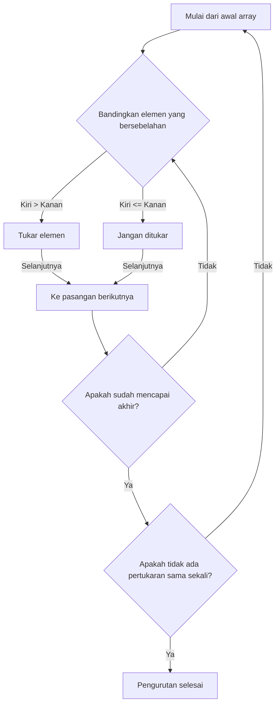
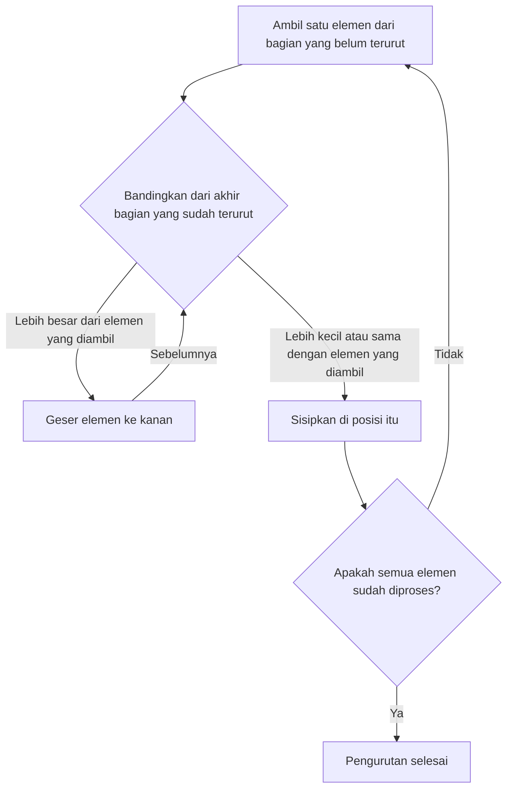
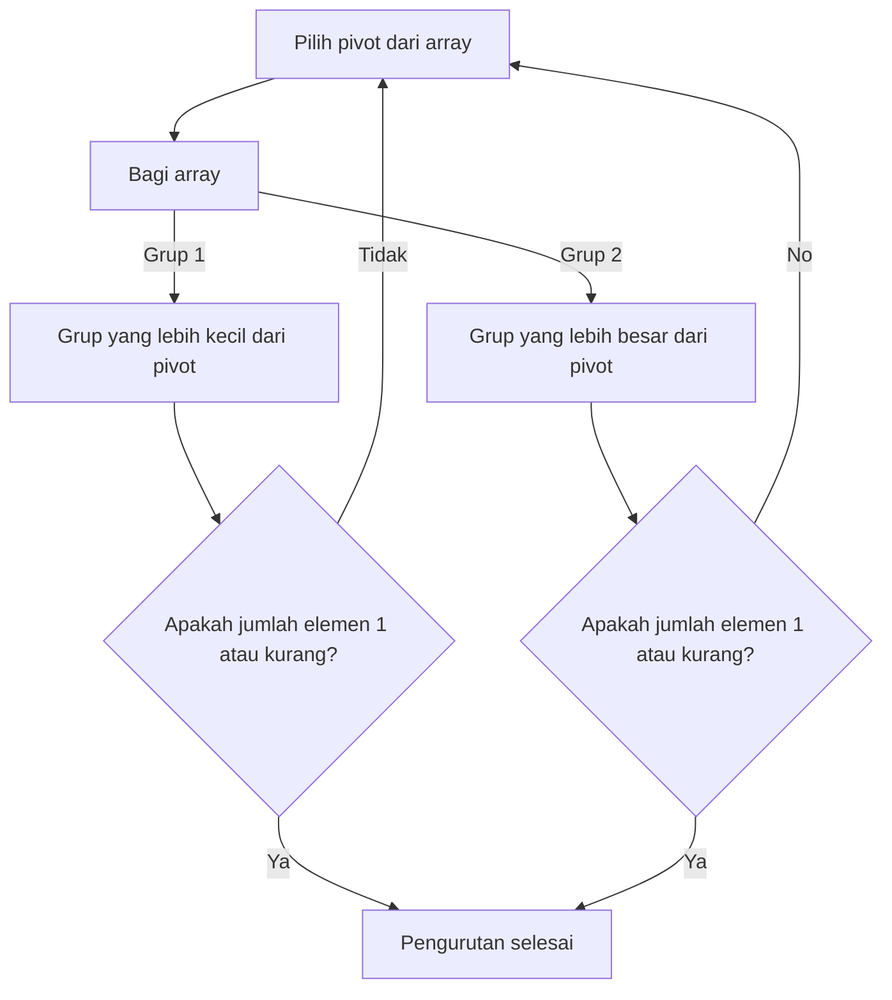
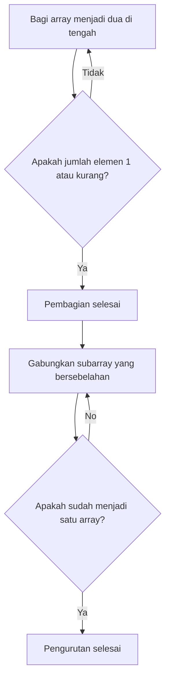

# 1. Pendahuluan: Dunia Mendalam Algoritma Pengurutan

Dalam ilmu komputer, 'pengurutan' (sorting) data ke dalam urutan tertentu (menaik atau menurun) adalah salah satu operasi yang paling dasar dan penting. Algoritma pengurutan berperan sebagai tahap awal dari segala jenis pemrosesan data, seperti mempercepat pencarian, mengelompokkan data, dan mendeteksi duplikat.

Dalam artikel ini, kami akan menjelaskan algoritma pengurutan perwakilan secara komprehensif, mulai dari algoritma sederhana yang mudah dipahami pemula hingga algoritma cepat yang digunakan dalam praktik. Kami akan memahami mekanisme tiap algoritma secara visual melalui ilustrasi **Mermaid**, memeriksa implementasi sesungguhnya dalam kode Python, dan membandingkan performa seperti kompleksitas waktunya. Selain itu, untuk sepenuhnya memahami cara kerja algoritma, kami telah menyertakan pelacakan eksekusi lengkap dengan menggunakan array berisi 50 elemen. Ini akan memungkinkan Anda memahami perilaku detail algoritma layaknya menggenggamnya di tangan.

## Metrik Evaluasi Algoritma

Saat mengevaluasi setiap algoritma, metrik berikut menjadi penting.

- **Kompleksitas Waktu (Time Complexity)** : Menunjukkan bagaimana waktu pemrosesan meningkat relatif terhadap jumlah elemen data $n$. Notasi urutan (notasi Big-O) seperti $\text{O}(n^2)$ atau $\text{O}(n \log n)$ digunakan. Jika menggunakan teks dalam rumus matematika, tulis seperti $\text{terbaik}$.
- **Kompleksitas Ruang (Space Complexity)** : Menunjukkan seberapa banyak memori tambahan yang diperlukan saat dieksekusi. Algoritma di-tempat (In-place) hampir tidak memerlukan memori tambahan.
- **Stabilitas (Stability)** : Menunjukkan apakah urutan relatif dari elemen dengan nilai yang sama dipertahankan sebelum dan sesudah pengurutan. Pada pengurutan yang stabil, urutan aslinya tetap terjaga.

---

## 2. Pengurutan Gelembung (Bubble Sort)

Ini adalah algoritma yang membandingkan elemen-elemen bersebelahan dan mengulang operasi penukaran jika urutannya terbalik. Layaknya gelembung yang mengapung ke permukaan air, elemen-elemen besar secara perlahan berpindah ke ujung akhir array.

### Kompleksitas Waktu dan Karakteristik

- **Kompleksitas Waktu (Terbaik)**: $\text{O}(n)$
- **Kompleksitas Waktu (Rata-rata)**: $\text{O}(n^2)$
- **Kompleksitas Waktu (Terburuk)**: $\text{O}(n^2)$
- **Kompleksitas Ruang**: $\text{O}(1)$
- **Stabilitas**: Stabil

### Ilustrasi (Mermaid)



### Implementasi Python

```python
def bubble_sort(arr):
    n = len(arr)
    for i in range(n):
        swapped = False
        for j in range(0, n-i-1):
            if arr[j] > arr[j+1]:
                arr[j], arr[j+1] = arr[j+1], arr[j]
                swapped = True
        if not swapped:
            break
    return arr
```

### Pelacakan Detail Pengurutan Gelembung

Berikut adalah keadaan array setelah setiap pass selesai ketika menjalankan Bubble Sort pada array acak berisi 50 elemen. Amati bagaimana Bubble Sort mendorong elemen-elemen ke arah kanan.

**Keadaan awal**: `[83, 14, 64, 71, 83, 11, 36, 69, 72, 45, 93, 30, 14, 76, 72, 51, 19, 41, 56, 15, 63, 27, 87, 55, 58, 63, 46, 96, 43, 68, 32, 97, 48, 94, 56, 27, 68, 40, 66, 88, 58, 15, 84, 10, 40, 27, 34, 48, 78, 56]`

**Setelah Pass 1 selesai**: `[14, 64, 71, 83, 11, 36, 69, 72, 45, 83, 30, 14, 76, 72, 51, 19, 41, 56, 15, 63, 27, 87, 55, 58, 63, 46, 93, 43, 68, 32, 96, 48, 94, 56, 27, 68, 40, 66, 88, 58, 15, 84, 10, 40, 27, 34, 48, 78, 56, 97]`

Pada pass ini, elemen terbesar di bagian yang belum terurut telah mengapung ke ujung kanan layaknya gelembung. Karena karakteristik Bubble Sort, dijamin setidaknya satu elemen akan berada pada posisi akhir yang benar pada setiap pass. Oleh karena itu, kita dapat mempersempit jangkauan pencarian satu per satu pada setiap pass, sehingga mengurangi operasi perbandingan yang tidak perlu. Namun, dalam kasus terburuk di mana data sepenuhnya terurut terbalik, operasi pertukaran akan terjadi untuk semua pasangan elemen, sehingga kompleksitas waktu mencapai $\text{O}(n^2)$, yang menghasilkan kinerja sangat rendah.

Pada pass ini, elemen terbesar di bagian yang belum terurut telah mengapung ke ujung kanan layaknya gelembung. Karena karakteristik Bubble Sort, dijamin setidaknya satu elemen akan berada pada posisi akhir yang benar pada setiap pass. Oleh karena itu, kita dapat mempersempit jangkauan pencarian satu per satu pada setiap pass, sehingga mengurangi operasi perbandingan yang tidak perlu. Namun, dalam kasus terburuk di mana data sepenuhnya terurut terbalik, operasi pertukaran akan terjadi untuk semua pasangan elemen, sehingga kompleksitas waktu mencapai $\text{O}(n^2)$, yang menghasilkan kinerja sangat rendah.

**Setelah Pass 2 selesai**: `[14, 64, 71, 11, 36, 69, 72, 45, 83, 30, 14, 76, 72, 51, 19, 41, 56, 15, 63, 27, 83, 55, 58, 63, 46, 87, 43, 68, 32, 93, 48, 94, 56, 27, 68, 40, 66, 88, 58, 15, 84, 10, 40, 27, 34, 48, 78, 56, 96, 97]`

Pada pass ini, elemen terbesar di bagian yang belum terurut telah mengapung ke ujung kanan layaknya gelembung. Karena karakteristik Bubble Sort, dijamin setidaknya satu elemen akan berada pada posisi akhir yang benar pada setiap pass. Oleh karena itu, kita dapat mempersempit jangkauan pencarian satu per satu pada setiap pass, sehingga mengurangi operasi perbandingan yang tidak perlu. Namun, dalam kasus terburuk di mana data sepenuhnya terurut terbalik, operasi pertukaran akan terjadi untuk semua pasangan elemen, sehingga kompleksitas waktu mencapai $\text{O}(n^2)$, yang menghasilkan kinerja sangat rendah.

Pada pass ini, elemen terbesar di bagian yang belum terurut telah mengapung ke ujung kanan layaknya gelembung. Karena karakteristik Bubble Sort, dijamin setidaknya satu elemen akan berada pada posisi akhir yang benar pada setiap pass. Oleh karena itu, kita dapat mempersempit jangkauan pencarian satu per satu pada setiap pass, sehingga mengurangi operasi perbandingan yang tidak perlu. Namun, dalam kasus terburuk di mana data sepenuhnya terurut terbalik, operasi pertukaran akan terjadi untuk semua pasangan elemen, sehingga kompleksitas waktu mencapai $\text{O}(n^2)$, yang menghasilkan kinerja sangat rendah.

**Setelah Pass 3 selesai**: `[14, 64, 11, 36, 69, 71, 45, 72, 30, 14, 76, 72, 51, 19, 41, 56, 15, 63, 27, 83, 55, 58, 63, 46, 83, 43, 68, 32, 87, 48, 93, 56, 27, 68, 40, 66, 88, 58, 15, 84, 10, 40, 27, 34, 48, 78, 56, 94, 96, 97]`

Pada pass ini, elemen terbesar di bagian yang belum terurut telah mengapung ke ujung kanan layaknya gelembung. Karena karakteristik Bubble Sort, dijamin setidaknya satu elemen akan berada pada posisi akhir yang benar pada setiap pass. Oleh karena itu, kita dapat mempersempit jangkauan pencarian satu per satu pada setiap pass, sehingga mengurangi operasi perbandingan yang tidak perlu. Namun, dalam kasus terburuk di mana data sepenuhnya terurut terbalik, operasi pertukaran akan terjadi untuk semua pasangan elemen, sehingga kompleksitas waktu mencapai $\text{O}(n^2)$, yang menghasilkan kinerja sangat rendah.

Pada pass ini, elemen terbesar di bagian yang belum terurut telah mengapung ke ujung kanan layaknya gelembung. Karena karakteristik Bubble Sort, dijamin setidaknya satu elemen akan berada pada posisi akhir yang benar pada setiap pass. Oleh karena itu, kita dapat mempersempit jangkauan pencarian satu per satu pada setiap pass, sehingga mengurangi operasi perbandingan yang tidak perlu. Namun, dalam kasus terburuk di mana data sepenuhnya terurut terbalik, operasi pertukaran akan terjadi untuk semua pasangan elemen, sehingga kompleksitas waktu mencapai $\text{O}(n^2)$, yang menghasilkan kinerja sangat rendah.

**Setelah Pass 4 selesai**: `[14, 11, 36, 64, 69, 45, 71, 30, 14, 72, 72, 51, 19, 41, 56, 15, 63, 27, 76, 55, 58, 63, 46, 83, 43, 68, 32, 83, 48, 87, 56, 27, 68, 40, 66, 88, 58, 15, 84, 10, 40, 27, 34, 48, 78, 56, 93, 94, 96, 97]`

Pada pass ini, elemen terbesar di bagian yang belum terurut telah mengapung ke ujung kanan layaknya gelembung. Karena karakteristik Bubble Sort, dijamin setidaknya satu elemen akan berada pada posisi akhir yang benar pada setiap pass. Oleh karena itu, kita dapat mempersempit jangkauan pencarian satu per satu pada setiap pass, sehingga mengurangi operasi perbandingan yang tidak perlu. Namun, dalam kasus terburuk di mana data sepenuhnya terurut terbalik, operasi pertukaran akan terjadi untuk semua pasangan elemen, sehingga kompleksitas waktu mencapai $\text{O}(n^2)$, yang menghasilkan kinerja sangat rendah.

Pada pass ini, elemen terbesar di bagian yang belum terurut telah mengapung ke ujung kanan layaknya gelembung. Karena karakteristik Bubble Sort, dijamin setidaknya satu elemen akan berada pada posisi akhir yang benar pada setiap pass. Oleh karena itu, kita dapat mempersempit jangkauan pencarian satu per satu pada setiap pass, sehingga mengurangi operasi perbandingan yang tidak perlu. Namun, dalam kasus terburuk di mana data sepenuhnya terurut terbalik, operasi pertukaran akan terjadi untuk semua pasangan elemen, sehingga kompleksitas waktu mencapai $\text{O}(n^2)$, yang menghasilkan kinerja sangat rendah.

**Setelah Pass 5 selesai**: `[11, 14, 36, 64, 45, 69, 30, 14, 71, 72, 51, 19, 41, 56, 15, 63, 27, 72, 55, 58, 63, 46, 76, 43, 68, 32, 83, 48, 83, 56, 27, 68, 40, 66, 87, 58, 15, 84, 10, 40, 27, 34, 48, 78, 56, 88, 93, 94, 96, 97]`

Pada pass ini, elemen terbesar di bagian yang belum terurut telah mengapung ke ujung kanan layaknya gelembung. Karena karakteristik Bubble Sort, dijamin setidaknya satu elemen akan berada pada posisi akhir yang benar pada setiap pass. Oleh karena itu, kita dapat mempersempit jangkauan pencarian satu per satu pada setiap pass, sehingga mengurangi operasi perbandingan yang tidak perlu. Namun, dalam kasus terburuk di mana data sepenuhnya terurut terbalik, operasi pertukaran akan terjadi untuk semua pasangan elemen, sehingga kompleksitas waktu mencapai $\text{O}(n^2)$, yang menghasilkan kinerja sangat rendah.

Pada pass ini, elemen terbesar di bagian yang belum terurut telah mengapung ke ujung kanan layaknya gelembung. Karena karakteristik Bubble Sort, dijamin setidaknya satu elemen akan berada pada posisi akhir yang benar pada setiap pass. Oleh karena itu, kita dapat mempersempit jangkauan pencarian satu per satu pada setiap pass, sehingga mengurangi operasi perbandingan yang tidak perlu. Namun, dalam kasus terburuk di mana data sepenuhnya terurut terbalik, operasi pertukaran akan terjadi untuk semua pasangan elemen, sehingga kompleksitas waktu mencapai $\text{O}(n^2)$, yang menghasilkan kinerja sangat rendah.

**Setelah Pass 6 selesai**: `[11, 14, 36, 45, 64, 30, 14, 69, 71, 51, 19, 41, 56, 15, 63, 27, 72, 55, 58, 63, 46, 72, 43, 68, 32, 76, 48, 83, 56, 27, 68, 40, 66, 83, 58, 15, 84, 10, 40, 27, 34, 48, 78, 56, 87, 88, 93, 94, 96, 97]`

Pada pass ini, elemen terbesar di bagian yang belum terurut telah mengapung ke ujung kanan layaknya gelembung. Karena karakteristik Bubble Sort, dijamin setidaknya satu elemen akan berada pada posisi akhir yang benar pada setiap pass. Oleh karena itu, kita dapat mempersempit jangkauan pencarian satu per satu pada setiap pass, sehingga mengurangi operasi perbandingan yang tidak perlu. Namun, dalam kasus terburuk di mana data sepenuhnya terurut terbalik, operasi pertukaran akan terjadi untuk semua pasangan elemen, sehingga kompleksitas waktu mencapai $\text{O}(n^2)$, yang menghasilkan kinerja sangat rendah.

Pada pass ini, elemen terbesar di bagian yang belum terurut telah mengapung ke ujung kanan layaknya gelembung. Karena karakteristik Bubble Sort, dijamin setidaknya satu elemen akan berada pada posisi akhir yang benar pada setiap pass. Oleh karena itu, kita dapat mempersempit jangkauan pencarian satu per satu pada setiap pass, sehingga mengurangi operasi perbandingan yang tidak perlu. Namun, dalam kasus terburuk di mana data sepenuhnya terurut terbalik, operasi pertukaran akan terjadi untuk semua pasangan elemen, sehingga kompleksitas waktu mencapai $\text{O}(n^2)$, yang menghasilkan kinerja sangat rendah.

**Setelah Pass 7 selesai**: `[11, 14, 36, 45, 30, 14, 64, 69, 51, 19, 41, 56, 15, 63, 27, 71, 55, 58, 63, 46, 72, 43, 68, 32, 72, 48, 76, 56, 27, 68, 40, 66, 83, 58, 15, 83, 10, 40, 27, 34, 48, 78, 56, 84, 87, 88, 93, 94, 96, 97]`

Pada pass ini, elemen terbesar di bagian yang belum terurut telah mengapung ke ujung kanan layaknya gelembung. Karena karakteristik Bubble Sort, dijamin setidaknya satu elemen akan berada pada posisi akhir yang benar pada setiap pass. Oleh karena itu, kita dapat mempersempit jangkauan pencarian satu per satu pada setiap pass, sehingga mengurangi operasi perbandingan yang tidak perlu. Namun, dalam kasus terburuk di mana data sepenuhnya terurut terbalik, operasi pertukaran akan terjadi untuk semua pasangan elemen, sehingga kompleksitas waktu mencapai $\text{O}(n^2)$, yang menghasilkan kinerja sangat rendah.

Pada pass ini, elemen terbesar di bagian yang belum terurut telah mengapung ke ujung kanan layaknya gelembung. Karena karakteristik Bubble Sort, dijamin setidaknya satu elemen akan berada pada posisi akhir yang benar pada setiap pass. Oleh karena itu, kita dapat mempersempit jangkauan pencarian satu per satu pada setiap pass, sehingga mengurangi operasi perbandingan yang tidak perlu. Namun, dalam kasus terburuk di mana data sepenuhnya terurut terbalik, operasi pertukaran akan terjadi untuk semua pasangan elemen, sehingga kompleksitas waktu mencapai $\text{O}(n^2)$, yang menghasilkan kinerja sangat rendah.

**Setelah Pass 8 selesai**: `[11, 14, 36, 30, 14, 45, 64, 51, 19, 41, 56, 15, 63, 27, 69, 55, 58, 63, 46, 71, 43, 68, 32, 72, 48, 72, 56, 27, 68, 40, 66, 76, 58, 15, 83, 10, 40, 27, 34, 48, 78, 56, 83, 84, 87, 88, 93, 94, 96, 97]`

Pada pass ini, elemen terbesar di bagian yang belum terurut telah mengapung ke ujung kanan layaknya gelembung. Karena karakteristik Bubble Sort, dijamin setidaknya satu elemen akan berada pada posisi akhir yang benar pada setiap pass. Oleh karena itu, kita dapat mempersempit jangkauan pencarian satu per satu pada setiap pass, sehingga mengurangi operasi perbandingan yang tidak perlu. Namun, dalam kasus terburuk di mana data sepenuhnya terurut terbalik, operasi pertukaran akan terjadi untuk semua pasangan elemen, sehingga kompleksitas waktu mencapai $\text{O}(n^2)$, yang menghasilkan kinerja sangat rendah.

Pada pass ini, elemen terbesar di bagian yang belum terurut telah mengapung ke ujung kanan layaknya gelembung. Karena karakteristik Bubble Sort, dijamin setidaknya satu elemen akan berada pada posisi akhir yang benar pada setiap pass. Oleh karena itu, kita dapat mempersempit jangkauan pencarian satu per satu pada setiap pass, sehingga mengurangi operasi perbandingan yang tidak perlu. Namun, dalam kasus terburuk di mana data sepenuhnya terurut terbalik, operasi pertukaran akan terjadi untuk semua pasangan elemen, sehingga kompleksitas waktu mencapai $\text{O}(n^2)$, yang menghasilkan kinerja sangat rendah.

**Setelah Pass 9 selesai**: `[11, 14, 30, 14, 36, 45, 51, 19, 41, 56, 15, 63, 27, 64, 55, 58, 63, 46, 69, 43, 68, 32, 71, 48, 72, 56, 27, 68, 40, 66, 72, 58, 15, 76, 10, 40, 27, 34, 48, 78, 56, 83, 83, 84, 87, 88, 93, 94, 96, 97]`

Pada pass ini, elemen terbesar di bagian yang belum terurut telah mengapung ke ujung kanan layaknya gelembung. Karena karakteristik Bubble Sort, dijamin setidaknya satu elemen akan berada pada posisi akhir yang benar pada setiap pass. Oleh karena itu, kita dapat mempersempit jangkauan pencarian satu per satu pada setiap pass, sehingga mengurangi operasi perbandingan yang tidak perlu. Namun, dalam kasus terburuk di mana data sepenuhnya terurut terbalik, operasi pertukaran akan terjadi untuk semua pasangan elemen, sehingga kompleksitas waktu mencapai $\text{O}(n^2)$, yang menghasilkan kinerja sangat rendah.

Pada pass ini, elemen terbesar di bagian yang belum terurut telah mengapung ke ujung kanan layaknya gelembung. Karena karakteristik Bubble Sort, dijamin setidaknya satu elemen akan berada pada posisi akhir yang benar pada setiap pass. Oleh karena itu, kita dapat mempersempit jangkauan pencarian satu per satu pada setiap pass, sehingga mengurangi operasi perbandingan yang tidak perlu. Namun, dalam kasus terburuk di mana data sepenuhnya terurut terbalik, operasi pertukaran akan terjadi untuk semua pasangan elemen, sehingga kompleksitas waktu mencapai $\text{O}(n^2)$, yang menghasilkan kinerja sangat rendah.

**Setelah Pass 10 selesai**: `[11, 14, 14, 30, 36, 45, 19, 41, 51, 15, 56, 27, 63, 55, 58, 63, 46, 64, 43, 68, 32, 69, 48, 71, 56, 27, 68, 40, 66, 72, 58, 15, 72, 10, 40, 27, 34, 48, 76, 56, 78, 83, 83, 84, 87, 88, 93, 94, 96, 97]`

Pada pass ini, elemen terbesar di bagian yang belum terurut telah mengapung ke ujung kanan layaknya gelembung. Karena karakteristik Bubble Sort, dijamin setidaknya satu elemen akan berada pada posisi akhir yang benar pada setiap pass. Oleh karena itu, kita dapat mempersempit jangkauan pencarian satu per satu pada setiap pass, sehingga mengurangi operasi perbandingan yang tidak perlu. Namun, dalam kasus terburuk di mana data sepenuhnya terurut terbalik, operasi pertukaran akan terjadi untuk semua pasangan elemen, sehingga kompleksitas waktu mencapai $\text{O}(n^2)$, yang menghasilkan kinerja sangat rendah.

Pada pass ini, elemen terbesar di bagian yang belum terurut telah mengapung ke ujung kanan layaknya gelembung. Karena karakteristik Bubble Sort, dijamin setidaknya satu elemen akan berada pada posisi akhir yang benar pada setiap pass. Oleh karena itu, kita dapat mempersempit jangkauan pencarian satu per satu pada setiap pass, sehingga mengurangi operasi perbandingan yang tidak perlu. Namun, dalam kasus terburuk di mana data sepenuhnya terurut terbalik, operasi pertukaran akan terjadi untuk semua pasangan elemen, sehingga kompleksitas waktu mencapai $\text{O}(n^2)$, yang menghasilkan kinerja sangat rendah.

**Setelah Pass 11 selesai**: `[11, 14, 14, 30, 36, 19, 41, 45, 15, 51, 27, 56, 55, 58, 63, 46, 63, 43, 64, 32, 68, 48, 69, 56, 27, 68, 40, 66, 71, 58, 15, 72, 10, 40, 27, 34, 48, 72, 56, 76, 78, 83, 83, 84, 87, 88, 93, 94, 96, 97]`

Pada pass ini, elemen terbesar di bagian yang belum terurut telah mengapung ke ujung kanan layaknya gelembung. Karena karakteristik Bubble Sort, dijamin setidaknya satu elemen akan berada pada posisi akhir yang benar pada setiap pass. Oleh karena itu, kita dapat mempersempit jangkauan pencarian satu per satu pada setiap pass, sehingga mengurangi operasi perbandingan yang tidak perlu. Namun, dalam kasus terburuk di mana data sepenuhnya terurut terbalik, operasi pertukaran akan terjadi untuk semua pasangan elemen, sehingga kompleksitas waktu mencapai $\text{O}(n^2)$, yang menghasilkan kinerja sangat rendah.

Pada pass ini, elemen terbesar di bagian yang belum terurut telah mengapung ke ujung kanan layaknya gelembung. Karena karakteristik Bubble Sort, dijamin setidaknya satu elemen akan berada pada posisi akhir yang benar pada setiap pass. Oleh karena itu, kita dapat mempersempit jangkauan pencarian satu per satu pada setiap pass, sehingga mengurangi operasi perbandingan yang tidak perlu. Namun, dalam kasus terburuk di mana data sepenuhnya terurut terbalik, operasi pertukaran akan terjadi untuk semua pasangan elemen, sehingga kompleksitas waktu mencapai $\text{O}(n^2)$, yang menghasilkan kinerja sangat rendah.

**Setelah Pass 12 selesai**: `[11, 14, 14, 30, 19, 36, 41, 15, 45, 27, 51, 55, 56, 58, 46, 63, 43, 63, 32, 64, 48, 68, 56, 27, 68, 40, 66, 69, 58, 15, 71, 10, 40, 27, 34, 48, 72, 56, 72, 76, 78, 83, 83, 84, 87, 88, 93, 94, 96, 97]`

Pada pass ini, elemen terbesar di bagian yang belum terurut telah mengapung ke ujung kanan layaknya gelembung. Karena karakteristik Bubble Sort, dijamin setidaknya satu elemen akan berada pada posisi akhir yang benar pada setiap pass. Oleh karena itu, kita dapat mempersempit jangkauan pencarian satu per satu pada setiap pass, sehingga mengurangi operasi perbandingan yang tidak perlu. Namun, dalam kasus terburuk di mana data sepenuhnya terurut terbalik, operasi pertukaran akan terjadi untuk semua pasangan elemen, sehingga kompleksitas waktu mencapai $\text{O}(n^2)$, yang menghasilkan kinerja sangat rendah.

Pada pass ini, elemen terbesar di bagian yang belum terurut telah mengapung ke ujung kanan layaknya gelembung. Karena karakteristik Bubble Sort, dijamin setidaknya satu elemen akan berada pada posisi akhir yang benar pada setiap pass. Oleh karena itu, kita dapat mempersempit jangkauan pencarian satu per satu pada setiap pass, sehingga mengurangi operasi perbandingan yang tidak perlu. Namun, dalam kasus terburuk di mana data sepenuhnya terurut terbalik, operasi pertukaran akan terjadi untuk semua pasangan elemen, sehingga kompleksitas waktu mencapai $\text{O}(n^2)$, yang menghasilkan kinerja sangat rendah.

**Setelah Pass 13 selesai**: `[11, 14, 14, 19, 30, 36, 15, 41, 27, 45, 51, 55, 56, 46, 58, 43, 63, 32, 63, 48, 64, 56, 27, 68, 40, 66, 68, 58, 15, 69, 10, 40, 27, 34, 48, 71, 56, 72, 72, 76, 78, 83, 83, 84, 87, 88, 93, 94, 96, 97]`

Pada pass ini, elemen terbesar di bagian yang belum terurut telah mengapung ke ujung kanan layaknya gelembung. Karena karakteristik Bubble Sort, dijamin setidaknya satu elemen akan berada pada posisi akhir yang benar pada setiap pass. Oleh karena itu, kita dapat mempersempit jangkauan pencarian satu per satu pada setiap pass, sehingga mengurangi operasi perbandingan yang tidak perlu. Namun, dalam kasus terburuk di mana data sepenuhnya terurut terbalik, operasi pertukaran akan terjadi untuk semua pasangan elemen, sehingga kompleksitas waktu mencapai $\text{O}(n^2)$, yang menghasilkan kinerja sangat rendah.

Pada pass ini, elemen terbesar di bagian yang belum terurut telah mengapung ke ujung kanan layaknya gelembung. Karena karakteristik Bubble Sort, dijamin setidaknya satu elemen akan berada pada posisi akhir yang benar pada setiap pass. Oleh karena itu, kita dapat mempersempit jangkauan pencarian satu per satu pada setiap pass, sehingga mengurangi operasi perbandingan yang tidak perlu. Namun, dalam kasus terburuk di mana data sepenuhnya terurut terbalik, operasi pertukaran akan terjadi untuk semua pasangan elemen, sehingga kompleksitas waktu mencapai $\text{O}(n^2)$, yang menghasilkan kinerja sangat rendah.

**Setelah Pass 14 selesai**: `[11, 14, 14, 19, 30, 15, 36, 27, 41, 45, 51, 55, 46, 56, 43, 58, 32, 63, 48, 63, 56, 27, 64, 40, 66, 68, 58, 15, 68, 10, 40, 27, 34, 48, 69, 56, 71, 72, 72, 76, 78, 83, 83, 84, 87, 88, 93, 94, 96, 97]`

Pada pass ini, elemen terbesar di bagian yang belum terurut telah mengapung ke ujung kanan layaknya gelembung. Karena karakteristik Bubble Sort, dijamin setidaknya satu elemen akan berada pada posisi akhir yang benar pada setiap pass. Oleh karena itu, kita dapat mempersempit jangkauan pencarian satu per satu pada setiap pass, sehingga mengurangi operasi perbandingan yang tidak perlu. Namun, dalam kasus terburuk di mana data sepenuhnya terurut terbalik, operasi pertukaran akan terjadi untuk semua pasangan elemen, sehingga kompleksitas waktu mencapai $\text{O}(n^2)$, yang menghasilkan kinerja sangat rendah.

Pada pass ini, elemen terbesar di bagian yang belum terurut telah mengapung ke ujung kanan layaknya gelembung. Karena karakteristik Bubble Sort, dijamin setidaknya satu elemen akan berada pada posisi akhir yang benar pada setiap pass. Oleh karena itu, kita dapat mempersempit jangkauan pencarian satu per satu pada setiap pass, sehingga mengurangi operasi perbandingan yang tidak perlu. Namun, dalam kasus terburuk di mana data sepenuhnya terurut terbalik, operasi pertukaran akan terjadi untuk semua pasangan elemen, sehingga kompleksitas waktu mencapai $\text{O}(n^2)$, yang menghasilkan kinerja sangat rendah.

**Setelah Pass 15 selesai**: `[11, 14, 14, 19, 15, 30, 27, 36, 41, 45, 51, 46, 55, 43, 56, 32, 58, 48, 63, 56, 27, 63, 40, 64, 66, 58, 15, 68, 10, 40, 27, 34, 48, 68, 56, 69, 71, 72, 72, 76, 78, 83, 83, 84, 87, 88, 93, 94, 96, 97]`

Pada pass ini, elemen terbesar di bagian yang belum terurut telah mengapung ke ujung kanan layaknya gelembung. Karena karakteristik Bubble Sort, dijamin setidaknya satu elemen akan berada pada posisi akhir yang benar pada setiap pass. Oleh karena itu, kita dapat mempersempit jangkauan pencarian satu per satu pada setiap pass, sehingga mengurangi operasi perbandingan yang tidak perlu. Namun, dalam kasus terburuk di mana data sepenuhnya terurut terbalik, operasi pertukaran akan terjadi untuk semua pasangan elemen, sehingga kompleksitas waktu mencapai $\text{O}(n^2)$, yang menghasilkan kinerja sangat rendah.

Pada pass ini, elemen terbesar di bagian yang belum terurut telah mengapung ke ujung kanan layaknya gelembung. Karena karakteristik Bubble Sort, dijamin setidaknya satu elemen akan berada pada posisi akhir yang benar pada setiap pass. Oleh karena itu, kita dapat mempersempit jangkauan pencarian satu per satu pada setiap pass, sehingga mengurangi operasi perbandingan yang tidak perlu. Namun, dalam kasus terburuk di mana data sepenuhnya terurut terbalik, operasi pertukaran akan terjadi untuk semua pasangan elemen, sehingga kompleksitas waktu mencapai $\text{O}(n^2)$, yang menghasilkan kinerja sangat rendah.

**Setelah Pass 16 selesai**: `[11, 14, 14, 15, 19, 27, 30, 36, 41, 45, 46, 51, 43, 55, 32, 56, 48, 58, 56, 27, 63, 40, 63, 64, 58, 15, 66, 10, 40, 27, 34, 48, 68, 56, 68, 69, 71, 72, 72, 76, 78, 83, 83, 84, 87, 88, 93, 94, 96, 97]`

Pada pass ini, elemen terbesar di bagian yang belum terurut telah mengapung ke ujung kanan layaknya gelembung. Karena karakteristik Bubble Sort, dijamin setidaknya satu elemen akan berada pada posisi akhir yang benar pada setiap pass. Oleh karena itu, kita dapat mempersempit jangkauan pencarian satu per satu pada setiap pass, sehingga mengurangi operasi perbandingan yang tidak perlu. Namun, dalam kasus terburuk di mana data sepenuhnya terurut terbalik, operasi pertukaran akan terjadi untuk semua pasangan elemen, sehingga kompleksitas waktu mencapai $\text{O}(n^2)$, yang menghasilkan kinerja sangat rendah.

Pada pass ini, elemen terbesar di bagian yang belum terurut telah mengapung ke ujung kanan layaknya gelembung. Karena karakteristik Bubble Sort, dijamin setidaknya satu elemen akan berada pada posisi akhir yang benar pada setiap pass. Oleh karena itu, kita dapat mempersempit jangkauan pencarian satu per satu pada setiap pass, sehingga mengurangi operasi perbandingan yang tidak perlu. Namun, dalam kasus terburuk di mana data sepenuhnya terurut terbalik, operasi pertukaran akan terjadi untuk semua pasangan elemen, sehingga kompleksitas waktu mencapai $\text{O}(n^2)$, yang menghasilkan kinerja sangat rendah.

**Setelah Pass 17 selesai**: `[11, 14, 14, 15, 19, 27, 30, 36, 41, 45, 46, 43, 51, 32, 55, 48, 56, 56, 27, 58, 40, 63, 63, 58, 15, 64, 10, 40, 27, 34, 48, 66, 56, 68, 68, 69, 71, 72, 72, 76, 78, 83, 83, 84, 87, 88, 93, 94, 96, 97]`

Pada pass ini, elemen terbesar di bagian yang belum terurut telah mengapung ke ujung kanan layaknya gelembung. Karena karakteristik Bubble Sort, dijamin setidaknya satu elemen akan berada pada posisi akhir yang benar pada setiap pass. Oleh karena itu, kita dapat mempersempit jangkauan pencarian satu per satu pada setiap pass, sehingga mengurangi operasi perbandingan yang tidak perlu. Namun, dalam kasus terburuk di mana data sepenuhnya terurut terbalik, operasi pertukaran akan terjadi untuk semua pasangan elemen, sehingga kompleksitas waktu mencapai $\text{O}(n^2)$, yang menghasilkan kinerja sangat rendah.

Pada pass ini, elemen terbesar di bagian yang belum terurut telah mengapung ke ujung kanan layaknya gelembung. Karena karakteristik Bubble Sort, dijamin setidaknya satu elemen akan berada pada posisi akhir yang benar pada setiap pass. Oleh karena itu, kita dapat mempersempit jangkauan pencarian satu per satu pada setiap pass, sehingga mengurangi operasi perbandingan yang tidak perlu. Namun, dalam kasus terburuk di mana data sepenuhnya terurut terbalik, operasi pertukaran akan terjadi untuk semua pasangan elemen, sehingga kompleksitas waktu mencapai $\text{O}(n^2)$, yang menghasilkan kinerja sangat rendah.

**Setelah Pass 18 selesai**: `[11, 14, 14, 15, 19, 27, 30, 36, 41, 45, 43, 46, 32, 51, 48, 55, 56, 27, 56, 40, 58, 63, 58, 15, 63, 10, 40, 27, 34, 48, 64, 56, 66, 68, 68, 69, 71, 72, 72, 76, 78, 83, 83, 84, 87, 88, 93, 94, 96, 97]`

Pada pass ini, elemen terbesar di bagian yang belum terurut telah mengapung ke ujung kanan layaknya gelembung. Karena karakteristik Bubble Sort, dijamin setidaknya satu elemen akan berada pada posisi akhir yang benar pada setiap pass. Oleh karena itu, kita dapat mempersempit jangkauan pencarian satu per satu pada setiap pass, sehingga mengurangi operasi perbandingan yang tidak perlu. Namun, dalam kasus terburuk di mana data sepenuhnya terurut terbalik, operasi pertukaran akan terjadi untuk semua pasangan elemen, sehingga kompleksitas waktu mencapai $\text{O}(n^2)$, yang menghasilkan kinerja sangat rendah.

Pada pass ini, elemen terbesar di bagian yang belum terurut telah mengapung ke ujung kanan layaknya gelembung. Karena karakteristik Bubble Sort, dijamin setidaknya satu elemen akan berada pada posisi akhir yang benar pada setiap pass. Oleh karena itu, kita dapat mempersempit jangkauan pencarian satu per satu pada setiap pass, sehingga mengurangi operasi perbandingan yang tidak perlu. Namun, dalam kasus terburuk di mana data sepenuhnya terurut terbalik, operasi pertukaran akan terjadi untuk semua pasangan elemen, sehingga kompleksitas waktu mencapai $\text{O}(n^2)$, yang menghasilkan kinerja sangat rendah.

**Setelah Pass 19 selesai**: `[11, 14, 14, 15, 19, 27, 30, 36, 41, 43, 45, 32, 46, 48, 51, 55, 27, 56, 40, 56, 58, 58, 15, 63, 10, 40, 27, 34, 48, 63, 56, 64, 66, 68, 68, 69, 71, 72, 72, 76, 78, 83, 83, 84, 87, 88, 93, 94, 96, 97]`

Pada pass ini, elemen terbesar di bagian yang belum terurut telah mengapung ke ujung kanan layaknya gelembung. Karena karakteristik Bubble Sort, dijamin setidaknya satu elemen akan berada pada posisi akhir yang benar pada setiap pass. Oleh karena itu, kita dapat mempersempit jangkauan pencarian satu per satu pada setiap pass, sehingga mengurangi operasi perbandingan yang tidak perlu. Namun, dalam kasus terburuk di mana data sepenuhnya terurut terbalik, operasi pertukaran akan terjadi untuk semua pasangan elemen, sehingga kompleksitas waktu mencapai $\text{O}(n^2)$, yang menghasilkan kinerja sangat rendah.

Pada pass ini, elemen terbesar di bagian yang belum terurut telah mengapung ke ujung kanan layaknya gelembung. Karena karakteristik Bubble Sort, dijamin setidaknya satu elemen akan berada pada posisi akhir yang benar pada setiap pass. Oleh karena itu, kita dapat mempersempit jangkauan pencarian satu per satu pada setiap pass, sehingga mengurangi operasi perbandingan yang tidak perlu. Namun, dalam kasus terburuk di mana data sepenuhnya terurut terbalik, operasi pertukaran akan terjadi untuk semua pasangan elemen, sehingga kompleksitas waktu mencapai $\text{O}(n^2)$, yang menghasilkan kinerja sangat rendah.

**Setelah Pass 20 selesai**: `[11, 14, 14, 15, 19, 27, 30, 36, 41, 43, 32, 45, 46, 48, 51, 27, 55, 40, 56, 56, 58, 15, 58, 10, 40, 27, 34, 48, 63, 56, 63, 64, 66, 68, 68, 69, 71, 72, 72, 76, 78, 83, 83, 84, 87, 88, 93, 94, 96, 97]`

Pada pass ini, elemen terbesar di bagian yang belum terurut telah mengapung ke ujung kanan layaknya gelembung. Karena karakteristik Bubble Sort, dijamin setidaknya satu elemen akan berada pada posisi akhir yang benar pada setiap pass. Oleh karena itu, kita dapat mempersempit jangkauan pencarian satu per satu pada setiap pass, sehingga mengurangi operasi perbandingan yang tidak perlu. Namun, dalam kasus terburuk di mana data sepenuhnya terurut terbalik, operasi pertukaran akan terjadi untuk semua pasangan elemen, sehingga kompleksitas waktu mencapai $\text{O}(n^2)$, yang menghasilkan kinerja sangat rendah.

Pada pass ini, elemen terbesar di bagian yang belum terurut telah mengapung ke ujung kanan layaknya gelembung. Karena karakteristik Bubble Sort, dijamin setidaknya satu elemen akan berada pada posisi akhir yang benar pada setiap pass. Oleh karena itu, kita dapat mempersempit jangkauan pencarian satu per satu pada setiap pass, sehingga mengurangi operasi perbandingan yang tidak perlu. Namun, dalam kasus terburuk di mana data sepenuhnya terurut terbalik, operasi pertukaran akan terjadi untuk semua pasangan elemen, sehingga kompleksitas waktu mencapai $\text{O}(n^2)$, yang menghasilkan kinerja sangat rendah.

**Setelah Pass 21 selesai**: `[11, 14, 14, 15, 19, 27, 30, 36, 41, 32, 43, 45, 46, 48, 27, 51, 40, 55, 56, 56, 15, 58, 10, 40, 27, 34, 48, 58, 56, 63, 63, 64, 66, 68, 68, 69, 71, 72, 72, 76, 78, 83, 83, 84, 87, 88, 93, 94, 96, 97]`

Pada pass ini, elemen terbesar di bagian yang belum terurut telah mengapung ke ujung kanan layaknya gelembung. Karena karakteristik Bubble Sort, dijamin setidaknya satu elemen akan berada pada posisi akhir yang benar pada setiap pass. Oleh karena itu, kita dapat mempersempit jangkauan pencarian satu per satu pada setiap pass, sehingga mengurangi operasi perbandingan yang tidak perlu. Namun, dalam kasus terburuk di mana data sepenuhnya terurut terbalik, operasi pertukaran akan terjadi untuk semua pasangan elemen, sehingga kompleksitas waktu mencapai $\text{O}(n^2)$, yang menghasilkan kinerja sangat rendah.

Pada pass ini, elemen terbesar di bagian yang belum terurut telah mengapung ke ujung kanan layaknya gelembung. Karena karakteristik Bubble Sort, dijamin setidaknya satu elemen akan berada pada posisi akhir yang benar pada setiap pass. Oleh karena itu, kita dapat mempersempit jangkauan pencarian satu per satu pada setiap pass, sehingga mengurangi operasi perbandingan yang tidak perlu. Namun, dalam kasus terburuk di mana data sepenuhnya terurut terbalik, operasi pertukaran akan terjadi untuk semua pasangan elemen, sehingga kompleksitas waktu mencapai $\text{O}(n^2)$, yang menghasilkan kinerja sangat rendah.

**Setelah Pass 22 selesai**: `[11, 14, 14, 15, 19, 27, 30, 36, 32, 41, 43, 45, 46, 27, 48, 40, 51, 55, 56, 15, 56, 10, 40, 27, 34, 48, 58, 56, 58, 63, 63, 64, 66, 68, 68, 69, 71, 72, 72, 76, 78, 83, 83, 84, 87, 88, 93, 94, 96, 97]`

Pada pass ini, elemen terbesar di bagian yang belum terurut telah mengapung ke ujung kanan layaknya gelembung. Karena karakteristik Bubble Sort, dijamin setidaknya satu elemen akan berada pada posisi akhir yang benar pada setiap pass. Oleh karena itu, kita dapat mempersempit jangkauan pencarian satu per satu pada setiap pass, sehingga mengurangi operasi perbandingan yang tidak perlu. Namun, dalam kasus terburuk di mana data sepenuhnya terurut terbalik, operasi pertukaran akan terjadi untuk semua pasangan elemen, sehingga kompleksitas waktu mencapai $\text{O}(n^2)$, yang menghasilkan kinerja sangat rendah.

Pada pass ini, elemen terbesar di bagian yang belum terurut telah mengapung ke ujung kanan layaknya gelembung. Karena karakteristik Bubble Sort, dijamin setidaknya satu elemen akan berada pada posisi akhir yang benar pada setiap pass. Oleh karena itu, kita dapat mempersempit jangkauan pencarian satu per satu pada setiap pass, sehingga mengurangi operasi perbandingan yang tidak perlu. Namun, dalam kasus terburuk di mana data sepenuhnya terurut terbalik, operasi pertukaran akan terjadi untuk semua pasangan elemen, sehingga kompleksitas waktu mencapai $\text{O}(n^2)$, yang menghasilkan kinerja sangat rendah.

**Setelah Pass 23 selesai**: `[11, 14, 14, 15, 19, 27, 30, 32, 36, 41, 43, 45, 27, 46, 40, 48, 51, 55, 15, 56, 10, 40, 27, 34, 48, 56, 56, 58, 58, 63, 63, 64, 66, 68, 68, 69, 71, 72, 72, 76, 78, 83, 83, 84, 87, 88, 93, 94, 96, 97]`

Pada pass ini, elemen terbesar di bagian yang belum terurut telah mengapung ke ujung kanan layaknya gelembung. Karena karakteristik Bubble Sort, dijamin setidaknya satu elemen akan berada pada posisi akhir yang benar pada setiap pass. Oleh karena itu, kita dapat mempersempit jangkauan pencarian satu per satu pada setiap pass, sehingga mengurangi operasi perbandingan yang tidak perlu. Namun, dalam kasus terburuk di mana data sepenuhnya terurut terbalik, operasi pertukaran akan terjadi untuk semua pasangan elemen, sehingga kompleksitas waktu mencapai $\text{O}(n^2)$, yang menghasilkan kinerja sangat rendah.

Pada pass ini, elemen terbesar di bagian yang belum terurut telah mengapung ke ujung kanan layaknya gelembung. Karena karakteristik Bubble Sort, dijamin setidaknya satu elemen akan berada pada posisi akhir yang benar pada setiap pass. Oleh karena itu, kita dapat mempersempit jangkauan pencarian satu per satu pada setiap pass, sehingga mengurangi operasi perbandingan yang tidak perlu. Namun, dalam kasus terburuk di mana data sepenuhnya terurut terbalik, operasi pertukaran akan terjadi untuk semua pasangan elemen, sehingga kompleksitas waktu mencapai $\text{O}(n^2)$, yang menghasilkan kinerja sangat rendah.

**Setelah Pass 24 selesai**: `[11, 14, 14, 15, 19, 27, 30, 32, 36, 41, 43, 27, 45, 40, 46, 48, 51, 15, 55, 10, 40, 27, 34, 48, 56, 56, 56, 58, 58, 63, 63, 64, 66, 68, 68, 69, 71, 72, 72, 76, 78, 83, 83, 84, 87, 88, 93, 94, 96, 97]`

Pada pass ini, elemen terbesar di bagian yang belum terurut telah mengapung ke ujung kanan layaknya gelembung. Karena karakteristik Bubble Sort, dijamin setidaknya satu elemen akan berada pada posisi akhir yang benar pada setiap pass. Oleh karena itu, kita dapat mempersempit jangkauan pencarian satu per satu pada setiap pass, sehingga mengurangi operasi perbandingan yang tidak perlu. Namun, dalam kasus terburuk di mana data sepenuhnya terurut terbalik, operasi pertukaran akan terjadi untuk semua pasangan elemen, sehingga kompleksitas waktu mencapai $\text{O}(n^2)$, yang menghasilkan kinerja sangat rendah.

Pada pass ini, elemen terbesar di bagian yang belum terurut telah mengapung ke ujung kanan layaknya gelembung. Karena karakteristik Bubble Sort, dijamin setidaknya satu elemen akan berada pada posisi akhir yang benar pada setiap pass. Oleh karena itu, kita dapat mempersempit jangkauan pencarian satu per satu pada setiap pass, sehingga mengurangi operasi perbandingan yang tidak perlu. Namun, dalam kasus terburuk di mana data sepenuhnya terurut terbalik, operasi pertukaran akan terjadi untuk semua pasangan elemen, sehingga kompleksitas waktu mencapai $\text{O}(n^2)$, yang menghasilkan kinerja sangat rendah.

**Setelah Pass 25 selesai**: `[11, 14, 14, 15, 19, 27, 30, 32, 36, 41, 27, 43, 40, 45, 46, 48, 15, 51, 10, 40, 27, 34, 48, 55, 56, 56, 56, 58, 58, 63, 63, 64, 66, 68, 68, 69, 71, 72, 72, 76, 78, 83, 83, 84, 87, 88, 93, 94, 96, 97]`

Pada pass ini, elemen terbesar di bagian yang belum terurut telah mengapung ke ujung kanan layaknya gelembung. Karena karakteristik Bubble Sort, dijamin setidaknya satu elemen akan berada pada posisi akhir yang benar pada setiap pass. Oleh karena itu, kita dapat mempersempit jangkauan pencarian satu per satu pada setiap pass, sehingga mengurangi operasi perbandingan yang tidak perlu. Namun, dalam kasus terburuk di mana data sepenuhnya terurut terbalik, operasi pertukaran akan terjadi untuk semua pasangan elemen, sehingga kompleksitas waktu mencapai $\text{O}(n^2)$, yang menghasilkan kinerja sangat rendah.

Pada pass ini, elemen terbesar di bagian yang belum terurut telah mengapung ke ujung kanan layaknya gelembung. Karena karakteristik Bubble Sort, dijamin setidaknya satu elemen akan berada pada posisi akhir yang benar pada setiap pass. Oleh karena itu, kita dapat mempersempit jangkauan pencarian satu per satu pada setiap pass, sehingga mengurangi operasi perbandingan yang tidak perlu. Namun, dalam kasus terburuk di mana data sepenuhnya terurut terbalik, operasi pertukaran akan terjadi untuk semua pasangan elemen, sehingga kompleksitas waktu mencapai $\text{O}(n^2)$, yang menghasilkan kinerja sangat rendah.

**Setelah Pass 26 selesai**: `[11, 14, 14, 15, 19, 27, 30, 32, 36, 27, 41, 40, 43, 45, 46, 15, 48, 10, 40, 27, 34, 48, 51, 55, 56, 56, 56, 58, 58, 63, 63, 64, 66, 68, 68, 69, 71, 72, 72, 76, 78, 83, 83, 84, 87, 88, 93, 94, 96, 97]`

Pada pass ini, elemen terbesar di bagian yang belum terurut telah mengapung ke ujung kanan layaknya gelembung. Karena karakteristik Bubble Sort, dijamin setidaknya satu elemen akan berada pada posisi akhir yang benar pada setiap pass. Oleh karena itu, kita dapat mempersempit jangkauan pencarian satu per satu pada setiap pass, sehingga mengurangi operasi perbandingan yang tidak perlu. Namun, dalam kasus terburuk di mana data sepenuhnya terurut terbalik, operasi pertukaran akan terjadi untuk semua pasangan elemen, sehingga kompleksitas waktu mencapai $\text{O}(n^2)$, yang menghasilkan kinerja sangat rendah.

Pada pass ini, elemen terbesar di bagian yang belum terurut telah mengapung ke ujung kanan layaknya gelembung. Karena karakteristik Bubble Sort, dijamin setidaknya satu elemen akan berada pada posisi akhir yang benar pada setiap pass. Oleh karena itu, kita dapat mempersempit jangkauan pencarian satu per satu pada setiap pass, sehingga mengurangi operasi perbandingan yang tidak perlu. Namun, dalam kasus terburuk di mana data sepenuhnya terurut terbalik, operasi pertukaran akan terjadi untuk semua pasangan elemen, sehingga kompleksitas waktu mencapai $\text{O}(n^2)$, yang menghasilkan kinerja sangat rendah.

**Setelah Pass 27 selesai**: `[11, 14, 14, 15, 19, 27, 30, 32, 27, 36, 40, 41, 43, 45, 15, 46, 10, 40, 27, 34, 48, 48, 51, 55, 56, 56, 56, 58, 58, 63, 63, 64, 66, 68, 68, 69, 71, 72, 72, 76, 78, 83, 83, 84, 87, 88, 93, 94, 96, 97]`

Pada pass ini, elemen terbesar di bagian yang belum terurut telah mengapung ke ujung kanan layaknya gelembung. Karena karakteristik Bubble Sort, dijamin setidaknya satu elemen akan berada pada posisi akhir yang benar pada setiap pass. Oleh karena itu, kita dapat mempersempit jangkauan pencarian satu per satu pada setiap pass, sehingga mengurangi operasi perbandingan yang tidak perlu. Namun, dalam kasus terburuk di mana data sepenuhnya terurut terbalik, operasi pertukaran akan terjadi untuk semua pasangan elemen, sehingga kompleksitas waktu mencapai $\text{O}(n^2)$, yang menghasilkan kinerja sangat rendah.

Pada pass ini, elemen terbesar di bagian yang belum terurut telah mengapung ke ujung kanan layaknya gelembung. Karena karakteristik Bubble Sort, dijamin setidaknya satu elemen akan berada pada posisi akhir yang benar pada setiap pass. Oleh karena itu, kita dapat mempersempit jangkauan pencarian satu per satu pada setiap pass, sehingga mengurangi operasi perbandingan yang tidak perlu. Namun, dalam kasus terburuk di mana data sepenuhnya terurut terbalik, operasi pertukaran akan terjadi untuk semua pasangan elemen, sehingga kompleksitas waktu mencapai $\text{O}(n^2)$, yang menghasilkan kinerja sangat rendah.

**Setelah Pass 28 selesai**: `[11, 14, 14, 15, 19, 27, 30, 27, 32, 36, 40, 41, 43, 15, 45, 10, 40, 27, 34, 46, 48, 48, 51, 55, 56, 56, 56, 58, 58, 63, 63, 64, 66, 68, 68, 69, 71, 72, 72, 76, 78, 83, 83, 84, 87, 88, 93, 94, 96, 97]`

Pada pass ini, elemen terbesar di bagian yang belum terurut telah mengapung ke ujung kanan layaknya gelembung. Karena karakteristik Bubble Sort, dijamin setidaknya satu elemen akan berada pada posisi akhir yang benar pada setiap pass. Oleh karena itu, kita dapat mempersempit jangkauan pencarian satu per satu pada setiap pass, sehingga mengurangi operasi perbandingan yang tidak perlu. Namun, dalam kasus terburuk di mana data sepenuhnya terurut terbalik, operasi pertukaran akan terjadi untuk semua pasangan elemen, sehingga kompleksitas waktu mencapai $\text{O}(n^2)$, yang menghasilkan kinerja sangat rendah.

Pada pass ini, elemen terbesar di bagian yang belum terurut telah mengapung ke ujung kanan layaknya gelembung. Karena karakteristik Bubble Sort, dijamin setidaknya satu elemen akan berada pada posisi akhir yang benar pada setiap pass. Oleh karena itu, kita dapat mempersempit jangkauan pencarian satu per satu pada setiap pass, sehingga mengurangi operasi perbandingan yang tidak perlu. Namun, dalam kasus terburuk di mana data sepenuhnya terurut terbalik, operasi pertukaran akan terjadi untuk semua pasangan elemen, sehingga kompleksitas waktu mencapai $\text{O}(n^2)$, yang menghasilkan kinerja sangat rendah.

**Setelah Pass 29 selesai**: `[11, 14, 14, 15, 19, 27, 27, 30, 32, 36, 40, 41, 15, 43, 10, 40, 27, 34, 45, 46, 48, 48, 51, 55, 56, 56, 56, 58, 58, 63, 63, 64, 66, 68, 68, 69, 71, 72, 72, 76, 78, 83, 83, 84, 87, 88, 93, 94, 96, 97]`

Pada pass ini, elemen terbesar di bagian yang belum terurut telah mengapung ke ujung kanan layaknya gelembung. Karena karakteristik Bubble Sort, dijamin setidaknya satu elemen akan berada pada posisi akhir yang benar pada setiap pass. Oleh karena itu, kita dapat mempersempit jangkauan pencarian satu per satu pada setiap pass, sehingga mengurangi operasi perbandingan yang tidak perlu. Namun, dalam kasus terburuk di mana data sepenuhnya terurut terbalik, operasi pertukaran akan terjadi untuk semua pasangan elemen, sehingga kompleksitas waktu mencapai $\text{O}(n^2)$, yang menghasilkan kinerja sangat rendah.

Pada pass ini, elemen terbesar di bagian yang belum terurut telah mengapung ke ujung kanan layaknya gelembung. Karena karakteristik Bubble Sort, dijamin setidaknya satu elemen akan berada pada posisi akhir yang benar pada setiap pass. Oleh karena itu, kita dapat mempersempit jangkauan pencarian satu per satu pada setiap pass, sehingga mengurangi operasi perbandingan yang tidak perlu. Namun, dalam kasus terburuk di mana data sepenuhnya terurut terbalik, operasi pertukaran akan terjadi untuk semua pasangan elemen, sehingga kompleksitas waktu mencapai $\text{O}(n^2)$, yang menghasilkan kinerja sangat rendah.

**Setelah Pass 30 selesai**: `[11, 14, 14, 15, 19, 27, 27, 30, 32, 36, 40, 15, 41, 10, 40, 27, 34, 43, 45, 46, 48, 48, 51, 55, 56, 56, 56, 58, 58, 63, 63, 64, 66, 68, 68, 69, 71, 72, 72, 76, 78, 83, 83, 84, 87, 88, 93, 94, 96, 97]`

Pada pass ini, elemen terbesar di bagian yang belum terurut telah mengapung ke ujung kanan layaknya gelembung. Karena karakteristik Bubble Sort, dijamin setidaknya satu elemen akan berada pada posisi akhir yang benar pada setiap pass. Oleh karena itu, kita dapat mempersempit jangkauan pencarian satu per satu pada setiap pass, sehingga mengurangi operasi perbandingan yang tidak perlu. Namun, dalam kasus terburuk di mana data sepenuhnya terurut terbalik, operasi pertukaran akan terjadi untuk semua pasangan elemen, sehingga kompleksitas waktu mencapai $\text{O}(n^2)$, yang menghasilkan kinerja sangat rendah.

Pada pass ini, elemen terbesar di bagian yang belum terurut telah mengapung ke ujung kanan layaknya gelembung. Karena karakteristik Bubble Sort, dijamin setidaknya satu elemen akan berada pada posisi akhir yang benar pada setiap pass. Oleh karena itu, kita dapat mempersempit jangkauan pencarian satu per satu pada setiap pass, sehingga mengurangi operasi perbandingan yang tidak perlu. Namun, dalam kasus terburuk di mana data sepenuhnya terurut terbalik, operasi pertukaran akan terjadi untuk semua pasangan elemen, sehingga kompleksitas waktu mencapai $\text{O}(n^2)$, yang menghasilkan kinerja sangat rendah.

**Setelah Pass 31 selesai**: `[11, 14, 14, 15, 19, 27, 27, 30, 32, 36, 15, 40, 10, 40, 27, 34, 41, 43, 45, 46, 48, 48, 51, 55, 56, 56, 56, 58, 58, 63, 63, 64, 66, 68, 68, 69, 71, 72, 72, 76, 78, 83, 83, 84, 87, 88, 93, 94, 96, 97]`

Pada pass ini, elemen terbesar di bagian yang belum terurut telah mengapung ke ujung kanan layaknya gelembung. Karena karakteristik Bubble Sort, dijamin setidaknya satu elemen akan berada pada posisi akhir yang benar pada setiap pass. Oleh karena itu, kita dapat mempersempit jangkauan pencarian satu per satu pada setiap pass, sehingga mengurangi operasi perbandingan yang tidak perlu. Namun, dalam kasus terburuk di mana data sepenuhnya terurut terbalik, operasi pertukaran akan terjadi untuk semua pasangan elemen, sehingga kompleksitas waktu mencapai $\text{O}(n^2)$, yang menghasilkan kinerja sangat rendah.

Pada pass ini, elemen terbesar di bagian yang belum terurut telah mengapung ke ujung kanan layaknya gelembung. Karena karakteristik Bubble Sort, dijamin setidaknya satu elemen akan berada pada posisi akhir yang benar pada setiap pass. Oleh karena itu, kita dapat mempersempit jangkauan pencarian satu per satu pada setiap pass, sehingga mengurangi operasi perbandingan yang tidak perlu. Namun, dalam kasus terburuk di mana data sepenuhnya terurut terbalik, operasi pertukaran akan terjadi untuk semua pasangan elemen, sehingga kompleksitas waktu mencapai $\text{O}(n^2)$, yang menghasilkan kinerja sangat rendah.

**Setelah Pass 32 selesai**: `[11, 14, 14, 15, 19, 27, 27, 30, 32, 15, 36, 10, 40, 27, 34, 40, 41, 43, 45, 46, 48, 48, 51, 55, 56, 56, 56, 58, 58, 63, 63, 64, 66, 68, 68, 69, 71, 72, 72, 76, 78, 83, 83, 84, 87, 88, 93, 94, 96, 97]`

Pada pass ini, elemen terbesar di bagian yang belum terurut telah mengapung ke ujung kanan layaknya gelembung. Karena karakteristik Bubble Sort, dijamin setidaknya satu elemen akan berada pada posisi akhir yang benar pada setiap pass. Oleh karena itu, kita dapat mempersempit jangkauan pencarian satu per satu pada setiap pass, sehingga mengurangi operasi perbandingan yang tidak perlu. Namun, dalam kasus terburuk di mana data sepenuhnya terurut terbalik, operasi pertukaran akan terjadi untuk semua pasangan elemen, sehingga kompleksitas waktu mencapai $\text{O}(n^2)$, yang menghasilkan kinerja sangat rendah.

Pada pass ini, elemen terbesar di bagian yang belum terurut telah mengapung ke ujung kanan layaknya gelembung. Karena karakteristik Bubble Sort, dijamin setidaknya satu elemen akan berada pada posisi akhir yang benar pada setiap pass. Oleh karena itu, kita dapat mempersempit jangkauan pencarian satu per satu pada setiap pass, sehingga mengurangi operasi perbandingan yang tidak perlu. Namun, dalam kasus terburuk di mana data sepenuhnya terurut terbalik, operasi pertukaran akan terjadi untuk semua pasangan elemen, sehingga kompleksitas waktu mencapai $\text{O}(n^2)$, yang menghasilkan kinerja sangat rendah.

**Setelah Pass 33 selesai**: `[11, 14, 14, 15, 19, 27, 27, 30, 15, 32, 10, 36, 27, 34, 40, 40, 41, 43, 45, 46, 48, 48, 51, 55, 56, 56, 56, 58, 58, 63, 63, 64, 66, 68, 68, 69, 71, 72, 72, 76, 78, 83, 83, 84, 87, 88, 93, 94, 96, 97]`

Pada pass ini, elemen terbesar di bagian yang belum terurut telah mengapung ke ujung kanan layaknya gelembung. Karena karakteristik Bubble Sort, dijamin setidaknya satu elemen akan berada pada posisi akhir yang benar pada setiap pass. Oleh karena itu, kita dapat mempersempit jangkauan pencarian satu per satu pada setiap pass, sehingga mengurangi operasi perbandingan yang tidak perlu. Namun, dalam kasus terburuk di mana data sepenuhnya terurut terbalik, operasi pertukaran akan terjadi untuk semua pasangan elemen, sehingga kompleksitas waktu mencapai $\text{O}(n^2)$, yang menghasilkan kinerja sangat rendah.

Pada pass ini, elemen terbesar di bagian yang belum terurut telah mengapung ke ujung kanan layaknya gelembung. Karena karakteristik Bubble Sort, dijamin setidaknya satu elemen akan berada pada posisi akhir yang benar pada setiap pass. Oleh karena itu, kita dapat mempersempit jangkauan pencarian satu per satu pada setiap pass, sehingga mengurangi operasi perbandingan yang tidak perlu. Namun, dalam kasus terburuk di mana data sepenuhnya terurut terbalik, operasi pertukaran akan terjadi untuk semua pasangan elemen, sehingga kompleksitas waktu mencapai $\text{O}(n^2)$, yang menghasilkan kinerja sangat rendah.

**Setelah Pass 34 selesai**: `[11, 14, 14, 15, 19, 27, 27, 15, 30, 10, 32, 27, 34, 36, 40, 40, 41, 43, 45, 46, 48, 48, 51, 55, 56, 56, 56, 58, 58, 63, 63, 64, 66, 68, 68, 69, 71, 72, 72, 76, 78, 83, 83, 84, 87, 88, 93, 94, 96, 97]`

Pada pass ini, elemen terbesar di bagian yang belum terurut telah mengapung ke ujung kanan layaknya gelembung. Karena karakteristik Bubble Sort, dijamin setidaknya satu elemen akan berada pada posisi akhir yang benar pada setiap pass. Oleh karena itu, kita dapat mempersempit jangkauan pencarian satu per satu pada setiap pass, sehingga mengurangi operasi perbandingan yang tidak perlu. Namun, dalam kasus terburuk di mana data sepenuhnya terurut terbalik, operasi pertukaran akan terjadi untuk semua pasangan elemen, sehingga kompleksitas waktu mencapai $\text{O}(n^2)$, yang menghasilkan kinerja sangat rendah.

Pada pass ini, elemen terbesar di bagian yang belum terurut telah mengapung ke ujung kanan layaknya gelembung. Karena karakteristik Bubble Sort, dijamin setidaknya satu elemen akan berada pada posisi akhir yang benar pada setiap pass. Oleh karena itu, kita dapat mempersempit jangkauan pencarian satu per satu pada setiap pass, sehingga mengurangi operasi perbandingan yang tidak perlu. Namun, dalam kasus terburuk di mana data sepenuhnya terurut terbalik, operasi pertukaran akan terjadi untuk semua pasangan elemen, sehingga kompleksitas waktu mencapai $\text{O}(n^2)$, yang menghasilkan kinerja sangat rendah.

**Setelah Pass 35 selesai**: `[11, 14, 14, 15, 19, 27, 15, 27, 10, 30, 27, 32, 34, 36, 40, 40, 41, 43, 45, 46, 48, 48, 51, 55, 56, 56, 56, 58, 58, 63, 63, 64, 66, 68, 68, 69, 71, 72, 72, 76, 78, 83, 83, 84, 87, 88, 93, 94, 96, 97]`

Pada pass ini, elemen terbesar di bagian yang belum terurut telah mengapung ke ujung kanan layaknya gelembung. Karena karakteristik Bubble Sort, dijamin setidaknya satu elemen akan berada pada posisi akhir yang benar pada setiap pass. Oleh karena itu, kita dapat mempersempit jangkauan pencarian satu per satu pada setiap pass, sehingga mengurangi operasi perbandingan yang tidak perlu. Namun, dalam kasus terburuk di mana data sepenuhnya terurut terbalik, operasi pertukaran akan terjadi untuk semua pasangan elemen, sehingga kompleksitas waktu mencapai $\text{O}(n^2)$, yang menghasilkan kinerja sangat rendah.

Pada pass ini, elemen terbesar di bagian yang belum terurut telah mengapung ke ujung kanan layaknya gelembung. Karena karakteristik Bubble Sort, dijamin setidaknya satu elemen akan berada pada posisi akhir yang benar pada setiap pass. Oleh karena itu, kita dapat mempersempit jangkauan pencarian satu per satu pada setiap pass, sehingga mengurangi operasi perbandingan yang tidak perlu. Namun, dalam kasus terburuk di mana data sepenuhnya terurut terbalik, operasi pertukaran akan terjadi untuk semua pasangan elemen, sehingga kompleksitas waktu mencapai $\text{O}(n^2)$, yang menghasilkan kinerja sangat rendah.

**Setelah Pass 36 selesai**: `[11, 14, 14, 15, 19, 15, 27, 10, 27, 27, 30, 32, 34, 36, 40, 40, 41, 43, 45, 46, 48, 48, 51, 55, 56, 56, 56, 58, 58, 63, 63, 64, 66, 68, 68, 69, 71, 72, 72, 76, 78, 83, 83, 84, 87, 88, 93, 94, 96, 97]`

Pada pass ini, elemen terbesar di bagian yang belum terurut telah mengapung ke ujung kanan layaknya gelembung. Karena karakteristik Bubble Sort, dijamin setidaknya satu elemen akan berada pada posisi akhir yang benar pada setiap pass. Oleh karena itu, kita dapat mempersempit jangkauan pencarian satu per satu pada setiap pass, sehingga mengurangi operasi perbandingan yang tidak perlu. Namun, dalam kasus terburuk di mana data sepenuhnya terurut terbalik, operasi pertukaran akan terjadi untuk semua pasangan elemen, sehingga kompleksitas waktu mencapai $\text{O}(n^2)$, yang menghasilkan kinerja sangat rendah.

Pada pass ini, elemen terbesar di bagian yang belum terurut telah mengapung ke ujung kanan layaknya gelembung. Karena karakteristik Bubble Sort, dijamin setidaknya satu elemen akan berada pada posisi akhir yang benar pada setiap pass. Oleh karena itu, kita dapat mempersempit jangkauan pencarian satu per satu pada setiap pass, sehingga mengurangi operasi perbandingan yang tidak perlu. Namun, dalam kasus terburuk di mana data sepenuhnya terurut terbalik, operasi pertukaran akan terjadi untuk semua pasangan elemen, sehingga kompleksitas waktu mencapai $\text{O}(n^2)$, yang menghasilkan kinerja sangat rendah.

**Setelah Pass 37 selesai**: `[11, 14, 14, 15, 15, 19, 10, 27, 27, 27, 30, 32, 34, 36, 40, 40, 41, 43, 45, 46, 48, 48, 51, 55, 56, 56, 56, 58, 58, 63, 63, 64, 66, 68, 68, 69, 71, 72, 72, 76, 78, 83, 83, 84, 87, 88, 93, 94, 96, 97]`

Pada pass ini, elemen terbesar di bagian yang belum terurut telah mengapung ke ujung kanan layaknya gelembung. Karena karakteristik Bubble Sort, dijamin setidaknya satu elemen akan berada pada posisi akhir yang benar pada setiap pass. Oleh karena itu, kita dapat mempersempit jangkauan pencarian satu per satu pada setiap pass, sehingga mengurangi operasi perbandingan yang tidak perlu. Namun, dalam kasus terburuk di mana data sepenuhnya terurut terbalik, operasi pertukaran akan terjadi untuk semua pasangan elemen, sehingga kompleksitas waktu mencapai $\text{O}(n^2)$, yang menghasilkan kinerja sangat rendah.

Pada pass ini, elemen terbesar di bagian yang belum terurut telah mengapung ke ujung kanan layaknya gelembung. Karena karakteristik Bubble Sort, dijamin setidaknya satu elemen akan berada pada posisi akhir yang benar pada setiap pass. Oleh karena itu, kita dapat mempersempit jangkauan pencarian satu per satu pada setiap pass, sehingga mengurangi operasi perbandingan yang tidak perlu. Namun, dalam kasus terburuk di mana data sepenuhnya terurut terbalik, operasi pertukaran akan terjadi untuk semua pasangan elemen, sehingga kompleksitas waktu mencapai $\text{O}(n^2)$, yang menghasilkan kinerja sangat rendah.

**Setelah Pass 38 selesai**: `[11, 14, 14, 15, 15, 10, 19, 27, 27, 27, 30, 32, 34, 36, 40, 40, 41, 43, 45, 46, 48, 48, 51, 55, 56, 56, 56, 58, 58, 63, 63, 64, 66, 68, 68, 69, 71, 72, 72, 76, 78, 83, 83, 84, 87, 88, 93, 94, 96, 97]`

Pada pass ini, elemen terbesar di bagian yang belum terurut telah mengapung ke ujung kanan layaknya gelembung. Karena karakteristik Bubble Sort, dijamin setidaknya satu elemen akan berada pada posisi akhir yang benar pada setiap pass. Oleh karena itu, kita dapat mempersempit jangkauan pencarian satu per satu pada setiap pass, sehingga mengurangi operasi perbandingan yang tidak perlu. Namun, dalam kasus terburuk di mana data sepenuhnya terurut terbalik, operasi pertukaran akan terjadi untuk semua pasangan elemen, sehingga kompleksitas waktu mencapai $\text{O}(n^2)$, yang menghasilkan kinerja sangat rendah.

Pada pass ini, elemen terbesar di bagian yang belum terurut telah mengapung ke ujung kanan layaknya gelembung. Karena karakteristik Bubble Sort, dijamin setidaknya satu elemen akan berada pada posisi akhir yang benar pada setiap pass. Oleh karena itu, kita dapat mempersempit jangkauan pencarian satu per satu pada setiap pass, sehingga mengurangi operasi perbandingan yang tidak perlu. Namun, dalam kasus terburuk di mana data sepenuhnya terurut terbalik, operasi pertukaran akan terjadi untuk semua pasangan elemen, sehingga kompleksitas waktu mencapai $\text{O}(n^2)$, yang menghasilkan kinerja sangat rendah.

**Setelah Pass 39 selesai**: `[11, 14, 14, 15, 10, 15, 19, 27, 27, 27, 30, 32, 34, 36, 40, 40, 41, 43, 45, 46, 48, 48, 51, 55, 56, 56, 56, 58, 58, 63, 63, 64, 66, 68, 68, 69, 71, 72, 72, 76, 78, 83, 83, 84, 87, 88, 93, 94, 96, 97]`

Pada pass ini, elemen terbesar di bagian yang belum terurut telah mengapung ke ujung kanan layaknya gelembung. Karena karakteristik Bubble Sort, dijamin setidaknya satu elemen akan berada pada posisi akhir yang benar pada setiap pass. Oleh karena itu, kita dapat mempersempit jangkauan pencarian satu per satu pada setiap pass, sehingga mengurangi operasi perbandingan yang tidak perlu. Namun, dalam kasus terburuk di mana data sepenuhnya terurut terbalik, operasi pertukaran akan terjadi untuk semua pasangan elemen, sehingga kompleksitas waktu mencapai $\text{O}(n^2)$, yang menghasilkan kinerja sangat rendah.

Pada pass ini, elemen terbesar di bagian yang belum terurut telah mengapung ke ujung kanan layaknya gelembung. Karena karakteristik Bubble Sort, dijamin setidaknya satu elemen akan berada pada posisi akhir yang benar pada setiap pass. Oleh karena itu, kita dapat mempersempit jangkauan pencarian satu per satu pada setiap pass, sehingga mengurangi operasi perbandingan yang tidak perlu. Namun, dalam kasus terburuk di mana data sepenuhnya terurut terbalik, operasi pertukaran akan terjadi untuk semua pasangan elemen, sehingga kompleksitas waktu mencapai $\text{O}(n^2)$, yang menghasilkan kinerja sangat rendah.

**Setelah Pass 40 selesai**: `[11, 14, 14, 10, 15, 15, 19, 27, 27, 27, 30, 32, 34, 36, 40, 40, 41, 43, 45, 46, 48, 48, 51, 55, 56, 56, 56, 58, 58, 63, 63, 64, 66, 68, 68, 69, 71, 72, 72, 76, 78, 83, 83, 84, 87, 88, 93, 94, 96, 97]`

Pada pass ini, elemen terbesar di bagian yang belum terurut telah mengapung ke ujung kanan layaknya gelembung. Karena karakteristik Bubble Sort, dijamin setidaknya satu elemen akan berada pada posisi akhir yang benar pada setiap pass. Oleh karena itu, kita dapat mempersempit jangkauan pencarian satu per satu pada setiap pass, sehingga mengurangi operasi perbandingan yang tidak perlu. Namun, dalam kasus terburuk di mana data sepenuhnya terurut terbalik, operasi pertukaran akan terjadi untuk semua pasangan elemen, sehingga kompleksitas waktu mencapai $\text{O}(n^2)$, yang menghasilkan kinerja sangat rendah.

Pada pass ini, elemen terbesar di bagian yang belum terurut telah mengapung ke ujung kanan layaknya gelembung. Karena karakteristik Bubble Sort, dijamin setidaknya satu elemen akan berada pada posisi akhir yang benar pada setiap pass. Oleh karena itu, kita dapat mempersempit jangkauan pencarian satu per satu pada setiap pass, sehingga mengurangi operasi perbandingan yang tidak perlu. Namun, dalam kasus terburuk di mana data sepenuhnya terurut terbalik, operasi pertukaran akan terjadi untuk semua pasangan elemen, sehingga kompleksitas waktu mencapai $\text{O}(n^2)$, yang menghasilkan kinerja sangat rendah.

**Setelah Pass 41 selesai**: `[11, 14, 10, 14, 15, 15, 19, 27, 27, 27, 30, 32, 34, 36, 40, 40, 41, 43, 45, 46, 48, 48, 51, 55, 56, 56, 56, 58, 58, 63, 63, 64, 66, 68, 68, 69, 71, 72, 72, 76, 78, 83, 83, 84, 87, 88, 93, 94, 96, 97]`

Pada pass ini, elemen terbesar di bagian yang belum terurut telah mengapung ke ujung kanan layaknya gelembung. Karena karakteristik Bubble Sort, dijamin setidaknya satu elemen akan berada pada posisi akhir yang benar pada setiap pass. Oleh karena itu, kita dapat mempersempit jangkauan pencarian satu per satu pada setiap pass, sehingga mengurangi operasi perbandingan yang tidak perlu. Namun, dalam kasus terburuk di mana data sepenuhnya terurut terbalik, operasi pertukaran akan terjadi untuk semua pasangan elemen, sehingga kompleksitas waktu mencapai $\text{O}(n^2)$, yang menghasilkan kinerja sangat rendah.

Pada pass ini, elemen terbesar di bagian yang belum terurut telah mengapung ke ujung kanan layaknya gelembung. Karena karakteristik Bubble Sort, dijamin setidaknya satu elemen akan berada pada posisi akhir yang benar pada setiap pass. Oleh karena itu, kita dapat mempersempit jangkauan pencarian satu per satu pada setiap pass, sehingga mengurangi operasi perbandingan yang tidak perlu. Namun, dalam kasus terburuk di mana data sepenuhnya terurut terbalik, operasi pertukaran akan terjadi untuk semua pasangan elemen, sehingga kompleksitas waktu mencapai $\text{O}(n^2)$, yang menghasilkan kinerja sangat rendah.

**Setelah Pass 42 selesai**: `[11, 10, 14, 14, 15, 15, 19, 27, 27, 27, 30, 32, 34, 36, 40, 40, 41, 43, 45, 46, 48, 48, 51, 55, 56, 56, 56, 58, 58, 63, 63, 64, 66, 68, 68, 69, 71, 72, 72, 76, 78, 83, 83, 84, 87, 88, 93, 94, 96, 97]`

Pada pass ini, elemen terbesar di bagian yang belum terurut telah mengapung ke ujung kanan layaknya gelembung. Karena karakteristik Bubble Sort, dijamin setidaknya satu elemen akan berada pada posisi akhir yang benar pada setiap pass. Oleh karena itu, kita dapat mempersempit jangkauan pencarian satu per satu pada setiap pass, sehingga mengurangi operasi perbandingan yang tidak perlu. Namun, dalam kasus terburuk di mana data sepenuhnya terurut terbalik, operasi pertukaran akan terjadi untuk semua pasangan elemen, sehingga kompleksitas waktu mencapai $\text{O}(n^2)$, yang menghasilkan kinerja sangat rendah.

Pada pass ini, elemen terbesar di bagian yang belum terurut telah mengapung ke ujung kanan layaknya gelembung. Karena karakteristik Bubble Sort, dijamin setidaknya satu elemen akan berada pada posisi akhir yang benar pada setiap pass. Oleh karena itu, kita dapat mempersempit jangkauan pencarian satu per satu pada setiap pass, sehingga mengurangi operasi perbandingan yang tidak perlu. Namun, dalam kasus terburuk di mana data sepenuhnya terurut terbalik, operasi pertukaran akan terjadi untuk semua pasangan elemen, sehingga kompleksitas waktu mencapai $\text{O}(n^2)$, yang menghasilkan kinerja sangat rendah.

**Setelah Pass 43 selesai**: `[10, 11, 14, 14, 15, 15, 19, 27, 27, 27, 30, 32, 34, 36, 40, 40, 41, 43, 45, 46, 48, 48, 51, 55, 56, 56, 56, 58, 58, 63, 63, 64, 66, 68, 68, 69, 71, 72, 72, 76, 78, 83, 83, 84, 87, 88, 93, 94, 96, 97]`

Pada pass ini, elemen terbesar di bagian yang belum terurut telah mengapung ke ujung kanan layaknya gelembung. Karena karakteristik Bubble Sort, dijamin setidaknya satu elemen akan berada pada posisi akhir yang benar pada setiap pass. Oleh karena itu, kita dapat mempersempit jangkauan pencarian satu per satu pada setiap pass, sehingga mengurangi operasi perbandingan yang tidak perlu. Namun, dalam kasus terburuk di mana data sepenuhnya terurut terbalik, operasi pertukaran akan terjadi untuk semua pasangan elemen, sehingga kompleksitas waktu mencapai $\text{O}(n^2)$, yang menghasilkan kinerja sangat rendah.

Pada pass ini, elemen terbesar di bagian yang belum terurut telah mengapung ke ujung kanan layaknya gelembung. Karena karakteristik Bubble Sort, dijamin setidaknya satu elemen akan berada pada posisi akhir yang benar pada setiap pass. Oleh karena itu, kita dapat mempersempit jangkauan pencarian satu per satu pada setiap pass, sehingga mengurangi operasi perbandingan yang tidak perlu. Namun, dalam kasus terburuk di mana data sepenuhnya terurut terbalik, operasi pertukaran akan terjadi untuk semua pasangan elemen, sehingga kompleksitas waktu mencapai $\text{O}(n^2)$, yang menghasilkan kinerja sangat rendah.

**Setelah Pass 44 selesai**: `[10, 11, 14, 14, 15, 15, 19, 27, 27, 27, 30, 32, 34, 36, 40, 40, 41, 43, 45, 46, 48, 48, 51, 55, 56, 56, 56, 58, 58, 63, 63, 64, 66, 68, 68, 69, 71, 72, 72, 76, 78, 83, 83, 84, 87, 88, 93, 94, 96, 97]`

Pada pass ini, elemen terbesar di bagian yang belum terurut telah mengapung ke ujung kanan layaknya gelembung. Karena karakteristik Bubble Sort, dijamin setidaknya satu elemen akan berada pada posisi akhir yang benar pada setiap pass. Oleh karena itu, kita dapat mempersempit jangkauan pencarian satu per satu pada setiap pass, sehingga mengurangi operasi perbandingan yang tidak perlu. Namun, dalam kasus terburuk di mana data sepenuhnya terurut terbalik, operasi pertukaran akan terjadi untuk semua pasangan elemen, sehingga kompleksitas waktu mencapai $\text{O}(n^2)$, yang menghasilkan kinerja sangat rendah.

Pada pass ini, elemen terbesar di bagian yang belum terurut telah mengapung ke ujung kanan layaknya gelembung. Karena karakteristik Bubble Sort, dijamin setidaknya satu elemen akan berada pada posisi akhir yang benar pada setiap pass. Oleh karena itu, kita dapat mempersempit jangkauan pencarian satu per satu pada setiap pass, sehingga mengurangi operasi perbandingan yang tidak perlu. Namun, dalam kasus terburuk di mana data sepenuhnya terurut terbalik, operasi pertukaran akan terjadi untuk semua pasangan elemen, sehingga kompleksitas waktu mencapai $\text{O}(n^2)$, yang menghasilkan kinerja sangat rendah.

Karena tidak ada pertukaran yang terjadi pada pass 44, kami menganggap pengurutan selesai dan mengakhirinya.

## 3. Pengurutan Sisip (Insertion Sort)

Seperti mengatur kartu di tangan, ini adalah algoritma yang mengambil satu elemen pada satu waktu dari bagian yang belum terurut dan menyisipkannya ke posisi yang tepat pada bagian yang sudah terurut.

### Kompleksitas Waktu dan Karakteristik

- **Kompleksitas Waktu (Terbaik)**: $\text{O}(n)$
- **Kompleksitas Waktu (Rata-rata)**: $\text{O}(n^2)$
- **Kompleksitas Waktu (Terburuk)**: $\text{O}(n^2)$
- **Kompleksitas Ruang**: $\text{O}(1)$
- **Stabilitas**: Stabil

### Ilustrasi (Mermaid)



### Implementasi Python

```python
def insertion_sort(arr):
    for i in range(1, len(arr)):
        key = arr[i]
        j = i - 1
        while j >= 0 and key < arr[j]:
            arr[j + 1] = arr[j]
            j -= 1
        arr[j + 1] = key
    return arr
```

### Pelacakan Detail Pengurutan Sisip

Berikut adalah keadaan array setelah setiap elemen disisipkan ketika menjalankan Insertion Sort pada array acak berisi 50 elemen. Anda dapat melihat bagaimana bagian yang sudah terurut di sebelah kiri perlahan-lahan meluas.

**Keadaan awal**: `[97, 29, 43, 96, 91, 22, 51, 83, 31, 13, 62, 62, 19, 23, 26, 50, 70, 84, 67, 62, 36, 35, 50, 90, 97, 52, 52, 64, 21, 90, 76, 72, 61, 20, 36, 83, 41, 14, 35, 22, 20, 34, 42, 98, 46, 49, 98, 42, 30, 89]`

**Langkah 1 (setelah menyisipkan elemen 29)**: `[29, 97, 43, 96, 91, 22, 51, 83, 31, 13, 62, 62, 19, 23, 26, 50, 70, 84, 67, 62, 36, 35, 50, 90, 97, 52, 52, 64, 21, 90, 76, 72, 61, 20, 36, 83, 41, 14, 35, 22, 20, 34, 42, 98, 46, 49, 98, 42, 30, 89]`

Insertion Sort memiliki karakteristik yang sangat baik yaitu mampu menyelesaikan dalam waktu $\text{O}(n)$ untuk array yang sudah terurut. Ketika jumlah datanya kecil, atau untuk data yang sebagian besar telah terurut, beban tambahan konstan (constant multiple overhead) kecil, sehingga sering kali beroperasi lebih cepat daripada Quick Sort atau Merge Sort. Menggunakan karakteristik ini, banyak pustaka standar (seperti TimSort pada Python) mengadopsi pendekatan hibrida yang beralih ke Insertion Sort pada situasi dengan ukuran data yang kecil, seperti pada ujung rekursi.

Insertion Sort memiliki karakteristik yang sangat baik yaitu mampu menyelesaikan dalam waktu $\text{O}(n)$ untuk array yang sudah terurut. Ketika jumlah datanya kecil, atau untuk data yang sebagian besar telah terurut, beban tambahan konstan (constant multiple overhead) kecil, sehingga sering kali beroperasi lebih cepat daripada Quick Sort atau Merge Sort. Menggunakan karakteristik ini, banyak pustaka standar (seperti TimSort pada Python) mengadopsi pendekatan hibrida yang beralih ke Insertion Sort pada situasi dengan ukuran data yang kecil, seperti pada ujung rekursi.

**Langkah 2 (setelah menyisipkan elemen 43)**: `[29, 43, 97, 96, 91, 22, 51, 83, 31, 13, 62, 62, 19, 23, 26, 50, 70, 84, 67, 62, 36, 35, 50, 90, 97, 52, 52, 64, 21, 90, 76, 72, 61, 20, 36, 83, 41, 14, 35, 22, 20, 34, 42, 98, 46, 49, 98, 42, 30, 89]`

Insertion Sort memiliki karakteristik yang sangat baik yaitu mampu menyelesaikan dalam waktu $\text{O}(n)$ untuk array yang sudah terurut. Ketika jumlah datanya kecil, atau untuk data yang sebagian besar telah terurut, beban tambahan konstan (constant multiple overhead) kecil, sehingga sering kali beroperasi lebih cepat daripada Quick Sort atau Merge Sort. Menggunakan karakteristik ini, banyak pustaka standar (seperti TimSort pada Python) mengadopsi pendekatan hibrida yang beralih ke Insertion Sort pada situasi dengan ukuran data yang kecil, seperti pada ujung rekursi.

Insertion Sort memiliki karakteristik yang sangat baik yaitu mampu menyelesaikan dalam waktu $\text{O}(n)$ untuk array yang sudah terurut. Ketika jumlah datanya kecil, atau untuk data yang sebagian besar telah terurut, beban tambahan konstan (constant multiple overhead) kecil, sehingga sering kali beroperasi lebih cepat daripada Quick Sort atau Merge Sort. Menggunakan karakteristik ini, banyak pustaka standar (seperti TimSort pada Python) mengadopsi pendekatan hibrida yang beralih ke Insertion Sort pada situasi dengan ukuran data yang kecil, seperti pada ujung rekursi.

**Langkah 3 (setelah menyisipkan elemen 96)**: `[29, 43, 96, 97, 91, 22, 51, 83, 31, 13, 62, 62, 19, 23, 26, 50, 70, 84, 67, 62, 36, 35, 50, 90, 97, 52, 52, 64, 21, 90, 76, 72, 61, 20, 36, 83, 41, 14, 35, 22, 20, 34, 42, 98, 46, 49, 98, 42, 30, 89]`

Insertion Sort memiliki karakteristik yang sangat baik yaitu mampu menyelesaikan dalam waktu $\text{O}(n)$ untuk array yang sudah terurut. Ketika jumlah datanya kecil, atau untuk data yang sebagian besar telah terurut, beban tambahan konstan (constant multiple overhead) kecil, sehingga sering kali beroperasi lebih cepat daripada Quick Sort atau Merge Sort. Menggunakan karakteristik ini, banyak pustaka standar (seperti TimSort pada Python) mengadopsi pendekatan hibrida yang beralih ke Insertion Sort pada situasi dengan ukuran data yang kecil, seperti pada ujung rekursi.

Insertion Sort memiliki karakteristik yang sangat baik yaitu mampu menyelesaikan dalam waktu $\text{O}(n)$ untuk array yang sudah terurut. Ketika jumlah datanya kecil, atau untuk data yang sebagian besar telah terurut, beban tambahan konstan (constant multiple overhead) kecil, sehingga sering kali beroperasi lebih cepat daripada Quick Sort atau Merge Sort. Menggunakan karakteristik ini, banyak pustaka standar (seperti TimSort pada Python) mengadopsi pendekatan hibrida yang beralih ke Insertion Sort pada situasi dengan ukuran data yang kecil, seperti pada ujung rekursi.

**Langkah 4 (setelah menyisipkan elemen 91)**: `[29, 43, 91, 96, 97, 22, 51, 83, 31, 13, 62, 62, 19, 23, 26, 50, 70, 84, 67, 62, 36, 35, 50, 90, 97, 52, 52, 64, 21, 90, 76, 72, 61, 20, 36, 83, 41, 14, 35, 22, 20, 34, 42, 98, 46, 49, 98, 42, 30, 89]`

Insertion Sort memiliki karakteristik yang sangat baik yaitu mampu menyelesaikan dalam waktu $\text{O}(n)$ untuk array yang sudah terurut. Ketika jumlah datanya kecil, atau untuk data yang sebagian besar telah terurut, beban tambahan konstan (constant multiple overhead) kecil, sehingga sering kali beroperasi lebih cepat daripada Quick Sort atau Merge Sort. Menggunakan karakteristik ini, banyak pustaka standar (seperti TimSort pada Python) mengadopsi pendekatan hibrida yang beralih ke Insertion Sort pada situasi dengan ukuran data yang kecil, seperti pada ujung rekursi.

Insertion Sort memiliki karakteristik yang sangat baik yaitu mampu menyelesaikan dalam waktu $\text{O}(n)$ untuk array yang sudah terurut. Ketika jumlah datanya kecil, atau untuk data yang sebagian besar telah terurut, beban tambahan konstan (constant multiple overhead) kecil, sehingga sering kali beroperasi lebih cepat daripada Quick Sort atau Merge Sort. Menggunakan karakteristik ini, banyak pustaka standar (seperti TimSort pada Python) mengadopsi pendekatan hibrida yang beralih ke Insertion Sort pada situasi dengan ukuran data yang kecil, seperti pada ujung rekursi.

**Langkah 5 (setelah menyisipkan elemen 22)**: `[22, 29, 43, 91, 96, 97, 51, 83, 31, 13, 62, 62, 19, 23, 26, 50, 70, 84, 67, 62, 36, 35, 50, 90, 97, 52, 52, 64, 21, 90, 76, 72, 61, 20, 36, 83, 41, 14, 35, 22, 20, 34, 42, 98, 46, 49, 98, 42, 30, 89]`

Insertion Sort memiliki karakteristik yang sangat baik yaitu mampu menyelesaikan dalam waktu $\text{O}(n)$ untuk array yang sudah terurut. Ketika jumlah datanya kecil, atau untuk data yang sebagian besar telah terurut, beban tambahan konstan (constant multiple overhead) kecil, sehingga sering kali beroperasi lebih cepat daripada Quick Sort atau Merge Sort. Menggunakan karakteristik ini, banyak pustaka standar (seperti TimSort pada Python) mengadopsi pendekatan hibrida yang beralih ke Insertion Sort pada situasi dengan ukuran data yang kecil, seperti pada ujung rekursi.

Insertion Sort memiliki karakteristik yang sangat baik yaitu mampu menyelesaikan dalam waktu $\text{O}(n)$ untuk array yang sudah terurut. Ketika jumlah datanya kecil, atau untuk data yang sebagian besar telah terurut, beban tambahan konstan (constant multiple overhead) kecil, sehingga sering kali beroperasi lebih cepat daripada Quick Sort atau Merge Sort. Menggunakan karakteristik ini, banyak pustaka standar (seperti TimSort pada Python) mengadopsi pendekatan hibrida yang beralih ke Insertion Sort pada situasi dengan ukuran data yang kecil, seperti pada ujung rekursi.

**Langkah 6 (setelah menyisipkan elemen 51)**: `[22, 29, 43, 51, 91, 96, 97, 83, 31, 13, 62, 62, 19, 23, 26, 50, 70, 84, 67, 62, 36, 35, 50, 90, 97, 52, 52, 64, 21, 90, 76, 72, 61, 20, 36, 83, 41, 14, 35, 22, 20, 34, 42, 98, 46, 49, 98, 42, 30, 89]`

Insertion Sort memiliki karakteristik yang sangat baik yaitu mampu menyelesaikan dalam waktu $\text{O}(n)$ untuk array yang sudah terurut. Ketika jumlah datanya kecil, atau untuk data yang sebagian besar telah terurut, beban tambahan konstan (constant multiple overhead) kecil, sehingga sering kali beroperasi lebih cepat daripada Quick Sort atau Merge Sort. Menggunakan karakteristik ini, banyak pustaka standar (seperti TimSort pada Python) mengadopsi pendekatan hibrida yang beralih ke Insertion Sort pada situasi dengan ukuran data yang kecil, seperti pada ujung rekursi.

Insertion Sort memiliki karakteristik yang sangat baik yaitu mampu menyelesaikan dalam waktu $\text{O}(n)$ untuk array yang sudah terurut. Ketika jumlah datanya kecil, atau untuk data yang sebagian besar telah terurut, beban tambahan konstan (constant multiple overhead) kecil, sehingga sering kali beroperasi lebih cepat daripada Quick Sort atau Merge Sort. Menggunakan karakteristik ini, banyak pustaka standar (seperti TimSort pada Python) mengadopsi pendekatan hibrida yang beralih ke Insertion Sort pada situasi dengan ukuran data yang kecil, seperti pada ujung rekursi.

**Langkah 7 (setelah menyisipkan elemen 83)**: `[22, 29, 43, 51, 83, 91, 96, 97, 31, 13, 62, 62, 19, 23, 26, 50, 70, 84, 67, 62, 36, 35, 50, 90, 97, 52, 52, 64, 21, 90, 76, 72, 61, 20, 36, 83, 41, 14, 35, 22, 20, 34, 42, 98, 46, 49, 98, 42, 30, 89]`

Insertion Sort memiliki karakteristik yang sangat baik yaitu mampu menyelesaikan dalam waktu $\text{O}(n)$ untuk array yang sudah terurut. Ketika jumlah datanya kecil, atau untuk data yang sebagian besar telah terurut, beban tambahan konstan (constant multiple overhead) kecil, sehingga sering kali beroperasi lebih cepat daripada Quick Sort atau Merge Sort. Menggunakan karakteristik ini, banyak pustaka standar (seperti TimSort pada Python) mengadopsi pendekatan hibrida yang beralih ke Insertion Sort pada situasi dengan ukuran data yang kecil, seperti pada ujung rekursi.

Insertion Sort memiliki karakteristik yang sangat baik yaitu mampu menyelesaikan dalam waktu $\text{O}(n)$ untuk array yang sudah terurut. Ketika jumlah datanya kecil, atau untuk data yang sebagian besar telah terurut, beban tambahan konstan (constant multiple overhead) kecil, sehingga sering kali beroperasi lebih cepat daripada Quick Sort atau Merge Sort. Menggunakan karakteristik ini, banyak pustaka standar (seperti TimSort pada Python) mengadopsi pendekatan hibrida yang beralih ke Insertion Sort pada situasi dengan ukuran data yang kecil, seperti pada ujung rekursi.

**Langkah 8 (setelah menyisipkan elemen 31)**: `[22, 29, 31, 43, 51, 83, 91, 96, 97, 13, 62, 62, 19, 23, 26, 50, 70, 84, 67, 62, 36, 35, 50, 90, 97, 52, 52, 64, 21, 90, 76, 72, 61, 20, 36, 83, 41, 14, 35, 22, 20, 34, 42, 98, 46, 49, 98, 42, 30, 89]`

Insertion Sort memiliki karakteristik yang sangat baik yaitu mampu menyelesaikan dalam waktu $\text{O}(n)$ untuk array yang sudah terurut. Ketika jumlah datanya kecil, atau untuk data yang sebagian besar telah terurut, beban tambahan konstan (constant multiple overhead) kecil, sehingga sering kali beroperasi lebih cepat daripada Quick Sort atau Merge Sort. Menggunakan karakteristik ini, banyak pustaka standar (seperti TimSort pada Python) mengadopsi pendekatan hibrida yang beralih ke Insertion Sort pada situasi dengan ukuran data yang kecil, seperti pada ujung rekursi.

Insertion Sort memiliki karakteristik yang sangat baik yaitu mampu menyelesaikan dalam waktu $\text{O}(n)$ untuk array yang sudah terurut. Ketika jumlah datanya kecil, atau untuk data yang sebagian besar telah terurut, beban tambahan konstan (constant multiple overhead) kecil, sehingga sering kali beroperasi lebih cepat daripada Quick Sort atau Merge Sort. Menggunakan karakteristik ini, banyak pustaka standar (seperti TimSort pada Python) mengadopsi pendekatan hibrida yang beralih ke Insertion Sort pada situasi dengan ukuran data yang kecil, seperti pada ujung rekursi.

**Langkah 9 (setelah menyisipkan elemen 13)**: `[13, 22, 29, 31, 43, 51, 83, 91, 96, 97, 62, 62, 19, 23, 26, 50, 70, 84, 67, 62, 36, 35, 50, 90, 97, 52, 52, 64, 21, 90, 76, 72, 61, 20, 36, 83, 41, 14, 35, 22, 20, 34, 42, 98, 46, 49, 98, 42, 30, 89]`

Insertion Sort memiliki karakteristik yang sangat baik yaitu mampu menyelesaikan dalam waktu $\text{O}(n)$ untuk array yang sudah terurut. Ketika jumlah datanya kecil, atau untuk data yang sebagian besar telah terurut, beban tambahan konstan (constant multiple overhead) kecil, sehingga sering kali beroperasi lebih cepat daripada Quick Sort atau Merge Sort. Menggunakan karakteristik ini, banyak pustaka standar (seperti TimSort pada Python) mengadopsi pendekatan hibrida yang beralih ke Insertion Sort pada situasi dengan ukuran data yang kecil, seperti pada ujung rekursi.

Insertion Sort memiliki karakteristik yang sangat baik yaitu mampu menyelesaikan dalam waktu $\text{O}(n)$ untuk array yang sudah terurut. Ketika jumlah datanya kecil, atau untuk data yang sebagian besar telah terurut, beban tambahan konstan (constant multiple overhead) kecil, sehingga sering kali beroperasi lebih cepat daripada Quick Sort atau Merge Sort. Menggunakan karakteristik ini, banyak pustaka standar (seperti TimSort pada Python) mengadopsi pendekatan hibrida yang beralih ke Insertion Sort pada situasi dengan ukuran data yang kecil, seperti pada ujung rekursi.

**Langkah 10 (setelah menyisipkan elemen 62)**: `[13, 22, 29, 31, 43, 51, 62, 83, 91, 96, 97, 62, 19, 23, 26, 50, 70, 84, 67, 62, 36, 35, 50, 90, 97, 52, 52, 64, 21, 90, 76, 72, 61, 20, 36, 83, 41, 14, 35, 22, 20, 34, 42, 98, 46, 49, 98, 42, 30, 89]`

Insertion Sort memiliki karakteristik yang sangat baik yaitu mampu menyelesaikan dalam waktu $\text{O}(n)$ untuk array yang sudah terurut. Ketika jumlah datanya kecil, atau untuk data yang sebagian besar telah terurut, beban tambahan konstan (constant multiple overhead) kecil, sehingga sering kali beroperasi lebih cepat daripada Quick Sort atau Merge Sort. Menggunakan karakteristik ini, banyak pustaka standar (seperti TimSort pada Python) mengadopsi pendekatan hibrida yang beralih ke Insertion Sort pada situasi dengan ukuran data yang kecil, seperti pada ujung rekursi.

Insertion Sort memiliki karakteristik yang sangat baik yaitu mampu menyelesaikan dalam waktu $\text{O}(n)$ untuk array yang sudah terurut. Ketika jumlah datanya kecil, atau untuk data yang sebagian besar telah terurut, beban tambahan konstan (constant multiple overhead) kecil, sehingga sering kali beroperasi lebih cepat daripada Quick Sort atau Merge Sort. Menggunakan karakteristik ini, banyak pustaka standar (seperti TimSort pada Python) mengadopsi pendekatan hibrida yang beralih ke Insertion Sort pada situasi dengan ukuran data yang kecil, seperti pada ujung rekursi.

**Langkah 11 (setelah menyisipkan elemen 62)**: `[13, 22, 29, 31, 43, 51, 62, 62, 83, 91, 96, 97, 19, 23, 26, 50, 70, 84, 67, 62, 36, 35, 50, 90, 97, 52, 52, 64, 21, 90, 76, 72, 61, 20, 36, 83, 41, 14, 35, 22, 20, 34, 42, 98, 46, 49, 98, 42, 30, 89]`

Insertion Sort memiliki karakteristik yang sangat baik yaitu mampu menyelesaikan dalam waktu $\text{O}(n)$ untuk array yang sudah terurut. Ketika jumlah datanya kecil, atau untuk data yang sebagian besar telah terurut, beban tambahan konstan (constant multiple overhead) kecil, sehingga sering kali beroperasi lebih cepat daripada Quick Sort atau Merge Sort. Menggunakan karakteristik ini, banyak pustaka standar (seperti TimSort pada Python) mengadopsi pendekatan hibrida yang beralih ke Insertion Sort pada situasi dengan ukuran data yang kecil, seperti pada ujung rekursi.

Insertion Sort memiliki karakteristik yang sangat baik yaitu mampu menyelesaikan dalam waktu $\text{O}(n)$ untuk array yang sudah terurut. Ketika jumlah datanya kecil, atau untuk data yang sebagian besar telah terurut, beban tambahan konstan (constant multiple overhead) kecil, sehingga sering kali beroperasi lebih cepat daripada Quick Sort atau Merge Sort. Menggunakan karakteristik ini, banyak pustaka standar (seperti TimSort pada Python) mengadopsi pendekatan hibrida yang beralih ke Insertion Sort pada situasi dengan ukuran data yang kecil, seperti pada ujung rekursi.

**Langkah 12 (setelah menyisipkan elemen 19)**: `[13, 19, 22, 29, 31, 43, 51, 62, 62, 83, 91, 96, 97, 23, 26, 50, 70, 84, 67, 62, 36, 35, 50, 90, 97, 52, 52, 64, 21, 90, 76, 72, 61, 20, 36, 83, 41, 14, 35, 22, 20, 34, 42, 98, 46, 49, 98, 42, 30, 89]`

Insertion Sort memiliki karakteristik yang sangat baik yaitu mampu menyelesaikan dalam waktu $\text{O}(n)$ untuk array yang sudah terurut. Ketika jumlah datanya kecil, atau untuk data yang sebagian besar telah terurut, beban tambahan konstan (constant multiple overhead) kecil, sehingga sering kali beroperasi lebih cepat daripada Quick Sort atau Merge Sort. Menggunakan karakteristik ini, banyak pustaka standar (seperti TimSort pada Python) mengadopsi pendekatan hibrida yang beralih ke Insertion Sort pada situasi dengan ukuran data yang kecil, seperti pada ujung rekursi.

Insertion Sort memiliki karakteristik yang sangat baik yaitu mampu menyelesaikan dalam waktu $\text{O}(n)$ untuk array yang sudah terurut. Ketika jumlah datanya kecil, atau untuk data yang sebagian besar telah terurut, beban tambahan konstan (constant multiple overhead) kecil, sehingga sering kali beroperasi lebih cepat daripada Quick Sort atau Merge Sort. Menggunakan karakteristik ini, banyak pustaka standar (seperti TimSort pada Python) mengadopsi pendekatan hibrida yang beralih ke Insertion Sort pada situasi dengan ukuran data yang kecil, seperti pada ujung rekursi.

**Langkah 13 (setelah menyisipkan elemen 23)**: `[13, 19, 22, 23, 29, 31, 43, 51, 62, 62, 83, 91, 96, 97, 26, 50, 70, 84, 67, 62, 36, 35, 50, 90, 97, 52, 52, 64, 21, 90, 76, 72, 61, 20, 36, 83, 41, 14, 35, 22, 20, 34, 42, 98, 46, 49, 98, 42, 30, 89]`

Insertion Sort memiliki karakteristik yang sangat baik yaitu mampu menyelesaikan dalam waktu $\text{O}(n)$ untuk array yang sudah terurut. Ketika jumlah datanya kecil, atau untuk data yang sebagian besar telah terurut, beban tambahan konstan (constant multiple overhead) kecil, sehingga sering kali beroperasi lebih cepat daripada Quick Sort atau Merge Sort. Menggunakan karakteristik ini, banyak pustaka standar (seperti TimSort pada Python) mengadopsi pendekatan hibrida yang beralih ke Insertion Sort pada situasi dengan ukuran data yang kecil, seperti pada ujung rekursi.

Insertion Sort memiliki karakteristik yang sangat baik yaitu mampu menyelesaikan dalam waktu $\text{O}(n)$ untuk array yang sudah terurut. Ketika jumlah datanya kecil, atau untuk data yang sebagian besar telah terurut, beban tambahan konstan (constant multiple overhead) kecil, sehingga sering kali beroperasi lebih cepat daripada Quick Sort atau Merge Sort. Menggunakan karakteristik ini, banyak pustaka standar (seperti TimSort pada Python) mengadopsi pendekatan hibrida yang beralih ke Insertion Sort pada situasi dengan ukuran data yang kecil, seperti pada ujung rekursi.

**Langkah 14 (setelah menyisipkan elemen 26)**: `[13, 19, 22, 23, 26, 29, 31, 43, 51, 62, 62, 83, 91, 96, 97, 50, 70, 84, 67, 62, 36, 35, 50, 90, 97, 52, 52, 64, 21, 90, 76, 72, 61, 20, 36, 83, 41, 14, 35, 22, 20, 34, 42, 98, 46, 49, 98, 42, 30, 89]`

Insertion Sort memiliki karakteristik yang sangat baik yaitu mampu menyelesaikan dalam waktu $\text{O}(n)$ untuk array yang sudah terurut. Ketika jumlah datanya kecil, atau untuk data yang sebagian besar telah terurut, beban tambahan konstan (constant multiple overhead) kecil, sehingga sering kali beroperasi lebih cepat daripada Quick Sort atau Merge Sort. Menggunakan karakteristik ini, banyak pustaka standar (seperti TimSort pada Python) mengadopsi pendekatan hibrida yang beralih ke Insertion Sort pada situasi dengan ukuran data yang kecil, seperti pada ujung rekursi.

Insertion Sort memiliki karakteristik yang sangat baik yaitu mampu menyelesaikan dalam waktu $\text{O}(n)$ untuk array yang sudah terurut. Ketika jumlah datanya kecil, atau untuk data yang sebagian besar telah terurut, beban tambahan konstan (constant multiple overhead) kecil, sehingga sering kali beroperasi lebih cepat daripada Quick Sort atau Merge Sort. Menggunakan karakteristik ini, banyak pustaka standar (seperti TimSort pada Python) mengadopsi pendekatan hibrida yang beralih ke Insertion Sort pada situasi dengan ukuran data yang kecil, seperti pada ujung rekursi.

**Langkah 15 (setelah menyisipkan elemen 50)**: `[13, 19, 22, 23, 26, 29, 31, 43, 50, 51, 62, 62, 83, 91, 96, 97, 70, 84, 67, 62, 36, 35, 50, 90, 97, 52, 52, 64, 21, 90, 76, 72, 61, 20, 36, 83, 41, 14, 35, 22, 20, 34, 42, 98, 46, 49, 98, 42, 30, 89]`

Insertion Sort memiliki karakteristik yang sangat baik yaitu mampu menyelesaikan dalam waktu $\text{O}(n)$ untuk array yang sudah terurut. Ketika jumlah datanya kecil, atau untuk data yang sebagian besar telah terurut, beban tambahan konstan (constant multiple overhead) kecil, sehingga sering kali beroperasi lebih cepat daripada Quick Sort atau Merge Sort. Menggunakan karakteristik ini, banyak pustaka standar (seperti TimSort pada Python) mengadopsi pendekatan hibrida yang beralih ke Insertion Sort pada situasi dengan ukuran data yang kecil, seperti pada ujung rekursi.

Insertion Sort memiliki karakteristik yang sangat baik yaitu mampu menyelesaikan dalam waktu $\text{O}(n)$ untuk array yang sudah terurut. Ketika jumlah datanya kecil, atau untuk data yang sebagian besar telah terurut, beban tambahan konstan (constant multiple overhead) kecil, sehingga sering kali beroperasi lebih cepat daripada Quick Sort atau Merge Sort. Menggunakan karakteristik ini, banyak pustaka standar (seperti TimSort pada Python) mengadopsi pendekatan hibrida yang beralih ke Insertion Sort pada situasi dengan ukuran data yang kecil, seperti pada ujung rekursi.

**Langkah 16 (setelah menyisipkan elemen 70)**: `[13, 19, 22, 23, 26, 29, 31, 43, 50, 51, 62, 62, 70, 83, 91, 96, 97, 84, 67, 62, 36, 35, 50, 90, 97, 52, 52, 64, 21, 90, 76, 72, 61, 20, 36, 83, 41, 14, 35, 22, 20, 34, 42, 98, 46, 49, 98, 42, 30, 89]`

Insertion Sort memiliki karakteristik yang sangat baik yaitu mampu menyelesaikan dalam waktu $\text{O}(n)$ untuk array yang sudah terurut. Ketika jumlah datanya kecil, atau untuk data yang sebagian besar telah terurut, beban tambahan konstan (constant multiple overhead) kecil, sehingga sering kali beroperasi lebih cepat daripada Quick Sort atau Merge Sort. Menggunakan karakteristik ini, banyak pustaka standar (seperti TimSort pada Python) mengadopsi pendekatan hibrida yang beralih ke Insertion Sort pada situasi dengan ukuran data yang kecil, seperti pada ujung rekursi.

Insertion Sort memiliki karakteristik yang sangat baik yaitu mampu menyelesaikan dalam waktu $\text{O}(n)$ untuk array yang sudah terurut. Ketika jumlah datanya kecil, atau untuk data yang sebagian besar telah terurut, beban tambahan konstan (constant multiple overhead) kecil, sehingga sering kali beroperasi lebih cepat daripada Quick Sort atau Merge Sort. Menggunakan karakteristik ini, banyak pustaka standar (seperti TimSort pada Python) mengadopsi pendekatan hibrida yang beralih ke Insertion Sort pada situasi dengan ukuran data yang kecil, seperti pada ujung rekursi.

**Langkah 17 (setelah menyisipkan elemen 84)**: `[13, 19, 22, 23, 26, 29, 31, 43, 50, 51, 62, 62, 70, 83, 84, 91, 96, 97, 67, 62, 36, 35, 50, 90, 97, 52, 52, 64, 21, 90, 76, 72, 61, 20, 36, 83, 41, 14, 35, 22, 20, 34, 42, 98, 46, 49, 98, 42, 30, 89]`

Insertion Sort memiliki karakteristik yang sangat baik yaitu mampu menyelesaikan dalam waktu $\text{O}(n)$ untuk array yang sudah terurut. Ketika jumlah datanya kecil, atau untuk data yang sebagian besar telah terurut, beban tambahan konstan (constant multiple overhead) kecil, sehingga sering kali beroperasi lebih cepat daripada Quick Sort atau Merge Sort. Menggunakan karakteristik ini, banyak pustaka standar (seperti TimSort pada Python) mengadopsi pendekatan hibrida yang beralih ke Insertion Sort pada situasi dengan ukuran data yang kecil, seperti pada ujung rekursi.

Insertion Sort memiliki karakteristik yang sangat baik yaitu mampu menyelesaikan dalam waktu $\text{O}(n)$ untuk array yang sudah terurut. Ketika jumlah datanya kecil, atau untuk data yang sebagian besar telah terurut, beban tambahan konstan (constant multiple overhead) kecil, sehingga sering kali beroperasi lebih cepat daripada Quick Sort atau Merge Sort. Menggunakan karakteristik ini, banyak pustaka standar (seperti TimSort pada Python) mengadopsi pendekatan hibrida yang beralih ke Insertion Sort pada situasi dengan ukuran data yang kecil, seperti pada ujung rekursi.

**Langkah 18 (setelah menyisipkan elemen 67)**: `[13, 19, 22, 23, 26, 29, 31, 43, 50, 51, 62, 62, 67, 70, 83, 84, 91, 96, 97, 62, 36, 35, 50, 90, 97, 52, 52, 64, 21, 90, 76, 72, 61, 20, 36, 83, 41, 14, 35, 22, 20, 34, 42, 98, 46, 49, 98, 42, 30, 89]`

Insertion Sort memiliki karakteristik yang sangat baik yaitu mampu menyelesaikan dalam waktu $\text{O}(n)$ untuk array yang sudah terurut. Ketika jumlah datanya kecil, atau untuk data yang sebagian besar telah terurut, beban tambahan konstan (constant multiple overhead) kecil, sehingga sering kali beroperasi lebih cepat daripada Quick Sort atau Merge Sort. Menggunakan karakteristik ini, banyak pustaka standar (seperti TimSort pada Python) mengadopsi pendekatan hibrida yang beralih ke Insertion Sort pada situasi dengan ukuran data yang kecil, seperti pada ujung rekursi.

Insertion Sort memiliki karakteristik yang sangat baik yaitu mampu menyelesaikan dalam waktu $\text{O}(n)$ untuk array yang sudah terurut. Ketika jumlah datanya kecil, atau untuk data yang sebagian besar telah terurut, beban tambahan konstan (constant multiple overhead) kecil, sehingga sering kali beroperasi lebih cepat daripada Quick Sort atau Merge Sort. Menggunakan karakteristik ini, banyak pustaka standar (seperti TimSort pada Python) mengadopsi pendekatan hibrida yang beralih ke Insertion Sort pada situasi dengan ukuran data yang kecil, seperti pada ujung rekursi.

**Langkah 19 (setelah menyisipkan elemen 62)**: `[13, 19, 22, 23, 26, 29, 31, 43, 50, 51, 62, 62, 62, 67, 70, 83, 84, 91, 96, 97, 36, 35, 50, 90, 97, 52, 52, 64, 21, 90, 76, 72, 61, 20, 36, 83, 41, 14, 35, 22, 20, 34, 42, 98, 46, 49, 98, 42, 30, 89]`

Insertion Sort memiliki karakteristik yang sangat baik yaitu mampu menyelesaikan dalam waktu $\text{O}(n)$ untuk array yang sudah terurut. Ketika jumlah datanya kecil, atau untuk data yang sebagian besar telah terurut, beban tambahan konstan (constant multiple overhead) kecil, sehingga sering kali beroperasi lebih cepat daripada Quick Sort atau Merge Sort. Menggunakan karakteristik ini, banyak pustaka standar (seperti TimSort pada Python) mengadopsi pendekatan hibrida yang beralih ke Insertion Sort pada situasi dengan ukuran data yang kecil, seperti pada ujung rekursi.

Insertion Sort memiliki karakteristik yang sangat baik yaitu mampu menyelesaikan dalam waktu $\text{O}(n)$ untuk array yang sudah terurut. Ketika jumlah datanya kecil, atau untuk data yang sebagian besar telah terurut, beban tambahan konstan (constant multiple overhead) kecil, sehingga sering kali beroperasi lebih cepat daripada Quick Sort atau Merge Sort. Menggunakan karakteristik ini, banyak pustaka standar (seperti TimSort pada Python) mengadopsi pendekatan hibrida yang beralih ke Insertion Sort pada situasi dengan ukuran data yang kecil, seperti pada ujung rekursi.

**Langkah 20 (setelah menyisipkan elemen 36)**: `[13, 19, 22, 23, 26, 29, 31, 36, 43, 50, 51, 62, 62, 62, 67, 70, 83, 84, 91, 96, 97, 35, 50, 90, 97, 52, 52, 64, 21, 90, 76, 72, 61, 20, 36, 83, 41, 14, 35, 22, 20, 34, 42, 98, 46, 49, 98, 42, 30, 89]`

Insertion Sort memiliki karakteristik yang sangat baik yaitu mampu menyelesaikan dalam waktu $\text{O}(n)$ untuk array yang sudah terurut. Ketika jumlah datanya kecil, atau untuk data yang sebagian besar telah terurut, beban tambahan konstan (constant multiple overhead) kecil, sehingga sering kali beroperasi lebih cepat daripada Quick Sort atau Merge Sort. Menggunakan karakteristik ini, banyak pustaka standar (seperti TimSort pada Python) mengadopsi pendekatan hibrida yang beralih ke Insertion Sort pada situasi dengan ukuran data yang kecil, seperti pada ujung rekursi.

Insertion Sort memiliki karakteristik yang sangat baik yaitu mampu menyelesaikan dalam waktu $\text{O}(n)$ untuk array yang sudah terurut. Ketika jumlah datanya kecil, atau untuk data yang sebagian besar telah terurut, beban tambahan konstan (constant multiple overhead) kecil, sehingga sering kali beroperasi lebih cepat daripada Quick Sort atau Merge Sort. Menggunakan karakteristik ini, banyak pustaka standar (seperti TimSort pada Python) mengadopsi pendekatan hibrida yang beralih ke Insertion Sort pada situasi dengan ukuran data yang kecil, seperti pada ujung rekursi.

**Langkah 21 (setelah menyisipkan elemen 35)**: `[13, 19, 22, 23, 26, 29, 31, 35, 36, 43, 50, 51, 62, 62, 62, 67, 70, 83, 84, 91, 96, 97, 50, 90, 97, 52, 52, 64, 21, 90, 76, 72, 61, 20, 36, 83, 41, 14, 35, 22, 20, 34, 42, 98, 46, 49, 98, 42, 30, 89]`

Insertion Sort memiliki karakteristik yang sangat baik yaitu mampu menyelesaikan dalam waktu $\text{O}(n)$ untuk array yang sudah terurut. Ketika jumlah datanya kecil, atau untuk data yang sebagian besar telah terurut, beban tambahan konstan (constant multiple overhead) kecil, sehingga sering kali beroperasi lebih cepat daripada Quick Sort atau Merge Sort. Menggunakan karakteristik ini, banyak pustaka standar (seperti TimSort pada Python) mengadopsi pendekatan hibrida yang beralih ke Insertion Sort pada situasi dengan ukuran data yang kecil, seperti pada ujung rekursi.

Insertion Sort memiliki karakteristik yang sangat baik yaitu mampu menyelesaikan dalam waktu $\text{O}(n)$ untuk array yang sudah terurut. Ketika jumlah datanya kecil, atau untuk data yang sebagian besar telah terurut, beban tambahan konstan (constant multiple overhead) kecil, sehingga sering kali beroperasi lebih cepat daripada Quick Sort atau Merge Sort. Menggunakan karakteristik ini, banyak pustaka standar (seperti TimSort pada Python) mengadopsi pendekatan hibrida yang beralih ke Insertion Sort pada situasi dengan ukuran data yang kecil, seperti pada ujung rekursi.

**Langkah 22 (setelah menyisipkan elemen 50)**: `[13, 19, 22, 23, 26, 29, 31, 35, 36, 43, 50, 50, 51, 62, 62, 62, 67, 70, 83, 84, 91, 96, 97, 90, 97, 52, 52, 64, 21, 90, 76, 72, 61, 20, 36, 83, 41, 14, 35, 22, 20, 34, 42, 98, 46, 49, 98, 42, 30, 89]`

Insertion Sort memiliki karakteristik yang sangat baik yaitu mampu menyelesaikan dalam waktu $\text{O}(n)$ untuk array yang sudah terurut. Ketika jumlah datanya kecil, atau untuk data yang sebagian besar telah terurut, beban tambahan konstan (constant multiple overhead) kecil, sehingga sering kali beroperasi lebih cepat daripada Quick Sort atau Merge Sort. Menggunakan karakteristik ini, banyak pustaka standar (seperti TimSort pada Python) mengadopsi pendekatan hibrida yang beralih ke Insertion Sort pada situasi dengan ukuran data yang kecil, seperti pada ujung rekursi.

Insertion Sort memiliki karakteristik yang sangat baik yaitu mampu menyelesaikan dalam waktu $\text{O}(n)$ untuk array yang sudah terurut. Ketika jumlah datanya kecil, atau untuk data yang sebagian besar telah terurut, beban tambahan konstan (constant multiple overhead) kecil, sehingga sering kali beroperasi lebih cepat daripada Quick Sort atau Merge Sort. Menggunakan karakteristik ini, banyak pustaka standar (seperti TimSort pada Python) mengadopsi pendekatan hibrida yang beralih ke Insertion Sort pada situasi dengan ukuran data yang kecil, seperti pada ujung rekursi.

**Langkah 23 (setelah menyisipkan elemen 90)**: `[13, 19, 22, 23, 26, 29, 31, 35, 36, 43, 50, 50, 51, 62, 62, 62, 67, 70, 83, 84, 90, 91, 96, 97, 97, 52, 52, 64, 21, 90, 76, 72, 61, 20, 36, 83, 41, 14, 35, 22, 20, 34, 42, 98, 46, 49, 98, 42, 30, 89]`

Insertion Sort memiliki karakteristik yang sangat baik yaitu mampu menyelesaikan dalam waktu $\text{O}(n)$ untuk array yang sudah terurut. Ketika jumlah datanya kecil, atau untuk data yang sebagian besar telah terurut, beban tambahan konstan (constant multiple overhead) kecil, sehingga sering kali beroperasi lebih cepat daripada Quick Sort atau Merge Sort. Menggunakan karakteristik ini, banyak pustaka standar (seperti TimSort pada Python) mengadopsi pendekatan hibrida yang beralih ke Insertion Sort pada situasi dengan ukuran data yang kecil, seperti pada ujung rekursi.

Insertion Sort memiliki karakteristik yang sangat baik yaitu mampu menyelesaikan dalam waktu $\text{O}(n)$ untuk array yang sudah terurut. Ketika jumlah datanya kecil, atau untuk data yang sebagian besar telah terurut, beban tambahan konstan (constant multiple overhead) kecil, sehingga sering kali beroperasi lebih cepat daripada Quick Sort atau Merge Sort. Menggunakan karakteristik ini, banyak pustaka standar (seperti TimSort pada Python) mengadopsi pendekatan hibrida yang beralih ke Insertion Sort pada situasi dengan ukuran data yang kecil, seperti pada ujung rekursi.

**Langkah 24 (setelah menyisipkan elemen 97)**: `[13, 19, 22, 23, 26, 29, 31, 35, 36, 43, 50, 50, 51, 62, 62, 62, 67, 70, 83, 84, 90, 91, 96, 97, 97, 52, 52, 64, 21, 90, 76, 72, 61, 20, 36, 83, 41, 14, 35, 22, 20, 34, 42, 98, 46, 49, 98, 42, 30, 89]`

Insertion Sort memiliki karakteristik yang sangat baik yaitu mampu menyelesaikan dalam waktu $\text{O}(n)$ untuk array yang sudah terurut. Ketika jumlah datanya kecil, atau untuk data yang sebagian besar telah terurut, beban tambahan konstan (constant multiple overhead) kecil, sehingga sering kali beroperasi lebih cepat daripada Quick Sort atau Merge Sort. Menggunakan karakteristik ini, banyak pustaka standar (seperti TimSort pada Python) mengadopsi pendekatan hibrida yang beralih ke Insertion Sort pada situasi dengan ukuran data yang kecil, seperti pada ujung rekursi.

Insertion Sort memiliki karakteristik yang sangat baik yaitu mampu menyelesaikan dalam waktu $\text{O}(n)$ untuk array yang sudah terurut. Ketika jumlah datanya kecil, atau untuk data yang sebagian besar telah terurut, beban tambahan konstan (constant multiple overhead) kecil, sehingga sering kali beroperasi lebih cepat daripada Quick Sort atau Merge Sort. Menggunakan karakteristik ini, banyak pustaka standar (seperti TimSort pada Python) mengadopsi pendekatan hibrida yang beralih ke Insertion Sort pada situasi dengan ukuran data yang kecil, seperti pada ujung rekursi.

**Langkah 25 (setelah menyisipkan elemen 52)**: `[13, 19, 22, 23, 26, 29, 31, 35, 36, 43, 50, 50, 51, 52, 62, 62, 62, 67, 70, 83, 84, 90, 91, 96, 97, 97, 52, 64, 21, 90, 76, 72, 61, 20, 36, 83, 41, 14, 35, 22, 20, 34, 42, 98, 46, 49, 98, 42, 30, 89]`

Insertion Sort memiliki karakteristik yang sangat baik yaitu mampu menyelesaikan dalam waktu $\text{O}(n)$ untuk array yang sudah terurut. Ketika jumlah datanya kecil, atau untuk data yang sebagian besar telah terurut, beban tambahan konstan (constant multiple overhead) kecil, sehingga sering kali beroperasi lebih cepat daripada Quick Sort atau Merge Sort. Menggunakan karakteristik ini, banyak pustaka standar (seperti TimSort pada Python) mengadopsi pendekatan hibrida yang beralih ke Insertion Sort pada situasi dengan ukuran data yang kecil, seperti pada ujung rekursi.

Insertion Sort memiliki karakteristik yang sangat baik yaitu mampu menyelesaikan dalam waktu $\text{O}(n)$ untuk array yang sudah terurut. Ketika jumlah datanya kecil, atau untuk data yang sebagian besar telah terurut, beban tambahan konstan (constant multiple overhead) kecil, sehingga sering kali beroperasi lebih cepat daripada Quick Sort atau Merge Sort. Menggunakan karakteristik ini, banyak pustaka standar (seperti TimSort pada Python) mengadopsi pendekatan hibrida yang beralih ke Insertion Sort pada situasi dengan ukuran data yang kecil, seperti pada ujung rekursi.

**Langkah 26 (setelah menyisipkan elemen 52)**: `[13, 19, 22, 23, 26, 29, 31, 35, 36, 43, 50, 50, 51, 52, 52, 62, 62, 62, 67, 70, 83, 84, 90, 91, 96, 97, 97, 64, 21, 90, 76, 72, 61, 20, 36, 83, 41, 14, 35, 22, 20, 34, 42, 98, 46, 49, 98, 42, 30, 89]`

Insertion Sort memiliki karakteristik yang sangat baik yaitu mampu menyelesaikan dalam waktu $\text{O}(n)$ untuk array yang sudah terurut. Ketika jumlah datanya kecil, atau untuk data yang sebagian besar telah terurut, beban tambahan konstan (constant multiple overhead) kecil, sehingga sering kali beroperasi lebih cepat daripada Quick Sort atau Merge Sort. Menggunakan karakteristik ini, banyak pustaka standar (seperti TimSort pada Python) mengadopsi pendekatan hibrida yang beralih ke Insertion Sort pada situasi dengan ukuran data yang kecil, seperti pada ujung rekursi.

Insertion Sort memiliki karakteristik yang sangat baik yaitu mampu menyelesaikan dalam waktu $\text{O}(n)$ untuk array yang sudah terurut. Ketika jumlah datanya kecil, atau untuk data yang sebagian besar telah terurut, beban tambahan konstan (constant multiple overhead) kecil, sehingga sering kali beroperasi lebih cepat daripada Quick Sort atau Merge Sort. Menggunakan karakteristik ini, banyak pustaka standar (seperti TimSort pada Python) mengadopsi pendekatan hibrida yang beralih ke Insertion Sort pada situasi dengan ukuran data yang kecil, seperti pada ujung rekursi.

**Langkah 27 (setelah menyisipkan elemen 64)**: `[13, 19, 22, 23, 26, 29, 31, 35, 36, 43, 50, 50, 51, 52, 52, 62, 62, 62, 64, 67, 70, 83, 84, 90, 91, 96, 97, 97, 21, 90, 76, 72, 61, 20, 36, 83, 41, 14, 35, 22, 20, 34, 42, 98, 46, 49, 98, 42, 30, 89]`

Insertion Sort memiliki karakteristik yang sangat baik yaitu mampu menyelesaikan dalam waktu $\text{O}(n)$ untuk array yang sudah terurut. Ketika jumlah datanya kecil, atau untuk data yang sebagian besar telah terurut, beban tambahan konstan (constant multiple overhead) kecil, sehingga sering kali beroperasi lebih cepat daripada Quick Sort atau Merge Sort. Menggunakan karakteristik ini, banyak pustaka standar (seperti TimSort pada Python) mengadopsi pendekatan hibrida yang beralih ke Insertion Sort pada situasi dengan ukuran data yang kecil, seperti pada ujung rekursi.

Insertion Sort memiliki karakteristik yang sangat baik yaitu mampu menyelesaikan dalam waktu $\text{O}(n)$ untuk array yang sudah terurut. Ketika jumlah datanya kecil, atau untuk data yang sebagian besar telah terurut, beban tambahan konstan (constant multiple overhead) kecil, sehingga sering kali beroperasi lebih cepat daripada Quick Sort atau Merge Sort. Menggunakan karakteristik ini, banyak pustaka standar (seperti TimSort pada Python) mengadopsi pendekatan hibrida yang beralih ke Insertion Sort pada situasi dengan ukuran data yang kecil, seperti pada ujung rekursi.

**Langkah 28 (setelah menyisipkan elemen 21)**: `[13, 19, 21, 22, 23, 26, 29, 31, 35, 36, 43, 50, 50, 51, 52, 52, 62, 62, 62, 64, 67, 70, 83, 84, 90, 91, 96, 97, 97, 90, 76, 72, 61, 20, 36, 83, 41, 14, 35, 22, 20, 34, 42, 98, 46, 49, 98, 42, 30, 89]`

Insertion Sort memiliki karakteristik yang sangat baik yaitu mampu menyelesaikan dalam waktu $\text{O}(n)$ untuk array yang sudah terurut. Ketika jumlah datanya kecil, atau untuk data yang sebagian besar telah terurut, beban tambahan konstan (constant multiple overhead) kecil, sehingga sering kali beroperasi lebih cepat daripada Quick Sort atau Merge Sort. Menggunakan karakteristik ini, banyak pustaka standar (seperti TimSort pada Python) mengadopsi pendekatan hibrida yang beralih ke Insertion Sort pada situasi dengan ukuran data yang kecil, seperti pada ujung rekursi.

Insertion Sort memiliki karakteristik yang sangat baik yaitu mampu menyelesaikan dalam waktu $\text{O}(n)$ untuk array yang sudah terurut. Ketika jumlah datanya kecil, atau untuk data yang sebagian besar telah terurut, beban tambahan konstan (constant multiple overhead) kecil, sehingga sering kali beroperasi lebih cepat daripada Quick Sort atau Merge Sort. Menggunakan karakteristik ini, banyak pustaka standar (seperti TimSort pada Python) mengadopsi pendekatan hibrida yang beralih ke Insertion Sort pada situasi dengan ukuran data yang kecil, seperti pada ujung rekursi.

**Langkah 29 (setelah menyisipkan elemen 90)**: `[13, 19, 21, 22, 23, 26, 29, 31, 35, 36, 43, 50, 50, 51, 52, 52, 62, 62, 62, 64, 67, 70, 83, 84, 90, 90, 91, 96, 97, 97, 76, 72, 61, 20, 36, 83, 41, 14, 35, 22, 20, 34, 42, 98, 46, 49, 98, 42, 30, 89]`

Insertion Sort memiliki karakteristik yang sangat baik yaitu mampu menyelesaikan dalam waktu $\text{O}(n)$ untuk array yang sudah terurut. Ketika jumlah datanya kecil, atau untuk data yang sebagian besar telah terurut, beban tambahan konstan (constant multiple overhead) kecil, sehingga sering kali beroperasi lebih cepat daripada Quick Sort atau Merge Sort. Menggunakan karakteristik ini, banyak pustaka standar (seperti TimSort pada Python) mengadopsi pendekatan hibrida yang beralih ke Insertion Sort pada situasi dengan ukuran data yang kecil, seperti pada ujung rekursi.

Insertion Sort memiliki karakteristik yang sangat baik yaitu mampu menyelesaikan dalam waktu $\text{O}(n)$ untuk array yang sudah terurut. Ketika jumlah datanya kecil, atau untuk data yang sebagian besar telah terurut, beban tambahan konstan (constant multiple overhead) kecil, sehingga sering kali beroperasi lebih cepat daripada Quick Sort atau Merge Sort. Menggunakan karakteristik ini, banyak pustaka standar (seperti TimSort pada Python) mengadopsi pendekatan hibrida yang beralih ke Insertion Sort pada situasi dengan ukuran data yang kecil, seperti pada ujung rekursi.

**Langkah 30 (setelah menyisipkan elemen 76)**: `[13, 19, 21, 22, 23, 26, 29, 31, 35, 36, 43, 50, 50, 51, 52, 52, 62, 62, 62, 64, 67, 70, 76, 83, 84, 90, 90, 91, 96, 97, 97, 72, 61, 20, 36, 83, 41, 14, 35, 22, 20, 34, 42, 98, 46, 49, 98, 42, 30, 89]`

Insertion Sort memiliki karakteristik yang sangat baik yaitu mampu menyelesaikan dalam waktu $\text{O}(n)$ untuk array yang sudah terurut. Ketika jumlah datanya kecil, atau untuk data yang sebagian besar telah terurut, beban tambahan konstan (constant multiple overhead) kecil, sehingga sering kali beroperasi lebih cepat daripada Quick Sort atau Merge Sort. Menggunakan karakteristik ini, banyak pustaka standar (seperti TimSort pada Python) mengadopsi pendekatan hibrida yang beralih ke Insertion Sort pada situasi dengan ukuran data yang kecil, seperti pada ujung rekursi.

Insertion Sort memiliki karakteristik yang sangat baik yaitu mampu menyelesaikan dalam waktu $\text{O}(n)$ untuk array yang sudah terurut. Ketika jumlah datanya kecil, atau untuk data yang sebagian besar telah terurut, beban tambahan konstan (constant multiple overhead) kecil, sehingga sering kali beroperasi lebih cepat daripada Quick Sort atau Merge Sort. Menggunakan karakteristik ini, banyak pustaka standar (seperti TimSort pada Python) mengadopsi pendekatan hibrida yang beralih ke Insertion Sort pada situasi dengan ukuran data yang kecil, seperti pada ujung rekursi.

**Langkah 31 (setelah menyisipkan elemen 72)**: `[13, 19, 21, 22, 23, 26, 29, 31, 35, 36, 43, 50, 50, 51, 52, 52, 62, 62, 62, 64, 67, 70, 72, 76, 83, 84, 90, 90, 91, 96, 97, 97, 61, 20, 36, 83, 41, 14, 35, 22, 20, 34, 42, 98, 46, 49, 98, 42, 30, 89]`

Insertion Sort memiliki karakteristik yang sangat baik yaitu mampu menyelesaikan dalam waktu $\text{O}(n)$ untuk array yang sudah terurut. Ketika jumlah datanya kecil, atau untuk data yang sebagian besar telah terurut, beban tambahan konstan (constant multiple overhead) kecil, sehingga sering kali beroperasi lebih cepat daripada Quick Sort atau Merge Sort. Menggunakan karakteristik ini, banyak pustaka standar (seperti TimSort pada Python) mengadopsi pendekatan hibrida yang beralih ke Insertion Sort pada situasi dengan ukuran data yang kecil, seperti pada ujung rekursi.

Insertion Sort memiliki karakteristik yang sangat baik yaitu mampu menyelesaikan dalam waktu $\text{O}(n)$ untuk array yang sudah terurut. Ketika jumlah datanya kecil, atau untuk data yang sebagian besar telah terurut, beban tambahan konstan (constant multiple overhead) kecil, sehingga sering kali beroperasi lebih cepat daripada Quick Sort atau Merge Sort. Menggunakan karakteristik ini, banyak pustaka standar (seperti TimSort pada Python) mengadopsi pendekatan hibrida yang beralih ke Insertion Sort pada situasi dengan ukuran data yang kecil, seperti pada ujung rekursi.

**Langkah 32 (setelah menyisipkan elemen 61)**: `[13, 19, 21, 22, 23, 26, 29, 31, 35, 36, 43, 50, 50, 51, 52, 52, 61, 62, 62, 62, 64, 67, 70, 72, 76, 83, 84, 90, 90, 91, 96, 97, 97, 20, 36, 83, 41, 14, 35, 22, 20, 34, 42, 98, 46, 49, 98, 42, 30, 89]`

Insertion Sort memiliki karakteristik yang sangat baik yaitu mampu menyelesaikan dalam waktu $\text{O}(n)$ untuk array yang sudah terurut. Ketika jumlah datanya kecil, atau untuk data yang sebagian besar telah terurut, beban tambahan konstan (constant multiple overhead) kecil, sehingga sering kali beroperasi lebih cepat daripada Quick Sort atau Merge Sort. Menggunakan karakteristik ini, banyak pustaka standar (seperti TimSort pada Python) mengadopsi pendekatan hibrida yang beralih ke Insertion Sort pada situasi dengan ukuran data yang kecil, seperti pada ujung rekursi.

Insertion Sort memiliki karakteristik yang sangat baik yaitu mampu menyelesaikan dalam waktu $\text{O}(n)$ untuk array yang sudah terurut. Ketika jumlah datanya kecil, atau untuk data yang sebagian besar telah terurut, beban tambahan konstan (constant multiple overhead) kecil, sehingga sering kali beroperasi lebih cepat daripada Quick Sort atau Merge Sort. Menggunakan karakteristik ini, banyak pustaka standar (seperti TimSort pada Python) mengadopsi pendekatan hibrida yang beralih ke Insertion Sort pada situasi dengan ukuran data yang kecil, seperti pada ujung rekursi.

**Langkah 33 (setelah menyisipkan elemen 20)**: `[13, 19, 20, 21, 22, 23, 26, 29, 31, 35, 36, 43, 50, 50, 51, 52, 52, 61, 62, 62, 62, 64, 67, 70, 72, 76, 83, 84, 90, 90, 91, 96, 97, 97, 36, 83, 41, 14, 35, 22, 20, 34, 42, 98, 46, 49, 98, 42, 30, 89]`

Insertion Sort memiliki karakteristik yang sangat baik yaitu mampu menyelesaikan dalam waktu $\text{O}(n)$ untuk array yang sudah terurut. Ketika jumlah datanya kecil, atau untuk data yang sebagian besar telah terurut, beban tambahan konstan (constant multiple overhead) kecil, sehingga sering kali beroperasi lebih cepat daripada Quick Sort atau Merge Sort. Menggunakan karakteristik ini, banyak pustaka standar (seperti TimSort pada Python) mengadopsi pendekatan hibrida yang beralih ke Insertion Sort pada situasi dengan ukuran data yang kecil, seperti pada ujung rekursi.

Insertion Sort memiliki karakteristik yang sangat baik yaitu mampu menyelesaikan dalam waktu $\text{O}(n)$ untuk array yang sudah terurut. Ketika jumlah datanya kecil, atau untuk data yang sebagian besar telah terurut, beban tambahan konstan (constant multiple overhead) kecil, sehingga sering kali beroperasi lebih cepat daripada Quick Sort atau Merge Sort. Menggunakan karakteristik ini, banyak pustaka standar (seperti TimSort pada Python) mengadopsi pendekatan hibrida yang beralih ke Insertion Sort pada situasi dengan ukuran data yang kecil, seperti pada ujung rekursi.

**Langkah 34 (setelah menyisipkan elemen 36)**: `[13, 19, 20, 21, 22, 23, 26, 29, 31, 35, 36, 36, 43, 50, 50, 51, 52, 52, 61, 62, 62, 62, 64, 67, 70, 72, 76, 83, 84, 90, 90, 91, 96, 97, 97, 83, 41, 14, 35, 22, 20, 34, 42, 98, 46, 49, 98, 42, 30, 89]`

Insertion Sort memiliki karakteristik yang sangat baik yaitu mampu menyelesaikan dalam waktu $\text{O}(n)$ untuk array yang sudah terurut. Ketika jumlah datanya kecil, atau untuk data yang sebagian besar telah terurut, beban tambahan konstan (constant multiple overhead) kecil, sehingga sering kali beroperasi lebih cepat daripada Quick Sort atau Merge Sort. Menggunakan karakteristik ini, banyak pustaka standar (seperti TimSort pada Python) mengadopsi pendekatan hibrida yang beralih ke Insertion Sort pada situasi dengan ukuran data yang kecil, seperti pada ujung rekursi.

Insertion Sort memiliki karakteristik yang sangat baik yaitu mampu menyelesaikan dalam waktu $\text{O}(n)$ untuk array yang sudah terurut. Ketika jumlah datanya kecil, atau untuk data yang sebagian besar telah terurut, beban tambahan konstan (constant multiple overhead) kecil, sehingga sering kali beroperasi lebih cepat daripada Quick Sort atau Merge Sort. Menggunakan karakteristik ini, banyak pustaka standar (seperti TimSort pada Python) mengadopsi pendekatan hibrida yang beralih ke Insertion Sort pada situasi dengan ukuran data yang kecil, seperti pada ujung rekursi.

**Langkah 35 (setelah menyisipkan elemen 83)**: `[13, 19, 20, 21, 22, 23, 26, 29, 31, 35, 36, 36, 43, 50, 50, 51, 52, 52, 61, 62, 62, 62, 64, 67, 70, 72, 76, 83, 83, 84, 90, 90, 91, 96, 97, 97, 41, 14, 35, 22, 20, 34, 42, 98, 46, 49, 98, 42, 30, 89]`

Insertion Sort memiliki karakteristik yang sangat baik yaitu mampu menyelesaikan dalam waktu $\text{O}(n)$ untuk array yang sudah terurut. Ketika jumlah datanya kecil, atau untuk data yang sebagian besar telah terurut, beban tambahan konstan (constant multiple overhead) kecil, sehingga sering kali beroperasi lebih cepat daripada Quick Sort atau Merge Sort. Menggunakan karakteristik ini, banyak pustaka standar (seperti TimSort pada Python) mengadopsi pendekatan hibrida yang beralih ke Insertion Sort pada situasi dengan ukuran data yang kecil, seperti pada ujung rekursi.

Insertion Sort memiliki karakteristik yang sangat baik yaitu mampu menyelesaikan dalam waktu $\text{O}(n)$ untuk array yang sudah terurut. Ketika jumlah datanya kecil, atau untuk data yang sebagian besar telah terurut, beban tambahan konstan (constant multiple overhead) kecil, sehingga sering kali beroperasi lebih cepat daripada Quick Sort atau Merge Sort. Menggunakan karakteristik ini, banyak pustaka standar (seperti TimSort pada Python) mengadopsi pendekatan hibrida yang beralih ke Insertion Sort pada situasi dengan ukuran data yang kecil, seperti pada ujung rekursi.

**Langkah 36 (setelah menyisipkan elemen 41)**: `[13, 19, 20, 21, 22, 23, 26, 29, 31, 35, 36, 36, 41, 43, 50, 50, 51, 52, 52, 61, 62, 62, 62, 64, 67, 70, 72, 76, 83, 83, 84, 90, 90, 91, 96, 97, 97, 14, 35, 22, 20, 34, 42, 98, 46, 49, 98, 42, 30, 89]`

Insertion Sort memiliki karakteristik yang sangat baik yaitu mampu menyelesaikan dalam waktu $\text{O}(n)$ untuk array yang sudah terurut. Ketika jumlah datanya kecil, atau untuk data yang sebagian besar telah terurut, beban tambahan konstan (constant multiple overhead) kecil, sehingga sering kali beroperasi lebih cepat daripada Quick Sort atau Merge Sort. Menggunakan karakteristik ini, banyak pustaka standar (seperti TimSort pada Python) mengadopsi pendekatan hibrida yang beralih ke Insertion Sort pada situasi dengan ukuran data yang kecil, seperti pada ujung rekursi.

Insertion Sort memiliki karakteristik yang sangat baik yaitu mampu menyelesaikan dalam waktu $\text{O}(n)$ untuk array yang sudah terurut. Ketika jumlah datanya kecil, atau untuk data yang sebagian besar telah terurut, beban tambahan konstan (constant multiple overhead) kecil, sehingga sering kali beroperasi lebih cepat daripada Quick Sort atau Merge Sort. Menggunakan karakteristik ini, banyak pustaka standar (seperti TimSort pada Python) mengadopsi pendekatan hibrida yang beralih ke Insertion Sort pada situasi dengan ukuran data yang kecil, seperti pada ujung rekursi.

**Langkah 37 (setelah menyisipkan elemen 14)**: `[13, 14, 19, 20, 21, 22, 23, 26, 29, 31, 35, 36, 36, 41, 43, 50, 50, 51, 52, 52, 61, 62, 62, 62, 64, 67, 70, 72, 76, 83, 83, 84, 90, 90, 91, 96, 97, 97, 35, 22, 20, 34, 42, 98, 46, 49, 98, 42, 30, 89]`

Insertion Sort memiliki karakteristik yang sangat baik yaitu mampu menyelesaikan dalam waktu $\text{O}(n)$ untuk array yang sudah terurut. Ketika jumlah datanya kecil, atau untuk data yang sebagian besar telah terurut, beban tambahan konstan (constant multiple overhead) kecil, sehingga sering kali beroperasi lebih cepat daripada Quick Sort atau Merge Sort. Menggunakan karakteristik ini, banyak pustaka standar (seperti TimSort pada Python) mengadopsi pendekatan hibrida yang beralih ke Insertion Sort pada situasi dengan ukuran data yang kecil, seperti pada ujung rekursi.

Insertion Sort memiliki karakteristik yang sangat baik yaitu mampu menyelesaikan dalam waktu $\text{O}(n)$ untuk array yang sudah terurut. Ketika jumlah datanya kecil, atau untuk data yang sebagian besar telah terurut, beban tambahan konstan (constant multiple overhead) kecil, sehingga sering kali beroperasi lebih cepat daripada Quick Sort atau Merge Sort. Menggunakan karakteristik ini, banyak pustaka standar (seperti TimSort pada Python) mengadopsi pendekatan hibrida yang beralih ke Insertion Sort pada situasi dengan ukuran data yang kecil, seperti pada ujung rekursi.

**Langkah 38 (setelah menyisipkan elemen 35)**: `[13, 14, 19, 20, 21, 22, 23, 26, 29, 31, 35, 35, 36, 36, 41, 43, 50, 50, 51, 52, 52, 61, 62, 62, 62, 64, 67, 70, 72, 76, 83, 83, 84, 90, 90, 91, 96, 97, 97, 22, 20, 34, 42, 98, 46, 49, 98, 42, 30, 89]`

Insertion Sort memiliki karakteristik yang sangat baik yaitu mampu menyelesaikan dalam waktu $\text{O}(n)$ untuk array yang sudah terurut. Ketika jumlah datanya kecil, atau untuk data yang sebagian besar telah terurut, beban tambahan konstan (constant multiple overhead) kecil, sehingga sering kali beroperasi lebih cepat daripada Quick Sort atau Merge Sort. Menggunakan karakteristik ini, banyak pustaka standar (seperti TimSort pada Python) mengadopsi pendekatan hibrida yang beralih ke Insertion Sort pada situasi dengan ukuran data yang kecil, seperti pada ujung rekursi.

Insertion Sort memiliki karakteristik yang sangat baik yaitu mampu menyelesaikan dalam waktu $\text{O}(n)$ untuk array yang sudah terurut. Ketika jumlah datanya kecil, atau untuk data yang sebagian besar telah terurut, beban tambahan konstan (constant multiple overhead) kecil, sehingga sering kali beroperasi lebih cepat daripada Quick Sort atau Merge Sort. Menggunakan karakteristik ini, banyak pustaka standar (seperti TimSort pada Python) mengadopsi pendekatan hibrida yang beralih ke Insertion Sort pada situasi dengan ukuran data yang kecil, seperti pada ujung rekursi.

**Langkah 39 (setelah menyisipkan elemen 22)**: `[13, 14, 19, 20, 21, 22, 22, 23, 26, 29, 31, 35, 35, 36, 36, 41, 43, 50, 50, 51, 52, 52, 61, 62, 62, 62, 64, 67, 70, 72, 76, 83, 83, 84, 90, 90, 91, 96, 97, 97, 20, 34, 42, 98, 46, 49, 98, 42, 30, 89]`

Insertion Sort memiliki karakteristik yang sangat baik yaitu mampu menyelesaikan dalam waktu $\text{O}(n)$ untuk array yang sudah terurut. Ketika jumlah datanya kecil, atau untuk data yang sebagian besar telah terurut, beban tambahan konstan (constant multiple overhead) kecil, sehingga sering kali beroperasi lebih cepat daripada Quick Sort atau Merge Sort. Menggunakan karakteristik ini, banyak pustaka standar (seperti TimSort pada Python) mengadopsi pendekatan hibrida yang beralih ke Insertion Sort pada situasi dengan ukuran data yang kecil, seperti pada ujung rekursi.

Insertion Sort memiliki karakteristik yang sangat baik yaitu mampu menyelesaikan dalam waktu $\text{O}(n)$ untuk array yang sudah terurut. Ketika jumlah datanya kecil, atau untuk data yang sebagian besar telah terurut, beban tambahan konstan (constant multiple overhead) kecil, sehingga sering kali beroperasi lebih cepat daripada Quick Sort atau Merge Sort. Menggunakan karakteristik ini, banyak pustaka standar (seperti TimSort pada Python) mengadopsi pendekatan hibrida yang beralih ke Insertion Sort pada situasi dengan ukuran data yang kecil, seperti pada ujung rekursi.

**Langkah 40 (setelah menyisipkan elemen 20)**: `[13, 14, 19, 20, 20, 21, 22, 22, 23, 26, 29, 31, 35, 35, 36, 36, 41, 43, 50, 50, 51, 52, 52, 61, 62, 62, 62, 64, 67, 70, 72, 76, 83, 83, 84, 90, 90, 91, 96, 97, 97, 34, 42, 98, 46, 49, 98, 42, 30, 89]`

Insertion Sort memiliki karakteristik yang sangat baik yaitu mampu menyelesaikan dalam waktu $\text{O}(n)$ untuk array yang sudah terurut. Ketika jumlah datanya kecil, atau untuk data yang sebagian besar telah terurut, beban tambahan konstan (constant multiple overhead) kecil, sehingga sering kali beroperasi lebih cepat daripada Quick Sort atau Merge Sort. Menggunakan karakteristik ini, banyak pustaka standar (seperti TimSort pada Python) mengadopsi pendekatan hibrida yang beralih ke Insertion Sort pada situasi dengan ukuran data yang kecil, seperti pada ujung rekursi.

Insertion Sort memiliki karakteristik yang sangat baik yaitu mampu menyelesaikan dalam waktu $\text{O}(n)$ untuk array yang sudah terurut. Ketika jumlah datanya kecil, atau untuk data yang sebagian besar telah terurut, beban tambahan konstan (constant multiple overhead) kecil, sehingga sering kali beroperasi lebih cepat daripada Quick Sort atau Merge Sort. Menggunakan karakteristik ini, banyak pustaka standar (seperti TimSort pada Python) mengadopsi pendekatan hibrida yang beralih ke Insertion Sort pada situasi dengan ukuran data yang kecil, seperti pada ujung rekursi.

**Langkah 41 (setelah menyisipkan elemen 34)**: `[13, 14, 19, 20, 20, 21, 22, 22, 23, 26, 29, 31, 34, 35, 35, 36, 36, 41, 43, 50, 50, 51, 52, 52, 61, 62, 62, 62, 64, 67, 70, 72, 76, 83, 83, 84, 90, 90, 91, 96, 97, 97, 42, 98, 46, 49, 98, 42, 30, 89]`

Insertion Sort memiliki karakteristik yang sangat baik yaitu mampu menyelesaikan dalam waktu $\text{O}(n)$ untuk array yang sudah terurut. Ketika jumlah datanya kecil, atau untuk data yang sebagian besar telah terurut, beban tambahan konstan (constant multiple overhead) kecil, sehingga sering kali beroperasi lebih cepat daripada Quick Sort atau Merge Sort. Menggunakan karakteristik ini, banyak pustaka standar (seperti TimSort pada Python) mengadopsi pendekatan hibrida yang beralih ke Insertion Sort pada situasi dengan ukuran data yang kecil, seperti pada ujung rekursi.

Insertion Sort memiliki karakteristik yang sangat baik yaitu mampu menyelesaikan dalam waktu $\text{O}(n)$ untuk array yang sudah terurut. Ketika jumlah datanya kecil, atau untuk data yang sebagian besar telah terurut, beban tambahan konstan (constant multiple overhead) kecil, sehingga sering kali beroperasi lebih cepat daripada Quick Sort atau Merge Sort. Menggunakan karakteristik ini, banyak pustaka standar (seperti TimSort pada Python) mengadopsi pendekatan hibrida yang beralih ke Insertion Sort pada situasi dengan ukuran data yang kecil, seperti pada ujung rekursi.

**Langkah 42 (setelah menyisipkan elemen 42)**: `[13, 14, 19, 20, 20, 21, 22, 22, 23, 26, 29, 31, 34, 35, 35, 36, 36, 41, 42, 43, 50, 50, 51, 52, 52, 61, 62, 62, 62, 64, 67, 70, 72, 76, 83, 83, 84, 90, 90, 91, 96, 97, 97, 98, 46, 49, 98, 42, 30, 89]`

Insertion Sort memiliki karakteristik yang sangat baik yaitu mampu menyelesaikan dalam waktu $\text{O}(n)$ untuk array yang sudah terurut. Ketika jumlah datanya kecil, atau untuk data yang sebagian besar telah terurut, beban tambahan konstan (constant multiple overhead) kecil, sehingga sering kali beroperasi lebih cepat daripada Quick Sort atau Merge Sort. Menggunakan karakteristik ini, banyak pustaka standar (seperti TimSort pada Python) mengadopsi pendekatan hibrida yang beralih ke Insertion Sort pada situasi dengan ukuran data yang kecil, seperti pada ujung rekursi.

Insertion Sort memiliki karakteristik yang sangat baik yaitu mampu menyelesaikan dalam waktu $\text{O}(n)$ untuk array yang sudah terurut. Ketika jumlah datanya kecil, atau untuk data yang sebagian besar telah terurut, beban tambahan konstan (constant multiple overhead) kecil, sehingga sering kali beroperasi lebih cepat daripada Quick Sort atau Merge Sort. Menggunakan karakteristik ini, banyak pustaka standar (seperti TimSort pada Python) mengadopsi pendekatan hibrida yang beralih ke Insertion Sort pada situasi dengan ukuran data yang kecil, seperti pada ujung rekursi.

**Langkah 43 (setelah menyisipkan elemen 98)**: `[13, 14, 19, 20, 20, 21, 22, 22, 23, 26, 29, 31, 34, 35, 35, 36, 36, 41, 42, 43, 50, 50, 51, 52, 52, 61, 62, 62, 62, 64, 67, 70, 72, 76, 83, 83, 84, 90, 90, 91, 96, 97, 97, 98, 46, 49, 98, 42, 30, 89]`

Insertion Sort memiliki karakteristik yang sangat baik yaitu mampu menyelesaikan dalam waktu $\text{O}(n)$ untuk array yang sudah terurut. Ketika jumlah datanya kecil, atau untuk data yang sebagian besar telah terurut, beban tambahan konstan (constant multiple overhead) kecil, sehingga sering kali beroperasi lebih cepat daripada Quick Sort atau Merge Sort. Menggunakan karakteristik ini, banyak pustaka standar (seperti TimSort pada Python) mengadopsi pendekatan hibrida yang beralih ke Insertion Sort pada situasi dengan ukuran data yang kecil, seperti pada ujung rekursi.

Insertion Sort memiliki karakteristik yang sangat baik yaitu mampu menyelesaikan dalam waktu $\text{O}(n)$ untuk array yang sudah terurut. Ketika jumlah datanya kecil, atau untuk data yang sebagian besar telah terurut, beban tambahan konstan (constant multiple overhead) kecil, sehingga sering kali beroperasi lebih cepat daripada Quick Sort atau Merge Sort. Menggunakan karakteristik ini, banyak pustaka standar (seperti TimSort pada Python) mengadopsi pendekatan hibrida yang beralih ke Insertion Sort pada situasi dengan ukuran data yang kecil, seperti pada ujung rekursi.

**Langkah 44 (setelah menyisipkan elemen 46)**: `[13, 14, 19, 20, 20, 21, 22, 22, 23, 26, 29, 31, 34, 35, 35, 36, 36, 41, 42, 43, 46, 50, 50, 51, 52, 52, 61, 62, 62, 62, 64, 67, 70, 72, 76, 83, 83, 84, 90, 90, 91, 96, 97, 97, 98, 49, 98, 42, 30, 89]`

Insertion Sort memiliki karakteristik yang sangat baik yaitu mampu menyelesaikan dalam waktu $\text{O}(n)$ untuk array yang sudah terurut. Ketika jumlah datanya kecil, atau untuk data yang sebagian besar telah terurut, beban tambahan konstan (constant multiple overhead) kecil, sehingga sering kali beroperasi lebih cepat daripada Quick Sort atau Merge Sort. Menggunakan karakteristik ini, banyak pustaka standar (seperti TimSort pada Python) mengadopsi pendekatan hibrida yang beralih ke Insertion Sort pada situasi dengan ukuran data yang kecil, seperti pada ujung rekursi.

Insertion Sort memiliki karakteristik yang sangat baik yaitu mampu menyelesaikan dalam waktu $\text{O}(n)$ untuk array yang sudah terurut. Ketika jumlah datanya kecil, atau untuk data yang sebagian besar telah terurut, beban tambahan konstan (constant multiple overhead) kecil, sehingga sering kali beroperasi lebih cepat daripada Quick Sort atau Merge Sort. Menggunakan karakteristik ini, banyak pustaka standar (seperti TimSort pada Python) mengadopsi pendekatan hibrida yang beralih ke Insertion Sort pada situasi dengan ukuran data yang kecil, seperti pada ujung rekursi.

**Langkah 45 (setelah menyisipkan elemen 49)**: `[13, 14, 19, 20, 20, 21, 22, 22, 23, 26, 29, 31, 34, 35, 35, 36, 36, 41, 42, 43, 46, 49, 50, 50, 51, 52, 52, 61, 62, 62, 62, 64, 67, 70, 72, 76, 83, 83, 84, 90, 90, 91, 96, 97, 97, 98, 98, 42, 30, 89]`

Insertion Sort memiliki karakteristik yang sangat baik yaitu mampu menyelesaikan dalam waktu $\text{O}(n)$ untuk array yang sudah terurut. Ketika jumlah datanya kecil, atau untuk data yang sebagian besar telah terurut, beban tambahan konstan (constant multiple overhead) kecil, sehingga sering kali beroperasi lebih cepat daripada Quick Sort atau Merge Sort. Menggunakan karakteristik ini, banyak pustaka standar (seperti TimSort pada Python) mengadopsi pendekatan hibrida yang beralih ke Insertion Sort pada situasi dengan ukuran data yang kecil, seperti pada ujung rekursi.

Insertion Sort memiliki karakteristik yang sangat baik yaitu mampu menyelesaikan dalam waktu $\text{O}(n)$ untuk array yang sudah terurut. Ketika jumlah datanya kecil, atau untuk data yang sebagian besar telah terurut, beban tambahan konstan (constant multiple overhead) kecil, sehingga sering kali beroperasi lebih cepat daripada Quick Sort atau Merge Sort. Menggunakan karakteristik ini, banyak pustaka standar (seperti TimSort pada Python) mengadopsi pendekatan hibrida yang beralih ke Insertion Sort pada situasi dengan ukuran data yang kecil, seperti pada ujung rekursi.

**Langkah 46 (setelah menyisipkan elemen 98)**: `[13, 14, 19, 20, 20, 21, 22, 22, 23, 26, 29, 31, 34, 35, 35, 36, 36, 41, 42, 43, 46, 49, 50, 50, 51, 52, 52, 61, 62, 62, 62, 64, 67, 70, 72, 76, 83, 83, 84, 90, 90, 91, 96, 97, 97, 98, 98, 42, 30, 89]`

Insertion Sort memiliki karakteristik yang sangat baik yaitu mampu menyelesaikan dalam waktu $\text{O}(n)$ untuk array yang sudah terurut. Ketika jumlah datanya kecil, atau untuk data yang sebagian besar telah terurut, beban tambahan konstan (constant multiple overhead) kecil, sehingga sering kali beroperasi lebih cepat daripada Quick Sort atau Merge Sort. Menggunakan karakteristik ini, banyak pustaka standar (seperti TimSort pada Python) mengadopsi pendekatan hibrida yang beralih ke Insertion Sort pada situasi dengan ukuran data yang kecil, seperti pada ujung rekursi.

Insertion Sort memiliki karakteristik yang sangat baik yaitu mampu menyelesaikan dalam waktu $\text{O}(n)$ untuk array yang sudah terurut. Ketika jumlah datanya kecil, atau untuk data yang sebagian besar telah terurut, beban tambahan konstan (constant multiple overhead) kecil, sehingga sering kali beroperasi lebih cepat daripada Quick Sort atau Merge Sort. Menggunakan karakteristik ini, banyak pustaka standar (seperti TimSort pada Python) mengadopsi pendekatan hibrida yang beralih ke Insertion Sort pada situasi dengan ukuran data yang kecil, seperti pada ujung rekursi.

**Langkah 47 (setelah menyisipkan elemen 42)**: `[13, 14, 19, 20, 20, 21, 22, 22, 23, 26, 29, 31, 34, 35, 35, 36, 36, 41, 42, 42, 43, 46, 49, 50, 50, 51, 52, 52, 61, 62, 62, 62, 64, 67, 70, 72, 76, 83, 83, 84, 90, 90, 91, 96, 97, 97, 98, 98, 30, 89]`

Insertion Sort memiliki karakteristik yang sangat baik yaitu mampu menyelesaikan dalam waktu $\text{O}(n)$ untuk array yang sudah terurut. Ketika jumlah datanya kecil, atau untuk data yang sebagian besar telah terurut, beban tambahan konstan (constant multiple overhead) kecil, sehingga sering kali beroperasi lebih cepat daripada Quick Sort atau Merge Sort. Menggunakan karakteristik ini, banyak pustaka standar (seperti TimSort pada Python) mengadopsi pendekatan hibrida yang beralih ke Insertion Sort pada situasi dengan ukuran data yang kecil, seperti pada ujung rekursi.

Insertion Sort memiliki karakteristik yang sangat baik yaitu mampu menyelesaikan dalam waktu $\text{O}(n)$ untuk array yang sudah terurut. Ketika jumlah datanya kecil, atau untuk data yang sebagian besar telah terurut, beban tambahan konstan (constant multiple overhead) kecil, sehingga sering kali beroperasi lebih cepat daripada Quick Sort atau Merge Sort. Menggunakan karakteristik ini, banyak pustaka standar (seperti TimSort pada Python) mengadopsi pendekatan hibrida yang beralih ke Insertion Sort pada situasi dengan ukuran data yang kecil, seperti pada ujung rekursi.

**Langkah 48 (setelah menyisipkan elemen 30)**: `[13, 14, 19, 20, 20, 21, 22, 22, 23, 26, 29, 30, 31, 34, 35, 35, 36, 36, 41, 42, 42, 43, 46, 49, 50, 50, 51, 52, 52, 61, 62, 62, 62, 64, 67, 70, 72, 76, 83, 83, 84, 90, 90, 91, 96, 97, 97, 98, 98, 89]`

Insertion Sort memiliki karakteristik yang sangat baik yaitu mampu menyelesaikan dalam waktu $\text{O}(n)$ untuk array yang sudah terurut. Ketika jumlah datanya kecil, atau untuk data yang sebagian besar telah terurut, beban tambahan konstan (constant multiple overhead) kecil, sehingga sering kali beroperasi lebih cepat daripada Quick Sort atau Merge Sort. Menggunakan karakteristik ini, banyak pustaka standar (seperti TimSort pada Python) mengadopsi pendekatan hibrida yang beralih ke Insertion Sort pada situasi dengan ukuran data yang kecil, seperti pada ujung rekursi.

Insertion Sort memiliki karakteristik yang sangat baik yaitu mampu menyelesaikan dalam waktu $\text{O}(n)$ untuk array yang sudah terurut. Ketika jumlah datanya kecil, atau untuk data yang sebagian besar telah terurut, beban tambahan konstan (constant multiple overhead) kecil, sehingga sering kali beroperasi lebih cepat daripada Quick Sort atau Merge Sort. Menggunakan karakteristik ini, banyak pustaka standar (seperti TimSort pada Python) mengadopsi pendekatan hibrida yang beralih ke Insertion Sort pada situasi dengan ukuran data yang kecil, seperti pada ujung rekursi.

**Langkah 49 (setelah menyisipkan elemen 89)**: `[13, 14, 19, 20, 20, 21, 22, 22, 23, 26, 29, 30, 31, 34, 35, 35, 36, 36, 41, 42, 42, 43, 46, 49, 50, 50, 51, 52, 52, 61, 62, 62, 62, 64, 67, 70, 72, 76, 83, 83, 84, 89, 90, 90, 91, 96, 97, 97, 98, 98]`

Insertion Sort memiliki karakteristik yang sangat baik yaitu mampu menyelesaikan dalam waktu $\text{O}(n)$ untuk array yang sudah terurut. Ketika jumlah datanya kecil, atau untuk data yang sebagian besar telah terurut, beban tambahan konstan (constant multiple overhead) kecil, sehingga sering kali beroperasi lebih cepat daripada Quick Sort atau Merge Sort. Menggunakan karakteristik ini, banyak pustaka standar (seperti TimSort pada Python) mengadopsi pendekatan hibrida yang beralih ke Insertion Sort pada situasi dengan ukuran data yang kecil, seperti pada ujung rekursi.

Insertion Sort memiliki karakteristik yang sangat baik yaitu mampu menyelesaikan dalam waktu $\text{O}(n)$ untuk array yang sudah terurut. Ketika jumlah datanya kecil, atau untuk data yang sebagian besar telah terurut, beban tambahan konstan (constant multiple overhead) kecil, sehingga sering kali beroperasi lebih cepat daripada Quick Sort atau Merge Sort. Menggunakan karakteristik ini, banyak pustaka standar (seperti TimSort pada Python) mengadopsi pendekatan hibrida yang beralih ke Insertion Sort pada situasi dengan ukuran data yang kecil, seperti pada ujung rekursi.

## 4. Pengurutan Cepat (Quick Sort)

Algoritma yang sangat cepat yang menggunakan metode divide-and-conquer. Sebuah nilai referensi (pivot) dipilih dari array, lalu array dibagi menjadi elemen yang lebih kecil dan yang lebih besar dari pivot. Operasi ini diulangi secara rekursif untuk mengurutkan keseluruhan array.

### Kompleksitas Waktu dan Karakteristik

- **Kompleksitas Waktu (Terbaik)**: $\text{O}(n \log n)$
- **Kompleksitas Waktu (Rata-rata)**: $\text{O}(n \log n)$
- **Kompleksitas Waktu (Terburuk)**: $\text{O}(n^2)$
- **Kompleksitas Ruang**: $\text{O}(\log n)$
- **Stabilitas**: Tidak stabil

### Ilustrasi (Mermaid)



### Implementasi Python

```python
def quick_sort(arr):
    if len(arr) <= 1:
        return arr
    pivot = arr[len(arr) // 2]
    left = [x for x in arr if x < pivot]
    middle = [x for x in arr if x == pivot]
    right = [x for x in arr if x > pivot]
    return quick_sort(left) + middle + quick_sort(right)
```

Quick Sort adalah salah satu algoritma yang paling sering digunakan dalam praktik. Meskipun kompleksitas waktu terburuknya adalah $\text{O}(n^2)$, dengan menggunakan strategi pemilihan pivot yang tepat (seperti Median-of-Three), algoritma ini secara praktis akan selalu berjalan dalam $\text{O}(n \log n)$. Fungsi pengurutan bawaan Python `list.sort()` tidak menggunakan Quick Sort, melainkan algoritma yang disebut **TimSort**, yang merupakan kombinasi dari Merge Sort dan Insertion Sort.

### Tentang Pentingnya Pemilihan Pivot

Kinerja Quick Sort sangat bergantung pada cara pivot dipilih. Idealnya, jika nilai tengah (median) array selalu dapat dipilih sebagai pivot, array dibagi secara merata, sehingga kedalaman rekursi menjadi $\text{O}(\log n)$ dan kompleksitas $\text{O}(n \log n)$ yang sempurna dapat dijamin. Namun, karena mencari nilai tengah sebenarnya memakan komputasi ekstra, pendekatan yang mendekati secara konstan sering dipakai.

Kinerja Quick Sort sangat bergantung pada cara pivot dipilih. Idealnya, jika nilai tengah (median) array selalu dapat dipilih sebagai pivot, array dibagi secara merata, sehingga kedalaman rekursi menjadi $\text{O}(\log n)$ dan kompleksitas $\text{O}(n \log n)$ yang sempurna dapat dijamin. Namun, karena mencari nilai tengah sebenarnya memakan komputasi ekstra, pendekatan yang mendekati secara konstan sering dipakai.

Kinerja Quick Sort sangat bergantung pada cara pivot dipilih. Idealnya, jika nilai tengah (median) array selalu dapat dipilih sebagai pivot, array dibagi secara merata, sehingga kedalaman rekursi menjadi $\text{O}(\log n)$ dan kompleksitas $\text{O}(n \log n)$ yang sempurna dapat dijamin. Namun, karena mencari nilai tengah sebenarnya memakan komputasi ekstra, pendekatan yang mendekati secara konstan sering dipakai.

Kinerja Quick Sort sangat bergantung pada cara pivot dipilih. Idealnya, jika nilai tengah (median) array selalu dapat dipilih sebagai pivot, array dibagi secara merata, sehingga kedalaman rekursi menjadi $\text{O}(\log n)$ dan kompleksitas $\text{O}(n \log n)$ yang sempurna dapat dijamin. Namun, karena mencari nilai tengah sebenarnya memakan komputasi ekstra, pendekatan yang mendekati secara konstan sering dipakai.

Kinerja Quick Sort sangat bergantung pada cara pivot dipilih. Idealnya, jika nilai tengah (median) array selalu dapat dipilih sebagai pivot, array dibagi secara merata, sehingga kedalaman rekursi menjadi $\text{O}(\log n)$ dan kompleksitas $\text{O}(n \log n)$ yang sempurna dapat dijamin. Namun, karena mencari nilai tengah sebenarnya memakan komputasi ekstra, pendekatan yang mendekati secara konstan sering dipakai.

Kinerja Quick Sort sangat bergantung pada cara pivot dipilih. Idealnya, jika nilai tengah (median) array selalu dapat dipilih sebagai pivot, array dibagi secara merata, sehingga kedalaman rekursi menjadi $\text{O}(\log n)$ dan kompleksitas $\text{O}(n \log n)$ yang sempurna dapat dijamin. Namun, karena mencari nilai tengah sebenarnya memakan komputasi ekstra, pendekatan yang mendekati secara konstan sering dipakai.

Kinerja Quick Sort sangat bergantung pada cara pivot dipilih. Idealnya, jika nilai tengah (median) array selalu dapat dipilih sebagai pivot, array dibagi secara merata, sehingga kedalaman rekursi menjadi $\text{O}(\log n)$ dan kompleksitas $\text{O}(n \log n)$ yang sempurna dapat dijamin. Namun, karena mencari nilai tengah sebenarnya memakan komputasi ekstra, pendekatan yang mendekati secara konstan sering dipakai.

Kinerja Quick Sort sangat bergantung pada cara pivot dipilih. Idealnya, jika nilai tengah (median) array selalu dapat dipilih sebagai pivot, array dibagi secara merata, sehingga kedalaman rekursi menjadi $\text{O}(\log n)$ dan kompleksitas $\text{O}(n \log n)$ yang sempurna dapat dijamin. Namun, karena mencari nilai tengah sebenarnya memakan komputasi ekstra, pendekatan yang mendekati secara konstan sering dipakai.

Kinerja Quick Sort sangat bergantung pada cara pivot dipilih. Idealnya, jika nilai tengah (median) array selalu dapat dipilih sebagai pivot, array dibagi secara merata, sehingga kedalaman rekursi menjadi $\text{O}(\log n)$ dan kompleksitas $\text{O}(n \log n)$ yang sempurna dapat dijamin. Namun, karena mencari nilai tengah sebenarnya memakan komputasi ekstra, pendekatan yang mendekati secara konstan sering dipakai.

Kinerja Quick Sort sangat bergantung pada cara pivot dipilih. Idealnya, jika nilai tengah (median) array selalu dapat dipilih sebagai pivot, array dibagi secara merata, sehingga kedalaman rekursi menjadi $\text{O}(\log n)$ dan kompleksitas $\text{O}(n \log n)$ yang sempurna dapat dijamin. Namun, karena mencari nilai tengah sebenarnya memakan komputasi ekstra, pendekatan yang mendekati secara konstan sering dipakai.

Kinerja Quick Sort sangat bergantung pada cara pivot dipilih. Idealnya, jika nilai tengah (median) array selalu dapat dipilih sebagai pivot, array dibagi secara merata, sehingga kedalaman rekursi menjadi $\text{O}(\log n)$ dan kompleksitas $\text{O}(n \log n)$ yang sempurna dapat dijamin. Namun, karena mencari nilai tengah sebenarnya memakan komputasi ekstra, pendekatan yang mendekati secara konstan sering dipakai.

Kinerja Quick Sort sangat bergantung pada cara pivot dipilih. Idealnya, jika nilai tengah (median) array selalu dapat dipilih sebagai pivot, array dibagi secara merata, sehingga kedalaman rekursi menjadi $\text{O}(\log n)$ dan kompleksitas $\text{O}(n \log n)$ yang sempurna dapat dijamin. Namun, karena mencari nilai tengah sebenarnya memakan komputasi ekstra, pendekatan yang mendekati secara konstan sering dipakai.

Kinerja Quick Sort sangat bergantung pada cara pivot dipilih. Idealnya, jika nilai tengah (median) array selalu dapat dipilih sebagai pivot, array dibagi secara merata, sehingga kedalaman rekursi menjadi $\text{O}(\log n)$ dan kompleksitas $\text{O}(n \log n)$ yang sempurna dapat dijamin. Namun, karena mencari nilai tengah sebenarnya memakan komputasi ekstra, pendekatan yang mendekati secara konstan sering dipakai.

Kinerja Quick Sort sangat bergantung pada cara pivot dipilih. Idealnya, jika nilai tengah (median) array selalu dapat dipilih sebagai pivot, array dibagi secara merata, sehingga kedalaman rekursi menjadi $\text{O}(\log n)$ dan kompleksitas $\text{O}(n \log n)$ yang sempurna dapat dijamin. Namun, karena mencari nilai tengah sebenarnya memakan komputasi ekstra, pendekatan yang mendekati secara konstan sering dipakai.

Kinerja Quick Sort sangat bergantung pada cara pivot dipilih. Idealnya, jika nilai tengah (median) array selalu dapat dipilih sebagai pivot, array dibagi secara merata, sehingga kedalaman rekursi menjadi $\text{O}(\log n)$ dan kompleksitas $\text{O}(n \log n)$ yang sempurna dapat dijamin. Namun, karena mencari nilai tengah sebenarnya memakan komputasi ekstra, pendekatan yang mendekati secara konstan sering dipakai.

Jika array sudah terurut dan Anda selalu memilih elemen pertama sebagai pivot, salah satu bagian array akan memiliki 0 elemen dan yang lainnya akan memiliki $n-1$ elemen, sehingga kedalaman rekursi mencapai $n$. Akibatnya, kompleksitas waktu akan menjadi $\text{O}(n^2)$ pada kasus terburuk, dan berisiko menyebabkan stack overflow dalam beberapa kasus.

Jika array sudah terurut dan Anda selalu memilih elemen pertama sebagai pivot, salah satu bagian array akan memiliki 0 elemen dan yang lainnya akan memiliki $n-1$ elemen, sehingga kedalaman rekursi mencapai $n$. Akibatnya, kompleksitas waktu akan menjadi $\text{O}(n^2)$ pada kasus terburuk, dan berisiko menyebabkan stack overflow dalam beberapa kasus.

Jika array sudah terurut dan Anda selalu memilih elemen pertama sebagai pivot, salah satu bagian array akan memiliki 0 elemen dan yang lainnya akan memiliki $n-1$ elemen, sehingga kedalaman rekursi mencapai $n$. Akibatnya, kompleksitas waktu akan menjadi $\text{O}(n^2)$ pada kasus terburuk, dan berisiko menyebabkan stack overflow dalam beberapa kasus.

Jika array sudah terurut dan Anda selalu memilih elemen pertama sebagai pivot, salah satu bagian array akan memiliki 0 elemen dan yang lainnya akan memiliki $n-1$ elemen, sehingga kedalaman rekursi mencapai $n$. Akibatnya, kompleksitas waktu akan menjadi $\text{O}(n^2)$ pada kasus terburuk, dan berisiko menyebabkan stack overflow dalam beberapa kasus.

Jika array sudah terurut dan Anda selalu memilih elemen pertama sebagai pivot, salah satu bagian array akan memiliki 0 elemen dan yang lainnya akan memiliki $n-1$ elemen, sehingga kedalaman rekursi mencapai $n$. Akibatnya, kompleksitas waktu akan menjadi $\text{O}(n^2)$ pada kasus terburuk, dan berisiko menyebabkan stack overflow dalam beberapa kasus.

Untuk mencegah situasi ini, metode seperti Randomized Quick Sort yang memilih pivot secara acak, atau metode yang menggunakan median dari tiga elemen (awal, tengah, dan akhir array) sebagai pivot umumnya digunakan. Hal ini memungkinkan pemrosesan pengurutan yang stabil dan cepat untuk jenis data masukan apa pun.

Untuk mencegah situasi ini, metode seperti Randomized Quick Sort yang memilih pivot secara acak, atau metode yang menggunakan median dari tiga elemen (awal, tengah, dan akhir array) sebagai pivot umumnya digunakan. Hal ini memungkinkan pemrosesan pengurutan yang stabil dan cepat untuk jenis data masukan apa pun.

Untuk mencegah situasi ini, metode seperti Randomized Quick Sort yang memilih pivot secara acak, atau metode yang menggunakan median dari tiga elemen (awal, tengah, dan akhir array) sebagai pivot umumnya digunakan. Hal ini memungkinkan pemrosesan pengurutan yang stabil dan cepat untuk jenis data masukan apa pun.

Untuk mencegah situasi ini, metode seperti Randomized Quick Sort yang memilih pivot secara acak, atau metode yang menggunakan median dari tiga elemen (awal, tengah, dan akhir array) sebagai pivot umumnya digunakan. Hal ini memungkinkan pemrosesan pengurutan yang stabil dan cepat untuk jenis data masukan apa pun.

Untuk mencegah situasi ini, metode seperti Randomized Quick Sort yang memilih pivot secara acak, atau metode yang menggunakan median dari tiga elemen (awal, tengah, dan akhir array) sebagai pivot umumnya digunakan. Hal ini memungkinkan pemrosesan pengurutan yang stabil dan cepat untuk jenis data masukan apa pun.

## 5. Pengurutan Gabung (Merge Sort)

Ditemukan oleh [John von Neumann](/id/p/von-neumann/), algoritma ini adalah contoh utama pengurutan eksternal yang stabil. Berdasarkan metode divide-and-conquer, array dibagi menjadi bagian-bagian kecil lalu digabungkan (merge) sambil mempertahankan urutan yang terurut.

### Kompleksitas Waktu dan Karakteristik

- **Kompleksitas Waktu (Terbaik)**: $\text{O}(n \log n)$
- **Kompleksitas Waktu (Rata-rata)**: $\text{O}(n \log n)$
- **Kompleksitas Waktu (Terburuk)**: $\text{O}(n \log n)$
- **Kompleksitas Ruang**: $\text{O}(n)$
- **Stabilitas**: Stabil

### Ilustrasi (Mermaid)



### Implementasi Python

```python
def merge_sort(arr):
    if len(arr) <= 1:
        return arr
    mid = len(arr) // 2
    left = merge_sort(arr[:mid])
    right = merge_sort(arr[mid:])
    
    result = []
    i = j = 0
    while i < len(left) and j < len(right):
        if left[i] < right[j]:
            result.append(left[i])
            i += 1
        else:
            result.append(right[j])
            j += 1
    result.extend(left[i:])
    result.extend(right[j:])
    return result
```

### Pentingnya Pengurutan Stabil

Fitur terbesar dari Merge Sort adalah **stabilitas**-nya. Pengurutan yang stabil berarti urutan relatif elemen-elemen dengan nilai yang sama tidak berubah sebelum dan sesudah pengurutan. Properti ini sangat penting saat mengurutkan data secara berurutan menggunakan beberapa kriteria yang berbeda.

Fitur terbesar dari Merge Sort adalah **stabilitas**-nya. Pengurutan yang stabil berarti urutan relatif elemen-elemen dengan nilai yang sama tidak berubah sebelum dan sesudah pengurutan. Properti ini sangat penting saat mengurutkan data secara berurutan menggunakan beberapa kriteria yang berbeda.

Fitur terbesar dari Merge Sort adalah **stabilitas**-nya. Pengurutan yang stabil berarti urutan relatif elemen-elemen dengan nilai yang sama tidak berubah sebelum dan sesudah pengurutan. Properti ini sangat penting saat mengurutkan data secara berurutan menggunakan beberapa kriteria yang berbeda.

Fitur terbesar dari Merge Sort adalah **stabilitas**-nya. Pengurutan yang stabil berarti urutan relatif elemen-elemen dengan nilai yang sama tidak berubah sebelum dan sesudah pengurutan. Properti ini sangat penting saat mengurutkan data secara berurutan menggunakan beberapa kriteria yang berbeda.

Fitur terbesar dari Merge Sort adalah **stabilitas**-nya. Pengurutan yang stabil berarti urutan relatif elemen-elemen dengan nilai yang sama tidak berubah sebelum dan sesudah pengurutan. Properti ini sangat penting saat mengurutkan data secara berurutan menggunakan beberapa kriteria yang berbeda.

Fitur terbesar dari Merge Sort adalah **stabilitas**-nya. Pengurutan yang stabil berarti urutan relatif elemen-elemen dengan nilai yang sama tidak berubah sebelum dan sesudah pengurutan. Properti ini sangat penting saat mengurutkan data secara berurutan menggunakan beberapa kriteria yang berbeda.

Fitur terbesar dari Merge Sort adalah **stabilitas**-nya. Pengurutan yang stabil berarti urutan relatif elemen-elemen dengan nilai yang sama tidak berubah sebelum dan sesudah pengurutan. Properti ini sangat penting saat mengurutkan data secara berurutan menggunakan beberapa kriteria yang berbeda.

Fitur terbesar dari Merge Sort adalah **stabilitas**-nya. Pengurutan yang stabil berarti urutan relatif elemen-elemen dengan nilai yang sama tidak berubah sebelum dan sesudah pengurutan. Properti ini sangat penting saat mengurutkan data secara berurutan menggunakan beberapa kriteria yang berbeda.

Fitur terbesar dari Merge Sort adalah **stabilitas**-nya. Pengurutan yang stabil berarti urutan relatif elemen-elemen dengan nilai yang sama tidak berubah sebelum dan sesudah pengurutan. Properti ini sangat penting saat mengurutkan data secara berurutan menggunakan beberapa kriteria yang berbeda.

Fitur terbesar dari Merge Sort adalah **stabilitas**-nya. Pengurutan yang stabil berarti urutan relatif elemen-elemen dengan nilai yang sama tidak berubah sebelum dan sesudah pengurutan. Properti ini sangat penting saat mengurutkan data secara berurutan menggunakan beberapa kriteria yang berbeda.

Fitur terbesar dari Merge Sort adalah **stabilitas**-nya. Pengurutan yang stabil berarti urutan relatif elemen-elemen dengan nilai yang sama tidak berubah sebelum dan sesudah pengurutan. Properti ini sangat penting saat mengurutkan data secara berurutan menggunakan beberapa kriteria yang berbeda.

Fitur terbesar dari Merge Sort adalah **stabilitas**-nya. Pengurutan yang stabil berarti urutan relatif elemen-elemen dengan nilai yang sama tidak berubah sebelum dan sesudah pengurutan. Properti ini sangat penting saat mengurutkan data secara berurutan menggunakan beberapa kriteria yang berbeda.

Fitur terbesar dari Merge Sort adalah **stabilitas**-nya. Pengurutan yang stabil berarti urutan relatif elemen-elemen dengan nilai yang sama tidak berubah sebelum dan sesudah pengurutan. Properti ini sangat penting saat mengurutkan data secara berurutan menggunakan beberapa kriteria yang berbeda.

Fitur terbesar dari Merge Sort adalah **stabilitas**-nya. Pengurutan yang stabil berarti urutan relatif elemen-elemen dengan nilai yang sama tidak berubah sebelum dan sesudah pengurutan. Properti ini sangat penting saat mengurutkan data secara berurutan menggunakan beberapa kriteria yang berbeda.

Fitur terbesar dari Merge Sort adalah **stabilitas**-nya. Pengurutan yang stabil berarti urutan relatif elemen-elemen dengan nilai yang sama tidak berubah sebelum dan sesudah pengurutan. Properti ini sangat penting saat mengurutkan data secara berurutan menggunakan beberapa kriteria yang berbeda.

Misalnya, pertimbangkan kasus di mana data siswa diurutkan berdasarkan 'Nilai Tes' dan kemudian diurutkan kembali berdasarkan 'Nama Kelas'. Dengan menggunakan algoritma pengurutan yang stabil, siswa di kelas yang sama akan mempertahankan urutan 'Nilai Tes' mereka. Merge Sort mengelola urutan elemen yang sama secara ketat selama proses penggabungan (merge), sehingga sepenuhnya menjamin stabilitas ini.

Misalnya, pertimbangkan kasus di mana data siswa diurutkan berdasarkan 'Nilai Tes' dan kemudian diurutkan kembali berdasarkan 'Nama Kelas'. Dengan menggunakan algoritma pengurutan yang stabil, siswa di kelas yang sama akan mempertahankan urutan 'Nilai Tes' mereka. Merge Sort mengelola urutan elemen yang sama secara ketat selama proses penggabungan (merge), sehingga sepenuhnya menjamin stabilitas ini.

Misalnya, pertimbangkan kasus di mana data siswa diurutkan berdasarkan 'Nilai Tes' dan kemudian diurutkan kembali berdasarkan 'Nama Kelas'. Dengan menggunakan algoritma pengurutan yang stabil, siswa di kelas yang sama akan mempertahankan urutan 'Nilai Tes' mereka. Merge Sort mengelola urutan elemen yang sama secara ketat selama proses penggabungan (merge), sehingga sepenuhnya menjamin stabilitas ini.

Misalnya, pertimbangkan kasus di mana data siswa diurutkan berdasarkan 'Nilai Tes' dan kemudian diurutkan kembali berdasarkan 'Nama Kelas'. Dengan menggunakan algoritma pengurutan yang stabil, siswa di kelas yang sama akan mempertahankan urutan 'Nilai Tes' mereka. Merge Sort mengelola urutan elemen yang sama secara ketat selama proses penggabungan (merge), sehingga sepenuhnya menjamin stabilitas ini.

Misalnya, pertimbangkan kasus di mana data siswa diurutkan berdasarkan 'Nilai Tes' dan kemudian diurutkan kembali berdasarkan 'Nama Kelas'. Dengan menggunakan algoritma pengurutan yang stabil, siswa di kelas yang sama akan mempertahankan urutan 'Nilai Tes' mereka. Merge Sort mengelola urutan elemen yang sama secara ketat selama proses penggabungan (merge), sehingga sepenuhnya menjamin stabilitas ini.

Selain itu, karena akses data dalam Merge Sort bersifat sekuensial, algoritma ini sangat efektif saat mengurutkan set data yang besar (memori eksternal) yang tidak dapat dimuat seluruhnya ke dalam memori. Proses pengurutan dapat dilakukan secara efisien dengan meminimalkan jumlah operasi I/O disk. Hal ini menjadikan Merge Sort terus digunakan di garis depan sistem basis data dan pemrosesan penyusunan file raksasa.

Selain itu, karena akses data dalam Merge Sort bersifat sekuensial, algoritma ini sangat efektif saat mengurutkan set data yang besar (memori eksternal) yang tidak dapat dimuat seluruhnya ke dalam memori. Proses pengurutan dapat dilakukan secara efisien dengan meminimalkan jumlah operasi I/O disk. Hal ini menjadikan Merge Sort terus digunakan di garis depan sistem basis data dan pemrosesan penyusunan file raksasa.

Selain itu, karena akses data dalam Merge Sort bersifat sekuensial, algoritma ini sangat efektif saat mengurutkan set data yang besar (memori eksternal) yang tidak dapat dimuat seluruhnya ke dalam memori. Proses pengurutan dapat dilakukan secara efisien dengan meminimalkan jumlah operasi I/O disk. Hal ini menjadikan Merge Sort terus digunakan di garis depan sistem basis data dan pemrosesan penyusunan file raksasa.

Selain itu, karena akses data dalam Merge Sort bersifat sekuensial, algoritma ini sangat efektif saat mengurutkan set data yang besar (memori eksternal) yang tidak dapat dimuat seluruhnya ke dalam memori. Proses pengurutan dapat dilakukan secara efisien dengan meminimalkan jumlah operasi I/O disk. Hal ini menjadikan Merge Sort terus digunakan di garis depan sistem basis data dan pemrosesan penyusunan file raksasa.

Selain itu, karena akses data dalam Merge Sort bersifat sekuensial, algoritma ini sangat efektif saat mengurutkan set data yang besar (memori eksternal) yang tidak dapat dimuat seluruhnya ke dalam memori. Proses pengurutan dapat dilakukan secara efisien dengan meminimalkan jumlah operasi I/O disk. Hal ini menjadikan Merge Sort terus digunakan di garis depan sistem basis data dan pemrosesan penyusunan file raksasa.


## 6. Kesimpulan: Algoritma Mana yang Harus Dipilih

Meskipun kami telah memperkenalkan berbagai algoritma pengurutan, tidak ada satu pun algoritma yang merupakan 'jawaban yang benar satu-satunya' dalam praktik. Anda harus memilih algoritma yang tepat berdasarkan karakteristik data dan batasan yang ada.

- Untuk jumlah data yang sangat sedikit atau data yang hampir terurut, **Pengurutan Sisip** sangat efektif.
- Untuk penggunaan umum yang memerlukan kecepatan tertinggi, **Pengurutan Cepat** adalah yang paling optimal.
- Jika stabilitas diperlukan atau Anda ingin menjamin kompleksitas waktu terburuk, **Pengurutan Gabung** adalah pilihan yang tepat.
- Jika batasan memori sangat ketat dan Anda menginginkan kinerja yang stabil secara in-place, **Pengurutan [Heap](https://kenji.blog/id/p/c-language-pointers-memory-management-stack-heap/)** adalah pilihan yang tepat.

Pustaka standar pada bahasa pemrograman modern (Python, [Java](https://kenji.blog/id/p/programming-languages-history-paradigm-evolution/), [Rust](https://kenji.blog/id/p/programming-languages-history-paradigm-evolution/), dll.) telah mengadopsi metode hibrida (seperti TimSort dan IntroSort) yang menggabungkan kekuatan algoritma-algoritma ini, sehingga mengurangi peluang para developer untuk mengimplementasikan algoritma pengurutan dari awal secara mandiri. Namun, memahami trade-off (tarik-ulur) seperti apa yang dipertimbangkan di baliknya merupakan fondasi penting dalam mendesain perangkat lunak yang lebih kuat dan berkinerja tinggi.

Kami berharap artikel ini akan membantu Anda dalam pembelajaran algoritma dan pengembangan praktis.
