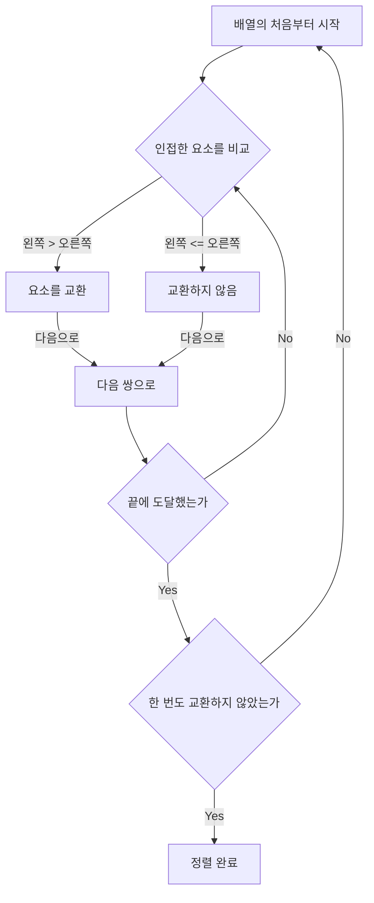
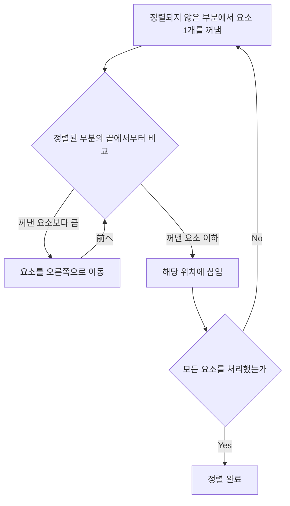
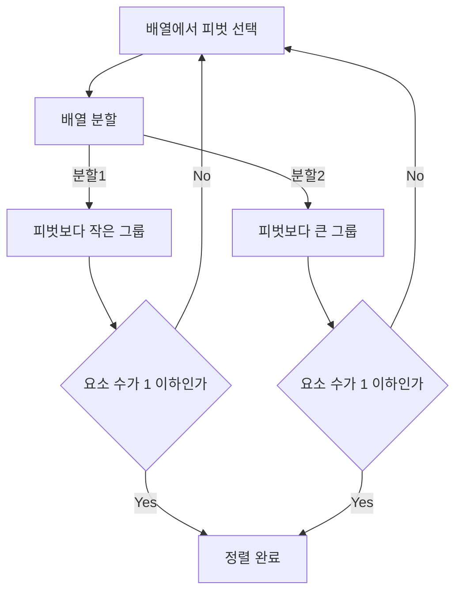
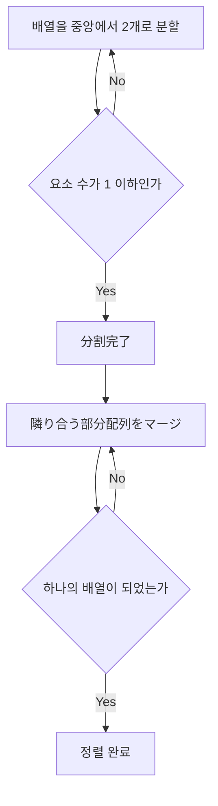

# 1. 시작하며: 정렬 알고리즘의 심오한 세계

컴퓨터 과학에서 데이터를 특정 순서(오름차순 또는 내림차순)로 재배치하는 '정렬(Sort)'은 가장 기본적이고 중요한 작업 중 하나입니다. 검색 속도 향상, 데이터 그룹화, 중복 감지 등 모든 데이터 처리의 사전 단계로서 정렬 알고리즘이 활약합니다.

이 글에서는 초보자도 이해하기 쉬운 간단한 알고리즘부터 실무에서 활약하는 고속 알고리즘까지, 대표적인 정렬 알고리즘을 망라하여 해설합니다. 각 알고리즘의 원리를 **Mermaid** 도해를 통해 시각적으로 이해하고, Python 코드로 실제 구현을 확인하며, 시간 복잡도 등 성능을 비교해 봅니다. 게다가 알고리즘의 동작을 완벽하게 파악하기 위해 요소 수 50개인 배열을 사용한 완전한 실행 추적(Trace)도 수록했습니다. 이를 통해 알고리즘의 세세한 동작을 손에 잡히듯 이해할 수 있을 것입니다.

## 알고리즘의 평가 지표

각 알고리즘을 평가할 때는 다음 지표가 중요합니다.

- **시간 복잡도 (Time Complexity)**: 데이터의 요소 수 $n$ 에 대해 처리 시간이 어떻게 증가하는지를 나타냅니다. $\text{O}(n^2)$ 이나 $\text{O}(n \log n)$ 등의 빅오 표기법(Big-O notation)이 사용됩니다. 수식 내에서 텍스트를 다룰 경우에는 $\text{best}$ 처럼 표기합니다.
- **공간 복잡도 (Space Complexity)**: 실행 시에 얼마나 많은 추가 메모리를 필요로 하는지를 나타냅니다. 제자리(In-place) 알고리즘은 추가 메모리를 거의 필요로 하지 않습니다.
- **안정성 (Stability)**: 같은 값을 가진 요소의 상대적인 순서가 정렬 전후로 유지되는지를 나타냅니다. 안정 정렬에서는 원래의 순서가 유지됩니다.

---

## 2. 버블 정렬 (Bubble Sort)

인접한 요소를 비교하여 순서가 역순이면 교환하는 작업을 반복하는 알고리즘입니다. 거품이 수면으로 떠오르는 것처럼, 큰 요소가 서서히 배열의 끝으로 이동해 갑니다.

### 계산량과 특성

- **시간 복잡도 (최선)**: $\text{O}(n)$
- **시간 복잡도 (평균)**: $\text{O}(n^2)$
- **시간 복잡도 (최악)**: $\text{O}(n^2)$
- **공간 복잡도**: $\text{O}(1)$
- **안정성**: 안정

### 도해 (Mermaid)



### Python 구현

```python
def bubble_sort(arr):
    n = len(arr)
    for i in range(n):
        swapped = False
        for j in range(0, n-i-1):
            if arr[j] > arr[j+1]:
                arr[j], arr[j+1] = arr[j+1], arr[j]
                swapped = True
        if not swapped:
            break
    return arr
```

### 버블 정렬의 상세 추적

요소 수 50개인 무작위 배열에 대해 버블 정렬을 실행했을 때, 각 패스 완료 후의 배열 상태를 보여줍니다. 버블 정렬이 어떻게 요소를 오른쪽으로 밀어내는지 관찰해 보세요.

**초기 상태**: `[83, 14, 64, 71, 83, 11, 36, 69, 72, 45, 93, 30, 14, 76, 72, 51, 19, 41, 56, 15, 63, 27, 87, 55, 58, 63, 46, 96, 43, 68, 32, 97, 48, 94, 56, 27, 68, 40, 66, 88, 58, 15, 84, 10, 40, 27, 34, 48, 78, 56]`

**패스 1 완료 후**: `[14, 64, 71, 83, 11, 36, 69, 72, 45, 83, 30, 14, 76, 72, 51, 19, 41, 56, 15, 63, 27, 87, 55, 58, 63, 46, 93, 43, 68, 32, 96, 48, 94, 56, 27, 68, 40, 66, 88, 58, 15, 84, 10, 40, 27, 34, 48, 78, 56, 97]`

이 패스에서는 정렬되지 않은 부분 중 가장 큰 요소가 마치 거품처럼 오른쪽 끝으로 떠올랐습니다. 버블 정렬의 특성상 1회의 패스마다 적어도 하나의 요소가 최종적으로 올바른 위치에 자리잡는 것이 보장됩니다. 따라서 패스를 거듭할수록 탐색 범위를 하나씩 좁혀나갈 수 있어 불필요한 비교 작업을 줄일 수 있습니다. 하지만 데이터가 완전히 역순으로 정렬된 최악의 경우, 모든 요소 쌍에 대해 교환 작업이 발생하므로 계산량은 $\text{O}(n^2)$ 에 달하여 성능이 매우 낮아집니다.

이 패스에서는 정렬되지 않은 부분 중 가장 큰 요소가 마치 거품처럼 오른쪽 끝으로 떠올랐습니다. 버블 정렬의 특성상 1회의 패스마다 적어도 하나의 요소가 최종적으로 올바른 위치에 자리잡는 것이 보장됩니다. 따라서 패스를 거듭할수록 탐색 범위를 하나씩 좁혀나갈 수 있어 불필요한 비교 작업을 줄일 수 있습니다. 하지만 데이터가 완전히 역순으로 정렬된 최악의 경우, 모든 요소 쌍에 대해 교환 작업이 발생하므로 계산량은 $\text{O}(n^2)$ 에 달하여 성능이 매우 낮아집니다.

**패스 2 완료 후**: `[14, 64, 71, 11, 36, 69, 72, 45, 83, 30, 14, 76, 72, 51, 19, 41, 56, 15, 63, 27, 83, 55, 58, 63, 46, 87, 43, 68, 32, 93, 48, 94, 56, 27, 68, 40, 66, 88, 58, 15, 84, 10, 40, 27, 34, 48, 78, 56, 96, 97]`

이 패스에서는 정렬되지 않은 부분 중 가장 큰 요소가 마치 거품처럼 오른쪽 끝으로 떠올랐습니다. 버블 정렬의 특성상 1회의 패스마다 적어도 하나의 요소가 최종적으로 올바른 위치에 자리잡는 것이 보장됩니다. 따라서 패스를 거듭할수록 탐색 범위를 하나씩 좁혀나갈 수 있어 불필요한 비교 작업을 줄일 수 있습니다. 하지만 데이터가 완전히 역순으로 정렬된 최악의 경우, 모든 요소 쌍에 대해 교환 작업이 발생하므로 계산량은 $\text{O}(n^2)$ 에 달하여 성능이 매우 낮아집니다.

이 패스에서는 정렬되지 않은 부분 중 가장 큰 요소가 마치 거품처럼 오른쪽 끝으로 떠올랐습니다. 버블 정렬의 특성상 1회의 패스마다 적어도 하나의 요소가 최종적으로 올바른 위치에 자리잡는 것이 보장됩니다. 따라서 패스를 거듭할수록 탐색 범위를 하나씩 좁혀나갈 수 있어 불필요한 비교 작업을 줄일 수 있습니다. 하지만 데이터가 완전히 역순으로 정렬된 최악의 경우, 모든 요소 쌍에 대해 교환 작업이 발생하므로 계산량은 $\text{O}(n^2)$ 에 달하여 성능이 매우 낮아집니다.

**패스 3 완료 후**: `[14, 64, 11, 36, 69, 71, 45, 72, 30, 14, 76, 72, 51, 19, 41, 56, 15, 63, 27, 83, 55, 58, 63, 46, 83, 43, 68, 32, 87, 48, 93, 56, 27, 68, 40, 66, 88, 58, 15, 84, 10, 40, 27, 34, 48, 78, 56, 94, 96, 97]`

이 패스에서는 정렬되지 않은 부분 중 가장 큰 요소가 마치 거품처럼 오른쪽 끝으로 떠올랐습니다. 버블 정렬의 특성상 1회의 패스마다 적어도 하나의 요소가 최종적으로 올바른 위치에 자리잡는 것이 보장됩니다. 따라서 패스를 거듭할수록 탐색 범위를 하나씩 좁혀나갈 수 있어 불필요한 비교 작업을 줄일 수 있습니다. 하지만 데이터가 완전히 역순으로 정렬된 최악의 경우, 모든 요소 쌍에 대해 교환 작업이 발생하므로 계산량은 $\text{O}(n^2)$ 에 달하여 성능이 매우 낮아집니다.

이 패스에서는 정렬되지 않은 부분 중 가장 큰 요소가 마치 거품처럼 오른쪽 끝으로 떠올랐습니다. 버블 정렬의 특성상 1회의 패스마다 적어도 하나의 요소가 최종적으로 올바른 위치에 자리잡는 것이 보장됩니다. 따라서 패스를 거듭할수록 탐색 범위를 하나씩 좁혀나갈 수 있어 불필요한 비교 작업을 줄일 수 있습니다. 하지만 데이터가 완전히 역순으로 정렬된 최악의 경우, 모든 요소 쌍에 대해 교환 작업이 발생하므로 계산량은 $\text{O}(n^2)$ 에 달하여 성능이 매우 낮아집니다.

**패스 4 완료 후**: `[14, 11, 36, 64, 69, 45, 71, 30, 14, 72, 72, 51, 19, 41, 56, 15, 63, 27, 76, 55, 58, 63, 46, 83, 43, 68, 32, 83, 48, 87, 56, 27, 68, 40, 66, 88, 58, 15, 84, 10, 40, 27, 34, 48, 78, 56, 93, 94, 96, 97]`

이 패스에서는 정렬되지 않은 부분 중 가장 큰 요소가 마치 거품처럼 오른쪽 끝으로 떠올랐습니다. 버블 정렬의 특성상 1회의 패스마다 적어도 하나의 요소가 최종적으로 올바른 위치에 자리잡는 것이 보장됩니다. 따라서 패스를 거듭할수록 탐색 범위를 하나씩 좁혀나갈 수 있어 불필요한 비교 작업을 줄일 수 있습니다. 하지만 데이터가 완전히 역순으로 정렬된 최악의 경우, 모든 요소 쌍에 대해 교환 작업이 발생하므로 계산량은 $\text{O}(n^2)$ 에 달하여 성능이 매우 낮아집니다.

이 패스에서는 정렬되지 않은 부분 중 가장 큰 요소가 마치 거품처럼 오른쪽 끝으로 떠올랐습니다. 버블 정렬의 특성상 1회의 패스마다 적어도 하나의 요소가 최종적으로 올바른 위치에 자리잡는 것이 보장됩니다. 따라서 패스를 거듭할수록 탐색 범위를 하나씩 좁혀나갈 수 있어 불필요한 비교 작업을 줄일 수 있습니다. 하지만 데이터가 완전히 역순으로 정렬된 최악의 경우, 모든 요소 쌍에 대해 교환 작업이 발생하므로 계산량은 $\text{O}(n^2)$ 에 달하여 성능이 매우 낮아집니다.

**패스 5 완료 후**: `[11, 14, 36, 64, 45, 69, 30, 14, 71, 72, 51, 19, 41, 56, 15, 63, 27, 72, 55, 58, 63, 46, 76, 43, 68, 32, 83, 48, 83, 56, 27, 68, 40, 66, 87, 58, 15, 84, 10, 40, 27, 34, 48, 78, 56, 88, 93, 94, 96, 97]`

이 패스에서는 정렬되지 않은 부분 중 가장 큰 요소가 마치 거품처럼 오른쪽 끝으로 떠올랐습니다. 버블 정렬의 특성상 1회의 패스마다 적어도 하나의 요소가 최종적으로 올바른 위치에 자리잡는 것이 보장됩니다. 따라서 패스를 거듭할수록 탐색 범위를 하나씩 좁혀나갈 수 있어 불필요한 비교 작업을 줄일 수 있습니다. 하지만 데이터가 완전히 역순으로 정렬된 최악의 경우, 모든 요소 쌍에 대해 교환 작업이 발생하므로 계산량은 $\text{O}(n^2)$ 에 달하여 성능이 매우 낮아집니다.

이 패스에서는 정렬되지 않은 부분 중 가장 큰 요소가 마치 거품처럼 오른쪽 끝으로 떠올랐습니다. 버블 정렬의 특성상 1회의 패스마다 적어도 하나의 요소가 최종적으로 올바른 위치에 자리잡는 것이 보장됩니다. 따라서 패스를 거듭할수록 탐색 범위를 하나씩 좁혀나갈 수 있어 불필요한 비교 작업을 줄일 수 있습니다. 하지만 데이터가 완전히 역순으로 정렬된 최악의 경우, 모든 요소 쌍에 대해 교환 작업이 발생하므로 계산량은 $\text{O}(n^2)$ 에 달하여 성능이 매우 낮아집니다.

**패스 6 완료 후**: `[11, 14, 36, 45, 64, 30, 14, 69, 71, 51, 19, 41, 56, 15, 63, 27, 72, 55, 58, 63, 46, 72, 43, 68, 32, 76, 48, 83, 56, 27, 68, 40, 66, 83, 58, 15, 84, 10, 40, 27, 34, 48, 78, 56, 87, 88, 93, 94, 96, 97]`

이 패스에서는 정렬되지 않은 부분 중 가장 큰 요소가 마치 거품처럼 오른쪽 끝으로 떠올랐습니다. 버블 정렬의 특성상 1회의 패스마다 적어도 하나의 요소가 최종적으로 올바른 위치에 자리잡는 것이 보장됩니다. 따라서 패스를 거듭할수록 탐색 범위를 하나씩 좁혀나갈 수 있어 불필요한 비교 작업을 줄일 수 있습니다. 하지만 데이터가 완전히 역순으로 정렬된 최악의 경우, 모든 요소 쌍에 대해 교환 작업이 발생하므로 계산량은 $\text{O}(n^2)$ 에 달하여 성능이 매우 낮아집니다.

이 패스에서는 정렬되지 않은 부분 중 가장 큰 요소가 마치 거품처럼 오른쪽 끝으로 떠올랐습니다. 버블 정렬의 특성상 1회의 패스마다 적어도 하나의 요소가 최종적으로 올바른 위치에 자리잡는 것이 보장됩니다. 따라서 패스를 거듭할수록 탐색 범위를 하나씩 좁혀나갈 수 있어 불필요한 비교 작업을 줄일 수 있습니다. 하지만 데이터가 완전히 역순으로 정렬된 최악의 경우, 모든 요소 쌍에 대해 교환 작업이 발생하므로 계산량은 $\text{O}(n^2)$ 에 달하여 성능이 매우 낮아집니다.

**패스 7 완료 후**: `[11, 14, 36, 45, 30, 14, 64, 69, 51, 19, 41, 56, 15, 63, 27, 71, 55, 58, 63, 46, 72, 43, 68, 32, 72, 48, 76, 56, 27, 68, 40, 66, 83, 58, 15, 83, 10, 40, 27, 34, 48, 78, 56, 84, 87, 88, 93, 94, 96, 97]`

이 패스에서는 정렬되지 않은 부분 중 가장 큰 요소가 마치 거품처럼 오른쪽 끝으로 떠올랐습니다. 버블 정렬의 특성상 1회의 패스마다 적어도 하나의 요소가 최종적으로 올바른 위치에 자리잡는 것이 보장됩니다. 따라서 패스를 거듭할수록 탐색 범위를 하나씩 좁혀나갈 수 있어 불필요한 비교 작업을 줄일 수 있습니다. 하지만 데이터가 완전히 역순으로 정렬된 최악의 경우, 모든 요소 쌍에 대해 교환 작업이 발생하므로 계산량은 $\text{O}(n^2)$ 에 달하여 성능이 매우 낮아집니다.

이 패스에서는 정렬되지 않은 부분 중 가장 큰 요소가 마치 거품처럼 오른쪽 끝으로 떠올랐습니다. 버블 정렬의 특성상 1회의 패스마다 적어도 하나의 요소가 최종적으로 올바른 위치에 자리잡는 것이 보장됩니다. 따라서 패스를 거듭할수록 탐색 범위를 하나씩 좁혀나갈 수 있어 불필요한 비교 작업을 줄일 수 있습니다. 하지만 데이터가 완전히 역순으로 정렬된 최악의 경우, 모든 요소 쌍에 대해 교환 작업이 발생하므로 계산량은 $\text{O}(n^2)$ 에 달하여 성능이 매우 낮아집니다.

**패스 8 완료 후**: `[11, 14, 36, 30, 14, 45, 64, 51, 19, 41, 56, 15, 63, 27, 69, 55, 58, 63, 46, 71, 43, 68, 32, 72, 48, 72, 56, 27, 68, 40, 66, 76, 58, 15, 83, 10, 40, 27, 34, 48, 78, 56, 83, 84, 87, 88, 93, 94, 96, 97]`

이 패스에서는 정렬되지 않은 부분 중 가장 큰 요소가 마치 거품처럼 오른쪽 끝으로 떠올랐습니다. 버블 정렬의 특성상 1회의 패스마다 적어도 하나의 요소가 최종적으로 올바른 위치에 자리잡는 것이 보장됩니다. 따라서 패스를 거듭할수록 탐색 범위를 하나씩 좁혀나갈 수 있어 불필요한 비교 작업을 줄일 수 있습니다. 하지만 데이터가 완전히 역순으로 정렬된 최악의 경우, 모든 요소 쌍에 대해 교환 작업이 발생하므로 계산량은 $\text{O}(n^2)$ 에 달하여 성능이 매우 낮아집니다.

이 패스에서는 정렬되지 않은 부분 중 가장 큰 요소가 마치 거품처럼 오른쪽 끝으로 떠올랐습니다. 버블 정렬의 특성상 1회의 패스마다 적어도 하나의 요소가 최종적으로 올바른 위치에 자리잡는 것이 보장됩니다. 따라서 패스를 거듭할수록 탐색 범위를 하나씩 좁혀나갈 수 있어 불필요한 비교 작업을 줄일 수 있습니다. 하지만 데이터가 완전히 역순으로 정렬된 최악의 경우, 모든 요소 쌍에 대해 교환 작업이 발생하므로 계산량은 $\text{O}(n^2)$ 에 달하여 성능이 매우 낮아집니다.

**패스 9 완료 후**: `[11, 14, 30, 14, 36, 45, 51, 19, 41, 56, 15, 63, 27, 64, 55, 58, 63, 46, 69, 43, 68, 32, 71, 48, 72, 56, 27, 68, 40, 66, 72, 58, 15, 76, 10, 40, 27, 34, 48, 78, 56, 83, 83, 84, 87, 88, 93, 94, 96, 97]`

이 패스에서는 정렬되지 않은 부분 중 가장 큰 요소가 마치 거품처럼 오른쪽 끝으로 떠올랐습니다. 버블 정렬의 특성상 1회의 패스마다 적어도 하나의 요소가 최종적으로 올바른 위치에 자리잡는 것이 보장됩니다. 따라서 패스를 거듭할수록 탐색 범위를 하나씩 좁혀나갈 수 있어 불필요한 비교 작업을 줄일 수 있습니다. 하지만 데이터가 완전히 역순으로 정렬된 최악의 경우, 모든 요소 쌍에 대해 교환 작업이 발생하므로 계산량은 $\text{O}(n^2)$ 에 달하여 성능이 매우 낮아집니다.

이 패스에서는 정렬되지 않은 부분 중 가장 큰 요소가 마치 거품처럼 오른쪽 끝으로 떠올랐습니다. 버블 정렬의 특성상 1회의 패스마다 적어도 하나의 요소가 최종적으로 올바른 위치에 자리잡는 것이 보장됩니다. 따라서 패스를 거듭할수록 탐색 범위를 하나씩 좁혀나갈 수 있어 불필요한 비교 작업을 줄일 수 있습니다. 하지만 데이터가 완전히 역순으로 정렬된 최악의 경우, 모든 요소 쌍에 대해 교환 작업이 발생하므로 계산량은 $\text{O}(n^2)$ 에 달하여 성능이 매우 낮아집니다.

**패스 10 완료 후**: `[11, 14, 14, 30, 36, 45, 19, 41, 51, 15, 56, 27, 63, 55, 58, 63, 46, 64, 43, 68, 32, 69, 48, 71, 56, 27, 68, 40, 66, 72, 58, 15, 72, 10, 40, 27, 34, 48, 76, 56, 78, 83, 83, 84, 87, 88, 93, 94, 96, 97]`

이 패스에서는 정렬되지 않은 부분 중 가장 큰 요소가 마치 거품처럼 오른쪽 끝으로 떠올랐습니다. 버블 정렬의 특성상 1회의 패스마다 적어도 하나의 요소가 최종적으로 올바른 위치에 자리잡는 것이 보장됩니다. 따라서 패스를 거듭할수록 탐색 범위를 하나씩 좁혀나갈 수 있어 불필요한 비교 작업을 줄일 수 있습니다. 하지만 데이터가 완전히 역순으로 정렬된 최악의 경우, 모든 요소 쌍에 대해 교환 작업이 발생하므로 계산량은 $\text{O}(n^2)$ 에 달하여 성능이 매우 낮아집니다.

이 패스에서는 정렬되지 않은 부분 중 가장 큰 요소가 마치 거품처럼 오른쪽 끝으로 떠올랐습니다. 버블 정렬의 특성상 1회의 패스마다 적어도 하나의 요소가 최종적으로 올바른 위치에 자리잡는 것이 보장됩니다. 따라서 패스를 거듭할수록 탐색 범위를 하나씩 좁혀나갈 수 있어 불필요한 비교 작업을 줄일 수 있습니다. 하지만 데이터가 완전히 역순으로 정렬된 최악의 경우, 모든 요소 쌍에 대해 교환 작업이 발생하므로 계산량은 $\text{O}(n^2)$ 에 달하여 성능이 매우 낮아집니다.

**패스 11 완료 후**: `[11, 14, 14, 30, 36, 19, 41, 45, 15, 51, 27, 56, 55, 58, 63, 46, 63, 43, 64, 32, 68, 48, 69, 56, 27, 68, 40, 66, 71, 58, 15, 72, 10, 40, 27, 34, 48, 72, 56, 76, 78, 83, 83, 84, 87, 88, 93, 94, 96, 97]`

이 패스에서는 정렬되지 않은 부분 중 가장 큰 요소가 마치 거품처럼 오른쪽 끝으로 떠올랐습니다. 버블 정렬의 특성상 1회의 패스마다 적어도 하나의 요소가 최종적으로 올바른 위치에 자리잡는 것이 보장됩니다. 따라서 패스를 거듭할수록 탐색 범위를 하나씩 좁혀나갈 수 있어 불필요한 비교 작업을 줄일 수 있습니다. 하지만 데이터가 완전히 역순으로 정렬된 최악의 경우, 모든 요소 쌍에 대해 교환 작업이 발생하므로 계산량은 $\text{O}(n^2)$ 에 달하여 성능이 매우 낮아집니다.

이 패스에서는 정렬되지 않은 부분 중 가장 큰 요소가 마치 거품처럼 오른쪽 끝으로 떠올랐습니다. 버블 정렬의 특성상 1회의 패스마다 적어도 하나의 요소가 최종적으로 올바른 위치에 자리잡는 것이 보장됩니다. 따라서 패스를 거듭할수록 탐색 범위를 하나씩 좁혀나갈 수 있어 불필요한 비교 작업을 줄일 수 있습니다. 하지만 데이터가 완전히 역순으로 정렬된 최악의 경우, 모든 요소 쌍에 대해 교환 작업이 발생하므로 계산량은 $\text{O}(n^2)$ 에 달하여 성능이 매우 낮아집니다.

**패스 12 완료 후**: `[11, 14, 14, 30, 19, 36, 41, 15, 45, 27, 51, 55, 56, 58, 46, 63, 43, 63, 32, 64, 48, 68, 56, 27, 68, 40, 66, 69, 58, 15, 71, 10, 40, 27, 34, 48, 72, 56, 72, 76, 78, 83, 83, 84, 87, 88, 93, 94, 96, 97]`

이 패스에서는 정렬되지 않은 부분 중 가장 큰 요소가 마치 거품처럼 오른쪽 끝으로 떠올랐습니다. 버블 정렬의 특성상 1회의 패스마다 적어도 하나의 요소가 최종적으로 올바른 위치에 자리잡는 것이 보장됩니다. 따라서 패스를 거듭할수록 탐색 범위를 하나씩 좁혀나갈 수 있어 불필요한 비교 작업을 줄일 수 있습니다. 하지만 데이터가 완전히 역순으로 정렬된 최악의 경우, 모든 요소 쌍에 대해 교환 작업이 발생하므로 계산량은 $\text{O}(n^2)$ 에 달하여 성능이 매우 낮아집니다.

이 패스에서는 정렬되지 않은 부분 중 가장 큰 요소가 마치 거품처럼 오른쪽 끝으로 떠올랐습니다. 버블 정렬의 특성상 1회의 패스마다 적어도 하나의 요소가 최종적으로 올바른 위치에 자리잡는 것이 보장됩니다. 따라서 패스를 거듭할수록 탐색 범위를 하나씩 좁혀나갈 수 있어 불필요한 비교 작업을 줄일 수 있습니다. 하지만 데이터가 완전히 역순으로 정렬된 최악의 경우, 모든 요소 쌍에 대해 교환 작업이 발생하므로 계산량은 $\text{O}(n^2)$ 에 달하여 성능이 매우 낮아집니다.

**패스 13 완료 후**: `[11, 14, 14, 19, 30, 36, 15, 41, 27, 45, 51, 55, 56, 46, 58, 43, 63, 32, 63, 48, 64, 56, 27, 68, 40, 66, 68, 58, 15, 69, 10, 40, 27, 34, 48, 71, 56, 72, 72, 76, 78, 83, 83, 84, 87, 88, 93, 94, 96, 97]`

이 패스에서는 정렬되지 않은 부분 중 가장 큰 요소가 마치 거품처럼 오른쪽 끝으로 떠올랐습니다. 버블 정렬의 특성상 1회의 패스마다 적어도 하나의 요소가 최종적으로 올바른 위치에 자리잡는 것이 보장됩니다. 따라서 패스를 거듭할수록 탐색 범위를 하나씩 좁혀나갈 수 있어 불필요한 비교 작업을 줄일 수 있습니다. 하지만 데이터가 완전히 역순으로 정렬된 최악의 경우, 모든 요소 쌍에 대해 교환 작업이 발생하므로 계산량은 $\text{O}(n^2)$ 에 달하여 성능이 매우 낮아집니다.

이 패스에서는 정렬되지 않은 부분 중 가장 큰 요소가 마치 거품처럼 오른쪽 끝으로 떠올랐습니다. 버블 정렬의 특성상 1회의 패스마다 적어도 하나의 요소가 최종적으로 올바른 위치에 자리잡는 것이 보장됩니다. 따라서 패스를 거듭할수록 탐색 범위를 하나씩 좁혀나갈 수 있어 불필요한 비교 작업을 줄일 수 있습니다. 하지만 데이터가 완전히 역순으로 정렬된 최악의 경우, 모든 요소 쌍에 대해 교환 작업이 발생하므로 계산량은 $\text{O}(n^2)$ 에 달하여 성능이 매우 낮아집니다.

**패스 14 완료 후**: `[11, 14, 14, 19, 30, 15, 36, 27, 41, 45, 51, 55, 46, 56, 43, 58, 32, 63, 48, 63, 56, 27, 64, 40, 66, 68, 58, 15, 68, 10, 40, 27, 34, 48, 69, 56, 71, 72, 72, 76, 78, 83, 83, 84, 87, 88, 93, 94, 96, 97]`

이 패스에서는 정렬되지 않은 부분 중 가장 큰 요소가 마치 거품처럼 오른쪽 끝으로 떠올랐습니다. 버블 정렬의 특성상 1회의 패스마다 적어도 하나의 요소가 최종적으로 올바른 위치에 자리잡는 것이 보장됩니다. 따라서 패스를 거듭할수록 탐색 범위를 하나씩 좁혀나갈 수 있어 불필요한 비교 작업을 줄일 수 있습니다. 하지만 데이터가 완전히 역순으로 정렬된 최악의 경우, 모든 요소 쌍에 대해 교환 작업이 발생하므로 계산량은 $\text{O}(n^2)$ 에 달하여 성능이 매우 낮아집니다.

이 패스에서는 정렬되지 않은 부분 중 가장 큰 요소가 마치 거품처럼 오른쪽 끝으로 떠올랐습니다. 버블 정렬의 특성상 1회의 패스마다 적어도 하나의 요소가 최종적으로 올바른 위치에 자리잡는 것이 보장됩니다. 따라서 패스를 거듭할수록 탐색 범위를 하나씩 좁혀나갈 수 있어 불필요한 비교 작업을 줄일 수 있습니다. 하지만 데이터가 완전히 역순으로 정렬된 최악의 경우, 모든 요소 쌍에 대해 교환 작업이 발생하므로 계산량은 $\text{O}(n^2)$ 에 달하여 성능이 매우 낮아집니다.

**패스 15 완료 후**: `[11, 14, 14, 19, 15, 30, 27, 36, 41, 45, 51, 46, 55, 43, 56, 32, 58, 48, 63, 56, 27, 63, 40, 64, 66, 58, 15, 68, 10, 40, 27, 34, 48, 68, 56, 69, 71, 72, 72, 76, 78, 83, 83, 84, 87, 88, 93, 94, 96, 97]`

이 패스에서는 정렬되지 않은 부분 중 가장 큰 요소가 마치 거품처럼 오른쪽 끝으로 떠올랐습니다. 버블 정렬의 특성상 1회의 패스마다 적어도 하나의 요소가 최종적으로 올바른 위치에 자리잡는 것이 보장됩니다. 따라서 패스를 거듭할수록 탐색 범위를 하나씩 좁혀나갈 수 있어 불필요한 비교 작업을 줄일 수 있습니다. 하지만 데이터가 완전히 역순으로 정렬된 최악의 경우, 모든 요소 쌍에 대해 교환 작업이 발생하므로 계산량은 $\text{O}(n^2)$ 에 달하여 성능이 매우 낮아집니다.

이 패스에서는 정렬되지 않은 부분 중 가장 큰 요소가 마치 거품처럼 오른쪽 끝으로 떠올랐습니다. 버블 정렬의 특성상 1회의 패스마다 적어도 하나의 요소가 최종적으로 올바른 위치에 자리잡는 것이 보장됩니다. 따라서 패스를 거듭할수록 탐색 범위를 하나씩 좁혀나갈 수 있어 불필요한 비교 작업을 줄일 수 있습니다. 하지만 데이터가 완전히 역순으로 정렬된 최악의 경우, 모든 요소 쌍에 대해 교환 작업이 발생하므로 계산량은 $\text{O}(n^2)$ 에 달하여 성능이 매우 낮아집니다.

**패스 16 완료 후**: `[11, 14, 14, 15, 19, 27, 30, 36, 41, 45, 46, 51, 43, 55, 32, 56, 48, 58, 56, 27, 63, 40, 63, 64, 58, 15, 66, 10, 40, 27, 34, 48, 68, 56, 68, 69, 71, 72, 72, 76, 78, 83, 83, 84, 87, 88, 93, 94, 96, 97]`

이 패스에서는 정렬되지 않은 부분 중 가장 큰 요소가 마치 거품처럼 오른쪽 끝으로 떠올랐습니다. 버블 정렬의 특성상 1회의 패스마다 적어도 하나의 요소가 최종적으로 올바른 위치에 자리잡는 것이 보장됩니다. 따라서 패스를 거듭할수록 탐색 범위를 하나씩 좁혀나갈 수 있어 불필요한 비교 작업을 줄일 수 있습니다. 하지만 데이터가 완전히 역순으로 정렬된 최악의 경우, 모든 요소 쌍에 대해 교환 작업이 발생하므로 계산량은 $\text{O}(n^2)$ 에 달하여 성능이 매우 낮아집니다.

이 패스에서는 정렬되지 않은 부분 중 가장 큰 요소가 마치 거품처럼 오른쪽 끝으로 떠올랐습니다. 버블 정렬의 특성상 1회의 패스마다 적어도 하나의 요소가 최종적으로 올바른 위치에 자리잡는 것이 보장됩니다. 따라서 패스를 거듭할수록 탐색 범위를 하나씩 좁혀나갈 수 있어 불필요한 비교 작업을 줄일 수 있습니다. 하지만 데이터가 완전히 역순으로 정렬된 최악의 경우, 모든 요소 쌍에 대해 교환 작업이 발생하므로 계산량은 $\text{O}(n^2)$ 에 달하여 성능이 매우 낮아집니다.

**패스 17 완료 후**: `[11, 14, 14, 15, 19, 27, 30, 36, 41, 45, 46, 43, 51, 32, 55, 48, 56, 56, 27, 58, 40, 63, 63, 58, 15, 64, 10, 40, 27, 34, 48, 66, 56, 68, 68, 69, 71, 72, 72, 76, 78, 83, 83, 84, 87, 88, 93, 94, 96, 97]`

이 패스에서는 정렬되지 않은 부분 중 가장 큰 요소가 마치 거품처럼 오른쪽 끝으로 떠올랐습니다. 버블 정렬의 특성상 1회의 패스마다 적어도 하나의 요소가 최종적으로 올바른 위치에 자리잡는 것이 보장됩니다. 따라서 패스를 거듭할수록 탐색 범위를 하나씩 좁혀나갈 수 있어 불필요한 비교 작업을 줄일 수 있습니다. 하지만 데이터가 완전히 역순으로 정렬된 최악의 경우, 모든 요소 쌍에 대해 교환 작업이 발생하므로 계산량은 $\text{O}(n^2)$ 에 달하여 성능이 매우 낮아집니다.

이 패스에서는 정렬되지 않은 부분 중 가장 큰 요소가 마치 거품처럼 오른쪽 끝으로 떠올랐습니다. 버블 정렬의 특성상 1회의 패스마다 적어도 하나의 요소가 최종적으로 올바른 위치에 자리잡는 것이 보장됩니다. 따라서 패스를 거듭할수록 탐색 범위를 하나씩 좁혀나갈 수 있어 불필요한 비교 작업을 줄일 수 있습니다. 하지만 데이터가 완전히 역순으로 정렬된 최악의 경우, 모든 요소 쌍에 대해 교환 작업이 발생하므로 계산량은 $\text{O}(n^2)$ 에 달하여 성능이 매우 낮아집니다.

**패스 18 완료 후**: `[11, 14, 14, 15, 19, 27, 30, 36, 41, 45, 43, 46, 32, 51, 48, 55, 56, 27, 56, 40, 58, 63, 58, 15, 63, 10, 40, 27, 34, 48, 64, 56, 66, 68, 68, 69, 71, 72, 72, 76, 78, 83, 83, 84, 87, 88, 93, 94, 96, 97]`

이 패스에서는 정렬되지 않은 부분 중 가장 큰 요소가 마치 거품처럼 오른쪽 끝으로 떠올랐습니다. 버블 정렬의 특성상 1회의 패스마다 적어도 하나의 요소가 최종적으로 올바른 위치에 자리잡는 것이 보장됩니다. 따라서 패스를 거듭할수록 탐색 범위를 하나씩 좁혀나갈 수 있어 불필요한 비교 작업을 줄일 수 있습니다. 하지만 데이터가 완전히 역순으로 정렬된 최악의 경우, 모든 요소 쌍에 대해 교환 작업이 발생하므로 계산량은 $\text{O}(n^2)$ 에 달하여 성능이 매우 낮아집니다.

이 패스에서는 정렬되지 않은 부분 중 가장 큰 요소가 마치 거품처럼 오른쪽 끝으로 떠올랐습니다. 버블 정렬의 특성상 1회의 패스마다 적어도 하나의 요소가 최종적으로 올바른 위치에 자리잡는 것이 보장됩니다. 따라서 패스를 거듭할수록 탐색 범위를 하나씩 좁혀나갈 수 있어 불필요한 비교 작업을 줄일 수 있습니다. 하지만 데이터가 완전히 역순으로 정렬된 최악의 경우, 모든 요소 쌍에 대해 교환 작업이 발생하므로 계산량은 $\text{O}(n^2)$ 에 달하여 성능이 매우 낮아집니다.

**패스 19 완료 후**: `[11, 14, 14, 15, 19, 27, 30, 36, 41, 43, 45, 32, 46, 48, 51, 55, 27, 56, 40, 56, 58, 58, 15, 63, 10, 40, 27, 34, 48, 63, 56, 64, 66, 68, 68, 69, 71, 72, 72, 76, 78, 83, 83, 84, 87, 88, 93, 94, 96, 97]`

이 패스에서는 정렬되지 않은 부분 중 가장 큰 요소가 마치 거품처럼 오른쪽 끝으로 떠올랐습니다. 버블 정렬의 특성상 1회의 패스마다 적어도 하나의 요소가 최종적으로 올바른 위치에 자리잡는 것이 보장됩니다. 따라서 패스를 거듭할수록 탐색 범위를 하나씩 좁혀나갈 수 있어 불필요한 비교 작업을 줄일 수 있습니다. 하지만 데이터가 완전히 역순으로 정렬된 최악의 경우, 모든 요소 쌍에 대해 교환 작업이 발생하므로 계산량은 $\text{O}(n^2)$ 에 달하여 성능이 매우 낮아집니다.

이 패스에서는 정렬되지 않은 부분 중 가장 큰 요소가 마치 거품처럼 오른쪽 끝으로 떠올랐습니다. 버블 정렬의 특성상 1회의 패스마다 적어도 하나의 요소가 최종적으로 올바른 위치에 자리잡는 것이 보장됩니다. 따라서 패스를 거듭할수록 탐색 범위를 하나씩 좁혀나갈 수 있어 불필요한 비교 작업을 줄일 수 있습니다. 하지만 데이터가 완전히 역순으로 정렬된 최악의 경우, 모든 요소 쌍에 대해 교환 작업이 발생하므로 계산량은 $\text{O}(n^2)$ 에 달하여 성능이 매우 낮아집니다.

**패스 20 완료 후**: `[11, 14, 14, 15, 19, 27, 30, 36, 41, 43, 32, 45, 46, 48, 51, 27, 55, 40, 56, 56, 58, 15, 58, 10, 40, 27, 34, 48, 63, 56, 63, 64, 66, 68, 68, 69, 71, 72, 72, 76, 78, 83, 83, 84, 87, 88, 93, 94, 96, 97]`

이 패스에서는 정렬되지 않은 부분 중 가장 큰 요소가 마치 거품처럼 오른쪽 끝으로 떠올랐습니다. 버블 정렬의 특성상 1회의 패스마다 적어도 하나의 요소가 최종적으로 올바른 위치에 자리잡는 것이 보장됩니다. 따라서 패스를 거듭할수록 탐색 범위를 하나씩 좁혀나갈 수 있어 불필요한 비교 작업을 줄일 수 있습니다. 하지만 데이터가 완전히 역순으로 정렬된 최악의 경우, 모든 요소 쌍에 대해 교환 작업이 발생하므로 계산량은 $\text{O}(n^2)$ 에 달하여 성능이 매우 낮아집니다.

이 패스에서는 정렬되지 않은 부분 중 가장 큰 요소가 마치 거품처럼 오른쪽 끝으로 떠올랐습니다. 버블 정렬의 특성상 1회의 패스마다 적어도 하나의 요소가 최종적으로 올바른 위치에 자리잡는 것이 보장됩니다. 따라서 패스를 거듭할수록 탐색 범위를 하나씩 좁혀나갈 수 있어 불필요한 비교 작업을 줄일 수 있습니다. 하지만 데이터가 완전히 역순으로 정렬된 최악의 경우, 모든 요소 쌍에 대해 교환 작업이 발생하므로 계산량은 $\text{O}(n^2)$ 에 달하여 성능이 매우 낮아집니다.

**패스 21 완료 후**: `[11, 14, 14, 15, 19, 27, 30, 36, 41, 32, 43, 45, 46, 48, 27, 51, 40, 55, 56, 56, 15, 58, 10, 40, 27, 34, 48, 58, 56, 63, 63, 64, 66, 68, 68, 69, 71, 72, 72, 76, 78, 83, 83, 84, 87, 88, 93, 94, 96, 97]`

이 패스에서는 정렬되지 않은 부분 중 가장 큰 요소가 마치 거품처럼 오른쪽 끝으로 떠올랐습니다. 버블 정렬의 특성상 1회의 패스마다 적어도 하나의 요소가 최종적으로 올바른 위치에 자리잡는 것이 보장됩니다. 따라서 패스를 거듭할수록 탐색 범위를 하나씩 좁혀나갈 수 있어 불필요한 비교 작업을 줄일 수 있습니다. 하지만 데이터가 완전히 역순으로 정렬된 최악의 경우, 모든 요소 쌍에 대해 교환 작업이 발생하므로 계산량은 $\text{O}(n^2)$ 에 달하여 성능이 매우 낮아집니다.

이 패스에서는 정렬되지 않은 부분 중 가장 큰 요소가 마치 거품처럼 오른쪽 끝으로 떠올랐습니다. 버블 정렬의 특성상 1회의 패스마다 적어도 하나의 요소가 최종적으로 올바른 위치에 자리잡는 것이 보장됩니다. 따라서 패스를 거듭할수록 탐색 범위를 하나씩 좁혀나갈 수 있어 불필요한 비교 작업을 줄일 수 있습니다. 하지만 데이터가 완전히 역순으로 정렬된 최악의 경우, 모든 요소 쌍에 대해 교환 작업이 발생하므로 계산량은 $\text{O}(n^2)$ 에 달하여 성능이 매우 낮아집니다.

**패스 22 완료 후**: `[11, 14, 14, 15, 19, 27, 30, 36, 32, 41, 43, 45, 46, 27, 48, 40, 51, 55, 56, 15, 56, 10, 40, 27, 34, 48, 58, 56, 58, 63, 63, 64, 66, 68, 68, 69, 71, 72, 72, 76, 78, 83, 83, 84, 87, 88, 93, 94, 96, 97]`

이 패스에서는 정렬되지 않은 부분 중 가장 큰 요소가 마치 거품처럼 오른쪽 끝으로 떠올랐습니다. 버블 정렬의 특성상 1회의 패스마다 적어도 하나의 요소가 최종적으로 올바른 위치에 자리잡는 것이 보장됩니다. 따라서 패스를 거듭할수록 탐색 범위를 하나씩 좁혀나갈 수 있어 불필요한 비교 작업을 줄일 수 있습니다. 하지만 데이터가 완전히 역순으로 정렬된 최악의 경우, 모든 요소 쌍에 대해 교환 작업이 발생하므로 계산량은 $\text{O}(n^2)$ 에 달하여 성능이 매우 낮아집니다.

이 패스에서는 정렬되지 않은 부분 중 가장 큰 요소가 마치 거품처럼 오른쪽 끝으로 떠올랐습니다. 버블 정렬의 특성상 1회의 패스마다 적어도 하나의 요소가 최종적으로 올바른 위치에 자리잡는 것이 보장됩니다. 따라서 패스를 거듭할수록 탐색 범위를 하나씩 좁혀나갈 수 있어 불필요한 비교 작업을 줄일 수 있습니다. 하지만 데이터가 완전히 역순으로 정렬된 최악의 경우, 모든 요소 쌍에 대해 교환 작업이 발생하므로 계산량은 $\text{O}(n^2)$ 에 달하여 성능이 매우 낮아집니다.

**패스 23 완료 후**: `[11, 14, 14, 15, 19, 27, 30, 32, 36, 41, 43, 45, 27, 46, 40, 48, 51, 55, 15, 56, 10, 40, 27, 34, 48, 56, 56, 58, 58, 63, 63, 64, 66, 68, 68, 69, 71, 72, 72, 76, 78, 83, 83, 84, 87, 88, 93, 94, 96, 97]`

이 패스에서는 정렬되지 않은 부분 중 가장 큰 요소가 마치 거품처럼 오른쪽 끝으로 떠올랐습니다. 버블 정렬의 특성상 1회의 패스마다 적어도 하나의 요소가 최종적으로 올바른 위치에 자리잡는 것이 보장됩니다. 따라서 패스를 거듭할수록 탐색 범위를 하나씩 좁혀나갈 수 있어 불필요한 비교 작업을 줄일 수 있습니다. 하지만 데이터가 완전히 역순으로 정렬된 최악의 경우, 모든 요소 쌍에 대해 교환 작업이 발생하므로 계산량은 $\text{O}(n^2)$ 에 달하여 성능이 매우 낮아집니다.

이 패스에서는 정렬되지 않은 부분 중 가장 큰 요소가 마치 거품처럼 오른쪽 끝으로 떠올랐습니다. 버블 정렬의 특성상 1회의 패스마다 적어도 하나의 요소가 최종적으로 올바른 위치에 자리잡는 것이 보장됩니다. 따라서 패스를 거듭할수록 탐색 범위를 하나씩 좁혀나갈 수 있어 불필요한 비교 작업을 줄일 수 있습니다. 하지만 데이터가 완전히 역순으로 정렬된 최악의 경우, 모든 요소 쌍에 대해 교환 작업이 발생하므로 계산량은 $\text{O}(n^2)$ 에 달하여 성능이 매우 낮아집니다.

**패스 24 완료 후**: `[11, 14, 14, 15, 19, 27, 30, 32, 36, 41, 43, 27, 45, 40, 46, 48, 51, 15, 55, 10, 40, 27, 34, 48, 56, 56, 56, 58, 58, 63, 63, 64, 66, 68, 68, 69, 71, 72, 72, 76, 78, 83, 83, 84, 87, 88, 93, 94, 96, 97]`

이 패스에서는 정렬되지 않은 부분 중 가장 큰 요소가 마치 거품처럼 오른쪽 끝으로 떠올랐습니다. 버블 정렬의 특성상 1회의 패스마다 적어도 하나의 요소가 최종적으로 올바른 위치에 자리잡는 것이 보장됩니다. 따라서 패스를 거듭할수록 탐색 범위를 하나씩 좁혀나갈 수 있어 불필요한 비교 작업을 줄일 수 있습니다. 하지만 데이터가 완전히 역순으로 정렬된 최악의 경우, 모든 요소 쌍에 대해 교환 작업이 발생하므로 계산량은 $\text{O}(n^2)$ 에 달하여 성능이 매우 낮아집니다.

이 패스에서는 정렬되지 않은 부분 중 가장 큰 요소가 마치 거품처럼 오른쪽 끝으로 떠올랐습니다. 버블 정렬의 특성상 1회의 패스마다 적어도 하나의 요소가 최종적으로 올바른 위치에 자리잡는 것이 보장됩니다. 따라서 패스를 거듭할수록 탐색 범위를 하나씩 좁혀나갈 수 있어 불필요한 비교 작업을 줄일 수 있습니다. 하지만 데이터가 완전히 역순으로 정렬된 최악의 경우, 모든 요소 쌍에 대해 교환 작업이 발생하므로 계산량은 $\text{O}(n^2)$ 에 달하여 성능이 매우 낮아집니다.

**패스 25 완료 후**: `[11, 14, 14, 15, 19, 27, 30, 32, 36, 41, 27, 43, 40, 45, 46, 48, 15, 51, 10, 40, 27, 34, 48, 55, 56, 56, 56, 58, 58, 63, 63, 64, 66, 68, 68, 69, 71, 72, 72, 76, 78, 83, 83, 84, 87, 88, 93, 94, 96, 97]`

이 패스에서는 정렬되지 않은 부분 중 가장 큰 요소가 마치 거품처럼 오른쪽 끝으로 떠올랐습니다. 버블 정렬의 특성상 1회의 패스마다 적어도 하나의 요소가 최종적으로 올바른 위치에 자리잡는 것이 보장됩니다. 따라서 패스를 거듭할수록 탐색 범위를 하나씩 좁혀나갈 수 있어 불필요한 비교 작업을 줄일 수 있습니다. 하지만 데이터가 완전히 역순으로 정렬된 최악의 경우, 모든 요소 쌍에 대해 교환 작업이 발생하므로 계산량은 $\text{O}(n^2)$ 에 달하여 성능이 매우 낮아집니다.

이 패스에서는 정렬되지 않은 부분 중 가장 큰 요소가 마치 거품처럼 오른쪽 끝으로 떠올랐습니다. 버블 정렬의 특성상 1회의 패스마다 적어도 하나의 요소가 최종적으로 올바른 위치에 자리잡는 것이 보장됩니다. 따라서 패스를 거듭할수록 탐색 범위를 하나씩 좁혀나갈 수 있어 불필요한 비교 작업을 줄일 수 있습니다. 하지만 데이터가 완전히 역순으로 정렬된 최악의 경우, 모든 요소 쌍에 대해 교환 작업이 발생하므로 계산량은 $\text{O}(n^2)$ 에 달하여 성능이 매우 낮아집니다.

**패스 26 완료 후**: `[11, 14, 14, 15, 19, 27, 30, 32, 36, 27, 41, 40, 43, 45, 46, 15, 48, 10, 40, 27, 34, 48, 51, 55, 56, 56, 56, 58, 58, 63, 63, 64, 66, 68, 68, 69, 71, 72, 72, 76, 78, 83, 83, 84, 87, 88, 93, 94, 96, 97]`

이 패스에서는 정렬되지 않은 부분 중 가장 큰 요소가 마치 거품처럼 오른쪽 끝으로 떠올랐습니다. 버블 정렬의 특성상 1회의 패스마다 적어도 하나의 요소가 최종적으로 올바른 위치에 자리잡는 것이 보장됩니다. 따라서 패스를 거듭할수록 탐색 범위를 하나씩 좁혀나갈 수 있어 불필요한 비교 작업을 줄일 수 있습니다. 하지만 데이터가 완전히 역순으로 정렬된 최악의 경우, 모든 요소 쌍에 대해 교환 작업이 발생하므로 계산량은 $\text{O}(n^2)$ 에 달하여 성능이 매우 낮아집니다.

이 패스에서는 정렬되지 않은 부분 중 가장 큰 요소가 마치 거품처럼 오른쪽 끝으로 떠올랐습니다. 버블 정렬의 특성상 1회의 패스마다 적어도 하나의 요소가 최종적으로 올바른 위치에 자리잡는 것이 보장됩니다. 따라서 패스를 거듭할수록 탐색 범위를 하나씩 좁혀나갈 수 있어 불필요한 비교 작업을 줄일 수 있습니다. 하지만 데이터가 완전히 역순으로 정렬된 최악의 경우, 모든 요소 쌍에 대해 교환 작업이 발생하므로 계산량은 $\text{O}(n^2)$ 에 달하여 성능이 매우 낮아집니다.

**패스 27 완료 후**: `[11, 14, 14, 15, 19, 27, 30, 32, 27, 36, 40, 41, 43, 45, 15, 46, 10, 40, 27, 34, 48, 48, 51, 55, 56, 56, 56, 58, 58, 63, 63, 64, 66, 68, 68, 69, 71, 72, 72, 76, 78, 83, 83, 84, 87, 88, 93, 94, 96, 97]`

이 패스에서는 정렬되지 않은 부분 중 가장 큰 요소가 마치 거품처럼 오른쪽 끝으로 떠올랐습니다. 버블 정렬의 특성상 1회의 패스마다 적어도 하나의 요소가 최종적으로 올바른 위치에 자리잡는 것이 보장됩니다. 따라서 패스를 거듭할수록 탐색 범위를 하나씩 좁혀나갈 수 있어 불필요한 비교 작업을 줄일 수 있습니다. 하지만 데이터가 완전히 역순으로 정렬된 최악의 경우, 모든 요소 쌍에 대해 교환 작업이 발생하므로 계산량은 $\text{O}(n^2)$ 에 달하여 성능이 매우 낮아집니다.

이 패스에서는 정렬되지 않은 부분 중 가장 큰 요소가 마치 거품처럼 오른쪽 끝으로 떠올랐습니다. 버블 정렬의 특성상 1회의 패스마다 적어도 하나의 요소가 최종적으로 올바른 위치에 자리잡는 것이 보장됩니다. 따라서 패스를 거듭할수록 탐색 범위를 하나씩 좁혀나갈 수 있어 불필요한 비교 작업을 줄일 수 있습니다. 하지만 데이터가 완전히 역순으로 정렬된 최악의 경우, 모든 요소 쌍에 대해 교환 작업이 발생하므로 계산량은 $\text{O}(n^2)$ 에 달하여 성능이 매우 낮아집니다.

**패스 28 완료 후**: `[11, 14, 14, 15, 19, 27, 30, 27, 32, 36, 40, 41, 43, 15, 45, 10, 40, 27, 34, 46, 48, 48, 51, 55, 56, 56, 56, 58, 58, 63, 63, 64, 66, 68, 68, 69, 71, 72, 72, 76, 78, 83, 83, 84, 87, 88, 93, 94, 96, 97]`

이 패스에서는 정렬되지 않은 부분 중 가장 큰 요소가 마치 거품처럼 오른쪽 끝으로 떠올랐습니다. 버블 정렬의 특성상 1회의 패스마다 적어도 하나의 요소가 최종적으로 올바른 위치에 자리잡는 것이 보장됩니다. 따라서 패스를 거듭할수록 탐색 범위를 하나씩 좁혀나갈 수 있어 불필요한 비교 작업을 줄일 수 있습니다. 하지만 데이터가 완전히 역순으로 정렬된 최악의 경우, 모든 요소 쌍에 대해 교환 작업이 발생하므로 계산량은 $\text{O}(n^2)$ 에 달하여 성능이 매우 낮아집니다.

이 패스에서는 정렬되지 않은 부분 중 가장 큰 요소가 마치 거품처럼 오른쪽 끝으로 떠올랐습니다. 버블 정렬의 특성상 1회의 패스마다 적어도 하나의 요소가 최종적으로 올바른 위치에 자리잡는 것이 보장됩니다. 따라서 패스를 거듭할수록 탐색 범위를 하나씩 좁혀나갈 수 있어 불필요한 비교 작업을 줄일 수 있습니다. 하지만 데이터가 완전히 역순으로 정렬된 최악의 경우, 모든 요소 쌍에 대해 교환 작업이 발생하므로 계산량은 $\text{O}(n^2)$ 에 달하여 성능이 매우 낮아집니다.

**패스 29 완료 후**: `[11, 14, 14, 15, 19, 27, 27, 30, 32, 36, 40, 41, 15, 43, 10, 40, 27, 34, 45, 46, 48, 48, 51, 55, 56, 56, 56, 58, 58, 63, 63, 64, 66, 68, 68, 69, 71, 72, 72, 76, 78, 83, 83, 84, 87, 88, 93, 94, 96, 97]`

이 패스에서는 정렬되지 않은 부분 중 가장 큰 요소가 마치 거품처럼 오른쪽 끝으로 떠올랐습니다. 버블 정렬의 특성상 1회의 패스마다 적어도 하나의 요소가 최종적으로 올바른 위치에 자리잡는 것이 보장됩니다. 따라서 패스를 거듭할수록 탐색 범위를 하나씩 좁혀나갈 수 있어 불필요한 비교 작업을 줄일 수 있습니다. 하지만 데이터가 완전히 역순으로 정렬된 최악의 경우, 모든 요소 쌍에 대해 교환 작업이 발생하므로 계산량은 $\text{O}(n^2)$ 에 달하여 성능이 매우 낮아집니다.

이 패스에서는 정렬되지 않은 부분 중 가장 큰 요소가 마치 거품처럼 오른쪽 끝으로 떠올랐습니다. 버블 정렬의 특성상 1회의 패스마다 적어도 하나의 요소가 최종적으로 올바른 위치에 자리잡는 것이 보장됩니다. 따라서 패스를 거듭할수록 탐색 범위를 하나씩 좁혀나갈 수 있어 불필요한 비교 작업을 줄일 수 있습니다. 하지만 데이터가 완전히 역순으로 정렬된 최악의 경우, 모든 요소 쌍에 대해 교환 작업이 발생하므로 계산량은 $\text{O}(n^2)$ 에 달하여 성능이 매우 낮아집니다.

**패스 30 완료 후**: `[11, 14, 14, 15, 19, 27, 27, 30, 32, 36, 40, 15, 41, 10, 40, 27, 34, 43, 45, 46, 48, 48, 51, 55, 56, 56, 56, 58, 58, 63, 63, 64, 66, 68, 68, 69, 71, 72, 72, 76, 78, 83, 83, 84, 87, 88, 93, 94, 96, 97]`

이 패스에서는 정렬되지 않은 부분 중 가장 큰 요소가 마치 거품처럼 오른쪽 끝으로 떠올랐습니다. 버블 정렬의 특성상 1회의 패스마다 적어도 하나의 요소가 최종적으로 올바른 위치에 자리잡는 것이 보장됩니다. 따라서 패스를 거듭할수록 탐색 범위를 하나씩 좁혀나갈 수 있어 불필요한 비교 작업을 줄일 수 있습니다. 하지만 데이터가 완전히 역순으로 정렬된 최악의 경우, 모든 요소 쌍에 대해 교환 작업이 발생하므로 계산량은 $\text{O}(n^2)$ 에 달하여 성능이 매우 낮아집니다.

이 패스에서는 정렬되지 않은 부분 중 가장 큰 요소가 마치 거품처럼 오른쪽 끝으로 떠올랐습니다. 버블 정렬의 특성상 1회의 패스마다 적어도 하나의 요소가 최종적으로 올바른 위치에 자리잡는 것이 보장됩니다. 따라서 패스를 거듭할수록 탐색 범위를 하나씩 좁혀나갈 수 있어 불필요한 비교 작업을 줄일 수 있습니다. 하지만 데이터가 완전히 역순으로 정렬된 최악의 경우, 모든 요소 쌍에 대해 교환 작업이 발생하므로 계산량은 $\text{O}(n^2)$ 에 달하여 성능이 매우 낮아집니다.

**패스 31 완료 후**: `[11, 14, 14, 15, 19, 27, 27, 30, 32, 36, 15, 40, 10, 40, 27, 34, 41, 43, 45, 46, 48, 48, 51, 55, 56, 56, 56, 58, 58, 63, 63, 64, 66, 68, 68, 69, 71, 72, 72, 76, 78, 83, 83, 84, 87, 88, 93, 94, 96, 97]`

이 패스에서는 정렬되지 않은 부분 중 가장 큰 요소가 마치 거품처럼 오른쪽 끝으로 떠올랐습니다. 버블 정렬의 특성상 1회의 패스마다 적어도 하나의 요소가 최종적으로 올바른 위치에 자리잡는 것이 보장됩니다. 따라서 패스를 거듭할수록 탐색 범위를 하나씩 좁혀나갈 수 있어 불필요한 비교 작업을 줄일 수 있습니다. 하지만 데이터가 완전히 역순으로 정렬된 최악의 경우, 모든 요소 쌍에 대해 교환 작업이 발생하므로 계산량은 $\text{O}(n^2)$ 에 달하여 성능이 매우 낮아집니다.

이 패스에서는 정렬되지 않은 부분 중 가장 큰 요소가 마치 거품처럼 오른쪽 끝으로 떠올랐습니다. 버블 정렬의 특성상 1회의 패스마다 적어도 하나의 요소가 최종적으로 올바른 위치에 자리잡는 것이 보장됩니다. 따라서 패스를 거듭할수록 탐색 범위를 하나씩 좁혀나갈 수 있어 불필요한 비교 작업을 줄일 수 있습니다. 하지만 데이터가 완전히 역순으로 정렬된 최악의 경우, 모든 요소 쌍에 대해 교환 작업이 발생하므로 계산량은 $\text{O}(n^2)$ 에 달하여 성능이 매우 낮아집니다.

**패스 32 완료 후**: `[11, 14, 14, 15, 19, 27, 27, 30, 32, 15, 36, 10, 40, 27, 34, 40, 41, 43, 45, 46, 48, 48, 51, 55, 56, 56, 56, 58, 58, 63, 63, 64, 66, 68, 68, 69, 71, 72, 72, 76, 78, 83, 83, 84, 87, 88, 93, 94, 96, 97]`

이 패스에서는 정렬되지 않은 부분 중 가장 큰 요소가 마치 거품처럼 오른쪽 끝으로 떠올랐습니다. 버블 정렬의 특성상 1회의 패스마다 적어도 하나의 요소가 최종적으로 올바른 위치에 자리잡는 것이 보장됩니다. 따라서 패스를 거듭할수록 탐색 범위를 하나씩 좁혀나갈 수 있어 불필요한 비교 작업을 줄일 수 있습니다. 하지만 데이터가 완전히 역순으로 정렬된 최악의 경우, 모든 요소 쌍에 대해 교환 작업이 발생하므로 계산량은 $\text{O}(n^2)$ 에 달하여 성능이 매우 낮아집니다.

이 패스에서는 정렬되지 않은 부분 중 가장 큰 요소가 마치 거품처럼 오른쪽 끝으로 떠올랐습니다. 버블 정렬의 특성상 1회의 패스마다 적어도 하나의 요소가 최종적으로 올바른 위치에 자리잡는 것이 보장됩니다. 따라서 패스를 거듭할수록 탐색 범위를 하나씩 좁혀나갈 수 있어 불필요한 비교 작업을 줄일 수 있습니다. 하지만 데이터가 완전히 역순으로 정렬된 최악의 경우, 모든 요소 쌍에 대해 교환 작업이 발생하므로 계산량은 $\text{O}(n^2)$ 에 달하여 성능이 매우 낮아집니다.

**패스 33 완료 후**: `[11, 14, 14, 15, 19, 27, 27, 30, 15, 32, 10, 36, 27, 34, 40, 40, 41, 43, 45, 46, 48, 48, 51, 55, 56, 56, 56, 58, 58, 63, 63, 64, 66, 68, 68, 69, 71, 72, 72, 76, 78, 83, 83, 84, 87, 88, 93, 94, 96, 97]`

이 패스에서는 정렬되지 않은 부분 중 가장 큰 요소가 마치 거품처럼 오른쪽 끝으로 떠올랐습니다. 버블 정렬의 특성상 1회의 패스마다 적어도 하나의 요소가 최종적으로 올바른 위치에 자리잡는 것이 보장됩니다. 따라서 패스를 거듭할수록 탐색 범위를 하나씩 좁혀나갈 수 있어 불필요한 비교 작업을 줄일 수 있습니다. 하지만 데이터가 완전히 역순으로 정렬된 최악의 경우, 모든 요소 쌍에 대해 교환 작업이 발생하므로 계산량은 $\text{O}(n^2)$ 에 달하여 성능이 매우 낮아집니다.

이 패스에서는 정렬되지 않은 부분 중 가장 큰 요소가 마치 거품처럼 오른쪽 끝으로 떠올랐습니다. 버블 정렬의 특성상 1회의 패스마다 적어도 하나의 요소가 최종적으로 올바른 위치에 자리잡는 것이 보장됩니다. 따라서 패스를 거듭할수록 탐색 범위를 하나씩 좁혀나갈 수 있어 불필요한 비교 작업을 줄일 수 있습니다. 하지만 데이터가 완전히 역순으로 정렬된 최악의 경우, 모든 요소 쌍에 대해 교환 작업이 발생하므로 계산량은 $\text{O}(n^2)$ 에 달하여 성능이 매우 낮아집니다.

**패스 34 완료 후**: `[11, 14, 14, 15, 19, 27, 27, 15, 30, 10, 32, 27, 34, 36, 40, 40, 41, 43, 45, 46, 48, 48, 51, 55, 56, 56, 56, 58, 58, 63, 63, 64, 66, 68, 68, 69, 71, 72, 72, 76, 78, 83, 83, 84, 87, 88, 93, 94, 96, 97]`

이 패스에서는 정렬되지 않은 부분 중 가장 큰 요소가 마치 거품처럼 오른쪽 끝으로 떠올랐습니다. 버블 정렬의 특성상 1회의 패스마다 적어도 하나의 요소가 최종적으로 올바른 위치에 자리잡는 것이 보장됩니다. 따라서 패스를 거듭할수록 탐색 범위를 하나씩 좁혀나갈 수 있어 불필요한 비교 작업을 줄일 수 있습니다. 하지만 데이터가 완전히 역순으로 정렬된 최악의 경우, 모든 요소 쌍에 대해 교환 작업이 발생하므로 계산량은 $\text{O}(n^2)$ 에 달하여 성능이 매우 낮아집니다.

이 패스에서는 정렬되지 않은 부분 중 가장 큰 요소가 마치 거품처럼 오른쪽 끝으로 떠올랐습니다. 버블 정렬의 특성상 1회의 패스마다 적어도 하나의 요소가 최종적으로 올바른 위치에 자리잡는 것이 보장됩니다. 따라서 패스를 거듭할수록 탐색 범위를 하나씩 좁혀나갈 수 있어 불필요한 비교 작업을 줄일 수 있습니다. 하지만 데이터가 완전히 역순으로 정렬된 최악의 경우, 모든 요소 쌍에 대해 교환 작업이 발생하므로 계산량은 $\text{O}(n^2)$ 에 달하여 성능이 매우 낮아집니다.

**패스 35 완료 후**: `[11, 14, 14, 15, 19, 27, 15, 27, 10, 30, 27, 32, 34, 36, 40, 40, 41, 43, 45, 46, 48, 48, 51, 55, 56, 56, 56, 58, 58, 63, 63, 64, 66, 68, 68, 69, 71, 72, 72, 76, 78, 83, 83, 84, 87, 88, 93, 94, 96, 97]`

이 패스에서는 정렬되지 않은 부분 중 가장 큰 요소가 마치 거품처럼 오른쪽 끝으로 떠올랐습니다. 버블 정렬의 특성상 1회의 패스마다 적어도 하나의 요소가 최종적으로 올바른 위치에 자리잡는 것이 보장됩니다. 따라서 패스를 거듭할수록 탐색 범위를 하나씩 좁혀나갈 수 있어 불필요한 비교 작업을 줄일 수 있습니다. 하지만 데이터가 완전히 역순으로 정렬된 최악의 경우, 모든 요소 쌍에 대해 교환 작업이 발생하므로 계산량은 $\text{O}(n^2)$ 에 달하여 성능이 매우 낮아집니다.

이 패스에서는 정렬되지 않은 부분 중 가장 큰 요소가 마치 거품처럼 오른쪽 끝으로 떠올랐습니다. 버블 정렬의 특성상 1회의 패스마다 적어도 하나의 요소가 최종적으로 올바른 위치에 자리잡는 것이 보장됩니다. 따라서 패스를 거듭할수록 탐색 범위를 하나씩 좁혀나갈 수 있어 불필요한 비교 작업을 줄일 수 있습니다. 하지만 데이터가 완전히 역순으로 정렬된 최악의 경우, 모든 요소 쌍에 대해 교환 작업이 발생하므로 계산량은 $\text{O}(n^2)$ 에 달하여 성능이 매우 낮아집니다.

**패스 36 완료 후**: `[11, 14, 14, 15, 19, 15, 27, 10, 27, 27, 30, 32, 34, 36, 40, 40, 41, 43, 45, 46, 48, 48, 51, 55, 56, 56, 56, 58, 58, 63, 63, 64, 66, 68, 68, 69, 71, 72, 72, 76, 78, 83, 83, 84, 87, 88, 93, 94, 96, 97]`

이 패스에서는 정렬되지 않은 부분 중 가장 큰 요소가 마치 거품처럼 오른쪽 끝으로 떠올랐습니다. 버블 정렬의 특성상 1회의 패스마다 적어도 하나의 요소가 최종적으로 올바른 위치에 자리잡는 것이 보장됩니다. 따라서 패스를 거듭할수록 탐색 범위를 하나씩 좁혀나갈 수 있어 불필요한 비교 작업을 줄일 수 있습니다. 하지만 데이터가 완전히 역순으로 정렬된 최악의 경우, 모든 요소 쌍에 대해 교환 작업이 발생하므로 계산량은 $\text{O}(n^2)$ 에 달하여 성능이 매우 낮아집니다.

이 패스에서는 정렬되지 않은 부분 중 가장 큰 요소가 마치 거품처럼 오른쪽 끝으로 떠올랐습니다. 버블 정렬의 특성상 1회의 패스마다 적어도 하나의 요소가 최종적으로 올바른 위치에 자리잡는 것이 보장됩니다. 따라서 패스를 거듭할수록 탐색 범위를 하나씩 좁혀나갈 수 있어 불필요한 비교 작업을 줄일 수 있습니다. 하지만 데이터가 완전히 역순으로 정렬된 최악의 경우, 모든 요소 쌍에 대해 교환 작업이 발생하므로 계산량은 $\text{O}(n^2)$ 에 달하여 성능이 매우 낮아집니다.

**패스 37 완료 후**: `[11, 14, 14, 15, 15, 19, 10, 27, 27, 27, 30, 32, 34, 36, 40, 40, 41, 43, 45, 46, 48, 48, 51, 55, 56, 56, 56, 58, 58, 63, 63, 64, 66, 68, 68, 69, 71, 72, 72, 76, 78, 83, 83, 84, 87, 88, 93, 94, 96, 97]`

이 패스에서는 정렬되지 않은 부분 중 가장 큰 요소가 마치 거품처럼 오른쪽 끝으로 떠올랐습니다. 버블 정렬의 특성상 1회의 패스마다 적어도 하나의 요소가 최종적으로 올바른 위치에 자리잡는 것이 보장됩니다. 따라서 패스를 거듭할수록 탐색 범위를 하나씩 좁혀나갈 수 있어 불필요한 비교 작업을 줄일 수 있습니다. 하지만 데이터가 완전히 역순으로 정렬된 최악의 경우, 모든 요소 쌍에 대해 교환 작업이 발생하므로 계산량은 $\text{O}(n^2)$ 에 달하여 성능이 매우 낮아집니다.

이 패스에서는 정렬되지 않은 부분 중 가장 큰 요소가 마치 거품처럼 오른쪽 끝으로 떠올랐습니다. 버블 정렬의 특성상 1회의 패스마다 적어도 하나의 요소가 최종적으로 올바른 위치에 자리잡는 것이 보장됩니다. 따라서 패스를 거듭할수록 탐색 범위를 하나씩 좁혀나갈 수 있어 불필요한 비교 작업을 줄일 수 있습니다. 하지만 데이터가 완전히 역순으로 정렬된 최악의 경우, 모든 요소 쌍에 대해 교환 작업이 발생하므로 계산량은 $\text{O}(n^2)$ 에 달하여 성능이 매우 낮아집니다.

**패스 38 완료 후**: `[11, 14, 14, 15, 15, 10, 19, 27, 27, 27, 30, 32, 34, 36, 40, 40, 41, 43, 45, 46, 48, 48, 51, 55, 56, 56, 56, 58, 58, 63, 63, 64, 66, 68, 68, 69, 71, 72, 72, 76, 78, 83, 83, 84, 87, 88, 93, 94, 96, 97]`

이 패스에서는 정렬되지 않은 부분 중 가장 큰 요소가 마치 거품처럼 오른쪽 끝으로 떠올랐습니다. 버블 정렬의 특성상 1회의 패스마다 적어도 하나의 요소가 최종적으로 올바른 위치에 자리잡는 것이 보장됩니다. 따라서 패스를 거듭할수록 탐색 범위를 하나씩 좁혀나갈 수 있어 불필요한 비교 작업을 줄일 수 있습니다. 하지만 데이터가 완전히 역순으로 정렬된 최악의 경우, 모든 요소 쌍에 대해 교환 작업이 발생하므로 계산량은 $\text{O}(n^2)$ 에 달하여 성능이 매우 낮아집니다.

이 패스에서는 정렬되지 않은 부분 중 가장 큰 요소가 마치 거품처럼 오른쪽 끝으로 떠올랐습니다. 버블 정렬의 특성상 1회의 패스마다 적어도 하나의 요소가 최종적으로 올바른 위치에 자리잡는 것이 보장됩니다. 따라서 패스를 거듭할수록 탐색 범위를 하나씩 좁혀나갈 수 있어 불필요한 비교 작업을 줄일 수 있습니다. 하지만 데이터가 완전히 역순으로 정렬된 최악의 경우, 모든 요소 쌍에 대해 교환 작업이 발생하므로 계산량은 $\text{O}(n^2)$ 에 달하여 성능이 매우 낮아집니다.

**패스 39 완료 후**: `[11, 14, 14, 15, 10, 15, 19, 27, 27, 27, 30, 32, 34, 36, 40, 40, 41, 43, 45, 46, 48, 48, 51, 55, 56, 56, 56, 58, 58, 63, 63, 64, 66, 68, 68, 69, 71, 72, 72, 76, 78, 83, 83, 84, 87, 88, 93, 94, 96, 97]`

이 패스에서는 정렬되지 않은 부분 중 가장 큰 요소가 마치 거품처럼 오른쪽 끝으로 떠올랐습니다. 버블 정렬의 특성상 1회의 패스마다 적어도 하나의 요소가 최종적으로 올바른 위치에 자리잡는 것이 보장됩니다. 따라서 패스를 거듭할수록 탐색 범위를 하나씩 좁혀나갈 수 있어 불필요한 비교 작업을 줄일 수 있습니다. 하지만 데이터가 완전히 역순으로 정렬된 최악의 경우, 모든 요소 쌍에 대해 교환 작업이 발생하므로 계산량은 $\text{O}(n^2)$ 에 달하여 성능이 매우 낮아집니다.

이 패스에서는 정렬되지 않은 부분 중 가장 큰 요소가 마치 거품처럼 오른쪽 끝으로 떠올랐습니다. 버블 정렬의 특성상 1회의 패스마다 적어도 하나의 요소가 최종적으로 올바른 위치에 자리잡는 것이 보장됩니다. 따라서 패스를 거듭할수록 탐색 범위를 하나씩 좁혀나갈 수 있어 불필요한 비교 작업을 줄일 수 있습니다. 하지만 데이터가 완전히 역순으로 정렬된 최악의 경우, 모든 요소 쌍에 대해 교환 작업이 발생하므로 계산량은 $\text{O}(n^2)$ 에 달하여 성능이 매우 낮아집니다.

**패스 40 완료 후**: `[11, 14, 14, 10, 15, 15, 19, 27, 27, 27, 30, 32, 34, 36, 40, 40, 41, 43, 45, 46, 48, 48, 51, 55, 56, 56, 56, 58, 58, 63, 63, 64, 66, 68, 68, 69, 71, 72, 72, 76, 78, 83, 83, 84, 87, 88, 93, 94, 96, 97]`

이 패스에서는 정렬되지 않은 부분 중 가장 큰 요소가 마치 거품처럼 오른쪽 끝으로 떠올랐습니다. 버블 정렬의 특성상 1회의 패스마다 적어도 하나의 요소가 최종적으로 올바른 위치에 자리잡는 것이 보장됩니다. 따라서 패스를 거듭할수록 탐색 범위를 하나씩 좁혀나갈 수 있어 불필요한 비교 작업을 줄일 수 있습니다. 하지만 데이터가 완전히 역순으로 정렬된 최악의 경우, 모든 요소 쌍에 대해 교환 작업이 발생하므로 계산량은 $\text{O}(n^2)$ 에 달하여 성능이 매우 낮아집니다.

이 패스에서는 정렬되지 않은 부분 중 가장 큰 요소가 마치 거품처럼 오른쪽 끝으로 떠올랐습니다. 버블 정렬의 특성상 1회의 패스마다 적어도 하나의 요소가 최종적으로 올바른 위치에 자리잡는 것이 보장됩니다. 따라서 패스를 거듭할수록 탐색 범위를 하나씩 좁혀나갈 수 있어 불필요한 비교 작업을 줄일 수 있습니다. 하지만 데이터가 완전히 역순으로 정렬된 최악의 경우, 모든 요소 쌍에 대해 교환 작업이 발생하므로 계산량은 $\text{O}(n^2)$ 에 달하여 성능이 매우 낮아집니다.

**패스 41 완료 후**: `[11, 14, 10, 14, 15, 15, 19, 27, 27, 27, 30, 32, 34, 36, 40, 40, 41, 43, 45, 46, 48, 48, 51, 55, 56, 56, 56, 58, 58, 63, 63, 64, 66, 68, 68, 69, 71, 72, 72, 76, 78, 83, 83, 84, 87, 88, 93, 94, 96, 97]`

이 패스에서는 정렬되지 않은 부분 중 가장 큰 요소가 마치 거품처럼 오른쪽 끝으로 떠올랐습니다. 버블 정렬의 특성상 1회의 패스마다 적어도 하나의 요소가 최종적으로 올바른 위치에 자리잡는 것이 보장됩니다. 따라서 패스를 거듭할수록 탐색 범위를 하나씩 좁혀나갈 수 있어 불필요한 비교 작업을 줄일 수 있습니다. 하지만 데이터가 완전히 역순으로 정렬된 최악의 경우, 모든 요소 쌍에 대해 교환 작업이 발생하므로 계산량은 $\text{O}(n^2)$ 에 달하여 성능이 매우 낮아집니다.

이 패스에서는 정렬되지 않은 부분 중 가장 큰 요소가 마치 거품처럼 오른쪽 끝으로 떠올랐습니다. 버블 정렬의 특성상 1회의 패스마다 적어도 하나의 요소가 최종적으로 올바른 위치에 자리잡는 것이 보장됩니다. 따라서 패스를 거듭할수록 탐색 범위를 하나씩 좁혀나갈 수 있어 불필요한 비교 작업을 줄일 수 있습니다. 하지만 데이터가 완전히 역순으로 정렬된 최악의 경우, 모든 요소 쌍에 대해 교환 작업이 발생하므로 계산량은 $\text{O}(n^2)$ 에 달하여 성능이 매우 낮아집니다.

**패스 42 완료 후**: `[11, 10, 14, 14, 15, 15, 19, 27, 27, 27, 30, 32, 34, 36, 40, 40, 41, 43, 45, 46, 48, 48, 51, 55, 56, 56, 56, 58, 58, 63, 63, 64, 66, 68, 68, 69, 71, 72, 72, 76, 78, 83, 83, 84, 87, 88, 93, 94, 96, 97]`

이 패스에서는 정렬되지 않은 부분 중 가장 큰 요소가 마치 거품처럼 오른쪽 끝으로 떠올랐습니다. 버블 정렬의 특성상 1회의 패스마다 적어도 하나의 요소가 최종적으로 올바른 위치에 자리잡는 것이 보장됩니다. 따라서 패스를 거듭할수록 탐색 범위를 하나씩 좁혀나갈 수 있어 불필요한 비교 작업을 줄일 수 있습니다. 하지만 데이터가 완전히 역순으로 정렬된 최악의 경우, 모든 요소 쌍에 대해 교환 작업이 발생하므로 계산량은 $\text{O}(n^2)$ 에 달하여 성능이 매우 낮아집니다.

이 패스에서는 정렬되지 않은 부분 중 가장 큰 요소가 마치 거품처럼 오른쪽 끝으로 떠올랐습니다. 버블 정렬의 특성상 1회의 패스마다 적어도 하나의 요소가 최종적으로 올바른 위치에 자리잡는 것이 보장됩니다. 따라서 패스를 거듭할수록 탐색 범위를 하나씩 좁혀나갈 수 있어 불필요한 비교 작업을 줄일 수 있습니다. 하지만 데이터가 완전히 역순으로 정렬된 최악의 경우, 모든 요소 쌍에 대해 교환 작업이 발생하므로 계산량은 $\text{O}(n^2)$ 에 달하여 성능이 매우 낮아집니다.

**패스 43 완료 후**: `[10, 11, 14, 14, 15, 15, 19, 27, 27, 27, 30, 32, 34, 36, 40, 40, 41, 43, 45, 46, 48, 48, 51, 55, 56, 56, 56, 58, 58, 63, 63, 64, 66, 68, 68, 69, 71, 72, 72, 76, 78, 83, 83, 84, 87, 88, 93, 94, 96, 97]`

이 패스에서는 정렬되지 않은 부분 중 가장 큰 요소가 마치 거품처럼 오른쪽 끝으로 떠올랐습니다. 버블 정렬의 특성상 1회의 패스마다 적어도 하나의 요소가 최종적으로 올바른 위치에 자리잡는 것이 보장됩니다. 따라서 패스를 거듭할수록 탐색 범위를 하나씩 좁혀나갈 수 있어 불필요한 비교 작업을 줄일 수 있습니다. 하지만 데이터가 완전히 역순으로 정렬된 최악의 경우, 모든 요소 쌍에 대해 교환 작업이 발생하므로 계산량은 $\text{O}(n^2)$ 에 달하여 성능이 매우 낮아집니다.

이 패스에서는 정렬되지 않은 부분 중 가장 큰 요소가 마치 거품처럼 오른쪽 끝으로 떠올랐습니다. 버블 정렬의 특성상 1회의 패스마다 적어도 하나의 요소가 최종적으로 올바른 위치에 자리잡는 것이 보장됩니다. 따라서 패스를 거듭할수록 탐색 범위를 하나씩 좁혀나갈 수 있어 불필요한 비교 작업을 줄일 수 있습니다. 하지만 데이터가 완전히 역순으로 정렬된 최악의 경우, 모든 요소 쌍에 대해 교환 작업이 발생하므로 계산량은 $\text{O}(n^2)$ 에 달하여 성능이 매우 낮아집니다.

**패스 44 완료 후**: `[10, 11, 14, 14, 15, 15, 19, 27, 27, 27, 30, 32, 34, 36, 40, 40, 41, 43, 45, 46, 48, 48, 51, 55, 56, 56, 56, 58, 58, 63, 63, 64, 66, 68, 68, 69, 71, 72, 72, 76, 78, 83, 83, 84, 87, 88, 93, 94, 96, 97]`

이 패스에서는 정렬되지 않은 부분 중 가장 큰 요소가 마치 거품처럼 오른쪽 끝으로 떠올랐습니다. 버블 정렬의 특성상 1회의 패스마다 적어도 하나의 요소가 최종적으로 올바른 위치에 자리잡는 것이 보장됩니다. 따라서 패스를 거듭할수록 탐색 범위를 하나씩 좁혀나갈 수 있어 불필요한 비교 작업을 줄일 수 있습니다. 하지만 데이터가 완전히 역순으로 정렬된 최악의 경우, 모든 요소 쌍에 대해 교환 작업이 발생하므로 계산량은 $\text{O}(n^2)$ 에 달하여 성능이 매우 낮아집니다.

이 패스에서는 정렬되지 않은 부분 중 가장 큰 요소가 마치 거품처럼 오른쪽 끝으로 떠올랐습니다. 버블 정렬의 특성상 1회의 패스마다 적어도 하나의 요소가 최종적으로 올바른 위치에 자리잡는 것이 보장됩니다. 따라서 패스를 거듭할수록 탐색 범위를 하나씩 좁혀나갈 수 있어 불필요한 비교 작업을 줄일 수 있습니다. 하지만 데이터가 완전히 역순으로 정렬된 최악의 경우, 모든 요소 쌍에 대해 교환 작업이 발생하므로 계산량은 $\text{O}(n^2)$ 에 달하여 성능이 매우 낮아집니다.

패스 44에서 교환이 발생하지 않았으므로, 정렬 완료로 판단하고 종료합니다.

## 3. 삽입 정렬 (Insertion Sort)

손 안의 트럼프 카드를 정렬할 때처럼, 정렬되지 않은 부분에서 요소를 하나씩 꺼내 정렬된 부분의 적절한 위치에 삽입해 나가는 알고리즘입니다.

### 계산량과 특성

- **시간 복잡도 (최선)**: $\text{O}(n)$
- **시간 복잡도 (평균)**: $\text{O}(n^2)$
- **시간 복잡도 (최악)**: $\text{O}(n^2)$
- **공간 복잡도**: $\text{O}(1)$
- **안정성**: 안정

### 도해 (Mermaid)



### Python 구현

```python
def insertion_sort(arr):
    for i in range(1, len(arr)):
        key = arr[i]
        j = i - 1
        while j >= 0 and key < arr[j]:
            arr[j + 1] = arr[j]
            j -= 1
        arr[j + 1] = key
    return arr
```

### 삽입 정렬의 상세 추적

요소 수 50개인 무작위 배열에 대해 삽입 정렬을 실행했을 때, 각 요소 삽입 후의 배열 상태를 보여줍니다. 왼쪽의 정렬된 부분이 서서히 확대되는 모습을 확인할 수 있습니다.

**초기 상태**: `[97, 29, 43, 96, 91, 22, 51, 83, 31, 13, 62, 62, 19, 23, 26, 50, 70, 84, 67, 62, 36, 35, 50, 90, 97, 52, 52, 64, 21, 90, 76, 72, 61, 20, 36, 83, 41, 14, 35, 22, 20, 34, 42, 98, 46, 49, 98, 42, 30, 89]`

**ステップ 1 (要素 29 を挿入後)**: `[29, 97, 43, 96, 91, 22, 51, 83, 31, 13, 62, 62, 19, 23, 26, 50, 70, 84, 67, 62, 36, 35, 50, 90, 97, 52, 52, 64, 21, 90, 76, 72, 61, 20, 36, 83, 41, 14, 35, 22, 20, 34, 42, 98, 46, 49, 98, 42, 30, 89]`

삽입 정렬은 이미 정렬되어 있는 배열에 대해서는 $\text{O}(n)$ 의 시간으로 완료된다는 훌륭한 특성을 가지고 있습니다. 데이터 양이 적거나 대부분 정렬된 데이터에 대해서는 상수배 오버헤드가 작기 때문에 퀵 정렬이나 병합 정렬보다 빠르게 동작하는 경우가 많습니다. 이러한 특성을 살려 많은 표준 라이브러리(Python의 TimSort 등)에서는 재귀의 끝부분처럼 데이터 크기가 작은 경우에 삽입 정렬로 전환하는 하이브리드 방식이 채택되고 있습니다.

삽입 정렬은 이미 정렬되어 있는 배열에 대해서는 $\text{O}(n)$ 의 시간으로 완료된다는 훌륭한 특성을 가지고 있습니다. 데이터 양이 적거나 대부분 정렬된 데이터에 대해서는 상수배 오버헤드가 작기 때문에 퀵 정렬이나 병합 정렬보다 빠르게 동작하는 경우가 많습니다. 이러한 특성을 살려 많은 표준 라이브러리(Python의 TimSort 등)에서는 재귀의 끝부분처럼 데이터 크기가 작은 경우에 삽입 정렬로 전환하는 하이브리드 방식이 채택되고 있습니다.

**ステップ 2 (要素 43 を挿入後)**: `[29, 43, 97, 96, 91, 22, 51, 83, 31, 13, 62, 62, 19, 23, 26, 50, 70, 84, 67, 62, 36, 35, 50, 90, 97, 52, 52, 64, 21, 90, 76, 72, 61, 20, 36, 83, 41, 14, 35, 22, 20, 34, 42, 98, 46, 49, 98, 42, 30, 89]`

삽입 정렬은 이미 정렬되어 있는 배열에 대해서는 $\text{O}(n)$ 의 시간으로 완료된다는 훌륭한 특성을 가지고 있습니다. 데이터 양이 적거나 대부분 정렬된 데이터에 대해서는 상수배 오버헤드가 작기 때문에 퀵 정렬이나 병합 정렬보다 빠르게 동작하는 경우가 많습니다. 이러한 특성을 살려 많은 표준 라이브러리(Python의 TimSort 등)에서는 재귀의 끝부분처럼 데이터 크기가 작은 경우에 삽입 정렬로 전환하는 하이브리드 방식이 채택되고 있습니다.

삽입 정렬은 이미 정렬되어 있는 배열에 대해서는 $\text{O}(n)$ 의 시간으로 완료된다는 훌륭한 특성을 가지고 있습니다. 데이터 양이 적거나 대부분 정렬된 데이터에 대해서는 상수배 오버헤드가 작기 때문에 퀵 정렬이나 병합 정렬보다 빠르게 동작하는 경우가 많습니다. 이러한 특성을 살려 많은 표준 라이브러리(Python의 TimSort 등)에서는 재귀의 끝부분처럼 데이터 크기가 작은 경우에 삽입 정렬로 전환하는 하이브리드 방식이 채택되고 있습니다.

**ステップ 3 (要素 96 を挿入後)**: `[29, 43, 96, 97, 91, 22, 51, 83, 31, 13, 62, 62, 19, 23, 26, 50, 70, 84, 67, 62, 36, 35, 50, 90, 97, 52, 52, 64, 21, 90, 76, 72, 61, 20, 36, 83, 41, 14, 35, 22, 20, 34, 42, 98, 46, 49, 98, 42, 30, 89]`

삽입 정렬은 이미 정렬되어 있는 배열에 대해서는 $\text{O}(n)$ 의 시간으로 완료된다는 훌륭한 특성을 가지고 있습니다. 데이터 양이 적거나 대부분 정렬된 데이터에 대해서는 상수배 오버헤드가 작기 때문에 퀵 정렬이나 병합 정렬보다 빠르게 동작하는 경우가 많습니다. 이러한 특성을 살려 많은 표준 라이브러리(Python의 TimSort 등)에서는 재귀의 끝부분처럼 데이터 크기가 작은 경우에 삽입 정렬로 전환하는 하이브리드 방식이 채택되고 있습니다.

삽입 정렬은 이미 정렬되어 있는 배열에 대해서는 $\text{O}(n)$ 의 시간으로 완료된다는 훌륭한 특성을 가지고 있습니다. 데이터 양이 적거나 대부분 정렬된 데이터에 대해서는 상수배 오버헤드가 작기 때문에 퀵 정렬이나 병합 정렬보다 빠르게 동작하는 경우가 많습니다. 이러한 특성을 살려 많은 표준 라이브러리(Python의 TimSort 등)에서는 재귀의 끝부분처럼 데이터 크기가 작은 경우에 삽입 정렬로 전환하는 하이브리드 방식이 채택되고 있습니다.

**ステップ 4 (要素 91 を挿入後)**: `[29, 43, 91, 96, 97, 22, 51, 83, 31, 13, 62, 62, 19, 23, 26, 50, 70, 84, 67, 62, 36, 35, 50, 90, 97, 52, 52, 64, 21, 90, 76, 72, 61, 20, 36, 83, 41, 14, 35, 22, 20, 34, 42, 98, 46, 49, 98, 42, 30, 89]`

삽입 정렬은 이미 정렬되어 있는 배열에 대해서는 $\text{O}(n)$ 의 시간으로 완료된다는 훌륭한 특성을 가지고 있습니다. 데이터 양이 적거나 대부분 정렬된 데이터에 대해서는 상수배 오버헤드가 작기 때문에 퀵 정렬이나 병합 정렬보다 빠르게 동작하는 경우가 많습니다. 이러한 특성을 살려 많은 표준 라이브러리(Python의 TimSort 등)에서는 재귀의 끝부분처럼 데이터 크기가 작은 경우에 삽입 정렬로 전환하는 하이브리드 방식이 채택되고 있습니다.

삽입 정렬은 이미 정렬되어 있는 배열에 대해서는 $\text{O}(n)$ 의 시간으로 완료된다는 훌륭한 특성을 가지고 있습니다. 데이터 양이 적거나 대부분 정렬된 데이터에 대해서는 상수배 오버헤드가 작기 때문에 퀵 정렬이나 병합 정렬보다 빠르게 동작하는 경우가 많습니다. 이러한 특성을 살려 많은 표준 라이브러리(Python의 TimSort 등)에서는 재귀의 끝부분처럼 데이터 크기가 작은 경우에 삽입 정렬로 전환하는 하이브리드 방식이 채택되고 있습니다.

**ステップ 5 (要素 22 を挿入後)**: `[22, 29, 43, 91, 96, 97, 51, 83, 31, 13, 62, 62, 19, 23, 26, 50, 70, 84, 67, 62, 36, 35, 50, 90, 97, 52, 52, 64, 21, 90, 76, 72, 61, 20, 36, 83, 41, 14, 35, 22, 20, 34, 42, 98, 46, 49, 98, 42, 30, 89]`

삽입 정렬은 이미 정렬되어 있는 배열에 대해서는 $\text{O}(n)$ 의 시간으로 완료된다는 훌륭한 특성을 가지고 있습니다. 데이터 양이 적거나 대부분 정렬된 데이터에 대해서는 상수배 오버헤드가 작기 때문에 퀵 정렬이나 병합 정렬보다 빠르게 동작하는 경우가 많습니다. 이러한 특성을 살려 많은 표준 라이브러리(Python의 TimSort 등)에서는 재귀의 끝부분처럼 데이터 크기가 작은 경우에 삽입 정렬로 전환하는 하이브리드 방식이 채택되고 있습니다.

삽입 정렬은 이미 정렬되어 있는 배열에 대해서는 $\text{O}(n)$ 의 시간으로 완료된다는 훌륭한 특성을 가지고 있습니다. 데이터 양이 적거나 대부분 정렬된 데이터에 대해서는 상수배 오버헤드가 작기 때문에 퀵 정렬이나 병합 정렬보다 빠르게 동작하는 경우가 많습니다. 이러한 특성을 살려 많은 표준 라이브러리(Python의 TimSort 등)에서는 재귀의 끝부분처럼 데이터 크기가 작은 경우에 삽입 정렬로 전환하는 하이브리드 방식이 채택되고 있습니다.

**ステップ 6 (要素 51 を挿入後)**: `[22, 29, 43, 51, 91, 96, 97, 83, 31, 13, 62, 62, 19, 23, 26, 50, 70, 84, 67, 62, 36, 35, 50, 90, 97, 52, 52, 64, 21, 90, 76, 72, 61, 20, 36, 83, 41, 14, 35, 22, 20, 34, 42, 98, 46, 49, 98, 42, 30, 89]`

삽입 정렬은 이미 정렬되어 있는 배열에 대해서는 $\text{O}(n)$ 의 시간으로 완료된다는 훌륭한 특성을 가지고 있습니다. 데이터 양이 적거나 대부분 정렬된 데이터에 대해서는 상수배 오버헤드가 작기 때문에 퀵 정렬이나 병합 정렬보다 빠르게 동작하는 경우가 많습니다. 이러한 특성을 살려 많은 표준 라이브러리(Python의 TimSort 등)에서는 재귀의 끝부분처럼 데이터 크기가 작은 경우에 삽입 정렬로 전환하는 하이브리드 방식이 채택되고 있습니다.

삽입 정렬은 이미 정렬되어 있는 배열에 대해서는 $\text{O}(n)$ 의 시간으로 완료된다는 훌륭한 특성을 가지고 있습니다. 데이터 양이 적거나 대부분 정렬된 데이터에 대해서는 상수배 오버헤드가 작기 때문에 퀵 정렬이나 병합 정렬보다 빠르게 동작하는 경우가 많습니다. 이러한 특성을 살려 많은 표준 라이브러리(Python의 TimSort 등)에서는 재귀의 끝부분처럼 데이터 크기가 작은 경우에 삽입 정렬로 전환하는 하이브리드 방식이 채택되고 있습니다.

**ステップ 7 (要素 83 を挿入後)**: `[22, 29, 43, 51, 83, 91, 96, 97, 31, 13, 62, 62, 19, 23, 26, 50, 70, 84, 67, 62, 36, 35, 50, 90, 97, 52, 52, 64, 21, 90, 76, 72, 61, 20, 36, 83, 41, 14, 35, 22, 20, 34, 42, 98, 46, 49, 98, 42, 30, 89]`

삽입 정렬은 이미 정렬되어 있는 배열에 대해서는 $\text{O}(n)$ 의 시간으로 완료된다는 훌륭한 특성을 가지고 있습니다. 데이터 양이 적거나 대부분 정렬된 데이터에 대해서는 상수배 오버헤드가 작기 때문에 퀵 정렬이나 병합 정렬보다 빠르게 동작하는 경우가 많습니다. 이러한 특성을 살려 많은 표준 라이브러리(Python의 TimSort 등)에서는 재귀의 끝부분처럼 데이터 크기가 작은 경우에 삽입 정렬로 전환하는 하이브리드 방식이 채택되고 있습니다.

삽입 정렬은 이미 정렬되어 있는 배열에 대해서는 $\text{O}(n)$ 의 시간으로 완료된다는 훌륭한 특성을 가지고 있습니다. 데이터 양이 적거나 대부분 정렬된 데이터에 대해서는 상수배 오버헤드가 작기 때문에 퀵 정렬이나 병합 정렬보다 빠르게 동작하는 경우가 많습니다. 이러한 특성을 살려 많은 표준 라이브러리(Python의 TimSort 등)에서는 재귀의 끝부분처럼 데이터 크기가 작은 경우에 삽입 정렬로 전환하는 하이브리드 방식이 채택되고 있습니다.

**ステップ 8 (要素 31 を挿入後)**: `[22, 29, 31, 43, 51, 83, 91, 96, 97, 13, 62, 62, 19, 23, 26, 50, 70, 84, 67, 62, 36, 35, 50, 90, 97, 52, 52, 64, 21, 90, 76, 72, 61, 20, 36, 83, 41, 14, 35, 22, 20, 34, 42, 98, 46, 49, 98, 42, 30, 89]`

삽입 정렬은 이미 정렬되어 있는 배열에 대해서는 $\text{O}(n)$ 의 시간으로 완료된다는 훌륭한 특성을 가지고 있습니다. 데이터 양이 적거나 대부분 정렬된 데이터에 대해서는 상수배 오버헤드가 작기 때문에 퀵 정렬이나 병합 정렬보다 빠르게 동작하는 경우가 많습니다. 이러한 특성을 살려 많은 표준 라이브러리(Python의 TimSort 등)에서는 재귀의 끝부분처럼 데이터 크기가 작은 경우에 삽입 정렬로 전환하는 하이브리드 방식이 채택되고 있습니다.

삽입 정렬은 이미 정렬되어 있는 배열에 대해서는 $\text{O}(n)$ 의 시간으로 완료된다는 훌륭한 특성을 가지고 있습니다. 데이터 양이 적거나 대부분 정렬된 데이터에 대해서는 상수배 오버헤드가 작기 때문에 퀵 정렬이나 병합 정렬보다 빠르게 동작하는 경우가 많습니다. 이러한 특성을 살려 많은 표준 라이브러리(Python의 TimSort 등)에서는 재귀의 끝부분처럼 데이터 크기가 작은 경우에 삽입 정렬로 전환하는 하이브리드 방식이 채택되고 있습니다.

**ステップ 9 (要素 13 を挿入後)**: `[13, 22, 29, 31, 43, 51, 83, 91, 96, 97, 62, 62, 19, 23, 26, 50, 70, 84, 67, 62, 36, 35, 50, 90, 97, 52, 52, 64, 21, 90, 76, 72, 61, 20, 36, 83, 41, 14, 35, 22, 20, 34, 42, 98, 46, 49, 98, 42, 30, 89]`

삽입 정렬은 이미 정렬되어 있는 배열에 대해서는 $\text{O}(n)$ 의 시간으로 완료된다는 훌륭한 특성을 가지고 있습니다. 데이터 양이 적거나 대부분 정렬된 데이터에 대해서는 상수배 오버헤드가 작기 때문에 퀵 정렬이나 병합 정렬보다 빠르게 동작하는 경우가 많습니다. 이러한 특성을 살려 많은 표준 라이브러리(Python의 TimSort 등)에서는 재귀의 끝부분처럼 데이터 크기가 작은 경우에 삽입 정렬로 전환하는 하이브리드 방식이 채택되고 있습니다.

삽입 정렬은 이미 정렬되어 있는 배열에 대해서는 $\text{O}(n)$ 의 시간으로 완료된다는 훌륭한 특성을 가지고 있습니다. 데이터 양이 적거나 대부분 정렬된 데이터에 대해서는 상수배 오버헤드가 작기 때문에 퀵 정렬이나 병합 정렬보다 빠르게 동작하는 경우가 많습니다. 이러한 특성을 살려 많은 표준 라이브러리(Python의 TimSort 등)에서는 재귀의 끝부분처럼 데이터 크기가 작은 경우에 삽입 정렬로 전환하는 하이브리드 방식이 채택되고 있습니다.

**ステップ 10 (要素 62 を挿入後)**: `[13, 22, 29, 31, 43, 51, 62, 83, 91, 96, 97, 62, 19, 23, 26, 50, 70, 84, 67, 62, 36, 35, 50, 90, 97, 52, 52, 64, 21, 90, 76, 72, 61, 20, 36, 83, 41, 14, 35, 22, 20, 34, 42, 98, 46, 49, 98, 42, 30, 89]`

삽입 정렬은 이미 정렬되어 있는 배열에 대해서는 $\text{O}(n)$ 의 시간으로 완료된다는 훌륭한 특성을 가지고 있습니다. 데이터 양이 적거나 대부분 정렬된 데이터에 대해서는 상수배 오버헤드가 작기 때문에 퀵 정렬이나 병합 정렬보다 빠르게 동작하는 경우가 많습니다. 이러한 특성을 살려 많은 표준 라이브러리(Python의 TimSort 등)에서는 재귀의 끝부분처럼 데이터 크기가 작은 경우에 삽입 정렬로 전환하는 하이브리드 방식이 채택되고 있습니다.

삽입 정렬은 이미 정렬되어 있는 배열에 대해서는 $\text{O}(n)$ 의 시간으로 완료된다는 훌륭한 특성을 가지고 있습니다. 데이터 양이 적거나 대부분 정렬된 데이터에 대해서는 상수배 오버헤드가 작기 때문에 퀵 정렬이나 병합 정렬보다 빠르게 동작하는 경우가 많습니다. 이러한 특성을 살려 많은 표준 라이브러리(Python의 TimSort 등)에서는 재귀의 끝부분처럼 데이터 크기가 작은 경우에 삽입 정렬로 전환하는 하이브리드 방식이 채택되고 있습니다.

**ステップ 11 (要素 62 を挿入後)**: `[13, 22, 29, 31, 43, 51, 62, 62, 83, 91, 96, 97, 19, 23, 26, 50, 70, 84, 67, 62, 36, 35, 50, 90, 97, 52, 52, 64, 21, 90, 76, 72, 61, 20, 36, 83, 41, 14, 35, 22, 20, 34, 42, 98, 46, 49, 98, 42, 30, 89]`

삽입 정렬은 이미 정렬되어 있는 배열에 대해서는 $\text{O}(n)$ 의 시간으로 완료된다는 훌륭한 특성을 가지고 있습니다. 데이터 양이 적거나 대부분 정렬된 데이터에 대해서는 상수배 오버헤드가 작기 때문에 퀵 정렬이나 병합 정렬보다 빠르게 동작하는 경우가 많습니다. 이러한 특성을 살려 많은 표준 라이브러리(Python의 TimSort 등)에서는 재귀의 끝부분처럼 데이터 크기가 작은 경우에 삽입 정렬로 전환하는 하이브리드 방식이 채택되고 있습니다.

삽입 정렬은 이미 정렬되어 있는 배열에 대해서는 $\text{O}(n)$ 의 시간으로 완료된다는 훌륭한 특성을 가지고 있습니다. 데이터 양이 적거나 대부분 정렬된 데이터에 대해서는 상수배 오버헤드가 작기 때문에 퀵 정렬이나 병합 정렬보다 빠르게 동작하는 경우가 많습니다. 이러한 특성을 살려 많은 표준 라이브러리(Python의 TimSort 등)에서는 재귀의 끝부분처럼 데이터 크기가 작은 경우에 삽입 정렬로 전환하는 하이브리드 방식이 채택되고 있습니다.

**ステップ 12 (要素 19 を挿入後)**: `[13, 19, 22, 29, 31, 43, 51, 62, 62, 83, 91, 96, 97, 23, 26, 50, 70, 84, 67, 62, 36, 35, 50, 90, 97, 52, 52, 64, 21, 90, 76, 72, 61, 20, 36, 83, 41, 14, 35, 22, 20, 34, 42, 98, 46, 49, 98, 42, 30, 89]`

삽입 정렬은 이미 정렬되어 있는 배열에 대해서는 $\text{O}(n)$ 의 시간으로 완료된다는 훌륭한 특성을 가지고 있습니다. 데이터 양이 적거나 대부분 정렬된 데이터에 대해서는 상수배 오버헤드가 작기 때문에 퀵 정렬이나 병합 정렬보다 빠르게 동작하는 경우가 많습니다. 이러한 특성을 살려 많은 표준 라이브러리(Python의 TimSort 등)에서는 재귀의 끝부분처럼 데이터 크기가 작은 경우에 삽입 정렬로 전환하는 하이브리드 방식이 채택되고 있습니다.

삽입 정렬은 이미 정렬되어 있는 배열에 대해서는 $\text{O}(n)$ 의 시간으로 완료된다는 훌륭한 특성을 가지고 있습니다. 데이터 양이 적거나 대부분 정렬된 데이터에 대해서는 상수배 오버헤드가 작기 때문에 퀵 정렬이나 병합 정렬보다 빠르게 동작하는 경우가 많습니다. 이러한 특성을 살려 많은 표준 라이브러리(Python의 TimSort 등)에서는 재귀의 끝부분처럼 데이터 크기가 작은 경우에 삽입 정렬로 전환하는 하이브리드 방식이 채택되고 있습니다.

**ステップ 13 (要素 23 を挿入後)**: `[13, 19, 22, 23, 29, 31, 43, 51, 62, 62, 83, 91, 96, 97, 26, 50, 70, 84, 67, 62, 36, 35, 50, 90, 97, 52, 52, 64, 21, 90, 76, 72, 61, 20, 36, 83, 41, 14, 35, 22, 20, 34, 42, 98, 46, 49, 98, 42, 30, 89]`

삽입 정렬은 이미 정렬되어 있는 배열에 대해서는 $\text{O}(n)$ 의 시간으로 완료된다는 훌륭한 특성을 가지고 있습니다. 데이터 양이 적거나 대부분 정렬된 데이터에 대해서는 상수배 오버헤드가 작기 때문에 퀵 정렬이나 병합 정렬보다 빠르게 동작하는 경우가 많습니다. 이러한 특성을 살려 많은 표준 라이브러리(Python의 TimSort 등)에서는 재귀의 끝부분처럼 데이터 크기가 작은 경우에 삽입 정렬로 전환하는 하이브리드 방식이 채택되고 있습니다.

삽입 정렬은 이미 정렬되어 있는 배열에 대해서는 $\text{O}(n)$ 의 시간으로 완료된다는 훌륭한 특성을 가지고 있습니다. 데이터 양이 적거나 대부분 정렬된 데이터에 대해서는 상수배 오버헤드가 작기 때문에 퀵 정렬이나 병합 정렬보다 빠르게 동작하는 경우가 많습니다. 이러한 특성을 살려 많은 표준 라이브러리(Python의 TimSort 등)에서는 재귀의 끝부분처럼 데이터 크기가 작은 경우에 삽입 정렬로 전환하는 하이브리드 방식이 채택되고 있습니다.

**ステップ 14 (要素 26 を挿入後)**: `[13, 19, 22, 23, 26, 29, 31, 43, 51, 62, 62, 83, 91, 96, 97, 50, 70, 84, 67, 62, 36, 35, 50, 90, 97, 52, 52, 64, 21, 90, 76, 72, 61, 20, 36, 83, 41, 14, 35, 22, 20, 34, 42, 98, 46, 49, 98, 42, 30, 89]`

삽입 정렬은 이미 정렬되어 있는 배열에 대해서는 $\text{O}(n)$ 의 시간으로 완료된다는 훌륭한 특성을 가지고 있습니다. 데이터 양이 적거나 대부분 정렬된 데이터에 대해서는 상수배 오버헤드가 작기 때문에 퀵 정렬이나 병합 정렬보다 빠르게 동작하는 경우가 많습니다. 이러한 특성을 살려 많은 표준 라이브러리(Python의 TimSort 등)에서는 재귀의 끝부분처럼 데이터 크기가 작은 경우에 삽입 정렬로 전환하는 하이브리드 방식이 채택되고 있습니다.

삽입 정렬은 이미 정렬되어 있는 배열에 대해서는 $\text{O}(n)$ 의 시간으로 완료된다는 훌륭한 특성을 가지고 있습니다. 데이터 양이 적거나 대부분 정렬된 데이터에 대해서는 상수배 오버헤드가 작기 때문에 퀵 정렬이나 병합 정렬보다 빠르게 동작하는 경우가 많습니다. 이러한 특성을 살려 많은 표준 라이브러리(Python의 TimSort 등)에서는 재귀의 끝부분처럼 데이터 크기가 작은 경우에 삽입 정렬로 전환하는 하이브리드 방식이 채택되고 있습니다.

**ステップ 15 (要素 50 を挿入後)**: `[13, 19, 22, 23, 26, 29, 31, 43, 50, 51, 62, 62, 83, 91, 96, 97, 70, 84, 67, 62, 36, 35, 50, 90, 97, 52, 52, 64, 21, 90, 76, 72, 61, 20, 36, 83, 41, 14, 35, 22, 20, 34, 42, 98, 46, 49, 98, 42, 30, 89]`

삽입 정렬은 이미 정렬되어 있는 배열에 대해서는 $\text{O}(n)$ 의 시간으로 완료된다는 훌륭한 특성을 가지고 있습니다. 데이터 양이 적거나 대부분 정렬된 데이터에 대해서는 상수배 오버헤드가 작기 때문에 퀵 정렬이나 병합 정렬보다 빠르게 동작하는 경우가 많습니다. 이러한 특성을 살려 많은 표준 라이브러리(Python의 TimSort 등)에서는 재귀의 끝부분처럼 데이터 크기가 작은 경우에 삽입 정렬로 전환하는 하이브리드 방식이 채택되고 있습니다.

삽입 정렬은 이미 정렬되어 있는 배열에 대해서는 $\text{O}(n)$ 의 시간으로 완료된다는 훌륭한 특성을 가지고 있습니다. 데이터 양이 적거나 대부분 정렬된 데이터에 대해서는 상수배 오버헤드가 작기 때문에 퀵 정렬이나 병합 정렬보다 빠르게 동작하는 경우가 많습니다. 이러한 특성을 살려 많은 표준 라이브러리(Python의 TimSort 등)에서는 재귀의 끝부분처럼 데이터 크기가 작은 경우에 삽입 정렬로 전환하는 하이브리드 방식이 채택되고 있습니다.

**ステップ 16 (要素 70 を挿入後)**: `[13, 19, 22, 23, 26, 29, 31, 43, 50, 51, 62, 62, 70, 83, 91, 96, 97, 84, 67, 62, 36, 35, 50, 90, 97, 52, 52, 64, 21, 90, 76, 72, 61, 20, 36, 83, 41, 14, 35, 22, 20, 34, 42, 98, 46, 49, 98, 42, 30, 89]`

삽입 정렬은 이미 정렬되어 있는 배열에 대해서는 $\text{O}(n)$ 의 시간으로 완료된다는 훌륭한 특성을 가지고 있습니다. 데이터 양이 적거나 대부분 정렬된 데이터에 대해서는 상수배 오버헤드가 작기 때문에 퀵 정렬이나 병합 정렬보다 빠르게 동작하는 경우가 많습니다. 이러한 특성을 살려 많은 표준 라이브러리(Python의 TimSort 등)에서는 재귀의 끝부분처럼 데이터 크기가 작은 경우에 삽입 정렬로 전환하는 하이브리드 방식이 채택되고 있습니다.

삽입 정렬은 이미 정렬되어 있는 배열에 대해서는 $\text{O}(n)$ 의 시간으로 완료된다는 훌륭한 특성을 가지고 있습니다. 데이터 양이 적거나 대부분 정렬된 데이터에 대해서는 상수배 오버헤드가 작기 때문에 퀵 정렬이나 병합 정렬보다 빠르게 동작하는 경우가 많습니다. 이러한 특성을 살려 많은 표준 라이브러리(Python의 TimSort 등)에서는 재귀의 끝부분처럼 데이터 크기가 작은 경우에 삽입 정렬로 전환하는 하이브리드 방식이 채택되고 있습니다.

**ステップ 17 (要素 84 を挿入後)**: `[13, 19, 22, 23, 26, 29, 31, 43, 50, 51, 62, 62, 70, 83, 84, 91, 96, 97, 67, 62, 36, 35, 50, 90, 97, 52, 52, 64, 21, 90, 76, 72, 61, 20, 36, 83, 41, 14, 35, 22, 20, 34, 42, 98, 46, 49, 98, 42, 30, 89]`

삽입 정렬은 이미 정렬되어 있는 배열에 대해서는 $\text{O}(n)$ 의 시간으로 완료된다는 훌륭한 특성을 가지고 있습니다. 데이터 양이 적거나 대부분 정렬된 데이터에 대해서는 상수배 오버헤드가 작기 때문에 퀵 정렬이나 병합 정렬보다 빠르게 동작하는 경우가 많습니다. 이러한 특성을 살려 많은 표준 라이브러리(Python의 TimSort 등)에서는 재귀의 끝부분처럼 데이터 크기가 작은 경우에 삽입 정렬로 전환하는 하이브리드 방식이 채택되고 있습니다.

삽입 정렬은 이미 정렬되어 있는 배열에 대해서는 $\text{O}(n)$ 의 시간으로 완료된다는 훌륭한 특성을 가지고 있습니다. 데이터 양이 적거나 대부분 정렬된 데이터에 대해서는 상수배 오버헤드가 작기 때문에 퀵 정렬이나 병합 정렬보다 빠르게 동작하는 경우가 많습니다. 이러한 특성을 살려 많은 표준 라이브러리(Python의 TimSort 등)에서는 재귀의 끝부분처럼 데이터 크기가 작은 경우에 삽입 정렬로 전환하는 하이브리드 방식이 채택되고 있습니다.

**ステップ 18 (要素 67 を挿入後)**: `[13, 19, 22, 23, 26, 29, 31, 43, 50, 51, 62, 62, 67, 70, 83, 84, 91, 96, 97, 62, 36, 35, 50, 90, 97, 52, 52, 64, 21, 90, 76, 72, 61, 20, 36, 83, 41, 14, 35, 22, 20, 34, 42, 98, 46, 49, 98, 42, 30, 89]`

삽입 정렬은 이미 정렬되어 있는 배열에 대해서는 $\text{O}(n)$ 의 시간으로 완료된다는 훌륭한 특성을 가지고 있습니다. 데이터 양이 적거나 대부분 정렬된 데이터에 대해서는 상수배 오버헤드가 작기 때문에 퀵 정렬이나 병합 정렬보다 빠르게 동작하는 경우가 많습니다. 이러한 특성을 살려 많은 표준 라이브러리(Python의 TimSort 등)에서는 재귀의 끝부분처럼 데이터 크기가 작은 경우에 삽입 정렬로 전환하는 하이브리드 방식이 채택되고 있습니다.

삽입 정렬은 이미 정렬되어 있는 배열에 대해서는 $\text{O}(n)$ 의 시간으로 완료된다는 훌륭한 특성을 가지고 있습니다. 데이터 양이 적거나 대부분 정렬된 데이터에 대해서는 상수배 오버헤드가 작기 때문에 퀵 정렬이나 병합 정렬보다 빠르게 동작하는 경우가 많습니다. 이러한 특성을 살려 많은 표준 라이브러리(Python의 TimSort 등)에서는 재귀의 끝부분처럼 데이터 크기가 작은 경우에 삽입 정렬로 전환하는 하이브리드 방식이 채택되고 있습니다.

**ステップ 19 (要素 62 を挿入後)**: `[13, 19, 22, 23, 26, 29, 31, 43, 50, 51, 62, 62, 62, 67, 70, 83, 84, 91, 96, 97, 36, 35, 50, 90, 97, 52, 52, 64, 21, 90, 76, 72, 61, 20, 36, 83, 41, 14, 35, 22, 20, 34, 42, 98, 46, 49, 98, 42, 30, 89]`

삽입 정렬은 이미 정렬되어 있는 배열에 대해서는 $\text{O}(n)$ 의 시간으로 완료된다는 훌륭한 특성을 가지고 있습니다. 데이터 양이 적거나 대부분 정렬된 데이터에 대해서는 상수배 오버헤드가 작기 때문에 퀵 정렬이나 병합 정렬보다 빠르게 동작하는 경우가 많습니다. 이러한 특성을 살려 많은 표준 라이브러리(Python의 TimSort 등)에서는 재귀의 끝부분처럼 데이터 크기가 작은 경우에 삽입 정렬로 전환하는 하이브리드 방식이 채택되고 있습니다.

삽입 정렬은 이미 정렬되어 있는 배열에 대해서는 $\text{O}(n)$ 의 시간으로 완료된다는 훌륭한 특성을 가지고 있습니다. 데이터 양이 적거나 대부분 정렬된 데이터에 대해서는 상수배 오버헤드가 작기 때문에 퀵 정렬이나 병합 정렬보다 빠르게 동작하는 경우가 많습니다. 이러한 특성을 살려 많은 표준 라이브러리(Python의 TimSort 등)에서는 재귀의 끝부분처럼 데이터 크기가 작은 경우에 삽입 정렬로 전환하는 하이브리드 방식이 채택되고 있습니다.

**ステップ 20 (要素 36 を挿入後)**: `[13, 19, 22, 23, 26, 29, 31, 36, 43, 50, 51, 62, 62, 62, 67, 70, 83, 84, 91, 96, 97, 35, 50, 90, 97, 52, 52, 64, 21, 90, 76, 72, 61, 20, 36, 83, 41, 14, 35, 22, 20, 34, 42, 98, 46, 49, 98, 42, 30, 89]`

삽입 정렬은 이미 정렬되어 있는 배열에 대해서는 $\text{O}(n)$ 의 시간으로 완료된다는 훌륭한 특성을 가지고 있습니다. 데이터 양이 적거나 대부분 정렬된 데이터에 대해서는 상수배 오버헤드가 작기 때문에 퀵 정렬이나 병합 정렬보다 빠르게 동작하는 경우가 많습니다. 이러한 특성을 살려 많은 표준 라이브러리(Python의 TimSort 등)에서는 재귀의 끝부분처럼 데이터 크기가 작은 경우에 삽입 정렬로 전환하는 하이브리드 방식이 채택되고 있습니다.

삽입 정렬은 이미 정렬되어 있는 배열에 대해서는 $\text{O}(n)$ 의 시간으로 완료된다는 훌륭한 특성을 가지고 있습니다. 데이터 양이 적거나 대부분 정렬된 데이터에 대해서는 상수배 오버헤드가 작기 때문에 퀵 정렬이나 병합 정렬보다 빠르게 동작하는 경우가 많습니다. 이러한 특성을 살려 많은 표준 라이브러리(Python의 TimSort 등)에서는 재귀의 끝부분처럼 데이터 크기가 작은 경우에 삽입 정렬로 전환하는 하이브리드 방식이 채택되고 있습니다.

**ステップ 21 (要素 35 を挿入後)**: `[13, 19, 22, 23, 26, 29, 31, 35, 36, 43, 50, 51, 62, 62, 62, 67, 70, 83, 84, 91, 96, 97, 50, 90, 97, 52, 52, 64, 21, 90, 76, 72, 61, 20, 36, 83, 41, 14, 35, 22, 20, 34, 42, 98, 46, 49, 98, 42, 30, 89]`

삽입 정렬은 이미 정렬되어 있는 배열에 대해서는 $\text{O}(n)$ 의 시간으로 완료된다는 훌륭한 특성을 가지고 있습니다. 데이터 양이 적거나 대부분 정렬된 데이터에 대해서는 상수배 오버헤드가 작기 때문에 퀵 정렬이나 병합 정렬보다 빠르게 동작하는 경우가 많습니다. 이러한 특성을 살려 많은 표준 라이브러리(Python의 TimSort 등)에서는 재귀의 끝부분처럼 데이터 크기가 작은 경우에 삽입 정렬로 전환하는 하이브리드 방식이 채택되고 있습니다.

삽입 정렬은 이미 정렬되어 있는 배열에 대해서는 $\text{O}(n)$ 의 시간으로 완료된다는 훌륭한 특성을 가지고 있습니다. 데이터 양이 적거나 대부분 정렬된 데이터에 대해서는 상수배 오버헤드가 작기 때문에 퀵 정렬이나 병합 정렬보다 빠르게 동작하는 경우가 많습니다. 이러한 특성을 살려 많은 표준 라이브러리(Python의 TimSort 등)에서는 재귀의 끝부분처럼 데이터 크기가 작은 경우에 삽입 정렬로 전환하는 하이브리드 방식이 채택되고 있습니다.

**ステップ 22 (要素 50 を挿入後)**: `[13, 19, 22, 23, 26, 29, 31, 35, 36, 43, 50, 50, 51, 62, 62, 62, 67, 70, 83, 84, 91, 96, 97, 90, 97, 52, 52, 64, 21, 90, 76, 72, 61, 20, 36, 83, 41, 14, 35, 22, 20, 34, 42, 98, 46, 49, 98, 42, 30, 89]`

삽입 정렬은 이미 정렬되어 있는 배열에 대해서는 $\text{O}(n)$ 의 시간으로 완료된다는 훌륭한 특성을 가지고 있습니다. 데이터 양이 적거나 대부분 정렬된 데이터에 대해서는 상수배 오버헤드가 작기 때문에 퀵 정렬이나 병합 정렬보다 빠르게 동작하는 경우가 많습니다. 이러한 특성을 살려 많은 표준 라이브러리(Python의 TimSort 등)에서는 재귀의 끝부분처럼 데이터 크기가 작은 경우에 삽입 정렬로 전환하는 하이브리드 방식이 채택되고 있습니다.

삽입 정렬은 이미 정렬되어 있는 배열에 대해서는 $\text{O}(n)$ 의 시간으로 완료된다는 훌륭한 특성을 가지고 있습니다. 데이터 양이 적거나 대부분 정렬된 데이터에 대해서는 상수배 오버헤드가 작기 때문에 퀵 정렬이나 병합 정렬보다 빠르게 동작하는 경우가 많습니다. 이러한 특성을 살려 많은 표준 라이브러리(Python의 TimSort 등)에서는 재귀의 끝부분처럼 데이터 크기가 작은 경우에 삽입 정렬로 전환하는 하이브리드 방식이 채택되고 있습니다.

**ステップ 23 (要素 90 を挿入後)**: `[13, 19, 22, 23, 26, 29, 31, 35, 36, 43, 50, 50, 51, 62, 62, 62, 67, 70, 83, 84, 90, 91, 96, 97, 97, 52, 52, 64, 21, 90, 76, 72, 61, 20, 36, 83, 41, 14, 35, 22, 20, 34, 42, 98, 46, 49, 98, 42, 30, 89]`

삽입 정렬은 이미 정렬되어 있는 배열에 대해서는 $\text{O}(n)$ 의 시간으로 완료된다는 훌륭한 특성을 가지고 있습니다. 데이터 양이 적거나 대부분 정렬된 데이터에 대해서는 상수배 오버헤드가 작기 때문에 퀵 정렬이나 병합 정렬보다 빠르게 동작하는 경우가 많습니다. 이러한 특성을 살려 많은 표준 라이브러리(Python의 TimSort 등)에서는 재귀의 끝부분처럼 데이터 크기가 작은 경우에 삽입 정렬로 전환하는 하이브리드 방식이 채택되고 있습니다.

삽입 정렬은 이미 정렬되어 있는 배열에 대해서는 $\text{O}(n)$ 의 시간으로 완료된다는 훌륭한 특성을 가지고 있습니다. 데이터 양이 적거나 대부분 정렬된 데이터에 대해서는 상수배 오버헤드가 작기 때문에 퀵 정렬이나 병합 정렬보다 빠르게 동작하는 경우가 많습니다. 이러한 특성을 살려 많은 표준 라이브러리(Python의 TimSort 등)에서는 재귀의 끝부분처럼 데이터 크기가 작은 경우에 삽입 정렬로 전환하는 하이브리드 방식이 채택되고 있습니다.

**ステップ 24 (要素 97 を挿入後)**: `[13, 19, 22, 23, 26, 29, 31, 35, 36, 43, 50, 50, 51, 62, 62, 62, 67, 70, 83, 84, 90, 91, 96, 97, 97, 52, 52, 64, 21, 90, 76, 72, 61, 20, 36, 83, 41, 14, 35, 22, 20, 34, 42, 98, 46, 49, 98, 42, 30, 89]`

삽입 정렬은 이미 정렬되어 있는 배열에 대해서는 $\text{O}(n)$ 의 시간으로 완료된다는 훌륭한 특성을 가지고 있습니다. 데이터 양이 적거나 대부분 정렬된 데이터에 대해서는 상수배 오버헤드가 작기 때문에 퀵 정렬이나 병합 정렬보다 빠르게 동작하는 경우가 많습니다. 이러한 특성을 살려 많은 표준 라이브러리(Python의 TimSort 등)에서는 재귀의 끝부분처럼 데이터 크기가 작은 경우에 삽입 정렬로 전환하는 하이브리드 방식이 채택되고 있습니다.

삽입 정렬은 이미 정렬되어 있는 배열에 대해서는 $\text{O}(n)$ 의 시간으로 완료된다는 훌륭한 특성을 가지고 있습니다. 데이터 양이 적거나 대부분 정렬된 데이터에 대해서는 상수배 오버헤드가 작기 때문에 퀵 정렬이나 병합 정렬보다 빠르게 동작하는 경우가 많습니다. 이러한 특성을 살려 많은 표준 라이브러리(Python의 TimSort 등)에서는 재귀의 끝부분처럼 데이터 크기가 작은 경우에 삽입 정렬로 전환하는 하이브리드 방식이 채택되고 있습니다.

**ステップ 25 (要素 52 を挿入後)**: `[13, 19, 22, 23, 26, 29, 31, 35, 36, 43, 50, 50, 51, 52, 62, 62, 62, 67, 70, 83, 84, 90, 91, 96, 97, 97, 52, 64, 21, 90, 76, 72, 61, 20, 36, 83, 41, 14, 35, 22, 20, 34, 42, 98, 46, 49, 98, 42, 30, 89]`

삽입 정렬은 이미 정렬되어 있는 배열에 대해서는 $\text{O}(n)$ 의 시간으로 완료된다는 훌륭한 특성을 가지고 있습니다. 데이터 양이 적거나 대부분 정렬된 데이터에 대해서는 상수배 오버헤드가 작기 때문에 퀵 정렬이나 병합 정렬보다 빠르게 동작하는 경우가 많습니다. 이러한 특성을 살려 많은 표준 라이브러리(Python의 TimSort 등)에서는 재귀의 끝부분처럼 데이터 크기가 작은 경우에 삽입 정렬로 전환하는 하이브리드 방식이 채택되고 있습니다.

삽입 정렬은 이미 정렬되어 있는 배열에 대해서는 $\text{O}(n)$ 의 시간으로 완료된다는 훌륭한 특성을 가지고 있습니다. 데이터 양이 적거나 대부분 정렬된 데이터에 대해서는 상수배 오버헤드가 작기 때문에 퀵 정렬이나 병합 정렬보다 빠르게 동작하는 경우가 많습니다. 이러한 특성을 살려 많은 표준 라이브러리(Python의 TimSort 등)에서는 재귀의 끝부분처럼 데이터 크기가 작은 경우에 삽입 정렬로 전환하는 하이브리드 방식이 채택되고 있습니다.

**ステップ 26 (要素 52 を挿入後)**: `[13, 19, 22, 23, 26, 29, 31, 35, 36, 43, 50, 50, 51, 52, 52, 62, 62, 62, 67, 70, 83, 84, 90, 91, 96, 97, 97, 64, 21, 90, 76, 72, 61, 20, 36, 83, 41, 14, 35, 22, 20, 34, 42, 98, 46, 49, 98, 42, 30, 89]`

삽입 정렬은 이미 정렬되어 있는 배열에 대해서는 $\text{O}(n)$ 의 시간으로 완료된다는 훌륭한 특성을 가지고 있습니다. 데이터 양이 적거나 대부분 정렬된 데이터에 대해서는 상수배 오버헤드가 작기 때문에 퀵 정렬이나 병합 정렬보다 빠르게 동작하는 경우가 많습니다. 이러한 특성을 살려 많은 표준 라이브러리(Python의 TimSort 등)에서는 재귀의 끝부분처럼 데이터 크기가 작은 경우에 삽입 정렬로 전환하는 하이브리드 방식이 채택되고 있습니다.

삽입 정렬은 이미 정렬되어 있는 배열에 대해서는 $\text{O}(n)$ 의 시간으로 완료된다는 훌륭한 특성을 가지고 있습니다. 데이터 양이 적거나 대부분 정렬된 데이터에 대해서는 상수배 오버헤드가 작기 때문에 퀵 정렬이나 병합 정렬보다 빠르게 동작하는 경우가 많습니다. 이러한 특성을 살려 많은 표준 라이브러리(Python의 TimSort 등)에서는 재귀의 끝부분처럼 데이터 크기가 작은 경우에 삽입 정렬로 전환하는 하이브리드 방식이 채택되고 있습니다.

**ステップ 27 (要素 64 を挿入後)**: `[13, 19, 22, 23, 26, 29, 31, 35, 36, 43, 50, 50, 51, 52, 52, 62, 62, 62, 64, 67, 70, 83, 84, 90, 91, 96, 97, 97, 21, 90, 76, 72, 61, 20, 36, 83, 41, 14, 35, 22, 20, 34, 42, 98, 46, 49, 98, 42, 30, 89]`

삽입 정렬은 이미 정렬되어 있는 배열에 대해서는 $\text{O}(n)$ 의 시간으로 완료된다는 훌륭한 특성을 가지고 있습니다. 데이터 양이 적거나 대부분 정렬된 데이터에 대해서는 상수배 오버헤드가 작기 때문에 퀵 정렬이나 병합 정렬보다 빠르게 동작하는 경우가 많습니다. 이러한 특성을 살려 많은 표준 라이브러리(Python의 TimSort 등)에서는 재귀의 끝부분처럼 데이터 크기가 작은 경우에 삽입 정렬로 전환하는 하이브리드 방식이 채택되고 있습니다.

삽입 정렬은 이미 정렬되어 있는 배열에 대해서는 $\text{O}(n)$ 의 시간으로 완료된다는 훌륭한 특성을 가지고 있습니다. 데이터 양이 적거나 대부분 정렬된 데이터에 대해서는 상수배 오버헤드가 작기 때문에 퀵 정렬이나 병합 정렬보다 빠르게 동작하는 경우가 많습니다. 이러한 특성을 살려 많은 표준 라이브러리(Python의 TimSort 등)에서는 재귀의 끝부분처럼 데이터 크기가 작은 경우에 삽입 정렬로 전환하는 하이브리드 방식이 채택되고 있습니다.

**ステップ 28 (要素 21 を挿入後)**: `[13, 19, 21, 22, 23, 26, 29, 31, 35, 36, 43, 50, 50, 51, 52, 52, 62, 62, 62, 64, 67, 70, 83, 84, 90, 91, 96, 97, 97, 90, 76, 72, 61, 20, 36, 83, 41, 14, 35, 22, 20, 34, 42, 98, 46, 49, 98, 42, 30, 89]`

삽입 정렬은 이미 정렬되어 있는 배열에 대해서는 $\text{O}(n)$ 의 시간으로 완료된다는 훌륭한 특성을 가지고 있습니다. 데이터 양이 적거나 대부분 정렬된 데이터에 대해서는 상수배 오버헤드가 작기 때문에 퀵 정렬이나 병합 정렬보다 빠르게 동작하는 경우가 많습니다. 이러한 특성을 살려 많은 표준 라이브러리(Python의 TimSort 등)에서는 재귀의 끝부분처럼 데이터 크기가 작은 경우에 삽입 정렬로 전환하는 하이브리드 방식이 채택되고 있습니다.

삽입 정렬은 이미 정렬되어 있는 배열에 대해서는 $\text{O}(n)$ 의 시간으로 완료된다는 훌륭한 특성을 가지고 있습니다. 데이터 양이 적거나 대부분 정렬된 데이터에 대해서는 상수배 오버헤드가 작기 때문에 퀵 정렬이나 병합 정렬보다 빠르게 동작하는 경우가 많습니다. 이러한 특성을 살려 많은 표준 라이브러리(Python의 TimSort 등)에서는 재귀의 끝부분처럼 데이터 크기가 작은 경우에 삽입 정렬로 전환하는 하이브리드 방식이 채택되고 있습니다.

**ステップ 29 (要素 90 を挿入後)**: `[13, 19, 21, 22, 23, 26, 29, 31, 35, 36, 43, 50, 50, 51, 52, 52, 62, 62, 62, 64, 67, 70, 83, 84, 90, 90, 91, 96, 97, 97, 76, 72, 61, 20, 36, 83, 41, 14, 35, 22, 20, 34, 42, 98, 46, 49, 98, 42, 30, 89]`

삽입 정렬은 이미 정렬되어 있는 배열에 대해서는 $\text{O}(n)$ 의 시간으로 완료된다는 훌륭한 특성을 가지고 있습니다. 데이터 양이 적거나 대부분 정렬된 데이터에 대해서는 상수배 오버헤드가 작기 때문에 퀵 정렬이나 병합 정렬보다 빠르게 동작하는 경우가 많습니다. 이러한 특성을 살려 많은 표준 라이브러리(Python의 TimSort 등)에서는 재귀의 끝부분처럼 데이터 크기가 작은 경우에 삽입 정렬로 전환하는 하이브리드 방식이 채택되고 있습니다.

삽입 정렬은 이미 정렬되어 있는 배열에 대해서는 $\text{O}(n)$ 의 시간으로 완료된다는 훌륭한 특성을 가지고 있습니다. 데이터 양이 적거나 대부분 정렬된 데이터에 대해서는 상수배 오버헤드가 작기 때문에 퀵 정렬이나 병합 정렬보다 빠르게 동작하는 경우가 많습니다. 이러한 특성을 살려 많은 표준 라이브러리(Python의 TimSort 등)에서는 재귀의 끝부분처럼 데이터 크기가 작은 경우에 삽입 정렬로 전환하는 하이브리드 방식이 채택되고 있습니다.

**ステップ 30 (要素 76 を挿入後)**: `[13, 19, 21, 22, 23, 26, 29, 31, 35, 36, 43, 50, 50, 51, 52, 52, 62, 62, 62, 64, 67, 70, 76, 83, 84, 90, 90, 91, 96, 97, 97, 72, 61, 20, 36, 83, 41, 14, 35, 22, 20, 34, 42, 98, 46, 49, 98, 42, 30, 89]`

삽입 정렬은 이미 정렬되어 있는 배열에 대해서는 $\text{O}(n)$ 의 시간으로 완료된다는 훌륭한 특성을 가지고 있습니다. 데이터 양이 적거나 대부분 정렬된 데이터에 대해서는 상수배 오버헤드가 작기 때문에 퀵 정렬이나 병합 정렬보다 빠르게 동작하는 경우가 많습니다. 이러한 특성을 살려 많은 표준 라이브러리(Python의 TimSort 등)에서는 재귀의 끝부분처럼 데이터 크기가 작은 경우에 삽입 정렬로 전환하는 하이브리드 방식이 채택되고 있습니다.

삽입 정렬은 이미 정렬되어 있는 배열에 대해서는 $\text{O}(n)$ 의 시간으로 완료된다는 훌륭한 특성을 가지고 있습니다. 데이터 양이 적거나 대부분 정렬된 데이터에 대해서는 상수배 오버헤드가 작기 때문에 퀵 정렬이나 병합 정렬보다 빠르게 동작하는 경우가 많습니다. 이러한 특성을 살려 많은 표준 라이브러리(Python의 TimSort 등)에서는 재귀의 끝부분처럼 데이터 크기가 작은 경우에 삽입 정렬로 전환하는 하이브리드 방식이 채택되고 있습니다.

**ステップ 31 (要素 72 を挿入後)**: `[13, 19, 21, 22, 23, 26, 29, 31, 35, 36, 43, 50, 50, 51, 52, 52, 62, 62, 62, 64, 67, 70, 72, 76, 83, 84, 90, 90, 91, 96, 97, 97, 61, 20, 36, 83, 41, 14, 35, 22, 20, 34, 42, 98, 46, 49, 98, 42, 30, 89]`

삽입 정렬은 이미 정렬되어 있는 배열에 대해서는 $\text{O}(n)$ 의 시간으로 완료된다는 훌륭한 특성을 가지고 있습니다. 데이터 양이 적거나 대부분 정렬된 데이터에 대해서는 상수배 오버헤드가 작기 때문에 퀵 정렬이나 병합 정렬보다 빠르게 동작하는 경우가 많습니다. 이러한 특성을 살려 많은 표준 라이브러리(Python의 TimSort 등)에서는 재귀의 끝부분처럼 데이터 크기가 작은 경우에 삽입 정렬로 전환하는 하이브리드 방식이 채택되고 있습니다.

삽입 정렬은 이미 정렬되어 있는 배열에 대해서는 $\text{O}(n)$ 의 시간으로 완료된다는 훌륭한 특성을 가지고 있습니다. 데이터 양이 적거나 대부분 정렬된 데이터에 대해서는 상수배 오버헤드가 작기 때문에 퀵 정렬이나 병합 정렬보다 빠르게 동작하는 경우가 많습니다. 이러한 특성을 살려 많은 표준 라이브러리(Python의 TimSort 등)에서는 재귀의 끝부분처럼 데이터 크기가 작은 경우에 삽입 정렬로 전환하는 하이브리드 방식이 채택되고 있습니다.

**ステップ 32 (要素 61 を挿入後)**: `[13, 19, 21, 22, 23, 26, 29, 31, 35, 36, 43, 50, 50, 51, 52, 52, 61, 62, 62, 62, 64, 67, 70, 72, 76, 83, 84, 90, 90, 91, 96, 97, 97, 20, 36, 83, 41, 14, 35, 22, 20, 34, 42, 98, 46, 49, 98, 42, 30, 89]`

삽입 정렬은 이미 정렬되어 있는 배열에 대해서는 $\text{O}(n)$ 의 시간으로 완료된다는 훌륭한 특성을 가지고 있습니다. 데이터 양이 적거나 대부분 정렬된 데이터에 대해서는 상수배 오버헤드가 작기 때문에 퀵 정렬이나 병합 정렬보다 빠르게 동작하는 경우가 많습니다. 이러한 특성을 살려 많은 표준 라이브러리(Python의 TimSort 등)에서는 재귀의 끝부분처럼 데이터 크기가 작은 경우에 삽입 정렬로 전환하는 하이브리드 방식이 채택되고 있습니다.

삽입 정렬은 이미 정렬되어 있는 배열에 대해서는 $\text{O}(n)$ 의 시간으로 완료된다는 훌륭한 특성을 가지고 있습니다. 데이터 양이 적거나 대부분 정렬된 데이터에 대해서는 상수배 오버헤드가 작기 때문에 퀵 정렬이나 병합 정렬보다 빠르게 동작하는 경우가 많습니다. 이러한 특성을 살려 많은 표준 라이브러리(Python의 TimSort 등)에서는 재귀의 끝부분처럼 데이터 크기가 작은 경우에 삽입 정렬로 전환하는 하이브리드 방식이 채택되고 있습니다.

**ステップ 33 (要素 20 を挿入後)**: `[13, 19, 20, 21, 22, 23, 26, 29, 31, 35, 36, 43, 50, 50, 51, 52, 52, 61, 62, 62, 62, 64, 67, 70, 72, 76, 83, 84, 90, 90, 91, 96, 97, 97, 36, 83, 41, 14, 35, 22, 20, 34, 42, 98, 46, 49, 98, 42, 30, 89]`

삽입 정렬은 이미 정렬되어 있는 배열에 대해서는 $\text{O}(n)$ 의 시간으로 완료된다는 훌륭한 특성을 가지고 있습니다. 데이터 양이 적거나 대부분 정렬된 데이터에 대해서는 상수배 오버헤드가 작기 때문에 퀵 정렬이나 병합 정렬보다 빠르게 동작하는 경우가 많습니다. 이러한 특성을 살려 많은 표준 라이브러리(Python의 TimSort 등)에서는 재귀의 끝부분처럼 데이터 크기가 작은 경우에 삽입 정렬로 전환하는 하이브리드 방식이 채택되고 있습니다.

삽입 정렬은 이미 정렬되어 있는 배열에 대해서는 $\text{O}(n)$ 의 시간으로 완료된다는 훌륭한 특성을 가지고 있습니다. 데이터 양이 적거나 대부분 정렬된 데이터에 대해서는 상수배 오버헤드가 작기 때문에 퀵 정렬이나 병합 정렬보다 빠르게 동작하는 경우가 많습니다. 이러한 특성을 살려 많은 표준 라이브러리(Python의 TimSort 등)에서는 재귀의 끝부분처럼 데이터 크기가 작은 경우에 삽입 정렬로 전환하는 하이브리드 방식이 채택되고 있습니다.

**ステップ 34 (要素 36 を挿入後)**: `[13, 19, 20, 21, 22, 23, 26, 29, 31, 35, 36, 36, 43, 50, 50, 51, 52, 52, 61, 62, 62, 62, 64, 67, 70, 72, 76, 83, 84, 90, 90, 91, 96, 97, 97, 83, 41, 14, 35, 22, 20, 34, 42, 98, 46, 49, 98, 42, 30, 89]`

삽입 정렬은 이미 정렬되어 있는 배열에 대해서는 $\text{O}(n)$ 의 시간으로 완료된다는 훌륭한 특성을 가지고 있습니다. 데이터 양이 적거나 대부분 정렬된 데이터에 대해서는 상수배 오버헤드가 작기 때문에 퀵 정렬이나 병합 정렬보다 빠르게 동작하는 경우가 많습니다. 이러한 특성을 살려 많은 표준 라이브러리(Python의 TimSort 등)에서는 재귀의 끝부분처럼 데이터 크기가 작은 경우에 삽입 정렬로 전환하는 하이브리드 방식이 채택되고 있습니다.

삽입 정렬은 이미 정렬되어 있는 배열에 대해서는 $\text{O}(n)$ 의 시간으로 완료된다는 훌륭한 특성을 가지고 있습니다. 데이터 양이 적거나 대부분 정렬된 데이터에 대해서는 상수배 오버헤드가 작기 때문에 퀵 정렬이나 병합 정렬보다 빠르게 동작하는 경우가 많습니다. 이러한 특성을 살려 많은 표준 라이브러리(Python의 TimSort 등)에서는 재귀의 끝부분처럼 데이터 크기가 작은 경우에 삽입 정렬로 전환하는 하이브리드 방식이 채택되고 있습니다.

**ステップ 35 (要素 83 を挿入後)**: `[13, 19, 20, 21, 22, 23, 26, 29, 31, 35, 36, 36, 43, 50, 50, 51, 52, 52, 61, 62, 62, 62, 64, 67, 70, 72, 76, 83, 83, 84, 90, 90, 91, 96, 97, 97, 41, 14, 35, 22, 20, 34, 42, 98, 46, 49, 98, 42, 30, 89]`

삽입 정렬은 이미 정렬되어 있는 배열에 대해서는 $\text{O}(n)$ 의 시간으로 완료된다는 훌륭한 특성을 가지고 있습니다. 데이터 양이 적거나 대부분 정렬된 데이터에 대해서는 상수배 오버헤드가 작기 때문에 퀵 정렬이나 병합 정렬보다 빠르게 동작하는 경우가 많습니다. 이러한 특성을 살려 많은 표준 라이브러리(Python의 TimSort 등)에서는 재귀의 끝부분처럼 데이터 크기가 작은 경우에 삽입 정렬로 전환하는 하이브리드 방식이 채택되고 있습니다.

삽입 정렬은 이미 정렬되어 있는 배열에 대해서는 $\text{O}(n)$ 의 시간으로 완료된다는 훌륭한 특성을 가지고 있습니다. 데이터 양이 적거나 대부분 정렬된 데이터에 대해서는 상수배 오버헤드가 작기 때문에 퀵 정렬이나 병합 정렬보다 빠르게 동작하는 경우가 많습니다. 이러한 특성을 살려 많은 표준 라이브러리(Python의 TimSort 등)에서는 재귀의 끝부분처럼 데이터 크기가 작은 경우에 삽입 정렬로 전환하는 하이브리드 방식이 채택되고 있습니다.

**ステップ 36 (要素 41 を挿入後)**: `[13, 19, 20, 21, 22, 23, 26, 29, 31, 35, 36, 36, 41, 43, 50, 50, 51, 52, 52, 61, 62, 62, 62, 64, 67, 70, 72, 76, 83, 83, 84, 90, 90, 91, 96, 97, 97, 14, 35, 22, 20, 34, 42, 98, 46, 49, 98, 42, 30, 89]`

삽입 정렬은 이미 정렬되어 있는 배열에 대해서는 $\text{O}(n)$ 의 시간으로 완료된다는 훌륭한 특성을 가지고 있습니다. 데이터 양이 적거나 대부분 정렬된 데이터에 대해서는 상수배 오버헤드가 작기 때문에 퀵 정렬이나 병합 정렬보다 빠르게 동작하는 경우가 많습니다. 이러한 특성을 살려 많은 표준 라이브러리(Python의 TimSort 등)에서는 재귀의 끝부분처럼 데이터 크기가 작은 경우에 삽입 정렬로 전환하는 하이브리드 방식이 채택되고 있습니다.

삽입 정렬은 이미 정렬되어 있는 배열에 대해서는 $\text{O}(n)$ 의 시간으로 완료된다는 훌륭한 특성을 가지고 있습니다. 데이터 양이 적거나 대부분 정렬된 데이터에 대해서는 상수배 오버헤드가 작기 때문에 퀵 정렬이나 병합 정렬보다 빠르게 동작하는 경우가 많습니다. 이러한 특성을 살려 많은 표준 라이브러리(Python의 TimSort 등)에서는 재귀의 끝부분처럼 데이터 크기가 작은 경우에 삽입 정렬로 전환하는 하이브리드 방식이 채택되고 있습니다.

**ステップ 37 (要素 14 を挿入後)**: `[13, 14, 19, 20, 21, 22, 23, 26, 29, 31, 35, 36, 36, 41, 43, 50, 50, 51, 52, 52, 61, 62, 62, 62, 64, 67, 70, 72, 76, 83, 83, 84, 90, 90, 91, 96, 97, 97, 35, 22, 20, 34, 42, 98, 46, 49, 98, 42, 30, 89]`

삽입 정렬은 이미 정렬되어 있는 배열에 대해서는 $\text{O}(n)$ 의 시간으로 완료된다는 훌륭한 특성을 가지고 있습니다. 데이터 양이 적거나 대부분 정렬된 데이터에 대해서는 상수배 오버헤드가 작기 때문에 퀵 정렬이나 병합 정렬보다 빠르게 동작하는 경우가 많습니다. 이러한 특성을 살려 많은 표준 라이브러리(Python의 TimSort 등)에서는 재귀의 끝부분처럼 데이터 크기가 작은 경우에 삽입 정렬로 전환하는 하이브리드 방식이 채택되고 있습니다.

삽입 정렬은 이미 정렬되어 있는 배열에 대해서는 $\text{O}(n)$ 의 시간으로 완료된다는 훌륭한 특성을 가지고 있습니다. 데이터 양이 적거나 대부분 정렬된 데이터에 대해서는 상수배 오버헤드가 작기 때문에 퀵 정렬이나 병합 정렬보다 빠르게 동작하는 경우가 많습니다. 이러한 특성을 살려 많은 표준 라이브러리(Python의 TimSort 등)에서는 재귀의 끝부분처럼 데이터 크기가 작은 경우에 삽입 정렬로 전환하는 하이브리드 방식이 채택되고 있습니다.

**ステップ 38 (要素 35 を挿入後)**: `[13, 14, 19, 20, 21, 22, 23, 26, 29, 31, 35, 35, 36, 36, 41, 43, 50, 50, 51, 52, 52, 61, 62, 62, 62, 64, 67, 70, 72, 76, 83, 83, 84, 90, 90, 91, 96, 97, 97, 22, 20, 34, 42, 98, 46, 49, 98, 42, 30, 89]`

삽입 정렬은 이미 정렬되어 있는 배열에 대해서는 $\text{O}(n)$ 의 시간으로 완료된다는 훌륭한 특성을 가지고 있습니다. 데이터 양이 적거나 대부분 정렬된 데이터에 대해서는 상수배 오버헤드가 작기 때문에 퀵 정렬이나 병합 정렬보다 빠르게 동작하는 경우가 많습니다. 이러한 특성을 살려 많은 표준 라이브러리(Python의 TimSort 등)에서는 재귀의 끝부분처럼 데이터 크기가 작은 경우에 삽입 정렬로 전환하는 하이브리드 방식이 채택되고 있습니다.

삽입 정렬은 이미 정렬되어 있는 배열에 대해서는 $\text{O}(n)$ 의 시간으로 완료된다는 훌륭한 특성을 가지고 있습니다. 데이터 양이 적거나 대부분 정렬된 데이터에 대해서는 상수배 오버헤드가 작기 때문에 퀵 정렬이나 병합 정렬보다 빠르게 동작하는 경우가 많습니다. 이러한 특성을 살려 많은 표준 라이브러리(Python의 TimSort 등)에서는 재귀의 끝부분처럼 데이터 크기가 작은 경우에 삽입 정렬로 전환하는 하이브리드 방식이 채택되고 있습니다.

**ステップ 39 (要素 22 を挿入後)**: `[13, 14, 19, 20, 21, 22, 22, 23, 26, 29, 31, 35, 35, 36, 36, 41, 43, 50, 50, 51, 52, 52, 61, 62, 62, 62, 64, 67, 70, 72, 76, 83, 83, 84, 90, 90, 91, 96, 97, 97, 20, 34, 42, 98, 46, 49, 98, 42, 30, 89]`

삽입 정렬은 이미 정렬되어 있는 배열에 대해서는 $\text{O}(n)$ 의 시간으로 완료된다는 훌륭한 특성을 가지고 있습니다. 데이터 양이 적거나 대부분 정렬된 데이터에 대해서는 상수배 오버헤드가 작기 때문에 퀵 정렬이나 병합 정렬보다 빠르게 동작하는 경우가 많습니다. 이러한 특성을 살려 많은 표준 라이브러리(Python의 TimSort 등)에서는 재귀의 끝부분처럼 데이터 크기가 작은 경우에 삽입 정렬로 전환하는 하이브리드 방식이 채택되고 있습니다.

삽입 정렬은 이미 정렬되어 있는 배열에 대해서는 $\text{O}(n)$ 의 시간으로 완료된다는 훌륭한 특성을 가지고 있습니다. 데이터 양이 적거나 대부분 정렬된 데이터에 대해서는 상수배 오버헤드가 작기 때문에 퀵 정렬이나 병합 정렬보다 빠르게 동작하는 경우가 많습니다. 이러한 특성을 살려 많은 표준 라이브러리(Python의 TimSort 등)에서는 재귀의 끝부분처럼 데이터 크기가 작은 경우에 삽입 정렬로 전환하는 하이브리드 방식이 채택되고 있습니다.

**ステップ 40 (要素 20 を挿入後)**: `[13, 14, 19, 20, 20, 21, 22, 22, 23, 26, 29, 31, 35, 35, 36, 36, 41, 43, 50, 50, 51, 52, 52, 61, 62, 62, 62, 64, 67, 70, 72, 76, 83, 83, 84, 90, 90, 91, 96, 97, 97, 34, 42, 98, 46, 49, 98, 42, 30, 89]`

삽입 정렬은 이미 정렬되어 있는 배열에 대해서는 $\text{O}(n)$ 의 시간으로 완료된다는 훌륭한 특성을 가지고 있습니다. 데이터 양이 적거나 대부분 정렬된 데이터에 대해서는 상수배 오버헤드가 작기 때문에 퀵 정렬이나 병합 정렬보다 빠르게 동작하는 경우가 많습니다. 이러한 특성을 살려 많은 표준 라이브러리(Python의 TimSort 등)에서는 재귀의 끝부분처럼 데이터 크기가 작은 경우에 삽입 정렬로 전환하는 하이브리드 방식이 채택되고 있습니다.

삽입 정렬은 이미 정렬되어 있는 배열에 대해서는 $\text{O}(n)$ 의 시간으로 완료된다는 훌륭한 특성을 가지고 있습니다. 데이터 양이 적거나 대부분 정렬된 데이터에 대해서는 상수배 오버헤드가 작기 때문에 퀵 정렬이나 병합 정렬보다 빠르게 동작하는 경우가 많습니다. 이러한 특성을 살려 많은 표준 라이브러리(Python의 TimSort 등)에서는 재귀의 끝부분처럼 데이터 크기가 작은 경우에 삽입 정렬로 전환하는 하이브리드 방식이 채택되고 있습니다.

**ステップ 41 (要素 34 を挿入後)**: `[13, 14, 19, 20, 20, 21, 22, 22, 23, 26, 29, 31, 34, 35, 35, 36, 36, 41, 43, 50, 50, 51, 52, 52, 61, 62, 62, 62, 64, 67, 70, 72, 76, 83, 83, 84, 90, 90, 91, 96, 97, 97, 42, 98, 46, 49, 98, 42, 30, 89]`

삽입 정렬은 이미 정렬되어 있는 배열에 대해서는 $\text{O}(n)$ 의 시간으로 완료된다는 훌륭한 특성을 가지고 있습니다. 데이터 양이 적거나 대부분 정렬된 데이터에 대해서는 상수배 오버헤드가 작기 때문에 퀵 정렬이나 병합 정렬보다 빠르게 동작하는 경우가 많습니다. 이러한 특성을 살려 많은 표준 라이브러리(Python의 TimSort 등)에서는 재귀의 끝부분처럼 데이터 크기가 작은 경우에 삽입 정렬로 전환하는 하이브리드 방식이 채택되고 있습니다.

삽입 정렬은 이미 정렬되어 있는 배열에 대해서는 $\text{O}(n)$ 의 시간으로 완료된다는 훌륭한 특성을 가지고 있습니다. 데이터 양이 적거나 대부분 정렬된 데이터에 대해서는 상수배 오버헤드가 작기 때문에 퀵 정렬이나 병합 정렬보다 빠르게 동작하는 경우가 많습니다. 이러한 특성을 살려 많은 표준 라이브러리(Python의 TimSort 등)에서는 재귀의 끝부분처럼 데이터 크기가 작은 경우에 삽입 정렬로 전환하는 하이브리드 방식이 채택되고 있습니다.

**ステップ 42 (要素 42 を挿入後)**: `[13, 14, 19, 20, 20, 21, 22, 22, 23, 26, 29, 31, 34, 35, 35, 36, 36, 41, 42, 43, 50, 50, 51, 52, 52, 61, 62, 62, 62, 64, 67, 70, 72, 76, 83, 83, 84, 90, 90, 91, 96, 97, 97, 98, 46, 49, 98, 42, 30, 89]`

삽입 정렬은 이미 정렬되어 있는 배열에 대해서는 $\text{O}(n)$ 의 시간으로 완료된다는 훌륭한 특성을 가지고 있습니다. 데이터 양이 적거나 대부분 정렬된 데이터에 대해서는 상수배 오버헤드가 작기 때문에 퀵 정렬이나 병합 정렬보다 빠르게 동작하는 경우가 많습니다. 이러한 특성을 살려 많은 표준 라이브러리(Python의 TimSort 등)에서는 재귀의 끝부분처럼 데이터 크기가 작은 경우에 삽입 정렬로 전환하는 하이브리드 방식이 채택되고 있습니다.

삽입 정렬은 이미 정렬되어 있는 배열에 대해서는 $\text{O}(n)$ 의 시간으로 완료된다는 훌륭한 특성을 가지고 있습니다. 데이터 양이 적거나 대부분 정렬된 데이터에 대해서는 상수배 오버헤드가 작기 때문에 퀵 정렬이나 병합 정렬보다 빠르게 동작하는 경우가 많습니다. 이러한 특성을 살려 많은 표준 라이브러리(Python의 TimSort 등)에서는 재귀의 끝부분처럼 데이터 크기가 작은 경우에 삽입 정렬로 전환하는 하이브리드 방식이 채택되고 있습니다.

**ステップ 43 (要素 98 を挿入後)**: `[13, 14, 19, 20, 20, 21, 22, 22, 23, 26, 29, 31, 34, 35, 35, 36, 36, 41, 42, 43, 50, 50, 51, 52, 52, 61, 62, 62, 62, 64, 67, 70, 72, 76, 83, 83, 84, 90, 90, 91, 96, 97, 97, 98, 46, 49, 98, 42, 30, 89]`

삽입 정렬은 이미 정렬되어 있는 배열에 대해서는 $\text{O}(n)$ 의 시간으로 완료된다는 훌륭한 특성을 가지고 있습니다. 데이터 양이 적거나 대부분 정렬된 데이터에 대해서는 상수배 오버헤드가 작기 때문에 퀵 정렬이나 병합 정렬보다 빠르게 동작하는 경우가 많습니다. 이러한 특성을 살려 많은 표준 라이브러리(Python의 TimSort 등)에서는 재귀의 끝부분처럼 데이터 크기가 작은 경우에 삽입 정렬로 전환하는 하이브리드 방식이 채택되고 있습니다.

삽입 정렬은 이미 정렬되어 있는 배열에 대해서는 $\text{O}(n)$ 의 시간으로 완료된다는 훌륭한 특성을 가지고 있습니다. 데이터 양이 적거나 대부분 정렬된 데이터에 대해서는 상수배 오버헤드가 작기 때문에 퀵 정렬이나 병합 정렬보다 빠르게 동작하는 경우가 많습니다. 이러한 특성을 살려 많은 표준 라이브러리(Python의 TimSort 등)에서는 재귀의 끝부분처럼 데이터 크기가 작은 경우에 삽입 정렬로 전환하는 하이브리드 방식이 채택되고 있습니다.

**ステップ 44 (要素 46 を挿入後)**: `[13, 14, 19, 20, 20, 21, 22, 22, 23, 26, 29, 31, 34, 35, 35, 36, 36, 41, 42, 43, 46, 50, 50, 51, 52, 52, 61, 62, 62, 62, 64, 67, 70, 72, 76, 83, 83, 84, 90, 90, 91, 96, 97, 97, 98, 49, 98, 42, 30, 89]`

삽입 정렬은 이미 정렬되어 있는 배열에 대해서는 $\text{O}(n)$ 의 시간으로 완료된다는 훌륭한 특성을 가지고 있습니다. 데이터 양이 적거나 대부분 정렬된 데이터에 대해서는 상수배 오버헤드가 작기 때문에 퀵 정렬이나 병합 정렬보다 빠르게 동작하는 경우가 많습니다. 이러한 특성을 살려 많은 표준 라이브러리(Python의 TimSort 등)에서는 재귀의 끝부분처럼 데이터 크기가 작은 경우에 삽입 정렬로 전환하는 하이브리드 방식이 채택되고 있습니다.

삽입 정렬은 이미 정렬되어 있는 배열에 대해서는 $\text{O}(n)$ 의 시간으로 완료된다는 훌륭한 특성을 가지고 있습니다. 데이터 양이 적거나 대부분 정렬된 데이터에 대해서는 상수배 오버헤드가 작기 때문에 퀵 정렬이나 병합 정렬보다 빠르게 동작하는 경우가 많습니다. 이러한 특성을 살려 많은 표준 라이브러리(Python의 TimSort 등)에서는 재귀의 끝부분처럼 데이터 크기가 작은 경우에 삽입 정렬로 전환하는 하이브리드 방식이 채택되고 있습니다.

**ステップ 45 (要素 49 を挿入後)**: `[13, 14, 19, 20, 20, 21, 22, 22, 23, 26, 29, 31, 34, 35, 35, 36, 36, 41, 42, 43, 46, 49, 50, 50, 51, 52, 52, 61, 62, 62, 62, 64, 67, 70, 72, 76, 83, 83, 84, 90, 90, 91, 96, 97, 97, 98, 98, 42, 30, 89]`

삽입 정렬은 이미 정렬되어 있는 배열에 대해서는 $\text{O}(n)$ 의 시간으로 완료된다는 훌륭한 특성을 가지고 있습니다. 데이터 양이 적거나 대부분 정렬된 데이터에 대해서는 상수배 오버헤드가 작기 때문에 퀵 정렬이나 병합 정렬보다 빠르게 동작하는 경우가 많습니다. 이러한 특성을 살려 많은 표준 라이브러리(Python의 TimSort 등)에서는 재귀의 끝부분처럼 데이터 크기가 작은 경우에 삽입 정렬로 전환하는 하이브리드 방식이 채택되고 있습니다.

삽입 정렬은 이미 정렬되어 있는 배열에 대해서는 $\text{O}(n)$ 의 시간으로 완료된다는 훌륭한 특성을 가지고 있습니다. 데이터 양이 적거나 대부분 정렬된 데이터에 대해서는 상수배 오버헤드가 작기 때문에 퀵 정렬이나 병합 정렬보다 빠르게 동작하는 경우가 많습니다. 이러한 특성을 살려 많은 표준 라이브러리(Python의 TimSort 등)에서는 재귀의 끝부분처럼 데이터 크기가 작은 경우에 삽입 정렬로 전환하는 하이브리드 방식이 채택되고 있습니다.

**ステップ 46 (要素 98 を挿入後)**: `[13, 14, 19, 20, 20, 21, 22, 22, 23, 26, 29, 31, 34, 35, 35, 36, 36, 41, 42, 43, 46, 49, 50, 50, 51, 52, 52, 61, 62, 62, 62, 64, 67, 70, 72, 76, 83, 83, 84, 90, 90, 91, 96, 97, 97, 98, 98, 42, 30, 89]`

삽입 정렬은 이미 정렬되어 있는 배열에 대해서는 $\text{O}(n)$ 의 시간으로 완료된다는 훌륭한 특성을 가지고 있습니다. 데이터 양이 적거나 대부분 정렬된 데이터에 대해서는 상수배 오버헤드가 작기 때문에 퀵 정렬이나 병합 정렬보다 빠르게 동작하는 경우가 많습니다. 이러한 특성을 살려 많은 표준 라이브러리(Python의 TimSort 등)에서는 재귀의 끝부분처럼 데이터 크기가 작은 경우에 삽입 정렬로 전환하는 하이브리드 방식이 채택되고 있습니다.

삽입 정렬은 이미 정렬되어 있는 배열에 대해서는 $\text{O}(n)$ 의 시간으로 완료된다는 훌륭한 특성을 가지고 있습니다. 데이터 양이 적거나 대부분 정렬된 데이터에 대해서는 상수배 오버헤드가 작기 때문에 퀵 정렬이나 병합 정렬보다 빠르게 동작하는 경우가 많습니다. 이러한 특성을 살려 많은 표준 라이브러리(Python의 TimSort 등)에서는 재귀의 끝부분처럼 데이터 크기가 작은 경우에 삽입 정렬로 전환하는 하이브리드 방식이 채택되고 있습니다.

**ステップ 47 (要素 42 を挿入後)**: `[13, 14, 19, 20, 20, 21, 22, 22, 23, 26, 29, 31, 34, 35, 35, 36, 36, 41, 42, 42, 43, 46, 49, 50, 50, 51, 52, 52, 61, 62, 62, 62, 64, 67, 70, 72, 76, 83, 83, 84, 90, 90, 91, 96, 97, 97, 98, 98, 30, 89]`

삽입 정렬은 이미 정렬되어 있는 배열에 대해서는 $\text{O}(n)$ 의 시간으로 완료된다는 훌륭한 특성을 가지고 있습니다. 데이터 양이 적거나 대부분 정렬된 데이터에 대해서는 상수배 오버헤드가 작기 때문에 퀵 정렬이나 병합 정렬보다 빠르게 동작하는 경우가 많습니다. 이러한 특성을 살려 많은 표준 라이브러리(Python의 TimSort 등)에서는 재귀의 끝부분처럼 데이터 크기가 작은 경우에 삽입 정렬로 전환하는 하이브리드 방식이 채택되고 있습니다.

삽입 정렬은 이미 정렬되어 있는 배열에 대해서는 $\text{O}(n)$ 의 시간으로 완료된다는 훌륭한 특성을 가지고 있습니다. 데이터 양이 적거나 대부분 정렬된 데이터에 대해서는 상수배 오버헤드가 작기 때문에 퀵 정렬이나 병합 정렬보다 빠르게 동작하는 경우가 많습니다. 이러한 특성을 살려 많은 표준 라이브러리(Python의 TimSort 등)에서는 재귀의 끝부분처럼 데이터 크기가 작은 경우에 삽입 정렬로 전환하는 하이브리드 방식이 채택되고 있습니다.

**ステップ 48 (要素 30 を挿入後)**: `[13, 14, 19, 20, 20, 21, 22, 22, 23, 26, 29, 30, 31, 34, 35, 35, 36, 36, 41, 42, 42, 43, 46, 49, 50, 50, 51, 52, 52, 61, 62, 62, 62, 64, 67, 70, 72, 76, 83, 83, 84, 90, 90, 91, 96, 97, 97, 98, 98, 89]`

삽입 정렬은 이미 정렬되어 있는 배열에 대해서는 $\text{O}(n)$ 의 시간으로 완료된다는 훌륭한 특성을 가지고 있습니다. 데이터 양이 적거나 대부분 정렬된 데이터에 대해서는 상수배 오버헤드가 작기 때문에 퀵 정렬이나 병합 정렬보다 빠르게 동작하는 경우가 많습니다. 이러한 특성을 살려 많은 표준 라이브러리(Python의 TimSort 등)에서는 재귀의 끝부분처럼 데이터 크기가 작은 경우에 삽입 정렬로 전환하는 하이브리드 방식이 채택되고 있습니다.

삽입 정렬은 이미 정렬되어 있는 배열에 대해서는 $\text{O}(n)$ 의 시간으로 완료된다는 훌륭한 특성을 가지고 있습니다. 데이터 양이 적거나 대부분 정렬된 데이터에 대해서는 상수배 오버헤드가 작기 때문에 퀵 정렬이나 병합 정렬보다 빠르게 동작하는 경우가 많습니다. 이러한 특성을 살려 많은 표준 라이브러리(Python의 TimSort 등)에서는 재귀의 끝부분처럼 데이터 크기가 작은 경우에 삽입 정렬로 전환하는 하이브리드 방식이 채택되고 있습니다.

**ステップ 49 (要素 89 を挿入後)**: `[13, 14, 19, 20, 20, 21, 22, 22, 23, 26, 29, 30, 31, 34, 35, 35, 36, 36, 41, 42, 42, 43, 46, 49, 50, 50, 51, 52, 52, 61, 62, 62, 62, 64, 67, 70, 72, 76, 83, 83, 84, 89, 90, 90, 91, 96, 97, 97, 98, 98]`

삽입 정렬은 이미 정렬되어 있는 배열에 대해서는 $\text{O}(n)$ 의 시간으로 완료된다는 훌륭한 특성을 가지고 있습니다. 데이터 양이 적거나 대부분 정렬된 데이터에 대해서는 상수배 오버헤드가 작기 때문에 퀵 정렬이나 병합 정렬보다 빠르게 동작하는 경우가 많습니다. 이러한 특성을 살려 많은 표준 라이브러리(Python의 TimSort 등)에서는 재귀의 끝부분처럼 데이터 크기가 작은 경우에 삽입 정렬로 전환하는 하이브리드 방식이 채택되고 있습니다.

삽입 정렬은 이미 정렬되어 있는 배열에 대해서는 $\text{O}(n)$ 의 시간으로 완료된다는 훌륭한 특성을 가지고 있습니다. 데이터 양이 적거나 대부분 정렬된 데이터에 대해서는 상수배 오버헤드가 작기 때문에 퀵 정렬이나 병합 정렬보다 빠르게 동작하는 경우가 많습니다. 이러한 특성을 살려 많은 표준 라이브러리(Python의 TimSort 등)에서는 재귀의 끝부분처럼 데이터 크기가 작은 경우에 삽입 정렬로 전환하는 하이브리드 방식이 채택되고 있습니다.

## 4. 퀵 정렬 (Quick Sort)

분할 정복법을 사용한 매우 빠른 알고리즘입니다. 배열 중에서 기준값(피벗)을 선택하고, 피벗보다 작은 요소와 큰 요소로 분할합니다. 이 조작을 재귀적으로 반복함으로써 전체를 정렬합니다.

### 계산량과 특성

- **시간 복잡도 (최선)**: $\text{O}(n \log n)$
- **시간 복잡도 (평균)**: $\text{O}(n \log n)$
- **시간 복잡도 (최악)**: $\text{O}(n^2)$
- **공간 복잡도**: $\text{O}(\log n)$
- **안정성**: 불안정

### 도해 (Mermaid)



### Python 구현

```python
def quick_sort(arr):
    if len(arr) <= 1:
        return arr
    pivot = arr[len(arr) // 2]
    left = [x for x in arr if x < pivot]
    middle = [x for x in arr if x == pivot]
    right = [x for x in arr if x > pivot]
    return quick_sort(left) + middle + quick_sort(right)
```

퀵 정렬은 실무에서 가장 빈번하게 사용되는 알고리즘 중 하나입니다. 최악 시간 복잡도는 $\text{O}(n^2)$ 이지만, 적절한 피벗 선택 전략(예: Median-of-Three)을 사용함으로써 실질적으로는 항상 $\text{O}(n \log n)$ 으로 동작합니다. Python의 내장 정렬 함수인 `list.sort()`는 퀵 정렬이 아니라, 병합 정렬과 삽입 정렬을 조합한 **TimSort(팀소트)** 라는 알고리즘을 채택하고 있습니다.

### 피벗 선택의 중요성에 관하여

퀵 정렬의 성능은 피벗을 어떻게 선택하느냐에 크게 의존합니다. 이상적으로는 항상 배열의 중앙값을 피벗으로 선택할 수 있다면, 배열은 매번 정확히 절반으로 분할되어 재귀 깊이가 $\text{O}(\log n)$ 이 되고, 완벽한 $\text{O}(n \log n)$ 계산량이 보장됩니다. 하지만 진정한 중앙값을 엄밀하게 찾아내려면 추가 계산 비용이 들기 때문에, 실용적으로는 상수 시간에 선택할 수 있는 근사 기법이 사용됩니다.

퀵 정렬의 성능은 피벗을 어떻게 선택하느냐에 크게 의존합니다. 이상적으로는 항상 배열의 중앙값을 피벗으로 선택할 수 있다면, 배열은 매번 정확히 절반으로 분할되어 재귀 깊이가 $\text{O}(\log n)$ 이 되고, 완벽한 $\text{O}(n \log n)$ 계산량이 보장됩니다. 하지만 진정한 중앙값을 엄밀하게 찾아내려면 추가 계산 비용이 들기 때문에, 실용적으로는 상수 시간에 선택할 수 있는 근사 기법이 사용됩니다.

퀵 정렬의 성능은 피벗을 어떻게 선택하느냐에 크게 의존합니다. 이상적으로는 항상 배열의 중앙값을 피벗으로 선택할 수 있다면, 배열은 매번 정확히 절반으로 분할되어 재귀 깊이가 $\text{O}(\log n)$ 이 되고, 완벽한 $\text{O}(n \log n)$ 계산량이 보장됩니다. 하지만 진정한 중앙값을 엄밀하게 찾아내려면 추가 계산 비용이 들기 때문에, 실용적으로는 상수 시간에 선택할 수 있는 근사 기법이 사용됩니다.

퀵 정렬의 성능은 피벗을 어떻게 선택하느냐에 크게 의존합니다. 이상적으로는 항상 배열의 중앙값을 피벗으로 선택할 수 있다면, 배열은 매번 정확히 절반으로 분할되어 재귀 깊이가 $\text{O}(\log n)$ 이 되고, 완벽한 $\text{O}(n \log n)$ 계산량이 보장됩니다. 하지만 진정한 중앙값을 엄밀하게 찾아내려면 추가 계산 비용이 들기 때문에, 실용적으로는 상수 시간에 선택할 수 있는 근사 기법이 사용됩니다.

퀵 정렬의 성능은 피벗을 어떻게 선택하느냐에 크게 의존합니다. 이상적으로는 항상 배열의 중앙값을 피벗으로 선택할 수 있다면, 배열은 매번 정확히 절반으로 분할되어 재귀 깊이가 $\text{O}(\log n)$ 이 되고, 완벽한 $\text{O}(n \log n)$ 계산량이 보장됩니다. 하지만 진정한 중앙값을 엄밀하게 찾아내려면 추가 계산 비용이 들기 때문에, 실용적으로는 상수 시간에 선택할 수 있는 근사 기법이 사용됩니다.

퀵 정렬의 성능은 피벗을 어떻게 선택하느냐에 크게 의존합니다. 이상적으로는 항상 배열의 중앙값을 피벗으로 선택할 수 있다면, 배열은 매번 정확히 절반으로 분할되어 재귀 깊이가 $\text{O}(\log n)$ 이 되고, 완벽한 $\text{O}(n \log n)$ 계산량이 보장됩니다. 하지만 진정한 중앙값을 엄밀하게 찾아내려면 추가 계산 비용이 들기 때문에, 실용적으로는 상수 시간에 선택할 수 있는 근사 기법이 사용됩니다.

퀵 정렬의 성능은 피벗을 어떻게 선택하느냐에 크게 의존합니다. 이상적으로는 항상 배열의 중앙값을 피벗으로 선택할 수 있다면, 배열은 매번 정확히 절반으로 분할되어 재귀 깊이가 $\text{O}(\log n)$ 이 되고, 완벽한 $\text{O}(n \log n)$ 계산량이 보장됩니다. 하지만 진정한 중앙값을 엄밀하게 찾아내려면 추가 계산 비용이 들기 때문에, 실용적으로는 상수 시간에 선택할 수 있는 근사 기법이 사용됩니다.

퀵 정렬의 성능은 피벗을 어떻게 선택하느냐에 크게 의존합니다. 이상적으로는 항상 배열의 중앙값을 피벗으로 선택할 수 있다면, 배열은 매번 정확히 절반으로 분할되어 재귀 깊이가 $\text{O}(\log n)$ 이 되고, 완벽한 $\text{O}(n \log n)$ 계산량이 보장됩니다. 하지만 진정한 중앙값을 엄밀하게 찾아내려면 추가 계산 비용이 들기 때문에, 실용적으로는 상수 시간에 선택할 수 있는 근사 기법이 사용됩니다.

퀵 정렬의 성능은 피벗을 어떻게 선택하느냐에 크게 의존합니다. 이상적으로는 항상 배열의 중앙값을 피벗으로 선택할 수 있다면, 배열은 매번 정확히 절반으로 분할되어 재귀 깊이가 $\text{O}(\log n)$ 이 되고, 완벽한 $\text{O}(n \log n)$ 계산량이 보장됩니다. 하지만 진정한 중앙값을 엄밀하게 찾아내려면 추가 계산 비용이 들기 때문에, 실용적으로는 상수 시간에 선택할 수 있는 근사 기법이 사용됩니다.

퀵 정렬의 성능은 피벗을 어떻게 선택하느냐에 크게 의존합니다. 이상적으로는 항상 배열의 중앙값을 피벗으로 선택할 수 있다면, 배열은 매번 정확히 절반으로 분할되어 재귀 깊이가 $\text{O}(\log n)$ 이 되고, 완벽한 $\text{O}(n \log n)$ 계산량이 보장됩니다. 하지만 진정한 중앙값을 엄밀하게 찾아내려면 추가 계산 비용이 들기 때문에, 실용적으로는 상수 시간에 선택할 수 있는 근사 기법이 사용됩니다.

퀵 정렬의 성능은 피벗을 어떻게 선택하느냐에 크게 의존합니다. 이상적으로는 항상 배열의 중앙값을 피벗으로 선택할 수 있다면, 배열은 매번 정확히 절반으로 분할되어 재귀 깊이가 $\text{O}(\log n)$ 이 되고, 완벽한 $\text{O}(n \log n)$ 계산량이 보장됩니다. 하지만 진정한 중앙값을 엄밀하게 찾아내려면 추가 계산 비용이 들기 때문에, 실용적으로는 상수 시간에 선택할 수 있는 근사 기법이 사용됩니다.

퀵 정렬의 성능은 피벗을 어떻게 선택하느냐에 크게 의존합니다. 이상적으로는 항상 배열의 중앙값을 피벗으로 선택할 수 있다면, 배열은 매번 정확히 절반으로 분할되어 재귀 깊이가 $\text{O}(\log n)$ 이 되고, 완벽한 $\text{O}(n \log n)$ 계산량이 보장됩니다. 하지만 진정한 중앙값을 엄밀하게 찾아내려면 추가 계산 비용이 들기 때문에, 실용적으로는 상수 시간에 선택할 수 있는 근사 기법이 사용됩니다.

퀵 정렬의 성능은 피벗을 어떻게 선택하느냐에 크게 의존합니다. 이상적으로는 항상 배열의 중앙값을 피벗으로 선택할 수 있다면, 배열은 매번 정확히 절반으로 분할되어 재귀 깊이가 $\text{O}(\log n)$ 이 되고, 완벽한 $\text{O}(n \log n)$ 계산량이 보장됩니다. 하지만 진정한 중앙값을 엄밀하게 찾아내려면 추가 계산 비용이 들기 때문에, 실용적으로는 상수 시간에 선택할 수 있는 근사 기법이 사용됩니다.

퀵 정렬의 성능은 피벗을 어떻게 선택하느냐에 크게 의존합니다. 이상적으로는 항상 배열의 중앙값을 피벗으로 선택할 수 있다면, 배열은 매번 정확히 절반으로 분할되어 재귀 깊이가 $\text{O}(\log n)$ 이 되고, 완벽한 $\text{O}(n \log n)$ 계산량이 보장됩니다. 하지만 진정한 중앙값을 엄밀하게 찾아내려면 추가 계산 비용이 들기 때문에, 실용적으로는 상수 시간에 선택할 수 있는 근사 기법이 사용됩니다.

퀵 정렬의 성능은 피벗을 어떻게 선택하느냐에 크게 의존합니다. 이상적으로는 항상 배열의 중앙값을 피벗으로 선택할 수 있다면, 배열은 매번 정확히 절반으로 분할되어 재귀 깊이가 $\text{O}(\log n)$ 이 되고, 완벽한 $\text{O}(n \log n)$ 계산량이 보장됩니다. 하지만 진정한 중앙값을 엄밀하게 찾아내려면 추가 계산 비용이 들기 때문에, 실용적으로는 상수 시간에 선택할 수 있는 근사 기법이 사용됩니다.

만약 배열이 이미 정렬된 상태에서 항상 첫 번째 요소를 피벗으로 선택한다면, 분할된 배열의 한쪽은 요소 수가 0, 다른 한쪽은 $n-1$이 되어 재귀 깊이가 $n$에 달하게 됩니다. 이로 인해 시간 복잡도는 최악의 $\text{O}(n^2)$ 이 되고, 경우에 따라 스택 오버플로우를 유발할 위험도 있습니다.

만약 배열이 이미 정렬된 상태에서 항상 첫 번째 요소를 피벗으로 선택한다면, 분할된 배열의 한쪽은 요소 수가 0, 다른 한쪽은 $n-1$이 되어 재귀 깊이가 $n$에 달하게 됩니다. 이로 인해 시간 복잡도는 최악의 $\text{O}(n^2)$ 이 되고, 경우에 따라 스택 오버플로우를 유발할 위험도 있습니다.

만약 배열이 이미 정렬된 상태에서 항상 첫 번째 요소를 피벗으로 선택한다면, 분할된 배열의 한쪽은 요소 수가 0, 다른 한쪽은 $n-1$이 되어 재귀 깊이가 $n$에 달하게 됩니다. 이로 인해 시간 복잡도는 최악의 $\text{O}(n^2)$ 이 되고, 경우에 따라 스택 오버플로우를 유발할 위험도 있습니다.

만약 배열이 이미 정렬된 상태에서 항상 첫 번째 요소를 피벗으로 선택한다면, 분할된 배열의 한쪽은 요소 수가 0, 다른 한쪽은 $n-1$이 되어 재귀 깊이가 $n$에 달하게 됩니다. 이로 인해 시간 복잡도는 최악의 $\text{O}(n^2)$ 이 되고, 경우에 따라 스택 오버플로우를 유발할 위험도 있습니다.

만약 배열이 이미 정렬된 상태에서 항상 첫 번째 요소를 피벗으로 선택한다면, 분할된 배열의 한쪽은 요소 수가 0, 다른 한쪽은 $n-1$이 되어 재귀 깊이가 $n$에 달하게 됩니다. 이로 인해 시간 복잡도는 최악의 $\text{O}(n^2)$ 이 되고, 경우에 따라 스택 오버플로우를 유발할 위험도 있습니다.

이러한 사태를 막기 위해 피벗을 무작위로 선택하는 무작위 퀵 정렬이나, 배열의 처음·중간·끝 3개 요소의 중앙값을 피벗으로 채택하는 방식이 일반적으로 사용됩니다. 이를 통해 어떤 입력 데이터에 대해서도 안정적으로 빠른 정렬 처리를 구현할 수 있게 됩니다.

이러한 사태를 막기 위해 피벗을 무작위로 선택하는 무작위 퀵 정렬이나, 배열의 처음·중간·끝 3개 요소의 중앙값을 피벗으로 채택하는 방식이 일반적으로 사용됩니다. 이를 통해 어떤 입력 데이터에 대해서도 안정적으로 빠른 정렬 처리를 구현할 수 있게 됩니다.

이러한 사태를 막기 위해 피벗을 무작위로 선택하는 무작위 퀵 정렬이나, 배열의 처음·중간·끝 3개 요소의 중앙값을 피벗으로 채택하는 방식이 일반적으로 사용됩니다. 이를 통해 어떤 입력 데이터에 대해서도 안정적으로 빠른 정렬 처리를 구현할 수 있게 됩니다.

이러한 사태를 막기 위해 피벗을 무작위로 선택하는 무작위 퀵 정렬이나, 배열의 처음·중간·끝 3개 요소의 중앙값을 피벗으로 채택하는 방식이 일반적으로 사용됩니다. 이를 통해 어떤 입력 데이터에 대해서도 안정적으로 빠른 정렬 처리를 구현할 수 있게 됩니다.

이러한 사태를 막기 위해 피벗을 무작위로 선택하는 무작위 퀵 정렬이나, 배열의 처음·중간·끝 3개 요소의 중앙값을 피벗으로 채택하는 방식이 일반적으로 사용됩니다. 이를 통해 어떤 입력 데이터에 대해서도 안정적으로 빠른 정렬 처리를 구현할 수 있게 됩니다.

## 5. 병합 정렬 (Merge Sort)

존 폰 노이만(John von Neumann)에 의해 고안된 안정적인 외부 정렬의 대표격입니다. 분할 정복법에 기초하여 배열을 잘게 분할한 후, 이를 정렬된 순서를 유지하면서 병합(Merge)해 나갑니다.

### 계산량과 특성

- **시간 복잡도 (최선)**: $\text{O}(n \log n)$
- **시간 복잡도 (평균)**: $\text{O}(n \log n)$
- **시간 복잡도 (최악)**: $\text{O}(n \log n)$
- **공간 복잡도**: $\text{O}(n)$
- **안정성**: 안정

### 도해 (Mermaid)



### Python 구현

```python
def merge_sort(arr):
    if len(arr) <= 1:
        return arr
    mid = len(arr) // 2
    left = merge_sort(arr[:mid])
    right = merge_sort(arr[mid:])
    
    result = []
    i = j = 0
    while i < len(left) and j < len(right):
        if left[i] < right[j]:
            result.append(left[i])
            i += 1
        else:
            result.append(right[j])
            j += 1
    result.extend(left[i:])
    result.extend(right[j:])
    return result
```

### 安定なソートの重要性

병합 정렬의 가장 큰 특징은 **안정성** 에 있습니다. 안정 정렬이란 같은 값을 가진 요소의 상대적인 순서가 정렬 전후로 변하지 않는 것을 의미합니다. 이 성질은 여러 다른 기준으로 데이터를 연속해서 정렬할 때 매우 중요해집니다.

병합 정렬의 가장 큰 특징은 **안정성** 에 있습니다. 안정 정렬이란 같은 값을 가진 요소의 상대적인 순서가 정렬 전후로 변하지 않는 것을 의미합니다. 이 성질은 여러 다른 기준으로 데이터를 연속해서 정렬할 때 매우 중요해집니다.

병합 정렬의 가장 큰 특징은 **안정성** 에 있습니다. 안정 정렬이란 같은 값을 가진 요소의 상대적인 순서가 정렬 전후로 변하지 않는 것을 의미합니다. 이 성질은 여러 다른 기준으로 데이터를 연속해서 정렬할 때 매우 중요해집니다.

병합 정렬의 가장 큰 특징은 **안정성** 에 있습니다. 안정 정렬이란 같은 값을 가진 요소의 상대적인 순서가 정렬 전후로 변하지 않는 것을 의미합니다. 이 성질은 여러 다른 기준으로 데이터를 연속해서 정렬할 때 매우 중요해집니다.

병합 정렬의 가장 큰 특징은 **안정성** 에 있습니다. 안정 정렬이란 같은 값을 가진 요소의 상대적인 순서가 정렬 전후로 변하지 않는 것을 의미합니다. 이 성질은 여러 다른 기준으로 데이터를 연속해서 정렬할 때 매우 중요해집니다.

병합 정렬의 가장 큰 특징은 **안정성** 에 있습니다. 안정 정렬이란 같은 값을 가진 요소의 상대적인 순서가 정렬 전후로 변하지 않는 것을 의미합니다. 이 성질은 여러 다른 기준으로 데이터를 연속해서 정렬할 때 매우 중요해집니다.

병합 정렬의 가장 큰 특징은 **안정성** 에 있습니다. 안정 정렬이란 같은 값을 가진 요소의 상대적인 순서가 정렬 전후로 변하지 않는 것을 의미합니다. 이 성질은 여러 다른 기준으로 데이터를 연속해서 정렬할 때 매우 중요해집니다.

병합 정렬의 가장 큰 특징은 **안정성** 에 있습니다. 안정 정렬이란 같은 값을 가진 요소의 상대적인 순서가 정렬 전후로 변하지 않는 것을 의미합니다. 이 성질은 여러 다른 기준으로 데이터를 연속해서 정렬할 때 매우 중요해집니다.

병합 정렬의 가장 큰 특징은 **안정성** 에 있습니다. 안정 정렬이란 같은 값을 가진 요소의 상대적인 순서가 정렬 전후로 변하지 않는 것을 의미합니다. 이 성질은 여러 다른 기준으로 데이터를 연속해서 정렬할 때 매우 중요해집니다.

병합 정렬의 가장 큰 특징은 **안정성** 에 있습니다. 안정 정렬이란 같은 값을 가진 요소의 상대적인 순서가 정렬 전후로 변하지 않는 것을 의미합니다. 이 성질은 여러 다른 기준으로 데이터를 연속해서 정렬할 때 매우 중요해집니다.

병합 정렬의 가장 큰 특징은 **안정성** 에 있습니다. 안정 정렬이란 같은 값을 가진 요소의 상대적인 순서가 정렬 전후로 변하지 않는 것을 의미합니다. 이 성질은 여러 다른 기준으로 데이터를 연속해서 정렬할 때 매우 중요해집니다.

병합 정렬의 가장 큰 특징은 **안정성** 에 있습니다. 안정 정렬이란 같은 값을 가진 요소의 상대적인 순서가 정렬 전후로 변하지 않는 것을 의미합니다. 이 성질은 여러 다른 기준으로 데이터를 연속해서 정렬할 때 매우 중요해집니다.

병합 정렬의 가장 큰 특징은 **안정성** 에 있습니다. 안정 정렬이란 같은 값을 가진 요소의 상대적인 순서가 정렬 전후로 변하지 않는 것을 의미합니다. 이 성질은 여러 다른 기준으로 데이터를 연속해서 정렬할 때 매우 중요해집니다.

병합 정렬의 가장 큰 특징은 **안정성** 에 있습니다. 안정 정렬이란 같은 값을 가진 요소의 상대적인 순서가 정렬 전후로 변하지 않는 것을 의미합니다. 이 성질은 여러 다른 기준으로 데이터를 연속해서 정렬할 때 매우 중요해집니다.

병합 정렬의 가장 큰 특징은 **안정성** 에 있습니다. 안정 정렬이란 같은 값을 가진 요소의 상대적인 순서가 정렬 전후로 변하지 않는 것을 의미합니다. 이 성질은 여러 다른 기준으로 데이터를 연속해서 정렬할 때 매우 중요해집니다.

예를 들어, 학생 데이터를 '시험 점수'로 정렬한 후 다시 '반 이름'으로 정렬하는 경우를 생각해 봅시다. 안정 정렬 알고리즘을 사용하면 같은 반 학생들 사이에서는 '시험 점수'의 순서가 그대로 유지됩니다. 병합 정렬은 병합 처리 과정에서 동일한 요소의 순서를 엄밀하게 관리하기 때문에 이러한 안정성을 완벽히 보장합니다.

예를 들어, 학생 데이터를 '시험 점수'로 정렬한 후 다시 '반 이름'으로 정렬하는 경우를 생각해 봅시다. 안정 정렬 알고리즘을 사용하면 같은 반 학생들 사이에서는 '시험 점수'의 순서가 그대로 유지됩니다. 병합 정렬은 병합 처리 과정에서 동일한 요소의 순서를 엄밀하게 관리하기 때문에 이러한 안정성을 완벽히 보장합니다.

예를 들어, 학생 데이터를 '시험 점수'로 정렬한 후 다시 '반 이름'으로 정렬하는 경우를 생각해 봅시다. 안정 정렬 알고리즘을 사용하면 같은 반 학생들 사이에서는 '시험 점수'의 순서가 그대로 유지됩니다. 병합 정렬은 병합 처리 과정에서 동일한 요소의 순서를 엄밀하게 관리하기 때문에 이러한 안정성을 완벽히 보장합니다.

예를 들어, 학생 데이터를 '시험 점수'로 정렬한 후 다시 '반 이름'으로 정렬하는 경우를 생각해 봅시다. 안정 정렬 알고리즘을 사용하면 같은 반 학생들 사이에서는 '시험 점수'의 순서가 그대로 유지됩니다. 병합 정렬은 병합 처리 과정에서 동일한 요소의 순서를 엄밀하게 관리하기 때문에 이러한 안정성을 완벽히 보장합니다.

예를 들어, 학생 데이터를 '시험 점수'로 정렬한 후 다시 '반 이름'으로 정렬하는 경우를 생각해 봅시다. 안정 정렬 알고리즘을 사용하면 같은 반 학생들 사이에서는 '시험 점수'의 순서가 그대로 유지됩니다. 병합 정렬은 병합 처리 과정에서 동일한 요소의 순서를 엄밀하게 관리하기 때문에 이러한 안정성을 완벽히 보장합니다.

또한, 병합 정렬은 데이터 접근이 순차적이므로 배열을 메모리에 모두 펼칠 수 없는 거대한 데이터 세트(외부 메모리)를 정렬할 때도 매우 유용합니다. 디스크 I/O 횟수를 최소화하면서 효율적으로 정렬 처리를 진행할 수 있습니다. 이러한 이유로 데이터베이스 시스템이나 거대한 파일의 정렬 처리에서 병합 정렬은 여전히 최전선에서 활용되고 있습니다.

또한, 병합 정렬은 데이터 접근이 순차적이므로 배열을 메모리에 모두 펼칠 수 없는 거대한 데이터 세트(외부 메모리)를 정렬할 때도 매우 유용합니다. 디스크 I/O 횟수를 최소화하면서 효율적으로 정렬 처리를 진행할 수 있습니다. 이러한 이유로 데이터베이스 시스템이나 거대한 파일의 정렬 처리에서 병합 정렬은 여전히 최전선에서 활용되고 있습니다.

또한, 병합 정렬은 데이터 접근이 순차적이므로 배열을 메모리에 모두 펼칠 수 없는 거대한 데이터 세트(외부 메모리)를 정렬할 때도 매우 유용합니다. 디스크 I/O 횟수를 최소화하면서 효율적으로 정렬 처리를 진행할 수 있습니다. 이러한 이유로 데이터베이스 시스템이나 거대한 파일의 정렬 처리에서 병합 정렬은 여전히 최전선에서 활용되고 있습니다.

또한, 병합 정렬은 데이터 접근이 순차적이므로 배열을 메모리에 모두 펼칠 수 없는 거대한 데이터 세트(외부 메모리)를 정렬할 때도 매우 유용합니다. 디스크 I/O 횟수를 최소화하면서 효율적으로 정렬 처리를 진행할 수 있습니다. 이러한 이유로 데이터베이스 시스템이나 거대한 파일의 정렬 처리에서 병합 정렬은 여전히 최전선에서 활용되고 있습니다.

또한, 병합 정렬은 데이터 접근이 순차적이므로 배열을 메모리에 모두 펼칠 수 없는 거대한 데이터 세트(외부 메모리)를 정렬할 때도 매우 유용합니다. 디스크 I/O 횟수를 최소화하면서 효율적으로 정렬 처리를 진행할 수 있습니다. 이러한 이유로 데이터베이스 시스템이나 거대한 파일의 정렬 처리에서 병합 정렬은 여전히 최전선에서 활용되고 있습니다.


## 6. 요약: 어떤 알고리즘을 선택해야 할까

다양한 정렬 알고리즘을 소개했지만, 실무에서 '유일한 정답'인 알고리즘은 존재하지 않습니다. 데이터의 성질과 제약 조건에 따라 적절한 알고리즘을 선택해야 합니다.

- 데이터 양이 매우 적거나 거의 정렬된 데이터에는 **삽입 정렬** 이 효과적입니다.
- 일반적인 용도에서 가장 빠른 속도를 요구할 때는 **퀵 정렬** 이 최적입니다.
- 안정성이 필요하거나 최악 시간 복잡도를 보장하고 싶을 때는 **병합 정렬** 을 선택합니다.
- 메모리 제약이 엄격하여 제자리 정렬로 안정적인 성능을 내고 싶을 때는 **힙 정렬** 이 적합합니다.

현대적인 프로그래밍 언어(Python, [Java](https://kenji.blog/ko/p/programming-languages-history-paradigm-evolution/), [Rust](https://kenji.blog/ko/p/programming-languages-history-paradigm-evolution/) 등)의 표준 라이브러리에서는 이러한 알고리즘의 장점을 결합한 하이브리드 기법(TimSort나 IntroSort 등)이 채택되고 있어, 개발자가 직접 정렬 알고리즘을 처음부터 구현할 기회는 줄어들고 있습니다. 하지만 그 내부에서 어떠한 트레이드오프가 고려되고 있는지 이해하는 것은, 성능이 더 좋고 견고한 소프트웨어를 설계하기 위한 중요한 기반이 됩니다.

이 글이 여러분의 알고리즘 학습과 실무 개발에 도움이 되기를 바랍니다.
