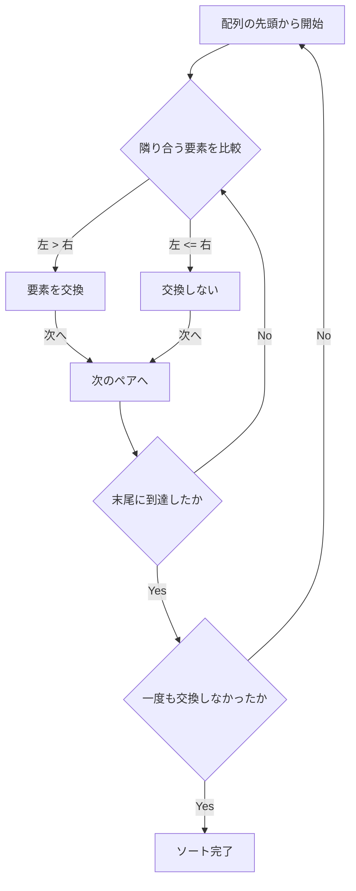
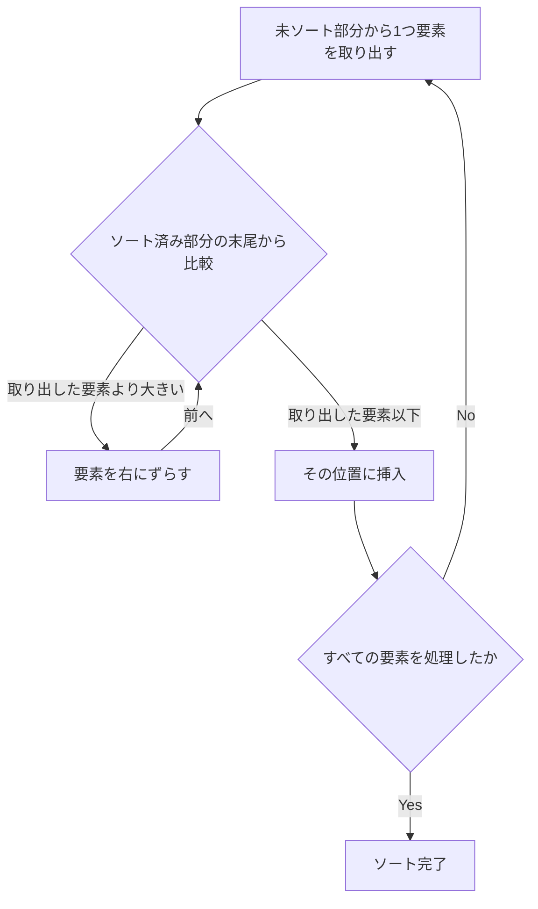
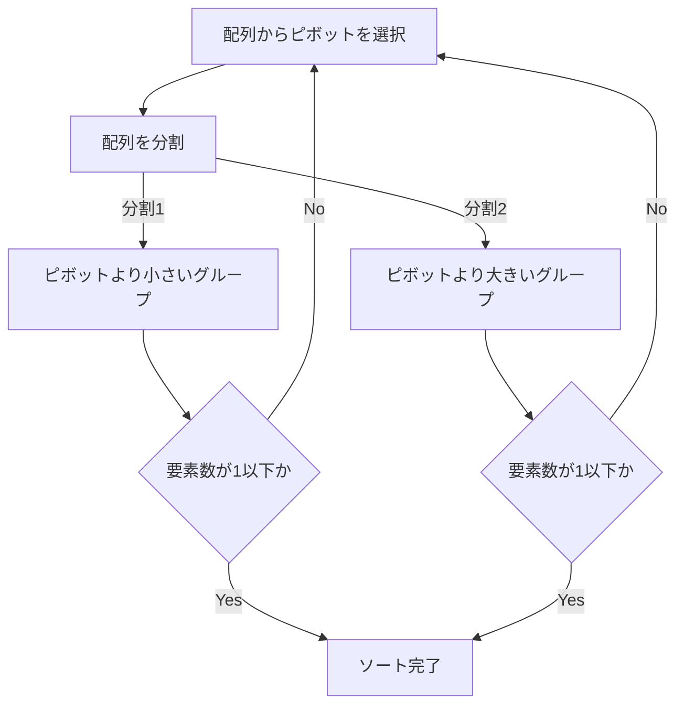
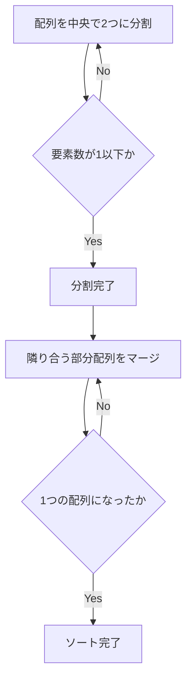

# 1. はじめに：ソートアルゴリズムの深淵なる世界

コンピュータサイエンスにおいて、データを特定の順序（昇順または降順）に並べ替える「ソート（整列）」は、最も基本的かつ重要な操作の一つです。検索の高速化、データのグループ化、重複の検出など、あらゆるデータ処理の前段階としてソートアルゴリズムが活躍します。

本記事では、初心者にもわかりやすいシンプルなアルゴリズムから、実務で活躍する高速なアルゴリズムまで、代表的なソートアルゴリズムを網羅的に解説します。各アルゴリズムの仕組みを **Mermaid** による図解で視覚的に理解し、Pythonコードで実際の実装を確認し、[時間計算量](https://kenji.blog/p/time-space-complexity-big-o-notation-examples/)などのパフォーマンスを比較していきます。さらに、アルゴリズムの動作を完全に把握するために、要素数50の配列を用いた完全な実行トレースも収録しています。これにより、アルゴリズムの細かな挙動を手にとるように理解できるでしょう。

## アルゴリズムの評価指標

各アルゴリズムを評価する際には、以下の指標が重要になります。

- **時間計算量 (Time Complexity)** : データの要素数 $n$ に対して、処理時間がどのように増加するかを表します。 $\text{O}(n^2)$ や $\text{O}(n \log n)$ などのオーダー記法（Big-O notation）が使われます。数式内でテキストを扱う場合は $\text{best}$ のように記述します。
- **[空間計算量](https://kenji.blog/p/time-space-complexity-big-o-notation-examples/) (Space Complexity)** : 実行時にどれだけの追加メモリを必要とするかを表します。インプレース（In-place）アルゴリズムは追加メモリをほとんど必要としません。
- **安定性 (Stability)** : 同じ値を持つ要素の相対的な順序が、ソート前後で保たれるかどうかを示します。安定なソートでは、元の順序が維持されます。

---

## 2. バブルソート (Bubble Sort)

隣り合う要素を比較し、順序が逆であれば交換するという操作を繰り返すアルゴリズムです。泡が水面へ浮かんでいくように、大きな要素が徐々に配列の末尾へと移動していきます。

### 計算量と特性

- **時間計算量（最良）**: $\text{O}(n)$
- **時間計算量（平均）**: $\text{O}(n^2)$
- **時間計算量（最悪）**: $\text{O}(n^2)$
- **空間計算量**: $\text{O}(1)$
- **安定性**: 安定

### 図解 (Mermaid)



### Python実装

```python
def bubble_sort(arr):
    n = len(arr)
    for i in range(n):
        swapped = False
        for j in range(0, n-i-1):
            if arr[j] > arr[j+1]:
                arr[j], arr[j+1] = arr[j+1], arr[j]
                swapped = True
        if not swapped:
            break
    return arr
```

### バブルソートの詳細トレース

要素数50のランダムな配列に対してバブルソートを実行した際の、各パス完了後の配列の状態を示します。バブルソートがどのように要素を右側に押し出していくかを観察してください。

**初期状態**: `[83, 14, 64, 71, 83, 11, 36, 69, 72, 45, 93, 30, 14, 76, 72, 51, 19, 41, 56, 15, 63, 27, 87, 55, 58, 63, 46, 96, 43, 68, 32, 97, 48, 94, 56, 27, 68, 40, 66, 88, 58, 15, 84, 10, 40, 27, 34, 48, 78, 56]`

**パス 1 完了後**: `[14, 64, 71, 83, 11, 36, 69, 72, 45, 83, 30, 14, 76, 72, 51, 19, 41, 56, 15, 63, 27, 87, 55, 58, 63, 46, 93, 43, 68, 32, 96, 48, 94, 56, 27, 68, 40, 66, 88, 58, 15, 84, 10, 40, 27, 34, 48, 78, 56, 97]`

このパスでは、未ソート部分の中で最大の要素が、まるで泡のように右端へと浮かび上がりました。バブルソートの特性上、1回のパスにつき少なくとも1つの要素が最終的な正しい位置に収まることが保証されます。そのため、パスを重ねるごとに探索範囲を1つずつ狭めていくことができ、無駄な比較操作を減らすことが可能です。しかしながら、データが完全に逆順に並んでいる最悪のケースでは、すべての要素ペアに対して交換操作が発生するため、計算量は $\text{O}(n^2)$ に達し、パフォーマンスは極めて低くなります。

このパスでは、未ソート部分の中で最大の要素が、まるで泡のように右端へと浮かび上がりました。バブルソートの特性上、1回のパスにつき少なくとも1つの要素が最終的な正しい位置に収まることが保証されます。そのため、パスを重ねるごとに探索範囲を1つずつ狭めていくことができ、無駄な比較操作を減らすことが可能です。しかしながら、データが完全に逆順に並んでいる最悪のケースでは、すべての要素ペアに対して交換操作が発生するため、計算量は $\text{O}(n^2)$ に達し、パフォーマンスは極めて低くなります。

**パス 2 完了後**: `[14, 64, 71, 11, 36, 69, 72, 45, 83, 30, 14, 76, 72, 51, 19, 41, 56, 15, 63, 27, 83, 55, 58, 63, 46, 87, 43, 68, 32, 93, 48, 94, 56, 27, 68, 40, 66, 88, 58, 15, 84, 10, 40, 27, 34, 48, 78, 56, 96, 97]`

このパスでは、未ソート部分の中で最大の要素が、まるで泡のように右端へと浮かび上がりました。バブルソートの特性上、1回のパスにつき少なくとも1つの要素が最終的な正しい位置に収まることが保証されます。そのため、パスを重ねるごとに探索範囲を1つずつ狭めていくことができ、無駄な比較操作を減らすことが可能です。しかしながら、データが完全に逆順に並んでいる最悪のケースでは、すべての要素ペアに対して交換操作が発生するため、計算量は $\text{O}(n^2)$ に達し、パフォーマンスは極めて低くなります。

このパスでは、未ソート部分の中で最大の要素が、まるで泡のように右端へと浮かび上がりました。バブルソートの特性上、1回のパスにつき少なくとも1つの要素が最終的な正しい位置に収まることが保証されます。そのため、パスを重ねるごとに探索範囲を1つずつ狭めていくことができ、無駄な比較操作を減らすことが可能です。しかしながら、データが完全に逆順に並んでいる最悪のケースでは、すべての要素ペアに対して交換操作が発生するため、計算量は $\text{O}(n^2)$ に達し、パフォーマンスは極めて低くなります。

**パス 3 完了後**: `[14, 64, 11, 36, 69, 71, 45, 72, 30, 14, 76, 72, 51, 19, 41, 56, 15, 63, 27, 83, 55, 58, 63, 46, 83, 43, 68, 32, 87, 48, 93, 56, 27, 68, 40, 66, 88, 58, 15, 84, 10, 40, 27, 34, 48, 78, 56, 94, 96, 97]`

このパスでは、未ソート部分の中で最大の要素が、まるで泡のように右端へと浮かび上がりました。バブルソートの特性上、1回のパスにつき少なくとも1つの要素が最終的な正しい位置に収まることが保証されます。そのため、パスを重ねるごとに探索範囲を1つずつ狭めていくことができ、無駄な比較操作を減らすことが可能です。しかしながら、データが完全に逆順に並んでいる最悪のケースでは、すべての要素ペアに対して交換操作が発生するため、計算量は $\text{O}(n^2)$ に達し、パフォーマンスは極めて低くなります。

このパスでは、未ソート部分の中で最大の要素が、まるで泡のように右端へと浮かび上がりました。バブルソートの特性上、1回のパスにつき少なくとも1つの要素が最終的な正しい位置に収まることが保証されます。そのため、パスを重ねるごとに探索範囲を1つずつ狭めていくことができ、無駄な比較操作を減らすことが可能です。しかしながら、データが完全に逆順に並んでいる最悪のケースでは、すべての要素ペアに対して交換操作が発生するため、計算量は $\text{O}(n^2)$ に達し、パフォーマンスは極めて低くなります。

**パス 4 完了後**: `[14, 11, 36, 64, 69, 45, 71, 30, 14, 72, 72, 51, 19, 41, 56, 15, 63, 27, 76, 55, 58, 63, 46, 83, 43, 68, 32, 83, 48, 87, 56, 27, 68, 40, 66, 88, 58, 15, 84, 10, 40, 27, 34, 48, 78, 56, 93, 94, 96, 97]`

このパスでは、未ソート部分の中で最大の要素が、まるで泡のように右端へと浮かび上がりました。バブルソートの特性上、1回のパスにつき少なくとも1つの要素が最終的な正しい位置に収まることが保証されます。そのため、パスを重ねるごとに探索範囲を1つずつ狭めていくことができ、無駄な比較操作を減らすことが可能です。しかしながら、データが完全に逆順に並んでいる最悪のケースでは、すべての要素ペアに対して交換操作が発生するため、計算量は $\text{O}(n^2)$ に達し、パフォーマンスは極めて低くなります。

このパスでは、未ソート部分の中で最大の要素が、まるで泡のように右端へと浮かび上がりました。バブルソートの特性上、1回のパスにつき少なくとも1つの要素が最終的な正しい位置に収まることが保証されます。そのため、パスを重ねるごとに探索範囲を1つずつ狭めていくことができ、無駄な比較操作を減らすことが可能です。しかしながら、データが完全に逆順に並んでいる最悪のケースでは、すべての要素ペアに対して交換操作が発生するため、計算量は $\text{O}(n^2)$ に達し、パフォーマンスは極めて低くなります。

**パス 5 完了後**: `[11, 14, 36, 64, 45, 69, 30, 14, 71, 72, 51, 19, 41, 56, 15, 63, 27, 72, 55, 58, 63, 46, 76, 43, 68, 32, 83, 48, 83, 56, 27, 68, 40, 66, 87, 58, 15, 84, 10, 40, 27, 34, 48, 78, 56, 88, 93, 94, 96, 97]`

このパスでは、未ソート部分の中で最大の要素が、まるで泡のように右端へと浮かび上がりました。バブルソートの特性上、1回のパスにつき少なくとも1つの要素が最終的な正しい位置に収まることが保証されます。そのため、パスを重ねるごとに探索範囲を1つずつ狭めていくことができ、無駄な比較操作を減らすことが可能です。しかしながら、データが完全に逆順に並んでいる最悪のケースでは、すべての要素ペアに対して交換操作が発生するため、計算量は $\text{O}(n^2)$ に達し、パフォーマンスは極めて低くなります。

このパスでは、未ソート部分の中で最大の要素が、まるで泡のように右端へと浮かび上がりました。バブルソートの特性上、1回のパスにつき少なくとも1つの要素が最終的な正しい位置に収まることが保証されます。そのため、パスを重ねるごとに探索範囲を1つずつ狭めていくことができ、無駄な比較操作を減らすことが可能です。しかしながら、データが完全に逆順に並んでいる最悪のケースでは、すべての要素ペアに対して交換操作が発生するため、計算量は $\text{O}(n^2)$ に達し、パフォーマンスは極めて低くなります。

**パス 6 完了後**: `[11, 14, 36, 45, 64, 30, 14, 69, 71, 51, 19, 41, 56, 15, 63, 27, 72, 55, 58, 63, 46, 72, 43, 68, 32, 76, 48, 83, 56, 27, 68, 40, 66, 83, 58, 15, 84, 10, 40, 27, 34, 48, 78, 56, 87, 88, 93, 94, 96, 97]`

このパスでは、未ソート部分の中で最大の要素が、まるで泡のように右端へと浮かび上がりました。バブルソートの特性上、1回のパスにつき少なくとも1つの要素が最終的な正しい位置に収まることが保証されます。そのため、パスを重ねるごとに探索範囲を1つずつ狭めていくことができ、無駄な比較操作を減らすことが可能です。しかしながら、データが完全に逆順に並んでいる最悪のケースでは、すべての要素ペアに対して交換操作が発生するため、計算量は $\text{O}(n^2)$ に達し、パフォーマンスは極めて低くなります。

このパスでは、未ソート部分の中で最大の要素が、まるで泡のように右端へと浮かび上がりました。バブルソートの特性上、1回のパスにつき少なくとも1つの要素が最終的な正しい位置に収まることが保証されます。そのため、パスを重ねるごとに探索範囲を1つずつ狭めていくことができ、無駄な比較操作を減らすことが可能です。しかしながら、データが完全に逆順に並んでいる最悪のケースでは、すべての要素ペアに対して交換操作が発生するため、計算量は $\text{O}(n^2)$ に達し、パフォーマンスは極めて低くなります。

**パス 7 完了後**: `[11, 14, 36, 45, 30, 14, 64, 69, 51, 19, 41, 56, 15, 63, 27, 71, 55, 58, 63, 46, 72, 43, 68, 32, 72, 48, 76, 56, 27, 68, 40, 66, 83, 58, 15, 83, 10, 40, 27, 34, 48, 78, 56, 84, 87, 88, 93, 94, 96, 97]`

このパスでは、未ソート部分の中で最大の要素が、まるで泡のように右端へと浮かび上がりました。バブルソートの特性上、1回のパスにつき少なくとも1つの要素が最終的な正しい位置に収まることが保証されます。そのため、パスを重ねるごとに探索範囲を1つずつ狭めていくことができ、無駄な比較操作を減らすことが可能です。しかしながら、データが完全に逆順に並んでいる最悪のケースでは、すべての要素ペアに対して交換操作が発生するため、計算量は $\text{O}(n^2)$ に達し、パフォーマンスは極めて低くなります。

このパスでは、未ソート部分の中で最大の要素が、まるで泡のように右端へと浮かび上がりました。バブルソートの特性上、1回のパスにつき少なくとも1つの要素が最終的な正しい位置に収まることが保証されます。そのため、パスを重ねるごとに探索範囲を1つずつ狭めていくことができ、無駄な比較操作を減らすことが可能です。しかしながら、データが完全に逆順に並んでいる最悪のケースでは、すべての要素ペアに対して交換操作が発生するため、計算量は $\text{O}(n^2)$ に達し、パフォーマンスは極めて低くなります。

**パス 8 完了後**: `[11, 14, 36, 30, 14, 45, 64, 51, 19, 41, 56, 15, 63, 27, 69, 55, 58, 63, 46, 71, 43, 68, 32, 72, 48, 72, 56, 27, 68, 40, 66, 76, 58, 15, 83, 10, 40, 27, 34, 48, 78, 56, 83, 84, 87, 88, 93, 94, 96, 97]`

このパスでは、未ソート部分の中で最大の要素が、まるで泡のように右端へと浮かび上がりました。バブルソートの特性上、1回のパスにつき少なくとも1つの要素が最終的な正しい位置に収まることが保証されます。そのため、パスを重ねるごとに探索範囲を1つずつ狭めていくことができ、無駄な比較操作を減らすことが可能です。しかしながら、データが完全に逆順に並んでいる最悪のケースでは、すべての要素ペアに対して交換操作が発生するため、計算量は $\text{O}(n^2)$ に達し、パフォーマンスは極めて低くなります。

このパスでは、未ソート部分の中で最大の要素が、まるで泡のように右端へと浮かび上がりました。バブルソートの特性上、1回のパスにつき少なくとも1つの要素が最終的な正しい位置に収まることが保証されます。そのため、パスを重ねるごとに探索範囲を1つずつ狭めていくことができ、無駄な比較操作を減らすことが可能です。しかしながら、データが完全に逆順に並んでいる最悪のケースでは、すべての要素ペアに対して交換操作が発生するため、計算量は $\text{O}(n^2)$ に達し、パフォーマンスは極めて低くなります。

**パス 9 完了後**: `[11, 14, 30, 14, 36, 45, 51, 19, 41, 56, 15, 63, 27, 64, 55, 58, 63, 46, 69, 43, 68, 32, 71, 48, 72, 56, 27, 68, 40, 66, 72, 58, 15, 76, 10, 40, 27, 34, 48, 78, 56, 83, 83, 84, 87, 88, 93, 94, 96, 97]`

このパスでは、未ソート部分の中で最大の要素が、まるで泡のように右端へと浮かび上がりました。バブルソートの特性上、1回のパスにつき少なくとも1つの要素が最終的な正しい位置に収まることが保証されます。そのため、パスを重ねるごとに探索範囲を1つずつ狭めていくことができ、無駄な比較操作を減らすことが可能です。しかしながら、データが完全に逆順に並んでいる最悪のケースでは、すべての要素ペアに対して交換操作が発生するため、計算量は $\text{O}(n^2)$ に達し、パフォーマンスは極めて低くなります。

このパスでは、未ソート部分の中で最大の要素が、まるで泡のように右端へと浮かび上がりました。バブルソートの特性上、1回のパスにつき少なくとも1つの要素が最終的な正しい位置に収まることが保証されます。そのため、パスを重ねるごとに探索範囲を1つずつ狭めていくことができ、無駄な比較操作を減らすことが可能です。しかしながら、データが完全に逆順に並んでいる最悪のケースでは、すべての要素ペアに対して交換操作が発生するため、計算量は $\text{O}(n^2)$ に達し、パフォーマンスは極めて低くなります。

**パス 10 完了後**: `[11, 14, 14, 30, 36, 45, 19, 41, 51, 15, 56, 27, 63, 55, 58, 63, 46, 64, 43, 68, 32, 69, 48, 71, 56, 27, 68, 40, 66, 72, 58, 15, 72, 10, 40, 27, 34, 48, 76, 56, 78, 83, 83, 84, 87, 88, 93, 94, 96, 97]`

このパスでは、未ソート部分の中で最大の要素が、まるで泡のように右端へと浮かび上がりました。バブルソートの特性上、1回のパスにつき少なくとも1つの要素が最終的な正しい位置に収まることが保証されます。そのため、パスを重ねるごとに探索範囲を1つずつ狭めていくことができ、無駄な比較操作を減らすことが可能です。しかしながら、データが完全に逆順に並んでいる最悪のケースでは、すべての要素ペアに対して交換操作が発生するため、計算量は $\text{O}(n^2)$ に達し、パフォーマンスは極めて低くなります。

このパスでは、未ソート部分の中で最大の要素が、まるで泡のように右端へと浮かび上がりました。バブルソートの特性上、1回のパスにつき少なくとも1つの要素が最終的な正しい位置に収まることが保証されます。そのため、パスを重ねるごとに探索範囲を1つずつ狭めていくことができ、無駄な比較操作を減らすことが可能です。しかしながら、データが完全に逆順に並んでいる最悪のケースでは、すべての要素ペアに対して交換操作が発生するため、計算量は $\text{O}(n^2)$ に達し、パフォーマンスは極めて低くなります。

**パス 11 完了後**: `[11, 14, 14, 30, 36, 19, 41, 45, 15, 51, 27, 56, 55, 58, 63, 46, 63, 43, 64, 32, 68, 48, 69, 56, 27, 68, 40, 66, 71, 58, 15, 72, 10, 40, 27, 34, 48, 72, 56, 76, 78, 83, 83, 84, 87, 88, 93, 94, 96, 97]`

このパスでは、未ソート部分の中で最大の要素が、まるで泡のように右端へと浮かび上がりました。バブルソートの特性上、1回のパスにつき少なくとも1つの要素が最終的な正しい位置に収まることが保証されます。そのため、パスを重ねるごとに探索範囲を1つずつ狭めていくことができ、無駄な比較操作を減らすことが可能です。しかしながら、データが完全に逆順に並んでいる最悪のケースでは、すべての要素ペアに対して交換操作が発生するため、計算量は $\text{O}(n^2)$ に達し、パフォーマンスは極めて低くなります。

このパスでは、未ソート部分の中で最大の要素が、まるで泡のように右端へと浮かび上がりました。バブルソートの特性上、1回のパスにつき少なくとも1つの要素が最終的な正しい位置に収まることが保証されます。そのため、パスを重ねるごとに探索範囲を1つずつ狭めていくことができ、無駄な比較操作を減らすことが可能です。しかしながら、データが完全に逆順に並んでいる最悪のケースでは、すべての要素ペアに対して交換操作が発生するため、計算量は $\text{O}(n^2)$ に達し、パフォーマンスは極めて低くなります。

**パス 12 完了後**: `[11, 14, 14, 30, 19, 36, 41, 15, 45, 27, 51, 55, 56, 58, 46, 63, 43, 63, 32, 64, 48, 68, 56, 27, 68, 40, 66, 69, 58, 15, 71, 10, 40, 27, 34, 48, 72, 56, 72, 76, 78, 83, 83, 84, 87, 88, 93, 94, 96, 97]`

このパスでは、未ソート部分の中で最大の要素が、まるで泡のように右端へと浮かび上がりました。バブルソートの特性上、1回のパスにつき少なくとも1つの要素が最終的な正しい位置に収まることが保証されます。そのため、パスを重ねるごとに探索範囲を1つずつ狭めていくことができ、無駄な比較操作を減らすことが可能です。しかしながら、データが完全に逆順に並んでいる最悪のケースでは、すべての要素ペアに対して交換操作が発生するため、計算量は $\text{O}(n^2)$ に達し、パフォーマンスは極めて低くなります。

このパスでは、未ソート部分の中で最大の要素が、まるで泡のように右端へと浮かび上がりました。バブルソートの特性上、1回のパスにつき少なくとも1つの要素が最終的な正しい位置に収まることが保証されます。そのため、パスを重ねるごとに探索範囲を1つずつ狭めていくことができ、無駄な比較操作を減らすことが可能です。しかしながら、データが完全に逆順に並んでいる最悪のケースでは、すべての要素ペアに対して交換操作が発生するため、計算量は $\text{O}(n^2)$ に達し、パフォーマンスは極めて低くなります。

**パス 13 完了後**: `[11, 14, 14, 19, 30, 36, 15, 41, 27, 45, 51, 55, 56, 46, 58, 43, 63, 32, 63, 48, 64, 56, 27, 68, 40, 66, 68, 58, 15, 69, 10, 40, 27, 34, 48, 71, 56, 72, 72, 76, 78, 83, 83, 84, 87, 88, 93, 94, 96, 97]`

このパスでは、未ソート部分の中で最大の要素が、まるで泡のように右端へと浮かび上がりました。バブルソートの特性上、1回のパスにつき少なくとも1つの要素が最終的な正しい位置に収まることが保証されます。そのため、パスを重ねるごとに探索範囲を1つずつ狭めていくことができ、無駄な比較操作を減らすことが可能です。しかしながら、データが完全に逆順に並んでいる最悪のケースでは、すべての要素ペアに対して交換操作が発生するため、計算量は $\text{O}(n^2)$ に達し、パフォーマンスは極めて低くなります。

このパスでは、未ソート部分の中で最大の要素が、まるで泡のように右端へと浮かび上がりました。バブルソートの特性上、1回のパスにつき少なくとも1つの要素が最終的な正しい位置に収まることが保証されます。そのため、パスを重ねるごとに探索範囲を1つずつ狭めていくことができ、無駄な比較操作を減らすことが可能です。しかしながら、データが完全に逆順に並んでいる最悪のケースでは、すべての要素ペアに対して交換操作が発生するため、計算量は $\text{O}(n^2)$ に達し、パフォーマンスは極めて低くなります。

**パス 14 完了後**: `[11, 14, 14, 19, 30, 15, 36, 27, 41, 45, 51, 55, 46, 56, 43, 58, 32, 63, 48, 63, 56, 27, 64, 40, 66, 68, 58, 15, 68, 10, 40, 27, 34, 48, 69, 56, 71, 72, 72, 76, 78, 83, 83, 84, 87, 88, 93, 94, 96, 97]`

このパスでは、未ソート部分の中で最大の要素が、まるで泡のように右端へと浮かび上がりました。バブルソートの特性上、1回のパスにつき少なくとも1つの要素が最終的な正しい位置に収まることが保証されます。そのため、パスを重ねるごとに探索範囲を1つずつ狭めていくことができ、無駄な比較操作を減らすことが可能です。しかしながら、データが完全に逆順に並んでいる最悪のケースでは、すべての要素ペアに対して交換操作が発生するため、計算量は $\text{O}(n^2)$ に達し、パフォーマンスは極めて低くなります。

このパスでは、未ソート部分の中で最大の要素が、まるで泡のように右端へと浮かび上がりました。バブルソートの特性上、1回のパスにつき少なくとも1つの要素が最終的な正しい位置に収まることが保証されます。そのため、パスを重ねるごとに探索範囲を1つずつ狭めていくことができ、無駄な比較操作を減らすことが可能です。しかしながら、データが完全に逆順に並んでいる最悪のケースでは、すべての要素ペアに対して交換操作が発生するため、計算量は $\text{O}(n^2)$ に達し、パフォーマンスは極めて低くなります。

**パス 15 完了後**: `[11, 14, 14, 19, 15, 30, 27, 36, 41, 45, 51, 46, 55, 43, 56, 32, 58, 48, 63, 56, 27, 63, 40, 64, 66, 58, 15, 68, 10, 40, 27, 34, 48, 68, 56, 69, 71, 72, 72, 76, 78, 83, 83, 84, 87, 88, 93, 94, 96, 97]`

このパスでは、未ソート部分の中で最大の要素が、まるで泡のように右端へと浮かび上がりました。バブルソートの特性上、1回のパスにつき少なくとも1つの要素が最終的な正しい位置に収まることが保証されます。そのため、パスを重ねるごとに探索範囲を1つずつ狭めていくことができ、無駄な比較操作を減らすことが可能です。しかしながら、データが完全に逆順に並んでいる最悪のケースでは、すべての要素ペアに対して交換操作が発生するため、計算量は $\text{O}(n^2)$ に達し、パフォーマンスは極めて低くなります。

このパスでは、未ソート部分の中で最大の要素が、まるで泡のように右端へと浮かび上がりました。バブルソートの特性上、1回のパスにつき少なくとも1つの要素が最終的な正しい位置に収まることが保証されます。そのため、パスを重ねるごとに探索範囲を1つずつ狭めていくことができ、無駄な比較操作を減らすことが可能です。しかしながら、データが完全に逆順に並んでいる最悪のケースでは、すべての要素ペアに対して交換操作が発生するため、計算量は $\text{O}(n^2)$ に達し、パフォーマンスは極めて低くなります。

**パス 16 完了後**: `[11, 14, 14, 15, 19, 27, 30, 36, 41, 45, 46, 51, 43, 55, 32, 56, 48, 58, 56, 27, 63, 40, 63, 64, 58, 15, 66, 10, 40, 27, 34, 48, 68, 56, 68, 69, 71, 72, 72, 76, 78, 83, 83, 84, 87, 88, 93, 94, 96, 97]`

このパスでは、未ソート部分の中で最大の要素が、まるで泡のように右端へと浮かび上がりました。バブルソートの特性上、1回のパスにつき少なくとも1つの要素が最終的な正しい位置に収まることが保証されます。そのため、パスを重ねるごとに探索範囲を1つずつ狭めていくことができ、無駄な比較操作を減らすことが可能です。しかしながら、データが完全に逆順に並んでいる最悪のケースでは、すべての要素ペアに対して交換操作が発生するため、計算量は $\text{O}(n^2)$ に達し、パフォーマンスは極めて低くなります。

このパスでは、未ソート部分の中で最大の要素が、まるで泡のように右端へと浮かび上がりました。バブルソートの特性上、1回のパスにつき少なくとも1つの要素が最終的な正しい位置に収まることが保証されます。そのため、パスを重ねるごとに探索範囲を1つずつ狭めていくことができ、無駄な比較操作を減らすことが可能です。しかしながら、データが完全に逆順に並んでいる最悪のケースでは、すべての要素ペアに対して交換操作が発生するため、計算量は $\text{O}(n^2)$ に達し、パフォーマンスは極めて低くなります。

**パス 17 完了後**: `[11, 14, 14, 15, 19, 27, 30, 36, 41, 45, 46, 43, 51, 32, 55, 48, 56, 56, 27, 58, 40, 63, 63, 58, 15, 64, 10, 40, 27, 34, 48, 66, 56, 68, 68, 69, 71, 72, 72, 76, 78, 83, 83, 84, 87, 88, 93, 94, 96, 97]`

このパスでは、未ソート部分の中で最大の要素が、まるで泡のように右端へと浮かび上がりました。バブルソートの特性上、1回のパスにつき少なくとも1つの要素が最終的な正しい位置に収まることが保証されます。そのため、パスを重ねるごとに探索範囲を1つずつ狭めていくことができ、無駄な比較操作を減らすことが可能です。しかしながら、データが完全に逆順に並んでいる最悪のケースでは、すべての要素ペアに対して交換操作が発生するため、計算量は $\text{O}(n^2)$ に達し、パフォーマンスは極めて低くなります。

このパスでは、未ソート部分の中で最大の要素が、まるで泡のように右端へと浮かび上がりました。バブルソートの特性上、1回のパスにつき少なくとも1つの要素が最終的な正しい位置に収まることが保証されます。そのため、パスを重ねるごとに探索範囲を1つずつ狭めていくことができ、無駄な比較操作を減らすことが可能です。しかしながら、データが完全に逆順に並んでいる最悪のケースでは、すべての要素ペアに対して交換操作が発生するため、計算量は $\text{O}(n^2)$ に達し、パフォーマンスは極めて低くなります。

**パス 18 完了後**: `[11, 14, 14, 15, 19, 27, 30, 36, 41, 45, 43, 46, 32, 51, 48, 55, 56, 27, 56, 40, 58, 63, 58, 15, 63, 10, 40, 27, 34, 48, 64, 56, 66, 68, 68, 69, 71, 72, 72, 76, 78, 83, 83, 84, 87, 88, 93, 94, 96, 97]`

このパスでは、未ソート部分の中で最大の要素が、まるで泡のように右端へと浮かび上がりました。バブルソートの特性上、1回のパスにつき少なくとも1つの要素が最終的な正しい位置に収まることが保証されます。そのため、パスを重ねるごとに探索範囲を1つずつ狭めていくことができ、無駄な比較操作を減らすことが可能です。しかしながら、データが完全に逆順に並んでいる最悪のケースでは、すべての要素ペアに対して交換操作が発生するため、計算量は $\text{O}(n^2)$ に達し、パフォーマンスは極めて低くなります。

このパスでは、未ソート部分の中で最大の要素が、まるで泡のように右端へと浮かび上がりました。バブルソートの特性上、1回のパスにつき少なくとも1つの要素が最終的な正しい位置に収まることが保証されます。そのため、パスを重ねるごとに探索範囲を1つずつ狭めていくことができ、無駄な比較操作を減らすことが可能です。しかしながら、データが完全に逆順に並んでいる最悪のケースでは、すべての要素ペアに対して交換操作が発生するため、計算量は $\text{O}(n^2)$ に達し、パフォーマンスは極めて低くなります。

**パス 19 完了後**: `[11, 14, 14, 15, 19, 27, 30, 36, 41, 43, 45, 32, 46, 48, 51, 55, 27, 56, 40, 56, 58, 58, 15, 63, 10, 40, 27, 34, 48, 63, 56, 64, 66, 68, 68, 69, 71, 72, 72, 76, 78, 83, 83, 84, 87, 88, 93, 94, 96, 97]`

このパスでは、未ソート部分の中で最大の要素が、まるで泡のように右端へと浮かび上がりました。バブルソートの特性上、1回のパスにつき少なくとも1つの要素が最終的な正しい位置に収まることが保証されます。そのため、パスを重ねるごとに探索範囲を1つずつ狭めていくことができ、無駄な比較操作を減らすことが可能です。しかしながら、データが完全に逆順に並んでいる最悪のケースでは、すべての要素ペアに対して交換操作が発生するため、計算量は $\text{O}(n^2)$ に達し、パフォーマンスは極めて低くなります。

このパスでは、未ソート部分の中で最大の要素が、まるで泡のように右端へと浮かび上がりました。バブルソートの特性上、1回のパスにつき少なくとも1つの要素が最終的な正しい位置に収まることが保証されます。そのため、パスを重ねるごとに探索範囲を1つずつ狭めていくことができ、無駄な比較操作を減らすことが可能です。しかしながら、データが完全に逆順に並んでいる最悪のケースでは、すべての要素ペアに対して交換操作が発生するため、計算量は $\text{O}(n^2)$ に達し、パフォーマンスは極めて低くなります。

**パス 20 完了後**: `[11, 14, 14, 15, 19, 27, 30, 36, 41, 43, 32, 45, 46, 48, 51, 27, 55, 40, 56, 56, 58, 15, 58, 10, 40, 27, 34, 48, 63, 56, 63, 64, 66, 68, 68, 69, 71, 72, 72, 76, 78, 83, 83, 84, 87, 88, 93, 94, 96, 97]`

このパスでは、未ソート部分の中で最大の要素が、まるで泡のように右端へと浮かび上がりました。バブルソートの特性上、1回のパスにつき少なくとも1つの要素が最終的な正しい位置に収まることが保証されます。そのため、パスを重ねるごとに探索範囲を1つずつ狭めていくことができ、無駄な比較操作を減らすことが可能です。しかしながら、データが完全に逆順に並んでいる最悪のケースでは、すべての要素ペアに対して交換操作が発生するため、計算量は $\text{O}(n^2)$ に達し、パフォーマンスは極めて低くなります。

このパスでは、未ソート部分の中で最大の要素が、まるで泡のように右端へと浮かび上がりました。バブルソートの特性上、1回のパスにつき少なくとも1つの要素が最終的な正しい位置に収まることが保証されます。そのため、パスを重ねるごとに探索範囲を1つずつ狭めていくことができ、無駄な比較操作を減らすことが可能です。しかしながら、データが完全に逆順に並んでいる最悪のケースでは、すべての要素ペアに対して交換操作が発生するため、計算量は $\text{O}(n^2)$ に達し、パフォーマンスは極めて低くなります。

**パス 21 完了後**: `[11, 14, 14, 15, 19, 27, 30, 36, 41, 32, 43, 45, 46, 48, 27, 51, 40, 55, 56, 56, 15, 58, 10, 40, 27, 34, 48, 58, 56, 63, 63, 64, 66, 68, 68, 69, 71, 72, 72, 76, 78, 83, 83, 84, 87, 88, 93, 94, 96, 97]`

このパスでは、未ソート部分の中で最大の要素が、まるで泡のように右端へと浮かび上がりました。バブルソートの特性上、1回のパスにつき少なくとも1つの要素が最終的な正しい位置に収まることが保証されます。そのため、パスを重ねるごとに探索範囲を1つずつ狭めていくことができ、無駄な比較操作を減らすことが可能です。しかしながら、データが完全に逆順に並んでいる最悪のケースでは、すべての要素ペアに対して交換操作が発生するため、計算量は $\text{O}(n^2)$ に達し、パフォーマンスは極めて低くなります。

このパスでは、未ソート部分の中で最大の要素が、まるで泡のように右端へと浮かび上がりました。バブルソートの特性上、1回のパスにつき少なくとも1つの要素が最終的な正しい位置に収まることが保証されます。そのため、パスを重ねるごとに探索範囲を1つずつ狭めていくことができ、無駄な比較操作を減らすことが可能です。しかしながら、データが完全に逆順に並んでいる最悪のケースでは、すべての要素ペアに対して交換操作が発生するため、計算量は $\text{O}(n^2)$ に達し、パフォーマンスは極めて低くなります。

**パス 22 完了後**: `[11, 14, 14, 15, 19, 27, 30, 36, 32, 41, 43, 45, 46, 27, 48, 40, 51, 55, 56, 15, 56, 10, 40, 27, 34, 48, 58, 56, 58, 63, 63, 64, 66, 68, 68, 69, 71, 72, 72, 76, 78, 83, 83, 84, 87, 88, 93, 94, 96, 97]`

このパスでは、未ソート部分の中で最大の要素が、まるで泡のように右端へと浮かび上がりました。バブルソートの特性上、1回のパスにつき少なくとも1つの要素が最終的な正しい位置に収まることが保証されます。そのため、パスを重ねるごとに探索範囲を1つずつ狭めていくことができ、無駄な比較操作を減らすことが可能です。しかしながら、データが完全に逆順に並んでいる最悪のケースでは、すべての要素ペアに対して交換操作が発生するため、計算量は $\text{O}(n^2)$ に達し、パフォーマンスは極めて低くなります。

このパスでは、未ソート部分の中で最大の要素が、まるで泡のように右端へと浮かび上がりました。バブルソートの特性上、1回のパスにつき少なくとも1つの要素が最終的な正しい位置に収まることが保証されます。そのため、パスを重ねるごとに探索範囲を1つずつ狭めていくことができ、無駄な比較操作を減らすことが可能です。しかしながら、データが完全に逆順に並んでいる最悪のケースでは、すべての要素ペアに対して交換操作が発生するため、計算量は $\text{O}(n^2)$ に達し、パフォーマンスは極めて低くなります。

**パス 23 完了後**: `[11, 14, 14, 15, 19, 27, 30, 32, 36, 41, 43, 45, 27, 46, 40, 48, 51, 55, 15, 56, 10, 40, 27, 34, 48, 56, 56, 58, 58, 63, 63, 64, 66, 68, 68, 69, 71, 72, 72, 76, 78, 83, 83, 84, 87, 88, 93, 94, 96, 97]`

このパスでは、未ソート部分の中で最大の要素が、まるで泡のように右端へと浮かび上がりました。バブルソートの特性上、1回のパスにつき少なくとも1つの要素が最終的な正しい位置に収まることが保証されます。そのため、パスを重ねるごとに探索範囲を1つずつ狭めていくことができ、無駄な比較操作を減らすことが可能です。しかしながら、データが完全に逆順に並んでいる最悪のケースでは、すべての要素ペアに対して交換操作が発生するため、計算量は $\text{O}(n^2)$ に達し、パフォーマンスは極めて低くなります。

このパスでは、未ソート部分の中で最大の要素が、まるで泡のように右端へと浮かび上がりました。バブルソートの特性上、1回のパスにつき少なくとも1つの要素が最終的な正しい位置に収まることが保証されます。そのため、パスを重ねるごとに探索範囲を1つずつ狭めていくことができ、無駄な比較操作を減らすことが可能です。しかしながら、データが完全に逆順に並んでいる最悪のケースでは、すべての要素ペアに対して交換操作が発生するため、計算量は $\text{O}(n^2)$ に達し、パフォーマンスは極めて低くなります。

**パス 24 完了後**: `[11, 14, 14, 15, 19, 27, 30, 32, 36, 41, 43, 27, 45, 40, 46, 48, 51, 15, 55, 10, 40, 27, 34, 48, 56, 56, 56, 58, 58, 63, 63, 64, 66, 68, 68, 69, 71, 72, 72, 76, 78, 83, 83, 84, 87, 88, 93, 94, 96, 97]`

このパスでは、未ソート部分の中で最大の要素が、まるで泡のように右端へと浮かび上がりました。バブルソートの特性上、1回のパスにつき少なくとも1つの要素が最終的な正しい位置に収まることが保証されます。そのため、パスを重ねるごとに探索範囲を1つずつ狭めていくことができ、無駄な比較操作を減らすことが可能です。しかしながら、データが完全に逆順に並んでいる最悪のケースでは、すべての要素ペアに対して交換操作が発生するため、計算量は $\text{O}(n^2)$ に達し、パフォーマンスは極めて低くなります。

このパスでは、未ソート部分の中で最大の要素が、まるで泡のように右端へと浮かび上がりました。バブルソートの特性上、1回のパスにつき少なくとも1つの要素が最終的な正しい位置に収まることが保証されます。そのため、パスを重ねるごとに探索範囲を1つずつ狭めていくことができ、無駄な比較操作を減らすことが可能です。しかしながら、データが完全に逆順に並んでいる最悪のケースでは、すべての要素ペアに対して交換操作が発生するため、計算量は $\text{O}(n^2)$ に達し、パフォーマンスは極めて低くなります。

**パス 25 完了後**: `[11, 14, 14, 15, 19, 27, 30, 32, 36, 41, 27, 43, 40, 45, 46, 48, 15, 51, 10, 40, 27, 34, 48, 55, 56, 56, 56, 58, 58, 63, 63, 64, 66, 68, 68, 69, 71, 72, 72, 76, 78, 83, 83, 84, 87, 88, 93, 94, 96, 97]`

このパスでは、未ソート部分の中で最大の要素が、まるで泡のように右端へと浮かび上がりました。バブルソートの特性上、1回のパスにつき少なくとも1つの要素が最終的な正しい位置に収まることが保証されます。そのため、パスを重ねるごとに探索範囲を1つずつ狭めていくことができ、無駄な比較操作を減らすことが可能です。しかしながら、データが完全に逆順に並んでいる最悪のケースでは、すべての要素ペアに対して交換操作が発生するため、計算量は $\text{O}(n^2)$ に達し、パフォーマンスは極めて低くなります。

このパスでは、未ソート部分の中で最大の要素が、まるで泡のように右端へと浮かび上がりました。バブルソートの特性上、1回のパスにつき少なくとも1つの要素が最終的な正しい位置に収まることが保証されます。そのため、パスを重ねるごとに探索範囲を1つずつ狭めていくことができ、無駄な比較操作を減らすことが可能です。しかしながら、データが完全に逆順に並んでいる最悪のケースでは、すべての要素ペアに対して交換操作が発生するため、計算量は $\text{O}(n^2)$ に達し、パフォーマンスは極めて低くなります。

**パス 26 完了後**: `[11, 14, 14, 15, 19, 27, 30, 32, 36, 27, 41, 40, 43, 45, 46, 15, 48, 10, 40, 27, 34, 48, 51, 55, 56, 56, 56, 58, 58, 63, 63, 64, 66, 68, 68, 69, 71, 72, 72, 76, 78, 83, 83, 84, 87, 88, 93, 94, 96, 97]`

このパスでは、未ソート部分の中で最大の要素が、まるで泡のように右端へと浮かび上がりました。バブルソートの特性上、1回のパスにつき少なくとも1つの要素が最終的な正しい位置に収まることが保証されます。そのため、パスを重ねるごとに探索範囲を1つずつ狭めていくことができ、無駄な比較操作を減らすことが可能です。しかしながら、データが完全に逆順に並んでいる最悪のケースでは、すべての要素ペアに対して交換操作が発生するため、計算量は $\text{O}(n^2)$ に達し、パフォーマンスは極めて低くなります。

このパスでは、未ソート部分の中で最大の要素が、まるで泡のように右端へと浮かび上がりました。バブルソートの特性上、1回のパスにつき少なくとも1つの要素が最終的な正しい位置に収まることが保証されます。そのため、パスを重ねるごとに探索範囲を1つずつ狭めていくことができ、無駄な比較操作を減らすことが可能です。しかしながら、データが完全に逆順に並んでいる最悪のケースでは、すべての要素ペアに対して交換操作が発生するため、計算量は $\text{O}(n^2)$ に達し、パフォーマンスは極めて低くなります。

**パス 27 完了後**: `[11, 14, 14, 15, 19, 27, 30, 32, 27, 36, 40, 41, 43, 45, 15, 46, 10, 40, 27, 34, 48, 48, 51, 55, 56, 56, 56, 58, 58, 63, 63, 64, 66, 68, 68, 69, 71, 72, 72, 76, 78, 83, 83, 84, 87, 88, 93, 94, 96, 97]`

このパスでは、未ソート部分の中で最大の要素が、まるで泡のように右端へと浮かび上がりました。バブルソートの特性上、1回のパスにつき少なくとも1つの要素が最終的な正しい位置に収まることが保証されます。そのため、パスを重ねるごとに探索範囲を1つずつ狭めていくことができ、無駄な比較操作を減らすことが可能です。しかしながら、データが完全に逆順に並んでいる最悪のケースでは、すべての要素ペアに対して交換操作が発生するため、計算量は $\text{O}(n^2)$ に達し、パフォーマンスは極めて低くなります。

このパスでは、未ソート部分の中で最大の要素が、まるで泡のように右端へと浮かび上がりました。バブルソートの特性上、1回のパスにつき少なくとも1つの要素が最終的な正しい位置に収まることが保証されます。そのため、パスを重ねるごとに探索範囲を1つずつ狭めていくことができ、無駄な比較操作を減らすことが可能です。しかしながら、データが完全に逆順に並んでいる最悪のケースでは、すべての要素ペアに対して交換操作が発生するため、計算量は $\text{O}(n^2)$ に達し、パフォーマンスは極めて低くなります。

**パス 28 完了後**: `[11, 14, 14, 15, 19, 27, 30, 27, 32, 36, 40, 41, 43, 15, 45, 10, 40, 27, 34, 46, 48, 48, 51, 55, 56, 56, 56, 58, 58, 63, 63, 64, 66, 68, 68, 69, 71, 72, 72, 76, 78, 83, 83, 84, 87, 88, 93, 94, 96, 97]`

このパスでは、未ソート部分の中で最大の要素が、まるで泡のように右端へと浮かび上がりました。バブルソートの特性上、1回のパスにつき少なくとも1つの要素が最終的な正しい位置に収まることが保証されます。そのため、パスを重ねるごとに探索範囲を1つずつ狭めていくことができ、無駄な比較操作を減らすことが可能です。しかしながら、データが完全に逆順に並んでいる最悪のケースでは、すべての要素ペアに対して交換操作が発生するため、計算量は $\text{O}(n^2)$ に達し、パフォーマンスは極めて低くなります。

このパスでは、未ソート部分の中で最大の要素が、まるで泡のように右端へと浮かび上がりました。バブルソートの特性上、1回のパスにつき少なくとも1つの要素が最終的な正しい位置に収まることが保証されます。そのため、パスを重ねるごとに探索範囲を1つずつ狭めていくことができ、無駄な比較操作を減らすことが可能です。しかしながら、データが完全に逆順に並んでいる最悪のケースでは、すべての要素ペアに対して交換操作が発生するため、計算量は $\text{O}(n^2)$ に達し、パフォーマンスは極めて低くなります。

**パス 29 完了後**: `[11, 14, 14, 15, 19, 27, 27, 30, 32, 36, 40, 41, 15, 43, 10, 40, 27, 34, 45, 46, 48, 48, 51, 55, 56, 56, 56, 58, 58, 63, 63, 64, 66, 68, 68, 69, 71, 72, 72, 76, 78, 83, 83, 84, 87, 88, 93, 94, 96, 97]`

このパスでは、未ソート部分の中で最大の要素が、まるで泡のように右端へと浮かび上がりました。バブルソートの特性上、1回のパスにつき少なくとも1つの要素が最終的な正しい位置に収まることが保証されます。そのため、パスを重ねるごとに探索範囲を1つずつ狭めていくことができ、無駄な比較操作を減らすことが可能です。しかしながら、データが完全に逆順に並んでいる最悪のケースでは、すべての要素ペアに対して交換操作が発生するため、計算量は $\text{O}(n^2)$ に達し、パフォーマンスは極めて低くなります。

このパスでは、未ソート部分の中で最大の要素が、まるで泡のように右端へと浮かび上がりました。バブルソートの特性上、1回のパスにつき少なくとも1つの要素が最終的な正しい位置に収まることが保証されます。そのため、パスを重ねるごとに探索範囲を1つずつ狭めていくことができ、無駄な比較操作を減らすことが可能です。しかしながら、データが完全に逆順に並んでいる最悪のケースでは、すべての要素ペアに対して交換操作が発生するため、計算量は $\text{O}(n^2)$ に達し、パフォーマンスは極めて低くなります。

**パス 30 完了後**: `[11, 14, 14, 15, 19, 27, 27, 30, 32, 36, 40, 15, 41, 10, 40, 27, 34, 43, 45, 46, 48, 48, 51, 55, 56, 56, 56, 58, 58, 63, 63, 64, 66, 68, 68, 69, 71, 72, 72, 76, 78, 83, 83, 84, 87, 88, 93, 94, 96, 97]`

このパスでは、未ソート部分の中で最大の要素が、まるで泡のように右端へと浮かび上がりました。バブルソートの特性上、1回のパスにつき少なくとも1つの要素が最終的な正しい位置に収まることが保証されます。そのため、パスを重ねるごとに探索範囲を1つずつ狭めていくことができ、無駄な比較操作を減らすことが可能です。しかしながら、データが完全に逆順に並んでいる最悪のケースでは、すべての要素ペアに対して交換操作が発生するため、計算量は $\text{O}(n^2)$ に達し、パフォーマンスは極めて低くなります。

このパスでは、未ソート部分の中で最大の要素が、まるで泡のように右端へと浮かび上がりました。バブルソートの特性上、1回のパスにつき少なくとも1つの要素が最終的な正しい位置に収まることが保証されます。そのため、パスを重ねるごとに探索範囲を1つずつ狭めていくことができ、無駄な比較操作を減らすことが可能です。しかしながら、データが完全に逆順に並んでいる最悪のケースでは、すべての要素ペアに対して交換操作が発生するため、計算量は $\text{O}(n^2)$ に達し、パフォーマンスは極めて低くなります。

**パス 31 完了後**: `[11, 14, 14, 15, 19, 27, 27, 30, 32, 36, 15, 40, 10, 40, 27, 34, 41, 43, 45, 46, 48, 48, 51, 55, 56, 56, 56, 58, 58, 63, 63, 64, 66, 68, 68, 69, 71, 72, 72, 76, 78, 83, 83, 84, 87, 88, 93, 94, 96, 97]`

このパスでは、未ソート部分の中で最大の要素が、まるで泡のように右端へと浮かび上がりました。バブルソートの特性上、1回のパスにつき少なくとも1つの要素が最終的な正しい位置に収まることが保証されます。そのため、パスを重ねるごとに探索範囲を1つずつ狭めていくことができ、無駄な比較操作を減らすことが可能です。しかしながら、データが完全に逆順に並んでいる最悪のケースでは、すべての要素ペアに対して交換操作が発生するため、計算量は $\text{O}(n^2)$ に達し、パフォーマンスは極めて低くなります。

このパスでは、未ソート部分の中で最大の要素が、まるで泡のように右端へと浮かび上がりました。バブルソートの特性上、1回のパスにつき少なくとも1つの要素が最終的な正しい位置に収まることが保証されます。そのため、パスを重ねるごとに探索範囲を1つずつ狭めていくことができ、無駄な比較操作を減らすことが可能です。しかしながら、データが完全に逆順に並んでいる最悪のケースでは、すべての要素ペアに対して交換操作が発生するため、計算量は $\text{O}(n^2)$ に達し、パフォーマンスは極めて低くなります。

**パス 32 完了後**: `[11, 14, 14, 15, 19, 27, 27, 30, 32, 15, 36, 10, 40, 27, 34, 40, 41, 43, 45, 46, 48, 48, 51, 55, 56, 56, 56, 58, 58, 63, 63, 64, 66, 68, 68, 69, 71, 72, 72, 76, 78, 83, 83, 84, 87, 88, 93, 94, 96, 97]`

このパスでは、未ソート部分の中で最大の要素が、まるで泡のように右端へと浮かび上がりました。バブルソートの特性上、1回のパスにつき少なくとも1つの要素が最終的な正しい位置に収まることが保証されます。そのため、パスを重ねるごとに探索範囲を1つずつ狭めていくことができ、無駄な比較操作を減らすことが可能です。しかしながら、データが完全に逆順に並んでいる最悪のケースでは、すべての要素ペアに対して交換操作が発生するため、計算量は $\text{O}(n^2)$ に達し、パフォーマンスは極めて低くなります。

このパスでは、未ソート部分の中で最大の要素が、まるで泡のように右端へと浮かび上がりました。バブルソートの特性上、1回のパスにつき少なくとも1つの要素が最終的な正しい位置に収まることが保証されます。そのため、パスを重ねるごとに探索範囲を1つずつ狭めていくことができ、無駄な比較操作を減らすことが可能です。しかしながら、データが完全に逆順に並んでいる最悪のケースでは、すべての要素ペアに対して交換操作が発生するため、計算量は $\text{O}(n^2)$ に達し、パフォーマンスは極めて低くなります。

**パス 33 完了後**: `[11, 14, 14, 15, 19, 27, 27, 30, 15, 32, 10, 36, 27, 34, 40, 40, 41, 43, 45, 46, 48, 48, 51, 55, 56, 56, 56, 58, 58, 63, 63, 64, 66, 68, 68, 69, 71, 72, 72, 76, 78, 83, 83, 84, 87, 88, 93, 94, 96, 97]`

このパスでは、未ソート部分の中で最大の要素が、まるで泡のように右端へと浮かび上がりました。バブルソートの特性上、1回のパスにつき少なくとも1つの要素が最終的な正しい位置に収まることが保証されます。そのため、パスを重ねるごとに探索範囲を1つずつ狭めていくことができ、無駄な比較操作を減らすことが可能です。しかしながら、データが完全に逆順に並んでいる最悪のケースでは、すべての要素ペアに対して交換操作が発生するため、計算量は $\text{O}(n^2)$ に達し、パフォーマンスは極めて低くなります。

このパスでは、未ソート部分の中で最大の要素が、まるで泡のように右端へと浮かび上がりました。バブルソートの特性上、1回のパスにつき少なくとも1つの要素が最終的な正しい位置に収まることが保証されます。そのため、パスを重ねるごとに探索範囲を1つずつ狭めていくことができ、無駄な比較操作を減らすことが可能です。しかしながら、データが完全に逆順に並んでいる最悪のケースでは、すべての要素ペアに対して交換操作が発生するため、計算量は $\text{O}(n^2)$ に達し、パフォーマンスは極めて低くなります。

**パス 34 完了後**: `[11, 14, 14, 15, 19, 27, 27, 15, 30, 10, 32, 27, 34, 36, 40, 40, 41, 43, 45, 46, 48, 48, 51, 55, 56, 56, 56, 58, 58, 63, 63, 64, 66, 68, 68, 69, 71, 72, 72, 76, 78, 83, 83, 84, 87, 88, 93, 94, 96, 97]`

このパスでは、未ソート部分の中で最大の要素が、まるで泡のように右端へと浮かび上がりました。バブルソートの特性上、1回のパスにつき少なくとも1つの要素が最終的な正しい位置に収まることが保証されます。そのため、パスを重ねるごとに探索範囲を1つずつ狭めていくことができ、無駄な比較操作を減らすことが可能です。しかしながら、データが完全に逆順に並んでいる最悪のケースでは、すべての要素ペアに対して交換操作が発生するため、計算量は $\text{O}(n^2)$ に達し、パフォーマンスは極めて低くなります。

このパスでは、未ソート部分の中で最大の要素が、まるで泡のように右端へと浮かび上がりました。バブルソートの特性上、1回のパスにつき少なくとも1つの要素が最終的な正しい位置に収まることが保証されます。そのため、パスを重ねるごとに探索範囲を1つずつ狭めていくことができ、無駄な比較操作を減らすことが可能です。しかしながら、データが完全に逆順に並んでいる最悪のケースでは、すべての要素ペアに対して交換操作が発生するため、計算量は $\text{O}(n^2)$ に達し、パフォーマンスは極めて低くなります。

**パス 35 完了後**: `[11, 14, 14, 15, 19, 27, 15, 27, 10, 30, 27, 32, 34, 36, 40, 40, 41, 43, 45, 46, 48, 48, 51, 55, 56, 56, 56, 58, 58, 63, 63, 64, 66, 68, 68, 69, 71, 72, 72, 76, 78, 83, 83, 84, 87, 88, 93, 94, 96, 97]`

このパスでは、未ソート部分の中で最大の要素が、まるで泡のように右端へと浮かび上がりました。バブルソートの特性上、1回のパスにつき少なくとも1つの要素が最終的な正しい位置に収まることが保証されます。そのため、パスを重ねるごとに探索範囲を1つずつ狭めていくことができ、無駄な比較操作を減らすことが可能です。しかしながら、データが完全に逆順に並んでいる最悪のケースでは、すべての要素ペアに対して交換操作が発生するため、計算量は $\text{O}(n^2)$ に達し、パフォーマンスは極めて低くなります。

このパスでは、未ソート部分の中で最大の要素が、まるで泡のように右端へと浮かび上がりました。バブルソートの特性上、1回のパスにつき少なくとも1つの要素が最終的な正しい位置に収まることが保証されます。そのため、パスを重ねるごとに探索範囲を1つずつ狭めていくことができ、無駄な比較操作を減らすことが可能です。しかしながら、データが完全に逆順に並んでいる最悪のケースでは、すべての要素ペアに対して交換操作が発生するため、計算量は $\text{O}(n^2)$ に達し、パフォーマンスは極めて低くなります。

**パス 36 完了後**: `[11, 14, 14, 15, 19, 15, 27, 10, 27, 27, 30, 32, 34, 36, 40, 40, 41, 43, 45, 46, 48, 48, 51, 55, 56, 56, 56, 58, 58, 63, 63, 64, 66, 68, 68, 69, 71, 72, 72, 76, 78, 83, 83, 84, 87, 88, 93, 94, 96, 97]`

このパスでは、未ソート部分の中で最大の要素が、まるで泡のように右端へと浮かび上がりました。バブルソートの特性上、1回のパスにつき少なくとも1つの要素が最終的な正しい位置に収まることが保証されます。そのため、パスを重ねるごとに探索範囲を1つずつ狭めていくことができ、無駄な比較操作を減らすことが可能です。しかしながら、データが完全に逆順に並んでいる最悪のケースでは、すべての要素ペアに対して交換操作が発生するため、計算量は $\text{O}(n^2)$ に達し、パフォーマンスは極めて低くなります。

このパスでは、未ソート部分の中で最大の要素が、まるで泡のように右端へと浮かび上がりました。バブルソートの特性上、1回のパスにつき少なくとも1つの要素が最終的な正しい位置に収まることが保証されます。そのため、パスを重ねるごとに探索範囲を1つずつ狭めていくことができ、無駄な比較操作を減らすことが可能です。しかしながら、データが完全に逆順に並んでいる最悪のケースでは、すべての要素ペアに対して交換操作が発生するため、計算量は $\text{O}(n^2)$ に達し、パフォーマンスは極めて低くなります。

**パス 37 完了後**: `[11, 14, 14, 15, 15, 19, 10, 27, 27, 27, 30, 32, 34, 36, 40, 40, 41, 43, 45, 46, 48, 48, 51, 55, 56, 56, 56, 58, 58, 63, 63, 64, 66, 68, 68, 69, 71, 72, 72, 76, 78, 83, 83, 84, 87, 88, 93, 94, 96, 97]`

このパスでは、未ソート部分の中で最大の要素が、まるで泡のように右端へと浮かび上がりました。バブルソートの特性上、1回のパスにつき少なくとも1つの要素が最終的な正しい位置に収まることが保証されます。そのため、パスを重ねるごとに探索範囲を1つずつ狭めていくことができ、無駄な比較操作を減らすことが可能です。しかしながら、データが完全に逆順に並んでいる最悪のケースでは、すべての要素ペアに対して交換操作が発生するため、計算量は $\text{O}(n^2)$ に達し、パフォーマンスは極めて低くなります。

このパスでは、未ソート部分の中で最大の要素が、まるで泡のように右端へと浮かび上がりました。バブルソートの特性上、1回のパスにつき少なくとも1つの要素が最終的な正しい位置に収まることが保証されます。そのため、パスを重ねるごとに探索範囲を1つずつ狭めていくことができ、無駄な比較操作を減らすことが可能です。しかしながら、データが完全に逆順に並んでいる最悪のケースでは、すべての要素ペアに対して交換操作が発生するため、計算量は $\text{O}(n^2)$ に達し、パフォーマンスは極めて低くなります。

**パス 38 完了後**: `[11, 14, 14, 15, 15, 10, 19, 27, 27, 27, 30, 32, 34, 36, 40, 40, 41, 43, 45, 46, 48, 48, 51, 55, 56, 56, 56, 58, 58, 63, 63, 64, 66, 68, 68, 69, 71, 72, 72, 76, 78, 83, 83, 84, 87, 88, 93, 94, 96, 97]`

このパスでは、未ソート部分の中で最大の要素が、まるで泡のように右端へと浮かび上がりました。バブルソートの特性上、1回のパスにつき少なくとも1つの要素が最終的な正しい位置に収まることが保証されます。そのため、パスを重ねるごとに探索範囲を1つずつ狭めていくことができ、無駄な比較操作を減らすことが可能です。しかしながら、データが完全に逆順に並んでいる最悪のケースでは、すべての要素ペアに対して交換操作が発生するため、計算量は $\text{O}(n^2)$ に達し、パフォーマンスは極めて低くなります。

このパスでは、未ソート部分の中で最大の要素が、まるで泡のように右端へと浮かび上がりました。バブルソートの特性上、1回のパスにつき少なくとも1つの要素が最終的な正しい位置に収まることが保証されます。そのため、パスを重ねるごとに探索範囲を1つずつ狭めていくことができ、無駄な比較操作を減らすことが可能です。しかしながら、データが完全に逆順に並んでいる最悪のケースでは、すべての要素ペアに対して交換操作が発生するため、計算量は $\text{O}(n^2)$ に達し、パフォーマンスは極めて低くなります。

**パス 39 完了後**: `[11, 14, 14, 15, 10, 15, 19, 27, 27, 27, 30, 32, 34, 36, 40, 40, 41, 43, 45, 46, 48, 48, 51, 55, 56, 56, 56, 58, 58, 63, 63, 64, 66, 68, 68, 69, 71, 72, 72, 76, 78, 83, 83, 84, 87, 88, 93, 94, 96, 97]`

このパスでは、未ソート部分の中で最大の要素が、まるで泡のように右端へと浮かび上がりました。バブルソートの特性上、1回のパスにつき少なくとも1つの要素が最終的な正しい位置に収まることが保証されます。そのため、パスを重ねるごとに探索範囲を1つずつ狭めていくことができ、無駄な比較操作を減らすことが可能です。しかしながら、データが完全に逆順に並んでいる最悪のケースでは、すべての要素ペアに対して交換操作が発生するため、計算量は $\text{O}(n^2)$ に達し、パフォーマンスは極めて低くなります。

このパスでは、未ソート部分の中で最大の要素が、まるで泡のように右端へと浮かび上がりました。バブルソートの特性上、1回のパスにつき少なくとも1つの要素が最終的な正しい位置に収まることが保証されます。そのため、パスを重ねるごとに探索範囲を1つずつ狭めていくことができ、無駄な比較操作を減らすことが可能です。しかしながら、データが完全に逆順に並んでいる最悪のケースでは、すべての要素ペアに対して交換操作が発生するため、計算量は $\text{O}(n^2)$ に達し、パフォーマンスは極めて低くなります。

**パス 40 完了後**: `[11, 14, 14, 10, 15, 15, 19, 27, 27, 27, 30, 32, 34, 36, 40, 40, 41, 43, 45, 46, 48, 48, 51, 55, 56, 56, 56, 58, 58, 63, 63, 64, 66, 68, 68, 69, 71, 72, 72, 76, 78, 83, 83, 84, 87, 88, 93, 94, 96, 97]`

このパスでは、未ソート部分の中で最大の要素が、まるで泡のように右端へと浮かび上がりました。バブルソートの特性上、1回のパスにつき少なくとも1つの要素が最終的な正しい位置に収まることが保証されます。そのため、パスを重ねるごとに探索範囲を1つずつ狭めていくことができ、無駄な比較操作を減らすことが可能です。しかしながら、データが完全に逆順に並んでいる最悪のケースでは、すべての要素ペアに対して交換操作が発生するため、計算量は $\text{O}(n^2)$ に達し、パフォーマンスは極めて低くなります。

このパスでは、未ソート部分の中で最大の要素が、まるで泡のように右端へと浮かび上がりました。バブルソートの特性上、1回のパスにつき少なくとも1つの要素が最終的な正しい位置に収まることが保証されます。そのため、パスを重ねるごとに探索範囲を1つずつ狭めていくことができ、無駄な比較操作を減らすことが可能です。しかしながら、データが完全に逆順に並んでいる最悪のケースでは、すべての要素ペアに対して交換操作が発生するため、計算量は $\text{O}(n^2)$ に達し、パフォーマンスは極めて低くなります。

**パス 41 完了後**: `[11, 14, 10, 14, 15, 15, 19, 27, 27, 27, 30, 32, 34, 36, 40, 40, 41, 43, 45, 46, 48, 48, 51, 55, 56, 56, 56, 58, 58, 63, 63, 64, 66, 68, 68, 69, 71, 72, 72, 76, 78, 83, 83, 84, 87, 88, 93, 94, 96, 97]`

このパスでは、未ソート部分の中で最大の要素が、まるで泡のように右端へと浮かび上がりました。バブルソートの特性上、1回のパスにつき少なくとも1つの要素が最終的な正しい位置に収まることが保証されます。そのため、パスを重ねるごとに探索範囲を1つずつ狭めていくことができ、無駄な比較操作を減らすことが可能です。しかしながら、データが完全に逆順に並んでいる最悪のケースでは、すべての要素ペアに対して交換操作が発生するため、計算量は $\text{O}(n^2)$ に達し、パフォーマンスは極めて低くなります。

このパスでは、未ソート部分の中で最大の要素が、まるで泡のように右端へと浮かび上がりました。バブルソートの特性上、1回のパスにつき少なくとも1つの要素が最終的な正しい位置に収まることが保証されます。そのため、パスを重ねるごとに探索範囲を1つずつ狭めていくことができ、無駄な比較操作を減らすことが可能です。しかしながら、データが完全に逆順に並んでいる最悪のケースでは、すべての要素ペアに対して交換操作が発生するため、計算量は $\text{O}(n^2)$ に達し、パフォーマンスは極めて低くなります。

**パス 42 完了後**: `[11, 10, 14, 14, 15, 15, 19, 27, 27, 27, 30, 32, 34, 36, 40, 40, 41, 43, 45, 46, 48, 48, 51, 55, 56, 56, 56, 58, 58, 63, 63, 64, 66, 68, 68, 69, 71, 72, 72, 76, 78, 83, 83, 84, 87, 88, 93, 94, 96, 97]`

このパスでは、未ソート部分の中で最大の要素が、まるで泡のように右端へと浮かび上がりました。バブルソートの特性上、1回のパスにつき少なくとも1つの要素が最終的な正しい位置に収まることが保証されます。そのため、パスを重ねるごとに探索範囲を1つずつ狭めていくことができ、無駄な比較操作を減らすことが可能です。しかしながら、データが完全に逆順に並んでいる最悪のケースでは、すべての要素ペアに対して交換操作が発生するため、計算量は $\text{O}(n^2)$ に達し、パフォーマンスは極めて低くなります。

このパスでは、未ソート部分の中で最大の要素が、まるで泡のように右端へと浮かび上がりました。バブルソートの特性上、1回のパスにつき少なくとも1つの要素が最終的な正しい位置に収まることが保証されます。そのため、パスを重ねるごとに探索範囲を1つずつ狭めていくことができ、無駄な比較操作を減らすことが可能です。しかしながら、データが完全に逆順に並んでいる最悪のケースでは、すべての要素ペアに対して交換操作が発生するため、計算量は $\text{O}(n^2)$ に達し、パフォーマンスは極めて低くなります。

**パス 43 完了後**: `[10, 11, 14, 14, 15, 15, 19, 27, 27, 27, 30, 32, 34, 36, 40, 40, 41, 43, 45, 46, 48, 48, 51, 55, 56, 56, 56, 58, 58, 63, 63, 64, 66, 68, 68, 69, 71, 72, 72, 76, 78, 83, 83, 84, 87, 88, 93, 94, 96, 97]`

このパスでは、未ソート部分の中で最大の要素が、まるで泡のように右端へと浮かび上がりました。バブルソートの特性上、1回のパスにつき少なくとも1つの要素が最終的な正しい位置に収まることが保証されます。そのため、パスを重ねるごとに探索範囲を1つずつ狭めていくことができ、無駄な比較操作を減らすことが可能です。しかしながら、データが完全に逆順に並んでいる最悪のケースでは、すべての要素ペアに対して交換操作が発生するため、計算量は $\text{O}(n^2)$ に達し、パフォーマンスは極めて低くなります。

このパスでは、未ソート部分の中で最大の要素が、まるで泡のように右端へと浮かび上がりました。バブルソートの特性上、1回のパスにつき少なくとも1つの要素が最終的な正しい位置に収まることが保証されます。そのため、パスを重ねるごとに探索範囲を1つずつ狭めていくことができ、無駄な比較操作を減らすことが可能です。しかしながら、データが完全に逆順に並んでいる最悪のケースでは、すべての要素ペアに対して交換操作が発生するため、計算量は $\text{O}(n^2)$ に達し、パフォーマンスは極めて低くなります。

**パス 44 完了後**: `[10, 11, 14, 14, 15, 15, 19, 27, 27, 27, 30, 32, 34, 36, 40, 40, 41, 43, 45, 46, 48, 48, 51, 55, 56, 56, 56, 58, 58, 63, 63, 64, 66, 68, 68, 69, 71, 72, 72, 76, 78, 83, 83, 84, 87, 88, 93, 94, 96, 97]`

このパスでは、未ソート部分の中で最大の要素が、まるで泡のように右端へと浮かび上がりました。バブルソートの特性上、1回のパスにつき少なくとも1つの要素が最終的な正しい位置に収まることが保証されます。そのため、パスを重ねるごとに探索範囲を1つずつ狭めていくことができ、無駄な比較操作を減らすことが可能です。しかしながら、データが完全に逆順に並んでいる最悪のケースでは、すべての要素ペアに対して交換操作が発生するため、計算量は $\text{O}(n^2)$ に達し、パフォーマンスは極めて低くなります。

このパスでは、未ソート部分の中で最大の要素が、まるで泡のように右端へと浮かび上がりました。バブルソートの特性上、1回のパスにつき少なくとも1つの要素が最終的な正しい位置に収まることが保証されます。そのため、パスを重ねるごとに探索範囲を1つずつ狭めていくことができ、無駄な比較操作を減らすことが可能です。しかしながら、データが完全に逆順に並んでいる最悪のケースでは、すべての要素ペアに対して交換操作が発生するため、計算量は $\text{O}(n^2)$ に達し、パフォーマンスは極めて低くなります。

パス 44 で交換が発生しなかったため、ソート完了と判断して終了します。

## 3. 挿入ソート (Insertion Sort)

手元のトランプを並べ替えるときのように、未ソート部分から要素を一つずつ取り出し、ソート済み部分の適切な位置に挿入していくアルゴリズムです。

### 計算量と特性

- **[時間計算量](https://kenji.blog/p/time-space-complexity-big-o-notation-examples/)（最良）**: $\text{O}(n)$
- **時間計算量（平均）**: $\text{O}(n^2)$
- **時間計算量（最悪）**: $\text{O}(n^2)$
- **[空間計算量](https://kenji.blog/p/time-space-complexity-big-o-notation-examples/)**: $\text{O}(1)$
- **安定性**: 安定

### 図解 (Mermaid)



### Python実装

```python
def insertion_sort(arr):
    for i in range(1, len(arr)):
        key = arr[i]
        j = i - 1
        while j >= 0 and key < arr[j]:
            arr[j + 1] = arr[j]
            j -= 1
        arr[j + 1] = key
    return arr
```

### 挿入ソートの詳細トレース

要素数50のランダムな配列に対して挿入ソートを実行した際の、各要素挿入後の配列の状態を示します。左側のソート済み部分が徐々に拡大していく様子を確認できます。

**初期状態**: `[97, 29, 43, 96, 91, 22, 51, 83, 31, 13, 62, 62, 19, 23, 26, 50, 70, 84, 67, 62, 36, 35, 50, 90, 97, 52, 52, 64, 21, 90, 76, 72, 61, 20, 36, 83, 41, 14, 35, 22, 20, 34, 42, 98, 46, 49, 98, 42, 30, 89]`

**ステップ 1 (要素 29 を挿入後)**: `[29, 97, 43, 96, 91, 22, 51, 83, 31, 13, 62, 62, 19, 23, 26, 50, 70, 84, 67, 62, 36, 35, 50, 90, 97, 52, 52, 64, 21, 90, 76, 72, 61, 20, 36, 83, 41, 14, 35, 22, 20, 34, 42, 98, 46, 49, 98, 42, 30, 89]`

挿入ソートは、すでにソートされている配列に対しては $\text{O}(n)$ の時間で完了するという優れた特性を持っています。データ量が少ない場合や、大部分がソート済みのデータに対しては、定数倍のオーバーヘッドが小さいため、クイックソートやマージソートよりも高速に動作することがよくあります。この特性を活かし、多くの標準ライブラリ（PythonのTimSortなど）では、再帰の末端などのデータサイズが小さい場面で挿入ソートに切り替えるハイブリッドアプローチが採用されています。

挿入ソートは、すでにソートされている配列に対しては $\text{O}(n)$ の時間で完了するという優れた特性を持っています。データ量が少ない場合や、大部分がソート済みのデータに対しては、定数倍のオーバーヘッドが小さいため、クイックソートやマージソートよりも高速に動作することがよくあります。この特性を活かし、多くの標準ライブラリ（PythonのTimSortなど）では、再帰の末端などのデータサイズが小さい場面で挿入ソートに切り替えるハイブリッドアプローチが採用されています。

**ステップ 2 (要素 43 を挿入後)**: `[29, 43, 97, 96, 91, 22, 51, 83, 31, 13, 62, 62, 19, 23, 26, 50, 70, 84, 67, 62, 36, 35, 50, 90, 97, 52, 52, 64, 21, 90, 76, 72, 61, 20, 36, 83, 41, 14, 35, 22, 20, 34, 42, 98, 46, 49, 98, 42, 30, 89]`

挿入ソートは、すでにソートされている配列に対しては $\text{O}(n)$ の時間で完了するという優れた特性を持っています。データ量が少ない場合や、大部分がソート済みのデータに対しては、定数倍のオーバーヘッドが小さいため、クイックソートやマージソートよりも高速に動作することがよくあります。この特性を活かし、多くの標準ライブラリ（PythonのTimSortなど）では、再帰の末端などのデータサイズが小さい場面で挿入ソートに切り替えるハイブリッドアプローチが採用されています。

挿入ソートは、すでにソートされている配列に対しては $\text{O}(n)$ の時間で完了するという優れた特性を持っています。データ量が少ない場合や、大部分がソート済みのデータに対しては、定数倍のオーバーヘッドが小さいため、クイックソートやマージソートよりも高速に動作することがよくあります。この特性を活かし、多くの標準ライブラリ（PythonのTimSortなど）では、再帰の末端などのデータサイズが小さい場面で挿入ソートに切り替えるハイブリッドアプローチが採用されています。

**ステップ 3 (要素 96 を挿入後)**: `[29, 43, 96, 97, 91, 22, 51, 83, 31, 13, 62, 62, 19, 23, 26, 50, 70, 84, 67, 62, 36, 35, 50, 90, 97, 52, 52, 64, 21, 90, 76, 72, 61, 20, 36, 83, 41, 14, 35, 22, 20, 34, 42, 98, 46, 49, 98, 42, 30, 89]`

挿入ソートは、すでにソートされている配列に対しては $\text{O}(n)$ の時間で完了するという優れた特性を持っています。データ量が少ない場合や、大部分がソート済みのデータに対しては、定数倍のオーバーヘッドが小さいため、クイックソートやマージソートよりも高速に動作することがよくあります。この特性を活かし、多くの標準ライブラリ（PythonのTimSortなど）では、再帰の末端などのデータサイズが小さい場面で挿入ソートに切り替えるハイブリッドアプローチが採用されています。

挿入ソートは、すでにソートされている配列に対しては $\text{O}(n)$ の時間で完了するという優れた特性を持っています。データ量が少ない場合や、大部分がソート済みのデータに対しては、定数倍のオーバーヘッドが小さいため、クイックソートやマージソートよりも高速に動作することがよくあります。この特性を活かし、多くの標準ライブラリ（PythonのTimSortなど）では、再帰の末端などのデータサイズが小さい場面で挿入ソートに切り替えるハイブリッドアプローチが採用されています。

**ステップ 4 (要素 91 を挿入後)**: `[29, 43, 91, 96, 97, 22, 51, 83, 31, 13, 62, 62, 19, 23, 26, 50, 70, 84, 67, 62, 36, 35, 50, 90, 97, 52, 52, 64, 21, 90, 76, 72, 61, 20, 36, 83, 41, 14, 35, 22, 20, 34, 42, 98, 46, 49, 98, 42, 30, 89]`

挿入ソートは、すでにソートされている配列に対しては $\text{O}(n)$ の時間で完了するという優れた特性を持っています。データ量が少ない場合や、大部分がソート済みのデータに対しては、定数倍のオーバーヘッドが小さいため、クイックソートやマージソートよりも高速に動作することがよくあります。この特性を活かし、多くの標準ライブラリ（PythonのTimSortなど）では、再帰の末端などのデータサイズが小さい場面で挿入ソートに切り替えるハイブリッドアプローチが採用されています。

挿入ソートは、すでにソートされている配列に対しては $\text{O}(n)$ の時間で完了するという優れた特性を持っています。データ量が少ない場合や、大部分がソート済みのデータに対しては、定数倍のオーバーヘッドが小さいため、クイックソートやマージソートよりも高速に動作することがよくあります。この特性を活かし、多くの標準ライブラリ（PythonのTimSortなど）では、再帰の末端などのデータサイズが小さい場面で挿入ソートに切り替えるハイブリッドアプローチが採用されています。

**ステップ 5 (要素 22 を挿入後)**: `[22, 29, 43, 91, 96, 97, 51, 83, 31, 13, 62, 62, 19, 23, 26, 50, 70, 84, 67, 62, 36, 35, 50, 90, 97, 52, 52, 64, 21, 90, 76, 72, 61, 20, 36, 83, 41, 14, 35, 22, 20, 34, 42, 98, 46, 49, 98, 42, 30, 89]`

挿入ソートは、すでにソートされている配列に対しては $\text{O}(n)$ の時間で完了するという優れた特性を持っています。データ量が少ない場合や、大部分がソート済みのデータに対しては、定数倍のオーバーヘッドが小さいため、クイックソートやマージソートよりも高速に動作することがよくあります。この特性を活かし、多くの標準ライブラリ（PythonのTimSortなど）では、再帰の末端などのデータサイズが小さい場面で挿入ソートに切り替えるハイブリッドアプローチが採用されています。

挿入ソートは、すでにソートされている配列に対しては $\text{O}(n)$ の時間で完了するという優れた特性を持っています。データ量が少ない場合や、大部分がソート済みのデータに対しては、定数倍のオーバーヘッドが小さいため、クイックソートやマージソートよりも高速に動作することがよくあります。この特性を活かし、多くの標準ライブラリ（PythonのTimSortなど）では、再帰の末端などのデータサイズが小さい場面で挿入ソートに切り替えるハイブリッドアプローチが採用されています。

**ステップ 6 (要素 51 を挿入後)**: `[22, 29, 43, 51, 91, 96, 97, 83, 31, 13, 62, 62, 19, 23, 26, 50, 70, 84, 67, 62, 36, 35, 50, 90, 97, 52, 52, 64, 21, 90, 76, 72, 61, 20, 36, 83, 41, 14, 35, 22, 20, 34, 42, 98, 46, 49, 98, 42, 30, 89]`

挿入ソートは、すでにソートされている配列に対しては $\text{O}(n)$ の時間で完了するという優れた特性を持っています。データ量が少ない場合や、大部分がソート済みのデータに対しては、定数倍のオーバーヘッドが小さいため、クイックソートやマージソートよりも高速に動作することがよくあります。この特性を活かし、多くの標準ライブラリ（PythonのTimSortなど）では、再帰の末端などのデータサイズが小さい場面で挿入ソートに切り替えるハイブリッドアプローチが採用されています。

挿入ソートは、すでにソートされている配列に対しては $\text{O}(n)$ の時間で完了するという優れた特性を持っています。データ量が少ない場合や、大部分がソート済みのデータに対しては、定数倍のオーバーヘッドが小さいため、クイックソートやマージソートよりも高速に動作することがよくあります。この特性を活かし、多くの標準ライブラリ（PythonのTimSortなど）では、再帰の末端などのデータサイズが小さい場面で挿入ソートに切り替えるハイブリッドアプローチが採用されています。

**ステップ 7 (要素 83 を挿入後)**: `[22, 29, 43, 51, 83, 91, 96, 97, 31, 13, 62, 62, 19, 23, 26, 50, 70, 84, 67, 62, 36, 35, 50, 90, 97, 52, 52, 64, 21, 90, 76, 72, 61, 20, 36, 83, 41, 14, 35, 22, 20, 34, 42, 98, 46, 49, 98, 42, 30, 89]`

挿入ソートは、すでにソートされている配列に対しては $\text{O}(n)$ の時間で完了するという優れた特性を持っています。データ量が少ない場合や、大部分がソート済みのデータに対しては、定数倍のオーバーヘッドが小さいため、クイックソートやマージソートよりも高速に動作することがよくあります。この特性を活かし、多くの標準ライブラリ（PythonのTimSortなど）では、再帰の末端などのデータサイズが小さい場面で挿入ソートに切り替えるハイブリッドアプローチが採用されています。

挿入ソートは、すでにソートされている配列に対しては $\text{O}(n)$ の時間で完了するという優れた特性を持っています。データ量が少ない場合や、大部分がソート済みのデータに対しては、定数倍のオーバーヘッドが小さいため、クイックソートやマージソートよりも高速に動作することがよくあります。この特性を活かし、多くの標準ライブラリ（PythonのTimSortなど）では、再帰の末端などのデータサイズが小さい場面で挿入ソートに切り替えるハイブリッドアプローチが採用されています。

**ステップ 8 (要素 31 を挿入後)**: `[22, 29, 31, 43, 51, 83, 91, 96, 97, 13, 62, 62, 19, 23, 26, 50, 70, 84, 67, 62, 36, 35, 50, 90, 97, 52, 52, 64, 21, 90, 76, 72, 61, 20, 36, 83, 41, 14, 35, 22, 20, 34, 42, 98, 46, 49, 98, 42, 30, 89]`

挿入ソートは、すでにソートされている配列に対しては $\text{O}(n)$ の時間で完了するという優れた特性を持っています。データ量が少ない場合や、大部分がソート済みのデータに対しては、定数倍のオーバーヘッドが小さいため、クイックソートやマージソートよりも高速に動作することがよくあります。この特性を活かし、多くの標準ライブラリ（PythonのTimSortなど）では、再帰の末端などのデータサイズが小さい場面で挿入ソートに切り替えるハイブリッドアプローチが採用されています。

挿入ソートは、すでにソートされている配列に対しては $\text{O}(n)$ の時間で完了するという優れた特性を持っています。データ量が少ない場合や、大部分がソート済みのデータに対しては、定数倍のオーバーヘッドが小さいため、クイックソートやマージソートよりも高速に動作することがよくあります。この特性を活かし、多くの標準ライブラリ（PythonのTimSortなど）では、再帰の末端などのデータサイズが小さい場面で挿入ソートに切り替えるハイブリッドアプローチが採用されています。

**ステップ 9 (要素 13 を挿入後)**: `[13, 22, 29, 31, 43, 51, 83, 91, 96, 97, 62, 62, 19, 23, 26, 50, 70, 84, 67, 62, 36, 35, 50, 90, 97, 52, 52, 64, 21, 90, 76, 72, 61, 20, 36, 83, 41, 14, 35, 22, 20, 34, 42, 98, 46, 49, 98, 42, 30, 89]`

挿入ソートは、すでにソートされている配列に対しては $\text{O}(n)$ の時間で完了するという優れた特性を持っています。データ量が少ない場合や、大部分がソート済みのデータに対しては、定数倍のオーバーヘッドが小さいため、クイックソートやマージソートよりも高速に動作することがよくあります。この特性を活かし、多くの標準ライブラリ（PythonのTimSortなど）では、再帰の末端などのデータサイズが小さい場面で挿入ソートに切り替えるハイブリッドアプローチが採用されています。

挿入ソートは、すでにソートされている配列に対しては $\text{O}(n)$ の時間で完了するという優れた特性を持っています。データ量が少ない場合や、大部分がソート済みのデータに対しては、定数倍のオーバーヘッドが小さいため、クイックソートやマージソートよりも高速に動作することがよくあります。この特性を活かし、多くの標準ライブラリ（PythonのTimSortなど）では、再帰の末端などのデータサイズが小さい場面で挿入ソートに切り替えるハイブリッドアプローチが採用されています。

**ステップ 10 (要素 62 を挿入後)**: `[13, 22, 29, 31, 43, 51, 62, 83, 91, 96, 97, 62, 19, 23, 26, 50, 70, 84, 67, 62, 36, 35, 50, 90, 97, 52, 52, 64, 21, 90, 76, 72, 61, 20, 36, 83, 41, 14, 35, 22, 20, 34, 42, 98, 46, 49, 98, 42, 30, 89]`

挿入ソートは、すでにソートされている配列に対しては $\text{O}(n)$ の時間で完了するという優れた特性を持っています。データ量が少ない場合や、大部分がソート済みのデータに対しては、定数倍のオーバーヘッドが小さいため、クイックソートやマージソートよりも高速に動作することがよくあります。この特性を活かし、多くの標準ライブラリ（PythonのTimSortなど）では、再帰の末端などのデータサイズが小さい場面で挿入ソートに切り替えるハイブリッドアプローチが採用されています。

挿入ソートは、すでにソートされている配列に対しては $\text{O}(n)$ の時間で完了するという優れた特性を持っています。データ量が少ない場合や、大部分がソート済みのデータに対しては、定数倍のオーバーヘッドが小さいため、クイックソートやマージソートよりも高速に動作することがよくあります。この特性を活かし、多くの標準ライブラリ（PythonのTimSortなど）では、再帰の末端などのデータサイズが小さい場面で挿入ソートに切り替えるハイブリッドアプローチが採用されています。

**ステップ 11 (要素 62 を挿入後)**: `[13, 22, 29, 31, 43, 51, 62, 62, 83, 91, 96, 97, 19, 23, 26, 50, 70, 84, 67, 62, 36, 35, 50, 90, 97, 52, 52, 64, 21, 90, 76, 72, 61, 20, 36, 83, 41, 14, 35, 22, 20, 34, 42, 98, 46, 49, 98, 42, 30, 89]`

挿入ソートは、すでにソートされている配列に対しては $\text{O}(n)$ の時間で完了するという優れた特性を持っています。データ量が少ない場合や、大部分がソート済みのデータに対しては、定数倍のオーバーヘッドが小さいため、クイックソートやマージソートよりも高速に動作することがよくあります。この特性を活かし、多くの標準ライブラリ（PythonのTimSortなど）では、再帰の末端などのデータサイズが小さい場面で挿入ソートに切り替えるハイブリッドアプローチが採用されています。

挿入ソートは、すでにソートされている配列に対しては $\text{O}(n)$ の時間で完了するという優れた特性を持っています。データ量が少ない場合や、大部分がソート済みのデータに対しては、定数倍のオーバーヘッドが小さいため、クイックソートやマージソートよりも高速に動作することがよくあります。この特性を活かし、多くの標準ライブラリ（PythonのTimSortなど）では、再帰の末端などのデータサイズが小さい場面で挿入ソートに切り替えるハイブリッドアプローチが採用されています。

**ステップ 12 (要素 19 を挿入後)**: `[13, 19, 22, 29, 31, 43, 51, 62, 62, 83, 91, 96, 97, 23, 26, 50, 70, 84, 67, 62, 36, 35, 50, 90, 97, 52, 52, 64, 21, 90, 76, 72, 61, 20, 36, 83, 41, 14, 35, 22, 20, 34, 42, 98, 46, 49, 98, 42, 30, 89]`

挿入ソートは、すでにソートされている配列に対しては $\text{O}(n)$ の時間で完了するという優れた特性を持っています。データ量が少ない場合や、大部分がソート済みのデータに対しては、定数倍のオーバーヘッドが小さいため、クイックソートやマージソートよりも高速に動作することがよくあります。この特性を活かし、多くの標準ライブラリ（PythonのTimSortなど）では、再帰の末端などのデータサイズが小さい場面で挿入ソートに切り替えるハイブリッドアプローチが採用されています。

挿入ソートは、すでにソートされている配列に対しては $\text{O}(n)$ の時間で完了するという優れた特性を持っています。データ量が少ない場合や、大部分がソート済みのデータに対しては、定数倍のオーバーヘッドが小さいため、クイックソートやマージソートよりも高速に動作することがよくあります。この特性を活かし、多くの標準ライブラリ（PythonのTimSortなど）では、再帰の末端などのデータサイズが小さい場面で挿入ソートに切り替えるハイブリッドアプローチが採用されています。

**ステップ 13 (要素 23 を挿入後)**: `[13, 19, 22, 23, 29, 31, 43, 51, 62, 62, 83, 91, 96, 97, 26, 50, 70, 84, 67, 62, 36, 35, 50, 90, 97, 52, 52, 64, 21, 90, 76, 72, 61, 20, 36, 83, 41, 14, 35, 22, 20, 34, 42, 98, 46, 49, 98, 42, 30, 89]`

挿入ソートは、すでにソートされている配列に対しては $\text{O}(n)$ の時間で完了するという優れた特性を持っています。データ量が少ない場合や、大部分がソート済みのデータに対しては、定数倍のオーバーヘッドが小さいため、クイックソートやマージソートよりも高速に動作することがよくあります。この特性を活かし、多くの標準ライブラリ（PythonのTimSortなど）では、再帰の末端などのデータサイズが小さい場面で挿入ソートに切り替えるハイブリッドアプローチが採用されています。

挿入ソートは、すでにソートされている配列に対しては $\text{O}(n)$ の時間で完了するという優れた特性を持っています。データ量が少ない場合や、大部分がソート済みのデータに対しては、定数倍のオーバーヘッドが小さいため、クイックソートやマージソートよりも高速に動作することがよくあります。この特性を活かし、多くの標準ライブラリ（PythonのTimSortなど）では、再帰の末端などのデータサイズが小さい場面で挿入ソートに切り替えるハイブリッドアプローチが採用されています。

**ステップ 14 (要素 26 を挿入後)**: `[13, 19, 22, 23, 26, 29, 31, 43, 51, 62, 62, 83, 91, 96, 97, 50, 70, 84, 67, 62, 36, 35, 50, 90, 97, 52, 52, 64, 21, 90, 76, 72, 61, 20, 36, 83, 41, 14, 35, 22, 20, 34, 42, 98, 46, 49, 98, 42, 30, 89]`

挿入ソートは、すでにソートされている配列に対しては $\text{O}(n)$ の時間で完了するという優れた特性を持っています。データ量が少ない場合や、大部分がソート済みのデータに対しては、定数倍のオーバーヘッドが小さいため、クイックソートやマージソートよりも高速に動作することがよくあります。この特性を活かし、多くの標準ライブラリ（PythonのTimSortなど）では、再帰の末端などのデータサイズが小さい場面で挿入ソートに切り替えるハイブリッドアプローチが採用されています。

挿入ソートは、すでにソートされている配列に対しては $\text{O}(n)$ の時間で完了するという優れた特性を持っています。データ量が少ない場合や、大部分がソート済みのデータに対しては、定数倍のオーバーヘッドが小さいため、クイックソートやマージソートよりも高速に動作することがよくあります。この特性を活かし、多くの標準ライブラリ（PythonのTimSortなど）では、再帰の末端などのデータサイズが小さい場面で挿入ソートに切り替えるハイブリッドアプローチが採用されています。

**ステップ 15 (要素 50 を挿入後)**: `[13, 19, 22, 23, 26, 29, 31, 43, 50, 51, 62, 62, 83, 91, 96, 97, 70, 84, 67, 62, 36, 35, 50, 90, 97, 52, 52, 64, 21, 90, 76, 72, 61, 20, 36, 83, 41, 14, 35, 22, 20, 34, 42, 98, 46, 49, 98, 42, 30, 89]`

挿入ソートは、すでにソートされている配列に対しては $\text{O}(n)$ の時間で完了するという優れた特性を持っています。データ量が少ない場合や、大部分がソート済みのデータに対しては、定数倍のオーバーヘッドが小さいため、クイックソートやマージソートよりも高速に動作することがよくあります。この特性を活かし、多くの標準ライブラリ（PythonのTimSortなど）では、再帰の末端などのデータサイズが小さい場面で挿入ソートに切り替えるハイブリッドアプローチが採用されています。

挿入ソートは、すでにソートされている配列に対しては $\text{O}(n)$ の時間で完了するという優れた特性を持っています。データ量が少ない場合や、大部分がソート済みのデータに対しては、定数倍のオーバーヘッドが小さいため、クイックソートやマージソートよりも高速に動作することがよくあります。この特性を活かし、多くの標準ライブラリ（PythonのTimSortなど）では、再帰の末端などのデータサイズが小さい場面で挿入ソートに切り替えるハイブリッドアプローチが採用されています。

**ステップ 16 (要素 70 を挿入後)**: `[13, 19, 22, 23, 26, 29, 31, 43, 50, 51, 62, 62, 70, 83, 91, 96, 97, 84, 67, 62, 36, 35, 50, 90, 97, 52, 52, 64, 21, 90, 76, 72, 61, 20, 36, 83, 41, 14, 35, 22, 20, 34, 42, 98, 46, 49, 98, 42, 30, 89]`

挿入ソートは、すでにソートされている配列に対しては $\text{O}(n)$ の時間で完了するという優れた特性を持っています。データ量が少ない場合や、大部分がソート済みのデータに対しては、定数倍のオーバーヘッドが小さいため、クイックソートやマージソートよりも高速に動作することがよくあります。この特性を活かし、多くの標準ライブラリ（PythonのTimSortなど）では、再帰の末端などのデータサイズが小さい場面で挿入ソートに切り替えるハイブリッドアプローチが採用されています。

挿入ソートは、すでにソートされている配列に対しては $\text{O}(n)$ の時間で完了するという優れた特性を持っています。データ量が少ない場合や、大部分がソート済みのデータに対しては、定数倍のオーバーヘッドが小さいため、クイックソートやマージソートよりも高速に動作することがよくあります。この特性を活かし、多くの標準ライブラリ（PythonのTimSortなど）では、再帰の末端などのデータサイズが小さい場面で挿入ソートに切り替えるハイブリッドアプローチが採用されています。

**ステップ 17 (要素 84 を挿入後)**: `[13, 19, 22, 23, 26, 29, 31, 43, 50, 51, 62, 62, 70, 83, 84, 91, 96, 97, 67, 62, 36, 35, 50, 90, 97, 52, 52, 64, 21, 90, 76, 72, 61, 20, 36, 83, 41, 14, 35, 22, 20, 34, 42, 98, 46, 49, 98, 42, 30, 89]`

挿入ソートは、すでにソートされている配列に対しては $\text{O}(n)$ の時間で完了するという優れた特性を持っています。データ量が少ない場合や、大部分がソート済みのデータに対しては、定数倍のオーバーヘッドが小さいため、クイックソートやマージソートよりも高速に動作することがよくあります。この特性を活かし、多くの標準ライブラリ（PythonのTimSortなど）では、再帰の末端などのデータサイズが小さい場面で挿入ソートに切り替えるハイブリッドアプローチが採用されています。

挿入ソートは、すでにソートされている配列に対しては $\text{O}(n)$ の時間で完了するという優れた特性を持っています。データ量が少ない場合や、大部分がソート済みのデータに対しては、定数倍のオーバーヘッドが小さいため、クイックソートやマージソートよりも高速に動作することがよくあります。この特性を活かし、多くの標準ライブラリ（PythonのTimSortなど）では、再帰の末端などのデータサイズが小さい場面で挿入ソートに切り替えるハイブリッドアプローチが採用されています。

**ステップ 18 (要素 67 を挿入後)**: `[13, 19, 22, 23, 26, 29, 31, 43, 50, 51, 62, 62, 67, 70, 83, 84, 91, 96, 97, 62, 36, 35, 50, 90, 97, 52, 52, 64, 21, 90, 76, 72, 61, 20, 36, 83, 41, 14, 35, 22, 20, 34, 42, 98, 46, 49, 98, 42, 30, 89]`

挿入ソートは、すでにソートされている配列に対しては $\text{O}(n)$ の時間で完了するという優れた特性を持っています。データ量が少ない場合や、大部分がソート済みのデータに対しては、定数倍のオーバーヘッドが小さいため、クイックソートやマージソートよりも高速に動作することがよくあります。この特性を活かし、多くの標準ライブラリ（PythonのTimSortなど）では、再帰の末端などのデータサイズが小さい場面で挿入ソートに切り替えるハイブリッドアプローチが採用されています。

挿入ソートは、すでにソートされている配列に対しては $\text{O}(n)$ の時間で完了するという優れた特性を持っています。データ量が少ない場合や、大部分がソート済みのデータに対しては、定数倍のオーバーヘッドが小さいため、クイックソートやマージソートよりも高速に動作することがよくあります。この特性を活かし、多くの標準ライブラリ（PythonのTimSortなど）では、再帰の末端などのデータサイズが小さい場面で挿入ソートに切り替えるハイブリッドアプローチが採用されています。

**ステップ 19 (要素 62 を挿入後)**: `[13, 19, 22, 23, 26, 29, 31, 43, 50, 51, 62, 62, 62, 67, 70, 83, 84, 91, 96, 97, 36, 35, 50, 90, 97, 52, 52, 64, 21, 90, 76, 72, 61, 20, 36, 83, 41, 14, 35, 22, 20, 34, 42, 98, 46, 49, 98, 42, 30, 89]`

挿入ソートは、すでにソートされている配列に対しては $\text{O}(n)$ の時間で完了するという優れた特性を持っています。データ量が少ない場合や、大部分がソート済みのデータに対しては、定数倍のオーバーヘッドが小さいため、クイックソートやマージソートよりも高速に動作することがよくあります。この特性を活かし、多くの標準ライブラリ（PythonのTimSortなど）では、再帰の末端などのデータサイズが小さい場面で挿入ソートに切り替えるハイブリッドアプローチが採用されています。

挿入ソートは、すでにソートされている配列に対しては $\text{O}(n)$ の時間で完了するという優れた特性を持っています。データ量が少ない場合や、大部分がソート済みのデータに対しては、定数倍のオーバーヘッドが小さいため、クイックソートやマージソートよりも高速に動作することがよくあります。この特性を活かし、多くの標準ライブラリ（PythonのTimSortなど）では、再帰の末端などのデータサイズが小さい場面で挿入ソートに切り替えるハイブリッドアプローチが採用されています。

**ステップ 20 (要素 36 を挿入後)**: `[13, 19, 22, 23, 26, 29, 31, 36, 43, 50, 51, 62, 62, 62, 67, 70, 83, 84, 91, 96, 97, 35, 50, 90, 97, 52, 52, 64, 21, 90, 76, 72, 61, 20, 36, 83, 41, 14, 35, 22, 20, 34, 42, 98, 46, 49, 98, 42, 30, 89]`

挿入ソートは、すでにソートされている配列に対しては $\text{O}(n)$ の時間で完了するという優れた特性を持っています。データ量が少ない場合や、大部分がソート済みのデータに対しては、定数倍のオーバーヘッドが小さいため、クイックソートやマージソートよりも高速に動作することがよくあります。この特性を活かし、多くの標準ライブラリ（PythonのTimSortなど）では、再帰の末端などのデータサイズが小さい場面で挿入ソートに切り替えるハイブリッドアプローチが採用されています。

挿入ソートは、すでにソートされている配列に対しては $\text{O}(n)$ の時間で完了するという優れた特性を持っています。データ量が少ない場合や、大部分がソート済みのデータに対しては、定数倍のオーバーヘッドが小さいため、クイックソートやマージソートよりも高速に動作することがよくあります。この特性を活かし、多くの標準ライブラリ（PythonのTimSortなど）では、再帰の末端などのデータサイズが小さい場面で挿入ソートに切り替えるハイブリッドアプローチが採用されています。

**ステップ 21 (要素 35 を挿入後)**: `[13, 19, 22, 23, 26, 29, 31, 35, 36, 43, 50, 51, 62, 62, 62, 67, 70, 83, 84, 91, 96, 97, 50, 90, 97, 52, 52, 64, 21, 90, 76, 72, 61, 20, 36, 83, 41, 14, 35, 22, 20, 34, 42, 98, 46, 49, 98, 42, 30, 89]`

挿入ソートは、すでにソートされている配列に対しては $\text{O}(n)$ の時間で完了するという優れた特性を持っています。データ量が少ない場合や、大部分がソート済みのデータに対しては、定数倍のオーバーヘッドが小さいため、クイックソートやマージソートよりも高速に動作することがよくあります。この特性を活かし、多くの標準ライブラリ（PythonのTimSortなど）では、再帰の末端などのデータサイズが小さい場面で挿入ソートに切り替えるハイブリッドアプローチが採用されています。

挿入ソートは、すでにソートされている配列に対しては $\text{O}(n)$ の時間で完了するという優れた特性を持っています。データ量が少ない場合や、大部分がソート済みのデータに対しては、定数倍のオーバーヘッドが小さいため、クイックソートやマージソートよりも高速に動作することがよくあります。この特性を活かし、多くの標準ライブラリ（PythonのTimSortなど）では、再帰の末端などのデータサイズが小さい場面で挿入ソートに切り替えるハイブリッドアプローチが採用されています。

**ステップ 22 (要素 50 を挿入後)**: `[13, 19, 22, 23, 26, 29, 31, 35, 36, 43, 50, 50, 51, 62, 62, 62, 67, 70, 83, 84, 91, 96, 97, 90, 97, 52, 52, 64, 21, 90, 76, 72, 61, 20, 36, 83, 41, 14, 35, 22, 20, 34, 42, 98, 46, 49, 98, 42, 30, 89]`

挿入ソートは、すでにソートされている配列に対しては $\text{O}(n)$ の時間で完了するという優れた特性を持っています。データ量が少ない場合や、大部分がソート済みのデータに対しては、定数倍のオーバーヘッドが小さいため、クイックソートやマージソートよりも高速に動作することがよくあります。この特性を活かし、多くの標準ライブラリ（PythonのTimSortなど）では、再帰の末端などのデータサイズが小さい場面で挿入ソートに切り替えるハイブリッドアプローチが採用されています。

挿入ソートは、すでにソートされている配列に対しては $\text{O}(n)$ の時間で完了するという優れた特性を持っています。データ量が少ない場合や、大部分がソート済みのデータに対しては、定数倍のオーバーヘッドが小さいため、クイックソートやマージソートよりも高速に動作することがよくあります。この特性を活かし、多くの標準ライブラリ（PythonのTimSortなど）では、再帰の末端などのデータサイズが小さい場面で挿入ソートに切り替えるハイブリッドアプローチが採用されています。

**ステップ 23 (要素 90 を挿入後)**: `[13, 19, 22, 23, 26, 29, 31, 35, 36, 43, 50, 50, 51, 62, 62, 62, 67, 70, 83, 84, 90, 91, 96, 97, 97, 52, 52, 64, 21, 90, 76, 72, 61, 20, 36, 83, 41, 14, 35, 22, 20, 34, 42, 98, 46, 49, 98, 42, 30, 89]`

挿入ソートは、すでにソートされている配列に対しては $\text{O}(n)$ の時間で完了するという優れた特性を持っています。データ量が少ない場合や、大部分がソート済みのデータに対しては、定数倍のオーバーヘッドが小さいため、クイックソートやマージソートよりも高速に動作することがよくあります。この特性を活かし、多くの標準ライブラリ（PythonのTimSortなど）では、再帰の末端などのデータサイズが小さい場面で挿入ソートに切り替えるハイブリッドアプローチが採用されています。

挿入ソートは、すでにソートされている配列に対しては $\text{O}(n)$ の時間で完了するという優れた特性を持っています。データ量が少ない場合や、大部分がソート済みのデータに対しては、定数倍のオーバーヘッドが小さいため、クイックソートやマージソートよりも高速に動作することがよくあります。この特性を活かし、多くの標準ライブラリ（PythonのTimSortなど）では、再帰の末端などのデータサイズが小さい場面で挿入ソートに切り替えるハイブリッドアプローチが採用されています。

**ステップ 24 (要素 97 を挿入後)**: `[13, 19, 22, 23, 26, 29, 31, 35, 36, 43, 50, 50, 51, 62, 62, 62, 67, 70, 83, 84, 90, 91, 96, 97, 97, 52, 52, 64, 21, 90, 76, 72, 61, 20, 36, 83, 41, 14, 35, 22, 20, 34, 42, 98, 46, 49, 98, 42, 30, 89]`

挿入ソートは、すでにソートされている配列に対しては $\text{O}(n)$ の時間で完了するという優れた特性を持っています。データ量が少ない場合や、大部分がソート済みのデータに対しては、定数倍のオーバーヘッドが小さいため、クイックソートやマージソートよりも高速に動作することがよくあります。この特性を活かし、多くの標準ライブラリ（PythonのTimSortなど）では、再帰の末端などのデータサイズが小さい場面で挿入ソートに切り替えるハイブリッドアプローチが採用されています。

挿入ソートは、すでにソートされている配列に対しては $\text{O}(n)$ の時間で完了するという優れた特性を持っています。データ量が少ない場合や、大部分がソート済みのデータに対しては、定数倍のオーバーヘッドが小さいため、クイックソートやマージソートよりも高速に動作することがよくあります。この特性を活かし、多くの標準ライブラリ（PythonのTimSortなど）では、再帰の末端などのデータサイズが小さい場面で挿入ソートに切り替えるハイブリッドアプローチが採用されています。

**ステップ 25 (要素 52 を挿入後)**: `[13, 19, 22, 23, 26, 29, 31, 35, 36, 43, 50, 50, 51, 52, 62, 62, 62, 67, 70, 83, 84, 90, 91, 96, 97, 97, 52, 64, 21, 90, 76, 72, 61, 20, 36, 83, 41, 14, 35, 22, 20, 34, 42, 98, 46, 49, 98, 42, 30, 89]`

挿入ソートは、すでにソートされている配列に対しては $\text{O}(n)$ の時間で完了するという優れた特性を持っています。データ量が少ない場合や、大部分がソート済みのデータに対しては、定数倍のオーバーヘッドが小さいため、クイックソートやマージソートよりも高速に動作することがよくあります。この特性を活かし、多くの標準ライブラリ（PythonのTimSortなど）では、再帰の末端などのデータサイズが小さい場面で挿入ソートに切り替えるハイブリッドアプローチが採用されています。

挿入ソートは、すでにソートされている配列に対しては $\text{O}(n)$ の時間で完了するという優れた特性を持っています。データ量が少ない場合や、大部分がソート済みのデータに対しては、定数倍のオーバーヘッドが小さいため、クイックソートやマージソートよりも高速に動作することがよくあります。この特性を活かし、多くの標準ライブラリ（PythonのTimSortなど）では、再帰の末端などのデータサイズが小さい場面で挿入ソートに切り替えるハイブリッドアプローチが採用されています。

**ステップ 26 (要素 52 を挿入後)**: `[13, 19, 22, 23, 26, 29, 31, 35, 36, 43, 50, 50, 51, 52, 52, 62, 62, 62, 67, 70, 83, 84, 90, 91, 96, 97, 97, 64, 21, 90, 76, 72, 61, 20, 36, 83, 41, 14, 35, 22, 20, 34, 42, 98, 46, 49, 98, 42, 30, 89]`

挿入ソートは、すでにソートされている配列に対しては $\text{O}(n)$ の時間で完了するという優れた特性を持っています。データ量が少ない場合や、大部分がソート済みのデータに対しては、定数倍のオーバーヘッドが小さいため、クイックソートやマージソートよりも高速に動作することがよくあります。この特性を活かし、多くの標準ライブラリ（PythonのTimSortなど）では、再帰の末端などのデータサイズが小さい場面で挿入ソートに切り替えるハイブリッドアプローチが採用されています。

挿入ソートは、すでにソートされている配列に対しては $\text{O}(n)$ の時間で完了するという優れた特性を持っています。データ量が少ない場合や、大部分がソート済みのデータに対しては、定数倍のオーバーヘッドが小さいため、クイックソートやマージソートよりも高速に動作することがよくあります。この特性を活かし、多くの標準ライブラリ（PythonのTimSortなど）では、再帰の末端などのデータサイズが小さい場面で挿入ソートに切り替えるハイブリッドアプローチが採用されています。

**ステップ 27 (要素 64 を挿入後)**: `[13, 19, 22, 23, 26, 29, 31, 35, 36, 43, 50, 50, 51, 52, 52, 62, 62, 62, 64, 67, 70, 83, 84, 90, 91, 96, 97, 97, 21, 90, 76, 72, 61, 20, 36, 83, 41, 14, 35, 22, 20, 34, 42, 98, 46, 49, 98, 42, 30, 89]`

挿入ソートは、すでにソートされている配列に対しては $\text{O}(n)$ の時間で完了するという優れた特性を持っています。データ量が少ない場合や、大部分がソート済みのデータに対しては、定数倍のオーバーヘッドが小さいため、クイックソートやマージソートよりも高速に動作することがよくあります。この特性を活かし、多くの標準ライブラリ（PythonのTimSortなど）では、再帰の末端などのデータサイズが小さい場面で挿入ソートに切り替えるハイブリッドアプローチが採用されています。

挿入ソートは、すでにソートされている配列に対しては $\text{O}(n)$ の時間で完了するという優れた特性を持っています。データ量が少ない場合や、大部分がソート済みのデータに対しては、定数倍のオーバーヘッドが小さいため、クイックソートやマージソートよりも高速に動作することがよくあります。この特性を活かし、多くの標準ライブラリ（PythonのTimSortなど）では、再帰の末端などのデータサイズが小さい場面で挿入ソートに切り替えるハイブリッドアプローチが採用されています。

**ステップ 28 (要素 21 を挿入後)**: `[13, 19, 21, 22, 23, 26, 29, 31, 35, 36, 43, 50, 50, 51, 52, 52, 62, 62, 62, 64, 67, 70, 83, 84, 90, 91, 96, 97, 97, 90, 76, 72, 61, 20, 36, 83, 41, 14, 35, 22, 20, 34, 42, 98, 46, 49, 98, 42, 30, 89]`

挿入ソートは、すでにソートされている配列に対しては $\text{O}(n)$ の時間で完了するという優れた特性を持っています。データ量が少ない場合や、大部分がソート済みのデータに対しては、定数倍のオーバーヘッドが小さいため、クイックソートやマージソートよりも高速に動作することがよくあります。この特性を活かし、多くの標準ライブラリ（PythonのTimSortなど）では、再帰の末端などのデータサイズが小さい場面で挿入ソートに切り替えるハイブリッドアプローチが採用されています。

挿入ソートは、すでにソートされている配列に対しては $\text{O}(n)$ の時間で完了するという優れた特性を持っています。データ量が少ない場合や、大部分がソート済みのデータに対しては、定数倍のオーバーヘッドが小さいため、クイックソートやマージソートよりも高速に動作することがよくあります。この特性を活かし、多くの標準ライブラリ（PythonのTimSortなど）では、再帰の末端などのデータサイズが小さい場面で挿入ソートに切り替えるハイブリッドアプローチが採用されています。

**ステップ 29 (要素 90 を挿入後)**: `[13, 19, 21, 22, 23, 26, 29, 31, 35, 36, 43, 50, 50, 51, 52, 52, 62, 62, 62, 64, 67, 70, 83, 84, 90, 90, 91, 96, 97, 97, 76, 72, 61, 20, 36, 83, 41, 14, 35, 22, 20, 34, 42, 98, 46, 49, 98, 42, 30, 89]`

挿入ソートは、すでにソートされている配列に対しては $\text{O}(n)$ の時間で完了するという優れた特性を持っています。データ量が少ない場合や、大部分がソート済みのデータに対しては、定数倍のオーバーヘッドが小さいため、クイックソートやマージソートよりも高速に動作することがよくあります。この特性を活かし、多くの標準ライブラリ（PythonのTimSortなど）では、再帰の末端などのデータサイズが小さい場面で挿入ソートに切り替えるハイブリッドアプローチが採用されています。

挿入ソートは、すでにソートされている配列に対しては $\text{O}(n)$ の時間で完了するという優れた特性を持っています。データ量が少ない場合や、大部分がソート済みのデータに対しては、定数倍のオーバーヘッドが小さいため、クイックソートやマージソートよりも高速に動作することがよくあります。この特性を活かし、多くの標準ライブラリ（PythonのTimSortなど）では、再帰の末端などのデータサイズが小さい場面で挿入ソートに切り替えるハイブリッドアプローチが採用されています。

**ステップ 30 (要素 76 を挿入後)**: `[13, 19, 21, 22, 23, 26, 29, 31, 35, 36, 43, 50, 50, 51, 52, 52, 62, 62, 62, 64, 67, 70, 76, 83, 84, 90, 90, 91, 96, 97, 97, 72, 61, 20, 36, 83, 41, 14, 35, 22, 20, 34, 42, 98, 46, 49, 98, 42, 30, 89]`

挿入ソートは、すでにソートされている配列に対しては $\text{O}(n)$ の時間で完了するという優れた特性を持っています。データ量が少ない場合や、大部分がソート済みのデータに対しては、定数倍のオーバーヘッドが小さいため、クイックソートやマージソートよりも高速に動作することがよくあります。この特性を活かし、多くの標準ライブラリ（PythonのTimSortなど）では、再帰の末端などのデータサイズが小さい場面で挿入ソートに切り替えるハイブリッドアプローチが採用されています。

挿入ソートは、すでにソートされている配列に対しては $\text{O}(n)$ の時間で完了するという優れた特性を持っています。データ量が少ない場合や、大部分がソート済みのデータに対しては、定数倍のオーバーヘッドが小さいため、クイックソートやマージソートよりも高速に動作することがよくあります。この特性を活かし、多くの標準ライブラリ（PythonのTimSortなど）では、再帰の末端などのデータサイズが小さい場面で挿入ソートに切り替えるハイブリッドアプローチが採用されています。

**ステップ 31 (要素 72 を挿入後)**: `[13, 19, 21, 22, 23, 26, 29, 31, 35, 36, 43, 50, 50, 51, 52, 52, 62, 62, 62, 64, 67, 70, 72, 76, 83, 84, 90, 90, 91, 96, 97, 97, 61, 20, 36, 83, 41, 14, 35, 22, 20, 34, 42, 98, 46, 49, 98, 42, 30, 89]`

挿入ソートは、すでにソートされている配列に対しては $\text{O}(n)$ の時間で完了するという優れた特性を持っています。データ量が少ない場合や、大部分がソート済みのデータに対しては、定数倍のオーバーヘッドが小さいため、クイックソートやマージソートよりも高速に動作することがよくあります。この特性を活かし、多くの標準ライブラリ（PythonのTimSortなど）では、再帰の末端などのデータサイズが小さい場面で挿入ソートに切り替えるハイブリッドアプローチが採用されています。

挿入ソートは、すでにソートされている配列に対しては $\text{O}(n)$ の時間で完了するという優れた特性を持っています。データ量が少ない場合や、大部分がソート済みのデータに対しては、定数倍のオーバーヘッドが小さいため、クイックソートやマージソートよりも高速に動作することがよくあります。この特性を活かし、多くの標準ライブラリ（PythonのTimSortなど）では、再帰の末端などのデータサイズが小さい場面で挿入ソートに切り替えるハイブリッドアプローチが採用されています。

**ステップ 32 (要素 61 を挿入後)**: `[13, 19, 21, 22, 23, 26, 29, 31, 35, 36, 43, 50, 50, 51, 52, 52, 61, 62, 62, 62, 64, 67, 70, 72, 76, 83, 84, 90, 90, 91, 96, 97, 97, 20, 36, 83, 41, 14, 35, 22, 20, 34, 42, 98, 46, 49, 98, 42, 30, 89]`

挿入ソートは、すでにソートされている配列に対しては $\text{O}(n)$ の時間で完了するという優れた特性を持っています。データ量が少ない場合や、大部分がソート済みのデータに対しては、定数倍のオーバーヘッドが小さいため、クイックソートやマージソートよりも高速に動作することがよくあります。この特性を活かし、多くの標準ライブラリ（PythonのTimSortなど）では、再帰の末端などのデータサイズが小さい場面で挿入ソートに切り替えるハイブリッドアプローチが採用されています。

挿入ソートは、すでにソートされている配列に対しては $\text{O}(n)$ の時間で完了するという優れた特性を持っています。データ量が少ない場合や、大部分がソート済みのデータに対しては、定数倍のオーバーヘッドが小さいため、クイックソートやマージソートよりも高速に動作することがよくあります。この特性を活かし、多くの標準ライブラリ（PythonのTimSortなど）では、再帰の末端などのデータサイズが小さい場面で挿入ソートに切り替えるハイブリッドアプローチが採用されています。

**ステップ 33 (要素 20 を挿入後)**: `[13, 19, 20, 21, 22, 23, 26, 29, 31, 35, 36, 43, 50, 50, 51, 52, 52, 61, 62, 62, 62, 64, 67, 70, 72, 76, 83, 84, 90, 90, 91, 96, 97, 97, 36, 83, 41, 14, 35, 22, 20, 34, 42, 98, 46, 49, 98, 42, 30, 89]`

挿入ソートは、すでにソートされている配列に対しては $\text{O}(n)$ の時間で完了するという優れた特性を持っています。データ量が少ない場合や、大部分がソート済みのデータに対しては、定数倍のオーバーヘッドが小さいため、クイックソートやマージソートよりも高速に動作することがよくあります。この特性を活かし、多くの標準ライブラリ（PythonのTimSortなど）では、再帰の末端などのデータサイズが小さい場面で挿入ソートに切り替えるハイブリッドアプローチが採用されています。

挿入ソートは、すでにソートされている配列に対しては $\text{O}(n)$ の時間で完了するという優れた特性を持っています。データ量が少ない場合や、大部分がソート済みのデータに対しては、定数倍のオーバーヘッドが小さいため、クイックソートやマージソートよりも高速に動作することがよくあります。この特性を活かし、多くの標準ライブラリ（PythonのTimSortなど）では、再帰の末端などのデータサイズが小さい場面で挿入ソートに切り替えるハイブリッドアプローチが採用されています。

**ステップ 34 (要素 36 を挿入後)**: `[13, 19, 20, 21, 22, 23, 26, 29, 31, 35, 36, 36, 43, 50, 50, 51, 52, 52, 61, 62, 62, 62, 64, 67, 70, 72, 76, 83, 84, 90, 90, 91, 96, 97, 97, 83, 41, 14, 35, 22, 20, 34, 42, 98, 46, 49, 98, 42, 30, 89]`

挿入ソートは、すでにソートされている配列に対しては $\text{O}(n)$ の時間で完了するという優れた特性を持っています。データ量が少ない場合や、大部分がソート済みのデータに対しては、定数倍のオーバーヘッドが小さいため、クイックソートやマージソートよりも高速に動作することがよくあります。この特性を活かし、多くの標準ライブラリ（PythonのTimSortなど）では、再帰の末端などのデータサイズが小さい場面で挿入ソートに切り替えるハイブリッドアプローチが採用されています。

挿入ソートは、すでにソートされている配列に対しては $\text{O}(n)$ の時間で完了するという優れた特性を持っています。データ量が少ない場合や、大部分がソート済みのデータに対しては、定数倍のオーバーヘッドが小さいため、クイックソートやマージソートよりも高速に動作することがよくあります。この特性を活かし、多くの標準ライブラリ（PythonのTimSortなど）では、再帰の末端などのデータサイズが小さい場面で挿入ソートに切り替えるハイブリッドアプローチが採用されています。

**ステップ 35 (要素 83 を挿入後)**: `[13, 19, 20, 21, 22, 23, 26, 29, 31, 35, 36, 36, 43, 50, 50, 51, 52, 52, 61, 62, 62, 62, 64, 67, 70, 72, 76, 83, 83, 84, 90, 90, 91, 96, 97, 97, 41, 14, 35, 22, 20, 34, 42, 98, 46, 49, 98, 42, 30, 89]`

挿入ソートは、すでにソートされている配列に対しては $\text{O}(n)$ の時間で完了するという優れた特性を持っています。データ量が少ない場合や、大部分がソート済みのデータに対しては、定数倍のオーバーヘッドが小さいため、クイックソートやマージソートよりも高速に動作することがよくあります。この特性を活かし、多くの標準ライブラリ（PythonのTimSortなど）では、再帰の末端などのデータサイズが小さい場面で挿入ソートに切り替えるハイブリッドアプローチが採用されています。

挿入ソートは、すでにソートされている配列に対しては $\text{O}(n)$ の時間で完了するという優れた特性を持っています。データ量が少ない場合や、大部分がソート済みのデータに対しては、定数倍のオーバーヘッドが小さいため、クイックソートやマージソートよりも高速に動作することがよくあります。この特性を活かし、多くの標準ライブラリ（PythonのTimSortなど）では、再帰の末端などのデータサイズが小さい場面で挿入ソートに切り替えるハイブリッドアプローチが採用されています。

**ステップ 36 (要素 41 を挿入後)**: `[13, 19, 20, 21, 22, 23, 26, 29, 31, 35, 36, 36, 41, 43, 50, 50, 51, 52, 52, 61, 62, 62, 62, 64, 67, 70, 72, 76, 83, 83, 84, 90, 90, 91, 96, 97, 97, 14, 35, 22, 20, 34, 42, 98, 46, 49, 98, 42, 30, 89]`

挿入ソートは、すでにソートされている配列に対しては $\text{O}(n)$ の時間で完了するという優れた特性を持っています。データ量が少ない場合や、大部分がソート済みのデータに対しては、定数倍のオーバーヘッドが小さいため、クイックソートやマージソートよりも高速に動作することがよくあります。この特性を活かし、多くの標準ライブラリ（PythonのTimSortなど）では、再帰の末端などのデータサイズが小さい場面で挿入ソートに切り替えるハイブリッドアプローチが採用されています。

挿入ソートは、すでにソートされている配列に対しては $\text{O}(n)$ の時間で完了するという優れた特性を持っています。データ量が少ない場合や、大部分がソート済みのデータに対しては、定数倍のオーバーヘッドが小さいため、クイックソートやマージソートよりも高速に動作することがよくあります。この特性を活かし、多くの標準ライブラリ（PythonのTimSortなど）では、再帰の末端などのデータサイズが小さい場面で挿入ソートに切り替えるハイブリッドアプローチが採用されています。

**ステップ 37 (要素 14 を挿入後)**: `[13, 14, 19, 20, 21, 22, 23, 26, 29, 31, 35, 36, 36, 41, 43, 50, 50, 51, 52, 52, 61, 62, 62, 62, 64, 67, 70, 72, 76, 83, 83, 84, 90, 90, 91, 96, 97, 97, 35, 22, 20, 34, 42, 98, 46, 49, 98, 42, 30, 89]`

挿入ソートは、すでにソートされている配列に対しては $\text{O}(n)$ の時間で完了するという優れた特性を持っています。データ量が少ない場合や、大部分がソート済みのデータに対しては、定数倍のオーバーヘッドが小さいため、クイックソートやマージソートよりも高速に動作することがよくあります。この特性を活かし、多くの標準ライブラリ（PythonのTimSortなど）では、再帰の末端などのデータサイズが小さい場面で挿入ソートに切り替えるハイブリッドアプローチが採用されています。

挿入ソートは、すでにソートされている配列に対しては $\text{O}(n)$ の時間で完了するという優れた特性を持っています。データ量が少ない場合や、大部分がソート済みのデータに対しては、定数倍のオーバーヘッドが小さいため、クイックソートやマージソートよりも高速に動作することがよくあります。この特性を活かし、多くの標準ライブラリ（PythonのTimSortなど）では、再帰の末端などのデータサイズが小さい場面で挿入ソートに切り替えるハイブリッドアプローチが採用されています。

**ステップ 38 (要素 35 を挿入後)**: `[13, 14, 19, 20, 21, 22, 23, 26, 29, 31, 35, 35, 36, 36, 41, 43, 50, 50, 51, 52, 52, 61, 62, 62, 62, 64, 67, 70, 72, 76, 83, 83, 84, 90, 90, 91, 96, 97, 97, 22, 20, 34, 42, 98, 46, 49, 98, 42, 30, 89]`

挿入ソートは、すでにソートされている配列に対しては $\text{O}(n)$ の時間で完了するという優れた特性を持っています。データ量が少ない場合や、大部分がソート済みのデータに対しては、定数倍のオーバーヘッドが小さいため、クイックソートやマージソートよりも高速に動作することがよくあります。この特性を活かし、多くの標準ライブラリ（PythonのTimSortなど）では、再帰の末端などのデータサイズが小さい場面で挿入ソートに切り替えるハイブリッドアプローチが採用されています。

挿入ソートは、すでにソートされている配列に対しては $\text{O}(n)$ の時間で完了するという優れた特性を持っています。データ量が少ない場合や、大部分がソート済みのデータに対しては、定数倍のオーバーヘッドが小さいため、クイックソートやマージソートよりも高速に動作することがよくあります。この特性を活かし、多くの標準ライブラリ（PythonのTimSortなど）では、再帰の末端などのデータサイズが小さい場面で挿入ソートに切り替えるハイブリッドアプローチが採用されています。

**ステップ 39 (要素 22 を挿入後)**: `[13, 14, 19, 20, 21, 22, 22, 23, 26, 29, 31, 35, 35, 36, 36, 41, 43, 50, 50, 51, 52, 52, 61, 62, 62, 62, 64, 67, 70, 72, 76, 83, 83, 84, 90, 90, 91, 96, 97, 97, 20, 34, 42, 98, 46, 49, 98, 42, 30, 89]`

挿入ソートは、すでにソートされている配列に対しては $\text{O}(n)$ の時間で完了するという優れた特性を持っています。データ量が少ない場合や、大部分がソート済みのデータに対しては、定数倍のオーバーヘッドが小さいため、クイックソートやマージソートよりも高速に動作することがよくあります。この特性を活かし、多くの標準ライブラリ（PythonのTimSortなど）では、再帰の末端などのデータサイズが小さい場面で挿入ソートに切り替えるハイブリッドアプローチが採用されています。

挿入ソートは、すでにソートされている配列に対しては $\text{O}(n)$ の時間で完了するという優れた特性を持っています。データ量が少ない場合や、大部分がソート済みのデータに対しては、定数倍のオーバーヘッドが小さいため、クイックソートやマージソートよりも高速に動作することがよくあります。この特性を活かし、多くの標準ライブラリ（PythonのTimSortなど）では、再帰の末端などのデータサイズが小さい場面で挿入ソートに切り替えるハイブリッドアプローチが採用されています。

**ステップ 40 (要素 20 を挿入後)**: `[13, 14, 19, 20, 20, 21, 22, 22, 23, 26, 29, 31, 35, 35, 36, 36, 41, 43, 50, 50, 51, 52, 52, 61, 62, 62, 62, 64, 67, 70, 72, 76, 83, 83, 84, 90, 90, 91, 96, 97, 97, 34, 42, 98, 46, 49, 98, 42, 30, 89]`

挿入ソートは、すでにソートされている配列に対しては $\text{O}(n)$ の時間で完了するという優れた特性を持っています。データ量が少ない場合や、大部分がソート済みのデータに対しては、定数倍のオーバーヘッドが小さいため、クイックソートやマージソートよりも高速に動作することがよくあります。この特性を活かし、多くの標準ライブラリ（PythonのTimSortなど）では、再帰の末端などのデータサイズが小さい場面で挿入ソートに切り替えるハイブリッドアプローチが採用されています。

挿入ソートは、すでにソートされている配列に対しては $\text{O}(n)$ の時間で完了するという優れた特性を持っています。データ量が少ない場合や、大部分がソート済みのデータに対しては、定数倍のオーバーヘッドが小さいため、クイックソートやマージソートよりも高速に動作することがよくあります。この特性を活かし、多くの標準ライブラリ（PythonのTimSortなど）では、再帰の末端などのデータサイズが小さい場面で挿入ソートに切り替えるハイブリッドアプローチが採用されています。

**ステップ 41 (要素 34 を挿入後)**: `[13, 14, 19, 20, 20, 21, 22, 22, 23, 26, 29, 31, 34, 35, 35, 36, 36, 41, 43, 50, 50, 51, 52, 52, 61, 62, 62, 62, 64, 67, 70, 72, 76, 83, 83, 84, 90, 90, 91, 96, 97, 97, 42, 98, 46, 49, 98, 42, 30, 89]`

挿入ソートは、すでにソートされている配列に対しては $\text{O}(n)$ の時間で完了するという優れた特性を持っています。データ量が少ない場合や、大部分がソート済みのデータに対しては、定数倍のオーバーヘッドが小さいため、クイックソートやマージソートよりも高速に動作することがよくあります。この特性を活かし、多くの標準ライブラリ（PythonのTimSortなど）では、再帰の末端などのデータサイズが小さい場面で挿入ソートに切り替えるハイブリッドアプローチが採用されています。

挿入ソートは、すでにソートされている配列に対しては $\text{O}(n)$ の時間で完了するという優れた特性を持っています。データ量が少ない場合や、大部分がソート済みのデータに対しては、定数倍のオーバーヘッドが小さいため、クイックソートやマージソートよりも高速に動作することがよくあります。この特性を活かし、多くの標準ライブラリ（PythonのTimSortなど）では、再帰の末端などのデータサイズが小さい場面で挿入ソートに切り替えるハイブリッドアプローチが採用されています。

**ステップ 42 (要素 42 を挿入後)**: `[13, 14, 19, 20, 20, 21, 22, 22, 23, 26, 29, 31, 34, 35, 35, 36, 36, 41, 42, 43, 50, 50, 51, 52, 52, 61, 62, 62, 62, 64, 67, 70, 72, 76, 83, 83, 84, 90, 90, 91, 96, 97, 97, 98, 46, 49, 98, 42, 30, 89]`

挿入ソートは、すでにソートされている配列に対しては $\text{O}(n)$ の時間で完了するという優れた特性を持っています。データ量が少ない場合や、大部分がソート済みのデータに対しては、定数倍のオーバーヘッドが小さいため、クイックソートやマージソートよりも高速に動作することがよくあります。この特性を活かし、多くの標準ライブラリ（PythonのTimSortなど）では、再帰の末端などのデータサイズが小さい場面で挿入ソートに切り替えるハイブリッドアプローチが採用されています。

挿入ソートは、すでにソートされている配列に対しては $\text{O}(n)$ の時間で完了するという優れた特性を持っています。データ量が少ない場合や、大部分がソート済みのデータに対しては、定数倍のオーバーヘッドが小さいため、クイックソートやマージソートよりも高速に動作することがよくあります。この特性を活かし、多くの標準ライブラリ（PythonのTimSortなど）では、再帰の末端などのデータサイズが小さい場面で挿入ソートに切り替えるハイブリッドアプローチが採用されています。

**ステップ 43 (要素 98 を挿入後)**: `[13, 14, 19, 20, 20, 21, 22, 22, 23, 26, 29, 31, 34, 35, 35, 36, 36, 41, 42, 43, 50, 50, 51, 52, 52, 61, 62, 62, 62, 64, 67, 70, 72, 76, 83, 83, 84, 90, 90, 91, 96, 97, 97, 98, 46, 49, 98, 42, 30, 89]`

挿入ソートは、すでにソートされている配列に対しては $\text{O}(n)$ の時間で完了するという優れた特性を持っています。データ量が少ない場合や、大部分がソート済みのデータに対しては、定数倍のオーバーヘッドが小さいため、クイックソートやマージソートよりも高速に動作することがよくあります。この特性を活かし、多くの標準ライブラリ（PythonのTimSortなど）では、再帰の末端などのデータサイズが小さい場面で挿入ソートに切り替えるハイブリッドアプローチが採用されています。

挿入ソートは、すでにソートされている配列に対しては $\text{O}(n)$ の時間で完了するという優れた特性を持っています。データ量が少ない場合や、大部分がソート済みのデータに対しては、定数倍のオーバーヘッドが小さいため、クイックソートやマージソートよりも高速に動作することがよくあります。この特性を活かし、多くの標準ライブラリ（PythonのTimSortなど）では、再帰の末端などのデータサイズが小さい場面で挿入ソートに切り替えるハイブリッドアプローチが採用されています。

**ステップ 44 (要素 46 を挿入後)**: `[13, 14, 19, 20, 20, 21, 22, 22, 23, 26, 29, 31, 34, 35, 35, 36, 36, 41, 42, 43, 46, 50, 50, 51, 52, 52, 61, 62, 62, 62, 64, 67, 70, 72, 76, 83, 83, 84, 90, 90, 91, 96, 97, 97, 98, 49, 98, 42, 30, 89]`

挿入ソートは、すでにソートされている配列に対しては $\text{O}(n)$ の時間で完了するという優れた特性を持っています。データ量が少ない場合や、大部分がソート済みのデータに対しては、定数倍のオーバーヘッドが小さいため、クイックソートやマージソートよりも高速に動作することがよくあります。この特性を活かし、多くの標準ライブラリ（PythonのTimSortなど）では、再帰の末端などのデータサイズが小さい場面で挿入ソートに切り替えるハイブリッドアプローチが採用されています。

挿入ソートは、すでにソートされている配列に対しては $\text{O}(n)$ の時間で完了するという優れた特性を持っています。データ量が少ない場合や、大部分がソート済みのデータに対しては、定数倍のオーバーヘッドが小さいため、クイックソートやマージソートよりも高速に動作することがよくあります。この特性を活かし、多くの標準ライブラリ（PythonのTimSortなど）では、再帰の末端などのデータサイズが小さい場面で挿入ソートに切り替えるハイブリッドアプローチが採用されています。

**ステップ 45 (要素 49 を挿入後)**: `[13, 14, 19, 20, 20, 21, 22, 22, 23, 26, 29, 31, 34, 35, 35, 36, 36, 41, 42, 43, 46, 49, 50, 50, 51, 52, 52, 61, 62, 62, 62, 64, 67, 70, 72, 76, 83, 83, 84, 90, 90, 91, 96, 97, 97, 98, 98, 42, 30, 89]`

挿入ソートは、すでにソートされている配列に対しては $\text{O}(n)$ の時間で完了するという優れた特性を持っています。データ量が少ない場合や、大部分がソート済みのデータに対しては、定数倍のオーバーヘッドが小さいため、クイックソートやマージソートよりも高速に動作することがよくあります。この特性を活かし、多くの標準ライブラリ（PythonのTimSortなど）では、再帰の末端などのデータサイズが小さい場面で挿入ソートに切り替えるハイブリッドアプローチが採用されています。

挿入ソートは、すでにソートされている配列に対しては $\text{O}(n)$ の時間で完了するという優れた特性を持っています。データ量が少ない場合や、大部分がソート済みのデータに対しては、定数倍のオーバーヘッドが小さいため、クイックソートやマージソートよりも高速に動作することがよくあります。この特性を活かし、多くの標準ライブラリ（PythonのTimSortなど）では、再帰の末端などのデータサイズが小さい場面で挿入ソートに切り替えるハイブリッドアプローチが採用されています。

**ステップ 46 (要素 98 を挿入後)**: `[13, 14, 19, 20, 20, 21, 22, 22, 23, 26, 29, 31, 34, 35, 35, 36, 36, 41, 42, 43, 46, 49, 50, 50, 51, 52, 52, 61, 62, 62, 62, 64, 67, 70, 72, 76, 83, 83, 84, 90, 90, 91, 96, 97, 97, 98, 98, 42, 30, 89]`

挿入ソートは、すでにソートされている配列に対しては $\text{O}(n)$ の時間で完了するという優れた特性を持っています。データ量が少ない場合や、大部分がソート済みのデータに対しては、定数倍のオーバーヘッドが小さいため、クイックソートやマージソートよりも高速に動作することがよくあります。この特性を活かし、多くの標準ライブラリ（PythonのTimSortなど）では、再帰の末端などのデータサイズが小さい場面で挿入ソートに切り替えるハイブリッドアプローチが採用されています。

挿入ソートは、すでにソートされている配列に対しては $\text{O}(n)$ の時間で完了するという優れた特性を持っています。データ量が少ない場合や、大部分がソート済みのデータに対しては、定数倍のオーバーヘッドが小さいため、クイックソートやマージソートよりも高速に動作することがよくあります。この特性を活かし、多くの標準ライブラリ（PythonのTimSortなど）では、再帰の末端などのデータサイズが小さい場面で挿入ソートに切り替えるハイブリッドアプローチが採用されています。

**ステップ 47 (要素 42 を挿入後)**: `[13, 14, 19, 20, 20, 21, 22, 22, 23, 26, 29, 31, 34, 35, 35, 36, 36, 41, 42, 42, 43, 46, 49, 50, 50, 51, 52, 52, 61, 62, 62, 62, 64, 67, 70, 72, 76, 83, 83, 84, 90, 90, 91, 96, 97, 97, 98, 98, 30, 89]`

挿入ソートは、すでにソートされている配列に対しては $\text{O}(n)$ の時間で完了するという優れた特性を持っています。データ量が少ない場合や、大部分がソート済みのデータに対しては、定数倍のオーバーヘッドが小さいため、クイックソートやマージソートよりも高速に動作することがよくあります。この特性を活かし、多くの標準ライブラリ（PythonのTimSortなど）では、再帰の末端などのデータサイズが小さい場面で挿入ソートに切り替えるハイブリッドアプローチが採用されています。

挿入ソートは、すでにソートされている配列に対しては $\text{O}(n)$ の時間で完了するという優れた特性を持っています。データ量が少ない場合や、大部分がソート済みのデータに対しては、定数倍のオーバーヘッドが小さいため、クイックソートやマージソートよりも高速に動作することがよくあります。この特性を活かし、多くの標準ライブラリ（PythonのTimSortなど）では、再帰の末端などのデータサイズが小さい場面で挿入ソートに切り替えるハイブリッドアプローチが採用されています。

**ステップ 48 (要素 30 を挿入後)**: `[13, 14, 19, 20, 20, 21, 22, 22, 23, 26, 29, 30, 31, 34, 35, 35, 36, 36, 41, 42, 42, 43, 46, 49, 50, 50, 51, 52, 52, 61, 62, 62, 62, 64, 67, 70, 72, 76, 83, 83, 84, 90, 90, 91, 96, 97, 97, 98, 98, 89]`

挿入ソートは、すでにソートされている配列に対しては $\text{O}(n)$ の時間で完了するという優れた特性を持っています。データ量が少ない場合や、大部分がソート済みのデータに対しては、定数倍のオーバーヘッドが小さいため、クイックソートやマージソートよりも高速に動作することがよくあります。この特性を活かし、多くの標準ライブラリ（PythonのTimSortなど）では、再帰の末端などのデータサイズが小さい場面で挿入ソートに切り替えるハイブリッドアプローチが採用されています。

挿入ソートは、すでにソートされている配列に対しては $\text{O}(n)$ の時間で完了するという優れた特性を持っています。データ量が少ない場合や、大部分がソート済みのデータに対しては、定数倍のオーバーヘッドが小さいため、クイックソートやマージソートよりも高速に動作することがよくあります。この特性を活かし、多くの標準ライブラリ（PythonのTimSortなど）では、再帰の末端などのデータサイズが小さい場面で挿入ソートに切り替えるハイブリッドアプローチが採用されています。

**ステップ 49 (要素 89 を挿入後)**: `[13, 14, 19, 20, 20, 21, 22, 22, 23, 26, 29, 30, 31, 34, 35, 35, 36, 36, 41, 42, 42, 43, 46, 49, 50, 50, 51, 52, 52, 61, 62, 62, 62, 64, 67, 70, 72, 76, 83, 83, 84, 89, 90, 90, 91, 96, 97, 97, 98, 98]`

挿入ソートは、すでにソートされている配列に対しては $\text{O}(n)$ の時間で完了するという優れた特性を持っています。データ量が少ない場合や、大部分がソート済みのデータに対しては、定数倍のオーバーヘッドが小さいため、クイックソートやマージソートよりも高速に動作することがよくあります。この特性を活かし、多くの標準ライブラリ（PythonのTimSortなど）では、再帰の末端などのデータサイズが小さい場面で挿入ソートに切り替えるハイブリッドアプローチが採用されています。

挿入ソートは、すでにソートされている配列に対しては $\text{O}(n)$ の時間で完了するという優れた特性を持っています。データ量が少ない場合や、大部分がソート済みのデータに対しては、定数倍のオーバーヘッドが小さいため、クイックソートやマージソートよりも高速に動作することがよくあります。この特性を活かし、多くの標準ライブラリ（PythonのTimSortなど）では、再帰の末端などのデータサイズが小さい場面で挿入ソートに切り替えるハイブリッドアプローチが採用されています。

## 4. クイックソート (Quick Sort)

分割統治法を用いた非常に高速なアルゴリズムです。配列の中から基準値（ピボット）を選び、ピボットより小さい要素と大きい要素に分割します。この操作を再帰的に繰り返すことで全体をソートします。

### 計算量と特性

- **[時間計算量](https://kenji.blog/p/time-space-complexity-big-o-notation-examples/)（最良）**: $\text{O}(n \log n)$
- **時間計算量（平均）**: $\text{O}(n \log n)$
- **時間計算量（最悪）**: $\text{O}(n^2)$
- **[空間計算量](https://kenji.blog/p/time-space-complexity-big-o-notation-examples/)**: $\text{O}(\log n)$
- **安定性**: 不安定

### 図解 (Mermaid)



### Python実装

```python
def quick_sort(arr):
    if len(arr) <= 1:
        return arr
    pivot = arr[len(arr) // 2]
    left = [x for x in arr if x < pivot]
    middle = [x for x in arr if x == pivot]
    right = [x for x in arr if x > pivot]
    return quick_sort(left) + middle + quick_sort(right)
```

クイックソートは、実務において最も頻繁に利用されるアルゴリズムの一つです。最悪計算量は $\text{O}(n^2)$ ですが、適切なピボット選択戦略（例えばMedian-of-Three）を用いることで、実質的には常に $\text{O}(n \log n)$ で動作します。Pythonの組み込みソート関数 `list.sort()` は、クイックソートではなく、マージソートと挿入ソートを組み合わせた **TimSort (ティムソート)** と呼ばれるアルゴリズムを採用しています。

### ピボット選択の重要性について

クイックソートのパフォーマンスは、ピボットの選び方に大きく依存します。理想的には、常に配列の中央値（メジアン）をピボットとして選択できれば、配列は毎回正確に半分に分割され、再帰の深さは $\text{O}(\log n)$ となり、完璧な $\text{O}(n \log n)$ の計算量が保証されます。しかし、真の中央値を厳密に見つけ出すには追加の計算コストがかかるため、実用上は定数時間で選択できる近似手法が採用されます。

クイックソートのパフォーマンスは、ピボットの選び方に大きく依存します。理想的には、常に配列の中央値（メジアン）をピボットとして選択できれば、配列は毎回正確に半分に分割され、再帰の深さは $\text{O}(\log n)$ となり、完璧な $\text{O}(n \log n)$ の計算量が保証されます。しかし、真の中央値を厳密に見つけ出すには追加の計算コストがかかるため、実用上は定数時間で選択できる近似手法が採用されます。

クイックソートのパフォーマンスは、ピボットの選び方に大きく依存します。理想的には、常に配列の中央値（メジアン）をピボットとして選択できれば、配列は毎回正確に半分に分割され、再帰の深さは $\text{O}(\log n)$ となり、完璧な $\text{O}(n \log n)$ の計算量が保証されます。しかし、真の中央値を厳密に見つけ出すには追加の計算コストがかかるため、実用上は定数時間で選択できる近似手法が採用されます。

クイックソートのパフォーマンスは、ピボットの選び方に大きく依存します。理想的には、常に配列の中央値（メジアン）をピボットとして選択できれば、配列は毎回正確に半分に分割され、再帰の深さは $\text{O}(\log n)$ となり、完璧な $\text{O}(n \log n)$ の計算量が保証されます。しかし、真の中央値を厳密に見つけ出すには追加の計算コストがかかるため、実用上は定数時間で選択できる近似手法が採用されます。

クイックソートのパフォーマンスは、ピボットの選び方に大きく依存します。理想的には、常に配列の中央値（メジアン）をピボットとして選択できれば、配列は毎回正確に半分に分割され、再帰の深さは $\text{O}(\log n)$ となり、完璧な $\text{O}(n \log n)$ の計算量が保証されます。しかし、真の中央値を厳密に見つけ出すには追加の計算コストがかかるため、実用上は定数時間で選択できる近似手法が採用されます。

クイックソートのパフォーマンスは、ピボットの選び方に大きく依存します。理想的には、常に配列の中央値（メジアン）をピボットとして選択できれば、配列は毎回正確に半分に分割され、再帰の深さは $\text{O}(\log n)$ となり、完璧な $\text{O}(n \log n)$ の計算量が保証されます。しかし、真の中央値を厳密に見つけ出すには追加の計算コストがかかるため、実用上は定数時間で選択できる近似手法が採用されます。

クイックソートのパフォーマンスは、ピボットの選び方に大きく依存します。理想的には、常に配列の中央値（メジアン）をピボットとして選択できれば、配列は毎回正確に半分に分割され、再帰の深さは $\text{O}(\log n)$ となり、完璧な $\text{O}(n \log n)$ の計算量が保証されます。しかし、真の中央値を厳密に見つけ出すには追加の計算コストがかかるため、実用上は定数時間で選択できる近似手法が採用されます。

クイックソートのパフォーマンスは、ピボットの選び方に大きく依存します。理想的には、常に配列の中央値（メジアン）をピボットとして選択できれば、配列は毎回正確に半分に分割され、再帰の深さは $\text{O}(\log n)$ となり、完璧な $\text{O}(n \log n)$ の計算量が保証されます。しかし、真の中央値を厳密に見つけ出すには追加の計算コストがかかるため、実用上は定数時間で選択できる近似手法が採用されます。

クイックソートのパフォーマンスは、ピボットの選び方に大きく依存します。理想的には、常に配列の中央値（メジアン）をピボットとして選択できれば、配列は毎回正確に半分に分割され、再帰の深さは $\text{O}(\log n)$ となり、完璧な $\text{O}(n \log n)$ の計算量が保証されます。しかし、真の中央値を厳密に見つけ出すには追加の計算コストがかかるため、実用上は定数時間で選択できる近似手法が採用されます。

クイックソートのパフォーマンスは、ピボットの選び方に大きく依存します。理想的には、常に配列の中央値（メジアン）をピボットとして選択できれば、配列は毎回正確に半分に分割され、再帰の深さは $\text{O}(\log n)$ となり、完璧な $\text{O}(n \log n)$ の計算量が保証されます。しかし、真の中央値を厳密に見つけ出すには追加の計算コストがかかるため、実用上は定数時間で選択できる近似手法が採用されます。

クイックソートのパフォーマンスは、ピボットの選び方に大きく依存します。理想的には、常に配列の中央値（メジアン）をピボットとして選択できれば、配列は毎回正確に半分に分割され、再帰の深さは $\text{O}(\log n)$ となり、完璧な $\text{O}(n \log n)$ の計算量が保証されます。しかし、真の中央値を厳密に見つけ出すには追加の計算コストがかかるため、実用上は定数時間で選択できる近似手法が採用されます。

クイックソートのパフォーマンスは、ピボットの選び方に大きく依存します。理想的には、常に配列の中央値（メジアン）をピボットとして選択できれば、配列は毎回正確に半分に分割され、再帰の深さは $\text{O}(\log n)$ となり、完璧な $\text{O}(n \log n)$ の計算量が保証されます。しかし、真の中央値を厳密に見つけ出すには追加の計算コストがかかるため、実用上は定数時間で選択できる近似手法が採用されます。

クイックソートのパフォーマンスは、ピボットの選び方に大きく依存します。理想的には、常に配列の中央値（メジアン）をピボットとして選択できれば、配列は毎回正確に半分に分割され、再帰の深さは $\text{O}(\log n)$ となり、完璧な $\text{O}(n \log n)$ の計算量が保証されます。しかし、真の中央値を厳密に見つけ出すには追加の計算コストがかかるため、実用上は定数時間で選択できる近似手法が採用されます。

クイックソートのパフォーマンスは、ピボットの選び方に大きく依存します。理想的には、常に配列の中央値（メジアン）をピボットとして選択できれば、配列は毎回正確に半分に分割され、再帰の深さは $\text{O}(\log n)$ となり、完璧な $\text{O}(n \log n)$ の計算量が保証されます。しかし、真の中央値を厳密に見つけ出すには追加の計算コストがかかるため、実用上は定数時間で選択できる近似手法が採用されます。

クイックソートのパフォーマンスは、ピボットの選び方に大きく依存します。理想的には、常に配列の中央値（メジアン）をピボットとして選択できれば、配列は毎回正確に半分に分割され、再帰の深さは $\text{O}(\log n)$ となり、完璧な $\text{O}(n \log n)$ の計算量が保証されます。しかし、真の中央値を厳密に見つけ出すには追加の計算コストがかかるため、実用上は定数時間で選択できる近似手法が採用されます。

もし配列がすでにソートされている状態で、常に先頭の要素をピボットとして選択した場合、分割された配列の片方は要素数が0、もう片方は $n-1$ となり、再帰の深さが $n$ に達してしまいます。これにより、[時間計算量](https://kenji.blog/p/time-space-complexity-big-o-notation-examples/)は最悪の $\text{O}(n^2)$ となり、場合によってはスタックオーバーフローを引き起こす危険性もあります。

もし配列がすでにソートされている状態で、常に先頭の要素をピボットとして選択した場合、分割された配列の片方は要素数が0、もう片方は $n-1$ となり、再帰の深さが $n$ に達してしまいます。これにより、時間計算量は最悪の $\text{O}(n^2)$ となり、場合によってはスタックオーバーフローを引き起こす危険性もあります。

もし配列がすでにソートされている状態で、常に先頭の要素をピボットとして選択した場合、分割された配列の片方は要素数が0、もう片方は $n-1$ となり、再帰の深さが $n$ に達してしまいます。これにより、時間計算量は最悪の $\text{O}(n^2)$ となり、場合によってはスタックオーバーフローを引き起こす危険性もあります。

もし配列がすでにソートされている状態で、常に先頭の要素をピボットとして選択した場合、分割された配列の片方は要素数が0、もう片方は $n-1$ となり、再帰の深さが $n$ に達してしまいます。これにより、時間計算量は最悪の $\text{O}(n^2)$ となり、場合によってはスタックオーバーフローを引き起こす危険性もあります。

もし配列がすでにソートされている状態で、常に先頭の要素をピボットとして選択した場合、分割された配列の片方は要素数が0、もう片方は $n-1$ となり、再帰の深さが $n$ に達してしまいます。これにより、時間計算量は最悪の $\text{O}(n^2)$ となり、場合によってはスタックオーバーフローを引き起こす危険性もあります。

このような事態を防ぐため、ランダムにピボットを選択するランダム化クイックソートや、配列の先頭・中央・末尾の3つの要素の中央値をピボットとして採用する手法が一般的に用いられます。これにより、どのような入力データに対しても安定して高速なソート処理を実現できるようになります。

このような事態を防ぐため、ランダムにピボットを選択するランダム化クイックソートや、配列の先頭・中央・末尾の3つの要素の中央値をピボットとして採用する手法が一般的に用いられます。これにより、どのような入力データに対しても安定して高速なソート処理を実現できるようになります。

このような事態を防ぐため、ランダムにピボットを選択するランダム化クイックソートや、配列の先頭・中央・末尾の3つの要素の中央値をピボットとして採用する手法が一般的に用いられます。これにより、どのような入力データに対しても安定して高速なソート処理を実現できるようになります。

このような事態を防ぐため、ランダムにピボットを選択するランダム化クイックソートや、配列の先頭・中央・末尾の3つの要素の中央値をピボットとして採用する手法が一般的に用いられます。これにより、どのような入力データに対しても安定して高速なソート処理を実現できるようになります。

このような事態を防ぐため、ランダムにピボットを選択するランダム化クイックソートや、配列の先頭・中央・末尾の3つの要素の中央値をピボットとして採用する手法が一般的に用いられます。これにより、どのような入力データに対しても安定して高速なソート処理を実現できるようになります。

## 5. マージソート (Merge Sort)

ジョン・フォン・ノイマンによって考案された、安定な外部ソートの代表格です。分割統治法に基づき、配列を細かく分割してから、それらをソートされた順序を保ちながら結合（マージ）していきます。

### 計算量と特性

- **時間計算量（最良）**: $\text{O}(n \log n)$
- **時間計算量（平均）**: $\text{O}(n \log n)$
- **時間計算量（最悪）**: $\text{O}(n \log n)$
- **[空間計算量](https://kenji.blog/p/time-space-complexity-big-o-notation-examples/)**: $\text{O}(n)$
- **安定性**: 安定

### 図解 (Mermaid)



### Python実装

```python
def merge_sort(arr):
    if len(arr) <= 1:
        return arr
    mid = len(arr) // 2
    left = merge_sort(arr[:mid])
    right = merge_sort(arr[mid:])
    
    result = []
    i = j = 0
    while i < len(left) and j < len(right):
        if left[i] < right[j]:
            result.append(left[i])
            i += 1
        else:
            result.append(right[j])
            j += 1
    result.extend(left[i:])
    result.extend(right[j:])
    return result
```

### 安定なソートの重要性

マージソートの最大の特徴は、その **安定性** にあります。安定なソートとは、同じ値を持つ要素の相対的な順序がソート前後で変わらないことを意味します。この性質は、複数の異なる基準でデータを連続してソートする場合に極めて重要になります。

マージソートの最大の特徴は、その **安定性** にあります。安定なソートとは、同じ値を持つ要素の相対的な順序がソート前後で変わらないことを意味します。この性質は、複数の異なる基準でデータを連続してソートする場合に極めて重要になります。

マージソートの最大の特徴は、その **安定性** にあります。安定なソートとは、同じ値を持つ要素の相対的な順序がソート前後で変わらないことを意味します。この性質は、複数の異なる基準でデータを連続してソートする場合に極めて重要になります。

マージソートの最大の特徴は、その **安定性** にあります。安定なソートとは、同じ値を持つ要素の相対的な順序がソート前後で変わらないことを意味します。この性質は、複数の異なる基準でデータを連続してソートする場合に極めて重要になります。

マージソートの最大の特徴は、その **安定性** にあります。安定なソートとは、同じ値を持つ要素の相対的な順序がソート前後で変わらないことを意味します。この性質は、複数の異なる基準でデータを連続してソートする場合に極めて重要になります。

マージソートの最大の特徴は、その **安定性** にあります。安定なソートとは、同じ値を持つ要素の相対的な順序がソート前後で変わらないことを意味します。この性質は、複数の異なる基準でデータを連続してソートする場合に極めて重要になります。

マージソートの最大の特徴は、その **安定性** にあります。安定なソートとは、同じ値を持つ要素の相対的な順序がソート前後で変わらないことを意味します。この性質は、複数の異なる基準でデータを連続してソートする場合に極めて重要になります。

マージソートの最大の特徴は、その **安定性** にあります。安定なソートとは、同じ値を持つ要素の相対的な順序がソート前後で変わらないことを意味します。この性質は、複数の異なる基準でデータを連続してソートする場合に極めて重要になります。

マージソートの最大の特徴は、その **安定性** にあります。安定なソートとは、同じ値を持つ要素の相対的な順序がソート前後で変わらないことを意味します。この性質は、複数の異なる基準でデータを連続してソートする場合に極めて重要になります。

マージソートの最大の特徴は、その **安定性** にあります。安定なソートとは、同じ値を持つ要素の相対的な順序がソート前後で変わらないことを意味します。この性質は、複数の異なる基準でデータを連続してソートする場合に極めて重要になります。

マージソートの最大の特徴は、その **安定性** にあります。安定なソートとは、同じ値を持つ要素の相対的な順序がソート前後で変わらないことを意味します。この性質は、複数の異なる基準でデータを連続してソートする場合に極めて重要になります。

マージソートの最大の特徴は、その **安定性** にあります。安定なソートとは、同じ値を持つ要素の相対的な順序がソート前後で変わらないことを意味します。この性質は、複数の異なる基準でデータを連続してソートする場合に極めて重要になります。

マージソートの最大の特徴は、その **安定性** にあります。安定なソートとは、同じ値を持つ要素の相対的な順序がソート前後で変わらないことを意味します。この性質は、複数の異なる基準でデータを連続してソートする場合に極めて重要になります。

マージソートの最大の特徴は、その **安定性** にあります。安定なソートとは、同じ値を持つ要素の相対的な順序がソート前後で変わらないことを意味します。この性質は、複数の異なる基準でデータを連続してソートする場合に極めて重要になります。

マージソートの最大の特徴は、その **安定性** にあります。安定なソートとは、同じ値を持つ要素の相対的な順序がソート前後で変わらないことを意味します。この性質は、複数の異なる基準でデータを連続してソートする場合に極めて重要になります。

たとえば、生徒のデータを「テストの点数」でソートした後、「クラス名」でソートし直す場合を考えます。安定なソートアルゴリズムを使用すれば、同じクラスの生徒同士は「テストの点数」の順序が保たれたままになります。マージソートは、結合処理（マージ）において等しい要素の順序を厳密に管理するため、この安定性を完全に保証します。

たとえば、生徒のデータを「テストの点数」でソートした後、「クラス名」でソートし直す場合を考えます。安定なソートアルゴリズムを使用すれば、同じクラスの生徒同士は「テストの点数」の順序が保たれたままになります。マージソートは、結合処理（マージ）において等しい要素の順序を厳密に管理するため、この安定性を完全に保証します。

たとえば、生徒のデータを「テストの点数」でソートした後、「クラス名」でソートし直す場合を考えます。安定なソートアルゴリズムを使用すれば、同じクラスの生徒同士は「テストの点数」の順序が保たれたままになります。マージソートは、結合処理（マージ）において等しい要素の順序を厳密に管理するため、この安定性を完全に保証します。

たとえば、生徒のデータを「テストの点数」でソートした後、「クラス名」でソートし直す場合を考えます。安定なソートアルゴリズムを使用すれば、同じクラスの生徒同士は「テストの点数」の順序が保たれたままになります。マージソートは、結合処理（マージ）において等しい要素の順序を厳密に管理するため、この安定性を完全に保証します。

たとえば、生徒のデータを「テストの点数」でソートした後、「クラス名」でソートし直す場合を考えます。安定なソートアルゴリズムを使用すれば、同じクラスの生徒同士は「テストの点数」の順序が保たれたままになります。マージソートは、結合処理（マージ）において等しい要素の順序を厳密に管理するため、この安定性を完全に保証します。

また、マージソートはデータへのアクセスが逐次的であるため、配列をメモリ上にすべて展開できないような巨大なデータセット（外部メモリ）をソートする際にも極めて有効です。ディスクI/Oの回数を最小限に抑えつつ、効率的にソート処理を進めることができます。これにより、データベースシステムや巨大ファイルの整列処理において、マージソートは今なお最前線で活用され続けています。

また、マージソートはデータへのアクセスが逐次的であるため、配列をメモリ上にすべて展開できないような巨大なデータセット（外部メモリ）をソートする際にも極めて有効です。ディスクI/Oの回数を最小限に抑えつつ、効率的にソート処理を進めることができます。これにより、データベースシステムや巨大ファイルの整列処理において、マージソートは今なお最前線で活用され続けています。

また、マージソートはデータへのアクセスが逐次的であるため、配列をメモリ上にすべて展開できないような巨大なデータセット（外部メモリ）をソートする際にも極めて有効です。ディスクI/Oの回数を最小限に抑えつつ、効率的にソート処理を進めることができます。これにより、データベースシステムや巨大ファイルの整列処理において、マージソートは今なお最前線で活用され続けています。

また、マージソートはデータへのアクセスが逐次的であるため、配列をメモリ上にすべて展開できないような巨大なデータセット（外部メモリ）をソートする際にも極めて有効です。ディスクI/Oの回数を最小限に抑えつつ、効率的にソート処理を進めることができます。これにより、データベースシステムや巨大ファイルの整列処理において、マージソートは今なお最前線で活用され続けています。

また、マージソートはデータへのアクセスが逐次的であるため、配列をメモリ上にすべて展開できないような巨大なデータセット（外部メモリ）をソートする際にも極めて有効です。ディスクI/Oの回数を最小限に抑えつつ、効率的にソート処理を進めることができます。これにより、データベースシステムや巨大ファイルの整列処理において、マージソートは今なお最前線で活用され続けています。


## 6. まとめ：どのアルゴリズムを選ぶべきか

さまざまなソートアルゴリズムを紹介してきましたが、実務において「唯一の正解」となるアルゴリズムは存在しません。データの性質や制約条件に応じて、適切なアルゴリズムを選択することが求められます。

- データ量が非常に少ない場合や、ほぼソート済みのデータには **挿入ソート** が効果的です。
- 一般的な用途で最高速を求める場合は **クイックソート** が最適です。
- 安定性が必要な場合や、最悪計算量を保証したい場合は **マージソート** が選ばれます。
- メモリ制約が厳しく、インプレースで安定した性能を出したい場合は **ヒープソート** が適しています。

近代的なプログラミング言語（Python, Java, Rustなど）の標準ライブラリでは、これらのアルゴリズムの長所を組み合わせたハイブリッド手法（TimSortやIntroSortなど）が採用されており、開発者が自分でソートアルゴリズムをゼロから実装する機会は減っています。しかし、その内部でどのようなトレードオフが考慮されているかを理解することは、よりパフォーマンスの高い堅牢なソフトウェアを設計するための重要な基盤となります。

この記事が、あなたのアルゴリズム学習と実務開発の助けになることを願っています。
