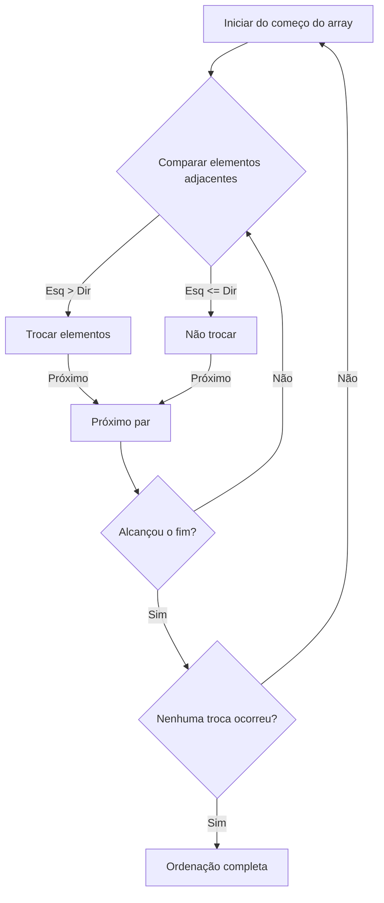
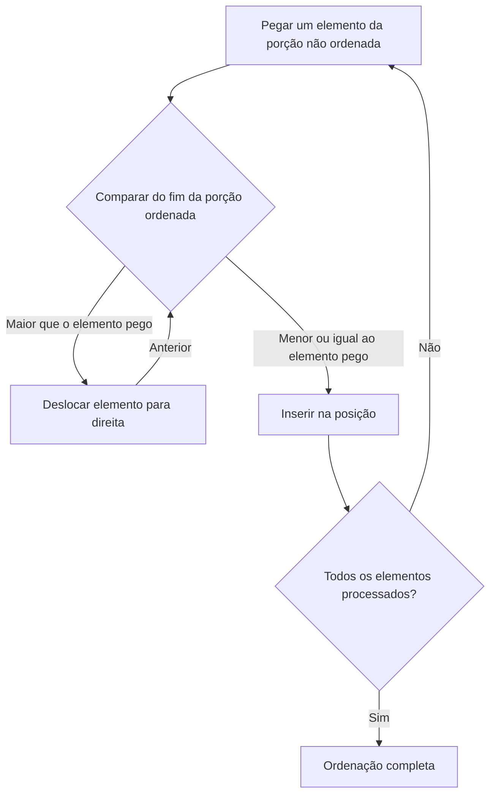
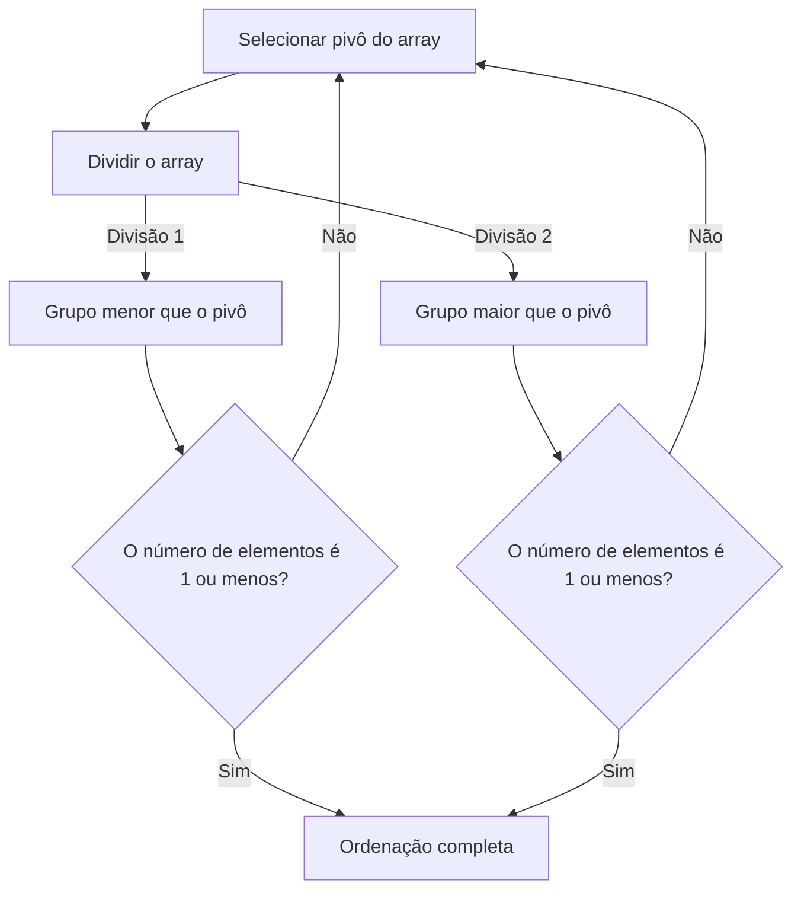
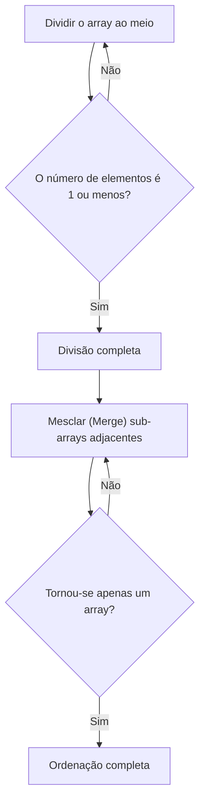

# 1. Introdução: O Mundo Profundo dos Algoritmos de Ordenação

Na ciência da computação, "ordenar" (classificar) dados em uma ordem específica (crescente ou decrescente) é uma das operações mais fundamentais e importantes. Algoritmos de ordenação são utilizados como etapa preliminar para todo o processamento de dados, como acelerar buscas, agrupar dados e detectar duplicatas.

Neste artigo, explicamos detalhadamente os algoritmos de ordenação representativos, desde os simples, fáceis [para iniciantes](/pt/p/produtos-de-couro%E3%81%AE%E3%83%A1%E3%83%B3%E3%83%86%E3%83%8A%E3%83%B3%E3%82%B9/), até os rápidos usados na prática. Entenderemos a mecânica de cada algoritmo visualmente por meio de diagramas no **Mermaid**, verificaremos a implementação real em código Python e compararemos o desempenho, como a complexidade de tempo. Além disso, para compreender totalmente como os algoritmos funcionam, incluímos rastreamentos completos de execução usando um array de 50 elementos. Isso permitirá que você entenda detalhadamente o comportamento dos algoritmos.

## Métricas de Avaliação de Algoritmos

Ao avaliar cada algoritmo, as seguintes métricas são importantes:

- **Complexidade de Tempo (Time Complexity)** : Representa como o tempo de processamento aumenta em relação ao número de elementos $n$ nos dados. Notações Big-O como $\text{O}(n^2)$ e $\text{O}(n \log n)$ são usadas. Se tratar texto dentro de matemática use $\text{best}$.
- **Complexidade de Espaço (Space Complexity)** : Representa quanta memória adicional é necessária em tempo de execução. Algoritmos in-place requerem quase nenhuma memória adicional.
- **Estabilidade (Stability)** : Indica se a ordem relativa dos elementos com o mesmo valor é preservada após a ordenação. Na ordenação estável, a ordem original é mantida.

---

## 2. Bubble Sort (Ordenação por Bolha)

É um algoritmo que repete a operação de comparar elementos adjacentes e trocá-á-los se a ordem for invertida. Assim como bolhas subindo à superfície da água, elementos maiores movem-se gradualmente para o fim do array.

### Complexidade e Características

- **Complexidade de Tempo (Melhor caso)**: $\text{O}(n)$
- **Complexidade de Tempo (Caso médio)**: $\text{O}(n^2)$
- **Complexidade de Tempo (Pior caso)**: $\text{O}(n^2)$
- **Complexidade de Espaço**: $\text{O}(1)$
- **Estabilidade**: Estável

### Diagrama Visual (Mermaid)



### Implementação em Python

```python
def bubble_sort(arr):
    n = len(arr)
    for i in range(n):
        swapped = False
        for j in range(0, n-i-1):
            if arr[j] > arr[j+1]:
                arr[j], arr[j+1] = arr[j+1], arr[j]
                swapped = True
        if not swapped:
            break
    return arr
```

### Rastreamento Detalhado do Bubble Sort

Aqui mostramos o estado do array após a conclusão de cada passo (path) quando executamos o Bubble Sort em um array aleatório de 50 elementos. Observe como o Bubble Sort empurra os elementos para o lado direito.

**Estado inicial**: `[83, 14, 64, 71, 83, 11, 36, 69, 72, 45, 93, 30, 14, 76, 72, 51, 19, 41, 56, 15, 63, 27, 87, 55, 58, 63, 46, 96, 43, 68, 32, 97, 48, 94, 56, 27, 68, 40, 66, 88, 58, 15, 84, 10, 40, 27, 34, 48, 78, 56]`

**Após o passo 1**: `[14, 64, 71, 83, 11, 36, 69, 72, 45, 83, 30, 14, 76, 72, 51, 19, 41, 56, 15, 63, 27, 87, 55, 58, 63, 46, 93, 43, 68, 32, 96, 48, 94, 56, 27, 68, 40, 66, 88, 58, 15, 84, 10, 40, 27, 34, 48, 78, 56, 97]`

Neste passo, o maior elemento na parte não ordenada "flutuou" para a extremidade direita, como uma bolha. Devido às propriedades do Bubble Sort, é garantido que pelo menos um elemento alcance sua posição correta e final a cada passo. Assim, a área de busca pode ser reduzida em um a cada iteração, diminuindo o número de comparações desnecessárias. No entanto, no pior caso, onde os dados estão completamente em ordem inversa, ocorrem operações de troca em cada par de elementos, o que resulta em uma complexidade de tempo de $\text{O}(n^2)$ e um desempenho extremamente pobre.

Neste passo, o maior elemento na parte não ordenada "flutuou" para a extremidade direita, como uma bolha. Devido às propriedades do Bubble Sort, é garantido que pelo menos um elemento alcance sua posição correta e final a cada passo. Assim, a área de busca pode ser reduzida em um a cada iteração, diminuindo o número de comparações desnecessárias. No entanto, no pior caso, onde os dados estão completamente em ordem inversa, ocorrem operações de troca em cada par de elementos, o que resulta em uma complexidade de tempo de $\text{O}(n^2)$ e um desempenho extremamente pobre.

**Após o passo 2**: `[14, 64, 71, 11, 36, 69, 72, 45, 83, 30, 14, 76, 72, 51, 19, 41, 56, 15, 63, 27, 83, 55, 58, 63, 46, 87, 43, 68, 32, 93, 48, 94, 56, 27, 68, 40, 66, 88, 58, 15, 84, 10, 40, 27, 34, 48, 78, 56, 96, 97]`

Neste passo, o maior elemento na parte não ordenada "flutuou" para a extremidade direita, como uma bolha. Devido às propriedades do Bubble Sort, é garantido que pelo menos um elemento alcance sua posição correta e final a cada passo. Assim, a área de busca pode ser reduzida em um a cada iteração, diminuindo o número de comparações desnecessárias. No entanto, no pior caso, onde os dados estão completamente em ordem inversa, ocorrem operações de troca em cada par de elementos, o que resulta em uma complexidade de tempo de $\text{O}(n^2)$ e um desempenho extremamente pobre.

Neste passo, o maior elemento na parte não ordenada "flutuou" para a extremidade direita, como uma bolha. Devido às propriedades do Bubble Sort, é garantido que pelo menos um elemento alcance sua posição correta e final a cada passo. Assim, a área de busca pode ser reduzida em um a cada iteração, diminuindo o número de comparações desnecessárias. No entanto, no pior caso, onde os dados estão completamente em ordem inversa, ocorrem operações de troca em cada par de elementos, o que resulta em uma complexidade de tempo de $\text{O}(n^2)$ e um desempenho extremamente pobre.

**Após o passo 3**: `[14, 64, 11, 36, 69, 71, 45, 72, 30, 14, 76, 72, 51, 19, 41, 56, 15, 63, 27, 83, 55, 58, 63, 46, 83, 43, 68, 32, 87, 48, 93, 56, 27, 68, 40, 66, 88, 58, 15, 84, 10, 40, 27, 34, 48, 78, 56, 94, 96, 97]`

Neste passo, o maior elemento na parte não ordenada "flutuou" para a extremidade direita, como uma bolha. Devido às propriedades do Bubble Sort, é garantido que pelo menos um elemento alcance sua posição correta e final a cada passo. Assim, a área de busca pode ser reduzida em um a cada iteração, diminuindo o número de comparações desnecessárias. No entanto, no pior caso, onde os dados estão completamente em ordem inversa, ocorrem operações de troca em cada par de elementos, o que resulta em uma complexidade de tempo de $\text{O}(n^2)$ e um desempenho extremamente pobre.

Neste passo, o maior elemento na parte não ordenada "flutuou" para a extremidade direita, como uma bolha. Devido às propriedades do Bubble Sort, é garantido que pelo menos um elemento alcance sua posição correta e final a cada passo. Assim, a área de busca pode ser reduzida em um a cada iteração, diminuindo o número de comparações desnecessárias. No entanto, no pior caso, onde os dados estão completamente em ordem inversa, ocorrem operações de troca em cada par de elementos, o que resulta em uma complexidade de tempo de $\text{O}(n^2)$ e um desempenho extremamente pobre.

**Após o passo 4**: `[14, 11, 36, 64, 69, 45, 71, 30, 14, 72, 72, 51, 19, 41, 56, 15, 63, 27, 76, 55, 58, 63, 46, 83, 43, 68, 32, 83, 48, 87, 56, 27, 68, 40, 66, 88, 58, 15, 84, 10, 40, 27, 34, 48, 78, 56, 93, 94, 96, 97]`

Neste passo, o maior elemento na parte não ordenada "flutuou" para a extremidade direita, como uma bolha. Devido às propriedades do Bubble Sort, é garantido que pelo menos um elemento alcance sua posição correta e final a cada passo. Assim, a área de busca pode ser reduzida em um a cada iteração, diminuindo o número de comparações desnecessárias. No entanto, no pior caso, onde os dados estão completamente em ordem inversa, ocorrem operações de troca em cada par de elementos, o que resulta em uma complexidade de tempo de $\text{O}(n^2)$ e um desempenho extremamente pobre.

Neste passo, o maior elemento na parte não ordenada "flutuou" para a extremidade direita, como uma bolha. Devido às propriedades do Bubble Sort, é garantido que pelo menos um elemento alcance sua posição correta e final a cada passo. Assim, a área de busca pode ser reduzida em um a cada iteração, diminuindo o número de comparações desnecessárias. No entanto, no pior caso, onde os dados estão completamente em ordem inversa, ocorrem operações de troca em cada par de elementos, o que resulta em uma complexidade de tempo de $\text{O}(n^2)$ e um desempenho extremamente pobre.

**Após o passo 5**: `[11, 14, 36, 64, 45, 69, 30, 14, 71, 72, 51, 19, 41, 56, 15, 63, 27, 72, 55, 58, 63, 46, 76, 43, 68, 32, 83, 48, 83, 56, 27, 68, 40, 66, 87, 58, 15, 84, 10, 40, 27, 34, 48, 78, 56, 88, 93, 94, 96, 97]`

Neste passo, o maior elemento na parte não ordenada "flutuou" para a extremidade direita, como uma bolha. Devido às propriedades do Bubble Sort, é garantido que pelo menos um elemento alcance sua posição correta e final a cada passo. Assim, a área de busca pode ser reduzida em um a cada iteração, diminuindo o número de comparações desnecessárias. No entanto, no pior caso, onde os dados estão completamente em ordem inversa, ocorrem operações de troca em cada par de elementos, o que resulta em uma complexidade de tempo de $\text{O}(n^2)$ e um desempenho extremamente pobre.

Neste passo, o maior elemento na parte não ordenada "flutuou" para a extremidade direita, como uma bolha. Devido às propriedades do Bubble Sort, é garantido que pelo menos um elemento alcance sua posição correta e final a cada passo. Assim, a área de busca pode ser reduzida em um a cada iteração, diminuindo o número de comparações desnecessárias. No entanto, no pior caso, onde os dados estão completamente em ordem inversa, ocorrem operações de troca em cada par de elementos, o que resulta em uma complexidade de tempo de $\text{O}(n^2)$ e um desempenho extremamente pobre.

**Após o passo 6**: `[11, 14, 36, 45, 64, 30, 14, 69, 71, 51, 19, 41, 56, 15, 63, 27, 72, 55, 58, 63, 46, 72, 43, 68, 32, 76, 48, 83, 56, 27, 68, 40, 66, 83, 58, 15, 84, 10, 40, 27, 34, 48, 78, 56, 87, 88, 93, 94, 96, 97]`

Neste passo, o maior elemento na parte não ordenada "flutuou" para a extremidade direita, como uma bolha. Devido às propriedades do Bubble Sort, é garantido que pelo menos um elemento alcance sua posição correta e final a cada passo. Assim, a área de busca pode ser reduzida em um a cada iteração, diminuindo o número de comparações desnecessárias. No entanto, no pior caso, onde os dados estão completamente em ordem inversa, ocorrem operações de troca em cada par de elementos, o que resulta em uma complexidade de tempo de $\text{O}(n^2)$ e um desempenho extremamente pobre.

Neste passo, o maior elemento na parte não ordenada "flutuou" para a extremidade direita, como uma bolha. Devido às propriedades do Bubble Sort, é garantido que pelo menos um elemento alcance sua posição correta e final a cada passo. Assim, a área de busca pode ser reduzida em um a cada iteração, diminuindo o número de comparações desnecessárias. No entanto, no pior caso, onde os dados estão completamente em ordem inversa, ocorrem operações de troca em cada par de elementos, o que resulta em uma complexidade de tempo de $\text{O}(n^2)$ e um desempenho extremamente pobre.

**Após o passo 7**: `[11, 14, 36, 45, 30, 14, 64, 69, 51, 19, 41, 56, 15, 63, 27, 71, 55, 58, 63, 46, 72, 43, 68, 32, 72, 48, 76, 56, 27, 68, 40, 66, 83, 58, 15, 83, 10, 40, 27, 34, 48, 78, 56, 84, 87, 88, 93, 94, 96, 97]`

Neste passo, o maior elemento na parte não ordenada "flutuou" para a extremidade direita, como uma bolha. Devido às propriedades do Bubble Sort, é garantido que pelo menos um elemento alcance sua posição correta e final a cada passo. Assim, a área de busca pode ser reduzida em um a cada iteração, diminuindo o número de comparações desnecessárias. No entanto, no pior caso, onde os dados estão completamente em ordem inversa, ocorrem operações de troca em cada par de elementos, o que resulta em uma complexidade de tempo de $\text{O}(n^2)$ e um desempenho extremamente pobre.

Neste passo, o maior elemento na parte não ordenada "flutuou" para a extremidade direita, como uma bolha. Devido às propriedades do Bubble Sort, é garantido que pelo menos um elemento alcance sua posição correta e final a cada passo. Assim, a área de busca pode ser reduzida em um a cada iteração, diminuindo o número de comparações desnecessárias. No entanto, no pior caso, onde os dados estão completamente em ordem inversa, ocorrem operações de troca em cada par de elementos, o que resulta em uma complexidade de tempo de $\text{O}(n^2)$ e um desempenho extremamente pobre.

**Após o passo 8**: `[11, 14, 36, 30, 14, 45, 64, 51, 19, 41, 56, 15, 63, 27, 69, 55, 58, 63, 46, 71, 43, 68, 32, 72, 48, 72, 56, 27, 68, 40, 66, 76, 58, 15, 83, 10, 40, 27, 34, 48, 78, 56, 83, 84, 87, 88, 93, 94, 96, 97]`

Neste passo, o maior elemento na parte não ordenada "flutuou" para a extremidade direita, como uma bolha. Devido às propriedades do Bubble Sort, é garantido que pelo menos um elemento alcance sua posição correta e final a cada passo. Assim, a área de busca pode ser reduzida em um a cada iteração, diminuindo o número de comparações desnecessárias. No entanto, no pior caso, onde os dados estão completamente em ordem inversa, ocorrem operações de troca em cada par de elementos, o que resulta em uma complexidade de tempo de $\text{O}(n^2)$ e um desempenho extremamente pobre.

Neste passo, o maior elemento na parte não ordenada "flutuou" para a extremidade direita, como uma bolha. Devido às propriedades do Bubble Sort, é garantido que pelo menos um elemento alcance sua posição correta e final a cada passo. Assim, a área de busca pode ser reduzida em um a cada iteração, diminuindo o número de comparações desnecessárias. No entanto, no pior caso, onde os dados estão completamente em ordem inversa, ocorrem operações de troca em cada par de elementos, o que resulta em uma complexidade de tempo de $\text{O}(n^2)$ e um desempenho extremamente pobre.

**Após o passo 9**: `[11, 14, 30, 14, 36, 45, 51, 19, 41, 56, 15, 63, 27, 64, 55, 58, 63, 46, 69, 43, 68, 32, 71, 48, 72, 56, 27, 68, 40, 66, 72, 58, 15, 76, 10, 40, 27, 34, 48, 78, 56, 83, 83, 84, 87, 88, 93, 94, 96, 97]`

Neste passo, o maior elemento na parte não ordenada "flutuou" para a extremidade direita, como uma bolha. Devido às propriedades do Bubble Sort, é garantido que pelo menos um elemento alcance sua posição correta e final a cada passo. Assim, a área de busca pode ser reduzida em um a cada iteração, diminuindo o número de comparações desnecessárias. No entanto, no pior caso, onde os dados estão completamente em ordem inversa, ocorrem operações de troca em cada par de elementos, o que resulta em uma complexidade de tempo de $\text{O}(n^2)$ e um desempenho extremamente pobre.

Neste passo, o maior elemento na parte não ordenada "flutuou" para a extremidade direita, como uma bolha. Devido às propriedades do Bubble Sort, é garantido que pelo menos um elemento alcance sua posição correta e final a cada passo. Assim, a área de busca pode ser reduzida em um a cada iteração, diminuindo o número de comparações desnecessárias. No entanto, no pior caso, onde os dados estão completamente em ordem inversa, ocorrem operações de troca em cada par de elementos, o que resulta em uma complexidade de tempo de $\text{O}(n^2)$ e um desempenho extremamente pobre.

**Após o passo 10**: `[11, 14, 14, 30, 36, 45, 19, 41, 51, 15, 56, 27, 63, 55, 58, 63, 46, 64, 43, 68, 32, 69, 48, 71, 56, 27, 68, 40, 66, 72, 58, 15, 72, 10, 40, 27, 34, 48, 76, 56, 78, 83, 83, 84, 87, 88, 93, 94, 96, 97]`

Neste passo, o maior elemento na parte não ordenada "flutuou" para a extremidade direita, como uma bolha. Devido às propriedades do Bubble Sort, é garantido que pelo menos um elemento alcance sua posição correta e final a cada passo. Assim, a área de busca pode ser reduzida em um a cada iteração, diminuindo o número de comparações desnecessárias. No entanto, no pior caso, onde os dados estão completamente em ordem inversa, ocorrem operações de troca em cada par de elementos, o que resulta em uma complexidade de tempo de $\text{O}(n^2)$ e um desempenho extremamente pobre.

Neste passo, o maior elemento na parte não ordenada "flutuou" para a extremidade direita, como uma bolha. Devido às propriedades do Bubble Sort, é garantido que pelo menos um elemento alcance sua posição correta e final a cada passo. Assim, a área de busca pode ser reduzida em um a cada iteração, diminuindo o número de comparações desnecessárias. No entanto, no pior caso, onde os dados estão completamente em ordem inversa, ocorrem operações de troca em cada par de elementos, o que resulta em uma complexidade de tempo de $\text{O}(n^2)$ e um desempenho extremamente pobre.

**Após o passo 11**: `[11, 14, 14, 30, 36, 19, 41, 45, 15, 51, 27, 56, 55, 58, 63, 46, 63, 43, 64, 32, 68, 48, 69, 56, 27, 68, 40, 66, 71, 58, 15, 72, 10, 40, 27, 34, 48, 72, 56, 76, 78, 83, 83, 84, 87, 88, 93, 94, 96, 97]`

Neste passo, o maior elemento na parte não ordenada "flutuou" para a extremidade direita, como uma bolha. Devido às propriedades do Bubble Sort, é garantido que pelo menos um elemento alcance sua posição correta e final a cada passo. Assim, a área de busca pode ser reduzida em um a cada iteração, diminuindo o número de comparações desnecessárias. No entanto, no pior caso, onde os dados estão completamente em ordem inversa, ocorrem operações de troca em cada par de elementos, o que resulta em uma complexidade de tempo de $\text{O}(n^2)$ e um desempenho extremamente pobre.

Neste passo, o maior elemento na parte não ordenada "flutuou" para a extremidade direita, como uma bolha. Devido às propriedades do Bubble Sort, é garantido que pelo menos um elemento alcance sua posição correta e final a cada passo. Assim, a área de busca pode ser reduzida em um a cada iteração, diminuindo o número de comparações desnecessárias. No entanto, no pior caso, onde os dados estão completamente em ordem inversa, ocorrem operações de troca em cada par de elementos, o que resulta em uma complexidade de tempo de $\text{O}(n^2)$ e um desempenho extremamente pobre.

**Após o passo 12**: `[11, 14, 14, 30, 19, 36, 41, 15, 45, 27, 51, 55, 56, 58, 46, 63, 43, 63, 32, 64, 48, 68, 56, 27, 68, 40, 66, 69, 58, 15, 71, 10, 40, 27, 34, 48, 72, 56, 72, 76, 78, 83, 83, 84, 87, 88, 93, 94, 96, 97]`

Neste passo, o maior elemento na parte não ordenada "flutuou" para a extremidade direita, como uma bolha. Devido às propriedades do Bubble Sort, é garantido que pelo menos um elemento alcance sua posição correta e final a cada passo. Assim, a área de busca pode ser reduzida em um a cada iteração, diminuindo o número de comparações desnecessárias. No entanto, no pior caso, onde os dados estão completamente em ordem inversa, ocorrem operações de troca em cada par de elementos, o que resulta em uma complexidade de tempo de $\text{O}(n^2)$ e um desempenho extremamente pobre.

Neste passo, o maior elemento na parte não ordenada "flutuou" para a extremidade direita, como uma bolha. Devido às propriedades do Bubble Sort, é garantido que pelo menos um elemento alcance sua posição correta e final a cada passo. Assim, a área de busca pode ser reduzida em um a cada iteração, diminuindo o número de comparações desnecessárias. No entanto, no pior caso, onde os dados estão completamente em ordem inversa, ocorrem operações de troca em cada par de elementos, o que resulta em uma complexidade de tempo de $\text{O}(n^2)$ e um desempenho extremamente pobre.

**Após o passo 13**: `[11, 14, 14, 19, 30, 36, 15, 41, 27, 45, 51, 55, 56, 46, 58, 43, 63, 32, 63, 48, 64, 56, 27, 68, 40, 66, 68, 58, 15, 69, 10, 40, 27, 34, 48, 71, 56, 72, 72, 76, 78, 83, 83, 84, 87, 88, 93, 94, 96, 97]`

Neste passo, o maior elemento na parte não ordenada "flutuou" para a extremidade direita, como uma bolha. Devido às propriedades do Bubble Sort, é garantido que pelo menos um elemento alcance sua posição correta e final a cada passo. Assim, a área de busca pode ser reduzida em um a cada iteração, diminuindo o número de comparações desnecessárias. No entanto, no pior caso, onde os dados estão completamente em ordem inversa, ocorrem operações de troca em cada par de elementos, o que resulta em uma complexidade de tempo de $\text{O}(n^2)$ e um desempenho extremamente pobre.

Neste passo, o maior elemento na parte não ordenada "flutuou" para a extremidade direita, como uma bolha. Devido às propriedades do Bubble Sort, é garantido que pelo menos um elemento alcance sua posição correta e final a cada passo. Assim, a área de busca pode ser reduzida em um a cada iteração, diminuindo o número de comparações desnecessárias. No entanto, no pior caso, onde os dados estão completamente em ordem inversa, ocorrem operações de troca em cada par de elementos, o que resulta em uma complexidade de tempo de $\text{O}(n^2)$ e um desempenho extremamente pobre.

**Após o passo 14**: `[11, 14, 14, 19, 30, 15, 36, 27, 41, 45, 51, 55, 46, 56, 43, 58, 32, 63, 48, 63, 56, 27, 64, 40, 66, 68, 58, 15, 68, 10, 40, 27, 34, 48, 69, 56, 71, 72, 72, 76, 78, 83, 83, 84, 87, 88, 93, 94, 96, 97]`

Neste passo, o maior elemento na parte não ordenada "flutuou" para a extremidade direita, como uma bolha. Devido às propriedades do Bubble Sort, é garantido que pelo menos um elemento alcance sua posição correta e final a cada passo. Assim, a área de busca pode ser reduzida em um a cada iteração, diminuindo o número de comparações desnecessárias. No entanto, no pior caso, onde os dados estão completamente em ordem inversa, ocorrem operações de troca em cada par de elementos, o que resulta em uma complexidade de tempo de $\text{O}(n^2)$ e um desempenho extremamente pobre.

Neste passo, o maior elemento na parte não ordenada "flutuou" para a extremidade direita, como uma bolha. Devido às propriedades do Bubble Sort, é garantido que pelo menos um elemento alcance sua posição correta e final a cada passo. Assim, a área de busca pode ser reduzida em um a cada iteração, diminuindo o número de comparações desnecessárias. No entanto, no pior caso, onde os dados estão completamente em ordem inversa, ocorrem operações de troca em cada par de elementos, o que resulta em uma complexidade de tempo de $\text{O}(n^2)$ e um desempenho extremamente pobre.

**Após o passo 15**: `[11, 14, 14, 19, 15, 30, 27, 36, 41, 45, 51, 46, 55, 43, 56, 32, 58, 48, 63, 56, 27, 63, 40, 64, 66, 58, 15, 68, 10, 40, 27, 34, 48, 68, 56, 69, 71, 72, 72, 76, 78, 83, 83, 84, 87, 88, 93, 94, 96, 97]`

Neste passo, o maior elemento na parte não ordenada "flutuou" para a extremidade direita, como uma bolha. Devido às propriedades do Bubble Sort, é garantido que pelo menos um elemento alcance sua posição correta e final a cada passo. Assim, a área de busca pode ser reduzida em um a cada iteração, diminuindo o número de comparações desnecessárias. No entanto, no pior caso, onde os dados estão completamente em ordem inversa, ocorrem operações de troca em cada par de elementos, o que resulta em uma complexidade de tempo de $\text{O}(n^2)$ e um desempenho extremamente pobre.

Neste passo, o maior elemento na parte não ordenada "flutuou" para a extremidade direita, como uma bolha. Devido às propriedades do Bubble Sort, é garantido que pelo menos um elemento alcance sua posição correta e final a cada passo. Assim, a área de busca pode ser reduzida em um a cada iteração, diminuindo o número de comparações desnecessárias. No entanto, no pior caso, onde os dados estão completamente em ordem inversa, ocorrem operações de troca em cada par de elementos, o que resulta em uma complexidade de tempo de $\text{O}(n^2)$ e um desempenho extremamente pobre.

**Após o passo 16**: `[11, 14, 14, 15, 19, 27, 30, 36, 41, 45, 46, 51, 43, 55, 32, 56, 48, 58, 56, 27, 63, 40, 63, 64, 58, 15, 66, 10, 40, 27, 34, 48, 68, 56, 68, 69, 71, 72, 72, 76, 78, 83, 83, 84, 87, 88, 93, 94, 96, 97]`

Neste passo, o maior elemento na parte não ordenada "flutuou" para a extremidade direita, como uma bolha. Devido às propriedades do Bubble Sort, é garantido que pelo menos um elemento alcance sua posição correta e final a cada passo. Assim, a área de busca pode ser reduzida em um a cada iteração, diminuindo o número de comparações desnecessárias. No entanto, no pior caso, onde os dados estão completamente em ordem inversa, ocorrem operações de troca em cada par de elementos, o que resulta em uma complexidade de tempo de $\text{O}(n^2)$ e um desempenho extremamente pobre.

Neste passo, o maior elemento na parte não ordenada "flutuou" para a extremidade direita, como uma bolha. Devido às propriedades do Bubble Sort, é garantido que pelo menos um elemento alcance sua posição correta e final a cada passo. Assim, a área de busca pode ser reduzida em um a cada iteração, diminuindo o número de comparações desnecessárias. No entanto, no pior caso, onde os dados estão completamente em ordem inversa, ocorrem operações de troca em cada par de elementos, o que resulta em uma complexidade de tempo de $\text{O}(n^2)$ e um desempenho extremamente pobre.

**Após o passo 17**: `[11, 14, 14, 15, 19, 27, 30, 36, 41, 45, 46, 43, 51, 32, 55, 48, 56, 56, 27, 58, 40, 63, 63, 58, 15, 64, 10, 40, 27, 34, 48, 66, 56, 68, 68, 69, 71, 72, 72, 76, 78, 83, 83, 84, 87, 88, 93, 94, 96, 97]`

Neste passo, o maior elemento na parte não ordenada "flutuou" para a extremidade direita, como uma bolha. Devido às propriedades do Bubble Sort, é garantido que pelo menos um elemento alcance sua posição correta e final a cada passo. Assim, a área de busca pode ser reduzida em um a cada iteração, diminuindo o número de comparações desnecessárias. No entanto, no pior caso, onde os dados estão completamente em ordem inversa, ocorrem operações de troca em cada par de elementos, o que resulta em uma complexidade de tempo de $\text{O}(n^2)$ e um desempenho extremamente pobre.

Neste passo, o maior elemento na parte não ordenada "flutuou" para a extremidade direita, como uma bolha. Devido às propriedades do Bubble Sort, é garantido que pelo menos um elemento alcance sua posição correta e final a cada passo. Assim, a área de busca pode ser reduzida em um a cada iteração, diminuindo o número de comparações desnecessárias. No entanto, no pior caso, onde os dados estão completamente em ordem inversa, ocorrem operações de troca em cada par de elementos, o que resulta em uma complexidade de tempo de $\text{O}(n^2)$ e um desempenho extremamente pobre.

**Após o passo 18**: `[11, 14, 14, 15, 19, 27, 30, 36, 41, 45, 43, 46, 32, 51, 48, 55, 56, 27, 56, 40, 58, 63, 58, 15, 63, 10, 40, 27, 34, 48, 64, 56, 66, 68, 68, 69, 71, 72, 72, 76, 78, 83, 83, 84, 87, 88, 93, 94, 96, 97]`

Neste passo, o maior elemento na parte não ordenada "flutuou" para a extremidade direita, como uma bolha. Devido às propriedades do Bubble Sort, é garantido que pelo menos um elemento alcance sua posição correta e final a cada passo. Assim, a área de busca pode ser reduzida em um a cada iteração, diminuindo o número de comparações desnecessárias. No entanto, no pior caso, onde os dados estão completamente em ordem inversa, ocorrem operações de troca em cada par de elementos, o que resulta em uma complexidade de tempo de $\text{O}(n^2)$ e um desempenho extremamente pobre.

Neste passo, o maior elemento na parte não ordenada "flutuou" para a extremidade direita, como uma bolha. Devido às propriedades do Bubble Sort, é garantido que pelo menos um elemento alcance sua posição correta e final a cada passo. Assim, a área de busca pode ser reduzida em um a cada iteração, diminuindo o número de comparações desnecessárias. No entanto, no pior caso, onde os dados estão completamente em ordem inversa, ocorrem operações de troca em cada par de elementos, o que resulta em uma complexidade de tempo de $\text{O}(n^2)$ e um desempenho extremamente pobre.

**Após o passo 19**: `[11, 14, 14, 15, 19, 27, 30, 36, 41, 43, 45, 32, 46, 48, 51, 55, 27, 56, 40, 56, 58, 58, 15, 63, 10, 40, 27, 34, 48, 63, 56, 64, 66, 68, 68, 69, 71, 72, 72, 76, 78, 83, 83, 84, 87, 88, 93, 94, 96, 97]`

Neste passo, o maior elemento na parte não ordenada "flutuou" para a extremidade direita, como uma bolha. Devido às propriedades do Bubble Sort, é garantido que pelo menos um elemento alcance sua posição correta e final a cada passo. Assim, a área de busca pode ser reduzida em um a cada iteração, diminuindo o número de comparações desnecessárias. No entanto, no pior caso, onde os dados estão completamente em ordem inversa, ocorrem operações de troca em cada par de elementos, o que resulta em uma complexidade de tempo de $\text{O}(n^2)$ e um desempenho extremamente pobre.

Neste passo, o maior elemento na parte não ordenada "flutuou" para a extremidade direita, como uma bolha. Devido às propriedades do Bubble Sort, é garantido que pelo menos um elemento alcance sua posição correta e final a cada passo. Assim, a área de busca pode ser reduzida em um a cada iteração, diminuindo o número de comparações desnecessárias. No entanto, no pior caso, onde os dados estão completamente em ordem inversa, ocorrem operações de troca em cada par de elementos, o que resulta em uma complexidade de tempo de $\text{O}(n^2)$ e um desempenho extremamente pobre.

**Após o passo 20**: `[11, 14, 14, 15, 19, 27, 30, 36, 41, 43, 32, 45, 46, 48, 51, 27, 55, 40, 56, 56, 58, 15, 58, 10, 40, 27, 34, 48, 63, 56, 63, 64, 66, 68, 68, 69, 71, 72, 72, 76, 78, 83, 83, 84, 87, 88, 93, 94, 96, 97]`

Neste passo, o maior elemento na parte não ordenada "flutuou" para a extremidade direita, como uma bolha. Devido às propriedades do Bubble Sort, é garantido que pelo menos um elemento alcance sua posição correta e final a cada passo. Assim, a área de busca pode ser reduzida em um a cada iteração, diminuindo o número de comparações desnecessárias. No entanto, no pior caso, onde os dados estão completamente em ordem inversa, ocorrem operações de troca em cada par de elementos, o que resulta em uma complexidade de tempo de $\text{O}(n^2)$ e um desempenho extremamente pobre.

Neste passo, o maior elemento na parte não ordenada "flutuou" para a extremidade direita, como uma bolha. Devido às propriedades do Bubble Sort, é garantido que pelo menos um elemento alcance sua posição correta e final a cada passo. Assim, a área de busca pode ser reduzida em um a cada iteração, diminuindo o número de comparações desnecessárias. No entanto, no pior caso, onde os dados estão completamente em ordem inversa, ocorrem operações de troca em cada par de elementos, o que resulta em uma complexidade de tempo de $\text{O}(n^2)$ e um desempenho extremamente pobre.

**Após o passo 21**: `[11, 14, 14, 15, 19, 27, 30, 36, 41, 32, 43, 45, 46, 48, 27, 51, 40, 55, 56, 56, 15, 58, 10, 40, 27, 34, 48, 58, 56, 63, 63, 64, 66, 68, 68, 69, 71, 72, 72, 76, 78, 83, 83, 84, 87, 88, 93, 94, 96, 97]`

Neste passo, o maior elemento na parte não ordenada "flutuou" para a extremidade direita, como uma bolha. Devido às propriedades do Bubble Sort, é garantido que pelo menos um elemento alcance sua posição correta e final a cada passo. Assim, a área de busca pode ser reduzida em um a cada iteração, diminuindo o número de comparações desnecessárias. No entanto, no pior caso, onde os dados estão completamente em ordem inversa, ocorrem operações de troca em cada par de elementos, o que resulta em uma complexidade de tempo de $\text{O}(n^2)$ e um desempenho extremamente pobre.

Neste passo, o maior elemento na parte não ordenada "flutuou" para a extremidade direita, como uma bolha. Devido às propriedades do Bubble Sort, é garantido que pelo menos um elemento alcance sua posição correta e final a cada passo. Assim, a área de busca pode ser reduzida em um a cada iteração, diminuindo o número de comparações desnecessárias. No entanto, no pior caso, onde os dados estão completamente em ordem inversa, ocorrem operações de troca em cada par de elementos, o que resulta em uma complexidade de tempo de $\text{O}(n^2)$ e um desempenho extremamente pobre.

**Após o passo 22**: `[11, 14, 14, 15, 19, 27, 30, 36, 32, 41, 43, 45, 46, 27, 48, 40, 51, 55, 56, 15, 56, 10, 40, 27, 34, 48, 58, 56, 58, 63, 63, 64, 66, 68, 68, 69, 71, 72, 72, 76, 78, 83, 83, 84, 87, 88, 93, 94, 96, 97]`

Neste passo, o maior elemento na parte não ordenada "flutuou" para a extremidade direita, como uma bolha. Devido às propriedades do Bubble Sort, é garantido que pelo menos um elemento alcance sua posição correta e final a cada passo. Assim, a área de busca pode ser reduzida em um a cada iteração, diminuindo o número de comparações desnecessárias. No entanto, no pior caso, onde os dados estão completamente em ordem inversa, ocorrem operações de troca em cada par de elementos, o que resulta em uma complexidade de tempo de $\text{O}(n^2)$ e um desempenho extremamente pobre.

Neste passo, o maior elemento na parte não ordenada "flutuou" para a extremidade direita, como uma bolha. Devido às propriedades do Bubble Sort, é garantido que pelo menos um elemento alcance sua posição correta e final a cada passo. Assim, a área de busca pode ser reduzida em um a cada iteração, diminuindo o número de comparações desnecessárias. No entanto, no pior caso, onde os dados estão completamente em ordem inversa, ocorrem operações de troca em cada par de elementos, o que resulta em uma complexidade de tempo de $\text{O}(n^2)$ e um desempenho extremamente pobre.

**Após o passo 23**: `[11, 14, 14, 15, 19, 27, 30, 32, 36, 41, 43, 45, 27, 46, 40, 48, 51, 55, 15, 56, 10, 40, 27, 34, 48, 56, 56, 58, 58, 63, 63, 64, 66, 68, 68, 69, 71, 72, 72, 76, 78, 83, 83, 84, 87, 88, 93, 94, 96, 97]`

Neste passo, o maior elemento na parte não ordenada "flutuou" para a extremidade direita, como uma bolha. Devido às propriedades do Bubble Sort, é garantido que pelo menos um elemento alcance sua posição correta e final a cada passo. Assim, a área de busca pode ser reduzida em um a cada iteração, diminuindo o número de comparações desnecessárias. No entanto, no pior caso, onde os dados estão completamente em ordem inversa, ocorrem operações de troca em cada par de elementos, o que resulta em uma complexidade de tempo de $\text{O}(n^2)$ e um desempenho extremamente pobre.

Neste passo, o maior elemento na parte não ordenada "flutuou" para a extremidade direita, como uma bolha. Devido às propriedades do Bubble Sort, é garantido que pelo menos um elemento alcance sua posição correta e final a cada passo. Assim, a área de busca pode ser reduzida em um a cada iteração, diminuindo o número de comparações desnecessárias. No entanto, no pior caso, onde os dados estão completamente em ordem inversa, ocorrem operações de troca em cada par de elementos, o que resulta em uma complexidade de tempo de $\text{O}(n^2)$ e um desempenho extremamente pobre.

**Após o passo 24**: `[11, 14, 14, 15, 19, 27, 30, 32, 36, 41, 43, 27, 45, 40, 46, 48, 51, 15, 55, 10, 40, 27, 34, 48, 56, 56, 56, 58, 58, 63, 63, 64, 66, 68, 68, 69, 71, 72, 72, 76, 78, 83, 83, 84, 87, 88, 93, 94, 96, 97]`

Neste passo, o maior elemento na parte não ordenada "flutuou" para a extremidade direita, como uma bolha. Devido às propriedades do Bubble Sort, é garantido que pelo menos um elemento alcance sua posição correta e final a cada passo. Assim, a área de busca pode ser reduzida em um a cada iteração, diminuindo o número de comparações desnecessárias. No entanto, no pior caso, onde os dados estão completamente em ordem inversa, ocorrem operações de troca em cada par de elementos, o que resulta em uma complexidade de tempo de $\text{O}(n^2)$ e um desempenho extremamente pobre.

Neste passo, o maior elemento na parte não ordenada "flutuou" para a extremidade direita, como uma bolha. Devido às propriedades do Bubble Sort, é garantido que pelo menos um elemento alcance sua posição correta e final a cada passo. Assim, a área de busca pode ser reduzida em um a cada iteração, diminuindo o número de comparações desnecessárias. No entanto, no pior caso, onde os dados estão completamente em ordem inversa, ocorrem operações de troca em cada par de elementos, o que resulta em uma complexidade de tempo de $\text{O}(n^2)$ e um desempenho extremamente pobre.

**Após o passo 25**: `[11, 14, 14, 15, 19, 27, 30, 32, 36, 41, 27, 43, 40, 45, 46, 48, 15, 51, 10, 40, 27, 34, 48, 55, 56, 56, 56, 58, 58, 63, 63, 64, 66, 68, 68, 69, 71, 72, 72, 76, 78, 83, 83, 84, 87, 88, 93, 94, 96, 97]`

Neste passo, o maior elemento na parte não ordenada "flutuou" para a extremidade direita, como uma bolha. Devido às propriedades do Bubble Sort, é garantido que pelo menos um elemento alcance sua posição correta e final a cada passo. Assim, a área de busca pode ser reduzida em um a cada iteração, diminuindo o número de comparações desnecessárias. No entanto, no pior caso, onde os dados estão completamente em ordem inversa, ocorrem operações de troca em cada par de elementos, o que resulta em uma complexidade de tempo de $\text{O}(n^2)$ e um desempenho extremamente pobre.

Neste passo, o maior elemento na parte não ordenada "flutuou" para a extremidade direita, como uma bolha. Devido às propriedades do Bubble Sort, é garantido que pelo menos um elemento alcance sua posição correta e final a cada passo. Assim, a área de busca pode ser reduzida em um a cada iteração, diminuindo o número de comparações desnecessárias. No entanto, no pior caso, onde os dados estão completamente em ordem inversa, ocorrem operações de troca em cada par de elementos, o que resulta em uma complexidade de tempo de $\text{O}(n^2)$ e um desempenho extremamente pobre.

**Após o passo 26**: `[11, 14, 14, 15, 19, 27, 30, 32, 36, 27, 41, 40, 43, 45, 46, 15, 48, 10, 40, 27, 34, 48, 51, 55, 56, 56, 56, 58, 58, 63, 63, 64, 66, 68, 68, 69, 71, 72, 72, 76, 78, 83, 83, 84, 87, 88, 93, 94, 96, 97]`

Neste passo, o maior elemento na parte não ordenada "flutuou" para a extremidade direita, como uma bolha. Devido às propriedades do Bubble Sort, é garantido que pelo menos um elemento alcance sua posição correta e final a cada passo. Assim, a área de busca pode ser reduzida em um a cada iteração, diminuindo o número de comparações desnecessárias. No entanto, no pior caso, onde os dados estão completamente em ordem inversa, ocorrem operações de troca em cada par de elementos, o que resulta em uma complexidade de tempo de $\text{O}(n^2)$ e um desempenho extremamente pobre.

Neste passo, o maior elemento na parte não ordenada "flutuou" para a extremidade direita, como uma bolha. Devido às propriedades do Bubble Sort, é garantido que pelo menos um elemento alcance sua posição correta e final a cada passo. Assim, a área de busca pode ser reduzida em um a cada iteração, diminuindo o número de comparações desnecessárias. No entanto, no pior caso, onde os dados estão completamente em ordem inversa, ocorrem operações de troca em cada par de elementos, o que resulta em uma complexidade de tempo de $\text{O}(n^2)$ e um desempenho extremamente pobre.

**Após o passo 27**: `[11, 14, 14, 15, 19, 27, 30, 32, 27, 36, 40, 41, 43, 45, 15, 46, 10, 40, 27, 34, 48, 48, 51, 55, 56, 56, 56, 58, 58, 63, 63, 64, 66, 68, 68, 69, 71, 72, 72, 76, 78, 83, 83, 84, 87, 88, 93, 94, 96, 97]`

Neste passo, o maior elemento na parte não ordenada "flutuou" para a extremidade direita, como uma bolha. Devido às propriedades do Bubble Sort, é garantido que pelo menos um elemento alcance sua posição correta e final a cada passo. Assim, a área de busca pode ser reduzida em um a cada iteração, diminuindo o número de comparações desnecessárias. No entanto, no pior caso, onde os dados estão completamente em ordem inversa, ocorrem operações de troca em cada par de elementos, o que resulta em uma complexidade de tempo de $\text{O}(n^2)$ e um desempenho extremamente pobre.

Neste passo, o maior elemento na parte não ordenada "flutuou" para a extremidade direita, como uma bolha. Devido às propriedades do Bubble Sort, é garantido que pelo menos um elemento alcance sua posição correta e final a cada passo. Assim, a área de busca pode ser reduzida em um a cada iteração, diminuindo o número de comparações desnecessárias. No entanto, no pior caso, onde os dados estão completamente em ordem inversa, ocorrem operações de troca em cada par de elementos, o que resulta em uma complexidade de tempo de $\text{O}(n^2)$ e um desempenho extremamente pobre.

**Após o passo 28**: `[11, 14, 14, 15, 19, 27, 30, 27, 32, 36, 40, 41, 43, 15, 45, 10, 40, 27, 34, 46, 48, 48, 51, 55, 56, 56, 56, 58, 58, 63, 63, 64, 66, 68, 68, 69, 71, 72, 72, 76, 78, 83, 83, 84, 87, 88, 93, 94, 96, 97]`

Neste passo, o maior elemento na parte não ordenada "flutuou" para a extremidade direita, como uma bolha. Devido às propriedades do Bubble Sort, é garantido que pelo menos um elemento alcance sua posição correta e final a cada passo. Assim, a área de busca pode ser reduzida em um a cada iteração, diminuindo o número de comparações desnecessárias. No entanto, no pior caso, onde os dados estão completamente em ordem inversa, ocorrem operações de troca em cada par de elementos, o que resulta em uma complexidade de tempo de $\text{O}(n^2)$ e um desempenho extremamente pobre.

Neste passo, o maior elemento na parte não ordenada "flutuou" para a extremidade direita, como uma bolha. Devido às propriedades do Bubble Sort, é garantido que pelo menos um elemento alcance sua posição correta e final a cada passo. Assim, a área de busca pode ser reduzida em um a cada iteração, diminuindo o número de comparações desnecessárias. No entanto, no pior caso, onde os dados estão completamente em ordem inversa, ocorrem operações de troca em cada par de elementos, o que resulta em uma complexidade de tempo de $\text{O}(n^2)$ e um desempenho extremamente pobre.

**Após o passo 29**: `[11, 14, 14, 15, 19, 27, 27, 30, 32, 36, 40, 41, 15, 43, 10, 40, 27, 34, 45, 46, 48, 48, 51, 55, 56, 56, 56, 58, 58, 63, 63, 64, 66, 68, 68, 69, 71, 72, 72, 76, 78, 83, 83, 84, 87, 88, 93, 94, 96, 97]`

Neste passo, o maior elemento na parte não ordenada "flutuou" para a extremidade direita, como uma bolha. Devido às propriedades do Bubble Sort, é garantido que pelo menos um elemento alcance sua posição correta e final a cada passo. Assim, a área de busca pode ser reduzida em um a cada iteração, diminuindo o número de comparações desnecessárias. No entanto, no pior caso, onde os dados estão completamente em ordem inversa, ocorrem operações de troca em cada par de elementos, o que resulta em uma complexidade de tempo de $\text{O}(n^2)$ e um desempenho extremamente pobre.

Neste passo, o maior elemento na parte não ordenada "flutuou" para a extremidade direita, como uma bolha. Devido às propriedades do Bubble Sort, é garantido que pelo menos um elemento alcance sua posição correta e final a cada passo. Assim, a área de busca pode ser reduzida em um a cada iteração, diminuindo o número de comparações desnecessárias. No entanto, no pior caso, onde os dados estão completamente em ordem inversa, ocorrem operações de troca em cada par de elementos, o que resulta em uma complexidade de tempo de $\text{O}(n^2)$ e um desempenho extremamente pobre.

**Após o passo 30**: `[11, 14, 14, 15, 19, 27, 27, 30, 32, 36, 40, 15, 41, 10, 40, 27, 34, 43, 45, 46, 48, 48, 51, 55, 56, 56, 56, 58, 58, 63, 63, 64, 66, 68, 68, 69, 71, 72, 72, 76, 78, 83, 83, 84, 87, 88, 93, 94, 96, 97]`

Neste passo, o maior elemento na parte não ordenada "flutuou" para a extremidade direita, como uma bolha. Devido às propriedades do Bubble Sort, é garantido que pelo menos um elemento alcance sua posição correta e final a cada passo. Assim, a área de busca pode ser reduzida em um a cada iteração, diminuindo o número de comparações desnecessárias. No entanto, no pior caso, onde os dados estão completamente em ordem inversa, ocorrem operações de troca em cada par de elementos, o que resulta em uma complexidade de tempo de $\text{O}(n^2)$ e um desempenho extremamente pobre.

Neste passo, o maior elemento na parte não ordenada "flutuou" para a extremidade direita, como uma bolha. Devido às propriedades do Bubble Sort, é garantido que pelo menos um elemento alcance sua posição correta e final a cada passo. Assim, a área de busca pode ser reduzida em um a cada iteração, diminuindo o número de comparações desnecessárias. No entanto, no pior caso, onde os dados estão completamente em ordem inversa, ocorrem operações de troca em cada par de elementos, o que resulta em uma complexidade de tempo de $\text{O}(n^2)$ e um desempenho extremamente pobre.

**Após o passo 31**: `[11, 14, 14, 15, 19, 27, 27, 30, 32, 36, 15, 40, 10, 40, 27, 34, 41, 43, 45, 46, 48, 48, 51, 55, 56, 56, 56, 58, 58, 63, 63, 64, 66, 68, 68, 69, 71, 72, 72, 76, 78, 83, 83, 84, 87, 88, 93, 94, 96, 97]`

Neste passo, o maior elemento na parte não ordenada "flutuou" para a extremidade direita, como uma bolha. Devido às propriedades do Bubble Sort, é garantido que pelo menos um elemento alcance sua posição correta e final a cada passo. Assim, a área de busca pode ser reduzida em um a cada iteração, diminuindo o número de comparações desnecessárias. No entanto, no pior caso, onde os dados estão completamente em ordem inversa, ocorrem operações de troca em cada par de elementos, o que resulta em uma complexidade de tempo de $\text{O}(n^2)$ e um desempenho extremamente pobre.

Neste passo, o maior elemento na parte não ordenada "flutuou" para a extremidade direita, como uma bolha. Devido às propriedades do Bubble Sort, é garantido que pelo menos um elemento alcance sua posição correta e final a cada passo. Assim, a área de busca pode ser reduzida em um a cada iteração, diminuindo o número de comparações desnecessárias. No entanto, no pior caso, onde os dados estão completamente em ordem inversa, ocorrem operações de troca em cada par de elementos, o que resulta em uma complexidade de tempo de $\text{O}(n^2)$ e um desempenho extremamente pobre.

**Após o passo 32**: `[11, 14, 14, 15, 19, 27, 27, 30, 32, 15, 36, 10, 40, 27, 34, 40, 41, 43, 45, 46, 48, 48, 51, 55, 56, 56, 56, 58, 58, 63, 63, 64, 66, 68, 68, 69, 71, 72, 72, 76, 78, 83, 83, 84, 87, 88, 93, 94, 96, 97]`

Neste passo, o maior elemento na parte não ordenada "flutuou" para a extremidade direita, como uma bolha. Devido às propriedades do Bubble Sort, é garantido que pelo menos um elemento alcance sua posição correta e final a cada passo. Assim, a área de busca pode ser reduzida em um a cada iteração, diminuindo o número de comparações desnecessárias. No entanto, no pior caso, onde os dados estão completamente em ordem inversa, ocorrem operações de troca em cada par de elementos, o que resulta em uma complexidade de tempo de $\text{O}(n^2)$ e um desempenho extremamente pobre.

Neste passo, o maior elemento na parte não ordenada "flutuou" para a extremidade direita, como uma bolha. Devido às propriedades do Bubble Sort, é garantido que pelo menos um elemento alcance sua posição correta e final a cada passo. Assim, a área de busca pode ser reduzida em um a cada iteração, diminuindo o número de comparações desnecessárias. No entanto, no pior caso, onde os dados estão completamente em ordem inversa, ocorrem operações de troca em cada par de elementos, o que resulta em uma complexidade de tempo de $\text{O}(n^2)$ e um desempenho extremamente pobre.

**Após o passo 33**: `[11, 14, 14, 15, 19, 27, 27, 30, 15, 32, 10, 36, 27, 34, 40, 40, 41, 43, 45, 46, 48, 48, 51, 55, 56, 56, 56, 58, 58, 63, 63, 64, 66, 68, 68, 69, 71, 72, 72, 76, 78, 83, 83, 84, 87, 88, 93, 94, 96, 97]`

Neste passo, o maior elemento na parte não ordenada "flutuou" para a extremidade direita, como uma bolha. Devido às propriedades do Bubble Sort, é garantido que pelo menos um elemento alcance sua posição correta e final a cada passo. Assim, a área de busca pode ser reduzida em um a cada iteração, diminuindo o número de comparações desnecessárias. No entanto, no pior caso, onde os dados estão completamente em ordem inversa, ocorrem operações de troca em cada par de elementos, o que resulta em uma complexidade de tempo de $\text{O}(n^2)$ e um desempenho extremamente pobre.

Neste passo, o maior elemento na parte não ordenada "flutuou" para a extremidade direita, como uma bolha. Devido às propriedades do Bubble Sort, é garantido que pelo menos um elemento alcance sua posição correta e final a cada passo. Assim, a área de busca pode ser reduzida em um a cada iteração, diminuindo o número de comparações desnecessárias. No entanto, no pior caso, onde os dados estão completamente em ordem inversa, ocorrem operações de troca em cada par de elementos, o que resulta em uma complexidade de tempo de $\text{O}(n^2)$ e um desempenho extremamente pobre.

**Após o passo 34**: `[11, 14, 14, 15, 19, 27, 27, 15, 30, 10, 32, 27, 34, 36, 40, 40, 41, 43, 45, 46, 48, 48, 51, 55, 56, 56, 56, 58, 58, 63, 63, 64, 66, 68, 68, 69, 71, 72, 72, 76, 78, 83, 83, 84, 87, 88, 93, 94, 96, 97]`

Neste passo, o maior elemento na parte não ordenada "flutuou" para a extremidade direita, como uma bolha. Devido às propriedades do Bubble Sort, é garantido que pelo menos um elemento alcance sua posição correta e final a cada passo. Assim, a área de busca pode ser reduzida em um a cada iteração, diminuindo o número de comparações desnecessárias. No entanto, no pior caso, onde os dados estão completamente em ordem inversa, ocorrem operações de troca em cada par de elementos, o que resulta em uma complexidade de tempo de $\text{O}(n^2)$ e um desempenho extremamente pobre.

Neste passo, o maior elemento na parte não ordenada "flutuou" para a extremidade direita, como uma bolha. Devido às propriedades do Bubble Sort, é garantido que pelo menos um elemento alcance sua posição correta e final a cada passo. Assim, a área de busca pode ser reduzida em um a cada iteração, diminuindo o número de comparações desnecessárias. No entanto, no pior caso, onde os dados estão completamente em ordem inversa, ocorrem operações de troca em cada par de elementos, o que resulta em uma complexidade de tempo de $\text{O}(n^2)$ e um desempenho extremamente pobre.

**Após o passo 35**: `[11, 14, 14, 15, 19, 27, 15, 27, 10, 30, 27, 32, 34, 36, 40, 40, 41, 43, 45, 46, 48, 48, 51, 55, 56, 56, 56, 58, 58, 63, 63, 64, 66, 68, 68, 69, 71, 72, 72, 76, 78, 83, 83, 84, 87, 88, 93, 94, 96, 97]`

Neste passo, o maior elemento na parte não ordenada "flutuou" para a extremidade direita, como uma bolha. Devido às propriedades do Bubble Sort, é garantido que pelo menos um elemento alcance sua posição correta e final a cada passo. Assim, a área de busca pode ser reduzida em um a cada iteração, diminuindo o número de comparações desnecessárias. No entanto, no pior caso, onde os dados estão completamente em ordem inversa, ocorrem operações de troca em cada par de elementos, o que resulta em uma complexidade de tempo de $\text{O}(n^2)$ e um desempenho extremamente pobre.

Neste passo, o maior elemento na parte não ordenada "flutuou" para a extremidade direita, como uma bolha. Devido às propriedades do Bubble Sort, é garantido que pelo menos um elemento alcance sua posição correta e final a cada passo. Assim, a área de busca pode ser reduzida em um a cada iteração, diminuindo o número de comparações desnecessárias. No entanto, no pior caso, onde os dados estão completamente em ordem inversa, ocorrem operações de troca em cada par de elementos, o que resulta em uma complexidade de tempo de $\text{O}(n^2)$ e um desempenho extremamente pobre.

**Após o passo 36**: `[11, 14, 14, 15, 19, 15, 27, 10, 27, 27, 30, 32, 34, 36, 40, 40, 41, 43, 45, 46, 48, 48, 51, 55, 56, 56, 56, 58, 58, 63, 63, 64, 66, 68, 68, 69, 71, 72, 72, 76, 78, 83, 83, 84, 87, 88, 93, 94, 96, 97]`

Neste passo, o maior elemento na parte não ordenada "flutuou" para a extremidade direita, como uma bolha. Devido às propriedades do Bubble Sort, é garantido que pelo menos um elemento alcance sua posição correta e final a cada passo. Assim, a área de busca pode ser reduzida em um a cada iteração, diminuindo o número de comparações desnecessárias. No entanto, no pior caso, onde os dados estão completamente em ordem inversa, ocorrem operações de troca em cada par de elementos, o que resulta em uma complexidade de tempo de $\text{O}(n^2)$ e um desempenho extremamente pobre.

Neste passo, o maior elemento na parte não ordenada "flutuou" para a extremidade direita, como uma bolha. Devido às propriedades do Bubble Sort, é garantido que pelo menos um elemento alcance sua posição correta e final a cada passo. Assim, a área de busca pode ser reduzida em um a cada iteração, diminuindo o número de comparações desnecessárias. No entanto, no pior caso, onde os dados estão completamente em ordem inversa, ocorrem operações de troca em cada par de elementos, o que resulta em uma complexidade de tempo de $\text{O}(n^2)$ e um desempenho extremamente pobre.

**Após o passo 37**: `[11, 14, 14, 15, 15, 19, 10, 27, 27, 27, 30, 32, 34, 36, 40, 40, 41, 43, 45, 46, 48, 48, 51, 55, 56, 56, 56, 58, 58, 63, 63, 64, 66, 68, 68, 69, 71, 72, 72, 76, 78, 83, 83, 84, 87, 88, 93, 94, 96, 97]`

Neste passo, o maior elemento na parte não ordenada "flutuou" para a extremidade direita, como uma bolha. Devido às propriedades do Bubble Sort, é garantido que pelo menos um elemento alcance sua posição correta e final a cada passo. Assim, a área de busca pode ser reduzida em um a cada iteração, diminuindo o número de comparações desnecessárias. No entanto, no pior caso, onde os dados estão completamente em ordem inversa, ocorrem operações de troca em cada par de elementos, o que resulta em uma complexidade de tempo de $\text{O}(n^2)$ e um desempenho extremamente pobre.

Neste passo, o maior elemento na parte não ordenada "flutuou" para a extremidade direita, como uma bolha. Devido às propriedades do Bubble Sort, é garantido que pelo menos um elemento alcance sua posição correta e final a cada passo. Assim, a área de busca pode ser reduzida em um a cada iteração, diminuindo o número de comparações desnecessárias. No entanto, no pior caso, onde os dados estão completamente em ordem inversa, ocorrem operações de troca em cada par de elementos, o que resulta em uma complexidade de tempo de $\text{O}(n^2)$ e um desempenho extremamente pobre.

**Após o passo 38**: `[11, 14, 14, 15, 15, 10, 19, 27, 27, 27, 30, 32, 34, 36, 40, 40, 41, 43, 45, 46, 48, 48, 51, 55, 56, 56, 56, 58, 58, 63, 63, 64, 66, 68, 68, 69, 71, 72, 72, 76, 78, 83, 83, 84, 87, 88, 93, 94, 96, 97]`

Neste passo, o maior elemento na parte não ordenada "flutuou" para a extremidade direita, como uma bolha. Devido às propriedades do Bubble Sort, é garantido que pelo menos um elemento alcance sua posição correta e final a cada passo. Assim, a área de busca pode ser reduzida em um a cada iteração, diminuindo o número de comparações desnecessárias. No entanto, no pior caso, onde os dados estão completamente em ordem inversa, ocorrem operações de troca em cada par de elementos, o que resulta em uma complexidade de tempo de $\text{O}(n^2)$ e um desempenho extremamente pobre.

Neste passo, o maior elemento na parte não ordenada "flutuou" para a extremidade direita, como uma bolha. Devido às propriedades do Bubble Sort, é garantido que pelo menos um elemento alcance sua posição correta e final a cada passo. Assim, a área de busca pode ser reduzida em um a cada iteração, diminuindo o número de comparações desnecessárias. No entanto, no pior caso, onde os dados estão completamente em ordem inversa, ocorrem operações de troca em cada par de elementos, o que resulta em uma complexidade de tempo de $\text{O}(n^2)$ e um desempenho extremamente pobre.

**Após o passo 39**: `[11, 14, 14, 15, 10, 15, 19, 27, 27, 27, 30, 32, 34, 36, 40, 40, 41, 43, 45, 46, 48, 48, 51, 55, 56, 56, 56, 58, 58, 63, 63, 64, 66, 68, 68, 69, 71, 72, 72, 76, 78, 83, 83, 84, 87, 88, 93, 94, 96, 97]`

Neste passo, o maior elemento na parte não ordenada "flutuou" para a extremidade direita, como uma bolha. Devido às propriedades do Bubble Sort, é garantido que pelo menos um elemento alcance sua posição correta e final a cada passo. Assim, a área de busca pode ser reduzida em um a cada iteração, diminuindo o número de comparações desnecessárias. No entanto, no pior caso, onde os dados estão completamente em ordem inversa, ocorrem operações de troca em cada par de elementos, o que resulta em uma complexidade de tempo de $\text{O}(n^2)$ e um desempenho extremamente pobre.

Neste passo, o maior elemento na parte não ordenada "flutuou" para a extremidade direita, como uma bolha. Devido às propriedades do Bubble Sort, é garantido que pelo menos um elemento alcance sua posição correta e final a cada passo. Assim, a área de busca pode ser reduzida em um a cada iteração, diminuindo o número de comparações desnecessárias. No entanto, no pior caso, onde os dados estão completamente em ordem inversa, ocorrem operações de troca em cada par de elementos, o que resulta em uma complexidade de tempo de $\text{O}(n^2)$ e um desempenho extremamente pobre.

**Após o passo 40**: `[11, 14, 14, 10, 15, 15, 19, 27, 27, 27, 30, 32, 34, 36, 40, 40, 41, 43, 45, 46, 48, 48, 51, 55, 56, 56, 56, 58, 58, 63, 63, 64, 66, 68, 68, 69, 71, 72, 72, 76, 78, 83, 83, 84, 87, 88, 93, 94, 96, 97]`

Neste passo, o maior elemento na parte não ordenada "flutuou" para a extremidade direita, como uma bolha. Devido às propriedades do Bubble Sort, é garantido que pelo menos um elemento alcance sua posição correta e final a cada passo. Assim, a área de busca pode ser reduzida em um a cada iteração, diminuindo o número de comparações desnecessárias. No entanto, no pior caso, onde os dados estão completamente em ordem inversa, ocorrem operações de troca em cada par de elementos, o que resulta em uma complexidade de tempo de $\text{O}(n^2)$ e um desempenho extremamente pobre.

Neste passo, o maior elemento na parte não ordenada "flutuou" para a extremidade direita, como uma bolha. Devido às propriedades do Bubble Sort, é garantido que pelo menos um elemento alcance sua posição correta e final a cada passo. Assim, a área de busca pode ser reduzida em um a cada iteração, diminuindo o número de comparações desnecessárias. No entanto, no pior caso, onde os dados estão completamente em ordem inversa, ocorrem operações de troca em cada par de elementos, o que resulta em uma complexidade de tempo de $\text{O}(n^2)$ e um desempenho extremamente pobre.

**Após o passo 41**: `[11, 14, 10, 14, 15, 15, 19, 27, 27, 27, 30, 32, 34, 36, 40, 40, 41, 43, 45, 46, 48, 48, 51, 55, 56, 56, 56, 58, 58, 63, 63, 64, 66, 68, 68, 69, 71, 72, 72, 76, 78, 83, 83, 84, 87, 88, 93, 94, 96, 97]`

Neste passo, o maior elemento na parte não ordenada "flutuou" para a extremidade direita, como uma bolha. Devido às propriedades do Bubble Sort, é garantido que pelo menos um elemento alcance sua posição correta e final a cada passo. Assim, a área de busca pode ser reduzida em um a cada iteração, diminuindo o número de comparações desnecessárias. No entanto, no pior caso, onde os dados estão completamente em ordem inversa, ocorrem operações de troca em cada par de elementos, o que resulta em uma complexidade de tempo de $\text{O}(n^2)$ e um desempenho extremamente pobre.

Neste passo, o maior elemento na parte não ordenada "flutuou" para a extremidade direita, como uma bolha. Devido às propriedades do Bubble Sort, é garantido que pelo menos um elemento alcance sua posição correta e final a cada passo. Assim, a área de busca pode ser reduzida em um a cada iteração, diminuindo o número de comparações desnecessárias. No entanto, no pior caso, onde os dados estão completamente em ordem inversa, ocorrem operações de troca em cada par de elementos, o que resulta em uma complexidade de tempo de $\text{O}(n^2)$ e um desempenho extremamente pobre.

**Após o passo 42**: `[11, 10, 14, 14, 15, 15, 19, 27, 27, 27, 30, 32, 34, 36, 40, 40, 41, 43, 45, 46, 48, 48, 51, 55, 56, 56, 56, 58, 58, 63, 63, 64, 66, 68, 68, 69, 71, 72, 72, 76, 78, 83, 83, 84, 87, 88, 93, 94, 96, 97]`

Neste passo, o maior elemento na parte não ordenada "flutuou" para a extremidade direita, como uma bolha. Devido às propriedades do Bubble Sort, é garantido que pelo menos um elemento alcance sua posição correta e final a cada passo. Assim, a área de busca pode ser reduzida em um a cada iteração, diminuindo o número de comparações desnecessárias. No entanto, no pior caso, onde os dados estão completamente em ordem inversa, ocorrem operações de troca em cada par de elementos, o que resulta em uma complexidade de tempo de $\text{O}(n^2)$ e um desempenho extremamente pobre.

Neste passo, o maior elemento na parte não ordenada "flutuou" para a extremidade direita, como uma bolha. Devido às propriedades do Bubble Sort, é garantido que pelo menos um elemento alcance sua posição correta e final a cada passo. Assim, a área de busca pode ser reduzida em um a cada iteração, diminuindo o número de comparações desnecessárias. No entanto, no pior caso, onde os dados estão completamente em ordem inversa, ocorrem operações de troca em cada par de elementos, o que resulta em uma complexidade de tempo de $\text{O}(n^2)$ e um desempenho extremamente pobre.

**Após o passo 43**: `[10, 11, 14, 14, 15, 15, 19, 27, 27, 27, 30, 32, 34, 36, 40, 40, 41, 43, 45, 46, 48, 48, 51, 55, 56, 56, 56, 58, 58, 63, 63, 64, 66, 68, 68, 69, 71, 72, 72, 76, 78, 83, 83, 84, 87, 88, 93, 94, 96, 97]`

Neste passo, o maior elemento na parte não ordenada "flutuou" para a extremidade direita, como uma bolha. Devido às propriedades do Bubble Sort, é garantido que pelo menos um elemento alcance sua posição correta e final a cada passo. Assim, a área de busca pode ser reduzida em um a cada iteração, diminuindo o número de comparações desnecessárias. No entanto, no pior caso, onde os dados estão completamente em ordem inversa, ocorrem operações de troca em cada par de elementos, o que resulta em uma complexidade de tempo de $\text{O}(n^2)$ e um desempenho extremamente pobre.

Neste passo, o maior elemento na parte não ordenada "flutuou" para a extremidade direita, como uma bolha. Devido às propriedades do Bubble Sort, é garantido que pelo menos um elemento alcance sua posição correta e final a cada passo. Assim, a área de busca pode ser reduzida em um a cada iteração, diminuindo o número de comparações desnecessárias. No entanto, no pior caso, onde os dados estão completamente em ordem inversa, ocorrem operações de troca em cada par de elementos, o que resulta em uma complexidade de tempo de $\text{O}(n^2)$ e um desempenho extremamente pobre.

**Após o passo 44**: `[10, 11, 14, 14, 15, 15, 19, 27, 27, 27, 30, 32, 34, 36, 40, 40, 41, 43, 45, 46, 48, 48, 51, 55, 56, 56, 56, 58, 58, 63, 63, 64, 66, 68, 68, 69, 71, 72, 72, 76, 78, 83, 83, 84, 87, 88, 93, 94, 96, 97]`

Neste passo, o maior elemento na parte não ordenada "flutuou" para a extremidade direita, como uma bolha. Devido às propriedades do Bubble Sort, é garantido que pelo menos um elemento alcance sua posição correta e final a cada passo. Assim, a área de busca pode ser reduzida em um a cada iteração, diminuindo o número de comparações desnecessárias. No entanto, no pior caso, onde os dados estão completamente em ordem inversa, ocorrem operações de troca em cada par de elementos, o que resulta em uma complexidade de tempo de $\text{O}(n^2)$ e um desempenho extremamente pobre.

Neste passo, o maior elemento na parte não ordenada "flutuou" para a extremidade direita, como uma bolha. Devido às propriedades do Bubble Sort, é garantido que pelo menos um elemento alcance sua posição correta e final a cada passo. Assim, a área de busca pode ser reduzida em um a cada iteração, diminuindo o número de comparações desnecessárias. No entanto, no pior caso, onde os dados estão completamente em ordem inversa, ocorrem operações de troca em cada par de elementos, o que resulta em uma complexidade de tempo de $\text{O}(n^2)$ e um desempenho extremamente pobre.

Como nenhuma troca ocorreu no passo 44, determina-se que a ordenação está completa e o algoritmo termina.

## 3. Insertion Sort (Ordenação por Inserção)

É um algoritmo onde os elementos da porção não classificada são pegos um a um e inseridos na posição apropriada na porção já classificada, assim como ordenar cartas de jogar nas mãos.

### Complexidade e Características

- **Complexidade de Tempo (Melhor caso)**: $\text{O}(n)$
- **Complexidade de Tempo (Caso médio)**: $\text{O}(n^2)$
- **Complexidade de Tempo (Pior caso)**: $\text{O}(n^2)$
- **Complexidade de Espaço**: $\text{O}(1)$
- **Estabilidade**: Estável

### Diagrama Visual (Mermaid)



### Implementação em Python

```python
def insertion_sort(arr):
    for i in range(1, len(arr)):
        key = arr[i]
        j = i - 1
        while j >= 0 and key < arr[j]:
            arr[j + 1] = arr[j]
            j -= 1
        arr[j + 1] = key
    return arr
```

### Rastreamento Detalhado do Insertion Sort

Mostramos o estado do array após a inserção de cada elemento ao executar o Insertion Sort em um array aleatório de 50 elementos. Você pode observar a porção classificada à esquerda expandindo gradualmente.

**Estado inicial**: `[97, 29, 43, 96, 91, 22, 51, 83, 31, 13, 62, 62, 19, 23, 26, 50, 70, 84, 67, 62, 36, 35, 50, 90, 97, 52, 52, 64, 21, 90, 76, 72, 61, 20, 36, 83, 41, 14, 35, 22, 20, 34, 42, 98, 46, 49, 98, 42, 30, 89]`

**Passo 1 (Após inserir o elemento 29)**: `[29, 97, 43, 96, 91, 22, 51, 83, 31, 13, 62, 62, 19, 23, 26, 50, 70, 84, 67, 62, 36, 35, 50, 90, 97, 52, 52, 64, 21, 90, 76, 72, 61, 20, 36, 83, 41, 14, 35, 22, 20, 34, 42, 98, 46, 49, 98, 42, 30, 89]`

O Insertion Sort tem a excelente propriedade de ser concluído em tempo $\text{O}(n)$ para arrays já ordenados. Para uma quantidade pequena de dados ou dados que já estão na maior parte ordenados, ele frequentemente roda mais rápido que Quick Sort ou Merge Sort, pois a sobrecarga de constante é pequena. Aproveitando esta característica, muitas bibliotecas padrão (como TimSort em Python) adotam uma abordagem híbrida mudando para Insertion Sort quando o tamanho dos dados é pequeno, como no final das chamadas recursivas.

O Insertion Sort tem a excelente propriedade de ser concluído em tempo $\text{O}(n)$ para arrays já ordenados. Para uma quantidade pequena de dados ou dados que já estão na maior parte ordenados, ele frequentemente roda mais rápido que Quick Sort ou Merge Sort, pois a sobrecarga de constante é pequena. Aproveitando esta característica, muitas bibliotecas padrão (como TimSort em Python) adotam uma abordagem híbrida mudando para Insertion Sort quando o tamanho dos dados é pequeno, como no final das chamadas recursivas.

**Passo 2 (Após inserir o elemento 43)**: `[29, 43, 97, 96, 91, 22, 51, 83, 31, 13, 62, 62, 19, 23, 26, 50, 70, 84, 67, 62, 36, 35, 50, 90, 97, 52, 52, 64, 21, 90, 76, 72, 61, 20, 36, 83, 41, 14, 35, 22, 20, 34, 42, 98, 46, 49, 98, 42, 30, 89]`

O Insertion Sort tem a excelente propriedade de ser concluído em tempo $\text{O}(n)$ para arrays já ordenados. Para uma quantidade pequena de dados ou dados que já estão na maior parte ordenados, ele frequentemente roda mais rápido que Quick Sort ou Merge Sort, pois a sobrecarga de constante é pequena. Aproveitando esta característica, muitas bibliotecas padrão (como TimSort em Python) adotam uma abordagem híbrida mudando para Insertion Sort quando o tamanho dos dados é pequeno, como no final das chamadas recursivas.

O Insertion Sort tem a excelente propriedade de ser concluído em tempo $\text{O}(n)$ para arrays já ordenados. Para uma quantidade pequena de dados ou dados que já estão na maior parte ordenados, ele frequentemente roda mais rápido que Quick Sort ou Merge Sort, pois a sobrecarga de constante é pequena. Aproveitando esta característica, muitas bibliotecas padrão (como TimSort em Python) adotam uma abordagem híbrida mudando para Insertion Sort quando o tamanho dos dados é pequeno, como no final das chamadas recursivas.

**Passo 3 (Após inserir o elemento 96)**: `[29, 43, 96, 97, 91, 22, 51, 83, 31, 13, 62, 62, 19, 23, 26, 50, 70, 84, 67, 62, 36, 35, 50, 90, 97, 52, 52, 64, 21, 90, 76, 72, 61, 20, 36, 83, 41, 14, 35, 22, 20, 34, 42, 98, 46, 49, 98, 42, 30, 89]`

O Insertion Sort tem a excelente propriedade de ser concluído em tempo $\text{O}(n)$ para arrays já ordenados. Para uma quantidade pequena de dados ou dados que já estão na maior parte ordenados, ele frequentemente roda mais rápido que Quick Sort ou Merge Sort, pois a sobrecarga de constante é pequena. Aproveitando esta característica, muitas bibliotecas padrão (como TimSort em Python) adotam uma abordagem híbrida mudando para Insertion Sort quando o tamanho dos dados é pequeno, como no final das chamadas recursivas.

O Insertion Sort tem a excelente propriedade de ser concluído em tempo $\text{O}(n)$ para arrays já ordenados. Para uma quantidade pequena de dados ou dados que já estão na maior parte ordenados, ele frequentemente roda mais rápido que Quick Sort ou Merge Sort, pois a sobrecarga de constante é pequena. Aproveitando esta característica, muitas bibliotecas padrão (como TimSort em Python) adotam uma abordagem híbrida mudando para Insertion Sort quando o tamanho dos dados é pequeno, como no final das chamadas recursivas.

**Passo 4 (Após inserir o elemento 91)**: `[29, 43, 91, 96, 97, 22, 51, 83, 31, 13, 62, 62, 19, 23, 26, 50, 70, 84, 67, 62, 36, 35, 50, 90, 97, 52, 52, 64, 21, 90, 76, 72, 61, 20, 36, 83, 41, 14, 35, 22, 20, 34, 42, 98, 46, 49, 98, 42, 30, 89]`

O Insertion Sort tem a excelente propriedade de ser concluído em tempo $\text{O}(n)$ para arrays já ordenados. Para uma quantidade pequena de dados ou dados que já estão na maior parte ordenados, ele frequentemente roda mais rápido que Quick Sort ou Merge Sort, pois a sobrecarga de constante é pequena. Aproveitando esta característica, muitas bibliotecas padrão (como TimSort em Python) adotam uma abordagem híbrida mudando para Insertion Sort quando o tamanho dos dados é pequeno, como no final das chamadas recursivas.

O Insertion Sort tem a excelente propriedade de ser concluído em tempo $\text{O}(n)$ para arrays já ordenados. Para uma quantidade pequena de dados ou dados que já estão na maior parte ordenados, ele frequentemente roda mais rápido que Quick Sort ou Merge Sort, pois a sobrecarga de constante é pequena. Aproveitando esta característica, muitas bibliotecas padrão (como TimSort em Python) adotam uma abordagem híbrida mudando para Insertion Sort quando o tamanho dos dados é pequeno, como no final das chamadas recursivas.

**Passo 5 (Após inserir o elemento 22)**: `[22, 29, 43, 91, 96, 97, 51, 83, 31, 13, 62, 62, 19, 23, 26, 50, 70, 84, 67, 62, 36, 35, 50, 90, 97, 52, 52, 64, 21, 90, 76, 72, 61, 20, 36, 83, 41, 14, 35, 22, 20, 34, 42, 98, 46, 49, 98, 42, 30, 89]`

O Insertion Sort tem a excelente propriedade de ser concluído em tempo $\text{O}(n)$ para arrays já ordenados. Para uma quantidade pequena de dados ou dados que já estão na maior parte ordenados, ele frequentemente roda mais rápido que Quick Sort ou Merge Sort, pois a sobrecarga de constante é pequena. Aproveitando esta característica, muitas bibliotecas padrão (como TimSort em Python) adotam uma abordagem híbrida mudando para Insertion Sort quando o tamanho dos dados é pequeno, como no final das chamadas recursivas.

O Insertion Sort tem a excelente propriedade de ser concluído em tempo $\text{O}(n)$ para arrays já ordenados. Para uma quantidade pequena de dados ou dados que já estão na maior parte ordenados, ele frequentemente roda mais rápido que Quick Sort ou Merge Sort, pois a sobrecarga de constante é pequena. Aproveitando esta característica, muitas bibliotecas padrão (como TimSort em Python) adotam uma abordagem híbrida mudando para Insertion Sort quando o tamanho dos dados é pequeno, como no final das chamadas recursivas.

**Passo 6 (Após inserir o elemento 51)**: `[22, 29, 43, 51, 91, 96, 97, 83, 31, 13, 62, 62, 19, 23, 26, 50, 70, 84, 67, 62, 36, 35, 50, 90, 97, 52, 52, 64, 21, 90, 76, 72, 61, 20, 36, 83, 41, 14, 35, 22, 20, 34, 42, 98, 46, 49, 98, 42, 30, 89]`

O Insertion Sort tem a excelente propriedade de ser concluído em tempo $\text{O}(n)$ para arrays já ordenados. Para uma quantidade pequena de dados ou dados que já estão na maior parte ordenados, ele frequentemente roda mais rápido que Quick Sort ou Merge Sort, pois a sobrecarga de constante é pequena. Aproveitando esta característica, muitas bibliotecas padrão (como TimSort em Python) adotam uma abordagem híbrida mudando para Insertion Sort quando o tamanho dos dados é pequeno, como no final das chamadas recursivas.

O Insertion Sort tem a excelente propriedade de ser concluído em tempo $\text{O}(n)$ para arrays já ordenados. Para uma quantidade pequena de dados ou dados que já estão na maior parte ordenados, ele frequentemente roda mais rápido que Quick Sort ou Merge Sort, pois a sobrecarga de constante é pequena. Aproveitando esta característica, muitas bibliotecas padrão (como TimSort em Python) adotam uma abordagem híbrida mudando para Insertion Sort quando o tamanho dos dados é pequeno, como no final das chamadas recursivas.

**Passo 7 (Após inserir o elemento 83)**: `[22, 29, 43, 51, 83, 91, 96, 97, 31, 13, 62, 62, 19, 23, 26, 50, 70, 84, 67, 62, 36, 35, 50, 90, 97, 52, 52, 64, 21, 90, 76, 72, 61, 20, 36, 83, 41, 14, 35, 22, 20, 34, 42, 98, 46, 49, 98, 42, 30, 89]`

O Insertion Sort tem a excelente propriedade de ser concluído em tempo $\text{O}(n)$ para arrays já ordenados. Para uma quantidade pequena de dados ou dados que já estão na maior parte ordenados, ele frequentemente roda mais rápido que Quick Sort ou Merge Sort, pois a sobrecarga de constante é pequena. Aproveitando esta característica, muitas bibliotecas padrão (como TimSort em Python) adotam uma abordagem híbrida mudando para Insertion Sort quando o tamanho dos dados é pequeno, como no final das chamadas recursivas.

O Insertion Sort tem a excelente propriedade de ser concluído em tempo $\text{O}(n)$ para arrays já ordenados. Para uma quantidade pequena de dados ou dados que já estão na maior parte ordenados, ele frequentemente roda mais rápido que Quick Sort ou Merge Sort, pois a sobrecarga de constante é pequena. Aproveitando esta característica, muitas bibliotecas padrão (como TimSort em Python) adotam uma abordagem híbrida mudando para Insertion Sort quando o tamanho dos dados é pequeno, como no final das chamadas recursivas.

**Passo 8 (Após inserir o elemento 31)**: `[22, 29, 31, 43, 51, 83, 91, 96, 97, 13, 62, 62, 19, 23, 26, 50, 70, 84, 67, 62, 36, 35, 50, 90, 97, 52, 52, 64, 21, 90, 76, 72, 61, 20, 36, 83, 41, 14, 35, 22, 20, 34, 42, 98, 46, 49, 98, 42, 30, 89]`

O Insertion Sort tem a excelente propriedade de ser concluído em tempo $\text{O}(n)$ para arrays já ordenados. Para uma quantidade pequena de dados ou dados que já estão na maior parte ordenados, ele frequentemente roda mais rápido que Quick Sort ou Merge Sort, pois a sobrecarga de constante é pequena. Aproveitando esta característica, muitas bibliotecas padrão (como TimSort em Python) adotam uma abordagem híbrida mudando para Insertion Sort quando o tamanho dos dados é pequeno, como no final das chamadas recursivas.

O Insertion Sort tem a excelente propriedade de ser concluído em tempo $\text{O}(n)$ para arrays já ordenados. Para uma quantidade pequena de dados ou dados que já estão na maior parte ordenados, ele frequentemente roda mais rápido que Quick Sort ou Merge Sort, pois a sobrecarga de constante é pequena. Aproveitando esta característica, muitas bibliotecas padrão (como TimSort em Python) adotam uma abordagem híbrida mudando para Insertion Sort quando o tamanho dos dados é pequeno, como no final das chamadas recursivas.

**Passo 9 (Após inserir o elemento 13)**: `[13, 22, 29, 31, 43, 51, 83, 91, 96, 97, 62, 62, 19, 23, 26, 50, 70, 84, 67, 62, 36, 35, 50, 90, 97, 52, 52, 64, 21, 90, 76, 72, 61, 20, 36, 83, 41, 14, 35, 22, 20, 34, 42, 98, 46, 49, 98, 42, 30, 89]`

O Insertion Sort tem a excelente propriedade de ser concluído em tempo $\text{O}(n)$ para arrays já ordenados. Para uma quantidade pequena de dados ou dados que já estão na maior parte ordenados, ele frequentemente roda mais rápido que Quick Sort ou Merge Sort, pois a sobrecarga de constante é pequena. Aproveitando esta característica, muitas bibliotecas padrão (como TimSort em Python) adotam uma abordagem híbrida mudando para Insertion Sort quando o tamanho dos dados é pequeno, como no final das chamadas recursivas.

O Insertion Sort tem a excelente propriedade de ser concluído em tempo $\text{O}(n)$ para arrays já ordenados. Para uma quantidade pequena de dados ou dados que já estão na maior parte ordenados, ele frequentemente roda mais rápido que Quick Sort ou Merge Sort, pois a sobrecarga de constante é pequena. Aproveitando esta característica, muitas bibliotecas padrão (como TimSort em Python) adotam uma abordagem híbrida mudando para Insertion Sort quando o tamanho dos dados é pequeno, como no final das chamadas recursivas.

**Passo 10 (Após inserir o elemento 62)**: `[13, 22, 29, 31, 43, 51, 62, 83, 91, 96, 97, 62, 19, 23, 26, 50, 70, 84, 67, 62, 36, 35, 50, 90, 97, 52, 52, 64, 21, 90, 76, 72, 61, 20, 36, 83, 41, 14, 35, 22, 20, 34, 42, 98, 46, 49, 98, 42, 30, 89]`

O Insertion Sort tem a excelente propriedade de ser concluído em tempo $\text{O}(n)$ para arrays já ordenados. Para uma quantidade pequena de dados ou dados que já estão na maior parte ordenados, ele frequentemente roda mais rápido que Quick Sort ou Merge Sort, pois a sobrecarga de constante é pequena. Aproveitando esta característica, muitas bibliotecas padrão (como TimSort em Python) adotam uma abordagem híbrida mudando para Insertion Sort quando o tamanho dos dados é pequeno, como no final das chamadas recursivas.

O Insertion Sort tem a excelente propriedade de ser concluído em tempo $\text{O}(n)$ para arrays já ordenados. Para uma quantidade pequena de dados ou dados que já estão na maior parte ordenados, ele frequentemente roda mais rápido que Quick Sort ou Merge Sort, pois a sobrecarga de constante é pequena. Aproveitando esta característica, muitas bibliotecas padrão (como TimSort em Python) adotam uma abordagem híbrida mudando para Insertion Sort quando o tamanho dos dados é pequeno, como no final das chamadas recursivas.

**Passo 11 (Após inserir o elemento 62)**: `[13, 22, 29, 31, 43, 51, 62, 62, 83, 91, 96, 97, 19, 23, 26, 50, 70, 84, 67, 62, 36, 35, 50, 90, 97, 52, 52, 64, 21, 90, 76, 72, 61, 20, 36, 83, 41, 14, 35, 22, 20, 34, 42, 98, 46, 49, 98, 42, 30, 89]`

O Insertion Sort tem a excelente propriedade de ser concluído em tempo $\text{O}(n)$ para arrays já ordenados. Para uma quantidade pequena de dados ou dados que já estão na maior parte ordenados, ele frequentemente roda mais rápido que Quick Sort ou Merge Sort, pois a sobrecarga de constante é pequena. Aproveitando esta característica, muitas bibliotecas padrão (como TimSort em Python) adotam uma abordagem híbrida mudando para Insertion Sort quando o tamanho dos dados é pequeno, como no final das chamadas recursivas.

O Insertion Sort tem a excelente propriedade de ser concluído em tempo $\text{O}(n)$ para arrays já ordenados. Para uma quantidade pequena de dados ou dados que já estão na maior parte ordenados, ele frequentemente roda mais rápido que Quick Sort ou Merge Sort, pois a sobrecarga de constante é pequena. Aproveitando esta característica, muitas bibliotecas padrão (como TimSort em Python) adotam uma abordagem híbrida mudando para Insertion Sort quando o tamanho dos dados é pequeno, como no final das chamadas recursivas.

**Passo 12 (Após inserir o elemento 19)**: `[13, 19, 22, 29, 31, 43, 51, 62, 62, 83, 91, 96, 97, 23, 26, 50, 70, 84, 67, 62, 36, 35, 50, 90, 97, 52, 52, 64, 21, 90, 76, 72, 61, 20, 36, 83, 41, 14, 35, 22, 20, 34, 42, 98, 46, 49, 98, 42, 30, 89]`

O Insertion Sort tem a excelente propriedade de ser concluído em tempo $\text{O}(n)$ para arrays já ordenados. Para uma quantidade pequena de dados ou dados que já estão na maior parte ordenados, ele frequentemente roda mais rápido que Quick Sort ou Merge Sort, pois a sobrecarga de constante é pequena. Aproveitando esta característica, muitas bibliotecas padrão (como TimSort em Python) adotam uma abordagem híbrida mudando para Insertion Sort quando o tamanho dos dados é pequeno, como no final das chamadas recursivas.

O Insertion Sort tem a excelente propriedade de ser concluído em tempo $\text{O}(n)$ para arrays já ordenados. Para uma quantidade pequena de dados ou dados que já estão na maior parte ordenados, ele frequentemente roda mais rápido que Quick Sort ou Merge Sort, pois a sobrecarga de constante é pequena. Aproveitando esta característica, muitas bibliotecas padrão (como TimSort em Python) adotam uma abordagem híbrida mudando para Insertion Sort quando o tamanho dos dados é pequeno, como no final das chamadas recursivas.

**Passo 13 (Após inserir o elemento 23)**: `[13, 19, 22, 23, 29, 31, 43, 51, 62, 62, 83, 91, 96, 97, 26, 50, 70, 84, 67, 62, 36, 35, 50, 90, 97, 52, 52, 64, 21, 90, 76, 72, 61, 20, 36, 83, 41, 14, 35, 22, 20, 34, 42, 98, 46, 49, 98, 42, 30, 89]`

O Insertion Sort tem a excelente propriedade de ser concluído em tempo $\text{O}(n)$ para arrays já ordenados. Para uma quantidade pequena de dados ou dados que já estão na maior parte ordenados, ele frequentemente roda mais rápido que Quick Sort ou Merge Sort, pois a sobrecarga de constante é pequena. Aproveitando esta característica, muitas bibliotecas padrão (como TimSort em Python) adotam uma abordagem híbrida mudando para Insertion Sort quando o tamanho dos dados é pequeno, como no final das chamadas recursivas.

O Insertion Sort tem a excelente propriedade de ser concluído em tempo $\text{O}(n)$ para arrays já ordenados. Para uma quantidade pequena de dados ou dados que já estão na maior parte ordenados, ele frequentemente roda mais rápido que Quick Sort ou Merge Sort, pois a sobrecarga de constante é pequena. Aproveitando esta característica, muitas bibliotecas padrão (como TimSort em Python) adotam uma abordagem híbrida mudando para Insertion Sort quando o tamanho dos dados é pequeno, como no final das chamadas recursivas.

**Passo 14 (Após inserir o elemento 26)**: `[13, 19, 22, 23, 26, 29, 31, 43, 51, 62, 62, 83, 91, 96, 97, 50, 70, 84, 67, 62, 36, 35, 50, 90, 97, 52, 52, 64, 21, 90, 76, 72, 61, 20, 36, 83, 41, 14, 35, 22, 20, 34, 42, 98, 46, 49, 98, 42, 30, 89]`

O Insertion Sort tem a excelente propriedade de ser concluído em tempo $\text{O}(n)$ para arrays já ordenados. Para uma quantidade pequena de dados ou dados que já estão na maior parte ordenados, ele frequentemente roda mais rápido que Quick Sort ou Merge Sort, pois a sobrecarga de constante é pequena. Aproveitando esta característica, muitas bibliotecas padrão (como TimSort em Python) adotam uma abordagem híbrida mudando para Insertion Sort quando o tamanho dos dados é pequeno, como no final das chamadas recursivas.

O Insertion Sort tem a excelente propriedade de ser concluído em tempo $\text{O}(n)$ para arrays já ordenados. Para uma quantidade pequena de dados ou dados que já estão na maior parte ordenados, ele frequentemente roda mais rápido que Quick Sort ou Merge Sort, pois a sobrecarga de constante é pequena. Aproveitando esta característica, muitas bibliotecas padrão (como TimSort em Python) adotam uma abordagem híbrida mudando para Insertion Sort quando o tamanho dos dados é pequeno, como no final das chamadas recursivas.

**Passo 15 (Após inserir o elemento 50)**: `[13, 19, 22, 23, 26, 29, 31, 43, 50, 51, 62, 62, 83, 91, 96, 97, 70, 84, 67, 62, 36, 35, 50, 90, 97, 52, 52, 64, 21, 90, 76, 72, 61, 20, 36, 83, 41, 14, 35, 22, 20, 34, 42, 98, 46, 49, 98, 42, 30, 89]`

O Insertion Sort tem a excelente propriedade de ser concluído em tempo $\text{O}(n)$ para arrays já ordenados. Para uma quantidade pequena de dados ou dados que já estão na maior parte ordenados, ele frequentemente roda mais rápido que Quick Sort ou Merge Sort, pois a sobrecarga de constante é pequena. Aproveitando esta característica, muitas bibliotecas padrão (como TimSort em Python) adotam uma abordagem híbrida mudando para Insertion Sort quando o tamanho dos dados é pequeno, como no final das chamadas recursivas.

O Insertion Sort tem a excelente propriedade de ser concluído em tempo $\text{O}(n)$ para arrays já ordenados. Para uma quantidade pequena de dados ou dados que já estão na maior parte ordenados, ele frequentemente roda mais rápido que Quick Sort ou Merge Sort, pois a sobrecarga de constante é pequena. Aproveitando esta característica, muitas bibliotecas padrão (como TimSort em Python) adotam uma abordagem híbrida mudando para Insertion Sort quando o tamanho dos dados é pequeno, como no final das chamadas recursivas.

**Passo 16 (Após inserir o elemento 70)**: `[13, 19, 22, 23, 26, 29, 31, 43, 50, 51, 62, 62, 70, 83, 91, 96, 97, 84, 67, 62, 36, 35, 50, 90, 97, 52, 52, 64, 21, 90, 76, 72, 61, 20, 36, 83, 41, 14, 35, 22, 20, 34, 42, 98, 46, 49, 98, 42, 30, 89]`

O Insertion Sort tem a excelente propriedade de ser concluído em tempo $\text{O}(n)$ para arrays já ordenados. Para uma quantidade pequena de dados ou dados que já estão na maior parte ordenados, ele frequentemente roda mais rápido que Quick Sort ou Merge Sort, pois a sobrecarga de constante é pequena. Aproveitando esta característica, muitas bibliotecas padrão (como TimSort em Python) adotam uma abordagem híbrida mudando para Insertion Sort quando o tamanho dos dados é pequeno, como no final das chamadas recursivas.

O Insertion Sort tem a excelente propriedade de ser concluído em tempo $\text{O}(n)$ para arrays já ordenados. Para uma quantidade pequena de dados ou dados que já estão na maior parte ordenados, ele frequentemente roda mais rápido que Quick Sort ou Merge Sort, pois a sobrecarga de constante é pequena. Aproveitando esta característica, muitas bibliotecas padrão (como TimSort em Python) adotam uma abordagem híbrida mudando para Insertion Sort quando o tamanho dos dados é pequeno, como no final das chamadas recursivas.

**Passo 17 (Após inserir o elemento 84)**: `[13, 19, 22, 23, 26, 29, 31, 43, 50, 51, 62, 62, 70, 83, 84, 91, 96, 97, 67, 62, 36, 35, 50, 90, 97, 52, 52, 64, 21, 90, 76, 72, 61, 20, 36, 83, 41, 14, 35, 22, 20, 34, 42, 98, 46, 49, 98, 42, 30, 89]`

O Insertion Sort tem a excelente propriedade de ser concluído em tempo $\text{O}(n)$ para arrays já ordenados. Para uma quantidade pequena de dados ou dados que já estão na maior parte ordenados, ele frequentemente roda mais rápido que Quick Sort ou Merge Sort, pois a sobrecarga de constante é pequena. Aproveitando esta característica, muitas bibliotecas padrão (como TimSort em Python) adotam uma abordagem híbrida mudando para Insertion Sort quando o tamanho dos dados é pequeno, como no final das chamadas recursivas.

O Insertion Sort tem a excelente propriedade de ser concluído em tempo $\text{O}(n)$ para arrays já ordenados. Para uma quantidade pequena de dados ou dados que já estão na maior parte ordenados, ele frequentemente roda mais rápido que Quick Sort ou Merge Sort, pois a sobrecarga de constante é pequena. Aproveitando esta característica, muitas bibliotecas padrão (como TimSort em Python) adotam uma abordagem híbrida mudando para Insertion Sort quando o tamanho dos dados é pequeno, como no final das chamadas recursivas.

**Passo 18 (Após inserir o elemento 67)**: `[13, 19, 22, 23, 26, 29, 31, 43, 50, 51, 62, 62, 67, 70, 83, 84, 91, 96, 97, 62, 36, 35, 50, 90, 97, 52, 52, 64, 21, 90, 76, 72, 61, 20, 36, 83, 41, 14, 35, 22, 20, 34, 42, 98, 46, 49, 98, 42, 30, 89]`

O Insertion Sort tem a excelente propriedade de ser concluído em tempo $\text{O}(n)$ para arrays já ordenados. Para uma quantidade pequena de dados ou dados que já estão na maior parte ordenados, ele frequentemente roda mais rápido que Quick Sort ou Merge Sort, pois a sobrecarga de constante é pequena. Aproveitando esta característica, muitas bibliotecas padrão (como TimSort em Python) adotam uma abordagem híbrida mudando para Insertion Sort quando o tamanho dos dados é pequeno, como no final das chamadas recursivas.

O Insertion Sort tem a excelente propriedade de ser concluído em tempo $\text{O}(n)$ para arrays já ordenados. Para uma quantidade pequena de dados ou dados que já estão na maior parte ordenados, ele frequentemente roda mais rápido que Quick Sort ou Merge Sort, pois a sobrecarga de constante é pequena. Aproveitando esta característica, muitas bibliotecas padrão (como TimSort em Python) adotam uma abordagem híbrida mudando para Insertion Sort quando o tamanho dos dados é pequeno, como no final das chamadas recursivas.

**Passo 19 (Após inserir o elemento 62)**: `[13, 19, 22, 23, 26, 29, 31, 43, 50, 51, 62, 62, 62, 67, 70, 83, 84, 91, 96, 97, 36, 35, 50, 90, 97, 52, 52, 64, 21, 90, 76, 72, 61, 20, 36, 83, 41, 14, 35, 22, 20, 34, 42, 98, 46, 49, 98, 42, 30, 89]`

O Insertion Sort tem a excelente propriedade de ser concluído em tempo $\text{O}(n)$ para arrays já ordenados. Para uma quantidade pequena de dados ou dados que já estão na maior parte ordenados, ele frequentemente roda mais rápido que Quick Sort ou Merge Sort, pois a sobrecarga de constante é pequena. Aproveitando esta característica, muitas bibliotecas padrão (como TimSort em Python) adotam uma abordagem híbrida mudando para Insertion Sort quando o tamanho dos dados é pequeno, como no final das chamadas recursivas.

O Insertion Sort tem a excelente propriedade de ser concluído em tempo $\text{O}(n)$ para arrays já ordenados. Para uma quantidade pequena de dados ou dados que já estão na maior parte ordenados, ele frequentemente roda mais rápido que Quick Sort ou Merge Sort, pois a sobrecarga de constante é pequena. Aproveitando esta característica, muitas bibliotecas padrão (como TimSort em Python) adotam uma abordagem híbrida mudando para Insertion Sort quando o tamanho dos dados é pequeno, como no final das chamadas recursivas.

**Passo 20 (Após inserir o elemento 36)**: `[13, 19, 22, 23, 26, 29, 31, 36, 43, 50, 51, 62, 62, 62, 67, 70, 83, 84, 91, 96, 97, 35, 50, 90, 97, 52, 52, 64, 21, 90, 76, 72, 61, 20, 36, 83, 41, 14, 35, 22, 20, 34, 42, 98, 46, 49, 98, 42, 30, 89]`

O Insertion Sort tem a excelente propriedade de ser concluído em tempo $\text{O}(n)$ para arrays já ordenados. Para uma quantidade pequena de dados ou dados que já estão na maior parte ordenados, ele frequentemente roda mais rápido que Quick Sort ou Merge Sort, pois a sobrecarga de constante é pequena. Aproveitando esta característica, muitas bibliotecas padrão (como TimSort em Python) adotam uma abordagem híbrida mudando para Insertion Sort quando o tamanho dos dados é pequeno, como no final das chamadas recursivas.

O Insertion Sort tem a excelente propriedade de ser concluído em tempo $\text{O}(n)$ para arrays já ordenados. Para uma quantidade pequena de dados ou dados que já estão na maior parte ordenados, ele frequentemente roda mais rápido que Quick Sort ou Merge Sort, pois a sobrecarga de constante é pequena. Aproveitando esta característica, muitas bibliotecas padrão (como TimSort em Python) adotam uma abordagem híbrida mudando para Insertion Sort quando o tamanho dos dados é pequeno, como no final das chamadas recursivas.

**Passo 21 (Após inserir o elemento 35)**: `[13, 19, 22, 23, 26, 29, 31, 35, 36, 43, 50, 51, 62, 62, 62, 67, 70, 83, 84, 91, 96, 97, 50, 90, 97, 52, 52, 64, 21, 90, 76, 72, 61, 20, 36, 83, 41, 14, 35, 22, 20, 34, 42, 98, 46, 49, 98, 42, 30, 89]`

O Insertion Sort tem a excelente propriedade de ser concluído em tempo $\text{O}(n)$ para arrays já ordenados. Para uma quantidade pequena de dados ou dados que já estão na maior parte ordenados, ele frequentemente roda mais rápido que Quick Sort ou Merge Sort, pois a sobrecarga de constante é pequena. Aproveitando esta característica, muitas bibliotecas padrão (como TimSort em Python) adotam uma abordagem híbrida mudando para Insertion Sort quando o tamanho dos dados é pequeno, como no final das chamadas recursivas.

O Insertion Sort tem a excelente propriedade de ser concluído em tempo $\text{O}(n)$ para arrays já ordenados. Para uma quantidade pequena de dados ou dados que já estão na maior parte ordenados, ele frequentemente roda mais rápido que Quick Sort ou Merge Sort, pois a sobrecarga de constante é pequena. Aproveitando esta característica, muitas bibliotecas padrão (como TimSort em Python) adotam uma abordagem híbrida mudando para Insertion Sort quando o tamanho dos dados é pequeno, como no final das chamadas recursivas.

**Passo 22 (Após inserir o elemento 50)**: `[13, 19, 22, 23, 26, 29, 31, 35, 36, 43, 50, 50, 51, 62, 62, 62, 67, 70, 83, 84, 91, 96, 97, 90, 97, 52, 52, 64, 21, 90, 76, 72, 61, 20, 36, 83, 41, 14, 35, 22, 20, 34, 42, 98, 46, 49, 98, 42, 30, 89]`

O Insertion Sort tem a excelente propriedade de ser concluído em tempo $\text{O}(n)$ para arrays já ordenados. Para uma quantidade pequena de dados ou dados que já estão na maior parte ordenados, ele frequentemente roda mais rápido que Quick Sort ou Merge Sort, pois a sobrecarga de constante é pequena. Aproveitando esta característica, muitas bibliotecas padrão (como TimSort em Python) adotam uma abordagem híbrida mudando para Insertion Sort quando o tamanho dos dados é pequeno, como no final das chamadas recursivas.

O Insertion Sort tem a excelente propriedade de ser concluído em tempo $\text{O}(n)$ para arrays já ordenados. Para uma quantidade pequena de dados ou dados que já estão na maior parte ordenados, ele frequentemente roda mais rápido que Quick Sort ou Merge Sort, pois a sobrecarga de constante é pequena. Aproveitando esta característica, muitas bibliotecas padrão (como TimSort em Python) adotam uma abordagem híbrida mudando para Insertion Sort quando o tamanho dos dados é pequeno, como no final das chamadas recursivas.

**Passo 23 (Após inserir o elemento 90)**: `[13, 19, 22, 23, 26, 29, 31, 35, 36, 43, 50, 50, 51, 62, 62, 62, 67, 70, 83, 84, 90, 91, 96, 97, 97, 52, 52, 64, 21, 90, 76, 72, 61, 20, 36, 83, 41, 14, 35, 22, 20, 34, 42, 98, 46, 49, 98, 42, 30, 89]`

O Insertion Sort tem a excelente propriedade de ser concluído em tempo $\text{O}(n)$ para arrays já ordenados. Para uma quantidade pequena de dados ou dados que já estão na maior parte ordenados, ele frequentemente roda mais rápido que Quick Sort ou Merge Sort, pois a sobrecarga de constante é pequena. Aproveitando esta característica, muitas bibliotecas padrão (como TimSort em Python) adotam uma abordagem híbrida mudando para Insertion Sort quando o tamanho dos dados é pequeno, como no final das chamadas recursivas.

O Insertion Sort tem a excelente propriedade de ser concluído em tempo $\text{O}(n)$ para arrays já ordenados. Para uma quantidade pequena de dados ou dados que já estão na maior parte ordenados, ele frequentemente roda mais rápido que Quick Sort ou Merge Sort, pois a sobrecarga de constante é pequena. Aproveitando esta característica, muitas bibliotecas padrão (como TimSort em Python) adotam uma abordagem híbrida mudando para Insertion Sort quando o tamanho dos dados é pequeno, como no final das chamadas recursivas.

**Passo 24 (Após inserir o elemento 97)**: `[13, 19, 22, 23, 26, 29, 31, 35, 36, 43, 50, 50, 51, 62, 62, 62, 67, 70, 83, 84, 90, 91, 96, 97, 97, 52, 52, 64, 21, 90, 76, 72, 61, 20, 36, 83, 41, 14, 35, 22, 20, 34, 42, 98, 46, 49, 98, 42, 30, 89]`

O Insertion Sort tem a excelente propriedade de ser concluído em tempo $\text{O}(n)$ para arrays já ordenados. Para uma quantidade pequena de dados ou dados que já estão na maior parte ordenados, ele frequentemente roda mais rápido que Quick Sort ou Merge Sort, pois a sobrecarga de constante é pequena. Aproveitando esta característica, muitas bibliotecas padrão (como TimSort em Python) adotam uma abordagem híbrida mudando para Insertion Sort quando o tamanho dos dados é pequeno, como no final das chamadas recursivas.

O Insertion Sort tem a excelente propriedade de ser concluído em tempo $\text{O}(n)$ para arrays já ordenados. Para uma quantidade pequena de dados ou dados que já estão na maior parte ordenados, ele frequentemente roda mais rápido que Quick Sort ou Merge Sort, pois a sobrecarga de constante é pequena. Aproveitando esta característica, muitas bibliotecas padrão (como TimSort em Python) adotam uma abordagem híbrida mudando para Insertion Sort quando o tamanho dos dados é pequeno, como no final das chamadas recursivas.

**Passo 25 (Após inserir o elemento 52)**: `[13, 19, 22, 23, 26, 29, 31, 35, 36, 43, 50, 50, 51, 52, 62, 62, 62, 67, 70, 83, 84, 90, 91, 96, 97, 97, 52, 64, 21, 90, 76, 72, 61, 20, 36, 83, 41, 14, 35, 22, 20, 34, 42, 98, 46, 49, 98, 42, 30, 89]`

O Insertion Sort tem a excelente propriedade de ser concluído em tempo $\text{O}(n)$ para arrays já ordenados. Para uma quantidade pequena de dados ou dados que já estão na maior parte ordenados, ele frequentemente roda mais rápido que Quick Sort ou Merge Sort, pois a sobrecarga de constante é pequena. Aproveitando esta característica, muitas bibliotecas padrão (como TimSort em Python) adotam uma abordagem híbrida mudando para Insertion Sort quando o tamanho dos dados é pequeno, como no final das chamadas recursivas.

O Insertion Sort tem a excelente propriedade de ser concluído em tempo $\text{O}(n)$ para arrays já ordenados. Para uma quantidade pequena de dados ou dados que já estão na maior parte ordenados, ele frequentemente roda mais rápido que Quick Sort ou Merge Sort, pois a sobrecarga de constante é pequena. Aproveitando esta característica, muitas bibliotecas padrão (como TimSort em Python) adotam uma abordagem híbrida mudando para Insertion Sort quando o tamanho dos dados é pequeno, como no final das chamadas recursivas.

**Passo 26 (Após inserir o elemento 52)**: `[13, 19, 22, 23, 26, 29, 31, 35, 36, 43, 50, 50, 51, 52, 52, 62, 62, 62, 67, 70, 83, 84, 90, 91, 96, 97, 97, 64, 21, 90, 76, 72, 61, 20, 36, 83, 41, 14, 35, 22, 20, 34, 42, 98, 46, 49, 98, 42, 30, 89]`

O Insertion Sort tem a excelente propriedade de ser concluído em tempo $\text{O}(n)$ para arrays já ordenados. Para uma quantidade pequena de dados ou dados que já estão na maior parte ordenados, ele frequentemente roda mais rápido que Quick Sort ou Merge Sort, pois a sobrecarga de constante é pequena. Aproveitando esta característica, muitas bibliotecas padrão (como TimSort em Python) adotam uma abordagem híbrida mudando para Insertion Sort quando o tamanho dos dados é pequeno, como no final das chamadas recursivas.

O Insertion Sort tem a excelente propriedade de ser concluído em tempo $\text{O}(n)$ para arrays já ordenados. Para uma quantidade pequena de dados ou dados que já estão na maior parte ordenados, ele frequentemente roda mais rápido que Quick Sort ou Merge Sort, pois a sobrecarga de constante é pequena. Aproveitando esta característica, muitas bibliotecas padrão (como TimSort em Python) adotam uma abordagem híbrida mudando para Insertion Sort quando o tamanho dos dados é pequeno, como no final das chamadas recursivas.

**Passo 27 (Após inserir o elemento 64)**: `[13, 19, 22, 23, 26, 29, 31, 35, 36, 43, 50, 50, 51, 52, 52, 62, 62, 62, 64, 67, 70, 83, 84, 90, 91, 96, 97, 97, 21, 90, 76, 72, 61, 20, 36, 83, 41, 14, 35, 22, 20, 34, 42, 98, 46, 49, 98, 42, 30, 89]`

O Insertion Sort tem a excelente propriedade de ser concluído em tempo $\text{O}(n)$ para arrays já ordenados. Para uma quantidade pequena de dados ou dados que já estão na maior parte ordenados, ele frequentemente roda mais rápido que Quick Sort ou Merge Sort, pois a sobrecarga de constante é pequena. Aproveitando esta característica, muitas bibliotecas padrão (como TimSort em Python) adotam uma abordagem híbrida mudando para Insertion Sort quando o tamanho dos dados é pequeno, como no final das chamadas recursivas.

O Insertion Sort tem a excelente propriedade de ser concluído em tempo $\text{O}(n)$ para arrays já ordenados. Para uma quantidade pequena de dados ou dados que já estão na maior parte ordenados, ele frequentemente roda mais rápido que Quick Sort ou Merge Sort, pois a sobrecarga de constante é pequena. Aproveitando esta característica, muitas bibliotecas padrão (como TimSort em Python) adotam uma abordagem híbrida mudando para Insertion Sort quando o tamanho dos dados é pequeno, como no final das chamadas recursivas.

**Passo 28 (Após inserir o elemento 21)**: `[13, 19, 21, 22, 23, 26, 29, 31, 35, 36, 43, 50, 50, 51, 52, 52, 62, 62, 62, 64, 67, 70, 83, 84, 90, 91, 96, 97, 97, 90, 76, 72, 61, 20, 36, 83, 41, 14, 35, 22, 20, 34, 42, 98, 46, 49, 98, 42, 30, 89]`

O Insertion Sort tem a excelente propriedade de ser concluído em tempo $\text{O}(n)$ para arrays já ordenados. Para uma quantidade pequena de dados ou dados que já estão na maior parte ordenados, ele frequentemente roda mais rápido que Quick Sort ou Merge Sort, pois a sobrecarga de constante é pequena. Aproveitando esta característica, muitas bibliotecas padrão (como TimSort em Python) adotam uma abordagem híbrida mudando para Insertion Sort quando o tamanho dos dados é pequeno, como no final das chamadas recursivas.

O Insertion Sort tem a excelente propriedade de ser concluído em tempo $\text{O}(n)$ para arrays já ordenados. Para uma quantidade pequena de dados ou dados que já estão na maior parte ordenados, ele frequentemente roda mais rápido que Quick Sort ou Merge Sort, pois a sobrecarga de constante é pequena. Aproveitando esta característica, muitas bibliotecas padrão (como TimSort em Python) adotam uma abordagem híbrida mudando para Insertion Sort quando o tamanho dos dados é pequeno, como no final das chamadas recursivas.

**Passo 29 (Após inserir o elemento 90)**: `[13, 19, 21, 22, 23, 26, 29, 31, 35, 36, 43, 50, 50, 51, 52, 52, 62, 62, 62, 64, 67, 70, 83, 84, 90, 90, 91, 96, 97, 97, 76, 72, 61, 20, 36, 83, 41, 14, 35, 22, 20, 34, 42, 98, 46, 49, 98, 42, 30, 89]`

O Insertion Sort tem a excelente propriedade de ser concluído em tempo $\text{O}(n)$ para arrays já ordenados. Para uma quantidade pequena de dados ou dados que já estão na maior parte ordenados, ele frequentemente roda mais rápido que Quick Sort ou Merge Sort, pois a sobrecarga de constante é pequena. Aproveitando esta característica, muitas bibliotecas padrão (como TimSort em Python) adotam uma abordagem híbrida mudando para Insertion Sort quando o tamanho dos dados é pequeno, como no final das chamadas recursivas.

O Insertion Sort tem a excelente propriedade de ser concluído em tempo $\text{O}(n)$ para arrays já ordenados. Para uma quantidade pequena de dados ou dados que já estão na maior parte ordenados, ele frequentemente roda mais rápido que Quick Sort ou Merge Sort, pois a sobrecarga de constante é pequena. Aproveitando esta característica, muitas bibliotecas padrão (como TimSort em Python) adotam uma abordagem híbrida mudando para Insertion Sort quando o tamanho dos dados é pequeno, como no final das chamadas recursivas.

**Passo 30 (Após inserir o elemento 76)**: `[13, 19, 21, 22, 23, 26, 29, 31, 35, 36, 43, 50, 50, 51, 52, 52, 62, 62, 62, 64, 67, 70, 76, 83, 84, 90, 90, 91, 96, 97, 97, 72, 61, 20, 36, 83, 41, 14, 35, 22, 20, 34, 42, 98, 46, 49, 98, 42, 30, 89]`

O Insertion Sort tem a excelente propriedade de ser concluído em tempo $\text{O}(n)$ para arrays já ordenados. Para uma quantidade pequena de dados ou dados que já estão na maior parte ordenados, ele frequentemente roda mais rápido que Quick Sort ou Merge Sort, pois a sobrecarga de constante é pequena. Aproveitando esta característica, muitas bibliotecas padrão (como TimSort em Python) adotam uma abordagem híbrida mudando para Insertion Sort quando o tamanho dos dados é pequeno, como no final das chamadas recursivas.

O Insertion Sort tem a excelente propriedade de ser concluído em tempo $\text{O}(n)$ para arrays já ordenados. Para uma quantidade pequena de dados ou dados que já estão na maior parte ordenados, ele frequentemente roda mais rápido que Quick Sort ou Merge Sort, pois a sobrecarga de constante é pequena. Aproveitando esta característica, muitas bibliotecas padrão (como TimSort em Python) adotam uma abordagem híbrida mudando para Insertion Sort quando o tamanho dos dados é pequeno, como no final das chamadas recursivas.

**Passo 31 (Após inserir o elemento 72)**: `[13, 19, 21, 22, 23, 26, 29, 31, 35, 36, 43, 50, 50, 51, 52, 52, 62, 62, 62, 64, 67, 70, 72, 76, 83, 84, 90, 90, 91, 96, 97, 97, 61, 20, 36, 83, 41, 14, 35, 22, 20, 34, 42, 98, 46, 49, 98, 42, 30, 89]`

O Insertion Sort tem a excelente propriedade de ser concluído em tempo $\text{O}(n)$ para arrays já ordenados. Para uma quantidade pequena de dados ou dados que já estão na maior parte ordenados, ele frequentemente roda mais rápido que Quick Sort ou Merge Sort, pois a sobrecarga de constante é pequena. Aproveitando esta característica, muitas bibliotecas padrão (como TimSort em Python) adotam uma abordagem híbrida mudando para Insertion Sort quando o tamanho dos dados é pequeno, como no final das chamadas recursivas.

O Insertion Sort tem a excelente propriedade de ser concluído em tempo $\text{O}(n)$ para arrays já ordenados. Para uma quantidade pequena de dados ou dados que já estão na maior parte ordenados, ele frequentemente roda mais rápido que Quick Sort ou Merge Sort, pois a sobrecarga de constante é pequena. Aproveitando esta característica, muitas bibliotecas padrão (como TimSort em Python) adotam uma abordagem híbrida mudando para Insertion Sort quando o tamanho dos dados é pequeno, como no final das chamadas recursivas.

**Passo 32 (Após inserir o elemento 61)**: `[13, 19, 21, 22, 23, 26, 29, 31, 35, 36, 43, 50, 50, 51, 52, 52, 61, 62, 62, 62, 64, 67, 70, 72, 76, 83, 84, 90, 90, 91, 96, 97, 97, 20, 36, 83, 41, 14, 35, 22, 20, 34, 42, 98, 46, 49, 98, 42, 30, 89]`

O Insertion Sort tem a excelente propriedade de ser concluído em tempo $\text{O}(n)$ para arrays já ordenados. Para uma quantidade pequena de dados ou dados que já estão na maior parte ordenados, ele frequentemente roda mais rápido que Quick Sort ou Merge Sort, pois a sobrecarga de constante é pequena. Aproveitando esta característica, muitas bibliotecas padrão (como TimSort em Python) adotam uma abordagem híbrida mudando para Insertion Sort quando o tamanho dos dados é pequeno, como no final das chamadas recursivas.

O Insertion Sort tem a excelente propriedade de ser concluído em tempo $\text{O}(n)$ para arrays já ordenados. Para uma quantidade pequena de dados ou dados que já estão na maior parte ordenados, ele frequentemente roda mais rápido que Quick Sort ou Merge Sort, pois a sobrecarga de constante é pequena. Aproveitando esta característica, muitas bibliotecas padrão (como TimSort em Python) adotam uma abordagem híbrida mudando para Insertion Sort quando o tamanho dos dados é pequeno, como no final das chamadas recursivas.

**Passo 33 (Após inserir o elemento 20)**: `[13, 19, 20, 21, 22, 23, 26, 29, 31, 35, 36, 43, 50, 50, 51, 52, 52, 61, 62, 62, 62, 64, 67, 70, 72, 76, 83, 84, 90, 90, 91, 96, 97, 97, 36, 83, 41, 14, 35, 22, 20, 34, 42, 98, 46, 49, 98, 42, 30, 89]`

O Insertion Sort tem a excelente propriedade de ser concluído em tempo $\text{O}(n)$ para arrays já ordenados. Para uma quantidade pequena de dados ou dados que já estão na maior parte ordenados, ele frequentemente roda mais rápido que Quick Sort ou Merge Sort, pois a sobrecarga de constante é pequena. Aproveitando esta característica, muitas bibliotecas padrão (como TimSort em Python) adotam uma abordagem híbrida mudando para Insertion Sort quando o tamanho dos dados é pequeno, como no final das chamadas recursivas.

O Insertion Sort tem a excelente propriedade de ser concluído em tempo $\text{O}(n)$ para arrays já ordenados. Para uma quantidade pequena de dados ou dados que já estão na maior parte ordenados, ele frequentemente roda mais rápido que Quick Sort ou Merge Sort, pois a sobrecarga de constante é pequena. Aproveitando esta característica, muitas bibliotecas padrão (como TimSort em Python) adotam uma abordagem híbrida mudando para Insertion Sort quando o tamanho dos dados é pequeno, como no final das chamadas recursivas.

**Passo 34 (Após inserir o elemento 36)**: `[13, 19, 20, 21, 22, 23, 26, 29, 31, 35, 36, 36, 43, 50, 50, 51, 52, 52, 61, 62, 62, 62, 64, 67, 70, 72, 76, 83, 84, 90, 90, 91, 96, 97, 97, 83, 41, 14, 35, 22, 20, 34, 42, 98, 46, 49, 98, 42, 30, 89]`

O Insertion Sort tem a excelente propriedade de ser concluído em tempo $\text{O}(n)$ para arrays já ordenados. Para uma quantidade pequena de dados ou dados que já estão na maior parte ordenados, ele frequentemente roda mais rápido que Quick Sort ou Merge Sort, pois a sobrecarga de constante é pequena. Aproveitando esta característica, muitas bibliotecas padrão (como TimSort em Python) adotam uma abordagem híbrida mudando para Insertion Sort quando o tamanho dos dados é pequeno, como no final das chamadas recursivas.

O Insertion Sort tem a excelente propriedade de ser concluído em tempo $\text{O}(n)$ para arrays já ordenados. Para uma quantidade pequena de dados ou dados que já estão na maior parte ordenados, ele frequentemente roda mais rápido que Quick Sort ou Merge Sort, pois a sobrecarga de constante é pequena. Aproveitando esta característica, muitas bibliotecas padrão (como TimSort em Python) adotam uma abordagem híbrida mudando para Insertion Sort quando o tamanho dos dados é pequeno, como no final das chamadas recursivas.

**Passo 35 (Após inserir o elemento 83)**: `[13, 19, 20, 21, 22, 23, 26, 29, 31, 35, 36, 36, 43, 50, 50, 51, 52, 52, 61, 62, 62, 62, 64, 67, 70, 72, 76, 83, 83, 84, 90, 90, 91, 96, 97, 97, 41, 14, 35, 22, 20, 34, 42, 98, 46, 49, 98, 42, 30, 89]`

O Insertion Sort tem a excelente propriedade de ser concluído em tempo $\text{O}(n)$ para arrays já ordenados. Para uma quantidade pequena de dados ou dados que já estão na maior parte ordenados, ele frequentemente roda mais rápido que Quick Sort ou Merge Sort, pois a sobrecarga de constante é pequena. Aproveitando esta característica, muitas bibliotecas padrão (como TimSort em Python) adotam uma abordagem híbrida mudando para Insertion Sort quando o tamanho dos dados é pequeno, como no final das chamadas recursivas.

O Insertion Sort tem a excelente propriedade de ser concluído em tempo $\text{O}(n)$ para arrays já ordenados. Para uma quantidade pequena de dados ou dados que já estão na maior parte ordenados, ele frequentemente roda mais rápido que Quick Sort ou Merge Sort, pois a sobrecarga de constante é pequena. Aproveitando esta característica, muitas bibliotecas padrão (como TimSort em Python) adotam uma abordagem híbrida mudando para Insertion Sort quando o tamanho dos dados é pequeno, como no final das chamadas recursivas.

**Passo 36 (Após inserir o elemento 41)**: `[13, 19, 20, 21, 22, 23, 26, 29, 31, 35, 36, 36, 41, 43, 50, 50, 51, 52, 52, 61, 62, 62, 62, 64, 67, 70, 72, 76, 83, 83, 84, 90, 90, 91, 96, 97, 97, 14, 35, 22, 20, 34, 42, 98, 46, 49, 98, 42, 30, 89]`

O Insertion Sort tem a excelente propriedade de ser concluído em tempo $\text{O}(n)$ para arrays já ordenados. Para uma quantidade pequena de dados ou dados que já estão na maior parte ordenados, ele frequentemente roda mais rápido que Quick Sort ou Merge Sort, pois a sobrecarga de constante é pequena. Aproveitando esta característica, muitas bibliotecas padrão (como TimSort em Python) adotam uma abordagem híbrida mudando para Insertion Sort quando o tamanho dos dados é pequeno, como no final das chamadas recursivas.

O Insertion Sort tem a excelente propriedade de ser concluído em tempo $\text{O}(n)$ para arrays já ordenados. Para uma quantidade pequena de dados ou dados que já estão na maior parte ordenados, ele frequentemente roda mais rápido que Quick Sort ou Merge Sort, pois a sobrecarga de constante é pequena. Aproveitando esta característica, muitas bibliotecas padrão (como TimSort em Python) adotam uma abordagem híbrida mudando para Insertion Sort quando o tamanho dos dados é pequeno, como no final das chamadas recursivas.

**Passo 37 (Após inserir o elemento 14)**: `[13, 14, 19, 20, 21, 22, 23, 26, 29, 31, 35, 36, 36, 41, 43, 50, 50, 51, 52, 52, 61, 62, 62, 62, 64, 67, 70, 72, 76, 83, 83, 84, 90, 90, 91, 96, 97, 97, 35, 22, 20, 34, 42, 98, 46, 49, 98, 42, 30, 89]`

O Insertion Sort tem a excelente propriedade de ser concluído em tempo $\text{O}(n)$ para arrays já ordenados. Para uma quantidade pequena de dados ou dados que já estão na maior parte ordenados, ele frequentemente roda mais rápido que Quick Sort ou Merge Sort, pois a sobrecarga de constante é pequena. Aproveitando esta característica, muitas bibliotecas padrão (como TimSort em Python) adotam uma abordagem híbrida mudando para Insertion Sort quando o tamanho dos dados é pequeno, como no final das chamadas recursivas.

O Insertion Sort tem a excelente propriedade de ser concluído em tempo $\text{O}(n)$ para arrays já ordenados. Para uma quantidade pequena de dados ou dados que já estão na maior parte ordenados, ele frequentemente roda mais rápido que Quick Sort ou Merge Sort, pois a sobrecarga de constante é pequena. Aproveitando esta característica, muitas bibliotecas padrão (como TimSort em Python) adotam uma abordagem híbrida mudando para Insertion Sort quando o tamanho dos dados é pequeno, como no final das chamadas recursivas.

**Passo 38 (Após inserir o elemento 35)**: `[13, 14, 19, 20, 21, 22, 23, 26, 29, 31, 35, 35, 36, 36, 41, 43, 50, 50, 51, 52, 52, 61, 62, 62, 62, 64, 67, 70, 72, 76, 83, 83, 84, 90, 90, 91, 96, 97, 97, 22, 20, 34, 42, 98, 46, 49, 98, 42, 30, 89]`

O Insertion Sort tem a excelente propriedade de ser concluído em tempo $\text{O}(n)$ para arrays já ordenados. Para uma quantidade pequena de dados ou dados que já estão na maior parte ordenados, ele frequentemente roda mais rápido que Quick Sort ou Merge Sort, pois a sobrecarga de constante é pequena. Aproveitando esta característica, muitas bibliotecas padrão (como TimSort em Python) adotam uma abordagem híbrida mudando para Insertion Sort quando o tamanho dos dados é pequeno, como no final das chamadas recursivas.

O Insertion Sort tem a excelente propriedade de ser concluído em tempo $\text{O}(n)$ para arrays já ordenados. Para uma quantidade pequena de dados ou dados que já estão na maior parte ordenados, ele frequentemente roda mais rápido que Quick Sort ou Merge Sort, pois a sobrecarga de constante é pequena. Aproveitando esta característica, muitas bibliotecas padrão (como TimSort em Python) adotam uma abordagem híbrida mudando para Insertion Sort quando o tamanho dos dados é pequeno, como no final das chamadas recursivas.

**Passo 39 (Após inserir o elemento 22)**: `[13, 14, 19, 20, 21, 22, 22, 23, 26, 29, 31, 35, 35, 36, 36, 41, 43, 50, 50, 51, 52, 52, 61, 62, 62, 62, 64, 67, 70, 72, 76, 83, 83, 84, 90, 90, 91, 96, 97, 97, 20, 34, 42, 98, 46, 49, 98, 42, 30, 89]`

O Insertion Sort tem a excelente propriedade de ser concluído em tempo $\text{O}(n)$ para arrays já ordenados. Para uma quantidade pequena de dados ou dados que já estão na maior parte ordenados, ele frequentemente roda mais rápido que Quick Sort ou Merge Sort, pois a sobrecarga de constante é pequena. Aproveitando esta característica, muitas bibliotecas padrão (como TimSort em Python) adotam uma abordagem híbrida mudando para Insertion Sort quando o tamanho dos dados é pequeno, como no final das chamadas recursivas.

O Insertion Sort tem a excelente propriedade de ser concluído em tempo $\text{O}(n)$ para arrays já ordenados. Para uma quantidade pequena de dados ou dados que já estão na maior parte ordenados, ele frequentemente roda mais rápido que Quick Sort ou Merge Sort, pois a sobrecarga de constante é pequena. Aproveitando esta característica, muitas bibliotecas padrão (como TimSort em Python) adotam uma abordagem híbrida mudando para Insertion Sort quando o tamanho dos dados é pequeno, como no final das chamadas recursivas.

**Passo 40 (Após inserir o elemento 20)**: `[13, 14, 19, 20, 20, 21, 22, 22, 23, 26, 29, 31, 35, 35, 36, 36, 41, 43, 50, 50, 51, 52, 52, 61, 62, 62, 62, 64, 67, 70, 72, 76, 83, 83, 84, 90, 90, 91, 96, 97, 97, 34, 42, 98, 46, 49, 98, 42, 30, 89]`

O Insertion Sort tem a excelente propriedade de ser concluído em tempo $\text{O}(n)$ para arrays já ordenados. Para uma quantidade pequena de dados ou dados que já estão na maior parte ordenados, ele frequentemente roda mais rápido que Quick Sort ou Merge Sort, pois a sobrecarga de constante é pequena. Aproveitando esta característica, muitas bibliotecas padrão (como TimSort em Python) adotam uma abordagem híbrida mudando para Insertion Sort quando o tamanho dos dados é pequeno, como no final das chamadas recursivas.

O Insertion Sort tem a excelente propriedade de ser concluído em tempo $\text{O}(n)$ para arrays já ordenados. Para uma quantidade pequena de dados ou dados que já estão na maior parte ordenados, ele frequentemente roda mais rápido que Quick Sort ou Merge Sort, pois a sobrecarga de constante é pequena. Aproveitando esta característica, muitas bibliotecas padrão (como TimSort em Python) adotam uma abordagem híbrida mudando para Insertion Sort quando o tamanho dos dados é pequeno, como no final das chamadas recursivas.

**Passo 41 (Após inserir o elemento 34)**: `[13, 14, 19, 20, 20, 21, 22, 22, 23, 26, 29, 31, 34, 35, 35, 36, 36, 41, 43, 50, 50, 51, 52, 52, 61, 62, 62, 62, 64, 67, 70, 72, 76, 83, 83, 84, 90, 90, 91, 96, 97, 97, 42, 98, 46, 49, 98, 42, 30, 89]`

O Insertion Sort tem a excelente propriedade de ser concluído em tempo $\text{O}(n)$ para arrays já ordenados. Para uma quantidade pequena de dados ou dados que já estão na maior parte ordenados, ele frequentemente roda mais rápido que Quick Sort ou Merge Sort, pois a sobrecarga de constante é pequena. Aproveitando esta característica, muitas bibliotecas padrão (como TimSort em Python) adotam uma abordagem híbrida mudando para Insertion Sort quando o tamanho dos dados é pequeno, como no final das chamadas recursivas.

O Insertion Sort tem a excelente propriedade de ser concluído em tempo $\text{O}(n)$ para arrays já ordenados. Para uma quantidade pequena de dados ou dados que já estão na maior parte ordenados, ele frequentemente roda mais rápido que Quick Sort ou Merge Sort, pois a sobrecarga de constante é pequena. Aproveitando esta característica, muitas bibliotecas padrão (como TimSort em Python) adotam uma abordagem híbrida mudando para Insertion Sort quando o tamanho dos dados é pequeno, como no final das chamadas recursivas.

**Passo 42 (Após inserir o elemento 42)**: `[13, 14, 19, 20, 20, 21, 22, 22, 23, 26, 29, 31, 34, 35, 35, 36, 36, 41, 42, 43, 50, 50, 51, 52, 52, 61, 62, 62, 62, 64, 67, 70, 72, 76, 83, 83, 84, 90, 90, 91, 96, 97, 97, 98, 46, 49, 98, 42, 30, 89]`

O Insertion Sort tem a excelente propriedade de ser concluído em tempo $\text{O}(n)$ para arrays já ordenados. Para uma quantidade pequena de dados ou dados que já estão na maior parte ordenados, ele frequentemente roda mais rápido que Quick Sort ou Merge Sort, pois a sobrecarga de constante é pequena. Aproveitando esta característica, muitas bibliotecas padrão (como TimSort em Python) adotam uma abordagem híbrida mudando para Insertion Sort quando o tamanho dos dados é pequeno, como no final das chamadas recursivas.

O Insertion Sort tem a excelente propriedade de ser concluído em tempo $\text{O}(n)$ para arrays já ordenados. Para uma quantidade pequena de dados ou dados que já estão na maior parte ordenados, ele frequentemente roda mais rápido que Quick Sort ou Merge Sort, pois a sobrecarga de constante é pequena. Aproveitando esta característica, muitas bibliotecas padrão (como TimSort em Python) adotam uma abordagem híbrida mudando para Insertion Sort quando o tamanho dos dados é pequeno, como no final das chamadas recursivas.

**Passo 43 (Após inserir o elemento 98)**: `[13, 14, 19, 20, 20, 21, 22, 22, 23, 26, 29, 31, 34, 35, 35, 36, 36, 41, 42, 43, 50, 50, 51, 52, 52, 61, 62, 62, 62, 64, 67, 70, 72, 76, 83, 83, 84, 90, 90, 91, 96, 97, 97, 98, 46, 49, 98, 42, 30, 89]`

O Insertion Sort tem a excelente propriedade de ser concluído em tempo $\text{O}(n)$ para arrays já ordenados. Para uma quantidade pequena de dados ou dados que já estão na maior parte ordenados, ele frequentemente roda mais rápido que Quick Sort ou Merge Sort, pois a sobrecarga de constante é pequena. Aproveitando esta característica, muitas bibliotecas padrão (como TimSort em Python) adotam uma abordagem híbrida mudando para Insertion Sort quando o tamanho dos dados é pequeno, como no final das chamadas recursivas.

O Insertion Sort tem a excelente propriedade de ser concluído em tempo $\text{O}(n)$ para arrays já ordenados. Para uma quantidade pequena de dados ou dados que já estão na maior parte ordenados, ele frequentemente roda mais rápido que Quick Sort ou Merge Sort, pois a sobrecarga de constante é pequena. Aproveitando esta característica, muitas bibliotecas padrão (como TimSort em Python) adotam uma abordagem híbrida mudando para Insertion Sort quando o tamanho dos dados é pequeno, como no final das chamadas recursivas.

**Passo 44 (Após inserir o elemento 46)**: `[13, 14, 19, 20, 20, 21, 22, 22, 23, 26, 29, 31, 34, 35, 35, 36, 36, 41, 42, 43, 46, 50, 50, 51, 52, 52, 61, 62, 62, 62, 64, 67, 70, 72, 76, 83, 83, 84, 90, 90, 91, 96, 97, 97, 98, 49, 98, 42, 30, 89]`

O Insertion Sort tem a excelente propriedade de ser concluído em tempo $\text{O}(n)$ para arrays já ordenados. Para uma quantidade pequena de dados ou dados que já estão na maior parte ordenados, ele frequentemente roda mais rápido que Quick Sort ou Merge Sort, pois a sobrecarga de constante é pequena. Aproveitando esta característica, muitas bibliotecas padrão (como TimSort em Python) adotam uma abordagem híbrida mudando para Insertion Sort quando o tamanho dos dados é pequeno, como no final das chamadas recursivas.

O Insertion Sort tem a excelente propriedade de ser concluído em tempo $\text{O}(n)$ para arrays já ordenados. Para uma quantidade pequena de dados ou dados que já estão na maior parte ordenados, ele frequentemente roda mais rápido que Quick Sort ou Merge Sort, pois a sobrecarga de constante é pequena. Aproveitando esta característica, muitas bibliotecas padrão (como TimSort em Python) adotam uma abordagem híbrida mudando para Insertion Sort quando o tamanho dos dados é pequeno, como no final das chamadas recursivas.

**Passo 45 (Após inserir o elemento 49)**: `[13, 14, 19, 20, 20, 21, 22, 22, 23, 26, 29, 31, 34, 35, 35, 36, 36, 41, 42, 43, 46, 49, 50, 50, 51, 52, 52, 61, 62, 62, 62, 64, 67, 70, 72, 76, 83, 83, 84, 90, 90, 91, 96, 97, 97, 98, 98, 42, 30, 89]`

O Insertion Sort tem a excelente propriedade de ser concluído em tempo $\text{O}(n)$ para arrays já ordenados. Para uma quantidade pequena de dados ou dados que já estão na maior parte ordenados, ele frequentemente roda mais rápido que Quick Sort ou Merge Sort, pois a sobrecarga de constante é pequena. Aproveitando esta característica, muitas bibliotecas padrão (como TimSort em Python) adotam uma abordagem híbrida mudando para Insertion Sort quando o tamanho dos dados é pequeno, como no final das chamadas recursivas.

O Insertion Sort tem a excelente propriedade de ser concluído em tempo $\text{O}(n)$ para arrays já ordenados. Para uma quantidade pequena de dados ou dados que já estão na maior parte ordenados, ele frequentemente roda mais rápido que Quick Sort ou Merge Sort, pois a sobrecarga de constante é pequena. Aproveitando esta característica, muitas bibliotecas padrão (como TimSort em Python) adotam uma abordagem híbrida mudando para Insertion Sort quando o tamanho dos dados é pequeno, como no final das chamadas recursivas.

**Passo 46 (Após inserir o elemento 98)**: `[13, 14, 19, 20, 20, 21, 22, 22, 23, 26, 29, 31, 34, 35, 35, 36, 36, 41, 42, 43, 46, 49, 50, 50, 51, 52, 52, 61, 62, 62, 62, 64, 67, 70, 72, 76, 83, 83, 84, 90, 90, 91, 96, 97, 97, 98, 98, 42, 30, 89]`

O Insertion Sort tem a excelente propriedade de ser concluído em tempo $\text{O}(n)$ para arrays já ordenados. Para uma quantidade pequena de dados ou dados que já estão na maior parte ordenados, ele frequentemente roda mais rápido que Quick Sort ou Merge Sort, pois a sobrecarga de constante é pequena. Aproveitando esta característica, muitas bibliotecas padrão (como TimSort em Python) adotam uma abordagem híbrida mudando para Insertion Sort quando o tamanho dos dados é pequeno, como no final das chamadas recursivas.

O Insertion Sort tem a excelente propriedade de ser concluído em tempo $\text{O}(n)$ para arrays já ordenados. Para uma quantidade pequena de dados ou dados que já estão na maior parte ordenados, ele frequentemente roda mais rápido que Quick Sort ou Merge Sort, pois a sobrecarga de constante é pequena. Aproveitando esta característica, muitas bibliotecas padrão (como TimSort em Python) adotam uma abordagem híbrida mudando para Insertion Sort quando o tamanho dos dados é pequeno, como no final das chamadas recursivas.

**Passo 47 (Após inserir o elemento 42)**: `[13, 14, 19, 20, 20, 21, 22, 22, 23, 26, 29, 31, 34, 35, 35, 36, 36, 41, 42, 42, 43, 46, 49, 50, 50, 51, 52, 52, 61, 62, 62, 62, 64, 67, 70, 72, 76, 83, 83, 84, 90, 90, 91, 96, 97, 97, 98, 98, 30, 89]`

O Insertion Sort tem a excelente propriedade de ser concluído em tempo $\text{O}(n)$ para arrays já ordenados. Para uma quantidade pequena de dados ou dados que já estão na maior parte ordenados, ele frequentemente roda mais rápido que Quick Sort ou Merge Sort, pois a sobrecarga de constante é pequena. Aproveitando esta característica, muitas bibliotecas padrão (como TimSort em Python) adotam uma abordagem híbrida mudando para Insertion Sort quando o tamanho dos dados é pequeno, como no final das chamadas recursivas.

O Insertion Sort tem a excelente propriedade de ser concluído em tempo $\text{O}(n)$ para arrays já ordenados. Para uma quantidade pequena de dados ou dados que já estão na maior parte ordenados, ele frequentemente roda mais rápido que Quick Sort ou Merge Sort, pois a sobrecarga de constante é pequena. Aproveitando esta característica, muitas bibliotecas padrão (como TimSort em Python) adotam uma abordagem híbrida mudando para Insertion Sort quando o tamanho dos dados é pequeno, como no final das chamadas recursivas.

**Passo 48 (Após inserir o elemento 30)**: `[13, 14, 19, 20, 20, 21, 22, 22, 23, 26, 29, 30, 31, 34, 35, 35, 36, 36, 41, 42, 42, 43, 46, 49, 50, 50, 51, 52, 52, 61, 62, 62, 62, 64, 67, 70, 72, 76, 83, 83, 84, 90, 90, 91, 96, 97, 97, 98, 98, 89]`

O Insertion Sort tem a excelente propriedade de ser concluído em tempo $\text{O}(n)$ para arrays já ordenados. Para uma quantidade pequena de dados ou dados que já estão na maior parte ordenados, ele frequentemente roda mais rápido que Quick Sort ou Merge Sort, pois a sobrecarga de constante é pequena. Aproveitando esta característica, muitas bibliotecas padrão (como TimSort em Python) adotam uma abordagem híbrida mudando para Insertion Sort quando o tamanho dos dados é pequeno, como no final das chamadas recursivas.

O Insertion Sort tem a excelente propriedade de ser concluído em tempo $\text{O}(n)$ para arrays já ordenados. Para uma quantidade pequena de dados ou dados que já estão na maior parte ordenados, ele frequentemente roda mais rápido que Quick Sort ou Merge Sort, pois a sobrecarga de constante é pequena. Aproveitando esta característica, muitas bibliotecas padrão (como TimSort em Python) adotam uma abordagem híbrida mudando para Insertion Sort quando o tamanho dos dados é pequeno, como no final das chamadas recursivas.

**Passo 49 (Após inserir o elemento 89)**: `[13, 14, 19, 20, 20, 21, 22, 22, 23, 26, 29, 30, 31, 34, 35, 35, 36, 36, 41, 42, 42, 43, 46, 49, 50, 50, 51, 52, 52, 61, 62, 62, 62, 64, 67, 70, 72, 76, 83, 83, 84, 89, 90, 90, 91, 96, 97, 97, 98, 98]`

O Insertion Sort tem a excelente propriedade de ser concluído em tempo $\text{O}(n)$ para arrays já ordenados. Para uma quantidade pequena de dados ou dados que já estão na maior parte ordenados, ele frequentemente roda mais rápido que Quick Sort ou Merge Sort, pois a sobrecarga de constante é pequena. Aproveitando esta característica, muitas bibliotecas padrão (como TimSort em Python) adotam uma abordagem híbrida mudando para Insertion Sort quando o tamanho dos dados é pequeno, como no final das chamadas recursivas.

O Insertion Sort tem a excelente propriedade de ser concluído em tempo $\text{O}(n)$ para arrays já ordenados. Para uma quantidade pequena de dados ou dados que já estão na maior parte ordenados, ele frequentemente roda mais rápido que Quick Sort ou Merge Sort, pois a sobrecarga de constante é pequena. Aproveitando esta característica, muitas bibliotecas padrão (como TimSort em Python) adotam uma abordagem híbrida mudando para Insertion Sort quando o tamanho dos dados é pequeno, como no final das chamadas recursivas.

## 4. Quick Sort (Ordenação Rápida)

É um algoritmo muito rápido que usa a abordagem dividir e conquistar. Escolhe um valor de referência (pivô) do array, e o divide em elementos menores que o pivô e elementos maiores. Esta operação é repetida recursivamente para ordenar o todo.

### Complexidade e Características

- **Complexidade de Tempo (Melhor caso)**: $\text{O}(n \log n)$
- **Complexidade de Tempo (Caso médio)**: $\text{O}(n \log n)$
- **Complexidade de Tempo (Pior caso)**: $\text{O}(n^2)$
- **Complexidade de Espaço**: $\text{O}(\log n)$
- **Estabilidade**: Instável

### Diagrama Visual (Mermaid)



### Implementação em Python

```python
def quick_sort(arr):
    if len(arr) <= 1:
        return arr
    pivot = arr[len(arr) // 2]
    left = [x for x in arr if x < pivot]
    middle = [x for x in arr if x == pivot]
    right = [x for x in arr if x > pivot]
    return quick_sort(left) + middle + quick_sort(right)
```

O Quick Sort é um dos algoritmos mais frequentemente usados na prática. A complexidade do pior caso é $\text{O}(n^2)$, mas, ao usar a estratégia de seleção de pivô correta (por exemplo, Median-of-Three), praticamente sempre funciona em $\text{O}(n \log n)$. A função built-in de sort do Python `list.sort()` não usa Quick Sort, e adota um algoritmo chamado **TimSort**, que é uma combinação de Merge Sort e Insertion Sort.

### Sobre a Importância da Seleção do Pivô

O desempenho do Quick Sort depende muito de como o pivô é escolhido. Idealmente, se a mediana do array puder sempre ser selecionada como pivô, o array é dividido precisamente ao meio a cada vez, a profundidade da recursão se torna $\text{O}(\log n)$, e uma complexidade de tempo perfeita de $\text{O}(n \log n)$ é garantida. No entanto, encontrar a verdadeira mediana rigorosamente leva custo computacional adicional, então na prática métodos aproximados que podem ser selecionados em tempo constante são adotados.

O desempenho do Quick Sort depende muito de como o pivô é escolhido. Idealmente, se a mediana do array puder sempre ser selecionada como pivô, o array é dividido precisamente ao meio a cada vez, a profundidade da recursão se torna $\text{O}(\log n)$, e uma complexidade de tempo perfeita de $\text{O}(n \log n)$ é garantida. No entanto, encontrar a verdadeira mediana rigorosamente leva custo computacional adicional, então na prática métodos aproximados que podem ser selecionados em tempo constante são adotados.

O desempenho do Quick Sort depende muito de como o pivô é escolhido. Idealmente, se a mediana do array puder sempre ser selecionada como pivô, o array é dividido precisamente ao meio a cada vez, a profundidade da recursão se torna $\text{O}(\log n)$, e uma complexidade de tempo perfeita de $\text{O}(n \log n)$ é garantida. No entanto, encontrar a verdadeira mediana rigorosamente leva custo computacional adicional, então na prática métodos aproximados que podem ser selecionados em tempo constante são adotados.

O desempenho do Quick Sort depende muito de como o pivô é escolhido. Idealmente, se a mediana do array puder sempre ser selecionada como pivô, o array é dividido precisamente ao meio a cada vez, a profundidade da recursão se torna $\text{O}(\log n)$, e uma complexidade de tempo perfeita de $\text{O}(n \log n)$ é garantida. No entanto, encontrar a verdadeira mediana rigorosamente leva custo computacional adicional, então na prática métodos aproximados que podem ser selecionados em tempo constante são adotados.

O desempenho do Quick Sort depende muito de como o pivô é escolhido. Idealmente, se a mediana do array puder sempre ser selecionada como pivô, o array é dividido precisamente ao meio a cada vez, a profundidade da recursão se torna $\text{O}(\log n)$, e uma complexidade de tempo perfeita de $\text{O}(n \log n)$ é garantida. No entanto, encontrar a verdadeira mediana rigorosamente leva custo computacional adicional, então na prática métodos aproximados que podem ser selecionados em tempo constante são adotados.

O desempenho do Quick Sort depende muito de como o pivô é escolhido. Idealmente, se a mediana do array puder sempre ser selecionada como pivô, o array é dividido precisamente ao meio a cada vez, a profundidade da recursão se torna $\text{O}(\log n)$, e uma complexidade de tempo perfeita de $\text{O}(n \log n)$ é garantida. No entanto, encontrar a verdadeira mediana rigorosamente leva custo computacional adicional, então na prática métodos aproximados que podem ser selecionados em tempo constante são adotados.

O desempenho do Quick Sort depende muito de como o pivô é escolhido. Idealmente, se a mediana do array puder sempre ser selecionada como pivô, o array é dividido precisamente ao meio a cada vez, a profundidade da recursão se torna $\text{O}(\log n)$, e uma complexidade de tempo perfeita de $\text{O}(n \log n)$ é garantida. No entanto, encontrar a verdadeira mediana rigorosamente leva custo computacional adicional, então na prática métodos aproximados que podem ser selecionados em tempo constante são adotados.

O desempenho do Quick Sort depende muito de como o pivô é escolhido. Idealmente, se a mediana do array puder sempre ser selecionada como pivô, o array é dividido precisamente ao meio a cada vez, a profundidade da recursão se torna $\text{O}(\log n)$, e uma complexidade de tempo perfeita de $\text{O}(n \log n)$ é garantida. No entanto, encontrar a verdadeira mediana rigorosamente leva custo computacional adicional, então na prática métodos aproximados que podem ser selecionados em tempo constante são adotados.

O desempenho do Quick Sort depende muito de como o pivô é escolhido. Idealmente, se a mediana do array puder sempre ser selecionada como pivô, o array é dividido precisamente ao meio a cada vez, a profundidade da recursão se torna $\text{O}(\log n)$, e uma complexidade de tempo perfeita de $\text{O}(n \log n)$ é garantida. No entanto, encontrar a verdadeira mediana rigorosamente leva custo computacional adicional, então na prática métodos aproximados que podem ser selecionados em tempo constante são adotados.

O desempenho do Quick Sort depende muito de como o pivô é escolhido. Idealmente, se a mediana do array puder sempre ser selecionada como pivô, o array é dividido precisamente ao meio a cada vez, a profundidade da recursão se torna $\text{O}(\log n)$, e uma complexidade de tempo perfeita de $\text{O}(n \log n)$ é garantida. No entanto, encontrar a verdadeira mediana rigorosamente leva custo computacional adicional, então na prática métodos aproximados que podem ser selecionados em tempo constante são adotados.

O desempenho do Quick Sort depende muito de como o pivô é escolhido. Idealmente, se a mediana do array puder sempre ser selecionada como pivô, o array é dividido precisamente ao meio a cada vez, a profundidade da recursão se torna $\text{O}(\log n)$, e uma complexidade de tempo perfeita de $\text{O}(n \log n)$ é garantida. No entanto, encontrar a verdadeira mediana rigorosamente leva custo computacional adicional, então na prática métodos aproximados que podem ser selecionados em tempo constante são adotados.

O desempenho do Quick Sort depende muito de como o pivô é escolhido. Idealmente, se a mediana do array puder sempre ser selecionada como pivô, o array é dividido precisamente ao meio a cada vez, a profundidade da recursão se torna $\text{O}(\log n)$, e uma complexidade de tempo perfeita de $\text{O}(n \log n)$ é garantida. No entanto, encontrar a verdadeira mediana rigorosamente leva custo computacional adicional, então na prática métodos aproximados que podem ser selecionados em tempo constante são adotados.

O desempenho do Quick Sort depende muito de como o pivô é escolhido. Idealmente, se a mediana do array puder sempre ser selecionada como pivô, o array é dividido precisamente ao meio a cada vez, a profundidade da recursão se torna $\text{O}(\log n)$, e uma complexidade de tempo perfeita de $\text{O}(n \log n)$ é garantida. No entanto, encontrar a verdadeira mediana rigorosamente leva custo computacional adicional, então na prática métodos aproximados que podem ser selecionados em tempo constante são adotados.

O desempenho do Quick Sort depende muito de como o pivô é escolhido. Idealmente, se a mediana do array puder sempre ser selecionada como pivô, o array é dividido precisamente ao meio a cada vez, a profundidade da recursão se torna $\text{O}(\log n)$, e uma complexidade de tempo perfeita de $\text{O}(n \log n)$ é garantida. No entanto, encontrar a verdadeira mediana rigorosamente leva custo computacional adicional, então na prática métodos aproximados que podem ser selecionados em tempo constante são adotados.

O desempenho do Quick Sort depende muito de como o pivô é escolhido. Idealmente, se a mediana do array puder sempre ser selecionada como pivô, o array é dividido precisamente ao meio a cada vez, a profundidade da recursão se torna $\text{O}(\log n)$, e uma complexidade de tempo perfeita de $\text{O}(n \log n)$ é garantida. No entanto, encontrar a verdadeira mediana rigorosamente leva custo computacional adicional, então na prática métodos aproximados que podem ser selecionados em tempo constante são adotados.

Se o array já está classificado e o primeiro elemento é sempre escolhido como o pivô, um dos arrays divididos terá 0 elementos, e o outro $n-1$, fazendo a profundidade da recursão alcançar $n$. Com isso, a complexidade de tempo se torna um pior caso $\text{O}(n^2)$, e há o risco de causar estouro de pilha em alguns casos.

Se o array já está classificado e o primeiro elemento é sempre escolhido como o pivô, um dos arrays divididos terá 0 elementos, e o outro $n-1$, fazendo a profundidade da recursão alcançar $n$. Com isso, a complexidade de tempo se torna um pior caso $\text{O}(n^2)$, e há o risco de causar estouro de pilha em alguns casos.

Se o array já está classificado e o primeiro elemento é sempre escolhido como o pivô, um dos arrays divididos terá 0 elementos, e o outro $n-1$, fazendo a profundidade da recursão alcançar $n$. Com isso, a complexidade de tempo se torna um pior caso $\text{O}(n^2)$, e há o risco de causar estouro de pilha em alguns casos.

Se o array já está classificado e o primeiro elemento é sempre escolhido como o pivô, um dos arrays divididos terá 0 elementos, e o outro $n-1$, fazendo a profundidade da recursão alcançar $n$. Com isso, a complexidade de tempo se torna um pior caso $\text{O}(n^2)$, e há o risco de causar estouro de pilha em alguns casos.

Se o array já está classificado e o primeiro elemento é sempre escolhido como o pivô, um dos arrays divididos terá 0 elementos, e o outro $n-1$, fazendo a profundidade da recursão alcançar $n$. Com isso, a complexidade de tempo se torna um pior caso $\text{O}(n^2)$, e há o risco de causar estouro de pilha em alguns casos.

Para evitar tal situação, o Quick Sort randomizado (escolhendo um pivô aleatoriamente) ou o método de adotar a mediana de 3 elementos (início, meio e fim do array) como o pivô é frequentemente utilizado. Isso permite que um processamento de ordenação rápido e estável seja alcançado para qualquer dado de entrada.

Para evitar tal situação, o Quick Sort randomizado (escolhendo um pivô aleatoriamente) ou o método de adotar a mediana de 3 elementos (início, meio e fim do array) como o pivô é frequentemente utilizado. Isso permite que um processamento de ordenação rápido e estável seja alcançado para qualquer dado de entrada.

Para evitar tal situação, o Quick Sort randomizado (escolhendo um pivô aleatoriamente) ou o método de adotar a mediana de 3 elementos (início, meio e fim do array) como o pivô é frequentemente utilizado. Isso permite que um processamento de ordenação rápido e estável seja alcançado para qualquer dado de entrada.

Para evitar tal situação, o Quick Sort randomizado (escolhendo um pivô aleatoriamente) ou o método de adotar a mediana de 3 elementos (início, meio e fim do array) como o pivô é frequentemente utilizado. Isso permite que um processamento de ordenação rápido e estável seja alcançado para qualquer dado de entrada.

Para evitar tal situação, o Quick Sort randomizado (escolhendo um pivô aleatoriamente) ou o método de adotar a mediana de 3 elementos (início, meio e fim do array) como o pivô é frequentemente utilizado. Isso permite que um processamento de ordenação rápido e estável seja alcançado para qualquer dado de entrada.

## 5. Merge Sort (Ordenação por Mesclagem)

Concebido por [John von Neumann](/pt/p/von-neumann/), é um dos mais representativos da ordenação externa estável. Baseado em divisão e conquista, ele divide finamente os arrays, e depois os mescla (merge) enquanto mantém a ordem classificada.

### Complexidade e Características

- **Complexidade de Tempo (Melhor caso)**: $\text{O}(n \log n)$
- **Complexidade de Tempo (Caso médio)**: $\text{O}(n \log n)$
- **Complexidade de Tempo (Pior caso)**: $\text{O}(n \log n)$
- **Complexidade de Espaço**: $\text{O}(n)$
- **Estabilidade**: Estável

### Diagrama Visual (Mermaid)



### Implementação em Python

```python
def merge_sort(arr):
    if len(arr) <= 1:
        return arr
    mid = len(arr) // 2
    left = merge_sort(arr[:mid])
    right = merge_sort(arr[mid:])
    
    result = []
    i = j = 0
    while i < len(left) and j < len(right):
        if left[i] < right[j]:
            result.append(left[i])
            i += 1
        else:
            result.append(right[j])
            j += 1
    result.extend(left[i:])
    result.extend(right[j:])
    return result
```

### A Importância de uma Ordenação Estável

A maior característica do Merge Sort está na sua **estabilidade**. Uma ordenação estável significa que a ordem relativa dos elementos com os mesmos valores não muda antes e após a ordenação. Esta propriedade torna-se extremamente importante ao ordenar dados consecutivamente por múltiplos critérios diferentes.

A maior característica do Merge Sort está na sua **estabilidade**. Uma ordenação estável significa que a ordem relativa dos elementos com os mesmos valores não muda antes e após a ordenação. Esta propriedade torna-se extremamente importante ao ordenar dados consecutivamente por múltiplos critérios diferentes.

A maior característica do Merge Sort está na sua **estabilidade**. Uma ordenação estável significa que a ordem relativa dos elementos com os mesmos valores não muda antes e após a ordenação. Esta propriedade torna-se extremamente importante ao ordenar dados consecutivamente por múltiplos critérios diferentes.

A maior característica do Merge Sort está na sua **estabilidade**. Uma ordenação estável significa que a ordem relativa dos elementos com os mesmos valores não muda antes e após a ordenação. Esta propriedade torna-se extremamente importante ao ordenar dados consecutivamente por múltiplos critérios diferentes.

A maior característica do Merge Sort está na sua **estabilidade**. Uma ordenação estável significa que a ordem relativa dos elementos com os mesmos valores não muda antes e após a ordenação. Esta propriedade torna-se extremamente importante ao ordenar dados consecutivamente por múltiplos critérios diferentes.

A maior característica do Merge Sort está na sua **estabilidade**. Uma ordenação estável significa que a ordem relativa dos elementos com os mesmos valores não muda antes e após a ordenação. Esta propriedade torna-se extremamente importante ao ordenar dados consecutivamente por múltiplos critérios diferentes.

A maior característica do Merge Sort está na sua **estabilidade**. Uma ordenação estável significa que a ordem relativa dos elementos com os mesmos valores não muda antes e após a ordenação. Esta propriedade torna-se extremamente importante ao ordenar dados consecutivamente por múltiplos critérios diferentes.

A maior característica do Merge Sort está na sua **estabilidade**. Uma ordenação estável significa que a ordem relativa dos elementos com os mesmos valores não muda antes e após a ordenação. Esta propriedade torna-se extremamente importante ao ordenar dados consecutivamente por múltiplos critérios diferentes.

A maior característica do Merge Sort está na sua **estabilidade**. Uma ordenação estável significa que a ordem relativa dos elementos com os mesmos valores não muda antes e após a ordenação. Esta propriedade torna-se extremamente importante ao ordenar dados consecutivamente por múltiplos critérios diferentes.

A maior característica do Merge Sort está na sua **estabilidade**. Uma ordenação estável significa que a ordem relativa dos elementos com os mesmos valores não muda antes e após a ordenação. Esta propriedade torna-se extremamente importante ao ordenar dados consecutivamente por múltiplos critérios diferentes.

A maior característica do Merge Sort está na sua **estabilidade**. Uma ordenação estável significa que a ordem relativa dos elementos com os mesmos valores não muda antes e após a ordenação. Esta propriedade torna-se extremamente importante ao ordenar dados consecutivamente por múltiplos critérios diferentes.

A maior característica do Merge Sort está na sua **estabilidade**. Uma ordenação estável significa que a ordem relativa dos elementos com os mesmos valores não muda antes e após a ordenação. Esta propriedade torna-se extremamente importante ao ordenar dados consecutivamente por múltiplos critérios diferentes.

A maior característica do Merge Sort está na sua **estabilidade**. Uma ordenação estável significa que a ordem relativa dos elementos com os mesmos valores não muda antes e após a ordenação. Esta propriedade torna-se extremamente importante ao ordenar dados consecutivamente por múltiplos critérios diferentes.

A maior característica do Merge Sort está na sua **estabilidade**. Uma ordenação estável significa que a ordem relativa dos elementos com os mesmos valores não muda antes e após a ordenação. Esta propriedade torna-se extremamente importante ao ordenar dados consecutivamente por múltiplos critérios diferentes.

A maior característica do Merge Sort está na sua **estabilidade**. Uma ordenação estável significa que a ordem relativa dos elementos com os mesmos valores não muda antes e após a ordenação. Esta propriedade torna-se extremamente importante ao ordenar dados consecutivamente por múltiplos critérios diferentes.

Por exemplo, considere o caso de ordenar os dados de estudantes por "pontuação em teste", e então re-ordenar por "nome da turma". Se você usar um algoritmo de ordenação estável, os estudantes na mesma turma manterão a ordem das suas "pontuações de teste". O Merge Sort gerencia de perto a ordem dos mesmos elementos no processamento de mesclagem (merge) então perfeitamente garante esta estabilidade.

Por exemplo, considere o caso de ordenar os dados de estudantes por "pontuação em teste", e então re-ordenar por "nome da turma". Se você usar um algoritmo de ordenação estável, os estudantes na mesma turma manterão a ordem das suas "pontuações de teste". O Merge Sort gerencia de perto a ordem dos mesmos elementos no processamento de mesclagem (merge) então perfeitamente garante esta estabilidade.

Por exemplo, considere o caso de ordenar os dados de estudantes por "pontuação em teste", e então re-ordenar por "nome da turma". Se você usar um algoritmo de ordenação estável, os estudantes na mesma turma manterão a ordem das suas "pontuações de teste". O Merge Sort gerencia de perto a ordem dos mesmos elementos no processamento de mesclagem (merge) então perfeitamente garante esta estabilidade.

Por exemplo, considere o caso de ordenar os dados de estudantes por "pontuação em teste", e então re-ordenar por "nome da turma". Se você usar um algoritmo de ordenação estável, os estudantes na mesma turma manterão a ordem das suas "pontuações de teste". O Merge Sort gerencia de perto a ordem dos mesmos elementos no processamento de mesclagem (merge) então perfeitamente garante esta estabilidade.

Por exemplo, considere o caso de ordenar os dados de estudantes por "pontuação em teste", e então re-ordenar por "nome da turma". Se você usar um algoritmo de ordenação estável, os estudantes na mesma turma manterão a ordem das suas "pontuações de teste". O Merge Sort gerencia de perto a ordem dos mesmos elementos no processamento de mesclagem (merge) então perfeitamente garante esta estabilidade.

Além disso, uma vez que o Merge Sort tem acesso sequencial aos dados, é extremamente efetivo na ordenação de data-sets maciços (memória externa) onde o array não pode ser todo expandido na memória. Você pode proceder eficientemente o processo de ordenação mantendo as I/Os do disco em um mínimo. Com isto, o Merge Sort ainda é ativo nas fronteiras de processamento de ordenação de banco de dados e arquivos gigantes.

Além disso, uma vez que o Merge Sort tem acesso sequencial aos dados, é extremamente efetivo na ordenação de data-sets maciços (memória externa) onde o array não pode ser todo expandido na memória. Você pode proceder eficientemente o processo de ordenação mantendo as I/Os do disco em um mínimo. Com isto, o Merge Sort ainda é ativo nas fronteiras de processamento de ordenação de banco de dados e arquivos gigantes.

Além disso, uma vez que o Merge Sort tem acesso sequencial aos dados, é extremamente efetivo na ordenação de data-sets maciços (memória externa) onde o array não pode ser todo expandido na memória. Você pode proceder eficientemente o processo de ordenação mantendo as I/Os do disco em um mínimo. Com isto, o Merge Sort ainda é ativo nas fronteiras de processamento de ordenação de banco de dados e arquivos gigantes.

Além disso, uma vez que o Merge Sort tem acesso sequencial aos dados, é extremamente efetivo na ordenação de data-sets maciços (memória externa) onde o array não pode ser todo expandido na memória. Você pode proceder eficientemente o processo de ordenação mantendo as I/Os do disco em um mínimo. Com isto, o Merge Sort ainda é ativo nas fronteiras de processamento de ordenação de banco de dados e arquivos gigantes.

Além disso, uma vez que o Merge Sort tem acesso sequencial aos dados, é extremamente efetivo na ordenação de data-sets maciços (memória externa) onde o array não pode ser todo expandido na memória. Você pode proceder eficientemente o processo de ordenação mantendo as I/Os do disco em um mínimo. Com isto, o Merge Sort ainda é ativo nas fronteiras de processamento de ordenação de banco de dados e arquivos gigantes.


## 6. Resumo: Qual Algoritmo Escolher

Introduzimos vários algoritmos de ordenação, mas na prática não existe o algoritmo que é a "única resposta correta". É necessário selecionar o algoritmo apropriado dependendo na natureza dos dados e as condições de restrição.

- Para uma quantia de dados muito pequena ou para dados que estão quase ordenados, **Insertion Sort** é efetivo.
- Para o uso geral buscando alta-velocidade **Quick Sort** é a escolha primária.
- Quando estabilidade for requerida, ou você quer garantir o pior-caso de complexidade computacional, o **Merge Sort** é selecionado.
- Quando as limitações de memória são severas, se quiser desempenho estável in-place o **[Heap](https://kenji.blog/pt/p/c-language-pointers-memory-management-stack-heap/) Sort** é adequado.

Bibliotecas padrões de linguagens de programação modernas (Python, [Java](https://kenji.blog/pt/p/programming-languages-history-paradigm-evolution/), [Rust](https://kenji.blog/pt/p/programming-languages-history-paradigm-evolution/), etc.) adotam abordagens hibridas (como TimSort e IntroSort) as quais combinam vantagens destes algoritmos e desenvolvedores não têm tido muitas oportunidades em implementar algoritmos de ordenação do zero. Mas, compreender quais os limites (trade-offs) são levados em consideração nestes é uma base importante no projetar um software mais rápido e mais robusto.

Espero que esse artigo seja útil no seu estudo sobre algoritmos e desenvolvimentos práticos.
