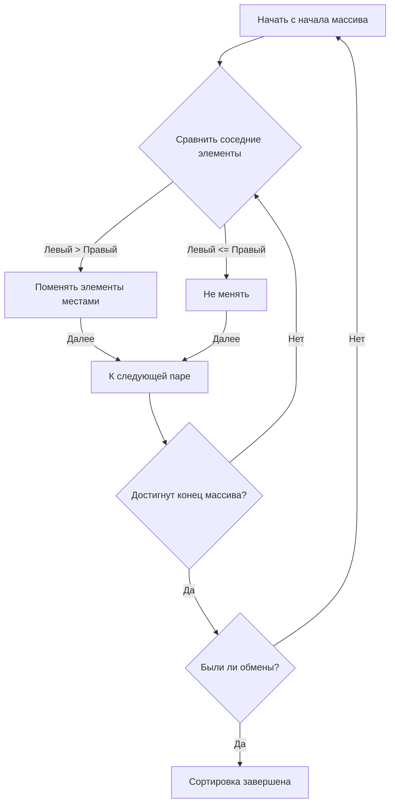
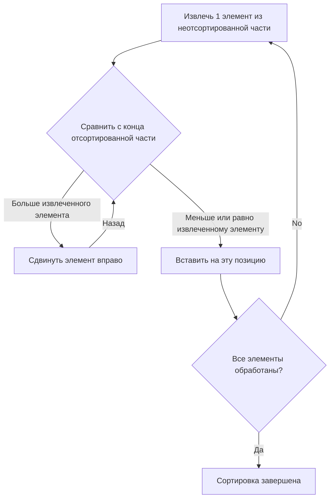
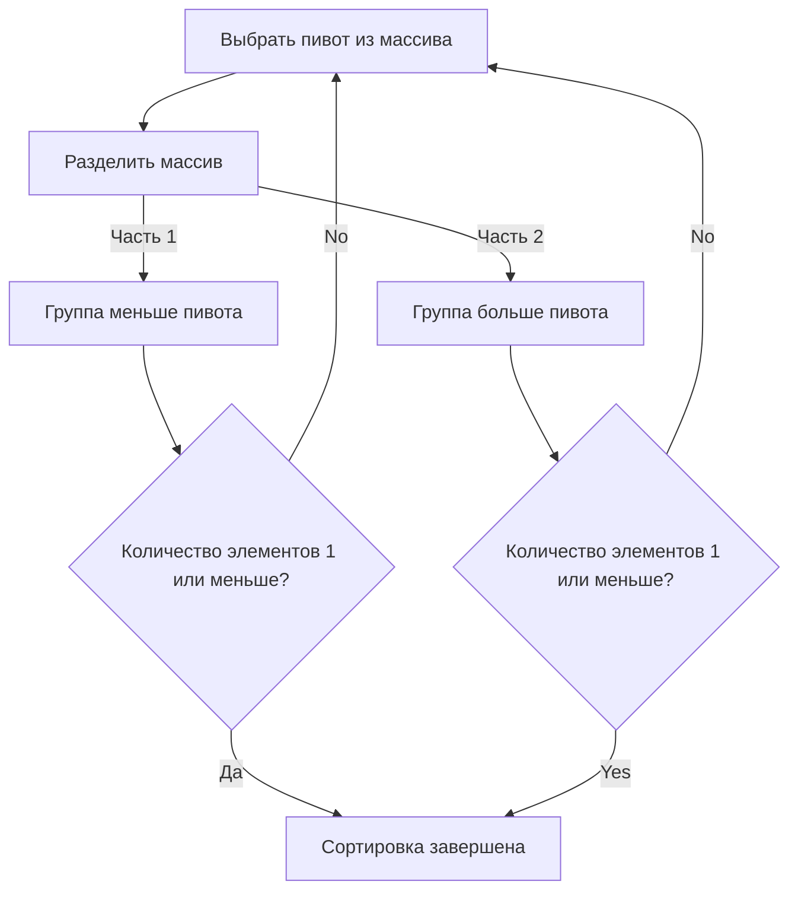
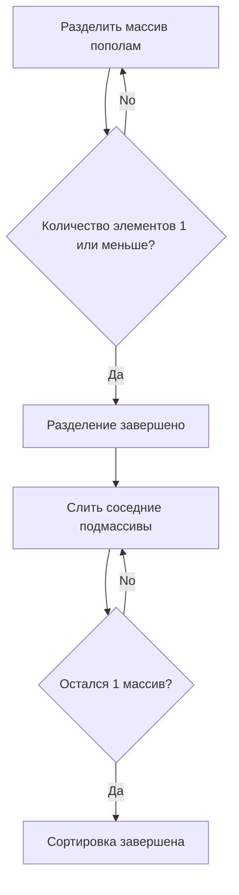

# 1. Введение: Глубокий мир алгоритмов сортировки

В информатике сортировка данных в определенном порядке (по возрастанию или убыванию) — одна из самых базовых и важных операций. Алгоритмы сортировки служат предварительным этапом для любой обработки данных, будь то ускорение поиска, группировка или обнаружение дубликатов.

В этой статье мы подробно рассмотрим основные алгоритмы сортировки: от простых, понятных новичкам, до быстрых, используемых на практике. Мы визуально разберем принцип работы каждого из них с помощью диаграмм **Mermaid** , изучим их реализацию на Python и сравним производительность (например, временную сложность). Кроме того, для полного понимания того, как работают алгоритмы, мы включили полные трассировки выполнения на массивах из 50 элементов. Это позволит вам досконально понять мельчайшие детали их работы.

## Метрики оценки алгоритмов

При оценке каждого алгоритма важны следующие показатели.

- **Временная сложность (Time Complexity)** : Показывает, как увеличивается время обработки в зависимости от количества элементов $. Используется нотация «О» большое (Big-O notation), например $\text{O}(n^2)$ или $\text{O}(n \log n)$. Если в формулах используется текст, он пишется как $\text{лучший}$.
- **Пространственная сложность (Space Complexity)** : Указывает, сколько дополнительной памяти требуется во время выполнения. Алгоритмы, работающие на месте (In-place), почти не требуют дополнительной памяти.
- **Стабильность (Stability)** : Показывает, сохраняется ли относительный порядок элементов с одинаковыми значениями после сортировки. Стабильная сортировка сохраняет исходный порядок.

---

## 2. Пузырьковая сортировка (Bubble Sort)

Это алгоритм, который многократно сравнивает соседние элементы и меняет их местами, если они стоят в неправильном порядке. Большие элементы постепенно перемещаются в конец массива, подобно тому, как пузырьки поднимаются на поверхность воды.

### Сложность и характеристики

- **Временная сложность (в лучшем случае)**: $\text{O}(n)$
- **Временная сложность (в среднем)**: $\text{O}(n^2)$
- **Временная сложность (в худшем случае)**: $\text{O}(n^2)$
- **Пространственная сложность**: $\text{O}(1)$
- **Стабильность**: Стабильная

### Иллюстрация (Mermaid)



### Реализация на Python

```python
def bubble_sort(arr):
    n = len(arr)
    for i in range(n):
        swapped = False
        for j in range(0, n-i-1):
            if arr[j] > arr[j+1]:
                arr[j], arr[j+1] = arr[j+1], arr[j]
                swapped = True
        if not swapped:
            break
    return arr
```

### Подробная трассировка пузырьковой сортировки

Здесь показано состояние массива после завершения каждого прохода при выполнении пузырьковой сортировки для случайного массива из 50 элементов. Обратите внимание, как пузырьковая сортировка выталкивает элементы вправо.

**Начальное состояние**: `[83, 14, 64, 71, 83, 11, 36, 69, 72, 45, 93, 30, 14, 76, 72, 51, 19, 41, 56, 15, 63, 27, 87, 55, 58, 63, 46, 96, 43, 68, 32, 97, 48, 94, 56, 27, 68, 40, 66, 88, 58, 15, 84, 10, 40, 27, 34, 48, 78, 56]`

**Проход 1 завершен**: `[14, 64, 71, 83, 11, 36, 69, 72, 45, 83, 30, 14, 76, 72, 51, 19, 41, 56, 15, 63, 27, 87, 55, 58, 63, 46, 93, 43, 68, 32, 96, 48, 94, 56, 27, 68, 40, 66, 88, 58, 15, 84, 10, 40, 27, 34, 48, 78, 56, 97]`

На этом проходе максимальный элемент в неотсортированной части поднялся на правый край, подобно пузырьку. Из-за особенностей пузырьковой сортировки гарантируется, что хотя бы один элемент займет свое окончательное правильное положение за один проход. Поэтому с каждым проходом мы можем сужать область поиска на один элемент, уменьшая количество ненужных операций сравнения. Однако в худшем случае, когда данные полностью отсортированы в обратном порядке, операции обмена будут происходить для всех пар элементов, и временная сложность достигнет $\text{O}(n^2)$, а производительность будет крайне низкой.

На этом проходе максимальный элемент в неотсортированной части поднялся на правый край, подобно пузырьку. Из-за особенностей пузырьковой сортировки гарантируется, что хотя бы один элемент займет свое окончательное правильное положение за один проход. Поэтому с каждым проходом мы можем сужать область поиска на один элемент, уменьшая количество ненужных операций сравнения. Однако в худшем случае, когда данные полностью отсортированы в обратном порядке, операции обмена будут происходить для всех пар элементов, и временная сложность достигнет $\text{O}(n^2)$, а производительность будет крайне низкой.

**Проход 2 завершен**: `[14, 64, 71, 11, 36, 69, 72, 45, 83, 30, 14, 76, 72, 51, 19, 41, 56, 15, 63, 27, 83, 55, 58, 63, 46, 87, 43, 68, 32, 93, 48, 94, 56, 27, 68, 40, 66, 88, 58, 15, 84, 10, 40, 27, 34, 48, 78, 56, 96, 97]`

На этом проходе максимальный элемент в неотсортированной части поднялся на правый край, подобно пузырьку. Из-за особенностей пузырьковой сортировки гарантируется, что хотя бы один элемент займет свое окончательное правильное положение за один проход. Поэтому с каждым проходом мы можем сужать область поиска на один элемент, уменьшая количество ненужных операций сравнения. Однако в худшем случае, когда данные полностью отсортированы в обратном порядке, операции обмена будут происходить для всех пар элементов, и временная сложность достигнет $\text{O}(n^2)$, а производительность будет крайне низкой.

На этом проходе максимальный элемент в неотсортированной части поднялся на правый край, подобно пузырьку. Из-за особенностей пузырьковой сортировки гарантируется, что хотя бы один элемент займет свое окончательное правильное положение за один проход. Поэтому с каждым проходом мы можем сужать область поиска на один элемент, уменьшая количество ненужных операций сравнения. Однако в худшем случае, когда данные полностью отсортированы в обратном порядке, операции обмена будут происходить для всех пар элементов, и временная сложность достигнет $\text{O}(n^2)$, а производительность будет крайне низкой.

**Проход 3 завершен**: `[14, 64, 11, 36, 69, 71, 45, 72, 30, 14, 76, 72, 51, 19, 41, 56, 15, 63, 27, 83, 55, 58, 63, 46, 83, 43, 68, 32, 87, 48, 93, 56, 27, 68, 40, 66, 88, 58, 15, 84, 10, 40, 27, 34, 48, 78, 56, 94, 96, 97]`

На этом проходе максимальный элемент в неотсортированной части поднялся на правый край, подобно пузырьку. Из-за особенностей пузырьковой сортировки гарантируется, что хотя бы один элемент займет свое окончательное правильное положение за один проход. Поэтому с каждым проходом мы можем сужать область поиска на один элемент, уменьшая количество ненужных операций сравнения. Однако в худшем случае, когда данные полностью отсортированы в обратном порядке, операции обмена будут происходить для всех пар элементов, и временная сложность достигнет $\text{O}(n^2)$, а производительность будет крайне низкой.

На этом проходе максимальный элемент в неотсортированной части поднялся на правый край, подобно пузырьку. Из-за особенностей пузырьковой сортировки гарантируется, что хотя бы один элемент займет свое окончательное правильное положение за один проход. Поэтому с каждым проходом мы можем сужать область поиска на один элемент, уменьшая количество ненужных операций сравнения. Однако в худшем случае, когда данные полностью отсортированы в обратном порядке, операции обмена будут происходить для всех пар элементов, и временная сложность достигнет $\text{O}(n^2)$, а производительность будет крайне низкой.

**Проход 4 завершен**: `[14, 11, 36, 64, 69, 45, 71, 30, 14, 72, 72, 51, 19, 41, 56, 15, 63, 27, 76, 55, 58, 63, 46, 83, 43, 68, 32, 83, 48, 87, 56, 27, 68, 40, 66, 88, 58, 15, 84, 10, 40, 27, 34, 48, 78, 56, 93, 94, 96, 97]`

На этом проходе максимальный элемент в неотсортированной части поднялся на правый край, подобно пузырьку. Из-за особенностей пузырьковой сортировки гарантируется, что хотя бы один элемент займет свое окончательное правильное положение за один проход. Поэтому с каждым проходом мы можем сужать область поиска на один элемент, уменьшая количество ненужных операций сравнения. Однако в худшем случае, когда данные полностью отсортированы в обратном порядке, операции обмена будут происходить для всех пар элементов, и временная сложность достигнет $\text{O}(n^2)$, а производительность будет крайне низкой.

На этом проходе максимальный элемент в неотсортированной части поднялся на правый край, подобно пузырьку. Из-за особенностей пузырьковой сортировки гарантируется, что хотя бы один элемент займет свое окончательное правильное положение за один проход. Поэтому с каждым проходом мы можем сужать область поиска на один элемент, уменьшая количество ненужных операций сравнения. Однако в худшем случае, когда данные полностью отсортированы в обратном порядке, операции обмена будут происходить для всех пар элементов, и временная сложность достигнет $\text{O}(n^2)$, а производительность будет крайне низкой.

**Проход 5 завершен**: `[11, 14, 36, 64, 45, 69, 30, 14, 71, 72, 51, 19, 41, 56, 15, 63, 27, 72, 55, 58, 63, 46, 76, 43, 68, 32, 83, 48, 83, 56, 27, 68, 40, 66, 87, 58, 15, 84, 10, 40, 27, 34, 48, 78, 56, 88, 93, 94, 96, 97]`

На этом проходе максимальный элемент в неотсортированной части поднялся на правый край, подобно пузырьку. Из-за особенностей пузырьковой сортировки гарантируется, что хотя бы один элемент займет свое окончательное правильное положение за один проход. Поэтому с каждым проходом мы можем сужать область поиска на один элемент, уменьшая количество ненужных операций сравнения. Однако в худшем случае, когда данные полностью отсортированы в обратном порядке, операции обмена будут происходить для всех пар элементов, и временная сложность достигнет $\text{O}(n^2)$, а производительность будет крайне низкой.

На этом проходе максимальный элемент в неотсортированной части поднялся на правый край, подобно пузырьку. Из-за особенностей пузырьковой сортировки гарантируется, что хотя бы один элемент займет свое окончательное правильное положение за один проход. Поэтому с каждым проходом мы можем сужать область поиска на один элемент, уменьшая количество ненужных операций сравнения. Однако в худшем случае, когда данные полностью отсортированы в обратном порядке, операции обмена будут происходить для всех пар элементов, и временная сложность достигнет $\text{O}(n^2)$, а производительность будет крайне низкой.

**Проход 6 завершен**: `[11, 14, 36, 45, 64, 30, 14, 69, 71, 51, 19, 41, 56, 15, 63, 27, 72, 55, 58, 63, 46, 72, 43, 68, 32, 76, 48, 83, 56, 27, 68, 40, 66, 83, 58, 15, 84, 10, 40, 27, 34, 48, 78, 56, 87, 88, 93, 94, 96, 97]`

На этом проходе максимальный элемент в неотсортированной части поднялся на правый край, подобно пузырьку. Из-за особенностей пузырьковой сортировки гарантируется, что хотя бы один элемент займет свое окончательное правильное положение за один проход. Поэтому с каждым проходом мы можем сужать область поиска на один элемент, уменьшая количество ненужных операций сравнения. Однако в худшем случае, когда данные полностью отсортированы в обратном порядке, операции обмена будут происходить для всех пар элементов, и временная сложность достигнет $\text{O}(n^2)$, а производительность будет крайне низкой.

На этом проходе максимальный элемент в неотсортированной части поднялся на правый край, подобно пузырьку. Из-за особенностей пузырьковой сортировки гарантируется, что хотя бы один элемент займет свое окончательное правильное положение за один проход. Поэтому с каждым проходом мы можем сужать область поиска на один элемент, уменьшая количество ненужных операций сравнения. Однако в худшем случае, когда данные полностью отсортированы в обратном порядке, операции обмена будут происходить для всех пар элементов, и временная сложность достигнет $\text{O}(n^2)$, а производительность будет крайне низкой.

**Проход 7 завершен**: `[11, 14, 36, 45, 30, 14, 64, 69, 51, 19, 41, 56, 15, 63, 27, 71, 55, 58, 63, 46, 72, 43, 68, 32, 72, 48, 76, 56, 27, 68, 40, 66, 83, 58, 15, 83, 10, 40, 27, 34, 48, 78, 56, 84, 87, 88, 93, 94, 96, 97]`

На этом проходе максимальный элемент в неотсортированной части поднялся на правый край, подобно пузырьку. Из-за особенностей пузырьковой сортировки гарантируется, что хотя бы один элемент займет свое окончательное правильное положение за один проход. Поэтому с каждым проходом мы можем сужать область поиска на один элемент, уменьшая количество ненужных операций сравнения. Однако в худшем случае, когда данные полностью отсортированы в обратном порядке, операции обмена будут происходить для всех пар элементов, и временная сложность достигнет $\text{O}(n^2)$, а производительность будет крайне низкой.

На этом проходе максимальный элемент в неотсортированной части поднялся на правый край, подобно пузырьку. Из-за особенностей пузырьковой сортировки гарантируется, что хотя бы один элемент займет свое окончательное правильное положение за один проход. Поэтому с каждым проходом мы можем сужать область поиска на один элемент, уменьшая количество ненужных операций сравнения. Однако в худшем случае, когда данные полностью отсортированы в обратном порядке, операции обмена будут происходить для всех пар элементов, и временная сложность достигнет $\text{O}(n^2)$, а производительность будет крайне низкой.

**Проход 8 завершен**: `[11, 14, 36, 30, 14, 45, 64, 51, 19, 41, 56, 15, 63, 27, 69, 55, 58, 63, 46, 71, 43, 68, 32, 72, 48, 72, 56, 27, 68, 40, 66, 76, 58, 15, 83, 10, 40, 27, 34, 48, 78, 56, 83, 84, 87, 88, 93, 94, 96, 97]`

На этом проходе максимальный элемент в неотсортированной части поднялся на правый край, подобно пузырьку. Из-за особенностей пузырьковой сортировки гарантируется, что хотя бы один элемент займет свое окончательное правильное положение за один проход. Поэтому с каждым проходом мы можем сужать область поиска на один элемент, уменьшая количество ненужных операций сравнения. Однако в худшем случае, когда данные полностью отсортированы в обратном порядке, операции обмена будут происходить для всех пар элементов, и временная сложность достигнет $\text{O}(n^2)$, а производительность будет крайне низкой.

На этом проходе максимальный элемент в неотсортированной части поднялся на правый край, подобно пузырьку. Из-за особенностей пузырьковой сортировки гарантируется, что хотя бы один элемент займет свое окончательное правильное положение за один проход. Поэтому с каждым проходом мы можем сужать область поиска на один элемент, уменьшая количество ненужных операций сравнения. Однако в худшем случае, когда данные полностью отсортированы в обратном порядке, операции обмена будут происходить для всех пар элементов, и временная сложность достигнет $\text{O}(n^2)$, а производительность будет крайне низкой.

**Проход 9 завершен**: `[11, 14, 30, 14, 36, 45, 51, 19, 41, 56, 15, 63, 27, 64, 55, 58, 63, 46, 69, 43, 68, 32, 71, 48, 72, 56, 27, 68, 40, 66, 72, 58, 15, 76, 10, 40, 27, 34, 48, 78, 56, 83, 83, 84, 87, 88, 93, 94, 96, 97]`

На этом проходе максимальный элемент в неотсортированной части поднялся на правый край, подобно пузырьку. Из-за особенностей пузырьковой сортировки гарантируется, что хотя бы один элемент займет свое окончательное правильное положение за один проход. Поэтому с каждым проходом мы можем сужать область поиска на один элемент, уменьшая количество ненужных операций сравнения. Однако в худшем случае, когда данные полностью отсортированы в обратном порядке, операции обмена будут происходить для всех пар элементов, и временная сложность достигнет $\text{O}(n^2)$, а производительность будет крайне низкой.

На этом проходе максимальный элемент в неотсортированной части поднялся на правый край, подобно пузырьку. Из-за особенностей пузырьковой сортировки гарантируется, что хотя бы один элемент займет свое окончательное правильное положение за один проход. Поэтому с каждым проходом мы можем сужать область поиска на один элемент, уменьшая количество ненужных операций сравнения. Однако в худшем случае, когда данные полностью отсортированы в обратном порядке, операции обмена будут происходить для всех пар элементов, и временная сложность достигнет $\text{O}(n^2)$, а производительность будет крайне низкой.

**Проход 10 завершен**: `[11, 14, 14, 30, 36, 45, 19, 41, 51, 15, 56, 27, 63, 55, 58, 63, 46, 64, 43, 68, 32, 69, 48, 71, 56, 27, 68, 40, 66, 72, 58, 15, 72, 10, 40, 27, 34, 48, 76, 56, 78, 83, 83, 84, 87, 88, 93, 94, 96, 97]`

На этом проходе максимальный элемент в неотсортированной части поднялся на правый край, подобно пузырьку. Из-за особенностей пузырьковой сортировки гарантируется, что хотя бы один элемент займет свое окончательное правильное положение за один проход. Поэтому с каждым проходом мы можем сужать область поиска на один элемент, уменьшая количество ненужных операций сравнения. Однако в худшем случае, когда данные полностью отсортированы в обратном порядке, операции обмена будут происходить для всех пар элементов, и временная сложность достигнет $\text{O}(n^2)$, а производительность будет крайне низкой.

На этом проходе максимальный элемент в неотсортированной части поднялся на правый край, подобно пузырьку. Из-за особенностей пузырьковой сортировки гарантируется, что хотя бы один элемент займет свое окончательное правильное положение за один проход. Поэтому с каждым проходом мы можем сужать область поиска на один элемент, уменьшая количество ненужных операций сравнения. Однако в худшем случае, когда данные полностью отсортированы в обратном порядке, операции обмена будут происходить для всех пар элементов, и временная сложность достигнет $\text{O}(n^2)$, а производительность будет крайне низкой.

**Проход 11 завершен**: `[11, 14, 14, 30, 36, 19, 41, 45, 15, 51, 27, 56, 55, 58, 63, 46, 63, 43, 64, 32, 68, 48, 69, 56, 27, 68, 40, 66, 71, 58, 15, 72, 10, 40, 27, 34, 48, 72, 56, 76, 78, 83, 83, 84, 87, 88, 93, 94, 96, 97]`

На этом проходе максимальный элемент в неотсортированной части поднялся на правый край, подобно пузырьку. Из-за особенностей пузырьковой сортировки гарантируется, что хотя бы один элемент займет свое окончательное правильное положение за один проход. Поэтому с каждым проходом мы можем сужать область поиска на один элемент, уменьшая количество ненужных операций сравнения. Однако в худшем случае, когда данные полностью отсортированы в обратном порядке, операции обмена будут происходить для всех пар элементов, и временная сложность достигнет $\text{O}(n^2)$, а производительность будет крайне низкой.

На этом проходе максимальный элемент в неотсортированной части поднялся на правый край, подобно пузырьку. Из-за особенностей пузырьковой сортировки гарантируется, что хотя бы один элемент займет свое окончательное правильное положение за один проход. Поэтому с каждым проходом мы можем сужать область поиска на один элемент, уменьшая количество ненужных операций сравнения. Однако в худшем случае, когда данные полностью отсортированы в обратном порядке, операции обмена будут происходить для всех пар элементов, и временная сложность достигнет $\text{O}(n^2)$, а производительность будет крайне низкой.

**Проход 12 завершен**: `[11, 14, 14, 30, 19, 36, 41, 15, 45, 27, 51, 55, 56, 58, 46, 63, 43, 63, 32, 64, 48, 68, 56, 27, 68, 40, 66, 69, 58, 15, 71, 10, 40, 27, 34, 48, 72, 56, 72, 76, 78, 83, 83, 84, 87, 88, 93, 94, 96, 97]`

На этом проходе максимальный элемент в неотсортированной части поднялся на правый край, подобно пузырьку. Из-за особенностей пузырьковой сортировки гарантируется, что хотя бы один элемент займет свое окончательное правильное положение за один проход. Поэтому с каждым проходом мы можем сужать область поиска на один элемент, уменьшая количество ненужных операций сравнения. Однако в худшем случае, когда данные полностью отсортированы в обратном порядке, операции обмена будут происходить для всех пар элементов, и временная сложность достигнет $\text{O}(n^2)$, а производительность будет крайне низкой.

На этом проходе максимальный элемент в неотсортированной части поднялся на правый край, подобно пузырьку. Из-за особенностей пузырьковой сортировки гарантируется, что хотя бы один элемент займет свое окончательное правильное положение за один проход. Поэтому с каждым проходом мы можем сужать область поиска на один элемент, уменьшая количество ненужных операций сравнения. Однако в худшем случае, когда данные полностью отсортированы в обратном порядке, операции обмена будут происходить для всех пар элементов, и временная сложность достигнет $\text{O}(n^2)$, а производительность будет крайне низкой.

**Проход 13 завершен**: `[11, 14, 14, 19, 30, 36, 15, 41, 27, 45, 51, 55, 56, 46, 58, 43, 63, 32, 63, 48, 64, 56, 27, 68, 40, 66, 68, 58, 15, 69, 10, 40, 27, 34, 48, 71, 56, 72, 72, 76, 78, 83, 83, 84, 87, 88, 93, 94, 96, 97]`

На этом проходе максимальный элемент в неотсортированной части поднялся на правый край, подобно пузырьку. Из-за особенностей пузырьковой сортировки гарантируется, что хотя бы один элемент займет свое окончательное правильное положение за один проход. Поэтому с каждым проходом мы можем сужать область поиска на один элемент, уменьшая количество ненужных операций сравнения. Однако в худшем случае, когда данные полностью отсортированы в обратном порядке, операции обмена будут происходить для всех пар элементов, и временная сложность достигнет $\text{O}(n^2)$, а производительность будет крайне низкой.

На этом проходе максимальный элемент в неотсортированной части поднялся на правый край, подобно пузырьку. Из-за особенностей пузырьковой сортировки гарантируется, что хотя бы один элемент займет свое окончательное правильное положение за один проход. Поэтому с каждым проходом мы можем сужать область поиска на один элемент, уменьшая количество ненужных операций сравнения. Однако в худшем случае, когда данные полностью отсортированы в обратном порядке, операции обмена будут происходить для всех пар элементов, и временная сложность достигнет $\text{O}(n^2)$, а производительность будет крайне низкой.

**Проход 14 завершен**: `[11, 14, 14, 19, 30, 15, 36, 27, 41, 45, 51, 55, 46, 56, 43, 58, 32, 63, 48, 63, 56, 27, 64, 40, 66, 68, 58, 15, 68, 10, 40, 27, 34, 48, 69, 56, 71, 72, 72, 76, 78, 83, 83, 84, 87, 88, 93, 94, 96, 97]`

На этом проходе максимальный элемент в неотсортированной части поднялся на правый край, подобно пузырьку. Из-за особенностей пузырьковой сортировки гарантируется, что хотя бы один элемент займет свое окончательное правильное положение за один проход. Поэтому с каждым проходом мы можем сужать область поиска на один элемент, уменьшая количество ненужных операций сравнения. Однако в худшем случае, когда данные полностью отсортированы в обратном порядке, операции обмена будут происходить для всех пар элементов, и временная сложность достигнет $\text{O}(n^2)$, а производительность будет крайне низкой.

На этом проходе максимальный элемент в неотсортированной части поднялся на правый край, подобно пузырьку. Из-за особенностей пузырьковой сортировки гарантируется, что хотя бы один элемент займет свое окончательное правильное положение за один проход. Поэтому с каждым проходом мы можем сужать область поиска на один элемент, уменьшая количество ненужных операций сравнения. Однако в худшем случае, когда данные полностью отсортированы в обратном порядке, операции обмена будут происходить для всех пар элементов, и временная сложность достигнет $\text{O}(n^2)$, а производительность будет крайне низкой.

**Проход 15 завершен**: `[11, 14, 14, 19, 15, 30, 27, 36, 41, 45, 51, 46, 55, 43, 56, 32, 58, 48, 63, 56, 27, 63, 40, 64, 66, 58, 15, 68, 10, 40, 27, 34, 48, 68, 56, 69, 71, 72, 72, 76, 78, 83, 83, 84, 87, 88, 93, 94, 96, 97]`

На этом проходе максимальный элемент в неотсортированной части поднялся на правый край, подобно пузырьку. Из-за особенностей пузырьковой сортировки гарантируется, что хотя бы один элемент займет свое окончательное правильное положение за один проход. Поэтому с каждым проходом мы можем сужать область поиска на один элемент, уменьшая количество ненужных операций сравнения. Однако в худшем случае, когда данные полностью отсортированы в обратном порядке, операции обмена будут происходить для всех пар элементов, и временная сложность достигнет $\text{O}(n^2)$, а производительность будет крайне низкой.

На этом проходе максимальный элемент в неотсортированной части поднялся на правый край, подобно пузырьку. Из-за особенностей пузырьковой сортировки гарантируется, что хотя бы один элемент займет свое окончательное правильное положение за один проход. Поэтому с каждым проходом мы можем сужать область поиска на один элемент, уменьшая количество ненужных операций сравнения. Однако в худшем случае, когда данные полностью отсортированы в обратном порядке, операции обмена будут происходить для всех пар элементов, и временная сложность достигнет $\text{O}(n^2)$, а производительность будет крайне низкой.

**Проход 16 завершен**: `[11, 14, 14, 15, 19, 27, 30, 36, 41, 45, 46, 51, 43, 55, 32, 56, 48, 58, 56, 27, 63, 40, 63, 64, 58, 15, 66, 10, 40, 27, 34, 48, 68, 56, 68, 69, 71, 72, 72, 76, 78, 83, 83, 84, 87, 88, 93, 94, 96, 97]`

На этом проходе максимальный элемент в неотсортированной части поднялся на правый край, подобно пузырьку. Из-за особенностей пузырьковой сортировки гарантируется, что хотя бы один элемент займет свое окончательное правильное положение за один проход. Поэтому с каждым проходом мы можем сужать область поиска на один элемент, уменьшая количество ненужных операций сравнения. Однако в худшем случае, когда данные полностью отсортированы в обратном порядке, операции обмена будут происходить для всех пар элементов, и временная сложность достигнет $\text{O}(n^2)$, а производительность будет крайне низкой.

На этом проходе максимальный элемент в неотсортированной части поднялся на правый край, подобно пузырьку. Из-за особенностей пузырьковой сортировки гарантируется, что хотя бы один элемент займет свое окончательное правильное положение за один проход. Поэтому с каждым проходом мы можем сужать область поиска на один элемент, уменьшая количество ненужных операций сравнения. Однако в худшем случае, когда данные полностью отсортированы в обратном порядке, операции обмена будут происходить для всех пар элементов, и временная сложность достигнет $\text{O}(n^2)$, а производительность будет крайне низкой.

**Проход 17 завершен**: `[11, 14, 14, 15, 19, 27, 30, 36, 41, 45, 46, 43, 51, 32, 55, 48, 56, 56, 27, 58, 40, 63, 63, 58, 15, 64, 10, 40, 27, 34, 48, 66, 56, 68, 68, 69, 71, 72, 72, 76, 78, 83, 83, 84, 87, 88, 93, 94, 96, 97]`

На этом проходе максимальный элемент в неотсортированной части поднялся на правый край, подобно пузырьку. Из-за особенностей пузырьковой сортировки гарантируется, что хотя бы один элемент займет свое окончательное правильное положение за один проход. Поэтому с каждым проходом мы можем сужать область поиска на один элемент, уменьшая количество ненужных операций сравнения. Однако в худшем случае, когда данные полностью отсортированы в обратном порядке, операции обмена будут происходить для всех пар элементов, и временная сложность достигнет $\text{O}(n^2)$, а производительность будет крайне низкой.

На этом проходе максимальный элемент в неотсортированной части поднялся на правый край, подобно пузырьку. Из-за особенностей пузырьковой сортировки гарантируется, что хотя бы один элемент займет свое окончательное правильное положение за один проход. Поэтому с каждым проходом мы можем сужать область поиска на один элемент, уменьшая количество ненужных операций сравнения. Однако в худшем случае, когда данные полностью отсортированы в обратном порядке, операции обмена будут происходить для всех пар элементов, и временная сложность достигнет $\text{O}(n^2)$, а производительность будет крайне низкой.

**Проход 18 завершен**: `[11, 14, 14, 15, 19, 27, 30, 36, 41, 45, 43, 46, 32, 51, 48, 55, 56, 27, 56, 40, 58, 63, 58, 15, 63, 10, 40, 27, 34, 48, 64, 56, 66, 68, 68, 69, 71, 72, 72, 76, 78, 83, 83, 84, 87, 88, 93, 94, 96, 97]`

На этом проходе максимальный элемент в неотсортированной части поднялся на правый край, подобно пузырьку. Из-за особенностей пузырьковой сортировки гарантируется, что хотя бы один элемент займет свое окончательное правильное положение за один проход. Поэтому с каждым проходом мы можем сужать область поиска на один элемент, уменьшая количество ненужных операций сравнения. Однако в худшем случае, когда данные полностью отсортированы в обратном порядке, операции обмена будут происходить для всех пар элементов, и временная сложность достигнет $\text{O}(n^2)$, а производительность будет крайне низкой.

На этом проходе максимальный элемент в неотсортированной части поднялся на правый край, подобно пузырьку. Из-за особенностей пузырьковой сортировки гарантируется, что хотя бы один элемент займет свое окончательное правильное положение за один проход. Поэтому с каждым проходом мы можем сужать область поиска на один элемент, уменьшая количество ненужных операций сравнения. Однако в худшем случае, когда данные полностью отсортированы в обратном порядке, операции обмена будут происходить для всех пар элементов, и временная сложность достигнет $\text{O}(n^2)$, а производительность будет крайне низкой.

**Проход 19 завершен**: `[11, 14, 14, 15, 19, 27, 30, 36, 41, 43, 45, 32, 46, 48, 51, 55, 27, 56, 40, 56, 58, 58, 15, 63, 10, 40, 27, 34, 48, 63, 56, 64, 66, 68, 68, 69, 71, 72, 72, 76, 78, 83, 83, 84, 87, 88, 93, 94, 96, 97]`

На этом проходе максимальный элемент в неотсортированной части поднялся на правый край, подобно пузырьку. Из-за особенностей пузырьковой сортировки гарантируется, что хотя бы один элемент займет свое окончательное правильное положение за один проход. Поэтому с каждым проходом мы можем сужать область поиска на один элемент, уменьшая количество ненужных операций сравнения. Однако в худшем случае, когда данные полностью отсортированы в обратном порядке, операции обмена будут происходить для всех пар элементов, и временная сложность достигнет $\text{O}(n^2)$, а производительность будет крайне низкой.

На этом проходе максимальный элемент в неотсортированной части поднялся на правый край, подобно пузырьку. Из-за особенностей пузырьковой сортировки гарантируется, что хотя бы один элемент займет свое окончательное правильное положение за один проход. Поэтому с каждым проходом мы можем сужать область поиска на один элемент, уменьшая количество ненужных операций сравнения. Однако в худшем случае, когда данные полностью отсортированы в обратном порядке, операции обмена будут происходить для всех пар элементов, и временная сложность достигнет $\text{O}(n^2)$, а производительность будет крайне низкой.

**Проход 20 завершен**: `[11, 14, 14, 15, 19, 27, 30, 36, 41, 43, 32, 45, 46, 48, 51, 27, 55, 40, 56, 56, 58, 15, 58, 10, 40, 27, 34, 48, 63, 56, 63, 64, 66, 68, 68, 69, 71, 72, 72, 76, 78, 83, 83, 84, 87, 88, 93, 94, 96, 97]`

На этом проходе максимальный элемент в неотсортированной части поднялся на правый край, подобно пузырьку. Из-за особенностей пузырьковой сортировки гарантируется, что хотя бы один элемент займет свое окончательное правильное положение за один проход. Поэтому с каждым проходом мы можем сужать область поиска на один элемент, уменьшая количество ненужных операций сравнения. Однако в худшем случае, когда данные полностью отсортированы в обратном порядке, операции обмена будут происходить для всех пар элементов, и временная сложность достигнет $\text{O}(n^2)$, а производительность будет крайне низкой.

На этом проходе максимальный элемент в неотсортированной части поднялся на правый край, подобно пузырьку. Из-за особенностей пузырьковой сортировки гарантируется, что хотя бы один элемент займет свое окончательное правильное положение за один проход. Поэтому с каждым проходом мы можем сужать область поиска на один элемент, уменьшая количество ненужных операций сравнения. Однако в худшем случае, когда данные полностью отсортированы в обратном порядке, операции обмена будут происходить для всех пар элементов, и временная сложность достигнет $\text{O}(n^2)$, а производительность будет крайне низкой.

**Проход 21 завершен**: `[11, 14, 14, 15, 19, 27, 30, 36, 41, 32, 43, 45, 46, 48, 27, 51, 40, 55, 56, 56, 15, 58, 10, 40, 27, 34, 48, 58, 56, 63, 63, 64, 66, 68, 68, 69, 71, 72, 72, 76, 78, 83, 83, 84, 87, 88, 93, 94, 96, 97]`

На этом проходе максимальный элемент в неотсортированной части поднялся на правый край, подобно пузырьку. Из-за особенностей пузырьковой сортировки гарантируется, что хотя бы один элемент займет свое окончательное правильное положение за один проход. Поэтому с каждым проходом мы можем сужать область поиска на один элемент, уменьшая количество ненужных операций сравнения. Однако в худшем случае, когда данные полностью отсортированы в обратном порядке, операции обмена будут происходить для всех пар элементов, и временная сложность достигнет $\text{O}(n^2)$, а производительность будет крайне низкой.

На этом проходе максимальный элемент в неотсортированной части поднялся на правый край, подобно пузырьку. Из-за особенностей пузырьковой сортировки гарантируется, что хотя бы один элемент займет свое окончательное правильное положение за один проход. Поэтому с каждым проходом мы можем сужать область поиска на один элемент, уменьшая количество ненужных операций сравнения. Однако в худшем случае, когда данные полностью отсортированы в обратном порядке, операции обмена будут происходить для всех пар элементов, и временная сложность достигнет $\text{O}(n^2)$, а производительность будет крайне низкой.

**Проход 22 завершен**: `[11, 14, 14, 15, 19, 27, 30, 36, 32, 41, 43, 45, 46, 27, 48, 40, 51, 55, 56, 15, 56, 10, 40, 27, 34, 48, 58, 56, 58, 63, 63, 64, 66, 68, 68, 69, 71, 72, 72, 76, 78, 83, 83, 84, 87, 88, 93, 94, 96, 97]`

На этом проходе максимальный элемент в неотсортированной части поднялся на правый край, подобно пузырьку. Из-за особенностей пузырьковой сортировки гарантируется, что хотя бы один элемент займет свое окончательное правильное положение за один проход. Поэтому с каждым проходом мы можем сужать область поиска на один элемент, уменьшая количество ненужных операций сравнения. Однако в худшем случае, когда данные полностью отсортированы в обратном порядке, операции обмена будут происходить для всех пар элементов, и временная сложность достигнет $\text{O}(n^2)$, а производительность будет крайне низкой.

На этом проходе максимальный элемент в неотсортированной части поднялся на правый край, подобно пузырьку. Из-за особенностей пузырьковой сортировки гарантируется, что хотя бы один элемент займет свое окончательное правильное положение за один проход. Поэтому с каждым проходом мы можем сужать область поиска на один элемент, уменьшая количество ненужных операций сравнения. Однако в худшем случае, когда данные полностью отсортированы в обратном порядке, операции обмена будут происходить для всех пар элементов, и временная сложность достигнет $\text{O}(n^2)$, а производительность будет крайне низкой.

**Проход 23 завершен**: `[11, 14, 14, 15, 19, 27, 30, 32, 36, 41, 43, 45, 27, 46, 40, 48, 51, 55, 15, 56, 10, 40, 27, 34, 48, 56, 56, 58, 58, 63, 63, 64, 66, 68, 68, 69, 71, 72, 72, 76, 78, 83, 83, 84, 87, 88, 93, 94, 96, 97]`

На этом проходе максимальный элемент в неотсортированной части поднялся на правый край, подобно пузырьку. Из-за особенностей пузырьковой сортировки гарантируется, что хотя бы один элемент займет свое окончательное правильное положение за один проход. Поэтому с каждым проходом мы можем сужать область поиска на один элемент, уменьшая количество ненужных операций сравнения. Однако в худшем случае, когда данные полностью отсортированы в обратном порядке, операции обмена будут происходить для всех пар элементов, и временная сложность достигнет $\text{O}(n^2)$, а производительность будет крайне низкой.

На этом проходе максимальный элемент в неотсортированной части поднялся на правый край, подобно пузырьку. Из-за особенностей пузырьковой сортировки гарантируется, что хотя бы один элемент займет свое окончательное правильное положение за один проход. Поэтому с каждым проходом мы можем сужать область поиска на один элемент, уменьшая количество ненужных операций сравнения. Однако в худшем случае, когда данные полностью отсортированы в обратном порядке, операции обмена будут происходить для всех пар элементов, и временная сложность достигнет $\text{O}(n^2)$, а производительность будет крайне низкой.

**Проход 24 завершен**: `[11, 14, 14, 15, 19, 27, 30, 32, 36, 41, 43, 27, 45, 40, 46, 48, 51, 15, 55, 10, 40, 27, 34, 48, 56, 56, 56, 58, 58, 63, 63, 64, 66, 68, 68, 69, 71, 72, 72, 76, 78, 83, 83, 84, 87, 88, 93, 94, 96, 97]`

На этом проходе максимальный элемент в неотсортированной части поднялся на правый край, подобно пузырьку. Из-за особенностей пузырьковой сортировки гарантируется, что хотя бы один элемент займет свое окончательное правильное положение за один проход. Поэтому с каждым проходом мы можем сужать область поиска на один элемент, уменьшая количество ненужных операций сравнения. Однако в худшем случае, когда данные полностью отсортированы в обратном порядке, операции обмена будут происходить для всех пар элементов, и временная сложность достигнет $\text{O}(n^2)$, а производительность будет крайне низкой.

На этом проходе максимальный элемент в неотсортированной части поднялся на правый край, подобно пузырьку. Из-за особенностей пузырьковой сортировки гарантируется, что хотя бы один элемент займет свое окончательное правильное положение за один проход. Поэтому с каждым проходом мы можем сужать область поиска на один элемент, уменьшая количество ненужных операций сравнения. Однако в худшем случае, когда данные полностью отсортированы в обратном порядке, операции обмена будут происходить для всех пар элементов, и временная сложность достигнет $\text{O}(n^2)$, а производительность будет крайне низкой.

**Проход 25 завершен**: `[11, 14, 14, 15, 19, 27, 30, 32, 36, 41, 27, 43, 40, 45, 46, 48, 15, 51, 10, 40, 27, 34, 48, 55, 56, 56, 56, 58, 58, 63, 63, 64, 66, 68, 68, 69, 71, 72, 72, 76, 78, 83, 83, 84, 87, 88, 93, 94, 96, 97]`

На этом проходе максимальный элемент в неотсортированной части поднялся на правый край, подобно пузырьку. Из-за особенностей пузырьковой сортировки гарантируется, что хотя бы один элемент займет свое окончательное правильное положение за один проход. Поэтому с каждым проходом мы можем сужать область поиска на один элемент, уменьшая количество ненужных операций сравнения. Однако в худшем случае, когда данные полностью отсортированы в обратном порядке, операции обмена будут происходить для всех пар элементов, и временная сложность достигнет $\text{O}(n^2)$, а производительность будет крайне низкой.

На этом проходе максимальный элемент в неотсортированной части поднялся на правый край, подобно пузырьку. Из-за особенностей пузырьковой сортировки гарантируется, что хотя бы один элемент займет свое окончательное правильное положение за один проход. Поэтому с каждым проходом мы можем сужать область поиска на один элемент, уменьшая количество ненужных операций сравнения. Однако в худшем случае, когда данные полностью отсортированы в обратном порядке, операции обмена будут происходить для всех пар элементов, и временная сложность достигнет $\text{O}(n^2)$, а производительность будет крайне низкой.

**Проход 26 завершен**: `[11, 14, 14, 15, 19, 27, 30, 32, 36, 27, 41, 40, 43, 45, 46, 15, 48, 10, 40, 27, 34, 48, 51, 55, 56, 56, 56, 58, 58, 63, 63, 64, 66, 68, 68, 69, 71, 72, 72, 76, 78, 83, 83, 84, 87, 88, 93, 94, 96, 97]`

На этом проходе максимальный элемент в неотсортированной части поднялся на правый край, подобно пузырьку. Из-за особенностей пузырьковой сортировки гарантируется, что хотя бы один элемент займет свое окончательное правильное положение за один проход. Поэтому с каждым проходом мы можем сужать область поиска на один элемент, уменьшая количество ненужных операций сравнения. Однако в худшем случае, когда данные полностью отсортированы в обратном порядке, операции обмена будут происходить для всех пар элементов, и временная сложность достигнет $\text{O}(n^2)$, а производительность будет крайне низкой.

На этом проходе максимальный элемент в неотсортированной части поднялся на правый край, подобно пузырьку. Из-за особенностей пузырьковой сортировки гарантируется, что хотя бы один элемент займет свое окончательное правильное положение за один проход. Поэтому с каждым проходом мы можем сужать область поиска на один элемент, уменьшая количество ненужных операций сравнения. Однако в худшем случае, когда данные полностью отсортированы в обратном порядке, операции обмена будут происходить для всех пар элементов, и временная сложность достигнет $\text{O}(n^2)$, а производительность будет крайне низкой.

**Проход 27 завершен**: `[11, 14, 14, 15, 19, 27, 30, 32, 27, 36, 40, 41, 43, 45, 15, 46, 10, 40, 27, 34, 48, 48, 51, 55, 56, 56, 56, 58, 58, 63, 63, 64, 66, 68, 68, 69, 71, 72, 72, 76, 78, 83, 83, 84, 87, 88, 93, 94, 96, 97]`

На этом проходе максимальный элемент в неотсортированной части поднялся на правый край, подобно пузырьку. Из-за особенностей пузырьковой сортировки гарантируется, что хотя бы один элемент займет свое окончательное правильное положение за один проход. Поэтому с каждым проходом мы можем сужать область поиска на один элемент, уменьшая количество ненужных операций сравнения. Однако в худшем случае, когда данные полностью отсортированы в обратном порядке, операции обмена будут происходить для всех пар элементов, и временная сложность достигнет $\text{O}(n^2)$, а производительность будет крайне низкой.

На этом проходе максимальный элемент в неотсортированной части поднялся на правый край, подобно пузырьку. Из-за особенностей пузырьковой сортировки гарантируется, что хотя бы один элемент займет свое окончательное правильное положение за один проход. Поэтому с каждым проходом мы можем сужать область поиска на один элемент, уменьшая количество ненужных операций сравнения. Однако в худшем случае, когда данные полностью отсортированы в обратном порядке, операции обмена будут происходить для всех пар элементов, и временная сложность достигнет $\text{O}(n^2)$, а производительность будет крайне низкой.

**Проход 28 завершен**: `[11, 14, 14, 15, 19, 27, 30, 27, 32, 36, 40, 41, 43, 15, 45, 10, 40, 27, 34, 46, 48, 48, 51, 55, 56, 56, 56, 58, 58, 63, 63, 64, 66, 68, 68, 69, 71, 72, 72, 76, 78, 83, 83, 84, 87, 88, 93, 94, 96, 97]`

На этом проходе максимальный элемент в неотсортированной части поднялся на правый край, подобно пузырьку. Из-за особенностей пузырьковой сортировки гарантируется, что хотя бы один элемент займет свое окончательное правильное положение за один проход. Поэтому с каждым проходом мы можем сужать область поиска на один элемент, уменьшая количество ненужных операций сравнения. Однако в худшем случае, когда данные полностью отсортированы в обратном порядке, операции обмена будут происходить для всех пар элементов, и временная сложность достигнет $\text{O}(n^2)$, а производительность будет крайне низкой.

На этом проходе максимальный элемент в неотсортированной части поднялся на правый край, подобно пузырьку. Из-за особенностей пузырьковой сортировки гарантируется, что хотя бы один элемент займет свое окончательное правильное положение за один проход. Поэтому с каждым проходом мы можем сужать область поиска на один элемент, уменьшая количество ненужных операций сравнения. Однако в худшем случае, когда данные полностью отсортированы в обратном порядке, операции обмена будут происходить для всех пар элементов, и временная сложность достигнет $\text{O}(n^2)$, а производительность будет крайне низкой.

**Проход 29 завершен**: `[11, 14, 14, 15, 19, 27, 27, 30, 32, 36, 40, 41, 15, 43, 10, 40, 27, 34, 45, 46, 48, 48, 51, 55, 56, 56, 56, 58, 58, 63, 63, 64, 66, 68, 68, 69, 71, 72, 72, 76, 78, 83, 83, 84, 87, 88, 93, 94, 96, 97]`

На этом проходе максимальный элемент в неотсортированной части поднялся на правый край, подобно пузырьку. Из-за особенностей пузырьковой сортировки гарантируется, что хотя бы один элемент займет свое окончательное правильное положение за один проход. Поэтому с каждым проходом мы можем сужать область поиска на один элемент, уменьшая количество ненужных операций сравнения. Однако в худшем случае, когда данные полностью отсортированы в обратном порядке, операции обмена будут происходить для всех пар элементов, и временная сложность достигнет $\text{O}(n^2)$, а производительность будет крайне низкой.

На этом проходе максимальный элемент в неотсортированной части поднялся на правый край, подобно пузырьку. Из-за особенностей пузырьковой сортировки гарантируется, что хотя бы один элемент займет свое окончательное правильное положение за один проход. Поэтому с каждым проходом мы можем сужать область поиска на один элемент, уменьшая количество ненужных операций сравнения. Однако в худшем случае, когда данные полностью отсортированы в обратном порядке, операции обмена будут происходить для всех пар элементов, и временная сложность достигнет $\text{O}(n^2)$, а производительность будет крайне низкой.

**Проход 30 завершен**: `[11, 14, 14, 15, 19, 27, 27, 30, 32, 36, 40, 15, 41, 10, 40, 27, 34, 43, 45, 46, 48, 48, 51, 55, 56, 56, 56, 58, 58, 63, 63, 64, 66, 68, 68, 69, 71, 72, 72, 76, 78, 83, 83, 84, 87, 88, 93, 94, 96, 97]`

На этом проходе максимальный элемент в неотсортированной части поднялся на правый край, подобно пузырьку. Из-за особенностей пузырьковой сортировки гарантируется, что хотя бы один элемент займет свое окончательное правильное положение за один проход. Поэтому с каждым проходом мы можем сужать область поиска на один элемент, уменьшая количество ненужных операций сравнения. Однако в худшем случае, когда данные полностью отсортированы в обратном порядке, операции обмена будут происходить для всех пар элементов, и временная сложность достигнет $\text{O}(n^2)$, а производительность будет крайне низкой.

На этом проходе максимальный элемент в неотсортированной части поднялся на правый край, подобно пузырьку. Из-за особенностей пузырьковой сортировки гарантируется, что хотя бы один элемент займет свое окончательное правильное положение за один проход. Поэтому с каждым проходом мы можем сужать область поиска на один элемент, уменьшая количество ненужных операций сравнения. Однако в худшем случае, когда данные полностью отсортированы в обратном порядке, операции обмена будут происходить для всех пар элементов, и временная сложность достигнет $\text{O}(n^2)$, а производительность будет крайне низкой.

**Проход 31 завершен**: `[11, 14, 14, 15, 19, 27, 27, 30, 32, 36, 15, 40, 10, 40, 27, 34, 41, 43, 45, 46, 48, 48, 51, 55, 56, 56, 56, 58, 58, 63, 63, 64, 66, 68, 68, 69, 71, 72, 72, 76, 78, 83, 83, 84, 87, 88, 93, 94, 96, 97]`

На этом проходе максимальный элемент в неотсортированной части поднялся на правый край, подобно пузырьку. Из-за особенностей пузырьковой сортировки гарантируется, что хотя бы один элемент займет свое окончательное правильное положение за один проход. Поэтому с каждым проходом мы можем сужать область поиска на один элемент, уменьшая количество ненужных операций сравнения. Однако в худшем случае, когда данные полностью отсортированы в обратном порядке, операции обмена будут происходить для всех пар элементов, и временная сложность достигнет $\text{O}(n^2)$, а производительность будет крайне низкой.

На этом проходе максимальный элемент в неотсортированной части поднялся на правый край, подобно пузырьку. Из-за особенностей пузырьковой сортировки гарантируется, что хотя бы один элемент займет свое окончательное правильное положение за один проход. Поэтому с каждым проходом мы можем сужать область поиска на один элемент, уменьшая количество ненужных операций сравнения. Однако в худшем случае, когда данные полностью отсортированы в обратном порядке, операции обмена будут происходить для всех пар элементов, и временная сложность достигнет $\text{O}(n^2)$, а производительность будет крайне низкой.

**Проход 32 завершен**: `[11, 14, 14, 15, 19, 27, 27, 30, 32, 15, 36, 10, 40, 27, 34, 40, 41, 43, 45, 46, 48, 48, 51, 55, 56, 56, 56, 58, 58, 63, 63, 64, 66, 68, 68, 69, 71, 72, 72, 76, 78, 83, 83, 84, 87, 88, 93, 94, 96, 97]`

На этом проходе максимальный элемент в неотсортированной части поднялся на правый край, подобно пузырьку. Из-за особенностей пузырьковой сортировки гарантируется, что хотя бы один элемент займет свое окончательное правильное положение за один проход. Поэтому с каждым проходом мы можем сужать область поиска на один элемент, уменьшая количество ненужных операций сравнения. Однако в худшем случае, когда данные полностью отсортированы в обратном порядке, операции обмена будут происходить для всех пар элементов, и временная сложность достигнет $\text{O}(n^2)$, а производительность будет крайне низкой.

На этом проходе максимальный элемент в неотсортированной части поднялся на правый край, подобно пузырьку. Из-за особенностей пузырьковой сортировки гарантируется, что хотя бы один элемент займет свое окончательное правильное положение за один проход. Поэтому с каждым проходом мы можем сужать область поиска на один элемент, уменьшая количество ненужных операций сравнения. Однако в худшем случае, когда данные полностью отсортированы в обратном порядке, операции обмена будут происходить для всех пар элементов, и временная сложность достигнет $\text{O}(n^2)$, а производительность будет крайне низкой.

**Проход 33 завершен**: `[11, 14, 14, 15, 19, 27, 27, 30, 15, 32, 10, 36, 27, 34, 40, 40, 41, 43, 45, 46, 48, 48, 51, 55, 56, 56, 56, 58, 58, 63, 63, 64, 66, 68, 68, 69, 71, 72, 72, 76, 78, 83, 83, 84, 87, 88, 93, 94, 96, 97]`

На этом проходе максимальный элемент в неотсортированной части поднялся на правый край, подобно пузырьку. Из-за особенностей пузырьковой сортировки гарантируется, что хотя бы один элемент займет свое окончательное правильное положение за один проход. Поэтому с каждым проходом мы можем сужать область поиска на один элемент, уменьшая количество ненужных операций сравнения. Однако в худшем случае, когда данные полностью отсортированы в обратном порядке, операции обмена будут происходить для всех пар элементов, и временная сложность достигнет $\text{O}(n^2)$, а производительность будет крайне низкой.

На этом проходе максимальный элемент в неотсортированной части поднялся на правый край, подобно пузырьку. Из-за особенностей пузырьковой сортировки гарантируется, что хотя бы один элемент займет свое окончательное правильное положение за один проход. Поэтому с каждым проходом мы можем сужать область поиска на один элемент, уменьшая количество ненужных операций сравнения. Однако в худшем случае, когда данные полностью отсортированы в обратном порядке, операции обмена будут происходить для всех пар элементов, и временная сложность достигнет $\text{O}(n^2)$, а производительность будет крайне низкой.

**Проход 34 завершен**: `[11, 14, 14, 15, 19, 27, 27, 15, 30, 10, 32, 27, 34, 36, 40, 40, 41, 43, 45, 46, 48, 48, 51, 55, 56, 56, 56, 58, 58, 63, 63, 64, 66, 68, 68, 69, 71, 72, 72, 76, 78, 83, 83, 84, 87, 88, 93, 94, 96, 97]`

На этом проходе максимальный элемент в неотсортированной части поднялся на правый край, подобно пузырьку. Из-за особенностей пузырьковой сортировки гарантируется, что хотя бы один элемент займет свое окончательное правильное положение за один проход. Поэтому с каждым проходом мы можем сужать область поиска на один элемент, уменьшая количество ненужных операций сравнения. Однако в худшем случае, когда данные полностью отсортированы в обратном порядке, операции обмена будут происходить для всех пар элементов, и временная сложность достигнет $\text{O}(n^2)$, а производительность будет крайне низкой.

На этом проходе максимальный элемент в неотсортированной части поднялся на правый край, подобно пузырьку. Из-за особенностей пузырьковой сортировки гарантируется, что хотя бы один элемент займет свое окончательное правильное положение за один проход. Поэтому с каждым проходом мы можем сужать область поиска на один элемент, уменьшая количество ненужных операций сравнения. Однако в худшем случае, когда данные полностью отсортированы в обратном порядке, операции обмена будут происходить для всех пар элементов, и временная сложность достигнет $\text{O}(n^2)$, а производительность будет крайне низкой.

**Проход 35 завершен**: `[11, 14, 14, 15, 19, 27, 15, 27, 10, 30, 27, 32, 34, 36, 40, 40, 41, 43, 45, 46, 48, 48, 51, 55, 56, 56, 56, 58, 58, 63, 63, 64, 66, 68, 68, 69, 71, 72, 72, 76, 78, 83, 83, 84, 87, 88, 93, 94, 96, 97]`

На этом проходе максимальный элемент в неотсортированной части поднялся на правый край, подобно пузырьку. Из-за особенностей пузырьковой сортировки гарантируется, что хотя бы один элемент займет свое окончательное правильное положение за один проход. Поэтому с каждым проходом мы можем сужать область поиска на один элемент, уменьшая количество ненужных операций сравнения. Однако в худшем случае, когда данные полностью отсортированы в обратном порядке, операции обмена будут происходить для всех пар элементов, и временная сложность достигнет $\text{O}(n^2)$, а производительность будет крайне низкой.

На этом проходе максимальный элемент в неотсортированной части поднялся на правый край, подобно пузырьку. Из-за особенностей пузырьковой сортировки гарантируется, что хотя бы один элемент займет свое окончательное правильное положение за один проход. Поэтому с каждым проходом мы можем сужать область поиска на один элемент, уменьшая количество ненужных операций сравнения. Однако в худшем случае, когда данные полностью отсортированы в обратном порядке, операции обмена будут происходить для всех пар элементов, и временная сложность достигнет $\text{O}(n^2)$, а производительность будет крайне низкой.

**Проход 36 завершен**: `[11, 14, 14, 15, 19, 15, 27, 10, 27, 27, 30, 32, 34, 36, 40, 40, 41, 43, 45, 46, 48, 48, 51, 55, 56, 56, 56, 58, 58, 63, 63, 64, 66, 68, 68, 69, 71, 72, 72, 76, 78, 83, 83, 84, 87, 88, 93, 94, 96, 97]`

На этом проходе максимальный элемент в неотсортированной части поднялся на правый край, подобно пузырьку. Из-за особенностей пузырьковой сортировки гарантируется, что хотя бы один элемент займет свое окончательное правильное положение за один проход. Поэтому с каждым проходом мы можем сужать область поиска на один элемент, уменьшая количество ненужных операций сравнения. Однако в худшем случае, когда данные полностью отсортированы в обратном порядке, операции обмена будут происходить для всех пар элементов, и временная сложность достигнет $\text{O}(n^2)$, а производительность будет крайне низкой.

На этом проходе максимальный элемент в неотсортированной части поднялся на правый край, подобно пузырьку. Из-за особенностей пузырьковой сортировки гарантируется, что хотя бы один элемент займет свое окончательное правильное положение за один проход. Поэтому с каждым проходом мы можем сужать область поиска на один элемент, уменьшая количество ненужных операций сравнения. Однако в худшем случае, когда данные полностью отсортированы в обратном порядке, операции обмена будут происходить для всех пар элементов, и временная сложность достигнет $\text{O}(n^2)$, а производительность будет крайне низкой.

**Проход 37 завершен**: `[11, 14, 14, 15, 15, 19, 10, 27, 27, 27, 30, 32, 34, 36, 40, 40, 41, 43, 45, 46, 48, 48, 51, 55, 56, 56, 56, 58, 58, 63, 63, 64, 66, 68, 68, 69, 71, 72, 72, 76, 78, 83, 83, 84, 87, 88, 93, 94, 96, 97]`

На этом проходе максимальный элемент в неотсортированной части поднялся на правый край, подобно пузырьку. Из-за особенностей пузырьковой сортировки гарантируется, что хотя бы один элемент займет свое окончательное правильное положение за один проход. Поэтому с каждым проходом мы можем сужать область поиска на один элемент, уменьшая количество ненужных операций сравнения. Однако в худшем случае, когда данные полностью отсортированы в обратном порядке, операции обмена будут происходить для всех пар элементов, и временная сложность достигнет $\text{O}(n^2)$, а производительность будет крайне низкой.

На этом проходе максимальный элемент в неотсортированной части поднялся на правый край, подобно пузырьку. Из-за особенностей пузырьковой сортировки гарантируется, что хотя бы один элемент займет свое окончательное правильное положение за один проход. Поэтому с каждым проходом мы можем сужать область поиска на один элемент, уменьшая количество ненужных операций сравнения. Однако в худшем случае, когда данные полностью отсортированы в обратном порядке, операции обмена будут происходить для всех пар элементов, и временная сложность достигнет $\text{O}(n^2)$, а производительность будет крайне низкой.

**Проход 38 завершен**: `[11, 14, 14, 15, 15, 10, 19, 27, 27, 27, 30, 32, 34, 36, 40, 40, 41, 43, 45, 46, 48, 48, 51, 55, 56, 56, 56, 58, 58, 63, 63, 64, 66, 68, 68, 69, 71, 72, 72, 76, 78, 83, 83, 84, 87, 88, 93, 94, 96, 97]`

На этом проходе максимальный элемент в неотсортированной части поднялся на правый край, подобно пузырьку. Из-за особенностей пузырьковой сортировки гарантируется, что хотя бы один элемент займет свое окончательное правильное положение за один проход. Поэтому с каждым проходом мы можем сужать область поиска на один элемент, уменьшая количество ненужных операций сравнения. Однако в худшем случае, когда данные полностью отсортированы в обратном порядке, операции обмена будут происходить для всех пар элементов, и временная сложность достигнет $\text{O}(n^2)$, а производительность будет крайне низкой.

На этом проходе максимальный элемент в неотсортированной части поднялся на правый край, подобно пузырьку. Из-за особенностей пузырьковой сортировки гарантируется, что хотя бы один элемент займет свое окончательное правильное положение за один проход. Поэтому с каждым проходом мы можем сужать область поиска на один элемент, уменьшая количество ненужных операций сравнения. Однако в худшем случае, когда данные полностью отсортированы в обратном порядке, операции обмена будут происходить для всех пар элементов, и временная сложность достигнет $\text{O}(n^2)$, а производительность будет крайне низкой.

**Проход 39 завершен**: `[11, 14, 14, 15, 10, 15, 19, 27, 27, 27, 30, 32, 34, 36, 40, 40, 41, 43, 45, 46, 48, 48, 51, 55, 56, 56, 56, 58, 58, 63, 63, 64, 66, 68, 68, 69, 71, 72, 72, 76, 78, 83, 83, 84, 87, 88, 93, 94, 96, 97]`

На этом проходе максимальный элемент в неотсортированной части поднялся на правый край, подобно пузырьку. Из-за особенностей пузырьковой сортировки гарантируется, что хотя бы один элемент займет свое окончательное правильное положение за один проход. Поэтому с каждым проходом мы можем сужать область поиска на один элемент, уменьшая количество ненужных операций сравнения. Однако в худшем случае, когда данные полностью отсортированы в обратном порядке, операции обмена будут происходить для всех пар элементов, и временная сложность достигнет $\text{O}(n^2)$, а производительность будет крайне низкой.

На этом проходе максимальный элемент в неотсортированной части поднялся на правый край, подобно пузырьку. Из-за особенностей пузырьковой сортировки гарантируется, что хотя бы один элемент займет свое окончательное правильное положение за один проход. Поэтому с каждым проходом мы можем сужать область поиска на один элемент, уменьшая количество ненужных операций сравнения. Однако в худшем случае, когда данные полностью отсортированы в обратном порядке, операции обмена будут происходить для всех пар элементов, и временная сложность достигнет $\text{O}(n^2)$, а производительность будет крайне низкой.

**Проход 40 завершен**: `[11, 14, 14, 10, 15, 15, 19, 27, 27, 27, 30, 32, 34, 36, 40, 40, 41, 43, 45, 46, 48, 48, 51, 55, 56, 56, 56, 58, 58, 63, 63, 64, 66, 68, 68, 69, 71, 72, 72, 76, 78, 83, 83, 84, 87, 88, 93, 94, 96, 97]`

На этом проходе максимальный элемент в неотсортированной части поднялся на правый край, подобно пузырьку. Из-за особенностей пузырьковой сортировки гарантируется, что хотя бы один элемент займет свое окончательное правильное положение за один проход. Поэтому с каждым проходом мы можем сужать область поиска на один элемент, уменьшая количество ненужных операций сравнения. Однако в худшем случае, когда данные полностью отсортированы в обратном порядке, операции обмена будут происходить для всех пар элементов, и временная сложность достигнет $\text{O}(n^2)$, а производительность будет крайне низкой.

На этом проходе максимальный элемент в неотсортированной части поднялся на правый край, подобно пузырьку. Из-за особенностей пузырьковой сортировки гарантируется, что хотя бы один элемент займет свое окончательное правильное положение за один проход. Поэтому с каждым проходом мы можем сужать область поиска на один элемент, уменьшая количество ненужных операций сравнения. Однако в худшем случае, когда данные полностью отсортированы в обратном порядке, операции обмена будут происходить для всех пар элементов, и временная сложность достигнет $\text{O}(n^2)$, а производительность будет крайне низкой.

**Проход 41 завершен**: `[11, 14, 10, 14, 15, 15, 19, 27, 27, 27, 30, 32, 34, 36, 40, 40, 41, 43, 45, 46, 48, 48, 51, 55, 56, 56, 56, 58, 58, 63, 63, 64, 66, 68, 68, 69, 71, 72, 72, 76, 78, 83, 83, 84, 87, 88, 93, 94, 96, 97]`

На этом проходе максимальный элемент в неотсортированной части поднялся на правый край, подобно пузырьку. Из-за особенностей пузырьковой сортировки гарантируется, что хотя бы один элемент займет свое окончательное правильное положение за один проход. Поэтому с каждым проходом мы можем сужать область поиска на один элемент, уменьшая количество ненужных операций сравнения. Однако в худшем случае, когда данные полностью отсортированы в обратном порядке, операции обмена будут происходить для всех пар элементов, и временная сложность достигнет $\text{O}(n^2)$, а производительность будет крайне низкой.

На этом проходе максимальный элемент в неотсортированной части поднялся на правый край, подобно пузырьку. Из-за особенностей пузырьковой сортировки гарантируется, что хотя бы один элемент займет свое окончательное правильное положение за один проход. Поэтому с каждым проходом мы можем сужать область поиска на один элемент, уменьшая количество ненужных операций сравнения. Однако в худшем случае, когда данные полностью отсортированы в обратном порядке, операции обмена будут происходить для всех пар элементов, и временная сложность достигнет $\text{O}(n^2)$, а производительность будет крайне низкой.

**Проход 42 завершен**: `[11, 10, 14, 14, 15, 15, 19, 27, 27, 27, 30, 32, 34, 36, 40, 40, 41, 43, 45, 46, 48, 48, 51, 55, 56, 56, 56, 58, 58, 63, 63, 64, 66, 68, 68, 69, 71, 72, 72, 76, 78, 83, 83, 84, 87, 88, 93, 94, 96, 97]`

На этом проходе максимальный элемент в неотсортированной части поднялся на правый край, подобно пузырьку. Из-за особенностей пузырьковой сортировки гарантируется, что хотя бы один элемент займет свое окончательное правильное положение за один проход. Поэтому с каждым проходом мы можем сужать область поиска на один элемент, уменьшая количество ненужных операций сравнения. Однако в худшем случае, когда данные полностью отсортированы в обратном порядке, операции обмена будут происходить для всех пар элементов, и временная сложность достигнет $\text{O}(n^2)$, а производительность будет крайне низкой.

На этом проходе максимальный элемент в неотсортированной части поднялся на правый край, подобно пузырьку. Из-за особенностей пузырьковой сортировки гарантируется, что хотя бы один элемент займет свое окончательное правильное положение за один проход. Поэтому с каждым проходом мы можем сужать область поиска на один элемент, уменьшая количество ненужных операций сравнения. Однако в худшем случае, когда данные полностью отсортированы в обратном порядке, операции обмена будут происходить для всех пар элементов, и временная сложность достигнет $\text{O}(n^2)$, а производительность будет крайне низкой.

**Проход 43 завершен**: `[10, 11, 14, 14, 15, 15, 19, 27, 27, 27, 30, 32, 34, 36, 40, 40, 41, 43, 45, 46, 48, 48, 51, 55, 56, 56, 56, 58, 58, 63, 63, 64, 66, 68, 68, 69, 71, 72, 72, 76, 78, 83, 83, 84, 87, 88, 93, 94, 96, 97]`

На этом проходе максимальный элемент в неотсортированной части поднялся на правый край, подобно пузырьку. Из-за особенностей пузырьковой сортировки гарантируется, что хотя бы один элемент займет свое окончательное правильное положение за один проход. Поэтому с каждым проходом мы можем сужать область поиска на один элемент, уменьшая количество ненужных операций сравнения. Однако в худшем случае, когда данные полностью отсортированы в обратном порядке, операции обмена будут происходить для всех пар элементов, и временная сложность достигнет $\text{O}(n^2)$, а производительность будет крайне низкой.

На этом проходе максимальный элемент в неотсортированной части поднялся на правый край, подобно пузырьку. Из-за особенностей пузырьковой сортировки гарантируется, что хотя бы один элемент займет свое окончательное правильное положение за один проход. Поэтому с каждым проходом мы можем сужать область поиска на один элемент, уменьшая количество ненужных операций сравнения. Однако в худшем случае, когда данные полностью отсортированы в обратном порядке, операции обмена будут происходить для всех пар элементов, и временная сложность достигнет $\text{O}(n^2)$, а производительность будет крайне низкой.

**Проход 44 завершен**: `[10, 11, 14, 14, 15, 15, 19, 27, 27, 27, 30, 32, 34, 36, 40, 40, 41, 43, 45, 46, 48, 48, 51, 55, 56, 56, 56, 58, 58, 63, 63, 64, 66, 68, 68, 69, 71, 72, 72, 76, 78, 83, 83, 84, 87, 88, 93, 94, 96, 97]`

На этом проходе максимальный элемент в неотсортированной части поднялся на правый край, подобно пузырьку. Из-за особенностей пузырьковой сортировки гарантируется, что хотя бы один элемент займет свое окончательное правильное положение за один проход. Поэтому с каждым проходом мы можем сужать область поиска на один элемент, уменьшая количество ненужных операций сравнения. Однако в худшем случае, когда данные полностью отсортированы в обратном порядке, операции обмена будут происходить для всех пар элементов, и временная сложность достигнет $\text{O}(n^2)$, а производительность будет крайне низкой.

На этом проходе максимальный элемент в неотсортированной части поднялся на правый край, подобно пузырьку. Из-за особенностей пузырьковой сортировки гарантируется, что хотя бы один элемент займет свое окончательное правильное положение за один проход. Поэтому с каждым проходом мы можем сужать область поиска на один элемент, уменьшая количество ненужных операций сравнения. Однако в худшем случае, когда данные полностью отсортированы в обратном порядке, операции обмена будут происходить для всех пар элементов, и временная сложность достигнет $\text{O}(n^2)$, а производительность будет крайне низкой.

Поскольку на проходе 44 обменов не произошло, сортировка считается завершенной.

## 3. Сортировка вставками (Insertion Sort)

Это алгоритм, который извлекает элементы из неотсортированной части по одному и вставляет их в подходящее место в отсортированной части, подобно тому, как вы сортируете карты в руке.

### Сложность и характеристики

- **Временная сложность (в лучшем случае)**: $\text{O}(n)$
- **Временная сложность (в среднем)**: $\text{O}(n^2)$
- **Временная сложность (в худшем случае)**: $\text{O}(n^2)$
- **Пространственная сложность**: $\text{O}(1)$
- **Стабильность**: Стабильная

### Иллюстрация (Mermaid)



### Реализация на Python

```python
def insertion_sort(arr):
    for i in range(1, len(arr)):
        key = arr[i]
        j = i - 1
        while j >= 0 and key < arr[j]:
            arr[j + 1] = arr[j]
            j -= 1
        arr[j + 1] = key
    return arr
```

### Подробная трассировка сортировки вставками

Здесь показано состояние массива после каждой вставки при выполнении сортировки вставками для случайного массива из 50 элементов. Вы можете видеть, как левая отсортированная часть постепенно расширяется.

**Начальное состояние**: `[97, 29, 43, 96, 91, 22, 51, 83, 31, 13, 62, 62, 19, 23, 26, 50, 70, 84, 67, 62, 36, 35, 50, 90, 97, 52, 52, 64, 21, 90, 76, 72, 61, 20, 36, 83, 41, 14, 35, 22, 20, 34, 42, 98, 46, 49, 98, 42, 30, 89]`

**Шаг 1**: `[29, 97, 43, 96, 91, 22, 51, 83, 31, 13, 62, 62, 19, 23, 26, 50, 70, 84, 67, 62, 36, 35, 50, 90, 97, 52, 52, 64, 21, 90, 76, 72, 61, 20, 36, 83, 41, 14, 35, 22, 20, 34, 42, 98, 46, 49, 98, 42, 30, 89]`

Сортировка вставками обладает превосходным свойством: для уже отсортированного массива она завершается за время $\text{O}(n)$. Для небольших объемов данных или для в значительной степени отсортированных данных она часто работает быстрее, чем быстрая сортировка или сортировка слиянием, из-за меньших накладных расходов. Благодаря этому свойству во многих стандартных библиотеках (например, TimSort в Python) применяется гибридный подход, при котором происходит переключение на сортировку вставками в конце рекурсии или когда размер данных невелик.

Сортировка вставками обладает превосходным свойством: для уже отсортированного массива она завершается за время $\text{O}(n)$. Для небольших объемов данных или для в значительной степени отсортированных данных она часто работает быстрее, чем быстрая сортировка или сортировка слиянием, из-за меньших накладных расходов. Благодаря этому свойству во многих стандартных библиотеках (например, TimSort в Python) применяется гибридный подход, при котором происходит переключение на сортировку вставками в конце рекурсии или когда размер данных невелик.

**Шаг 2**: `[29, 43, 97, 96, 91, 22, 51, 83, 31, 13, 62, 62, 19, 23, 26, 50, 70, 84, 67, 62, 36, 35, 50, 90, 97, 52, 52, 64, 21, 90, 76, 72, 61, 20, 36, 83, 41, 14, 35, 22, 20, 34, 42, 98, 46, 49, 98, 42, 30, 89]`

Сортировка вставками обладает превосходным свойством: для уже отсортированного массива она завершается за время $\text{O}(n)$. Для небольших объемов данных или для в значительной степени отсортированных данных она часто работает быстрее, чем быстрая сортировка или сортировка слиянием, из-за меньших накладных расходов. Благодаря этому свойству во многих стандартных библиотеках (например, TimSort в Python) применяется гибридный подход, при котором происходит переключение на сортировку вставками в конце рекурсии или когда размер данных невелик.

Сортировка вставками обладает превосходным свойством: для уже отсортированного массива она завершается за время $\text{O}(n)$. Для небольших объемов данных или для в значительной степени отсортированных данных она часто работает быстрее, чем быстрая сортировка или сортировка слиянием, из-за меньших накладных расходов. Благодаря этому свойству во многих стандартных библиотеках (например, TimSort в Python) применяется гибридный подход, при котором происходит переключение на сортировку вставками в конце рекурсии или когда размер данных невелик.

**Шаг 3**: `[29, 43, 96, 97, 91, 22, 51, 83, 31, 13, 62, 62, 19, 23, 26, 50, 70, 84, 67, 62, 36, 35, 50, 90, 97, 52, 52, 64, 21, 90, 76, 72, 61, 20, 36, 83, 41, 14, 35, 22, 20, 34, 42, 98, 46, 49, 98, 42, 30, 89]`

Сортировка вставками обладает превосходным свойством: для уже отсортированного массива она завершается за время $\text{O}(n)$. Для небольших объемов данных или для в значительной степени отсортированных данных она часто работает быстрее, чем быстрая сортировка или сортировка слиянием, из-за меньших накладных расходов. Благодаря этому свойству во многих стандартных библиотеках (например, TimSort в Python) применяется гибридный подход, при котором происходит переключение на сортировку вставками в конце рекурсии или когда размер данных невелик.

Сортировка вставками обладает превосходным свойством: для уже отсортированного массива она завершается за время $\text{O}(n)$. Для небольших объемов данных или для в значительной степени отсортированных данных она часто работает быстрее, чем быстрая сортировка или сортировка слиянием, из-за меньших накладных расходов. Благодаря этому свойству во многих стандартных библиотеках (например, TimSort в Python) применяется гибридный подход, при котором происходит переключение на сортировку вставками в конце рекурсии или когда размер данных невелик.

**Шаг 4**: `[29, 43, 91, 96, 97, 22, 51, 83, 31, 13, 62, 62, 19, 23, 26, 50, 70, 84, 67, 62, 36, 35, 50, 90, 97, 52, 52, 64, 21, 90, 76, 72, 61, 20, 36, 83, 41, 14, 35, 22, 20, 34, 42, 98, 46, 49, 98, 42, 30, 89]`

Сортировка вставками обладает превосходным свойством: для уже отсортированного массива она завершается за время $\text{O}(n)$. Для небольших объемов данных или для в значительной степени отсортированных данных она часто работает быстрее, чем быстрая сортировка или сортировка слиянием, из-за меньших накладных расходов. Благодаря этому свойству во многих стандартных библиотеках (например, TimSort в Python) применяется гибридный подход, при котором происходит переключение на сортировку вставками в конце рекурсии или когда размер данных невелик.

Сортировка вставками обладает превосходным свойством: для уже отсортированного массива она завершается за время $\text{O}(n)$. Для небольших объемов данных или для в значительной степени отсортированных данных она часто работает быстрее, чем быстрая сортировка или сортировка слиянием, из-за меньших накладных расходов. Благодаря этому свойству во многих стандартных библиотеках (например, TimSort в Python) применяется гибридный подход, при котором происходит переключение на сортировку вставками в конце рекурсии или когда размер данных невелик.

**Шаг 5**: `[22, 29, 43, 91, 96, 97, 51, 83, 31, 13, 62, 62, 19, 23, 26, 50, 70, 84, 67, 62, 36, 35, 50, 90, 97, 52, 52, 64, 21, 90, 76, 72, 61, 20, 36, 83, 41, 14, 35, 22, 20, 34, 42, 98, 46, 49, 98, 42, 30, 89]`

Сортировка вставками обладает превосходным свойством: для уже отсортированного массива она завершается за время $\text{O}(n)$. Для небольших объемов данных или для в значительной степени отсортированных данных она часто работает быстрее, чем быстрая сортировка или сортировка слиянием, из-за меньших накладных расходов. Благодаря этому свойству во многих стандартных библиотеках (например, TimSort в Python) применяется гибридный подход, при котором происходит переключение на сортировку вставками в конце рекурсии или когда размер данных невелик.

Сортировка вставками обладает превосходным свойством: для уже отсортированного массива она завершается за время $\text{O}(n)$. Для небольших объемов данных или для в значительной степени отсортированных данных она часто работает быстрее, чем быстрая сортировка или сортировка слиянием, из-за меньших накладных расходов. Благодаря этому свойству во многих стандартных библиотеках (например, TimSort в Python) применяется гибридный подход, при котором происходит переключение на сортировку вставками в конце рекурсии или когда размер данных невелик.

**Шаг 6**: `[22, 29, 43, 51, 91, 96, 97, 83, 31, 13, 62, 62, 19, 23, 26, 50, 70, 84, 67, 62, 36, 35, 50, 90, 97, 52, 52, 64, 21, 90, 76, 72, 61, 20, 36, 83, 41, 14, 35, 22, 20, 34, 42, 98, 46, 49, 98, 42, 30, 89]`

Сортировка вставками обладает превосходным свойством: для уже отсортированного массива она завершается за время $\text{O}(n)$. Для небольших объемов данных или для в значительной степени отсортированных данных она часто работает быстрее, чем быстрая сортировка или сортировка слиянием, из-за меньших накладных расходов. Благодаря этому свойству во многих стандартных библиотеках (например, TimSort в Python) применяется гибридный подход, при котором происходит переключение на сортировку вставками в конце рекурсии или когда размер данных невелик.

Сортировка вставками обладает превосходным свойством: для уже отсортированного массива она завершается за время $\text{O}(n)$. Для небольших объемов данных или для в значительной степени отсортированных данных она часто работает быстрее, чем быстрая сортировка или сортировка слиянием, из-за меньших накладных расходов. Благодаря этому свойству во многих стандартных библиотеках (например, TimSort в Python) применяется гибридный подход, при котором происходит переключение на сортировку вставками в конце рекурсии или когда размер данных невелик.

**Шаг 7**: `[22, 29, 43, 51, 83, 91, 96, 97, 31, 13, 62, 62, 19, 23, 26, 50, 70, 84, 67, 62, 36, 35, 50, 90, 97, 52, 52, 64, 21, 90, 76, 72, 61, 20, 36, 83, 41, 14, 35, 22, 20, 34, 42, 98, 46, 49, 98, 42, 30, 89]`

Сортировка вставками обладает превосходным свойством: для уже отсортированного массива она завершается за время $\text{O}(n)$. Для небольших объемов данных или для в значительной степени отсортированных данных она часто работает быстрее, чем быстрая сортировка или сортировка слиянием, из-за меньших накладных расходов. Благодаря этому свойству во многих стандартных библиотеках (например, TimSort в Python) применяется гибридный подход, при котором происходит переключение на сортировку вставками в конце рекурсии или когда размер данных невелик.

Сортировка вставками обладает превосходным свойством: для уже отсортированного массива она завершается за время $\text{O}(n)$. Для небольших объемов данных или для в значительной степени отсортированных данных она часто работает быстрее, чем быстрая сортировка или сортировка слиянием, из-за меньших накладных расходов. Благодаря этому свойству во многих стандартных библиотеках (например, TimSort в Python) применяется гибридный подход, при котором происходит переключение на сортировку вставками в конце рекурсии или когда размер данных невелик.

**Шаг 8**: `[22, 29, 31, 43, 51, 83, 91, 96, 97, 13, 62, 62, 19, 23, 26, 50, 70, 84, 67, 62, 36, 35, 50, 90, 97, 52, 52, 64, 21, 90, 76, 72, 61, 20, 36, 83, 41, 14, 35, 22, 20, 34, 42, 98, 46, 49, 98, 42, 30, 89]`

Сортировка вставками обладает превосходным свойством: для уже отсортированного массива она завершается за время $\text{O}(n)$. Для небольших объемов данных или для в значительной степени отсортированных данных она часто работает быстрее, чем быстрая сортировка или сортировка слиянием, из-за меньших накладных расходов. Благодаря этому свойству во многих стандартных библиотеках (например, TimSort в Python) применяется гибридный подход, при котором происходит переключение на сортировку вставками в конце рекурсии или когда размер данных невелик.

Сортировка вставками обладает превосходным свойством: для уже отсортированного массива она завершается за время $\text{O}(n)$. Для небольших объемов данных или для в значительной степени отсортированных данных она часто работает быстрее, чем быстрая сортировка или сортировка слиянием, из-за меньших накладных расходов. Благодаря этому свойству во многих стандартных библиотеках (например, TimSort в Python) применяется гибридный подход, при котором происходит переключение на сортировку вставками в конце рекурсии или когда размер данных невелик.

**Шаг 9**: `[13, 22, 29, 31, 43, 51, 83, 91, 96, 97, 62, 62, 19, 23, 26, 50, 70, 84, 67, 62, 36, 35, 50, 90, 97, 52, 52, 64, 21, 90, 76, 72, 61, 20, 36, 83, 41, 14, 35, 22, 20, 34, 42, 98, 46, 49, 98, 42, 30, 89]`

Сортировка вставками обладает превосходным свойством: для уже отсортированного массива она завершается за время $\text{O}(n)$. Для небольших объемов данных или для в значительной степени отсортированных данных она часто работает быстрее, чем быстрая сортировка или сортировка слиянием, из-за меньших накладных расходов. Благодаря этому свойству во многих стандартных библиотеках (например, TimSort в Python) применяется гибридный подход, при котором происходит переключение на сортировку вставками в конце рекурсии или когда размер данных невелик.

Сортировка вставками обладает превосходным свойством: для уже отсортированного массива она завершается за время $\text{O}(n)$. Для небольших объемов данных или для в значительной степени отсортированных данных она часто работает быстрее, чем быстрая сортировка или сортировка слиянием, из-за меньших накладных расходов. Благодаря этому свойству во многих стандартных библиотеках (например, TimSort в Python) применяется гибридный подход, при котором происходит переключение на сортировку вставками в конце рекурсии или когда размер данных невелик.

**Шаг 10**: `[13, 22, 29, 31, 43, 51, 62, 83, 91, 96, 97, 62, 19, 23, 26, 50, 70, 84, 67, 62, 36, 35, 50, 90, 97, 52, 52, 64, 21, 90, 76, 72, 61, 20, 36, 83, 41, 14, 35, 22, 20, 34, 42, 98, 46, 49, 98, 42, 30, 89]`

Сортировка вставками обладает превосходным свойством: для уже отсортированного массива она завершается за время $\text{O}(n)$. Для небольших объемов данных или для в значительной степени отсортированных данных она часто работает быстрее, чем быстрая сортировка или сортировка слиянием, из-за меньших накладных расходов. Благодаря этому свойству во многих стандартных библиотеках (например, TimSort в Python) применяется гибридный подход, при котором происходит переключение на сортировку вставками в конце рекурсии или когда размер данных невелик.

Сортировка вставками обладает превосходным свойством: для уже отсортированного массива она завершается за время $\text{O}(n)$. Для небольших объемов данных или для в значительной степени отсортированных данных она часто работает быстрее, чем быстрая сортировка или сортировка слиянием, из-за меньших накладных расходов. Благодаря этому свойству во многих стандартных библиотеках (например, TimSort в Python) применяется гибридный подход, при котором происходит переключение на сортировку вставками в конце рекурсии или когда размер данных невелик.

**Шаг 11**: `[13, 22, 29, 31, 43, 51, 62, 62, 83, 91, 96, 97, 19, 23, 26, 50, 70, 84, 67, 62, 36, 35, 50, 90, 97, 52, 52, 64, 21, 90, 76, 72, 61, 20, 36, 83, 41, 14, 35, 22, 20, 34, 42, 98, 46, 49, 98, 42, 30, 89]`

Сортировка вставками обладает превосходным свойством: для уже отсортированного массива она завершается за время $\text{O}(n)$. Для небольших объемов данных или для в значительной степени отсортированных данных она часто работает быстрее, чем быстрая сортировка или сортировка слиянием, из-за меньших накладных расходов. Благодаря этому свойству во многих стандартных библиотеках (например, TimSort в Python) применяется гибридный подход, при котором происходит переключение на сортировку вставками в конце рекурсии или когда размер данных невелик.

Сортировка вставками обладает превосходным свойством: для уже отсортированного массива она завершается за время $\text{O}(n)$. Для небольших объемов данных или для в значительной степени отсортированных данных она часто работает быстрее, чем быстрая сортировка или сортировка слиянием, из-за меньших накладных расходов. Благодаря этому свойству во многих стандартных библиотеках (например, TimSort в Python) применяется гибридный подход, при котором происходит переключение на сортировку вставками в конце рекурсии или когда размер данных невелик.

**Шаг 12**: `[13, 19, 22, 29, 31, 43, 51, 62, 62, 83, 91, 96, 97, 23, 26, 50, 70, 84, 67, 62, 36, 35, 50, 90, 97, 52, 52, 64, 21, 90, 76, 72, 61, 20, 36, 83, 41, 14, 35, 22, 20, 34, 42, 98, 46, 49, 98, 42, 30, 89]`

Сортировка вставками обладает превосходным свойством: для уже отсортированного массива она завершается за время $\text{O}(n)$. Для небольших объемов данных или для в значительной степени отсортированных данных она часто работает быстрее, чем быстрая сортировка или сортировка слиянием, из-за меньших накладных расходов. Благодаря этому свойству во многих стандартных библиотеках (например, TimSort в Python) применяется гибридный подход, при котором происходит переключение на сортировку вставками в конце рекурсии или когда размер данных невелик.

Сортировка вставками обладает превосходным свойством: для уже отсортированного массива она завершается за время $\text{O}(n)$. Для небольших объемов данных или для в значительной степени отсортированных данных она часто работает быстрее, чем быстрая сортировка или сортировка слиянием, из-за меньших накладных расходов. Благодаря этому свойству во многих стандартных библиотеках (например, TimSort в Python) применяется гибридный подход, при котором происходит переключение на сортировку вставками в конце рекурсии или когда размер данных невелик.

**Шаг 13**: `[13, 19, 22, 23, 29, 31, 43, 51, 62, 62, 83, 91, 96, 97, 26, 50, 70, 84, 67, 62, 36, 35, 50, 90, 97, 52, 52, 64, 21, 90, 76, 72, 61, 20, 36, 83, 41, 14, 35, 22, 20, 34, 42, 98, 46, 49, 98, 42, 30, 89]`

Сортировка вставками обладает превосходным свойством: для уже отсортированного массива она завершается за время $\text{O}(n)$. Для небольших объемов данных или для в значительной степени отсортированных данных она часто работает быстрее, чем быстрая сортировка или сортировка слиянием, из-за меньших накладных расходов. Благодаря этому свойству во многих стандартных библиотеках (например, TimSort в Python) применяется гибридный подход, при котором происходит переключение на сортировку вставками в конце рекурсии или когда размер данных невелик.

Сортировка вставками обладает превосходным свойством: для уже отсортированного массива она завершается за время $\text{O}(n)$. Для небольших объемов данных или для в значительной степени отсортированных данных она часто работает быстрее, чем быстрая сортировка или сортировка слиянием, из-за меньших накладных расходов. Благодаря этому свойству во многих стандартных библиотеках (например, TimSort в Python) применяется гибридный подход, при котором происходит переключение на сортировку вставками в конце рекурсии или когда размер данных невелик.

**Шаг 14**: `[13, 19, 22, 23, 26, 29, 31, 43, 51, 62, 62, 83, 91, 96, 97, 50, 70, 84, 67, 62, 36, 35, 50, 90, 97, 52, 52, 64, 21, 90, 76, 72, 61, 20, 36, 83, 41, 14, 35, 22, 20, 34, 42, 98, 46, 49, 98, 42, 30, 89]`

Сортировка вставками обладает превосходным свойством: для уже отсортированного массива она завершается за время $\text{O}(n)$. Для небольших объемов данных или для в значительной степени отсортированных данных она часто работает быстрее, чем быстрая сортировка или сортировка слиянием, из-за меньших накладных расходов. Благодаря этому свойству во многих стандартных библиотеках (например, TimSort в Python) применяется гибридный подход, при котором происходит переключение на сортировку вставками в конце рекурсии или когда размер данных невелик.

Сортировка вставками обладает превосходным свойством: для уже отсортированного массива она завершается за время $\text{O}(n)$. Для небольших объемов данных или для в значительной степени отсортированных данных она часто работает быстрее, чем быстрая сортировка или сортировка слиянием, из-за меньших накладных расходов. Благодаря этому свойству во многих стандартных библиотеках (например, TimSort в Python) применяется гибридный подход, при котором происходит переключение на сортировку вставками в конце рекурсии или когда размер данных невелик.

**Шаг 15**: `[13, 19, 22, 23, 26, 29, 31, 43, 50, 51, 62, 62, 83, 91, 96, 97, 70, 84, 67, 62, 36, 35, 50, 90, 97, 52, 52, 64, 21, 90, 76, 72, 61, 20, 36, 83, 41, 14, 35, 22, 20, 34, 42, 98, 46, 49, 98, 42, 30, 89]`

Сортировка вставками обладает превосходным свойством: для уже отсортированного массива она завершается за время $\text{O}(n)$. Для небольших объемов данных или для в значительной степени отсортированных данных она часто работает быстрее, чем быстрая сортировка или сортировка слиянием, из-за меньших накладных расходов. Благодаря этому свойству во многих стандартных библиотеках (например, TimSort в Python) применяется гибридный подход, при котором происходит переключение на сортировку вставками в конце рекурсии или когда размер данных невелик.

Сортировка вставками обладает превосходным свойством: для уже отсортированного массива она завершается за время $\text{O}(n)$. Для небольших объемов данных или для в значительной степени отсортированных данных она часто работает быстрее, чем быстрая сортировка или сортировка слиянием, из-за меньших накладных расходов. Благодаря этому свойству во многих стандартных библиотеках (например, TimSort в Python) применяется гибридный подход, при котором происходит переключение на сортировку вставками в конце рекурсии или когда размер данных невелик.

**Шаг 16**: `[13, 19, 22, 23, 26, 29, 31, 43, 50, 51, 62, 62, 70, 83, 91, 96, 97, 84, 67, 62, 36, 35, 50, 90, 97, 52, 52, 64, 21, 90, 76, 72, 61, 20, 36, 83, 41, 14, 35, 22, 20, 34, 42, 98, 46, 49, 98, 42, 30, 89]`

Сортировка вставками обладает превосходным свойством: для уже отсортированного массива она завершается за время $\text{O}(n)$. Для небольших объемов данных или для в значительной степени отсортированных данных она часто работает быстрее, чем быстрая сортировка или сортировка слиянием, из-за меньших накладных расходов. Благодаря этому свойству во многих стандартных библиотеках (например, TimSort в Python) применяется гибридный подход, при котором происходит переключение на сортировку вставками в конце рекурсии или когда размер данных невелик.

Сортировка вставками обладает превосходным свойством: для уже отсортированного массива она завершается за время $\text{O}(n)$. Для небольших объемов данных или для в значительной степени отсортированных данных она часто работает быстрее, чем быстрая сортировка или сортировка слиянием, из-за меньших накладных расходов. Благодаря этому свойству во многих стандартных библиотеках (например, TimSort в Python) применяется гибридный подход, при котором происходит переключение на сортировку вставками в конце рекурсии или когда размер данных невелик.

**Шаг 17**: `[13, 19, 22, 23, 26, 29, 31, 43, 50, 51, 62, 62, 70, 83, 84, 91, 96, 97, 67, 62, 36, 35, 50, 90, 97, 52, 52, 64, 21, 90, 76, 72, 61, 20, 36, 83, 41, 14, 35, 22, 20, 34, 42, 98, 46, 49, 98, 42, 30, 89]`

Сортировка вставками обладает превосходным свойством: для уже отсортированного массива она завершается за время $\text{O}(n)$. Для небольших объемов данных или для в значительной степени отсортированных данных она часто работает быстрее, чем быстрая сортировка или сортировка слиянием, из-за меньших накладных расходов. Благодаря этому свойству во многих стандартных библиотеках (например, TimSort в Python) применяется гибридный подход, при котором происходит переключение на сортировку вставками в конце рекурсии или когда размер данных невелик.

Сортировка вставками обладает превосходным свойством: для уже отсортированного массива она завершается за время $\text{O}(n)$. Для небольших объемов данных или для в значительной степени отсортированных данных она часто работает быстрее, чем быстрая сортировка или сортировка слиянием, из-за меньших накладных расходов. Благодаря этому свойству во многих стандартных библиотеках (например, TimSort в Python) применяется гибридный подход, при котором происходит переключение на сортировку вставками в конце рекурсии или когда размер данных невелик.

**Шаг 18**: `[13, 19, 22, 23, 26, 29, 31, 43, 50, 51, 62, 62, 67, 70, 83, 84, 91, 96, 97, 62, 36, 35, 50, 90, 97, 52, 52, 64, 21, 90, 76, 72, 61, 20, 36, 83, 41, 14, 35, 22, 20, 34, 42, 98, 46, 49, 98, 42, 30, 89]`

Сортировка вставками обладает превосходным свойством: для уже отсортированного массива она завершается за время $\text{O}(n)$. Для небольших объемов данных или для в значительной степени отсортированных данных она часто работает быстрее, чем быстрая сортировка или сортировка слиянием, из-за меньших накладных расходов. Благодаря этому свойству во многих стандартных библиотеках (например, TimSort в Python) применяется гибридный подход, при котором происходит переключение на сортировку вставками в конце рекурсии или когда размер данных невелик.

Сортировка вставками обладает превосходным свойством: для уже отсортированного массива она завершается за время $\text{O}(n)$. Для небольших объемов данных или для в значительной степени отсортированных данных она часто работает быстрее, чем быстрая сортировка или сортировка слиянием, из-за меньших накладных расходов. Благодаря этому свойству во многих стандартных библиотеках (например, TimSort в Python) применяется гибридный подход, при котором происходит переключение на сортировку вставками в конце рекурсии или когда размер данных невелик.

**Шаг 19**: `[13, 19, 22, 23, 26, 29, 31, 43, 50, 51, 62, 62, 62, 67, 70, 83, 84, 91, 96, 97, 36, 35, 50, 90, 97, 52, 52, 64, 21, 90, 76, 72, 61, 20, 36, 83, 41, 14, 35, 22, 20, 34, 42, 98, 46, 49, 98, 42, 30, 89]`

Сортировка вставками обладает превосходным свойством: для уже отсортированного массива она завершается за время $\text{O}(n)$. Для небольших объемов данных или для в значительной степени отсортированных данных она часто работает быстрее, чем быстрая сортировка или сортировка слиянием, из-за меньших накладных расходов. Благодаря этому свойству во многих стандартных библиотеках (например, TimSort в Python) применяется гибридный подход, при котором происходит переключение на сортировку вставками в конце рекурсии или когда размер данных невелик.

Сортировка вставками обладает превосходным свойством: для уже отсортированного массива она завершается за время $\text{O}(n)$. Для небольших объемов данных или для в значительной степени отсортированных данных она часто работает быстрее, чем быстрая сортировка или сортировка слиянием, из-за меньших накладных расходов. Благодаря этому свойству во многих стандартных библиотеках (например, TimSort в Python) применяется гибридный подход, при котором происходит переключение на сортировку вставками в конце рекурсии или когда размер данных невелик.

**Шаг 20**: `[13, 19, 22, 23, 26, 29, 31, 36, 43, 50, 51, 62, 62, 62, 67, 70, 83, 84, 91, 96, 97, 35, 50, 90, 97, 52, 52, 64, 21, 90, 76, 72, 61, 20, 36, 83, 41, 14, 35, 22, 20, 34, 42, 98, 46, 49, 98, 42, 30, 89]`

Сортировка вставками обладает превосходным свойством: для уже отсортированного массива она завершается за время $\text{O}(n)$. Для небольших объемов данных или для в значительной степени отсортированных данных она часто работает быстрее, чем быстрая сортировка или сортировка слиянием, из-за меньших накладных расходов. Благодаря этому свойству во многих стандартных библиотеках (например, TimSort в Python) применяется гибридный подход, при котором происходит переключение на сортировку вставками в конце рекурсии или когда размер данных невелик.

Сортировка вставками обладает превосходным свойством: для уже отсортированного массива она завершается за время $\text{O}(n)$. Для небольших объемов данных или для в значительной степени отсортированных данных она часто работает быстрее, чем быстрая сортировка или сортировка слиянием, из-за меньших накладных расходов. Благодаря этому свойству во многих стандартных библиотеках (например, TimSort в Python) применяется гибридный подход, при котором происходит переключение на сортировку вставками в конце рекурсии или когда размер данных невелик.

**Шаг 21**: `[13, 19, 22, 23, 26, 29, 31, 35, 36, 43, 50, 51, 62, 62, 62, 67, 70, 83, 84, 91, 96, 97, 50, 90, 97, 52, 52, 64, 21, 90, 76, 72, 61, 20, 36, 83, 41, 14, 35, 22, 20, 34, 42, 98, 46, 49, 98, 42, 30, 89]`

Сортировка вставками обладает превосходным свойством: для уже отсортированного массива она завершается за время $\text{O}(n)$. Для небольших объемов данных или для в значительной степени отсортированных данных она часто работает быстрее, чем быстрая сортировка или сортировка слиянием, из-за меньших накладных расходов. Благодаря этому свойству во многих стандартных библиотеках (например, TimSort в Python) применяется гибридный подход, при котором происходит переключение на сортировку вставками в конце рекурсии или когда размер данных невелик.

Сортировка вставками обладает превосходным свойством: для уже отсортированного массива она завершается за время $\text{O}(n)$. Для небольших объемов данных или для в значительной степени отсортированных данных она часто работает быстрее, чем быстрая сортировка или сортировка слиянием, из-за меньших накладных расходов. Благодаря этому свойству во многих стандартных библиотеках (например, TimSort в Python) применяется гибридный подход, при котором происходит переключение на сортировку вставками в конце рекурсии или когда размер данных невелик.

**Шаг 22**: `[13, 19, 22, 23, 26, 29, 31, 35, 36, 43, 50, 50, 51, 62, 62, 62, 67, 70, 83, 84, 91, 96, 97, 90, 97, 52, 52, 64, 21, 90, 76, 72, 61, 20, 36, 83, 41, 14, 35, 22, 20, 34, 42, 98, 46, 49, 98, 42, 30, 89]`

Сортировка вставками обладает превосходным свойством: для уже отсортированного массива она завершается за время $\text{O}(n)$. Для небольших объемов данных или для в значительной степени отсортированных данных она часто работает быстрее, чем быстрая сортировка или сортировка слиянием, из-за меньших накладных расходов. Благодаря этому свойству во многих стандартных библиотеках (например, TimSort в Python) применяется гибридный подход, при котором происходит переключение на сортировку вставками в конце рекурсии или когда размер данных невелик.

Сортировка вставками обладает превосходным свойством: для уже отсортированного массива она завершается за время $\text{O}(n)$. Для небольших объемов данных или для в значительной степени отсортированных данных она часто работает быстрее, чем быстрая сортировка или сортировка слиянием, из-за меньших накладных расходов. Благодаря этому свойству во многих стандартных библиотеках (например, TimSort в Python) применяется гибридный подход, при котором происходит переключение на сортировку вставками в конце рекурсии или когда размер данных невелик.

**Шаг 23**: `[13, 19, 22, 23, 26, 29, 31, 35, 36, 43, 50, 50, 51, 62, 62, 62, 67, 70, 83, 84, 90, 91, 96, 97, 97, 52, 52, 64, 21, 90, 76, 72, 61, 20, 36, 83, 41, 14, 35, 22, 20, 34, 42, 98, 46, 49, 98, 42, 30, 89]`

Сортировка вставками обладает превосходным свойством: для уже отсортированного массива она завершается за время $\text{O}(n)$. Для небольших объемов данных или для в значительной степени отсортированных данных она часто работает быстрее, чем быстрая сортировка или сортировка слиянием, из-за меньших накладных расходов. Благодаря этому свойству во многих стандартных библиотеках (например, TimSort в Python) применяется гибридный подход, при котором происходит переключение на сортировку вставками в конце рекурсии или когда размер данных невелик.

Сортировка вставками обладает превосходным свойством: для уже отсортированного массива она завершается за время $\text{O}(n)$. Для небольших объемов данных или для в значительной степени отсортированных данных она часто работает быстрее, чем быстрая сортировка или сортировка слиянием, из-за меньших накладных расходов. Благодаря этому свойству во многих стандартных библиотеках (например, TimSort в Python) применяется гибридный подход, при котором происходит переключение на сортировку вставками в конце рекурсии или когда размер данных невелик.

**Шаг 24**: `[13, 19, 22, 23, 26, 29, 31, 35, 36, 43, 50, 50, 51, 62, 62, 62, 67, 70, 83, 84, 90, 91, 96, 97, 97, 52, 52, 64, 21, 90, 76, 72, 61, 20, 36, 83, 41, 14, 35, 22, 20, 34, 42, 98, 46, 49, 98, 42, 30, 89]`

Сортировка вставками обладает превосходным свойством: для уже отсортированного массива она завершается за время $\text{O}(n)$. Для небольших объемов данных или для в значительной степени отсортированных данных она часто работает быстрее, чем быстрая сортировка или сортировка слиянием, из-за меньших накладных расходов. Благодаря этому свойству во многих стандартных библиотеках (например, TimSort в Python) применяется гибридный подход, при котором происходит переключение на сортировку вставками в конце рекурсии или когда размер данных невелик.

Сортировка вставками обладает превосходным свойством: для уже отсортированного массива она завершается за время $\text{O}(n)$. Для небольших объемов данных или для в значительной степени отсортированных данных она часто работает быстрее, чем быстрая сортировка или сортировка слиянием, из-за меньших накладных расходов. Благодаря этому свойству во многих стандартных библиотеках (например, TimSort в Python) применяется гибридный подход, при котором происходит переключение на сортировку вставками в конце рекурсии или когда размер данных невелик.

**Шаг 25**: `[13, 19, 22, 23, 26, 29, 31, 35, 36, 43, 50, 50, 51, 52, 62, 62, 62, 67, 70, 83, 84, 90, 91, 96, 97, 97, 52, 64, 21, 90, 76, 72, 61, 20, 36, 83, 41, 14, 35, 22, 20, 34, 42, 98, 46, 49, 98, 42, 30, 89]`

Сортировка вставками обладает превосходным свойством: для уже отсортированного массива она завершается за время $\text{O}(n)$. Для небольших объемов данных или для в значительной степени отсортированных данных она часто работает быстрее, чем быстрая сортировка или сортировка слиянием, из-за меньших накладных расходов. Благодаря этому свойству во многих стандартных библиотеках (например, TimSort в Python) применяется гибридный подход, при котором происходит переключение на сортировку вставками в конце рекурсии или когда размер данных невелик.

Сортировка вставками обладает превосходным свойством: для уже отсортированного массива она завершается за время $\text{O}(n)$. Для небольших объемов данных или для в значительной степени отсортированных данных она часто работает быстрее, чем быстрая сортировка или сортировка слиянием, из-за меньших накладных расходов. Благодаря этому свойству во многих стандартных библиотеках (например, TimSort в Python) применяется гибридный подход, при котором происходит переключение на сортировку вставками в конце рекурсии или когда размер данных невелик.

**Шаг 26**: `[13, 19, 22, 23, 26, 29, 31, 35, 36, 43, 50, 50, 51, 52, 52, 62, 62, 62, 67, 70, 83, 84, 90, 91, 96, 97, 97, 64, 21, 90, 76, 72, 61, 20, 36, 83, 41, 14, 35, 22, 20, 34, 42, 98, 46, 49, 98, 42, 30, 89]`

Сортировка вставками обладает превосходным свойством: для уже отсортированного массива она завершается за время $\text{O}(n)$. Для небольших объемов данных или для в значительной степени отсортированных данных она часто работает быстрее, чем быстрая сортировка или сортировка слиянием, из-за меньших накладных расходов. Благодаря этому свойству во многих стандартных библиотеках (например, TimSort в Python) применяется гибридный подход, при котором происходит переключение на сортировку вставками в конце рекурсии или когда размер данных невелик.

Сортировка вставками обладает превосходным свойством: для уже отсортированного массива она завершается за время $\text{O}(n)$. Для небольших объемов данных или для в значительной степени отсортированных данных она часто работает быстрее, чем быстрая сортировка или сортировка слиянием, из-за меньших накладных расходов. Благодаря этому свойству во многих стандартных библиотеках (например, TimSort в Python) применяется гибридный подход, при котором происходит переключение на сортировку вставками в конце рекурсии или когда размер данных невелик.

**Шаг 27**: `[13, 19, 22, 23, 26, 29, 31, 35, 36, 43, 50, 50, 51, 52, 52, 62, 62, 62, 64, 67, 70, 83, 84, 90, 91, 96, 97, 97, 21, 90, 76, 72, 61, 20, 36, 83, 41, 14, 35, 22, 20, 34, 42, 98, 46, 49, 98, 42, 30, 89]`

Сортировка вставками обладает превосходным свойством: для уже отсортированного массива она завершается за время $\text{O}(n)$. Для небольших объемов данных или для в значительной степени отсортированных данных она часто работает быстрее, чем быстрая сортировка или сортировка слиянием, из-за меньших накладных расходов. Благодаря этому свойству во многих стандартных библиотеках (например, TimSort в Python) применяется гибридный подход, при котором происходит переключение на сортировку вставками в конце рекурсии или когда размер данных невелик.

Сортировка вставками обладает превосходным свойством: для уже отсортированного массива она завершается за время $\text{O}(n)$. Для небольших объемов данных или для в значительной степени отсортированных данных она часто работает быстрее, чем быстрая сортировка или сортировка слиянием, из-за меньших накладных расходов. Благодаря этому свойству во многих стандартных библиотеках (например, TimSort в Python) применяется гибридный подход, при котором происходит переключение на сортировку вставками в конце рекурсии или когда размер данных невелик.

**Шаг 28**: `[13, 19, 21, 22, 23, 26, 29, 31, 35, 36, 43, 50, 50, 51, 52, 52, 62, 62, 62, 64, 67, 70, 83, 84, 90, 91, 96, 97, 97, 90, 76, 72, 61, 20, 36, 83, 41, 14, 35, 22, 20, 34, 42, 98, 46, 49, 98, 42, 30, 89]`

Сортировка вставками обладает превосходным свойством: для уже отсортированного массива она завершается за время $\text{O}(n)$. Для небольших объемов данных или для в значительной степени отсортированных данных она часто работает быстрее, чем быстрая сортировка или сортировка слиянием, из-за меньших накладных расходов. Благодаря этому свойству во многих стандартных библиотеках (например, TimSort в Python) применяется гибридный подход, при котором происходит переключение на сортировку вставками в конце рекурсии или когда размер данных невелик.

Сортировка вставками обладает превосходным свойством: для уже отсортированного массива она завершается за время $\text{O}(n)$. Для небольших объемов данных или для в значительной степени отсортированных данных она часто работает быстрее, чем быстрая сортировка или сортировка слиянием, из-за меньших накладных расходов. Благодаря этому свойству во многих стандартных библиотеках (например, TimSort в Python) применяется гибридный подход, при котором происходит переключение на сортировку вставками в конце рекурсии или когда размер данных невелик.

**Шаг 29**: `[13, 19, 21, 22, 23, 26, 29, 31, 35, 36, 43, 50, 50, 51, 52, 52, 62, 62, 62, 64, 67, 70, 83, 84, 90, 90, 91, 96, 97, 97, 76, 72, 61, 20, 36, 83, 41, 14, 35, 22, 20, 34, 42, 98, 46, 49, 98, 42, 30, 89]`

Сортировка вставками обладает превосходным свойством: для уже отсортированного массива она завершается за время $\text{O}(n)$. Для небольших объемов данных или для в значительной степени отсортированных данных она часто работает быстрее, чем быстрая сортировка или сортировка слиянием, из-за меньших накладных расходов. Благодаря этому свойству во многих стандартных библиотеках (например, TimSort в Python) применяется гибридный подход, при котором происходит переключение на сортировку вставками в конце рекурсии или когда размер данных невелик.

Сортировка вставками обладает превосходным свойством: для уже отсортированного массива она завершается за время $\text{O}(n)$. Для небольших объемов данных или для в значительной степени отсортированных данных она часто работает быстрее, чем быстрая сортировка или сортировка слиянием, из-за меньших накладных расходов. Благодаря этому свойству во многих стандартных библиотеках (например, TimSort в Python) применяется гибридный подход, при котором происходит переключение на сортировку вставками в конце рекурсии или когда размер данных невелик.

**Шаг 30**: `[13, 19, 21, 22, 23, 26, 29, 31, 35, 36, 43, 50, 50, 51, 52, 52, 62, 62, 62, 64, 67, 70, 76, 83, 84, 90, 90, 91, 96, 97, 97, 72, 61, 20, 36, 83, 41, 14, 35, 22, 20, 34, 42, 98, 46, 49, 98, 42, 30, 89]`

Сортировка вставками обладает превосходным свойством: для уже отсортированного массива она завершается за время $\text{O}(n)$. Для небольших объемов данных или для в значительной степени отсортированных данных она часто работает быстрее, чем быстрая сортировка или сортировка слиянием, из-за меньших накладных расходов. Благодаря этому свойству во многих стандартных библиотеках (например, TimSort в Python) применяется гибридный подход, при котором происходит переключение на сортировку вставками в конце рекурсии или когда размер данных невелик.

Сортировка вставками обладает превосходным свойством: для уже отсортированного массива она завершается за время $\text{O}(n)$. Для небольших объемов данных или для в значительной степени отсортированных данных она часто работает быстрее, чем быстрая сортировка или сортировка слиянием, из-за меньших накладных расходов. Благодаря этому свойству во многих стандартных библиотеках (например, TimSort в Python) применяется гибридный подход, при котором происходит переключение на сортировку вставками в конце рекурсии или когда размер данных невелик.

**Шаг 31**: `[13, 19, 21, 22, 23, 26, 29, 31, 35, 36, 43, 50, 50, 51, 52, 52, 62, 62, 62, 64, 67, 70, 72, 76, 83, 84, 90, 90, 91, 96, 97, 97, 61, 20, 36, 83, 41, 14, 35, 22, 20, 34, 42, 98, 46, 49, 98, 42, 30, 89]`

Сортировка вставками обладает превосходным свойством: для уже отсортированного массива она завершается за время $\text{O}(n)$. Для небольших объемов данных или для в значительной степени отсортированных данных она часто работает быстрее, чем быстрая сортировка или сортировка слиянием, из-за меньших накладных расходов. Благодаря этому свойству во многих стандартных библиотеках (например, TimSort в Python) применяется гибридный подход, при котором происходит переключение на сортировку вставками в конце рекурсии или когда размер данных невелик.

Сортировка вставками обладает превосходным свойством: для уже отсортированного массива она завершается за время $\text{O}(n)$. Для небольших объемов данных или для в значительной степени отсортированных данных она часто работает быстрее, чем быстрая сортировка или сортировка слиянием, из-за меньших накладных расходов. Благодаря этому свойству во многих стандартных библиотеках (например, TimSort в Python) применяется гибридный подход, при котором происходит переключение на сортировку вставками в конце рекурсии или когда размер данных невелик.

**Шаг 32**: `[13, 19, 21, 22, 23, 26, 29, 31, 35, 36, 43, 50, 50, 51, 52, 52, 61, 62, 62, 62, 64, 67, 70, 72, 76, 83, 84, 90, 90, 91, 96, 97, 97, 20, 36, 83, 41, 14, 35, 22, 20, 34, 42, 98, 46, 49, 98, 42, 30, 89]`

Сортировка вставками обладает превосходным свойством: для уже отсортированного массива она завершается за время $\text{O}(n)$. Для небольших объемов данных или для в значительной степени отсортированных данных она часто работает быстрее, чем быстрая сортировка или сортировка слиянием, из-за меньших накладных расходов. Благодаря этому свойству во многих стандартных библиотеках (например, TimSort в Python) применяется гибридный подход, при котором происходит переключение на сортировку вставками в конце рекурсии или когда размер данных невелик.

Сортировка вставками обладает превосходным свойством: для уже отсортированного массива она завершается за время $\text{O}(n)$. Для небольших объемов данных или для в значительной степени отсортированных данных она часто работает быстрее, чем быстрая сортировка или сортировка слиянием, из-за меньших накладных расходов. Благодаря этому свойству во многих стандартных библиотеках (например, TimSort в Python) применяется гибридный подход, при котором происходит переключение на сортировку вставками в конце рекурсии или когда размер данных невелик.

**Шаг 33**: `[13, 19, 20, 21, 22, 23, 26, 29, 31, 35, 36, 43, 50, 50, 51, 52, 52, 61, 62, 62, 62, 64, 67, 70, 72, 76, 83, 84, 90, 90, 91, 96, 97, 97, 36, 83, 41, 14, 35, 22, 20, 34, 42, 98, 46, 49, 98, 42, 30, 89]`

Сортировка вставками обладает превосходным свойством: для уже отсортированного массива она завершается за время $\text{O}(n)$. Для небольших объемов данных или для в значительной степени отсортированных данных она часто работает быстрее, чем быстрая сортировка или сортировка слиянием, из-за меньших накладных расходов. Благодаря этому свойству во многих стандартных библиотеках (например, TimSort в Python) применяется гибридный подход, при котором происходит переключение на сортировку вставками в конце рекурсии или когда размер данных невелик.

Сортировка вставками обладает превосходным свойством: для уже отсортированного массива она завершается за время $\text{O}(n)$. Для небольших объемов данных или для в значительной степени отсортированных данных она часто работает быстрее, чем быстрая сортировка или сортировка слиянием, из-за меньших накладных расходов. Благодаря этому свойству во многих стандартных библиотеках (например, TimSort в Python) применяется гибридный подход, при котором происходит переключение на сортировку вставками в конце рекурсии или когда размер данных невелик.

**Шаг 34**: `[13, 19, 20, 21, 22, 23, 26, 29, 31, 35, 36, 36, 43, 50, 50, 51, 52, 52, 61, 62, 62, 62, 64, 67, 70, 72, 76, 83, 84, 90, 90, 91, 96, 97, 97, 83, 41, 14, 35, 22, 20, 34, 42, 98, 46, 49, 98, 42, 30, 89]`

Сортировка вставками обладает превосходным свойством: для уже отсортированного массива она завершается за время $\text{O}(n)$. Для небольших объемов данных или для в значительной степени отсортированных данных она часто работает быстрее, чем быстрая сортировка или сортировка слиянием, из-за меньших накладных расходов. Благодаря этому свойству во многих стандартных библиотеках (например, TimSort в Python) применяется гибридный подход, при котором происходит переключение на сортировку вставками в конце рекурсии или когда размер данных невелик.

Сортировка вставками обладает превосходным свойством: для уже отсортированного массива она завершается за время $\text{O}(n)$. Для небольших объемов данных или для в значительной степени отсортированных данных она часто работает быстрее, чем быстрая сортировка или сортировка слиянием, из-за меньших накладных расходов. Благодаря этому свойству во многих стандартных библиотеках (например, TimSort в Python) применяется гибридный подход, при котором происходит переключение на сортировку вставками в конце рекурсии или когда размер данных невелик.

**Шаг 35**: `[13, 19, 20, 21, 22, 23, 26, 29, 31, 35, 36, 36, 43, 50, 50, 51, 52, 52, 61, 62, 62, 62, 64, 67, 70, 72, 76, 83, 83, 84, 90, 90, 91, 96, 97, 97, 41, 14, 35, 22, 20, 34, 42, 98, 46, 49, 98, 42, 30, 89]`

Сортировка вставками обладает превосходным свойством: для уже отсортированного массива она завершается за время $\text{O}(n)$. Для небольших объемов данных или для в значительной степени отсортированных данных она часто работает быстрее, чем быстрая сортировка или сортировка слиянием, из-за меньших накладных расходов. Благодаря этому свойству во многих стандартных библиотеках (например, TimSort в Python) применяется гибридный подход, при котором происходит переключение на сортировку вставками в конце рекурсии или когда размер данных невелик.

Сортировка вставками обладает превосходным свойством: для уже отсортированного массива она завершается за время $\text{O}(n)$. Для небольших объемов данных или для в значительной степени отсортированных данных она часто работает быстрее, чем быстрая сортировка или сортировка слиянием, из-за меньших накладных расходов. Благодаря этому свойству во многих стандартных библиотеках (например, TimSort в Python) применяется гибридный подход, при котором происходит переключение на сортировку вставками в конце рекурсии или когда размер данных невелик.

**Шаг 36**: `[13, 19, 20, 21, 22, 23, 26, 29, 31, 35, 36, 36, 41, 43, 50, 50, 51, 52, 52, 61, 62, 62, 62, 64, 67, 70, 72, 76, 83, 83, 84, 90, 90, 91, 96, 97, 97, 14, 35, 22, 20, 34, 42, 98, 46, 49, 98, 42, 30, 89]`

Сортировка вставками обладает превосходным свойством: для уже отсортированного массива она завершается за время $\text{O}(n)$. Для небольших объемов данных или для в значительной степени отсортированных данных она часто работает быстрее, чем быстрая сортировка или сортировка слиянием, из-за меньших накладных расходов. Благодаря этому свойству во многих стандартных библиотеках (например, TimSort в Python) применяется гибридный подход, при котором происходит переключение на сортировку вставками в конце рекурсии или когда размер данных невелик.

Сортировка вставками обладает превосходным свойством: для уже отсортированного массива она завершается за время $\text{O}(n)$. Для небольших объемов данных или для в значительной степени отсортированных данных она часто работает быстрее, чем быстрая сортировка или сортировка слиянием, из-за меньших накладных расходов. Благодаря этому свойству во многих стандартных библиотеках (например, TimSort в Python) применяется гибридный подход, при котором происходит переключение на сортировку вставками в конце рекурсии или когда размер данных невелик.

**Шаг 37**: `[13, 14, 19, 20, 21, 22, 23, 26, 29, 31, 35, 36, 36, 41, 43, 50, 50, 51, 52, 52, 61, 62, 62, 62, 64, 67, 70, 72, 76, 83, 83, 84, 90, 90, 91, 96, 97, 97, 35, 22, 20, 34, 42, 98, 46, 49, 98, 42, 30, 89]`

Сортировка вставками обладает превосходным свойством: для уже отсортированного массива она завершается за время $\text{O}(n)$. Для небольших объемов данных или для в значительной степени отсортированных данных она часто работает быстрее, чем быстрая сортировка или сортировка слиянием, из-за меньших накладных расходов. Благодаря этому свойству во многих стандартных библиотеках (например, TimSort в Python) применяется гибридный подход, при котором происходит переключение на сортировку вставками в конце рекурсии или когда размер данных невелик.

Сортировка вставками обладает превосходным свойством: для уже отсортированного массива она завершается за время $\text{O}(n)$. Для небольших объемов данных или для в значительной степени отсортированных данных она часто работает быстрее, чем быстрая сортировка или сортировка слиянием, из-за меньших накладных расходов. Благодаря этому свойству во многих стандартных библиотеках (например, TimSort в Python) применяется гибридный подход, при котором происходит переключение на сортировку вставками в конце рекурсии или когда размер данных невелик.

**Шаг 38**: `[13, 14, 19, 20, 21, 22, 23, 26, 29, 31, 35, 35, 36, 36, 41, 43, 50, 50, 51, 52, 52, 61, 62, 62, 62, 64, 67, 70, 72, 76, 83, 83, 84, 90, 90, 91, 96, 97, 97, 22, 20, 34, 42, 98, 46, 49, 98, 42, 30, 89]`

Сортировка вставками обладает превосходным свойством: для уже отсортированного массива она завершается за время $\text{O}(n)$. Для небольших объемов данных или для в значительной степени отсортированных данных она часто работает быстрее, чем быстрая сортировка или сортировка слиянием, из-за меньших накладных расходов. Благодаря этому свойству во многих стандартных библиотеках (например, TimSort в Python) применяется гибридный подход, при котором происходит переключение на сортировку вставками в конце рекурсии или когда размер данных невелик.

Сортировка вставками обладает превосходным свойством: для уже отсортированного массива она завершается за время $\text{O}(n)$. Для небольших объемов данных или для в значительной степени отсортированных данных она часто работает быстрее, чем быстрая сортировка или сортировка слиянием, из-за меньших накладных расходов. Благодаря этому свойству во многих стандартных библиотеках (например, TimSort в Python) применяется гибридный подход, при котором происходит переключение на сортировку вставками в конце рекурсии или когда размер данных невелик.

**Шаг 39**: `[13, 14, 19, 20, 21, 22, 22, 23, 26, 29, 31, 35, 35, 36, 36, 41, 43, 50, 50, 51, 52, 52, 61, 62, 62, 62, 64, 67, 70, 72, 76, 83, 83, 84, 90, 90, 91, 96, 97, 97, 20, 34, 42, 98, 46, 49, 98, 42, 30, 89]`

Сортировка вставками обладает превосходным свойством: для уже отсортированного массива она завершается за время $\text{O}(n)$. Для небольших объемов данных или для в значительной степени отсортированных данных она часто работает быстрее, чем быстрая сортировка или сортировка слиянием, из-за меньших накладных расходов. Благодаря этому свойству во многих стандартных библиотеках (например, TimSort в Python) применяется гибридный подход, при котором происходит переключение на сортировку вставками в конце рекурсии или когда размер данных невелик.

Сортировка вставками обладает превосходным свойством: для уже отсортированного массива она завершается за время $\text{O}(n)$. Для небольших объемов данных или для в значительной степени отсортированных данных она часто работает быстрее, чем быстрая сортировка или сортировка слиянием, из-за меньших накладных расходов. Благодаря этому свойству во многих стандартных библиотеках (например, TimSort в Python) применяется гибридный подход, при котором происходит переключение на сортировку вставками в конце рекурсии или когда размер данных невелик.

**Шаг 40**: `[13, 14, 19, 20, 20, 21, 22, 22, 23, 26, 29, 31, 35, 35, 36, 36, 41, 43, 50, 50, 51, 52, 52, 61, 62, 62, 62, 64, 67, 70, 72, 76, 83, 83, 84, 90, 90, 91, 96, 97, 97, 34, 42, 98, 46, 49, 98, 42, 30, 89]`

Сортировка вставками обладает превосходным свойством: для уже отсортированного массива она завершается за время $\text{O}(n)$. Для небольших объемов данных или для в значительной степени отсортированных данных она часто работает быстрее, чем быстрая сортировка или сортировка слиянием, из-за меньших накладных расходов. Благодаря этому свойству во многих стандартных библиотеках (например, TimSort в Python) применяется гибридный подход, при котором происходит переключение на сортировку вставками в конце рекурсии или когда размер данных невелик.

Сортировка вставками обладает превосходным свойством: для уже отсортированного массива она завершается за время $\text{O}(n)$. Для небольших объемов данных или для в значительной степени отсортированных данных она часто работает быстрее, чем быстрая сортировка или сортировка слиянием, из-за меньших накладных расходов. Благодаря этому свойству во многих стандартных библиотеках (например, TimSort в Python) применяется гибридный подход, при котором происходит переключение на сортировку вставками в конце рекурсии или когда размер данных невелик.

**Шаг 41**: `[13, 14, 19, 20, 20, 21, 22, 22, 23, 26, 29, 31, 34, 35, 35, 36, 36, 41, 43, 50, 50, 51, 52, 52, 61, 62, 62, 62, 64, 67, 70, 72, 76, 83, 83, 84, 90, 90, 91, 96, 97, 97, 42, 98, 46, 49, 98, 42, 30, 89]`

Сортировка вставками обладает превосходным свойством: для уже отсортированного массива она завершается за время $\text{O}(n)$. Для небольших объемов данных или для в значительной степени отсортированных данных она часто работает быстрее, чем быстрая сортировка или сортировка слиянием, из-за меньших накладных расходов. Благодаря этому свойству во многих стандартных библиотеках (например, TimSort в Python) применяется гибридный подход, при котором происходит переключение на сортировку вставками в конце рекурсии или когда размер данных невелик.

Сортировка вставками обладает превосходным свойством: для уже отсортированного массива она завершается за время $\text{O}(n)$. Для небольших объемов данных или для в значительной степени отсортированных данных она часто работает быстрее, чем быстрая сортировка или сортировка слиянием, из-за меньших накладных расходов. Благодаря этому свойству во многих стандартных библиотеках (например, TimSort в Python) применяется гибридный подход, при котором происходит переключение на сортировку вставками в конце рекурсии или когда размер данных невелик.

**Шаг 42**: `[13, 14, 19, 20, 20, 21, 22, 22, 23, 26, 29, 31, 34, 35, 35, 36, 36, 41, 42, 43, 50, 50, 51, 52, 52, 61, 62, 62, 62, 64, 67, 70, 72, 76, 83, 83, 84, 90, 90, 91, 96, 97, 97, 98, 46, 49, 98, 42, 30, 89]`

Сортировка вставками обладает превосходным свойством: для уже отсортированного массива она завершается за время $\text{O}(n)$. Для небольших объемов данных или для в значительной степени отсортированных данных она часто работает быстрее, чем быстрая сортировка или сортировка слиянием, из-за меньших накладных расходов. Благодаря этому свойству во многих стандартных библиотеках (например, TimSort в Python) применяется гибридный подход, при котором происходит переключение на сортировку вставками в конце рекурсии или когда размер данных невелик.

Сортировка вставками обладает превосходным свойством: для уже отсортированного массива она завершается за время $\text{O}(n)$. Для небольших объемов данных или для в значительной степени отсортированных данных она часто работает быстрее, чем быстрая сортировка или сортировка слиянием, из-за меньших накладных расходов. Благодаря этому свойству во многих стандартных библиотеках (например, TimSort в Python) применяется гибридный подход, при котором происходит переключение на сортировку вставками в конце рекурсии или когда размер данных невелик.

**Шаг 43**: `[13, 14, 19, 20, 20, 21, 22, 22, 23, 26, 29, 31, 34, 35, 35, 36, 36, 41, 42, 43, 50, 50, 51, 52, 52, 61, 62, 62, 62, 64, 67, 70, 72, 76, 83, 83, 84, 90, 90, 91, 96, 97, 97, 98, 46, 49, 98, 42, 30, 89]`

Сортировка вставками обладает превосходным свойством: для уже отсортированного массива она завершается за время $\text{O}(n)$. Для небольших объемов данных или для в значительной степени отсортированных данных она часто работает быстрее, чем быстрая сортировка или сортировка слиянием, из-за меньших накладных расходов. Благодаря этому свойству во многих стандартных библиотеках (например, TimSort в Python) применяется гибридный подход, при котором происходит переключение на сортировку вставками в конце рекурсии или когда размер данных невелик.

Сортировка вставками обладает превосходным свойством: для уже отсортированного массива она завершается за время $\text{O}(n)$. Для небольших объемов данных или для в значительной степени отсортированных данных она часто работает быстрее, чем быстрая сортировка или сортировка слиянием, из-за меньших накладных расходов. Благодаря этому свойству во многих стандартных библиотеках (например, TimSort в Python) применяется гибридный подход, при котором происходит переключение на сортировку вставками в конце рекурсии или когда размер данных невелик.

**Шаг 44**: `[13, 14, 19, 20, 20, 21, 22, 22, 23, 26, 29, 31, 34, 35, 35, 36, 36, 41, 42, 43, 46, 50, 50, 51, 52, 52, 61, 62, 62, 62, 64, 67, 70, 72, 76, 83, 83, 84, 90, 90, 91, 96, 97, 97, 98, 49, 98, 42, 30, 89]`

Сортировка вставками обладает превосходным свойством: для уже отсортированного массива она завершается за время $\text{O}(n)$. Для небольших объемов данных или для в значительной степени отсортированных данных она часто работает быстрее, чем быстрая сортировка или сортировка слиянием, из-за меньших накладных расходов. Благодаря этому свойству во многих стандартных библиотеках (например, TimSort в Python) применяется гибридный подход, при котором происходит переключение на сортировку вставками в конце рекурсии или когда размер данных невелик.

Сортировка вставками обладает превосходным свойством: для уже отсортированного массива она завершается за время $\text{O}(n)$. Для небольших объемов данных или для в значительной степени отсортированных данных она часто работает быстрее, чем быстрая сортировка или сортировка слиянием, из-за меньших накладных расходов. Благодаря этому свойству во многих стандартных библиотеках (например, TimSort в Python) применяется гибридный подход, при котором происходит переключение на сортировку вставками в конце рекурсии или когда размер данных невелик.

**Шаг 45**: `[13, 14, 19, 20, 20, 21, 22, 22, 23, 26, 29, 31, 34, 35, 35, 36, 36, 41, 42, 43, 46, 49, 50, 50, 51, 52, 52, 61, 62, 62, 62, 64, 67, 70, 72, 76, 83, 83, 84, 90, 90, 91, 96, 97, 97, 98, 98, 42, 30, 89]`

Сортировка вставками обладает превосходным свойством: для уже отсортированного массива она завершается за время $\text{O}(n)$. Для небольших объемов данных или для в значительной степени отсортированных данных она часто работает быстрее, чем быстрая сортировка или сортировка слиянием, из-за меньших накладных расходов. Благодаря этому свойству во многих стандартных библиотеках (например, TimSort в Python) применяется гибридный подход, при котором происходит переключение на сортировку вставками в конце рекурсии или когда размер данных невелик.

Сортировка вставками обладает превосходным свойством: для уже отсортированного массива она завершается за время $\text{O}(n)$. Для небольших объемов данных или для в значительной степени отсортированных данных она часто работает быстрее, чем быстрая сортировка или сортировка слиянием, из-за меньших накладных расходов. Благодаря этому свойству во многих стандартных библиотеках (например, TimSort в Python) применяется гибридный подход, при котором происходит переключение на сортировку вставками в конце рекурсии или когда размер данных невелик.

**Шаг 46**: `[13, 14, 19, 20, 20, 21, 22, 22, 23, 26, 29, 31, 34, 35, 35, 36, 36, 41, 42, 43, 46, 49, 50, 50, 51, 52, 52, 61, 62, 62, 62, 64, 67, 70, 72, 76, 83, 83, 84, 90, 90, 91, 96, 97, 97, 98, 98, 42, 30, 89]`

Сортировка вставками обладает превосходным свойством: для уже отсортированного массива она завершается за время $\text{O}(n)$. Для небольших объемов данных или для в значительной степени отсортированных данных она часто работает быстрее, чем быстрая сортировка или сортировка слиянием, из-за меньших накладных расходов. Благодаря этому свойству во многих стандартных библиотеках (например, TimSort в Python) применяется гибридный подход, при котором происходит переключение на сортировку вставками в конце рекурсии или когда размер данных невелик.

Сортировка вставками обладает превосходным свойством: для уже отсортированного массива она завершается за время $\text{O}(n)$. Для небольших объемов данных или для в значительной степени отсортированных данных она часто работает быстрее, чем быстрая сортировка или сортировка слиянием, из-за меньших накладных расходов. Благодаря этому свойству во многих стандартных библиотеках (например, TimSort в Python) применяется гибридный подход, при котором происходит переключение на сортировку вставками в конце рекурсии или когда размер данных невелик.

**Шаг 47**: `[13, 14, 19, 20, 20, 21, 22, 22, 23, 26, 29, 31, 34, 35, 35, 36, 36, 41, 42, 42, 43, 46, 49, 50, 50, 51, 52, 52, 61, 62, 62, 62, 64, 67, 70, 72, 76, 83, 83, 84, 90, 90, 91, 96, 97, 97, 98, 98, 30, 89]`

Сортировка вставками обладает превосходным свойством: для уже отсортированного массива она завершается за время $\text{O}(n)$. Для небольших объемов данных или для в значительной степени отсортированных данных она часто работает быстрее, чем быстрая сортировка или сортировка слиянием, из-за меньших накладных расходов. Благодаря этому свойству во многих стандартных библиотеках (например, TimSort в Python) применяется гибридный подход, при котором происходит переключение на сортировку вставками в конце рекурсии или когда размер данных невелик.

Сортировка вставками обладает превосходным свойством: для уже отсортированного массива она завершается за время $\text{O}(n)$. Для небольших объемов данных или для в значительной степени отсортированных данных она часто работает быстрее, чем быстрая сортировка или сортировка слиянием, из-за меньших накладных расходов. Благодаря этому свойству во многих стандартных библиотеках (например, TimSort в Python) применяется гибридный подход, при котором происходит переключение на сортировку вставками в конце рекурсии или когда размер данных невелик.

**Шаг 48**: `[13, 14, 19, 20, 20, 21, 22, 22, 23, 26, 29, 30, 31, 34, 35, 35, 36, 36, 41, 42, 42, 43, 46, 49, 50, 50, 51, 52, 52, 61, 62, 62, 62, 64, 67, 70, 72, 76, 83, 83, 84, 90, 90, 91, 96, 97, 97, 98, 98, 89]`

Сортировка вставками обладает превосходным свойством: для уже отсортированного массива она завершается за время $\text{O}(n)$. Для небольших объемов данных или для в значительной степени отсортированных данных она часто работает быстрее, чем быстрая сортировка или сортировка слиянием, из-за меньших накладных расходов. Благодаря этому свойству во многих стандартных библиотеках (например, TimSort в Python) применяется гибридный подход, при котором происходит переключение на сортировку вставками в конце рекурсии или когда размер данных невелик.

Сортировка вставками обладает превосходным свойством: для уже отсортированного массива она завершается за время $\text{O}(n)$. Для небольших объемов данных или для в значительной степени отсортированных данных она часто работает быстрее, чем быстрая сортировка или сортировка слиянием, из-за меньших накладных расходов. Благодаря этому свойству во многих стандартных библиотеках (например, TimSort в Python) применяется гибридный подход, при котором происходит переключение на сортировку вставками в конце рекурсии или когда размер данных невелик.

**Шаг 49**: `[13, 14, 19, 20, 20, 21, 22, 22, 23, 26, 29, 30, 31, 34, 35, 35, 36, 36, 41, 42, 42, 43, 46, 49, 50, 50, 51, 52, 52, 61, 62, 62, 62, 64, 67, 70, 72, 76, 83, 83, 84, 89, 90, 90, 91, 96, 97, 97, 98, 98]`

Сортировка вставками обладает превосходным свойством: для уже отсортированного массива она завершается за время $\text{O}(n)$. Для небольших объемов данных или для в значительной степени отсортированных данных она часто работает быстрее, чем быстрая сортировка или сортировка слиянием, из-за меньших накладных расходов. Благодаря этому свойству во многих стандартных библиотеках (например, TimSort в Python) применяется гибридный подход, при котором происходит переключение на сортировку вставками в конце рекурсии или когда размер данных невелик.

Сортировка вставками обладает превосходным свойством: для уже отсортированного массива она завершается за время $\text{O}(n)$. Для небольших объемов данных или для в значительной степени отсортированных данных она часто работает быстрее, чем быстрая сортировка или сортировка слиянием, из-за меньших накладных расходов. Благодаря этому свойству во многих стандартных библиотеках (например, TimSort в Python) применяется гибридный подход, при котором происходит переключение на сортировку вставками в конце рекурсии или когда размер данных невелик.

## 4. Быстрая сортировка (Quick Sort)

Это очень быстрый алгоритм, использующий принцип «разделяй и властвуй». Из массива выбирается опорный элемент (пивот), и массив разделяется на элементы меньше пивота и больше пивота. Эта операция рекурсивно повторяется для сортировки всего массива.

### Сложность и характеристики

- **Временная сложность (в лучшем случае)**: $\text{O}(n \log n)$
- **Временная сложность (в среднем)**: $\text{O}(n \log n)$
- **Временная сложность (в худшем случае)**: $\text{O}(n^2)$
- **Пространственная сложность**: $\text{O}(\log n)$
- **Стабильность**: Нестабильная

### Иллюстрация (Mermaid)



### Реализация на Python

```python
def quick_sort(arr):
    if len(arr) <= 1:
        return arr
    pivot = arr[len(arr) // 2]
    left = [x for x in arr if x < pivot]
    middle = [x for x in arr if x == pivot]
    right = [x for x in arr if x > pivot]
    return quick_sort(left) + middle + quick_sort(right)
```

Быстрая сортировка — один из наиболее часто используемых на практике алгоритмов. Хотя временная сложность в худшем случае составляет $\text{O}(n^2)$, при использовании правильной стратегии выбора пивота (например, медиана из трех) он на практике всегда работает за $\text{O}(n \log n)$. Встроенная функция сортировки Python `list.sort()` использует не быструю сортировку, а алгоритм **TimSort (тимсорт)** , сочетающий сортировку слиянием и вставками.

### О важности выбора пивота

Производительность быстрой сортировки сильно зависит от того, как выбран пивот. В идеале, если в качестве пивота всегда выбирается медиана массива, массив каждый раз делится ровно пополам, глубина рекурсии составляет $\text{O}(\log n)$, и гарантируется идеальная сложность $\text{O}(n \log n)$. Однако поиск истинной медианы требует дополнительных вычислительных затрат, поэтому на практике используются приближенные методы, которые работают за константное время.

Производительность быстрой сортировки сильно зависит от того, как выбран пивот. В идеале, если в качестве пивота всегда выбирается медиана массива, массив каждый раз делится ровно пополам, глубина рекурсии составляет $\text{O}(\log n)$, и гарантируется идеальная сложность $\text{O}(n \log n)$. Однако поиск истинной медианы требует дополнительных вычислительных затрат, поэтому на практике используются приближенные методы, которые работают за константное время.

Производительность быстрой сортировки сильно зависит от того, как выбран пивот. В идеале, если в качестве пивота всегда выбирается медиана массива, массив каждый раз делится ровно пополам, глубина рекурсии составляет $\text{O}(\log n)$, и гарантируется идеальная сложность $\text{O}(n \log n)$. Однако поиск истинной медианы требует дополнительных вычислительных затрат, поэтому на практике используются приближенные методы, которые работают за константное время.

Производительность быстрой сортировки сильно зависит от того, как выбран пивот. В идеале, если в качестве пивота всегда выбирается медиана массива, массив каждый раз делится ровно пополам, глубина рекурсии составляет $\text{O}(\log n)$, и гарантируется идеальная сложность $\text{O}(n \log n)$. Однако поиск истинной медианы требует дополнительных вычислительных затрат, поэтому на практике используются приближенные методы, которые работают за константное время.

Производительность быстрой сортировки сильно зависит от того, как выбран пивот. В идеале, если в качестве пивота всегда выбирается медиана массива, массив каждый раз делится ровно пополам, глубина рекурсии составляет $\text{O}(\log n)$, и гарантируется идеальная сложность $\text{O}(n \log n)$. Однако поиск истинной медианы требует дополнительных вычислительных затрат, поэтому на практике используются приближенные методы, которые работают за константное время.

Производительность быстрой сортировки сильно зависит от того, как выбран пивот. В идеале, если в качестве пивота всегда выбирается медиана массива, массив каждый раз делится ровно пополам, глубина рекурсии составляет $\text{O}(\log n)$, и гарантируется идеальная сложность $\text{O}(n \log n)$. Однако поиск истинной медианы требует дополнительных вычислительных затрат, поэтому на практике используются приближенные методы, которые работают за константное время.

Производительность быстрой сортировки сильно зависит от того, как выбран пивот. В идеале, если в качестве пивота всегда выбирается медиана массива, массив каждый раз делится ровно пополам, глубина рекурсии составляет $\text{O}(\log n)$, и гарантируется идеальная сложность $\text{O}(n \log n)$. Однако поиск истинной медианы требует дополнительных вычислительных затрат, поэтому на практике используются приближенные методы, которые работают за константное время.

Производительность быстрой сортировки сильно зависит от того, как выбран пивот. В идеале, если в качестве пивота всегда выбирается медиана массива, массив каждый раз делится ровно пополам, глубина рекурсии составляет $\text{O}(\log n)$, и гарантируется идеальная сложность $\text{O}(n \log n)$. Однако поиск истинной медианы требует дополнительных вычислительных затрат, поэтому на практике используются приближенные методы, которые работают за константное время.

Производительность быстрой сортировки сильно зависит от того, как выбран пивот. В идеале, если в качестве пивота всегда выбирается медиана массива, массив каждый раз делится ровно пополам, глубина рекурсии составляет $\text{O}(\log n)$, и гарантируется идеальная сложность $\text{O}(n \log n)$. Однако поиск истинной медианы требует дополнительных вычислительных затрат, поэтому на практике используются приближенные методы, которые работают за константное время.

Производительность быстрой сортировки сильно зависит от того, как выбран пивот. В идеале, если в качестве пивота всегда выбирается медиана массива, массив каждый раз делится ровно пополам, глубина рекурсии составляет $\text{O}(\log n)$, и гарантируется идеальная сложность $\text{O}(n \log n)$. Однако поиск истинной медианы требует дополнительных вычислительных затрат, поэтому на практике используются приближенные методы, которые работают за константное время.

Производительность быстрой сортировки сильно зависит от того, как выбран пивот. В идеале, если в качестве пивота всегда выбирается медиана массива, массив каждый раз делится ровно пополам, глубина рекурсии составляет $\text{O}(\log n)$, и гарантируется идеальная сложность $\text{O}(n \log n)$. Однако поиск истинной медианы требует дополнительных вычислительных затрат, поэтому на практике используются приближенные методы, которые работают за константное время.

Производительность быстрой сортировки сильно зависит от того, как выбран пивот. В идеале, если в качестве пивота всегда выбирается медиана массива, массив каждый раз делится ровно пополам, глубина рекурсии составляет $\text{O}(\log n)$, и гарантируется идеальная сложность $\text{O}(n \log n)$. Однако поиск истинной медианы требует дополнительных вычислительных затрат, поэтому на практике используются приближенные методы, которые работают за константное время.

Производительность быстрой сортировки сильно зависит от того, как выбран пивот. В идеале, если в качестве пивота всегда выбирается медиана массива, массив каждый раз делится ровно пополам, глубина рекурсии составляет $\text{O}(\log n)$, и гарантируется идеальная сложность $\text{O}(n \log n)$. Однако поиск истинной медианы требует дополнительных вычислительных затрат, поэтому на практике используются приближенные методы, которые работают за константное время.

Производительность быстрой сортировки сильно зависит от того, как выбран пивот. В идеале, если в качестве пивота всегда выбирается медиана массива, массив каждый раз делится ровно пополам, глубина рекурсии составляет $\text{O}(\log n)$, и гарантируется идеальная сложность $\text{O}(n \log n)$. Однако поиск истинной медианы требует дополнительных вычислительных затрат, поэтому на практике используются приближенные методы, которые работают за константное время.

Производительность быстрой сортировки сильно зависит от того, как выбран пивот. В идеале, если в качестве пивота всегда выбирается медиана массива, массив каждый раз делится ровно пополам, глубина рекурсии составляет $\text{O}(\log n)$, и гарантируется идеальная сложность $\text{O}(n \log n)$. Однако поиск истинной медианы требует дополнительных вычислительных затрат, поэтому на практике используются приближенные методы, которые работают за константное время.

Если массив уже отсортирован, а в качестве пивота всегда выбирается первый элемент, одна из разделенных частей будет иметь 0 элементов, а другая — $n-1$, и глубина рекурсии достигнет $n$. Из-за этого временная сложность станет наихудшей $\text{O}(n^2)$, а в некоторых случаях может возникнуть риск переполнения стека.

Если массив уже отсортирован, а в качестве пивота всегда выбирается первый элемент, одна из разделенных частей будет иметь 0 элементов, а другая — $n-1$, и глубина рекурсии достигнет $n$. Из-за этого временная сложность станет наихудшей $\text{O}(n^2)$, а в некоторых случаях может возникнуть риск переполнения стека.

Если массив уже отсортирован, а в качестве пивота всегда выбирается первый элемент, одна из разделенных частей будет иметь 0 элементов, а другая — $n-1$, и глубина рекурсии достигнет $n$. Из-за этого временная сложность станет наихудшей $\text{O}(n^2)$, а в некоторых случаях может возникнуть риск переполнения стека.

Если массив уже отсортирован, а в качестве пивота всегда выбирается первый элемент, одна из разделенных частей будет иметь 0 элементов, а другая — $n-1$, и глубина рекурсии достигнет $n$. Из-за этого временная сложность станет наихудшей $\text{O}(n^2)$, а в некоторых случаях может возникнуть риск переполнения стека.

Если массив уже отсортирован, а в качестве пивота всегда выбирается первый элемент, одна из разделенных частей будет иметь 0 элементов, а другая — $n-1$, и глубина рекурсии достигнет $n$. Из-за этого временная сложность станет наихудшей $\text{O}(n^2)$, а в некоторых случаях может возникнуть риск переполнения стека.

Чтобы предотвратить такую ситуацию, обычно используются рандомизированная быстрая сортировка, при которой пивот выбирается случайным образом, или метод, при котором в качестве пивота выбирается медиана первого, среднего и последнего элементов массива. Это позволяет обеспечить стабильную и быструю сортировку для любых входных данных.

Чтобы предотвратить такую ситуацию, обычно используются рандомизированная быстрая сортировка, при которой пивот выбирается случайным образом, или метод, при котором в качестве пивота выбирается медиана первого, среднего и последнего элементов массива. Это позволяет обеспечить стабильную и быструю сортировку для любых входных данных.

Чтобы предотвратить такую ситуацию, обычно используются рандомизированная быстрая сортировка, при которой пивот выбирается случайным образом, или метод, при котором в качестве пивота выбирается медиана первого, среднего и последнего элементов массива. Это позволяет обеспечить стабильную и быструю сортировку для любых входных данных.

Чтобы предотвратить такую ситуацию, обычно используются рандомизированная быстрая сортировка, при которой пивот выбирается случайным образом, или метод, при котором в качестве пивота выбирается медиана первого, среднего и последнего элементов массива. Это позволяет обеспечить стабильную и быструю сортировку для любых входных данных.

Чтобы предотвратить такую ситуацию, обычно используются рандомизированная быстрая сортировка, при которой пивот выбирается случайным образом, или метод, при котором в качестве пивота выбирается медиана первого, среднего и последнего элементов массива. Это позволяет обеспечить стабильную и быструю сортировку для любых входных данных.

## 5. Сортировка слиянием (Merge Sort)

Это яркий пример стабильной внешней сортировки, изобретенный Джоном фон Нейманом. На основе принципа «разделяй и властвуй» массив разбивается на мелкие части, которые затем объединяются (сливаются) с сохранением отсортированного порядка.

### Сложность и характеристики

- **Временная сложность (в лучшем случае)**: $\text{O}(n \log n)$
- **Временная сложность (в среднем)**: $\text{O}(n \log n)$
- **Временная сложность (в худшем случае)**: $\text{O}(n \log n)$
- **Пространственная сложность**: $\text{O}(n)$
- **Стабильность**: Стабильная

### Иллюстрация (Mermaid)



### Реализация на Python

```python
def merge_sort(arr):
    if len(arr) <= 1:
        return arr
    mid = len(arr) // 2
    left = merge_sort(arr[:mid])
    right = merge_sort(arr[mid:])
    
    result = []
    i = j = 0
    while i < len(left) and j < len(right):
        if left[i] < right[j]:
            result.append(left[i])
            i += 1
        else:
            result.append(right[j])
            j += 1
    result.extend(left[i:])
    result.extend(right[j:])
    return result
```

### Важность стабильной сортировки

Самая большая особенность сортировки слиянием — это ее **стабильность** . Стабильная сортировка означает, что относительный порядок элементов с одинаковыми значениями не меняется до и после сортировки. Это свойство крайне важно, когда данные последовательно сортируются по нескольким разным критериям.

Самая большая особенность сортировки слиянием — это ее **стабильность** . Стабильная сортировка означает, что относительный порядок элементов с одинаковыми значениями не меняется до и после сортировки. Это свойство крайне важно, когда данные последовательно сортируются по нескольким разным критериям.

Самая большая особенность сортировки слиянием — это ее **стабильность** . Стабильная сортировка означает, что относительный порядок элементов с одинаковыми значениями не меняется до и после сортировки. Это свойство крайне важно, когда данные последовательно сортируются по нескольким разным критериям.

Самая большая особенность сортировки слиянием — это ее **стабильность** . Стабильная сортировка означает, что относительный порядок элементов с одинаковыми значениями не меняется до и после сортировки. Это свойство крайне важно, когда данные последовательно сортируются по нескольким разным критериям.

Самая большая особенность сортировки слиянием — это ее **стабильность** . Стабильная сортировка означает, что относительный порядок элементов с одинаковыми значениями не меняется до и после сортировки. Это свойство крайне важно, когда данные последовательно сортируются по нескольким разным критериям.

Самая большая особенность сортировки слиянием — это ее **стабильность** . Стабильная сортировка означает, что относительный порядок элементов с одинаковыми значениями не меняется до и после сортировки. Это свойство крайне важно, когда данные последовательно сортируются по нескольким разным критериям.

Самая большая особенность сортировки слиянием — это ее **стабильность** . Стабильная сортировка означает, что относительный порядок элементов с одинаковыми значениями не меняется до и после сортировки. Это свойство крайне важно, когда данные последовательно сортируются по нескольким разным критериям.

Самая большая особенность сортировки слиянием — это ее **стабильность** . Стабильная сортировка означает, что относительный порядок элементов с одинаковыми значениями не меняется до и после сортировки. Это свойство крайне важно, когда данные последовательно сортируются по нескольким разным критериям.

Самая большая особенность сортировки слиянием — это ее **стабильность** . Стабильная сортировка означает, что относительный порядок элементов с одинаковыми значениями не меняется до и после сортировки. Это свойство крайне важно, когда данные последовательно сортируются по нескольким разным критериям.

Самая большая особенность сортировки слиянием — это ее **стабильность** . Стабильная сортировка означает, что относительный порядок элементов с одинаковыми значениями не меняется до и после сортировки. Это свойство крайне важно, когда данные последовательно сортируются по нескольким разным критериям.

Самая большая особенность сортировки слиянием — это ее **стабильность** . Стабильная сортировка означает, что относительный порядок элементов с одинаковыми значениями не меняется до и после сортировки. Это свойство крайне важно, когда данные последовательно сортируются по нескольким разным критериям.

Самая большая особенность сортировки слиянием — это ее **стабильность** . Стабильная сортировка означает, что относительный порядок элементов с одинаковыми значениями не меняется до и после сортировки. Это свойство крайне важно, когда данные последовательно сортируются по нескольким разным критериям.

Самая большая особенность сортировки слиянием — это ее **стабильность** . Стабильная сортировка означает, что относительный порядок элементов с одинаковыми значениями не меняется до и после сортировки. Это свойство крайне важно, когда данные последовательно сортируются по нескольким разным критериям.

Самая большая особенность сортировки слиянием — это ее **стабильность** . Стабильная сортировка означает, что относительный порядок элементов с одинаковыми значениями не меняется до и после сортировки. Это свойство крайне важно, когда данные последовательно сортируются по нескольким разным критериям.

Самая большая особенность сортировки слиянием — это ее **стабильность** . Стабильная сортировка означает, что относительный порядок элементов с одинаковыми значениями не меняется до и после сортировки. Это свойство крайне важно, когда данные последовательно сортируются по нескольким разным критериям.

Например, представьте, что данные учеников сначала сортируются по «оценке за тест», а затем пересортировываются по «названию класса». Если использовать стабильный алгоритм сортировки, ученики из одного класса сохранят порядок «оценки за тест». Сортировка слиянием строго контролирует порядок равных элементов при объединении (слиянии), поэтому она полностью гарантирует эту стабильность.

Например, представьте, что данные учеников сначала сортируются по «оценке за тест», а затем пересортировываются по «названию класса». Если использовать стабильный алгоритм сортировки, ученики из одного класса сохранят порядок «оценки за тест». Сортировка слиянием строго контролирует порядок равных элементов при объединении (слиянии), поэтому она полностью гарантирует эту стабильность.

Например, представьте, что данные учеников сначала сортируются по «оценке за тест», а затем пересортировываются по «названию класса». Если использовать стабильный алгоритм сортировки, ученики из одного класса сохранят порядок «оценки за тест». Сортировка слиянием строго контролирует порядок равных элементов при объединении (слиянии), поэтому она полностью гарантирует эту стабильность.

Например, представьте, что данные учеников сначала сортируются по «оценке за тест», а затем пересортировываются по «названию класса». Если использовать стабильный алгоритм сортировки, ученики из одного класса сохранят порядок «оценки за тест». Сортировка слиянием строго контролирует порядок равных элементов при объединении (слиянии), поэтому она полностью гарантирует эту стабильность.

Например, представьте, что данные учеников сначала сортируются по «оценке за тест», а затем пересортировываются по «названию класса». Если использовать стабильный алгоритм сортировки, ученики из одного класса сохранят порядок «оценки за тест». Сортировка слиянием строго контролирует порядок равных элементов при объединении (слиянии), поэтому она полностью гарантирует эту стабильность.

Кроме того, поскольку сортировка слиянием получает доступ к данным последовательно, она крайне эффективна при сортировке огромных наборов данных (внешняя память), где массив не может быть полностью загружен в оперативную память. Она позволяет эффективно выполнять сортировку, минимизируя количество операций дискового ввода-вывода. Благодаря этому сортировка слиянием до сих пор активно используется в системах баз данных и при сортировке огромных файлов.

Кроме того, поскольку сортировка слиянием получает доступ к данным последовательно, она крайне эффективна при сортировке огромных наборов данных (внешняя память), где массив не может быть полностью загружен в оперативную память. Она позволяет эффективно выполнять сортировку, минимизируя количество операций дискового ввода-вывода. Благодаря этому сортировка слиянием до сих пор активно используется в системах баз данных и при сортировке огромных файлов.

Кроме того, поскольку сортировка слиянием получает доступ к данным последовательно, она крайне эффективна при сортировке огромных наборов данных (внешняя память), где массив не может быть полностью загружен в оперативную память. Она позволяет эффективно выполнять сортировку, минимизируя количество операций дискового ввода-вывода. Благодаря этому сортировка слиянием до сих пор активно используется в системах баз данных и при сортировке огромных файлов.

Кроме того, поскольку сортировка слиянием получает доступ к данным последовательно, она крайне эффективна при сортировке огромных наборов данных (внешняя память), где массив не может быть полностью загружен в оперативную память. Она позволяет эффективно выполнять сортировку, минимизируя количество операций дискового ввода-вывода. Благодаря этому сортировка слиянием до сих пор активно используется в системах баз данных и при сортировке огромных файлов.

Кроме того, поскольку сортировка слиянием получает доступ к данным последовательно, она крайне эффективна при сортировке огромных наборов данных (внешняя память), где массив не может быть полностью загружен в оперативную память. Она позволяет эффективно выполнять сортировку, минимизируя количество операций дискового ввода-вывода. Благодаря этому сортировка слиянием до сих пор активно используется в системах баз данных и при сортировке огромных файлов.


## 6. Заключение: Какой алгоритм выбрать?

Хотя мы познакомились с различными алгоритмами сортировки, на практике не существует «единственного правильного» алгоритма. Необходимо выбирать подходящий алгоритм в зависимости от характера данных и ограничений.

- Для очень малого объема данных или для почти отсортированных данных эффективна **сортировка вставками** .
- Если требуется максимальная скорость для общих задач, лучше всего подойдет **быстрая сортировка** .
- Если необходима стабильность или нужно гарантировать наихудшую сложность, выбирают **сортировку слиянием** .
- При жестких ограничениях памяти и необходимости стабильной производительности на месте подходит **пирамидальная сортировка** .

В стандартных библиотеках современных языков программирования (таких как Python, [Java](https://kenji.blog/ru/p/programming-languages-history-paradigm-evolution/), [Rust](https://kenji.blog/ru/p/programming-languages-history-paradigm-evolution/) и т.д.) используются гибридные подходы, сочетающие достоинства этих алгоритмов (например, TimSort или IntroSort), поэтому разработчикам все реже приходится реализовывать алгоритмы сортировки с нуля. Тем не менее, понимание компромиссов, которые учитываются внутри них, является важной основой для разработки более производительного и надежного программного обеспечения.

Надеемся, что эта статья поможет вам в изучении алгоритмов и практической разработке.
