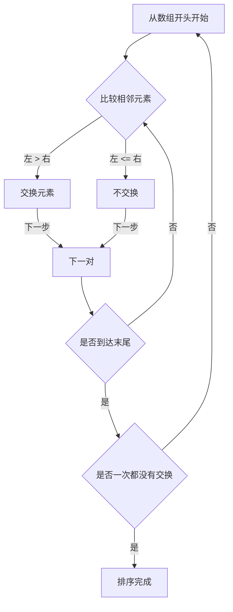
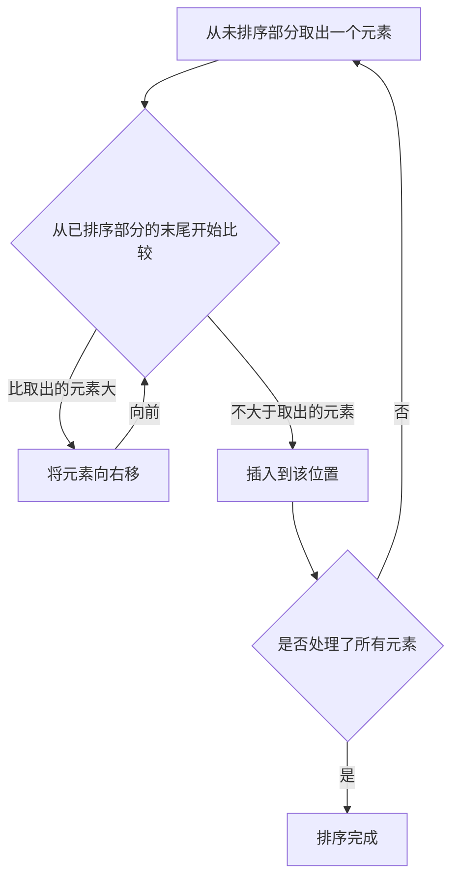
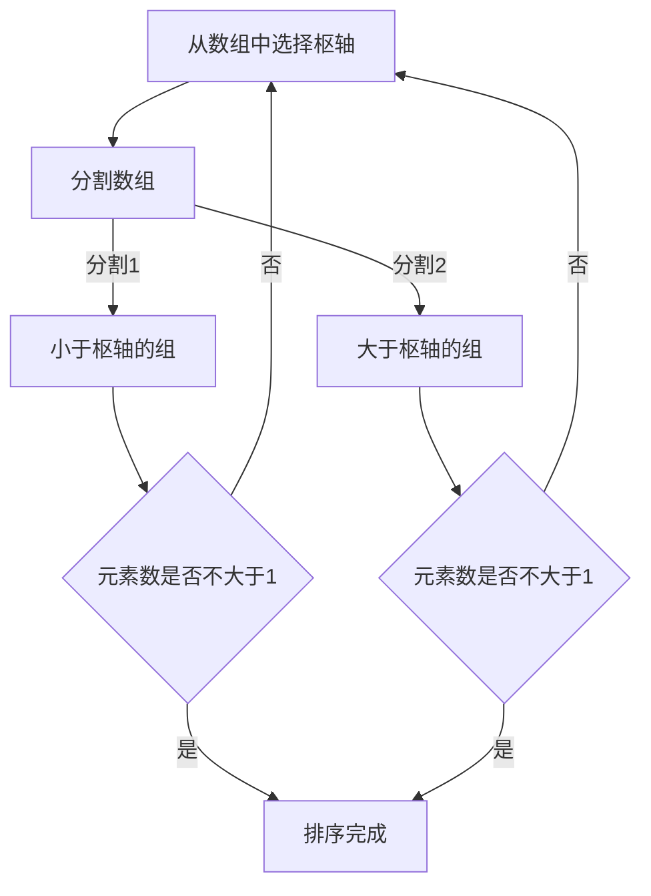
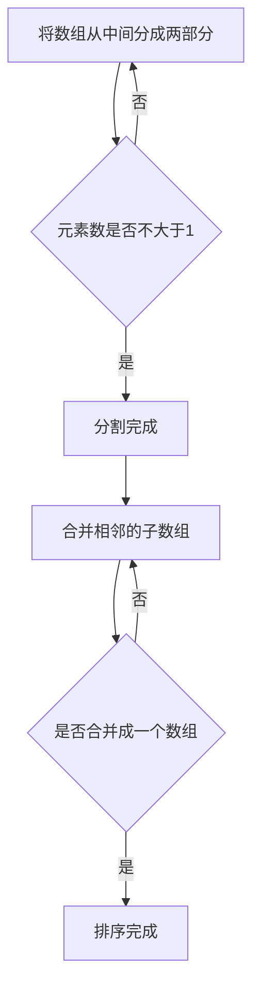

# 1. 引言：排序算法的深渊世界

在计算机科学中，将数据按特定顺序（升序或降序）重新排列的“排序”是最基本且最重要的操作之一。作为加速搜索、数据分组、重复检测等所有数据处理的前置步骤，排序算法发挥着重要作用。

本文将全面讲解代表性的排序算法，从初学者容易理解的简单算法，到在实际业务中活跃的高速算法。我们将通过 **Mermaid** 图解直观地理解各算法的机制，通过 Python 代码确认实际实现，并比较时间复杂度等性能。此外，为了完全掌握算法的运行过程，还收录了使用 50 个元素数组的完整执行跟踪。这样你就能像亲手操作一样理解算法的详细行为了。

## 算法的评估指标

在评估各种算法时，以下指标非常重要。

- **时间复杂度 (Time Complexity)** : 表示相对于数据元素数量 $n$，处理时间将如何增加。使用 $\text{O}(n^2)$ 或 $\text{O}(n \log n)$ 等大O符号（Big-O notation）表示。如果在公式中处理文本，会写成 $\text{最佳}$ 这样。
- **空间复杂度 (Space Complexity)** : 表示执行时需要多少额外内存。原地（In-place）算法几乎不需要额外内存。
- **稳定性 (Stability)** : 表示具有相同值的元素的相对顺序在排序前后是否保持不变。在稳定排序中，原始顺序得以保持。

---

## 2. 冒泡排序 (Bubble Sort)

这是一种比较相邻元素，如果顺序相反则进行交换，并重复此操作的算法。就像气泡浮出水面一样，较大的元素会逐渐移动到数组的末尾。

### 复杂度与特性

- **时间复杂度（最佳）**: $\text{O}(n)$
- **时间复杂度（平均）**: $\text{O}(n^2)$
- **时间复杂度（最差）**: $\text{O}(n^2)$
- **空间复杂度**: $\text{O}(1)$
- **稳定性**: 稳定

### 图解 (Mermaid)



### Python 实现

```python
def bubble_sort(arr):
    n = len(arr)
    for i in range(n):
        swapped = False
        for j in range(0, n-i-1):
            if arr[j] > arr[j+1]:
                arr[j], arr[j+1] = arr[j+1], arr[j]
                swapped = True
        if not swapped:
            break
    return arr
```

### 冒泡排序的详细跟踪

展示了对 50 个元素的随机数组执行冒泡排序时，每次遍历完成后的数组状态。请观察冒泡排序是如何将元素推向右侧的。

**初始状态**: `[83, 14, 64, 71, 83, 11, 36, 69, 72, 45, 93, 30, 14, 76, 72, 51, 19, 41, 56, 15, 63, 27, 87, 55, 58, 63, 46, 96, 43, 68, 32, 97, 48, 94, 56, 27, 68, 40, 66, 88, 58, 15, 84, 10, 40, 27, 34, 48, 78, 56]`

**第 1 次遍历完成后**: `[14, 64, 71, 83, 11, 36, 69, 72, 45, 83, 30, 14, 76, 72, 51, 19, 41, 56, 15, 63, 27, 87, 55, 58, 63, 46, 93, 43, 68, 32, 96, 48, 94, 56, 27, 68, 40, 66, 88, 58, 15, 84, 10, 40, 27, 34, 48, 78, 56, 97]`

在这次遍历中，未排序部分中的最大元素就像气泡一样浮到了最右端。由于冒泡排序的特性，每次遍历都保证至少有一个元素落在最终的正确位置上。因此，随着遍历次数的增加，可以逐步缩小搜索范围，从而减少不必要的比较操作。然而，在数据完全逆序排列的最坏情况下，每一对元素都会发生交换操作，因此复杂度达到 $\text{O}(n^2)$，性能极低。

在这次遍历中，未排序部分中的最大元素就像气泡一样浮到了最右端。由于冒泡排序的特性，每次遍历都保证至少有一个元素落在最终的正确位置上。因此，随着遍历次数的增加，可以逐步缩小搜索范围，从而减少不必要的比较操作。然而，在数据完全逆序排列的最坏情况下，每一对元素都会发生交换操作，因此复杂度达到 $\text{O}(n^2)$，性能极低。

**第 2 次遍历完成后**: `[14, 64, 71, 11, 36, 69, 72, 45, 83, 30, 14, 76, 72, 51, 19, 41, 56, 15, 63, 27, 83, 55, 58, 63, 46, 87, 43, 68, 32, 93, 48, 94, 56, 27, 68, 40, 66, 88, 58, 15, 84, 10, 40, 27, 34, 48, 78, 56, 96, 97]`

在这次遍历中，未排序部分中的最大元素就像气泡一样浮到了最右端。由于冒泡排序的特性，每次遍历都保证至少有一个元素落在最终的正确位置上。因此，随着遍历次数的增加，可以逐步缩小搜索范围，从而减少不必要的比较操作。然而，在数据完全逆序排列的最坏情况下，每一对元素都会发生交换操作，因此复杂度达到 $\text{O}(n^2)$，性能极低。

在这次遍历中，未排序部分中的最大元素就像气泡一样浮到了最右端。由于冒泡排序的特性，每次遍历都保证至少有一个元素落在最终的正确位置上。因此，随着遍历次数的增加，可以逐步缩小搜索范围，从而减少不必要的比较操作。然而，在数据完全逆序排列的最坏情况下，每一对元素都会发生交换操作，因此复杂度达到 $\text{O}(n^2)$，性能极低。

**第 3 次遍历完成后**: `[14, 64, 11, 36, 69, 71, 45, 72, 30, 14, 76, 72, 51, 19, 41, 56, 15, 63, 27, 83, 55, 58, 63, 46, 83, 43, 68, 32, 87, 48, 93, 56, 27, 68, 40, 66, 88, 58, 15, 84, 10, 40, 27, 34, 48, 78, 56, 94, 96, 97]`

在这次遍历中，未排序部分中的最大元素就像气泡一样浮到了最右端。由于冒泡排序的特性，每次遍历都保证至少有一个元素落在最终的正确位置上。因此，随着遍历次数的增加，可以逐步缩小搜索范围，从而减少不必要的比较操作。然而，在数据完全逆序排列的最坏情况下，每一对元素都会发生交换操作，因此复杂度达到 $\text{O}(n^2)$，性能极低。

在这次遍历中，未排序部分中的最大元素就像气泡一样浮到了最右端。由于冒泡排序的特性，每次遍历都保证至少有一个元素落在最终的正确位置上。因此，随着遍历次数的增加，可以逐步缩小搜索范围，从而减少不必要的比较操作。然而，在数据完全逆序排列的最坏情况下，每一对元素都会发生交换操作，因此复杂度达到 $\text{O}(n^2)$，性能极低。

**第 4 次遍历完成后**: `[14, 11, 36, 64, 69, 45, 71, 30, 14, 72, 72, 51, 19, 41, 56, 15, 63, 27, 76, 55, 58, 63, 46, 83, 43, 68, 32, 83, 48, 87, 56, 27, 68, 40, 66, 88, 58, 15, 84, 10, 40, 27, 34, 48, 78, 56, 93, 94, 96, 97]`

在这次遍历中，未排序部分中的最大元素就像气泡一样浮到了最右端。由于冒泡排序的特性，每次遍历都保证至少有一个元素落在最终的正确位置上。因此，随着遍历次数的增加，可以逐步缩小搜索范围，从而减少不必要的比较操作。然而，在数据完全逆序排列的最坏情况下，每一对元素都会发生交换操作，因此复杂度达到 $\text{O}(n^2)$，性能极低。

在这次遍历中，未排序部分中的最大元素就像气泡一样浮到了最右端。由于冒泡排序的特性，每次遍历都保证至少有一个元素落在最终的正确位置上。因此，随着遍历次数的增加，可以逐步缩小搜索范围，从而减少不必要的比较操作。然而，在数据完全逆序排列的最坏情况下，每一对元素都会发生交换操作，因此复杂度达到 $\text{O}(n^2)$，性能极低。

**第 5 次遍历完成后**: `[11, 14, 36, 64, 45, 69, 30, 14, 71, 72, 51, 19, 41, 56, 15, 63, 27, 72, 55, 58, 63, 46, 76, 43, 68, 32, 83, 48, 83, 56, 27, 68, 40, 66, 87, 58, 15, 84, 10, 40, 27, 34, 48, 78, 56, 88, 93, 94, 96, 97]`

在这次遍历中，未排序部分中的最大元素就像气泡一样浮到了最右端。由于冒泡排序的特性，每次遍历都保证至少有一个元素落在最终的正确位置上。因此，随着遍历次数的增加，可以逐步缩小搜索范围，从而减少不必要的比较操作。然而，在数据完全逆序排列的最坏情况下，每一对元素都会发生交换操作，因此复杂度达到 $\text{O}(n^2)$，性能极低。

在这次遍历中，未排序部分中的最大元素就像气泡一样浮到了最右端。由于冒泡排序的特性，每次遍历都保证至少有一个元素落在最终的正确位置上。因此，随着遍历次数的增加，可以逐步缩小搜索范围，从而减少不必要的比较操作。然而，在数据完全逆序排列的最坏情况下，每一对元素都会发生交换操作，因此复杂度达到 $\text{O}(n^2)$，性能极低。

**第 6 次遍历完成后**: `[11, 14, 36, 45, 64, 30, 14, 69, 71, 51, 19, 41, 56, 15, 63, 27, 72, 55, 58, 63, 46, 72, 43, 68, 32, 76, 48, 83, 56, 27, 68, 40, 66, 83, 58, 15, 84, 10, 40, 27, 34, 48, 78, 56, 87, 88, 93, 94, 96, 97]`

在这次遍历中，未排序部分中的最大元素就像气泡一样浮到了最右端。由于冒泡排序的特性，每次遍历都保证至少有一个元素落在最终的正确位置上。因此，随着遍历次数的增加，可以逐步缩小搜索范围，从而减少不必要的比较操作。然而，在数据完全逆序排列的最坏情况下，每一对元素都会发生交换操作，因此复杂度达到 $\text{O}(n^2)$，性能极低。

在这次遍历中，未排序部分中的最大元素就像气泡一样浮到了最右端。由于冒泡排序的特性，每次遍历都保证至少有一个元素落在最终的正确位置上。因此，随着遍历次数的增加，可以逐步缩小搜索范围，从而减少不必要的比较操作。然而，在数据完全逆序排列的最坏情况下，每一对元素都会发生交换操作，因此复杂度达到 $\text{O}(n^2)$，性能极低。

**第 7 次遍历完成后**: `[11, 14, 36, 45, 30, 14, 64, 69, 51, 19, 41, 56, 15, 63, 27, 71, 55, 58, 63, 46, 72, 43, 68, 32, 72, 48, 76, 56, 27, 68, 40, 66, 83, 58, 15, 83, 10, 40, 27, 34, 48, 78, 56, 84, 87, 88, 93, 94, 96, 97]`

在这次遍历中，未排序部分中的最大元素就像气泡一样浮到了最右端。由于冒泡排序的特性，每次遍历都保证至少有一个元素落在最终的正确位置上。因此，随着遍历次数的增加，可以逐步缩小搜索范围，从而减少不必要的比较操作。然而，在数据完全逆序排列的最坏情况下，每一对元素都会发生交换操作，因此复杂度达到 $\text{O}(n^2)$，性能极低。

在这次遍历中，未排序部分中的最大元素就像气泡一样浮到了最右端。由于冒泡排序的特性，每次遍历都保证至少有一个元素落在最终的正确位置上。因此，随着遍历次数的增加，可以逐步缩小搜索范围，从而减少不必要的比较操作。然而，在数据完全逆序排列的最坏情况下，每一对元素都会发生交换操作，因此复杂度达到 $\text{O}(n^2)$，性能极低。

**第 8 次遍历完成后**: `[11, 14, 36, 30, 14, 45, 64, 51, 19, 41, 56, 15, 63, 27, 69, 55, 58, 63, 46, 71, 43, 68, 32, 72, 48, 72, 56, 27, 68, 40, 66, 76, 58, 15, 83, 10, 40, 27, 34, 48, 78, 56, 83, 84, 87, 88, 93, 94, 96, 97]`

在这次遍历中，未排序部分中的最大元素就像气泡一样浮到了最右端。由于冒泡排序的特性，每次遍历都保证至少有一个元素落在最终的正确位置上。因此，随着遍历次数的增加，可以逐步缩小搜索范围，从而减少不必要的比较操作。然而，在数据完全逆序排列的最坏情况下，每一对元素都会发生交换操作，因此复杂度达到 $\text{O}(n^2)$，性能极低。

在这次遍历中，未排序部分中的最大元素就像气泡一样浮到了最右端。由于冒泡排序的特性，每次遍历都保证至少有一个元素落在最终的正确位置上。因此，随着遍历次数的增加，可以逐步缩小搜索范围，从而减少不必要的比较操作。然而，在数据完全逆序排列的最坏情况下，每一对元素都会发生交换操作，因此复杂度达到 $\text{O}(n^2)$，性能极低。

**第 9 次遍历完成后**: `[11, 14, 30, 14, 36, 45, 51, 19, 41, 56, 15, 63, 27, 64, 55, 58, 63, 46, 69, 43, 68, 32, 71, 48, 72, 56, 27, 68, 40, 66, 72, 58, 15, 76, 10, 40, 27, 34, 48, 78, 56, 83, 83, 84, 87, 88, 93, 94, 96, 97]`

在这次遍历中，未排序部分中的最大元素就像气泡一样浮到了最右端。由于冒泡排序的特性，每次遍历都保证至少有一个元素落在最终的正确位置上。因此，随着遍历次数的增加，可以逐步缩小搜索范围，从而减少不必要的比较操作。然而，在数据完全逆序排列的最坏情况下，每一对元素都会发生交换操作，因此复杂度达到 $\text{O}(n^2)$，性能极低。

在这次遍历中，未排序部分中的最大元素就像气泡一样浮到了最右端。由于冒泡排序的特性，每次遍历都保证至少有一个元素落在最终的正确位置上。因此，随着遍历次数的增加，可以逐步缩小搜索范围，从而减少不必要的比较操作。然而，在数据完全逆序排列的最坏情况下，每一对元素都会发生交换操作，因此复杂度达到 $\text{O}(n^2)$，性能极低。

**第 10 次遍历完成后**: `[11, 14, 14, 30, 36, 45, 19, 41, 51, 15, 56, 27, 63, 55, 58, 63, 46, 64, 43, 68, 32, 69, 48, 71, 56, 27, 68, 40, 66, 72, 58, 15, 72, 10, 40, 27, 34, 48, 76, 56, 78, 83, 83, 84, 87, 88, 93, 94, 96, 97]`

在这次遍历中，未排序部分中的最大元素就像气泡一样浮到了最右端。由于冒泡排序的特性，每次遍历都保证至少有一个元素落在最终的正确位置上。因此，随着遍历次数的增加，可以逐步缩小搜索范围，从而减少不必要的比较操作。然而，在数据完全逆序排列的最坏情况下，每一对元素都会发生交换操作，因此复杂度达到 $\text{O}(n^2)$，性能极低。

在这次遍历中，未排序部分中的最大元素就像气泡一样浮到了最右端。由于冒泡排序的特性，每次遍历都保证至少有一个元素落在最终的正确位置上。因此，随着遍历次数的增加，可以逐步缩小搜索范围，从而减少不必要的比较操作。然而，在数据完全逆序排列的最坏情况下，每一对元素都会发生交换操作，因此复杂度达到 $\text{O}(n^2)$，性能极低。

**第 11 次遍历完成后**: `[11, 14, 14, 30, 36, 19, 41, 45, 15, 51, 27, 56, 55, 58, 63, 46, 63, 43, 64, 32, 68, 48, 69, 56, 27, 68, 40, 66, 71, 58, 15, 72, 10, 40, 27, 34, 48, 72, 56, 76, 78, 83, 83, 84, 87, 88, 93, 94, 96, 97]`

在这次遍历中，未排序部分中的最大元素就像气泡一样浮到了最右端。由于冒泡排序的特性，每次遍历都保证至少有一个元素落在最终的正确位置上。因此，随着遍历次数的增加，可以逐步缩小搜索范围，从而减少不必要的比较操作。然而，在数据完全逆序排列的最坏情况下，每一对元素都会发生交换操作，因此复杂度达到 $\text{O}(n^2)$，性能极低。

在这次遍历中，未排序部分中的最大元素就像气泡一样浮到了最右端。由于冒泡排序的特性，每次遍历都保证至少有一个元素落在最终的正确位置上。因此，随着遍历次数的增加，可以逐步缩小搜索范围，从而减少不必要的比较操作。然而，在数据完全逆序排列的最坏情况下，每一对元素都会发生交换操作，因此复杂度达到 $\text{O}(n^2)$，性能极低。

**第 12 次遍历完成后**: `[11, 14, 14, 30, 19, 36, 41, 15, 45, 27, 51, 55, 56, 58, 46, 63, 43, 63, 32, 64, 48, 68, 56, 27, 68, 40, 66, 69, 58, 15, 71, 10, 40, 27, 34, 48, 72, 56, 72, 76, 78, 83, 83, 84, 87, 88, 93, 94, 96, 97]`

在这次遍历中，未排序部分中的最大元素就像气泡一样浮到了最右端。由于冒泡排序的特性，每次遍历都保证至少有一个元素落在最终的正确位置上。因此，随着遍历次数的增加，可以逐步缩小搜索范围，从而减少不必要的比较操作。然而，在数据完全逆序排列的最坏情况下，每一对元素都会发生交换操作，因此复杂度达到 $\text{O}(n^2)$，性能极低。

在这次遍历中，未排序部分中的最大元素就像气泡一样浮到了最右端。由于冒泡排序的特性，每次遍历都保证至少有一个元素落在最终的正确位置上。因此，随着遍历次数的增加，可以逐步缩小搜索范围，从而减少不必要的比较操作。然而，在数据完全逆序排列的最坏情况下，每一对元素都会发生交换操作，因此复杂度达到 $\text{O}(n^2)$，性能极低。

**第 13 次遍历完成后**: `[11, 14, 14, 19, 30, 36, 15, 41, 27, 45, 51, 55, 56, 46, 58, 43, 63, 32, 63, 48, 64, 56, 27, 68, 40, 66, 68, 58, 15, 69, 10, 40, 27, 34, 48, 71, 56, 72, 72, 76, 78, 83, 83, 84, 87, 88, 93, 94, 96, 97]`

在这次遍历中，未排序部分中的最大元素就像气泡一样浮到了最右端。由于冒泡排序的特性，每次遍历都保证至少有一个元素落在最终的正确位置上。因此，随着遍历次数的增加，可以逐步缩小搜索范围，从而减少不必要的比较操作。然而，在数据完全逆序排列的最坏情况下，每一对元素都会发生交换操作，因此复杂度达到 $\text{O}(n^2)$，性能极低。

在这次遍历中，未排序部分中的最大元素就像气泡一样浮到了最右端。由于冒泡排序的特性，每次遍历都保证至少有一个元素落在最终的正确位置上。因此，随着遍历次数的增加，可以逐步缩小搜索范围，从而减少不必要的比较操作。然而，在数据完全逆序排列的最坏情况下，每一对元素都会发生交换操作，因此复杂度达到 $\text{O}(n^2)$，性能极低。

**第 14 次遍历完成后**: `[11, 14, 14, 19, 30, 15, 36, 27, 41, 45, 51, 55, 46, 56, 43, 58, 32, 63, 48, 63, 56, 27, 64, 40, 66, 68, 58, 15, 68, 10, 40, 27, 34, 48, 69, 56, 71, 72, 72, 76, 78, 83, 83, 84, 87, 88, 93, 94, 96, 97]`

在这次遍历中，未排序部分中的最大元素就像气泡一样浮到了最右端。由于冒泡排序的特性，每次遍历都保证至少有一个元素落在最终的正确位置上。因此，随着遍历次数的增加，可以逐步缩小搜索范围，从而减少不必要的比较操作。然而，在数据完全逆序排列的最坏情况下，每一对元素都会发生交换操作，因此复杂度达到 $\text{O}(n^2)$，性能极低。

在这次遍历中，未排序部分中的最大元素就像气泡一样浮到了最右端。由于冒泡排序的特性，每次遍历都保证至少有一个元素落在最终的正确位置上。因此，随着遍历次数的增加，可以逐步缩小搜索范围，从而减少不必要的比较操作。然而，在数据完全逆序排列的最坏情况下，每一对元素都会发生交换操作，因此复杂度达到 $\text{O}(n^2)$，性能极低。

**第 15 次遍历完成后**: `[11, 14, 14, 19, 15, 30, 27, 36, 41, 45, 51, 46, 55, 43, 56, 32, 58, 48, 63, 56, 27, 63, 40, 64, 66, 58, 15, 68, 10, 40, 27, 34, 48, 68, 56, 69, 71, 72, 72, 76, 78, 83, 83, 84, 87, 88, 93, 94, 96, 97]`

在这次遍历中，未排序部分中的最大元素就像气泡一样浮到了最右端。由于冒泡排序的特性，每次遍历都保证至少有一个元素落在最终的正确位置上。因此，随着遍历次数的增加，可以逐步缩小搜索范围，从而减少不必要的比较操作。然而，在数据完全逆序排列的最坏情况下，每一对元素都会发生交换操作，因此复杂度达到 $\text{O}(n^2)$，性能极低。

在这次遍历中，未排序部分中的最大元素就像气泡一样浮到了最右端。由于冒泡排序的特性，每次遍历都保证至少有一个元素落在最终的正确位置上。因此，随着遍历次数的增加，可以逐步缩小搜索范围，从而减少不必要的比较操作。然而，在数据完全逆序排列的最坏情况下，每一对元素都会发生交换操作，因此复杂度达到 $\text{O}(n^2)$，性能极低。

**第 16 次遍历完成后**: `[11, 14, 14, 15, 19, 27, 30, 36, 41, 45, 46, 51, 43, 55, 32, 56, 48, 58, 56, 27, 63, 40, 63, 64, 58, 15, 66, 10, 40, 27, 34, 48, 68, 56, 68, 69, 71, 72, 72, 76, 78, 83, 83, 84, 87, 88, 93, 94, 96, 97]`

在这次遍历中，未排序部分中的最大元素就像气泡一样浮到了最右端。由于冒泡排序的特性，每次遍历都保证至少有一个元素落在最终的正确位置上。因此，随着遍历次数的增加，可以逐步缩小搜索范围，从而减少不必要的比较操作。然而，在数据完全逆序排列的最坏情况下，每一对元素都会发生交换操作，因此复杂度达到 $\text{O}(n^2)$，性能极低。

在这次遍历中，未排序部分中的最大元素就像气泡一样浮到了最右端。由于冒泡排序的特性，每次遍历都保证至少有一个元素落在最终的正确位置上。因此，随着遍历次数的增加，可以逐步缩小搜索范围，从而减少不必要的比较操作。然而，在数据完全逆序排列的最坏情况下，每一对元素都会发生交换操作，因此复杂度达到 $\text{O}(n^2)$，性能极低。

**第 17 次遍历完成后**: `[11, 14, 14, 15, 19, 27, 30, 36, 41, 45, 46, 43, 51, 32, 55, 48, 56, 56, 27, 58, 40, 63, 63, 58, 15, 64, 10, 40, 27, 34, 48, 66, 56, 68, 68, 69, 71, 72, 72, 76, 78, 83, 83, 84, 87, 88, 93, 94, 96, 97]`

在这次遍历中，未排序部分中的最大元素就像气泡一样浮到了最右端。由于冒泡排序的特性，每次遍历都保证至少有一个元素落在最终的正确位置上。因此，随着遍历次数的增加，可以逐步缩小搜索范围，从而减少不必要的比较操作。然而，在数据完全逆序排列的最坏情况下，每一对元素都会发生交换操作，因此复杂度达到 $\text{O}(n^2)$，性能极低。

在这次遍历中，未排序部分中的最大元素就像气泡一样浮到了最右端。由于冒泡排序的特性，每次遍历都保证至少有一个元素落在最终的正确位置上。因此，随着遍历次数的增加，可以逐步缩小搜索范围，从而减少不必要的比较操作。然而，在数据完全逆序排列的最坏情况下，每一对元素都会发生交换操作，因此复杂度达到 $\text{O}(n^2)$，性能极低。

**第 18 次遍历完成后**: `[11, 14, 14, 15, 19, 27, 30, 36, 41, 45, 43, 46, 32, 51, 48, 55, 56, 27, 56, 40, 58, 63, 58, 15, 63, 10, 40, 27, 34, 48, 64, 56, 66, 68, 68, 69, 71, 72, 72, 76, 78, 83, 83, 84, 87, 88, 93, 94, 96, 97]`

在这次遍历中，未排序部分中的最大元素就像气泡一样浮到了最右端。由于冒泡排序的特性，每次遍历都保证至少有一个元素落在最终的正确位置上。因此，随着遍历次数的增加，可以逐步缩小搜索范围，从而减少不必要的比较操作。然而，在数据完全逆序排列的最坏情况下，每一对元素都会发生交换操作，因此复杂度达到 $\text{O}(n^2)$，性能极低。

在这次遍历中，未排序部分中的最大元素就像气泡一样浮到了最右端。由于冒泡排序的特性，每次遍历都保证至少有一个元素落在最终的正确位置上。因此，随着遍历次数的增加，可以逐步缩小搜索范围，从而减少不必要的比较操作。然而，在数据完全逆序排列的最坏情况下，每一对元素都会发生交换操作，因此复杂度达到 $\text{O}(n^2)$，性能极低。

**第 19 次遍历完成后**: `[11, 14, 14, 15, 19, 27, 30, 36, 41, 43, 45, 32, 46, 48, 51, 55, 27, 56, 40, 56, 58, 58, 15, 63, 10, 40, 27, 34, 48, 63, 56, 64, 66, 68, 68, 69, 71, 72, 72, 76, 78, 83, 83, 84, 87, 88, 93, 94, 96, 97]`

在这次遍历中，未排序部分中的最大元素就像气泡一样浮到了最右端。由于冒泡排序的特性，每次遍历都保证至少有一个元素落在最终的正确位置上。因此，随着遍历次数的增加，可以逐步缩小搜索范围，从而减少不必要的比较操作。然而，在数据完全逆序排列的最坏情况下，每一对元素都会发生交换操作，因此复杂度达到 $\text{O}(n^2)$，性能极低。

在这次遍历中，未排序部分中的最大元素就像气泡一样浮到了最右端。由于冒泡排序的特性，每次遍历都保证至少有一个元素落在最终的正确位置上。因此，随着遍历次数的增加，可以逐步缩小搜索范围，从而减少不必要的比较操作。然而，在数据完全逆序排列的最坏情况下，每一对元素都会发生交换操作，因此复杂度达到 $\text{O}(n^2)$，性能极低。

**第 20 次遍历完成后**: `[11, 14, 14, 15, 19, 27, 30, 36, 41, 43, 32, 45, 46, 48, 51, 27, 55, 40, 56, 56, 58, 15, 58, 10, 40, 27, 34, 48, 63, 56, 63, 64, 66, 68, 68, 69, 71, 72, 72, 76, 78, 83, 83, 84, 87, 88, 93, 94, 96, 97]`

在这次遍历中，未排序部分中的最大元素就像气泡一样浮到了最右端。由于冒泡排序的特性，每次遍历都保证至少有一个元素落在最终的正确位置上。因此，随着遍历次数的增加，可以逐步缩小搜索范围，从而减少不必要的比较操作。然而，在数据完全逆序排列的最坏情况下，每一对元素都会发生交换操作，因此复杂度达到 $\text{O}(n^2)$，性能极低。

在这次遍历中，未排序部分中的最大元素就像气泡一样浮到了最右端。由于冒泡排序的特性，每次遍历都保证至少有一个元素落在最终的正确位置上。因此，随着遍历次数的增加，可以逐步缩小搜索范围，从而减少不必要的比较操作。然而，在数据完全逆序排列的最坏情况下，每一对元素都会发生交换操作，因此复杂度达到 $\text{O}(n^2)$，性能极低。

**第 21 次遍历完成后**: `[11, 14, 14, 15, 19, 27, 30, 36, 41, 32, 43, 45, 46, 48, 27, 51, 40, 55, 56, 56, 15, 58, 10, 40, 27, 34, 48, 58, 56, 63, 63, 64, 66, 68, 68, 69, 71, 72, 72, 76, 78, 83, 83, 84, 87, 88, 93, 94, 96, 97]`

在这次遍历中，未排序部分中的最大元素就像气泡一样浮到了最右端。由于冒泡排序的特性，每次遍历都保证至少有一个元素落在最终的正确位置上。因此，随着遍历次数的增加，可以逐步缩小搜索范围，从而减少不必要的比较操作。然而，在数据完全逆序排列的最坏情况下，每一对元素都会发生交换操作，因此复杂度达到 $\text{O}(n^2)$，性能极低。

在这次遍历中，未排序部分中的最大元素就像气泡一样浮到了最右端。由于冒泡排序的特性，每次遍历都保证至少有一个元素落在最终的正确位置上。因此，随着遍历次数的增加，可以逐步缩小搜索范围，从而减少不必要的比较操作。然而，在数据完全逆序排列的最坏情况下，每一对元素都会发生交换操作，因此复杂度达到 $\text{O}(n^2)$，性能极低。

**第 22 次遍历完成后**: `[11, 14, 14, 15, 19, 27, 30, 36, 32, 41, 43, 45, 46, 27, 48, 40, 51, 55, 56, 15, 56, 10, 40, 27, 34, 48, 58, 56, 58, 63, 63, 64, 66, 68, 68, 69, 71, 72, 72, 76, 78, 83, 83, 84, 87, 88, 93, 94, 96, 97]`

在这次遍历中，未排序部分中的最大元素就像气泡一样浮到了最右端。由于冒泡排序的特性，每次遍历都保证至少有一个元素落在最终的正确位置上。因此，随着遍历次数的增加，可以逐步缩小搜索范围，从而减少不必要的比较操作。然而，在数据完全逆序排列的最坏情况下，每一对元素都会发生交换操作，因此复杂度达到 $\text{O}(n^2)$，性能极低。

在这次遍历中，未排序部分中的最大元素就像气泡一样浮到了最右端。由于冒泡排序的特性，每次遍历都保证至少有一个元素落在最终的正确位置上。因此，随着遍历次数的增加，可以逐步缩小搜索范围，从而减少不必要的比较操作。然而，在数据完全逆序排列的最坏情况下，每一对元素都会发生交换操作，因此复杂度达到 $\text{O}(n^2)$，性能极低。

**第 23 次遍历完成后**: `[11, 14, 14, 15, 19, 27, 30, 32, 36, 41, 43, 45, 27, 46, 40, 48, 51, 55, 15, 56, 10, 40, 27, 34, 48, 56, 56, 58, 58, 63, 63, 64, 66, 68, 68, 69, 71, 72, 72, 76, 78, 83, 83, 84, 87, 88, 93, 94, 96, 97]`

在这次遍历中，未排序部分中的最大元素就像气泡一样浮到了最右端。由于冒泡排序的特性，每次遍历都保证至少有一个元素落在最终的正确位置上。因此，随着遍历次数的增加，可以逐步缩小搜索范围，从而减少不必要的比较操作。然而，在数据完全逆序排列的最坏情况下，每一对元素都会发生交换操作，因此复杂度达到 $\text{O}(n^2)$，性能极低。

在这次遍历中，未排序部分中的最大元素就像气泡一样浮到了最右端。由于冒泡排序的特性，每次遍历都保证至少有一个元素落在最终的正确位置上。因此，随着遍历次数的增加，可以逐步缩小搜索范围，从而减少不必要的比较操作。然而，在数据完全逆序排列的最坏情况下，每一对元素都会发生交换操作，因此复杂度达到 $\text{O}(n^2)$，性能极低。

**第 24 次遍历完成后**: `[11, 14, 14, 15, 19, 27, 30, 32, 36, 41, 43, 27, 45, 40, 46, 48, 51, 15, 55, 10, 40, 27, 34, 48, 56, 56, 56, 58, 58, 63, 63, 64, 66, 68, 68, 69, 71, 72, 72, 76, 78, 83, 83, 84, 87, 88, 93, 94, 96, 97]`

在这次遍历中，未排序部分中的最大元素就像气泡一样浮到了最右端。由于冒泡排序的特性，每次遍历都保证至少有一个元素落在最终的正确位置上。因此，随着遍历次数的增加，可以逐步缩小搜索范围，从而减少不必要的比较操作。然而，在数据完全逆序排列的最坏情况下，每一对元素都会发生交换操作，因此复杂度达到 $\text{O}(n^2)$，性能极低。

在这次遍历中，未排序部分中的最大元素就像气泡一样浮到了最右端。由于冒泡排序的特性，每次遍历都保证至少有一个元素落在最终的正确位置上。因此，随着遍历次数的增加，可以逐步缩小搜索范围，从而减少不必要的比较操作。然而，在数据完全逆序排列的最坏情况下，每一对元素都会发生交换操作，因此复杂度达到 $\text{O}(n^2)$，性能极低。

**第 25 次遍历完成后**: `[11, 14, 14, 15, 19, 27, 30, 32, 36, 41, 27, 43, 40, 45, 46, 48, 15, 51, 10, 40, 27, 34, 48, 55, 56, 56, 56, 58, 58, 63, 63, 64, 66, 68, 68, 69, 71, 72, 72, 76, 78, 83, 83, 84, 87, 88, 93, 94, 96, 97]`

在这次遍历中，未排序部分中的最大元素就像气泡一样浮到了最右端。由于冒泡排序的特性，每次遍历都保证至少有一个元素落在最终的正确位置上。因此，随着遍历次数的增加，可以逐步缩小搜索范围，从而减少不必要的比较操作。然而，在数据完全逆序排列的最坏情况下，每一对元素都会发生交换操作，因此复杂度达到 $\text{O}(n^2)$，性能极低。

在这次遍历中，未排序部分中的最大元素就像气泡一样浮到了最右端。由于冒泡排序的特性，每次遍历都保证至少有一个元素落在最终的正确位置上。因此，随着遍历次数的增加，可以逐步缩小搜索范围，从而减少不必要的比较操作。然而，在数据完全逆序排列的最坏情况下，每一对元素都会发生交换操作，因此复杂度达到 $\text{O}(n^2)$，性能极低。

**第 26 次遍历完成后**: `[11, 14, 14, 15, 19, 27, 30, 32, 36, 27, 41, 40, 43, 45, 46, 15, 48, 10, 40, 27, 34, 48, 51, 55, 56, 56, 56, 58, 58, 63, 63, 64, 66, 68, 68, 69, 71, 72, 72, 76, 78, 83, 83, 84, 87, 88, 93, 94, 96, 97]`

在这次遍历中，未排序部分中的最大元素就像气泡一样浮到了最右端。由于冒泡排序的特性，每次遍历都保证至少有一个元素落在最终的正确位置上。因此，随着遍历次数的增加，可以逐步缩小搜索范围，从而减少不必要的比较操作。然而，在数据完全逆序排列的最坏情况下，每一对元素都会发生交换操作，因此复杂度达到 $\text{O}(n^2)$，性能极低。

在这次遍历中，未排序部分中的最大元素就像气泡一样浮到了最右端。由于冒泡排序的特性，每次遍历都保证至少有一个元素落在最终的正确位置上。因此，随着遍历次数的增加，可以逐步缩小搜索范围，从而减少不必要的比较操作。然而，在数据完全逆序排列的最坏情况下，每一对元素都会发生交换操作，因此复杂度达到 $\text{O}(n^2)$，性能极低。

**第 27 次遍历完成后**: `[11, 14, 14, 15, 19, 27, 30, 32, 27, 36, 40, 41, 43, 45, 15, 46, 10, 40, 27, 34, 48, 48, 51, 55, 56, 56, 56, 58, 58, 63, 63, 64, 66, 68, 68, 69, 71, 72, 72, 76, 78, 83, 83, 84, 87, 88, 93, 94, 96, 97]`

在这次遍历中，未排序部分中的最大元素就像气泡一样浮到了最右端。由于冒泡排序的特性，每次遍历都保证至少有一个元素落在最终的正确位置上。因此，随着遍历次数的增加，可以逐步缩小搜索范围，从而减少不必要的比较操作。然而，在数据完全逆序排列的最坏情况下，每一对元素都会发生交换操作，因此复杂度达到 $\text{O}(n^2)$，性能极低。

在这次遍历中，未排序部分中的最大元素就像气泡一样浮到了最右端。由于冒泡排序的特性，每次遍历都保证至少有一个元素落在最终的正确位置上。因此，随着遍历次数的增加，可以逐步缩小搜索范围，从而减少不必要的比较操作。然而，在数据完全逆序排列的最坏情况下，每一对元素都会发生交换操作，因此复杂度达到 $\text{O}(n^2)$，性能极低。

**第 28 次遍历完成后**: `[11, 14, 14, 15, 19, 27, 30, 27, 32, 36, 40, 41, 43, 15, 45, 10, 40, 27, 34, 46, 48, 48, 51, 55, 56, 56, 56, 58, 58, 63, 63, 64, 66, 68, 68, 69, 71, 72, 72, 76, 78, 83, 83, 84, 87, 88, 93, 94, 96, 97]`

在这次遍历中，未排序部分中的最大元素就像气泡一样浮到了最右端。由于冒泡排序的特性，每次遍历都保证至少有一个元素落在最终的正确位置上。因此，随着遍历次数的增加，可以逐步缩小搜索范围，从而减少不必要的比较操作。然而，在数据完全逆序排列的最坏情况下，每一对元素都会发生交换操作，因此复杂度达到 $\text{O}(n^2)$，性能极低。

在这次遍历中，未排序部分中的最大元素就像气泡一样浮到了最右端。由于冒泡排序的特性，每次遍历都保证至少有一个元素落在最终的正确位置上。因此，随着遍历次数的增加，可以逐步缩小搜索范围，从而减少不必要的比较操作。然而，在数据完全逆序排列的最坏情况下，每一对元素都会发生交换操作，因此复杂度达到 $\text{O}(n^2)$，性能极低。

**第 29 次遍历完成后**: `[11, 14, 14, 15, 19, 27, 27, 30, 32, 36, 40, 41, 15, 43, 10, 40, 27, 34, 45, 46, 48, 48, 51, 55, 56, 56, 56, 58, 58, 63, 63, 64, 66, 68, 68, 69, 71, 72, 72, 76, 78, 83, 83, 84, 87, 88, 93, 94, 96, 97]`

在这次遍历中，未排序部分中的最大元素就像气泡一样浮到了最右端。由于冒泡排序的特性，每次遍历都保证至少有一个元素落在最终的正确位置上。因此，随着遍历次数的增加，可以逐步缩小搜索范围，从而减少不必要的比较操作。然而，在数据完全逆序排列的最坏情况下，每一对元素都会发生交换操作，因此复杂度达到 $\text{O}(n^2)$，性能极低。

在这次遍历中，未排序部分中的最大元素就像气泡一样浮到了最右端。由于冒泡排序的特性，每次遍历都保证至少有一个元素落在最终的正确位置上。因此，随着遍历次数的增加，可以逐步缩小搜索范围，从而减少不必要的比较操作。然而，在数据完全逆序排列的最坏情况下，每一对元素都会发生交换操作，因此复杂度达到 $\text{O}(n^2)$，性能极低。

**第 30 次遍历完成后**: `[11, 14, 14, 15, 19, 27, 27, 30, 32, 36, 40, 15, 41, 10, 40, 27, 34, 43, 45, 46, 48, 48, 51, 55, 56, 56, 56, 58, 58, 63, 63, 64, 66, 68, 68, 69, 71, 72, 72, 76, 78, 83, 83, 84, 87, 88, 93, 94, 96, 97]`

在这次遍历中，未排序部分中的最大元素就像气泡一样浮到了最右端。由于冒泡排序的特性，每次遍历都保证至少有一个元素落在最终的正确位置上。因此，随着遍历次数的增加，可以逐步缩小搜索范围，从而减少不必要的比较操作。然而，在数据完全逆序排列的最坏情况下，每一对元素都会发生交换操作，因此复杂度达到 $\text{O}(n^2)$，性能极低。

在这次遍历中，未排序部分中的最大元素就像气泡一样浮到了最右端。由于冒泡排序的特性，每次遍历都保证至少有一个元素落在最终的正确位置上。因此，随着遍历次数的增加，可以逐步缩小搜索范围，从而减少不必要的比较操作。然而，在数据完全逆序排列的最坏情况下，每一对元素都会发生交换操作，因此复杂度达到 $\text{O}(n^2)$，性能极低。

**第 31 次遍历完成后**: `[11, 14, 14, 15, 19, 27, 27, 30, 32, 36, 15, 40, 10, 40, 27, 34, 41, 43, 45, 46, 48, 48, 51, 55, 56, 56, 56, 58, 58, 63, 63, 64, 66, 68, 68, 69, 71, 72, 72, 76, 78, 83, 83, 84, 87, 88, 93, 94, 96, 97]`

在这次遍历中，未排序部分中的最大元素就像气泡一样浮到了最右端。由于冒泡排序的特性，每次遍历都保证至少有一个元素落在最终的正确位置上。因此，随着遍历次数的增加，可以逐步缩小搜索范围，从而减少不必要的比较操作。然而，在数据完全逆序排列的最坏情况下，每一对元素都会发生交换操作，因此复杂度达到 $\text{O}(n^2)$，性能极低。

在这次遍历中，未排序部分中的最大元素就像气泡一样浮到了最右端。由于冒泡排序的特性，每次遍历都保证至少有一个元素落在最终的正确位置上。因此，随着遍历次数的增加，可以逐步缩小搜索范围，从而减少不必要的比较操作。然而，在数据完全逆序排列的最坏情况下，每一对元素都会发生交换操作，因此复杂度达到 $\text{O}(n^2)$，性能极低。

**第 32 次遍历完成后**: `[11, 14, 14, 15, 19, 27, 27, 30, 32, 15, 36, 10, 40, 27, 34, 40, 41, 43, 45, 46, 48, 48, 51, 55, 56, 56, 56, 58, 58, 63, 63, 64, 66, 68, 68, 69, 71, 72, 72, 76, 78, 83, 83, 84, 87, 88, 93, 94, 96, 97]`

在这次遍历中，未排序部分中的最大元素就像气泡一样浮到了最右端。由于冒泡排序的特性，每次遍历都保证至少有一个元素落在最终的正确位置上。因此，随着遍历次数的增加，可以逐步缩小搜索范围，从而减少不必要的比较操作。然而，在数据完全逆序排列的最坏情况下，每一对元素都会发生交换操作，因此复杂度达到 $\text{O}(n^2)$，性能极低。

在这次遍历中，未排序部分中的最大元素就像气泡一样浮到了最右端。由于冒泡排序的特性，每次遍历都保证至少有一个元素落在最终的正确位置上。因此，随着遍历次数的增加，可以逐步缩小搜索范围，从而减少不必要的比较操作。然而，在数据完全逆序排列的最坏情况下，每一对元素都会发生交换操作，因此复杂度达到 $\text{O}(n^2)$，性能极低。

**第 33 次遍历完成后**: `[11, 14, 14, 15, 19, 27, 27, 30, 15, 32, 10, 36, 27, 34, 40, 40, 41, 43, 45, 46, 48, 48, 51, 55, 56, 56, 56, 58, 58, 63, 63, 64, 66, 68, 68, 69, 71, 72, 72, 76, 78, 83, 83, 84, 87, 88, 93, 94, 96, 97]`

在这次遍历中，未排序部分中的最大元素就像气泡一样浮到了最右端。由于冒泡排序的特性，每次遍历都保证至少有一个元素落在最终的正确位置上。因此，随着遍历次数的增加，可以逐步缩小搜索范围，从而减少不必要的比较操作。然而，在数据完全逆序排列的最坏情况下，每一对元素都会发生交换操作，因此复杂度达到 $\text{O}(n^2)$，性能极低。

在这次遍历中，未排序部分中的最大元素就像气泡一样浮到了最右端。由于冒泡排序的特性，每次遍历都保证至少有一个元素落在最终的正确位置上。因此，随着遍历次数的增加，可以逐步缩小搜索范围，从而减少不必要的比较操作。然而，在数据完全逆序排列的最坏情况下，每一对元素都会发生交换操作，因此复杂度达到 $\text{O}(n^2)$，性能极低。

**第 34 次遍历完成后**: `[11, 14, 14, 15, 19, 27, 27, 15, 30, 10, 32, 27, 34, 36, 40, 40, 41, 43, 45, 46, 48, 48, 51, 55, 56, 56, 56, 58, 58, 63, 63, 64, 66, 68, 68, 69, 71, 72, 72, 76, 78, 83, 83, 84, 87, 88, 93, 94, 96, 97]`

在这次遍历中，未排序部分中的最大元素就像气泡一样浮到了最右端。由于冒泡排序的特性，每次遍历都保证至少有一个元素落在最终的正确位置上。因此，随着遍历次数的增加，可以逐步缩小搜索范围，从而减少不必要的比较操作。然而，在数据完全逆序排列的最坏情况下，每一对元素都会发生交换操作，因此复杂度达到 $\text{O}(n^2)$，性能极低。

在这次遍历中，未排序部分中的最大元素就像气泡一样浮到了最右端。由于冒泡排序的特性，每次遍历都保证至少有一个元素落在最终的正确位置上。因此，随着遍历次数的增加，可以逐步缩小搜索范围，从而减少不必要的比较操作。然而，在数据完全逆序排列的最坏情况下，每一对元素都会发生交换操作，因此复杂度达到 $\text{O}(n^2)$，性能极低。

**第 35 次遍历完成后**: `[11, 14, 14, 15, 19, 27, 15, 27, 10, 30, 27, 32, 34, 36, 40, 40, 41, 43, 45, 46, 48, 48, 51, 55, 56, 56, 56, 58, 58, 63, 63, 64, 66, 68, 68, 69, 71, 72, 72, 76, 78, 83, 83, 84, 87, 88, 93, 94, 96, 97]`

在这次遍历中，未排序部分中的最大元素就像气泡一样浮到了最右端。由于冒泡排序的特性，每次遍历都保证至少有一个元素落在最终的正确位置上。因此，随着遍历次数的增加，可以逐步缩小搜索范围，从而减少不必要的比较操作。然而，在数据完全逆序排列的最坏情况下，每一对元素都会发生交换操作，因此复杂度达到 $\text{O}(n^2)$，性能极低。

在这次遍历中，未排序部分中的最大元素就像气泡一样浮到了最右端。由于冒泡排序的特性，每次遍历都保证至少有一个元素落在最终的正确位置上。因此，随着遍历次数的增加，可以逐步缩小搜索范围，从而减少不必要的比较操作。然而，在数据完全逆序排列的最坏情况下，每一对元素都会发生交换操作，因此复杂度达到 $\text{O}(n^2)$，性能极低。

**第 36 次遍历完成后**: `[11, 14, 14, 15, 19, 15, 27, 10, 27, 27, 30, 32, 34, 36, 40, 40, 41, 43, 45, 46, 48, 48, 51, 55, 56, 56, 56, 58, 58, 63, 63, 64, 66, 68, 68, 69, 71, 72, 72, 76, 78, 83, 83, 84, 87, 88, 93, 94, 96, 97]`

在这次遍历中，未排序部分中的最大元素就像气泡一样浮到了最右端。由于冒泡排序的特性，每次遍历都保证至少有一个元素落在最终的正确位置上。因此，随着遍历次数的增加，可以逐步缩小搜索范围，从而减少不必要的比较操作。然而，在数据完全逆序排列的最坏情况下，每一对元素都会发生交换操作，因此复杂度达到 $\text{O}(n^2)$，性能极低。

在这次遍历中，未排序部分中的最大元素就像气泡一样浮到了最右端。由于冒泡排序的特性，每次遍历都保证至少有一个元素落在最终的正确位置上。因此，随着遍历次数的增加，可以逐步缩小搜索范围，从而减少不必要的比较操作。然而，在数据完全逆序排列的最坏情况下，每一对元素都会发生交换操作，因此复杂度达到 $\text{O}(n^2)$，性能极低。

**第 37 次遍历完成后**: `[11, 14, 14, 15, 15, 19, 10, 27, 27, 27, 30, 32, 34, 36, 40, 40, 41, 43, 45, 46, 48, 48, 51, 55, 56, 56, 56, 58, 58, 63, 63, 64, 66, 68, 68, 69, 71, 72, 72, 76, 78, 83, 83, 84, 87, 88, 93, 94, 96, 97]`

在这次遍历中，未排序部分中的最大元素就像气泡一样浮到了最右端。由于冒泡排序的特性，每次遍历都保证至少有一个元素落在最终的正确位置上。因此，随着遍历次数的增加，可以逐步缩小搜索范围，从而减少不必要的比较操作。然而，在数据完全逆序排列的最坏情况下，每一对元素都会发生交换操作，因此复杂度达到 $\text{O}(n^2)$，性能极低。

在这次遍历中，未排序部分中的最大元素就像气泡一样浮到了最右端。由于冒泡排序的特性，每次遍历都保证至少有一个元素落在最终的正确位置上。因此，随着遍历次数的增加，可以逐步缩小搜索范围，从而减少不必要的比较操作。然而，在数据完全逆序排列的最坏情况下，每一对元素都会发生交换操作，因此复杂度达到 $\text{O}(n^2)$，性能极低。

**第 38 次遍历完成后**: `[11, 14, 14, 15, 15, 10, 19, 27, 27, 27, 30, 32, 34, 36, 40, 40, 41, 43, 45, 46, 48, 48, 51, 55, 56, 56, 56, 58, 58, 63, 63, 64, 66, 68, 68, 69, 71, 72, 72, 76, 78, 83, 83, 84, 87, 88, 93, 94, 96, 97]`

在这次遍历中，未排序部分中的最大元素就像气泡一样浮到了最右端。由于冒泡排序的特性，每次遍历都保证至少有一个元素落在最终的正确位置上。因此，随着遍历次数的增加，可以逐步缩小搜索范围，从而减少不必要的比较操作。然而，在数据完全逆序排列的最坏情况下，每一对元素都会发生交换操作，因此复杂度达到 $\text{O}(n^2)$，性能极低。

在这次遍历中，未排序部分中的最大元素就像气泡一样浮到了最右端。由于冒泡排序的特性，每次遍历都保证至少有一个元素落在最终的正确位置上。因此，随着遍历次数的增加，可以逐步缩小搜索范围，从而减少不必要的比较操作。然而，在数据完全逆序排列的最坏情况下，每一对元素都会发生交换操作，因此复杂度达到 $\text{O}(n^2)$，性能极低。

**第 39 次遍历完成后**: `[11, 14, 14, 15, 10, 15, 19, 27, 27, 27, 30, 32, 34, 36, 40, 40, 41, 43, 45, 46, 48, 48, 51, 55, 56, 56, 56, 58, 58, 63, 63, 64, 66, 68, 68, 69, 71, 72, 72, 76, 78, 83, 83, 84, 87, 88, 93, 94, 96, 97]`

在这次遍历中，未排序部分中的最大元素就像气泡一样浮到了最右端。由于冒泡排序的特性，每次遍历都保证至少有一个元素落在最终的正确位置上。因此，随着遍历次数的增加，可以逐步缩小搜索范围，从而减少不必要的比较操作。然而，在数据完全逆序排列的最坏情况下，每一对元素都会发生交换操作，因此复杂度达到 $\text{O}(n^2)$，性能极低。

在这次遍历中，未排序部分中的最大元素就像气泡一样浮到了最右端。由于冒泡排序的特性，每次遍历都保证至少有一个元素落在最终的正确位置上。因此，随着遍历次数的增加，可以逐步缩小搜索范围，从而减少不必要的比较操作。然而，在数据完全逆序排列的最坏情况下，每一对元素都会发生交换操作，因此复杂度达到 $\text{O}(n^2)$，性能极低。

**第 40 次遍历完成后**: `[11, 14, 14, 10, 15, 15, 19, 27, 27, 27, 30, 32, 34, 36, 40, 40, 41, 43, 45, 46, 48, 48, 51, 55, 56, 56, 56, 58, 58, 63, 63, 64, 66, 68, 68, 69, 71, 72, 72, 76, 78, 83, 83, 84, 87, 88, 93, 94, 96, 97]`

在这次遍历中，未排序部分中的最大元素就像气泡一样浮到了最右端。由于冒泡排序的特性，每次遍历都保证至少有一个元素落在最终的正确位置上。因此，随着遍历次数的增加，可以逐步缩小搜索范围，从而减少不必要的比较操作。然而，在数据完全逆序排列的最坏情况下，每一对元素都会发生交换操作，因此复杂度达到 $\text{O}(n^2)$，性能极低。

在这次遍历中，未排序部分中的最大元素就像气泡一样浮到了最右端。由于冒泡排序的特性，每次遍历都保证至少有一个元素落在最终的正确位置上。因此，随着遍历次数的增加，可以逐步缩小搜索范围，从而减少不必要的比较操作。然而，在数据完全逆序排列的最坏情况下，每一对元素都会发生交换操作，因此复杂度达到 $\text{O}(n^2)$，性能极低。

**第 41 次遍历完成后**: `[11, 14, 10, 14, 15, 15, 19, 27, 27, 27, 30, 32, 34, 36, 40, 40, 41, 43, 45, 46, 48, 48, 51, 55, 56, 56, 56, 58, 58, 63, 63, 64, 66, 68, 68, 69, 71, 72, 72, 76, 78, 83, 83, 84, 87, 88, 93, 94, 96, 97]`

在这次遍历中，未排序部分中的最大元素就像气泡一样浮到了最右端。由于冒泡排序的特性，每次遍历都保证至少有一个元素落在最终的正确位置上。因此，随着遍历次数的增加，可以逐步缩小搜索范围，从而减少不必要的比较操作。然而，在数据完全逆序排列的最坏情况下，每一对元素都会发生交换操作，因此复杂度达到 $\text{O}(n^2)$，性能极低。

在这次遍历中，未排序部分中的最大元素就像气泡一样浮到了最右端。由于冒泡排序的特性，每次遍历都保证至少有一个元素落在最终的正确位置上。因此，随着遍历次数的增加，可以逐步缩小搜索范围，从而减少不必要的比较操作。然而，在数据完全逆序排列的最坏情况下，每一对元素都会发生交换操作，因此复杂度达到 $\text{O}(n^2)$，性能极低。

**第 42 次遍历完成后**: `[11, 10, 14, 14, 15, 15, 19, 27, 27, 27, 30, 32, 34, 36, 40, 40, 41, 43, 45, 46, 48, 48, 51, 55, 56, 56, 56, 58, 58, 63, 63, 64, 66, 68, 68, 69, 71, 72, 72, 76, 78, 83, 83, 84, 87, 88, 93, 94, 96, 97]`

在这次遍历中，未排序部分中的最大元素就像气泡一样浮到了最右端。由于冒泡排序的特性，每次遍历都保证至少有一个元素落在最终的正确位置上。因此，随着遍历次数的增加，可以逐步缩小搜索范围，从而减少不必要的比较操作。然而，在数据完全逆序排列的最坏情况下，每一对元素都会发生交换操作，因此复杂度达到 $\text{O}(n^2)$，性能极低。

在这次遍历中，未排序部分中的最大元素就像气泡一样浮到了最右端。由于冒泡排序的特性，每次遍历都保证至少有一个元素落在最终的正确位置上。因此，随着遍历次数的增加，可以逐步缩小搜索范围，从而减少不必要的比较操作。然而，在数据完全逆序排列的最坏情况下，每一对元素都会发生交换操作，因此复杂度达到 $\text{O}(n^2)$，性能极低。

**第 43 次遍历完成后**: `[10, 11, 14, 14, 15, 15, 19, 27, 27, 27, 30, 32, 34, 36, 40, 40, 41, 43, 45, 46, 48, 48, 51, 55, 56, 56, 56, 58, 58, 63, 63, 64, 66, 68, 68, 69, 71, 72, 72, 76, 78, 83, 83, 84, 87, 88, 93, 94, 96, 97]`

在这次遍历中，未排序部分中的最大元素就像气泡一样浮到了最右端。由于冒泡排序的特性，每次遍历都保证至少有一个元素落在最终的正确位置上。因此，随着遍历次数的增加，可以逐步缩小搜索范围，从而减少不必要的比较操作。然而，在数据完全逆序排列的最坏情况下，每一对元素都会发生交换操作，因此复杂度达到 $\text{O}(n^2)$，性能极低。

在这次遍历中，未排序部分中的最大元素就像气泡一样浮到了最右端。由于冒泡排序的特性，每次遍历都保证至少有一个元素落在最终的正确位置上。因此，随着遍历次数的增加，可以逐步缩小搜索范围，从而减少不必要的比较操作。然而，在数据完全逆序排列的最坏情况下，每一对元素都会发生交换操作，因此复杂度达到 $\text{O}(n^2)$，性能极低。

**第 44 次遍历完成后**: `[10, 11, 14, 14, 15, 15, 19, 27, 27, 27, 30, 32, 34, 36, 40, 40, 41, 43, 45, 46, 48, 48, 51, 55, 56, 56, 56, 58, 58, 63, 63, 64, 66, 68, 68, 69, 71, 72, 72, 76, 78, 83, 83, 84, 87, 88, 93, 94, 96, 97]`

在这次遍历中，未排序部分中的最大元素就像气泡一样浮到了最右端。由于冒泡排序的特性，每次遍历都保证至少有一个元素落在最终的正确位置上。因此，随着遍历次数的增加，可以逐步缩小搜索范围，从而减少不必要的比较操作。然而，在数据完全逆序排列的最坏情况下，每一对元素都会发生交换操作，因此复杂度达到 $\text{O}(n^2)$，性能极低。

在这次遍历中，未排序部分中的最大元素就像气泡一样浮到了最右端。由于冒泡排序的特性，每次遍历都保证至少有一个元素落在最终的正确位置上。因此，随着遍历次数的增加，可以逐步缩小搜索范围，从而减少不必要的比较操作。然而，在数据完全逆序排列的最坏情况下，每一对元素都会发生交换操作，因此复杂度达到 $\text{O}(n^2)$，性能极低。

因为在第 44 次遍历中没有发生交换，所以判断为排序完成并结束。

## 3. 插入排序 (Insertion Sort)

就像整理手中的扑克牌一样，从未排序部分逐个取出元素，并将其插入到已排序部分的适当位置的算法。

### 复杂度与特性

- **时间复杂度（最佳）**: $\text{O}(n)$
- **时间复杂度（平均）**: $\text{O}(n^2)$
- **时间复杂度（最差）**: $\text{O}(n^2)$
- **空间复杂度**: $\text{O}(1)$
- **稳定性**: 稳定

### 图解 (Mermaid)



### Python 实现

```python
def insertion_sort(arr):
    for i in range(1, len(arr)):
        key = arr[i]
        j = i - 1
        while j >= 0 and key < arr[j]:
            arr[j + 1] = arr[j]
            j -= 1
        arr[j + 1] = key
    return arr
```

### 插入排序的详细跟踪

展示了对 50 个元素的随机数组执行插入排序时，每次插入元素后的数组状态。可以确认左侧的已排序部分逐渐扩大的过程。

**初始状态**: `[97, 29, 43, 96, 91, 22, 51, 83, 31, 13, 62, 62, 19, 23, 26, 50, 70, 84, 67, 62, 36, 35, 50, 90, 97, 52, 52, 64, 21, 90, 76, 72, 61, 20, 36, 83, 41, 14, 35, 22, 20, 34, 42, 98, 46, 49, 98, 42, 30, 89]`

**步骤 1 (插入元素 29 后)**: `[29, 97, 43, 96, 91, 22, 51, 83, 31, 13, 62, 62, 19, 23, 26, 50, 70, 84, 67, 62, 36, 35, 50, 90, 97, 52, 52, 64, 21, 90, 76, 72, 61, 20, 36, 83, 41, 14, 35, 22, 20, 34, 42, 98, 46, 49, 98, 42, 30, 89]`

插入排序具有对于已排序数组在 $\text{O}(n)$ 时间内完成的优良特性。在数据量较小或大部分数据已排序的情况下，由于常数倍数开销较小，它通常比快速排序或归并排序运行得更快。利用这一特性，许多标准库（如 Python 的 TimSort）采用了混合方法，在递归末端等数据规模较小的场景下切换到插入排序。

插入排序具有对于已排序数组在 $\text{O}(n)$ 时间内完成的优良特性。在数据量较小或大部分数据已排序的情况下，由于常数倍数开销较小，它通常比快速排序或归并排序运行得更快。利用这一特性，许多标准库（如 Python 的 TimSort）采用了混合方法，在递归末端等数据规模较小的场景下切换到插入排序。

**步骤 2 (插入元素 43 后)**: `[29, 43, 97, 96, 91, 22, 51, 83, 31, 13, 62, 62, 19, 23, 26, 50, 70, 84, 67, 62, 36, 35, 50, 90, 97, 52, 52, 64, 21, 90, 76, 72, 61, 20, 36, 83, 41, 14, 35, 22, 20, 34, 42, 98, 46, 49, 98, 42, 30, 89]`

插入排序具有对于已排序数组在 $\text{O}(n)$ 时间内完成的优良特性。在数据量较小或大部分数据已排序的情况下，由于常数倍数开销较小，它通常比快速排序或归并排序运行得更快。利用这一特性，许多标准库（如 Python 的 TimSort）采用了混合方法，在递归末端等数据规模较小的场景下切换到插入排序。

插入排序具有对于已排序数组在 $\text{O}(n)$ 时间内完成的优良特性。在数据量较小或大部分数据已排序的情况下，由于常数倍数开销较小，它通常比快速排序或归并排序运行得更快。利用这一特性，许多标准库（如 Python 的 TimSort）采用了混合方法，在递归末端等数据规模较小的场景下切换到插入排序。

**步骤 3 (插入元素 96 后)**: `[29, 43, 96, 97, 91, 22, 51, 83, 31, 13, 62, 62, 19, 23, 26, 50, 70, 84, 67, 62, 36, 35, 50, 90, 97, 52, 52, 64, 21, 90, 76, 72, 61, 20, 36, 83, 41, 14, 35, 22, 20, 34, 42, 98, 46, 49, 98, 42, 30, 89]`

插入排序具有对于已排序数组在 $\text{O}(n)$ 时间内完成的优良特性。在数据量较小或大部分数据已排序的情况下，由于常数倍数开销较小，它通常比快速排序或归并排序运行得更快。利用这一特性，许多标准库（如 Python 的 TimSort）采用了混合方法，在递归末端等数据规模较小的场景下切换到插入排序。

插入排序具有对于已排序数组在 $\text{O}(n)$ 时间内完成的优良特性。在数据量较小或大部分数据已排序的情况下，由于常数倍数开销较小，它通常比快速排序或归并排序运行得更快。利用这一特性，许多标准库（如 Python 的 TimSort）采用了混合方法，在递归末端等数据规模较小的场景下切换到插入排序。

**步骤 4 (插入元素 91 后)**: `[29, 43, 91, 96, 97, 22, 51, 83, 31, 13, 62, 62, 19, 23, 26, 50, 70, 84, 67, 62, 36, 35, 50, 90, 97, 52, 52, 64, 21, 90, 76, 72, 61, 20, 36, 83, 41, 14, 35, 22, 20, 34, 42, 98, 46, 49, 98, 42, 30, 89]`

插入排序具有对于已排序数组在 $\text{O}(n)$ 时间内完成的优良特性。在数据量较小或大部分数据已排序的情况下，由于常数倍数开销较小，它通常比快速排序或归并排序运行得更快。利用这一特性，许多标准库（如 Python 的 TimSort）采用了混合方法，在递归末端等数据规模较小的场景下切换到插入排序。

插入排序具有对于已排序数组在 $\text{O}(n)$ 时间内完成的优良特性。在数据量较小或大部分数据已排序的情况下，由于常数倍数开销较小，它通常比快速排序或归并排序运行得更快。利用这一特性，许多标准库（如 Python 的 TimSort）采用了混合方法，在递归末端等数据规模较小的场景下切换到插入排序。

**步骤 5 (插入元素 22 后)**: `[22, 29, 43, 91, 96, 97, 51, 83, 31, 13, 62, 62, 19, 23, 26, 50, 70, 84, 67, 62, 36, 35, 50, 90, 97, 52, 52, 64, 21, 90, 76, 72, 61, 20, 36, 83, 41, 14, 35, 22, 20, 34, 42, 98, 46, 49, 98, 42, 30, 89]`

插入排序具有对于已排序数组在 $\text{O}(n)$ 时间内完成的优良特性。在数据量较小或大部分数据已排序的情况下，由于常数倍数开销较小，它通常比快速排序或归并排序运行得更快。利用这一特性，许多标准库（如 Python 的 TimSort）采用了混合方法，在递归末端等数据规模较小的场景下切换到插入排序。

插入排序具有对于已排序数组在 $\text{O}(n)$ 时间内完成的优良特性。在数据量较小或大部分数据已排序的情况下，由于常数倍数开销较小，它通常比快速排序或归并排序运行得更快。利用这一特性，许多标准库（如 Python 的 TimSort）采用了混合方法，在递归末端等数据规模较小的场景下切换到插入排序。

**步骤 6 (插入元素 51 后)**: `[22, 29, 43, 51, 91, 96, 97, 83, 31, 13, 62, 62, 19, 23, 26, 50, 70, 84, 67, 62, 36, 35, 50, 90, 97, 52, 52, 64, 21, 90, 76, 72, 61, 20, 36, 83, 41, 14, 35, 22, 20, 34, 42, 98, 46, 49, 98, 42, 30, 89]`

插入排序具有对于已排序数组在 $\text{O}(n)$ 时间内完成的优良特性。在数据量较小或大部分数据已排序的情况下，由于常数倍数开销较小，它通常比快速排序或归并排序运行得更快。利用这一特性，许多标准库（如 Python 的 TimSort）采用了混合方法，在递归末端等数据规模较小的场景下切换到插入排序。

插入排序具有对于已排序数组在 $\text{O}(n)$ 时间内完成的优良特性。在数据量较小或大部分数据已排序的情况下，由于常数倍数开销较小，它通常比快速排序或归并排序运行得更快。利用这一特性，许多标准库（如 Python 的 TimSort）采用了混合方法，在递归末端等数据规模较小的场景下切换到插入排序。

**步骤 7 (插入元素 83 后)**: `[22, 29, 43, 51, 83, 91, 96, 97, 31, 13, 62, 62, 19, 23, 26, 50, 70, 84, 67, 62, 36, 35, 50, 90, 97, 52, 52, 64, 21, 90, 76, 72, 61, 20, 36, 83, 41, 14, 35, 22, 20, 34, 42, 98, 46, 49, 98, 42, 30, 89]`

插入排序具有对于已排序数组在 $\text{O}(n)$ 时间内完成的优良特性。在数据量较小或大部分数据已排序的情况下，由于常数倍数开销较小，它通常比快速排序或归并排序运行得更快。利用这一特性，许多标准库（如 Python 的 TimSort）采用了混合方法，在递归末端等数据规模较小的场景下切换到插入排序。

插入排序具有对于已排序数组在 $\text{O}(n)$ 时间内完成的优良特性。在数据量较小或大部分数据已排序的情况下，由于常数倍数开销较小，它通常比快速排序或归并排序运行得更快。利用这一特性，许多标准库（如 Python 的 TimSort）采用了混合方法，在递归末端等数据规模较小的场景下切换到插入排序。

**步骤 8 (插入元素 31 后)**: `[22, 29, 31, 43, 51, 83, 91, 96, 97, 13, 62, 62, 19, 23, 26, 50, 70, 84, 67, 62, 36, 35, 50, 90, 97, 52, 52, 64, 21, 90, 76, 72, 61, 20, 36, 83, 41, 14, 35, 22, 20, 34, 42, 98, 46, 49, 98, 42, 30, 89]`

插入排序具有对于已排序数组在 $\text{O}(n)$ 时间内完成的优良特性。在数据量较小或大部分数据已排序的情况下，由于常数倍数开销较小，它通常比快速排序或归并排序运行得更快。利用这一特性，许多标准库（如 Python 的 TimSort）采用了混合方法，在递归末端等数据规模较小的场景下切换到插入排序。

插入排序具有对于已排序数组在 $\text{O}(n)$ 时间内完成的优良特性。在数据量较小或大部分数据已排序的情况下，由于常数倍数开销较小，它通常比快速排序或归并排序运行得更快。利用这一特性，许多标准库（如 Python 的 TimSort）采用了混合方法，在递归末端等数据规模较小的场景下切换到插入排序。

**步骤 9 (插入元素 13 后)**: `[13, 22, 29, 31, 43, 51, 83, 91, 96, 97, 62, 62, 19, 23, 26, 50, 70, 84, 67, 62, 36, 35, 50, 90, 97, 52, 52, 64, 21, 90, 76, 72, 61, 20, 36, 83, 41, 14, 35, 22, 20, 34, 42, 98, 46, 49, 98, 42, 30, 89]`

插入排序具有对于已排序数组在 $\text{O}(n)$ 时间内完成的优良特性。在数据量较小或大部分数据已排序的情况下，由于常数倍数开销较小，它通常比快速排序或归并排序运行得更快。利用这一特性，许多标准库（如 Python 的 TimSort）采用了混合方法，在递归末端等数据规模较小的场景下切换到插入排序。

插入排序具有对于已排序数组在 $\text{O}(n)$ 时间内完成的优良特性。在数据量较小或大部分数据已排序的情况下，由于常数倍数开销较小，它通常比快速排序或归并排序运行得更快。利用这一特性，许多标准库（如 Python 的 TimSort）采用了混合方法，在递归末端等数据规模较小的场景下切换到插入排序。

**步骤 10 (插入元素 62 后)**: `[13, 22, 29, 31, 43, 51, 62, 83, 91, 96, 97, 62, 19, 23, 26, 50, 70, 84, 67, 62, 36, 35, 50, 90, 97, 52, 52, 64, 21, 90, 76, 72, 61, 20, 36, 83, 41, 14, 35, 22, 20, 34, 42, 98, 46, 49, 98, 42, 30, 89]`

插入排序具有对于已排序数组在 $\text{O}(n)$ 时间内完成的优良特性。在数据量较小或大部分数据已排序的情况下，由于常数倍数开销较小，它通常比快速排序或归并排序运行得更快。利用这一特性，许多标准库（如 Python 的 TimSort）采用了混合方法，在递归末端等数据规模较小的场景下切换到插入排序。

插入排序具有对于已排序数组在 $\text{O}(n)$ 时间内完成的优良特性。在数据量较小或大部分数据已排序的情况下，由于常数倍数开销较小，它通常比快速排序或归并排序运行得更快。利用这一特性，许多标准库（如 Python 的 TimSort）采用了混合方法，在递归末端等数据规模较小的场景下切换到插入排序。

**步骤 11 (插入元素 62 后)**: `[13, 22, 29, 31, 43, 51, 62, 62, 83, 91, 96, 97, 19, 23, 26, 50, 70, 84, 67, 62, 36, 35, 50, 90, 97, 52, 52, 64, 21, 90, 76, 72, 61, 20, 36, 83, 41, 14, 35, 22, 20, 34, 42, 98, 46, 49, 98, 42, 30, 89]`

插入排序具有对于已排序数组在 $\text{O}(n)$ 时间内完成的优良特性。在数据量较小或大部分数据已排序的情况下，由于常数倍数开销较小，它通常比快速排序或归并排序运行得更快。利用这一特性，许多标准库（如 Python 的 TimSort）采用了混合方法，在递归末端等数据规模较小的场景下切换到插入排序。

插入排序具有对于已排序数组在 $\text{O}(n)$ 时间内完成的优良特性。在数据量较小或大部分数据已排序的情况下，由于常数倍数开销较小，它通常比快速排序或归并排序运行得更快。利用这一特性，许多标准库（如 Python 的 TimSort）采用了混合方法，在递归末端等数据规模较小的场景下切换到插入排序。

**步骤 12 (插入元素 19 后)**: `[13, 19, 22, 29, 31, 43, 51, 62, 62, 83, 91, 96, 97, 23, 26, 50, 70, 84, 67, 62, 36, 35, 50, 90, 97, 52, 52, 64, 21, 90, 76, 72, 61, 20, 36, 83, 41, 14, 35, 22, 20, 34, 42, 98, 46, 49, 98, 42, 30, 89]`

插入排序具有对于已排序数组在 $\text{O}(n)$ 时间内完成的优良特性。在数据量较小或大部分数据已排序的情况下，由于常数倍数开销较小，它通常比快速排序或归并排序运行得更快。利用这一特性，许多标准库（如 Python 的 TimSort）采用了混合方法，在递归末端等数据规模较小的场景下切换到插入排序。

插入排序具有对于已排序数组在 $\text{O}(n)$ 时间内完成的优良特性。在数据量较小或大部分数据已排序的情况下，由于常数倍数开销较小，它通常比快速排序或归并排序运行得更快。利用这一特性，许多标准库（如 Python 的 TimSort）采用了混合方法，在递归末端等数据规模较小的场景下切换到插入排序。

**步骤 13 (插入元素 23 后)**: `[13, 19, 22, 23, 29, 31, 43, 51, 62, 62, 83, 91, 96, 97, 26, 50, 70, 84, 67, 62, 36, 35, 50, 90, 97, 52, 52, 64, 21, 90, 76, 72, 61, 20, 36, 83, 41, 14, 35, 22, 20, 34, 42, 98, 46, 49, 98, 42, 30, 89]`

插入排序具有对于已排序数组在 $\text{O}(n)$ 时间内完成的优良特性。在数据量较小或大部分数据已排序的情况下，由于常数倍数开销较小，它通常比快速排序或归并排序运行得更快。利用这一特性，许多标准库（如 Python 的 TimSort）采用了混合方法，在递归末端等数据规模较小的场景下切换到插入排序。

插入排序具有对于已排序数组在 $\text{O}(n)$ 时间内完成的优良特性。在数据量较小或大部分数据已排序的情况下，由于常数倍数开销较小，它通常比快速排序或归并排序运行得更快。利用这一特性，许多标准库（如 Python 的 TimSort）采用了混合方法，在递归末端等数据规模较小的场景下切换到插入排序。

**步骤 14 (插入元素 26 后)**: `[13, 19, 22, 23, 26, 29, 31, 43, 51, 62, 62, 83, 91, 96, 97, 50, 70, 84, 67, 62, 36, 35, 50, 90, 97, 52, 52, 64, 21, 90, 76, 72, 61, 20, 36, 83, 41, 14, 35, 22, 20, 34, 42, 98, 46, 49, 98, 42, 30, 89]`

插入排序具有对于已排序数组在 $\text{O}(n)$ 时间内完成的优良特性。在数据量较小或大部分数据已排序的情况下，由于常数倍数开销较小，它通常比快速排序或归并排序运行得更快。利用这一特性，许多标准库（如 Python 的 TimSort）采用了混合方法，在递归末端等数据规模较小的场景下切换到插入排序。

插入排序具有对于已排序数组在 $\text{O}(n)$ 时间内完成的优良特性。在数据量较小或大部分数据已排序的情况下，由于常数倍数开销较小，它通常比快速排序或归并排序运行得更快。利用这一特性，许多标准库（如 Python 的 TimSort）采用了混合方法，在递归末端等数据规模较小的场景下切换到插入排序。

**步骤 15 (插入元素 50 后)**: `[13, 19, 22, 23, 26, 29, 31, 43, 50, 51, 62, 62, 83, 91, 96, 97, 70, 84, 67, 62, 36, 35, 50, 90, 97, 52, 52, 64, 21, 90, 76, 72, 61, 20, 36, 83, 41, 14, 35, 22, 20, 34, 42, 98, 46, 49, 98, 42, 30, 89]`

插入排序具有对于已排序数组在 $\text{O}(n)$ 时间内完成的优良特性。在数据量较小或大部分数据已排序的情况下，由于常数倍数开销较小，它通常比快速排序或归并排序运行得更快。利用这一特性，许多标准库（如 Python 的 TimSort）采用了混合方法，在递归末端等数据规模较小的场景下切换到插入排序。

插入排序具有对于已排序数组在 $\text{O}(n)$ 时间内完成的优良特性。在数据量较小或大部分数据已排序的情况下，由于常数倍数开销较小，它通常比快速排序或归并排序运行得更快。利用这一特性，许多标准库（如 Python 的 TimSort）采用了混合方法，在递归末端等数据规模较小的场景下切换到插入排序。

**步骤 16 (插入元素 70 后)**: `[13, 19, 22, 23, 26, 29, 31, 43, 50, 51, 62, 62, 70, 83, 91, 96, 97, 84, 67, 62, 36, 35, 50, 90, 97, 52, 52, 64, 21, 90, 76, 72, 61, 20, 36, 83, 41, 14, 35, 22, 20, 34, 42, 98, 46, 49, 98, 42, 30, 89]`

插入排序具有对于已排序数组在 $\text{O}(n)$ 时间内完成的优良特性。在数据量较小或大部分数据已排序的情况下，由于常数倍数开销较小，它通常比快速排序或归并排序运行得更快。利用这一特性，许多标准库（如 Python 的 TimSort）采用了混合方法，在递归末端等数据规模较小的场景下切换到插入排序。

插入排序具有对于已排序数组在 $\text{O}(n)$ 时间内完成的优良特性。在数据量较小或大部分数据已排序的情况下，由于常数倍数开销较小，它通常比快速排序或归并排序运行得更快。利用这一特性，许多标准库（如 Python 的 TimSort）采用了混合方法，在递归末端等数据规模较小的场景下切换到插入排序。

**步骤 17 (插入元素 84 后)**: `[13, 19, 22, 23, 26, 29, 31, 43, 50, 51, 62, 62, 70, 83, 84, 91, 96, 97, 67, 62, 36, 35, 50, 90, 97, 52, 52, 64, 21, 90, 76, 72, 61, 20, 36, 83, 41, 14, 35, 22, 20, 34, 42, 98, 46, 49, 98, 42, 30, 89]`

插入排序具有对于已排序数组在 $\text{O}(n)$ 时间内完成的优良特性。在数据量较小或大部分数据已排序的情况下，由于常数倍数开销较小，它通常比快速排序或归并排序运行得更快。利用这一特性，许多标准库（如 Python 的 TimSort）采用了混合方法，在递归末端等数据规模较小的场景下切换到插入排序。

插入排序具有对于已排序数组在 $\text{O}(n)$ 时间内完成的优良特性。在数据量较小或大部分数据已排序的情况下，由于常数倍数开销较小，它通常比快速排序或归并排序运行得更快。利用这一特性，许多标准库（如 Python 的 TimSort）采用了混合方法，在递归末端等数据规模较小的场景下切换到插入排序。

**步骤 18 (插入元素 67 后)**: `[13, 19, 22, 23, 26, 29, 31, 43, 50, 51, 62, 62, 67, 70, 83, 84, 91, 96, 97, 62, 36, 35, 50, 90, 97, 52, 52, 64, 21, 90, 76, 72, 61, 20, 36, 83, 41, 14, 35, 22, 20, 34, 42, 98, 46, 49, 98, 42, 30, 89]`

插入排序具有对于已排序数组在 $\text{O}(n)$ 时间内完成的优良特性。在数据量较小或大部分数据已排序的情况下，由于常数倍数开销较小，它通常比快速排序或归并排序运行得更快。利用这一特性，许多标准库（如 Python 的 TimSort）采用了混合方法，在递归末端等数据规模较小的场景下切换到插入排序。

插入排序具有对于已排序数组在 $\text{O}(n)$ 时间内完成的优良特性。在数据量较小或大部分数据已排序的情况下，由于常数倍数开销较小，它通常比快速排序或归并排序运行得更快。利用这一特性，许多标准库（如 Python 的 TimSort）采用了混合方法，在递归末端等数据规模较小的场景下切换到插入排序。

**步骤 19 (插入元素 62 后)**: `[13, 19, 22, 23, 26, 29, 31, 43, 50, 51, 62, 62, 62, 67, 70, 83, 84, 91, 96, 97, 36, 35, 50, 90, 97, 52, 52, 64, 21, 90, 76, 72, 61, 20, 36, 83, 41, 14, 35, 22, 20, 34, 42, 98, 46, 49, 98, 42, 30, 89]`

插入排序具有对于已排序数组在 $\text{O}(n)$ 时间内完成的优良特性。在数据量较小或大部分数据已排序的情况下，由于常数倍数开销较小，它通常比快速排序或归并排序运行得更快。利用这一特性，许多标准库（如 Python 的 TimSort）采用了混合方法，在递归末端等数据规模较小的场景下切换到插入排序。

插入排序具有对于已排序数组在 $\text{O}(n)$ 时间内完成的优良特性。在数据量较小或大部分数据已排序的情况下，由于常数倍数开销较小，它通常比快速排序或归并排序运行得更快。利用这一特性，许多标准库（如 Python 的 TimSort）采用了混合方法，在递归末端等数据规模较小的场景下切换到插入排序。

**步骤 20 (插入元素 36 后)**: `[13, 19, 22, 23, 26, 29, 31, 36, 43, 50, 51, 62, 62, 62, 67, 70, 83, 84, 91, 96, 97, 35, 50, 90, 97, 52, 52, 64, 21, 90, 76, 72, 61, 20, 36, 83, 41, 14, 35, 22, 20, 34, 42, 98, 46, 49, 98, 42, 30, 89]`

插入排序具有对于已排序数组在 $\text{O}(n)$ 时间内完成的优良特性。在数据量较小或大部分数据已排序的情况下，由于常数倍数开销较小，它通常比快速排序或归并排序运行得更快。利用这一特性，许多标准库（如 Python 的 TimSort）采用了混合方法，在递归末端等数据规模较小的场景下切换到插入排序。

插入排序具有对于已排序数组在 $\text{O}(n)$ 时间内完成的优良特性。在数据量较小或大部分数据已排序的情况下，由于常数倍数开销较小，它通常比快速排序或归并排序运行得更快。利用这一特性，许多标准库（如 Python 的 TimSort）采用了混合方法，在递归末端等数据规模较小的场景下切换到插入排序。

**步骤 21 (插入元素 35 后)**: `[13, 19, 22, 23, 26, 29, 31, 35, 36, 43, 50, 51, 62, 62, 62, 67, 70, 83, 84, 91, 96, 97, 50, 90, 97, 52, 52, 64, 21, 90, 76, 72, 61, 20, 36, 83, 41, 14, 35, 22, 20, 34, 42, 98, 46, 49, 98, 42, 30, 89]`

插入排序具有对于已排序数组在 $\text{O}(n)$ 时间内完成的优良特性。在数据量较小或大部分数据已排序的情况下，由于常数倍数开销较小，它通常比快速排序或归并排序运行得更快。利用这一特性，许多标准库（如 Python 的 TimSort）采用了混合方法，在递归末端等数据规模较小的场景下切换到插入排序。

插入排序具有对于已排序数组在 $\text{O}(n)$ 时间内完成的优良特性。在数据量较小或大部分数据已排序的情况下，由于常数倍数开销较小，它通常比快速排序或归并排序运行得更快。利用这一特性，许多标准库（如 Python 的 TimSort）采用了混合方法，在递归末端等数据规模较小的场景下切换到插入排序。

**步骤 22 (插入元素 50 后)**: `[13, 19, 22, 23, 26, 29, 31, 35, 36, 43, 50, 50, 51, 62, 62, 62, 67, 70, 83, 84, 91, 96, 97, 90, 97, 52, 52, 64, 21, 90, 76, 72, 61, 20, 36, 83, 41, 14, 35, 22, 20, 34, 42, 98, 46, 49, 98, 42, 30, 89]`

插入排序具有对于已排序数组在 $\text{O}(n)$ 时间内完成的优良特性。在数据量较小或大部分数据已排序的情况下，由于常数倍数开销较小，它通常比快速排序或归并排序运行得更快。利用这一特性，许多标准库（如 Python 的 TimSort）采用了混合方法，在递归末端等数据规模较小的场景下切换到插入排序。

插入排序具有对于已排序数组在 $\text{O}(n)$ 时间内完成的优良特性。在数据量较小或大部分数据已排序的情况下，由于常数倍数开销较小，它通常比快速排序或归并排序运行得更快。利用这一特性，许多标准库（如 Python 的 TimSort）采用了混合方法，在递归末端等数据规模较小的场景下切换到插入排序。

**步骤 23 (插入元素 90 后)**: `[13, 19, 22, 23, 26, 29, 31, 35, 36, 43, 50, 50, 51, 62, 62, 62, 67, 70, 83, 84, 90, 91, 96, 97, 97, 52, 52, 64, 21, 90, 76, 72, 61, 20, 36, 83, 41, 14, 35, 22, 20, 34, 42, 98, 46, 49, 98, 42, 30, 89]`

插入排序具有对于已排序数组在 $\text{O}(n)$ 时间内完成的优良特性。在数据量较小或大部分数据已排序的情况下，由于常数倍数开销较小，它通常比快速排序或归并排序运行得更快。利用这一特性，许多标准库（如 Python 的 TimSort）采用了混合方法，在递归末端等数据规模较小的场景下切换到插入排序。

插入排序具有对于已排序数组在 $\text{O}(n)$ 时间内完成的优良特性。在数据量较小或大部分数据已排序的情况下，由于常数倍数开销较小，它通常比快速排序或归并排序运行得更快。利用这一特性，许多标准库（如 Python 的 TimSort）采用了混合方法，在递归末端等数据规模较小的场景下切换到插入排序。

**步骤 24 (插入元素 97 后)**: `[13, 19, 22, 23, 26, 29, 31, 35, 36, 43, 50, 50, 51, 62, 62, 62, 67, 70, 83, 84, 90, 91, 96, 97, 97, 52, 52, 64, 21, 90, 76, 72, 61, 20, 36, 83, 41, 14, 35, 22, 20, 34, 42, 98, 46, 49, 98, 42, 30, 89]`

插入排序具有对于已排序数组在 $\text{O}(n)$ 时间内完成的优良特性。在数据量较小或大部分数据已排序的情况下，由于常数倍数开销较小，它通常比快速排序或归并排序运行得更快。利用这一特性，许多标准库（如 Python 的 TimSort）采用了混合方法，在递归末端等数据规模较小的场景下切换到插入排序。

插入排序具有对于已排序数组在 $\text{O}(n)$ 时间内完成的优良特性。在数据量较小或大部分数据已排序的情况下，由于常数倍数开销较小，它通常比快速排序或归并排序运行得更快。利用这一特性，许多标准库（如 Python 的 TimSort）采用了混合方法，在递归末端等数据规模较小的场景下切换到插入排序。

**步骤 25 (插入元素 52 后)**: `[13, 19, 22, 23, 26, 29, 31, 35, 36, 43, 50, 50, 51, 52, 62, 62, 62, 67, 70, 83, 84, 90, 91, 96, 97, 97, 52, 64, 21, 90, 76, 72, 61, 20, 36, 83, 41, 14, 35, 22, 20, 34, 42, 98, 46, 49, 98, 42, 30, 89]`

插入排序具有对于已排序数组在 $\text{O}(n)$ 时间内完成的优良特性。在数据量较小或大部分数据已排序的情况下，由于常数倍数开销较小，它通常比快速排序或归并排序运行得更快。利用这一特性，许多标准库（如 Python 的 TimSort）采用了混合方法，在递归末端等数据规模较小的场景下切换到插入排序。

插入排序具有对于已排序数组在 $\text{O}(n)$ 时间内完成的优良特性。在数据量较小或大部分数据已排序的情况下，由于常数倍数开销较小，它通常比快速排序或归并排序运行得更快。利用这一特性，许多标准库（如 Python 的 TimSort）采用了混合方法，在递归末端等数据规模较小的场景下切换到插入排序。

**步骤 26 (插入元素 52 后)**: `[13, 19, 22, 23, 26, 29, 31, 35, 36, 43, 50, 50, 51, 52, 52, 62, 62, 62, 67, 70, 83, 84, 90, 91, 96, 97, 97, 64, 21, 90, 76, 72, 61, 20, 36, 83, 41, 14, 35, 22, 20, 34, 42, 98, 46, 49, 98, 42, 30, 89]`

插入排序具有对于已排序数组在 $\text{O}(n)$ 时间内完成的优良特性。在数据量较小或大部分数据已排序的情况下，由于常数倍数开销较小，它通常比快速排序或归并排序运行得更快。利用这一特性，许多标准库（如 Python 的 TimSort）采用了混合方法，在递归末端等数据规模较小的场景下切换到插入排序。

插入排序具有对于已排序数组在 $\text{O}(n)$ 时间内完成的优良特性。在数据量较小或大部分数据已排序的情况下，由于常数倍数开销较小，它通常比快速排序或归并排序运行得更快。利用这一特性，许多标准库（如 Python 的 TimSort）采用了混合方法，在递归末端等数据规模较小的场景下切换到插入排序。

**步骤 27 (插入元素 64 后)**: `[13, 19, 22, 23, 26, 29, 31, 35, 36, 43, 50, 50, 51, 52, 52, 62, 62, 62, 64, 67, 70, 83, 84, 90, 91, 96, 97, 97, 21, 90, 76, 72, 61, 20, 36, 83, 41, 14, 35, 22, 20, 34, 42, 98, 46, 49, 98, 42, 30, 89]`

插入排序具有对于已排序数组在 $\text{O}(n)$ 时间内完成的优良特性。在数据量较小或大部分数据已排序的情况下，由于常数倍数开销较小，它通常比快速排序或归并排序运行得更快。利用这一特性，许多标准库（如 Python 的 TimSort）采用了混合方法，在递归末端等数据规模较小的场景下切换到插入排序。

插入排序具有对于已排序数组在 $\text{O}(n)$ 时间内完成的优良特性。在数据量较小或大部分数据已排序的情况下，由于常数倍数开销较小，它通常比快速排序或归并排序运行得更快。利用这一特性，许多标准库（如 Python 的 TimSort）采用了混合方法，在递归末端等数据规模较小的场景下切换到插入排序。

**步骤 28 (插入元素 21 后)**: `[13, 19, 21, 22, 23, 26, 29, 31, 35, 36, 43, 50, 50, 51, 52, 52, 62, 62, 62, 64, 67, 70, 83, 84, 90, 91, 96, 97, 97, 90, 76, 72, 61, 20, 36, 83, 41, 14, 35, 22, 20, 34, 42, 98, 46, 49, 98, 42, 30, 89]`

插入排序具有对于已排序数组在 $\text{O}(n)$ 时间内完成的优良特性。在数据量较小或大部分数据已排序的情况下，由于常数倍数开销较小，它通常比快速排序或归并排序运行得更快。利用这一特性，许多标准库（如 Python 的 TimSort）采用了混合方法，在递归末端等数据规模较小的场景下切换到插入排序。

插入排序具有对于已排序数组在 $\text{O}(n)$ 时间内完成的优良特性。在数据量较小或大部分数据已排序的情况下，由于常数倍数开销较小，它通常比快速排序或归并排序运行得更快。利用这一特性，许多标准库（如 Python 的 TimSort）采用了混合方法，在递归末端等数据规模较小的场景下切换到插入排序。

**步骤 29 (插入元素 90 后)**: `[13, 19, 21, 22, 23, 26, 29, 31, 35, 36, 43, 50, 50, 51, 52, 52, 62, 62, 62, 64, 67, 70, 83, 84, 90, 90, 91, 96, 97, 97, 76, 72, 61, 20, 36, 83, 41, 14, 35, 22, 20, 34, 42, 98, 46, 49, 98, 42, 30, 89]`

插入排序具有对于已排序数组在 $\text{O}(n)$ 时间内完成的优良特性。在数据量较小或大部分数据已排序的情况下，由于常数倍数开销较小，它通常比快速排序或归并排序运行得更快。利用这一特性，许多标准库（如 Python 的 TimSort）采用了混合方法，在递归末端等数据规模较小的场景下切换到插入排序。

插入排序具有对于已排序数组在 $\text{O}(n)$ 时间内完成的优良特性。在数据量较小或大部分数据已排序的情况下，由于常数倍数开销较小，它通常比快速排序或归并排序运行得更快。利用这一特性，许多标准库（如 Python 的 TimSort）采用了混合方法，在递归末端等数据规模较小的场景下切换到插入排序。

**步骤 30 (插入元素 76 后)**: `[13, 19, 21, 22, 23, 26, 29, 31, 35, 36, 43, 50, 50, 51, 52, 52, 62, 62, 62, 64, 67, 70, 76, 83, 84, 90, 90, 91, 96, 97, 97, 72, 61, 20, 36, 83, 41, 14, 35, 22, 20, 34, 42, 98, 46, 49, 98, 42, 30, 89]`

插入排序具有对于已排序数组在 $\text{O}(n)$ 时间内完成的优良特性。在数据量较小或大部分数据已排序的情况下，由于常数倍数开销较小，它通常比快速排序或归并排序运行得更快。利用这一特性，许多标准库（如 Python 的 TimSort）采用了混合方法，在递归末端等数据规模较小的场景下切换到插入排序。

插入排序具有对于已排序数组在 $\text{O}(n)$ 时间内完成的优良特性。在数据量较小或大部分数据已排序的情况下，由于常数倍数开销较小，它通常比快速排序或归并排序运行得更快。利用这一特性，许多标准库（如 Python 的 TimSort）采用了混合方法，在递归末端等数据规模较小的场景下切换到插入排序。

**步骤 31 (插入元素 72 后)**: `[13, 19, 21, 22, 23, 26, 29, 31, 35, 36, 43, 50, 50, 51, 52, 52, 62, 62, 62, 64, 67, 70, 72, 76, 83, 84, 90, 90, 91, 96, 97, 97, 61, 20, 36, 83, 41, 14, 35, 22, 20, 34, 42, 98, 46, 49, 98, 42, 30, 89]`

插入排序具有对于已排序数组在 $\text{O}(n)$ 时间内完成的优良特性。在数据量较小或大部分数据已排序的情况下，由于常数倍数开销较小，它通常比快速排序或归并排序运行得更快。利用这一特性，许多标准库（如 Python 的 TimSort）采用了混合方法，在递归末端等数据规模较小的场景下切换到插入排序。

插入排序具有对于已排序数组在 $\text{O}(n)$ 时间内完成的优良特性。在数据量较小或大部分数据已排序的情况下，由于常数倍数开销较小，它通常比快速排序或归并排序运行得更快。利用这一特性，许多标准库（如 Python 的 TimSort）采用了混合方法，在递归末端等数据规模较小的场景下切换到插入排序。

**步骤 32 (插入元素 61 后)**: `[13, 19, 21, 22, 23, 26, 29, 31, 35, 36, 43, 50, 50, 51, 52, 52, 61, 62, 62, 62, 64, 67, 70, 72, 76, 83, 84, 90, 90, 91, 96, 97, 97, 20, 36, 83, 41, 14, 35, 22, 20, 34, 42, 98, 46, 49, 98, 42, 30, 89]`

插入排序具有对于已排序数组在 $\text{O}(n)$ 时间内完成的优良特性。在数据量较小或大部分数据已排序的情况下，由于常数倍数开销较小，它通常比快速排序或归并排序运行得更快。利用这一特性，许多标准库（如 Python 的 TimSort）采用了混合方法，在递归末端等数据规模较小的场景下切换到插入排序。

插入排序具有对于已排序数组在 $\text{O}(n)$ 时间内完成的优良特性。在数据量较小或大部分数据已排序的情况下，由于常数倍数开销较小，它通常比快速排序或归并排序运行得更快。利用这一特性，许多标准库（如 Python 的 TimSort）采用了混合方法，在递归末端等数据规模较小的场景下切换到插入排序。

**步骤 33 (插入元素 20 后)**: `[13, 19, 20, 21, 22, 23, 26, 29, 31, 35, 36, 43, 50, 50, 51, 52, 52, 61, 62, 62, 62, 64, 67, 70, 72, 76, 83, 84, 90, 90, 91, 96, 97, 97, 36, 83, 41, 14, 35, 22, 20, 34, 42, 98, 46, 49, 98, 42, 30, 89]`

插入排序具有对于已排序数组在 $\text{O}(n)$ 时间内完成的优良特性。在数据量较小或大部分数据已排序的情况下，由于常数倍数开销较小，它通常比快速排序或归并排序运行得更快。利用这一特性，许多标准库（如 Python 的 TimSort）采用了混合方法，在递归末端等数据规模较小的场景下切换到插入排序。

插入排序具有对于已排序数组在 $\text{O}(n)$ 时间内完成的优良特性。在数据量较小或大部分数据已排序的情况下，由于常数倍数开销较小，它通常比快速排序或归并排序运行得更快。利用这一特性，许多标准库（如 Python 的 TimSort）采用了混合方法，在递归末端等数据规模较小的场景下切换到插入排序。

**步骤 34 (插入元素 36 后)**: `[13, 19, 20, 21, 22, 23, 26, 29, 31, 35, 36, 36, 43, 50, 50, 51, 52, 52, 61, 62, 62, 62, 64, 67, 70, 72, 76, 83, 84, 90, 90, 91, 96, 97, 97, 83, 41, 14, 35, 22, 20, 34, 42, 98, 46, 49, 98, 42, 30, 89]`

插入排序具有对于已排序数组在 $\text{O}(n)$ 时间内完成的优良特性。在数据量较小或大部分数据已排序的情况下，由于常数倍数开销较小，它通常比快速排序或归并排序运行得更快。利用这一特性，许多标准库（如 Python 的 TimSort）采用了混合方法，在递归末端等数据规模较小的场景下切换到插入排序。

插入排序具有对于已排序数组在 $\text{O}(n)$ 时间内完成的优良特性。在数据量较小或大部分数据已排序的情况下，由于常数倍数开销较小，它通常比快速排序或归并排序运行得更快。利用这一特性，许多标准库（如 Python 的 TimSort）采用了混合方法，在递归末端等数据规模较小的场景下切换到插入排序。

**步骤 35 (插入元素 83 后)**: `[13, 19, 20, 21, 22, 23, 26, 29, 31, 35, 36, 36, 43, 50, 50, 51, 52, 52, 61, 62, 62, 62, 64, 67, 70, 72, 76, 83, 83, 84, 90, 90, 91, 96, 97, 97, 41, 14, 35, 22, 20, 34, 42, 98, 46, 49, 98, 42, 30, 89]`

插入排序具有对于已排序数组在 $\text{O}(n)$ 时间内完成的优良特性。在数据量较小或大部分数据已排序的情况下，由于常数倍数开销较小，它通常比快速排序或归并排序运行得更快。利用这一特性，许多标准库（如 Python 的 TimSort）采用了混合方法，在递归末端等数据规模较小的场景下切换到插入排序。

插入排序具有对于已排序数组在 $\text{O}(n)$ 时间内完成的优良特性。在数据量较小或大部分数据已排序的情况下，由于常数倍数开销较小，它通常比快速排序或归并排序运行得更快。利用这一特性，许多标准库（如 Python 的 TimSort）采用了混合方法，在递归末端等数据规模较小的场景下切换到插入排序。

**步骤 36 (插入元素 41 后)**: `[13, 19, 20, 21, 22, 23, 26, 29, 31, 35, 36, 36, 41, 43, 50, 50, 51, 52, 52, 61, 62, 62, 62, 64, 67, 70, 72, 76, 83, 83, 84, 90, 90, 91, 96, 97, 97, 14, 35, 22, 20, 34, 42, 98, 46, 49, 98, 42, 30, 89]`

插入排序具有对于已排序数组在 $\text{O}(n)$ 时间内完成的优良特性。在数据量较小或大部分数据已排序的情况下，由于常数倍数开销较小，它通常比快速排序或归并排序运行得更快。利用这一特性，许多标准库（如 Python 的 TimSort）采用了混合方法，在递归末端等数据规模较小的场景下切换到插入排序。

插入排序具有对于已排序数组在 $\text{O}(n)$ 时间内完成的优良特性。在数据量较小或大部分数据已排序的情况下，由于常数倍数开销较小，它通常比快速排序或归并排序运行得更快。利用这一特性，许多标准库（如 Python 的 TimSort）采用了混合方法，在递归末端等数据规模较小的场景下切换到插入排序。

**步骤 37 (插入元素 14 后)**: `[13, 14, 19, 20, 21, 22, 23, 26, 29, 31, 35, 36, 36, 41, 43, 50, 50, 51, 52, 52, 61, 62, 62, 62, 64, 67, 70, 72, 76, 83, 83, 84, 90, 90, 91, 96, 97, 97, 35, 22, 20, 34, 42, 98, 46, 49, 98, 42, 30, 89]`

插入排序具有对于已排序数组在 $\text{O}(n)$ 时间内完成的优良特性。在数据量较小或大部分数据已排序的情况下，由于常数倍数开销较小，它通常比快速排序或归并排序运行得更快。利用这一特性，许多标准库（如 Python 的 TimSort）采用了混合方法，在递归末端等数据规模较小的场景下切换到插入排序。

插入排序具有对于已排序数组在 $\text{O}(n)$ 时间内完成的优良特性。在数据量较小或大部分数据已排序的情况下，由于常数倍数开销较小，它通常比快速排序或归并排序运行得更快。利用这一特性，许多标准库（如 Python 的 TimSort）采用了混合方法，在递归末端等数据规模较小的场景下切换到插入排序。

**步骤 38 (插入元素 35 后)**: `[13, 14, 19, 20, 21, 22, 23, 26, 29, 31, 35, 35, 36, 36, 41, 43, 50, 50, 51, 52, 52, 61, 62, 62, 62, 64, 67, 70, 72, 76, 83, 83, 84, 90, 90, 91, 96, 97, 97, 22, 20, 34, 42, 98, 46, 49, 98, 42, 30, 89]`

插入排序具有对于已排序数组在 $\text{O}(n)$ 时间内完成的优良特性。在数据量较小或大部分数据已排序的情况下，由于常数倍数开销较小，它通常比快速排序或归并排序运行得更快。利用这一特性，许多标准库（如 Python 的 TimSort）采用了混合方法，在递归末端等数据规模较小的场景下切换到插入排序。

插入排序具有对于已排序数组在 $\text{O}(n)$ 时间内完成的优良特性。在数据量较小或大部分数据已排序的情况下，由于常数倍数开销较小，它通常比快速排序或归并排序运行得更快。利用这一特性，许多标准库（如 Python 的 TimSort）采用了混合方法，在递归末端等数据规模较小的场景下切换到插入排序。

**步骤 39 (插入元素 22 后)**: `[13, 14, 19, 20, 21, 22, 22, 23, 26, 29, 31, 35, 35, 36, 36, 41, 43, 50, 50, 51, 52, 52, 61, 62, 62, 62, 64, 67, 70, 72, 76, 83, 83, 84, 90, 90, 91, 96, 97, 97, 20, 34, 42, 98, 46, 49, 98, 42, 30, 89]`

插入排序具有对于已排序数组在 $\text{O}(n)$ 时间内完成的优良特性。在数据量较小或大部分数据已排序的情况下，由于常数倍数开销较小，它通常比快速排序或归并排序运行得更快。利用这一特性，许多标准库（如 Python 的 TimSort）采用了混合方法，在递归末端等数据规模较小的场景下切换到插入排序。

插入排序具有对于已排序数组在 $\text{O}(n)$ 时间内完成的优良特性。在数据量较小或大部分数据已排序的情况下，由于常数倍数开销较小，它通常比快速排序或归并排序运行得更快。利用这一特性，许多标准库（如 Python 的 TimSort）采用了混合方法，在递归末端等数据规模较小的场景下切换到插入排序。

**步骤 40 (插入元素 20 后)**: `[13, 14, 19, 20, 20, 21, 22, 22, 23, 26, 29, 31, 35, 35, 36, 36, 41, 43, 50, 50, 51, 52, 52, 61, 62, 62, 62, 64, 67, 70, 72, 76, 83, 83, 84, 90, 90, 91, 96, 97, 97, 34, 42, 98, 46, 49, 98, 42, 30, 89]`

插入排序具有对于已排序数组在 $\text{O}(n)$ 时间内完成的优良特性。在数据量较小或大部分数据已排序的情况下，由于常数倍数开销较小，它通常比快速排序或归并排序运行得更快。利用这一特性，许多标准库（如 Python 的 TimSort）采用了混合方法，在递归末端等数据规模较小的场景下切换到插入排序。

插入排序具有对于已排序数组在 $\text{O}(n)$ 时间内完成的优良特性。在数据量较小或大部分数据已排序的情况下，由于常数倍数开销较小，它通常比快速排序或归并排序运行得更快。利用这一特性，许多标准库（如 Python 的 TimSort）采用了混合方法，在递归末端等数据规模较小的场景下切换到插入排序。

**步骤 41 (插入元素 34 后)**: `[13, 14, 19, 20, 20, 21, 22, 22, 23, 26, 29, 31, 34, 35, 35, 36, 36, 41, 43, 50, 50, 51, 52, 52, 61, 62, 62, 62, 64, 67, 70, 72, 76, 83, 83, 84, 90, 90, 91, 96, 97, 97, 42, 98, 46, 49, 98, 42, 30, 89]`

插入排序具有对于已排序数组在 $\text{O}(n)$ 时间内完成的优良特性。在数据量较小或大部分数据已排序的情况下，由于常数倍数开销较小，它通常比快速排序或归并排序运行得更快。利用这一特性，许多标准库（如 Python 的 TimSort）采用了混合方法，在递归末端等数据规模较小的场景下切换到插入排序。

插入排序具有对于已排序数组在 $\text{O}(n)$ 时间内完成的优良特性。在数据量较小或大部分数据已排序的情况下，由于常数倍数开销较小，它通常比快速排序或归并排序运行得更快。利用这一特性，许多标准库（如 Python 的 TimSort）采用了混合方法，在递归末端等数据规模较小的场景下切换到插入排序。

**步骤 42 (插入元素 42 后)**: `[13, 14, 19, 20, 20, 21, 22, 22, 23, 26, 29, 31, 34, 35, 35, 36, 36, 41, 42, 43, 50, 50, 51, 52, 52, 61, 62, 62, 62, 64, 67, 70, 72, 76, 83, 83, 84, 90, 90, 91, 96, 97, 97, 98, 46, 49, 98, 42, 30, 89]`

插入排序具有对于已排序数组在 $\text{O}(n)$ 时间内完成的优良特性。在数据量较小或大部分数据已排序的情况下，由于常数倍数开销较小，它通常比快速排序或归并排序运行得更快。利用这一特性，许多标准库（如 Python 的 TimSort）采用了混合方法，在递归末端等数据规模较小的场景下切换到插入排序。

插入排序具有对于已排序数组在 $\text{O}(n)$ 时间内完成的优良特性。在数据量较小或大部分数据已排序的情况下，由于常数倍数开销较小，它通常比快速排序或归并排序运行得更快。利用这一特性，许多标准库（如 Python 的 TimSort）采用了混合方法，在递归末端等数据规模较小的场景下切换到插入排序。

**步骤 43 (插入元素 98 后)**: `[13, 14, 19, 20, 20, 21, 22, 22, 23, 26, 29, 31, 34, 35, 35, 36, 36, 41, 42, 43, 50, 50, 51, 52, 52, 61, 62, 62, 62, 64, 67, 70, 72, 76, 83, 83, 84, 90, 90, 91, 96, 97, 97, 98, 46, 49, 98, 42, 30, 89]`

插入排序具有对于已排序数组在 $\text{O}(n)$ 时间内完成的优良特性。在数据量较小或大部分数据已排序的情况下，由于常数倍数开销较小，它通常比快速排序或归并排序运行得更快。利用这一特性，许多标准库（如 Python 的 TimSort）采用了混合方法，在递归末端等数据规模较小的场景下切换到插入排序。

插入排序具有对于已排序数组在 $\text{O}(n)$ 时间内完成的优良特性。在数据量较小或大部分数据已排序的情况下，由于常数倍数开销较小，它通常比快速排序或归并排序运行得更快。利用这一特性，许多标准库（如 Python 的 TimSort）采用了混合方法，在递归末端等数据规模较小的场景下切换到插入排序。

**步骤 44 (插入元素 46 后)**: `[13, 14, 19, 20, 20, 21, 22, 22, 23, 26, 29, 31, 34, 35, 35, 36, 36, 41, 42, 43, 46, 50, 50, 51, 52, 52, 61, 62, 62, 62, 64, 67, 70, 72, 76, 83, 83, 84, 90, 90, 91, 96, 97, 97, 98, 49, 98, 42, 30, 89]`

插入排序具有对于已排序数组在 $\text{O}(n)$ 时间内完成的优良特性。在数据量较小或大部分数据已排序的情况下，由于常数倍数开销较小，它通常比快速排序或归并排序运行得更快。利用这一特性，许多标准库（如 Python 的 TimSort）采用了混合方法，在递归末端等数据规模较小的场景下切换到插入排序。

插入排序具有对于已排序数组在 $\text{O}(n)$ 时间内完成的优良特性。在数据量较小或大部分数据已排序的情况下，由于常数倍数开销较小，它通常比快速排序或归并排序运行得更快。利用这一特性，许多标准库（如 Python 的 TimSort）采用了混合方法，在递归末端等数据规模较小的场景下切换到插入排序。

**步骤 45 (插入元素 49 后)**: `[13, 14, 19, 20, 20, 21, 22, 22, 23, 26, 29, 31, 34, 35, 35, 36, 36, 41, 42, 43, 46, 49, 50, 50, 51, 52, 52, 61, 62, 62, 62, 64, 67, 70, 72, 76, 83, 83, 84, 90, 90, 91, 96, 97, 97, 98, 98, 42, 30, 89]`

插入排序具有对于已排序数组在 $\text{O}(n)$ 时间内完成的优良特性。在数据量较小或大部分数据已排序的情况下，由于常数倍数开销较小，它通常比快速排序或归并排序运行得更快。利用这一特性，许多标准库（如 Python 的 TimSort）采用了混合方法，在递归末端等数据规模较小的场景下切换到插入排序。

插入排序具有对于已排序数组在 $\text{O}(n)$ 时间内完成的优良特性。在数据量较小或大部分数据已排序的情况下，由于常数倍数开销较小，它通常比快速排序或归并排序运行得更快。利用这一特性，许多标准库（如 Python 的 TimSort）采用了混合方法，在递归末端等数据规模较小的场景下切换到插入排序。

**步骤 46 (插入元素 98 后)**: `[13, 14, 19, 20, 20, 21, 22, 22, 23, 26, 29, 31, 34, 35, 35, 36, 36, 41, 42, 43, 46, 49, 50, 50, 51, 52, 52, 61, 62, 62, 62, 64, 67, 70, 72, 76, 83, 83, 84, 90, 90, 91, 96, 97, 97, 98, 98, 42, 30, 89]`

插入排序具有对于已排序数组在 $\text{O}(n)$ 时间内完成的优良特性。在数据量较小或大部分数据已排序的情况下，由于常数倍数开销较小，它通常比快速排序或归并排序运行得更快。利用这一特性，许多标准库（如 Python 的 TimSort）采用了混合方法，在递归末端等数据规模较小的场景下切换到插入排序。

插入排序具有对于已排序数组在 $\text{O}(n)$ 时间内完成的优良特性。在数据量较小或大部分数据已排序的情况下，由于常数倍数开销较小，它通常比快速排序或归并排序运行得更快。利用这一特性，许多标准库（如 Python 的 TimSort）采用了混合方法，在递归末端等数据规模较小的场景下切换到插入排序。

**步骤 47 (插入元素 42 后)**: `[13, 14, 19, 20, 20, 21, 22, 22, 23, 26, 29, 31, 34, 35, 35, 36, 36, 41, 42, 42, 43, 46, 49, 50, 50, 51, 52, 52, 61, 62, 62, 62, 64, 67, 70, 72, 76, 83, 83, 84, 90, 90, 91, 96, 97, 97, 98, 98, 30, 89]`

插入排序具有对于已排序数组在 $\text{O}(n)$ 时间内完成的优良特性。在数据量较小或大部分数据已排序的情况下，由于常数倍数开销较小，它通常比快速排序或归并排序运行得更快。利用这一特性，许多标准库（如 Python 的 TimSort）采用了混合方法，在递归末端等数据规模较小的场景下切换到插入排序。

插入排序具有对于已排序数组在 $\text{O}(n)$ 时间内完成的优良特性。在数据量较小或大部分数据已排序的情况下，由于常数倍数开销较小，它通常比快速排序或归并排序运行得更快。利用这一特性，许多标准库（如 Python 的 TimSort）采用了混合方法，在递归末端等数据规模较小的场景下切换到插入排序。

**步骤 48 (插入元素 30 后)**: `[13, 14, 19, 20, 20, 21, 22, 22, 23, 26, 29, 30, 31, 34, 35, 35, 36, 36, 41, 42, 42, 43, 46, 49, 50, 50, 51, 52, 52, 61, 62, 62, 62, 64, 67, 70, 72, 76, 83, 83, 84, 90, 90, 91, 96, 97, 97, 98, 98, 89]`

插入排序具有对于已排序数组在 $\text{O}(n)$ 时间内完成的优良特性。在数据量较小或大部分数据已排序的情况下，由于常数倍数开销较小，它通常比快速排序或归并排序运行得更快。利用这一特性，许多标准库（如 Python 的 TimSort）采用了混合方法，在递归末端等数据规模较小的场景下切换到插入排序。

插入排序具有对于已排序数组在 $\text{O}(n)$ 时间内完成的优良特性。在数据量较小或大部分数据已排序的情况下，由于常数倍数开销较小，它通常比快速排序或归并排序运行得更快。利用这一特性，许多标准库（如 Python 的 TimSort）采用了混合方法，在递归末端等数据规模较小的场景下切换到插入排序。

**步骤 49 (插入元素 89 后)**: `[13, 14, 19, 20, 20, 21, 22, 22, 23, 26, 29, 30, 31, 34, 35, 35, 36, 36, 41, 42, 42, 43, 46, 49, 50, 50, 51, 52, 52, 61, 62, 62, 62, 64, 67, 70, 72, 76, 83, 83, 84, 89, 90, 90, 91, 96, 97, 97, 98, 98]`

插入排序具有对于已排序数组在 $\text{O}(n)$ 时间内完成的优良特性。在数据量较小或大部分数据已排序的情况下，由于常数倍数开销较小，它通常比快速排序或归并排序运行得更快。利用这一特性，许多标准库（如 Python 的 TimSort）采用了混合方法，在递归末端等数据规模较小的场景下切换到插入排序。

插入排序具有对于已排序数组在 $\text{O}(n)$ 时间内完成的优良特性。在数据量较小或大部分数据已排序的情况下，由于常数倍数开销较小，它通常比快速排序或归并排序运行得更快。利用这一特性，许多标准库（如 Python 的 TimSort）采用了混合方法，在递归末端等数据规模较小的场景下切换到插入排序。

## 4. 快速排序 (Quick Sort)

这是一种使用分治法的高速算法。从数组中选择一个基准值（枢轴），并将数组分为小于枢轴和大于枢轴的元素。通过递归地重复此操作来对整个数组进行排序。

### 复杂度与特性

- **时间复杂度（最佳）**: $\text{O}(n \log n)$
- **时间复杂度（平均）**: $\text{O}(n \log n)$
- **时间复杂度（最差）**: $\text{O}(n^2)$
- **空间复杂度**: $\text{O}(\log n)$
- **稳定性**: 不稳定

### 图解 (Mermaid)



### Python 实现

```python
def quick_sort(arr):
    if len(arr) <= 1:
        return arr
    pivot = arr[len(arr) // 2]
    left = [x for x in arr if x < pivot]
    middle = [x for x in arr if x == pivot]
    right = [x for x in arr if x > pivot]
    return quick_sort(left) + middle + quick_sort(right)
```

快速排序是实际应用中最常使用的算法之一。虽然最坏情况下的时间复杂度为 $\text{O}(n^2)$，但通过使用适当的枢轴选择策略（例如三数取中法），实际上始终可以以 $\text{O}(n \log n)$ 运行。Python 的内置排序函数 `list.sort()` 并没有使用快速排序，而是采用了结合归并排序和插入排序的称为 **TimSort** 的算法。

### 关于枢轴选择的重要性

快速排序的性能很大程度上取决于枢轴的选择方式。理想情况下，如果始终能选择数组的中位数作为枢轴，数组每次将被精确地平分，递归深度将为 $\text{O}(\log n)$，从而保证了完美的 $\text{O}(n \log n)$ 复杂度。然而，严格找到真正的中位数需要额外的计算成本，因此在实际应用中通常采用可以在常数时间内选择的近似方法。

快速排序的性能很大程度上取决于枢轴的选择方式。理想情况下，如果始终能选择数组的中位数作为枢轴，数组每次将被精确地平分，递归深度将为 $\text{O}(\log n)$，从而保证了完美的 $\text{O}(n \log n)$ 复杂度。然而，严格找到真正的中位数需要额外的计算成本，因此在实际应用中通常采用可以在常数时间内选择的近似方法。

快速排序的性能很大程度上取决于枢轴的选择方式。理想情况下，如果始终能选择数组的中位数作为枢轴，数组每次将被精确地平分，递归深度将为 $\text{O}(\log n)$，从而保证了完美的 $\text{O}(n \log n)$ 复杂度。然而，严格找到真正的中位数需要额外的计算成本，因此在实际应用中通常采用可以在常数时间内选择的近似方法。

快速排序的性能很大程度上取决于枢轴的选择方式。理想情况下，如果始终能选择数组的中位数作为枢轴，数组每次将被精确地平分，递归深度将为 $\text{O}(\log n)$，从而保证了完美的 $\text{O}(n \log n)$ 复杂度。然而，严格找到真正的中位数需要额外的计算成本，因此在实际应用中通常采用可以在常数时间内选择的近似方法。

快速排序的性能很大程度上取决于枢轴的选择方式。理想情况下，如果始终能选择数组的中位数作为枢轴，数组每次将被精确地平分，递归深度将为 $\text{O}(\log n)$，从而保证了完美的 $\text{O}(n \log n)$ 复杂度。然而，严格找到真正的中位数需要额外的计算成本，因此在实际应用中通常采用可以在常数时间内选择的近似方法。

快速排序的性能很大程度上取决于枢轴的选择方式。理想情况下，如果始终能选择数组的中位数作为枢轴，数组每次将被精确地平分，递归深度将为 $\text{O}(\log n)$，从而保证了完美的 $\text{O}(n \log n)$ 复杂度。然而，严格找到真正的中位数需要额外的计算成本，因此在实际应用中通常采用可以在常数时间内选择的近似方法。

快速排序的性能很大程度上取决于枢轴的选择方式。理想情况下，如果始终能选择数组的中位数作为枢轴，数组每次将被精确地平分，递归深度将为 $\text{O}(\log n)$，从而保证了完美的 $\text{O}(n \log n)$ 复杂度。然而，严格找到真正的中位数需要额外的计算成本，因此在实际应用中通常采用可以在常数时间内选择的近似方法。

快速排序的性能很大程度上取决于枢轴的选择方式。理想情况下，如果始终能选择数组的中位数作为枢轴，数组每次将被精确地平分，递归深度将为 $\text{O}(\log n)$，从而保证了完美的 $\text{O}(n \log n)$ 复杂度。然而，严格找到真正的中位数需要额外的计算成本，因此在实际应用中通常采用可以在常数时间内选择的近似方法。

快速排序的性能很大程度上取决于枢轴的选择方式。理想情况下，如果始终能选择数组的中位数作为枢轴，数组每次将被精确地平分，递归深度将为 $\text{O}(\log n)$，从而保证了完美的 $\text{O}(n \log n)$ 复杂度。然而，严格找到真正的中位数需要额外的计算成本，因此在实际应用中通常采用可以在常数时间内选择的近似方法。

快速排序的性能很大程度上取决于枢轴的选择方式。理想情况下，如果始终能选择数组的中位数作为枢轴，数组每次将被精确地平分，递归深度将为 $\text{O}(\log n)$，从而保证了完美的 $\text{O}(n \log n)$ 复杂度。然而，严格找到真正的中位数需要额外的计算成本，因此在实际应用中通常采用可以在常数时间内选择的近似方法。

快速排序的性能很大程度上取决于枢轴的选择方式。理想情况下，如果始终能选择数组的中位数作为枢轴，数组每次将被精确地平分，递归深度将为 $\text{O}(\log n)$，从而保证了完美的 $\text{O}(n \log n)$ 复杂度。然而，严格找到真正的中位数需要额外的计算成本，因此在实际应用中通常采用可以在常数时间内选择的近似方法。

快速排序的性能很大程度上取决于枢轴的选择方式。理想情况下，如果始终能选择数组的中位数作为枢轴，数组每次将被精确地平分，递归深度将为 $\text{O}(\log n)$，从而保证了完美的 $\text{O}(n \log n)$ 复杂度。然而，严格找到真正的中位数需要额外的计算成本，因此在实际应用中通常采用可以在常数时间内选择的近似方法。

快速排序的性能很大程度上取决于枢轴的选择方式。理想情况下，如果始终能选择数组的中位数作为枢轴，数组每次将被精确地平分，递归深度将为 $\text{O}(\log n)$，从而保证了完美的 $\text{O}(n \log n)$ 复杂度。然而，严格找到真正的中位数需要额外的计算成本，因此在实际应用中通常采用可以在常数时间内选择的近似方法。

快速排序的性能很大程度上取决于枢轴的选择方式。理想情况下，如果始终能选择数组的中位数作为枢轴，数组每次将被精确地平分，递归深度将为 $\text{O}(\log n)$，从而保证了完美的 $\text{O}(n \log n)$ 复杂度。然而，严格找到真正的中位数需要额外的计算成本，因此在实际应用中通常采用可以在常数时间内选择的近似方法。

快速排序的性能很大程度上取决于枢轴的选择方式。理想情况下，如果始终能选择数组的中位数作为枢轴，数组每次将被精确地平分，递归深度将为 $\text{O}(\log n)$，从而保证了完美的 $\text{O}(n \log n)$ 复杂度。然而，严格找到真正的中位数需要额外的计算成本，因此在实际应用中通常采用可以在常数时间内选择的近似方法。

如果数组已经处于排序状态，且始终选择第一个元素作为枢轴，那么分割后的数组一边元素数为0，另一边为 $n-1$，递归深度将达到 $n$。这将导致时间复杂度达到最坏的 $\text{O}(n^2)$，甚至可能引发栈溢出的风险。

如果数组已经处于排序状态，且始终选择第一个元素作为枢轴，那么分割后的数组一边元素数为0，另一边为 $n-1$，递归深度将达到 $n$。这将导致时间复杂度达到最坏的 $\text{O}(n^2)$，甚至可能引发栈溢出的风险。

如果数组已经处于排序状态，且始终选择第一个元素作为枢轴，那么分割后的数组一边元素数为0，另一边为 $n-1$，递归深度将达到 $n$。这将导致时间复杂度达到最坏的 $\text{O}(n^2)$，甚至可能引发栈溢出的风险。

如果数组已经处于排序状态，且始终选择第一个元素作为枢轴，那么分割后的数组一边元素数为0，另一边为 $n-1$，递归深度将达到 $n$。这将导致时间复杂度达到最坏的 $\text{O}(n^2)$，甚至可能引发栈溢出的风险。

如果数组已经处于排序状态，且始终选择第一个元素作为枢轴，那么分割后的数组一边元素数为0，另一边为 $n-1$，递归深度将达到 $n$。这将导致时间复杂度达到最坏的 $\text{O}(n^2)$，甚至可能引发栈溢出的风险。

为了防止这种情况发生，通常会采用随机选择枢轴的随机化快速排序，或者使用数组头部、中部、尾部三个元素的中位数作为枢轴的方法。这样就能对任何输入数据实现稳定且高速的排序处理。

为了防止这种情况发生，通常会采用随机选择枢轴的随机化快速排序，或者使用数组头部、中部、尾部三个元素的中位数作为枢轴的方法。这样就能对任何输入数据实现稳定且高速的排序处理。

为了防止这种情况发生，通常会采用随机选择枢轴的随机化快速排序，或者使用数组头部、中部、尾部三个元素的中位数作为枢轴的方法。这样就能对任何输入数据实现稳定且高速的排序处理。

为了防止这种情况发生，通常会采用随机选择枢轴的随机化快速排序，或者使用数组头部、中部、尾部三个元素的中位数作为枢轴的方法。这样就能对任何输入数据实现稳定且高速的排序处理。

为了防止这种情况发生，通常会采用随机选择枢轴的随机化快速排序，或者使用数组头部、中部、尾部三个元素的中位数作为枢轴的方法。这样就能对任何输入数据实现稳定且高速的排序处理。

## 5. 归并排序 (Merge Sort)

这是由约翰·冯·诺伊曼发明的一种代表性的稳定外部排序算法。基于分治法，将数组细分后，在保持排序顺序的同时进行合并。

### 复杂度与特性

- **时间复杂度（最佳）**: $\text{O}(n \log n)$
- **时间复杂度（平均）**: $\text{O}(n \log n)$
- **时间复杂度（最差）**: $\text{O}(n \log n)$
- **空间复杂度**: $\text{O}(n)$
- **稳定性**: 稳定

### 图解 (Mermaid)



### Python 实现

```python
def merge_sort(arr):
    if len(arr) <= 1:
        return arr
    mid = len(arr) // 2
    left = merge_sort(arr[:mid])
    right = merge_sort(arr[mid:])
    
    result = []
    i = j = 0
    while i < len(left) and j < len(right):
        if left[i] < right[j]:
            result.append(left[i])
            i += 1
        else:
            result.append(right[j])
            j += 1
    result.extend(left[i:])
    result.extend(right[j:])
    return result
```

### 稳定排序的重要性

归并排序最大的特点在于它的 **稳定性**。稳定的排序意味着具有相同值的元素的相对顺序在排序前后保持不变。当按多个不同标准连续对数据进行排序时，这一特性变得极其重要。

归并排序最大的特点在于它的 **稳定性**。稳定的排序意味着具有相同值的元素的相对顺序在排序前后保持不变。当按多个不同标准连续对数据进行排序时，这一特性变得极其重要。

归并排序最大的特点在于它的 **稳定性**。稳定的排序意味着具有相同值的元素的相对顺序在排序前后保持不变。当按多个不同标准连续对数据进行排序时，这一特性变得极其重要。

归并排序最大的特点在于它的 **稳定性**。稳定的排序意味着具有相同值的元素的相对顺序在排序前后保持不变。当按多个不同标准连续对数据进行排序时，这一特性变得极其重要。

归并排序最大的特点在于它的 **稳定性**。稳定的排序意味着具有相同值的元素的相对顺序在排序前后保持不变。当按多个不同标准连续对数据进行排序时，这一特性变得极其重要。

归并排序最大的特点在于它的 **稳定性**。稳定的排序意味着具有相同值的元素的相对顺序在排序前后保持不变。当按多个不同标准连续对数据进行排序时，这一特性变得极其重要。

归并排序最大的特点在于它的 **稳定性**。稳定的排序意味着具有相同值的元素的相对顺序在排序前后保持不变。当按多个不同标准连续对数据进行排序时，这一特性变得极其重要。

归并排序最大的特点在于它的 **稳定性**。稳定的排序意味着具有相同值的元素的相对顺序在排序前后保持不变。当按多个不同标准连续对数据进行排序时，这一特性变得极其重要。

归并排序最大的特点在于它的 **稳定性**。稳定的排序意味着具有相同值的元素的相对顺序在排序前后保持不变。当按多个不同标准连续对数据进行排序时，这一特性变得极其重要。

归并排序最大的特点在于它的 **稳定性**。稳定的排序意味着具有相同值的元素的相对顺序在排序前后保持不变。当按多个不同标准连续对数据进行排序时，这一特性变得极其重要。

归并排序最大的特点在于它的 **稳定性**。稳定的排序意味着具有相同值的元素的相对顺序在排序前后保持不变。当按多个不同标准连续对数据进行排序时，这一特性变得极其重要。

归并排序最大的特点在于它的 **稳定性**。稳定的排序意味着具有相同值的元素的相对顺序在排序前后保持不变。当按多个不同标准连续对数据进行排序时，这一特性变得极其重要。

归并排序最大的特点在于它的 **稳定性**。稳定的排序意味着具有相同值的元素的相对顺序在排序前后保持不变。当按多个不同标准连续对数据进行排序时，这一特性变得极其重要。

归并排序最大的特点在于它的 **稳定性**。稳定的排序意味着具有相同值的元素的相对顺序在排序前后保持不变。当按多个不同标准连续对数据进行排序时，这一特性变得极其重要。

归并排序最大的特点在于它的 **稳定性**。稳定的排序意味着具有相同值的元素的相对顺序在排序前后保持不变。当按多个不同标准连续对数据进行排序时，这一特性变得极其重要。

例如，考虑先按“考试分数”对学生数据进行排序，然后重新按“班级名称”排序的情况。如果使用稳定的排序算法，同一个班级的学生之间将保持“考试分数”的顺序。归并排序在合并过程中严格管理相等元素的顺序，从而完全保证了这种稳定性。

例如，考虑先按“考试分数”对学生数据进行排序，然后重新按“班级名称”排序的情况。如果使用稳定的排序算法，同一个班级的学生之间将保持“考试分数”的顺序。归并排序在合并过程中严格管理相等元素的顺序，从而完全保证了这种稳定性。

例如，考虑先按“考试分数”对学生数据进行排序，然后重新按“班级名称”排序的情况。如果使用稳定的排序算法，同一个班级的学生之间将保持“考试分数”的顺序。归并排序在合并过程中严格管理相等元素的顺序，从而完全保证了这种稳定性。

例如，考虑先按“考试分数”对学生数据进行排序，然后重新按“班级名称”排序的情况。如果使用稳定的排序算法，同一个班级的学生之间将保持“考试分数”的顺序。归并排序在合并过程中严格管理相等元素的顺序，从而完全保证了这种稳定性。

例如，考虑先按“考试分数”对学生数据进行排序，然后重新按“班级名称”排序的情况。如果使用稳定的排序算法，同一个班级的学生之间将保持“考试分数”的顺序。归并排序在合并过程中严格管理相等元素的顺序，从而完全保证了这种稳定性。

此外，由于归并排序对数据的访问是顺序的，因此在对无法完全加载到内存中的大型数据集（外部内存）进行排序时非常有效。它能在最小化磁盘 I/O 次数的同时高效地推进排序处理。因此，在数据库系统和大型文件的排序处理中，归并排序至今仍被广泛应用在第一线。

此外，由于归并排序对数据的访问是顺序的，因此在对无法完全加载到内存中的大型数据集（外部内存）进行排序时非常有效。它能在最小化磁盘 I/O 次数的同时高效地推进排序处理。因此，在数据库系统和大型文件的排序处理中，归并排序至今仍被广泛应用在第一线。

此外，由于归并排序对数据的访问是顺序的，因此在对无法完全加载到内存中的大型数据集（外部内存）进行排序时非常有效。它能在最小化磁盘 I/O 次数的同时高效地推进排序处理。因此，在数据库系统和大型文件的排序处理中，归并排序至今仍被广泛应用在第一线。

此外，由于归并排序对数据的访问是顺序的，因此在对无法完全加载到内存中的大型数据集（外部内存）进行排序时非常有效。它能在最小化磁盘 I/O 次数的同时高效地推进排序处理。因此，在数据库系统和大型文件的排序处理中，归并排序至今仍被广泛应用在第一线。

此外，由于归并排序对数据的访问是顺序的，因此在对无法完全加载到内存中的大型数据集（外部内存）进行排序时非常有效。它能在最小化磁盘 I/O 次数的同时高效地推进排序处理。因此，在数据库系统和大型文件的排序处理中，归并排序至今仍被广泛应用在第一线。


## 6. 总结：应该选择哪种算法

虽然介绍了几种不同的排序算法，但在实际应用中并不存在“唯一正确”的算法。需要根据数据的性质和限制条件选择合适的算法。

- 当数据量非常小，或者数据几乎已排序时，**插入排序** 非常有效。
- 如果在一般用途中追求最高速度，**快速排序** 是最佳选择。
- 如果需要稳定性，或者希望保证最坏情况的时间复杂度，会选择 **归并排序**。
- 如果内存限制严格，并希望在原地获得稳定的性能，**堆排序** 是合适的。

在现代编程语言（如 Python、[Java](https://kenji.blog/zh-cn/p/programming-languages-history-paradigm-evolution/)、[Rust](https://kenji.blog/zh-cn/p/programming-languages-history-paradigm-evolution/) 等）的标准库中，采用了结合这些算法优点的混合方法（如 TimSort 和 IntroSort），开发人员从零开始自己实现排序算法的机会已经减少。但是，理解其内部考虑了哪些权衡，是设计更高性能、更健壮软件的重要基础。

希望这篇文章能对你的算法学习和实际开发有所帮助。
