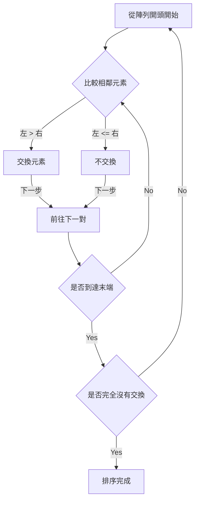
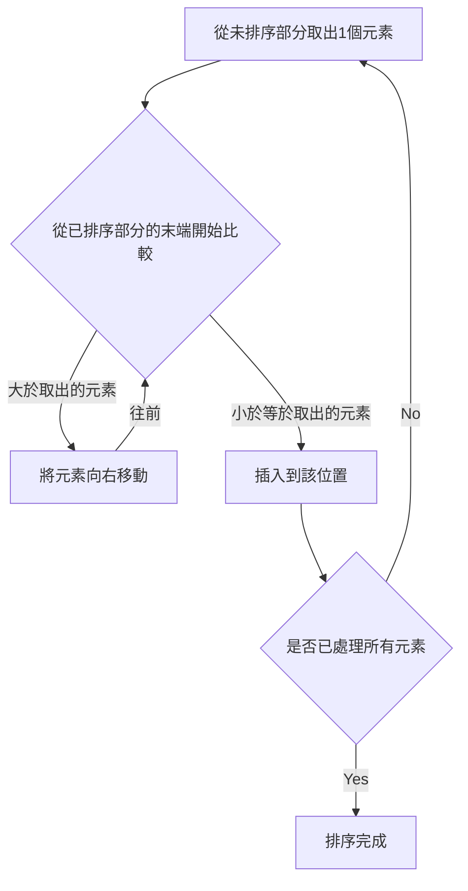
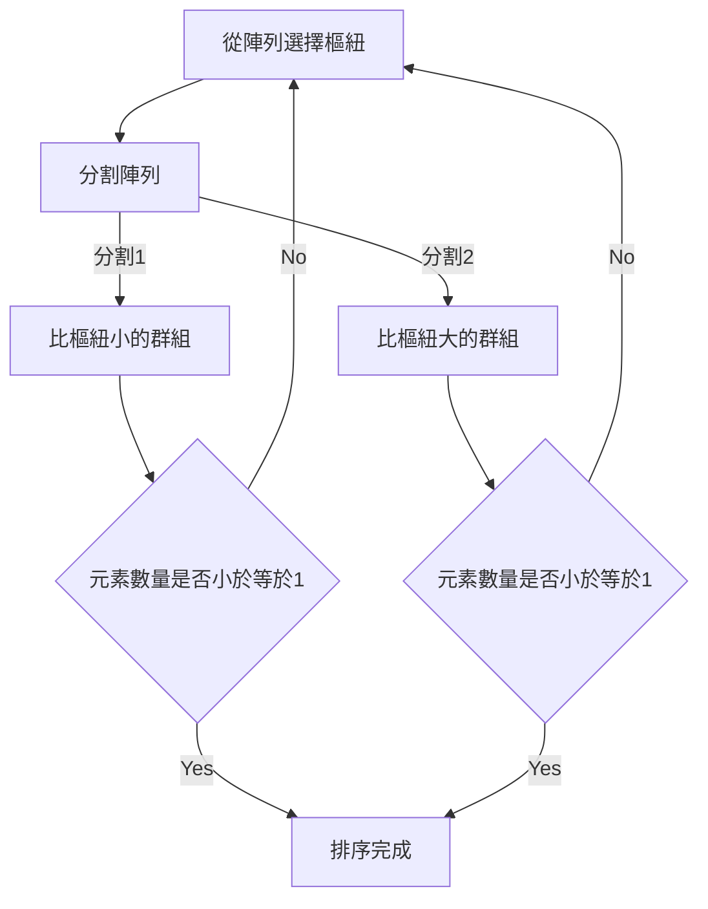
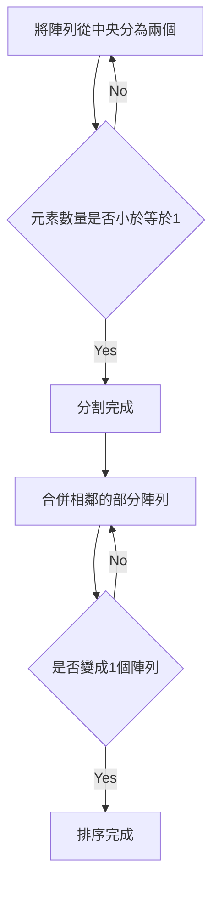

# 1. 簡介：排序演算法的深淵世界

在電腦科學中，將資料依照特定順序（遞增或遞減）重新排列的「排序」是最基本且重要的操作之一。為加速搜尋、資料分組、重複偵測等，排序演算法在各種資料處理的前置階段都扮演著重要角色。

本文將從適合初學者的簡單演算法，到實務上廣泛使用的高速演算法，全面解說具代表性的排序演算法。透過 **Mermaid** 圖解視覺化了解各演算法的機制，以 Python 程式碼確認實際實作，並比較時間複雜度等效能。此外，為了完全掌握演算法的運作，也收錄了使用 50 個元素的陣列進行的完整執行追蹤。藉此，您將能瞭若指掌地理解演算法的細部行為。

## 演算法評估指標

在評估各演算法時，以下指標非常重要。

- **時間複雜度 (Time Complexity)** : 表示處理時間隨資料元素數量 $n$ 增加而增長的情況。使用 $\text{O}(n^2)$ 或 $\text{O}(n \log n)$ 等大 O 記號（Big-O notation）。在數式中處理文字時使用如 $\text{最佳}$ 的格式。
- **空間複雜度 (Space Complexity)** : 表示執行時需要多少額外的記憶體。原地（In-place）演算法幾乎不需要額外記憶體。
- **穩定性 (Stability)** : 表示具有相同值的元素之相對順序，在排序前後是否保持不變。在穩定的排序中，會維持原有的順序。

---

## 2. 氣泡排序 (Bubble Sort)

這是一種重複比較相鄰元素，若順序相反則進行交換的演算法。如同氣泡浮出水面般，較大的元素會逐漸移動至陣列末端。

### 複雜度與特性

- **時間複雜度（最佳）**: $\text{O}(n)$
- **時間複雜度（平均）**: $\text{O}(n^2)$
- **時間複雜度（最差）**: $\text{O}(n^2)$
- **空間複雜度**: $\text{O}(1)$
- **穩定性**: 穩定

### 圖解 (Mermaid)



### Python 實作

```python
def bubble_sort(arr):
    n = len(arr)
    for i in range(n):
        swapped = False
        for j in range(0, n-i-1):
            if arr[j] > arr[j+1]:
                arr[j], arr[j+1] = arr[j+1], arr[j]
                swapped = True
        if not swapped:
            break
    return arr
```

### 氣泡排序的詳細追蹤

顯示針對具有 50 個元素的隨機陣列執行氣泡排序時，每次循環完成後的陣列狀態。請觀察氣泡排序是如何將元素推向右側的。

**初始狀態**: `[83, 14, 64, 71, 83, 11, 36, 69, 72, 45, 93, 30, 14, 76, 72, 51, 19, 41, 56, 15, 63, 27, 87, 55, 58, 63, 46, 96, 43, 68, 32, 97, 48, 94, 56, 27, 68, 40, 66, 88, 58, 15, 84, 10, 40, 27, 34, 48, 78, 56]`

**第 1 次循環完成後**: `[14, 64, 71, 83, 11, 36, 69, 72, 45, 83, 30, 14, 76, 72, 51, 19, 41, 56, 15, 63, 27, 87, 55, 58, 63, 46, 93, 43, 68, 32, 96, 48, 94, 56, 27, 68, 40, 66, 88, 58, 15, 84, 10, 40, 27, 34, 48, 78, 56, 97]`

在這個循環中，未排序部分中的最大元素像氣泡一樣浮到了最右側。根據氣泡排序的特性，每次循環至少能保證一個元素被放置在最終的正確位置。因此，隨著循環次數增加，每次探索的範圍可以縮小一個元素，從而減少不必要的比較操作。然而，在資料完全反序的最壞情況下，每對元素都需要進行交換操作，時間複雜度將達到 $\text{O}(n^2)$，效能極低。

在這個循環中，未排序部分中的最大元素像氣泡一樣浮到了最右側。根據氣泡排序的特性，每次循環至少能保證一個元素被放置在最終的正確位置。因此，隨著循環次數增加，每次探索的範圍可以縮小一個元素，從而減少不必要的比較操作。然而，在資料完全反序的最壞情況下，每對元素都需要進行交換操作，時間複雜度將達到 $\text{O}(n^2)$，效能極低。

**第 2 次循環完成後**: `[14, 64, 71, 11, 36, 69, 72, 45, 83, 30, 14, 76, 72, 51, 19, 41, 56, 15, 63, 27, 83, 55, 58, 63, 46, 87, 43, 68, 32, 93, 48, 94, 56, 27, 68, 40, 66, 88, 58, 15, 84, 10, 40, 27, 34, 48, 78, 56, 96, 97]`

在這個循環中，未排序部分中的最大元素像氣泡一樣浮到了最右側。根據氣泡排序的特性，每次循環至少能保證一個元素被放置在最終的正確位置。因此，隨著循環次數增加，每次探索的範圍可以縮小一個元素，從而減少不必要的比較操作。然而，在資料完全反序的最壞情況下，每對元素都需要進行交換操作，時間複雜度將達到 $\text{O}(n^2)$，效能極低。

在這個循環中，未排序部分中的最大元素像氣泡一樣浮到了最右側。根據氣泡排序的特性，每次循環至少能保證一個元素被放置在最終的正確位置。因此，隨著循環次數增加，每次探索的範圍可以縮小一個元素，從而減少不必要的比較操作。然而，在資料完全反序的最壞情況下，每對元素都需要進行交換操作，時間複雜度將達到 $\text{O}(n^2)$，效能極低。

**第 3 次循環完成後**: `[14, 64, 11, 36, 69, 71, 45, 72, 30, 14, 76, 72, 51, 19, 41, 56, 15, 63, 27, 83, 55, 58, 63, 46, 83, 43, 68, 32, 87, 48, 93, 56, 27, 68, 40, 66, 88, 58, 15, 84, 10, 40, 27, 34, 48, 78, 56, 94, 96, 97]`

在這個循環中，未排序部分中的最大元素像氣泡一樣浮到了最右側。根據氣泡排序的特性，每次循環至少能保證一個元素被放置在最終的正確位置。因此，隨著循環次數增加，每次探索的範圍可以縮小一個元素，從而減少不必要的比較操作。然而，在資料完全反序的最壞情況下，每對元素都需要進行交換操作，時間複雜度將達到 $\text{O}(n^2)$，效能極低。

在這個循環中，未排序部分中的最大元素像氣泡一樣浮到了最右側。根據氣泡排序的特性，每次循環至少能保證一個元素被放置在最終的正確位置。因此，隨著循環次數增加，每次探索的範圍可以縮小一個元素，從而減少不必要的比較操作。然而，在資料完全反序的最壞情況下，每對元素都需要進行交換操作，時間複雜度將達到 $\text{O}(n^2)$，效能極低。

**第 4 次循環完成後**: `[14, 11, 36, 64, 69, 45, 71, 30, 14, 72, 72, 51, 19, 41, 56, 15, 63, 27, 76, 55, 58, 63, 46, 83, 43, 68, 32, 83, 48, 87, 56, 27, 68, 40, 66, 88, 58, 15, 84, 10, 40, 27, 34, 48, 78, 56, 93, 94, 96, 97]`

在這個循環中，未排序部分中的最大元素像氣泡一樣浮到了最右側。根據氣泡排序的特性，每次循環至少能保證一個元素被放置在最終的正確位置。因此，隨著循環次數增加，每次探索的範圍可以縮小一個元素，從而減少不必要的比較操作。然而，在資料完全反序的最壞情況下，每對元素都需要進行交換操作，時間複雜度將達到 $\text{O}(n^2)$，效能極低。

在這個循環中，未排序部分中的最大元素像氣泡一樣浮到了最右側。根據氣泡排序的特性，每次循環至少能保證一個元素被放置在最終的正確位置。因此，隨著循環次數增加，每次探索的範圍可以縮小一個元素，從而減少不必要的比較操作。然而，在資料完全反序的最壞情況下，每對元素都需要進行交換操作，時間複雜度將達到 $\text{O}(n^2)$，效能極低。

**第 5 次循環完成後**: `[11, 14, 36, 64, 45, 69, 30, 14, 71, 72, 51, 19, 41, 56, 15, 63, 27, 72, 55, 58, 63, 46, 76, 43, 68, 32, 83, 48, 83, 56, 27, 68, 40, 66, 87, 58, 15, 84, 10, 40, 27, 34, 48, 78, 56, 88, 93, 94, 96, 97]`

在這個循環中，未排序部分中的最大元素像氣泡一樣浮到了最右側。根據氣泡排序的特性，每次循環至少能保證一個元素被放置在最終的正確位置。因此，隨著循環次數增加，每次探索的範圍可以縮小一個元素，從而減少不必要的比較操作。然而，在資料完全反序的最壞情況下，每對元素都需要進行交換操作，時間複雜度將達到 $\text{O}(n^2)$，效能極低。

在這個循環中，未排序部分中的最大元素像氣泡一樣浮到了最右側。根據氣泡排序的特性，每次循環至少能保證一個元素被放置在最終的正確位置。因此，隨著循環次數增加，每次探索的範圍可以縮小一個元素，從而減少不必要的比較操作。然而，在資料完全反序的最壞情況下，每對元素都需要進行交換操作，時間複雜度將達到 $\text{O}(n^2)$，效能極低。

**第 6 次循環完成後**: `[11, 14, 36, 45, 64, 30, 14, 69, 71, 51, 19, 41, 56, 15, 63, 27, 72, 55, 58, 63, 46, 72, 43, 68, 32, 76, 48, 83, 56, 27, 68, 40, 66, 83, 58, 15, 84, 10, 40, 27, 34, 48, 78, 56, 87, 88, 93, 94, 96, 97]`

在這個循環中，未排序部分中的最大元素像氣泡一樣浮到了最右側。根據氣泡排序的特性，每次循環至少能保證一個元素被放置在最終的正確位置。因此，隨著循環次數增加，每次探索的範圍可以縮小一個元素，從而減少不必要的比較操作。然而，在資料完全反序的最壞情況下，每對元素都需要進行交換操作，時間複雜度將達到 $\text{O}(n^2)$，效能極低。

在這個循環中，未排序部分中的最大元素像氣泡一樣浮到了最右側。根據氣泡排序的特性，每次循環至少能保證一個元素被放置在最終的正確位置。因此，隨著循環次數增加，每次探索的範圍可以縮小一個元素，從而減少不必要的比較操作。然而，在資料完全反序的最壞情況下，每對元素都需要進行交換操作，時間複雜度將達到 $\text{O}(n^2)$，效能極低。

**第 7 次循環完成後**: `[11, 14, 36, 45, 30, 14, 64, 69, 51, 19, 41, 56, 15, 63, 27, 71, 55, 58, 63, 46, 72, 43, 68, 32, 72, 48, 76, 56, 27, 68, 40, 66, 83, 58, 15, 83, 10, 40, 27, 34, 48, 78, 56, 84, 87, 88, 93, 94, 96, 97]`

在這個循環中，未排序部分中的最大元素像氣泡一樣浮到了最右側。根據氣泡排序的特性，每次循環至少能保證一個元素被放置在最終的正確位置。因此，隨著循環次數增加，每次探索的範圍可以縮小一個元素，從而減少不必要的比較操作。然而，在資料完全反序的最壞情況下，每對元素都需要進行交換操作，時間複雜度將達到 $\text{O}(n^2)$，效能極低。

在這個循環中，未排序部分中的最大元素像氣泡一樣浮到了最右側。根據氣泡排序的特性，每次循環至少能保證一個元素被放置在最終的正確位置。因此，隨著循環次數增加，每次探索的範圍可以縮小一個元素，從而減少不必要的比較操作。然而，在資料完全反序的最壞情況下，每對元素都需要進行交換操作，時間複雜度將達到 $\text{O}(n^2)$，效能極低。

**第 8 次循環完成後**: `[11, 14, 36, 30, 14, 45, 64, 51, 19, 41, 56, 15, 63, 27, 69, 55, 58, 63, 46, 71, 43, 68, 32, 72, 48, 72, 56, 27, 68, 40, 66, 76, 58, 15, 83, 10, 40, 27, 34, 48, 78, 56, 83, 84, 87, 88, 93, 94, 96, 97]`

在這個循環中，未排序部分中的最大元素像氣泡一樣浮到了最右側。根據氣泡排序的特性，每次循環至少能保證一個元素被放置在最終的正確位置。因此，隨著循環次數增加，每次探索的範圍可以縮小一個元素，從而減少不必要的比較操作。然而，在資料完全反序的最壞情況下，每對元素都需要進行交換操作，時間複雜度將達到 $\text{O}(n^2)$，效能極低。

在這個循環中，未排序部分中的最大元素像氣泡一樣浮到了最右側。根據氣泡排序的特性，每次循環至少能保證一個元素被放置在最終的正確位置。因此，隨著循環次數增加，每次探索的範圍可以縮小一個元素，從而減少不必要的比較操作。然而，在資料完全反序的最壞情況下，每對元素都需要進行交換操作，時間複雜度將達到 $\text{O}(n^2)$，效能極低。

**第 9 次循環完成後**: `[11, 14, 30, 14, 36, 45, 51, 19, 41, 56, 15, 63, 27, 64, 55, 58, 63, 46, 69, 43, 68, 32, 71, 48, 72, 56, 27, 68, 40, 66, 72, 58, 15, 76, 10, 40, 27, 34, 48, 78, 56, 83, 83, 84, 87, 88, 93, 94, 96, 97]`

在這個循環中，未排序部分中的最大元素像氣泡一樣浮到了最右側。根據氣泡排序的特性，每次循環至少能保證一個元素被放置在最終的正確位置。因此，隨著循環次數增加，每次探索的範圍可以縮小一個元素，從而減少不必要的比較操作。然而，在資料完全反序的最壞情況下，每對元素都需要進行交換操作，時間複雜度將達到 $\text{O}(n^2)$，效能極低。

在這個循環中，未排序部分中的最大元素像氣泡一樣浮到了最右側。根據氣泡排序的特性，每次循環至少能保證一個元素被放置在最終的正確位置。因此，隨著循環次數增加，每次探索的範圍可以縮小一個元素，從而減少不必要的比較操作。然而，在資料完全反序的最壞情況下，每對元素都需要進行交換操作，時間複雜度將達到 $\text{O}(n^2)$，效能極低。

**第 10 次循環完成後**: `[11, 14, 14, 30, 36, 45, 19, 41, 51, 15, 56, 27, 63, 55, 58, 63, 46, 64, 43, 68, 32, 69, 48, 71, 56, 27, 68, 40, 66, 72, 58, 15, 72, 10, 40, 27, 34, 48, 76, 56, 78, 83, 83, 84, 87, 88, 93, 94, 96, 97]`

在這個循環中，未排序部分中的最大元素像氣泡一樣浮到了最右側。根據氣泡排序的特性，每次循環至少能保證一個元素被放置在最終的正確位置。因此，隨著循環次數增加，每次探索的範圍可以縮小一個元素，從而減少不必要的比較操作。然而，在資料完全反序的最壞情況下，每對元素都需要進行交換操作，時間複雜度將達到 $\text{O}(n^2)$，效能極低。

在這個循環中，未排序部分中的最大元素像氣泡一樣浮到了最右側。根據氣泡排序的特性，每次循環至少能保證一個元素被放置在最終的正確位置。因此，隨著循環次數增加，每次探索的範圍可以縮小一個元素，從而減少不必要的比較操作。然而，在資料完全反序的最壞情況下，每對元素都需要進行交換操作，時間複雜度將達到 $\text{O}(n^2)$，效能極低。

**第 11 次循環完成後**: `[11, 14, 14, 30, 36, 19, 41, 45, 15, 51, 27, 56, 55, 58, 63, 46, 63, 43, 64, 32, 68, 48, 69, 56, 27, 68, 40, 66, 71, 58, 15, 72, 10, 40, 27, 34, 48, 72, 56, 76, 78, 83, 83, 84, 87, 88, 93, 94, 96, 97]`

在這個循環中，未排序部分中的最大元素像氣泡一樣浮到了最右側。根據氣泡排序的特性，每次循環至少能保證一個元素被放置在最終的正確位置。因此，隨著循環次數增加，每次探索的範圍可以縮小一個元素，從而減少不必要的比較操作。然而，在資料完全反序的最壞情況下，每對元素都需要進行交換操作，時間複雜度將達到 $\text{O}(n^2)$，效能極低。

在這個循環中，未排序部分中的最大元素像氣泡一樣浮到了最右側。根據氣泡排序的特性，每次循環至少能保證一個元素被放置在最終的正確位置。因此，隨著循環次數增加，每次探索的範圍可以縮小一個元素，從而減少不必要的比較操作。然而，在資料完全反序的最壞情況下，每對元素都需要進行交換操作，時間複雜度將達到 $\text{O}(n^2)$，效能極低。

**第 12 次循環完成後**: `[11, 14, 14, 30, 19, 36, 41, 15, 45, 27, 51, 55, 56, 58, 46, 63, 43, 63, 32, 64, 48, 68, 56, 27, 68, 40, 66, 69, 58, 15, 71, 10, 40, 27, 34, 48, 72, 56, 72, 76, 78, 83, 83, 84, 87, 88, 93, 94, 96, 97]`

在這個循環中，未排序部分中的最大元素像氣泡一樣浮到了最右側。根據氣泡排序的特性，每次循環至少能保證一個元素被放置在最終的正確位置。因此，隨著循環次數增加，每次探索的範圍可以縮小一個元素，從而減少不必要的比較操作。然而，在資料完全反序的最壞情況下，每對元素都需要進行交換操作，時間複雜度將達到 $\text{O}(n^2)$，效能極低。

在這個循環中，未排序部分中的最大元素像氣泡一樣浮到了最右側。根據氣泡排序的特性，每次循環至少能保證一個元素被放置在最終的正確位置。因此，隨著循環次數增加，每次探索的範圍可以縮小一個元素，從而減少不必要的比較操作。然而，在資料完全反序的最壞情況下，每對元素都需要進行交換操作，時間複雜度將達到 $\text{O}(n^2)$，效能極低。

**第 13 次循環完成後**: `[11, 14, 14, 19, 30, 36, 15, 41, 27, 45, 51, 55, 56, 46, 58, 43, 63, 32, 63, 48, 64, 56, 27, 68, 40, 66, 68, 58, 15, 69, 10, 40, 27, 34, 48, 71, 56, 72, 72, 76, 78, 83, 83, 84, 87, 88, 93, 94, 96, 97]`

在這個循環中，未排序部分中的最大元素像氣泡一樣浮到了最右側。根據氣泡排序的特性，每次循環至少能保證一個元素被放置在最終的正確位置。因此，隨著循環次數增加，每次探索的範圍可以縮小一個元素，從而減少不必要的比較操作。然而，在資料完全反序的最壞情況下，每對元素都需要進行交換操作，時間複雜度將達到 $\text{O}(n^2)$，效能極低。

在這個循環中，未排序部分中的最大元素像氣泡一樣浮到了最右側。根據氣泡排序的特性，每次循環至少能保證一個元素被放置在最終的正確位置。因此，隨著循環次數增加，每次探索的範圍可以縮小一個元素，從而減少不必要的比較操作。然而，在資料完全反序的最壞情況下，每對元素都需要進行交換操作，時間複雜度將達到 $\text{O}(n^2)$，效能極低。

**第 14 次循環完成後**: `[11, 14, 14, 19, 30, 15, 36, 27, 41, 45, 51, 55, 46, 56, 43, 58, 32, 63, 48, 63, 56, 27, 64, 40, 66, 68, 58, 15, 68, 10, 40, 27, 34, 48, 69, 56, 71, 72, 72, 76, 78, 83, 83, 84, 87, 88, 93, 94, 96, 97]`

在這個循環中，未排序部分中的最大元素像氣泡一樣浮到了最右側。根據氣泡排序的特性，每次循環至少能保證一個元素被放置在最終的正確位置。因此，隨著循環次數增加，每次探索的範圍可以縮小一個元素，從而減少不必要的比較操作。然而，在資料完全反序的最壞情況下，每對元素都需要進行交換操作，時間複雜度將達到 $\text{O}(n^2)$，效能極低。

在這個循環中，未排序部分中的最大元素像氣泡一樣浮到了最右側。根據氣泡排序的特性，每次循環至少能保證一個元素被放置在最終的正確位置。因此，隨著循環次數增加，每次探索的範圍可以縮小一個元素，從而減少不必要的比較操作。然而，在資料完全反序的最壞情況下，每對元素都需要進行交換操作，時間複雜度將達到 $\text{O}(n^2)$，效能極低。

**第 15 次循環完成後**: `[11, 14, 14, 19, 15, 30, 27, 36, 41, 45, 51, 46, 55, 43, 56, 32, 58, 48, 63, 56, 27, 63, 40, 64, 66, 58, 15, 68, 10, 40, 27, 34, 48, 68, 56, 69, 71, 72, 72, 76, 78, 83, 83, 84, 87, 88, 93, 94, 96, 97]`

在這個循環中，未排序部分中的最大元素像氣泡一樣浮到了最右側。根據氣泡排序的特性，每次循環至少能保證一個元素被放置在最終的正確位置。因此，隨著循環次數增加，每次探索的範圍可以縮小一個元素，從而減少不必要的比較操作。然而，在資料完全反序的最壞情況下，每對元素都需要進行交換操作，時間複雜度將達到 $\text{O}(n^2)$，效能極低。

在這個循環中，未排序部分中的最大元素像氣泡一樣浮到了最右側。根據氣泡排序的特性，每次循環至少能保證一個元素被放置在最終的正確位置。因此，隨著循環次數增加，每次探索的範圍可以縮小一個元素，從而減少不必要的比較操作。然而，在資料完全反序的最壞情況下，每對元素都需要進行交換操作，時間複雜度將達到 $\text{O}(n^2)$，效能極低。

**第 16 次循環完成後**: `[11, 14, 14, 15, 19, 27, 30, 36, 41, 45, 46, 51, 43, 55, 32, 56, 48, 58, 56, 27, 63, 40, 63, 64, 58, 15, 66, 10, 40, 27, 34, 48, 68, 56, 68, 69, 71, 72, 72, 76, 78, 83, 83, 84, 87, 88, 93, 94, 96, 97]`

在這個循環中，未排序部分中的最大元素像氣泡一樣浮到了最右側。根據氣泡排序的特性，每次循環至少能保證一個元素被放置在最終的正確位置。因此，隨著循環次數增加，每次探索的範圍可以縮小一個元素，從而減少不必要的比較操作。然而，在資料完全反序的最壞情況下，每對元素都需要進行交換操作，時間複雜度將達到 $\text{O}(n^2)$，效能極低。

在這個循環中，未排序部分中的最大元素像氣泡一樣浮到了最右側。根據氣泡排序的特性，每次循環至少能保證一個元素被放置在最終的正確位置。因此，隨著循環次數增加，每次探索的範圍可以縮小一個元素，從而減少不必要的比較操作。然而，在資料完全反序的最壞情況下，每對元素都需要進行交換操作，時間複雜度將達到 $\text{O}(n^2)$，效能極低。

**第 17 次循環完成後**: `[11, 14, 14, 15, 19, 27, 30, 36, 41, 45, 46, 43, 51, 32, 55, 48, 56, 56, 27, 58, 40, 63, 63, 58, 15, 64, 10, 40, 27, 34, 48, 66, 56, 68, 68, 69, 71, 72, 72, 76, 78, 83, 83, 84, 87, 88, 93, 94, 96, 97]`

在這個循環中，未排序部分中的最大元素像氣泡一樣浮到了最右側。根據氣泡排序的特性，每次循環至少能保證一個元素被放置在最終的正確位置。因此，隨著循環次數增加，每次探索的範圍可以縮小一個元素，從而減少不必要的比較操作。然而，在資料完全反序的最壞情況下，每對元素都需要進行交換操作，時間複雜度將達到 $\text{O}(n^2)$，效能極低。

在這個循環中，未排序部分中的最大元素像氣泡一樣浮到了最右側。根據氣泡排序的特性，每次循環至少能保證一個元素被放置在最終的正確位置。因此，隨著循環次數增加，每次探索的範圍可以縮小一個元素，從而減少不必要的比較操作。然而，在資料完全反序的最壞情況下，每對元素都需要進行交換操作，時間複雜度將達到 $\text{O}(n^2)$，效能極低。

**第 18 次循環完成後**: `[11, 14, 14, 15, 19, 27, 30, 36, 41, 45, 43, 46, 32, 51, 48, 55, 56, 27, 56, 40, 58, 63, 58, 15, 63, 10, 40, 27, 34, 48, 64, 56, 66, 68, 68, 69, 71, 72, 72, 76, 78, 83, 83, 84, 87, 88, 93, 94, 96, 97]`

在這個循環中，未排序部分中的最大元素像氣泡一樣浮到了最右側。根據氣泡排序的特性，每次循環至少能保證一個元素被放置在最終的正確位置。因此，隨著循環次數增加，每次探索的範圍可以縮小一個元素，從而減少不必要的比較操作。然而，在資料完全反序的最壞情況下，每對元素都需要進行交換操作，時間複雜度將達到 $\text{O}(n^2)$，效能極低。

在這個循環中，未排序部分中的最大元素像氣泡一樣浮到了最右側。根據氣泡排序的特性，每次循環至少能保證一個元素被放置在最終的正確位置。因此，隨著循環次數增加，每次探索的範圍可以縮小一個元素，從而減少不必要的比較操作。然而，在資料完全反序的最壞情況下，每對元素都需要進行交換操作，時間複雜度將達到 $\text{O}(n^2)$，效能極低。

**第 19 次循環完成後**: `[11, 14, 14, 15, 19, 27, 30, 36, 41, 43, 45, 32, 46, 48, 51, 55, 27, 56, 40, 56, 58, 58, 15, 63, 10, 40, 27, 34, 48, 63, 56, 64, 66, 68, 68, 69, 71, 72, 72, 76, 78, 83, 83, 84, 87, 88, 93, 94, 96, 97]`

在這個循環中，未排序部分中的最大元素像氣泡一樣浮到了最右側。根據氣泡排序的特性，每次循環至少能保證一個元素被放置在最終的正確位置。因此，隨著循環次數增加，每次探索的範圍可以縮小一個元素，從而減少不必要的比較操作。然而，在資料完全反序的最壞情況下，每對元素都需要進行交換操作，時間複雜度將達到 $\text{O}(n^2)$，效能極低。

在這個循環中，未排序部分中的最大元素像氣泡一樣浮到了最右側。根據氣泡排序的特性，每次循環至少能保證一個元素被放置在最終的正確位置。因此，隨著循環次數增加，每次探索的範圍可以縮小一個元素，從而減少不必要的比較操作。然而，在資料完全反序的最壞情況下，每對元素都需要進行交換操作，時間複雜度將達到 $\text{O}(n^2)$，效能極低。

**第 20 次循環完成後**: `[11, 14, 14, 15, 19, 27, 30, 36, 41, 43, 32, 45, 46, 48, 51, 27, 55, 40, 56, 56, 58, 15, 58, 10, 40, 27, 34, 48, 63, 56, 63, 64, 66, 68, 68, 69, 71, 72, 72, 76, 78, 83, 83, 84, 87, 88, 93, 94, 96, 97]`

在這個循環中，未排序部分中的最大元素像氣泡一樣浮到了最右側。根據氣泡排序的特性，每次循環至少能保證一個元素被放置在最終的正確位置。因此，隨著循環次數增加，每次探索的範圍可以縮小一個元素，從而減少不必要的比較操作。然而，在資料完全反序的最壞情況下，每對元素都需要進行交換操作，時間複雜度將達到 $\text{O}(n^2)$，效能極低。

在這個循環中，未排序部分中的最大元素像氣泡一樣浮到了最右側。根據氣泡排序的特性，每次循環至少能保證一個元素被放置在最終的正確位置。因此，隨著循環次數增加，每次探索的範圍可以縮小一個元素，從而減少不必要的比較操作。然而，在資料完全反序的最壞情況下，每對元素都需要進行交換操作，時間複雜度將達到 $\text{O}(n^2)$，效能極低。

**第 21 次循環完成後**: `[11, 14, 14, 15, 19, 27, 30, 36, 41, 32, 43, 45, 46, 48, 27, 51, 40, 55, 56, 56, 15, 58, 10, 40, 27, 34, 48, 58, 56, 63, 63, 64, 66, 68, 68, 69, 71, 72, 72, 76, 78, 83, 83, 84, 87, 88, 93, 94, 96, 97]`

在這個循環中，未排序部分中的最大元素像氣泡一樣浮到了最右側。根據氣泡排序的特性，每次循環至少能保證一個元素被放置在最終的正確位置。因此，隨著循環次數增加，每次探索的範圍可以縮小一個元素，從而減少不必要的比較操作。然而，在資料完全反序的最壞情況下，每對元素都需要進行交換操作，時間複雜度將達到 $\text{O}(n^2)$，效能極低。

在這個循環中，未排序部分中的最大元素像氣泡一樣浮到了最右側。根據氣泡排序的特性，每次循環至少能保證一個元素被放置在最終的正確位置。因此，隨著循環次數增加，每次探索的範圍可以縮小一個元素，從而減少不必要的比較操作。然而，在資料完全反序的最壞情況下，每對元素都需要進行交換操作，時間複雜度將達到 $\text{O}(n^2)$，效能極低。

**第 22 次循環完成後**: `[11, 14, 14, 15, 19, 27, 30, 36, 32, 41, 43, 45, 46, 27, 48, 40, 51, 55, 56, 15, 56, 10, 40, 27, 34, 48, 58, 56, 58, 63, 63, 64, 66, 68, 68, 69, 71, 72, 72, 76, 78, 83, 83, 84, 87, 88, 93, 94, 96, 97]`

在這個循環中，未排序部分中的最大元素像氣泡一樣浮到了最右側。根據氣泡排序的特性，每次循環至少能保證一個元素被放置在最終的正確位置。因此，隨著循環次數增加，每次探索的範圍可以縮小一個元素，從而減少不必要的比較操作。然而，在資料完全反序的最壞情況下，每對元素都需要進行交換操作，時間複雜度將達到 $\text{O}(n^2)$，效能極低。

在這個循環中，未排序部分中的最大元素像氣泡一樣浮到了最右側。根據氣泡排序的特性，每次循環至少能保證一個元素被放置在最終的正確位置。因此，隨著循環次數增加，每次探索的範圍可以縮小一個元素，從而減少不必要的比較操作。然而，在資料完全反序的最壞情況下，每對元素都需要進行交換操作，時間複雜度將達到 $\text{O}(n^2)$，效能極低。

**第 23 次循環完成後**: `[11, 14, 14, 15, 19, 27, 30, 32, 36, 41, 43, 45, 27, 46, 40, 48, 51, 55, 15, 56, 10, 40, 27, 34, 48, 56, 56, 58, 58, 63, 63, 64, 66, 68, 68, 69, 71, 72, 72, 76, 78, 83, 83, 84, 87, 88, 93, 94, 96, 97]`

在這個循環中，未排序部分中的最大元素像氣泡一樣浮到了最右側。根據氣泡排序的特性，每次循環至少能保證一個元素被放置在最終的正確位置。因此，隨著循環次數增加，每次探索的範圍可以縮小一個元素，從而減少不必要的比較操作。然而，在資料完全反序的最壞情況下，每對元素都需要進行交換操作，時間複雜度將達到 $\text{O}(n^2)$，效能極低。

在這個循環中，未排序部分中的最大元素像氣泡一樣浮到了最右側。根據氣泡排序的特性，每次循環至少能保證一個元素被放置在最終的正確位置。因此，隨著循環次數增加，每次探索的範圍可以縮小一個元素，從而減少不必要的比較操作。然而，在資料完全反序的最壞情況下，每對元素都需要進行交換操作，時間複雜度將達到 $\text{O}(n^2)$，效能極低。

**第 24 次循環完成後**: `[11, 14, 14, 15, 19, 27, 30, 32, 36, 41, 43, 27, 45, 40, 46, 48, 51, 15, 55, 10, 40, 27, 34, 48, 56, 56, 56, 58, 58, 63, 63, 64, 66, 68, 68, 69, 71, 72, 72, 76, 78, 83, 83, 84, 87, 88, 93, 94, 96, 97]`

在這個循環中，未排序部分中的最大元素像氣泡一樣浮到了最右側。根據氣泡排序的特性，每次循環至少能保證一個元素被放置在最終的正確位置。因此，隨著循環次數增加，每次探索的範圍可以縮小一個元素，從而減少不必要的比較操作。然而，在資料完全反序的最壞情況下，每對元素都需要進行交換操作，時間複雜度將達到 $\text{O}(n^2)$，效能極低。

在這個循環中，未排序部分中的最大元素像氣泡一樣浮到了最右側。根據氣泡排序的特性，每次循環至少能保證一個元素被放置在最終的正確位置。因此，隨著循環次數增加，每次探索的範圍可以縮小一個元素，從而減少不必要的比較操作。然而，在資料完全反序的最壞情況下，每對元素都需要進行交換操作，時間複雜度將達到 $\text{O}(n^2)$，效能極低。

**第 25 次循環完成後**: `[11, 14, 14, 15, 19, 27, 30, 32, 36, 41, 27, 43, 40, 45, 46, 48, 15, 51, 10, 40, 27, 34, 48, 55, 56, 56, 56, 58, 58, 63, 63, 64, 66, 68, 68, 69, 71, 72, 72, 76, 78, 83, 83, 84, 87, 88, 93, 94, 96, 97]`

在這個循環中，未排序部分中的最大元素像氣泡一樣浮到了最右側。根據氣泡排序的特性，每次循環至少能保證一個元素被放置在最終的正確位置。因此，隨著循環次數增加，每次探索的範圍可以縮小一個元素，從而減少不必要的比較操作。然而，在資料完全反序的最壞情況下，每對元素都需要進行交換操作，時間複雜度將達到 $\text{O}(n^2)$，效能極低。

在這個循環中，未排序部分中的最大元素像氣泡一樣浮到了最右側。根據氣泡排序的特性，每次循環至少能保證一個元素被放置在最終的正確位置。因此，隨著循環次數增加，每次探索的範圍可以縮小一個元素，從而減少不必要的比較操作。然而，在資料完全反序的最壞情況下，每對元素都需要進行交換操作，時間複雜度將達到 $\text{O}(n^2)$，效能極低。

**第 26 次循環完成後**: `[11, 14, 14, 15, 19, 27, 30, 32, 36, 27, 41, 40, 43, 45, 46, 15, 48, 10, 40, 27, 34, 48, 51, 55, 56, 56, 56, 58, 58, 63, 63, 64, 66, 68, 68, 69, 71, 72, 72, 76, 78, 83, 83, 84, 87, 88, 93, 94, 96, 97]`

在這個循環中，未排序部分中的最大元素像氣泡一樣浮到了最右側。根據氣泡排序的特性，每次循環至少能保證一個元素被放置在最終的正確位置。因此，隨著循環次數增加，每次探索的範圍可以縮小一個元素，從而減少不必要的比較操作。然而，在資料完全反序的最壞情況下，每對元素都需要進行交換操作，時間複雜度將達到 $\text{O}(n^2)$，效能極低。

在這個循環中，未排序部分中的最大元素像氣泡一樣浮到了最右側。根據氣泡排序的特性，每次循環至少能保證一個元素被放置在最終的正確位置。因此，隨著循環次數增加，每次探索的範圍可以縮小一個元素，從而減少不必要的比較操作。然而，在資料完全反序的最壞情況下，每對元素都需要進行交換操作，時間複雜度將達到 $\text{O}(n^2)$，效能極低。

**第 27 次循環完成後**: `[11, 14, 14, 15, 19, 27, 30, 32, 27, 36, 40, 41, 43, 45, 15, 46, 10, 40, 27, 34, 48, 48, 51, 55, 56, 56, 56, 58, 58, 63, 63, 64, 66, 68, 68, 69, 71, 72, 72, 76, 78, 83, 83, 84, 87, 88, 93, 94, 96, 97]`

在這個循環中，未排序部分中的最大元素像氣泡一樣浮到了最右側。根據氣泡排序的特性，每次循環至少能保證一個元素被放置在最終的正確位置。因此，隨著循環次數增加，每次探索的範圍可以縮小一個元素，從而減少不必要的比較操作。然而，在資料完全反序的最壞情況下，每對元素都需要進行交換操作，時間複雜度將達到 $\text{O}(n^2)$，效能極低。

在這個循環中，未排序部分中的最大元素像氣泡一樣浮到了最右側。根據氣泡排序的特性，每次循環至少能保證一個元素被放置在最終的正確位置。因此，隨著循環次數增加，每次探索的範圍可以縮小一個元素，從而減少不必要的比較操作。然而，在資料完全反序的最壞情況下，每對元素都需要進行交換操作，時間複雜度將達到 $\text{O}(n^2)$，效能極低。

**第 28 次循環完成後**: `[11, 14, 14, 15, 19, 27, 30, 27, 32, 36, 40, 41, 43, 15, 45, 10, 40, 27, 34, 46, 48, 48, 51, 55, 56, 56, 56, 58, 58, 63, 63, 64, 66, 68, 68, 69, 71, 72, 72, 76, 78, 83, 83, 84, 87, 88, 93, 94, 96, 97]`

在這個循環中，未排序部分中的最大元素像氣泡一樣浮到了最右側。根據氣泡排序的特性，每次循環至少能保證一個元素被放置在最終的正確位置。因此，隨著循環次數增加，每次探索的範圍可以縮小一個元素，從而減少不必要的比較操作。然而，在資料完全反序的最壞情況下，每對元素都需要進行交換操作，時間複雜度將達到 $\text{O}(n^2)$，效能極低。

在這個循環中，未排序部分中的最大元素像氣泡一樣浮到了最右側。根據氣泡排序的特性，每次循環至少能保證一個元素被放置在最終的正確位置。因此，隨著循環次數增加，每次探索的範圍可以縮小一個元素，從而減少不必要的比較操作。然而，在資料完全反序的最壞情況下，每對元素都需要進行交換操作，時間複雜度將達到 $\text{O}(n^2)$，效能極低。

**第 29 次循環完成後**: `[11, 14, 14, 15, 19, 27, 27, 30, 32, 36, 40, 41, 15, 43, 10, 40, 27, 34, 45, 46, 48, 48, 51, 55, 56, 56, 56, 58, 58, 63, 63, 64, 66, 68, 68, 69, 71, 72, 72, 76, 78, 83, 83, 84, 87, 88, 93, 94, 96, 97]`

在這個循環中，未排序部分中的最大元素像氣泡一樣浮到了最右側。根據氣泡排序的特性，每次循環至少能保證一個元素被放置在最終的正確位置。因此，隨著循環次數增加，每次探索的範圍可以縮小一個元素，從而減少不必要的比較操作。然而，在資料完全反序的最壞情況下，每對元素都需要進行交換操作，時間複雜度將達到 $\text{O}(n^2)$，效能極低。

在這個循環中，未排序部分中的最大元素像氣泡一樣浮到了最右側。根據氣泡排序的特性，每次循環至少能保證一個元素被放置在最終的正確位置。因此，隨著循環次數增加，每次探索的範圍可以縮小一個元素，從而減少不必要的比較操作。然而，在資料完全反序的最壞情況下，每對元素都需要進行交換操作，時間複雜度將達到 $\text{O}(n^2)$，效能極低。

**第 30 次循環完成後**: `[11, 14, 14, 15, 19, 27, 27, 30, 32, 36, 40, 15, 41, 10, 40, 27, 34, 43, 45, 46, 48, 48, 51, 55, 56, 56, 56, 58, 58, 63, 63, 64, 66, 68, 68, 69, 71, 72, 72, 76, 78, 83, 83, 84, 87, 88, 93, 94, 96, 97]`

在這個循環中，未排序部分中的最大元素像氣泡一樣浮到了最右側。根據氣泡排序的特性，每次循環至少能保證一個元素被放置在最終的正確位置。因此，隨著循環次數增加，每次探索的範圍可以縮小一個元素，從而減少不必要的比較操作。然而，在資料完全反序的最壞情況下，每對元素都需要進行交換操作，時間複雜度將達到 $\text{O}(n^2)$，效能極低。

在這個循環中，未排序部分中的最大元素像氣泡一樣浮到了最右側。根據氣泡排序的特性，每次循環至少能保證一個元素被放置在最終的正確位置。因此，隨著循環次數增加，每次探索的範圍可以縮小一個元素，從而減少不必要的比較操作。然而，在資料完全反序的最壞情況下，每對元素都需要進行交換操作，時間複雜度將達到 $\text{O}(n^2)$，效能極低。

**第 31 次循環完成後**: `[11, 14, 14, 15, 19, 27, 27, 30, 32, 36, 15, 40, 10, 40, 27, 34, 41, 43, 45, 46, 48, 48, 51, 55, 56, 56, 56, 58, 58, 63, 63, 64, 66, 68, 68, 69, 71, 72, 72, 76, 78, 83, 83, 84, 87, 88, 93, 94, 96, 97]`

在這個循環中，未排序部分中的最大元素像氣泡一樣浮到了最右側。根據氣泡排序的特性，每次循環至少能保證一個元素被放置在最終的正確位置。因此，隨著循環次數增加，每次探索的範圍可以縮小一個元素，從而減少不必要的比較操作。然而，在資料完全反序的最壞情況下，每對元素都需要進行交換操作，時間複雜度將達到 $\text{O}(n^2)$，效能極低。

在這個循環中，未排序部分中的最大元素像氣泡一樣浮到了最右側。根據氣泡排序的特性，每次循環至少能保證一個元素被放置在最終的正確位置。因此，隨著循環次數增加，每次探索的範圍可以縮小一個元素，從而減少不必要的比較操作。然而，在資料完全反序的最壞情況下，每對元素都需要進行交換操作，時間複雜度將達到 $\text{O}(n^2)$，效能極低。

**第 32 次循環完成後**: `[11, 14, 14, 15, 19, 27, 27, 30, 32, 15, 36, 10, 40, 27, 34, 40, 41, 43, 45, 46, 48, 48, 51, 55, 56, 56, 56, 58, 58, 63, 63, 64, 66, 68, 68, 69, 71, 72, 72, 76, 78, 83, 83, 84, 87, 88, 93, 94, 96, 97]`

在這個循環中，未排序部分中的最大元素像氣泡一樣浮到了最右側。根據氣泡排序的特性，每次循環至少能保證一個元素被放置在最終的正確位置。因此，隨著循環次數增加，每次探索的範圍可以縮小一個元素，從而減少不必要的比較操作。然而，在資料完全反序的最壞情況下，每對元素都需要進行交換操作，時間複雜度將達到 $\text{O}(n^2)$，效能極低。

在這個循環中，未排序部分中的最大元素像氣泡一樣浮到了最右側。根據氣泡排序的特性，每次循環至少能保證一個元素被放置在最終的正確位置。因此，隨著循環次數增加，每次探索的範圍可以縮小一個元素，從而減少不必要的比較操作。然而，在資料完全反序的最壞情況下，每對元素都需要進行交換操作，時間複雜度將達到 $\text{O}(n^2)$，效能極低。

**第 33 次循環完成後**: `[11, 14, 14, 15, 19, 27, 27, 30, 15, 32, 10, 36, 27, 34, 40, 40, 41, 43, 45, 46, 48, 48, 51, 55, 56, 56, 56, 58, 58, 63, 63, 64, 66, 68, 68, 69, 71, 72, 72, 76, 78, 83, 83, 84, 87, 88, 93, 94, 96, 97]`

在這個循環中，未排序部分中的最大元素像氣泡一樣浮到了最右側。根據氣泡排序的特性，每次循環至少能保證一個元素被放置在最終的正確位置。因此，隨著循環次數增加，每次探索的範圍可以縮小一個元素，從而減少不必要的比較操作。然而，在資料完全反序的最壞情況下，每對元素都需要進行交換操作，時間複雜度將達到 $\text{O}(n^2)$，效能極低。

在這個循環中，未排序部分中的最大元素像氣泡一樣浮到了最右側。根據氣泡排序的特性，每次循環至少能保證一個元素被放置在最終的正確位置。因此，隨著循環次數增加，每次探索的範圍可以縮小一個元素，從而減少不必要的比較操作。然而，在資料完全反序的最壞情況下，每對元素都需要進行交換操作，時間複雜度將達到 $\text{O}(n^2)$，效能極低。

**第 34 次循環完成後**: `[11, 14, 14, 15, 19, 27, 27, 15, 30, 10, 32, 27, 34, 36, 40, 40, 41, 43, 45, 46, 48, 48, 51, 55, 56, 56, 56, 58, 58, 63, 63, 64, 66, 68, 68, 69, 71, 72, 72, 76, 78, 83, 83, 84, 87, 88, 93, 94, 96, 97]`

在這個循環中，未排序部分中的最大元素像氣泡一樣浮到了最右側。根據氣泡排序的特性，每次循環至少能保證一個元素被放置在最終的正確位置。因此，隨著循環次數增加，每次探索的範圍可以縮小一個元素，從而減少不必要的比較操作。然而，在資料完全反序的最壞情況下，每對元素都需要進行交換操作，時間複雜度將達到 $\text{O}(n^2)$，效能極低。

在這個循環中，未排序部分中的最大元素像氣泡一樣浮到了最右側。根據氣泡排序的特性，每次循環至少能保證一個元素被放置在最終的正確位置。因此，隨著循環次數增加，每次探索的範圍可以縮小一個元素，從而減少不必要的比較操作。然而，在資料完全反序的最壞情況下，每對元素都需要進行交換操作，時間複雜度將達到 $\text{O}(n^2)$，效能極低。

**第 35 次循環完成後**: `[11, 14, 14, 15, 19, 27, 15, 27, 10, 30, 27, 32, 34, 36, 40, 40, 41, 43, 45, 46, 48, 48, 51, 55, 56, 56, 56, 58, 58, 63, 63, 64, 66, 68, 68, 69, 71, 72, 72, 76, 78, 83, 83, 84, 87, 88, 93, 94, 96, 97]`

在這個循環中，未排序部分中的最大元素像氣泡一樣浮到了最右側。根據氣泡排序的特性，每次循環至少能保證一個元素被放置在最終的正確位置。因此，隨著循環次數增加，每次探索的範圍可以縮小一個元素，從而減少不必要的比較操作。然而，在資料完全反序的最壞情況下，每對元素都需要進行交換操作，時間複雜度將達到 $\text{O}(n^2)$，效能極低。

在這個循環中，未排序部分中的最大元素像氣泡一樣浮到了最右側。根據氣泡排序的特性，每次循環至少能保證一個元素被放置在最終的正確位置。因此，隨著循環次數增加，每次探索的範圍可以縮小一個元素，從而減少不必要的比較操作。然而，在資料完全反序的最壞情況下，每對元素都需要進行交換操作，時間複雜度將達到 $\text{O}(n^2)$，效能極低。

**第 36 次循環完成後**: `[11, 14, 14, 15, 19, 15, 27, 10, 27, 27, 30, 32, 34, 36, 40, 40, 41, 43, 45, 46, 48, 48, 51, 55, 56, 56, 56, 58, 58, 63, 63, 64, 66, 68, 68, 69, 71, 72, 72, 76, 78, 83, 83, 84, 87, 88, 93, 94, 96, 97]`

在這個循環中，未排序部分中的最大元素像氣泡一樣浮到了最右側。根據氣泡排序的特性，每次循環至少能保證一個元素被放置在最終的正確位置。因此，隨著循環次數增加，每次探索的範圍可以縮小一個元素，從而減少不必要的比較操作。然而，在資料完全反序的最壞情況下，每對元素都需要進行交換操作，時間複雜度將達到 $\text{O}(n^2)$，效能極低。

在這個循環中，未排序部分中的最大元素像氣泡一樣浮到了最右側。根據氣泡排序的特性，每次循環至少能保證一個元素被放置在最終的正確位置。因此，隨著循環次數增加，每次探索的範圍可以縮小一個元素，從而減少不必要的比較操作。然而，在資料完全反序的最壞情況下，每對元素都需要進行交換操作，時間複雜度將達到 $\text{O}(n^2)$，效能極低。

**第 37 次循環完成後**: `[11, 14, 14, 15, 15, 19, 10, 27, 27, 27, 30, 32, 34, 36, 40, 40, 41, 43, 45, 46, 48, 48, 51, 55, 56, 56, 56, 58, 58, 63, 63, 64, 66, 68, 68, 69, 71, 72, 72, 76, 78, 83, 83, 84, 87, 88, 93, 94, 96, 97]`

在這個循環中，未排序部分中的最大元素像氣泡一樣浮到了最右側。根據氣泡排序的特性，每次循環至少能保證一個元素被放置在最終的正確位置。因此，隨著循環次數增加，每次探索的範圍可以縮小一個元素，從而減少不必要的比較操作。然而，在資料完全反序的最壞情況下，每對元素都需要進行交換操作，時間複雜度將達到 $\text{O}(n^2)$，效能極低。

在這個循環中，未排序部分中的最大元素像氣泡一樣浮到了最右側。根據氣泡排序的特性，每次循環至少能保證一個元素被放置在最終的正確位置。因此，隨著循環次數增加，每次探索的範圍可以縮小一個元素，從而減少不必要的比較操作。然而，在資料完全反序的最壞情況下，每對元素都需要進行交換操作，時間複雜度將達到 $\text{O}(n^2)$，效能極低。

**第 38 次循環完成後**: `[11, 14, 14, 15, 15, 10, 19, 27, 27, 27, 30, 32, 34, 36, 40, 40, 41, 43, 45, 46, 48, 48, 51, 55, 56, 56, 56, 58, 58, 63, 63, 64, 66, 68, 68, 69, 71, 72, 72, 76, 78, 83, 83, 84, 87, 88, 93, 94, 96, 97]`

在這個循環中，未排序部分中的最大元素像氣泡一樣浮到了最右側。根據氣泡排序的特性，每次循環至少能保證一個元素被放置在最終的正確位置。因此，隨著循環次數增加，每次探索的範圍可以縮小一個元素，從而減少不必要的比較操作。然而，在資料完全反序的最壞情況下，每對元素都需要進行交換操作，時間複雜度將達到 $\text{O}(n^2)$，效能極低。

在這個循環中，未排序部分中的最大元素像氣泡一樣浮到了最右側。根據氣泡排序的特性，每次循環至少能保證一個元素被放置在最終的正確位置。因此，隨著循環次數增加，每次探索的範圍可以縮小一個元素，從而減少不必要的比較操作。然而，在資料完全反序的最壞情況下，每對元素都需要進行交換操作，時間複雜度將達到 $\text{O}(n^2)$，效能極低。

**第 39 次循環完成後**: `[11, 14, 14, 15, 10, 15, 19, 27, 27, 27, 30, 32, 34, 36, 40, 40, 41, 43, 45, 46, 48, 48, 51, 55, 56, 56, 56, 58, 58, 63, 63, 64, 66, 68, 68, 69, 71, 72, 72, 76, 78, 83, 83, 84, 87, 88, 93, 94, 96, 97]`

在這個循環中，未排序部分中的最大元素像氣泡一樣浮到了最右側。根據氣泡排序的特性，每次循環至少能保證一個元素被放置在最終的正確位置。因此，隨著循環次數增加，每次探索的範圍可以縮小一個元素，從而減少不必要的比較操作。然而，在資料完全反序的最壞情況下，每對元素都需要進行交換操作，時間複雜度將達到 $\text{O}(n^2)$，效能極低。

在這個循環中，未排序部分中的最大元素像氣泡一樣浮到了最右側。根據氣泡排序的特性，每次循環至少能保證一個元素被放置在最終的正確位置。因此，隨著循環次數增加，每次探索的範圍可以縮小一個元素，從而減少不必要的比較操作。然而，在資料完全反序的最壞情況下，每對元素都需要進行交換操作，時間複雜度將達到 $\text{O}(n^2)$，效能極低。

**第 40 次循環完成後**: `[11, 14, 14, 10, 15, 15, 19, 27, 27, 27, 30, 32, 34, 36, 40, 40, 41, 43, 45, 46, 48, 48, 51, 55, 56, 56, 56, 58, 58, 63, 63, 64, 66, 68, 68, 69, 71, 72, 72, 76, 78, 83, 83, 84, 87, 88, 93, 94, 96, 97]`

在這個循環中，未排序部分中的最大元素像氣泡一樣浮到了最右側。根據氣泡排序的特性，每次循環至少能保證一個元素被放置在最終的正確位置。因此，隨著循環次數增加，每次探索的範圍可以縮小一個元素，從而減少不必要的比較操作。然而，在資料完全反序的最壞情況下，每對元素都需要進行交換操作，時間複雜度將達到 $\text{O}(n^2)$，效能極低。

在這個循環中，未排序部分中的最大元素像氣泡一樣浮到了最右側。根據氣泡排序的特性，每次循環至少能保證一個元素被放置在最終的正確位置。因此，隨著循環次數增加，每次探索的範圍可以縮小一個元素，從而減少不必要的比較操作。然而，在資料完全反序的最壞情況下，每對元素都需要進行交換操作，時間複雜度將達到 $\text{O}(n^2)$，效能極低。

**第 41 次循環完成後**: `[11, 14, 10, 14, 15, 15, 19, 27, 27, 27, 30, 32, 34, 36, 40, 40, 41, 43, 45, 46, 48, 48, 51, 55, 56, 56, 56, 58, 58, 63, 63, 64, 66, 68, 68, 69, 71, 72, 72, 76, 78, 83, 83, 84, 87, 88, 93, 94, 96, 97]`

在這個循環中，未排序部分中的最大元素像氣泡一樣浮到了最右側。根據氣泡排序的特性，每次循環至少能保證一個元素被放置在最終的正確位置。因此，隨著循環次數增加，每次探索的範圍可以縮小一個元素，從而減少不必要的比較操作。然而，在資料完全反序的最壞情況下，每對元素都需要進行交換操作，時間複雜度將達到 $\text{O}(n^2)$，效能極低。

在這個循環中，未排序部分中的最大元素像氣泡一樣浮到了最右側。根據氣泡排序的特性，每次循環至少能保證一個元素被放置在最終的正確位置。因此，隨著循環次數增加，每次探索的範圍可以縮小一個元素，從而減少不必要的比較操作。然而，在資料完全反序的最壞情況下，每對元素都需要進行交換操作，時間複雜度將達到 $\text{O}(n^2)$，效能極低。

**第 42 次循環完成後**: `[11, 10, 14, 14, 15, 15, 19, 27, 27, 27, 30, 32, 34, 36, 40, 40, 41, 43, 45, 46, 48, 48, 51, 55, 56, 56, 56, 58, 58, 63, 63, 64, 66, 68, 68, 69, 71, 72, 72, 76, 78, 83, 83, 84, 87, 88, 93, 94, 96, 97]`

在這個循環中，未排序部分中的最大元素像氣泡一樣浮到了最右側。根據氣泡排序的特性，每次循環至少能保證一個元素被放置在最終的正確位置。因此，隨著循環次數增加，每次探索的範圍可以縮小一個元素，從而減少不必要的比較操作。然而，在資料完全反序的最壞情況下，每對元素都需要進行交換操作，時間複雜度將達到 $\text{O}(n^2)$，效能極低。

在這個循環中，未排序部分中的最大元素像氣泡一樣浮到了最右側。根據氣泡排序的特性，每次循環至少能保證一個元素被放置在最終的正確位置。因此，隨著循環次數增加，每次探索的範圍可以縮小一個元素，從而減少不必要的比較操作。然而，在資料完全反序的最壞情況下，每對元素都需要進行交換操作，時間複雜度將達到 $\text{O}(n^2)$，效能極低。

**第 43 次循環完成後**: `[10, 11, 14, 14, 15, 15, 19, 27, 27, 27, 30, 32, 34, 36, 40, 40, 41, 43, 45, 46, 48, 48, 51, 55, 56, 56, 56, 58, 58, 63, 63, 64, 66, 68, 68, 69, 71, 72, 72, 76, 78, 83, 83, 84, 87, 88, 93, 94, 96, 97]`

在這個循環中，未排序部分中的最大元素像氣泡一樣浮到了最右側。根據氣泡排序的特性，每次循環至少能保證一個元素被放置在最終的正確位置。因此，隨著循環次數增加，每次探索的範圍可以縮小一個元素，從而減少不必要的比較操作。然而，在資料完全反序的最壞情況下，每對元素都需要進行交換操作，時間複雜度將達到 $\text{O}(n^2)$，效能極低。

在這個循環中，未排序部分中的最大元素像氣泡一樣浮到了最右側。根據氣泡排序的特性，每次循環至少能保證一個元素被放置在最終的正確位置。因此，隨著循環次數增加，每次探索的範圍可以縮小一個元素，從而減少不必要的比較操作。然而，在資料完全反序的最壞情況下，每對元素都需要進行交換操作，時間複雜度將達到 $\text{O}(n^2)$，效能極低。

**第 44 次循環完成後**: `[10, 11, 14, 14, 15, 15, 19, 27, 27, 27, 30, 32, 34, 36, 40, 40, 41, 43, 45, 46, 48, 48, 51, 55, 56, 56, 56, 58, 58, 63, 63, 64, 66, 68, 68, 69, 71, 72, 72, 76, 78, 83, 83, 84, 87, 88, 93, 94, 96, 97]`

在這個循環中，未排序部分中的最大元素像氣泡一樣浮到了最右側。根據氣泡排序的特性，每次循環至少能保證一個元素被放置在最終的正確位置。因此，隨著循環次數增加，每次探索的範圍可以縮小一個元素，從而減少不必要的比較操作。然而，在資料完全反序的最壞情況下，每對元素都需要進行交換操作，時間複雜度將達到 $\text{O}(n^2)$，效能極低。

在這個循環中，未排序部分中的最大元素像氣泡一樣浮到了最右側。根據氣泡排序的特性，每次循環至少能保證一個元素被放置在最終的正確位置。因此，隨著循環次數增加，每次探索的範圍可以縮小一個元素，從而減少不必要的比較操作。然而，在資料完全反序的最壞情況下，每對元素都需要進行交換操作，時間複雜度將達到 $\text{O}(n^2)$，效能極低。

因為在此次循環中沒有發生交換，所以判斷排序完成並結束。

## 3. 插入排序 (Insertion Sort)

這是一種如同整理手中撲克牌般，從未排序部分逐一取出元素，並插入到已排序部分適當位置的演算法。

### 複雜度與特性

- **時間複雜度（最佳）**: $\text{O}(n)$
- **時間複雜度（平均）**: $\text{O}(n^2)$
- **時間複雜度（最差）**: $\text{O}(n^2)$
- **空間複雜度**: $\text{O}(1)$
- **穩定性**: 穩定

### 圖解 (Mermaid)



### Python 實作

```python
def insertion_sort(arr):
    for i in range(1, len(arr)):
        key = arr[i]
        j = i - 1
        while j >= 0 and key < arr[j]:
            arr[j + 1] = arr[j]
            j -= 1
        arr[j + 1] = key
    return arr
```

### 插入排序的詳細追蹤

顯示針對具有 50 個元素的隨機陣列執行插入排序時，各個元素插入後的陣列狀態。可以確認到左側已排序部分逐漸擴大的情況。

**初始狀態**: `[97, 29, 43, 96, 91, 22, 51, 83, 31, 13, 62, 62, 19, 23, 26, 50, 70, 84, 67, 62, 36, 35, 50, 90, 97, 52, 52, 64, 21, 90, 76, 72, 61, 20, 36, 83, 41, 14, 35, 22, 20, 34, 42, 98, 46, 49, 98, 42, 30, 89]`

**步驟 1 (插入元素 29 後)**: `[29, 97, 43, 96, 91, 22, 51, 83, 31, 13, 62, 62, 19, 23, 26, 50, 70, 84, 67, 62, 36, 35, 50, 90, 97, 52, 52, 64, 21, 90, 76, 72, 61, 20, 36, 83, 41, 14, 35, 22, 20, 34, 42, 98, 46, 49, 98, 42, 30, 89]`

插入排序具有對已排序的陣列能以 $\text{O}(n)$ 的時間完成的優秀特性。在資料量少的情況，或是大部分已排序的資料中，因為常數倍的負擔較小，所以通常會比快速排序或合併排序運作得更快。活用這項特性，在許多標準函式庫（如 Python 的 TimSort 等）中，會在遞迴末端等資料量較小的場景採用切換為插入排序的混合方法。

插入排序具有對已排序的陣列能以 $\text{O}(n)$ 的時間完成的優秀特性。在資料量少的情況，或是大部分已排序的資料中，因為常數倍的負擔較小，所以通常會比快速排序或合併排序運作得更快。活用這項特性，在許多標準函式庫（如 Python 的 TimSort 等）中，會在遞迴末端等資料量較小的場景採用切換為插入排序的混合方法。

**步驟 2 (插入元素 43 後)**: `[29, 43, 97, 96, 91, 22, 51, 83, 31, 13, 62, 62, 19, 23, 26, 50, 70, 84, 67, 62, 36, 35, 50, 90, 97, 52, 52, 64, 21, 90, 76, 72, 61, 20, 36, 83, 41, 14, 35, 22, 20, 34, 42, 98, 46, 49, 98, 42, 30, 89]`

插入排序具有對已排序的陣列能以 $\text{O}(n)$ 的時間完成的優秀特性。在資料量少的情況，或是大部分已排序的資料中，因為常數倍的負擔較小，所以通常會比快速排序或合併排序運作得更快。活用這項特性，在許多標準函式庫（如 Python 的 TimSort 等）中，會在遞迴末端等資料量較小的場景採用切換為插入排序的混合方法。

插入排序具有對已排序的陣列能以 $\text{O}(n)$ 的時間完成的優秀特性。在資料量少的情況，或是大部分已排序的資料中，因為常數倍的負擔較小，所以通常會比快速排序或合併排序運作得更快。活用這項特性，在許多標準函式庫（如 Python 的 TimSort 等）中，會在遞迴末端等資料量較小的場景採用切換為插入排序的混合方法。

**步驟 3 (插入元素 96 後)**: `[29, 43, 96, 97, 91, 22, 51, 83, 31, 13, 62, 62, 19, 23, 26, 50, 70, 84, 67, 62, 36, 35, 50, 90, 97, 52, 52, 64, 21, 90, 76, 72, 61, 20, 36, 83, 41, 14, 35, 22, 20, 34, 42, 98, 46, 49, 98, 42, 30, 89]`

插入排序具有對已排序的陣列能以 $\text{O}(n)$ 的時間完成的優秀特性。在資料量少的情況，或是大部分已排序的資料中，因為常數倍的負擔較小，所以通常會比快速排序或合併排序運作得更快。活用這項特性，在許多標準函式庫（如 Python 的 TimSort 等）中，會在遞迴末端等資料量較小的場景採用切換為插入排序的混合方法。

插入排序具有對已排序的陣列能以 $\text{O}(n)$ 的時間完成的優秀特性。在資料量少的情況，或是大部分已排序的資料中，因為常數倍的負擔較小，所以通常會比快速排序或合併排序運作得更快。活用這項特性，在許多標準函式庫（如 Python 的 TimSort 等）中，會在遞迴末端等資料量較小的場景採用切換為插入排序的混合方法。

**步驟 4 (插入元素 91 後)**: `[29, 43, 91, 96, 97, 22, 51, 83, 31, 13, 62, 62, 19, 23, 26, 50, 70, 84, 67, 62, 36, 35, 50, 90, 97, 52, 52, 64, 21, 90, 76, 72, 61, 20, 36, 83, 41, 14, 35, 22, 20, 34, 42, 98, 46, 49, 98, 42, 30, 89]`

插入排序具有對已排序的陣列能以 $\text{O}(n)$ 的時間完成的優秀特性。在資料量少的情況，或是大部分已排序的資料中，因為常數倍的負擔較小，所以通常會比快速排序或合併排序運作得更快。活用這項特性，在許多標準函式庫（如 Python 的 TimSort 等）中，會在遞迴末端等資料量較小的場景採用切換為插入排序的混合方法。

插入排序具有對已排序的陣列能以 $\text{O}(n)$ 的時間完成的優秀特性。在資料量少的情況，或是大部分已排序的資料中，因為常數倍的負擔較小，所以通常會比快速排序或合併排序運作得更快。活用這項特性，在許多標準函式庫（如 Python 的 TimSort 等）中，會在遞迴末端等資料量較小的場景採用切換為插入排序的混合方法。

**步驟 5 (插入元素 22 後)**: `[22, 29, 43, 91, 96, 97, 51, 83, 31, 13, 62, 62, 19, 23, 26, 50, 70, 84, 67, 62, 36, 35, 50, 90, 97, 52, 52, 64, 21, 90, 76, 72, 61, 20, 36, 83, 41, 14, 35, 22, 20, 34, 42, 98, 46, 49, 98, 42, 30, 89]`

插入排序具有對已排序的陣列能以 $\text{O}(n)$ 的時間完成的優秀特性。在資料量少的情況，或是大部分已排序的資料中，因為常數倍的負擔較小，所以通常會比快速排序或合併排序運作得更快。活用這項特性，在許多標準函式庫（如 Python 的 TimSort 等）中，會在遞迴末端等資料量較小的場景採用切換為插入排序的混合方法。

插入排序具有對已排序的陣列能以 $\text{O}(n)$ 的時間完成的優秀特性。在資料量少的情況，或是大部分已排序的資料中，因為常數倍的負擔較小，所以通常會比快速排序或合併排序運作得更快。活用這項特性，在許多標準函式庫（如 Python 的 TimSort 等）中，會在遞迴末端等資料量較小的場景採用切換為插入排序的混合方法。

**步驟 6 (插入元素 51 後)**: `[22, 29, 43, 51, 91, 96, 97, 83, 31, 13, 62, 62, 19, 23, 26, 50, 70, 84, 67, 62, 36, 35, 50, 90, 97, 52, 52, 64, 21, 90, 76, 72, 61, 20, 36, 83, 41, 14, 35, 22, 20, 34, 42, 98, 46, 49, 98, 42, 30, 89]`

插入排序具有對已排序的陣列能以 $\text{O}(n)$ 的時間完成的優秀特性。在資料量少的情況，或是大部分已排序的資料中，因為常數倍的負擔較小，所以通常會比快速排序或合併排序運作得更快。活用這項特性，在許多標準函式庫（如 Python 的 TimSort 等）中，會在遞迴末端等資料量較小的場景採用切換為插入排序的混合方法。

插入排序具有對已排序的陣列能以 $\text{O}(n)$ 的時間完成的優秀特性。在資料量少的情況，或是大部分已排序的資料中，因為常數倍的負擔較小，所以通常會比快速排序或合併排序運作得更快。活用這項特性，在許多標準函式庫（如 Python 的 TimSort 等）中，會在遞迴末端等資料量較小的場景採用切換為插入排序的混合方法。

**步驟 7 (插入元素 83 後)**: `[22, 29, 43, 51, 83, 91, 96, 97, 31, 13, 62, 62, 19, 23, 26, 50, 70, 84, 67, 62, 36, 35, 50, 90, 97, 52, 52, 64, 21, 90, 76, 72, 61, 20, 36, 83, 41, 14, 35, 22, 20, 34, 42, 98, 46, 49, 98, 42, 30, 89]`

插入排序具有對已排序的陣列能以 $\text{O}(n)$ 的時間完成的優秀特性。在資料量少的情況，或是大部分已排序的資料中，因為常數倍的負擔較小，所以通常會比快速排序或合併排序運作得更快。活用這項特性，在許多標準函式庫（如 Python 的 TimSort 等）中，會在遞迴末端等資料量較小的場景採用切換為插入排序的混合方法。

插入排序具有對已排序的陣列能以 $\text{O}(n)$ 的時間完成的優秀特性。在資料量少的情況，或是大部分已排序的資料中，因為常數倍的負擔較小，所以通常會比快速排序或合併排序運作得更快。活用這項特性，在許多標準函式庫（如 Python 的 TimSort 等）中，會在遞迴末端等資料量較小的場景採用切換為插入排序的混合方法。

**步驟 8 (插入元素 31 後)**: `[22, 29, 31, 43, 51, 83, 91, 96, 97, 13, 62, 62, 19, 23, 26, 50, 70, 84, 67, 62, 36, 35, 50, 90, 97, 52, 52, 64, 21, 90, 76, 72, 61, 20, 36, 83, 41, 14, 35, 22, 20, 34, 42, 98, 46, 49, 98, 42, 30, 89]`

插入排序具有對已排序的陣列能以 $\text{O}(n)$ 的時間完成的優秀特性。在資料量少的情況，或是大部分已排序的資料中，因為常數倍的負擔較小，所以通常會比快速排序或合併排序運作得更快。活用這項特性，在許多標準函式庫（如 Python 的 TimSort 等）中，會在遞迴末端等資料量較小的場景採用切換為插入排序的混合方法。

插入排序具有對已排序的陣列能以 $\text{O}(n)$ 的時間完成的優秀特性。在資料量少的情況，或是大部分已排序的資料中，因為常數倍的負擔較小，所以通常會比快速排序或合併排序運作得更快。活用這項特性，在許多標準函式庫（如 Python 的 TimSort 等）中，會在遞迴末端等資料量較小的場景採用切換為插入排序的混合方法。

**步驟 9 (插入元素 13 後)**: `[13, 22, 29, 31, 43, 51, 83, 91, 96, 97, 62, 62, 19, 23, 26, 50, 70, 84, 67, 62, 36, 35, 50, 90, 97, 52, 52, 64, 21, 90, 76, 72, 61, 20, 36, 83, 41, 14, 35, 22, 20, 34, 42, 98, 46, 49, 98, 42, 30, 89]`

插入排序具有對已排序的陣列能以 $\text{O}(n)$ 的時間完成的優秀特性。在資料量少的情況，或是大部分已排序的資料中，因為常數倍的負擔較小，所以通常會比快速排序或合併排序運作得更快。活用這項特性，在許多標準函式庫（如 Python 的 TimSort 等）中，會在遞迴末端等資料量較小的場景採用切換為插入排序的混合方法。

插入排序具有對已排序的陣列能以 $\text{O}(n)$ 的時間完成的優秀特性。在資料量少的情況，或是大部分已排序的資料中，因為常數倍的負擔較小，所以通常會比快速排序或合併排序運作得更快。活用這項特性，在許多標準函式庫（如 Python 的 TimSort 等）中，會在遞迴末端等資料量較小的場景採用切換為插入排序的混合方法。

**步驟 10 (插入元素 62 後)**: `[13, 22, 29, 31, 43, 51, 62, 83, 91, 96, 97, 62, 19, 23, 26, 50, 70, 84, 67, 62, 36, 35, 50, 90, 97, 52, 52, 64, 21, 90, 76, 72, 61, 20, 36, 83, 41, 14, 35, 22, 20, 34, 42, 98, 46, 49, 98, 42, 30, 89]`

插入排序具有對已排序的陣列能以 $\text{O}(n)$ 的時間完成的優秀特性。在資料量少的情況，或是大部分已排序的資料中，因為常數倍的負擔較小，所以通常會比快速排序或合併排序運作得更快。活用這項特性，在許多標準函式庫（如 Python 的 TimSort 等）中，會在遞迴末端等資料量較小的場景採用切換為插入排序的混合方法。

插入排序具有對已排序的陣列能以 $\text{O}(n)$ 的時間完成的優秀特性。在資料量少的情況，或是大部分已排序的資料中，因為常數倍的負擔較小，所以通常會比快速排序或合併排序運作得更快。活用這項特性，在許多標準函式庫（如 Python 的 TimSort 等）中，會在遞迴末端等資料量較小的場景採用切換為插入排序的混合方法。

**步驟 11 (插入元素 62 後)**: `[13, 22, 29, 31, 43, 51, 62, 62, 83, 91, 96, 97, 19, 23, 26, 50, 70, 84, 67, 62, 36, 35, 50, 90, 97, 52, 52, 64, 21, 90, 76, 72, 61, 20, 36, 83, 41, 14, 35, 22, 20, 34, 42, 98, 46, 49, 98, 42, 30, 89]`

插入排序具有對已排序的陣列能以 $\text{O}(n)$ 的時間完成的優秀特性。在資料量少的情況，或是大部分已排序的資料中，因為常數倍的負擔較小，所以通常會比快速排序或合併排序運作得更快。活用這項特性，在許多標準函式庫（如 Python 的 TimSort 等）中，會在遞迴末端等資料量較小的場景採用切換為插入排序的混合方法。

插入排序具有對已排序的陣列能以 $\text{O}(n)$ 的時間完成的優秀特性。在資料量少的情況，或是大部分已排序的資料中，因為常數倍的負擔較小，所以通常會比快速排序或合併排序運作得更快。活用這項特性，在許多標準函式庫（如 Python 的 TimSort 等）中，會在遞迴末端等資料量較小的場景採用切換為插入排序的混合方法。

**步驟 12 (插入元素 19 後)**: `[13, 19, 22, 29, 31, 43, 51, 62, 62, 83, 91, 96, 97, 23, 26, 50, 70, 84, 67, 62, 36, 35, 50, 90, 97, 52, 52, 64, 21, 90, 76, 72, 61, 20, 36, 83, 41, 14, 35, 22, 20, 34, 42, 98, 46, 49, 98, 42, 30, 89]`

插入排序具有對已排序的陣列能以 $\text{O}(n)$ 的時間完成的優秀特性。在資料量少的情況，或是大部分已排序的資料中，因為常數倍的負擔較小，所以通常會比快速排序或合併排序運作得更快。活用這項特性，在許多標準函式庫（如 Python 的 TimSort 等）中，會在遞迴末端等資料量較小的場景採用切換為插入排序的混合方法。

插入排序具有對已排序的陣列能以 $\text{O}(n)$ 的時間完成的優秀特性。在資料量少的情況，或是大部分已排序的資料中，因為常數倍的負擔較小，所以通常會比快速排序或合併排序運作得更快。活用這項特性，在許多標準函式庫（如 Python 的 TimSort 等）中，會在遞迴末端等資料量較小的場景採用切換為插入排序的混合方法。

**步驟 13 (插入元素 23 後)**: `[13, 19, 22, 23, 29, 31, 43, 51, 62, 62, 83, 91, 96, 97, 26, 50, 70, 84, 67, 62, 36, 35, 50, 90, 97, 52, 52, 64, 21, 90, 76, 72, 61, 20, 36, 83, 41, 14, 35, 22, 20, 34, 42, 98, 46, 49, 98, 42, 30, 89]`

插入排序具有對已排序的陣列能以 $\text{O}(n)$ 的時間完成的優秀特性。在資料量少的情況，或是大部分已排序的資料中，因為常數倍的負擔較小，所以通常會比快速排序或合併排序運作得更快。活用這項特性，在許多標準函式庫（如 Python 的 TimSort 等）中，會在遞迴末端等資料量較小的場景採用切換為插入排序的混合方法。

插入排序具有對已排序的陣列能以 $\text{O}(n)$ 的時間完成的優秀特性。在資料量少的情況，或是大部分已排序的資料中，因為常數倍的負擔較小，所以通常會比快速排序或合併排序運作得更快。活用這項特性，在許多標準函式庫（如 Python 的 TimSort 等）中，會在遞迴末端等資料量較小的場景採用切換為插入排序的混合方法。

**步驟 14 (插入元素 26 後)**: `[13, 19, 22, 23, 26, 29, 31, 43, 51, 62, 62, 83, 91, 96, 97, 50, 70, 84, 67, 62, 36, 35, 50, 90, 97, 52, 52, 64, 21, 90, 76, 72, 61, 20, 36, 83, 41, 14, 35, 22, 20, 34, 42, 98, 46, 49, 98, 42, 30, 89]`

插入排序具有對已排序的陣列能以 $\text{O}(n)$ 的時間完成的優秀特性。在資料量少的情況，或是大部分已排序的資料中，因為常數倍的負擔較小，所以通常會比快速排序或合併排序運作得更快。活用這項特性，在許多標準函式庫（如 Python 的 TimSort 等）中，會在遞迴末端等資料量較小的場景採用切換為插入排序的混合方法。

插入排序具有對已排序的陣列能以 $\text{O}(n)$ 的時間完成的優秀特性。在資料量少的情況，或是大部分已排序的資料中，因為常數倍的負擔較小，所以通常會比快速排序或合併排序運作得更快。活用這項特性，在許多標準函式庫（如 Python 的 TimSort 等）中，會在遞迴末端等資料量較小的場景採用切換為插入排序的混合方法。

**步驟 15 (插入元素 50 後)**: `[13, 19, 22, 23, 26, 29, 31, 43, 50, 51, 62, 62, 83, 91, 96, 97, 70, 84, 67, 62, 36, 35, 50, 90, 97, 52, 52, 64, 21, 90, 76, 72, 61, 20, 36, 83, 41, 14, 35, 22, 20, 34, 42, 98, 46, 49, 98, 42, 30, 89]`

插入排序具有對已排序的陣列能以 $\text{O}(n)$ 的時間完成的優秀特性。在資料量少的情況，或是大部分已排序的資料中，因為常數倍的負擔較小，所以通常會比快速排序或合併排序運作得更快。活用這項特性，在許多標準函式庫（如 Python 的 TimSort 等）中，會在遞迴末端等資料量較小的場景採用切換為插入排序的混合方法。

插入排序具有對已排序的陣列能以 $\text{O}(n)$ 的時間完成的優秀特性。在資料量少的情況，或是大部分已排序的資料中，因為常數倍的負擔較小，所以通常會比快速排序或合併排序運作得更快。活用這項特性，在許多標準函式庫（如 Python 的 TimSort 等）中，會在遞迴末端等資料量較小的場景採用切換為插入排序的混合方法。

**步驟 16 (插入元素 70 後)**: `[13, 19, 22, 23, 26, 29, 31, 43, 50, 51, 62, 62, 70, 83, 91, 96, 97, 84, 67, 62, 36, 35, 50, 90, 97, 52, 52, 64, 21, 90, 76, 72, 61, 20, 36, 83, 41, 14, 35, 22, 20, 34, 42, 98, 46, 49, 98, 42, 30, 89]`

插入排序具有對已排序的陣列能以 $\text{O}(n)$ 的時間完成的優秀特性。在資料量少的情況，或是大部分已排序的資料中，因為常數倍的負擔較小，所以通常會比快速排序或合併排序運作得更快。活用這項特性，在許多標準函式庫（如 Python 的 TimSort 等）中，會在遞迴末端等資料量較小的場景採用切換為插入排序的混合方法。

插入排序具有對已排序的陣列能以 $\text{O}(n)$ 的時間完成的優秀特性。在資料量少的情況，或是大部分已排序的資料中，因為常數倍的負擔較小，所以通常會比快速排序或合併排序運作得更快。活用這項特性，在許多標準函式庫（如 Python 的 TimSort 等）中，會在遞迴末端等資料量較小的場景採用切換為插入排序的混合方法。

**步驟 17 (插入元素 84 後)**: `[13, 19, 22, 23, 26, 29, 31, 43, 50, 51, 62, 62, 70, 83, 84, 91, 96, 97, 67, 62, 36, 35, 50, 90, 97, 52, 52, 64, 21, 90, 76, 72, 61, 20, 36, 83, 41, 14, 35, 22, 20, 34, 42, 98, 46, 49, 98, 42, 30, 89]`

插入排序具有對已排序的陣列能以 $\text{O}(n)$ 的時間完成的優秀特性。在資料量少的情況，或是大部分已排序的資料中，因為常數倍的負擔較小，所以通常會比快速排序或合併排序運作得更快。活用這項特性，在許多標準函式庫（如 Python 的 TimSort 等）中，會在遞迴末端等資料量較小的場景採用切換為插入排序的混合方法。

插入排序具有對已排序的陣列能以 $\text{O}(n)$ 的時間完成的優秀特性。在資料量少的情況，或是大部分已排序的資料中，因為常數倍的負擔較小，所以通常會比快速排序或合併排序運作得更快。活用這項特性，在許多標準函式庫（如 Python 的 TimSort 等）中，會在遞迴末端等資料量較小的場景採用切換為插入排序的混合方法。

**步驟 18 (插入元素 67 後)**: `[13, 19, 22, 23, 26, 29, 31, 43, 50, 51, 62, 62, 67, 70, 83, 84, 91, 96, 97, 62, 36, 35, 50, 90, 97, 52, 52, 64, 21, 90, 76, 72, 61, 20, 36, 83, 41, 14, 35, 22, 20, 34, 42, 98, 46, 49, 98, 42, 30, 89]`

插入排序具有對已排序的陣列能以 $\text{O}(n)$ 的時間完成的優秀特性。在資料量少的情況，或是大部分已排序的資料中，因為常數倍的負擔較小，所以通常會比快速排序或合併排序運作得更快。活用這項特性，在許多標準函式庫（如 Python 的 TimSort 等）中，會在遞迴末端等資料量較小的場景採用切換為插入排序的混合方法。

插入排序具有對已排序的陣列能以 $\text{O}(n)$ 的時間完成的優秀特性。在資料量少的情況，或是大部分已排序的資料中，因為常數倍的負擔較小，所以通常會比快速排序或合併排序運作得更快。活用這項特性，在許多標準函式庫（如 Python 的 TimSort 等）中，會在遞迴末端等資料量較小的場景採用切換為插入排序的混合方法。

**步驟 19 (插入元素 62 後)**: `[13, 19, 22, 23, 26, 29, 31, 43, 50, 51, 62, 62, 62, 67, 70, 83, 84, 91, 96, 97, 36, 35, 50, 90, 97, 52, 52, 64, 21, 90, 76, 72, 61, 20, 36, 83, 41, 14, 35, 22, 20, 34, 42, 98, 46, 49, 98, 42, 30, 89]`

插入排序具有對已排序的陣列能以 $\text{O}(n)$ 的時間完成的優秀特性。在資料量少的情況，或是大部分已排序的資料中，因為常數倍的負擔較小，所以通常會比快速排序或合併排序運作得更快。活用這項特性，在許多標準函式庫（如 Python 的 TimSort 等）中，會在遞迴末端等資料量較小的場景採用切換為插入排序的混合方法。

插入排序具有對已排序的陣列能以 $\text{O}(n)$ 的時間完成的優秀特性。在資料量少的情況，或是大部分已排序的資料中，因為常數倍的負擔較小，所以通常會比快速排序或合併排序運作得更快。活用這項特性，在許多標準函式庫（如 Python 的 TimSort 等）中，會在遞迴末端等資料量較小的場景採用切換為插入排序的混合方法。

**步驟 20 (插入元素 36 後)**: `[13, 19, 22, 23, 26, 29, 31, 36, 43, 50, 51, 62, 62, 62, 67, 70, 83, 84, 91, 96, 97, 35, 50, 90, 97, 52, 52, 64, 21, 90, 76, 72, 61, 20, 36, 83, 41, 14, 35, 22, 20, 34, 42, 98, 46, 49, 98, 42, 30, 89]`

插入排序具有對已排序的陣列能以 $\text{O}(n)$ 的時間完成的優秀特性。在資料量少的情況，或是大部分已排序的資料中，因為常數倍的負擔較小，所以通常會比快速排序或合併排序運作得更快。活用這項特性，在許多標準函式庫（如 Python 的 TimSort 等）中，會在遞迴末端等資料量較小的場景採用切換為插入排序的混合方法。

插入排序具有對已排序的陣列能以 $\text{O}(n)$ 的時間完成的優秀特性。在資料量少的情況，或是大部分已排序的資料中，因為常數倍的負擔較小，所以通常會比快速排序或合併排序運作得更快。活用這項特性，在許多標準函式庫（如 Python 的 TimSort 等）中，會在遞迴末端等資料量較小的場景採用切換為插入排序的混合方法。

**步驟 21 (插入元素 35 後)**: `[13, 19, 22, 23, 26, 29, 31, 35, 36, 43, 50, 51, 62, 62, 62, 67, 70, 83, 84, 91, 96, 97, 50, 90, 97, 52, 52, 64, 21, 90, 76, 72, 61, 20, 36, 83, 41, 14, 35, 22, 20, 34, 42, 98, 46, 49, 98, 42, 30, 89]`

插入排序具有對已排序的陣列能以 $\text{O}(n)$ 的時間完成的優秀特性。在資料量少的情況，或是大部分已排序的資料中，因為常數倍的負擔較小，所以通常會比快速排序或合併排序運作得更快。活用這項特性，在許多標準函式庫（如 Python 的 TimSort 等）中，會在遞迴末端等資料量較小的場景採用切換為插入排序的混合方法。

插入排序具有對已排序的陣列能以 $\text{O}(n)$ 的時間完成的優秀特性。在資料量少的情況，或是大部分已排序的資料中，因為常數倍的負擔較小，所以通常會比快速排序或合併排序運作得更快。活用這項特性，在許多標準函式庫（如 Python 的 TimSort 等）中，會在遞迴末端等資料量較小的場景採用切換為插入排序的混合方法。

**步驟 22 (插入元素 50 後)**: `[13, 19, 22, 23, 26, 29, 31, 35, 36, 43, 50, 50, 51, 62, 62, 62, 67, 70, 83, 84, 91, 96, 97, 90, 97, 52, 52, 64, 21, 90, 76, 72, 61, 20, 36, 83, 41, 14, 35, 22, 20, 34, 42, 98, 46, 49, 98, 42, 30, 89]`

插入排序具有對已排序的陣列能以 $\text{O}(n)$ 的時間完成的優秀特性。在資料量少的情況，或是大部分已排序的資料中，因為常數倍的負擔較小，所以通常會比快速排序或合併排序運作得更快。活用這項特性，在許多標準函式庫（如 Python 的 TimSort 等）中，會在遞迴末端等資料量較小的場景採用切換為插入排序的混合方法。

插入排序具有對已排序的陣列能以 $\text{O}(n)$ 的時間完成的優秀特性。在資料量少的情況，或是大部分已排序的資料中，因為常數倍的負擔較小，所以通常會比快速排序或合併排序運作得更快。活用這項特性，在許多標準函式庫（如 Python 的 TimSort 等）中，會在遞迴末端等資料量較小的場景採用切換為插入排序的混合方法。

**步驟 23 (插入元素 90 後)**: `[13, 19, 22, 23, 26, 29, 31, 35, 36, 43, 50, 50, 51, 62, 62, 62, 67, 70, 83, 84, 90, 91, 96, 97, 97, 52, 52, 64, 21, 90, 76, 72, 61, 20, 36, 83, 41, 14, 35, 22, 20, 34, 42, 98, 46, 49, 98, 42, 30, 89]`

插入排序具有對已排序的陣列能以 $\text{O}(n)$ 的時間完成的優秀特性。在資料量少的情況，或是大部分已排序的資料中，因為常數倍的負擔較小，所以通常會比快速排序或合併排序運作得更快。活用這項特性，在許多標準函式庫（如 Python 的 TimSort 等）中，會在遞迴末端等資料量較小的場景採用切換為插入排序的混合方法。

插入排序具有對已排序的陣列能以 $\text{O}(n)$ 的時間完成的優秀特性。在資料量少的情況，或是大部分已排序的資料中，因為常數倍的負擔較小，所以通常會比快速排序或合併排序運作得更快。活用這項特性，在許多標準函式庫（如 Python 的 TimSort 等）中，會在遞迴末端等資料量較小的場景採用切換為插入排序的混合方法。

**步驟 24 (插入元素 97 後)**: `[13, 19, 22, 23, 26, 29, 31, 35, 36, 43, 50, 50, 51, 62, 62, 62, 67, 70, 83, 84, 90, 91, 96, 97, 97, 52, 52, 64, 21, 90, 76, 72, 61, 20, 36, 83, 41, 14, 35, 22, 20, 34, 42, 98, 46, 49, 98, 42, 30, 89]`

插入排序具有對已排序的陣列能以 $\text{O}(n)$ 的時間完成的優秀特性。在資料量少的情況，或是大部分已排序的資料中，因為常數倍的負擔較小，所以通常會比快速排序或合併排序運作得更快。活用這項特性，在許多標準函式庫（如 Python 的 TimSort 等）中，會在遞迴末端等資料量較小的場景採用切換為插入排序的混合方法。

插入排序具有對已排序的陣列能以 $\text{O}(n)$ 的時間完成的優秀特性。在資料量少的情況，或是大部分已排序的資料中，因為常數倍的負擔較小，所以通常會比快速排序或合併排序運作得更快。活用這項特性，在許多標準函式庫（如 Python 的 TimSort 等）中，會在遞迴末端等資料量較小的場景採用切換為插入排序的混合方法。

**步驟 25 (插入元素 52 後)**: `[13, 19, 22, 23, 26, 29, 31, 35, 36, 43, 50, 50, 51, 52, 62, 62, 62, 67, 70, 83, 84, 90, 91, 96, 97, 97, 52, 64, 21, 90, 76, 72, 61, 20, 36, 83, 41, 14, 35, 22, 20, 34, 42, 98, 46, 49, 98, 42, 30, 89]`

插入排序具有對已排序的陣列能以 $\text{O}(n)$ 的時間完成的優秀特性。在資料量少的情況，或是大部分已排序的資料中，因為常數倍的負擔較小，所以通常會比快速排序或合併排序運作得更快。活用這項特性，在許多標準函式庫（如 Python 的 TimSort 等）中，會在遞迴末端等資料量較小的場景採用切換為插入排序的混合方法。

插入排序具有對已排序的陣列能以 $\text{O}(n)$ 的時間完成的優秀特性。在資料量少的情況，或是大部分已排序的資料中，因為常數倍的負擔較小，所以通常會比快速排序或合併排序運作得更快。活用這項特性，在許多標準函式庫（如 Python 的 TimSort 等）中，會在遞迴末端等資料量較小的場景採用切換為插入排序的混合方法。

**步驟 26 (插入元素 52 後)**: `[13, 19, 22, 23, 26, 29, 31, 35, 36, 43, 50, 50, 51, 52, 52, 62, 62, 62, 67, 70, 83, 84, 90, 91, 96, 97, 97, 64, 21, 90, 76, 72, 61, 20, 36, 83, 41, 14, 35, 22, 20, 34, 42, 98, 46, 49, 98, 42, 30, 89]`

插入排序具有對已排序的陣列能以 $\text{O}(n)$ 的時間完成的優秀特性。在資料量少的情況，或是大部分已排序的資料中，因為常數倍的負擔較小，所以通常會比快速排序或合併排序運作得更快。活用這項特性，在許多標準函式庫（如 Python 的 TimSort 等）中，會在遞迴末端等資料量較小的場景採用切換為插入排序的混合方法。

插入排序具有對已排序的陣列能以 $\text{O}(n)$ 的時間完成的優秀特性。在資料量少的情況，或是大部分已排序的資料中，因為常數倍的負擔較小，所以通常會比快速排序或合併排序運作得更快。活用這項特性，在許多標準函式庫（如 Python 的 TimSort 等）中，會在遞迴末端等資料量較小的場景採用切換為插入排序的混合方法。

**步驟 27 (插入元素 64 後)**: `[13, 19, 22, 23, 26, 29, 31, 35, 36, 43, 50, 50, 51, 52, 52, 62, 62, 62, 64, 67, 70, 83, 84, 90, 91, 96, 97, 97, 21, 90, 76, 72, 61, 20, 36, 83, 41, 14, 35, 22, 20, 34, 42, 98, 46, 49, 98, 42, 30, 89]`

插入排序具有對已排序的陣列能以 $\text{O}(n)$ 的時間完成的優秀特性。在資料量少的情況，或是大部分已排序的資料中，因為常數倍的負擔較小，所以通常會比快速排序或合併排序運作得更快。活用這項特性，在許多標準函式庫（如 Python 的 TimSort 等）中，會在遞迴末端等資料量較小的場景採用切換為插入排序的混合方法。

插入排序具有對已排序的陣列能以 $\text{O}(n)$ 的時間完成的優秀特性。在資料量少的情況，或是大部分已排序的資料中，因為常數倍的負擔較小，所以通常會比快速排序或合併排序運作得更快。活用這項特性，在許多標準函式庫（如 Python 的 TimSort 等）中，會在遞迴末端等資料量較小的場景採用切換為插入排序的混合方法。

**步驟 28 (插入元素 21 後)**: `[13, 19, 21, 22, 23, 26, 29, 31, 35, 36, 43, 50, 50, 51, 52, 52, 62, 62, 62, 64, 67, 70, 83, 84, 90, 91, 96, 97, 97, 90, 76, 72, 61, 20, 36, 83, 41, 14, 35, 22, 20, 34, 42, 98, 46, 49, 98, 42, 30, 89]`

插入排序具有對已排序的陣列能以 $\text{O}(n)$ 的時間完成的優秀特性。在資料量少的情況，或是大部分已排序的資料中，因為常數倍的負擔較小，所以通常會比快速排序或合併排序運作得更快。活用這項特性，在許多標準函式庫（如 Python 的 TimSort 等）中，會在遞迴末端等資料量較小的場景採用切換為插入排序的混合方法。

插入排序具有對已排序的陣列能以 $\text{O}(n)$ 的時間完成的優秀特性。在資料量少的情況，或是大部分已排序的資料中，因為常數倍的負擔較小，所以通常會比快速排序或合併排序運作得更快。活用這項特性，在許多標準函式庫（如 Python 的 TimSort 等）中，會在遞迴末端等資料量較小的場景採用切換為插入排序的混合方法。

**步驟 29 (插入元素 90 後)**: `[13, 19, 21, 22, 23, 26, 29, 31, 35, 36, 43, 50, 50, 51, 52, 52, 62, 62, 62, 64, 67, 70, 83, 84, 90, 90, 91, 96, 97, 97, 76, 72, 61, 20, 36, 83, 41, 14, 35, 22, 20, 34, 42, 98, 46, 49, 98, 42, 30, 89]`

插入排序具有對已排序的陣列能以 $\text{O}(n)$ 的時間完成的優秀特性。在資料量少的情況，或是大部分已排序的資料中，因為常數倍的負擔較小，所以通常會比快速排序或合併排序運作得更快。活用這項特性，在許多標準函式庫（如 Python 的 TimSort 等）中，會在遞迴末端等資料量較小的場景採用切換為插入排序的混合方法。

插入排序具有對已排序的陣列能以 $\text{O}(n)$ 的時間完成的優秀特性。在資料量少的情況，或是大部分已排序的資料中，因為常數倍的負擔較小，所以通常會比快速排序或合併排序運作得更快。活用這項特性，在許多標準函式庫（如 Python 的 TimSort 等）中，會在遞迴末端等資料量較小的場景採用切換為插入排序的混合方法。

**步驟 30 (插入元素 76 後)**: `[13, 19, 21, 22, 23, 26, 29, 31, 35, 36, 43, 50, 50, 51, 52, 52, 62, 62, 62, 64, 67, 70, 76, 83, 84, 90, 90, 91, 96, 97, 97, 72, 61, 20, 36, 83, 41, 14, 35, 22, 20, 34, 42, 98, 46, 49, 98, 42, 30, 89]`

插入排序具有對已排序的陣列能以 $\text{O}(n)$ 的時間完成的優秀特性。在資料量少的情況，或是大部分已排序的資料中，因為常數倍的負擔較小，所以通常會比快速排序或合併排序運作得更快。活用這項特性，在許多標準函式庫（如 Python 的 TimSort 等）中，會在遞迴末端等資料量較小的場景採用切換為插入排序的混合方法。

插入排序具有對已排序的陣列能以 $\text{O}(n)$ 的時間完成的優秀特性。在資料量少的情況，或是大部分已排序的資料中，因為常數倍的負擔較小，所以通常會比快速排序或合併排序運作得更快。活用這項特性，在許多標準函式庫（如 Python 的 TimSort 等）中，會在遞迴末端等資料量較小的場景採用切換為插入排序的混合方法。

**步驟 31 (插入元素 72 後)**: `[13, 19, 21, 22, 23, 26, 29, 31, 35, 36, 43, 50, 50, 51, 52, 52, 62, 62, 62, 64, 67, 70, 72, 76, 83, 84, 90, 90, 91, 96, 97, 97, 61, 20, 36, 83, 41, 14, 35, 22, 20, 34, 42, 98, 46, 49, 98, 42, 30, 89]`

插入排序具有對已排序的陣列能以 $\text{O}(n)$ 的時間完成的優秀特性。在資料量少的情況，或是大部分已排序的資料中，因為常數倍的負擔較小，所以通常會比快速排序或合併排序運作得更快。活用這項特性，在許多標準函式庫（如 Python 的 TimSort 等）中，會在遞迴末端等資料量較小的場景採用切換為插入排序的混合方法。

插入排序具有對已排序的陣列能以 $\text{O}(n)$ 的時間完成的優秀特性。在資料量少的情況，或是大部分已排序的資料中，因為常數倍的負擔較小，所以通常會比快速排序或合併排序運作得更快。活用這項特性，在許多標準函式庫（如 Python 的 TimSort 等）中，會在遞迴末端等資料量較小的場景採用切換為插入排序的混合方法。

**步驟 32 (插入元素 61 後)**: `[13, 19, 21, 22, 23, 26, 29, 31, 35, 36, 43, 50, 50, 51, 52, 52, 61, 62, 62, 62, 64, 67, 70, 72, 76, 83, 84, 90, 90, 91, 96, 97, 97, 20, 36, 83, 41, 14, 35, 22, 20, 34, 42, 98, 46, 49, 98, 42, 30, 89]`

插入排序具有對已排序的陣列能以 $\text{O}(n)$ 的時間完成的優秀特性。在資料量少的情況，或是大部分已排序的資料中，因為常數倍的負擔較小，所以通常會比快速排序或合併排序運作得更快。活用這項特性，在許多標準函式庫（如 Python 的 TimSort 等）中，會在遞迴末端等資料量較小的場景採用切換為插入排序的混合方法。

插入排序具有對已排序的陣列能以 $\text{O}(n)$ 的時間完成的優秀特性。在資料量少的情況，或是大部分已排序的資料中，因為常數倍的負擔較小，所以通常會比快速排序或合併排序運作得更快。活用這項特性，在許多標準函式庫（如 Python 的 TimSort 等）中，會在遞迴末端等資料量較小的場景採用切換為插入排序的混合方法。

**步驟 33 (插入元素 20 後)**: `[13, 19, 20, 21, 22, 23, 26, 29, 31, 35, 36, 43, 50, 50, 51, 52, 52, 61, 62, 62, 62, 64, 67, 70, 72, 76, 83, 84, 90, 90, 91, 96, 97, 97, 36, 83, 41, 14, 35, 22, 20, 34, 42, 98, 46, 49, 98, 42, 30, 89]`

插入排序具有對已排序的陣列能以 $\text{O}(n)$ 的時間完成的優秀特性。在資料量少的情況，或是大部分已排序的資料中，因為常數倍的負擔較小，所以通常會比快速排序或合併排序運作得更快。活用這項特性，在許多標準函式庫（如 Python 的 TimSort 等）中，會在遞迴末端等資料量較小的場景採用切換為插入排序的混合方法。

插入排序具有對已排序的陣列能以 $\text{O}(n)$ 的時間完成的優秀特性。在資料量少的情況，或是大部分已排序的資料中，因為常數倍的負擔較小，所以通常會比快速排序或合併排序運作得更快。活用這項特性，在許多標準函式庫（如 Python 的 TimSort 等）中，會在遞迴末端等資料量較小的場景採用切換為插入排序的混合方法。

**步驟 34 (插入元素 36 後)**: `[13, 19, 20, 21, 22, 23, 26, 29, 31, 35, 36, 36, 43, 50, 50, 51, 52, 52, 61, 62, 62, 62, 64, 67, 70, 72, 76, 83, 84, 90, 90, 91, 96, 97, 97, 83, 41, 14, 35, 22, 20, 34, 42, 98, 46, 49, 98, 42, 30, 89]`

插入排序具有對已排序的陣列能以 $\text{O}(n)$ 的時間完成的優秀特性。在資料量少的情況，或是大部分已排序的資料中，因為常數倍的負擔較小，所以通常會比快速排序或合併排序運作得更快。活用這項特性，在許多標準函式庫（如 Python 的 TimSort 等）中，會在遞迴末端等資料量較小的場景採用切換為插入排序的混合方法。

插入排序具有對已排序的陣列能以 $\text{O}(n)$ 的時間完成的優秀特性。在資料量少的情況，或是大部分已排序的資料中，因為常數倍的負擔較小，所以通常會比快速排序或合併排序運作得更快。活用這項特性，在許多標準函式庫（如 Python 的 TimSort 等）中，會在遞迴末端等資料量較小的場景採用切換為插入排序的混合方法。

**步驟 35 (插入元素 83 後)**: `[13, 19, 20, 21, 22, 23, 26, 29, 31, 35, 36, 36, 43, 50, 50, 51, 52, 52, 61, 62, 62, 62, 64, 67, 70, 72, 76, 83, 83, 84, 90, 90, 91, 96, 97, 97, 41, 14, 35, 22, 20, 34, 42, 98, 46, 49, 98, 42, 30, 89]`

插入排序具有對已排序的陣列能以 $\text{O}(n)$ 的時間完成的優秀特性。在資料量少的情況，或是大部分已排序的資料中，因為常數倍的負擔較小，所以通常會比快速排序或合併排序運作得更快。活用這項特性，在許多標準函式庫（如 Python 的 TimSort 等）中，會在遞迴末端等資料量較小的場景採用切換為插入排序的混合方法。

插入排序具有對已排序的陣列能以 $\text{O}(n)$ 的時間完成的優秀特性。在資料量少的情況，或是大部分已排序的資料中，因為常數倍的負擔較小，所以通常會比快速排序或合併排序運作得更快。活用這項特性，在許多標準函式庫（如 Python 的 TimSort 等）中，會在遞迴末端等資料量較小的場景採用切換為插入排序的混合方法。

**步驟 36 (插入元素 41 後)**: `[13, 19, 20, 21, 22, 23, 26, 29, 31, 35, 36, 36, 41, 43, 50, 50, 51, 52, 52, 61, 62, 62, 62, 64, 67, 70, 72, 76, 83, 83, 84, 90, 90, 91, 96, 97, 97, 14, 35, 22, 20, 34, 42, 98, 46, 49, 98, 42, 30, 89]`

插入排序具有對已排序的陣列能以 $\text{O}(n)$ 的時間完成的優秀特性。在資料量少的情況，或是大部分已排序的資料中，因為常數倍的負擔較小，所以通常會比快速排序或合併排序運作得更快。活用這項特性，在許多標準函式庫（如 Python 的 TimSort 等）中，會在遞迴末端等資料量較小的場景採用切換為插入排序的混合方法。

插入排序具有對已排序的陣列能以 $\text{O}(n)$ 的時間完成的優秀特性。在資料量少的情況，或是大部分已排序的資料中，因為常數倍的負擔較小，所以通常會比快速排序或合併排序運作得更快。活用這項特性，在許多標準函式庫（如 Python 的 TimSort 等）中，會在遞迴末端等資料量較小的場景採用切換為插入排序的混合方法。

**步驟 37 (插入元素 14 後)**: `[13, 14, 19, 20, 21, 22, 23, 26, 29, 31, 35, 36, 36, 41, 43, 50, 50, 51, 52, 52, 61, 62, 62, 62, 64, 67, 70, 72, 76, 83, 83, 84, 90, 90, 91, 96, 97, 97, 35, 22, 20, 34, 42, 98, 46, 49, 98, 42, 30, 89]`

插入排序具有對已排序的陣列能以 $\text{O}(n)$ 的時間完成的優秀特性。在資料量少的情況，或是大部分已排序的資料中，因為常數倍的負擔較小，所以通常會比快速排序或合併排序運作得更快。活用這項特性，在許多標準函式庫（如 Python 的 TimSort 等）中，會在遞迴末端等資料量較小的場景採用切換為插入排序的混合方法。

插入排序具有對已排序的陣列能以 $\text{O}(n)$ 的時間完成的優秀特性。在資料量少的情況，或是大部分已排序的資料中，因為常數倍的負擔較小，所以通常會比快速排序或合併排序運作得更快。活用這項特性，在許多標準函式庫（如 Python 的 TimSort 等）中，會在遞迴末端等資料量較小的場景採用切換為插入排序的混合方法。

**步驟 38 (插入元素 35 後)**: `[13, 14, 19, 20, 21, 22, 23, 26, 29, 31, 35, 35, 36, 36, 41, 43, 50, 50, 51, 52, 52, 61, 62, 62, 62, 64, 67, 70, 72, 76, 83, 83, 84, 90, 90, 91, 96, 97, 97, 22, 20, 34, 42, 98, 46, 49, 98, 42, 30, 89]`

插入排序具有對已排序的陣列能以 $\text{O}(n)$ 的時間完成的優秀特性。在資料量少的情況，或是大部分已排序的資料中，因為常數倍的負擔較小，所以通常會比快速排序或合併排序運作得更快。活用這項特性，在許多標準函式庫（如 Python 的 TimSort 等）中，會在遞迴末端等資料量較小的場景採用切換為插入排序的混合方法。

插入排序具有對已排序的陣列能以 $\text{O}(n)$ 的時間完成的優秀特性。在資料量少的情況，或是大部分已排序的資料中，因為常數倍的負擔較小，所以通常會比快速排序或合併排序運作得更快。活用這項特性，在許多標準函式庫（如 Python 的 TimSort 等）中，會在遞迴末端等資料量較小的場景採用切換為插入排序的混合方法。

**步驟 39 (插入元素 22 後)**: `[13, 14, 19, 20, 21, 22, 22, 23, 26, 29, 31, 35, 35, 36, 36, 41, 43, 50, 50, 51, 52, 52, 61, 62, 62, 62, 64, 67, 70, 72, 76, 83, 83, 84, 90, 90, 91, 96, 97, 97, 20, 34, 42, 98, 46, 49, 98, 42, 30, 89]`

插入排序具有對已排序的陣列能以 $\text{O}(n)$ 的時間完成的優秀特性。在資料量少的情況，或是大部分已排序的資料中，因為常數倍的負擔較小，所以通常會比快速排序或合併排序運作得更快。活用這項特性，在許多標準函式庫（如 Python 的 TimSort 等）中，會在遞迴末端等資料量較小的場景採用切換為插入排序的混合方法。

插入排序具有對已排序的陣列能以 $\text{O}(n)$ 的時間完成的優秀特性。在資料量少的情況，或是大部分已排序的資料中，因為常數倍的負擔較小，所以通常會比快速排序或合併排序運作得更快。活用這項特性，在許多標準函式庫（如 Python 的 TimSort 等）中，會在遞迴末端等資料量較小的場景採用切換為插入排序的混合方法。

**步驟 40 (插入元素 20 後)**: `[13, 14, 19, 20, 20, 21, 22, 22, 23, 26, 29, 31, 35, 35, 36, 36, 41, 43, 50, 50, 51, 52, 52, 61, 62, 62, 62, 64, 67, 70, 72, 76, 83, 83, 84, 90, 90, 91, 96, 97, 97, 34, 42, 98, 46, 49, 98, 42, 30, 89]`

插入排序具有對已排序的陣列能以 $\text{O}(n)$ 的時間完成的優秀特性。在資料量少的情況，或是大部分已排序的資料中，因為常數倍的負擔較小，所以通常會比快速排序或合併排序運作得更快。活用這項特性，在許多標準函式庫（如 Python 的 TimSort 等）中，會在遞迴末端等資料量較小的場景採用切換為插入排序的混合方法。

插入排序具有對已排序的陣列能以 $\text{O}(n)$ 的時間完成的優秀特性。在資料量少的情況，或是大部分已排序的資料中，因為常數倍的負擔較小，所以通常會比快速排序或合併排序運作得更快。活用這項特性，在許多標準函式庫（如 Python 的 TimSort 等）中，會在遞迴末端等資料量較小的場景採用切換為插入排序的混合方法。

**步驟 41 (插入元素 34 後)**: `[13, 14, 19, 20, 20, 21, 22, 22, 23, 26, 29, 31, 34, 35, 35, 36, 36, 41, 43, 50, 50, 51, 52, 52, 61, 62, 62, 62, 64, 67, 70, 72, 76, 83, 83, 84, 90, 90, 91, 96, 97, 97, 42, 98, 46, 49, 98, 42, 30, 89]`

插入排序具有對已排序的陣列能以 $\text{O}(n)$ 的時間完成的優秀特性。在資料量少的情況，或是大部分已排序的資料中，因為常數倍的負擔較小，所以通常會比快速排序或合併排序運作得更快。活用這項特性，在許多標準函式庫（如 Python 的 TimSort 等）中，會在遞迴末端等資料量較小的場景採用切換為插入排序的混合方法。

插入排序具有對已排序的陣列能以 $\text{O}(n)$ 的時間完成的優秀特性。在資料量少的情況，或是大部分已排序的資料中，因為常數倍的負擔較小，所以通常會比快速排序或合併排序運作得更快。活用這項特性，在許多標準函式庫（如 Python 的 TimSort 等）中，會在遞迴末端等資料量較小的場景採用切換為插入排序的混合方法。

**步驟 42 (插入元素 42 後)**: `[13, 14, 19, 20, 20, 21, 22, 22, 23, 26, 29, 31, 34, 35, 35, 36, 36, 41, 42, 43, 50, 50, 51, 52, 52, 61, 62, 62, 62, 64, 67, 70, 72, 76, 83, 83, 84, 90, 90, 91, 96, 97, 97, 98, 46, 49, 98, 42, 30, 89]`

插入排序具有對已排序的陣列能以 $\text{O}(n)$ 的時間完成的優秀特性。在資料量少的情況，或是大部分已排序的資料中，因為常數倍的負擔較小，所以通常會比快速排序或合併排序運作得更快。活用這項特性，在許多標準函式庫（如 Python 的 TimSort 等）中，會在遞迴末端等資料量較小的場景採用切換為插入排序的混合方法。

插入排序具有對已排序的陣列能以 $\text{O}(n)$ 的時間完成的優秀特性。在資料量少的情況，或是大部分已排序的資料中，因為常數倍的負擔較小，所以通常會比快速排序或合併排序運作得更快。活用這項特性，在許多標準函式庫（如 Python 的 TimSort 等）中，會在遞迴末端等資料量較小的場景採用切換為插入排序的混合方法。

**步驟 43 (插入元素 98 後)**: `[13, 14, 19, 20, 20, 21, 22, 22, 23, 26, 29, 31, 34, 35, 35, 36, 36, 41, 42, 43, 50, 50, 51, 52, 52, 61, 62, 62, 62, 64, 67, 70, 72, 76, 83, 83, 84, 90, 90, 91, 96, 97, 97, 98, 46, 49, 98, 42, 30, 89]`

插入排序具有對已排序的陣列能以 $\text{O}(n)$ 的時間完成的優秀特性。在資料量少的情況，或是大部分已排序的資料中，因為常數倍的負擔較小，所以通常會比快速排序或合併排序運作得更快。活用這項特性，在許多標準函式庫（如 Python 的 TimSort 等）中，會在遞迴末端等資料量較小的場景採用切換為插入排序的混合方法。

插入排序具有對已排序的陣列能以 $\text{O}(n)$ 的時間完成的優秀特性。在資料量少的情況，或是大部分已排序的資料中，因為常數倍的負擔較小，所以通常會比快速排序或合併排序運作得更快。活用這項特性，在許多標準函式庫（如 Python 的 TimSort 等）中，會在遞迴末端等資料量較小的場景採用切換為插入排序的混合方法。

**步驟 44 (插入元素 46 後)**: `[13, 14, 19, 20, 20, 21, 22, 22, 23, 26, 29, 31, 34, 35, 35, 36, 36, 41, 42, 43, 46, 50, 50, 51, 52, 52, 61, 62, 62, 62, 64, 67, 70, 72, 76, 83, 83, 84, 90, 90, 91, 96, 97, 97, 98, 49, 98, 42, 30, 89]`

插入排序具有對已排序的陣列能以 $\text{O}(n)$ 的時間完成的優秀特性。在資料量少的情況，或是大部分已排序的資料中，因為常數倍的負擔較小，所以通常會比快速排序或合併排序運作得更快。活用這項特性，在許多標準函式庫（如 Python 的 TimSort 等）中，會在遞迴末端等資料量較小的場景採用切換為插入排序的混合方法。

插入排序具有對已排序的陣列能以 $\text{O}(n)$ 的時間完成的優秀特性。在資料量少的情況，或是大部分已排序的資料中，因為常數倍的負擔較小，所以通常會比快速排序或合併排序運作得更快。活用這項特性，在許多標準函式庫（如 Python 的 TimSort 等）中，會在遞迴末端等資料量較小的場景採用切換為插入排序的混合方法。

**步驟 45 (插入元素 49 後)**: `[13, 14, 19, 20, 20, 21, 22, 22, 23, 26, 29, 31, 34, 35, 35, 36, 36, 41, 42, 43, 46, 49, 50, 50, 51, 52, 52, 61, 62, 62, 62, 64, 67, 70, 72, 76, 83, 83, 84, 90, 90, 91, 96, 97, 97, 98, 98, 42, 30, 89]`

插入排序具有對已排序的陣列能以 $\text{O}(n)$ 的時間完成的優秀特性。在資料量少的情況，或是大部分已排序的資料中，因為常數倍的負擔較小，所以通常會比快速排序或合併排序運作得更快。活用這項特性，在許多標準函式庫（如 Python 的 TimSort 等）中，會在遞迴末端等資料量較小的場景採用切換為插入排序的混合方法。

插入排序具有對已排序的陣列能以 $\text{O}(n)$ 的時間完成的優秀特性。在資料量少的情況，或是大部分已排序的資料中，因為常數倍的負擔較小，所以通常會比快速排序或合併排序運作得更快。活用這項特性，在許多標準函式庫（如 Python 的 TimSort 等）中，會在遞迴末端等資料量較小的場景採用切換為插入排序的混合方法。

**步驟 46 (插入元素 98 後)**: `[13, 14, 19, 20, 20, 21, 22, 22, 23, 26, 29, 31, 34, 35, 35, 36, 36, 41, 42, 43, 46, 49, 50, 50, 51, 52, 52, 61, 62, 62, 62, 64, 67, 70, 72, 76, 83, 83, 84, 90, 90, 91, 96, 97, 97, 98, 98, 42, 30, 89]`

插入排序具有對已排序的陣列能以 $\text{O}(n)$ 的時間完成的優秀特性。在資料量少的情況，或是大部分已排序的資料中，因為常數倍的負擔較小，所以通常會比快速排序或合併排序運作得更快。活用這項特性，在許多標準函式庫（如 Python 的 TimSort 等）中，會在遞迴末端等資料量較小的場景採用切換為插入排序的混合方法。

插入排序具有對已排序的陣列能以 $\text{O}(n)$ 的時間完成的優秀特性。在資料量少的情況，或是大部分已排序的資料中，因為常數倍的負擔較小，所以通常會比快速排序或合併排序運作得更快。活用這項特性，在許多標準函式庫（如 Python 的 TimSort 等）中，會在遞迴末端等資料量較小的場景採用切換為插入排序的混合方法。

**步驟 47 (插入元素 42 後)**: `[13, 14, 19, 20, 20, 21, 22, 22, 23, 26, 29, 31, 34, 35, 35, 36, 36, 41, 42, 42, 43, 46, 49, 50, 50, 51, 52, 52, 61, 62, 62, 62, 64, 67, 70, 72, 76, 83, 83, 84, 90, 90, 91, 96, 97, 97, 98, 98, 30, 89]`

插入排序具有對已排序的陣列能以 $\text{O}(n)$ 的時間完成的優秀特性。在資料量少的情況，或是大部分已排序的資料中，因為常數倍的負擔較小，所以通常會比快速排序或合併排序運作得更快。活用這項特性，在許多標準函式庫（如 Python 的 TimSort 等）中，會在遞迴末端等資料量較小的場景採用切換為插入排序的混合方法。

插入排序具有對已排序的陣列能以 $\text{O}(n)$ 的時間完成的優秀特性。在資料量少的情況，或是大部分已排序的資料中，因為常數倍的負擔較小，所以通常會比快速排序或合併排序運作得更快。活用這項特性，在許多標準函式庫（如 Python 的 TimSort 等）中，會在遞迴末端等資料量較小的場景採用切換為插入排序的混合方法。

**步驟 48 (插入元素 30 後)**: `[13, 14, 19, 20, 20, 21, 22, 22, 23, 26, 29, 30, 31, 34, 35, 35, 36, 36, 41, 42, 42, 43, 46, 49, 50, 50, 51, 52, 52, 61, 62, 62, 62, 64, 67, 70, 72, 76, 83, 83, 84, 90, 90, 91, 96, 97, 97, 98, 98, 89]`

插入排序具有對已排序的陣列能以 $\text{O}(n)$ 的時間完成的優秀特性。在資料量少的情況，或是大部分已排序的資料中，因為常數倍的負擔較小，所以通常會比快速排序或合併排序運作得更快。活用這項特性，在許多標準函式庫（如 Python 的 TimSort 等）中，會在遞迴末端等資料量較小的場景採用切換為插入排序的混合方法。

插入排序具有對已排序的陣列能以 $\text{O}(n)$ 的時間完成的優秀特性。在資料量少的情況，或是大部分已排序的資料中，因為常數倍的負擔較小，所以通常會比快速排序或合併排序運作得更快。活用這項特性，在許多標準函式庫（如 Python 的 TimSort 等）中，會在遞迴末端等資料量較小的場景採用切換為插入排序的混合方法。

**步驟 49 (插入元素 89 後)**: `[13, 14, 19, 20, 20, 21, 22, 22, 23, 26, 29, 30, 31, 34, 35, 35, 36, 36, 41, 42, 42, 43, 46, 49, 50, 50, 51, 52, 52, 61, 62, 62, 62, 64, 67, 70, 72, 76, 83, 83, 84, 89, 90, 90, 91, 96, 97, 97, 98, 98]`

插入排序具有對已排序的陣列能以 $\text{O}(n)$ 的時間完成的優秀特性。在資料量少的情況，或是大部分已排序的資料中，因為常數倍的負擔較小，所以通常會比快速排序或合併排序運作得更快。活用這項特性，在許多標準函式庫（如 Python 的 TimSort 等）中，會在遞迴末端等資料量較小的場景採用切換為插入排序的混合方法。

插入排序具有對已排序的陣列能以 $\text{O}(n)$ 的時間完成的優秀特性。在資料量少的情況，或是大部分已排序的資料中，因為常數倍的負擔較小，所以通常會比快速排序或合併排序運作得更快。活用這項特性，在許多標準函式庫（如 Python 的 TimSort 等）中，會在遞迴末端等資料量較小的場景採用切換為插入排序的混合方法。

## 4. 快速排序 (Quick Sort)

這是一種使用分治法的非常快速的演算法。從陣列中選擇基準值（樞紐），並分割成比樞紐小與大的元素。透過遞迴重複此操作來排序整體。

### 複雜度與特性

- **時間複雜度（最佳）**: $\text{O}(n \log n)$
- **時間複雜度（平均）**: $\text{O}(n \log n)$
- **時間複雜度（最差）**: $\text{O}(n^2)$
- **空間複雜度**: $\text{O}(\log n)$
- **穩定性**: 不穩定

### 圖解 (Mermaid)



### Python 實作

```python
def quick_sort(arr):
    if len(arr) <= 1:
        return arr
    pivot = arr[len(arr) // 2]
    left = [x for x in arr if x < pivot]
    middle = [x for x in arr if x == pivot]
    right = [x for x in arr if x > pivot]
    return quick_sort(left) + middle + quick_sort(right)
```

快速排序是實務中最頻繁使用的演算法之一。雖然最差複雜度為 $\text{O}(n^2)$，但透過使用適當的樞紐選擇策略（例如 Median-of-Three），實質上總能以 $\text{O}(n \log n)$ 運作。Python 內建的排序函式 `list.sort()` 並非使用快速排序，而是採用了結合合併排序與插入排序、稱為 **TimSort** 的演算法。

### 關於樞紐選擇的重要性

快速排序的效能很大程度上取決於樞紐的選擇方式。理想情況下，若總能選擇陣列的中位數（Median）作為樞紐，陣列每次就能精確地分成兩半，遞迴深度將為 $\text{O}(\log n)$，並保證完美的 $\text{O}(n \log n)$ 複雜度。然而，嚴密尋找真正的中位數需要額外的計算成本，因此實務上會採用能在常數時間內選擇的近似手法。

快速排序的效能很大程度上取決於樞紐的選擇方式。理想情況下，若總能選擇陣列的中位數（Median）作為樞紐，陣列每次就能精確地分成兩半，遞迴深度將為 $\text{O}(\log n)$，並保證完美的 $\text{O}(n \log n)$ 複雜度。然而，嚴密尋找真正的中位數需要額外的計算成本，因此實務上會採用能在常數時間內選擇的近似手法。

快速排序的效能很大程度上取決於樞紐的選擇方式。理想情況下，若總能選擇陣列的中位數（Median）作為樞紐，陣列每次就能精確地分成兩半，遞迴深度將為 $\text{O}(\log n)$，並保證完美的 $\text{O}(n \log n)$ 複雜度。然而，嚴密尋找真正的中位數需要額外的計算成本，因此實務上會採用能在常數時間內選擇的近似手法。

快速排序的效能很大程度上取決於樞紐的選擇方式。理想情況下，若總能選擇陣列的中位數（Median）作為樞紐，陣列每次就能精確地分成兩半，遞迴深度將為 $\text{O}(\log n)$，並保證完美的 $\text{O}(n \log n)$ 複雜度。然而，嚴密尋找真正的中位數需要額外的計算成本，因此實務上會採用能在常數時間內選擇的近似手法。

快速排序的效能很大程度上取決於樞紐的選擇方式。理想情況下，若總能選擇陣列的中位數（Median）作為樞紐，陣列每次就能精確地分成兩半，遞迴深度將為 $\text{O}(\log n)$，並保證完美的 $\text{O}(n \log n)$ 複雜度。然而，嚴密尋找真正的中位數需要額外的計算成本，因此實務上會採用能在常數時間內選擇的近似手法。

快速排序的效能很大程度上取決於樞紐的選擇方式。理想情況下，若總能選擇陣列的中位數（Median）作為樞紐，陣列每次就能精確地分成兩半，遞迴深度將為 $\text{O}(\log n)$，並保證完美的 $\text{O}(n \log n)$ 複雜度。然而，嚴密尋找真正的中位數需要額外的計算成本，因此實務上會採用能在常數時間內選擇的近似手法。

快速排序的效能很大程度上取決於樞紐的選擇方式。理想情況下，若總能選擇陣列的中位數（Median）作為樞紐，陣列每次就能精確地分成兩半，遞迴深度將為 $\text{O}(\log n)$，並保證完美的 $\text{O}(n \log n)$ 複雜度。然而，嚴密尋找真正的中位數需要額外的計算成本，因此實務上會採用能在常數時間內選擇的近似手法。

快速排序的效能很大程度上取決於樞紐的選擇方式。理想情況下，若總能選擇陣列的中位數（Median）作為樞紐，陣列每次就能精確地分成兩半，遞迴深度將為 $\text{O}(\log n)$，並保證完美的 $\text{O}(n \log n)$ 複雜度。然而，嚴密尋找真正的中位數需要額外的計算成本，因此實務上會採用能在常數時間內選擇的近似手法。

快速排序的效能很大程度上取決於樞紐的選擇方式。理想情況下，若總能選擇陣列的中位數（Median）作為樞紐，陣列每次就能精確地分成兩半，遞迴深度將為 $\text{O}(\log n)$，並保證完美的 $\text{O}(n \log n)$ 複雜度。然而，嚴密尋找真正的中位數需要額外的計算成本，因此實務上會採用能在常數時間內選擇的近似手法。

快速排序的效能很大程度上取決於樞紐的選擇方式。理想情況下，若總能選擇陣列的中位數（Median）作為樞紐，陣列每次就能精確地分成兩半，遞迴深度將為 $\text{O}(\log n)$，並保證完美的 $\text{O}(n \log n)$ 複雜度。然而，嚴密尋找真正的中位數需要額外的計算成本，因此實務上會採用能在常數時間內選擇的近似手法。

快速排序的效能很大程度上取決於樞紐的選擇方式。理想情況下，若總能選擇陣列的中位數（Median）作為樞紐，陣列每次就能精確地分成兩半，遞迴深度將為 $\text{O}(\log n)$，並保證完美的 $\text{O}(n \log n)$ 複雜度。然而，嚴密尋找真正的中位數需要額外的計算成本，因此實務上會採用能在常數時間內選擇的近似手法。

快速排序的效能很大程度上取決於樞紐的選擇方式。理想情況下，若總能選擇陣列的中位數（Median）作為樞紐，陣列每次就能精確地分成兩半，遞迴深度將為 $\text{O}(\log n)$，並保證完美的 $\text{O}(n \log n)$ 複雜度。然而，嚴密尋找真正的中位數需要額外的計算成本，因此實務上會採用能在常數時間內選擇的近似手法。

快速排序的效能很大程度上取決於樞紐的選擇方式。理想情況下，若總能選擇陣列的中位數（Median）作為樞紐，陣列每次就能精確地分成兩半，遞迴深度將為 $\text{O}(\log n)$，並保證完美的 $\text{O}(n \log n)$ 複雜度。然而，嚴密尋找真正的中位數需要額外的計算成本，因此實務上會採用能在常數時間內選擇的近似手法。

快速排序的效能很大程度上取決於樞紐的選擇方式。理想情況下，若總能選擇陣列的中位數（Median）作為樞紐，陣列每次就能精確地分成兩半，遞迴深度將為 $\text{O}(\log n)$，並保證完美的 $\text{O}(n \log n)$ 複雜度。然而，嚴密尋找真正的中位數需要額外的計算成本，因此實務上會採用能在常數時間內選擇的近似手法。

快速排序的效能很大程度上取決於樞紐的選擇方式。理想情況下，若總能選擇陣列的中位數（Median）作為樞紐，陣列每次就能精確地分成兩半，遞迴深度將為 $\text{O}(\log n)$，並保證完美的 $\text{O}(n \log n)$ 複雜度。然而，嚴密尋找真正的中位數需要額外的計算成本，因此實務上會採用能在常數時間內選擇的近似手法。

如果陣列在已排序的狀態下，總是選擇開頭的元素作為樞紐，分割出來的陣列其中一邊元素數為 0，另一邊為 $n-1$，遞迴深度將達到 $n$。這會導致時間複雜度變成最差的 $\text{O}(n^2)$，有時甚至有引發堆疊溢位 ([Stack](https://kenji.blog/zh-tw/p/c-language-pointers-memory-management-stack-heap/) Overflow) 的危險。

如果陣列在已排序的狀態下，總是選擇開頭的元素作為樞紐，分割出來的陣列其中一邊元素數為 0，另一邊為 $n-1$，遞迴深度將達到 $n$。這會導致時間複雜度變成最差的 $\text{O}(n^2)$，有時甚至有引發堆疊溢位 (Stack Overflow) 的危險。

如果陣列在已排序的狀態下，總是選擇開頭的元素作為樞紐，分割出來的陣列其中一邊元素數為 0，另一邊為 $n-1$，遞迴深度將達到 $n$。這會導致時間複雜度變成最差的 $\text{O}(n^2)$，有時甚至有引發堆疊溢位 (Stack Overflow) 的危險。

如果陣列在已排序的狀態下，總是選擇開頭的元素作為樞紐，分割出來的陣列其中一邊元素數為 0，另一邊為 $n-1$，遞迴深度將達到 $n$。這會導致時間複雜度變成最差的 $\text{O}(n^2)$，有時甚至有引發堆疊溢位 (Stack Overflow) 的危險。

如果陣列在已排序的狀態下，總是選擇開頭的元素作為樞紐，分割出來的陣列其中一邊元素數為 0，另一邊為 $n-1$，遞迴深度將達到 $n$。這會導致時間複雜度變成最差的 $\text{O}(n^2)$，有時甚至有引發堆疊溢位 (Stack Overflow) 的危險。

為了防止這種事態，通常會使用隨機選擇樞紐的隨機化快速排序，或是採用陣列開頭、中間、末端 3 個元素的中位數作為樞紐的手法。如此一來，對於任何輸入資料都能實現穩定且高速的排序處理。

為了防止這種事態，通常會使用隨機選擇樞紐的隨機化快速排序，或是採用陣列開頭、中間、末端 3 個元素的中位數作為樞紐的手法。如此一來，對於任何輸入資料都能實現穩定且高速的排序處理。

為了防止這種事態，通常會使用隨機選擇樞紐的隨機化快速排序，或是採用陣列開頭、中間、末端 3 個元素的中位數作為樞紐的手法。如此一來，對於任何輸入資料都能實現穩定且高速的排序處理。

為了防止這種事態，通常會使用隨機選擇樞紐的隨機化快速排序，或是採用陣列開頭、中間、末端 3 個元素的中位數作為樞紐的手法。如此一來，對於任何輸入資料都能實現穩定且高速的排序處理。

為了防止這種事態，通常會使用隨機選擇樞紐的隨機化快速排序，或是採用陣列開頭、中間、末端 3 個元素的中位數作為樞紐的手法。如此一來，對於任何輸入資料都能實現穩定且高速的排序處理。

## 5. 合併排序 (Merge Sort)

由約翰·馮·紐曼 (John von Neumann) 所發明，是穩定的外部排序之代表。基於分治法，將陣列細分後，在保持已排序順序的情況下將它們結合（合併）。

### 複雜度與特性

- **時間複雜度（最佳）**: $\text{O}(n \log n)$
- **時間複雜度（平均）**: $\text{O}(n \log n)$
- **時間複雜度（最差）**: $\text{O}(n \log n)$
- **空間複雜度**: $\text{O}(n)$
- **穩定性**: 穩定

### 圖解 (Mermaid)



### Python 實作

```python
def merge_sort(arr):
    if len(arr) <= 1:
        return arr
    mid = len(arr) // 2
    left = merge_sort(arr[:mid])
    right = merge_sort(arr[mid:])
    
    result = []
    i = j = 0
    while i < len(left) and j < len(right):
        if left[i] < right[j]:
            result.append(left[i])
            i += 1
        else:
            result.append(right[j])
            j += 1
    result.extend(left[i:])
    result.extend(right[j:])
    return result
```

### 穩定排序的重要性

合併排序最大的特徵在於其 **穩定性**。穩定的排序意味著具有相同值的元素之相對順序在排序前後不會改變。這項性質在以多個不同的基準連續對資料進行排序時極為重要。

合併排序最大的特徵在於其 **穩定性**。穩定的排序意味著具有相同值的元素之相對順序在排序前後不會改變。這項性質在以多個不同的基準連續對資料進行排序時極為重要。

合併排序最大的特徵在於其 **穩定性**。穩定的排序意味著具有相同值的元素之相對順序在排序前後不會改變。這項性質在以多個不同的基準連續對資料進行排序時極為重要。

合併排序最大的特徵在於其 **穩定性**。穩定的排序意味著具有相同值的元素之相對順序在排序前後不會改變。這項性質在以多個不同的基準連續對資料進行排序時極為重要。

合併排序最大的特徵在於其 **穩定性**。穩定的排序意味著具有相同值的元素之相對順序在排序前後不會改變。這項性質在以多個不同的基準連續對資料進行排序時極為重要。

合併排序最大的特徵在於其 **穩定性**。穩定的排序意味著具有相同值的元素之相對順序在排序前後不會改變。這項性質在以多個不同的基準連續對資料進行排序時極為重要。

合併排序最大的特徵在於其 **穩定性**。穩定的排序意味著具有相同值的元素之相對順序在排序前後不會改變。這項性質在以多個不同的基準連續對資料進行排序時極為重要。

合併排序最大的特徵在於其 **穩定性**。穩定的排序意味著具有相同值的元素之相對順序在排序前後不會改變。這項性質在以多個不同的基準連續對資料進行排序時極為重要。

合併排序最大的特徵在於其 **穩定性**。穩定的排序意味著具有相同值的元素之相對順序在排序前後不會改變。這項性質在以多個不同的基準連續對資料進行排序時極為重要。

合併排序最大的特徵在於其 **穩定性**。穩定的排序意味著具有相同值的元素之相對順序在排序前後不會改變。這項性質在以多個不同的基準連續對資料進行排序時極為重要。

合併排序最大的特徵在於其 **穩定性**。穩定的排序意味著具有相同值的元素之相對順序在排序前後不會改變。這項性質在以多個不同的基準連續對資料進行排序時極為重要。

合併排序最大的特徵在於其 **穩定性**。穩定的排序意味著具有相同值的元素之相對順序在排序前後不會改變。這項性質在以多個不同的基準連續對資料進行排序時極為重要。

合併排序最大的特徵在於其 **穩定性**。穩定的排序意味著具有相同值的元素之相對順序在排序前後不會改變。這項性質在以多個不同的基準連續對資料進行排序時極為重要。

合併排序最大的特徵在於其 **穩定性**。穩定的排序意味著具有相同值的元素之相對順序在排序前後不會改變。這項性質在以多個不同的基準連續對資料進行排序時極為重要。

合併排序最大的特徵在於其 **穩定性**。穩定的排序意味著具有相同值的元素之相對順序在排序前後不會改變。這項性質在以多個不同的基準連續對資料進行排序時極為重要。

例如，考慮在對學生資料「考試分數」進行排序後，再以「班級名稱」重新排序的情況。如果使用穩定的排序演算法，相同班級的學生之間「考試分數」的順序將會被保留。合併排序在結合處理（合併）中會嚴密管理相等元素的順序，因此能完全保證這項穩定性。

例如，考慮在對學生資料「考試分數」進行排序後，再以「班級名稱」重新排序的情況。如果使用穩定的排序演算法，相同班級的學生之間「考試分數」的順序將會被保留。合併排序在結合處理（合併）中會嚴密管理相等元素的順序，因此能完全保證這項穩定性。

例如，考慮在對學生資料「考試分數」進行排序後，再以「班級名稱」重新排序的情況。如果使用穩定的排序演算法，相同班級的學生之間「考試分數」的順序將會被保留。合併排序在結合處理（合併）中會嚴密管理相等元素的順序，因此能完全保證這項穩定性。

例如，考慮在對學生資料「考試分數」進行排序後，再以「班級名稱」重新排序的情況。如果使用穩定的排序演算法，相同班級的學生之間「考試分數」的順序將會被保留。合併排序在結合處理（合併）中會嚴密管理相等元素的順序，因此能完全保證這項穩定性。

例如，考慮在對學生資料「考試分數」進行排序後，再以「班級名稱」重新排序的情況。如果使用穩定的排序演算法，相同班級的學生之間「考試分數」的順序將會被保留。合併排序在結合處理（合併）中會嚴密管理相等元素的順序，因此能完全保證這項穩定性。

此外，由於合併排序對資料的存取是循序的，所以在對無法將陣列完全展開於記憶體上的巨大資料集（外部記憶體）進行排序時也極為有效。能將磁碟 I/O 次數降至最低，並有效率地推進排序處理。因此，在資料庫系統或巨大檔案的排列處理中，合併排序至今仍持續在最前線被活用。

此外，由於合併排序對資料的存取是循序的，所以在對無法將陣列完全展開於記憶體上的巨大資料集（外部記憶體）進行排序時也極為有效。能將磁碟 I/O 次數降至最低，並有效率地推進排序處理。因此，在資料庫系統或巨大檔案的排列處理中，合併排序至今仍持續在最前線被活用。

此外，由於合併排序對資料的存取是循序的，所以在對無法將陣列完全展開於記憶體上的巨大資料集（外部記憶體）進行排序時也極為有效。能將磁碟 I/O 次數降至最低，並有效率地推進排序處理。因此，在資料庫系統或巨大檔案的排列處理中，合併排序至今仍持續在最前線被活用。

此外，由於合併排序對資料的存取是循序的，所以在對無法將陣列完全展開於記憶體上的巨大資料集（外部記憶體）進行排序時也極為有效。能將磁碟 I/O 次數降至最低，並有效率地推進排序處理。因此，在資料庫系統或巨大檔案的排列處理中，合併排序至今仍持續在最前線被活用。

此外，由於合併排序對資料的存取是循序的，所以在對無法將陣列完全展開於記憶體上的巨大資料集（外部記憶體）進行排序時也極為有效。能將磁碟 I/O 次數降至最低，並有效率地推進排序處理。因此，在資料庫系統或巨大檔案的排列處理中，合併排序至今仍持續在最前線被活用。


## 6. 總結：應該選擇哪種演算法？

雖然介紹了各種排序演算法，但在實務中並不存在「唯一正解」的演算法。需要根據資料的性質與限制條件，選擇適當的演算法。

- 資料量非常少，或是幾乎已排序的資料，使用 **插入排序** 很有效。
- 在一般用途尋求最高速時，**快速排序** 是最佳選擇。
- 需要穩定性，或想保證最差複雜度的情況，會選擇 **合併排序**。
- 在記憶體限制嚴格，且希望在原地發揮穩定效能的情況，適合使用 **堆積排序**。

近代程式語言（Python, [Java](https://kenji.blog/zh-tw/p/programming-languages-history-paradigm-evolution/), [Rust](https://kenji.blog/zh-tw/p/programming-languages-history-paradigm-evolution/) 等）的標準函式庫中，採用了結合這些演算法長處的混合手法（如 TimSort 或 IntroSort 等），開發者自己從零開始實作排序演算法的機會已經減少。然而，理解其內部考慮了哪些權衡，將是設計更高效能且穩固軟體的重要基礎。

希望這篇文章能對您的演算法學習與實務開發有所幫助。
