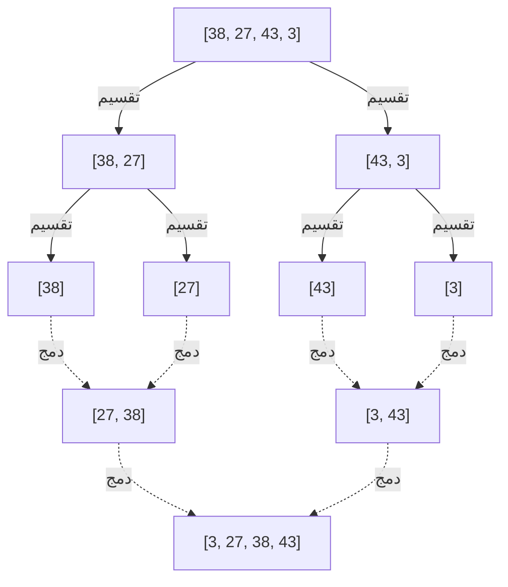
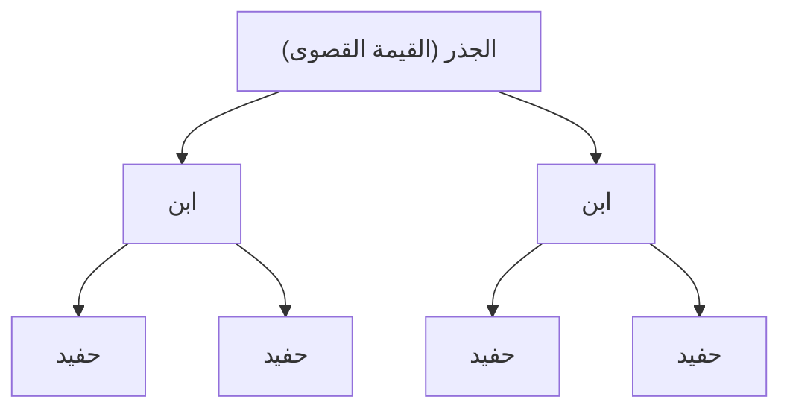

---

## 2. خوارزميات $O(n^2)$: الأساسيات والأساليب البديهية

أول مجموعة سنقدمها هي مجموعة أساسية من الخوارزميات بتعقيد $O(n^2)$. على الرغم من أن هذه الخوارزميات غير عملية لمجموعات البيانات الضخمة، إلا أن تنفيذها بديهي وبسيط للغاية، مما يجعلها مواد تعليمية ممتازة لتعلم أساسيات الخوارزميات. بالإضافة إلى ذلك، في الحالات التي يكون فيها حجم البيانات صغيرًا للغاية أو للبيانات شبه المرتبة بالفعل، فقد تعمل بشكل أسرع من الخوارزميات المعقدة.

### 2.1 الفرز الفقاعي (Bubble Sort)

الفرز الفقاعي هو أحد أشهر خوارزميات الفرز وأبسطها. وهو يقارن عنصرين متجاورين ويبدلهما إذا كانا في ترتيب عكسي، وتستمر هذه العملية حتى نهاية المصفوفة. تتكرر هذه العملية حتى يتم فرز المصفوفة بأكملها. يُطلق عليه اسم الفرز الفقاعي لأنه في نهاية كل تمريرة، "تطفو" العناصر الأكبر (أو الأصغر) وتتحرك إلى حافة المصفوفة.

#### آلية عمل الفرز الفقاعي

1. بدءًا من بداية المصفوفة، يتم مقارنة العناصر المتجاورة (`arr[i]` و `arr[i+1]`).
2. إذا كان العنصر الأيسر أكبر من العنصر الأيمن، يتم تبديلهما (Swap).
3. بتكرار هذا حتى نهاية المصفوفة، ستنتقل القيمة القصوى للمصفوفة إلى أقصى اليمين.
4. في التمريرة التالية، كرر العملية من 1 مجددًا باستثناء العنصر الموجود في أقصى اليمين.
5. عندما لا يتم إجراء أي تبديل على الإطلاق، يُحكم على المصفوفة بأنها مفروزة بالكامل ويتم الإنهاء.

#### التعقيد الزمني والمكاني والخصائص

*   ** أسوأ تعقيد زمني **: $O(n^2)$ (عندما تكون المصفوفة مرتبة بترتيب عكسي)
*   ** متوسط التعقيد الزمني **: $O(n^2)$
*   ** أفضل تعقيد زمني **: $O(n)$ (عندما تكون مرتبة مسبقًا ويتم استخدام علامة (flag) للتحسين)
*   ** التعقيد المكاني **: $O(1)$ (In-place)
*   ** الاستقرار **: مستقر (Stable)

نظرًا لأنه يتم تبديل العناصر المتجاورة فقط، فإن العناصر ذات القيمة نفسها لا تتخطى بعضها البعض، مما يجعلها خوارزمية مستقرة.

#### كود التنفيذ بلغة Python

```python
def bubble_sort(arr):
    n = len(arr)
    # تنفيذ n من التمريرات
    for i in range(n):
        # علامة (flag) للإنهاء المبكر
        swapped = False
        
        # تجاهل الجزء الخلفي الذي تم فرزه بالفعل (عدد i من العناصر)
        for j in range(0, n - i - 1):
            # إذا كان العنصر الأيسر أكبر من الأيمن، فبدل بينهما
            if arr[j] > arr[j + 1]:
                arr[j], arr[j + 1] = arr[j + 1], arr[j]
                swapped = True
                
        # إذا لم يحدث أي تبديل في هذه التمريرة، فهذا يعني أن الفرز قد اكتمل بالفعل
        if not swapped:
            break
            
    return arr
```

#### تتبع خطوة بخطوة

دعونا نرى عملية ترتيب المصفوفة `[5, 3, 8, 4, 2]` تصاعديًا باستخدام الفرز الفقاعي.

*   ** التمريرة 1 **:
    *   مقارنة (5, 3) $\rightarrow$ تبديل: `[3, 5, 8, 4, 2]`
    *   مقارنة (5, 8) $\rightarrow$ الإبقاء: `[3, 5, 8, 4, 2]`
    *   مقارنة (8, 4) $\rightarrow$ تبديل: `[3, 5, 4, 8, 2]`
    *   مقارنة (8, 2) $\rightarrow$ تبديل: `[3, 5, 4, 2, 8]` (تأكيد 8)
*   ** التمريرة 2 **:
    *   مقارنة (3, 5) $\rightarrow$ الإبقاء: `[3, 5, 4, 2, 8]`
    *   مقارنة (5, 4) $\rightarrow$ تبديل: `[3, 4, 5, 2, 8]`
    *   مقارنة (5, 2) $\rightarrow$ تبديل: `[3, 4, 2, 5, 8]` (تأكيد 5)
*   ** التمريرة 3 **:
    *   مقارنة (3, 4) $\rightarrow$ الإبقاء: `[3, 4, 2, 5, 8]`
    *   مقارنة (4, 2) $\rightarrow$ تبديل: `[3, 2, 4, 5, 8]` (تأكيد 4)
*   ** التمريرة 4 **:
    *   مقارنة (3, 2) $\rightarrow$ تبديل: `[2, 3, 4, 5, 8]` (تأكيد 3، ويتم تأكيد 2 تلقائيًا)

### 2.2 الفرز بالاختيار (Selection Sort)

الفرز بالاختيار هو خوارزمية تُقسِّم المصفوفة إلى "جزء مفروز" و"جزء غير مفروز"، وتبحث عن أصغر (أو أكبر) عنصر من الجزء غير المفروز، ثم تستبدله بالعنصر الأول في الجزء غير المفروز، وتكرر هذه العملية.

#### آلية عمل الفرز بالاختيار

1. في البداية، تكون المصفوفة بأكملها هي الجزء غير المفروز.
2. ابحث عن أصغر قيمة في الجزء غير المفروز.
3. بدّل هذه القيمة الصغرى مع العنصر الأول في الجزء غير المفروز.
4. ونتيجة لذلك، سيتم تضمين العنصر الأول في الجزء المفروز، وسيقل حجم الجزء غير المفروز بمقدار 1.
5. كرر هذه العملية حتى لا يتبقى أي جزء غير مفروز.

#### التعقيد الزمني والمكاني والخصائص

*   ** أسوأ تعقيد زمني **: $O(n^2)$
*   ** متوسط التعقيد الزمني **: $O(n^2)$
*   ** أفضل تعقيد زمني **: $O(n^2)$
*   ** التعقيد المكاني **: $O(1)$ (In-place)
*   ** الاستقرار **: غير مستقر (Unstable)

نظرًا لأن الفرز بالاختيار يقوم دائمًا بإجراء مسح إلى النهاية للعثور على القيمة الصغرى بغض النظر عن ترتيب البيانات، فإنه يستغرق $O(n^2)$ حتى في أفضل الحالات. كما أنه ليس مستقرًا لأنه يقوم بالتبديل مع عناصر في مواقع متباعدة.

#### كود التنفيذ بلغة Python

```python
def selection_sort(arr):
    n = len(arr)
    
    # مسح المصفوفة بأكملها
    for i in range(n):
        # افتراض أن الموضع الحالي هو فهرس القيمة الصغرى
        min_idx = i
        
        # البحث عن القيمة الصغرى الحقيقية من الجزء المتبقي غير المفروز
        for j in range(i + 1, n):
            if arr[j] < arr[min_idx]:
                min_idx = j
                
        # بمجرد العثور على القيمة الصغرى، قم بتبديلها مع الموضع الحالي (i)
        arr[i], arr[min_idx] = arr[min_idx], arr[i]
        
    return arr
```

#### تتبع خطوة بخطوة

دعونا نقوم بالفرز بالاختيار للمصفوفة `[29, 10, 14, 37, 13]`.

*   ** i = 0 **: البحث عن القيمة الصغرى `[29, 10, 14, 37, 13]` $\rightarrow$ القيمة الصغرى هي 10. تبديل 29 و 10.
    النتيجة: `[10, 29, 14, 37, 13]` (تأكيد 10)
*   ** i = 1 **: البحث عن القيمة الصغرى في المتبقي `[29, 14, 37, 13]` $\rightarrow$ القيمة الصغرى هي 13. تبديل 29 و 13.
    النتيجة: `[10, 13, 14, 37, 29]` (تأكيد 13)
*   ** i = 2 **: البحث عن القيمة الصغرى في المتبقي `[14, 37, 29]` $\rightarrow$ القيمة الصغرى هي 14. كما هي (استبدال ذاتي).
    النتيجة: `[10, 13, 14, 37, 29]` (تأكيد 14)
*   ** i = 3 **: البحث عن القيمة الصغرى في المتبقي `[37, 29]` $\rightarrow$ القيمة الصغرى هي 29. تبديل 37 و 29.
    النتيجة: `[10, 13, 14, 29, 37]` (تأكيد 29، ويتم تأكيد 37 تلقائيًا)

### 2.3 الفرز بالإدراج (Insertion Sort)

الفرز بالإدراج هو طريقة بديهية نستخدمها غالبًا عندما نحمل أوراق اللعب في أيدينا ونرتبها. إنها خوارزمية تأخذ عنصرًا واحدًا من الجزء غير المفروز وتدرجه في الموضع الصحيح في الجزء المفروز بالفعل.

#### آلية عمل الفرز بالإدراج

1. يُفترض أن العنصر الأول (الفهرس 0) في المصفوفة قد تم فرزه بالفعل.
2. استخرج العنصر التالي (الفهرس 1) (سنطلق عليه اسم `key`)، وقارنه بعناصر الجزء المفروز (على اليسار) بالترتيب من الخلف.
3. إذا كان هناك عنصر أكبر من `key`، فقم بإزاحة هذا العنصر إلى اليمين بمقدار موضع واحد.
4. بمجرد العثور على الموضع الصحيح الذي يجب إدراج `key` فيه، ضع `key` هناك.
5. كرر هذا حتى نهاية المصفوفة.

#### التعقيد الزمني والمكاني والخصائص

*   ** أسوأ تعقيد زمني **: $O(n^2)$ (عندما تكون مرتبة بترتيب عكسي)
*   ** متوسط التعقيد الزمني **: $O(n^2)$
*   ** أفضل تعقيد زمني **: $O(n)$ (عندما تكون مرتبة تقريبًا)
*   ** التعقيد المكاني **: $O(1)$ (In-place)
*   ** الاستقرار **: مستقر (Stable)

أعظم قوة للفرز بالإدراج هي أنه ** إذا كانت البيانات مرتبة بالفعل (أو قريبة من ذلك)، فإنها تتطلب حدًا أدنى من المقارنة والحركة، وبالتالي تعمل بسرعة هائلة تقترب من $O(n)$ **. يتم استغلال هذه الخاصية بشكل كبير في الخوارزميات الهجينة (Hybrid Algorithms) مثل Timsort، والتي سيتم وصفها لاحقًا.

#### كود التنفيذ بلغة Python

```python
def insertion_sort(arr):
    # البدء من الفهرس 1 (يُعتبر العنصر 0 مفروزًا)
    for i in range(1, len(arr)):
        key = arr[i]
        j = i - 1
        
        # مسح الجزء المفروز من الخلف، وإزاحة العناصر الأكبر من key إلى اليمين
        while j >= 0 and key < arr[j]:
            arr[j + 1] = arr[j]
            j -= 1
            
        # إدراج key في الموضع الصحيح الفارغ
        arr[j + 1] = key
        
    return arr
```

#### تتبع خطوة بخطوة

دعونا نقوم بالفرز بالإدراج للمصفوفة `[12, 11, 13, 5, 6]`.

*   ** i = 1 (key = 11) **: مقارنة بـ 12 على اليسار. بما أن 12 > 11، أزح 12 إلى اليمين، وأدرج 11 في المساحة الفارغة.
    النتيجة: `[11, 12, 13, 5, 6]`
*   ** i = 2 (key = 13) **: مقارنة بـ 12 على اليسار. بما أن 12 < 13 فلا حاجة للإزاحة. كما هي.
    النتيجة: `[11, 12, 13, 5, 6]`
*   ** i = 3 (key = 5) **: مقارنة بـ 13، 12، 11 بالترتيب، وبما أنها كلها أكبر من 5 فسيتم إزاحتها جميعًا إلى اليمين. إدراج 5 في أقصى اليسار.
    النتيجة: `[5, 11, 12, 13, 6]`
*   ** i = 4 (key = 6) **: مقارنة بـ 13، 12، 11 بالترتيب والإزاحة إلى اليمين. بما أن 5 < 6، أدرج 6 بجوار 5 على يمينها.
    النتيجة: `[5, 6, 11, 12, 13]`

---

## 3. خوارزميات $O(n \log n)$: فرّق تَسُد والكفاءة الساحقة

عندما يصبح حجم البيانات $n$ كبيرًا، يزداد وقت الحساب في خوارزميات $O(n^2)$ بشكل انفجاري، وتصبح غير عملية. هنا يأتي دور الخوارزميات التي تستخدم تقنيات متقدمة مثل ** فرّق تَسُد ** (Divide and Conquer)، والتي تقوم بتقسيم المصفوفة ومعالجتها بشكل متكرر. إنها تحقق الحد النظري لخوارزميات الفرز المستندة إلى المقارنة $O(n \log n)$، وتُظهر أداءً ساحقًا للبيانات واسعة النطاق.

### 3.1 فرز الدمج (Merge Sort)

تم ابتكار فرز الدمج بواسطة جون فون نيومان في عام 1945، وهو خوارزمية جميلة وقوية. إنها مثال رئيسي على نهج "فرّق تَسُد"، حيث تتخذ نهج تقسيم المصفوفة إلى النصف، ثم إلى النصف مرة أخرى حتى يصبح هناك عنصر واحد، ثم "دمجها" (Merge) أثناء الفرز.

#### آلية عمل فرز الدمج

1. ** التقسيم (Divide) **: قسّم المصفوفة المعطاة في المنتصف إلى مصفوفتين فرعيتين. كرر هذا بشكل متكرر حتى يصبح طول المصفوفات الفرعية 1 (يمكن اعتبار مصفوفة بطول 1 في حالة مفروزة بالفعل).
2. ** السيادة والدمج (Conquer and Combine) **: قارن العناصر الأولى في مصفوفتين فرعيتين مفروزتين، وخزّن القيمة الأصغر في مصفوفة جديدة. كرر ذلك وادمج حتى يتم استعادة مصفوفة واحدة أصلية.



#### التعقيد الزمني والمكاني والخصائص

*   ** أسوأ وأفضل ومتوسط التعقيد الزمني **: جميعها $O(n \log n)$
    *   نظرًا لأنها تقسم دائمًا إلى النصف، فإن عمق التقسيم هو $\log_2 n$. تستغرق عملية الدمج في كل مستوى إجمالي وقت قدره $O(n)$، لذلك يتم ضربهما ليصبح $O(n \log n)$. نظرًا لأن التعقيد الحسابي ثابت بغض النظر عن حالة البيانات، فهو متوقع للغاية وقوي.
*   ** التعقيد المكاني **: $O(n)$ (Out-of-place)
    *   الضعف الأكبر هو أنها تتطلب مصفوفة عمل بنفس حجم المصفوفة الأصلية عند إجراء الدمج.
*   ** الاستقرار **: مستقر (Stable)
    *   عندما تكون القيم متساوية أثناء الدمج، يمكنك الحفاظ على الاستقرار من خلال إعطاء الأولوية لاستخراج العناصر من المصفوفة اليسرى.

#### كود التنفيذ بلغة Python

```python
def merge_sort(arr):
    # إذا كان طول المصفوفة 1 أو أقل، يتم إرجاعها باعتبارها مفروزة بالفعل
    if len(arr) <= 1:
        return arr
        
    # 1. التقسيم: حساب الفهرس الأوسط
    mid = len(arr) // 2
    left_half = arr[:mid]
    right_half = arr[mid:]
    
    # فرز النصفين الأيمن والأيسر بشكل متكرر
    left_sorted = merge_sort(left_half)
    right_sorted = merge_sort(right_half)
    
    # 2. الدمج: دمج المصفوفتين اليمنى واليسرى المفروزتين
    return merge(left_sorted, right_sorted)

def merge(left, right):
    result = []
    i = j = 0
    
    # طالما أن هناك عناصر متبقية في كلتا المصفوفتين
    while i < len(left) and j < len(right):
        if left[i] <= right[j]:  # استخدام <= من أجل الاستقرار
            result.append(left[i])
            i += 1
        else:
            result.append(right[j])
            j += 1
            
    # إضافة العناصر المتبقية
    result.extend(left[i:])
    result.extend(right[j:])
    
    return result
```

### 3.2 الفرز السريع (Quick Sort)

تم ابتكار الفرز السريع بواسطة توني هوار، وهو، كما يوحي اسمه، خوارزمية ممتازة غالبًا ما تعمل بشكل أسرع في العالم الحقيقي. تستخدم "فرّق تَسُد" مثل فرز الدمج، ولكن النهج مختلف. تختار عنصرًا كمعيار ( ** المحور ** (Pivot))، وتُجري الفرز عن طريق توزيع العناصر في مجموعة أصغر من المحور ومجموعة أكبر من المحور.

#### آلية عمل الفرز السريع

1. ** اختيار المحور **: اختر عنصرًا واحدًا من المصفوفة ليكون المحور (قيمة المعيار).
2. ** التقسيم (Partition) **: اجمع العناصر الأصغر من المحور على الجانب الأيسر والعناصر الأكبر من المحور على الجانب الأيمن. عند اكتمال هذه العملية، يتم تحديد الموضع النهائي للمحور نفسه بعد الفرز.
3. ** المعالجة المتكررة **: كرر نفس العملية بشكل متكرر للمصفوفة الموجودة على يسار المحور والمصفوفة الموجودة على يمينه.

يتغير الأداء بشكل كبير بناءً على كيفية اختيار المحور وطريقة التقسيم (طريقة Hoare، طريقة Lomuto).

#### التعقيد الزمني والمكاني والخصائص

*   ** أسوأ تعقيد زمني **: $O(n^2)$
    *   هذا عيب قاتل. بالنسبة لمصفوفة مفروزة بالفعل، إذا تم اختيار العنصر الموجود في الحافة كمحور دائمًا، فستستمر المصفوفة في الانقسام بطريقة منحازة إلى "عنصر واحد" و"بقية العناصر جميعها"، وستقع في أسوأ تعقيد حسابي. لتجنب ذلك، من الضروري استخدام ابتكارات في اختيار المحور مثل "Median-of-three" (أخذ القيمة الوسيطة للبداية والوسط والنهاية).
*   ** متوسط التعقيد الزمني **: $O(n \log n)$
    *   عمليًا، الثابت المعامل صغير جدًا، وكفاءة ذاكرة التخزين المؤقت (Cache) عالية للغاية، مما يجعله يعمل أسرع من فرز الدمج وفرز الكومة ([Heap](https://kenji.blog/ar/p/c-language-pointers-memory-management-stack-heap/) Sort).
*   ** التعقيد المكاني **: في المتوسط $O(\log n)$، في أسوأ الحالات $O(n)$
    *   إنها خوارزمية In-place تقوم بالكتابة فوق المصفوفة نفسها بشكل مباشر، لكنها تستهلك مكدس الاستدعاءات (Call [Stack](https://kenji.blog/ar/p/c-language-pointers-memory-management-stack-heap/)) للاستدعاءات المتكررة.
*   ** الاستقرار **: غير مستقر (Unstable)
    *   نظرًا لتبديل العناصر المتباعدة في عملية التقسيم، فإنه ليس مستقرًا.

#### كود التنفيذ بلغة Python (نسخة استخدام List Comprehension سهلة الفهم)

هذا ليس جيدًا من حيث كفاءة الذاكرة، ولكنه يُعبر بوضوح عن الغرض من الخوارزمية.

```python
def quick_sort_simple(arr):
    if len(arr) <= 1:
        return arr
    
    # اختيار العنصر الأوسط كمحور
    pivot = arr[len(arr) // 2]
    
    # التقسيم إلى ثلاث قوائم: أقل من المحور، يساويه، أكبر منه
    left = [x for x in arr if x < pivot]
    middle = [x for x in arr if x == pivot]
    right = [x for x in arr if x > pivot]
    
    # الدمج بشكل متكرر
    return quick_sort_simple(left) + middle + quick_sort_simple(right)
```

#### كود التنفيذ بلغة Python (نسخة In-place مع مخطط تقسيم Lomuto)

هذا تنفيذ In-place لا يستخدم ذاكرة إضافية، ويُستخدم في المكتبات الفعلية.

```python
def quick_sort_inplace(arr, low, high):
    if low < high:
        # إجراء التقسيم والحصول على الموضع الصحيح للمحور
        pi = partition(arr, low, high)
        
        # فرز الجزء الأيمن والأيسر للمحور بشكل متكرر
        quick_sort_inplace(arr, low, pi - 1)
        quick_sort_inplace(arr, pi + 1, high)

def partition(arr, low, high):
    # اختيار العنصر الأخير كمحور (طريقة Lomuto)
    pivot = arr[high]
    
    # i يشير إلى الفهرس الأخير للعناصر الأصغر من المحور
    i = low - 1
    
    for j in range(low, high):
        # إذا كان العنصر الحالي أصغر من أو يساوي المحور، قم بتقديم i وبدل
        if arr[j] <= pivot:
            i = i + 1
            arr[i], arr[j] = arr[j], arr[i]
            
    # إدراج المحور في الموضع الصحيح (i+1)
    arr[i + 1], arr[high] = arr[high], arr[i + 1]
    
    return i + 1
```

### 3.3 فرز الكومة ([Heap](https://kenji.blog/ar/p/c-language-pointers-memory-management-stack-heap/) Sort)

فرز الكومة هو خوارزمية فرز تستخدم ببراعة بنية بيانات شجرية تُسمى ** الكومة الثنائية (Binary Heap) **. تتميز بأنها تأخذ أفضل ما في فرز الدمج والفرز السريع، حيث إن أسوأ تعقيد حسابي لها هو $O(n \log n)$ وفي الوقت نفسه هي عملية فرز In-place لا تستخدم ذاكرة إضافية.

#### آلية عمل فرز الكومة

1. ** بناء الكومة **: أولاً، حوّل المصفوفة المعطاة إلى "كومة عظمى" (Max Heap). الكومة العظمى هي شجرة ثنائية كاملة تُلبي القاعدة التي تنص على أن قيمة العقدة الأصلية يجب أن تكون دائمًا أكبر من أو تساوي قيم العقد التابعة لها. باستخدام حساب الفهرس على المصفوفة (الأصل: $(i-1)/2$، الابن الأيسر: $2i+1$، الابن الأيمن: $2i+2$)، يمكن تمثيل البنية الشجرية كما هي في مصفوفة.
2. ** استخراج القيمة القصوى وإعادة البناء **: في جذر (Root) الكومة العظمى (بداية المصفوفة `arr[0]`) ستكون القيمة القصوى دائمًا. بدّل هذه القيمة القصوى مع العنصر الأخير في المصفوفة. وبذلك يتم تأكيد موقع القيمة القصوى في الموضع النهائي للمصفوفة.
3. نظرًا لإعادة كتابة الجذر، ينكسر شرط الكومة، لذلك قم بـ "إعادة بناء الكومة" (Heapify) في النطاق باستثناء نهاية الكومة (الجزء المؤكد) لتلبية شرط الكومة العظمى مرة أخرى.
4. من خلال تكرار هذه العملية حتى يتبقى عنصر واحد، يتم تأكيد القيم الأكبر بالترتيب من مؤخرة المصفوفة، وتُفرز تصاعديًا في النهاية.



#### التعقيد الزمني والمكاني والخصائص

*   ** أسوأ وأفضل ومتوسط التعقيد الزمني **: جميعها $O(n \log n)$
    *   يستغرق بناء الكومة $O(n)$، ويتكرر استخراج القيمة القصوى وإعادة البناء ($O(\log n)$) $n$ مرة، ليصبح الإجمالي $O(n \log n)$. نظرًا لضمان هذا التعقيد الحسابي لأي ترتيب للبيانات، فهو مفيد جدًا في الأنظمة التي تتطلب تجنب أسوأ الحالات.
*   ** التعقيد المكاني **: $O(1)$ (In-place)
    *   لا يتطلب ذاكرة إضافية لأنه يمثل شجرة الكومة مباشرة على المصفوفة.
*   ** الاستقرار **: غير مستقر (Unstable)
    *   ليس مستقرًا لأنه يبدل العناصر المتباعدة أثناء عملية بناء الكومة والاستخراج.

#### كود التنفيذ بلغة Python

```python
def heapify(arr, n, i):
    largest = i          # افتراض أن الجذر هو القيمة القصوى
    left = 2 * i + 1     # الابن الأيسر
    right = 2 * i + 2    # الابن الأيمن

    # إذا كان الابن الأيسر أكبر من الجذر
    if left < n and arr[left] > arr[largest]:
        largest = left

    # إذا كان الابن الأيمن أكبر من القيمة القصوى الحالية
    if right < n and arr[right] > arr[largest]:
        largest = right

    # إذا لم يكن الجذر هو القيمة القصوى، قم بالتبديل وجعلها كومة بشكل متكرر
    if largest != i:
        arr[i], arr[largest] = arr[largest], arr[i]
        heapify(arr, n, largest)

def heap_sort(arr):
    n = len(arr)

    # 1. بناء الكومة العظمى (من الأسفل إلى الأعلى)
    # جعلها كومة بدءًا من آخر عقدة غير ورقية نحو الجذر
    for i in range(n // 2 - 1, -1, -1):
        heapify(arr, n, i)

    # 2. استخراج العناصر واحدًا تلو الآخر وفرزها
    for i in range(n - 1, 0, -1):
        # تبديل الجذر الحالي (القيمة القصوى) مع نهاية الجزء غير المفروز
        arr[i], arr[0] = arr[0], arr[i]
        
        # إعادة البناء للكومة الجديدة ذات الحجم المنخفض
        heapify(arr, i, 0)
        
    return arr
```

---

## 4. خوارزميات الفرز غير المقارن $O(n)$: تجاوز حدود المقارنة

جميع خوارزميات الفرز التي رأيناها حتى الآن كانت "فرز مستند إلى المقارنة" والذي يحدد علاقة الحجم بين العناصر باستخدام عمليات المقارنة (`<`، `>`، `==`). وقد ثبت رياضيًا أن الفرز المستند إلى المقارنة لا يمكن أن يكون أسرع من $O(n \log n)$.

ومع ذلك، من خلال الاستفادة الجيدة من طبيعة البيانات (مثل كونها أعدادًا صحيحة، أو ذات عدد ثابت من الأرقام، أو نطاقها ضيق) واستخدام خوارزميات خاصة لا تُجري أي "مقارنات" على الإطلاق، يصبح من الممكن إجراء فرز فائق السرعة في وقت خطي $O(n)$.

### 4.1 الفرز بالعد (Counting Sort)

الفرز بالعد هو خوارزمية تحسب الموضع الصحيح للعناصر من خلال "عد" عدد المرات التي تظهر فيها قيمة مفتاح معينة في البيانات. إنها فعالة للغاية عند فرز مجموعة ضيقة من الأعداد الصحيحة من 0 إلى قيمة قصوى محددة $k$.

#### التعقيد الزمني والمكاني
*   ** التعقيد الزمني **: $O(n + k)$. يعتمد على عدد البيانات $n$ ونطاق القيم $k$. إذا كان $k$ مساويًا تقريبًا لـ $n$ فإنه يصبح $O(n)$، ولكن إذا كان $k$ كبيرًا جدًا (على سبيل المثال: مصفوفة تحتوي على 1 و مليار فقط) فسيكون غير فعال بشكل كبير.
*   ** التعقيد المكاني **: $O(n + k)$. يتطلب مصفوفة للعد ومصفوفة للإخراج.

#### فكرة التنفيذ بلغة Python
```python
def counting_sort(arr):
    if not arr:
        return arr
        
    max_val = max(arr)
    # تهيئة مصفوفة العد بالأصفار
    count = [0] * (max_val + 1)
    
    # 1. عد مرات ظهور كل عنصر
    for num in arr:
        count[num] += 1
        
    # 2. حساب المجموع التراكمي (لتحديد الموضع النهائي للعناصر)
    for i in range(1, len(count)):
        count[i] += count[i - 1]
        
    # 3. إنشاء مصفوفة الإخراج (المسح من الخلف للحفاظ على الاستقرار)
    output = [0] * len(arr)
    for num in reversed(arr):
        output[count[num] - 1] = num
        count[num] -= 1
        
    return output
```

### 4.2 الفرز الجذري (Radix Sort)

الفرز الجذري هو الخوارزمية التي تغلبت على نقطة ضعف الفرز بالعد وهي "لا يمكن استخدامه إذا كان نطاق القيم واسعًا". من خلال تطبيق فرز مستقر (غالبًا ما يُستخدم الفرز بالعد داخليًا) بدءًا من الأرقام الأقل أهمية (LSD: Least Significant Digit) مثل "الآحاد" ثم "العشرات" ثم "المئات" للأرقام، فإنه يكمل الفرز الكلي. كما يتم تطبيقه أيضًا لفرز السلاسل النصية وما إلى ذلك.

### 4.3 الفرز بالدلو (Bucket Sort)

يقوم الفرز بالدلو بتقسيم النطاق المحتمل للبيانات إلى "دلاء" (Buckets) متساوية الحجم ورمي كل بيانات في الدلو المقابل. بعد ذلك، يتم إجراء فرز فردي داخل كل دلو (غالبًا ما يُستخدم الفرز بالإدراج)، وفي النهاية يتم ربط محتويات جميع الدلاء بالترتيب لإكمال الفرز. إذا تم توزيع البيانات بشكل متجانس في نطاق معين، فإنها تعمل بسرعة هائلة في وقت متوسط $O(n)$.

---

## 5. الخوارزميات الهجينة المهيمنة على العالم العملي الحديث

في الكتب المدرسية الأكاديمية، غالبًا ما تتم تغطية الخوارزميات حتى الفرز السريع أو فرز الدمج، ولكن ما يعمل فعليًا خلف كواليس لغات البرمجة الحالية هي ** الخوارزميات الهجينة ** (Hybrid Algorithms) التي تجمع بين مزايا العديد من الخوارزميات.

### 5.1 Timsort (الافتراضي في Python)

Timsort هي خوارزمية تم تنفيذها لـ Python بواسطة Tim Peters في عام 2002، وهي الآن تهيمن على العالم العملي لاعتمادها في العديد من اللغات مثل `list.sort()` و `sorted()` في Python، ومصفوفات الكائنات في [Java](https://kenji.blog/ar/p/programming-languages-history-paradigm-evolution/)، والفرز القياسي في [Rust](https://kenji.blog/ar/p/webassembly-wasm-current-future/).

فلسفة التصميم الأساسية لـ Timsort تستند إلى القاعدة التجريبية القائلة بأن ** "البيانات في العالم الحقيقي نادرًا ما تكون عشوائية تمامًا، وغالبًا ما تكون مرتبة جزئيًا (تحتوي على كتل متتالية تصاعدية أو تنازلية)" **.

#### خصائص Timsort
*   ** دمج بين فرز الدمج والفرز بالإدراج **: تقسم المصفوفة إلى أجزاء (Chunks) بحجم معين (عادة حوالي 32 إلى 64 عنصرًا)، وتُفرز كل منها بسرعة باستخدام الفرز بالإدراج. ثم تدمجها بطريقة فرز الدمج.
*   ** الاستفادة من الـ Run **: تمسح المصفوفة، وتكتشف الأجزاء المتتالية التي تم ترتيبها تصاعديًا (أو تنازليًا) منذ البداية (ويسمى هذا "Run"). إذا كان الترتيب تنازليًا، تعكسه ليصبح تصاعديًا، وتستخدم هذه الأجزاء كوحدات للدمج.
*   ** تعقيد حسابي متكيف (Adaptive) **: في حين أنه يضمن أسوأ حالة $O(n \log n)$ للبيانات العشوائية تمامًا، إلا أنه بالنسبة للبيانات المرتبة بالفعل أو المرتبة جزئيًا، يمكن أن يحقق سرعة لا تصدق بأفضل حالة $O(n)$.
*   ** الاستقرار **: خوارزمية مستقرة.

### 5.2 Introsort (في C++ كـ `std::sort`)

الفرز التأملي (Introspective Sort أو Introsort) معتمد في `std::sort` في مكتبة STL للغة C++ والفرز القياسي في .NET (C#) وغيرها.

الفرز السريع هو الأسرع في المتوسط، ولكن كانت لديه نقطة ضعف قاتلة تتمثل في احتمال السقوط في أسوأ حالة $O(n^2)$ اعتمادًا على كيفية اختيار المحور. Introsort هو نهج هجين تغلب على هذه النقطة بالكامل.

#### خصائص Introsort
1. بشكل أساسي، يستخدم ** الفرز السريع ** السريع لتقسيم المصفوفة.
2. ومع ذلك، فإنه يراقب عمق الاستدعاء المتكرر، وإذا تجاوز عمق التقسيم مضاعفًا ثابتًا لـ $\log_2 n$ (مثال: $2 \times \log_2 n$)، فإنه يعتبر (بتأمل ذاتي: Introspection) أن "اختيار المحور لا يسير على ما يرام، وهو على وشك الوقوع في أسوأ تعقيد حسابي".
3. في تلك المرحلة، يحول طريقة الفرز لذلك الجزء من المصفوفة إلى ** فرز الكومة **، والذي يبلغ أسوأ تعقيد حسابي له $O(n \log n)$.
4. أيضًا، عندما يصبح عدد العناصر صغيرًا جدًا (مثال: 16 عنصرًا أو أقل)، فإنه يحول إلى ** الفرز بالإدراج ** لتجنب أعباء استدعاء الدوال (Overhead).

وبالتالي، فإنه خوارزمية لا تشوبها شائبة تحافظ على السرعة المتوسطة الساحقة للفرز السريع، مع ضمان $O(n \log n)$ حتى في أسوأ الحالات.

---

## 6. جدول مقارنة شامل مُلخص

لقد قمنا بتلخيص أداء خوارزميات الفرز الرئيسية المشروحة في هذا المقال في شكل جدول.

| الخوارزمية (Algorithm) | أفضل تعقيد زمني (Best Time) | متوسط التعقيد الزمني (Avg Time) | أسوأ تعقيد زمني (Worst Time) | التعقيد المكاني (Space) | الاستقرار (Stability) | الطريقة/الخصائص |
| :--- | :--- | :--- | :--- | :--- | :--- | :--- |
| ** الفرز الفقاعي (Bubble Sort) ** | $O(n)$ | $O(n^2)$ | $O(n^2)$ | $O(1)$ | نعم (Yes) | تبديل. تعليمي. عمليته منخفضة. |
| ** الفرز بالاختيار (Selection Sort) ** | $O(n^2)$ | $O(n^2)$ | $O(n^2)$ | $O(1)$ | لا (No) | اختيار. يتطلب دائمًا مسحًا كاملاً. |
| ** الفرز بالإدراج (Insertion Sort) ** | $O(n)$ | $O(n^2)$ | $O(n^2)$ | $O(1)$ | نعم (Yes) | إدراج. قوي جدًا للبيانات شبه المرتبة. |
| ** فرز الدمج (Merge Sort) ** | $O(n \log n)$ | $O(n \log n)$ | $O(n \log n)$ | $O(n)$ | نعم (Yes) | فرّق تَسُد. تعقيد حسابي قوي لكنه يستهلك الذاكرة. |
| ** الفرز السريع (Quick Sort) ** | $O(n \log n)$ | $O(n \log n)$ | $O(n^2)$ | $O(\log n)$ | لا (No) | فرّق تَسُد. الأسرع في المتوسط لكن احذر من أسوأ الحالات. |
| ** فرز الكومة ([Heap](https://kenji.blog/ar/p/c-language-pointers-memory-management-stack-heap/) Sort) ** | $O(n \log n)$ | $O(n \log n)$ | $O(n \log n)$ | $O(1)$ | لا (No) | الكومة الثنائية. In-place وقوي. |
| ** الفرز بالعد (Counting Sort) ** | $O(n+k)$ | $O(n+k)$ | $O(n+k)$ | $O(k)$ | نعم (Yes) | غير مقارن. الأقوى عندما يكون نطاق المفاتيح ضيقًا. |
| ** Timsort ** (قياسي في Python وغيرها) | $O(n)$ | $O(n \log n)$ | $O(n \log n)$ | $O(n)$ | نعم (Yes) | هجين. متكيف وأسرع للبيانات الحقيقية. |
| ** Introsort ** (قياسي في C++ وغيرها) | $O(n \log n)$ | $O(n \log n)$ | $O(n \log n)$ | $O(\log n)$ | لا (No) | هجين. يجمع بين سرعة Quick وقوة Heap. |

---

## 7. الخلاصة: في النهاية، أيها يجب أن نستخدم؟

لقد قمنا بشرح العديد من خوارزميات الفرز حتى الآن، ولكن في تطوير البرمجيات العملي، هناك إجابة واضحة:

** "بشكل أساسي، استخدم دالة الفرز القياسية المدمجة في اللغة" **

هذا كل ما في الأمر. يتم تنفيذ `.sort()` في Python و `std::sort` في C++ وغيرها من اللغات من خلال خوارزميات هجينة متقدمة مثل Timsort و Introsort المشروحة في هذا المقال، وقد تم إجراء تحسينات لا حصر لها عليها (تحسين كفاءة التخزين المؤقت للذاكرة، وتحسين توقع التفرع (Branch Prediction)، وما إلى ذلك). من غير المرجح أن يتفوق الفرز السريع الذي تكتبه بنفسك على سرعة المكتبة القياسية.

ولكن، لماذا إذن نحتاج إلى تعلم خوارزميات الفرز؟

1. ** فهم المفاهيم الأساسية **: المفاهيم مثل التعقيد الحسابي ([Big O](https://kenji.blog/ar/p/time-space-complexity-big-o-notation-examples/) Notation) و In-place/Out-of-place و الاستقرار، تشكل أساسًا لتصميم جميع الخوارزميات وتصميم هياكل البيانات، وليس فقط الفرز.
2. ** الأنظمة ذات القيود الخاصة **: في بيئات مثل الأنظمة المدمجة (Embedded Systems) حيث تكون الذاكرة محدودة للغاية، قد تحتاج إلى تنفيذ فرز كومة بمساحة $O(1)$ أو فرز سريع In-place بنفسك.
3. ** الاستفادة من طبيعة البيانات **: عند فرز "مليون سجل تتراوح قيمتها من 1 إلى 100"، فإن تنفيذ الفرز بالعد ($O(n)$) سيكون أسرع بكثير من استخدام Timsort القياسي ($O(n \log n)$).

من خلال معرفة البنية الداخلية للخوارزميات، ستفهم "نقاط القوة" و "نقاط الضعف" في الدوال القياسية المقدمة كصندوق أسود، وستتمكن من تصميم أنظمة أكثر تقدمًا وكفاءة.

يرجى بالتأكيد تجربة كود Python في هذا المقال على جهازك، وتغيير كمية البيانات، أو تمرير بيانات بترتيب عكسي، وتجربة سلوك ووقت تنفيذ كل خوارزمية!
