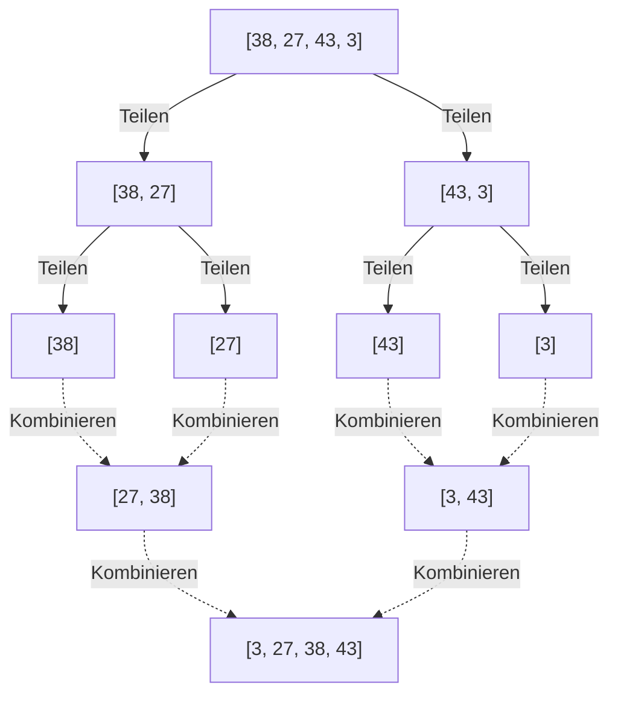
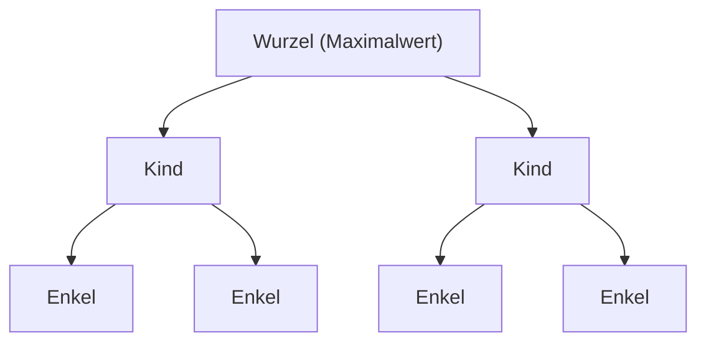

---

## 2. $O(n^2)$ Algorithmen: Grundlagen und intuitive Ansätze

Zuerst stellen wir eine Gruppe von grundlegenden Algorithmen vor, deren Zeitkomplexität $O(n^2)$ beträgt. Obwohl sie für große Datensätze wenig praktikabel sind, sind sie intuitiv zu implementieren und sehr einfach, was sie zu hervorragenden Lehrmaterialien für die Grundlagen von Algorithmen macht. Außerdem können sie bei extrem kleinen Datenmengen oder fast sortierten Daten schneller arbeiten als komplexe Algorithmen.

### 2.1 Bubble Sort

Bubble Sort ist einer der bekanntesten und einfachsten Sortieralgorithmen. Die Operation des Vergleichens von zwei benachbarten Elementen und dem Vertauschen, falls ihre Reihenfolge umgekehrt ist, wird bis zum Ende des Arrays durchgeführt. Dies wird wiederholt, bis das gesamte Array sortiert ist. Am Ende jedes Durchlaufs "steigt" das größte (oder kleinste) Element an den Rand des Arrays auf, daher der Name Bubble Sort (Blasensortierung).

#### Funktionsweise von Bubble Sort

1. Vergleiche benachbarte Elemente (`arr[i]` und `arr[i+1]`) der Reihe nach, beginnend am Anfang des Arrays.
2. Wenn das linke Element größer als das rechte Element ist, tausche (swap) die beiden.
3. Wenn dies bis zum Ende des Arrays wiederholt wird, bewegt sich der größte Wert des Arrays ganz nach rechts.
4. Im nächsten Durchlauf wird alles außer dem Element ganz rechts beginnend bei 1 wiederholt.
5. Das Array gilt als vollständig sortiert und der Vorgang wird beendet, wenn kein Swap mehr durchgeführt wurde.

#### Zeit-/Speicherkomplexität und Eigenschaften

*   **Schlechteste Zeitkomplexität**: $O(n^2)$ (Wenn das Array in umgekehrter Reihenfolge sortiert ist)
*   **Durchschnittliche Zeitkomplexität**: $O(n^2)$
*   **Beste Zeitkomplexität**: $O(n)$ (Wenn es bereits sortiert ist und ein Optimierungs-Flag verwendet wird)
*   **Speicherkomplexität**: $O(1)$ (In-place)
*   **Stabilität**: Stabil (Stable)

Da nur benachbarte Elemente vertauscht werden, überholen sich Elemente mit demselben Wert nicht gegenseitig, was es zu einem stabilen Algorithmus macht.

#### Python-Implementierung

```python
def bubble_sort(arr):
    n = len(arr)
    # Führe n Durchläufe aus
    for i in range(n):
        # Flag für ein frühes Beenden
        swapped = False
        
        # Den bereits sortierten hinteren Teil (i Elemente) ignorieren
        for j in range(0, n - i - 1):
            # Tauschen, wenn das linke Element größer als das rechte ist
            if arr[j] > arr[j + 1]:
                arr[j], arr[j + 1] = arr[j + 1], arr[j]
                swapped = True
                
        # Wenn in diesem Durchlauf kein Tausch stattgefunden hat, ist die Sortierung bereits abgeschlossen
        if not swapped:
            break
            
    return arr
```

#### Schritt-für-Schritt Trace

Betrachten wir den Prozess der aufsteigenden Sortierung des Arrays `[5, 3, 8, 4, 2]` mit Bubble Sort.

*   **Durchlauf 1**:
    *   Vergleiche (5, 3) $\rightarrow$ Tauschen: `[3, 5, 8, 4, 2]`
    *   Vergleiche (5, 8) $\rightarrow$ Beibehalten: `[3, 5, 8, 4, 2]`
    *   Vergleiche (8, 4) $\rightarrow$ Tauschen: `[3, 5, 4, 8, 2]`
    *   Vergleiche (8, 2) $\rightarrow$ Tauschen: `[3, 5, 4, 2, 8]` (8 ist fixiert)
*   **Durchlauf 2**:
    *   Vergleiche (3, 5) $\rightarrow$ Beibehalten: `[3, 5, 4, 2, 8]`
    *   Vergleiche (5, 4) $\rightarrow$ Tauschen: `[3, 4, 5, 2, 8]`
    *   Vergleiche (5, 2) $\rightarrow$ Tauschen: `[3, 4, 2, 5, 8]` (5 ist fixiert)
*   **Durchlauf 3**:
    *   Vergleiche (3, 4) $\rightarrow$ Beibehalten: `[3, 4, 2, 5, 8]`
    *   Vergleiche (4, 2) $\rightarrow$ Tauschen: `[3, 2, 4, 5, 8]` (4 ist fixiert)
*   **Durchlauf 4**:
    *   Vergleiche (3, 2) $\rightarrow$ Tauschen: `[2, 3, 4, 5, 8]` (3 ist fixiert, automatisch auch 2)

### 2.2 Selection Sort (Auswahlsortierung)

Selection Sort ist ein Algorithmus, der das Array in einen "sortierten Teil" und einen "unsortierten Teil" aufteilt. Er sucht wiederholt nach dem kleinsten (oder größten) Element im unsortierten Teil und tauscht es mit dem ersten Element des unsortierten Teils aus.

#### Funktionsweise von Selection Sort

1. Zu Beginn ist das gesamte Array der unsortierte Teil.
2. Finde den kleinsten Wert im unsortierten Teil.
3. Tausche diesen kleinsten Wert mit dem ersten Element des unsortierten Teils.
4. Dadurch wird das erste Element in den sortierten Teil aufgenommen, und der unsortierte Teil wird um eins kleiner.
5. Diese Operation wird wiederholt, bis es keinen unsortierten Teil mehr gibt.

#### Zeit-/Speicherkomplexität und Eigenschaften

*   **Schlechteste Zeitkomplexität**: $O(n^2)$
*   **Durchschnittliche Zeitkomplexität**: $O(n^2)$
*   **Beste Zeitkomplexität**: $O(n^2)$
*   **Speicherkomplexität**: $O(1)$ (In-place)
*   **Stabilität**: Instabil (Unstable)

Selection Sort scannt immer bis zum Ende, um den Minimalwert zu finden, unabhängig von der Reihenfolge der Daten, sodass er selbst im besten Fall $O(n^2)$ benötigt. Außerdem ist er nicht stabil, da er Swaps mit Elementen durchführt, die weit voneinander entfernt sind.

#### Python-Implementierung

```python
def selection_sort(arr):
    n = len(arr)
    
    # Durchlaufe das gesamte Array
    for i in range(n):
        # Nimm an, dass die aktuelle Position der Index des Minimums ist
        min_idx = i
        
        # Suche nach dem wahren Minimum im restlichen unsortierten Teil
        for j in range(i + 1, n):
            if arr[j] < arr[min_idx]:
                min_idx = j
                
        # Wenn das Minimum gefunden wurde, tausche es mit der aktuellen Position (i)
        arr[i], arr[min_idx] = arr[min_idx], arr[i]
        
    return arr
```

#### Schritt-für-Schritt Trace

Selection Sort des Arrays `[29, 10, 14, 37, 13]`.

*   **i = 0**: Minimum finden in `[29, 10, 14, 37, 13]` $\rightarrow$ Minimum ist 10. Tausche 29 und 10.
    Ergebnis: `[10, 29, 14, 37, 13]` (10 ist fixiert)
*   **i = 1**: Minimum finden im Rest `[29, 14, 37, 13]` $\rightarrow$ Minimum ist 13. Tausche 29 und 13.
    Ergebnis: `[10, 13, 14, 37, 29]` (13 ist fixiert)
*   **i = 2**: Minimum finden im Rest `[14, 37, 29]` $\rightarrow$ Minimum ist 14. Beibehalten (Selbsttausch).
    Ergebnis: `[10, 13, 14, 37, 29]` (14 ist fixiert)
*   **i = 3**: Minimum finden im Rest `[37, 29]` $\rightarrow$ Minimum ist 29. Tausche 37 und 29.
    Ergebnis: `[10, 13, 14, 29, 37]` (29 ist fixiert, automatisch auch 37)

### 2.3 Insertion Sort (Einfügesortierung)

Insertion Sort ist eine intuitive Methode, die wir oft verwenden, wenn wir Spielkarten in der Hand sortieren. Es ist ein Algorithmus, der ein Element aus dem unsortierten Teil nimmt und es an der richtigen Position im bereits sortierten Teil einfügt.

#### Funktionsweise von Insertion Sort

1. Das erste Element des Arrays (Index 0) gilt als bereits sortiert.
2. Nimm das nächste Element (Index 1) (nennen wir es `key`) und vergleiche es rückwärts mit den Elementen im sortierten Teil (links).
3. Wenn es ein Element gibt, das größer als `key` ist, verschiebe dieses Element um eine Position nach rechts.
4. Sobald die richtige Position für das Einfügen von `key` gefunden wurde, platziere `key` dort.
5. Wiederhole dies bis zum Ende des Arrays.

#### Zeit-/Speicherkomplexität und Eigenschaften

*   **Schlechteste Zeitkomplexität**: $O(n^2)$ (Wenn in umgekehrter Reihenfolge sortiert)
*   **Durchschnittliche Zeitkomplexität**: $O(n^2)$
*   **Beste Zeitkomplexität**: $O(n)$ (Wenn fast sortiert)
*   **Speicherkomplexität**: $O(1)$ (In-place)
*   **Stabilität**: Stabil (Stable)

Die größte Stärke von Insertion Sort besteht darin, dass es **sehr schnell mit einer Geschwindigkeit nahe $O(n)$ arbeitet, wenn die Daten bereits sortiert (oder fast sortiert) sind**, da Vergleiche und Verschiebungen auf ein Minimum reduziert werden. Diese Eigenschaft wird bei hybriden Algorithmen wie Timsort (später beschrieben) stark genutzt.

#### Python-Implementierung

```python
def insertion_sort(arr):
    # Beginne bei Index 1 (das 0-te Element gilt als sortiert)
    for i in range(1, len(arr)):
        key = arr[i]
        j = i - 1
        
        # Scanne den sortierten Teil rückwärts und verschiebe alles, was größer als key ist, nach rechts
        while j >= 0 and key < arr[j]:
            arr[j + 1] = arr[j]
            j -= 1
            
        # Füge key an der freigewordenen, richtigen Position ein
        arr[j + 1] = key
        
    return arr
```

#### Schritt-für-Schritt Trace

Insertion Sort des Arrays `[12, 11, 13, 5, 6]`.

*   **i = 1 (key = 11)**: Vergleiche mit 12 links. 12 > 11, also verschiebe 12 nach rechts und füge 11 an der freien Stelle ein.
    Ergebnis: `[11, 12, 13, 5, 6]`
*   **i = 2 (key = 13)**: Vergleiche mit 12 links. 12 < 13, also keine Verschiebung erforderlich. Bleibt so.
    Ergebnis: `[11, 12, 13, 5, 6]`
*   **i = 3 (key = 5)**: Vergleiche der Reihe nach mit 13, 12, 11. Da alle größer als 5 sind, verschiebe alle nach rechts. Füge 5 ganz links ein.
    Ergebnis: `[5, 11, 12, 13, 6]`
*   **i = 4 (key = 6)**: Vergleiche der Reihe nach mit 13, 12, 11 und verschiebe nach rechts. 5 < 6, also füge 6 rechts von der 5 ein.
    Ergebnis: `[5, 6, 11, 12, 13]`

---

## 3. $O(n \log n)$ Algorithmen: Teile und Herrsche und überwältigende Effizienz

Wenn die Datenmenge $n$ groß wird, nimmt die Rechenzeit für $O(n^2)$-Algorithmen explosionsartig zu, was sie für den praktischen Gebrauch unbrauchbar macht. Hier kommen Algorithmen mit fortgeschrittenen Techniken wie **Teile und Herrsche** (Divide and Conquer) ins Spiel, die das Array aufteilen und rekursiv verarbeiten. Sie erreichen die theoretische Grenze von $O(n \log n)$ für vergleichsbasierte Sortieralgorithmen und weisen eine überwältigende Leistung bei großen Datensätzen auf.

### 3.1 Merge Sort (Mergesort)

Merge Sort ist ein wunderschöner und robuster Algorithmus, der 1945 von John von Neumann entwickelt wurde. Als klassisches Beispiel für "Teile und Herrsche" verfolgt er den Ansatz, das Array in Hälften und weitere Hälften aufzuteilen, bis nur noch ein Element übrig ist, und sie dann während des Sortierens zusammenzuführen (zu mergen).

#### Funktionsweise von Merge Sort

1. **Teilen (Divide)**: Teile das gegebene Array in der Mitte in zwei Teilarrays. Wiederhole dies rekursiv, bis die Länge der Teilarrays 1 beträgt (ein Array der Länge 1 gilt als sortiert).
2. **Herrschen und Kombinieren (Conquer and Combine)**: Vergleiche die ersten Elemente von zwei sortierten Teilarrays und speichere das kleinere in einem neuen Array. Wiederhole dies, um sie zusammenzuführen, bis das ursprüngliche einzige Array wiederhergestellt ist.



#### Zeit-/Speicherkomplexität und Eigenschaften

*   **Schlechteste, durchschnittliche und beste Zeitkomplexität**: Alle $O(n \log n)$
    *   Da es immer halbiert wird, ist die Tiefe der Teilung $\log_2 n$. Da der Zusammenführungsprozess auf jeder Ebene insgesamt eine Zeit von $O(n)$ in Anspruch nimmt, ergibt die Multiplikation $O(n \log n)$. Da die Zeitkomplexität unabhängig vom [Zustand](https://kenji.blog/de/p/state-management-history-redux-context-recoil-zustand/) der Daten konstant ist, ist er sehr vorhersehbar und robust.
*   **Speicherkomplexität**: $O(n)$ (Out-of-place)
    *   Seine größte Schwäche ist, dass er beim Zusammenführen ein Arbeitsarray der gleichen Größe wie das ursprüngliche Array benötigt.
*   **Stabilität**: Stabil (Stable)
    *   Die Stabilität kann aufrechterhalten werden, indem beim Zusammenführen bei gleichen Werten bevorzugt Elemente aus dem linken Array entnommen werden.

#### Python-Implementierung

```python
def merge_sort(arr):
    # Wenn die Länge des Arrays 1 oder weniger ist, gilt es als bereits sortiert
    if len(arr) <= 1:
        return arr
        
    # 1. Teilen: Berechne den mittleren Index
    mid = len(arr) // 2
    left_half = arr[:mid]
    right_half = arr[mid:]
    
    # Sortiere die linke und rechte Hälfte rekursiv
    left_sorted = merge_sort(left_half)
    right_sorted = merge_sort(right_half)
    
    # 2. Zusammenführen: Führe die sortierten linken und rechten Arrays zusammen
    return merge(left_sorted, right_sorted)

def merge(left, right):
    result = []
    i = j = 0
    
    # Solange in beiden Arrays Elemente verbleiben
    while i < len(left) and j < len(right):
        if left[i] <= right[j]:  # Verwende <= für Stabilität
            result.append(left[i])
            i += 1
        else:
            result.append(right[j])
            j += 1
            
    # Füge die verbleibenden Elemente hinzu
    result.extend(left[i:])
    result.extend(right[j:])
    
    return result
```

### 3.2 Quick Sort (Quicksort)

Quick Sort, entworfen von Tony Hoare, ist, wie der Name schon sagt, ein ausgezeichneter Algorithmus, der in der realen Welt oft am schnellsten arbeitet. Er verwendet "Teile und Herrsche" wie Merge Sort, hat aber einen anderen Ansatz. Er wählt ein Basiselement (**Pivot**) und setzt die Sortierung fort, indem er die Elemente in eine Gruppe kleiner als das Pivot und eine Gruppe größer als das Pivot aufteilt.

#### Funktionsweise von Quick Sort

1. **Pivot-Auswahl**: Wähle ein Element aus dem Array als Pivot (Referenzwert).
2. **Partitionierung (Aufteilung)**: Sammle Elemente, die kleiner als das Pivot sind, auf der linken Seite und Elemente, die größer als das Pivot sind, auf der rechten Seite. Wenn dieser Vorgang abgeschlossen ist, wird die endgültige sortierte Position des Pivots selbst festgelegt.
3. **Rekursive Verarbeitung**: Wiederhole denselben Prozess rekursiv für die Arrays links und rechts vom Pivot.

Die Leistung variiert stark je nachdem, wie das Pivot ausgewählt wird und wie die Partitionierung durchgeführt wird (Hoare-Schema, Lomuto-Schema).

#### Zeit-/Speicherkomplexität und Eigenschaften

*   **Schlechteste Zeitkomplexität**: $O(n^2)$
    *   Dies ist eine fatale Schwäche. Wenn bei einem bereits sortierten Array immer das äußerste Element als Pivot ausgewählt wird, wird das Array weiterhin in "1" und "den gesamten Rest" aufgeteilt und fällt in die schlechteste Zeitkomplexität zurück. Um dies zu vermeiden, ist es unerlässlich, Pivot-Auswahltechniken wie den "Median-of-three" (Median aus dem ersten, mittleren und letzten Element nehmen) zu verwenden.
*   **Durchschnittliche Zeitkomplexität**: $O(n \log n)$
    *   In der Praxis ist der konstante Faktor sehr klein, und die Cache-Effizienz ist extrem gut, sodass es schneller arbeitet als Merge Sort oder [Heap](https://kenji.blog/de/p/c-language-pointers-memory-management-stack-heap/) Sort.
*   **Speicherkomplexität**: Durchschnittlich $O(\log n)$, im schlimmsten Fall $O(n)$
    *   Obwohl es ein In-place-Algorithmus ist, der das Array selbst umschreibt, verbraucht es den Call-[Stack](https://kenji.blog/de/p/c-language-pointers-memory-management-stack-heap/) für rekursive Aufrufe.
*   **Stabilität**: Instabil (Unstable)
    *   Es ist nicht stabil, weil bei der Partitionierungsoperation weit entfernte Elemente ausgetauscht werden.

#### Python-Implementierung (leicht verständliche List-Comprehension-Version)

Dies ist nicht speichereffizient, drückt aber die Absicht des Algorithmus am deutlichsten aus.

```python
def quick_sort_simple(arr):
    if len(arr) <= 1:
        return arr
    
    # Wähle das mittlere Element als Pivot aus
    pivot = arr[len(arr) // 2]
    
    # Teile in drei Listen auf: kleiner, gleich und größer als Pivot
    left = [x for x in arr if x < pivot]
    middle = [x for x in arr if x == pivot]
    right = [x for x in arr if x > pivot]
    
    # Rekursiv kombinieren
    return quick_sort_simple(left) + middle + quick_sort_simple(right)
```

#### Python-Implementierung (In-place Lomuto Partition Scheme Version)

Dies ist eine speicherfreie In-place-Implementierung, die in tatsächlichen Bibliotheken verwendet wird.

```python
def quick_sort_inplace(arr, low, high):
    if low < high:
        # Führe eine Partitionierung durch und erhalte die richtige Position des Pivots
        pi = partition(arr, low, high)
        
        # Sortiere links und rechts vom Pivot rekursiv
        quick_sort_inplace(arr, low, pi - 1)
        quick_sort_inplace(arr, pi + 1, high)

def partition(arr, low, high):
    # Wähle das letzte Element als Pivot (Lomuto-Schema)
    pivot = arr[high]
    
    # i zeigt auf den letzten Index der Elemente, die kleiner als das Pivot sind
    i = low - 1
    
    for j in range(low, high):
        # Wenn das aktuelle Element kleiner oder gleich dem Pivot ist, i vorrücken und tauschen
        if arr[j] <= pivot:
            i = i + 1
            arr[i], arr[j] = arr[j], arr[i]
            
    # Füge das Pivot an der richtigen Position (i+1) ein
    arr[i + 1], arr[high] = arr[high], arr[i + 1]
    
    return i + 1
```

### 3.3 [Heap](https://kenji.blog/de/p/c-language-pointers-memory-management-stack-heap/) Sort (Heapsort)

Heap Sort ist ein Sortieralgorithmus, der geschickt eine Baumdatenstruktur namens **Binary Heap (Binärer Heap)** verwendet. Er hat die Eigenschaft, die besten Aspekte von Merge Sort und Quick Sort in sich zu vereinen: Es handelt sich um einen In-place-Sort, der keinen zusätzlichen Speicher benötigt, und dennoch eine schlechteste Zeitkomplexität von $O(n \log n)$ aufweist.

#### Funktionsweise von Heap Sort

1. **Erstellen des Heaps**: Konvertiere zunächst das gegebene Array in einen "Max Heap" (Maximaler Heap). Ein Max Heap ist ein vollständiger Binärbaum, der die Regel erfüllt, dass der Wert des Elternknotens immer größer oder gleich dem Wert des Kindknotens ist. Durch die Verwendung der Indexberechnung im Array (Elternteil: $(i-1)/2$, linkes Kind: $2i+1$, rechtes Kind: $2i+2$) kann die Baumstruktur wie sie ist im Array dargestellt werden.
2. **Extrahieren des Maximalwerts und Wiederherstellen**: An der Wurzel des Max-Heaps (dem Anfang des Arrays `arr[0]`) existiert immer der Maximalwert. Tausche diesen Maximalwert mit dem letzten Element des Arrays aus. Dadurch wird das Maximum an der Endposition des Arrays festgelegt.
3. Da das Überschreiben der Wurzel die Bedingungen des Heaps bricht, wird "Heapify" (Wiederherstellung des Heaps) in dem Bereich mit Ausnahme des Endes des Heaps (dem festgelegten Teil) durchgeführt, um sicherzustellen, dass die Bedingungen für den Max [Heap](https://kenji.blog/de/p/c-language-pointers-memory-management-stack-heap/) wieder erfüllt sind.
4. Indem dieser Vorgang wiederholt wird, bis nur noch ein Element übrig ist, werden die größten Werte in der Reihenfolge vom Ende des Arrays aus festgelegt, und das Array wird schließlich in aufsteigender Reihenfolge sortiert.



#### Zeit-/Speicherkomplexität und Eigenschaften

*   **Schlechteste, durchschnittliche und beste Zeitkomplexität**: Alle $O(n \log n)$
    *   Es erfordert $O(n)$ zum Aufbauen des Heaps und $n$ Wiederholungen der Extraktion und Wiederherstellung des Maximalwerts ($O(\log n)$), wodurch sich insgesamt $O(n \log n)$ ergibt. Da diese Zeitkomplexität unabhängig von der Datenanordnung garantiert ist, ist es in Systemen nützlich, in denen das Vermeiden des Worst-Case-Szenarios erforderlich ist.
*   **Speicherkomplexität**: $O(1)$ (In-place)
    *   Da der [Heap](https://kenji.blog/de/p/c-language-pointers-memory-management-stack-heap/)-Baum direkt auf dem Array dargestellt wird, wird kein zusätzlicher Speicher benötigt.
*   **Stabilität**: Instabil (Unstable)
    *   Es ist nicht stabil, weil weit entfernte Elemente während des Heap-Aufbaus und der Extraktion ausgetauscht werden.

#### Python-Implementierung

```python
def heapify(arr, n, i):
    largest = i          # Nimm an, dass die Wurzel das Maximum ist
    left = 2 * i + 1     # Linkes Kind
    right = 2 * i + 2    # Rechtes Kind

    # Wenn das linke Kind größer als die Wurzel ist
    if left < n and arr[left] > arr[largest]:
        largest = left

    # Wenn das rechte Kind größer als das aktuelle Maximum ist
    if right < n and arr[right] > arr[largest]:
        largest = right

    # Wenn die Wurzel nicht der Maximalwert war, tauschen und rekursiv heapifizieren
    if largest != i:
        arr[i], arr[largest] = arr[largest], arr[i]
        heapify(arr, n, largest)

def heap_sort(arr):
    n = len(arr)

    # 1. Erstellung des Max-Heaps (Bottom-up-Erstellung)
    # Heapifizieren vom letzten Nicht-Blattknoten zur Wurzel
    for i in range(n // 2 - 1, -1, -1):
        heapify(arr, n, i)

    # 2. Elemente einzeln extrahieren und sortieren
    for i in range(n - 1, 0, -1):
        # Tausche die aktuelle Wurzel (Maximalwert) mit dem Ende des unsortierten Teils
        arr[i], arr[0] = arr[0], arr[i]
        
        # Stelle den neuen Heap mit reduzierter Größe wieder her
        heapify(arr, i, 0)
        
    return arr
```

---

## 4. $O(n)$ Nicht-vergleichende Sortierung: Über die Grenzen des Vergleichs hinaus

Alle bisher betrachteten Sortieralgorithmen waren "vergleichsbasierte Sortierungen", bei denen die Größenbeziehungen zwischen Elementen durch Vergleichsoperationen (`<`, `>`, `==`) beurteilt wurden. Es ist mathematisch bewiesen, dass vergleichsbasierte Sortierungen nicht schneller als $O(n \log n)$ sein können.

Wenn man jedoch die Eigenschaften der Daten ausnutzt (z. B. wenn sie ganze Zahlen sind, eine feste Anzahl von Ziffern haben, oder einen engen Bereich haben) und spezielle Algorithmen verwendet, die überhaupt keine "Vergleiche" durchführen, wird ein ultraschnelles Sortieren in linearer Zeit $O(n)$ möglich.

### 4.1 Counting Sort (Zählsortierung)

Counting Sort ist ein Algorithmus, der die korrekte Position eines Elements berechnet, indem er "zählt", wie oft ein bestimmter Schlüsselwert in den Daten vorkommt. Er ist besonders effektiv beim Sortieren von ganzen Zahlen in einem engen Bereich, hauptsächlich von 0 bis zu einem bestimmten Maximalwert $k$.

#### Zeit-/Speicherkomplexität
*   **Zeitkomplexität**: $O(n + k)$. Hängt von der Anzahl der Daten $n$ und dem Wertebereich $k$ ab. Wenn $k$ in etwa gleich $n$ ist, wird es $O(n)$, aber wenn $k$ sehr groß ist (z. B. ein Array mit nur 1 und 1 Milliarde), wird es extrem ineffizient.
*   **Speicherkomplexität**: $O(n + k)$. Erfordert ein Zählarray und ein Ausgabe-Array.

#### Python-Implementierungskonzept
```python
def counting_sort(arr):
    if not arr:
        return arr
        
    max_val = max(arr)
    # Zählarray mit Nullen initialisieren
    count = [0] * (max_val + 1)
    
    # 1. Zähle das Auftreten jedes Elements
    for num in arr:
        count[num] += 1
        
    # 2. Berechne die kumulative Summe (um die endgültige Position der Elemente zu bestimmen)
    for i in range(1, len(count)):
        count[i] += count[i - 1]
        
    # 3. Generiere das Ausgabe-Array (Scan von hinten, um die Stabilität aufrechtzuerhalten)
    output = [0] * len(arr)
    for num in reversed(arr):
        output[count[num] - 1] = num
        count[num] -= 1
        
    return output
```

### 4.2 Radix Sort (Fachverteilensortierung)

Radix Sort überwindet die Schwäche von Counting Sort: "Kann nicht verwendet werden, wenn der Wertebereich zu groß ist". Er wendet einen stabilen Sortieralgorithmus (intern oft Counting Sort) ausgehend von der untersten Ziffer (LSD: Least Significant Digit), z. B. auf die "Einerstelle", "Zehnerstelle" und "Hunderterstelle", nacheinander an, um die Sortierung abzuschließen. Er kann auch auf die Sortierung von Strings angewendet werden.

### 4.3 Bucket Sort (Eimersortierung)

Bucket Sort unterteilt den möglichen Wertebereich der Daten in "Eimer" (Buckets) gleicher Größe und wirft jedes Datum in den entsprechenden Eimer. Anschließend werden die Daten in jedem Eimer einzeln sortiert (oft wird Insertion Sort verwendet), und schließlich werden die Inhalte aller Eimer in der richtigen Reihenfolge zusammengefügt, um den Vorgang abzuschließen. Wenn die Daten gleichmäßig über einen bestimmten Bereich verteilt sind, ist es extrem schnell, durchschnittlich in $O(n)$.

---

## 5. Hybride Algorithmen, die die moderne Praxis dominieren

Während akademische Lehrbücher oft nur Quick Sort oder Merge Sort behandeln, basieren die Algorithmen, die tatsächlich hinter den Kulissen moderner Programmiersprachen laufen, auf **hybriden Algorithmen**, die die Stärken mehrerer Algorithmen kombinieren.

### 5.1 Timsort (Python Standard)

Timsort ist ein Algorithmus, der 2002 von Tim Peters für Python implementiert wurde. Heute ist er der Champion der Praxis und wird nicht nur für Pythons `list.sort()` und `sorted()` verwendet, sondern auch für [Java](https://kenji.blog/de/p/programming-languages-history-paradigm-evolution/)-Objektarrays, Rusts Standard-Sortierung und in vielen anderen Sprachen.

Die größte Designphilosophie von Timsort basiert auf der heuristischen Beobachtung: **"Daten aus der realen Welt sind selten völlig zufällig und weisen oft teilweise sortierte Muster auf (es gibt fortlaufende aufsteigende oder absteigende Blöcke)."**

#### Eigenschaften von Timsort
*   **Fusion von Merge Sort und Insertion Sort**: Er unterteilt das Array in Chunks einer bestimmten Größe (normalerweise etwa 32 bis 64 Elemente) und sortiert diese schnell mittels Insertion Sort. Danach führt er sie ähnlich wie Merge Sort zusammen.
*   **Nutzung von Runs**: Das Array wird gescannt, und Teile, die von Anfang an ununterbrochen in aufsteigender (oder absteigender) Reihenfolge sind (dies nennt man einen "Run"), werden erkannt. Absteigende Teile werden umgekehrt, um sie aufsteigend zu machen, und als Merge-Einheiten verwendet.
*   **Adaptive (Adaptive) Zeitkomplexität**: Bei völlig zufälligen Daten garantiert es im schlimmsten Fall $O(n \log n)$, aber bei Daten, die bereits sortiert oder teilweise sortiert sind, erreicht es im besten Fall eine unglaubliche Geschwindigkeit von $O(n)$.
*   **Stabilität**: Es ist ein stabiler Algorithmus.

### 5.2 Introsort (C++ `std::sort`)

Introspective Sort (Introsort) wird im STL von C++ (`std::sort`), im Standard-Sort von .NET (C#) usw. verwendet.

Quick Sort ist im Durchschnitt am schnellsten, hatte aber eine fatale Schwäche: Je nachdem, wie das Pivot gewählt wird, kann es im schlimmsten Fall auf $O(n^2)$ zurückfallen. Introsort ist ein hybrider Ansatz, der diese Schwäche vollständig beseitigt.

#### Eigenschaften von Introsort
1. Grundsätzlich wird das Array mit dem schnellen **Quick Sort** geteilt.
2. Es überwacht jedoch die Rekursionstiefe, und wenn die Tiefe der Teilung ein Vielfaches von $\log_2 n$ (z. B. $2 \times \log_2 n$) überschreitet, wird beurteilt (Introspection: Selbstbeobachtung), dass "die Pivot-Auswahl fehlgeschlagen ist und man auf die schlechteste Zeitkomplexität zusteuert".
3. An diesem Punkt wechselt die Sortiermethode für dieses Teilarray zu **[Heap](https://kenji.blog/de/p/c-language-pointers-memory-management-stack-heap/) Sort**, dessen schlechteste Zeitkomplexität $O(n \log n)$ beträgt.
4. Außerdem wird, wenn die Anzahl der Elemente sehr klein wird (z. B. 16 Elemente oder weniger), zu **Insertion Sort** gewechselt, um den Overhead von Funktionsaufrufen zu vermeiden.

Dadurch wird ein tadelloser Algorithmus erreicht, der die überwältigende Durchschnittsgeschwindigkeit von Quick Sort beibehält und gleichzeitig selbst im schlimmsten Fall $O(n \log n)$ garantiert.

---

## 6. Umfassende Vergleichstabelle

Die Leistung der in diesem Artikel besprochenen wichtigen Sortieralgorithmen ist in einer tabellarischen Form zusammengefasst.

| Algorithmus (Algorithm) | Beste Zeitkomplexität (Best Time) | Durchschn. Zeitkomplexität (Avg Time) | Schlechteste Zeitkomplexität (Worst Time) | Speicherkomplexität (Space) | Stabilität (Stability) | Methode & Eigenschaften |
| :--- | :--- | :--- | :--- | :--- | :--- | :--- |
| **Bubble Sort (Bubblesort)** | $O(n)$ | $O(n^2)$ | $O(n^2)$ | $O(1)$ | Yes | Austausch. Zu Lehrzwecken. Geringe Praktikabilität. |
| **Selection Sort (Auswahlsortierung)** | $O(n^2)$ | $O(n^2)$ | $O(n^2)$ | $O(1)$ | No | Auswahl. Erfordert immer das Scannen des gesamten Arrays. |
| **Insertion Sort (Einfügesortierung)** | $O(n)$ | $O(n^2)$ | $O(n^2)$ | $O(1)$ | Yes | Einfügen. Extrem stark bei fast sortierten Daten. |
| **Merge Sort (Mergesort)** | $O(n \log n)$ | $O(n \log n)$ | $O(n \log n)$ | $O(n)$ | Yes | Teile und Herrsche. Robuste Zeitkomplexität, verbraucht aber Speicher. |
| **Quick Sort (Quicksort)** | $O(n \log n)$ | $O(n \log n)$ | $O(n^2)$ | $O(\log n)$ | No | Teile und Herrsche. Durchschnittlich am schnellsten, aber Vorsicht vor Worst-Case. |
| **Heap Sort (Heapsort)** | $O(n \log n)$ | $O(n \log n)$ | $O(n \log n)$ | $O(1)$ | No | Binärer Heap. In-place und robust. |
| **Counting Sort (Zählsortierung)** | $O(n+k)$ | $O(n+k)$ | $O(n+k)$ | $O(k)$ | Yes | Nicht-vergleichend. Am stärksten, wenn der Schlüsselbereich eng ist. |
| **Timsort** (Python Standard) | $O(n)$ | $O(n \log n)$ | $O(n \log n)$ | $O(n)$ | Yes | Hybrid. Adaptiv und am schnellsten für reale Daten. |
| **Introsort** (C++ Standard) | $O(n \log n)$ | $O(n \log n)$ | $O(n \log n)$ | $O(\log n)$ | No | Hybrid. Kombiniert die Geschwindigkeit von Quick und die Robustheit von Heap. |

---

## 7. Fazit: Welchen sollten Sie letztendlich verwenden?

Obwohl wir bisher viele Sortieralgorithmen erklärt haben, gibt es in der praktischen Softwareentwicklung eine klare Antwort.

**"Grundsätzlich die in der Sprache integrierte Standard-Sortierfunktion verwenden."**

Darauf läuft es hinaus. Pythons `.sort()` oder C++ `std::sort` sind mit den in diesem Artikel vorgestellten fortschrittlichen hybriden Algorithmen wie Timsort oder Introsort implementiert und haben unzählige Optimierungen durchlaufen (Verbesserung der Cache-Effizienz im Speicher, Optimierung der Sprungvorhersage usw.). Es ist höchst unwahrscheinlich, dass ein selbst geschriebener Quick Sort die Geschwindigkeit der Standardbibliothek übertrifft.

Warum also müssen wir Sortieralgorithmen lernen?

1. **Verständnis der Grundkonzepte**: Konzepte wie Zeitkomplexität (Big-O-Notation), In-place/Out-of-place und Stabilität sind nicht nur beim Sortieren, sondern auch beim Entwerfen aller Algorithmen und Datenstrukturen von grundlegender Bedeutung.
2. **Systeme unter besonderen Einschränkungen**: In Umgebungen mit extrem begrenztem Speicherplatz, wie z. B. eingebetteten Systemen, müssen Sie möglicherweise Ihren eigenen [Heap](https://kenji.blog/de/p/c-language-pointers-memory-management-stack-heap/) Sort mit $O(1)$ Speicherplatz oder ein In-place Quick Sort implementieren.
3. **Ausnutzen der Eigenschaften von Daten**: Wenn Sie "1 Million Datensätze, deren Werte auf den Bereich von 1 bis 100 beschränkt sind", sortieren möchten, ist die Implementierung von Counting Sort ($O(n)$) überwältigend schneller als die Verwendung des Standard-Timsort ($O(n \log n)$).

Indem Sie die interne Struktur von Algorithmen kennen, werden Sie die "Stärken" und "Schwächen" von Standardfunktionen, die als Blackbox bereitgestellt werden, verstehen und in der Lage sein, fortschrittlichere und effizientere Systeme zu entwerfen.

Probieren Sie unbedingt aus, den Python-Code in diesem Artikel auszuführen, ändern Sie die Datenmenge, übergeben Sie Daten in umgekehrter Reihenfolge und erleben Sie das Verhalten und die Ausführungszeit jedes Algorithmus!
