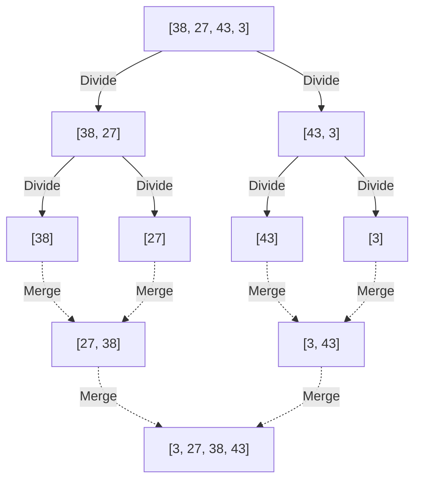
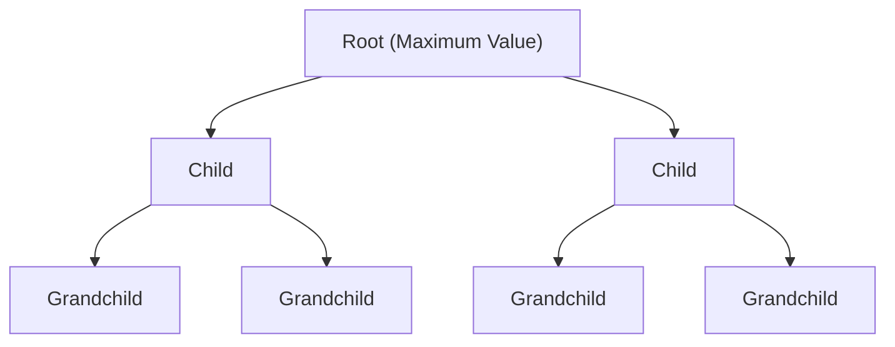

---

## 2. $O(n^2)$ Algorithms: Basics and Intuitive Approaches

The first to be introduced are a group of basic algorithms with a time complexity of $O(n^2)$. Although they are less practical for large-scale datasets, their implementation is intuitive and very simple, making them excellent educational materials for learning the basics of algorithms. In addition, when the data size is extremely small or for almost sorted data, they can sometimes operate faster than complex algorithms.

### 2.1 Bubble Sort

Bubble sort is one of the most famous and simplest sorting algorithms. It compares two adjacent elements and swaps them if they are in the wrong order, performing this operation up to the end of the array. This is repeated until the entire array is sorted. It is called bubble sort because, at the end of each pass, the largest (or smallest) element "bubbles up" to the end of the array.

#### Mechanism of Bubble Sort

1. Sequentially from the beginning of the array, compare adjacent elements (`arr[i]` and `arr[i+1]`).
2. If the left element is larger than the right element, swap both of them.
3. By repeating this to the end of the array, the maximum value of the array moves to the far right.
4. In the next pass, repeat again from 1, excluding the rightmost element.
5. It is determined that the array is completely sorted and finishes when no swaps occur at all.

#### Time/Space Complexity and Features

*   **Worst-case time complexity**: $O(n^2)$ (When the array is sorted in reverse order)
*   **Average time complexity**: $O(n^2)$
*   **Best-case time complexity**: $O(n)$ (When already sorted and using an optimization flag)
*   **Space complexity**: $O(1)$ (In-place)
*   **Stability**: Stable

Since it only swaps adjacent elements, elements with the same value never overtake each other, making it a stable algorithm.

#### Python Implementation Code

```python
def bubble_sort(arr):
    n = len(arr)
    # Execute n passes
    for i in range(n):
        # Flag for early termination
        swapped = False
        
        # Ignore the already sorted back part (i elements)
        for j in range(0, n - i - 1):
            # If the left element is greater than the right, swap
            if arr[j] > arr[j + 1]:
                arr[j], arr[j + 1] = arr[j + 1], arr[j]
                swapped = True
                
        # If no swaps occurred in this pass, sorting is already complete
        if not swapped:
            break
            
    return arr
```

#### Step-by-Step Trace

Let's look at the process of sorting the array `[5, 3, 8, 4, 2]` in ascending order using bubble sort.

*   **Pass 1**:
    *   Compare (5, 3) $\rightarrow$ Swap: `[3, 5, 8, 4, 2]`
    *   Compare (5, 8) $\rightarrow$ Keep: `[3, 5, 8, 4, 2]`
    *   Compare (8, 4) $\rightarrow$ Swap: `[3, 5, 4, 8, 2]`
    *   Compare (8, 2) $\rightarrow$ Swap: `[3, 5, 4, 2, 8]` (8 is fixed)
*   **Pass 2**:
    *   Compare (3, 5) $\rightarrow$ Keep: `[3, 5, 4, 2, 8]`
    *   Compare (5, 4) $\rightarrow$ Swap: `[3, 4, 5, 2, 8]`
    *   Compare (5, 2) $\rightarrow$ Swap: `[3, 4, 2, 5, 8]` (5 is fixed)
*   **Pass 3**:
    *   Compare (3, 4) $\rightarrow$ Keep: `[3, 4, 2, 5, 8]`
    *   Compare (4, 2) $\rightarrow$ Swap: `[3, 2, 4, 5, 8]` (4 is fixed)
*   **Pass 4**:
    *   Compare (3, 2) $\rightarrow$ Swap: `[2, 3, 4, 5, 8]` (3 is fixed, 2 is also automatically fixed)

### 2.2 Selection Sort

Selection sort is an algorithm that divides the array into a "sorted part" and an "unsorted part," searches for the smallest (or largest) element from the unsorted part, and swaps it with the first element of the unsorted part, repeating this operation.

#### Mechanism of Selection Sort

1. Initially, the entire array is the unsorted part.
2. Search for the smallest value in the unsorted part.
3. Swap that minimum value with the first element of the unsorted part.
4. By doing this, the first element is included in the sorted part, and the unsorted part decreases by 1.
5. Repeat this operation until there is no unsorted part.

#### Time/Space Complexity and Features

*   **Worst-case time complexity**: $O(n^2)$
*   **Average time complexity**: $O(n^2)$
*   **Best-case time complexity**: $O(n^2)$
*   **Space complexity**: $O(1)$ (In-place)
*   **Stability**: Unstable

Since selection sort always scans to the end to find the minimum value regardless of the data arrangement, it takes $O(n^2)$ even in the best case. Also, it is not stable because it swaps elements at distant positions.

#### Python Implementation Code

```python
def selection_sort(arr):
    n = len(arr)
    
    # Traverse the entire array
    for i in range(n):
        # Assume the current position is the index of the minimum value
        min_idx = i
        
        # Search for the true minimum value from the remaining unsorted part
        for j in range(i + 1, n):
            if arr[j] < arr[min_idx]:
                min_idx = j
                
        # Once the minimum value is found, swap it with the current position (i)
        arr[i], arr[min_idx] = arr[min_idx], arr[i]
        
    return arr
```

#### Step-by-Step Trace

Sort the array `[29, 10, 14, 37, 13]` using selection sort.

*   **i = 0**: Search for the minimum value `[29, 10, 14, 37, 13]` $\rightarrow$ The minimum value is 10. Swap 29 and 10.
    Result: `[10, 29, 14, 37, 13]` (10 is fixed)
*   **i = 1**: Search for the minimum value from the remaining `[29, 14, 37, 13]` $\rightarrow$ The minimum value is 13. Swap 29 and 13.
    Result: `[10, 13, 14, 37, 29]` (13 is fixed)
*   **i = 2**: Search for the minimum value from the remaining `[14, 37, 29]` $\rightarrow$ The minimum value is 14. Keep as is (self-swap).
    Result: `[10, 13, 14, 37, 29]` (14 is fixed)
*   **i = 3**: Search for the minimum value from the remaining `[37, 29]` $\rightarrow$ The minimum value is 29. Swap 37 and 29.
    Result: `[10, 13, 14, 29, 37]` (29 is fixed, 37 is also automatically fixed)

### 2.3 Insertion Sort

Insertion sort is an intuitive method we often use when holding playing cards in our hands and arranging them. It is an algorithm that takes one element from the unsorted part and inserts it into the correct position in the already sorted part.

#### Mechanism of Insertion Sort

1. Assume the first element of the array (index 0) is already sorted.
2. Take the next element (index 1) (let's call this `key`) and compare it in order from the back with the elements in the sorted part (left side).
3. If there is an element larger than `key`, shift that element one position to the right.
4. When the correct position to insert `key` is found, place `key` there.
5. Repeat this to the end of the array.

#### Time/Space Complexity and Features

*   **Worst-case time complexity**: $O(n^2)$ (When sorted in reverse order)
*   **Average time complexity**: $O(n^2)$
*   **Best-case time complexity**: $O(n)$ (When almost sorted)
*   **Space complexity**: $O(1)$ (In-place)
*   **Stability**: Stable

The greatest strength of insertion sort is that **when the data is already sorted (or close to it), it operates very quickly at a speed close to $O(n)$ because comparisons and movements are minimized**. This property is greatly utilized in hybrid algorithms like Timsort, which will be described later.

#### Python Implementation Code

```python
def insertion_sort(arr):
    # Start from index 1 (assume the 0th element is sorted)
    for i in range(1, len(arr)):
        key = arr[i]
        j = i - 1
        
        # Scan the sorted part from the back, and shift those greater than key to the right
        while j >= 0 and key < arr[j]:
            arr[j + 1] = arr[j]
            j -= 1
            
        # Insert key into the empty correct position
        arr[j + 1] = key
        
    return arr
```

#### Step-by-Step Trace

Sort the array `[12, 11, 13, 5, 6]` using insertion sort.

*   **i = 1 (key = 11)**: Compare with 12 on the left. Since 12 > 11, shift 12 to the right and insert 11 into the empty spot.
    Result: `[11, 12, 13, 5, 6]`
*   **i = 2 (key = 13)**: Compare with 12 on the left. Since 12 < 13, no shift is needed. Keep as is.
    Result: `[11, 12, 13, 5, 6]`
*   **i = 3 (key = 5)**: Compare with 13, 12, 11 in order, and since all are larger than 5, shift them all to the right. Insert 5 at the far left edge.
    Result: `[5, 11, 12, 13, 6]`
*   **i = 4 (key = 6)**: Compare with 13, 12, 11 in order and shift to the right. Since 5 < 6, insert 6 to the right of 5.
    Result: `[5, 6, 11, 12, 13]`

---

## 3. $O(n \log n)$ Algorithms: Divide and Conquer and Overwhelming Efficiency

As the amount of data $n$ increases, the calculation time of $O(n^2)$ algorithms explodes, making them impractical. This is where algorithms using advanced techniques such as **Divide and Conquer**, which recursively process divided arrays, come in. They achieve $O(n \log n)$, the theoretical limit for comparison-based sorting algorithms, and exhibit overwhelming performance for large-scale data.

### 3.1 Merge Sort

Merge sort is a beautiful and robust algorithm devised by John von Neumann in 1945. It is a representative example of "Divide and Conquer," taking an approach of dividing the array into halves, and halves again until there is one element, and then "merging" them while sorting.

#### Mechanism of Merge Sort

1. **Divide**: Divide the given array at the center into two sub-arrays. Recursively repeat this until the length of the sub-array becomes 1 (an array of length 1 can be considered to be in an already sorted state).
2. **Conquer and Combine**: Compare the first elements of the two sorted sub-arrays, and store the smaller one in a new array. Repeat this and merge until it becomes the original single array.



#### Time/Space Complexity and Features

*   **Worst/Average/Best time complexity**: All are $O(n \log n)$
    *   Since it always divides in half, the depth of division is $\log_2 n$. The merging process at each level takes $O(n)$ time in total, so multiplying them gives $O(n \log n)$. Because the complexity is constant regardless of the state of the data, it is very predictable and robust.
*   **Space complexity**: $O(n)$ (Out-of-place)
    *   The biggest weakness is that it requires a working array of the same size as the original array when merging.
*   **Stability**: Stable
    *   When the values are the same during merging, stability can be maintained by prioritizing taking the element from the left array.

#### Python Implementation Code

```python
def merge_sort(arr):
    # If the array length is 1 or less, return as already sorted
    if len(arr) <= 1:
        return arr
        
    # 1. Divide: Calculate the middle index
    mid = len(arr) // 2
    left_half = arr[:mid]
    right_half = arr[mid:]
    
    # Recursively sort the left and right
    left_sorted = merge_sort(left_half)
    right_sorted = merge_sort(right_half)
    
    # 2. Combine: Merge the sorted left and right arrays
    return merge(left_sorted, right_sorted)

def merge(left, right):
    result = []
    i = j = 0
    
    # While there are remaining elements in both arrays
    while i < len(left) and j < len(right):
        if left[i] <= right[j]:  # Use <= for stability
            result.append(left[i])
            i += 1
        else:
            result.append(right[j])
            j += 1
            
    # Add remaining elements
    result.extend(left[i:])
    result.extend(right[j:])
    
    return result
```

### 3.2 Quick Sort

Quick sort, devised by Tony Hoare, is, as the name suggests, an excellent algorithm that often operates the fastest in the real world. Like merge sort, it uses the divide and conquer method, but the approach is different. It proceeds with sorting by choosing a reference element (**pivot**) and distributing the elements into groups smaller and larger than the pivot.

#### Mechanism of Quick Sort

1. **Selection of pivot**: Choose one element from the array as the pivot (reference value).
2. **Partition**: Gather elements smaller than the pivot on the left side and elements larger than the pivot on the right side. When this operation is finished, the final sorted position of the pivot itself is determined.
3. **Recursive processing**: Recursively repeat the same processing for the array on the left side and the array on the right side of the pivot.

Performance changes greatly depending on how the pivot is selected and how it is partitioned (Hoare scheme, Lomuto scheme).

#### Time/Space Complexity and Features

*   **Worst-case time complexity**: $O(n^2)$
    *   This is a fatal weakness. If an edge element is always chosen as the pivot for an already sorted array, the array will continue to be partitioned biasedly into "1" and "all the rest", falling into the worst-case complexity. To avoid this, pivot selection tricks like "Median-of-three" (taking the median of the first, middle, and last elements) are essential.
*   **Average time complexity**: $O(n \log n)$
    *   Practically, the constant factor is very small, and the cache efficiency is extremely good, so it operates faster than merge sort or heap sort.
*   **Space complexity**: Average $O(\log n)$, Worst $O(n)$
    *   It is an In-place algorithm that directly rewrites the array itself, but it consumes the call stack for recursive calls.
*   **Stability**: Unstable
    *   Because elements far apart are swapped during the partition operation, it is not stable.

#### Python Implementation Code (Easy-to-understand List Comprehension Version)

This is not memory efficient, but it most straightforwardly expresses the intent of the algorithm.

```python
def quick_sort_simple(arr):
    if len(arr) <= 1:
        return arr
    
    # Select the middle element as the pivot
    pivot = arr[len(arr) // 2]
    
    # Partition into three lists: less than, equal to, and greater than the pivot
    left = [x for x in arr if x < pivot]
    middle = [x for x in arr if x == pivot]
    right = [x for x in arr if x > pivot]
    
    # Recursively combine
    return quick_sort_simple(left) + middle + quick_sort_simple(right)
```

#### Python Implementation Code (In-place Lomuto Partition Scheme Version)

This is an In-place implementation that uses no extra memory, as used in actual libraries.

```python
def quick_sort_inplace(arr, low, high):
    if low < high:
        # Perform partition and get the correct position of the pivot
        pi = partition(arr, low, high)
        
        # Recursively sort the left and right of the pivot
        quick_sort_inplace(arr, low, pi - 1)
        quick_sort_inplace(arr, pi + 1, high)

def partition(arr, low, high):
    # Select the last element as the pivot (Lomuto scheme)
    pivot = arr[high]
    
    # i points to the last index of the element smaller than the pivot
    i = low - 1
    
    for j in range(low, high):
        # If the current element is less than or equal to the pivot, advance i and swap
        if arr[j] <= pivot:
            i = i + 1
            arr[i], arr[j] = arr[j], arr[i]
            
    # Insert the pivot into the correct position (i+1)
    arr[i + 1], arr[high] = arr[high], arr[i + 1]
    
    return i + 1
```

### 3.3 Heap Sort

Heap sort is a sorting algorithm that skillfully uses a tree data structure called a **Binary Heap**. It has the characteristics of taking the best parts of merge sort and quick sort, being an In-place sort that does not use additional memory while having a worst-case time complexity of $O(n \log n)$.

#### Mechanism of Heap Sort

1. **Heap construction**: First, convert the given array into a "Max Heap". A Max Heap is a complete binary tree that satisfies the rule that the value of the parent node is always greater than or equal to the value of its child nodes. By using index calculations on the array (parent: $(i-1)/2$, left child: $2i+1$, right child: $2i+2$), the tree structure can be represented as an array.
2. **Extraction and reconstruction of the maximum value**: The maximum value always exists at the root of the Max Heap (the beginning of the array `arr[0]`). Swap this maximum value with the element at the end of the array. This determines the maximum value at the final position of the array.
3. Since the root has been rewritten, the condition of the heap breaks, so perform "Heapify" in the range excluding the end of the heap (the already determined part) to satisfy the condition of the Max Heap again.
4. By repeating this operation until there is one element, larger values are determined in order from the back of the array, and eventually sorted in ascending order.



#### Time/Space Complexity and Features

*   **Worst/Average/Best time complexity**: All are $O(n \log n)$
    *   Since building the heap takes $O(n)$ and extracting the maximum value and reconstructing ($O(\log n)$) is repeated $n$ times, the overall time is $O(n \log n)$. Because this complexity is guaranteed regardless of the data arrangement, it is useful in systems where avoiding the worst case is required.
*   **Space complexity**: $O(1)$ (In-place)
    *   Since the heap tree is represented exactly as it is on the array, no additional memory is required.
*   **Stability**: Unstable
    *   Because it swaps elements that are far apart during the heap construction and extraction process, it is not stable.

#### Python Implementation Code

```python
def heapify(arr, n, i):
    largest = i          # Assume root is the maximum value
    left = 2 * i + 1     # Left child
    right = 2 * i + 2    # Right child

    # If the left child is larger than the root
    if left < n and arr[left] > arr[largest]:
        largest = left

    # If the right child is larger than the current maximum value
    if right < n and arr[right] > arr[largest]:
        largest = right

    # If the root was not the maximum value, swap and recursively heapify
    if largest != i:
        arr[i], arr[largest] = arr[largest], arr[i]
        heapify(arr, n, largest)

def heap_sort(arr):
    n = len(arr)

    # 1. Build max heap (build bottom-up)
    # Heapify from the last non-leaf node to the root
    for i in range(n // 2 - 1, -1, -1):
        heapify(arr, n, i)

    # 2. Extract elements one by one and sort
    for i in range(n - 1, 0, -1):
        # Swap the current root (maximum value) with the end of the unsorted part
        arr[i], arr[0] = arr[0], arr[i]
        
        # Reconstruct for the new heap with reduced size
        heapify(arr, i, 0)
        
    return arr
```

---

## 4. $O(n)$ Non-Comparison Sorts: Transcending the Comparison Limit

All sorting algorithms we have seen so far are "comparison-based sorts" that determine the magnitude relationship between elements using comparison operators (`<`, `>`, `==`). It is mathematically proven that comparison-based sorts cannot be faster than $O(n \log n)$.

However, by effectively utilizing the properties of the data (e.g., being integers, having a fixed number of digits, having a narrow range) and using special algorithms that do not perform "comparisons" at all, ultra-high-speed sorting in linear time $O(n)$ becomes possible.

### 4.1 Counting Sort

Counting sort is an algorithm that calculates the correct position of elements by "counting" how many specific key values exist in the data. It is dramatically effective mainly when sorting a narrow range of integers from 0 to a specific maximum value $k$.

#### Time/Space Complexity
*   **Time complexity**: $O(n + k)$. It depends on the number of data $n$ and the value range $k$. If $k$ is comparable to $n$, it becomes $O(n)$, but if $k$ is very large (e.g., an array that only has 1 and 1 billion), it becomes significantly inefficient.
*   **Space complexity**: $O(n + k)$. Requires a counting array and an output array.

#### Python Implementation Image
```python
def counting_sort(arr):
    if not arr:
        return arr
        
    max_val = max(arr)
    # Initialize the counting array with zeros
    count = [0] * (max_val + 1)
    
    # 1. Count the occurrences of each element
    for num in arr:
        count[num] += 1
        
    # 2. Calculate the cumulative sum (to determine the final position of elements)
    for i in range(1, len(count)):
        count[i] += count[i - 1]
        
    # 3. Generate the output array (scan from the back to maintain stability)
    output = [0] * len(arr)
    for num in reversed(arr):
        output[count[num] - 1] = num
        count[num] -= 1
        
    return output
```

### 4.2 Radix Sort

Radix sort overcomes the weakness of counting sort, "unusable when the value range is wide." It completes the entire sorting by applying a stable sort (often using counting sort internally) starting from the lower digits (LSD: Least Significant Digit), like "ones place," "tens place," and "hundreds place." It is also applied to string sorting.

### 4.3 Bucket Sort

Bucket sort divides the possible range of data into "buckets" of equal size and throws each piece of data into the corresponding bucket. After that, it sorts individually inside each bucket (using insertion sort, etc.), and finally, it concatenates the contents of all buckets in order to complete. When the data is uniformly distributed in a specific range, it operates extremely fast at an average of $O(n)$.

---

## 5. Hybrid Algorithms Dominating the Modern Practical World

While academic textbooks often cover up to quick sort and merge sort, what is actually running behind modern programming languages are **hybrid algorithms** that combine the strengths of multiple algorithms.

### 5.1 Timsort (Default in Python)

Timsort is an algorithm implemented for Python by Tim Peters in 2002, and is now the champion of the practical world, adopted in many languages, such as Python's `list.sort()` and `sorted()`, Java's object arrays, and [Rust](https://kenji.blog/en/p/webassembly-wasm-current-future/)'s standard sort.

The greatest design philosophy of Timsort is based on the rule of thumb that **"real-world data is rarely completely random, and is often partially sorted (has continuous ascending or descending blocks)."**

#### Features of Timsort
*   **Fusion of Merge Sort and Insertion Sort**: Divides the array into chunks of a certain size (usually around 32 to 64 elements) and sorts each quickly with insertion sort. After that, they are merged in the manner of merge sort.
*   **Utilization of Runs**: Scans the array and detects parts that are continuously ascending (or descending) from the beginning (these are called "Runs"). In the case of descending order, they are reversed to ascending order, and these are utilized as units of merging.
*   **Adaptive Complexity**: While guaranteeing the worst case $O(n \log n)$ for completely random data, it produces an incredible speed of $O(n)$ in the best case for already sorted or partially sorted data.
*   **Stability**: It is a stable algorithm.

### 5.2 Introsort (C++ `std::sort`)

Introspective Sort (Introsort) is adopted in C++ STL's `std::sort` and .NET (C#)'s standard sort.

Quick sort is the fastest on average, but it had a fatal weakness of falling into a worst-case $O(n^2)$ depending on how the pivot was selected. Introsort is a hybrid method that completely overcomes this weakness.

#### Features of Introsort
1. Basically uses fast **quick sort** to partition the array.
2. However, it monitors the depth of recursion, and if the division depth exceeds a constant multiple of $\log_2 n$ (e.g., $2 \times \log_2 n$), it judges that "the pivot selection has failed, and it is falling into the worst-case complexity" (Introspection).
3. At that point, it switches the sorting method for that subarray to **heap sort**, which has a worst-case complexity of $O(n \log n)$.
4. In addition, when the number of elements becomes very small (e.g., 16 elements or less), it switches to **insertion sort** to avoid the overhead of function calls.

This achieves a flawless algorithm that maintains the overwhelming average speed of quick sort while guaranteeing $O(n \log n)$ even in the worst case.

---

## 6. Comprehensive Comparison Table Summary

The performances of the main sorting algorithms explained in this article are summarized in a table format.

| Algorithm | Best Time | Avg Time | Worst Time | Space | Stability | Method / Features |
| :--- | :--- | :--- | :--- | :--- | :--- | :--- |
| **Bubble Sort** | $O(n)$ | $O(n^2)$ | $O(n^2)$ | $O(1)$ | Yes | Swap. For education. Practicality is low. |
| **Selection Sort** | $O(n^2)$ | $O(n^2)$ | $O(n^2)$ | $O(1)$ | No | Selection. Always requires scanning the whole. |
| **Insertion Sort** | $O(n)$ | $O(n^2)$ | $O(n^2)$ | $O(1)$ | Yes | Insertion. Extremely strong for nearly sorted data. |
| **Merge Sort** | $O(n \log n)$ | $O(n \log n)$ | $O(n \log n)$ | $O(n)$ | Yes | Divide and conquer. Robust complexity but eats memory. |
| **Quick Sort** | $O(n \log n)$ | $O(n \log n)$ | $O(n^2)$ | $O(\log n)$ | No | Divide and conquer. Fastest on average but beware of worst cases. |
| **Heap Sort** | $O(n \log n)$ | $O(n \log n)$ | $O(n \log n)$ | $O(1)$ | No | Binary heap. Robust with In-place. |
| **Counting Sort** | $O(n+k)$ | $O(n+k)$ | $O(n+k)$ | $O(k)$ | Yes | Non-comparison. Strongest when the key range is narrow. |
| **Timsort** (Python standard etc.) | $O(n)$ | $O(n \log n)$ | $O(n \log n)$ | $O(n)$ | Yes | Hybrid. Adaptive and fastest for real data. |
| **Introsort** (C++ standard etc.) | $O(n \log n)$ | $O(n \log n)$ | $O(n \log n)$ | $O(\log n)$ | No | Hybrid. Balances the speed of Quick and the robustness of Heap. |

---

## 7. Conclusion: Which One Should I Use After All?

So far, we have explained many sorting algorithms, but in practical software development, there is a clear answer.

**"Basically, use the language's built-in standard sort function."**

It boils down to this. Python's `.sort()` and C++'s `std::sort` are implemented with advanced hybrid algorithms such as Timsort and Introsort introduced in this article, and have countless optimizations applied (improvement of memory cache efficiency, optimization of branch prediction, etc.). It is highly unlikely that your own quick sort will beat the speed of the standard library.

However, then why is it necessary to learn sorting algorithms?

1. **Understanding of basic concepts**: Concepts such as complexity (Big O Notation), In-place/Out-of-place, and stability are the foundations of all algorithm design and data structure design, not limited to sorting.
2. **Systems under special constraints**: In environments with extremely limited memory, such as embedded systems, you might need to implement your own heap sort with $O(1)$ space or an In-place quick sort.
3. **Utilizing the properties of data**: When sorting "1 million pieces of data whose values are restricted to the range of 1 to 100", implementing a counting sort ($O(n)$) will be overwhelmingly faster than using the standard Timsort ($O(n \log n)$).

By knowing the internal structures of algorithms, you can understand what the standard functions provided as black boxes are "good at" and "bad at", enabling you to perform more advanced and efficient system design.

By all means, try running the Python code in this article at hand, change the amount of data, or pass reverse-ordered data, and experience the behavior and execution time of each algorithm!
